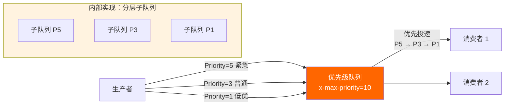
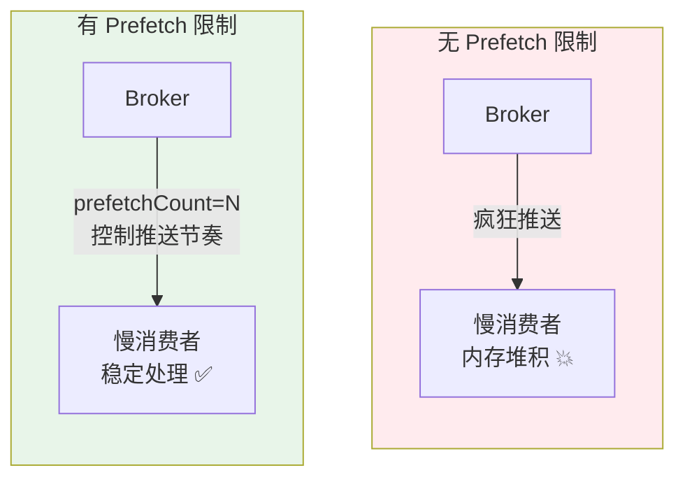
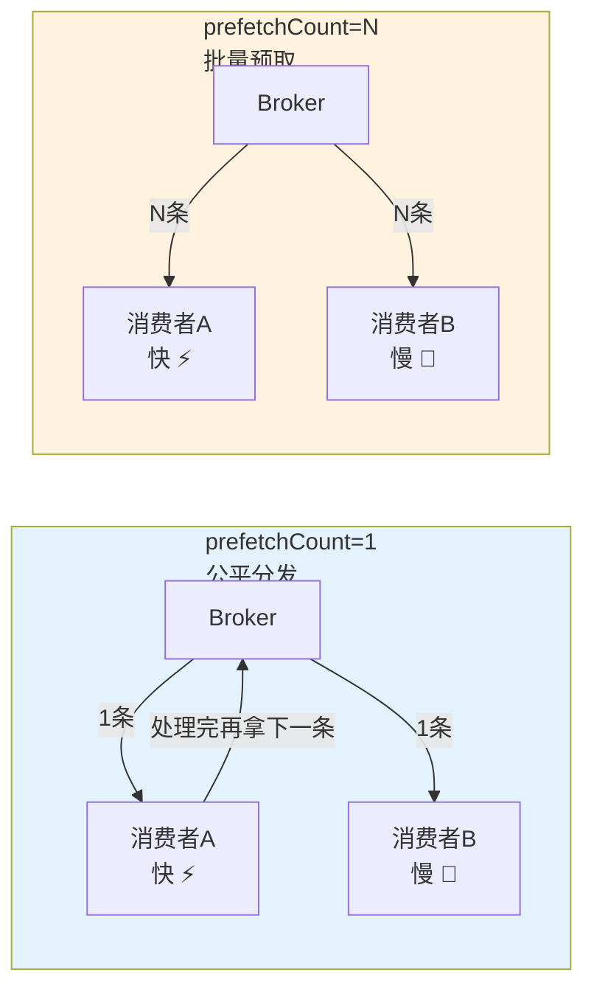
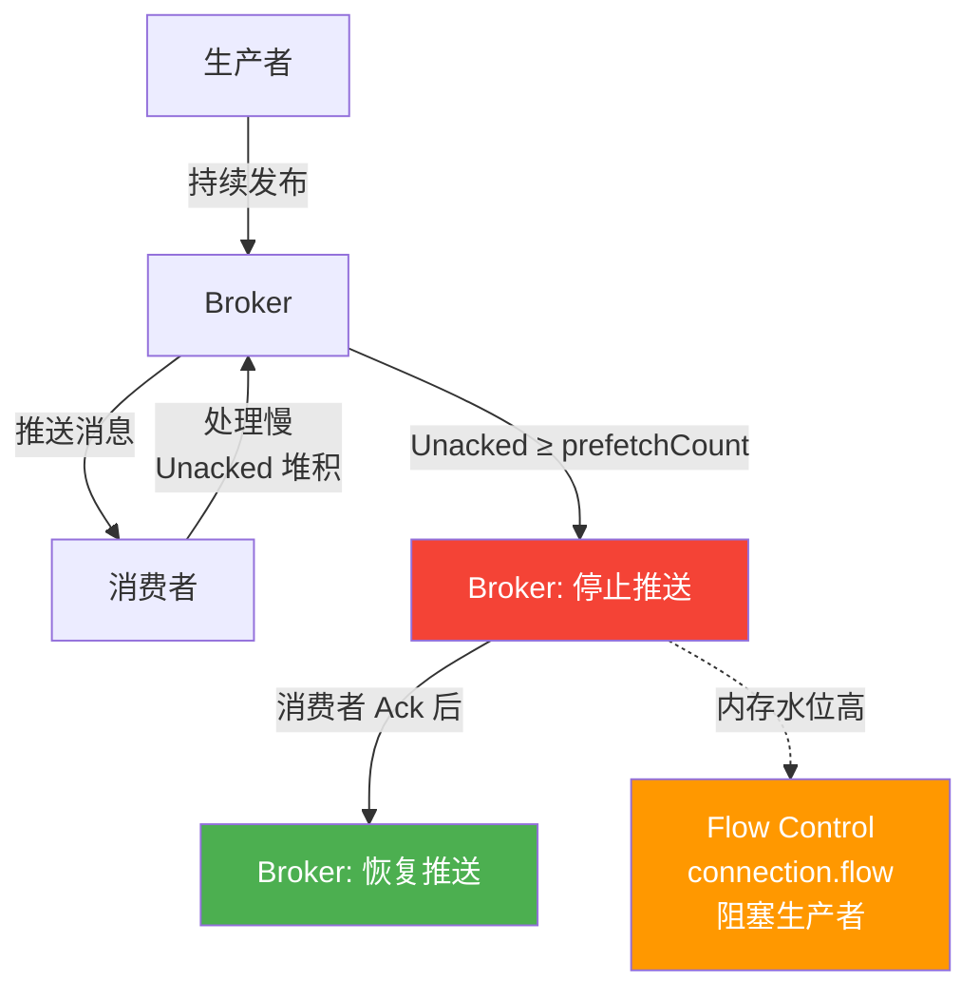

# 消息优先级与消费者限流

当消息的重要性不同、消费者的处理速度不一时，如何让紧急消息优先被消费？如何避免慢消费者拖垮整个系统？本章深入 RabbitMQ 的优先级队列与消费者限流机制。

## 1. 消息优先级

### 基本原理

RabbitMQ 支持优先级队列：队列声明时设置 `x-max-priority`，消息发布时设置 `Priority` 属性，高优先级消息优先被投递给消费者。



### 队列声明

```csharp
using RabbitMQ.Client;
using RabbitMQ.Client.Events;
using System.Text;
using System.Text.Json;

var factory = new ConnectionFactory { HostName = "localhost" };
using var connection = factory.CreateConnection();
using var channel = connection.CreateModel();

// 声明优先级队列 —— x-max-priority 设置最大优先级
channel.QueueDeclare("task.priority.queue",
    durable: true,
    exclusive: false,
    autoDelete: false,
    new Dictionary<string, object>
    {
        { "x-max-priority", 10 }  // 支持 0-10 级优先级
    });
```

::: warning x-max-priority 的值
- 取值范围 0-255，但**推荐 1-10**
- 值越大，内部子队列越多，内存和 CPU 开销越大
- 设置后不可修改，需删除队列重建
:::

### 生产者：发送带优先级的消息

```csharp
// 紧急任务
void PublishTask(IModel channel, string taskName, int priority)
{
    var msg = JsonSerializer.Serialize(new { TaskName = taskName, Priority = priority });
    var body = Encoding.UTF8.GetBytes(msg);

    var props = channel.CreateBasicProperties();
    props.DeliveryMode = 2;       // 持久化
    props.Priority = (byte)priority; // 设置优先级

    channel.BasicPublish("", "task.priority.queue", props, body);
    Console.WriteLine($"已发送: {taskName}, 优先级={priority}");
}

// 发送不同优先级的任务
PublishTask(channel, "数据导出", 1);      // 低优先级
PublishTask(channel, "邮件通知", 3);      // 普通优先级
PublishTask(channel, "支付回调", 10);     // 最高优先级
PublishTask(channel, "日志归档", 1);      // 低优先级
PublishTask(channel, "风控告警", 8);      // 高优先级
```

### 消费者：按优先级消费

```csharp
var consumer = new EventingBasicConsumer(channel);
consumer.Received += (model, ea) =>
{
    var json = Encoding.UTF8.GetString(ea.Body.ToArray());
    var task = JsonSerializer.Deserialize<TaskMessage>(json);
    Console.WriteLine($"处理任务: {task?.TaskName}, 优先级={ea.BasicProperties.Priority}");
    channel.BasicAck(ea.DeliveryTag, false);
};

channel.BasicConsume("task.priority.queue", false, consumer);

record TaskMessage(string TaskName, int Priority);
```

### 内部实现

优先级队列内部维护多个子队列（按优先级分层），消费时从最高优先级子队列开始取消息：

```
┌─────────────────────────────────────────┐
│          Priority Queue (x-max-priority=10)       │
│                                                     │
│  SubQueue[10] → [Msg-P10] [Msg-P10]               │  ← 先消费
│  SubQueue[9]  → [Msg-P9]                          │
│  SubQueue[8]  → [Msg-P8] [Msg-P8]                 │
│  ...                                               │
│  SubQueue[1]  → [Msg-P1] [Msg-P1] [Msg-P1]        │  ← 最后消费
│  SubQueue[0]  → (default, no priority set)         │
└─────────────────────────────────────────┘
```

::: important 性能开销
- 优先级队列的内存消耗 ≈ 普通队列 × (max-priority + 1)
- 入队/出队操作需要定位子队列，比普通队列慢
- **仅在确实需要优先级时使用**，不要"预防性"设置
:::

## 2. 消费者限流：QoS Prefetch

### 为什么需要限流？



如果不设置 Prefetch，RabbitMQ 会尽可能快地将所有消息推送给消费者。当消费者处理慢时，未确认的消息堆积在消费者内存中，最终导致 OOM。

### BasicQos 参数详解

```csharp
channel.BasicQos(
    prefetchSize: 0,     // 0 = 不限制消息体大小
    prefetchCount: 10,   // 最多 10 条未确认消息
    global: false        // false = 消费者级别；true = Channel 级别
);
```

| 参数 | 说明 |
|------|------|
| `prefetchSize` | 预取消息总大小（字节），0 表示不限制。**一般不用** |
| `prefetchCount` | 预取消息条数，最常用的参数 |
| `global` | `false`：每个消费者独立计数；`true`：整个 Channel 共享额度 |

### Prefetch 对吞吐量的影响



| prefetchCount | 效果 | 适用场景 |
|---------------|------|----------|
| **1** | 公平分发，轮流给消费者发，最慢消费者决定整体速度 | 消费者处理速度差异大，要求公平分配 |
| **10-50** | 平衡吞吐与公平，**推荐值** | 大多数生产场景 |
| **100+** | 高吞吐，消费者可能不均匀 | 消费者速度相近、追求极限吞吐 |
| **0** | 无限制，消息全推给消费者 | ❌ 生产环境不推荐 |

### .NET 完整示例

```csharp
using RabbitMQ.Client;
using RabbitMQ.Client.Events;
using System.Diagnostics;

var factory = new ConnectionFactory { HostName = "localhost" };
using var connection = factory.CreateConnection();
using var channel = connection.CreateModel();

channel.QueueDeclare("work.queue", durable: true, exclusive: false, autoDelete: false);

// 设置 QoS
channel.BasicQos(prefetchSize: 0, prefetchCount: 20, global: false);

var consumer = new EventingBasicConsumer(channel);
var sw = Stopwatch.StartNew();
int processed = 0;

consumer.Received += (model, ea) =>
{
    // 模拟处理耗时
    Thread.Sleep(Random.Shared.Next(50, 200));

    Interlocked.Increment(ref processed);
    if (processed % 100 == 0)
    {
        Console.WriteLine($"已处理 {processed} 条, 耗时 {sw.ElapsedMilliseconds}ms, " +
                          $"速率={processed * 1000.0 / sw.ElapsedMilliseconds:F1} msg/s");
    }

    channel.BasicAck(ea.DeliveryTag, false);
};

channel.BasicConsume("work.queue", false, consumer);
Console.WriteLine("消费者已启动，prefetchCount=20");
Console.ReadLine();
```

### global 参数：Channel 级 vs 消费者级

```csharp
// 场景：一个 Channel 上有 3 个消费者

// global=false（默认）：每个消费者各自最多 10 条未确认
channel.BasicQos(0, 10, false);
// 消费者A: 最多10条, 消费者B: 最多10条, 消费者C: 最多10条
// Channel 总共最多 30 条未确认

// global=true：整个 Channel 总共最多 10 条未确认
channel.BasicQos(0, 10, true);
// 消费者A+B+C 共享 10 条额度
```

::: tip 实践建议
- 绝大多数场景使用 `global=false`（默认值），让每个消费者独立控制
- `global=true` 在一个 Channel 多消费者时用于控制总流量，但实际使用较少
:::

## 3. 背压机制（Back-Pressure）

当消费者处理不过来时，RabbitMQ 会自动降速——这就是背压。



### Flow Control 流程

1. 消费者慢 → Unacked 消息堆积在 Broker 内存
2. Broker 内存达到 `vm_memory_high_watermark` → 向生产者发送 `connection.flow`（主动阻塞）
3. 生产者被阻塞，无法继续发布
4. 消费者逐渐 Ack → 内存回落 → Broker 解除生产者阻塞

### .NET 监听阻塞事件

```csharp
connection.ConnectionBlocked += (sender, e) =>
{
    Console.WriteLine($"⚠️ 连接被阻塞! 原因: {e.Reason}");
    // 停止发布，切换到缓存/降级模式
};

connection.ConnectionUnblocked += (sender, e) =>
{
    Console.WriteLine("✅ 连接解除阻塞，恢复发布");
    // 恢复发布
};
```

::: warning 生产者必须处理阻塞事件
如果生产者忽略 `ConnectionBlocked` 事件继续发布，.NET 客户端内部会缓冲消息，但最终可能抛出 `AlreadyClosedException`。正确的做法是监听阻塞事件，暂停发布逻辑。
:::

## 4. Prefetch 调优实战

### 调优公式

```
最优 prefetchCount ≈ 消费者处理速率 × 网络往返时延
```

例如：消费者处理速率 = 1000 msg/s，网络 RTT = 5ms，则 prefetchCount ≈ 1000 × 0.005 = 5。

### 不同场景推荐值

| 场景 | 推荐 prefetchCount | 理由 |
|------|-------------------|------|
| 轻量级消息（<1ms 处理） | 50-100 | 提高吞吐，减少网络往返 |
| 中等消息（10-100ms 处理） | 10-30 | 平衡吞吐与延迟 |
| 重度消息（>100ms 处理） | 1-5 | 防止堆积，保证公平 |
| 消费者速度差异大 | 1 | 公平分发，避免慢消费者独占 |
| 批量处理场景 | 50-200 | 批量拉取减少网络开销 |

### 压测对比

```csharp
// 简易压测工具
using var connection = factory.CreateConnection();

foreach (var prefetch in new[] { 1, 10, 50, 100 })
{
    using var ch = connection.CreateModel();
    ch.BasicQos(0, (ushort)prefetch, false);

    var sw = Stopwatch.StartNew();
    int count = 0;

    var c = new EventingBasicConsumer(ch);
    c.Received += (_, ea) =>
    {
        if (Interlocked.Increment(ref count) >= 10000)
        {
            sw.Stop();
            Console.WriteLine($"prefetch={prefetch}: " +
                $"{10000 * 1000.0 / sw.ElapsedMilliseconds:F0} msg/s");
        }
        ch.BasicAck(ea.DeliveryTag, false);
    };

    ch.BasicConsume("bench.queue", false, c);
    Thread.Sleep(15000); // 等待消费完
}
```

## 面试技巧

::: tip 高频考点
1. **"RabbitMQ 如何实现消息优先级？"** —— 队列声明 `x-max-priority`，消息设置 `Priority` 属性。内部通过分层子队列实现。注意推荐值 1-10，过大会增加开销。
2. **"prefetchCount 设多少合适？"** —— 看场景：一般 10-50；消费者速度差异大用 1（公平分发）；追求极限吞吐用 100+。关键是理解 prefetch=1 是公平但低效，prefetch=N 是高效但可能不均。
3. **"什么是背压？RabbitMQ 如何实现？"** —— 消费者处理慢 → Unacked 堆积 → Broker 内存升高 → Flow Control 阻塞生产者 → 消费者追上后恢复。面试时画出这个循环。
4. **"优先级队列有什么缺点？"** —— 内存开销大（子队列倍增）、入队出队变慢、x-max-priority 设定后不可修改、持久化消息的优先级恢复更慢。
5. **"global=true 和 global=false 的区别？"** —— `false` 每个消费者独立计数（常用），`true` 整个 Channel 共享额度。AMQP 规范中 global 的语义在不同客户端实现有差异。
:::

---

**参考资料**

- [RabbitMQ 官方文档 - Consumer Prefetch](https://www.rabbitmq.com/docs/consumer-prefetch)
- [RabbitMQ 官方文档 - Priority Queues](https://www.rabbitmq.com/docs/priority)
- [RabbitMQ 官方文档 - Flow Control](https://www.rabbitmq.com/docs/flow-control)
- 《RabbitMQ 实战指南》朱忠华 — 第 5 章消费者限流
- RabbitMQ in Depth (Alvaro Videla) — Chapter 5: Message Properties
