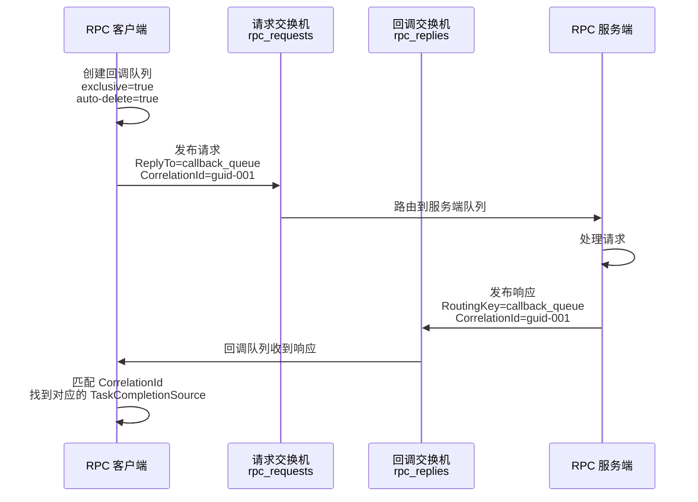
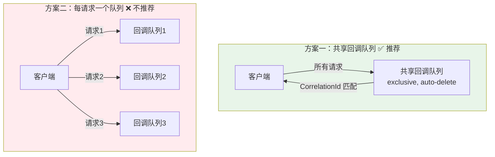

# RPC 模式实现

RabbitMQ 是异步消息中间件，但有时需要同步请求-响应模式（RPC）：客户端发送请求，等待服务端返回结果。通过 `ReplyTo` + `CorrelationId` 两个属性，RabbitMQ 可以优雅地实现 RPC。

## 1. RPC 原理

### 核心流程



### 关键属性

| 属性 | 说明 |
|------|------|
| `ReplyTo` | 客户端指定的回调队列名，服务端将响应发到此队列 |
| `CorrelationId` | 请求的唯一标识（GUID），用于匹配请求与响应 |

::: important 为什么需要 CorrelationId？
回调队列是共享的——一个连接上的所有 RPC 请求共用同一个回调队列。当多个请求并发时，响应会交错到达，必须用 CorrelationId 将响应与请求一一对应。
:::

## 2. .NET 实现：RPC 客户端

```csharp
using RabbitMQ.Client;
using RabbitMQ.Client.Events;
using System.Collections.Concurrent;
using System.Text;
using System.Text.Json;

public class RpcClient : IDisposable
{
    private readonly IConnection _connection;
    private readonly IModel _channel;
    private readonly string _replyQueueName;
    private readonly EventingBasicConsumer _consumer;
    private readonly ConcurrentDictionary<string, TaskCompletionSource<RpcResponse>> _pendingRequests = new();
    private readonly TimeSpan _timeout = TimeSpan.FromSeconds(30);

    public RpcClient()
    {
        var factory = new ConnectionFactory { HostName = "localhost" };
        _connection = factory.CreateConnection();
        _channel = _connection.CreateModel();

        // 声明回调队列 —— exclusive + auto-delete，连接关闭后自动删除
        _replyQueueName = _channel.QueueDeclare(
            queue: "",
            durable: false,
            exclusive: true,
            autoDelete: true
        ).QueueName;

        // 消费回调队列
        _consumer = new EventingBasicConsumer(_channel);
        _consumer.Received += (model, ea) =>
        {
            var correlationId = ea.BasicProperties.CorrelationId;
            if (correlationId != null && _pendingRequests.TryRemove(correlationId, out var tcs))
            {
                var response = JsonSerializer.Deserialize<RpcResponse>(
                    Encoding.UTF8.GetString(ea.Body.ToArray()));

                if (ea.BasicProperties.Headers?.ContainsKey("error") == true)
                {
                    tcs.SetException(new RpcException(response?.ErrorMessage ?? "Unknown error"));
                }
                else
                {
                    tcs.SetResult(response!);
                }
            }
        };

        _channel.BasicConsume(_replyQueueName, true, _consumer);
    }

    public async Task<RpcResponse> CallAsync(RpcRequest request, CancellationToken cancellationToken = default)
    {
        var correlationId = Guid.NewGuid().ToString();
        var tcs = new TaskCompletionSource<RpcResponse>();

        using var cts = CancellationTokenSource.CreateLinkedTokenSource(cancellationToken);
        cts.CancelAfter(_timeout);

        cts.Token.Register(() =>
        {
            _pendingRequests.TryRemove(correlationId, out _);
            tcs.TrySetException(new TimeoutException($"RPC 请求超时 ({_timeout.TotalSeconds}s)"));
        });

        _pendingRequests[correlationId] = tcs;

        var props = _channel.CreateBasicProperties();
        props.CorrelationId = correlationId;
        props.ReplyTo = _replyQueueName;
        props.ContentType = "application/json";

        var body = Encoding.UTF8.GetBytes(JsonSerializer.Serialize(request));
        _channel.BasicPublish("", "rpc_queue", props, body);

        return await tcs.Task;
    }

    public void Dispose()
    {
        _channel?.Dispose();
        _connection?.Dispose();
    }
}

public record RpcRequest(string Method, string Payload);
public record RpcResponse(bool Success, string Result, string? ErrorMessage);
public class RpcException : Exception
{
    public RpcException(string message) : base(message) { }
}
```

## 3. .NET 实现：RPC 服务端

```csharp
using RabbitMQ.Client;
using RabbitMQ.Client.Events;
using System.Text;
using System.Text.Json;

public class RpcServer : IDisposable
{
    private readonly IConnection _connection;
    private readonly IModel _channel;

    public RpcServer()
    {
        var factory = new ConnectionFactory { HostName = "localhost" };
        _connection = factory.CreateConnection();
        _channel = _connection.CreateModel();

        // 声明请求队列
        _channel.QueueDeclare("rpc_queue", durable: false, exclusive: false, autoDelete: false);

        // 设置 QoS —— 同时只处理 1 条请求，避免过载
        _channel.BasicQos(0, 1, false);
    }

    public void Start()
    {
        var consumer = new EventingBasicConsumer(_channel);
        consumer.Received += (model, ea) =>
        {
            var request = JsonSerializer.Deserialize<RpcRequest>(
                Encoding.UTF8.GetString(ea.Body.ToArray()));

            Console.WriteLine($"收到 RPC 请求: {request?.Method}");

            RpcResponse response;
            try
            {
                response = HandleRequest(request!);
            }
            catch (Exception ex)
            {
                response = new RpcResponse(false, "", ex.Message);
            }

            // 构建响应属性
            var replyProps = _channel.CreateBasicProperties();
            replyProps.CorrelationId = ea.BasicProperties.CorrelationId;
            replyProps.ContentType = "application/json";

            if (!response.Success)
            {
                replyProps.Headers = new Dictionary<string, object> { { "error", true } };
            }

            var responseBytes = Encoding.UTF8.GetBytes(JsonSerializer.Serialize(response));

            // 发布响应到 ReplyTo 指定的回调队列
            _channel.BasicPublish(
                exchange: "",
                routingKey: ea.BasicProperties.ReplyTo,
                basicProperties: replyProps,
                body: responseBytes);

            // 确认请求消息
            _channel.BasicAck(ea.DeliveryTag, false);
        };

        _channel.BasicConsume("rpc_queue", false, consumer);
        Console.WriteLine("RPC 服务端已启动，等待请求...");
    }

    private RpcResponse HandleRequest(RpcRequest request)
    {
        return request.Method switch
        {
            "GetUserInfo" => new RpcResponse(true,
                JsonSerializer.Serialize(new { UserId = "U001", Name = "张三" }), null),
            "Calculate" => new RpcResponse(true,
                JsonSerializer.Serialize(new { Result = 42 }), null),
            _ => throw new NotSupportedException($"不支持的方法: {request.Method}")
        };
    }

    public void Dispose()
    {
        _channel?.Dispose();
        _connection?.Dispose();
    }
}
```

## 4. 完整调用示例

```csharp
// 服务端
using var server = new RpcServer();
server.Start();

// 客户端
using var client = new RpcClient();

// 同步调用
var response = await client.CallAsync(new RpcRequest("GetUserInfo", "U001"));
Console.WriteLine($"结果: {response.Result}");

// 带超时取消
var cts = new CancellationTokenSource(TimeSpan.FromSeconds(5));
try
{
    var result = await client.CallAsync(new RpcRequest("SlowMethod", ""), cts.Token);
}
catch (TimeoutException)
{
    Console.WriteLine("请求超时");
}
```

## 5. 一个回调队列 vs 每请求一个队列



| 方案 | 连接数 | 队列数 | 资源消耗 |
|------|--------|--------|----------|
| 共享回调队列 + CorrelationId | 1 | 1 | 低 |
| 每请求独立回调队列 | 1 | N（请求数） | 高，队列创建/销毁开销大 |

::: tip 始终使用共享回调队列
一个连接只需一个回调队列，通过 CorrelationId 区分不同请求的响应。这是 RabbitMQ 官方教程推荐的模式。
:::

## 6. 生产级考量

### 超时处理

```csharp
// 客户端必须设置超时，防止服务端无响应时永久等待
public async Task<RpcResponse> CallAsync(RpcRequest request, TimeSpan? timeout = null)
{
    var effectiveTimeout = timeout ?? _timeout;
    var correlationId = Guid.NewGuid().ToString();
    var tcs = new TaskCompletionSource<RpcResponse>();

    using var cts = new CancellationTokenSource(effectiveTimeout);
    cts.Token.Register(() =>
    {
        _pendingRequests.TryRemove(correlationId, out _);
        tcs.TrySetException(new TimeoutException(
            $"RPC 调用超时: {request.Method}, 耗时>{effectiveTimeout.TotalSeconds}s"));
    });

    // ... 发布请求 ...
    return await tcs.Task;
}
```

### 错误传播

服务端异常需要序列化传回客户端：

```csharp
// 服务端：捕获异常并返回错误响应
catch (ArgumentException ex)
{
    return new RpcResponse(false, "", $"ARGUMENT_ERROR: {ex.Message}");
}
catch (Exception ex)
{
    return new RpcResponse(false, "", $"INTERNAL_ERROR: {ex.Message}");
}
```

### 幂等性

RPC 请求可能因超时重试而被服务端执行多次：

```csharp
// 服务端：使用请求 ID 实现幂等
private readonly ConcurrentDictionary<string, RpcResponse> _cache = new();

private RpcResponse HandleIdempotent(RpcRequest request, string requestId)
{
    return _cache.GetOrAdd(requestId, _ => HandleRequest(request));
}
```

::: warning RPC 的局限性
- **超时重试可能导致重复执行**：客户端超时后重试，但服务端可能已处理
- **不适合长时间操作**：占用回调队列资源，容易超时
- **不适合高并发**：每个请求需要等待响应，不如异步消息高效
- **服务端不可用则整体失败**：不像异步消息可以等服务端恢复后处理

考虑使用异步消息 + 状态查询代替同步 RPC。
:::

## 面试技巧

::: tip 高频考点
1. **"RabbitMQ 如何实现 RPC？"** —— 画时序图：客户端创建回调队列 → 发布请求（ReplyTo + CorrelationId）→ 服务端处理 → 响应到 ReplyTo → 客户端 CorrelationId 匹配。这是必考题。
2. **"CorrelationId 的作用是什么？"** —— 一个连接共享一个回调队列，多个并发请求的响应会交错到达，CorrelationId 用于将响应匹配到正确的请求。面试官想考察你是否理解并发场景。
3. **"回调队列为什么用 exclusive + auto-delete？"** —— 连接断开后自动清理，避免队列残留。回调队列是临时的，不需要持久存在。
4. **"RPC 和异步消息怎么选？"** —— 需要同步等待结果用 RPC；可以异步处理用消息。RPC 的局限：超时重试可能重复、长时间操作不适用、服务端不可用则失败。
5. **"如何保证 RPC 的幂等性？"** —— 请求携带唯一 ID（MessageId 或自定义头），服务端缓存已处理的请求 ID，重复请求直接返回缓存结果。
:::

---

**参考资料**

- [RabbitMQ 官方教程 - RPC](https://www.rabbitmq.com/tutorials/tutorial-six-dotnet)
- [RabbitMQ 官方文档 - Consumer Acknowledgements](https://www.rabbitmq.com/docs/confirms)
- 《RabbitMQ 实战指南》朱忠华 — 第 5 章 RPC 模式
- RabbitMQ in Depth (Alvaro Videla) — Chapter 5: Message Properties and Delivery Modes
