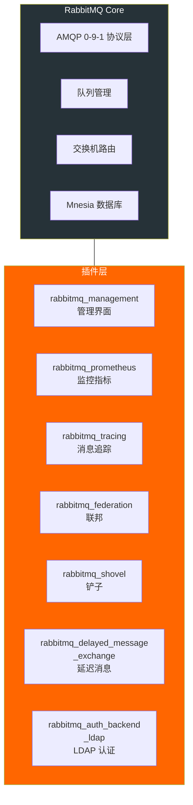
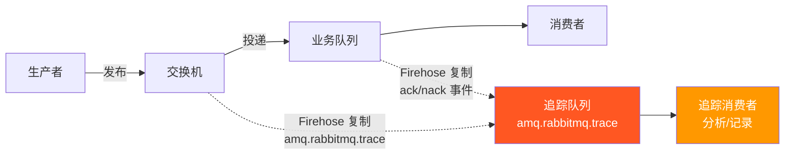
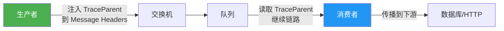

# 消息追踪与插件体系

消息丢了去哪找？消费顺序对不对？延迟发生在哪个环节？在生产环境中，消息追踪能力直接影响排障效率。RabbitMQ 的插件体系提供了从 Firehose 全量追踪到分布式链路追踪的多层方案。

## 1. RabbitMQ 插件体系

### 插件架构

RabbitMQ 基于 Erlang OTP 应用模型，每个插件是一个独立的 Erlang Application，可热插拔：



### 插件管理命令

```bash
# 列出所有插件
rabbitmq-plugins list

# 启用插件（及其依赖）
rabbitmq-plugins enable rabbitmq_management

# 禁用插件
rabbitmq-plugins disable rabbitmq_tracing

# 查看插件状态
rabbitmq-plugins list -e    # 只显示已启用的
rabbitmq-plugins list -E    # 显示显式启用的（非依赖启用）
```

### 插件目录结构

```
/usr/lib/rabbitmq/plugins/
├── rabbitmq_management-3.13.x.ez
├── rabbitmq_prometheus-3.13.x.ez
├── rabbitmq_tracing-3.13.x.ez
├── rabbitmq_federation-3.13.x.ez
├── rabbitmq_shovel-3.13.x.ez
└── rabbitmq_delayed_message_exchange-3.13.x.ez  # 社区插件
```

::: tip 插件启用的持久化
`rabbitmq-plugins enable` 的结果写入 `/etc/rabbitmq/enabled_plugins` 文件，节点重启后自动加载。无需每次手动启用。
:::

## 2. 核心插件一览

| 插件 | 用途 | 生产环境 |
|------|------|----------|
| `rabbitmq_management` | Web 管理界面 + REST API | ✅ 推荐 |
| `rabbitmq_prometheus` | Prometheus 指标端点 | ✅ 必须 |
| `rabbitmq_tracing` | 消息追踪日志 | ❌ 仅调试 |
| `rabbitmq_federation` | 跨 Broker 交换机/队列联邦 | 按需 |
| `rabbitmq_shovel` | 单向消息转发 | 按需 |
| `rabbitmq_consistent_hash_exchange` | 一致性哈希交换机 | 按需 |
| `rabbitmq_delayed_message_exchange` | 延迟消息交换机 | 按需 |
| `rabbitmq_auth_backend_ldap` | LDAP 认证 | 按需 |

## 3. Firehose：全量消息追踪

### 原理

Firehose（消防栓）将经过 RabbitMQ 的**所有消息**复制一份到追踪队列，包括发布和确认事件：



### 启用 Firehose

```bash
# 在指定 vhost 启用 Firehose
rabbitmqctl trace_on -p /my_vhost

# 关闭
rabbitmqctl trace_off -p /my_vhost
```

启用后，RabbitMQ 自动创建 `amq.rabbitmq.trace` topic 交换机，消息被复制到该交换机：

- **publish 事件**：Routing Key = `publish.{exchange_name}`
- **deliver 事件**：Routing Key = `deliver.{queue_name}`

### 消费追踪消息

```csharp
using RabbitMQ.Client;
using RabbitMQ.Client.Events;
using System.Text;
using System.Text.Json;

var factory = new ConnectionFactory { HostName = "localhost" };
using var connection = factory.CreateConnection();
using var channel = connection.CreateModel();

// 声明追踪队列，绑定到 Firehose 交换机
channel.QueueDeclare("my.trace.queue", durable: true, exclusive: false, autoDelete: false);
channel.QueueBind("my.trace.queue", "amq.rabbitmq.trace", "publish.#"); // 捕获所有发布事件
channel.QueueBind("my.trace.queue", "amq.rabbitmq.trace", "deliver.#"); // 捕获所有投递事件

var consumer = new EventingBasicConsumer(channel);
consumer.Received += (model, ea) =>
{
    var routingKey = ea.RoutingKey;  // publish.order.exchange 或 deliver.order.queue
    var exchange = ea.BasicProperties.Headers?["exchange_name"] as byte[];
    var routingKeys = ea.BasicProperties.Headers?["routing_keys"] as List<object>;

    Console.WriteLine($"[Trace] {routingKey}");
    Console.WriteLine($"  消息体: {Encoding.UTF8.GetString(ea.Body.ToArray())}");
    Console.WriteLine($"  交换机: {exchange != null ? Encoding.UTF8.GetString(exchange) : "N/A"}");

    channel.BasicAck(ea.DeliveryTag, false);
};

channel.BasicConsume("my.trace.queue", false, consumer);
Console.WriteLine("追踪消费者已启动");
Console.ReadLine();
```

::: warning Firehose 的性能影响
Firehose 将**每一条消息**复制一份，吞吐量直接减半，内存和磁盘使用翻倍。**绝不在生产环境使用**，仅限开发/测试环境临时排查。
:::

## 4. rabbitmq_tracing：结构化追踪日志

相比 Firehose 的原始消息复制，`rabbitmq_tracing` 插件提供更结构化的追踪方式——将消息写入日志文件：

```bash
# 启用插件
rabbitmq-plugins enable rabbitmq_tracing

# 在 Management UI 中配置追踪
# Admin → Tracing → Add a trace
# 或通过 REST API：
curl -u guest:guest -X POST http://localhost:15672/api/traces/%2f \
  -H "content-type: application/json" \
  -d '{"name":"my-trace","vhost":"/","format":"text","pattern":"#"}'
```

追踪日志输出示例：

```
2014-07-25 10:21:52: Message published
  Exchange:    order.exchange
  Routing Key: order.created
  Properties:  {content_type, <<"application/json">>, delivery_mode, 2}
  Payload:
  {"orderId":"ORD-001","amount":299.00}
```

| 参数 | 说明 |
|------|------|
| `format` | `text`（可读）或 `json`（结构化） |
| `pattern` | 匹配模式，`#` 表示全部 |
| `vhost` | 追踪的虚拟主机 |

## 5. 自定义插件基础

RabbitMQ 插件是 Erlang Application，开发流程：

```
1. 创建 Erlang 项目（rebar3）
2. 实现 rabbit_plugin 行为
3. 注册钩子（hook）或扩展点
4. 编译为 .ez 包
5. 放入 plugins 目录并启用
```

典型钩子：

| 钩子 | 触发时机 |
|------|----------|
| `basic.publish` | 消息发布时 |
| `basic.deliver` | 消息投递时 |
| `queue.basic.consume` | 消费者订阅时 |
| `channel.open` | Channel 创建时 |

::: important 自定义插件门槛较高
需要 Erlang 编程能力，建议优先使用现有插件或应用层方案（如 Header 注入）。仅在有特殊需求（如自定义认证、消息审计）时开发。
:::

## 6. 应用层追踪：Header 注入

在生产环境中，更实用的方案是在应用层注入追踪上下文：



### .NET 实现：W3C TraceContext 注入

```csharp
using RabbitMQ.Client;
using RabbitMQ.Client.Events;
using System.Diagnostics;
using System.Text;
using System.Text.Json;

// ==================== 生产者：注入追踪上下文 ====================
void PublishWithTrace(IModel channel, string exchange, string routingKey, byte[] body)
{
    var props = channel.CreateBasicProperties();
    props.DeliveryMode = 2;
    props.Headers = new Dictionary<string, object>();

    // 注入 W3C TraceContext
    using var activity = DiagnosticsConfig.ActivitySource.StartActivity("rabbitmq.publish", ActivityKind.Producer);
    if (activity != null)
    {
        // W3C TraceParent 格式：version-traceId-parentId-traceFlags
        props.Headers["traceparent"] = activity.Id!;
        if (activity.TraceStateString != null)
        {
            props.Headers["tracestate"] = activity.TraceStateString;
        }
        props.MessageId = Guid.NewGuid().ToString(); // 消息唯一 ID
    }

    channel.BasicPublish(exchange, routingKey, props, body);
}

// ==================== 消费者：提取追踪上下文 ====================
var consumer = new EventingBasicConsumer(channel);
consumer.Received += (model, ea) =>
{
    // 提取 TraceParent
    var traceParent = ea.BasicProperties.Headers?.ContainsKey("traceparent") == true
        ? Encoding.UTF8.GetString(ea.BasicProperties.Headers["traceparent"] as byte[] ?? Array.Empty<byte>())
        : null;

    // 恢复追踪上下文
    var parentContext = traceParent != null
        ? ActivityContext.Parse(traceParent, null)
        : default;

    using var activity = DiagnosticsConfig.ActivitySource.StartActivity(
        "rabbitmq.consume", ActivityKind.Consumer, parentContext);

    activity?.SetTag("messaging.destination", ea.RoutingKey);
    activity?.SetTag("messaging.message_id", ea.BasicProperties.MessageId);

    // 处理消息...
    Console.WriteLine($"处理消息, TraceId={activity?.TraceId}");

    channel.BasicAck(ea.DeliveryTag, false);
};

// ==================== OpenTelemetry 配置 ====================
static class DiagnosticsConfig
{
    public const string ActivitySourceName = "MyApp.RabbitMQ";
    public static readonly ActivitySource ActivitySource = new(ActivitySourceName);
}

// Program.cs 中配置 OpenTelemetry
// builder.Services.AddOpenTelemetry()
//     .WithTracing(tracing => tracing
//         .AddSource(DiagnosticsConfig.ActivitySourceName)
//         .AddOtlpExporter(opt => opt.Endpoint = new Uri("http://otel-collector:4317")));
```

### .NET OpenTelemetry 完整集成

```csharp
// Program.cs
var builder = WebApplication.CreateBuilder(args);

builder.Services.AddOpenTelemetry()
    .WithTracing(tracing =>
    {
        tracing
            .SetResourceBuilder(ResourceBuilder.CreateDefault().AddService("OrderService"))
            .AddSource(DiagnosticsConfig.ActivitySourceName)
            .AddAspNetCoreInstrumentation()
            .AddHttpClientInstrumentation()
            .AddOtlpExporter(opt =>
            {
                opt.Endpoint = new Uri(builder.Configuration["OpenTelemetry:OtlpEndpoint"]
                    ?? "http://localhost:4317");
            });
    });

builder.Services.AddHostedService<OrderConsumer>();
var app = builder.Build();
app.Run();

// OrderConsumer.cs
public class OrderConsumer : BackgroundService
{
    private readonly ActivitySource _activitySource = DiagnosticsConfig.ActivitySource;
    private IConnection? _connection;
    private IModel? _channel;

    protected override Task ExecuteAsync(CancellationToken stoppingToken)
    {
        var factory = new ConnectionFactory { HostName = "localhost" };
        _connection = factory.CreateConnection();
        _channel = _connection.CreateModel();
        _channel.BasicQos(0, 10, false);

        var consumer = new EventingBasicConsumer(_channel);
        consumer.Received += (model, ea) =>
        {
            var traceParent = ExtractTraceParent(ea);
            var parentContext = ActivityContext.Parse(traceParent ?? "", null);
            using var activity = _activitySource.StartActivity("process.order", ActivityKind.Consumer, parentContext);

            try
            {
                // 业务处理
                var orderJson = Encoding.UTF8.GetString(ea.Body.ToArray());
                activity?.SetTag("order.id", JsonSerializer.Deserialize<JsonElement>(orderJson).GetProperty("orderId").GetString());
                _channel.BasicAck(ea.DeliveryTag, false);
            }
            catch (Exception ex)
            {
                activity?.SetStatus(ActivityStatusCode.Error, ex.Message);
                _channel.BasicNack(ea.DeliveryTag, false, true);
            }
        };

        _channel.BasicConsume("order.queue", false, consumer);
        return Task.CompletedTask;
    }

    private string? ExtractTraceParent(BasicDeliverEventArgs ea)
    {
        if (ea.BasicProperties.Headers?.TryGetValue("traceparent", out var value) == true)
        {
            return Encoding.UTF8.GetString(value as byte[] ?? Array.Empty<byte>());
        }
        return null;
    }

    public override void Dispose()
    {
        _channel?.Dispose();
        _connection?.Dispose();
        base.Dispose();
    }
}
```

## 7. 调试消息流的实用技巧

| 技巧 | 命令/方法 | 适用场景 |
|------|----------|----------|
| 查看队列消息数 | `rabbitmqctl list_queues name messages` | 快速定位积压 |
| 查看连接详情 | `rabbitmqctl list_connections` | 连接泄漏排查 |
| 查看消费者列表 | `rabbitmqctl list_consumers` | 确认消费注册 |
| Management UI | http://localhost:15672 | 可视化排查 |
| Firehose | `rabbitmqctl trace_on` | 开发环境全量追踪 |
| Message ID | `props.MessageId` | 业务链路追踪 |
| Header 注入 | 自定义 Headers | 生产环境链路追踪 |
| OpenTelemetry | Activity + OTLP Exporter | 分布式全链路追踪 |

::: important 生产环境追踪策略
1. **必须做**：Message ID + 自定义 Header（成本极低，信息够用）
2. **推荐做**：OpenTelemetry 集成（统一可观测性）
3. **不要做**：Firehose / rabbitmq_tracing（性能影响太大）
4. **紧急排查**：临时开 Firehose，用完立即关闭
:::

## 面试技巧

::: tip 高频考点
1. **"消息丢了怎么排查？"** —— 分层排查：先查生产者（是否 confirm 成功）→ 再查队列（是否持久化、是否有消费者）→ 最后查消费者（是否 ack、是否有异常）。如果有追踪，看消息在哪个环节消失。
2. **"Firehose 是什么？生产环境能用吗？"** —— 全量消息复制到追踪队列。**绝对不能在生产用**，吞吐量减半。仅限开发/测试环境临时排查。
3. **"如何在消息中传递追踪信息？"** —— 在 Message Headers 中注入 W3C TraceParent，消费者提取后恢复追踪上下文。这是 OpenTelemetry 的标准做法。
4. **"RabbitMQ 的插件机制是什么？"** —— 基于 Erlang OTP Application，支持热插拔。核心插件随 RabbitMQ 发布，社区插件放入 plugins 目录手动启用。
5. **"rabbitmq_tracing 和 Firehose 的区别？"** —— Firehose 复制原始消息到队列，需自己消费；tracing 插件将格式化日志写入文件，更易读。两者都有性能开销，不适合生产环境。
:::

---

**参考资料**

- [RabbitMQ 官方文档 - Firehose Tracer](https://www.rabbitmq.com/docs/firehose)
- [RabbitMQ 官方文档 - Plugins](https://www.rabbitmq.com/docs/plugins)
- [RabbitMQ 官方文档 - rabbitmq_tracing](https://www.rabbitmq.com/docs/tracing)
- [W3C Trace Context 规范](https://www.w3.org/TR/trace-context/)
- [OpenTelemetry .NET](https://opentelemetry.io/docs/instrumentation/net/)
- 《RabbitMQ 实战指南》朱忠华 — 第 5 章消息追踪
