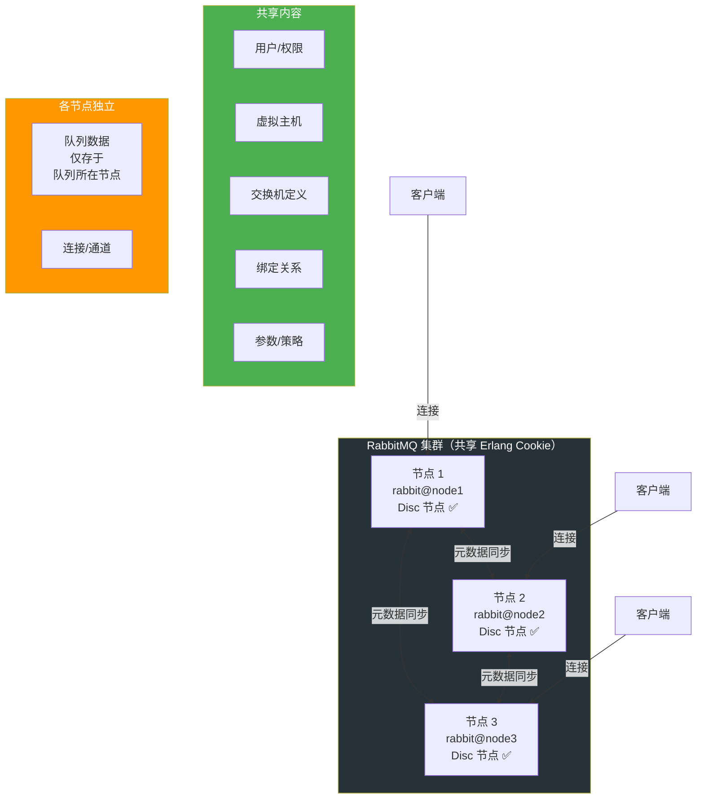
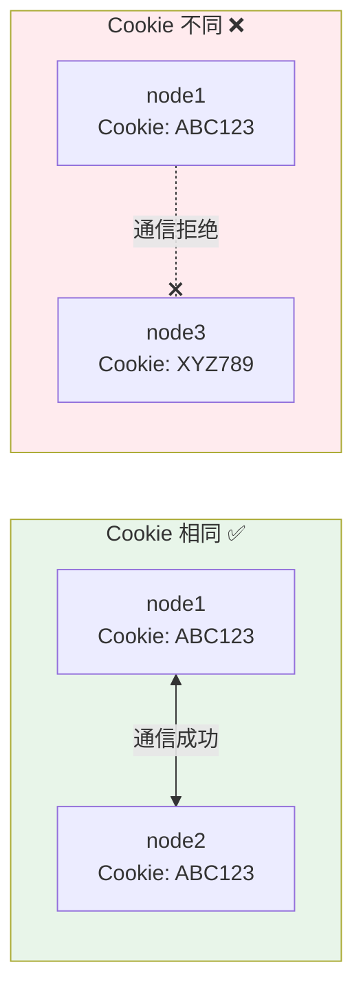
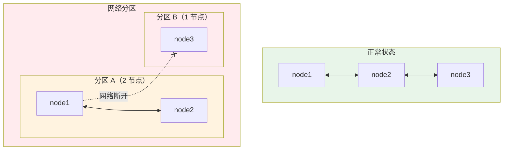
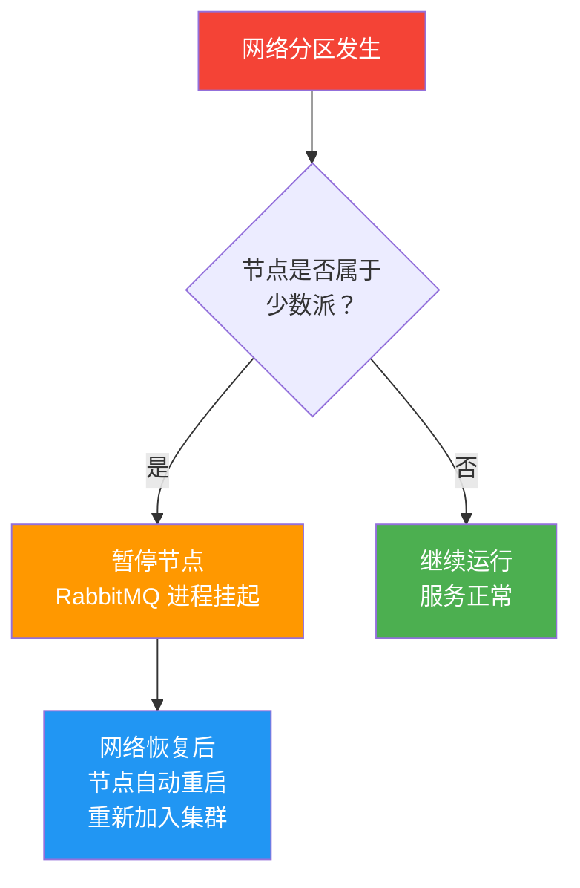
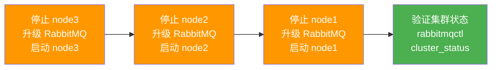

# 集群架构详解

单节点 RabbitMQ 无法满足高可用和水平扩展需求。RabbitMQ 集群通过 Erlang 分布式机制将多个节点组成一个逻辑 Broker，实现元数据共享和客户端透明访问。

## 1. 集群核心概念

### 什么是 RabbitMQ 集群？



### 关键认知：队列不复制！

::: warning 最常见的误解
RabbitMQ 集群**不会**在节点间复制队列数据。每个队列只存在于声明它的那个节点上。集群同步的是**元数据**（交换机、绑定、用户等），而非消息本身。
:::

```
                    集群中的队列分布
  ┌──────────────────────────────────────────┐
  │  Node1          Node2          Node3     │
  │  ┌────────┐    ┌────────┐    ┌────────┐ │
  │  │ order  │    │ payment│    │ notify │ │
  │  │ .queue │    │ .queue │    │ .queue │ │
  │  └────────┘    └────────┘    └────────┘ │
  │   ↑ 消息在这里   ↑ 消息在这里   ↑ 消息在这里 │
  │   其余节点只知道元数据（队列名、绑定等）     │
  └──────────────────────────────────────────┘
```

客户端连接任意节点都能访问所有队列——如果队列不在本节点，请求会被内部转发到队列所在节点。

## 2. Erlang Cookie

### 作用

Erlang Cookie 是集群节点间的**共享密钥**，只有 Cookie 相同的节点才能组成集群。



### Cookie 文件位置

```bash
# Linux
/var/lib/rabbitmq/.erlang.cookie

# Windows
%USERPROFILE%\.erlang.cookie   # 或 C:\Windows\System32\config\systemprofile\.erlang.cookie

# 查看当前 Cookie
rabbitmqctl eval "erlang:get_cookie()."
```

::: important 集群搭建第一件事
确保所有节点的 `.erlang.cookie` 文件内容**完全一致**，且权限为 `400`（仅 owner 可读）。否则节点间无法通信。
:::

### 手动同步 Cookie

```bash
# 在 node1 上读取 Cookie
COOKIE=$(cat /var/lib/rabbitmq/.erlang.cookie)

# 复制到 node2 和 node3
scp /var/lib/rabbitmq/.erlang.cookie root@node2:/var/lib/rabbitmq/.erlang.cookie
scp /var/lib/rabbitmq/.erlang.cookie root@node3:/var/lib/rabbitmq/.erlang.cookie

# 修复权限
ssh root@node2 "chmod 400 /var/lib/rabbitmq/.erlang.cookie && chown rabbitmq:rabbitmq /var/lib/rabbitmq/.erlang.cookie"
ssh root@node3 "chmod 400 /var/lib/rabbitmq/.erlang.cookie && chown rabbitmq:rabbitmq /var/lib/rabbitmq/.erlang.cookie"
```

## 3. 节点类型

| 类型 | 说明 | 存储内容 | 状态 |
|------|------|----------|------|
| **Disc** | 持久节点 | 元数据 + 持久化消息到磁盘 | ✅ 推荐，3.13+ 唯一选项 |
| **RAM** | 内存节点 | 仅元数据在内存 | ❌ 3.13 起弃用 |

::: warning RAM 节点已弃用
RabbitMQ 3.13 起 RAM 节点被弃用，4.0 起彻底移除。所有节点都是 Disc 节点。RAM 节点的性能优势在现代硬件上已不明显，但数据丢失风险很大。
:::

## 4. 集群组建

### 方式一：手动加入集群

```bash
# 在 node2 上执行
rabbitmqctl stop_app
rabbitmqctl reset
rabbitmqctl join_cluster rabbit@node1
rabbitmqctl start_app

# 在 node3 上执行
rabbitmqctl stop_app
rabbitmqctl reset
rabbitmqctl join_cluster rabbit@node1
rabbitmqctl start_app

# 验证集群状态
rabbitmqctl cluster_status
```

输出示例：

```
Cluster status of node rabbit@node1 ...
[{nodes,[{disc,[rabbit@node1,rabbit@node2,rabbit@node3]}]},
 {running_nodes,[rabbit@node1,rabbit@node2,rabbit@node3]},
 {cluster_name,<<"my-rabbit-cluster">>}]
```

### 方式二：Peer Discovery（自动发现）

RabbitMQ 支持多种自动发现机制：

| 方式 | 插件 | 适用场景 |
|------|------|----------|
| Config file | 内置 | 小规模固定集群 |
| DNS | 内置 | 传统基础设施 |
| AWS (EC2) | `rabbitmq_peer_discovery_aws` | AWS 部署 |
| Kubernetes | `rabbitmq_peer_discovery_k8s` | K8s 部署 |
| Consul | `rabbitmq_peer_discovery_consul` | Consul 服务发现 |

#### Kubernetes Peer Discovery 配置

```ini
# rabbitmq.conf
cluster_formation.peer_discovery_backend = rabbitmq_peer_discovery_k8s
cluster_formation.k8s.host = kubernetes.default.svc.cluster.local
cluster_formation.k8s.port = 443
cluster_formation.k8s.address_type = hostname
cluster_formation.k8s.hostname_suffix = .rabbitmq-headless.default.svc.cluster.local
cluster_formation.k8s.service_name = rabbitmq-headless
cluster_formation.node_cleanup.interval = 30
cluster_formation.node_cleanup.only_log_warning = true
```

#### Config File Peer Discovery

```ini
# rabbitmq.conf
cluster_formation.peer_discovery_backend = rabbitmq_peer_discovery_classic_config
cluster_formation.classic_config.nodes.1 = rabbit@node1
cluster_formation.classic_config.nodes.2 = rabbit@node2
cluster_formation.classic_config.nodes.3 = rabbit@node3
```

## 5. 网络分区处理

### 分区是什么？

网络故障导致集群节点间无法通信，各节点独立运行，可能出现数据不一致：



### 分区处理策略

| 策略 | 行为 | 推荐度 |
|------|------|--------|
| `pause_minority` | 少数派节点自动暂停 | ⭐⭐⭐ **推荐** |
| `autoheal` | 多数派继续运行，少数派重启后同步 | ⭐⭐ |
| `ignore` | 不处理，各分区独立运行 | ❌ 不推荐 |

#### 配置分区策略

```ini
# rabbitmq.conf
cluster_partition_handling = pause_minority
```

#### pause_minority 工作流程



### 检测网络分区

```bash
# 查看集群状态，检查 partitions 字段
rabbitmqctl cluster_status

# 如果输出中 partitions 不为空，说明存在分区
# {partitions,[{rabbit@node1,[rabbit@node3]},{rabbit@node3,[rabbit@node1,rabbit@node2]}]}
```

::: important 分区后的恢复
1. `pause_minority`：网络恢复后自动恢复，无需人工介入
2. `autoheal`：少数派节点重启后需等待数据同步
3. `ignore`：需要人工干预，停止所有节点后以最新数据节点为基准重启
:::

## 6. 集群滚动升级



升级步骤：

```bash
# 1. 在 node3 上操作
rabbitmqctl stop_app
# 升级 RabbitMQ 包
apt-get install rabbitmq-server=3.13.x  # 或 rpm -Uvh
rabbitmqctl start_app

# 2. 确认 node3 正常后，在 node2 上操作
rabbitmqctl stop_app
# 升级...
rabbitmqctl start_app

# 3. 最后升级 node1
rabbitmqctl stop_app
# 升级...
rabbitmqctl start_app

# 4. 验证
rabbitmqctl cluster_status
rabbitmqctl list_queues name messages consumers
```

::: warning 升级注意事项
- 一次只升级一个节点，确保集群始终有节点在线
- 先升级非主节点，最后升级主节点
- 升级前备份 Mnesia 数据目录 `/var/lib/rabbitmq/mnesia/`
- 跨大版本升级（3.x → 4.x）需要仔细阅读升级文档
:::

## 7. 集群与客户端

### .NET 连接集群

```csharp
using RabbitMQ.Client;

var factory = new ConnectionFactory
{
    // 列出所有节点，客户端会依次尝试连接
    HostName = "node1",
    Port = 5672,
    UserName = "guest",
    Password = "guest",
    AutomaticRecoveryEnabled = true,    // 自动重连
    NetworkRecoveryInterval = TimeSpan.FromSeconds(5),
    TopologyRecoveryEnabled = true      // 恢复拓扑（交换机、队列、绑定）
};

// 或使用 AmqpUri 列表
var endpoints = new List<AmqpTcpEndpoint>
{
    new() { HostName = "node1", Port = 5672 },
    new() { HostName = "node2", Port = 5672 },
    new() { HostName = "node3", Port = 5672 }
};

using var connection = factory.CreateConnection(endpoints);
// 客户端随机连接一个可用节点
```

## 面试技巧

::: tip 高频考点
1. **"RabbitMQ 集群的消息会复制到所有节点吗？"** —— **不会！** 这是最高频的误区。集群同步的是元数据，消息只存在队列所在的那个节点。客户端连接任意节点都能操作，非本地队列通过内部转发。
2. **"Erlang Cookie 是什么？"** —— 集群节点间的共享密钥，只有 Cookie 相同的节点才能通信。面试时提一下文件位置和权限（400）。
3. **"网络分区怎么处理？"** —— 推荐用 `pause_minority`，少数派自动暂停，网络恢复后自动重新加入。不推荐 `ignore`，会导致数据不一致。
4. **"如何升级集群？"** —— 滚动升级：一次升级一个节点，确保集群始终有在线节点。先升非主节点，最后升主节点。
5. **"RAM 节点还能用吗？"** —— 3.13 起弃用，4.0 起移除。面试中说明你了解这个变化即可。
:::

---

**参考资料**

- [RabbitMQ 官方文档 - Clustering](https://www.rabbitmq.com/docs/clustering)
- [RabbitMQ 官方文档 - Peer Discovery](https://www.rabbitmq.com/docs/cluster-formation)
- [RabbitMQ 官方文档 - Partitions](https://www.rabbitmq.com/docs/partitions)
- 《RabbitMQ 实战指南》朱忠华 — 第 7 章集群架构
- RabbitMQ in Depth (Alvaro Videla) — Chapter 8: Clustering
