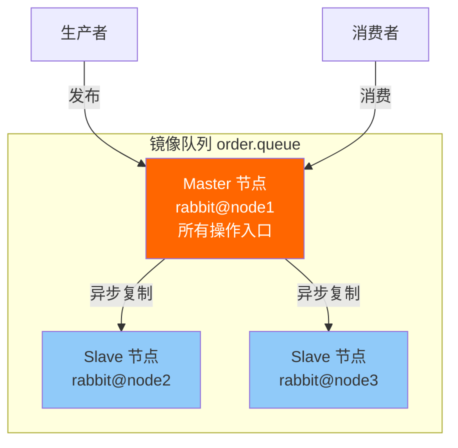
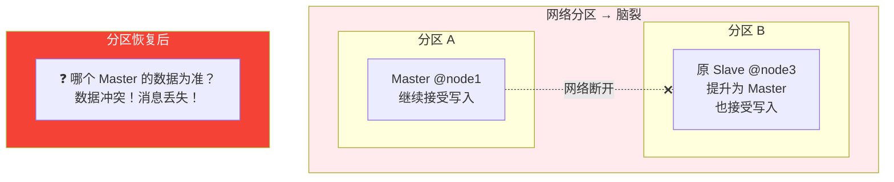
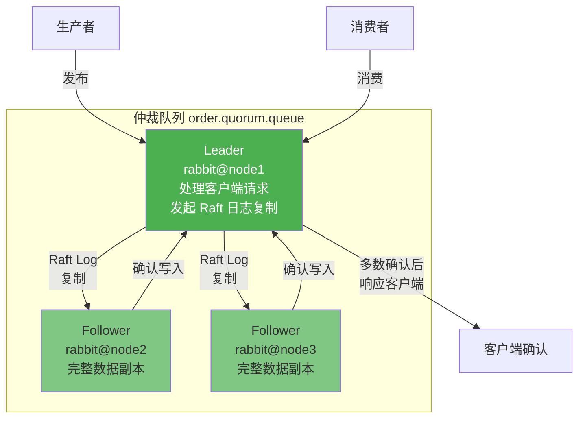
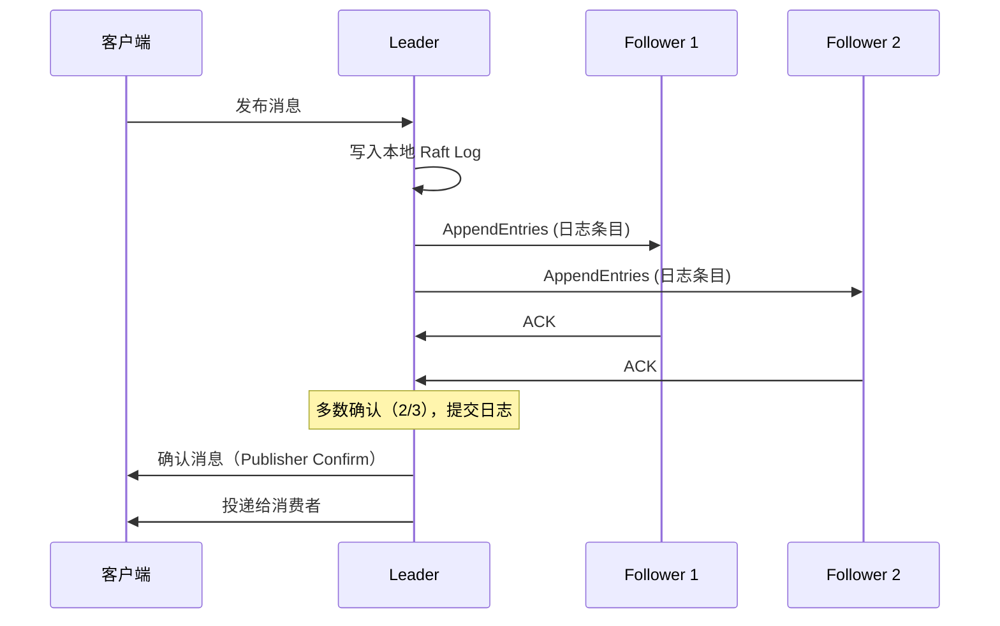
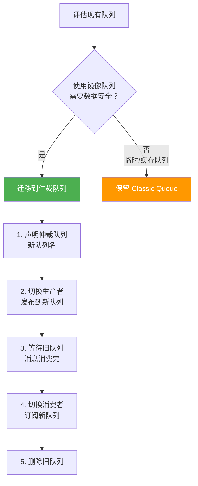

# 镜像队列与仲裁队列

RabbitMQ 集群默认不复制队列数据——节点宕机，队列丢失。镜像队列（Classic Mirror Queue）曾经是高可用的方案，但存在严重缺陷。仲裁队列（Quorum Queue）基于 Raft 共识算法，是 RabbitMQ 4.0 的默认选择。

## 1. 经典镜像队列（已弃用）

### 架构

镜像队列在多个节点上维护队列副本：一个 Master + N 个 Slave：



### 配置策略

通过 Policy 设置镜像规则：

```bash
# 所有队列镜像到所有节点
rabbitmqctl set_policy ha-all ".*" '{"ha-mode":"all","ha-sync-mode":"automatic"}' --apply-to queues

# 精确镜像到 N 个节点
rabbitmqctl set-policy ha-two "^order\." '{"ha-mode":"exactly","ha-count":2,"ha-sync-mode":"automatic"}' --apply-to queues

# 指定节点镜像
rabbitmqctl set-policy ha-nodes "^payment\." '{"ha-mode":"nodes","ha-nodes":["rabbit@node1","rabbit@node2"]}' --apply-to queues
```

| 参数 | 值 | 说明 |
|------|-----|------|
| `ha-mode` | `all` | 镜像到集群所有节点 |
| `ha-mode` | `exactly` | 镜像到指定数量节点 |
| `ha-mode` | `nodes` | 镜像到指定节点 |
| `ha-count` | N | `exactly` 模式下的副本数 |
| `ha-sync-mode` | `automatic` | 新 Slave 自动同步历史消息 |
| `ha-sync-mode` | `manual` | 新 Slave 仅同步新消息（默认） |

### 致命问题

::: danger 镜像队列的三大缺陷
1. **脑裂风险**：网络分区后 Master 和 Slave 可能各自独立运行，数据不一致
2. **Master 瓶颈**：所有读写操作必须经过 Master，Slave 无法分担读压力
3. **同步缓慢**：新 Slave 加入时，全量同步历史消息，大队列可能阻塞数小时
:::



::: warning 镜像队列已弃用
RabbitMQ 3.13 起标记为弃用，4.0 起移除。新项目**必须**使用仲裁队列。
:::

## 2. 仲裁队列（Quorum Queue）

### 架构

仲裁队列基于 **Raft 共识算法**，每个队列成员（Member）都有完整数据，Leader + Followers：



### Raft 日志复制流程



::: important 为什么是"多数"确认？
3 节点仲裁队列需要 2 个节点确认（含 Leader），5 节点需要 3 个确认。这就是 Raft 的核心——少数派故障不影响可用性，多数派保证数据一致。
:::

### 声明仲裁队列

```csharp
using RabbitMQ.Client;
using RabbitMQ.Client.Events;
using System.Text;
using System.Text.Json;

var factory = new ConnectionFactory { HostName = "localhost" };
using var connection = factory.CreateConnection();
using var channel = connection.CreateModel();

// 声明仲裁队列 —— x-queue-type=quorum
channel.QueueDeclare("order.quorum.queue",
    durable: true,           // 仲裁队列必须 durable=true
    exclusive: false,
    autoDelete: false,
    new Dictionary<string, object>
    {
        { "x-queue-type", "quorum" },                  // 队列类型：仲裁队列
        { "x-quorum-initial-group-size", 3 }           // 初始副本数（建议奇数）
    });

// 发布消息（与普通队列完全相同）
var order = new { OrderId = "ORD-001", Amount = 299.00m };
var body = Encoding.UTF8.GetBytes(JsonSerializer.Serialize(order));

var props = channel.CreateBasicProperties();
props.DeliveryMode = 2;
channel.BasicPublish("", "order.quorum.queue", props, body);

// 消费消息（与普通队列完全相同）
var consumer = new EventingBasicConsumer(channel);
consumer.Received += (model, ea) =>
{
    Console.WriteLine($"收到: {Encoding.UTF8.GetString(ea.Body.ToArray())}");
    channel.BasicAck(ea.DeliveryTag, false);
};
channel.BasicConsume("order.quorum.queue", false, consumer);
```

## 3. 仲裁队列 vs 镜像队列

| 维度 | Classic Mirror Queue | Quorum Queue |
|------|---------------------|--------------|
| **一致性** | 异步复制，可能丢消息 | Raft 多数确认，强一致 |
| **脑裂** | ❌ 可能脑裂 | ✅ Raft 保证不脑裂 |
| **Master 瓶颈** | ❌ 所有操作经 Master | ✅ Leader 故障自动选举 |
| **数据安全** | 异步复制，故障可能丢 | 多数确认，故障不丢 |
| **吞吐量** | 高（异步复制） | 中（多数确认有开销） |
| **延迟** | 低 | 略高（需等待多数确认） |
| **消息 TTL** | 支持 | ⚠️ 仅支持队列级 TTL，不支持每条消息 TTL |
| **优先级** | 支持 | ⚠️ 3.13+ 部分支持 |
| **Lazy 模式** | 支持 | 默认即 Lazy（写入磁盘） |
| **状态** | 3.13 弃用，4.0 移除 | 4.0 默认队列类型 |

::: tip 仲裁队列默认就是"惰性"的
仲裁队列默认将消息写入磁盘（类似 Classic Queue 的 Lazy 模式），按需读入内存。这是 Raft 日志机制决定的——日志本身就是持久化的。因此仲裁队列没有 `x-queue-mode=lazy` 参数。
:::

## 4. 仲裁队列的限制

```csharp
// ❌ 仲裁队列不支持以下特性：

// 1. 每条消息的 TTL（仅支持队列级 x-message-ttl）
var props = channel.CreateBasicProperties();
props.Expiration = "60000"; // ❌ 在仲裁队列中无效

// 2. 队列最大长度策略支持，但溢出行为仅为 drop-head
channel.QueueDeclare("limited.queue", durable: true, exclusive: false, autoDelete: false,
    new Dictionary<string, object>
    {
        { "x-queue-type", "quorum" },
        { "x-max-length", 10000 }     // ✅ 支持，但溢出只能 drop-head
        // reject-publish 在仲裁队列中不支持
    });

// 3. 临时/排他队列
channel.QueueDeclare("temp.queue", durable: false, exclusive: true, autoDelete: true,
    new Dictionary<string, object> { { "x-queue-type", "quorum" } });  // ❌ 仲裁队列不支持 exclusive

// 4. 非持久化队列
channel.QueueDeclare("non-durable.queue", durable: false, exclusive: false, autoDelete: false,
    new Dictionary<string, object> { { "x-queue-type", "quorum" } });  // ❌ 必须 durable=true
```

## 5. 迁移：Classic → Quorum

### 迁移策略



### 迁移脚本

```csharp
// 迁移工具：将消息从 Classic Queue 搬运到 Quorum Queue
public class QueueMigrator
{
    public async Task MigrateAsync(string sourceQueue, string targetQueue, CancellationToken ct = default)
    {
        var factory = new ConnectionFactory { HostName = "localhost" };
        using var connection = factory.CreateConnection();
        using var sourceChannel = connection.CreateModel();
        using var targetChannel = connection.CreateModel();

        long migrated = 0;
        var consumer = new EventingBasicConsumer(sourceChannel);

        consumer.Received += (model, ea) =>
        {
            // 转发到仲裁队列
            var props = targetChannel.CreateBasicProperties();
            props.DeliveryMode = 2;
            props.Headers = ea.BasicProperties.Headers;

            targetChannel.BasicPublish("", targetQueue, props, ea.Body.ToArray());
            sourceChannel.BasicAck(ea.DeliveryTag, false);

            Interlocked.Increment(ref migrated);
            if (migrated % 1000 == 0)
            {
                Console.WriteLine($"已迁移 {migrated} 条消息");
            }
        };

        sourceChannel.BasicQos(0, 100, false);
        sourceChannel.BasicConsume(sourceQueue, false, consumer);

        Console.WriteLine("迁移进行中，按 Enter 停止...");
        Console.ReadLine();
        Console.WriteLine($"迁移完成，共 {migrated} 条消息");
    }
}
```

::: warning 迁移注意事项
- 仲裁队列和 Classic Queue 不能同名，需要新队列名
- 迁移期间消费者需要同时订阅新旧队列，或采用蓝绿切换
- 仲裁队列不支持每条消息 TTL，迁移前需检查是否依赖该特性
:::

## 6. 何时选择哪种队列

| 场景 | 推荐 | 理由 |
|------|------|------|
| 核心业务（订单、支付） | **Quorum Queue** | 数据安全优先 |
| 临时缓存/去重 | Classic Queue | 用完即弃，无需高可用 |
| 大量积压消息 | **Quorum Queue** | 默认 Lazy 模式，内存友好 |
| 需要每条消息 TTL | Classic Queue | 仲裁队列不支持 |
| 需要优先级 | Classic Queue | 仲裁队列优先级支持有限 |
| RPC 回调队列 | Classic Queue | 临时队列，无需持久化 |

## 面试技巧

::: tip 高频考点
1. **"镜像队列和仲裁队列的区别？"** —— 镜像队列是 Master-Slave 异步复制，有脑裂风险和 Master 瓶颈；仲裁队列是 Raft 多数确认，强一致、不脑裂。镜像队列 3.13 弃用、4.0 移除。
2. **"Quorum Queue 什么原理？"** —— 基于 Raft 共识，Leader 处理客户端请求，Follower 复制日志，多数确认后提交。 Leader 故障自动选举新 Leader。
3. **"仲裁队列有什么限制？"** —— 不支持每条消息 TTL、不支持 exclusive 队列、优先级支持有限、吞吐量略低于镜像队列。
4. **"3 节点仲裁队列能容忍几个节点故障？"** —— 1 个。Raft 需要多数派存活：3 节点需要 2 个存活，5 节点需要 3 个。
5. **"为什么镜像队列被弃用？"** —— 脑裂风险、Master 瓶颈、同步慢。仲裁队列从根本上解决了这些问题。
:::

---

**参考资料**

- [RabbitMQ 官方文档 - Quorum Queues](https://www.rabbitmq.com/docs/quorum-queues)
- [RabbitMQ 官方文档 - Classic Queues](https://www.rabbitmq.com/docs/classic-queues)
- [RabbitMQ 官方文档 - HA & Mirroring (Deprecated)](https://www.rabbitmq.com/docs/ha)
- [Raft 论文](https://raft.github.io/raft.pdf)
- 《RabbitMQ 实战指南》朱忠华 — 第 7 章镜像队列
- RabbitMQ in Depth (Alvaro Videla) — Chapter 8: Clustering and Replication
