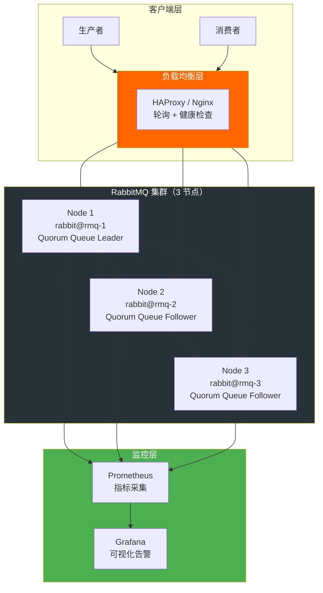
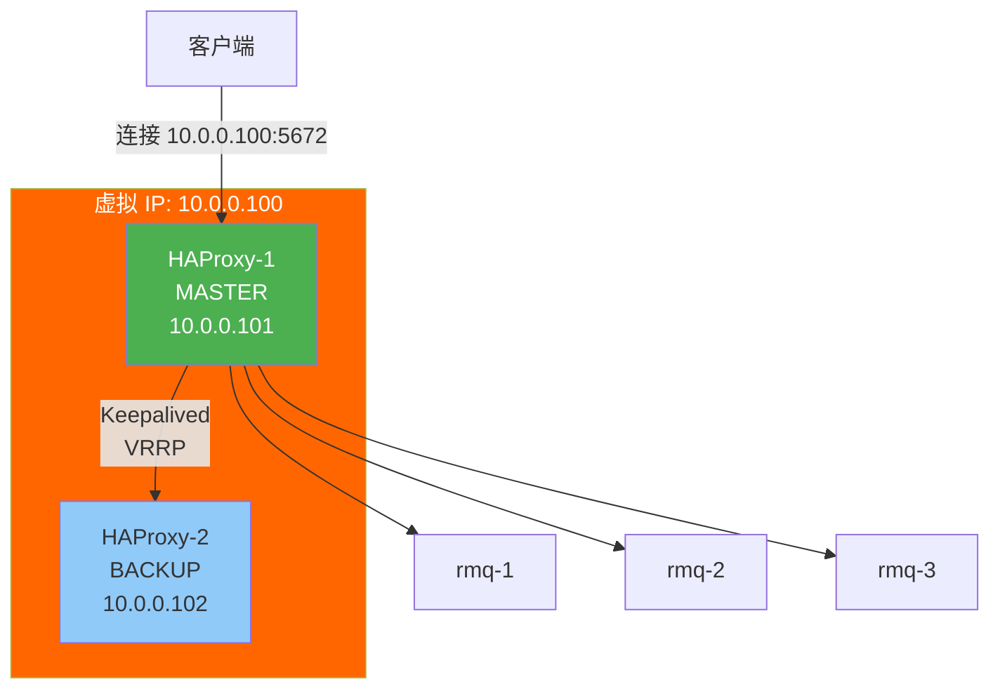
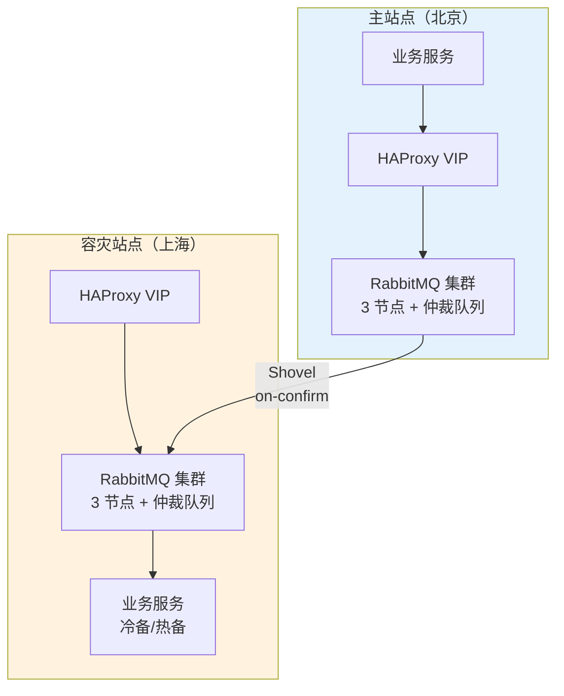

# 高可用架构设计

单个组件的可靠性不足以支撑生产级系统。本文从负载均衡、故障转移、容器化部署、容灾演练到客户端重连策略，构建完整的 RabbitMQ 高可用架构。

## 1. 整体架构



## 2. 负载均衡

### HAProxy 配置

```haproxy
# /etc/haproxy/haproxy.cfg
global
    log 127.0.0.1 local0

defaults
    log     global
    mode    tcp
    option  tcplog
    timeout connect 5s
    timeout client  30m
    timeout server  30m

# AMQP 负载均衡
frontend amqp_front
    bind *:5672
    default_backend amqp_back

backend amqp_back
    balance roundrobin
    option httpchk GET /api/aliveness-test/%2f
    http-check expect status 200
    server rmq-1 rmq-1:5672 check check-ssl verify none inter 10s fall 3 rise 2
    server rmq-2 rmq-2:5672 check check-ssl verify none inter 10s fall 3 rise 2
    server rmq-3 rmq-3:5672 check check-ssl verify none inter 10s fall 3 rise 2

# Management UI 负载均衡
frontend mgmt_front
    bind *:15672
    default_backend mgmt_back

backend mgmt_back
    balance roundrobin
    server rmq-1 rmq-1:15672 check inter 10s
    server rmq-2 rmq-2:15672 check inter 10s
    server rmq-3 rmq-3:15672 check inter 10s
```

### Nginx Stream 配置

```nginx
# /etc/nginx/nginx.conf
stream {
    upstream rabbitmq_amqp {
        least_conn;
        server rmq-1:5672 max_fails=3 fail_timeout=30s;
        server rmq-2:5672 max_fails=3 fail_timeout=30s;
        server rmq-3:5672 max_fails=3 fail_timeout=30s;
    }

    server {
        listen 5672;
        proxy_pass rabbitmq_amqp;
        proxy_connect_timeout 5s;
        proxy_timeout 30m;
    }
}
```

::: tip HAProxy vs Nginx
- **HAProxy**：支持 AMQP 健康检查（HTTP Check），对 RabbitMQ 更友好
- **Nginx**：Stream 模块只做 TCP 转发，无法做应用层健康检查
- 生产环境推荐 **HAProxy**
:::

## 3. VIP 故障转移

使用 Keepalived 实现 HAProxy 的高可用：



Keepalived 配置：

```ini
# /etc/keepalived/keepalived.conf（MASTER）
vrrp_script chk_haproxy {
    script "killall -0 haproxy"
    interval 2
    weight -5
    fall 3
    rise 2
}

vrrp_instance VI_1 {
    state MASTER
    interface eth0
    virtual_router_id 51
    priority 101
    advert_int 1

    authentication {
        auth_type PASS
        auth_pass secret123
    }

    virtual_ipaddress {
        10.0.0.100/24
    }

    track_script {
        chk_haproxy
    }
}
```

## 4. Kubernetes 部署

### StatefulSet 部署

```yaml
apiVersion: apps/v1
kind: StatefulSet
metadata:
  name: rabbitmq
spec:
  serviceName: rabbitmq-headless
  replicas: 3
  selector:
    matchLabels:
      app: rabbitmq
  template:
    metadata:
      labels:
        app: rabbitmq
    spec:
      containers:
        - name: rabbitmq
          image: rabbitmq:3.13-management
          ports:
            - containerPort: 5672
            - containerPort: 15672
          env:
            - name: RABBITMQ_ERLANG_COOKIE
              valueFrom:
                secretKeyRef:
                  name: rabbitmq-secret
                  key: erlang-cookie
            - name: RABBITMQ_NODENAME
              value: "rabbit@$(POD_NAME)"
            - name: POD_NAME
              valueFrom:
                fieldRef:
                  fieldPath: metadata.name
          volumeMounts:
            - name: data
              mountPath: /var/lib/rabbitmq
            - name: config
              mountPath: /etc/rabbitmq
          readinessProbe:
            exec:
              command: ["rabbitmq-diagnostics", "check_port_connectivity"]
            initialDelaySeconds: 20
            periodSeconds: 10
          livenessProbe:
            exec:
              command: ["rabbitmq-diagnostics", "status"]
            initialDelaySeconds: 30
            periodSeconds: 30
      volumes:
        - name: config
          configMap:
            name: rabbitmq-config
  volumeClaimTemplates:
    - metadata:
        name: data
      spec:
        accessModes: ["ReadWriteOnce"]
        resources:
          requests:
            storage: 10Gi
---
apiVersion: v1
kind: ConfigMap
metadata:
  name: rabbitmq-config
data:
  rabbitmq.conf: |
    cluster_formation.peer_discovery_backend = rabbitmq_peer_discovery_k8s
    cluster_formation.k8s.host = kubernetes.default.svc.cluster.local
    cluster_formation.k8s.address_type = hostname
    cluster_formation.k8s.hostname_suffix = .rabbitmq-headless.default.svc.cluster.local
    cluster_formation.k8s.service_name = rabbitmq-headless
    cluster_partition_handling = pause_minority
    vm_memory_high_watermark.relative = 0.6
    disk_free_limit.absolute = 2GB
---
apiVersion: v1
kind: Service
metadata:
  name: rabbitmq-headless
spec:
  clusterIP: None
  selector:
    app: rabbitmq
  ports:
    - name: amqp
      port: 5672
    - name: mgmt
      port: 15672
---
apiVersion: v1
kind: Service
metadata:
  name: rabbitmq
spec:
  selector:
    app: rabbitmq
  ports:
    - name: amqp
      port: 5672
      targetPort: 5672
    - name: mgmt
      port: 15672
      targetPort: 15672
```

## 5. 容灾架构



### 容灾策略

| 策略 | RPO | RTO | 成本 |
|------|-----|-----|------|
| 冷备 | 分钟级 | 小时级 | 低 |
| 热备（Shovel 同步） | 秒级 | 分钟级 | 中 |
| 双活（Federation 双向） | 秒级 | 秒级 | 高 |

::: important RPO vs RTO
- **RPO**（Recovery Point Objective）：能容忍丢失多少数据
- **RTO**（Recovery Time Objective）：故障后多久恢复服务
- Shovel `on-confirm` 模式可做到 RPO≈0（不丢消息），但 RTO 取决于 DNS 切换速度
:::

## 6. 混沌工程：容灾演练

### 模拟网络分区

```bash
# 使用 iptables 模拟网络分区
# 在 node1 上阻断与 node3 的通信
iptables -A INPUT -s node3 -j DROP
iptables -A OUTPUT -d node3 -j DROP

# 观察 pause_minority 策略效果
rabbitmqctl cluster_status

# 恢复
iptables -D INPUT -s node3 -j DROP
iptables -D OUTPUT -d node3 -j DROP
```

### 模拟节点故障

```bash
# 杀掉 node3 的 RabbitMQ 进程
ssh node3 "rabbitmqctl stop_app"

# 验证集群是否正常
rabbitmqctl cluster_status
rabbitmqctl list_queues name messages consumers

# 验证仲裁队列 Leader 选举
rabbitmqctl list_queues name type leader

# 恢复
ssh node3 "rabbitmqctl start_app"
```

### 模拟磁盘满

```bash
# 填充磁盘空间
dd if=/dev/zero of=/tmp/filldisk bs=1M count=5000

# 观察 RabbitMQ 行为
# 预期：disk_free_limit 触发 → 阻塞生产者

# 清理
rm /tmp/filldisk
```

## 7. .NET 客户端重连策略

### 自动恢复机制

```csharp
using RabbitMQ.Client;
using RabbitMQ.Client.Events;

var factory = new ConnectionFactory
{
    HostName = "10.0.0.100",    // VIP 地址
    Port = 5672,
    UserName = "app_user",
    Password = "secure_password",

    // 自动恢复
    AutomaticRecoveryEnabled = true,           // 自动重连
    NetworkRecoveryInterval = TimeSpan.FromSeconds(5),  // 重连间隔
    TopologyRecoveryEnabled = true,            // 恢复拓扑（交换机、队列、绑定、消费者）

    // 心跳
    RequestedHeartbeat = TimeSpan.FromSeconds(60),  // 心跳间隔
    RequestedConnectionTimeout = TimeSpan.FromSeconds(30),
};

using var connection = factory.CreateConnection();

// 监听连接事件
connection.ConnectionShutdown += (sender, e) =>
{
    Console.WriteLine($"连接关闭: {e.Reason}");
};

connection.CallbackException += (sender, e) =>
{
    Console.WriteLine($"回调异常: {e.Exception.Message}");
};

connection.ConnectionBlocked += (sender, e) =>
{
    Console.WriteLine($"连接被阻塞: {e.Reason}");
};

connection.ConnectionUnblocked += (sender, e) =>
{
    Console.WriteLine("连接解除阻塞");
};
```

### 多节点连接

```csharp
var endpoints = new List<AmqpTcpEndpoint>
{
    new() { HostName = "rmq-1", Port = 5672 },
    new() { HostName = "rmq-2", Port = 5672 },
    new() { HostName = "rmq-3", Port = 5672 }
};

var factory = new ConnectionFactory
{
    AutomaticRecoveryEnabled = true,
    TopologyRecoveryEnabled = true,
    NetworkRecoveryInterval = TimeSpan.FromSeconds(5)
};

// 客户端会随机选择一个可用节点连接
// 自动恢复时会重新尝试所有节点
using var connection = factory.CreateConnection(endpoints, "my-app");
```

### 生产者断路器模式

```csharp
public class RabbitMqPublisher
{
    private readonly IConnection _connection;
    private readonly CircuitBreaker _circuitBreaker;
    private readonly TimeSpan _breakerTimeout = TimeSpan.FromSeconds(30);
    private readonly int _failureThreshold = 5;

    public RabbitMqPublisher(IConnection connection)
    {
        _connection = connection;
        _circuitBreaker = new CircuitBreaker(_failureThreshold, _breakerTimeout);

        _connection.ConnectionBlocked += (_, _) => _circuitBreaker.Trip();
        _connection.ConnectionUnblocked += (_, _) => _circuitBreaker.Reset();
    }

    public void Publish(string exchange, string routingKey, IBasicProperties props, byte[] body)
    {
        _circuitBreaker.Execute(() =>
        {
            using var channel = _connection.CreateModel();
            channel.ConfirmSelect();  // 开启 Publisher Confirms

            channel.BasicPublish(exchange, routingKey, props, body);
            channel.WaitForConfirmsOrDie(TimeSpan.FromSeconds(5));
        });
    }
}

/// <summary>
/// 简易断路器
/// </summary>
public class CircuitBreaker
{
    private readonly int _threshold;
    private readonly TimeSpan _timeout;
    private int _failureCount;
    private DateTime _lastFailureTime = DateTime.MinValue;
    private readonly object _lock = new();

    public CircuitBreaker(int threshold, TimeSpan timeout)
    {
        _threshold = threshold;
        _timeout = timeout;
    }

    public void Execute(Action action)
    {
        lock (_lock)
        {
            if (_failureCount >= _threshold)
            {
                if (DateTime.UtcNow - _lastFailureTime < _timeout)
                {
                    throw new InvalidOperationException("断路器打开，拒绝请求");
                }
                // 超时后尝试半开
                _failureCount = 0;
            }
        }

        try
        {
            action();
            lock (_lock) { _failureCount = 0; }
        }
        catch
        {
            lock (_lock)
            {
                _failureCount++;
                _lastFailureTime = DateTime.UtcNow;
            }
            throw;
        }
    }

    public void Trip()
    {
        lock (_lock)
        {
            _failureCount = _threshold;
            _lastFailureTime = DateTime.UtcNow;
        }
    }

    public void Reset()
    {
        lock (_lock) { _failureCount = 0; }
    }
}
```

## 面试技巧

::: tip 高频考点
1. **"RabbitMQ 高可用架构怎么设计？"** —— 3 节点仲裁队列集群 + HAProxy 负载均衡 + Keepalived VIP 故障转移。画架构图是加分项。
2. **"客户端如何连接集群？"** —— 两种方式：通过 LB VIP 连接，或配置多个 AmqpTcpEndpoint。推荐前者（运维更简单），后者减少一跳延迟。
3. **"连接断了怎么办？"** —— .NET 客户端 `AutomaticRecoveryEnabled=true` 自动重连，`TopologyRecoveryEnabled=true` 恢复拓扑。生产者还需断路器模式，避免连接故障时持续重试。
4. **"Kubernetes 部署 RabbitMQ 注意什么？"** —— StatefulSet 保证节点标识稳定、PVC 持久化数据、Headless Service 用于 Peer Discovery、配置 `pause_minority` 处理分区。
5. **"容灾方案怎么选？"** —— 冷备（低成本、高 RTO）、热备 Shovel（中成本、低 RPO）、双活 Federation（高成本、零 RTO）。根据业务容忍度选择。
:::

---

**参考资料**

- [RabbitMQ 官方文档 - Clustering](https://www.rabbitmq.com/docs/clustering)
- [RabbitMQ 官方文档 - Quorum Queues](https://www.rabbitmq.com/docs/quorum-queues)
- [RabbitMQ 官方文档 - Shovel](https://www.rabbitmq.com/docs/shovel)
- [RabbitMQ Kubernetes Operator](https://www.rabbitmq.com/kubernetes/operator/operator-overview)
- 《RabbitMQ 实战指南》朱忠华 — 第 7 章集群与高可用
