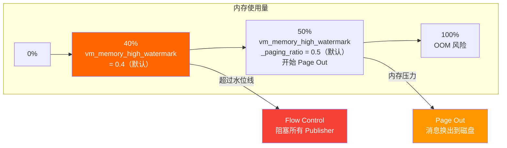
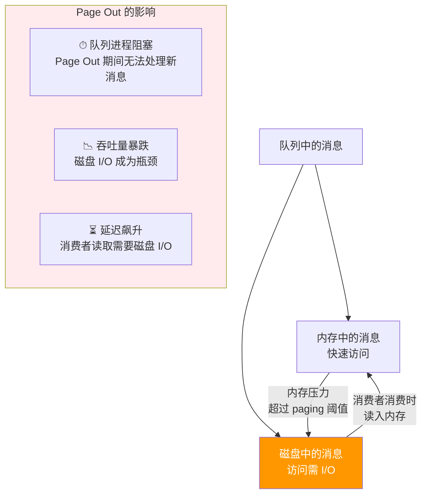
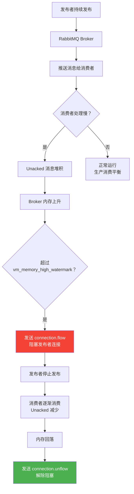
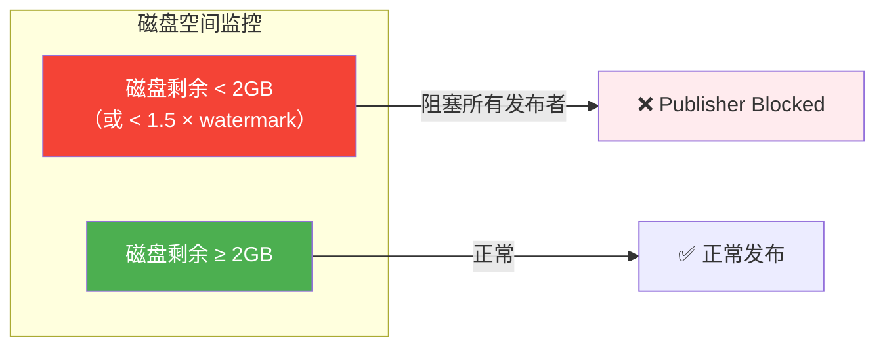
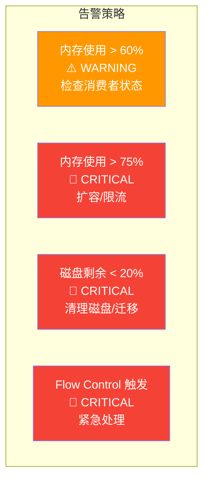

# 内存管理与流量控制

RabbitMQ 是内存敏感型应用——消息堆积、消费者慢、突发流量都可能导致内存溢出。理解内存水位、Page Out、Flow Control 的工作机制，是调优和排障的基础。

## 1. 内存水位线

### vm_memory_high_watermark

RabbitMQ 使用 `vm_memory_high_watermark` 控制内存使用上限，超过该值时触发 Flow Control，阻塞所有发布者。



| 参数 | 默认值 | 说明 |
|------|--------|------|
| `vm_memory_high_watermark.relative` | 0.4 | 内存水位线，占系统总 RAM 的比例 |
| `vm_memory_high_watermark.absolute` | — | 绝对值（如 `2GB`），与 relative 二选一 |
| `vm_memory_high_watermark_paging_ratio` | 0.5 | Page Out 触发比例 = watermark × ratio |

::: important 关键计算
假设系统 RAM = 8GB，默认配置：
- 水位线 = 8GB × 0.4 = **3.2GB**
- Page Out 触发点 = 3.2GB × 0.5 = **1.6GB**
- 超过 1.6GB 开始将消息换出到磁盘
- 超过 3.2GB 阻塞所有发布者
:::

### 配置方式

```ini
# rabbitmq.conf

# 方式一：相对值（推荐）
vm_memory_high_watermark.relative = 0.6

# 方式二：绝对值
# vm_memory_high_watermark.absolute = 4GB

# Page Out 比例（在水位线的 50% 时开始换页）
vm_memory_high_watermark_paging_ratio = 0.5
```

::: tip 生产环境推荐值
- `vm_memory_high_watermark.relative = 0.6~0.7`：给 OS 和其他进程留足内存
- **不要设到 0.9+**：OS 需要 RAM 做 page cache，RabbitMQ 太贪会触发 OOM Killer
- Docker 环境：确保容器内存限制 > watermark × 1.5
:::

## 2. Page Out：消息换页

### 工作机制

当内存使用达到 `watermark × paging_ratio` 时，RabbitMQ 将队列中的消息从内存写入磁盘：



::: warning Page Out 是性能杀手
Page Out 操作会**阻塞队列的 Erlang 进程**，期间该队列无法处理任何消息（入队、出队、确认全部暂停）。如果多个队列同时 Page Out，整个 Broker 可能卡顿。
:::

### 减少 Page Out 的策略

| 策略 | 效果 |
|------|------|
| 使用 Lazy Queue / Quorum Queue | 消息默认写磁盘，减少内存压力 |
| 增加消费者 | 加速消费，减少堆积 |
| 设置队列 TTL / Max Length | 自动清理过期和溢出消息 |
| 调高 watermark | 延迟触发，但增加 OOM 风险 |
| 增加系统 RAM | 根本解决 |

## 3. Flow Control：流量控制

### 完整流程



### Flow Control 的层次

| 层次 | 触发条件 | 效果 |
|------|----------|------|
| **Connection 级** | 内存超 watermark | 阻塞整个连接的所有 Channel |
| **Channel 级** | Channel 发布速率过高 | 阻塞单个 Channel |
| **Queue 级** | 队列积压严重 | 队列进程降低处理速率 |

### .NET 处理 Flow Control

```csharp
using RabbitMQ.Client;
using RabbitMQ.Client.Events;

var factory = new ConnectionFactory
{
    HostName = "localhost",
    AutomaticRecoveryEnabled = true,
    NetworkRecoveryInterval = TimeSpan.FromSeconds(5),
    RequestedHeartbeat = TimeSpan.FromSeconds(60)
};

using var connection = factory.CreateConnection();

// 监听连接阻塞事件
connection.ConnectionBlocked += (sender, e) =>
{
    Console.WriteLine($"⚠️ 连接被阻塞！原因: {e.Reason}");
    // 触发降级逻辑：暂停发布、切换到本地缓存等
};

connection.ConnectionUnblocked += (sender, e) =>
{
    Console.WriteLine("✅ 连接解除阻塞");
    // 恢复发布逻辑
};

using var channel = connection.CreateModel();
channel.ConfirmSelect();

// 发布消息时检测确认状态
try
{
    channel.BasicPublish("exchange", "routing.key", null, messageBody);
    if (!channel.WaitForConfirms(TimeSpan.FromSeconds(5)))
    {
        Console.WriteLine("⚠️ 消息未被确认，可能被 Flow Control 阻塞");
    }
}
catch (AlreadyClosedException ex)
{
    Console.WriteLine($"❌ 连接已关闭: {ex.Message}");
    // 触发重连或降级逻辑
}
```

## 4. 磁盘空间限制

### disk_free_limit

当磁盘剩余空间低于阈值时，RabbitMQ 也会阻塞发布者：

```ini
# rabbitmq.conf

# 方式一：绝对值
disk_free_limit.absolute = 2GB

# 方式二：相对于内存水位线（默认）
# disk_free_limit.relative = 1.5
# 即磁盘剩余 < 1.5 × watermark 时阻塞
# 默认 watermark=0.4, 则磁盘剩余 < 0.6 × RAM 时阻塞
```



::: warning 磁盘满的严重后果
- 所有发布者被阻塞，消息无法进入 Broker
- Page Out 无法写入磁盘，内存压力更大
- 持久化消息可能丢失
- **必须设置告警**，在磁盘使用 80% 时就通知运维
:::

## 5. 内存告警策略



### .NET 健康检查

```csharp
using System.Net.Http.Json;

public class RabbitMqHealthCheck
{
    private readonly HttpClient _httpClient;
    private readonly string _vhost;

    public RabbitMqHealthCheck(string managementUrl, string username, string password, string vhost = "%2f")
    {
        _vhost = vhost;
        _httpClient = new HttpClient
        {
            BaseAddress = new Uri(managementUrl)
        };
        var auth = Convert.ToBase64String(System.Text.Encoding.ASCII.GetBytes($"{username}:{password}"));
        _httpClient.DefaultRequestHeaders.Authorization = new System.Net.Http.Headers.AuthenticationHeaderValue("Basic", auth);
    }

    public async Task<HealthStatus> CheckAsync()
    {
        var status = new HealthStatus();

        // 1. Aliveness Test
        try
        {
            var alive = await _httpClient.GetAsync($"/api/aliveness-test/{_vhost}");
            status.IsAlive = alive.IsSuccessStatusCode;
        }
        catch
        {
            status.IsAlive = false;
        }

        // 2. 节点信息
        var nodes = await _httpClient.GetFromJsonAsync<List<JsonElement>>("/api/nodes");
        if (nodes?.Count > 0)
        {
            var node = nodes[0];
            status.MemoryUsed = node.GetProperty("mem_used").GetInt64();
            status.MemoryLimit = node.GetProperty("mem_limit").GetInt64();
            status.MemoryUsagePercent = (double)status.MemoryUsed / status.MemoryLimit * 100;
            status.DiskFree = node.GetProperty("disk_free").GetInt64();
            status.DiskFreeLimit = node.GetProperty("disk_free_limit").GetInt64();
            status.IsFlowControlled = node.GetProperty("mem_alarm").GetBoolean() ||
                                       node.GetProperty("disk_free_alarm").GetBoolean();
        }

        // 3. 队列深度
        var queues = await _httpClient.GetFromJsonAsync<List<JsonElement>>($"/api/queues/{_vhost}");
        status.TotalQueueDepth = queues?.Sum(q => q.GetProperty("messages").GetInt32()) ?? 0;

        return status;
    }
}

public class HealthStatus
{
    public bool IsAlive { get; set; }
    public long MemoryUsed { get; set; }
    public long MemoryLimit { get; set; }
    public double MemoryUsagePercent { get; set; }
    public long DiskFree { get; set; }
    public long DiskFreeLimit { get; set; }
    public bool IsFlowControlled { get; set; }
    public int TotalQueueDepth { get; set; }
}
```

## 6. 生产环境内存调优清单

| 配置项 | 推荐值 | 说明 |
|--------|--------|------|
| `vm_memory_high_watermark.relative` | 0.6-0.7 | 留足 OS 内存 |
| `vm_memory_high_watermark_paging_ratio` | 0.5 | 提前 Page Out 减少峰值 |
| `disk_free_limit.absolute` | 2GB+ | 防止磁盘满 |
| 队列类型 | Quorum Queue | 默认写磁盘，内存友好 |
| 消费者 Prefetch | 10-50 | 防止 Unacked 堆积 |
| 连接数 | 监控 | 连接泄漏会占内存 |
| Channel 数 | 监控 | Channel 过多占内存 |

## 面试技巧

::: tip 高频考点
1. **"RabbitMQ 内存满了怎么办？"** —— 三步走：① 内存超 watermark → Flow Control 阻塞发布者；② 内存超 paging_ratio → Page Out 消息到磁盘；③ 磁盘满 → 阻塞所有发布者。画流程图是加分项。
2. **"vm_memory_high_watermark 设多少合适？"** —— 默认 0.4，生产建议 0.6-0.7。太高可能触发 OOM Killer，太低浪费内存。关键是要给 OS 留够 page cache。
3. **"Page Out 有什么影响？"** —— 阻塞队列进程，吞吐暴跌，延迟飙升。避免方法：用 Lazy Queue / Quorum Queue、增加消费者、设队列 TTL。
4. **"Flow Control 的触发条件？"** —— 内存超 watermark 或磁盘剩余不足。.NET 客户端通过 `ConnectionBlocked` / `ConnectionUnblocked` 事件感知。
5. **"如何监控 RabbitMQ 内存？"** —— Prometheus + rabbitmq_prometheus 插件。关键指标：`rabbitmq_mem_used`、`rabbitmq_mem_limit`、`rabbitmq_disk_free`。告警阈值：内存 > 70%、磁盘 < 20%。
:::

---

**参考资料**

- [RabbitMQ 官方文档 - Memory](https://www.rabbitmq.com/docs/memory)
- [RabbitMQ 官方文档 - Flow Control](https://www.rabbitmq.com/docs/flow-control)
- [RabbitMQ 官方文档 - Disk Space](https://www.rabbitmq.com/docs/disk-flags)
- [RabbitMQ 官方文档 - Lazy Queues](https://www.rabbitmq.com/docs/lazy-queues)
- 《RabbitMQ 实战指南》朱忠华 — 第 8 章内存与磁盘
