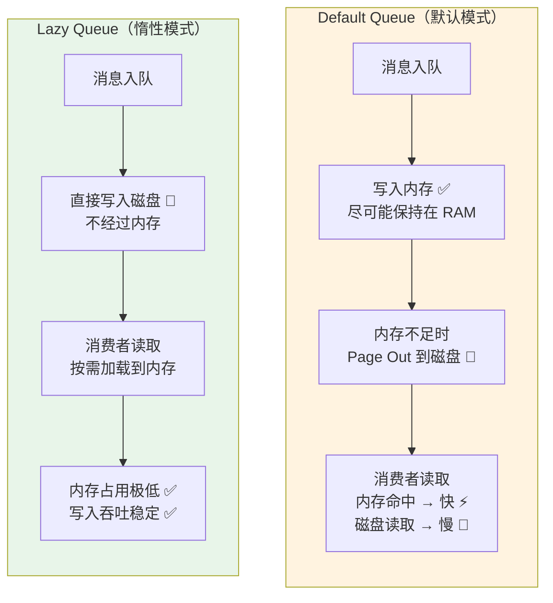
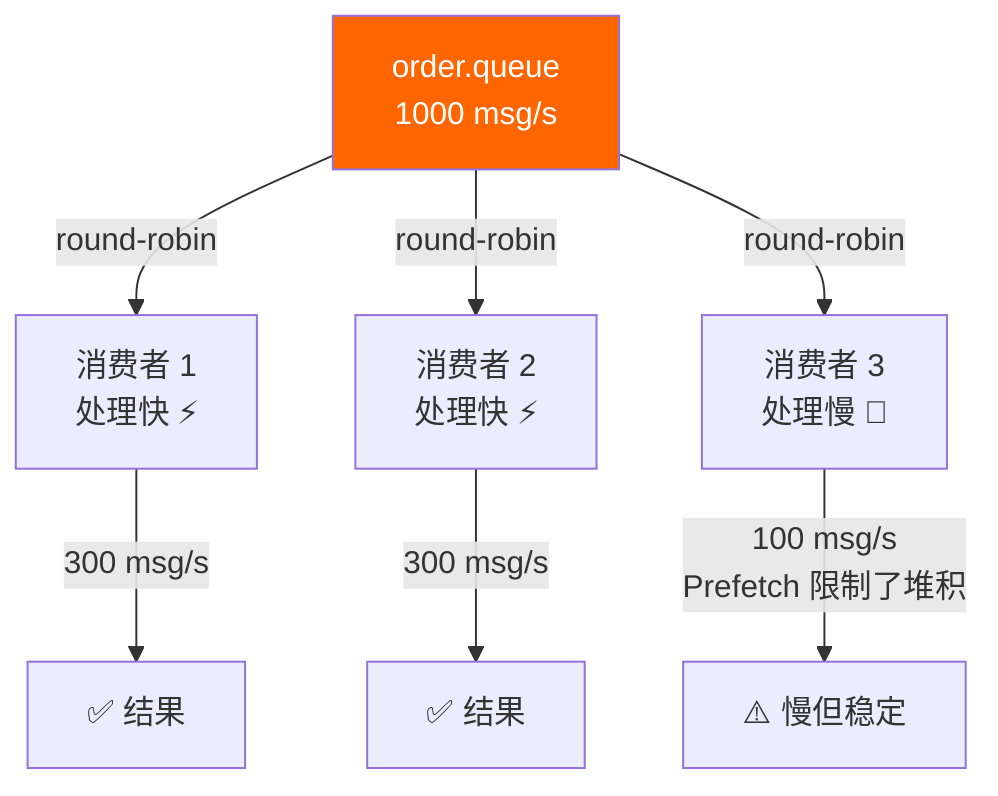
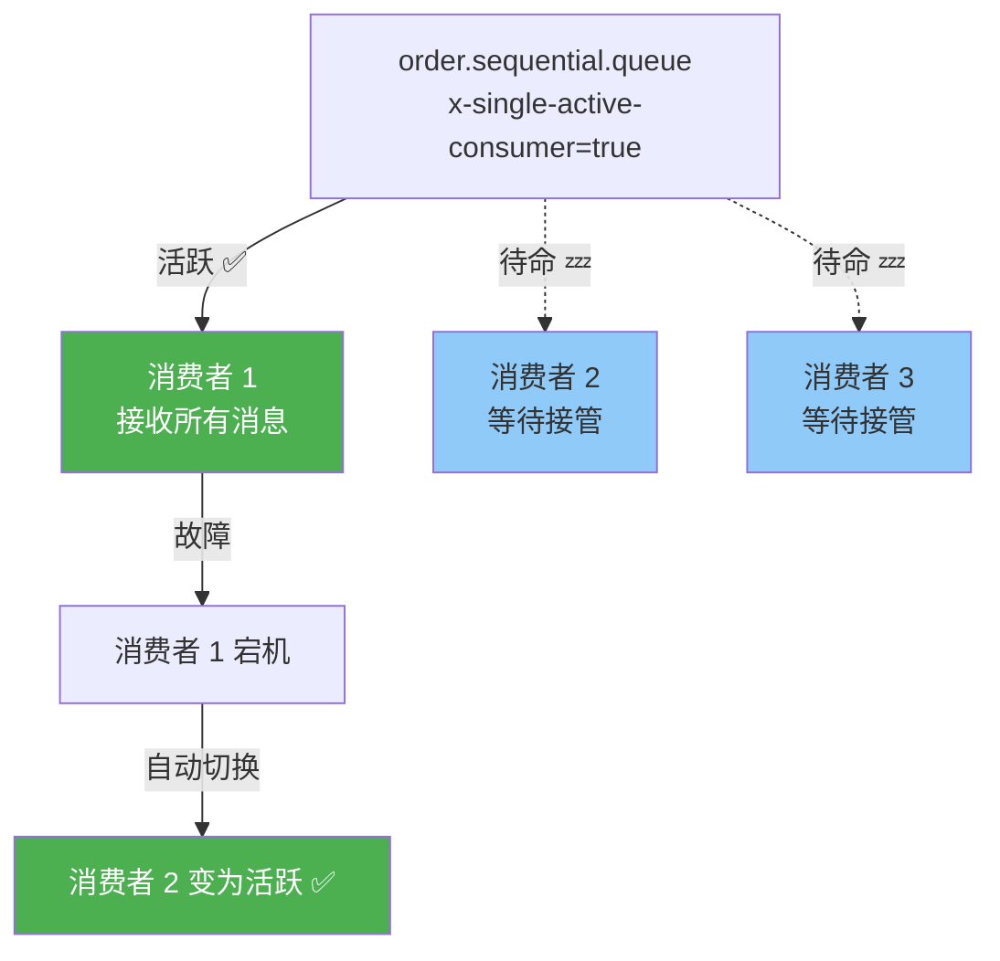
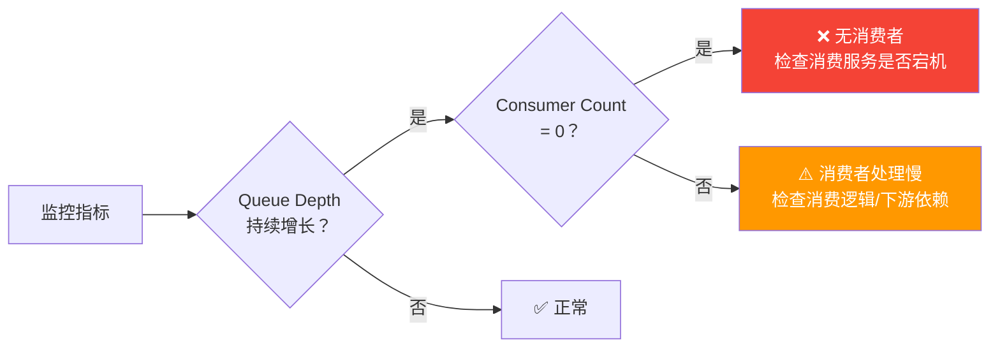

# 队列优化与惰性队列

队列是 RabbitMQ 的核心数据结构，队列模式的选择直接影响内存使用、吞吐量和延迟。理解 Default Queue 和 Lazy Queue 的区别，掌握分片、消费者分组、消息积压处理的技巧，是性能调优的关键。

## 1. 队列模式对比

### Default Queue vs Lazy Queue



| 维度 | Default Queue | Lazy Queue | Quorum Queue |
|------|--------------|------------|--------------|
| 消息存储 | 优先内存 | 直接磁盘 | 直接磁盘（Raft Log） |
| 内存占用 | 高 | 极低 | 低 |
| 小队列吞吐 | 高 ⚡ | 中 | 中 |
| 大队列吞吐 | 低（Page Out） | 稳定 | 稳定 |
| 延迟 | 低（内存命中） | 略高（磁盘读取） | 略高 |
| 百万级积压 | ❌ 内存爆炸 | ✅ 稳定 | ✅ 稳定 |

### 声明 Lazy Queue

```csharp
using RabbitMQ.Client;
using System.Text;
using System.Text.Json;

var factory = new ConnectionFactory { HostName = "localhost" };
using var connection = factory.CreateConnection();
using var channel = connection.CreateModel();

// 方式一：声明时指定 x-queue-mode=lazy
channel.QueueDeclare("order.lazy.queue",
    durable: true,
    exclusive: false,
    autoDelete: false,
    new Dictionary<string, object>
    {
        { "x-queue-mode", "lazy" }
    });

// 方式二：通过 Policy 设置（无需重建队列）
// rabbitmqctl set_policy lazy-policy "^order\." '{"queue-mode":"lazy"}' --apply-to queues
```

::: tip 什么时候用 Lazy Queue？
- 队列可能有大量积压（百万级消息）
- 消费者速度不稳定，可能间歇性慢
- 内存紧张，需要控制 Broker 内存使用
- 对延迟不敏感（如日志、审计、归档）
:::

### 运行时切换队列模式

```bash
# 通过 Policy 可以在运行时切换 Default ↔ Lazy（无需重建队列）
# 切换为 Lazy
rabbitmqctl set_policy lazy "^log\." '{"queue-mode":"lazy"}' --apply-to queues

# 切换回 Default
rabbitmqctl set_policy default "^log\." '{"queue-mode":"default"}' --apply-to queues

# 清除 Policy，恢复默认
rabbitmqctl clear_policy lazy
```

::: important Quorum Queue 默认就是 Lazy
Quorum Queue 的消息写入 Raft Log（磁盘），天然就是 Lazy 行为。无需也不能设置 `x-queue-mode=lazy`。
:::

## 2. 队列分片（Sharding）

单个队列的吞吐有上限（单 Erlang 进程）。当单队列吞吐不够时，可以将一个逻辑队列拆分为 N 个物理队列：

```mermaid
flowchart LR
    P[生产者] -->|hash(orderId) % 8| EX["Consistent Hash<br/>Exchange"]

    EX -->|shard-0| Q0[order.queue.0]
    EX -->|shard-1| Q1[order.queue.1]
    EX -->|shard-2| Q2[order.queue.2]
    EX -->|shard-3| Q3[order.queue.3]
    EX -->|shard-4| Q4[order.queue.4]
    EX -->|shard-5| Q5[order.queue.5]
    EX -->|shard-6| Q6[order.queue.6]
    EX -->|shard-7| Q7[order.queue.7]

    Q0 --> C0[消费者组]
    Q1 --> C0
    Q2 --> C1[消费者组]
    Q3 --> C1

    style EX fill:#9C27B0,color:#fff
```

### 一致性哈希交换机

```bash
# 启用插件
rabbitmq-plugins enable rabbitmq_consistent_hash_exchange
```

```csharp
// 声明一致性哈希交换机
channel.ExchangeDeclare("order.sharded", "x-consistent-hash", durable: true,
    new Dictionary<string, object>
    {
        { "hash-header", "order-id" }  // 用消息头的 order-id 做哈希
    });

// 声明分片队列
for (int i = 0; i < 8; i++)
{
    var queueName = $"order.queue.{i}";
    channel.QueueDeclare(queueName, durable: true, exclusive: false, autoDelete: false);
    // 每个 queue 权重为 1
    channel.QueueBind(queueName, "order.sharded", "1");
}

// 发布消息 —— 相同 order-id 的消息路由到同一分片
var props = channel.CreateBasicProperties();
props.Headers = new Dictionary<string, object> { { "order-id", "ORD-001" } };
channel.BasicPublish("order.sharded", "", props,
    Encoding.UTF8.GetBytes("{\"orderId\":\"ORD-001\"}"));
```

::: important 分片的关键：保序性
- 相同 routing key / header 值的消息一定路由到同一分片，保证顺序
- 不同 key 的消息均匀分布到各分片，提高并行度
- 消费者需要订阅所有分片队列
:::

## 3. 消费者分组

多个消费者订阅同一队列，RabbitMQ 轮询分配消息，实现并行处理：



::: tip 消费者分组的 Prefetch 配合
- `prefetchCount=1`：完全公平轮询，但吞吐低
- `prefetchCount=10~50`：允许消费者预取，提高吞吐，但快消费者可能多处理
- 消费者速度差异大时，用较小的 prefetch 值保证公平
:::

## 4. 单一活跃消费者（Single Active Consumer）

某些场景（如保证消息严格顺序消费），需要只有一个消费者活跃：

```csharp
// 声明单一活跃消费者队列
channel.QueueDeclare("order.sequential.queue",
    durable: true,
    exclusive: false,
    autoDelete: false,
    new Dictionary<string, object>
    {
        { "x-single-active-consumer", true }
    });
```



::: important SAC 适用场景
- 必须严格顺序消费的消息（如状态机变更）
- 幂等性难以保证的场景，避免重复消费
- 需要故障自动转移但不能并发消费的场景
:::

## 5. 消息积压处理

### 积压的信号



### 积压处理策略

| 策略 | 紧急程度 | 操作 |
|------|----------|------|
| 增加消费者 | 高 | 快速扩容消费实例 |
| 切换 Lazy 模式 | 高 | 防止内存溢出 |
| 清理过期消息 | 中 | 设置 TTL / Max Length |
| 丢弃低优先级消息 | 紧急 | 紧急情况 purge 或 drop |
| 临时死信转移 | 中 | 转移到归档队列，后续补消费 |

```csharp
// 应急：设置队列最大长度 + 溢出策略
channel.QueueDeclare("order.queue",
    durable: true,
    exclusive: false,
    autoDelete: false,
    new Dictionary<string, object>
    {
        { "x-max-length", 1_000_000 },        // 最多 100 万条
        { "x-overflow", "drop-head" },          // 溢出时丢弃最老的消息
        { "x-message-ttl", 86400000 }           // 24 小时 TTL
    });

// 应急：手动清理队列（危险操作）
// channel.QueuePurge("order.queue");
```

::: warning QueuePurge 是不可逆操作
`QueuePurge` 会删除队列中所有消息，且无法恢复。仅限紧急情况使用，操作前务必确认。
:::

## 6. 队列类型选择

RabbitMQ 4.0 支持三种队列类型：

| 类型 | 适用场景 | 数据安全 | 吞吐 |
|------|----------|----------|------|
| **Classic Queue** | 临时队列、RPC 回调、低价值消息 | 低（无复制） | 高 |
| **Quorum Queue** | 核心业务、需要数据安全 | 高（Raft 复制） | 中 |
| **Stream Queue** | 日志流、事件溯源、扇出消费 | 高（复制+持久化） | 高 |

### Stream Queue

Stream 是 RabbitMQ 3.9+ 引入的新队列类型，类似 Kafka 的日志流：

```csharp
// 声明 Stream Queue
channel.QueueDeclare("order.events.stream",
    durable: true,
    exclusive: false,
    autoDelete: false,
    new Dictionary<string, object>
    {
        { "x-queue-type", "stream" },
        { "x-max-length-bytes", 10_000_000_000L }  // 10GB 日志保留
    });

// 消费者从指定 offset 开始消费
var consumer = new EventingBasicConsumer(channel);
consumer.Received += (_, ea) =>
{
    // Stream 消息带有 offset 信息
    var offset = ea.BasicProperties.Headers?["x-stream-offset"];
    Console.WriteLine($"Offset={offset}, Body={Encoding.UTF8.GetString(ea.Body.ToArray())}");
    // Stream 模式下不 Ack，消息保留在 Stream 中
};
channel.BasicConsume("order.events.stream", false, consumer);
```

::: tip Stream Queue 特点
- 消息只追加，不删除（类似 Kafka）
- 多个消费者可以独立从不同 offset 消费
- 不支持 Ack/Nack（消费进度通过 offset 跟踪）
- 适合事件溯源、日志流、数据管道
:::

## 7. .NET 队列声明最佳实践

```csharp
public static class QueueDeclarations
{
    // 核心业务队列：Quorum Queue
    public static void DeclareCoreQueue(IModel channel, string queueName, int quorumSize = 3)
    {
        channel.QueueDeclare(queueName,
            durable: true,
            exclusive: false,
            autoDelete: false,
            new Dictionary<string, object>
            {
                { "x-queue-type", "quorum" },
                { "x-quorum-initial-group-size", quorumSize },
                { "x-max-length", 5_000_000 },       // 积压上限
                { "x-overflow", "drop-head" },         // 溢出策略
                { "x-message-ttl", 86400000 },         // 24h TTL
                { "x-single-active-consumer", false }   // 多消费者并行
            });
    }

    // 大批量积压队列：Lazy Queue
    public static void DeclareLazyQueue(IModel channel, string queueName)
    {
        channel.QueueDeclare(queueName,
            durable: true,
            exclusive: false,
            autoDelete: false,
            new Dictionary<string, object>
            {
                { "x-queue-mode", "lazy" },
                { "x-max-length", 50_000_000 },       // 5000 万条上限
                { "x-overflow", "drop-head" },
                { "x-message-ttl", 604800000 }         // 7 天 TTL
            });
    }

    // 临时队列：Classic Queue
    public static void DeclareTempQueue(IModel channel, string queueName)
    {
        channel.QueueDeclare(queueName,
            durable: false,
            exclusive: true,
            autoDelete: true);
    }
}
```

## 面试技巧

::: tip 高频考点
1. **"Lazy Queue 和 Default Queue 的区别？"** —— Default Queue 尽可能将消息保存在内存，内存不足时 Page Out；Lazy Queue 直接写磁盘，内存占用极低。大队列（百万级）用 Lazy Queue，小队列用 Default。
2. **"消息积压怎么处理？"** —— 先判断原因（无消费者 vs 消费者慢），再采取措施：增加消费者、切换 Lazy 模式、设置 TTL/MaxLength、紧急时 purge。面试时要体现分层排查思维。
3. **"如何提高单队列吞吐？"** —— ① 分片队列（一致性哈希交换机拆分为 N 个队列）；② 增加消费者并行处理；③ 调优 Prefetch。单队列受限于单 Erlang 进程。
4. **"Single Active Consumer 什么时候用？"** —— 必须严格顺序消费、不能并发处理的场景。如状态机变更、幂等性难保证的场景。
5. **"Quorum Queue 和 Lazy Queue 什么关系？"** —— Quorum Queue 默认就是 Lazy 行为（消息写磁盘），不需要也不能设置 x-queue-mode=lazy。
:::

---

**参考资料**

- [RabbitMQ 官方文档 - Lazy Queues](https://www.rabbitmq.com/docs/lazy-queues)
- [RabbitMQ 官方文档 - Quorum Queues](https://www.rabbitmq.com/docs/quorum-queues)
- [RabbitMQ 官方文档 - Streams](https://www.rabbitmq.com/docs/streams)
- [RabbitMQ 官方文档 - Consistent Hash Exchange](https://www.rabbitmq.com/docs/consistent-hash-exchange)
- 《RabbitMQ 实战指南》朱忠华 — 第 8 章队列优化
