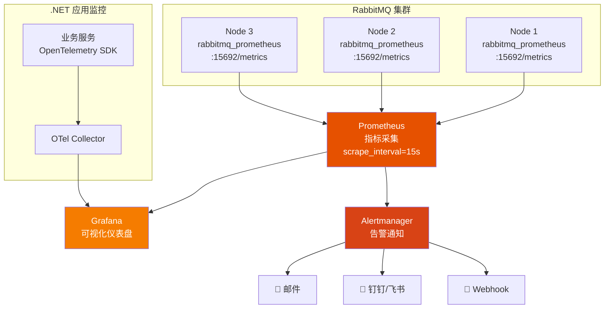
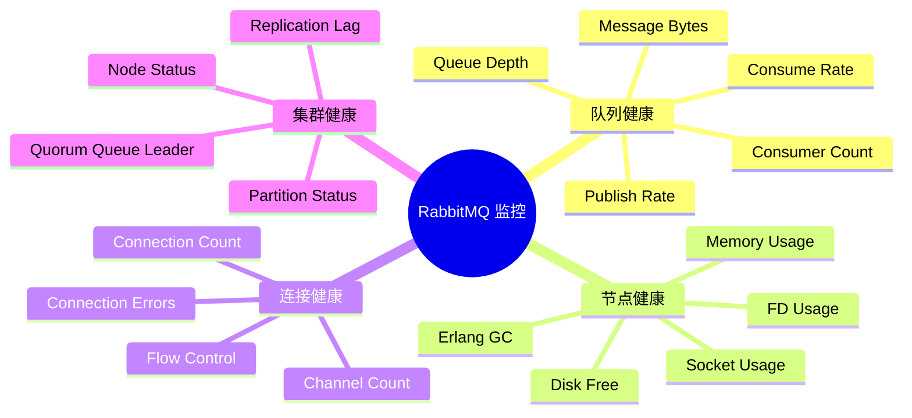

# 监控与告警体系

没有监控的生产环境等于盲飞。RabbitMQ 提供了 Prometheus 指标端点、Management API 和 .NET 健康检查接口，配合 Grafana 仪表盘和告警规则，构建完整的可观测性体系。

## 1. 监控架构



## 2. 启用 Prometheus 端点

```bash
# 启用插件
rabbitmq-plugins enable rabbitmq_prometheus

# 验证指标端点
curl http://localhost:15692/metrics | head -20
```

### Prometheus 配置

```yaml
# prometheus.yml
scrape_configs:
  - job_name: 'rabbitmq'
    static_configs:
      - targets:
          - 'rmq-1:15692'
          - 'rmq-2:15692'
          - 'rmq-3:15692'
    scrape_interval: 15s
    scrape_timeout: 10s
    metrics_path: /metrics
```

::: tip 端口说明
- `15672`：Management UI / REST API
- `15692`：Prometheus 指标端点（rabbitmq_prometheus 插件）
- `5672`：AMQP 协议端口
:::

## 3. 关键监控指标

### 核心指标清单

| 类别 | 指标 | PromQL | 说明 |
|------|------|--------|------|
| 队列深度 | `messages_ready` | `rabbitmq_queue_messages_ready` | 待消费消息数 |
| 队列总消息 | `messages` | `rabbitmq_queue_messages` | Ready + Unacked |
| 消费者数 | `consumers` | `rabbitmq_queue_consumers` | 当前消费者数量 |
| 发布速率 | `publish_rate` | `rate(rabbitmq_queue_messages_published_total[5m])` | 每秒发布数 |
| 消费速率 | `deliver_rate` | `rate(rabbitmq_queue_messages_delivered_total[5m])` | 每秒消费数 |
| 连接数 | `connections` | `rabbitmq_connections` | 当前连接数 |
| Channel 数 | `channels` | `rabbitmq_channels` | 当前 Channel 数 |
| 内存使用 | `mem_used` | `rabbitmq_node_mem_used` | 节点内存使用 |
| 内存限制 | `mem_limit` | `rabbitmq_node_mem_limit` | 内存水位线 |
| 磁盘剩余 | `disk_free` | `rabbitmq_node_disk_free` | 磁盘剩余空间 |
| GC 次数 | `gc_num` | `rate(rabbitmq_node_gc_num_total[5m])` | Erlang GC 频率 |

### 指标分类



## 4. Grafana 仪表盘

### 官方仪表盘

RabbitMQ 提供官方 Grafana 仪表盘模板：

- **RabbitMQ Overview**（ID: 10991）：集群总览
- **RabbitMQ Queue Metrics**（ID: 14783）：队列详情

导入方式：Grafana → Dashboards → Import → 输入仪表盘 ID

### 自定义面板

关键面板配置：

```json
{
  "panels": [
    {
      "title": "Queue Depth",
      "type": "stat",
      "targets": [
        {
          "expr": "sum(rabbitmq_queue_messages_ready) by (queue)"
        }
      ],
      "thresholds": {
        "steps": [
          { "value": 0, "color": "green" },
          { "value": 10000, "color": "yellow" },
          { "value": 100000, "color": "red" }
        ]
      }
    },
    {
      "title": "Publish vs Consume Rate",
      "type": "timeseries",
      "targets": [
        { "expr": "sum(rate(rabbitmq_queue_messages_published_total[5m]))" },
        { "expr": "sum(rate(rabbitmq_queue_messages_delivered_total[5m]))" }
      ]
    }
  ]
}
```

## 5. 告警规则

### Prometheus Alert Rules

```yaml
# rabbitmq_alerts.yml
groups:
  - name: rabbitmq_alerts
    rules:
      # 队列深度告警
      - alert: RabbitMQQueueDepthHigh
        expr: rabbitmq_queue_messages_ready > 100000
        for: 5m
        labels:
          severity: warning
        annotations:
          summary: "队列 {{ $labels.queue }} 积压超过 10 万"
          description: "队列 {{ $labels.queue }} 当前积压 {{ $value }} 条消息"

      # 队列无消费者
      - alert: RabbitMQQueueNoConsumer
        expr: rabbitmq_queue_consumers == 0 AND rabbitmq_queue_messages_ready > 0
        for: 3m
        labels:
          severity: critical
        annotations:
          summary: "队列 {{ $labels.queue }} 无消费者但有积压消息"
          description: "队列 {{ $labels.queue }} 有 {{ $value }} 条消息待消费但无消费者"

      # 内存使用过高
      - alert: RabbitMQMemoryHigh
        expr: rabbitmq_node_mem_used / rabbitmq_node_mem_limit > 0.8
        for: 2m
        labels:
          severity: critical
        annotations:
          summary: "节点 {{ $labels.node }} 内存使用超过水位线 80%"
          description: "当前使用率 {{ $value | humanizePercentage }}"

      # 磁盘空间不足
      - alert: RabbitMQDiskSpaceLow
        expr: rabbitmq_node_disk_free < 2 * 1024 * 1024 * 1024
        for: 1m
        labels:
          severity: critical
        annotations:
          summary: "节点 {{ $labels.node }} 磁盘剩余不足 2GB"

      # 集群分区
      - alert: RabbitMQClusterPartition
        expr: rabbitmq_node_partitions > 0
        for: 0m
        labels:
          severity: critical
        annotations:
          summary: "节点 {{ $labels.node }} 检测到网络分区"

      # 连接泄漏
      - alert: RabbitMQConnectionsHigh
        expr: rabbitmq_connections > 1000
        for: 10m
        labels:
          severity: warning
        annotations:
          summary: "RabbitMQ 连接数超过 1000（{{ $value }}）"
          description: "可能存在连接泄漏，请检查客户端是否正确关闭连接"

      # Flow Control 触发
      - alert: RabbitMQFlowControl
        expr: rate(rabbitmq_channel_flow_total[5m]) > 0
        for: 1m
        labels:
          severity: critical
        annotations:
          summary: "RabbitMQ 触发了 Flow Control"
```

## 6. .NET 健康检查

### 基于 IConnection 的简单检查

```csharp
using RabbitMQ.Client;
using Microsoft.Extensions.Diagnostics.HealthChecks;

public class RabbitMqHealthCheck : IHealthCheck
{
    private readonly IConnection _connection;

    public RabbitMqHealthCheck(IConnection connection)
    {
        _connection = connection;
    }

    public Task<HealthCheckResult> CheckHealthAsync(
        HealthCheckContext context,
        CancellationToken cancellationToken = default)
    {
        try
        {
            if (_connection.IsOpen)
            {
                return Task.FromResult(HealthCheckResult.Healthy("RabbitMQ connection is open"));
            }

            return Task.FromResult(HealthCheckResult.Unhealthy("RabbitMQ connection is closed"));
        }
        catch (Exception ex)
        {
            return Task.FromResult(HealthCheckResult.Unhealthy($"RabbitMQ health check failed: {ex.Message}"));
        }
    }
}

// 注册
builder.Services.AddHealthChecks()
    .AddCheck<RabbitMqHealthCheck>("rabbitmq", tags: new[] { "ready" });

// 端点
builder.Services.AddHealthChecksUI(setup =>
{
    setup.AddHealthCheckEndpoint("rabbitmq", "/health/ready");
}).AddInMemoryStorage();

app.MapHealthChecks("/health/ready", new HealthCheckOptions
{
    Predicate = check => check.Tags.Contains("ready")
});
```

### 基于 Management API 的深度检查

```csharp
using System.Net.Http.Json;

public class RabbitMqDetailedHealthCheck : IHealthCheck
{
    private readonly IHttpClientFactory _httpClientFactory;
    private readonly string _managementUrl;
    private readonly string _vhost;

    public RabbitMqDetailedHealthCheck(IHttpClientFactory httpClientFactory, string managementUrl, string vhost = "%2f")
    {
        _httpClientFactory = httpClientFactory;
        _managementUrl = managementUrl;
        _vhost = vhost;
    }

    public async Task<HealthCheckResult> CheckHealthAsync(
        HealthCheckContext context,
        CancellationToken ct = default)
    {
        var client = _httpClientFactory.CreateClient("RabbitMQ_Management");
        var data = new Dictionary<string, object>();

        try
        {
            // 1. Aliveness Test
            var aliveResp = await client.GetAsync($"/api/aliveness-test/{_vhost}", ct);
            if (!aliveResp.IsSuccessStatusCode)
            {
                return HealthCheckResult.Unhealthy("Aliveness test failed");
            }

            // 2. 节点状态
            var nodes = await client.GetFromJsonAsync<List<JsonElement>>("/api/nodes", ct);
            if (nodes != null)
            {
                foreach (var node in nodes)
                {
                    var name = node.GetProperty("name").GetString()!;
                    var memUsed = node.GetProperty("mem_used").GetInt64();
                    var memLimit = node.GetProperty("mem_limit").GetInt64();
                    var memPct = (double)memUsed / memLimit * 100;

                    data[$"node.{name}.memory_percent"] = $"{memPct:F1}%";

                    if (node.TryGetProperty("mem_alarm", out var alarm) && alarm.GetBoolean())
                    {
                        return HealthCheckResult.Unhealthy($"Node {name} memory alarm triggered", data: data);
                    }

                    if (node.TryGetProperty("disk_free_alarm", out var diskAlarm) && diskAlarm.GetBoolean())
                    {
                        return HealthCheckResult.Unhealthy($"Node {name} disk alarm triggered", data: data);
                    }
                }
            }

            // 3. 队列深度检查
            var queues = await client.GetFromJsonAsync<List<JsonElement>>($"/api/queues/{_vhost}", ct);
            if (queues != null)
            {
                foreach (var q in queues)
                {
                    var qName = q.GetProperty("name").GetString()!;
                    var messages = q.GetProperty("messages").GetInt32();
                    var consumers = q.GetProperty("consumers").GetInt32();

                    data[$"queue.{qName}.messages"] = messages;
                    data[$"queue.{qName}.consumers"] = consumers;

                    if (messages > 100000 && consumers == 0)
                    {
                        return HealthCheckResult.Degraded(
                            $"Queue {qName} has {messages} messages but no consumers", data: data);
                    }
                }
            }

            return HealthCheckResult.Healthy("RabbitMQ is healthy", data);
        }
        catch (Exception ex)
        {
            return HealthCheckResult.Unhealthy($"Health check failed: {ex.Message}", ex, data);
        }
    }
}
```

## 7. 分布式追踪：OpenTelemetry 集成

```csharp
// Program.cs
builder.Services.AddOpenTelemetry()
    .WithTracing(tracing =>
    {
        tracing
            .SetResourceBuilder(ResourceBuilder.CreateDefault().AddService("OrderService"))
            .AddSource("MyApp.RabbitMQ")
            .AddAspNetCoreInstrumentation()
            .AddHttpClientInstrumentation()
            .AddOtlpExporter(opt =>
            {
                opt.Endpoint = new Uri("http://otel-collector:4317");
            });
    })
    .WithMetrics(metrics =>
    {
        metrics
            .SetResourceBuilder(ResourceBuilder.CreateDefault().AddService("OrderService"))
            .AddAspNetCoreInstrumentation()
            .AddHttpClientInstrumentation()
            .AddOtlpExporter(opt =>
            {
                opt.Endpoint = new Uri("http://otel-collector:4318");
            });
    });
```

### 结构化日志

```csharp
using Microsoft.Extensions.Logging;

public class OrderConsumer
{
    private readonly ILogger<OrderConsumer> _logger;

    public OrderConsumer(ILogger<OrderConsumer> logger)
    {
        _logger = logger;
    }

    public void HandleMessage(BasicDeliverEventArgs ea)
    {
        var orderId = /* 从消息体提取 */ "ORD-001";
        var traceId = Activity.Current?.TraceId.ToString() ?? "N/A";

        _logger.LogInformation(
            "处理订单消息: OrderId={OrderId}, TraceId={TraceId}, DeliveryTag={DeliveryTag}",
            orderId, traceId, ea.DeliveryTag);

        try
        {
            // 业务处理
        }
        catch (Exception ex)
        {
            _logger.LogError(ex,
                "订单处理失败: OrderId={OrderId}, TraceId={TraceId}",
                orderId, traceId);
            throw;
        }
    }
}
```

## 面试技巧

::: tip 高频考点
1. **"RabbitMQ 监控哪些指标？"** —— 三大类：① 队列健康（深度、消费者数、速率）；② 节点健康（内存、磁盘、FD）；③ 连接健康（连接数、Channel 数、Flow Control）。说出具体指标名称加分。
2. **"队列积压告警怎么设？"** —— 队列深度 > 10 万持续 5 分钟告 WARNING，无消费者但有积压立即告 CRITICAL。关键是要区分"正常积压"和"异常积压"。
3. **"Prometheus 怎么采集 RabbitMQ 指标？"** —— 启用 `rabbitmq_prometheus` 插件，暴露 `:15692/metrics` 端点，Prometheus 配置 scrape。注意是 15692 不是 15672。
4. **".NET 如何做 RabbitMQ 健康检查？"** —— 简单：`IConnection.IsOpen`；深度：调用 Management API 的 `/api/aliveness-test/{vhost}`。推荐用 ASP.NET Core Health Checks 框架集成。
5. **"如何实现消息的端到端追踪？"** —— 生产者注入 W3C TraceParent 到消息 Headers，消费者提取后恢复 Activity 上下文，接入 OpenTelemetry 导出到 Jaeger/Tempo。
:::

---

**参考资料**

- [RabbitMQ 官方文档 - Monitoring](https://www.rabbitmq.com/docs/monitoring)
- [RabbitMQ 官方文档 - Prometheus](https://www.rabbitmq.com/docs/prometheus)
- [RabbitMQ 官方 Grafana 仪表盘](https://grafana.com/orgs/rabbitmq)
- [OpenTelemetry .NET](https://opentelemetry.io/docs/instrumentation/net/)
- 《RabbitMQ 实战指南》朱忠华 — 第 8 章监控
