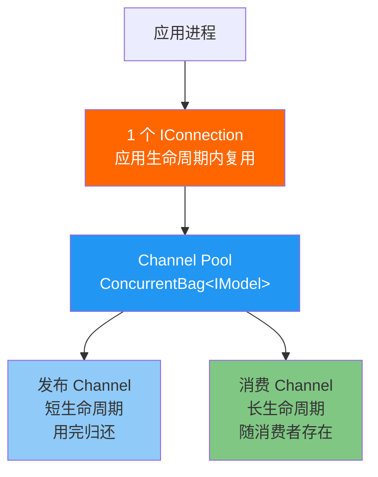
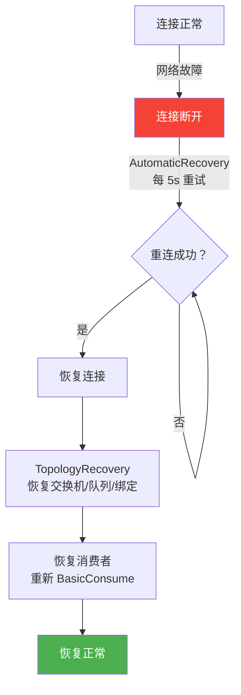

# RabbitMQ.Client 原生开发

RabbitMQ.Client 是 RabbitMQ 官方 .NET SDK，提供最底层的 AMQP 0-9-1 操作能力。掌握连接管理、Channel 复用、异常处理、自动恢复等生产级模式，是用好 RabbitMQ 的基本功。

## 1. ConnectionFactory 最佳实践

### 基础配置

```csharp
using RabbitMQ.Client;

var factory = new ConnectionFactory
{
    HostName = "localhost",
    Port = 5672,
    UserName = "app_user",
    Password = "secure_password",
    VirtualHost = "/",

    // 自动恢复
    AutomaticRecoveryEnabled = true,                // 连接断开自动重连
    NetworkRecoveryInterval = TimeSpan.FromSeconds(5), // 重连间隔
    TopologyRecoveryEnabled = true,                  // 恢复交换机、队列、绑定、消费者

    // 心跳与超时
    RequestedHeartbeat = TimeSpan.FromSeconds(60),   // 心跳间隔
    RequestedConnectionTimeout = TimeSpan.FromSeconds(30),
    RequestedChannelMax = 2047,                      // 最大 Channel 数
    RequestedFrameMax = 0,                           // 帧大小（0=无限制）

    // SNI / TLS
    Ssl = new SslOption { Enabled = false }
};
```

### 集群连接

```csharp
// 方式一：多个 Endpoint（推荐）
var endpoints = new List<AmqpTcpEndpoint>
{
    new() { HostName = "rmq-1", Port = 5672 },
    new() { HostName = "rmq-2", Port = 5672 },
    new() { HostName = "rmq-3", Port = 5672 }
};

using var connection = factory.CreateConnection(endpoints, "my-app-name");
// 客户端随机选择一个可用节点

// 方式二：通过 LB VIP 连接
factory.HostName = "10.0.0.100";  // HAProxy VIP
using var connection = factory.CreateConnection("my-app-name");
```

## 2. 连接与 Channel 生命周期

### 核心原则



| 资源 | 生命周期 | 线程安全 | 说明 |
|------|----------|----------|------|
| `IConnection` | 应用级（单例） | ✅ 线程安全 | 一个应用一个连接 |
| `IModel`（Channel） | 操作级（池化） | ❌ **非线程安全** | 每次操作获取/归还 |

::: danger IModel 不是线程安全的！
`IModel`（Channel）**不能**被多个线程同时使用。并发调用 `BasicPublish`、`BasicAck` 等方法会导致帧错乱和连接断开。必须每个线程使用独立的 Channel，或通过 Channel 池分配。
:::

### Channel 池实现

```csharp
using RabbitMQ.Client;
using System.Collections.Concurrent;

public class ChannelPool : IDisposable
{
    private readonly IConnection _connection;
    private readonly ConcurrentBag<IModel> _pool = new();
    private readonly int _maxPoolSize;
    private int _currentCount;
    private bool _disposed;

    public ChannelPool(IConnection connection, int maxPoolSize = 50)
    {
        _connection = connection;
        _maxPoolSize = maxPoolSize;
    }

    public IModel Rent()
    {
        if (_disposed)
            throw new ObjectDisposedException(nameof(ChannelPool));

        if (_pool.TryTake(out var channel))
        {
            if (channel.IsOpen)
                return channel;

            // Channel 已关闭，创建新的
            channel.Dispose();
            Interlocked.Decrement(ref _currentCount);
        }

        if (Interlocked.Increment(ref _currentCount) > _maxPoolSize)
        {
            Interlocked.Decrement(ref _currentCount);
            throw new InvalidOperationException($"Channel pool exhausted (max={_maxPoolSize})");
        }

        return _connection.CreateModel();
    }

    public void Return(IModel channel)
    {
        if (_disposed || !channel.IsOpen)
        {
            channel.Dispose();
            Interlocked.Decrement(ref _currentCount);
            return;
        }

        _pool.Add(channel);
    }

    public void Dispose()
    {
        if (_disposed) return;
        _disposed = true;

        while (_pool.TryTake(out var channel))
        {
            channel.Dispose();
        }
    }
}
```

### 使用 Channel 池发布消息

```csharp
public class Publisher
{
    private readonly ChannelPool _channelPool;

    public Publisher(ChannelPool channelPool)
    {
        _channelPool = channelPool;
    }

    public void Publish(string exchange, string routingKey, byte[] body, IBasicProperties? props = null)
    {
        var channel = _channelPool.Rent();
        try
        {
            channel.BasicPublish(exchange, routingKey, props, body);
        }
        finally
        {
            _channelPool.Return(channel);
        }
    }

    public bool PublishWithConfirm(string exchange, string routingKey, byte[] body, TimeSpan timeout)
    {
        var channel = _channelPool.Rent();
        try
        {
            channel.ConfirmSelect();
            channel.BasicPublish(exchange, routingKey, null, body);
            return channel.WaitForConfirms(timeout);
        }
        finally
        {
            // 确认模式 Channel 不能复用，直接关闭
            channel.Dispose();
            // 不归还到池
        }
    }
}
```

::: tip Confirm 模式 Channel 不宜复用
开启 `ConfirmSelect` 的 Channel 有确认序号状态，复用可能导致序号错乱。建议 Confirm Channel 用完即关。
:::

## 3. 异步发布

RabbitMQ.Client 6.x+ 提供了异步发布 API，避免阻塞调用线程：

```csharp
public class AsyncPublisher
{
    private readonly IConnection _connection;
    private readonly ChannelPool _channelPool;

    public async Task PublishAsync(string exchange, string routingKey, byte[] body,
        CancellationToken ct = default)
    {
        var channel = _channelPool.Rent();
        try
        {
            channel.ConfirmSelect();
            channel.BasicPublish(exchange, routingKey, null, body);

            // 异步等待确认
            var tcs = new TaskCompletionSource<bool>();
            var timeoutCts = CancellationTokenSource.CreateLinkedTokenSource(ct);
            timeoutCts.CancelAfter(TimeSpan.FromSeconds(5));

            timeoutCts.Token.Register(() => tcs.TrySetResult(false));

            channel.BasicAcks += (sender, ea) =>
            {
                tcs.TrySetResult(true);
            };
            channel.BasicNacks += (sender, ea) =>
            {
                tcs.TrySetResult(false);
            };

            var confirmed = await tcs.Task;
            if (!confirmed)
            {
                throw new Exception($"Message nacked by broker: exchange={exchange}, routingKey={routingKey}");
            }
        }
        finally
        {
            channel.Dispose(); // Confirm channel 不复用
        }
    }
}
```

## 4. 消费者：DI 集成与优雅关闭

### IHostedService 消费者

```csharp
using Microsoft.Extensions.Hosting;
using Microsoft.Extensions.Logging;
using RabbitMQ.Client;
using RabbitMQ.Client.Events;

public class OrderConsumer : BackgroundService
{
    private readonly ILogger<OrderConsumer> _logger;
    private readonly IServiceScopeFactory _scopeFactory;
    private IConnection? _connection;
    private IModel? _channel;

    public OrderConsumer(ILogger<OrderConsumer> logger, IServiceScopeFactory scopeFactory)
    {
        _logger = logger;
        _scopeFactory = scopeFactory;
    }

    protected override Task ExecuteAsync(CancellationToken stoppingToken)
    {
        var factory = new ConnectionFactory
        {
            HostName = "localhost",
            AutomaticRecoveryEnabled = true,
            TopologyRecoveryEnabled = true,
            NetworkRecoveryInterval = TimeSpan.FromSeconds(5),
            RequestedHeartbeat = TimeSpan.FromSeconds(60)
        };

        _connection = factory.CreateConnection();
        _channel = _connection.CreateModel();

        // 声明拓扑
        _channel.QueueDeclare("order.queue", durable: true, exclusive: false, autoDelete: false);
        _channel.BasicQos(0, 20, false);

        var consumer = new EventingBasicConsumer(_channel);
        consumer.Received += async (model, ea) =>
        {
            try
            {
                using var scope = _scopeFactory.CreateScope();
                var handler = scope.ServiceProvider.GetRequiredService<IOrderHandler>();

                var json = Encoding.UTF8.GetString(ea.Body.ToArray());
                await handler.HandleAsync(json, stoppingToken);

                _channel.BasicAck(ea.DeliveryTag, false);
            }
            catch (Exception ex)
            {
                _logger.LogError(ex, "处理消息失败: {DeliveryTag}", ea.DeliveryTag);
                _channel.BasicNack(ea.DeliveryTag, false, true); // 重回队列
            }
        };

        _channel.BasicConsume("order.queue", false, consumer);
        _logger.LogInformation("OrderConsumer 已启动");

        return Task.CompletedTask;
    }

    public override async Task StopAsync(CancellationToken cancellationToken)
    {
        _logger.LogInformation("OrderConsumer 正在优雅关闭...");
        _channel?.Close();
        _connection?.Close();
        await base.StopAsync(cancellationToken);
    }

    public override void Dispose()
    {
        _channel?.Dispose();
        _connection?.Dispose();
        base.Dispose();
    }
}
```

### 注册到 DI

```csharp
// Program.cs
builder.Services.AddScoped<IOrderHandler, OrderHandler>();
builder.Services.AddHostedService<OrderConsumer>();
```

## 5. 异常处理

### 常见异常

| 异常类型 | 触发场景 | 处理方式 |
|----------|----------|----------|
| `AlreadyClosedException` | 连接/Channel 已关闭 | 触发重连或降级 |
| `OperationInterruptedException` | 操作被中断（如 Channel 被 Close） | 检查错误码，决定重试或放弃 |
| `BrokerUnreachableException` | 无法连接 Broker | 重试连接 |
| `TimeoutException` | 操作超时 | 检查网络和 Broker 状态 |

```csharp
try
{
    channel.BasicPublish(exchange, routingKey, props, body);
}
catch (AlreadyClosedException ex)
{
    // 连接已断开，触发重连逻辑
    _logger.LogWarning(ex, "连接已断开，等待自动恢复...");
}
catch (OperationInterruptedException ex)
{
    // 检查关闭原因
    var reason = ex.ShutdownReason;
    _logger.LogError(ex, "操作被中断: {Reason}", reason?.ReplyText);

    if (reason?.ReplyCode == 404)
    {
        // Exchange/Queue 不存在，需要重新声明
    }
    else if (reason?.ReplyCode == 403)
    {
        // 权限不足
    }
}
catch (BrokerUnreachableException ex)
{
    _logger.LogError(ex, "无法连接 RabbitMQ Broker");
    // 触发断路器
}
```

## 6. 自动恢复机制



### 自动恢复的局限

```csharp
// ✅ 自动恢复能恢复的
// - 连接本身
// - 交换机声明
// - 队列声明
// - 绑定关系
// - 消费者注册（BasicConsume）

// ❌ 自动恢复不能恢复的
// - Channel 的 ConfirmSelect 状态
// - Channel 的 BasicQos 设置
// - 已发布但未确认的消息
// - 消费者的内部状态
```

::: important 手动恢复补充
自动恢复后，建议在 `ConnectionRecoveryCallback` 中重新设置 Channel 属性：

```csharp
connection.RecoverySucceeded += (sender, e) =>
{
    // 重新创建 Channel 并设置 QoS
    var channel = connection.CreateModel();
    channel.BasicQos(0, 20, false);
    channel.ConfirmSelect();
};
```
:::

## 7. 配置管理

### appsettings.json

```json
{
  "RabbitMQ": {
    "Hosts": [ "rmq-1", "rmq-2", "rmq-3" ],
    "Port": 5672,
    "UserName": "app_user",
    "Password": "secure_password",
    "VirtualHost": "/",
    "AutomaticRecoveryEnabled": true,
    "NetworkRecoveryIntervalSeconds": 5,
    "RequestedHeartbeatSeconds": 60,
    "PrefetchCount": 20,
    "ChannelPoolSize": 50,
    "ConfirmTimeoutSeconds": 5
  }
}
```

### 配置绑定

```csharp
public class RabbitMqOptions
{
    public string[] Hosts { get; set; } = ["localhost"];
    public int Port { get; set; } = 5672;
    public string UserName { get; set; } = "guest";
    public string Password { get; set; } = "guest";
    public string VirtualHost { get; set; } = "/";
    public bool AutomaticRecoveryEnabled { get; set; } = true;
    public int NetworkRecoveryIntervalSeconds { get; set; } = 5;
    public int RequestedHeartbeatSeconds { get; set; } = 60;
    public ushort PrefetchCount { get; set; } = 20;
    public int ChannelPoolSize { get; set; } = 50;
    public int ConfirmTimeoutSeconds { get; set; } = 5;
}

// Program.cs
builder.Services.Configure<RabbitMqOptions>(builder.Configuration.GetSection("RabbitMQ"));
builder.Services.AddSingleton<IConnection>(sp =>
{
    var opts = sp.GetRequiredService<IOptions<RabbitMqOptions>>().Value;
    var factory = new ConnectionFactory
    {
        UserName = opts.UserName,
        Password = opts.Password,
        VirtualHost = opts.VirtualHost,
        AutomaticRecoveryEnabled = opts.AutomaticRecoveryEnabled,
        NetworkRecoveryInterval = TimeSpan.FromSeconds(opts.NetworkRecoveryIntervalSeconds),
        RequestedHeartbeat = TimeSpan.FromSeconds(opts.RequestedHeartbeatSeconds)
    };

    var endpoints = opts.Hosts.Select(h => new AmqpTcpEndpoint { HostName = h, Port = opts.Port }).ToList();
    return factory.CreateConnection(endpoints, "my-app");
});
builder.Services.AddSingleton<ChannelPool>(sp =>
{
    var opts = sp.GetRequiredService<IOptions<RabbitMqOptions>>().Value;
    var connection = sp.GetRequiredService<IConnection>();
    return new ChannelPool(connection, opts.ChannelPoolSize);
});
```

## 面试技巧

::: tip 高频考点
1. **"Connection 和 Channel 的关系？"** —— Connection 是 TCP 连接，应用级复用（单例）；Channel 是 Connection 上的虚拟连接，轻量级但**非线程安全**。一个 Connection 可以有多个 Channel。
2. **"Channel 为什么不能多线程共用？"** —— AMQP 帧在 Channel 上是顺序传输的，多线程并发操作会导致帧交错，破坏协议。解决方案：Channel 池（每次操作获取独立 Channel）。
3. **"如何保证发布消息不丢失？"** —— Publisher Confirm：`ConfirmSelect()` + `WaitForConfirms()`。消息持久化：`DeliveryMode=2`。交换机和队列 `durable=true`。
4. **"消费者如何集成 DI？"** —— `BackgroundService` + `IServiceScopeFactory.CreateScope()`，每条消息创建独立 Scope，获取 Scoped 服务。注意不要在构造函数中创建 Scope。
5. **"自动恢复有什么局限？"** —— 能恢复连接、拓扑、消费者；不能恢复 Confirm 状态、QoS 设置、未确认消息。重连后需要手动补充设置。
:::

---

**参考资料**

- [RabbitMQ 官方文档 - .NET Client](https://www.rabbitmq.com/client-libraries/dotnet-api-guide)
- [RabbitMQ .NET Client GitHub](https://github.com/rabbitmq/rabbitmq-dotnet-client)
- [RabbitMQ 官方文档 - Publisher Confirms](https://www.rabbitmq.com/docs/confirms)
- 《RabbitMQ 实战指南》朱忠华 — 第 6 章客户端开发
