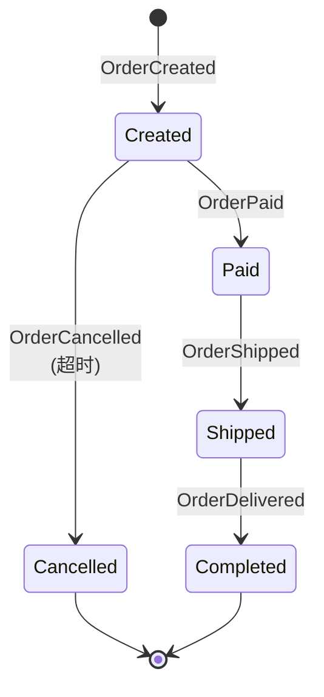
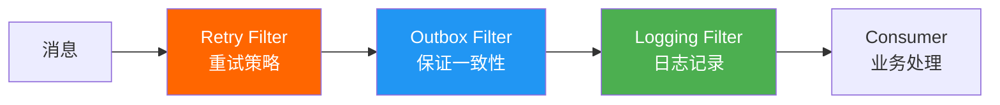
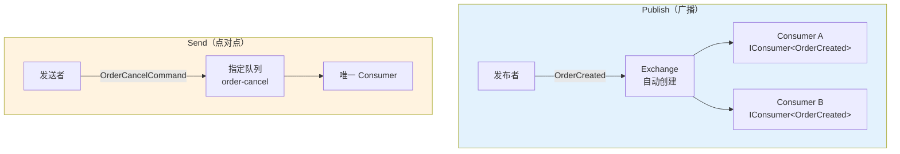

# MassTransit 框架实战

MassTransit 是 .NET 生态最强大的消息总线框架，提供 Consumer、Saga、Scheduler、Middleware Pipeline 等企业级特性，是构建微服务事件驱动架构的首选。

## 1. 快速入门

### 安装

```bash
dotnet add package MassTransit.RabbitMQ
```

### 最小配置

```csharp
// Program.cs
using MassTransit;

var builder = WebApplication.CreateBuilder(args);

builder.Services.AddMassTransit(x =>
{
    x.UsingRabbitMq((context, cfg) =>
    {
        cfg.Host("localhost", "/", h =>
        {
            h.Username("guest");
            h.Password("guest");
        });

        cfg.ConfigureEndpoints(context);
    });
});

var app = builder.Build();
app.Run();
```

## 2. 消息定义与 Consumer

### 消息契约

```csharp
// 消息是接口（MassTransit 约定）
public interface OrderCreated
{
    Guid OrderId { get; }
    decimal Amount { get; }
    DateTime CreatedAt { get; }
}

public interface OrderPaid
{
    Guid OrderId { get; }
    decimal Amount { get; }
    DateTime PaidAt { get; }
}

public interface OrderCancelled
{
    Guid OrderId { get; }
    string Reason { get; }
}
```

### Consumer 实现

```csharp
using MassTransit;
using Microsoft.Extensions.Logging;

public class OrderCreatedConsumer : IConsumer<OrderCreated>
{
    private readonly ILogger<OrderCreatedConsumer> _logger;

    public OrderCreatedConsumer(ILogger<OrderCreatedConsumer> logger)
    {
        _logger = logger;
    }

    public async Task Consume(ConsumeContext<OrderCreated> context)
    {
        _logger.LogInformation(
            "订单已创建: OrderId={OrderId}, Amount={Amount}",
            context.Message.OrderId, context.Message.Amount);

        // 业务处理：发通知、扣库存等
        await Task.Delay(100); // 模拟处理

        // 发布新事件
        await context.Publish<OrderPaid>(new
        {
            OrderId = context.Message.OrderId,
            Amount = context.Message.Amount,
            PaidAt = DateTime.UtcNow
        });
    }
}
```

### 注册 Consumer

```csharp
builder.Services.AddMassTransit(x =>
{
    // 自动注册所有 Consumer
    x.AddConsumer<OrderCreatedConsumer>();
    x.AddConsumer<OrderPaidConsumer>();

    x.UsingRabbitMq((context, cfg) =>
    {
        cfg.Host("localhost", "/", h =>
        {
            h.Username("guest");
            h.Password("guest");
        });

        // 配置接收端点
        cfg.ReceiveEndpoint("order-service", e =>
        {
            e.ConfigureConsumer<OrderCreatedConsumer>(context);
            e.ConfigureConsumer<OrderPaidConsumer>(context);

            // Prefetch
            e.PrefetchCount = 20;

            // 重试策略
            e.UseMessageRetry(r => r.Exponential(5,
                TimeSpan.FromSeconds(1),
                TimeSpan.FromSeconds(30),
                TimeSpan.FromSeconds(5)));
        });

        // 或自动配置所有端点
        // cfg.ConfigureEndpoints(context);
    });
});
```

### ConsumerDefinition

```csharp
public class OrderCreatedConsumerDefinition : ConsumerDefinition<OrderCreatedConsumer>
{
    public OrderCreatedConsumerDefinition()
    {
        // 端点名称
        EndpointName = "order-created";

        // 并发限制
        ConcurrentMessageLimit = 10;
    }

    protected override void ConfigureConsumer(
        IReceiveEndpointConfigurator endpointConfigurator,
        IConsumerConfigurator<OrderCreatedConsumer> consumerConfigurator,
        IRegistrationContext context)
    {
        // Prefetch
        endpointConfigurator.PrefetchCount = ConcurrentMessageLimit * 2;

        // 重试
        endpointConfigurator.UseMessageRetry(r => r
            .Exponential(5, TimeSpan.FromSeconds(1),
                TimeSpan.FromSeconds(30), TimeSpan.FromSeconds(5)));

        // 异常过滤
        endpointConfigurator.UseInMemoryOutbox(context); // 保证消息一致性
    }
}
```

## 3. Saga 状态机

### 订单流程 Saga



### Saga 状态机实现

```csharp
using MassTransit;
using MassTransit.SagaStateMachine;

public class OrderStateMachine : MassTransitStateMachine<OrderState>
{
    public State Created { get; private set; } = null!;
    public State Paid { get; private set; } = null!;
    public State Shipped { get; private set; } = null!;
    public State Completed { get; private set; } = null!;
    public State Cancelled { get; private set; } = null!;

    public Event<OrderCreated> OrderCreatedEvent { get; private set; } = null!;
    public Event<OrderPaid> OrderPaidEvent { get; private set; } = null!;
    public Event<OrderShipped> OrderShippedEvent { get; private set; } = null!;
    public Event<OrderDelivered> OrderDeliveredEvent { get; private set; } = null!;
    public Event<OrderCancelled> OrderCancelledEvent { get; private set; } = null!;
    public Event<OrderTimeout> OrderTimeoutEvent { get; private set; } = null!;

    public OrderStateMachine()
    {
        // 状态属性
        InstanceState(x => x.CurrentState);

        // 事件绑定 —— CorrelationId 关联
        Event(() => OrderCreatedEvent, x =>
        {
            x.CorrelateById(c => c.Message.OrderId);
            x.InsertOnInitial = true; // 首次事件自动创建 Saga 实例
        });
        Event(() => OrderPaidEvent, x => x.CorrelateById(c => c.Message.OrderId));
        Event(() => OrderShippedEvent, x => x.CorrelateById(c => c.Message.OrderId));
        Event(() => OrderDeliveredEvent, x => x.CorrelateById(c => c.Message.OrderId));
        Event(() => OrderCancelledEvent, x => x.CorrelateById(c => c.Message.OrderId));
        Event(() => OrderTimeoutEvent, x => x.CorrelateById(c => c.Message.OrderId));

        // 超时事件
        Schedule(() => OrderTimeoutSchedule, x => x.TimeoutTokenId, s =>
        {
            s.Delay = TimeSpan.FromMinutes(30);
            s.Received = e => e.CorrelateById(c => c.Message.OrderId);
        });

        // 状态转换
        Initially(
            When(OrderCreatedEvent)
                .Then(c => c.Saga.Amount = c.Message.Amount)
                .Schedule(OrderTimeoutSchedule, c => new OrderTimeout { OrderId = c.Saga.CorrelationId },
                    TimeSpan.FromMinutes(30))
                .TransitionTo(Created));

        During(Created,
            When(OrderPaidEvent)
                .Then(c => c.Saga.PaidAt = c.Message.PaidAt)
                .Unschedule(OrderTimeoutSchedule)
                .TransitionTo(Paid),
            When(OrderTimeoutEvent)
                .Publish(c => (OrderCancelled)new { OrderId = c.Saga.CorrelationId, Reason = "支付超时" })
                .TransitionTo(Cancelled),
            When(OrderCancelledEvent)
                .Unschedule(OrderTimeoutSchedule)
                .TransitionTo(Cancelled));

        During(Paid,
            When(OrderShippedEvent)
                .TransitionTo(Shipped));

        During(Shipped,
            When(OrderDeliveredEvent)
                .TransitionTo(Completed));
    }

    public Schedule<OrderState, OrderTimeout> OrderTimeoutSchedule { get; private set; } = null!;
}

// Saga 状态实例
public class OrderState : SagaStateMachineInstance
{
    public Guid CorrelationId { get; set; }     // OrderId
    public string CurrentState { get; set; } = null!;
    public decimal Amount { get; set; }
    public DateTime? PaidAt { get; set; }
    public Guid? TimeoutTokenId { get; set; }   // 调度令牌
}

// 超时事件
public interface OrderTimeout
{
    Guid OrderId { get; }
}

// 补充事件
public interface OrderShipped { Guid OrderId { get; } }
public interface OrderDelivered { Guid OrderId { get; } }
```

### 注册 Saga

```csharp
builder.Services.AddMassTransit(x =>
{
    x.AddSagaStateMachine<OrderStateMachine, OrderState>()
        .InMemoryRepository();   // 开发环境用内存
        // .EntityFrameworkRepository<...>(); // 生产用 EF Core / Redis

    x.UsingRabbitMq((context, cfg) =>
    {
        cfg.Host("localhost", "/", h =>
        {
            h.Username("guest");
            h.Password("guest");
        });

        cfg.ConfigureEndpoints(context);
    });
});
```

## 4. 调度器：Quartz 集成

MassTransit 集成 Quartz 实现延迟消息和定时任务：

```bash
dotnet add package MassTransit.Quartz
dotnet add package Quartz
dotnet add package Quartz.Serialization.Json
```

```csharp
builder.Services.AddMassTransit(x =>
{
    x.AddQuartz();  // 启用 Quartz 调度

    x.UsingRabbitMq((context, cfg) =>
    {
        cfg.Host("localhost", "/", h =>
        {
            h.Username("guest");
            h.Password("guest");
        });

        cfg.UseQuartz();  // 配合 Quartz

        cfg.ConfigureEndpoints(context);
    });
});
```

### 发送延迟消息

```csharp
public class OrderService
{
    private readonly IPublishEndpoint _publishEndpoint;
    private readonly IMessageScheduler _scheduler;

    public OrderService(IPublishEndpoint publishEndpoint, IMessageScheduler scheduler)
    {
        _publishEndpoint = publishEndpoint;
        _scheduler = scheduler;
    }

    // 方式一：使用 SchedulePublish
    public async Task CreateOrderAsync(Guid orderId, decimal amount)
    {
        await _publishEndpoint.Publish<OrderCreated>(new { OrderId = orderId, Amount = amount, CreatedAt = DateTime.UtcNow });

        // 30 分钟后发送超时检查
        await _scheduler.SchedulePublish<OrderTimeout>(
            DateTime.UtcNow.AddMinutes(30),
            new { OrderId = orderId });
    }

    // 方式二：使用 Send（点对点）
    public async Task CancelOrderAsync(Guid orderId)
    {
        await _scheduler.ScheduleSend<IOrderCancelCommand>(
            new Uri("queue:order-cancel"),
            DateTime.UtcNow.AddMinutes(5),
            new { OrderId = orderId, Reason = "用户取消" });
    }
}
```

## 5. 中间件管道

MassTransit 提供丰富的中间件（Filter）管道，可以在消息处理前后插入逻辑：



### 常用中间件

```csharp
cfg.ReceiveEndpoint("order-service", e =>
{
    // 1. 重试策略
    e.UseMessageRetry(r => r
        .Exponential(5,
            TimeSpan.FromSeconds(1),
            TimeSpan.FromSeconds(30),
            TimeSpan.FromSeconds(5)));

    // 2. 限流
    e.UseRateLimit(100, TimeSpan.FromSeconds(1));

    // 3. 内存 Outbox（保证 Publish 的一致性）
    e.UseInMemoryOutbox();

    // 4. 日志
    e.UseDelayedMessageScheduler();

    // 5. Circuit Breaker
    e.UseCircuitBreaker(cb =>
    {
        cb.TrackingPeriod = TimeSpan.FromMinutes(1);
        cb.TripThreshold = 15;    // 15% 失败率触发断路
        cb.ActiveThreshold = 10;  // 10 次请求后开始计算
        cb.ResetInterval = TimeSpan.FromMinutes(5);
    });

    e.ConfigureConsumer<OrderCreatedConsumer>(context);
});
```

### 自定义 Filter

```csharp
public class TracingFilter<T> : IFilter<ConsumeContext<T>> where T : class
{
    private readonly ILogger<TracingFilter<T>> _logger;

    public TracingFilter(ILogger<TracingFilter<T>> logger)
    {
        _logger = logger;
    }

    public async Task Send(ConsumeContext<T> context, IPipe<ConsumeContext<T>> next)
    {
        var messageId = context.MessageId ?? Guid.Empty;
        using var activity = DiagnosticsConfig.ActivitySource.StartActivity($"consume {typeof(T).Name}");
        activity?.SetTag("messaging.message_id", messageId.ToString());

        _logger.LogInformation("开始处理消息: {MessageType}, MessageId={MessageId}",
            typeof(T).Name, messageId);

        var sw = Stopwatch.StartNew();
        try
        {
            await next.Send(context);
            _logger.LogInformation("消息处理完成: {MessageType}, 耗时={Elapsed}ms",
                typeof(T).Name, sw.ElapsedMilliseconds);
        }
        catch (Exception ex)
        {
            activity?.SetStatus(ActivityStatusCode.Error, ex.Message);
            _logger.LogError(ex, "消息处理失败: {MessageType}, MessageId={MessageId}",
                typeof(T).Name, messageId);
            throw;
        }
    }

    public void Probe(ProbeContext context)
    {
        context.CreateFilterScope("tracing");
    }
}
```

## 6. 重试策略

| 策略 | API | 说明 |
|------|-----|------|
| 立即重试 | `Immediate(N)` | 连续重试 N 次 |
| 间隔重试 | `Interval(N, interval)` | 每次间隔固定时间 |
| 指数退避 | `Exponential(N, min, max, interval)` | 间隔指数增长 |
| 随机间隔 | `Random(N, min, max)` | 随机间隔 |

```csharp
// 指数退避重试（推荐）
e.UseMessageRetry(r => r.Exponential(
    retryLimit: 5,
    minInterval: TimeSpan.FromSeconds(1),
    maxInterval: TimeSpan.FromSeconds(30),
    intervalDelta: TimeSpan.FromSeconds(5)
));

// 仅对特定异常重试
e.UseMessageRetry(r => r.Exponential(5,
    TimeSpan.FromSeconds(1),
    TimeSpan.FromSeconds(30),
    TimeSpan.FromSeconds(5),
    ex => ex is TimeoutException or HttpRequestException
));
```

## 7. Publish vs Send

```csharp
// Publish：广播，所有订阅了该消息类型的 Consumer 都会收到
await _publishEndpoint.Publish<OrderCreated>(new { OrderId = orderId });

// Send：点对点，发送到指定队列
await _sendEndpointProvider.Send<OrderCancelCommand>(
    new Uri("queue:order-cancel"),
    new { OrderId = orderId });
```



## 8. 自动拓扑管理

MassTransit 根据消息类型自动创建 Exchange 和 Queue：

```
消息类型: OrderCreated
  → Exchange: OrderCreated (topic)
  → Queue: order-created (ReceiveEndpoint 名称)
  → Binding: OrderCreated → order-created
```

::: tip 拓扑自动管理的好处
- 不需要手动声明 Exchange、Queue、Binding
- 消息类型即路由键，类型安全
- 消费者启动时自动创建所需拓扑
:::

## 9. 完整示例：订单处理管道

```csharp
// Program.cs
var builder = WebApplication.CreateBuilder(args);

builder.Services.AddMassTransit(x =>
{
    x.AddConsumer<OrderCreatedConsumer, OrderCreatedConsumerDefinition>();
    x.AddConsumer<OrderPaidConsumer>();

    x.AddSagaStateMachine<OrderStateMachine, OrderState>()
        .InMemoryRepository();

    x.AddQuartz();

    x.UsingRabbitMq((context, cfg) =>
    {
        cfg.Host("localhost", "/", h =>
        {
            h.Username("guest");
            h.Password("guest");
        });

        cfg.UseQuartz();
        cfg.ConfigureEndpoints(context);

        // 全局重试
        cfg.UseMessageRetry(r => r.Exponential(5,
            TimeSpan.FromSeconds(1),
            TimeSpan.FromSeconds(30),
            TimeSpan.FromSeconds(5)));

        // 全局限流
        cfg.UseRateLimit(1000, TimeSpan.FromSeconds(1));
    });
});

builder.Services.AddOpenTelemetry()
    .WithTracing(tracing =>
    {
        tracing
            .SetResourceBuilder(ResourceBuilder.CreateDefault().AddService("OrderService"))
            .AddSource("MassTransit")
            .AddOtlpExporter();
    });

var app = builder.Build();
app.Run();
```

## 面试技巧

::: tip 高频考点
1. **"MassTransit 和 RabbitMQ.Client 的区别？"** —— RabbitMQ.Client 是底层 SDK，需手动管理连接/Channel/拓扑；MassTransit 是高级框架，自动管理拓扑、DI 集成、重试、Saga、调度。选择：简单场景用 Client，复杂业务用 MassTransit。
2. **"Saga 是什么？MassTransit 怎么实现？"** —— Saga 是长事务编排模式，用状态机管理跨服务的业务流程。MassTransit 通过 `MassTransitStateMachine<T>` 实现，支持状态转换、超时调度、事件关联。
3. **"MassTransit 的重试策略怎么选？"** —— 推荐 `Exponential`（指数退避）：初始 1s，逐步增长到 30s，最多 5 次。避免 `Immediate`（可能加剧故障）。仅对可重试异常（网络超时、临时不可用）重试。
4. **"UseInMemoryOutbox 的作用？"** —— 保证 Consumer 内的 Publish/Send 操作与消费确认的原子性：如果 Consumer 成功处理但 Publish 失败，Outbox 确保消息不丢。类似数据库事务但作用于消息。
5. **"Publish 和 Send 的区别？"** —— Publish 是广播，所有订阅 Consumer 都收到；Send 是点对点，发送到指定队列只有一个 Consumer 处理。事件通知用 Publish，命令用 Send。
:::

---

**参考资料**

- [MassTransit 官方文档](https://masstransit.io/)
- [MassTransit GitHub](https://github.com/MassTransit/MassTransit)
- [MassTransit - Sagas](https://masstransit.io/documentation/patterns/saga)
- [MassTransit - Quartz Integration](https://masstransit.io/documentation/configuration/scheduling/quartz)
- 《RabbitMQ 实战指南》朱忠华 — 第 6 章集成模式
