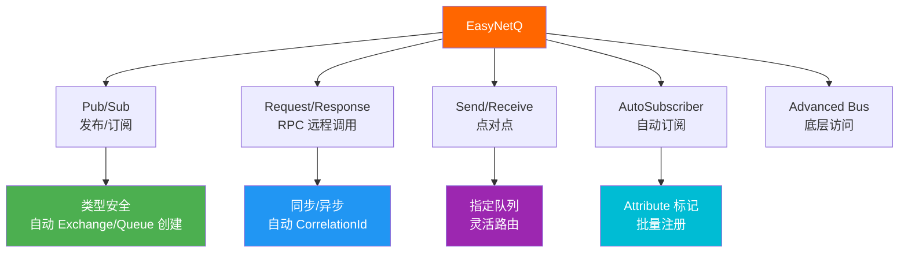
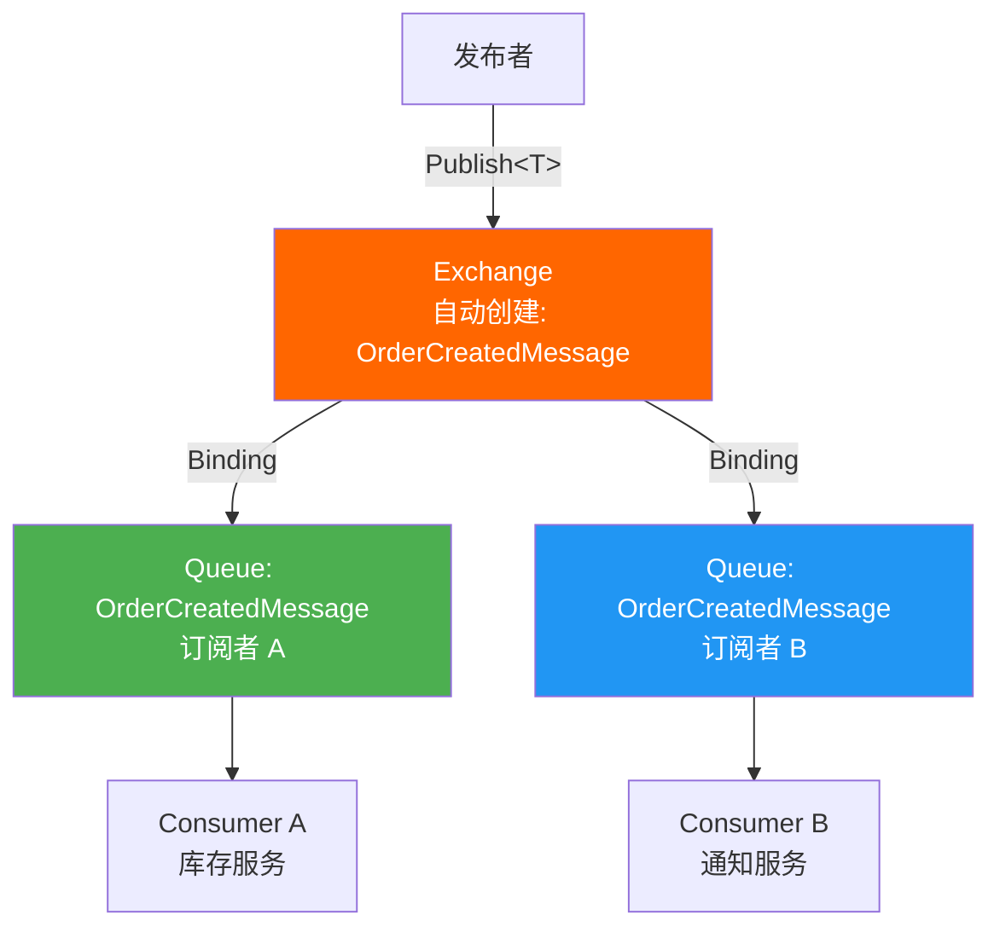
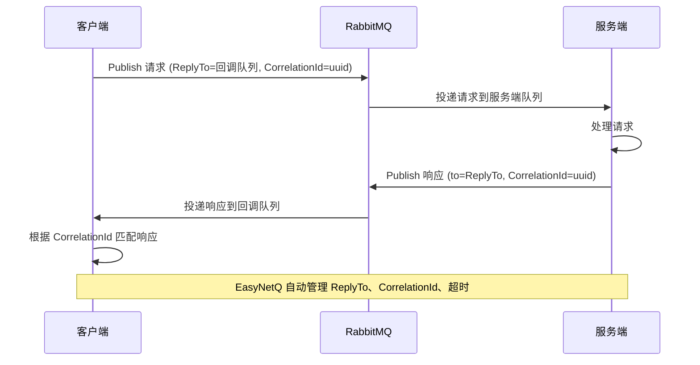
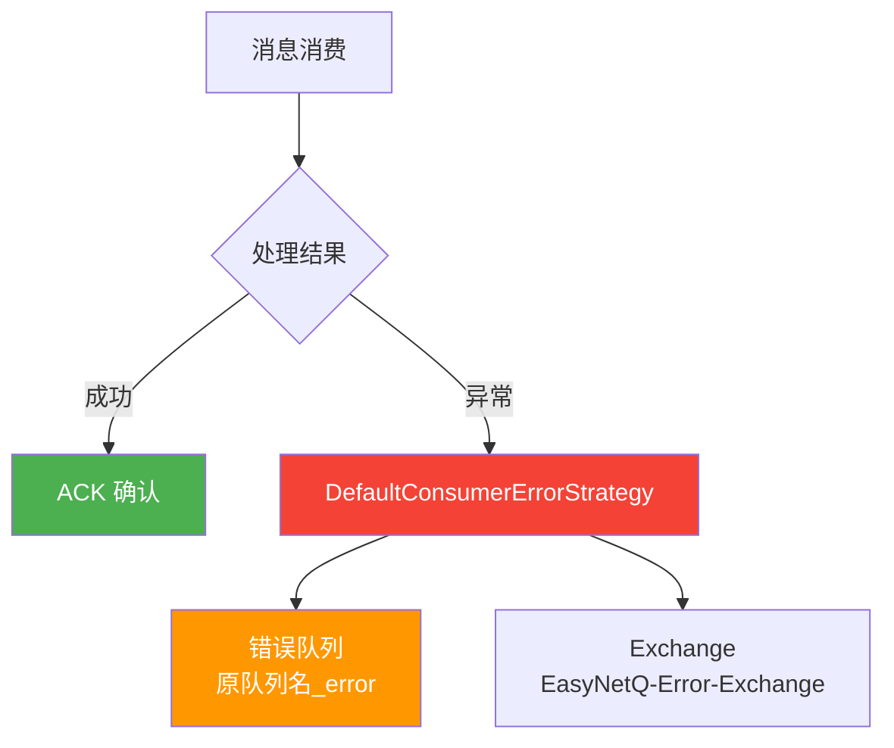
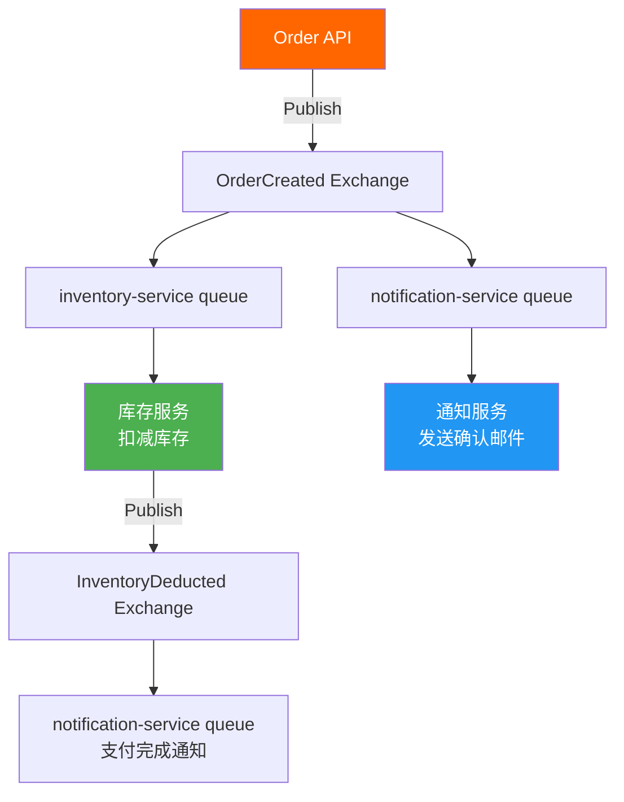
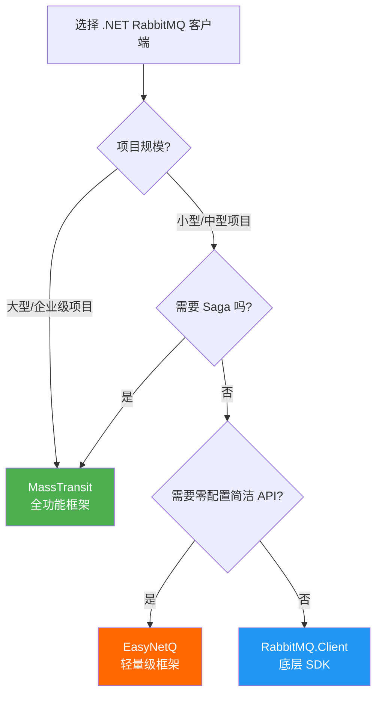

# EasyNetQ 轻量级开发

EasyNetQ 是 .NET 生态最轻量的 RabbitMQ 客户端框架，提供类型安全的 Publish/Subscribe、Request/Response (RPC)、Send/Receive 等高级 API，零配置自动拓扑管理，适合追求简洁和性能的项目。



## 1. 快速入门

### 安装

```bash
dotnet add package EasyNetQ
```

### 创建 Bus

```csharp
using EasyNetQ;

// 基本连接
using var bus = RabbitHutch.CreateBus("host=localhost;username=guest;password=guest");

// 完整连接字符串
using var bus = RabbitHutch.CreateBus(
    "host=rabbit1:5672,rabbit2:5672;username=admin;password=admin123;virtualHost=/production;prefetchCount=50;timeout=30");

// 带高级配置
using var bus = RabbitHutch.CreateBus("host=localhost", options =>
{
    options.ConsumerPrefetchCount = 20;
    options.Timeout = TimeSpan.FromSeconds(30);

    // 序列化
    options.Register<ISerializer>(_ => new NewtonsoftJsonSerializer());

    // 连接管理
    options.EnableConsoleLogger();
});
```

::: tip 连接字符串参数
EasyNetQ 连接字符串支持的参数：

| 参数 | 说明 | 默认值 |
|------|------|--------|
| `host` | RabbitMQ 主机（可多个，逗号分隔） | localhost |
| `port` | 端口 | 5672 |
| `username` | 用户名 | guest |
| `password` | 密码 | guest |
| `virtualHost` | 虚拟主机 | / |
| `prefetchCount` | 预取数量 | 50 |
| `timeout` | 请求超时（秒） | 10 |
| `requestedHeartbeat` | 心跳间隔（秒） | 60 |
| `publisherConfirms` | 启用发布确认 | true |
:::

## 2. 消息定义

EasyNetQ 消息是普通 C# 类，**无需实现接口或继承基类**：

```csharp
// 消息类——纯 POCO，EasyNetQ 根据类型名自动创建 Exchange 和 Queue
public class OrderCreatedMessage
{
    public Guid OrderId { get; set; }
    public string CustomerName { get; set; } = string.Empty;
    public decimal Amount { get; set; }
    public DateTime CreatedAt { get; set; }
}

public class PaymentCompletedMessage
{
    public Guid OrderId { get; set; }
    public decimal Amount { get; set; }
    public string PaymentMethod { get; set; } = string.Empty;
    public DateTime CompletedAt { get; set; }
}

// RPC 请求/响应
public class InventoryCheckRequest
{
    public string ProductId { get; set; } = string.Empty;
    public int Quantity { get; set; }
}

public class InventoryCheckResponse
{
    public bool IsAvailable { get; set; }
    public int AvailableQuantity { get; set; }
}
```

## 3. Publish / Subscribe — 发布/订阅



### 发布消息

```csharp
using var bus = RabbitHutch.CreateBus("host=localhost");

var message = new OrderCreatedMessage
{
    OrderId = Guid.NewGuid(),
    CustomerName = "张三",
    Amount = 299.9m,
    CreatedAt = DateTime.UtcNow
};

// 异步发布（推荐）
await bus.PubSub.PublishAsync(message);

// 同步发布
bus.PubSub.Publish(message);
```

### 订阅消息

```csharp
using var bus = RabbitHutch.CreateBus("host=localhost");

// subscriptionId 区分同一消息类型的不同订阅者
// 同一个 subscriptionId 的多个实例会轮询消费（竞争消费者模式）
// 不同 subscriptionId 各自收到完整消息（发布/订阅模式）
await bus.PubSub.SubscribeAsync<OrderCreatedMessage>(
    "inventory-service",    // subscriptionId
    async msg =>
    {
        Console.WriteLine($"[库存服务] 订单创建: {msg.OrderId}, 金额: {msg.Amount}");
        await Task.Delay(100); // 模拟业务处理
    });

Console.WriteLine("按 Enter 退出...");
Console.ReadLine();
```

::: important subscriptionId 的作用
- **相同 subscriptionId**：多个实例竞争消费（负载均衡）
- **不同 subscriptionId**：各自收到完整消息（广播）

```
inventory-service (实例1) + inventory-service (实例2) → 竞争消费，消息只被一个实例处理
inventory-service + notification-service → 各自收到完整消息
```
:::

### 带配置的订阅

```csharp
await bus.PubSub.SubscribeAsync<OrderCreatedMessage>(
    "inventory-service",
    async msg =>
    {
        await ProcessOrderAsync(msg);
    },
    configuration =>
    {
        // 消费者标签
        configuration.WithConsumerTag("inventory-consumer");

        // 自动确认（默认关闭，推荐手动确认）
        // configuration.WithAutoAck();

        // 队列名称（覆盖默认命名）
        configuration.WithQueueName("custom-queue-name");

        // 消息 TTL
        configuration.WithMessageTtl(TimeSpan.FromMinutes(30));

        // 最大优先级
        // configuration.WithMaxPriority(10);

        // 死信交换机
        configuration.WithDeadLetterExchange("dlx.exchange");
        configuration.WithDeadLetterRoutingKey("order.failed");
    });
```

## 4. Request / Response — RPC 远程调用



### 服务端 — 响应请求

```csharp
using var bus = RabbitHutch.CreateBus("host=localhost");

// 注册 RPC 响应处理器
await bus.Rpc.RespondAsync<InventoryCheckRequest, InventoryCheckResponse>(
    async request =>
    {
        Console.WriteLine($"[RPC] 库存查询: ProductId={request.ProductId}, Qty={request.Quantity}");

        // 模拟查询库存
        var available = await CheckInventoryAsync(request.ProductId);

        return new InventoryCheckResponse
        {
            IsAvailable = available >= request.Quantity,
            AvailableQuantity = available
        };
    },
    configuration =>
    {
        configuration.WithQueueName("inventory-check-rpc");
        configuration.WithPrefetchCount(10);
    });

Console.WriteLine("RPC 服务已启动，按 Enter 退出...");
Console.ReadLine();

static async Task<int> CheckInventoryAsync(string productId)
{
    await Task.Delay(50); // 模拟数据库查询
    return productId.StartsWith("P") ? 100 : 0;
}
```

### 客户端 — 发送请求

```csharp
using var bus = RabbitHutch.CreateBus("host=localhost");

// 同步 RPC 调用
var response = await bus.Rpc.RequestAsync<InventoryCheckRequest, InventoryCheckResponse>(
    new InventoryCheckRequest { ProductId = "P001", Quantity = 5 });

Console.WriteLine($"库存查询结果: 可用={response.IsAvailable}, 库存={response.AvailableQuantity}");
```

::: warning RPC 超时
RPC 调用默认超时 10 秒，超时抛出 `TimeoutException`。可在连接字符串中配置 `timeout=30` 或在请求时指定：

```csharp
var response = await bus.Rpc.RequestAsync<InventoryCheckRequest, InventoryCheckResponse>(
    new InventoryCheckRequest { ProductId = "P001", Quantity = 5 },
    configuration => configuration.WithTimeout(TimeSpan.FromSeconds(30)));
```

**生产环境建议**：优先使用异步消息模式（Pub/Sub），RPC 仅适合需要即时响应的场景。
:::

## 5. Send / Receive — 点对点

Send/Receive 是直接发送到指定队列的模式，不经过 Exchange 路由。


```csharp
using var bus = RabbitHutch.CreateBus("host=localhost");

// 发送到指定队列
await bus.SendReceive.SendAsync("order-processing", new OrderCreatedMessage
{
    OrderId = Guid.NewGuid(),
    CustomerName = "李四",
    Amount = 599.9m,
    CreatedAt = DateTime.UtcNow
});

// 从指定队列接收
await bus.SendReceive.ReceiveAsync<OrderCreatedMessage>(
    "order-processing",
    async msg =>
    {
        Console.WriteLine($"[处理订单] {msg.OrderId}, {msg.CustomerName}, {msg.Amount}");
        await Task.Delay(100);
    });

// 同一队列可以接收多种消息类型
await bus.SendReceive.ReceiveAsync(
    "order-processing",
    handler => handler
        .Add<OrderCreatedMessage>(async msg =>
        {
            Console.WriteLine($"订单创建: {msg.OrderId}");
        })
        .Add<PaymentCompletedMessage>(async msg =>
        {
            Console.WriteLine($"支付完成: {msg.OrderId}");
        }));
```

::: tip Publish vs Send 的区别
- **Publish**：通过 Exchange 广播，所有订阅者都收到，支持路由
- **Send**：直接发送到指定队列，只有一个消费者处理，更精确

| 特性 | Publish | Send |
|------|---------|------|
| 路由方式 | Exchange → Queue | 直接到 Queue |
| 消费者数量 | 多个订阅者 | 竞争消费者 |
| 消息类型路由 | 按类型自动路由 | 按队列手动指定 |
| 适用场景 | 事件通知 | 命令分发 |
:::

## 6. AutoSubscriber — 自动订阅

AutoSubscriber 通过 Attribute 标记自动发现和注册消息消费者。

```csharp
using EasyNetQ.AutoSubscribe;

// 定义消费者
public class OrderCreatedConsumer : IConsume<OrderCreatedMessage>
{
    private readonly ILogger<OrderCreatedConsumer> _logger;

    public OrderCreatedConsumer(ILogger<OrderCreatedConsumer> logger)
    {
        _logger = logger;
    }

    [AutoSubscribeConsumer]
    [SubscriptionId("inventory-service")]
    public async Task ConsumeAsync(OrderCreatedMessage message, CancellationToken cancellationToken)
    {
        _logger.LogInformation("库存服务处理订单: {OrderId}", message.OrderId);
        await Task.Delay(100, cancellationToken);
    }
}

public class OrderCreatedNotificationConsumer : IConsume<OrderCreatedMessage>
{
    [AutoSubscribeConsumer]
    [SubscriptionId("notification-service")]
    public async Task ConsumeAsync(OrderCreatedMessage message, CancellationToken cancellationToken)
    {
        Console.WriteLine($"[通知服务] 发送订单确认: {message.OrderId}");
        await Task.CompletedTask;
    }
}
```

### 注册 AutoSubscriber

```csharp
using var bus = RabbitHutch.CreateBus("host=localhost");

// 手动注册
var subscriber = new AutoSubscriber(bus, "order-service-subscriber");
await subscriber.SubscribeAsync(Assembly.GetExecutingAssembly());

// ASP.NET Core 集成
builder.Services.AddSingleton<IAutoSubscriberMessageDispatcher, AutofacMessageDispatcher>();
```

### 自定义 DI Dispatcher

```csharp
using EasyNetQ.AutoSubscribe;
using Microsoft.Extensions.DependencyInjection;

public class ServiceProviderMessageDispatcher : IAutoSubscriberMessageDispatcher
{
    private readonly IServiceProvider _serviceProvider;

    public ServiceProviderMessageDispatcher(IServiceProvider serviceProvider)
    {
        _serviceProvider = serviceProvider;
    }

    public async Task DispatchAsync<TMessage>(TMessage message, CancellationToken cancellationToken)
        where TMessage : class
    {
        using var scope = _serviceProvider.CreateScope();
        var consumers = scope.ServiceProvider.GetServices<IConsume<TMessage>>();

        foreach (var consumer in consumers)
        {
            await consumer.ConsumeAsync(message, cancellationToken);
        }
    }

    public async Task DispatchAsync<TMessage, TConsumer>(TMessage message, CancellationToken cancellationToken)
        where TMessage : class
        where TConsumer : IConsume<TMessage>
    {
        using var scope = _serviceProvider.CreateScope();
        var consumer = scope.ServiceProvider.GetRequiredService<TConsumer>();
        await consumer.ConsumeAsync(message, cancellationToken);
    }
}
```

## 7. 高级特性

### 自定义序列化

```csharp
using EasyNetQ.Serialization;
using System.Text.Json;

public class SystemTextJsonSerializer : ISerializer
{
    private readonly JsonSerializerOptions _options = new()
    {
        PropertyNamingPolicy = JsonNamingPolicy.CamelCase,
        WriteIndented = false,
        DefaultIgnoreCondition = System.Text.Json.Serialization.JsonIgnoreCondition.WhenWritingNull
    };

    public byte[] MessageToBytes<T>(T message) where T : class
    {
        return JsonSerializer.SerializeToUtf8Bytes(message, _options);
    }

    public T BytesToMessage<T>(byte[] bytes)
    {
        return JsonSerializer.Deserialize<T>(bytes, _options)!;
    }

    public object BytesToMessage(Type messageType, byte[] bytes)
    {
        return JsonSerializer.Deserialize(bytes, messageType, _options)!;
    }
}

// 注册
using var bus = RabbitHutch.CreateBus("host=localhost", options =>
{
    options.Register<ISerializer>(_ => new SystemTextJsonSerializer());
});
```

### 拦截器管道

```csharp
using EasyNetQ.Interception;

// 自定义 Produce 拦截器
public class TracingProduceInterceptor : IProduceConsumeInterceptor
{
    private readonly ILogger _logger;

    public TracingProduceInterceptor(ILogger<TracingProduceInterceptor> logger)
    {
        _logger = logger;
    }

    public ProducedMessage OnProduce(ProducedMessage message)
    {
        var messageId = Guid.NewGuid().ToString();
        message.Properties.MessageId = messageId;
        message.Properties.Headers ??= new Dictionary<string, object>();
        message.Properties.Headers["x-trace-id"] = messageId;
        message.Properties.Headers["x-produced-at"] = DateTime.UtcNow.ToString("O");

        _logger.LogInformation("发送消息: Type={Type}, MessageId={MessageId}",
            message.MessageType.Name, messageId);

        return message;
    }

    public ConsumedMessage OnConsume(ConsumedMessage message)
    {
        var traceId = message.Properties.Headers?.GetValueOrDefault("x-trace-id")?.ToString();
        _logger.LogInformation("接收消息: Type={Type}, TraceId={TraceId}",
            message.MessageType.Name, traceId);

        return message;
    }
}

// 注册拦截器
using var bus = RabbitHutch.CreateBus("host=localhost", options =>
{
    options.Register<IProduceConsumeInterceptor>(_ => new TracingProduceInterceptor(
        LoggerFactory.Create(b => b.AddConsole()).CreateLogger<TracingProduceInterceptor>()));
});
```

### 约定自定义

```csharp
using EasyNetQ.Topology;

public class CustomConventions : IConventions
{
    public IExchangeNamingConvention ExchangeNamingConvention { get; }
    public IQueueNamingConvention QueueNamingConvention { get; }
    public ITopicNamingConvention TopicNamingConvention { get; }
    public IConsumerTagConvention ConsumerTagConvention { get; }
    public IErrorNamingConvention ErrorNamingConvention { get; }
    public IRpcRoutingKeyConvention RpcRoutingKeyConvention { get; }

    public CustomConventions()
    {
        // Exchange 命名：使用类型全名的小写
        ExchangeNamingConvention = type => type.Name.ToLowerInvariant();

        // Queue 命名：类型名 + subscriptionId
        QueueNamingConvention = (type, subscriptionId) =>
            $"{type.Name.ToLowerInvariant()}_{subscriptionId}".ToLowerInvariant();

        // Topic 命名：使用类型名
        TopicNamingConvention = type => type.Name;

        // 消费者标签
        ConsumerTagConvention = () => $"consumer-{Environment.MachineName}-{Guid.NewGuid():N8}";

        // 错误队列命名
        ErrorNamingConvention = info => $"error_{info.Exchange}";

        // RPC 路由键
        RpcRoutingKeyConvention = requestType => requestType.Name;
    }
}

// 注册
using var bus = RabbitHutch.CreateBus("host=localhost", options =>
{
    options.Register<IConventions>(_ => new CustomConventions());
});
```

### 消息加密

```csharp
using EasyNetQ.Interception;

public class EncryptionInterceptor : IProduceConsumeInterceptor
{
    private readonly byte[] _encryptionKey;

    public EncryptionInterceptor(byte[] encryptionKey)
    {
        _encryptionKey = encryptionKey;
    }

    public ProducedMessage OnProduce(ProducedMessage message)
    {
        // 加密消息体
        message.Body = Encrypt(message.Body);
        message.Properties.Headers ??= new Dictionary<string, object>();
        message.Properties.Headers["x-encrypted"] = true;
        return message;
    }

    public ConsumedMessage OnConsume(ConsumedMessage message)
    {
        var isEncrypted = message.Properties.Headers?.GetValueOrDefault("x-encrypted") is true;
        if (isEncrypted)
        {
            message.Body = Decrypt(message.Body);
        }
        return message;
    }

    private byte[] Encrypt(byte[] data)
    {
        using var aes = System.Security.Cryptography.Aes.Create();
        aes.Key = _encryptionKey;
        aes.GenerateIV();
        using var encryptor = aes.CreateEncryptor();
        var encrypted = encryptor.TransformFinalBlock(data, 0, data.Length);
        // 将 IV 附加到密文前
        var result = new byte[aes.IV.Length + encrypted.Length];
        Buffer.BlockCopy(aes.IV, 0, result, 0, aes.IV.Length);
        Buffer.BlockCopy(encrypted, 0, result, aes.IV.Length, encrypted.Length);
        return result;
    }

    private byte[] Decrypt(byte[] data)
    {
        using var aes = System.Security.Cryptography.Aes.Create();
        aes.Key = _encryptionKey;
        var iv = new byte[aes.BlockSize / 8];
        Buffer.BlockCopy(data, 0, iv, 0, iv.Length);
        aes.IV = iv;
        using var decryptor = aes.CreateDecryptor();
        return decryptor.TransformFinalBlock(data, iv.Length, data.Length - iv.Length);
    }
}
```

## 8. 错误处理

### 默认错误策略

EasyNetQ 默认使用 `DefaultConsumerErrorStrategy`：消费失败的消息会被路由到错误队列，格式为 `{原队列名}_error`。



### 自定义错误策略

```csharp
using EasyNetQ.Consumer;

public class RetryErrorStrategy : IConsumerErrorStrategy
{
    private readonly ILogger<RetryErrorStrategy> _logger;
    private const int MaxRetries = 3;

    public RetryErrorStrategy(ILogger<RetryErrorStrategy> logger)
    {
        _logger = logger;
    }

    public AckStrategy HandleConsumerError(ConsumerExecutionContext context, Exception exception)
    {
        var retryCount = GetRetryCount(context.Properties);

        if (retryCount < MaxRetries)
        {
            _logger.LogWarning(exception, "消息处理失败，第 {RetryCount} 次重试: {MessageId}",
                retryCount + 1, context.Properties.MessageId);

            // 重新入队
            context.Properties.Headers ??= new Dictionary<string, object>();
            context.Properties.Headers["x-retry-count"] = retryCount + 1;

            return AckStrategies.NackWithRequeue;
        }

        _logger.LogError(exception, "消息处理失败，超过最大重试次数: {MessageId}",
            context.Properties.MessageId);

        // 超过重试次数，进入死信队列
        return AckStrategies.NackWithoutRequeue;
    }

    public AckStrategy HandleConsumerCancelled(ConsumerExecutionContext context)
    {
        return AckStrategies.NackWithRequeue;
    }

    private static int GetRetryCount(MessageProperties properties)
    {
        if (properties.Headers?.TryGetValue("x-retry-count", out var value) == true)
        {
            return Convert.ToInt32(value);
        }
        return 0;
    }

    public void Dispose() { }
}

// 注册
using var bus = RabbitHutch.CreateBus("host=localhost", options =>
{
    options.Register<IConsumerErrorStrategy>(_ => new RetryErrorStrategy(
        LoggerFactory.Create(b => b.AddConsole()).CreateLogger<RetryErrorStrategy>()));
});
```

## 9. IAdvancedBus — 底层访问

当 EasyNetQ 的高级 API 不满足需求时，可通过 `IAdvancedBus` 进行底层操作：

```csharp
using EasyNetQ.Topology;
using EasyNetQ;

using var bus = RabbitHutch.CreateBus("host=localhost");
var advanced = bus.Advanced;

// 声明 Exchange
var exchange = await advanced.ExchangeDeclareAsync(
    "order.exchange",
    fieldType: ExchangeType.Topic,
    durable: true);

// 声明 Queue
var queue = await advanced.QueueDeclareAsync(
    "order.processing.queue",
    durable: true,
    exclusive: false,
    autoDelete: false,
    arguments: new Dictionary<string, object>
    {
        { "x-message-ttl", 60000 },           // 消息 TTL 60s
        { "x-dead-letter-exchange", "dlx" },   // 死信交换机
        { "x-max-priority", 10 }               // 优先级
    });

// 绑定
await advanced.BindAsync(exchange, queue, "order.#");

// 发布消息
var message = new OrderCreatedMessage
{
    OrderId = Guid.NewGuid(),
    CustomerName = "王五",
    Amount = 199.9m,
    CreatedAt = DateTime.UtcNow
};

var properties = new MessageProperties
{
    MessageId = Guid.NewGuid().ToString(),
    DeliveryMode = 2,
    Priority = 5,
    Headers = new Dictionary<string, object>
    {
        { "x-source", "order-service" }
    }
};

await advanced.PublishAsync(exchange, "order.created", false, properties, message);

// 消费消息
var consumer = advanced.Consume<OrderCreatedMessage>(
    queue,
    (message, info) =>
    {
        Console.WriteLine($"[Advanced] 消息: {message.Body.OrderId}");
        return Task.CompletedTask;
    },
    configuration =>
    {
        configuration.WithPrefetchCount(20);
        configuration.WithConsumerTag("advanced-consumer");
    });
```

## 10. 完整示例：微服务订单系统

```csharp
// ========== 共享消息定义 (Contracts 项目) ==========

public class OrderCreatedMessage
{
    public Guid OrderId { get; set; }
    public string CustomerName { get; set; } = string.Empty;
    public decimal Amount { get; set; }
    public DateTime CreatedAt { get; set; }
}

public class PaymentCompletedMessage
{
    public Guid OrderId { get; set; }
    public decimal Amount { get; set; }
    public DateTime CompletedAt { get; set; }
}

public class InventoryDeductedMessage
{
    public Guid OrderId { get; set; }
    public string ProductId { get; set; } = string.Empty;
    public int Quantity { get; set; }
}

// ========== 订单服务 (OrderService) ==========

// Program.cs
var builder = WebApplication.CreateBuilder(args);

builder.Services.AddSingleton<IBus>(RabbitHutch.CreateBus(
    builder.Configuration.GetConnectionString("RabbitMQ")!));

builder.Services.AddScoped<OrderService>();

var app = builder.Build();

// 发布订单创建事件
app.MapPost("/api/orders", async (CreateOrderRequest request, OrderService orderService) =>
{
    var orderId = await orderService.CreateOrderAsync(request.CustomerName, request.Amount);
    return Results.Created($"/api/orders/{orderId}", new { OrderId = orderId });
});

app.Run();

public record CreateOrderRequest(string CustomerName, decimal Amount);

// OrderService.cs
public class OrderService
{
    private readonly IBus _bus;
    private readonly ILogger<OrderService> _logger;

    public OrderService(IBus bus, ILogger<OrderService> logger)
    {
        _bus = bus;
        _logger = logger;
    }

    public async Task<Guid> CreateOrderAsync(string customerName, decimal amount)
    {
        var orderId = Guid.NewGuid();

        var message = new OrderCreatedMessage
        {
            OrderId = orderId,
            CustomerName = customerName,
            Amount = amount,
            CreatedAt = DateTime.UtcNow
        };

        await _bus.PubSub.PublishAsync(message);

        _logger.LogInformation("订单创建事件已发布: {OrderId}", orderId);
        return orderId;
    }
}

// ========== 库存服务 (InventoryService) ==========

// Program.cs
var builder = WebApplication.CreateBuilder(args);

var bus = RabbitHutch.CreateBus(
    builder.Configuration.GetConnectionString("RabbitMQ")!);

builder.Services.AddSingleton<IBus>(bus);
builder.Services.AddHostedService<InventoryConsumer>();

var app = builder.Build();
app.Run();

// InventoryConsumer.cs
public class InventoryConsumer : BackgroundService
{
    private readonly IBus _bus;
    private readonly ILogger<InventoryConsumer> _logger;
    private IDisposable? _subscription;

    public InventoryConsumer(IBus bus, ILogger<InventoryConsumer> logger)
    {
        _bus = bus;
        _logger = logger;
    }

    protected override async Task ExecuteAsync(CancellationToken stoppingToken)
    {
        _subscription = await _bus.PubSub.SubscribeAsync<OrderCreatedMessage>(
            "inventory-service",
            async msg =>
            {
                _logger.LogInformation("库存扣减: OrderId={OrderId}", msg.OrderId);

                // 模拟库存扣减
                await Task.Delay(100, stoppingToken);

                // 发布库存扣减完成事件
                await _bus.PubSub.PublishAsync(new InventoryDeductedMessage
                {
                    OrderId = msg.OrderId,
                    ProductId = "P001",
                    Quantity = 1
                }, stoppingToken);
            },
            configuration =>
            {
                configuration.WithPrefetchCount(20);
            },
            stoppingToken);
    }

    public override void Dispose()
    {
        _subscription?.Dispose();
        base.Dispose();
    }
}

// ========== 通知服务 (NotificationService) ==========

// Program.cs
var builder = WebApplication.CreateBuilder(args);

var bus = RabbitHutch.CreateBus(
    builder.Configuration.GetConnectionString("RabbitMQ")!);

builder.Services.AddSingleton<IBus>(bus);
builder.Services.AddHostedService<NotificationConsumer>();

var app = builder.Build();
app.Run();

// NotificationConsumer.cs
public class NotificationConsumer : BackgroundService
{
    private readonly IBus _bus;
    private readonly ILogger<NotificationConsumer> _logger;
    private IDisposable? _orderSubscription;
    private IDisposable? _paymentSubscription;

    public NotificationConsumer(IBus bus, ILogger<NotificationConsumer> logger)
    {
        _bus = bus;
        _logger = logger;
    }

    protected override async Task ExecuteAsync(CancellationToken stoppingToken)
    {
        // 订阅订单创建事件
        _orderSubscription = await _bus.PubSub.SubscribeAsync<OrderCreatedMessage>(
            "notification-service",
            async msg =>
            {
                _logger.LogInformation("发送订单确认邮件: {OrderId}, {Customer}",
                    msg.OrderId, msg.CustomerName);
                await Task.Delay(50, stoppingToken);
            },
            cancellationToken: stoppingToken);

        // 订阅支付完成事件
        _paymentSubscription = await _bus.PubSub.SubscribeAsync<PaymentCompletedMessage>(
            "notification-service",
            async msg =>
            {
                _logger.LogInformation("发送支付成功通知: {OrderId}", msg.OrderId);
                await Task.Delay(50, stoppingToken);
            },
            cancellationToken: stoppingToken);
    }

    public override void Dispose()
    {
        _orderSubscription?.Dispose();
        _paymentSubscription?.Dispose();
        base.Dispose();
    }
}
```

### 微服务消息流



## 11. EasyNetQ vs MassTransit vs RabbitMQ.Client



| 维度 | EasyNetQ | MassTransit | RabbitMQ.Client |
|------|----------|-------------|-----------------|
| **定位** | 轻量级消息总线 | 企业级消息框架 | 底层 AMQP SDK |
| **NuGet** | EasyNetQ | MassTransit.RabbitMQ | RabbitMQ.Client |
| **API 风格** | Fluent / 类型安全 | Fluent / 类型安全 | 命令式 |
| **Pub/Sub** | 内置 | 内置 | 手动实现 |
| **RPC** | 内置 Request/Response | 内置 Request/Response | 手动实现 |
| **Saga 状态机** | 不支持 | Automatonymous | 手动实现 |
| **调度器** | 不支持 | Quartz 集成 | 手动实现 |
| **中间件管道** | 拦截器 (有限) | Filter Pipeline (丰富) | 无 |
| **重试策略** | 自定义 ErrorStrategy | 内置多种策略 | 手动实现 |
| **DI 集成** | 需手动配置 | 原生 AddMassTransit | 需手动配置 |
| **拓扑管理** | 自动 (按消息类型) | 自动 (按消息类型) | 手动声明 |
| **Auto Subscribe** | Attribute 标记 | Consumer 注册 | 无 |
| **Outbox** | 不支持 | UseInMemoryOutbox | 手动实现 |
| **Circuit Breaker** | 不支持 | 内置 | 手动实现 |
| **学习曲线** | 低 | 中高 | 低 (但使用复杂) |
| **社区规模** | 中 (3.2K stars) | 大 (6.5K stars) | 官方维护 |
| **性能** | 高 (轻量抽象) | 中 (重度抽象) | 最高 (零抽象) |
| **适用场景** | 中小项目、微服务 | 企业级、Saga、复杂流程 | 定制化、极致性能 |

::: important 选择建议
- **EasyNetQ**：中小型项目，需要类型安全的简洁 API，不需要 Saga 和调度器
- **MassTransit**：企业级项目，需要 Saga 状态机、调度器、中间件管道、Outbox 等高级特性
- **RabbitMQ.Client**：需要极致性能或完全控制 AMQP 协议的场景

**优先级**：功能需求 > 性能需求 > 学习成本
:::

## 参考资料

- [EasyNetQ GitHub](https://github.com/EasyNetQ/EasyNetQ)
- [EasyNetQ 官方文档](https://easynetq.com/)
- [RabbitMQ 官方文档](https://www.rabbitmq.com/documentation.html)
- [MassTransit 官方文档](https://masstransit.io/)
- 《RabbitMQ 实战指南》第 8 章 — 朱忠华
- [RabbitMQ in Depth](https://www.manning.com/books/rabbitmq-in-depth) — Alvaro Videla
- [AMQP 0-9-1 规范](https://www.rabbitmq.com/resources/specs/amqp0-9-1.pdf)

## 面试技巧

::: tip 高频面试问题
1. **EasyNetQ 和 MassTransit 怎么选？**
   - 回答要点：EasyNetQ 是轻量级框架，提供 Pub/Sub、RPC、Send/Receive 等核心 API，适合中小项目；MassTransit 是企业级框架，额外提供 Saga 状态机、调度器、中间件管道、Outbox、Circuit Breaker 等高级特性，适合复杂业务流程。如果不需要 Saga 和调度器，EasyNetQ 更简洁高效；如果需要长事务编排，必须用 MassTransit。

2. **EasyNetQ 的 subscriptionId 有什么作用？**
   - 回答要点：subscriptionId 决定了消息的分发模式。相同 subscriptionId 的多个实例竞争消费（负载均衡），不同 subscriptionId 各自收到完整消息（广播）。这是 EasyNetQ 实现 Pub/Sub 模式的核心机制——它用 subscriptionId 作为队列名的一部分。

3. **EasyNetQ 的 RPC 模式原理？**
   - 回答要点：客户端 Publish 请求时附带 ReplyTo（回调队列名）和 CorrelationId（关联 ID），服务端处理后将响应 Publish 到 ReplyTo 队列，客户端根据 CorrelationId 匹配响应。EasyNetQ 自动管理 CorrelationId 和回调队列，开发者只需调用 `RequestAsync` / `RespondAsync`。注意 RPC 默认 10 秒超时。

4. **EasyNetQ 如何实现消息加密？**
   - 回答要点：通过 `IProduceConsumeInterceptor` 拦截器实现。在 `OnProduce` 中加密消息体，在 `OnConsume` 中解密。可以使用 AES 对称加密，将 IV 附加到密文前。需要在连接字符串配置中注册拦截器。

5. **EasyNetQ 的错误处理机制？**
   - 回答要点：默认使用 `DefaultConsumerErrorStrategy`，消费失败的消息路由到 `{原队列名}_error` 错误队列。可以自定义 `IConsumerErrorStrategy` 实现重试逻辑（如 NackWithRequeue 重新入队），设置最大重试次数，超过后进入死信队列。生产环境建议自定义错误策略加入重试和告警。
:::
