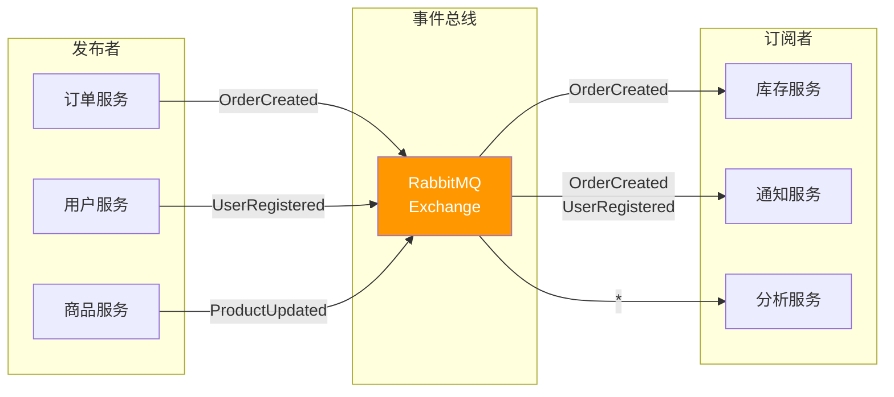
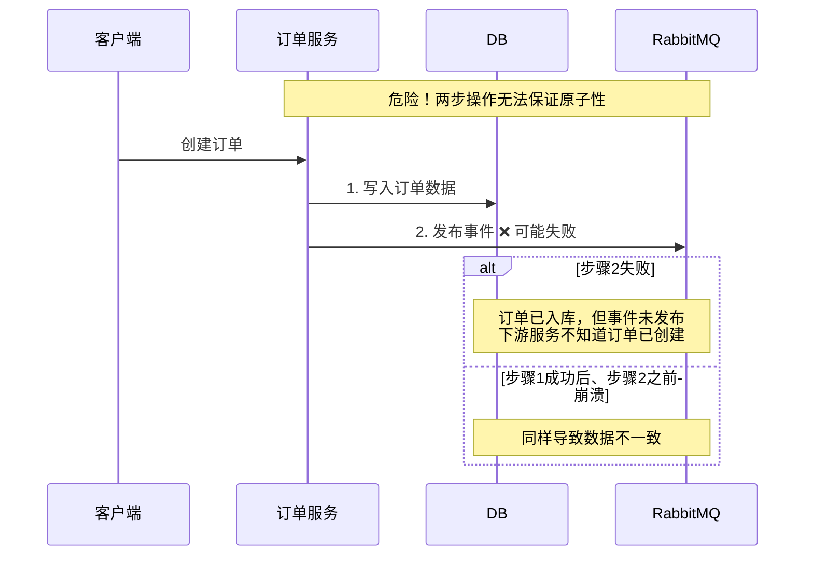
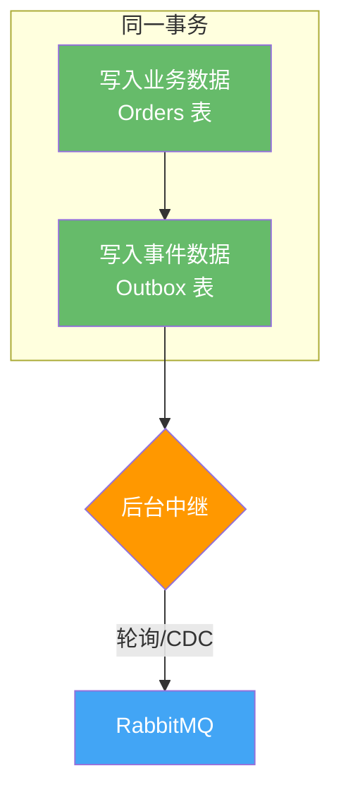
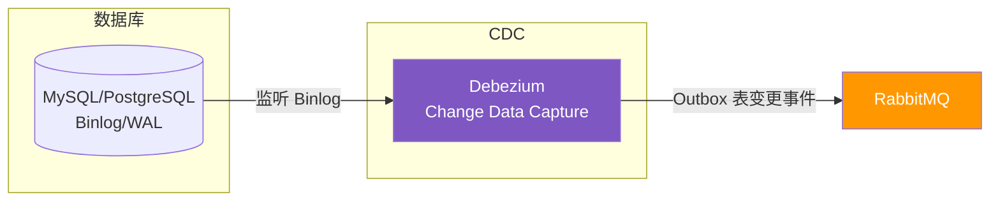
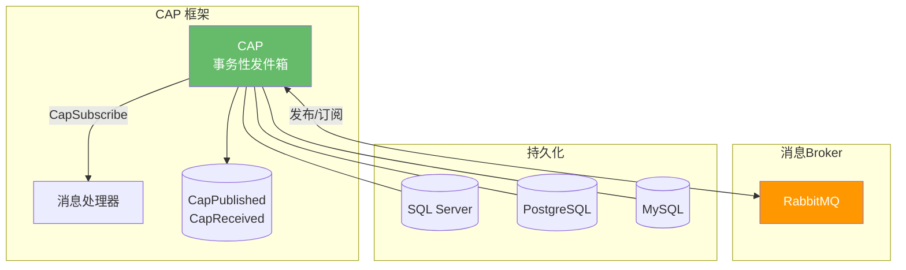
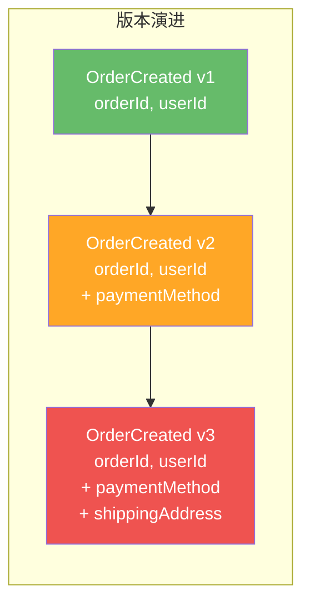
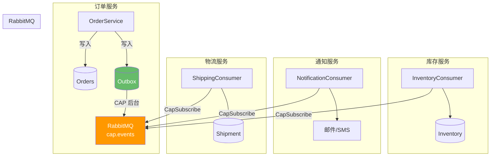

# 01 · 微服务事件驱动架构

## 从同步调用到事件驱动

### 同步 HTTP 调用的困境

在微服务架构中，服务间最常见的通信方式是直接 HTTP 调用。看似简单，但随着服务数量增长，问题接踵而至：

```mermaid
flowchart TB
    subgraph 同步调用——紧耦合
        O1[订单服务] -->|HTTP| I1[库存服务]
        O1 -->|HTTP| P1[支付服务]
        O1 -->|HTTP| S1[物流服务]
        O1 -->|HTTP| N1[通知服务]
        O1 -->|HTTP| C1[积分服务]
    end

    style O1 fill:#EF5350,color:#fff
    style I1 fill:#FFA726,color:#fff
    style P1 fill:#FFA726,color:#fff
    style S1 fill:#FFA726,color:#fff
    style N1 fill:#FFA726,color:#fff
    style C1 fill:#FFA726,color:#fff
```

| 问题 | 描述 |
|------|------|
| **紧耦合** | 订单服务必须知道每个下游服务的地址和接口，新增服务就要改代码 |
| **级联失败** | 任何一个下游服务不可用，订单服务就会报错，用户下单失败 |
| **响应延迟** | 总耗时 = 所有调用中最慢的那个，用户体验差 |
| **无法扩展** | 新增一个下游服务（如数据分析），必须修改订单服务代码 |

### 事件驱动：用消息替代调用

```mermaid
flowchart TB
    subgraph 事件驱动——松耦合
        O2[订单服务] -->|发布事件| MQ[RabbitMQ]
        MQ -->|订阅| I2[库存服务]
        MQ -->|订阅| S2[物流服务]
        MQ -->|订阅| N2[通知服务]
        MQ -->|订阅| C2[积分服务]
    end

    style O2 fill:#66BB6A,color:#fff
    style MQ fill:#FF9800,color:#fff
    style I2 fill:#42A5F5,color:#fff
    style S2 fill:#42A5F5,color:#fff
    style N2 fill:#42A5F5,color:#fff
    style C2 fill:#42A5F5,color:#fff
```

订单服务只需要发布一个 `OrderCreated` 事件，不再关心谁消费、何时消费。新增服务只需订阅对应事件，零代码修改。

## 事件总线模式（Event Bus）

### 模式结构

事件总线是事件驱动架构的核心组件，它负责事件的发布与分发：



### .NET 事件总线接口设计

```csharp
// 事件基类
public abstract class IntegrationEvent
{
    public Guid EventId { get; init; } = Guid.NewGuid();
    public DateTime OccurredOn { get; init; } = DateTime.UtcNow;
    public string EventType { get; init; } = GetType().Name;
}

// 事件处理器接口
public interface IIntegrationEventHandler<in TEvent> where TEvent : IntegrationEvent
{
    Task HandleAsync(TEvent @event);
}

// 事件总线接口
public interface IEventBus
{
    Task PublishAsync<TEvent>(TEvent @event) where TEvent : IntegrationEvent;
    void Subscribe<TEvent, THandler>()
        where TEvent : IntegrationEvent
        where THandler : IIntegrationEventHandler<TEvent>;
}
```

### 订单创建事件示例

```csharp
// 定义事件
public class OrderCreatedEvent : IntegrationEvent
{
    public Guid OrderId { get; init; }
    public string UserId { get; init; }
    public List<OrderItem> Items { get; init; }
    public decimal TotalAmount { get; init; }
}

public class OrderItem
{
    public string ProductId { get; init; }
    public int Quantity { get; init; }
    public decimal UnitPrice { get; init; }
}

// 库存服务处理事件
public class ReserveInventoryHandler : IIntegrationEventHandler<OrderCreatedEvent>
{
    private readonly IInventoryService _inventoryService;
    private readonly ILogger<ReserveInventoryHandler> _logger;

    public ReserveInventoryHandler(
        IInventoryService inventoryService,
        ILogger<ReserveInventoryHandler> logger)
    {
        _inventoryService = inventoryService;
        _logger = logger;
    }

    public async Task HandleAsync(OrderCreatedEvent @event)
    {
        _logger.LogInformation("处理订单 {OrderId} 的库存预留", @event.OrderId);

        foreach (var item in @event.Items)
        {
            await _inventoryService.ReserveAsync(item.ProductId, item.Quantity);
        }
    }
}
```

::: tip 事件 vs 命令
- **事件（Event）**：表示"已经发生的事情"，使用过去时命名（`OrderCreated`），可以有多个消费者，发完即忘
- **命令（Command）**：表示"要求做的事情"，使用祈使语气命名（`ReserveInventory`），通常只有一个执行者，需要响应
- 事件驱动架构中，跨服务通信应优先使用事件而非命令，以降低耦合度
:::

## Outbox Pattern（发件箱模式）

### 问题：消息发送与数据库操作的一致性



你不能把"写入数据库"和"发送消息"放在一个分布式事务里——那会让系统变得脆弱且低效。Outbox Pattern 提供了一个优雅的解决方案。

### 解决方案：Outbox 表

核心思想：**在同一数据库事务中，将事件写入 Outbox 表，然后由后台任务将事件发送到 RabbitMQ**。



```csharp
// Outbox 表实体
public class OutboxMessage
{
    public Guid Id { get; set; }
    public string EventType { get; set; }
    public string Payload { get; set; }
    public DateTime CreatedOn { get; set; }
    public DateTime? PublishedOn { get; set; }
    public string Status { get; set; } // Pending, Published, Failed
    int RetryCount { get; set; }
}

// 使用 EF Core 在同一事务中写入业务数据和 Outbox
public class OrderService
{
    private readonly OrderDbContext _dbContext;

    public OrderService(OrderDbContext dbContext)
    {
        _dbContext = dbContext;
    }

    public async Task<Guid> CreateOrderAsync(CreateOrderCommand command)
    {
        var order = new Order
        {
            Id = Guid.NewGuid(),
            UserId = command.UserId,
            Items = command.Items,
            TotalAmount = command.Items.Sum(i => i.Quantity * i.UnitPrice),
            Status = OrderStatus.Created
        };

        var @event = new OrderCreatedEvent
        {
            OrderId = order.Id,
            UserId = order.UserId,
            Items = order.Items,
            TotalAmount = order.TotalAmount
        };

        // 同一事务写入业务数据和 Outbox
        _dbContext.Orders.Add(order);
        _dbContext.OutboxMessages.Add(new OutboxMessage
        {
            Id = Guid.NewGuid(),
            EventType = @event.EventType,
            Payload = JsonSerializer.Serialize(@event),
            CreatedOn = DateTime.UtcNow,
            Status = "Pending"
        });

        await _dbContext.SaveChangesAsync(); // 一次事务，保证一致性

        return order.Id;
    }
}
```

### 中继 Worker：将 Outbox 消息发送到 RabbitMQ

#### 方式一：轮询发布者（Polling Publisher）

```csharp
public class OutboxPublisher : BackgroundService
{
    private readonly IServiceProvider _serviceProvider;
    private readonly ILogger<OutboxPublisher> _logger;
    private readonly TimeSpan _pollingInterval = TimeSpan.FromSeconds(2);

    public OutboxPublisher(
        IServiceProvider serviceProvider,
        ILogger<OutboxPublisher> logger)
    {
        _serviceProvider = serviceProvider;
        _logger = logger;
    }

    protected override async Task ExecuteAsync(CancellationToken stoppingToken)
    {
        while (!stoppingToken.IsCancellationRequested)
        {
            try
            {
                using var scope = _serviceProvider.CreateScope();
                var dbContext = scope.ServiceProvider
                    .GetRequiredService<OrderDbContext>();
                var channel = scope.ServiceProvider
                    .GetRequiredService<IModel>();

                var pendingMessages = await dbContext.OutboxMessages
                    .Where(m => m.Status == "Pending" && m.RetryCount < 5)
                    .OrderBy(m => m.CreatedOn)
                    .Take(100)
                    .ToListAsync(stoppingToken);

                foreach (var msg in pendingMessages)
                {
                    try
                    {
                        var body = Encoding.UTF8.GetBytes(msg.Payload);
                        channel.BasicPublish(
                            exchange: "events",
                            routingKey: msg.EventType,
                            basicProperties: null,
                            body: body);

                        msg.Status = "Published";
                        msg.PublishedOn = DateTime.UtcNow;
                    }
                    catch (Exception ex)
                    {
                        _logger.LogError(ex, "发布 Outbox 消息 {Id} 失败", msg.Id);
                        msg.RetryCount++;
                        if (msg.RetryCount >= 5)
                            msg.Status = "Failed";
                    }
                }

                await dbContext.SaveChangesAsync(stoppingToken);
            }
            catch (Exception ex)
            {
                _logger.LogError(ex, "Outbox 发布器异常");
            }

            await Task.Delay(_pollingInterval, stoppingToken);
        }
    }
}
```

#### 方式二：事务日志尾读（Transaction Log Tailing）



| 对比 | 轮询发布者 | 事务日志尾读 |
|------|-----------|-------------|
| **延迟** | 秒级（取决于轮询间隔） | 毫秒级（近乎实时） |
| **数据库压力** | 有（持续查询） | 无（监听日志） |
| **实现复杂度** | 低 | 高（需要部署 Debezium） |
| **可靠性** | 中（轮询可能遗漏） | 高（日志不丢） |
| **适用场景** | 中小规模、快速上线 | 大规模、低延迟要求 |

::: warning 轮询发布者的注意事项
- 轮询间隔需要权衡延迟和数据库压力
- 需要处理并发：多个实例同时轮询可能导致重复发布，建议加分布式锁或用 `SKIP LOCKED`
- 已发布的消息需要定期清理，避免 Outbox 表无限增长
:::

### 使用 SKIP LOCKED 避免并发重复

```sql
-- PostgreSQL
UPDATE outbox_messages
SET status = 'Processing'
WHERE id IN (
    SELECT id FROM outbox_messages
    WHERE status = 'Pending' AND retry_count < 5
    ORDER BY created_on
    LIMIT 100
    FOR UPDATE SKIP LOCKED
);
```

## CAP 框架：开箱即用的 Outbox 方案

[CAP](https://github.com/dotnetcore/CAP) 是 .NET 社区最流行的分布式事务解决方案，内置 Outbox Pattern，开箱即用。

### 架构



### CAP 配置

```csharp
// Program.cs
builder.Services.AddCap(x =>
{
    // RabbitMQ 配置
    x.UseRabbitMQ(rmq =>
    {
        rmq.HostName = "localhost";
        rmq.Port = 5672;
        rmq.UserName = "admin";
        rmq.Password = "admin123";
        rmq.VirtualHost = "/";
        rmq.ExchangeName = "cap.events"; // 默认交换机名
    });

    // 持久化配置（选择一种）
    x.UseSqlServer(sql =>
    {
        sql.ConnectionString = builder.Configuration
            .GetConnectionString("DefaultConnection");
    });
    // 或 PostgreSQL
    // x.UsePostgreSQL(pg =>
    // {
    //     pg.ConnectionString = "...";
    // });

    // 通用配置
    x.DefaultGroupName = "cap.queue";  // 默认队列名前缀
    x.Version = "v1";                   // 消息版本
    x.FailedRetryCount = 5;             // 失败重试次数
    x.FailedRetryInterval = 60;         // 重试间隔（秒）
    x.SucceedMessageExpiredAfter = 24 * 3600; // 成功消息过期时间（秒）
});

// 添加后台处理
builder.Services.AddCapDashboard();
```

### 使用 ICapPublisher 发布事件

```csharp
public class OrderService
{
    private readonly OrderDbContext _dbContext;
    private readonly ICapPublisher _capPublisher;
    private readonly ILogger<OrderService> _logger;

    public OrderService(
        OrderDbContext dbContext,
        ICapPublisher capPublisher,
        ILogger<OrderService> logger)
    {
        _dbContext = dbContext;
        _capPublisher = capPublisher;
        _logger = logger;
    }

    // 方式一：手动控制事务（推荐）
    public async Task<Guid> CreateOrderAsync(CreateOrderCommand command)
    {
        var order = new Order
        {
            Id = Guid.NewGuid(),
            UserId = command.UserId,
            Items = command.Items,
            TotalAmount = command.Items.Sum(i => i.Quantity * i.UnitPrice),
            Status = OrderStatus.Created
        };

        using var transaction = await _dbContext.Database
            .BeginTransactionAsync(_capPublisher, autoCommit: false);

        try
        {
            _dbContext.Orders.Add(order);

            await _capPublisher.PublishAsync(
                "order.created",
                new OrderCreatedEvent
                {
                    OrderId = order.Id,
                    UserId = order.UserId,
                    TotalAmount = order.TotalAmount
                });

            await _dbContext.SaveChangesAsync();
            await transaction.CommitAsync();

            _logger.LogInformation("订单 {OrderId} 创建成功", order.Id);
            return order.Id;
        }
        catch
        {
            await transaction.RollbackAsync();
            throw;
        }
    }
}
```

### 使用 [CapSubscribe] 消费事件

```csharp
// 库存服务 - 消费订单创建事件
public class InventoryEventConsumer
{
    private readonly IInventoryService _inventoryService;
    private readonly ILogger<InventoryEventConsumer> _logger;

    public InventoryEventConsumer(
        IInventoryService inventoryService,
        ILogger<InventoryEventConsumer> logger)
    {
        _inventoryService = inventoryService;
        _logger = logger;
    }

    [CapSubscribe("order.created")]
    public async Task HandleOrderCreatedAsync(OrderCreatedEvent @event)
    {
        _logger.LogInformation("收到订单创建事件: {OrderId}", @event.OrderId);

        foreach (var item in @event.Items)
        {
            await _inventoryService.ReserveAsync(item.ProductId, item.Quantity);
        }
    }
}

// 通知服务 - 消费订单创建事件（同一事件，多个消费者）
public class NotificationEventConsumer
{
    private readonly IEmailService _emailService;

    public NotificationEventConsumer(IEmailService emailService)
    {
        _emailService = emailService;
    }

    [CapSubscribe("order.created")]
    public async Task HandleOrderCreatedAsync(OrderCreatedEvent @event)
    {
        await _emailService.SendOrderConfirmationAsync(
            @event.UserId, @event.OrderId);
    }
}
```

::: important CAP 的核心优势
1. **事务性 Outbox**：`PublishAsync` 与 `SaveChangesAsync` 在同一事务中，保证数据一致性
2. **自动重试**：消费失败后自动重试，支持指数退避
3. **Dashboard**：内置管理面板，可查看消息状态、手动重发
4. **多持久化**：支持 SQL Server、PostgreSQL、MySQL
5. **多 Broker**：支持 RabbitMQ、Kafka、Azure Service Bus
:::

### CAP Dashboard

```csharp
// Program.cs 中添加 Dashboard
builder.Services.AddCapDashboard();

// 默认地址：http://localhost:5000/cap
// 可自定义路径和鉴权
builder.Services.AddCapDashboard(x =>
{
    x.PathMatch = "/cap";
    x.Authorization = context =>
    {
        // 自定义鉴权逻辑
        return true;
    };
});
```

Dashboard 功能：
- 查看已发布/已接收消息列表
- 查看消息状态（Succeeded / Failed / Processing）
- 手动重发失败消息
- 查看消息内容详情

## 事件 Schema 设计

### CloudEvents 规范

[CloudEvents](https://cloudevents.io/) 是 CNCF 定义的事件描述规范，提供跨平台、跨语言的事件格式标准。

```json
{
  "specversion": "1.0",
  "type": "com.company.order.created",
  "source": "/orders",
  "id": "A234-1234-1234",
  "time": "2024-01-15T10:30:00Z",
  "datacontenttype": "application/json",
  "data": {
    "orderId": "550e8400-e29b-41d4-a716-446655440000",
    "userId": "user-123",
    "totalAmount": 299.99,
    "items": [
      { "productId": "prod-001", "quantity": 2, "unitPrice": 149.99 }
    ]
  }
}
```

### .NET 中使用 CloudEvents

```csharp
// 安装 NuGet 包：CloudNative.CloudEvents
using CloudNative.CloudEvents;

var cloudEvent = new CloudEvent
{
    Type = "com.company.order.created",
    Source = new Uri("/orders", UriKind.Relative),
    Id = Guid.NewGuid().ToString(),
    Time = DateTimeOffset.UtcNow,
    Data = new OrderCreatedEvent
    {
        OrderId = Guid.NewGuid(),
        UserId = "user-123",
        TotalAmount = 299.99m
    },
    DataContentType = "application/json"
};

// 序列化
var jsonFormatter = new JsonEventFormatter();
var bytes = jsonFormatter.EncodeStructuredModeMessage(cloudEvent, out var contentType);

// 通过 RabbitMQ 发送
channel.BasicPublish(
    exchange: "events",
    routingKey: cloudEvent.Type,
    body: bytes);
```

::: tip 为什么使用 CloudEvents？
- **标准化**：统一的事件格式，不同系统、不同语言都能理解
- **可追溯**：`source` + `id` 全局唯一标识一个事件
- **版本友好**：`type` 字段可包含版本号，便于演进
- **生态丰富**：CNCF 项目，Azure Event Grid、Knative 等原生支持
:::

## 事件版本演进策略

### 为什么需要版本管理

事件消费者的代码可能滞后于生产者。当事件结构发生变化时，必须保证旧消费者仍能正常工作。



### 三种版本策略

| 策略 | 做法 | 优点 | 缺点 |
|------|------|------|------|
| **向后兼容** | 只加字段，不删不改 | 最简单，零迁移 | 字段越来越多 |
| **版本化路由** | 新版本用新路由键 `order.created.v2` | 互不干扰 | 消费者需要订阅多个版本 |
| **Schema Registry** | 事件引用 Schema ID，消费时拉取 | 强约束 | 引入额外组件 |

### 推荐实践：向后兼容 + 版本化路由

```csharp
// v1 事件
public class OrderCreatedEventV1 : IntegrationEvent
{
    public Guid OrderId { get; init; }
    public string UserId { get; init; }
}

// v2 事件（向后兼容 v1，新增字段有默认值）
public class OrderCreatedEventV2 : IntegrationEvent
{
    public Guid OrderId { get; init; }
    public string UserId { get; init; }
    public string? PaymentMethod { get; init; } // 新增，可空
}

// 发布时使用版本化路由
await _capPublisher.PublishAsync("order.created.v2", @event);

// v1 消费者仍然可以处理 v2 事件（忽略新增字段）
[CapSubscribe("order.created.v1")]
public async Task HandleV1Async(OrderCreatedEventV1 @event)
{
    // 只使用 OrderId 和 UserId
}

// v2 消费者使用新路由
[CapSubscribe("order.created.v2")]
public async Task HandleV2Async(OrderCreatedEventV2 @event)
{
    // 使用所有字段，包括 PaymentMethod
}
```

::: warning 事件版本演进原则
1. **绝不删除字段** —— 旧消费者可能依赖它
2. **新增字段必须有默认值** —— 保证旧消费者反序列化不报错
3. **重大变更必须升版本路由** —— 如类型变更、语义变更
4. **设置过期计划** —— 旧版本事件保留一段时间后通知消费者迁移
:::

## 完整示例：订单服务事件驱动架构



```csharp
// 订单服务完整实现
public class OrderService
{
    private readonly OrderDbContext _dbContext;
    private readonly ICapPublisher _capPublisher;
    private readonly ILogger<OrderService> _logger;

    public OrderService(
        OrderDbContext dbContext,
        ICapPublisher capPublisher,
        ILogger<OrderService> logger)
    {
        _dbContext = dbContext;
        _capPublisher = capPublisher;
        _logger = logger;
    }

    [CapSubscribe("order.created")]
    public async Task HandleOrderCreatedAsync(OrderCreatedEvent @event)
    {
        // 订单服务自身也可以是消费者（如：更新订单状态为"已确认"）
        _logger.LogInformation("订单 {OrderId} 事件已确认", @event.OrderId);
    }

    public async Task<Guid> CreateOrderAsync(CreateOrderCommand command)
    {
        var order = new Order
        {
            Id = Guid.NewGuid(),
            UserId = command.UserId,
            Items = command.Items,
            TotalAmount = command.Items.Sum(i => i.Quantity * i.UnitPrice),
            Status = OrderStatus.Created,
            CreatedAt = DateTime.UtcNow
        };

        using var transaction = await _dbContext.Database
            .BeginTransactionAsync(_capPublisher, autoCommit: false);

        try
        {
            _dbContext.Orders.Add(order);

            await _capPublisher.PublishAsync("order.created", new
            {
                OrderId = order.Id,
                UserId = order.UserId,
                TotalAmount = order.TotalAmount,
                Items = order.Items.Select(i => new
                {
                    i.ProductId,
                    i.Quantity,
                    i.UnitPrice
                }).ToArray()
            });

            await _dbContext.SaveChangesAsync();
            await transaction.CommitAsync();

            return order.Id;
        }
        catch
        {
            await transaction.RollbackAsync();
            throw;
        }
    }
}
```

## 参考资料

- [RabbitMQ 官方文档 - Publishers and Consumers](https://www.rabbitmq.com/tutorials/tutorial-one-dotnet)
- [Microservices.io - Transactional Outbox Pattern](https://microservices.io/patterns/data/transactional-outbox.html)
- [CAP 框架官方文档](https://cap.dotnetcore.xyz/)
- [CAP GitHub 仓库](https://github.com/dotnetcore/CAP)
- 《RabbitMQ 实战指南》第 7 章 — 朱忠华
- [RabbitMQ in Depth](https://www.manning.com/books/rabbitmq-in-depth) Chapter 6 — Alvaro Videla
- [CloudEvents 规范](https://cloudevents.io/)
- [Debezium - Change Data Capture](https://debezium.io/)
- [MassTransit 官方文档](https://masstransit-project.com/)

## 面试技巧

::: tip 高频面试问题
1. **为什么微服务需要事件驱动架构？**
   - 回答要点：解耦（服务间不直接依赖）、异步（非关键路径不阻塞主流程）、可扩展（新增消费者零修改）。但引入了最终一致性、调试困难等挑战，需要 Outbox Pattern 保障一致性。

2. **Outbox Pattern 解决了什么问题？如何实现？**
   - 回答要点：解决"数据库写入"和"消息发送"无法原子操作的问题。实现方式：同一事务写业务数据和 Outbox 表，后台任务轮询或 CDC（Debezium）将 Outbox 消息发布到 MQ。轮询简单但有延迟；CDC 实时但复杂。

3. **CAP 框架的核心能力是什么？和 MassTransit 有什么区别？**
   - 回答要点：CAP 核心是事务性 Outbox（发消息和数据库操作在同一事务），内置重试和 Dashboard。MassTransit 是消息总线框架，侧重消息模式（Saga、Courier），Outbox 是企业版功能。CAP 更轻量，MassTransit 功能更全面。

4. **事件版本如何演进？**
   - 回答要点：优先向后兼容（只加字段不删），重大变更用版本化路由键（`order.created.v2`），或引入 Schema Registry。绝不删除字段，新增字段必须有默认值。

5. **CloudEvents 规范有什么意义？**
   - 回答要点：标准化事件格式，提供 `type`/`source`/`id`/`time` 等必填字段，跨平台、跨语言通用。避免每个团队自定义事件格式，降低集成成本。CNCF 项目，Azure/Knative 等原生支持。
:::
