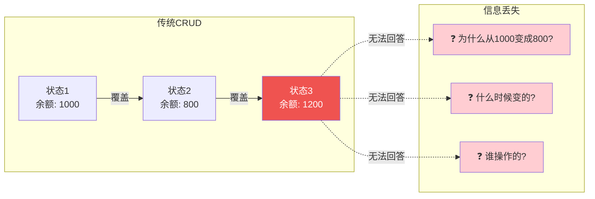
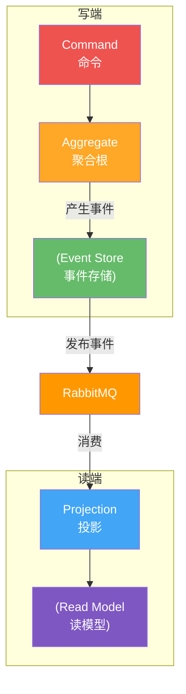
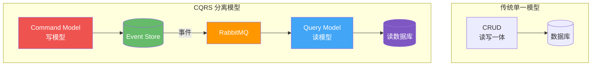
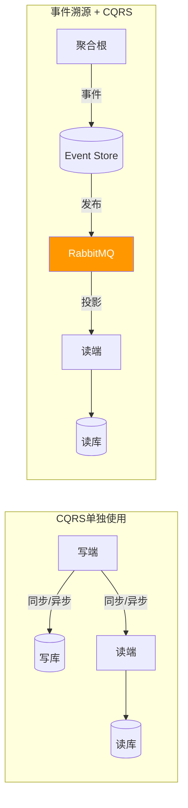
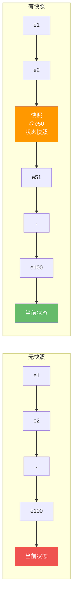
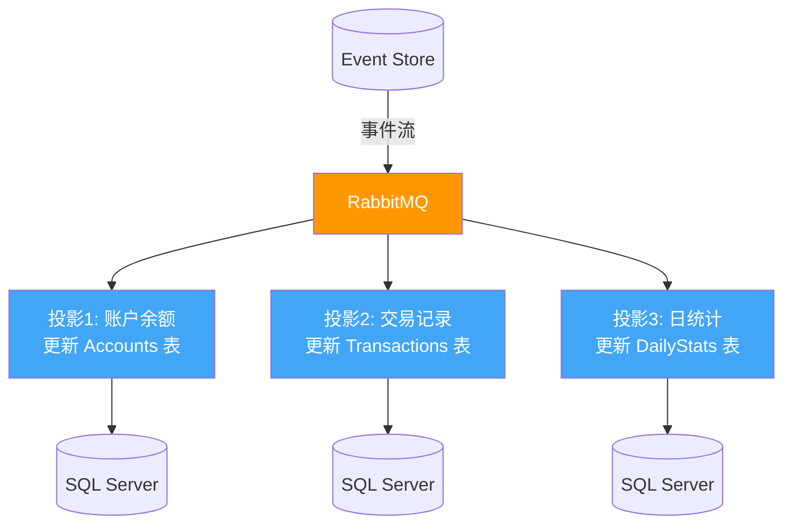
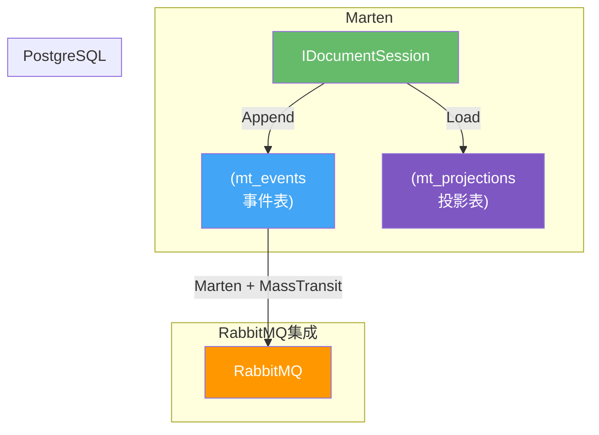

# 02 · 事件溯源与 CQRS

## 传统状态持久化的局限

### CRUD 模式的"信息丢失"问题

传统的 CRUD 模式只保存实体的当前状态，覆盖写入意味着历史信息永久丢失：



| 场景 | CRUD 的问题 |
|------|------------|
| **审计** | 只能通过额外日志表记录变更，容易遗漏 |
| **时序查询** | "上周三下午 3 点账户余额是多少？" 无法回答 |
| **回滚** | 误操作后无法恢复到之前的状态 |
| **调试** | 只看到最终状态，无法追踪事件链 |
| **业务规则** | 复杂规则依赖事件历史（如"24 小时内只能修改 3 次"） |

## 事件溯源（Event Sourcing）

### 核心思想：事件即真相

事件溯源将状态变更本身作为数据存储的核心，而不是存储当前状态。实体的当前状态可以通过回放所有事件推导出来。

```mermaid
flowchart LR
    E1["账户已创建<br/>余额: 0"] --> E2["已存款 1000<br/>余额: 1000"]
    E2 --> E3["已转账 -200<br/>余额: 800"]
    E3 --> E4["已存款 400<br/>余额: 1200"]

    subgraph 事件流=真相
        E1
        E2
        E3
        E4
    end

    subgraph 当前状态=投影
        S[余额: 1200]
    end

    E4 -->|回放所有事件| S

    style E1 fill:#66BB6A,color:#fff
    style E2 fill:#66BB6A,color:#fff
    style E3 fill:#42A5F5,color:#fff
    style E4 fill:#66BB6A,color:#fff
    style S fill:#FF9800,color:#fff
```

### 事件溯源的完整架构



### 事件定义与聚合根

```csharp
// 事件定义
public abstract class BaseEvent
{
    public Guid EventId { get; init; } = Guid.NewGuid();
    public DateTime Timestamp { get; init; } = DateTime.UtcNow;
    public int Version { get; init; }
}

public class AccountCreatedEvent : BaseEvent
{
    public Guid AccountId { get; init; }
    public string Owner { get; init; }
}

public class MoneyDepositedEvent : BaseEvent
{
    public Guid AccountId { get; init; }
    public decimal Amount { get; init; }
    public string Description { get; init; }
}

public class MoneyTransferredEvent : BaseEvent
{
    public Guid AccountId { get; init; }
    public Guid TargetAccountId { get; init; }
    public decimal Amount { get; init; }
    public string Description { get; init; }
}

// 聚合根：银行账户
public class BankAccount
{
    public Guid Id { get; private set; }
    public string Owner { get; private set; }
    public decimal Balance { get; private set; }
    public int Version { get; private set; }

    private readonly List<BaseEvent> _uncommittedEvents = new();
    public IReadOnlyList<BaseEvent> GetUncommittedEvents() => _uncommittedEvents.AsReadOnly();
    public void ClearUncommittedEvents() => _uncommittedEvents.Clear();

    // 从事件流重建聚合根
    public static BankAccount Rebuild(IEnumerable<BaseEvent> events)
    {
        var account = new BankAccount();
        foreach (var @event in events)
        {
            account.Apply(@event);
            account.Version = @event.Version;
        }
        return account;
    }

    // 命令：创建账户
    public static BankAccount Create(Guid id, string owner)
    {
        var account = new BankAccount();
        account.RaiseEvent(new AccountCreatedEvent
        {
            AccountId = id,
            Owner = owner,
            Version = 1
        });
        return account;
    }

    // 命令：存款
    public void Deposit(decimal amount, string description)
    {
        if (amount <= 0)
            throw new ArgumentException("存款金额必须大于 0");

        RaiseEvent(new MoneyDepositedEvent
        {
            AccountId = Id,
            Amount = amount,
            Description = description,
            Version = Version + 1
        });
    }

    // 命令：转账
    public void Transfer(Guid targetId, decimal amount, string description)
    {
        if (amount <= 0)
            throw new ArgumentException("转账金额必须大于 0");
        if (Balance < amount)
            throw new InvalidOperationException("余额不足");

        RaiseEvent(new MoneyTransferredEvent
        {
            AccountId = Id,
            TargetAccountId = targetId,
            Amount = amount,
            Description = description,
            Version = Version + 1
        });
    }

    private void RaiseEvent(BaseEvent @event)
    {
        Apply(@event);
        _uncommittedEvents.Add(@event);
    }

    // 应用事件（状态变更的唯一入口）
    private void Apply(BaseEvent @event)
    {
        Version = @event.Version;

        switch (@event)
        {
            case AccountCreatedEvent e:
                Id = e.AccountId;
                Owner = e.Owner;
                Balance = 0;
                break;
            case MoneyDepositedEvent e:
                Balance += e.Amount;
                break;
            case MoneyTransferredEvent e:
                Balance -= e.Amount;
                break;
        }
    }
}
```

::: important 聚合根设计原则
1. **命令产生事件**：命令是输入，事件是输出，命令可以拒绝，事件不可撤销
2. **事件是事实**：已经发生的事情，不可修改、不可删除
3. **无副作用的 Apply**：`Apply` 方法只更新内存状态，不执行 I/O 操作
4. **幂等处理**：同一个事件应用多次，结果必须一致
:::

## CQRS：命令查询职责分离

### CQRS 的核心思想

CQRS（Command Query Responsibility Segregation）将读操作和写操作分离到不同的模型中：



| 维度 | 写模型（Command） | 读模型（Query） |
|------|-------------------|-----------------|
| **数据源** | Event Store | 读数据库（SQL/NoSQL/缓存） |
| **优化方向** | 写入性能、事件完整性 | 查询性能、读取便利 |
| **数据结构** | 事件流（追加写入） | 扁平化表（面向查询优化） |
| **一致性** | 强一致（事务写入） | 最终一致（异步投影） |
| **复杂度** | 高（聚合根、事件版本） | 低（简单 DTO） |

### CQRS 不等于事件溯源



- CQRS 可以独立使用：写端用关系数据库，读端用 Elasticsearch
- 事件溯源自然需要 CQRS：因为事件流不适合直接查询
- 但 CQRS 不一定要事件溯源

## 快照策略（Snapshot）

### 为什么需要快照

随着事件不断追加，从零开始回放所有事件的代价越来越大。快照是定期保存聚合根的完整状态，恢复时只需从最近快照 + 快照之后的事件开始回放。



| 对比 | 无快照 | 有快照 |
|------|--------|--------|
| **恢复时间** | O(n)，n 为事件总数 | O(m)，m 为快照后事件数 |
| **存储开销** | 低（仅事件） | 高（事件 + 快照） |
| **适用场景** | 事件少（< 100） | 事件多（> 100） |

### .NET 快照实现

```csharp
// 快照定义
public record AccountSnapshot(
    Guid AccountId,
    string Owner,
    decimal Balance,
    int Version
);

// 快照存储接口
public interface ISnapshotStore
{
    Task<AccountSnapshot?> GetLatestSnapshotAsync(Guid aggregateId);
    Task SaveSnapshotAsync(Guid aggregateId, AccountSnapshot snapshot);
}

// 带快照的事件存储
public class EventStore
{
    private readonly IEventRepository _eventRepository;
    private readonly ISnapshotStore _snapshotStore;
    private const int SnapshotInterval = 50; // 每 50 个事件生成一次快照

    public EventStore(
        IEventRepository eventRepository,
        ISnapshotStore snapshotStore)
    {
        _eventRepository = eventRepository;
        _snapshotStore = snapshotStore;
    }

    // 加载聚合根（优先使用快照）
    public async Task<BankAccount> LoadAsync(Guid aggregateId)
    {
        var snapshot = await _snapshotStore.GetLatestSnapshotAsync(aggregateId);

        IEnumerable<BaseEvent> events;
        int fromVersion = 0;

        if (snapshot != null)
        {
            // 从快照之后的事件开始加载
            fromVersion = snapshot.Version;
            events = await _eventRepository
                .GetEventsAfterVersionAsync(aggregateId, snapshot.Version);
        }
        else
        {
            // 从头加载所有事件
            events = await _eventRepository
                .GetEventsAsync(aggregateId);
        }

        // 从快照恢复 + 回放后续事件
        var account = snapshot != null
            ? BankAccount.FromSnapshot(snapshot)
            : new BankAccount();

        foreach (var @event in events)
        {
            account.ApplyEvent(@event);
        }

        return account;
    }

    // 保存事件并检查是否需要快照
    public async Task SaveAsync(BankAccount aggregate)
    {
        var uncommittedEvents = aggregate.GetUncommittedEvents();

        await _eventRepository.AppendEventsAsync(aggregate.Id, uncommittedEvents);

        // 检查是否需要生成快照
        if (aggregate.Version % SnapshotInterval == 0)
        {
            await _snapshotStore.SaveSnapshotAsync(aggregate.Id, new AccountSnapshot(
                aggregate.Id,
                aggregate.Owner,
                aggregate.Balance,
                aggregate.Version
            ));
        }

        aggregate.ClearUncommittedEvents();
    }
}

// BankAccount 扩展：从快照恢复
public class BankAccount
{
    // ... 前面的代码 ...

    public static BankAccount FromSnapshot(AccountSnapshot snapshot)
    {
        return new BankAccount
        {
            Id = snapshot.AccountId,
            Owner = snapshot.Owner,
            Balance = snapshot.Balance,
            Version = snapshot.Version
        };
    }

    internal void ApplyEvent(BaseEvent @event)
    {
        Apply(@event);
        Version = @event.Version;
    }
}
```

## 投影（Projection）

### 投影的作用

投影是将事件流转换为查询友好的读模型。每个投影监听特定类型的事件，更新读数据库。



### .NET 投影实现

```csharp
// 读模型
public class AccountReadModel
{
    public Guid AccountId { get; set; }
    public string Owner { get; set; }
    public decimal Balance { get; set; }
    public DateTime LastUpdated { get; set; }
}

public class TransactionReadModel
{
    public Guid Id { get; set; }
    public Guid AccountId { get; set; }
    public string Type { get; set; } // Deposit, Transfer
    public decimal Amount { get; set; }
    public string Description { get; set; }
    public DateTime Timestamp { get; set; }
}

// 投影处理器
public class AccountProjection
{
    private readonly ReadModelDbContext _dbContext;

    public AccountProjection(ReadModelDbContext dbContext)
    {
        _dbContext = dbContext;
    }

    public async Task HandleAsync(AccountCreatedEvent @event)
    {
        _dbContext.Accounts.Add(new AccountReadModel
        {
            AccountId = @event.AccountId,
            Owner = @event.Owner,
            Balance = 0,
            LastUpdated = @event.Timestamp
        });
        await _dbContext.SaveChangesAsync();
    }

    public async Task HandleAsync(MoneyDepositedEvent @event)
    {
        var account = await _dbContext.Accounts
            .FindAsync(@event.AccountId);
        if (account != null)
        {
            account.Balance += @event.Amount;
            account.LastUpdated = @event.Timestamp;
        }

        _dbContext.Transactions.Add(new TransactionReadModel
        {
            Id = Guid.NewGuid(),
            AccountId = @event.AccountId,
            Type = "Deposit",
            Amount = @event.Amount,
            Description = @event.Description,
            Timestamp = @event.Timestamp
        });

        await _dbContext.SaveChangesAsync();
    }

    public async Task HandleAsync(MoneyTransferredEvent @event)
    {
        var account = await _dbContext.Accounts
            .FindAsync(@event.AccountId);
        if (account != null)
        {
            account.Balance -= @event.Amount;
            account.LastUpdated = @event.Timestamp;
        }

        _dbContext.Transactions.Add(new TransactionReadModel
        {
            Id = Guid.NewGuid(),
            AccountId = @event.AccountId,
            Type = "Transfer",
            Amount = @event.Amount,
            Description = @event.Description,
            Timestamp = @event.Timestamp
        });

        await _dbContext.SaveChangesAsync();
    }
}
```

### 投影重建（Rebuild）

当需要修改读模型结构或修复投影 Bug 时，可以从 Event Store 重放所有事件重建投影：

```csharp
public class ProjectionRebuilder
{
    private readonly IEventRepository _eventRepository;
    private readonly AccountProjection _projection;
    private readonly ILogger<ProjectionRebuilder> _logger;

    public ProjectionRebuilder(
        IEventRepository eventRepository,
        AccountProjection projection,
        ILogger<ProjectionRebuilder> logger)
    {
        _eventRepository = eventRepository;
        _projection = projection;
        _logger = logger;
    }

    public async Task RebuildAsync()
    {
        _logger.LogInformation("开始重建投影...");

        // 1. 清空读模型
        // _dbContext.Database.ExecuteSqlRaw("TRUNCATE TABLE Accounts");
        // _dbContext.Database.ExecuteSqlRaw("TRUNCATE TABLE Transactions");

        // 2. 从 Event Store 读取所有事件
        var allEvents = await _eventRepository.GetAllEventsAsync();

        // 3. 按时间排序后逐一重放
        var orderedEvents = allEvents.OrderBy(e => e.Timestamp);

        foreach (var @event in orderedEvents)
        {
            switch (@event)
            {
                case AccountCreatedEvent e:
                    await _projection.HandleAsync(e);
                    break;
                case MoneyDepositedEvent e:
                    await _projection.HandleAsync(e);
                    break;
                case MoneyTransferredEvent e:
                    await _projection.HandleAsync(e);
                    break;
            }
        }

        _logger.LogInformation("投影重建完成，共重放 {Count} 个事件", allEvents.Count);
    }
}
```

::: tip 投影重建最佳实践
1. **支持多版本投影**：同一事件流可以有多个投影同时运行，互不影响
2. **幂等处理**：投影处理器必须幂等，重放不会产生重复数据
3. **蓝绿切换**：重建新投影时不停服，完成后原子切换
4. **增量重建**：大型系统可按聚合根 ID 分片重建，减少停机时间
:::

## Marten：.NET 事件存储利器

[Marten](https://github.com/JasperFx/marten) 是 .NET 生态中最成熟的 Event Sourcing 框架，基于 PostgreSQL 实现事件存储。

### Marten 架构



### Marten 基本配置

```csharp
// Program.cs
builder.Services.AddMarten(options =>
{
    options.Connection(builder.Configuration
        .GetConnectionString("PostgreSQL"));

    // 注册事件
    options.Events.AddEventTypes(new[]
    {
        typeof(AccountCreatedEvent),
        typeof(MoneyDepositedEvent),
        typeof(MoneyTransferredEvent)
    });

    // 注册聚合投影
    options.Projections.Snapshot<BankAccount>(SnapshotLifecycle.Inline);

    // 注册自定义投影
    options.Projections.Add<AccountBalanceProjection>(ProjectionLifecycle.Async);
});
```

### 使用 Marten 操作聚合根

```csharp
public class AccountService
{
    private readonly IDocumentSession _session;
    private readonly ILogger<AccountService> _logger;

    public AccountService(IDocumentSession session, ILogger<AccountService> logger)
    {
        _session = session;
        _logger = logger;
    }

    // 创建账户
    public async Task<Guid> CreateAccountAsync(string owner)
    {
        var accountId = Guid.NewGuid();

        _session.Events.StartStream<AccountCreatedEvent>(
            accountId,
            new AccountCreatedEvent { AccountId = accountId, Owner = owner }
        );

        await _session.SaveChangesAsync();
        _logger.LogInformation("账户 {AccountId} 创建成功", accountId);
        return accountId;
    }

    // 存款
    public async Task DepositAsync(Guid accountId, decimal amount, string description)
    {
        _session.Events.Append(accountId,
            new MoneyDepositedEvent
            {
                AccountId = accountId,
                Amount = amount,
                Description = description
            }
        );

        await _session.SaveChangesAsync();
    }

    // 加载聚合根（Marten 自动从事件流重建）
    public async Task<BankAccount?> GetAccountAsync(Guid accountId)
    {
        return await _session.LoadAsync<BankAccount>(accountId);
    }
}
```

### Marten 自定义投影

```csharp
public class AccountBalanceProjection : MultiStreamProjection<AccountBalanceProjection, AccountReadModel>
{
    public AccountBalanceProjection()
    {
        Identity<AccountCreatedEvent>(e => e.AccountId);
        Identity<MoneyDepositedEvent>(e => e.AccountId);
        Identity<MoneyTransferredEvent>(e => e.AccountId);
    }

    public AccountReadModel Create(AccountCreatedEvent @event)
    {
        return new AccountReadModel
        {
            AccountId = @event.AccountId,
            Owner = @event.Owner,
            Balance = 0,
            LastUpdated = @event.Timestamp
        };
    }

    public void Apply(MoneyDepositedEvent @event, AccountReadModel model)
    {
        model.Balance += @event.Amount;
        model.LastUpdated = @event.Timestamp;
    }

    public void Apply(MoneyTransferredEvent @event, AccountReadModel model)
    {
        model.Balance -= @event.Amount;
        model.LastUpdated = @event.Timestamp;
    }
}
```

### Marten + MassTransit + RabbitMQ

将 Marten 事件通过 RabbitMQ 分发给其他微服务：

```csharp
// Program.cs
builder.Services.AddMarten(options =>
{
    options.Connection(connectionString);

    options.Events.AddEventTypes(new[]
    {
        typeof(AccountCreatedEvent),
        typeof(MoneyDepositedEvent),
        typeof(MoneyTransferredEvent)
    });

    // 异步投影通过 MassTransit 发布事件
    options.Projections.Add<AccountBalanceProjection>(ProjectionLifecycle.Async);
});

builder.Services.AddMassTransit(x =>
{
    x.AddConsumer<AccountEventConsumer>();

    x.UsingRabbitMq((context, cfg) =>
    {
        cfg.Host("localhost", "/", h =>
        {
            h.Username("admin");
            h.Password("admin123");
        });

        cfg.ConfigureEndpoints(context);
    });
});

// Marten 事件发布到 MassTransit
public class MartenEventPublisher : IEventPublisher
{
    private readonly IPublishEndpoint _publishEndpoint;

    public MartenEventPublisher(IPublishEndpoint publishEndpoint)
    {
        _publishEndpoint = publishEndpoint;
    }

    public async Task PublishAsync(BaseEvent @event)
    {
        await _publishEndpoint.Publish(@event);
    }
}
```

```csharp
// 其他微服务消费 Marten 事件
public class AccountEventConsumer : IConsumer<MoneyDepositedEvent>
{
    private readonly ILogger<AccountEventConsumer> _logger;

    public AccountEventConsumer(ILogger<AccountEventConsumer> logger)
    {
        _logger = logger;
    }

    public async Task Consume(ConsumeContext<MoneyDepositedEvent> context)
    {
        _logger.LogInformation(
            "收到存款事件: 账户 {AccountId}, 金额 {Amount}",
            context.Message.AccountId,
            context.Message.Amount);

        // 更新本服务的读模型
        await Task.CompletedTask;
    }
}
```

## 何时使用事件溯源

### 适合的场景

| 场景 | 原因 |
|------|------|
| **金融/银行** | 完整审计轨迹，不可篡改，满足合规要求 |
| **电商订单** | 订单状态追踪，纠纷可追溯 |
| **医疗记录** | 每次变更都留痕，法律要求 |
| **协作编辑** | 多人操作可回放、可合并 |
| **复杂业务规则** | 规则依赖历史事件（如"30 天内只能退货 3 次"） |
| **时序查询** | 需要回答"某时刻的状态是什么" |

### 不适合的场景

| 场景 | 原因 |
|------|------|
| **简单 CRUD** | 过度设计，增加不必要的复杂度 |
| **高吞吐写入** | 事件追加 + 投影更新有额外开销 |
| **数据频繁删除** | GDPR 要求"被遗忘权"，与事件不可删除冲突 |
| **团队不熟悉** | 学习曲线陡峭，调试困难 |

::: warning 事件溯源的代价
1. **学习曲线**：团队需要理解事件驱动思维，与传统 CRUD 差异大
2. **存储成本**：事件只增不减，长期存储成本高
3. **最终一致性**：读模型有延迟，UI 需要处理"写入后读不到"的情况
4. **调试困难**：Bug 可能涉及事件回放顺序、投影逻辑
5. **事件版本管理**：事件结构变化需要向后兼容处理

不要因为"技术很酷"就选择事件溯源，只有当业务确实需要时才使用。
:::

## 参考资料

- [Microservices.io - Event Sourcing Pattern](https://microservices.io/patterns/data/event-sourcing.html)
- [Microservices.io - CQRS Pattern](https://microservices.io/patterns/data/cqrs.html)
- [Marten 官方文档](https://martendb.io/)
- [Marten GitHub 仓库](https://github.com/JasperFx/marten)
- [MassTransit 官方文档](https://masstransit-project.com/)
- 《RabbitMQ 实战指南》第 7 章 — 朱忠华
- [RabbitMQ in Depth](https://www.manning.com/books/rabbitmq-in-depth) Chapter 6 — Alvaro Videla
- [Event Sourcing — Martin Fowler](https://martinfowler.com/eaaDev/EventSourcing.html)
- [CQRS — Martin Fowler](https://martinfowler.com/bliki/CQRS.html)

## 面试技巧

::: tip 高频面试问题
1. **什么是事件溯源？和传统 CRUD 有什么区别？**
   - 回答要点：传统 CRUD 覆盖写入，丢失历史；事件溯源追加写入，事件即真相，当前状态通过回放推导。优势：完整审计、时序查询、状态回滚；代价：复杂度高、存储成本大。

2. **CQRS 和事件溯源是什么关系？**
   - 回答要点：CQRS 是读写分离模式，可以独立使用（读写不同数据库）；事件溯源自然需要 CQRS（事件流不适合直接查询）。但 CQRS 不等于事件溯源。

3. **快照策略是什么？为什么需要？**
   - 回答要点：事件过多时，每次从零回放代价太大。快照定期保存聚合根完整状态，恢复时从最近快照 + 后续事件开始回放，将 O(n) 降为 O(m)。通常每 N 个事件生成一次快照。

4. **投影重建是什么？如何保证幂等？**
   - 回答要点：当读模型结构变化或投影有 Bug 时，从 Event Store 重放所有事件重建读模型。幂等保证：投影处理器用 `Upsert` 而非 `Insert`，或基于事件 ID 去重。

5. **Marten 在 .NET 事件溯源中的角色是什么？**
   - 回答要点：Marten 是基于 PostgreSQL 的 .NET Event Sourcing 框架，提供事件存储、聚合根自动重建、内联/异步投影、快照。与 MassTransit 集成后可将事件发布到 RabbitMQ。
:::
