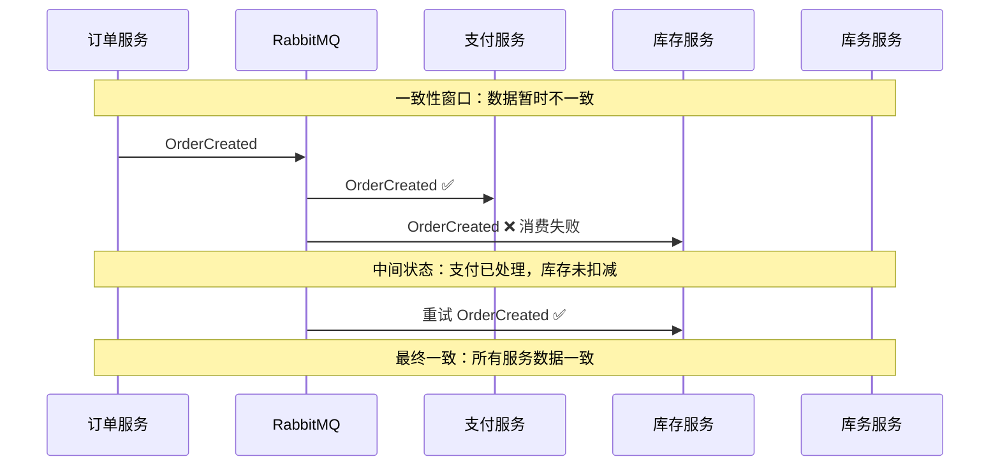
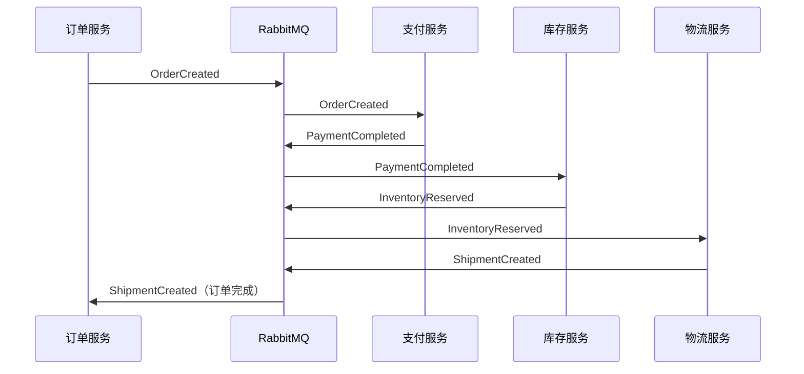
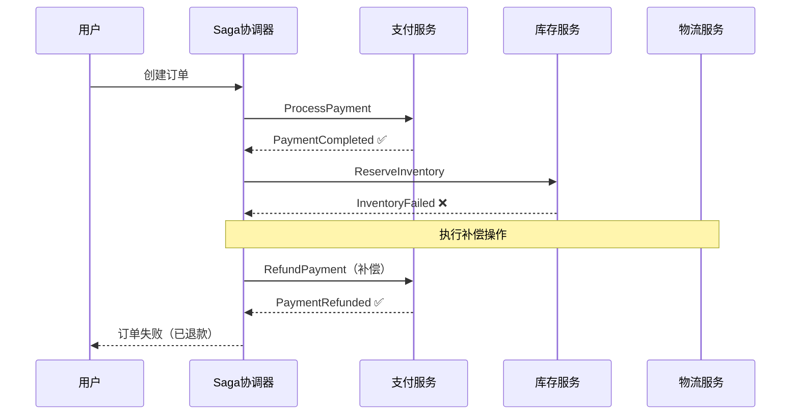
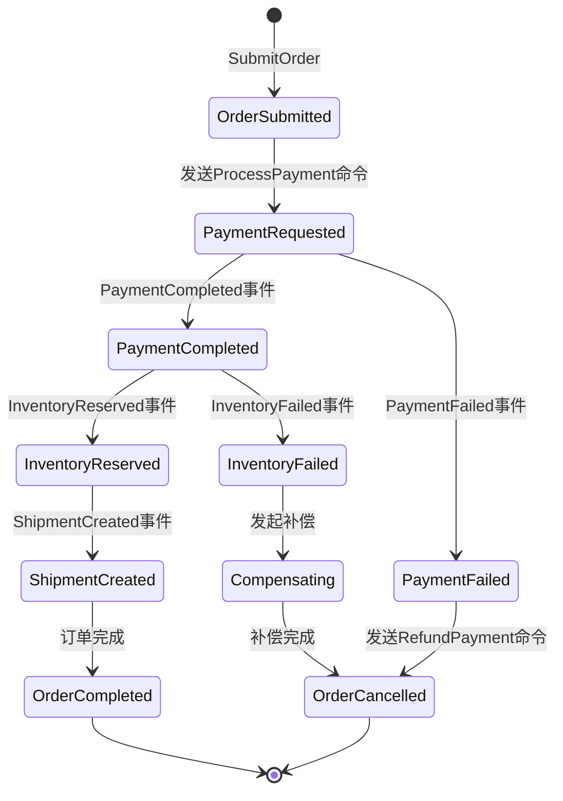
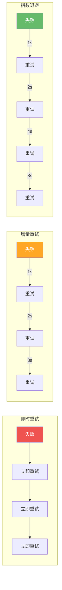
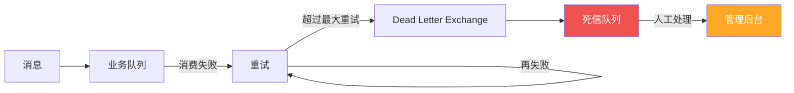
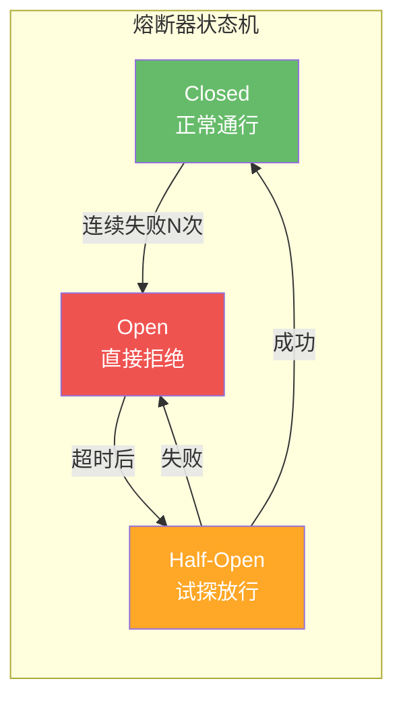
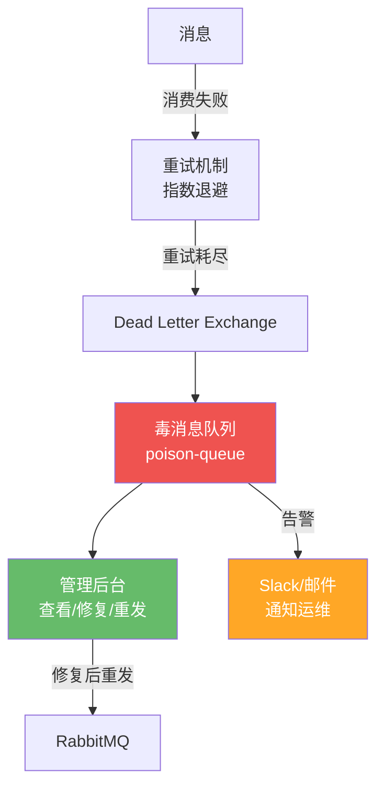
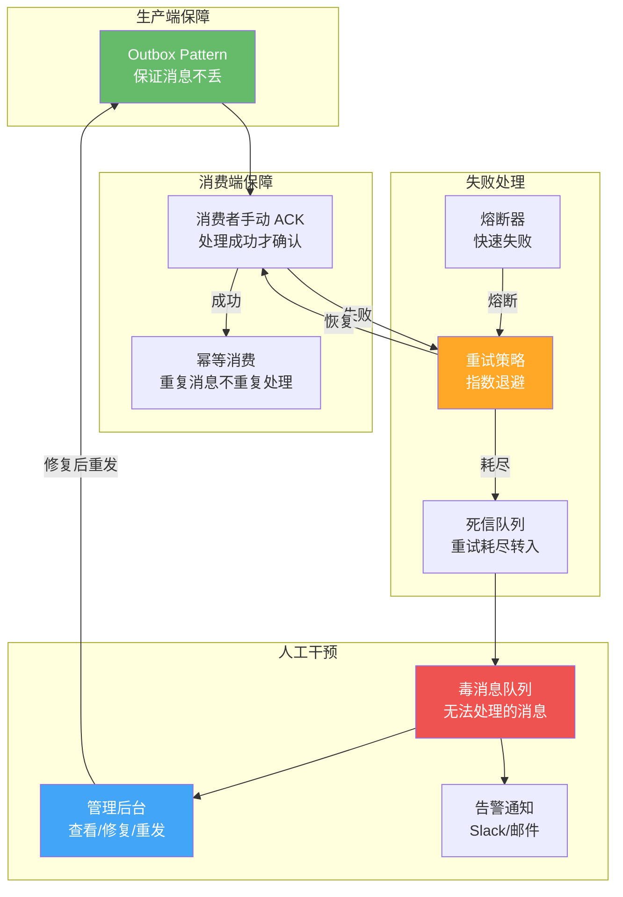

# 03 · 最终一致性保障

## 分布式事务的困境

### 从 ACID 到 BASE

在单体应用中，数据库事务通过 ACID 保证一致性。但在微服务架构中，一个业务操作往往涉及多个服务，分布式事务面临严峻挑战：

```mermaid
flowchart TB
    subgraph 单体应用—ACID
        A1[业务操作] --> DB1["(一个数据库<br/>ACID 事务)"]
    end

    subgraph 微服务—分布式挑战
        A2[下单操作] --> S1[订单服务]
        S1 --> DB2[(订单DB)]
        A2 --> S2[支付服务]
        S2 --> DB3[(支付DB)]
        A2 --> S3[库存服务]
        S3 --> DB4[(库存DB)]
    end

    style DB1 fill:#66BB6A,color:#fff
    style DB2 fill:#EF5350,color:#fff
    style DB3 fill:#EF5350,color:#fff
    style DB4 fill:#EF5350,color:#fff
```

| 维度 | ACID（单体） | BASE（分布式） |
|------|-------------|---------------|
| **一致性** | 强一致 | 最终一致 |
| **可用性** | 可能牺牲 | 优先保证 |
| **隔离性** | 事务隔离级别 | 服务间异步通信 |
| **持久性** | 日志保证 | 消息持久化 + 重试 |

::: important 为什么不用分布式事务（2PC/3PC）？
- **性能差**：所有参与者必须同步等待，阻塞风险高
- **单点故障**：协调者宕机，所有参与者阻塞
- **不适合微服务**：要求所有服务使用相同的事务协议
- **RabbitMQ 不支持**：RabbitMQ 的事务机制仅限单个 Broker 内
:::

### 最终一致性的含义

最终一致性不是"不管了"，而是：**在没有新操作的情况下，经过一段时间后，系统最终达到一致状态**。



## Saga 模式

Saga 是管理分布式事务的经典模式：将长事务拆分为一系列本地事务，每个本地事务完成后发布事件触发下一个步骤，失败时执行补偿操作回滚。

### 编排（Choreography）vs 协调（Orchestration）

```mermaid
flowchart TB
    subgraph 编排模式—事件驱动
        direction TB
        OC["订单服务<br/>发布 OrderCreated"] -->|事件| RMQ1[RabbitMQ]
        RMQ1 -->|订阅| PS1["支付服务<br/>处理支付"]
        PS1 -->|发布 PaymentCompleted| RMQ1
        RMQ1 -->|订阅| IS1["库存服务<br/>扣减库存"]
        IS1 -->|发布 InventoryReserved| RMQ1
        RMQ1 -->|订阅| SS1["物流服务<br/>创建发货"]
    end

    style RMQ1 fill:#FF9800,color:#fff

    subgraph 协调模式—中央协调
        direction TB
        SC["Saga 协调器<br/>OrderSaga"]
        SC -->|命令| PS2[支付服务]
        PS2 -->|回复| SC
        SC -->|命令| IS2[库存服务]
        IS2 -->|回复| SC
        SC -->|命令| SS2[物流服务]
        SS2 -->|回复| SC
    end

    style SC fill:#7E57C2,color:#fff
```

| 对比 | 编排（Choreography） | 协调（Orchestration） |
|------|----------------------|----------------------|
| **协调者** | 无，服务间通过事件通信 | 有，Saga 协调器统一控制 |
| **耦合度** | 低，各服务自治 | 中，协调器需要知道流程 |
| **可见性** | 差，流程散落在各服务 | 好，协调器可追踪完整状态 |
| **调试** | 困难，需要查多个服务日志 | 相对容易，集中查看协调器状态 |
| **循环依赖** | 容易产生（A→B→C→A） | 不会 |
| **适用场景** | 简单流程（2-3 步） | 复杂流程（多步、有分支） |

### 编排模式：订单流程



### 协调模式：订单流程（含补偿）



## MassTransit Automatonymous Saga 实现

[MassTransit](https://masstransit-project.com/) 是 .NET 生态中最强大的消息总线框架，内置 [Automatonymous](https://github.com/MassTransit/Automatonymous) 状态机 Saga 支持。

### Saga 状态机定义



### 完整 .NET 实现

```csharp
// 1. 定义 Saga 状态
public class OrderSagaState : SagaStateMachineInstance
{
    public Guid CorrelationId { get; set; }          // Saga 实例 ID（= 订单 ID）
    public string CurrentState { get; set; }          // 当前状态
    public Guid OrderId { get; set; }                 // 订单 ID
    public string UserId { get; set; }                // 用户 ID
    public decimal TotalAmount { get; set; }          // 订单金额
    public DateTime? PaymentCompletedAt { get; set; } // 支付完成时间
    public string? FailureReason { get; set; }        // 失败原因
    int Version { get; set; }                         // 乐观并发版本
}

// 2. 定义事件和命令
public class SubmitOrder
{
    public Guid OrderId { get; init; }
    public string UserId { get; init; }
    public decimal TotalAmount { get; init; }
}

public class ProcessPayment
{
    public Guid OrderId { get; init; }
    public decimal Amount { get; init; }
}

public class PaymentCompleted
{
    public Guid OrderId { get; init; }
    public string TransactionId { get; init; }
}

public class PaymentFailed
{
    public Guid OrderId { get; init; }
    public string Reason { get; init; }
}

public class ReserveInventory
{
    public Guid OrderId { get; init; }
    public List<OrderItem> Items { get; init; }
}

public class InventoryReserved
{
    public Guid OrderId { get; init; }
}

public class InventoryFailed
{
    public Guid OrderId { get; init; }
    public string Reason { get; init; }
}

public class RefundPayment
{
    public Guid OrderId { get; init; }
    public string TransactionId { get; init; }
}

public class CreateShipment
{
    public Guid OrderId { get; init; }
    public string UserId { get; init; }
}

public class ShipmentCreated
{
    public Guid OrderId { get; init; }
    public string TrackingNumber { get; init; }
}

public class OrderItem
{
    public string ProductId { get; init; }
    public int Quantity { get; init; }
}

// 3. Saga 状态机
public class OrderSaga : MassTransitStateMachine<OrderSagaState>
{
    public State OrderSubmitted { get; private set; }
    public State PaymentRequested { get; private set; }
    public State PaymentCompleted { get; private set; }
    public State InventoryRequested { get; private set; }
    public State InventoryReserved { get; private set; }
    public State ShipmentRequested { get; private set; }
    public State OrderCompleted { get; private set; }
    public State Compensating { get; private set; }
    public State OrderCancelled { get; private set; }

    public Event<SubmitOrder> SubmitOrderEvent { get; private set; }
    public Event<PaymentCompleted> PaymentCompletedEvent { get; private set; }
    public Event<PaymentFailed> PaymentFailedEvent { get; private set; }
    public Event<InventoryReserved> InventoryReservedEvent { get; private set; }
    public Event<InventoryFailed> InventoryFailedEvent { get; private set; }
    public Event<ShipmentCreated> ShipmentCreatedEvent { get; private set; }

    public OrderSaga()
    {
        // 状态配置
        InstanceState(x => x.CurrentState);

        // 事件绑定：OrderId 作为关联 ID
        Event(() => SubmitOrderEvent, x => x
            .CorrelateById(ctx => ctx.Message.OrderId));
        Event(() => PaymentCompletedEvent, x => x
            .CorrelateById(ctx => ctx.Message.OrderId));
        Event(() => PaymentFailedEvent, x => x
            .CorrelateById(ctx => ctx.Message.OrderId));
        Event(() => InventoryReservedEvent, x => x
            .CorrelateById(ctx => ctx.Message.OrderId));
        Event(() => InventoryFailedEvent, x => x
            .CorrelateById(ctx => ctx.Message.OrderId));
        Event(() => ShipmentCreatedEvent, x => x
            .CorrelateById(ctx => ctx.Message.OrderId));

        // ---- 正常流程 ----

        Initially(
            When(SubmitOrderEvent)
                .Then(ctx =>
                {
                    ctx.Saga.OrderId = ctx.Message.OrderId;
                    ctx.Saga.UserId = ctx.Message.UserId;
                    ctx.Saga.TotalAmount = ctx.Message.TotalAmount;
                })
                .Send(ctx => new ProcessPayment
                {
                    OrderId = ctx.Saga.OrderId,
                    Amount = ctx.Saga.TotalAmount
                })
                .TransitionTo(PaymentRequested));

        During(PaymentRequested,
            When(PaymentCompletedEvent)
                .Then(ctx => ctx.Saga.PaymentCompletedAt = DateTime.UtcNow)
                .Send(ctx => new ReserveInventory
                {
                    OrderId = ctx.Saga.OrderId,
                    Items = new List<OrderItem>() // 实际从订单获取
                })
                .TransitionTo(InventoryRequested));

        During(InventoryRequested,
            When(InventoryReservedEvent)
                .Send(ctx => new CreateShipment
                {
                    OrderId = ctx.Saga.OrderId,
                    UserId = ctx.Saga.UserId
                })
                .TransitionTo(ShipmentRequested));

        During(ShipmentRequested,
            When(ShipmentCreatedEvent)
                .TransitionTo(OrderCompleted)
                .Finalize());

        // ---- 补偿流程 ----

        During(PaymentRequested,
            When(PaymentFailedEvent)
                .Then(ctx => ctx.Saga.FailureReason = ctx.Message.Reason)
                .TransitionTo(OrderCancelled)
                .Finalize());

        During(InventoryRequested,
            When(InventoryFailedEvent)
                .Then(ctx => ctx.Saga.FailureReason = ctx.Message.Reason)
                .Send(ctx => new RefundPayment
                {
                    OrderId = ctx.Saga.OrderId,
                    TransactionId = "" // 实际从支付记录获取
                })
                .TransitionTo(Compensating));

        During(Compensating,
            When(PaymentCompletedEvent) // 退款也触发 PaymentCompleted
                .TransitionTo(OrderCancelled)
                .Finalize());
    }
}
```

### 注册 Saga

```csharp
// Program.cs
builder.Services.AddMassTransit(x =>
{
    // 注册 Saga 状态机
    x.AddSagaStateMachine<OrderSaga, OrderSagaState>()
        .EntityFrameworkRepository(r =>
        {
            r.ConcurrencyMode = ConcurrencyMode.Optimistic;
            r.AddDbContext<DbContext, OrderSagaDbContext>((provider, options) =>
            {
                options.UseSqlServer(builder.Configuration
                    .GetConnectionString("SagaDb"));
            });
        });

    x.UsingRabbitMq((context, cfg) =>
    {
        cfg.Host("localhost", "/", h =>
        {
            h.Username("admin");
            h.Password("admin123");
        });

        // 配置 Saga 端点
        cfg.ConfigureEndpoints(context);

        // 配置重试策略
        cfg.UseMessageRetry(r =>
        {
            r.Exponential(
                maxRetryCount: 5,
                minInterval: TimeSpan.FromSeconds(1),
                maxInterval: TimeSpan.FromSeconds(30),
                intervalDelta: TimeSpan.FromSeconds(2));
        });

        // 配置延迟重试（使用 _delay 交换机）
        cfg.UseDelayedRedelivery(r =>
        {
            r.Intervals(
                TimeSpan.FromMinutes(1),
                TimeSpan.FromMinutes(5),
                TimeSpan.FromMinutes(15),
                TimeSpan.FromMinutes(30));
        });
    });
});
```

## 重试策略

### 重试策略对比



| 策略 | 间隔 | 优点 | 缺点 | 适用场景 |
|------|------|------|------|---------|
| **即时重试** | 0 | 简单 | 可能加重故障 | 瞬时错误（网络抖动） |
| **增量重试** | 固定递增 | 压力渐减 | 间隔不可控 | 中等故障 |
| **指数退避** | 2^n 基数递增 | 最优退避 | 可能等待太久 | 推荐默认策略 |
| **延迟重试** | 固定间隔 | 可控 | 不够灵活 | 已知恢复时间 |

### MassTransit 重试配置

```csharp
// 即时重试
cfg.UseMessageRetry(r => r.Immediate(3));

// 增量重试
cfg.UseMessageRetry(r => r.Incremental(
    maxRetryCount: 5,
    initialInterval: TimeSpan.FromSeconds(1),
    intervalIncrement: TimeSpan.FromSeconds(2)));

// 指数退避
cfg.UseMessageRetry(r => r.Exponential(
    maxRetryCount: 5,
    minInterval: TimeSpan.FromSeconds(1),
    maxInterval: TimeSpan.FromSeconds(30),
    intervalDelta: TimeSpan.FromSeconds(2)));

// 延迟重试（使用 RabbitMQ 延迟交换机）
cfg.UseDelayedRedelivery(r => r.Intervals(
    TimeSpan.FromMinutes(1),
    TimeSpan.FromMinutes(5),
    TimeSpan.FromMinutes(15)));
```

### 死信队列：重试耗尽后的处理



```csharp
// MassTransit 死信配置
cfg.ReceiveEndpoint("order-service", e =>
{
    // 配置重试
    e.UseMessageRetry(r => r.Exponential(5,
        TimeSpan.FromSeconds(1),
        TimeSpan.FromSeconds(30),
        TimeSpan.FromSeconds(2)));

    // 配置错误队列（_error 后缀）
    e.ConfigureConsumeTopology = false;

    // 消费者
    e.Consumer<OrderCreatedConsumer>();
});

// 死信消息会自动路由到 order-service_error 队列
// 可通过 MassTransit 管理端点查看和重发
```

## 熔断器（Circuit Breaker）

当外部服务持续失败时，应该"熔断"以避免资源浪费和级联故障。



```csharp
// MassTransit 熔断器配置
cfg.UseCircuitBreaker(cb =>
{
    cb.TrackingPeriod = TimeSpan.FromMinutes(1);     // 统计窗口
    cb.TripThreshold = 15;                            // 失败率阈值（%）
    cb.ActiveThreshold = 10;                          // 最少请求数
    cb.ResetInterval = TimeSpan.FromMinutes(5);       // 熔断恢复间隔
});

// Polly 熔断器（用于外部 HTTP 调用）
var circuitBreakerPolicy = Policy
    .HandleResult<HttpResponseMessage>(r => !r.IsSuccessStatusCode)
    .CircuitBreakerAsync(
        handledEventsAllowedBeforeBreaking: 3,
        durationOfBreak: TimeSpan.FromMinutes(1),
        onBreak: (outcome, duration) =>
        {
            Console.WriteLine($"熔断开启: {outcome.Result.StatusCode}, 持续 {duration}");
        },
        onReset: () =>
        {
            Console.WriteLine("熔断恢复");
        });
```

::: tip 重试 vs 熔断
- **重试**：处理瞬时故障，期望下次成功
- **熔断**：处理持续故障，快速失败避免资源浪费
- 两者配合使用：先重试，重试耗尽后触发熔断，熔断恢复后试探性放行
:::

## 人工干预：毒消息处理

### 什么是毒消息

毒消息（Poison Message）是无论重试多少次都无法成功处理的消息，常见原因：

| 原因 | 示例 |
|------|------|
| **数据格式错误** | JSON 反序列化失败 |
| **业务数据不存在** | 引用的订单 ID 不存在 |
| **外部系统不可用** | 第三方 API 永久下线 |
| **代码 Bug** | 消费者逻辑本身有错 |

### 毒消息处理方案



### 管理后台实现

```csharp
// 毒消息管理 API
[ApiController]
[Route("api/poison-messages")]
public class PoisonMessageController : ControllerBase
{
    private readonly IPoisonMessageRepository _repository;

    public PoisonMessageController(IPoisonMessageRepository repository)
    {
        _repository = repository;
    }

    // 查询毒消息列表
    [HttpGet]
    public async Task<ActionResult> GetList(
        [FromQuery] string? queueName,
        [FromQuery] int page = 1,
        [FromQuery] int pageSize = 20)
    {
        var messages = await _repository.GetListAsync(
            queueName, page, pageSize);
        return Ok(messages);
    }

    // 查看毒消息详情
    [HttpGet("{id}")]
    public async Task<ActionResult> GetDetail(Guid id)
    {
        var message = await _repository.GetByIdAsync(id);
        if (message == null) return NotFound();
        return Ok(message);
    }

    // 重发毒消息（修复后）
    [HttpPost("{id}/republish")]
    public async Task<ActionResult> Republish(Guid id)
    {
        var message = await _repository.GetByIdAsync(id);
        if (message == null) return NotFound();

        // 重新发布到原始交换机
        await _repository.RepublishAsync(id);
        return Ok(new { message = "消息已重发" });
    }

    // 丢弃毒消息
    [HttpDelete("{id}")]
    public async Task<ActionResult> Discard(Guid id)
    {
        await _repository.DiscardAsync(id);
        return NoContent();
    }
}
```

### 告警机制

```csharp
public class PoisonMessageAlertService
{
    private readonly IEmailService _emailService;
    private readonly ISlackService _slackService;
    private readonly ILogger<PoisonMessageAlertService> _logger;

    public PoisonMessageAlertService(
        IEmailService emailService,
        ISlackService slackService,
        ILogger<PoisonMessageAlertService> logger)
    {
        _emailService = emailService;
        _slackService = slackService;
        _logger = logger;
    }

    public async Task AlertAsync(PoisonMessage message)
    {
        _logger.LogWarning(
            "毒消息告警: 队列={Queue}, 原因={Reason}",
            message.QueueName, message.FailureReason);

        // 发送 Slack 告警
        await _slackService.SendMessageAsync(
            channel: "#ops-alerts",
            text: $"⚠️ 毒消息: 队列 `{message.QueueName}`, " +
                  $"原因: {message.FailureReason}, " +
                  $"时间: {message.FailedAt:yyyy-MM-dd HH:mm:ss}");

        // 发送邮件告警
        await _emailService.SendAsync(
            to: "ops-team@company.com",
            subject: $"[毒消息告警] {message.QueueName}",
            body: $"队列: {message.QueueName}\n" +
                  $"消息ID: {message.MessageId}\n" +
                  $"失败原因: {message.FailureReason}\n" +
                  $"重试次数: {message.RetryCount}\n" +
                  $"消息内容: {message.Payload}");
    }
}
```

## 完整的最终一致性保障体系



### 幂等性实现

```csharp
public class IdempotentConsumer
{
    private readonly AppDbContext _dbContext;

    public IdempotentConsumer(AppDbContext dbContext)
    {
        _dbContext = dbContext;
    }

    public async Task HandleAsync(OrderCreatedEvent @event)
    {
        // 幂等检查：是否已处理过此消息
        var processed = await _dbContext.ProcessedMessages
            .AnyAsync(m => m.MessageId == @event.EventId);

        if (processed)
        {
            return; // 已处理，跳过
        }

        // 执行业务逻辑
        // ...

        // 记录已处理
        _dbContext.ProcessedMessages.Add(new ProcessedMessage
        {
            MessageId = @event.EventId,
            ProcessedAt = DateTime.UtcNow
        });

        await _dbContext.SaveChangesAsync();
    }
}
```

::: important 最终一致性保障清单
1. **生产端**：Outbox Pattern 保证消息与业务数据的原子性
2. **Broker 端**：消息持久化、镜像/仲裁队列保证消息不丢
3. **消费端**：手动 ACK、幂等消费保证不重复处理
4. **失败处理**：指数退避重试 + 熔断器 + 死信队列
5. **人工干预**：毒消息队列 + 管理后台 + 告警通知
6. **监控**：消息堆积告警、消费延迟监控、错误率监控
:::

## 参考资料

- [MassTransit 官方文档 - Saga](https://masstransit-project.com/usage/sagas/)
- [MassTransit 官方文档 - Automatonymous](https://masstransit-project.com/usage/sagas/automatonymous.html)
- [Microservices.io - Saga Pattern](https://microservices.io/patterns/data/saga.html)
- [Microservices.io - Compensating Transaction](https://microservices.io/patterns/data/compensating-transaction.html)
- 《RabbitMQ 实战指南》第 8 章 — 朱忠华
- [RabbitMQ in Depth](https://www.manning.com/books/rabbitmq-in-depth) Chapter 7 — Alvaro Videla
- [MassTransit GitHub](https://github.com/MassTransit/MassTransit)
- [Polly 熔断器](https://github.com/App-vNext/Polly)

## 面试技巧

::: tip 高频面试问题
1. **什么是 Saga 模式？编排和协调有什么区别？**
   - 回答要点：Saga 将分布式事务拆为一系列本地事务，失败时执行补偿。编排无中央协调器，服务间通过事件通信，耦合低但可见性差；协调有 Saga 协调器统一控制，可见性好但耦合稍高。复杂流程推荐协调模式。

2. **补偿事务是什么？如何保证补偿本身成功？**
   - 回答要点：补偿事务是"语义回滚"——不是物理回滚，而是执行反向操作（如退款而非删除支付记录）。保证补偿成功：补偿操作必须幂等、可重试；补偿失败则进入人工干预流程。

3. **重试策略有哪些？推荐用什么？**
   - 回答要点：即时重试（简单但可能加重故障）、增量重试（间隔递增）、指数退避（推荐，间隔按 2^n 递增）、延迟重试（使用延迟交换机）。推荐指数退避 + 延迟重试组合。

4. **什么是毒消息？如何处理？**
   - 回答要点：反复消费都失败的消息。处理流程：重试耗尽 → 转入死信队列 → 标记为毒消息 → 管理后台查看/修复 → 修复后重发或丢弃。必须有告警机制通知运维。

5. **如何实现消息消费的幂等性？**
   - 回答要点：基于消息唯一 ID（MessageId/EventId）去重。方案一：数据库记录已处理的消息 ID；方案二：Redis SET 记录（设置过期时间）；方案三：业务字段天然唯一约束（如订单号）。推荐数据库方案，与业务操作在同一事务中。
:::
