# 01 · RabbitMQ 面试题精选

## 一、基础概念（5 题）

### Q1：什么是消息队列？为什么需要消息队列？

消息队列（Message Queue）是一种进程间通信机制，生产者将消息发送到队列，消费者从队列中获取消息处理。

**三大核心作用：**

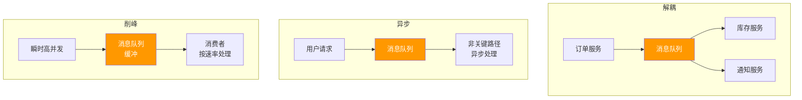

- **解耦**：生产者和消费者互不依赖，新增消费者无需修改生产者
- **异步**：非关键路径异步处理，降低响应延迟
- **削峰**：缓冲瞬时流量，保护下游系统不被压垮

### Q2：RabbitMQ 和 Kafka 有什么区别？如何选择？

| 维度 | RabbitMQ | Kafka |
|------|----------|-------|
| **定位** | 消息代理（Message Broker） | 分布式流平台（Streaming Platform） |
| **协议** | AMQP 0-9-1 | 自定义协议 |
| **吞吐量** | 万级 | 百万级 |
| **延迟** | 微秒级 | 毫秒级 |
| **路由** | 丰富的交换机类型 | 基于 Topic 分区 |
| **消息回溯** | 不支持 | 支持（按 Offset） |
| **顺序性** | 队列内有序 | 分区内有序 |
| **适用场景** | 业务消息、复杂路由 | 大数据、日志流、流处理 |

**选择依据：**
- 选 **RabbitMQ**：业务系统间消息路由、复杂路由规则、低延迟、中小吞吐
- 选 **Kafka**：大数据管道、日志收集、高吞吐、消息回溯需求

### Q3：AMQP 协议是什么？有哪些核心概念？

AMQP（Advanced Message Queuing Protocol）是应用层协议规范，RabbitMQ 实现了 AMQP 0-9-1 版本。

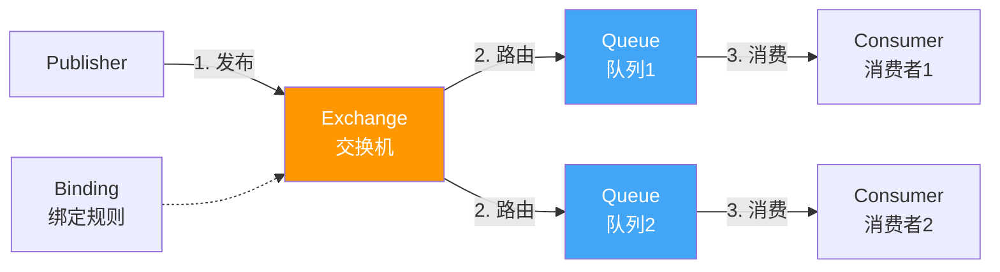

核心概念：
- **Exchange**：接收生产者消息，按路由规则分发到队列
- **Queue**：存储消息，等待消费者消费
- **Binding**：Exchange 与 Queue 之间的绑定关系，含 routing key
- **Channel**：轻量级连接，一个 TCP 连接上多路复用
- **Virtual Host**：逻辑隔离单元，类似数据库的 schema

### Q4：RabbitMQ 中 vhost 的作用是什么？

vhost（Virtual Host）是 RabbitMQ 的逻辑隔离单元：

- **资源隔离**：每个 vhost 有独立的 Exchange、Queue、Binding、权限
- **权限控制**：用户可以授权访问指定 vhost
- **多租户**：不同业务使用不同 vhost，互不影响
- **默认 vhost**：`/`，安装后自动创建

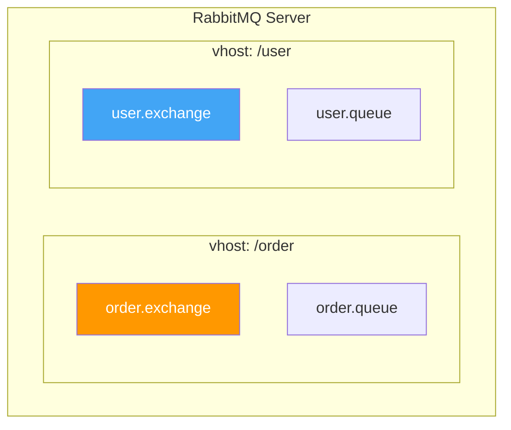

### Q5：RabbitMQ 为什么用 Erlang 实现？Erlang 有什么优势？

- **轻量级进程**：Erlang Actor 模型，每个连接一个进程，百万级并发
- **OTP 平台**：内置监督树（Supervisor），进程崩溃自动重启
- **软实时**：每个进程独立 GC，不会 Stop-The-World
- **热代码升级**：不停机更新代码，运维友好
- **分布式原生**：Erlang 节点间通信开箱即用
- **模式匹配**：消息路由的自然表达

代价：Erlang 生态小，调试工具少，学习曲线陡。

## 二、架构原理（5 题）

### Q6：RabbitMQ 有哪几种 Exchange 类型？

| 类型 | 路由规则 | 典型场景 |
|------|---------|---------|
| **Direct** | routing key 精确匹配 | 点对点、任务分发 |
| **Fanout** | 忽略 routing key，广播到所有绑定队列 | 广播通知 |
| **Topic** | routing key 通配符匹配（`*` 和 `#`） | 发布订阅、多维度路由 |
| **Headers** | 基于消息头属性匹配 | 复杂条件路由（少用） |

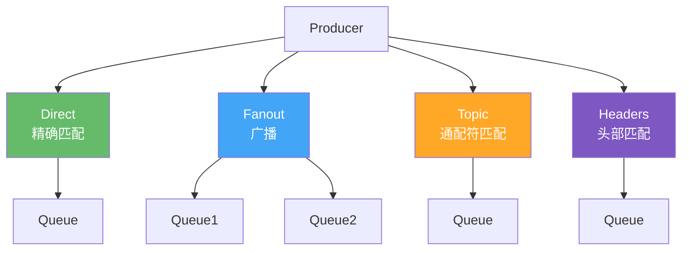

### Q7：RabbitMQ 的 Queue 有哪些类型？

| 类型 | 特点 | 适用场景 |
|------|------|---------|
| **经典队列** | 默认类型，消息存储在内存或磁盘 | 一般场景 |
| **仲裁队列** | 基于 Raft 共识，多副本强一致 | 高可用要求 |
| **流队列** | 仅追加日志，支持消费者偏移量 | 高吞吐、消息回溯 |

仲裁队列是镜像队列的替代方案（RabbitMQ 3.13 已废弃镜像队列），推荐新项目使用仲裁队列。

### Q8：Exchange 和 Queue 的 Binding 是什么？

Binding 是 Exchange 和 Queue 之间的关联规则：

- **Binding Key**：绑定时指定的路由键
- **Direct Exchange**：Binding Key 必须与消息的 Routing Key 完全一致
- **Topic Exchange**：Binding Key 支持通配符
  - `*` 匹配一个单词（如 `order.*` 匹配 `order.created`）
  - `#` 匹配零或多个单词（如 `order.#` 匹配 `order.created.v2`）
- **Fanout Exchange**：忽略 Binding Key

一个 Exchange 可以绑定多个 Queue，一个 Queue 也可以绑定多个 Exchange。

### Q9：一条消息在 RabbitMQ 中的完整生命周期是什么？

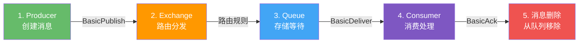

1. **Producer** 创建消息，通过 `BasicPublish` 发送到 Exchange
2. **Exchange** 根据类型和路由规则，将消息分发到一个或多个 Queue
3. **Queue** 存储消息，等待消费者消费（可选择持久化到磁盘）
4. **Consumer** 通过 `BasicConsume` 订阅队列，收到消息后处理
5. **ACK**：消费者处理完成后发送 `BasicAck`，Broker 将消息从队列删除

### Q10：Connection 和 Channel 的关系是什么？

```mermaid
flowchart TB
    subgraph TCP连接——Connection
        CH1["Channel 1<br/>发布消息"]
        CH2["Channel 2<br/>消费队列A"]
        CH3["Channel 3<br/>消费队列B"]
    end

    subgraph 应用
        APP[.NET Application]
    end

    APP --> CH1
    APP --> CH2
    APP --> CH3

    style CH1 fill:#66BB6A,color:#fff
    style CH2 fill:#42A5F5,color:#fff
    style CH3 fill:#FFA726,color:#fff
```

- **Connection**：TCP 连接，开销大，建议复用
- **Channel**：Connection 上的轻量级虚拟连接，多路复用
- 一个 Connection 可以创建多个 Channel
- 每个 Channel 有唯一 ID，AMQP 帧通过 Channel ID 区分
- **最佳实践**：每个线程使用独立 Channel，Channel 不可跨线程共享

## 三、可靠性保障（5 题）

### Q11：生产者如何确认消息成功投递？

**Publisher Confirm 机制：**

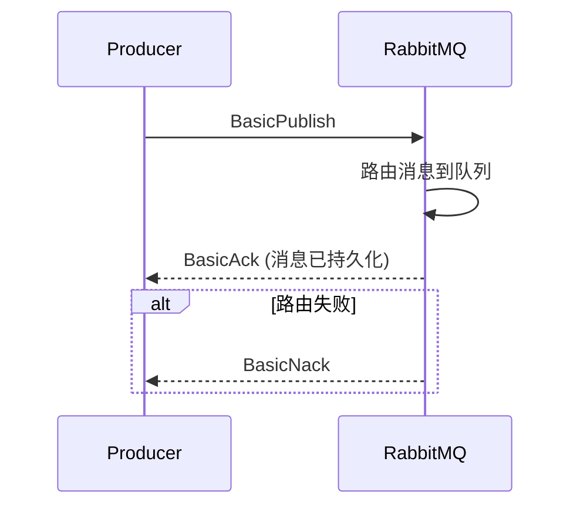

```csharp
// 开启 Publisher Confirm
channel.ConfirmSelect();

// 发布消息
channel.BasicPublish(exchange: "orders", routingKey: "order.created",
    basicProperties: properties, body: body);

// 同步等待确认
channel.WaitForConfirmsOrDie(TimeSpan.FromSeconds(5));

// 异步确认（推荐）
channel.BasicAcks += (sender, args) =>
{
    Console.WriteLine($"消息确认: DeliveryTag={args.DeliveryTag}");
};
channel.BasicNacks += (sender, args) =>
{
    Console.WriteLine($"消息拒绝: DeliveryTag={args.DeliveryTag}");
};
```

**三种确认模式：**
1. **同步确认**：`WaitForConfirms()`，每条消息等待确认，性能差
2. **批量确认**：发一批后 `WaitForConfirms()`，性能好但无法定位失败消息
3. **异步确认**：监听 `BasicAcks`/`BasicNacks` 事件，推荐

### Q12：消费者 ACK 机制是怎样的？

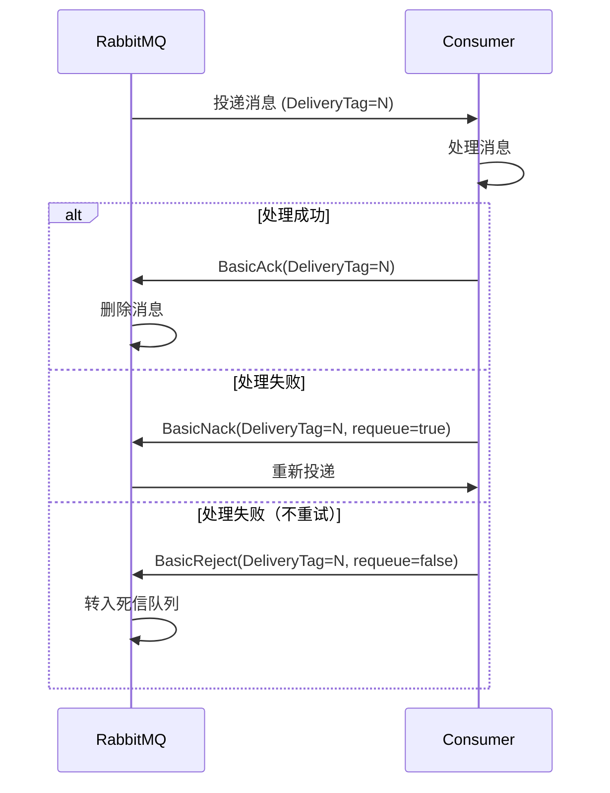

- **自动 ACK**：消息投递后立即确认，可能丢失（不推荐）
- **手动 ACK**：消费者处理完成后显式确认（推荐）
- `BasicAck`：确认消息处理成功
- `BasicNack`：批量拒绝，`requeue=true` 重新入队
- `BasicReject`：拒绝单条消息

### Q13：RabbitMQ 如何保证消息持久化？

**三层持久化：**

| 层级 | 配置 | 说明 |
|------|------|------|
| **Exchange 持久化** | `durable: true` | Broker 重启后 Exchange 不丢失 |
| **Queue 持久化** | `durable: true` | Broker 重启后 Queue 结构不丢失 |
| **Message 持久化** | `delivery_mode: 2` | 消息写入磁盘 |

```csharp
// 持久化 Exchange
channel.ExchangeDeclare("orders", ExchangeType.Topic, durable: true);

// 持久化 Queue
channel.QueueDeclare("order-queue", durable: true, exclusive: false,
    autoDelete: false, arguments: null);

// 持久化 Message
var properties = channel.CreateBasicProperties();
properties.DeliveryMode = 2; // 2 = persistent
```

::: warning 持久化不等于不丢
- 三个条件必须同时满足：Exchange 持久化 + Queue 持久化 + Message 持久化
- 持久化消息也不是写盘后才确认，而是先写内存再异步刷盘（可能丢少量）
- 完全可靠需要 Publisher Confirm + 持久化 + Consumer 手动 ACK
:::

### Q14：如何保证消息消费的幂等性？

**幂等性**：同一条消息消费多次，结果与消费一次相同。

| 方案 | 实现 | 优点 | 缺点 |
|------|------|------|------|
| **数据库去重表** | 记录已处理的消息 ID | 可靠，与业务同事务 | 数据库压力 |
| **Redis SET** | `SET messageId 1 EX 3600` | 快速 | Redis 不可用时失效 |
| **业务唯一键** | 利用业务字段唯一约束 | 自然幂等 | 需要业务设计配合 |
| **乐观锁/版本号** | `UPDATE ... SET version=version+1 WHERE version=@v` | 精确控制 | 并发冲突需重试 |

```csharp
// 数据库去重表方案
public async Task HandleAsync(OrderCreatedEvent @event)
{
    var exists = await _dbContext.ProcessedMessages
        .AnyAsync(m => m.MessageId == @event.EventId);
    if (exists) return; // 幂等：已处理过

    // 业务操作 + 记录已处理（同一事务）
    _dbContext.Orders.Add(order);
    _dbContext.ProcessedMessages.Add(new ProcessedMessage
    {
        MessageId = @event.EventId,
        ProcessedAt = DateTime.UtcNow
    });
    await _dbContext.SaveChangesAsync();
}
```

### Q15：消息丢失的场景有哪些？如何全面防止？

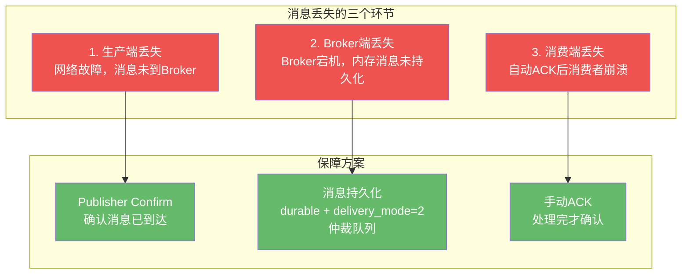

**完整保障：**
1. **生产端**：Publisher Confirm + 事务 + Outbox Pattern
2. **Broker 端**：Exchange/Queue/Message 全部持久化 + 仲裁队列
3. **消费端**：手动 ACK + 幂等消费

## 四、高级特性（5 题）

### Q16：什么是死信交换机（DLX）？消息什么时候进入死信队列？

**死信（Dead Letter）** 是无法被正常消费的消息，满足以下条件之一即成为死信：

1. 消费者 `BasicReject`/`BasicNack` 且 `requeue=false`
2. 消息 TTL 过期
3. 队列达到最大长度

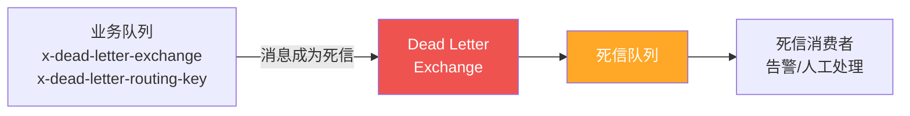

```csharp
// 声明死信交换机和队列
channel.ExchangeDeclare("dlx.exchange", ExchangeType.Direct);
channel.QueueDeclare("dlx.queue", durable: true, exclusive: false,
    autoDelete: false);

// 业务队列绑定死信
channel.QueueDeclare("order-queue", durable: true, exclusive: false,
    autoDelete: false, arguments: new Dictionary<string, object>
    {
        { "x-dead-letter-exchange", "dlx.exchange" },
        { "x-dead-letter-routing-key", "order.dead" }
    });
```

### Q17：RabbitMQ 如何实现延迟消息？

**方案一：TTL + 死信队列**

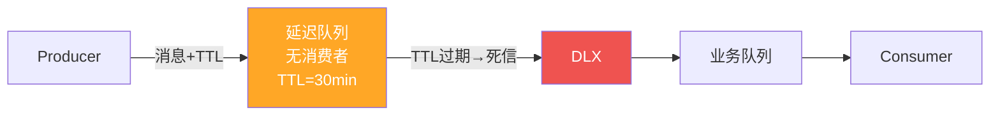

**方案二：延迟消息插件（推荐）**

```bash
rabbitmq-plugins enable rabbitmq_delayed_message_exchange
```

```csharp
// 声明延迟交换机
channel.ExchangeDeclare("delayed.exchange", "x-delayed-message",
    arguments: new Dictionary<string, object>
    {
        { "x-delayed-type", "direct" }
    });

// 发布延迟消息
var properties = channel.CreateBasicProperties();
properties.Headers = new Dictionary<string, object>
{
    { "x-delay", 30000 } // 延迟 30 秒
};
channel.BasicPublish("delayed.exchange", "order.check", properties, body);
```

| 方案 | 优点 | 缺点 |
|------|------|------|
| TTL + DLX | 不需要插件 | 相同 TTL 的消息顺序问题、需创建多个队列 |
| 延迟插件 | 简单直接 | 需要安装插件、消息存在内存中（不支持持久化延迟中的消息） |

### Q18：消息优先级如何实现？

```csharp
// 声明优先级队列（最大优先级 10）
channel.QueueDeclare("priority-queue", durable: true, exclusive: false,
    autoDelete: false, arguments: new Dictionary<string, object>
    {
        { "x-max-priority", 10 }
    });

// 发布消息时设置优先级
var properties = channel.CreateBasicProperties();
properties.Priority = 9; // 0-10，数字越大优先级越高
channel.BasicPublish("", "priority-queue", properties, body);
```

::: warning 优先级注意事项
- 优先级仅在消费者消费速度 < 生产速度时才有意义（队列有积压）
- `x-max-priority` 建议不超过 10，值越大内存开销越大
- 优先级队列的性能比普通队列差，不要滥用
:::

### Q19：RabbitMQ 如何实现 RPC？

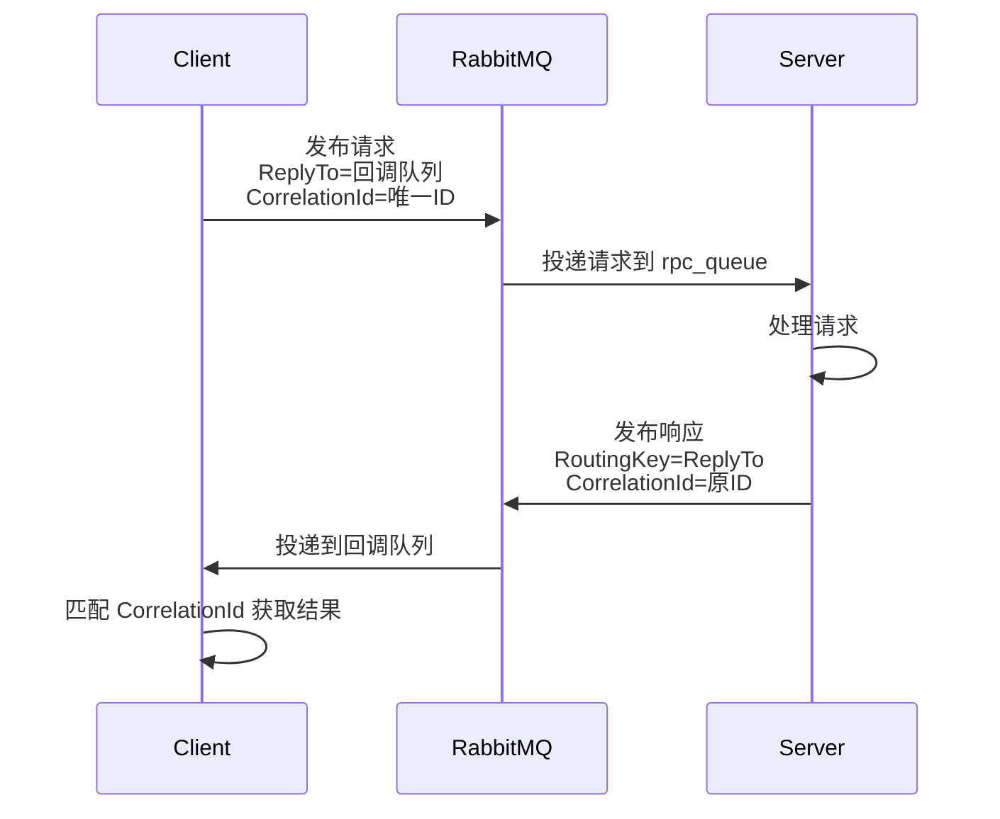

```csharp
// RPC 服务端
var consumer = new EventingBasicConsumer(channel);
consumer.Received += (model, args) =>
{
    var body = args.Body.ToArray();
    var props = args.BasicProperties;
    var replyProps = channel.CreateBasicProperties();
    replyProps.CorrelationId = props.CorrelationId;

    var result = ProcessRequest(body);
    channel.BasicPublish("", props.ReplyTo, replyProps, result);
    channel.BasicAck(args.DeliveryTag, false);
};
channel.BasicConsume("rpc_queue", false, consumer);

// RPC 客户端
var callbackQueue = channel.QueueDeclare().QueueName;
var props = channel.CreateBasicProperties();
var correlationId = Guid.NewGuid().ToString();
props.CorrelationId = correlationId;
props.ReplyTo = callbackQueue;

channel.BasicPublish("", "rpc_queue", props, requestBody);
```

### Q20：消费者 Prefetch Count 如何调优？

**Prefetch Count** 限制了 RabbitMQ 向消费者一次性推送的消息数量（未经 ACK 的最大消息数）。

```mermaid
flowchart LR
    subgraph prefetch=1
        R1[RabbitMQ] -->|1条| C1[Consumer]
        C1 -->|Ack| R1
        R1 -->|1条| C1
    end

    subgraph prefetch=N
        R2[RabbitMQ] -->|N条| C2[Consumer]
        C2 -->|Ack| R2
    end

    subgraph prefetch=0
        R3[RabbitMQ] -->|无限| C3["Consumer<br/>可能内存溢出"]
    end
```

| 设置 | 效果 | 适用场景 |
|------|------|---------|
| `prefetch=1` | 逐条处理，公平分发 | 消息处理时间差异大 |
| `prefetch=N` (10-50) | 批量预取，提高吞吐 | 消息处理快且均匀 |
| `prefetch=0` | 无限推送，可能内存溢出 | **不推荐** |

```csharp
// .NET 设置 Prefetch
channel.BasicQos(prefetchSize: 0, prefetchCount: 10, global: false);
```

**调优建议：**
- 默认 `prefetch=0`（无限），生产环境必须设置
- 一般场景推荐 `prefetch=10~50`
- 消息处理耗时长的场景降低值，避免某个消费者积压太多
- `global=false`：prefetch 限制对每个消费者生效；`global=true`：对整个 Channel 生效

## 五、集群与高可用（5 题）

### Q21：RabbitMQ 集群是如何组成的？

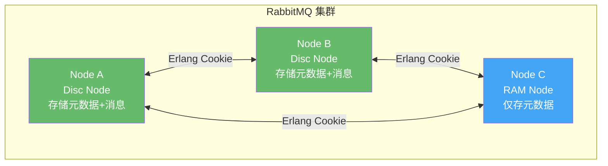

- **Disc Node**：元数据和消息持久化到磁盘，集群至少一个
- **RAM Node**：元数据仅存内存，性能更好但重启丢失
- **Erlang Cookie**：节点间通信的认证密钥，所有节点必须一致
- 集群中 **Exchange、Binding、用户权限** 等元数据会自动同步
- **Queue 的消息** 默认只存在声明该 Queue 的节点上（非自动复制）

### Q22：镜像队列和仲裁队列有什么区别？

| 维度 | 镜像队列（Classic Mirrored） | 仲裁队列（Quorum Queue） |
|------|-----|-----|
| **状态** | RabbitMQ 3.13 **已废弃** | 推荐使用 |
| **复制协议** | 主从同步，无共识 | Raft 共识协议 |
| **一致性** | 最终一致（可能丢消息） | 强一致（多数确认） |
| **故障恢复** | 手动同步 | 自动选举新 Leader |
| **性能** | 较高 | 略低（Raft 日志开销） |
| **配置** | `ha-mode` policy | `x-queue-type: quorum` |

```csharp
// 声明仲裁队列
channel.QueueDeclare("order-queue", durable: true, exclusive: false,
    autoDelete: false, arguments: new Dictionary<string, object>
    {
        { "x-queue-type", "quorum" },
        { "x-quorum-initial-group-size", 3 } // 3 个副本
    });
```

::: important 新项目请使用仲裁队列
镜像队列已在 RabbitMQ 3.13 废弃，3.13 版本中仍然可用但会有警告。仲裁队列是官方推荐的高可用方案，基于 Raft 共识，提供更强的数据一致性保证。
:::

### Q23：RabbitMQ 网络分区如何处理？

**网络分区（Network Partition）** 是集群节点间网络中断，导致节点各自为政。

**分区处理策略：**

| 策略 | 行为 | 适用场景 |
|------|------|---------|
| `ignore` | 忽略分区，各节点独立运行 | 不推荐 |
| `pause_minority` | 少数派节点自停 | 推荐多数场景 |
| `autoheal` | 分区恢复后，少数派重启 | 有状态服务 |

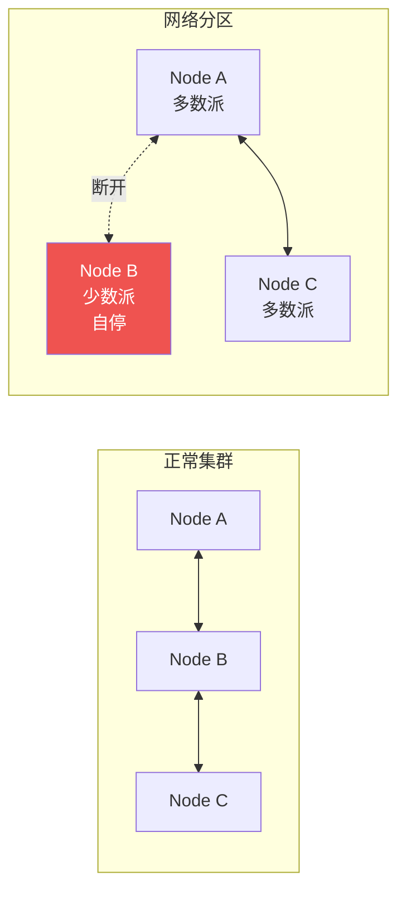

**建议：**
- 使用 `pause_minority` 策略，保证只有多数派继续服务
- 部署奇数节点（3 或 5），确保能形成多数派
- 监控分区事件，及时告警

### Q24：Federation 和 Shovel 有什么区别？

| 维度 | Federation | Shovel |
|------|-----------|--------|
| **定位** | 联邦，跨 Broker 逻辑整合 | 铲子，跨 Broker 消息搬运 |
| **模式** | Pull（下游主动拉取） | Push（源端主动推送） |
| **拓扑** | Exchange/Queue 级别联邦 | 点对点消息转发 |
| **场景** | 跨机房/跨区域消息同步 | 数据迁移、灾备 |
| **协议** | AMQP | AMQP |

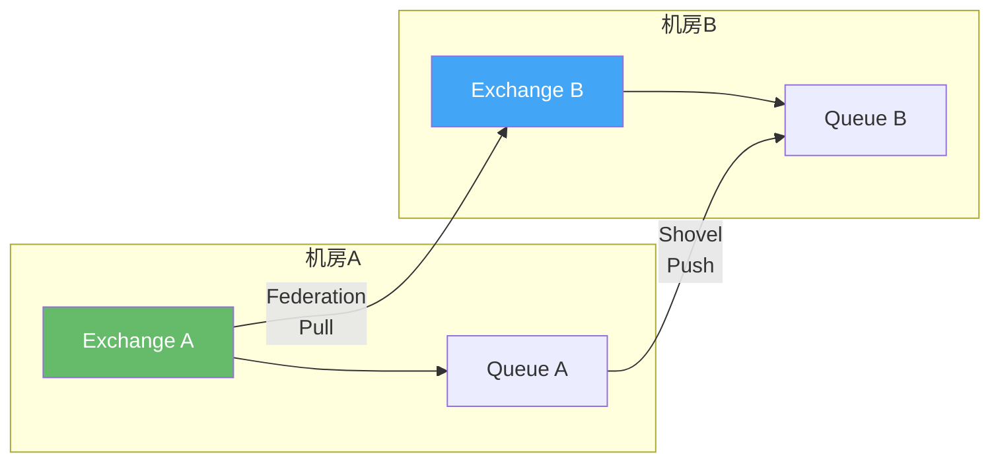

### Q25：如何设计 RabbitMQ 高可用架构？

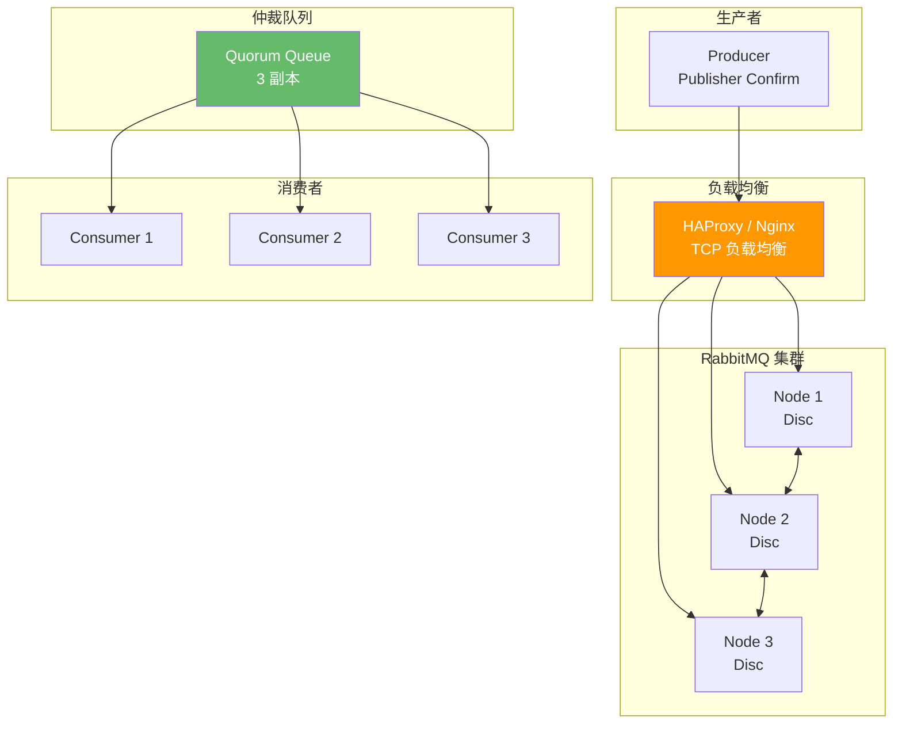

**高可用设计要点：**
1. **集群部署**：至少 3 节点（Disc Node），奇数节点
2. **仲裁队列**：替代镜像队列，Raft 共识保证数据安全
3. **负载均衡**：客户端通过 HAProxy/Nginx 访问集群
4. **Publisher Confirm**：确保消息到达 Broker
5. **手动 ACK + 死信队列**：消费端可靠性保障
6. **监控告警**：队列堆积、连接数、分区事件

## 六、.NET 实战（5 题）

### Q26：RabbitMQ.Client 的连接生命周期如何管理？

```csharp
// 推荐方式：使用 ConnectionFactory + 自动恢复
var factory = new ConnectionFactory
{
    HostName = "localhost",
    UserName = "admin",
    Password = "admin123",
    AutomaticRecoveryEnabled = true,     // 自动重连
    NetworkRecoveryInterval = TimeSpan.FromSeconds(5), // 重连间隔
    TopologyRecoveryEnabled = true       // 自动恢复 Exchange/Queue/Binding
};

// IConnection 实现 IDisposable
await using var connection = await factory.CreateConnectionAsync();

// IChannel 也实现 IDisposable
await using var channel = await connection.CreateChannelAsync();
```

::: tip 连接管理最佳实践
1. **应用生命周期内复用 Connection**：Connection 是 TCP 连接，创建开销大
2. **每个线程独立 Channel**：Channel 不支持多线程共享
3. **开启自动恢复**：`AutomaticRecoveryEnabled = true`
4. **使用 using 或 DI 容器管理生命周期**
5. **集群环境传入多个 HostName**：`factory.HostName` 改为 `factory.Endpoints`
:::

### Q27：MassTransit 的核心功能有哪些？

[MassTransit](https://masstransit-project.com/) 是 .NET 最流行的消息总线框架：

| 功能 | 说明 |
|------|------|
| **消息发布/订阅** | `IPublishEndpoint.Publish()` / `IConsumer<T>` |
| **请求/响应** | `IRequestClient<T>` 自动管理 CorrelationId |
| **Saga 状态机** | Automatonymous 集成，状态持久化到 EF/NHibernate/MongoDB |
| **Courier** | 活动（Activity）编排，类似补偿事务 |
| **调度** | 延迟消息调度，支持 RabbitMQ 延迟交换机 |
| **Outbox** | 企业版功能，事务性发件箱 |
| **中间件** | 重试、熔断、日志、追踪等管道式中间件 |
| **多传输** | RabbitMQ、Azure Service Bus、Amazon SQS、Kafka |

### Q28：EasyNetQ 和 MassTransit 有什么区别？

| 维度 | EasyNetQ | MassTransit |
|------|----------|-------------|
| **定位** | 轻量级 RabbitMQ 客户端 | 全功能消息总线 |
| **抽象层级** | 接近 RabbitMQ 原生 | 高度抽象 |
| **Saga 支持** | 无 | 内置 Automatonymous |
| **依赖注入** | 基础支持 | 深度集成 Microsoft.DI |
| **学习曲线** | 低 | 中高 |
| **适用场景** | 简单发布订阅、中小项目 | 复杂消息模式、企业项目 |

**选择建议：**
- 简单场景、快速上手 → EasyNetQ
- 复杂 Saga、企业级需求 → MassTransit
- 只需基本收发 → RabbitMQ.Client 原生 API

### Q29：.NET 中如何实现 Outbox Pattern？

**方案一：手动实现**（参见 09-01 微服务事件驱动架构）

**方案二：CAP 框架（推荐）**

```csharp
// 安装 NuGet
// DotNetCore.CAP
// DotNetCore.CAP.RabbitMQ
// DotNetCore.CAP.SqlServer（或 PostgreSQL/MySQL）

// 配置
builder.Services.AddCap(x =>
{
    x.UseRabbitMQ(rmq =>
    {
        rmq.HostName = "localhost";
        rmq.UserName = "admin";
        rmq.Password = "admin123";
    });
    x.UseSqlServer(sql =>
    {
        sql.ConnectionString = connectionString;
    });
});

// 发布（在同一事务中）
using var transaction = await _dbContext.Database
    .BeginTransactionAsync(_capPublisher, autoCommit: false);

_dbContext.Orders.Add(order);
await _capPublisher.PublishAsync("order.created", @event);
await _dbContext.SaveChangesAsync();
await transaction.CommitAsync();

// 消费
[CapSubscribe("order.created")]
public async Task HandleAsync(OrderCreatedEvent @event)
{
    // 处理逻辑
}
```

### Q30：CAP 框架的核心能力是什么？

[CAP](https://github.com/dotnetcore/CAP) 是 .NET 社区的分布式事务解决方案：

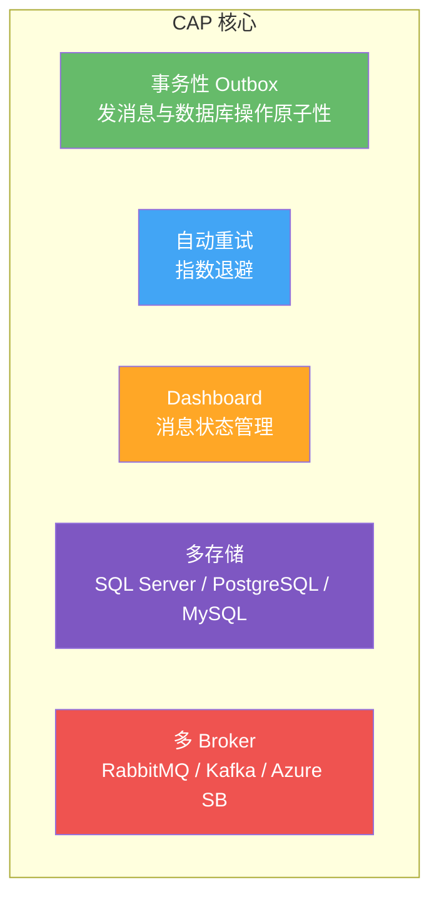

**核心能力：**
1. **事务性 Outbox**：`PublishAsync` 与 `SaveChangesAsync` 在同一数据库事务中
2. **自动重试**：消费失败自动重试，可配置次数和间隔
3. **Dashboard**：内置 Web 管理面板，查看/重发消息
4. **多持久化**：支持 SQL Server、PostgreSQL、MySQL 作为消息存储
5. **多消息代理**：支持 RabbitMQ、Kafka、Azure Service Bus
6. **[CapSubscribe]**：声明式消息订阅，简洁优雅

**与 MassTransit 对比：**
- CAP 侧重 **Outbox 一致性**，MassTransit 侧重 **消息模式**（Saga、Courier）
- CAP 更轻量，开箱即用；MassTransit 功能更全面但学习成本高
- CAP Outbox 是开源免费的，MassTransit Outbox 是企业版功能

## 参考资料

- [RabbitMQ 官方文档](https://www.rabbitmq.com/documentation.html)
- 《RabbitMQ 实战指南》— 朱忠华
- [RabbitMQ in Depth](https://www.manning.com/books/rabbitmq-in-depth) — Alvaro Videla
- [MassTransit 官方文档](https://masstransit-project.com/)
- [CAP 框架文档](https://cap.dotnetcore.xyz/)
- [CAP GitHub](https://github.com/dotnetcore/CAP)
- [AMQP 0-9-1 规范](https://www.rabbitmq.com/resources/specs/amqp0-9-1.pdf)
- [Microservices.io 模式](https://microservices.io/patterns/)

## 面试技巧

::: tip 面试策略总结
1. **先说结论，再展开**：面试官问"如何保证消息不丢"，先答"三端保障：Publisher Confirm + 持久化 + 手动 ACK"，再分别展开
2. **画图辅助**：涉及架构/流程的问题，主动画图说明，比纯文字清晰
3. **对比回答**：问"RabbitMQ vs Kafka"时，按维度对比（吞吐、延迟、路由、场景），最后给出选择建议
4. **结合实战**：提到 CAP/MassTransit 时，说明自己在项目中的使用经验
5. **承认边界**：RabbitMQ 不适合大数据场景，不强行吹捧，体现技术判断力
6. **关注版本**：镜像队列已废弃、仲裁队列是趋势，说明你关注社区动态
:::
