# 01 · Redis 简介与生态

## Redis 是什么

Redis（**Re**mote **Di**ctionary **S**erver，远程字典服务）是一个开源的、基于内存的键值对（Key-Value）存储系统。它可以用作数据库、缓存和消息队列中间件，是目前生产环境中使用最广泛的 NoSQL 数据库之一。

用一个公式来概括 Redis 的本质：

> **Redis = 内存速度 + 丰富数据结构 + 持久化 + 分布式能力**

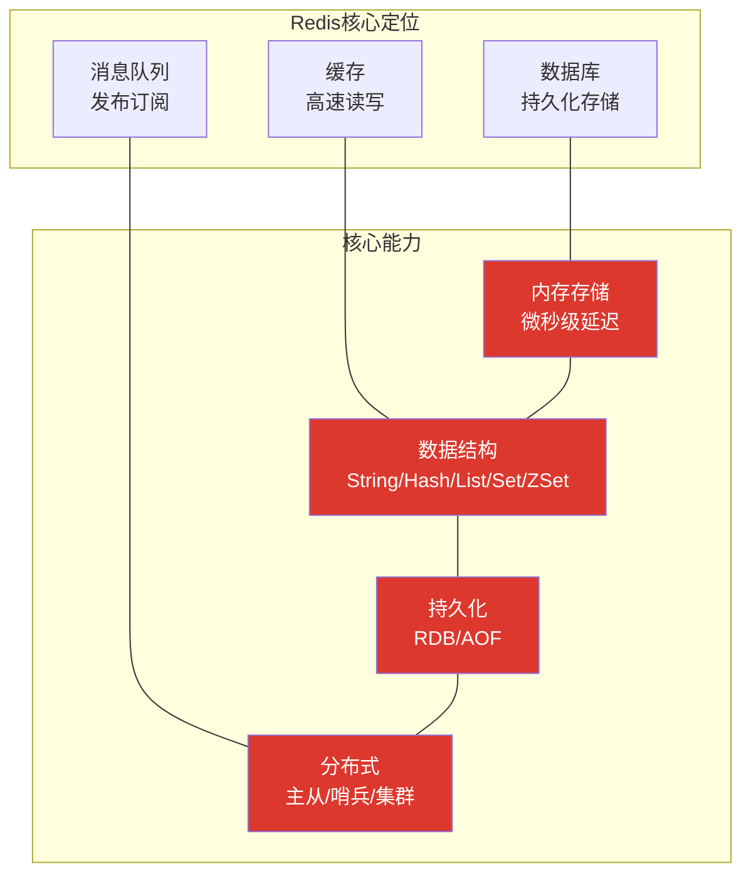

### 核心特征速览

| 特征 | 说明 |
|------|------|
| **内存存储** | 数据主要存储在内存中，读写延迟在微秒级（10 万+ QPS） |
| **单线程模型** | 命令执行采用单线程，避免上下文切换和锁竞争 |
| **I/O 多路复用** | epoll/kqueue 实现高并发连接处理 |
| **丰富数据结构** | 5 种基础类型 + 3 种扩展类型 + 模块扩展 |
| **持久化** | RDB 快照 + AOF 日志，数据不丢失 |
| **高可用** | 主从复制 + 哨兵自动故障转移 |
| **水平扩展** | Redis Cluster 分片集群，支持 PB 级数据 |

## Redis 的前世今生

### 创始人与诞生故事

Redis 的创始人是意大利程序员 **Salvatore Sanfilippo**，网名 **antirez**。Redis 的诞生源于一个真实的工程需求：

2008 年，antirez 在开发一个名为 **LLOOGG** 的实时 Web 分析系统时，需要频繁地读写实时数据。当时他使用的 MySQL 数据库在高并发场景下性能瓶颈明显，而 Memcached 又缺乏持久化能力。于是 antirez 决定自己写一个具备持久化能力的内存数据库 —— Redis 由此诞生。

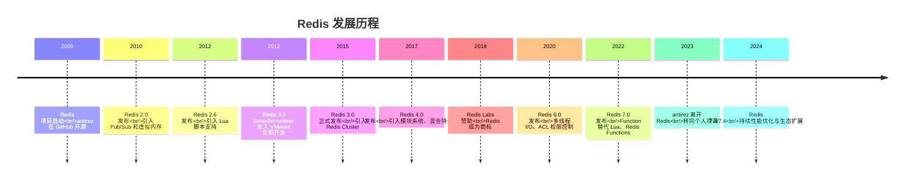

::: important 关于 antirez
Salvatore Sanfilippo 是一位极具传奇色彩的开发者。他以一己之力维护了 Redis 核心代码长达十余年，其代码风格以简洁优雅著称。2020 年他宣布退出 Redis 日常维护，将项目交给社区，但仍然是 Redis 精神上的灵魂人物。他的博客（antirez.com）是学习 Redis 设计哲学的珍贵资料。
:::

### 版本演进中的里程碑

| 版本 | 年份 | 里程碑特性 | 影响力 |
|------|------|-----------|--------|
| **1.0** | 2009 | 基础数据结构、持久化 | Redis 诞生 |
| **2.0** | 2010 | Pub/Sub、虚拟内存（后来移除） | 从缓存走向消息中间件 |
| **2.6** | 2012 | Lua 脚本、Redis Sentinel 初版 | 可编程能力初现 |
| **2.8** | 2013 | PARTIAL 同步、Config Rewrite | 复制可靠性提升 |
| **3.0** | 2015 | Redis Cluster | 分布式能力质的飞跃 |
| **3.2** | 2016 | GEO 地理位置命令 | LBS 场景支持 |
| **4.0** | 2017 | 模块系统、混合持久化、PSYNC2 | 生态开放 + 持久化最优解 |
| **5.0** | 2018 | Stream 数据类型 | 流式数据处理 |
| **6.0** | 2020 | 多线程 I/O、ACL、SSL | 生产级安全与性能 |
| **6.2** | 2021 | 新增命令优化、性能提升 | 渐进式增强 |
| **7.0** | 2022 | Redis Functions、Client-side Cache | 函数式编程、客户端缓存 |
| **7.2** | 2023 | 性能优化、命令增强 | 稳定性提升 |

## Redis 核心架构

### 整体架构图

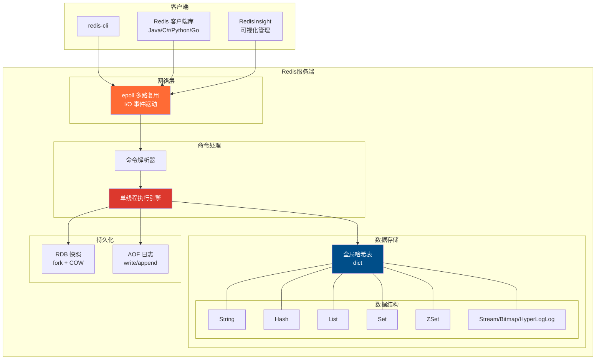

### 为什么 Redis 这么快？

Redis 的性能神话并非来自单一技术，而是多个设计的协同：

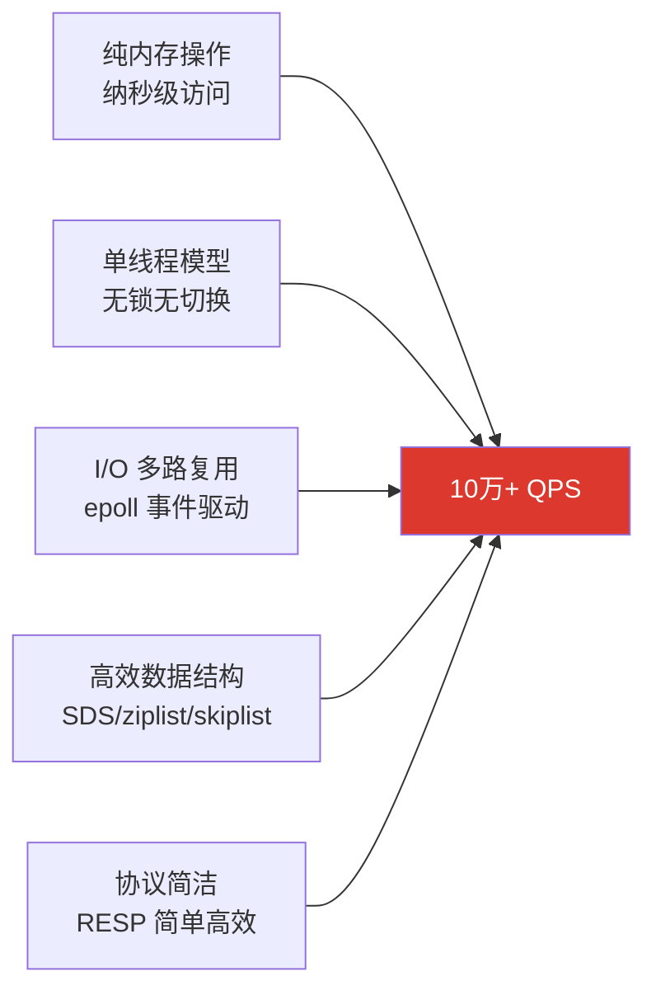

#### 1. 纯内存操作

内存的访问速度远超磁盘：

| 存储介质 | 访问延迟 | 比喻 |
|----------|---------|------|
| CPU L1 Cache | ~1 ns | 你桌上的一本书 |
| CPU L2 Cache | ~4 ns | 你书架上的一本书 |
| 内存 (RAM) | ~100 ns | 本地图书馆 |
| SSD | ~100 μs | 本市图书馆 |
| HDD | ~10 ms | 外地图书馆 |
| 网络 (同城) | ~1 ms | 快递送书 |

Redis 的数据主要存储在内存中，一次操作只需要约 100 纳秒，而传统数据库从磁盘读取需要毫秒级。

#### 2. 单线程模型的智慧

这可能是 Redis 最常被问到的问题：**单线程为什么比多线程快？**

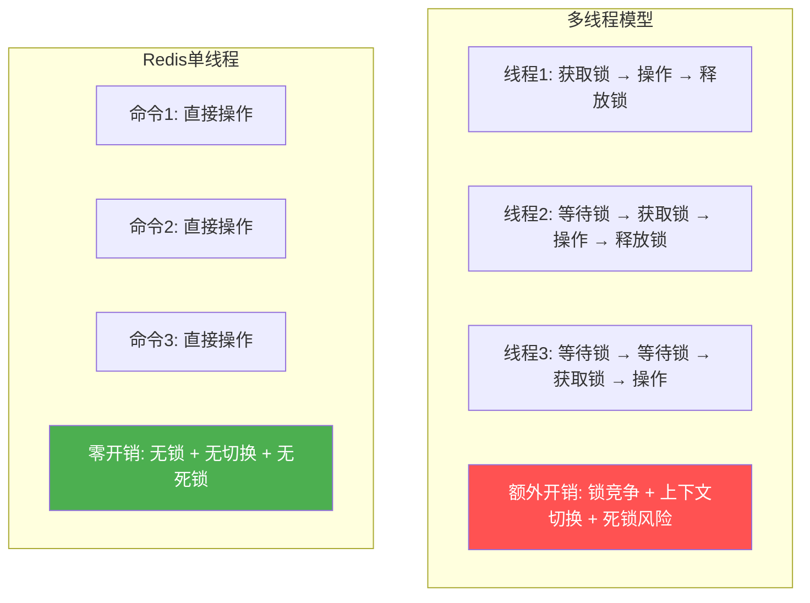

单线程的优势：

- **无锁竞争**：不需要加锁/解锁，没有死锁风险
- **无上下文切换**：线程切换需要保存/恢复寄存器、缓存失效，代价约 5-10 μs
- **无并发 Bug**：没有竞态条件、数据不一致的问题
- **CPU 缓存友好**：单线程访问的数据在 L1/L2 缓存中命中率高

::: tip Redis 6.0 的多线程 I/O
Redis 6.0 引入了多线程 I/O，但**命令执行仍然是单线程**。多线程仅用于网络数据的读写和协议解析，将网络 I/O 这部分耗时操作并行化。执行引擎依然是串行的，保证了线程安全。

```
单线程:  读取 → 解析 → 执行 → 写回 → 读取 → 解析 → 执行 → 写回
多线程I/O: [读取+解析] → [执行] → [写回]
           [读取+解析] → [执行] → [写回]   ← 网络 I/O 并行
           [读取+解析] → [执行] → [写回]
```
:::

#### 3. I/O 多路复用

I/O 多路复用是 Redis 高并发的关键。一个线程如何同时处理上万个连接？

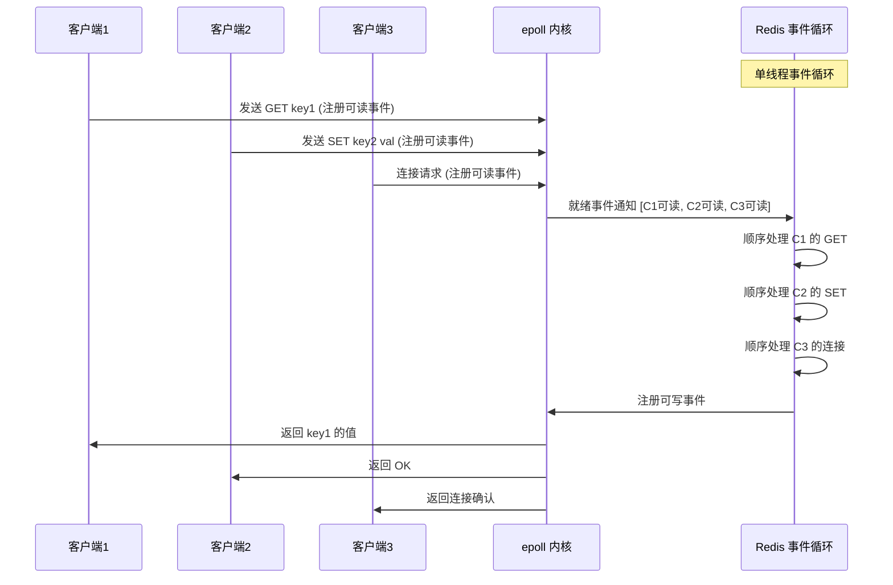

Redis 在不同操作系统上使用不同的多路复用实现：

| 操作系统 | 多路复用技术 | 特点 |
|----------|-------------|------|
| Linux | epoll | 事件通知，O(1) 性能 |
| macOS | kqueue | 类似 epoll，BSD 系 |
| 其他 | select | 兼容性好，性能一般（FD 上限 1024） |

#### 4. 高效的数据结构

Redis 为不同场景精心设计了底层编码：

| 类型 | 底层编码 | 条件 | 特点 |
|------|---------|------|------|
| String | int | 值为整数 | 直接存储，零开销 |
| String | embstr | 字符串 ≤ 44 字节 | 一次内存分配 |
| String | raw | 字符串 > 44 字节 | SDS 实现，O(1) 获取长度 |
| Hash | listpack | 字段 ≤ 128 且值 ≤ 64 字节 | 紧凑存储，省内存 |
| Hash | hashtable | 超出 listpack 条件 | O(1) 访问 |
| List | listpack | 元素少 | 紧凑存储 |
| List | quicklist | 通用 | listpack + 链表，兼顾内存和性能 |
| Set | intset | 全是整数且 ≤ 128 个 | 有序整数数组，省内存 |
| Set | hashtable | 超出 intset 条件 | O(1) 查找 |
| ZSet | listpack | 元素 ≤ 128 且值 ≤ 64 字节 | 紧凑存储 |
| ZSet | skiplist + hashtable | 超出 listpack 条件 | O(logN) 范围查询 |

::: info Redis 7.2 的编码变化
Redis 7.0 开始用 listpack 替代了 ziplist。ziplist 有一个严重问题：连锁更新——当某个节点的长度变化导致前一个节点的 `prevlen` 字段扩展，可能引发一连串的内存重分配。listpack 彻底解决了这个问题。
:::

## Redis 7 新特性

Redis 7 是一个重大版本，带来了多项重要改进：

### 1. Redis Functions

Redis Functions 是 Lua 脚本的进化版，提供了更强大的可编程能力：


| 对比维度 | Lua 脚本 (EVAL) | Redis Functions |
|----------|-----------------|-----------------|
| 持久化 | 不持久化，重启后需重新加载 | 持久化到 RDB/AOF，重启后自动恢复 |
| 管理 | SCRIPT 系列命令分散 | FUNCTION 统一管理函数库 |
| 函数库 | 无函数库概念 | 支持函数库（Library），可包含多个函数 |
| 语言 | Lua | Lua（7.0），后续版本计划支持更多语言 |
| 调用方式 | EVAL/EVALSHA | FCALL/FCALL_RO |

```bash
# 创建函数库
FUNCTION CREATE mylib LUA
  "local function add(keys, args)
     return redis.call('INCRBY', keys[1], args[1])
   end
   redis.register_function('add', add)"

# 调用函数
FCALL mylib.add 1 counter 5

# 查看所有函数
FUNCTION LIST

# 删除函数库
FUNCTION DELETE mylib
```

### 2. Client-side Caching

客户端缓存是 Redis 6.0 引入、7.0 完善的重要特性，可以将热点数据缓存在应用进程内，减少网络往返：

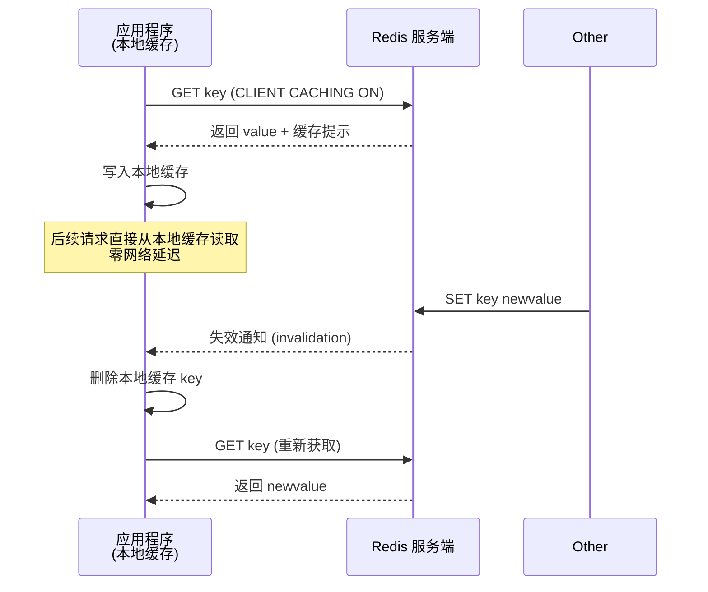

### 3. ACL v2 增强

Redis 7 对 ACL 权限控制进行了增强：

```bash
# 创建用户，精确控制命令和 Key 权限
ACL SETUSER app_readonly on >password123 ~cached:* +GET +MGET +HGET

# 查看用户权限
ACL LIST

# 7.0 新增：按 Key Pattern 和 Channel Pattern 的权限控制
ACL SETUSER app_pubsub on >password123 &chat:* +SUBSCRIBE +PUBLISH
```

### 4. 其他重要改进

| 特性 | 说明 |
|------|------|
| **Multi-part AOF** | AOF 拆分为基础文件 + 增量文件，重写更高效 |
| **Command 标志增强** | 新增 `@fast` / `@slow` 分类 |
| **Lua 脚本增强** | 支持脚本中调用 `Redis.call` 的事务性行为 |
| **Listpack 替代 ziplist** | 彻底解决连锁更新问题 |
| **Sharded Pub/Sub** | 集群模式下的分片发布订阅 |

## Redis 应用场景全景

Redis 的应用场景极为广泛，几乎覆盖了后端架构的所有关键环节：

```mermaid
flowchart TB
    Redis[Redis 应用场景]

    Redis --> CACHE[缓存]
    Redis --> SESSION[会话管理]
    Redis --> RANK[排行榜]
    Redis --> MQ[消息队列]
    Redis --> ANALYTICS[实时分析]
    Redis --> LOCK[分布式锁]
    Redis --> GEO[地理位置]
    Redis --> LIMIT[限流器]

    CACHE --> C1[页面缓存]
    CACHE --> C2[对象缓存]
    CACHE --> C3[查询缓存]

    SESSION --> S1[Web 会话存储]
    SESSION --> S2[Token 管理]

    RANK --> R1[游戏排行]
    RANK --> R2[热搜榜单]
    RANK --> R3[积分排名]

    MQ --> Q1[异步任务]
    MQ --> Q2[事件通知]
    MQ --> Q3[Stream 消息流]

    ANALYTICS --> A1[UV/PV 统计]
    ANALYTICS --> A2[实时计数器]
    ANALYTICS --> A3[用户行为分析]

    LOCK --> L1[库存扣减]
    LOCK --> L2[定时任务互斥]

    GEO --> G1[附近的人]
    GEO --> G2[门店搜索]

    LIMIT --> LT1[API 限流]
    LIMIT --> LT2[滑动窗口]

    style Redis fill:#DC382D,color:#fff
    style CACHE fill:#FF9800,color:#fff
    style SESSION fill:#4CAF50,color:#fff
    style RANK fill:#2196F3,color:#fff
    style MQ fill:#9C27B0,color:#fff
    style ANALYTICS fill:#00BCD4,color:#fff
```

### 场景 1：缓存

缓存是 Redis 最经典、最广泛的应用场景。在典型的三层架构中，Redis 位于数据库与应用之间：

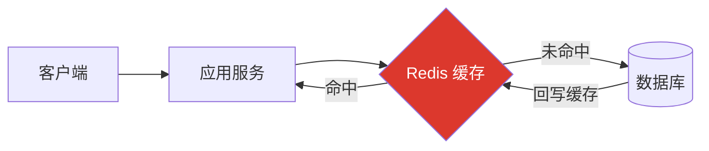

**缓存策略**：

| 策略 | 做法 | 适用场景 |
|------|------|---------|
| **Cache Aside** | 应用先查缓存，未命中查数据库，回写缓存 | 通用方案，读多写少 |
| **Read Through** | 缓存层自动从数据库加载 | 读频繁，一致性要求低 |
| **Write Through** | 写缓存时同步写数据库 | 读写均衡，强一致性 |
| **Write Behind** | 写缓存后异步批量写数据库 | 写密集，容忍延迟 |

```bash
# Cache Aside 模式伪代码
# 1. 查询
value = GET user:1001
if value is nil:
    value = DB.query("SELECT * FROM users WHERE id = 1001")
    SET user:1001 value EX 3600  # 缓存1小时

# 2. 更新
DB.update("UPDATE users SET name = 'Alice' WHERE id = 1001")
DEL user:1001  # 删除缓存，下次查询时重新加载
```

::: warning 缓存三大经典问题
1. **缓存穿透**：查询不存在的数据，缓存和数据库都没有 → 布隆过滤器 / 空值缓存
2. **缓存雪崩**：大量缓存同时过期 → 过期时间加随机值 / 多级缓存
3. **缓存击穿**：热点 Key 过期，瞬间大量请求打到数据库 → 互斥锁 / 永不过期
:::

### 场景 2：会话管理

在分布式系统中，用户的会话信息（Session）需要跨服务器共享，Redis 是理想的会话存储：

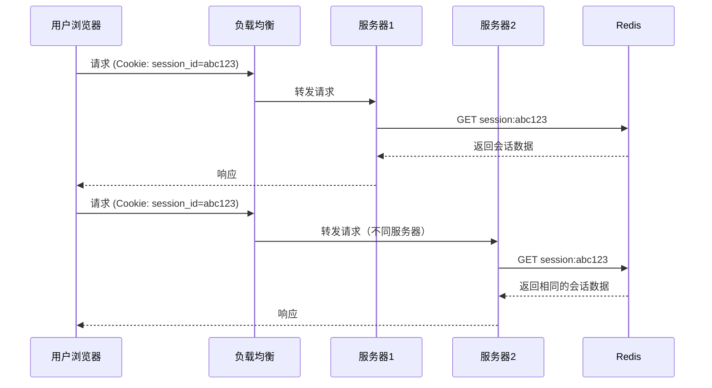

```bash
# 存储会话
HMSET session:abc123 user_id 1001 name "Alice" role "admin" last_login 1706745600
EXPIRE session:abc123 1800  # 30分钟过期

# 读取会话
HGETALL session:abc123

# 更新会话最后访问时间
HSET session:abc123 last_login 1706745660
EXPIRE session:abc123 1800  # 刷新过期时间
```

### 场景 3：排行榜

利用 ZSet（有序集合）天然排序的特性，实现排行榜极为高效：

```mermaid
flowchart TB
    subgraph ZSet排行实现
        ZADD[ZADD leaderboard 9500 Alice<br/>ZADD leaderboard 8800 Bob<br/>ZADD leaderboard 9200 Carol]
        ZRANGE[ZRANGE leaderboard 0 -1 REV WITHSCORES<br/>返回：Alice(9500) Carol(9200) Bob(8800)]
        ZRANK[ZRANK leaderboard Bob<br/>返回：2（第3名，从0开始）]
    end

    ZADD --> ZRANGE
    ZRANGE --> ZRANK

    style ZADD fill:#2196F3,color:#fff
    style ZRANGE fill:#4CAF50,color:#fff
    style ZRANK fill:#FF9800,color:#fff
```

```bash
# 添加/更新分数
ZADD game:ranking 9500 "Alice"
ZADD game:ranking 8800 "Bob"
ZADD game:ranking 9200 "Carol"

# 增量更新分数
ZINCRBY game:ranking 100 "Bob"  # Bob 加 100 分

# Top 10 排行榜（降序）
ZREVRANGE game:ranking 0 9 WITHSCORES

# 查询某人的排名
ZREVRANK game:ranking "Alice"  # 返回 0（第1名）

# 查询分数段内的人数
ZCOUNT game:ranking 9000 10000  # 返回 2（Alice 和 Carol）
```

### 场景 4：消息队列

Redis 提供了多种消息队列方案，从简单到复杂：

| 方案 | 数据结构 | 特点 | 适用场景 |
|------|---------|------|---------|
| **List 队列** | List | LPUSH + BRPOP，简单可靠 | 简单任务队列 |
| **Pub/Sub** | Pub/Sub | 实时推送，不持久化 | 实时通知、聊天 |
| **Stream** | Stream | 消费者组、ACK、持久化 | 完整消息队列 |

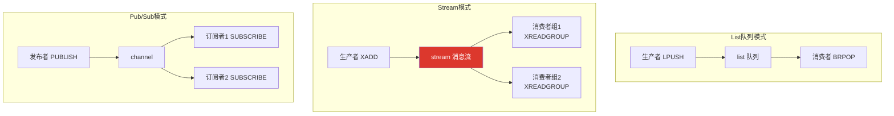

```bash
# Stream 消息队列（推荐方案）
# 生产者
XADD orders:* type "new_order" item "iPhone 15" price 7999

# 创建消费者组
XGROUP CREATE orders order_group $ MKSTREAM

# 消费者读取
XREADGROUP GROUP order_group consumer1 COUNT 1 BLOCK 5000 STREAMS orders >

# 确认处理完成
XACK orders order_group 1706745600000-0
```

### 场景 5：实时分析

Redis 提供了多种工具实现实时数据分析：

```bash
# 1. 计数器（String + INCR）
INCR page:home:views:20240201          # 页面浏览量
INCRBY api:/order:calls:20240201 1     # API 调用次数

# 2. UV 统计（HyperLogLog）
PFADD uv:20240201 user_1001
PFADD uv:20240201 user_1002
PFCOUNT uv:20240201                     # 返回估算的独立访客数

# 3. 在线状态（Bitmap）
SETBIT online:20240201 1001 1           # 用户 1001 上线
SETBIT online:20240201 1002 1           # 用户 1002 上线
BITCOUNT online:20240201                # 返回在线人数

# 4. 滑动窗口限流（ZSet）
ZADD rate_limit:user:1001 1706745600 "req_1"
ZREMRANGEBYSCORE rate_limit:user:1001 0 1706745540  # 移除60秒前的请求
ZCARD rate_limit:user:1001              # 60秒内的请求数
```

### 场景 6：分布式锁

Redis 实现分布式锁是最常见的面试考点之一：

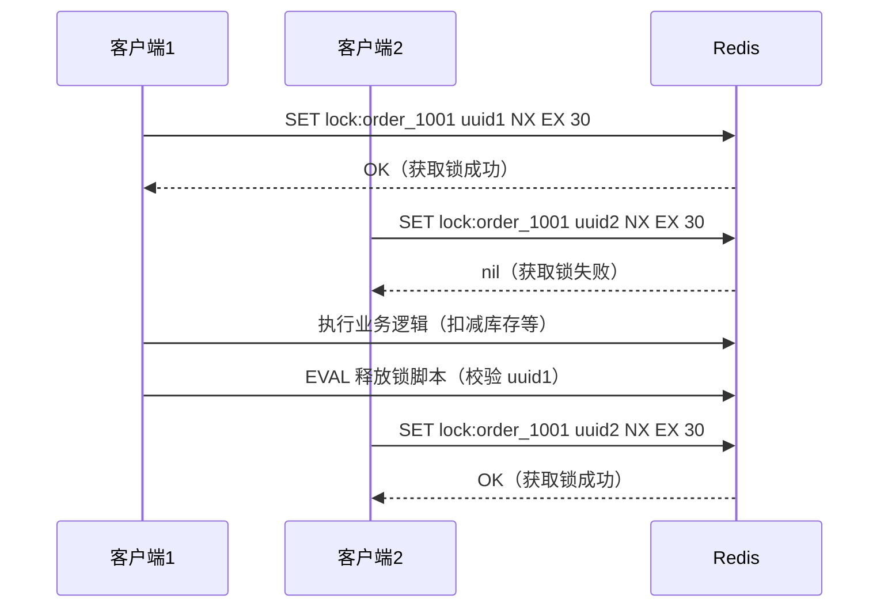

```bash
# 加锁（原子操作）
SET lock:order_1001 "uuid-xxxx" NX EX 30

# 释放锁（Lua 脚本保证原子性）
EVAL "
  if redis.call('GET', KEYS[1]) == ARGV[1] then
    return redis.call('DEL', KEYS[1])
  else
    return 0
  end
" 1 lock:order_1001 "uuid-xxxx"
```

::: warning 分布式锁的陷阱
1. **锁过期**：业务未执行完锁就过期 → Redlock 算法 / 看门狗续期
2. **误删锁**：客户端 A 的锁被客户端 B 删除 → UUID 校验
3. **主从切换**：主节点加锁后未同步到从节点就宕机 → Redlock 多节点
4. **可重入**：同一个线程多次获取同一把锁 → Hash 结构记录重入次数

生产环境中推荐使用 **Redisson** 等成熟框架，而非手写分布式锁。
:::

## Redis 生态全景

### Redis Stack

Redis Stack 是 Redis 官方推出的一站式解决方案，将核心 Redis 与多个模块打包在一起：

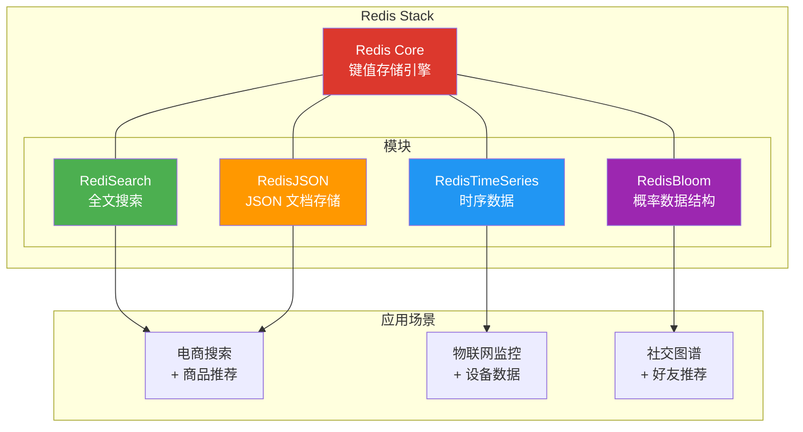

| 模块 | 功能 | 典型命令 | 适用场景 |
|------|------|---------|---------|
| **RediSearch** | 全文搜索、二级索引 | `FT.CREATE`, `FT.SEARCH` | 电商搜索、文档检索 |
| **RedisJSON** | 原生 JSON 存储 | `JSON.SET`, `JSON.GET` | 配置中心、用户画像 |
| **RedisTimeSeries** | 时序数据采集 | `TS.CREATE`, `TS.ADD` | IoT 监控、股票行情 |
| **RedisBloom** | 布隆过滤器、布谷鸟过滤器 | `BF.ADD`, `CF.ADD` | 去重、防穿透 |
| **RedisGraph** | 图数据库（已弃用） | `GRAPH.QUERY` | 社交关系、知识图谱 |

::: info Redis Stack 的使用方式
```bash
# Docker 启动 Redis Stack
docker run -d --name redis-stack \
  -p 6379:6379 -p 8001:8001 \
  redis/redis-stack-server:latest

# 或使用包含 RedisInsight 的完整版
docker run -d --name redis-stack \
  -p 6379:6379 -p 8001:8001 \
  redis/redis-stack:latest
```
端口 8001 是 RedisInsight 的 Web 界面端口。
:::

### RedisInsight

RedisInsight 是 Redis 官方可视化管理工具，功能强大且免费：

| 功能 | 说明 |
|------|------|
| **CLI** | 内置 redis-cli，支持语法高亮和自动补全 |
| **Browser** | 可视化浏览和管理 Key |
| **Profiler** | 实时分析 Redis 命令执行情况 |
| **Memory Analysis** | 内存使用分析，发现大 Key |
| **Pub/Sub** | 可视化发布订阅 |
| **Stream** | 可视化管理 Stream |
| **Workbench** | 支持红模块（Search、JSON 等）的可视化操作 |

### Redis Cloud

Redis Cloud 是 Redis 官方提供的云服务：

| 层级 | 免费版 | 基础版 | 专业版 |
|------|--------|--------|--------|
| **数据库大小** | 30 MB | 1 GB+ | 无限 |
| **连接数** | 30 | 256+ | 无限 |
| **持久化** | 不支持 | 支持 | 支持 |
| **高可用** | 不支持 | 支持 | 支持 |
| **Redis Stack** | 支持 | 支持 | 支持 |
| **价格** | 免费 | $5/月起 | 按需定价 |

### 客户端生态

Redis 拥有覆盖所有主流语言的客户端库：

| 语言 | 客户端 | 特点 |
|------|--------|------|
| **Java** | Jedis / Lettuce / Redisson | Jedis 简单直连，Lettuce 异步响应式，Redisson 分布式对象 |
| **C#/.NET** | StackExchange.Redis / CSRedis | SE.Redis 官方推荐，CSRedis 轻量级 |
| **Python** | redis-py | 官方推荐，同步+异步支持 |
| **Go** | go-redis | 高性能，类型安全 |
| **Node.js** | ioredis | 功能全面，支持 Cluster/Sentinel |
| **PHP** | predis / phpredis | predis 纯 PHP，phpredis C 扩展 |

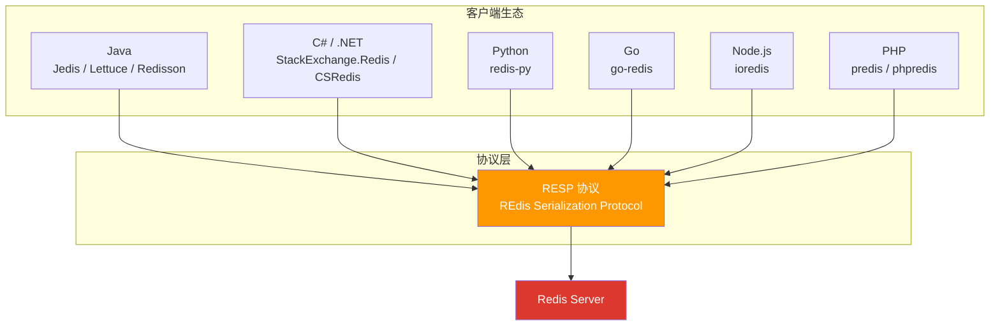

## Redis vs Memcached

Redis 和 Memcached 是最常被拿来对比的两个内存数据库。以下是全面对比：

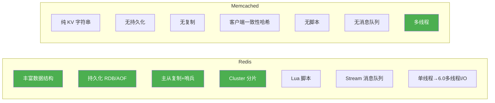

### 详细对比表

| 维度 | Redis | Memcached |
|------|-------|-----------|
| **数据类型** | String, Hash, List, Set, ZSet, Stream, Bitmap, HyperLogLog, GEO | 仅 String |
| **持久化** | RDB 快照 + AOF 日志 | 不支持 |
| **内存管理** | 驱逐策略（LRU/LFU/TTL），共享内存池 | Slab 分配器，固定 Chunk |
| **线程模型** | 单线程执行 + 6.0 多线程 I/O | 多线程 |
| **高可用** | 主从复制 + 哨兵 + Cluster | 无内置方案 |
| **事务** | MULTI/EXEC + Lua 脚本 | CAS（Check and Set） |
| **消息模型** | Pub/Sub + Stream | 不支持 |
| **集群** | Redis Cluster（16384 槽） | 客户端一致性哈希 |
| **最大 Key 大小** | 512 MB | 1 MB |
| **单实例 QPS** | 10 万+ | 10 万+ |
| **内存利用率** | Hash/List 编码优化 | 固定 Chunk 可能浪费 |
| **过期机制** | 惰性删除 + 定期删除 | 惰性删除 |
| **安全** | ACL、SSL | SASL 认证 |
| **适用场景** | 缓存 + 数据库 + 消息队列 | 纯缓存 |

::: tip 如何选择？
- **选 Redis**：需要持久化、丰富数据结构、高可用、消息队列、分布式锁等场景。如今 99% 的场景都应该选 Redis。
- **选 Memcached**：仅用于纯 KV 缓存，且已有成熟的 Memcached 基础设施。多线程在超大 Value（接近 1MB）场景下可能略有优势。

一句话总结：**Redis 是 Memcached 的超集**，在新项目中直接选择 Redis 即可。
:::

### 性能对比实测

在相同硬件条件下（4 核 8GB 内存，Redis 7.0 vs Memcached 1.6）：

| 操作 | Redis QPS | Memcached QPS | 说明 |
|------|-----------|---------------|------|
| GET (小 Value) | ~110,000 | ~120,000 | Memcached 多线程略优 |
| SET (小 Value) | ~100,000 | ~110,000 | 差距可忽略 |
| GET (大 Value 1KB) | ~80,000 | ~90,000 | Memcached 多线程优势 |
| INCR | ~100,000 | ~110,000 | 计数器性能接近 |
| MGET (100 Key) | ~50,000 | 不支持 | Redis 独有优势 |

::: important 性能不是唯一考量
在纯缓存场景下，Redis 和 Memcached 的性能差距在 10% 以内，而 Redis 提供的丰富数据结构、持久化、高可用等能力远超这 10% 的性能差异。选择技术栈时，应优先考虑功能契合度和运维便利性。
:::

## Redis 技术栈全景图

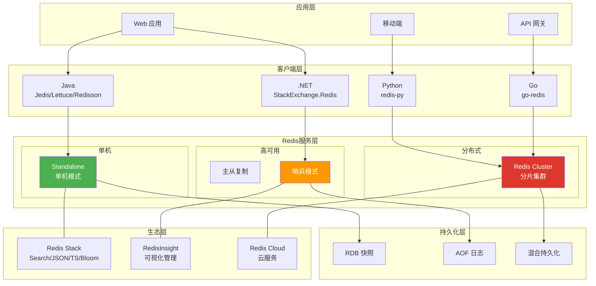

## 小结

| 主题 | 核心要点 |
|------|---------|
| **Redis 是什么** | 内存键值存储，可用作数据库、缓存、消息队列 |
| **为什么快** | 纯内存 + 单线程 + I/O 多路复用 + 高效数据结构 |
| **发展历程** | 2009 年由 antirez 创建，从简单 KV 演进为全功能数据平台 |
| **Redis 7 新特性** | Redis Functions、Client-side Caching、ACL v2、Multi-part AOF |
| **应用场景** | 缓存、会话、排行榜、消息队列、实时分析、分布式锁、地理位置、限流 |
| **生态** | Redis Stack（Search/JSON/TS/Bloom）、RedisInsight、Redis Cloud |
| **vs Memcached** | Redis 是 Memcached 的超集，新项目直接选 Redis |

## 参考资料

- [Redis 官方文档](https://redis.io/docs/)
- 《Redis 设计与实现》第 1 章 — 黄健宏
- 《Redis 深度历险：核心原理与应用实践》第 1 章 — 钱文品
- 《Redis 开发与运维》第 1 章 — 付磊、张益军
- [antirez 博客 - Redis 过去现在未来](http://antirez.com/news/133)
- [Redis 7.0 Release Notes](https://redis.io/docs/latest/operate/oss_and_stack/management/upgrading/)

## 面试技巧

::: tip 高频面试问题
1. **Redis 为什么这么快？**
   - 回答要点：四个维度——纯内存操作（纳秒级）、单线程无锁竞争、I/O 多路复用（epoll）、高效数据结构（SDS/ziplist/skiplist）。注意 Redis 6.0 多线程仅用于网络 I/O，命令执行仍然是单线程。

2. **Redis 和 Memcached 怎么选？**
   - 回答要点：Redis 是 Memcached 的超集，支持持久化、丰富数据结构、高可用、消息队列。新项目直接选 Redis。Memcached 仅在纯 KV 缓存 + 已有基础设施时考虑。

3. **Redis 单线程为什么比多线程快？**
   - 回答要点：Redis 的瓶颈不在 CPU，而在内存和网络 I/O。单线程避免了锁竞争、上下文切换、死锁等开销。对于内存操作，单线程的串行执行已经足够快。

4. **Redis 有哪些应用场景？**
   - 回答要点：缓存（最经典）、会话管理（分布式 Session）、排行榜（ZSet）、消息队列（Stream）、实时分析（HyperLogLog/Bitmap）、分布式锁、地理位置（GEO）、限流器。

5. **Redis 7 有哪些重要新特性？**
   - 回答要点：Redis Functions（替代 Lua 脚本）、Client-side Caching（客户端缓存）、ACL v2（细粒度权限）、Multi-part AOF（拆分基础文件+增量文件）、listpack 替代 ziplist。
:::
