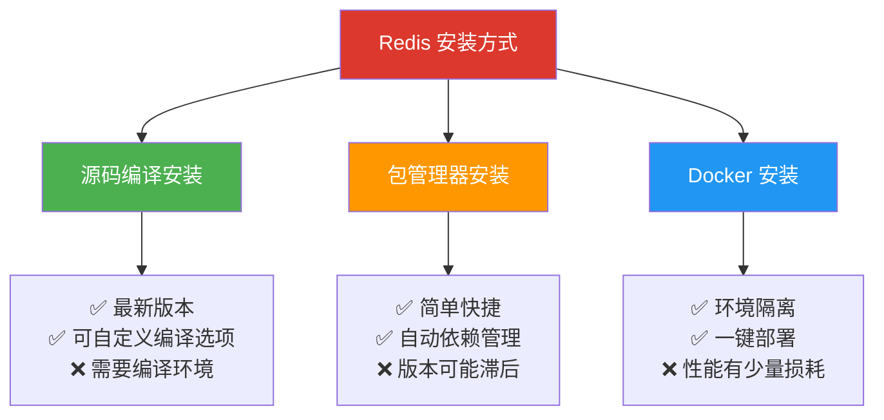
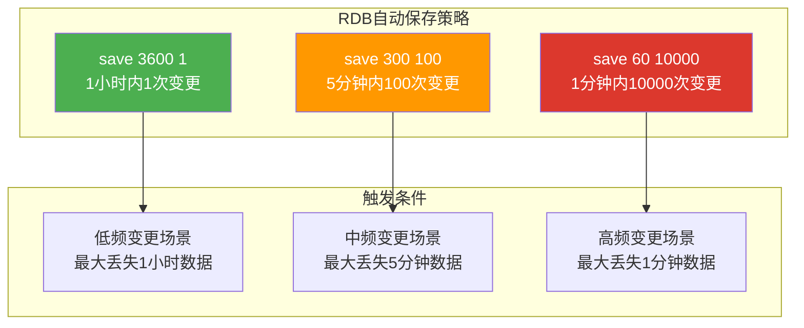
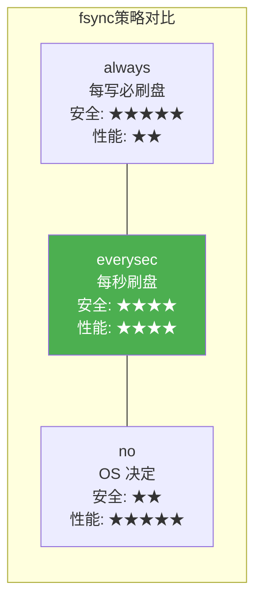
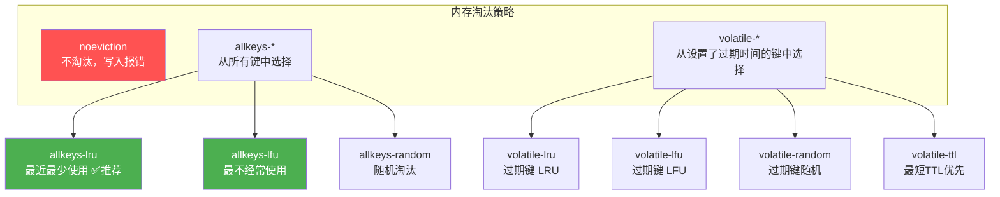
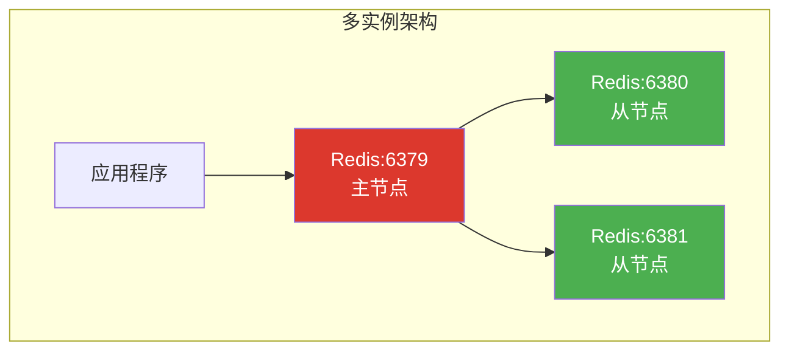
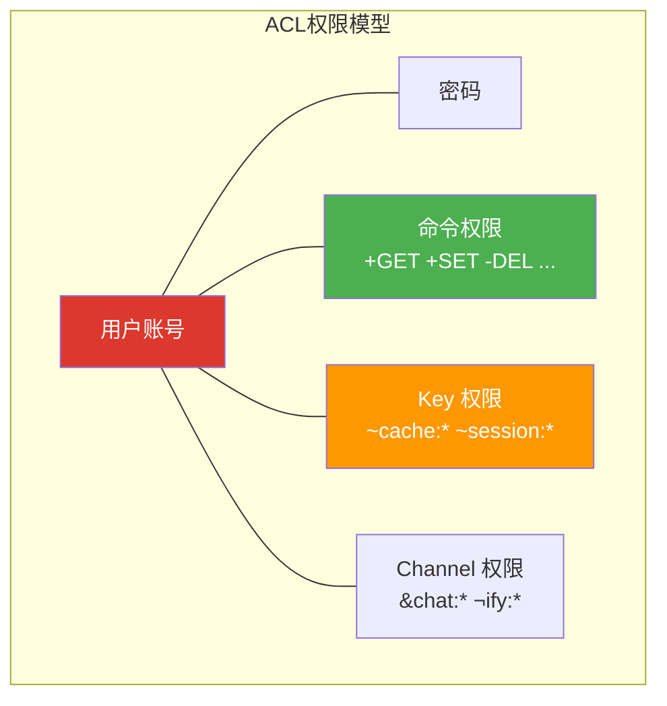
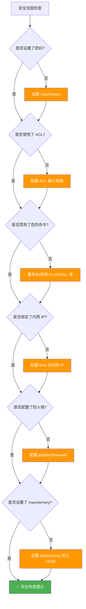
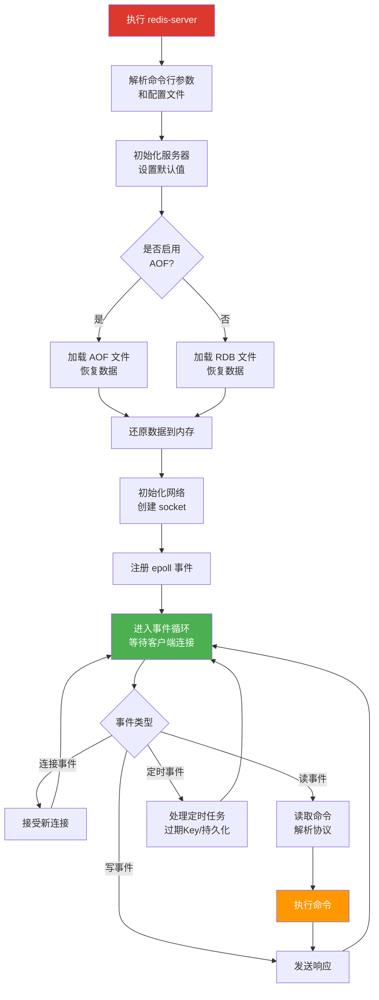

# 02 · 安装与配置

## 安装方式概览

Redis 提供了多种安装方式，适用于不同场景：



| 安装方式 | 适用场景 | 版本控制 | 复杂度 |
|----------|---------|---------|--------|
| **源码编译** | 生产环境、需要最新版本 | 完全可控 | 中 |
| **包管理器** | 开发环境、快速体验 | 受限于仓库版本 | 低 |
| **Docker** | 容器化部署、CI/CD | 镜像版本可控 | 低 |

## 源码编译安装

源码编译是安装 Redis 最灵活的方式，也是官方推荐的安装方法。

### 编译依赖

```bash
# Ubuntu / Debian
sudo apt update
sudo apt install -y build-essential tcl wget

# CentOS / RHEL
sudo yum groupinstall -y "Development Tools"
sudo yum install -y tcl wget

# macOS（已自带编译工具，可通过 Xcode Command Line Tools 安装）
xcode-select --install
```

### 下载与编译

```bash
# 1. 下载源码（以 Redis 7.2.4 为例）
wget https://github.com/redis/redis/archive/refs/tags/7.2.4.tar.gz
tar -xzf 7.2.4.tar.gz
cd redis-7.2.4

# 2. 编译
make

# 3. 运行测试（可选，约 10 分钟）
make test

# 4. 安装到系统目录
sudo make install
```

::: tip 编译优化
```bash
# 使用 MALLOC=jemalloc（推荐，内存碎片率更低）
make MALLOC=jemalloc

# 指定安装路径
make PREFIX=/usr/local/redis install

# 编译后二进制文件位于 src/ 目录
ls src/redis-server src/redis-cli src/redis-benchmark src/redis-sentinel
```
:::

### 编译产物说明

| 文件 | 用途 |
|------|------|
| `redis-server` | Redis 服务端 |
| `redis-cli` | 命令行客户端 |
| `redis-benchmark` | 性能基准测试工具 |
| `redis-check-rdb` | RDB 文件检查修复工具 |
| `redis-check-aof` | AOF 文件检查修复工具 |
| `redis-sentinel` | 哨兵服务（符号链接到 redis-server） |

### 安装后的目录结构

```bash
sudo mkdir -p /usr/local/redis/{conf,data,log}
sudo cp redis.conf /usr/local/redis/conf/

# 最终目录结构
/usr/local/redis/
├── bin/              # 可执行文件
│   ├── redis-server
│   ├── redis-cli
│   ├── redis-benchmark
│   ├── redis-check-rdb
│   ├── redis-check-aof
│   └── redis-sentinel
├── conf/             # 配置文件
│   └── redis.conf
├── data/             # 数据目录
└── log/              # 日志目录
```

## 包管理器安装

### Ubuntu / Debian

```bash
# 更新包索引
sudo apt update

# 安装 Redis
sudo apt install -y redis-server

# 查看版本
redis-server --version

# 启动服务
sudo systemctl start redis-server
sudo systemctl enable redis-server

# 验证
redis-cli ping
# 输出: PONG
```

::: warning Ubuntu 仓库版本可能滞后
Ubuntu 官方仓库中的 Redis 版本通常较旧。如果需要最新版本，可以使用 Redis 官方 PPA：

```bash
# 添加 Redis 官方 PPA（由 Redis 团队维护）
sudo add-apt-repository -y ppa:redis/redis
sudo apt update
sudo apt install -y redis
```
:::

### CentOS / RHEL

```bash
# 安装 EPEL 仓库
sudo yum install -y epel-release

# 安装 Redis
sudo yum install -y redis

# 启动服务
sudo systemctl start redis
sudo systemctl enable redis

# 验证
redis-cli ping
```

### Fedora

```bash
sudo dnf install -y redis
sudo systemctl start redis
sudo systemctl enable redis
```

### macOS

```bash
# 使用 Homebrew
brew install redis

# 启动服务
brew services start redis

# 验证
redis-cli ping
```

### Windows

Redis 官方不再提供 Windows 版本。可选方案：

| 方案 | 说明 |
|------|------|
| **WSL2** | 在 WSL2 中运行 Linux 版 Redis（推荐） |
| **Memurai** | Windows 原生 Redis 兼容服务（商业版免费版） |
| **Docker Desktop** | 通过 Docker 运行 Redis 容器 |
| **旧版端口** | Microsoft 维护的 Redis 3.x 分支（已停止更新） |

```bash
# WSL2 中安装（推荐）
wsl --install
# 进入 WSL2 后按 Ubuntu 方式安装

# Docker 方式
docker run -d --name redis -p 6379:6379 redis:7.2
```

## Docker 安装

Docker 是运行 Redis 最便捷的方式，特别适合开发和测试环境。

### 基础启动

```bash
# 最简单的启动方式
docker run -d --name redis -p 6379:6379 redis:7.2

# 验证
docker exec -it redis redis-cli ping
# 输出: PONG
```

### 带持久化的完整配置

```bash
docker run -d \
  --name redis \
  -p 6379:6379 \
  -v redis_data:/data \
  -v redis_conf:/usr/local/etc/redis \
  redis:7.2 \
  redis-server /usr/local/etc/redis/redis.conf
```

| 参数 | 说明 |
|------|------|
| `-p 6379:6379` | 映射端口：主机端口:容器端口 |
| `-v redis_data:/data` | 持久化数据卷 |
| `-v redis_conf:/usr/local/etc/redis` | 配置文件卷 |
| `redis-server /usr/local/etc/redis/redis.conf` | 指定配置文件启动 |

### Docker Compose 方式

```yaml
# docker-compose.yml
version: '3.8'

services:
  redis:
    image: redis:7.2
    container_name: redis
    restart: unless-stopped
    ports:
      - "6379:6379"
    volumes:
      - redis_data:/data
      - ./redis.conf:/usr/local/etc/redis/redis.conf
    command: redis-server /usr/local/etc/redis/redis.conf
    networks:
      - app_network

  # 可选：RedisInsight 可视化管理
  redis-insight:
    image: redis/redisinsight:latest
    container_name: redis-insight
    restart: unless-stopped
    ports:
      - "8001:8001"
    volumes:
      - redisinsight_data:/db
    networks:
      - app_network

volumes:
  redis_data:
  redisinsight_data:

networks:
  app_network:
    driver: bridge
```

```bash
# 启动
docker compose up -d

# 查看状态
docker compose ps

# 查看日志
docker compose logs -f redis

# 停止
docker compose down

# 停止并删除数据卷
docker compose down -v
```

### 带密码认证的 Docker 启动

```bash
docker run -d \
  --name redis \
  -p 6379:6379 \
  -v redis_data:/data \
  redis:7.2 \
  redis-server --requirepass "your_strong_password" --appendonly yes
```

```bash
# 连接时需要认证
docker exec -it redis redis-cli -a your_strong_password ping
# 输出: PONG

# 或者进入 CLI 后认证
docker exec -it redis redis-cli
127.0.0.1:6379> AUTH your_strong_password
OK
127.0.0.1:6379> PING
PONG
```

### Docker 镜像版本选择

| 标签 | 说明 | 推荐场景 |
|------|------|---------|
| `redis:7.2` | 最新 7.2.x 版本 | 生产环境 |
| `redis:7.2-bookworm` | 基于 Debian Bookworm | 需要完整 OS 环境 |
| `redis:7.2-alpine` | 基于 Alpine Linux | 最小镜像（~30MB） |
| `redis:latest` | 最新版本 | 开发测试 |
| `redis/redis-stack-server:7.2` | 包含模块的 Stack 版本 | 需要 RediSearch 等模块 |

::: important Alpine vs Debian 镜像
- **Alpine**：镜像更小（~30MB vs ~130MB），但使用 musl libc，极少数场景可能存在兼容性问题
- **Debian**：镜像更大，但使用 glibc，兼容性最佳

对于生产环境，推荐使用 Debian 基础镜像（默认标签），除非对镜像大小有严格限制。
:::

## redis.conf 核心参数详解

redis.conf 是 Redis 的灵魂，理解配置文件是运维 Redis 的基本功。Redis 7.2 的配置文件超过 2000 行，下面按功能模块逐一解读。

### 网络配置

```
# 绑定网络接口
# 默认只监听 127.0.0.1，生产环境需要开放时使用具体 IP
# 不要使用 0.0.0.0（安全隐患）
bind 127.0.0.1

# 如果需要远程访问，绑定内网 IP
# bind 127.0.0.1 192.168.1.100

# 保护模式（yes 时只允许本地连接）
protected-mode yes

# 监听端口
port 6379

# TCP backlog
# 高并发环境下适当增大，但不能超过系统 somaxconn
tcp-backlog 511

# 空闲连接超时（0 表示永不超时）
timeout 0

# TCP keepalive 时间
tcp-keepalive 300
```

::: warning bind 与 protected-mode
- `bind` 指定监听的网络接口，不是访问控制！即使 `bind 0.0.0.0`，也不代表允许所有 IP 访问
- `protected-mode yes` 时，如果没有设置 `requirepass` 且没有 `bind` 限制，Redis 只接受本地连接
- 生产环境务必设置 `requirepass` 或配置 `bind` 为内网 IP
:::

### 通用配置

```
# 是否以守护进程运行
# Docker 环境下设为 no（容器前台运行）
# 传统部署设为 yes
daemonize no

# PID 文件路径
pidfile /var/run/redis/redis-server.pid

# 日志级别
# debug: 详细信息（开发环境）
# verbose: 包含少量不太重要的信息
# notice: 适度详细（生产环境推荐）
# warning: 仅关键/重要信息
loglevel notice

# 日志文件路径
# 空字符串表示输出到标准输出
logfile /var/log/redis/redis-server.log

# 数据库数量（0-15，共16个）
databases 16

# 启动时显示 Logo
always-show-logo no
```

### RDB 快照配置

```
# 自动保存策略（满足任一条件即触发）
# 格式: save <秒数> <变更数>
save 3600 1       # 3600秒内至少1个key变更
save 300 100      # 300秒内至少100个key变更
save 60 10000     # 60秒内至少10000个key变更

# 禁用 RDB（注释掉所有 save 或使用以下配置）
# save ""

# RDB 文件名
dbfilename dump.rdb

# RDB 文件存储目录
dir /var/lib/redis

# 是否压缩（LZF 算法）
rdbcompression yes

# 是否校验 RDB 文件（CRC64）
rdbchecksum yes

# 删除 RDB 中的敏感信息（7.0+）
sanitize-dump-payload no
```



### AOF 持久化配置

```
# 启用 AOF
appendonly yes

# AOF 文件名
appendfilename "appendonly.aof"

# AOF 文件存储目录（7.0+ Multi-part AOF）
appenddirname "appendonlydir"

# fsync 策略
# always: 每次写入都 fsync，最安全但最慢
# everysec: 每秒 fsync（推荐，最多丢失1秒数据）
# no: 由操作系统决定何时 fsync
appendfsync everysec

# AOF 重写时是否禁止 fsync
# yes: 重写期间禁止 fsync，提高重写速度
# no: 重写期间仍然 fsync，更安全
no-appendfsync-on-rewrite no

# AOF 重写触发条件
# 当 AOF 文件大小超过上次重写后的 100% 时触发
auto-aof-rewrite-percentage 100
# AOF 文件最小重写大小
auto-aof-rewrite-min-size 64mb

# 加载 AOF 时忽略最后一条可能不完整的指令
aof-load-truncated yes

# 使用 RDB 前导（4.0+ 混合持久化）
aof-use-rdb-preamble yes
```



::: important 推荐配置
- **生产环境**：`appendonly yes` + `appendfsync everysec` + `aof-use-rdb-preamble yes`
- 这是安全性和性能的最佳平衡点，最多丢失 1 秒数据
- `always` 仅在对数据安全有极端要求时使用，性能损耗明显
:::

### 内存管理配置

```
# 最大内存限制（0 表示不限制）
# 生产环境务必设置，防止 Redis 占满系统内存导致 OOM
maxmemory 4gb

# 内存淘汰策略
# noeviction: 不淘汰，写入报错（默认）
# allkeys-lru: 所有键中淘汰最近最少使用的
# allkeys-lfu: 所有键中淘汰最不经常使用的（4.0+）
# allkeys-random: 所有键中随机淘汰
# volatile-lru: 过期键中淘汰最近最少使用的
# volatile-lfu: 过期键中淘汰最不经常使用的（4.0+）
# volatile-random: 过期键中随机淘汰
# volatile-ttl: 过期键中淘汰 TTL 最短的
maxmemory-policy allkeys-lru

# LRU/LFU 采样数
# 数值越大越精确，但越消耗 CPU
maxmemory-samples 5
```



::: warning 淘汰策略选择指南
| 场景 | 推荐策略 | 原因 |
|------|---------|------|
| **纯缓存** | `allkeys-lru` | 所有 Key 都可淘汰，命中率高 |
| **热点数据明显** | `allkeys-lfu` | LFU 比 LRU 更适应热点访问模式 |
| **缓存+持久化混合** | `volatile-lru` | 只淘汰有 TTL 的 Key，保护持久化数据 |
| **不确定** | `allkeys-lru` | 最通用的选择 |

**绝对不要**在生产环境使用 `noeviction` 而不设 `maxmemory`，否则 Redis 会吃满系统内存！
:::

### 慢查询配置

```
# 慢查询阈值（微秒）
# 超过此时间的命令会被记录
# 负数表示禁用，0 表示记录所有命令
slowlog-log-slower-than 10000

# 慢查询记录最大条数
# 先进先出，超过后删除最早的记录
slowlog-max-len 128
```

```bash
# 查看慢查询日志
SLOWLOG GET 10

# 查看慢查询日志长度
SLOWLOG LEN

# 清空慢查询日志
SLOWLOG RESET
```

### 客户端配置

```
# 最大客户端连接数
# 0 表示不限制
# 生产环境建议设置上限（如 10000）
maxclients 10000

# 客户端输出缓冲区限制
# 格式: client-output-buffer-limit <class> <hard> <soft> <soft-seconds>
# class: normal / replica / pub-sub
# hard: 硬限制（超出立即断开）
# soft: 软限制（持续 soft-seconds 秒后断开）

# 普通客户端
client-output-buffer-limit normal 0 0 0

# 从节点客户端（复制缓冲区）
client-output-buffer-limit replica 256mb 64mb 60

# Pub/Sub 客户端
client-output-buffer-limit pub-sub 32mb 8mb 60
```

## 多实例配置

在同一台服务器上运行多个 Redis 实例，是开发测试和资源受限环境的常见需求。

### 方式一：不同配置文件

```bash
# 创建多个配置文件
sudo cp /etc/redis/redis.conf /etc/redis/redis-6380.conf
sudo cp /etc/redis/redis.conf /etc/redis/redis-6381.conf
```

修改每个实例的关键配置：

```bash
# 实例 6380 的配置
port 6380
pidfile /var/run/redis/redis-server-6380.pid
logfile /var/log/redis/redis-server-6380.log
dir /var/lib/redis-6380
dbfilename dump-6380.rdb
appendfilename "appendonly-6380.aof"

# 实例 6381 的配置
port 6381
pidfile /var/run/redis/redis-server-6381.pid
logfile /var/log/redis/redis-server-6381.log
dir /var/lib/redis-6381
dbfilename dump-6381.rdb
appendfilename "appendonly-6381.aof"
```

```bash
# 启动多实例
redis-server /etc/redis/redis-6380.conf
redis-server /etc/redis/redis-6381.conf

# 连接指定实例
redis-cli -p 6380
redis-cli -p 6381
```

### 方式二：Docker 多实例

```yaml
# docker-compose.yml
version: '3.8'

services:
  redis-6379:
    image: redis:7.2
    container_name: redis-6379
    ports:
      - "6379:6379"
    volumes:
      - redis_6379_data:/data
    command: redis-server --appendonly yes

  redis-6380:
    image: redis:7.2
    container_name: redis-6380
    ports:
      - "6380:6379"
    volumes:
      - redis_6380_data:/data
    command: redis-server --appendonly yes

  redis-6381:
    image: redis:7.2
    container_name: redis-6381
    ports:
      - "6381:6379"
    volumes:
      - redis_6381_data:/data
    command: redis-server --appendonly yes

volumes:
  redis_6379_data:
  redis_6380_data:
  redis_6381_data:
```



## 安全加固

Redis 的默认配置以便利性为导向，在生产环境中必须进行安全加固。

### 1. 设置密码认证

```bash
# 方式一：配置文件
requirepass "your_strong_password_here"

# 方式二：运行时设置（重启后失效）
CONFIG SET requirepass "your_strong_password_here"
CONFIG REWRITE  # 写入配置文件持久化
```

连接时认证：

```bash
# 方式一：命令行参数
redis-cli -a your_strong_password ping

# 方式二：AUTH 命令
redis-cli
127.0.0.1:6379> AUTH your_strong_password
OK

# 方式三：环境变量（推荐，避免密码出现在命令历史）
export REDISCLI_AUTH=your_strong_password
redis-cli ping
```

::: warning 密码安全
- 密码应足够复杂（至少 32 位，包含大小写字母、数字、特殊字符）
- 使用 `redis-cli -a` 会在命令历史中暴露密码，推荐使用 `REDISCLI_AUTH` 环境变量
- 密码在 Redis 内部以明文存储，因此配置文件权限应设为 600
```bash
chmod 600 /etc/redis/redis.conf
chown redis:redis /etc/redis/redis.conf
```
:::

### 2. ACL 访问控制（Redis 6.0+）

ACL 提供了比 `requirepass` 更精细的权限控制：



```bash
# 查看所有用户
ACL LIST

# 查看当前用户
ACL WHOAMI

# 创建只读用户
ACL SETUSER readonly on >readonly_pass ~* +GET +MGET +HGET +HMGET +LRANGE +ZRANGE +SMEMBERS +SISMEMBER

# 创建写用户（限制 Key 前缀）
ACL SETUSER writer on >writer_pass ~cache:* +GET +SET +DEL +HSET +HDEL +EXPIRE

# 创建管理员
ACL SETUSER admin on >admin_pass ~* &* +@all

# 删除用户
ACL DELUSER readonly

# 持久化 ACL 到配置文件
ACL SAVE
```

::: important ACL 最佳实践
1. **最小权限原则**：每个应用使用独立账号，只授予必要权限
2. **禁止危险命令**：对非管理员用户禁用 `FLUSHALL`、`FLUSHDB`、`CONFIG`、`KEYS`、`DEBUG`
3. **Key 隔离**：使用 `~prefix:*` 限制 Key 访问范围
4. **定期审计**：使用 `ACL LIST` 检查用户权限
:::

### 3. 禁用危险命令

```bash
# 在 redis.conf 中重命名或禁用危险命令
rename-command FLUSHDB ""
rename-command FLUSHALL ""
rename-command CONFIG ""
rename-command KEYS ""
rename-command DEBUG ""
rename-command SHUTDOWN "SHUTDOWN_SECRET_2024"
```

| 命令 | 危险等级 | 原因 |
|------|---------|------|
| `FLUSHALL` | 🔴 极高 | 删除所有数据库的所有 Key |
| `FLUSHDB` | 🔴 极高 | 删除当前数据库的所有 Key |
| `CONFIG` | 🟡 高 | 可修改运行时配置，包括密码 |
| `KEYS *` | 🟡 高 | 阻塞式遍历，可能导致服务不可用 |
| `DEBUG` | 🟡 高 | 调试命令，可能影响稳定性 |
| `SHUTDOWN` | 🟠 中 | 关闭 Redis 服务 |
| `BGREWRITEAOF` | 🟠 中 | 触发 AOF 重写，消耗资源 |

### 4. 网络安全

```bash
# 1. 绑定内网 IP
bind 192.168.1.100

# 2. 使用防火墙限制访问
# iptables
sudo iptables -A INPUT -p tcp --dport 6379 -s 192.168.1.0/24 -j ACCEPT
sudo iptables -A INPUT -p tcp --dport 6379 -j DROP

# firewalld
sudo firewall-cmd --permanent --add-rich-rule='rule family="ipv4" source address="192.168.1.0/24" port port="6379" protocol="tcp" accept'
sudo firewall-cmd --reload

# 3. 确保不暴露到公网
# 检查 Redis 端口是否可从外部访问
nmap -p 6379 your-server-ip
```

### 5. TLS/SSL 加密（Redis 6.0+）

```bash
# 编译时启用 TLS
make BUILD_TLS=yes

# redis.conf 配置 TLS
tls-port 6380
tls-cert-file /etc/redis/tls/redis.crt
tls-key-file /etc/redis/tls/redis.key
tls-ca-cert-file /etc/redis/tls/ca.crt
tls-auth-clients optional

# 客户端连接 TLS
redis-cli --tls --cert /etc/redis/tls/redis.crt --key /etc/redis/tls/redis.key --cacert /etc/redis/tls/ca.crt -p 6380
```

### 安全加固检查清单



## systemd 服务管理

将 Redis 注册为 systemd 服务，实现开机自启和自动化管理。

### 创建 systemd 服务文件

```ini
# /etc/systemd/system/redis.service
[Unit]
Description=Redis In-Memory Data Store
After=network.target

[Service]
User=redis
Group=redis
ExecStart=/usr/local/bin/redis-server /etc/redis/redis.conf
ExecStop=/usr/local/bin/redis-cli shutdown
Restart=always
RestartSec=5
LimitNOFILE=65536

# 安全加固
PrivateTmp=yes
ProtectSystem=full
NoNewPrivileges=yes

[Install]
WantedBy=multi-user.target
```

### 多实例 systemd 服务

```ini
# /etc/systemd/system/redis@.service
[Unit]
Description=Redis Instance %i
After=network.target

[Service]
User=redis
Group=redis
ExecStart=/usr/local/bin/redis-server /etc/redis/redis-%i.conf
ExecStop=/usr/local/bin/redis-cli -p %i shutdown
Restart=always
RestartSec=5
LimitNOFILE=65536

[Install]
WantedBy=multi-user.target
```

```bash
# 启动多实例
sudo systemctl start redis@6379
sudo systemctl start redis@6380
sudo systemctl start redis@6381

# 设置开机自启
sudo systemctl enable redis@6379
sudo systemctl enable redis@6380
sudo systemctl enable redis@6381

# 查看状态
sudo systemctl status redis@6379
```

### 常用 systemctl 命令

```bash
# 启动
sudo systemctl start redis

# 停止
sudo systemctl stop redis

# 重启
sudo systemctl restart redis

# 查看状态
sudo systemctl status redis

# 设置开机自启
sudo systemctl enable redis

# 取消开机自启
sudo systemctl disable redis

# 重新加载配置（修改 service 文件后）
sudo systemctl daemon-reload

# 查看日志
sudo journalctl -u redis -f

# 查看最近 100 行日志
sudo journalctl -u redis -n 100
```

## Redis 启动流程

了解 Redis 的启动流程，有助于排查启动问题：



### 启动流程详细步骤

| 阶段 | 操作 | 说明 |
|------|------|------|
| **1. 初始化配置** | 解析命令行参数和配置文件 | 命令行参数优先级高于配置文件 |
| **2. 初始化服务器** | 设置默认值、创建共享对象 | 包括创建默认的 16 个数据库 |
| **3. 加载持久化数据** | 优先加载 AOF，否则加载 RDB | AOF 数据完整性更高 |
| **4. 初始化网络** | 创建 TCP socket、bind、listen | 根据 `bind` 配置决定监听接口 |
| **5. 注册事件** | epoll_create + epoll_ctl | 注册连接事件和定时事件 |
| **6. 进入事件循环** | epoll_wait 等待事件 | 核心循环，处理所有事件 |

### 启动时的常见问题

```bash
# 问题1: 端口被占用
# Could not create server TCP listening socket *:6379: bind: Address already in use
sudo lsof -i :6379
sudo kill -9 <PID>

# 问题2: 权限不足
# Opening /var/log/redis/redis-server.log: Permission denied
sudo chown -R redis:redis /var/log/redis/
sudo chown -R redis:redis /var/lib/redis/

# 问题3: 内存不足
# WARNING overcommit_memory is set to 0
sudo sysctl vm.overcommit_memory=1
# 持久化
echo "vm.overcommit_memory=1" | sudo tee -a /etc/sysctl.conf

# 问题4: TCP backlog 警告
# WARNING: The TCP backlog setting of 511 cannot be enforced
sudo sysctl -w net.core.somaxconn=65535
echo "net.core.somaxconn=65535" | sudo tee -a /etc/sysctl.conf

# 问题5: Transparent Huge Pages 警告
# WARNING you have Transparent Huge Pages (THP) support enabled
sudo echo never > /sys/kernel/mm/transparent_hugepage/enabled
```

::: important 内核参数优化
Redis 启动时可能会输出多个 WARNING，以下是推荐的内核参数配置：

```bash
# /etc/sysctl.d/99-redis.conf
vm.overcommit_memory = 1          # 允许内存超分配，防止 fork 失败
net.core.somaxconn = 65535        # 增大 TCP backlog 上限
net.ipv4.tcp_max_syn_backlog = 65535  # SYN 队列长度

# 生效
sudo sysctl -p /etc/sysctl.d/99-redis.conf
```

禁用 THP（Transparent Huge Pages）：
```bash
# 临时禁用
sudo echo never > /sys/kernel/mm/transparent_hugepage/enabled

# 永久禁用（添加到 rc.local）
sudo bash -c 'echo "echo never > /sys/kernel/mm/transparent_hugepage/enabled" >> /etc/rc.local'
sudo chmod +x /etc/rc.local
```
:::

## 验证安装

安装完成后，执行以下验证步骤：

```bash
# 1. 检查版本
redis-server --version
# Redis server v=7.2.4 sha=xxxx:0 malloc=jemalloc bits=64 build=xxxx

# 2. 检查客户端连接
redis-cli ping
# PONG

# 3. 检查服务器信息
redis-cli info server

# 4. 检查内存使用
redis-cli info memory

# 5. 检查客户端连接数
redis-cli info clients

# 6. 检查持久化状态
redis-cli info persistence

# 7. 性能基准测试
redis-benchmark -t set,get,incr,lpush,rpush -n 100000 -q
```

### 性能基准测试解读

```bash
$ redis-benchmark -t set,get,incr,lpush,rpush -n 100000 -q

SET: 107874.27 requests per second
GET: 109051.26 requests per second
INCR: 107526.88 requests per second
LPUSH: 108342.37 requests per second
RPUSH: 107758.62 requests per second
```

::: info 基准测试注意事项
- `redis-benchmark` 的结果受硬件配置、网络环境、数据大小等因素影响
- 测试结果仅作参考，不代表生产环境的真实性能
- 生产环境应使用真实业务数据和访问模式进行压测
- 可以使用 `-c` 参数调整并发连接数，`-d` 参数调整数据大小
```bash
# 模拟 50 个并发连接，Value 大小 1KB
redis-benchmark -t set,get -n 100000 -c 50 -d 1024 -q
```
:::

## 生产环境推荐配置模板

以下是生产环境推荐的核心配置，可作为起点根据实际需求调整：

```bash
# ==================== 网络配置 ====================
bind 127.0.0.1 192.168.1.100    # 绑定内网 IP
port 6379
protected-mode yes
tcp-backlog 511
timeout 300                       # 5分钟空闲超时
tcp-keepalive 60

# ==================== 通用配置 ====================
daemonize yes
pidfile /var/run/redis/redis-server.pid
loglevel notice
logfile /var/log/redis/redis-server.log
databases 16

# ==================== 持久化配置 ====================
save 3600 1
save 300 100
save 60 10000
appendonly yes
appendfsync everysec
aof-use-rdb-preamble yes
auto-aof-rewrite-percentage 100
auto-aof-rewrite-min-size 64mb

# ==================== 内存管理 ====================
maxmemory 4gb
maxmemory-policy allkeys-lru
maxmemory-samples 5

# ==================== 安全配置 ====================
requirepass "your_strong_password_here"
rename-command FLUSHDB ""
rename-command FLUSHALL ""
rename-command DEBUG ""

# ==================== 慢查询 ====================
slowlog-log-slower-than 10000
slowlog-max-len 256

# ==================== 客户端 ====================
maxclients 10000
client-output-buffer-limit normal 0 0 0
client-output-buffer-limit replica 256mb 64mb 60
client-output-buffer-limit pub-sub 32mb 8mb 60
```

## 小结

| 主题 | 核心要点 |
|------|---------|
| **安装方式** | 源码编译（最灵活）、包管理器（最快捷）、Docker（最隔离） |
| **核心配置** | bind/port/daemonize/save/appendonly/maxmemory |
| **持久化** | RDB（快照）+ AOF（日志）+ 混合持久化（推荐） |
| **内存管理** | 必须设置 maxmemory，推荐 allkeys-lru 淘汰策略 |
| **安全加固** | requirepass + ACL + 禁用危险命令 + 绑定内网 IP + 防火墙 |
| **systemd 服务** | 注册为系统服务，实现开机自启和自动化管理 |
| **内核优化** | overcommit_memory=1、somaxconn=65535、禁用 THP |

## 参考资料

- [Redis 官方文档 - Installation](https://redis.io/docs/latest/operate/oss_and_stack/management/installation/)
- [Redis 官方文档 - Configuration](https://redis.io/docs/latest/operate/oss_and_stack/management/config/)
- [Redis 官方文档 - Security](https://redis.io/docs/latest/operate/oss_and_stack/management/security/)
- 《Redis 开发与运维》第 2 章 — 付磊、张益军
- 《Redis 设计与实现》第 19 章 — 黄健宏
- [Redis 7.0 配置文件](https://github.com/redis/redis/blob/7.0/redis.conf)

## 面试技巧

::: tip 高频面试问题
1. **Redis 有哪些安装方式？生产环境推荐哪种？**
   - 回答要点：三种方式——源码编译、包管理器、Docker。生产环境推荐源码编译（灵活可控）或 Docker（标准化部署）。包管理器版本可能滞后。

2. **Redis 的内存淘汰策略有哪些？怎么选？**
   - 回答要点：8 种策略，分 allkeys 和 volatile 两大类。纯缓存用 `allkeys-lru`，热点明显用 `allkeys-lfu`，混合场景用 `volatile-lru`。关键是不用 `noeviction`。

3. **如何保证 Redis 的安全？**
   - 回答要点：设置密码（requirepass）、使用 ACL 精细权限控制、禁用/重命名危险命令、绑定内网 IP、配置防火墙、启用 TLS。

4. **Redis 启动时为什么要设置 overcommit_memory=1？**
   - 回答要点：Redis 持久化（RDB/AOF 重写）需要 fork 子进程，fork 需要复制父进程的页表。Linux 默认的 overcommit_memory=0 会拒绝超过物理内存的分配，可能导致 fork 失败。设为 1 允许超分配，保证 fork 成功。

5. **AOF 的三种 fsync 策略怎么选？**
   - 回答要点：`always` 最安全但最慢，`everysec` 推荐方案（最多丢1秒），`no` 最快但可能丢数据。生产环境推荐 `everysec`。
:::
