# String 与内部编码

> String 是 Redis 中最基础、最常用的数据类型，看似简单的键值对背后，隐藏着精心设计的 SDS 动态字符串和三种智能切换的内部编码。理解 String 的底层实现，是深入 Redis 的第一步。

::: tip 核心要点
- Redis 没有直接使用 C 字符串，而是自建了 SDS（Simple Dynamic String）结构
- String 有三种内部编码：`int`、`embstr`、`raw`，Redis 会根据值自动切换
- SDS 的二进制安全、O(1) 长度获取、动态扩容策略是其核心优势
- String 类型在缓存、计数器、分布式锁、限流等场景有广泛应用
:::

## 一、SDS —— Simple Dynamic String

### 1.1 为什么不用 C 字符串？

Redis 是用 C 语言写的，但它**没有直接使用 C 语言的字符串**（以 `\0` 结尾的字符数组），而是自己实现了一个动态字符串结构 SDS。要理解这个决定，先看 C 字符串的致命缺陷：

| 特性 | C 字符串 | SDS |
|------|----------|-----|
| 获取长度 | O(N) 遍历 | O(1) 直接读取 |
| 缓冲区溢出 | 不安全（`strcat` 可能越界） | 安全（自动扩容） |
| 修改内存重分配 | 每次都必须 | 最多 N 次（空间预分配） |
| 二进制安全 | 否（`\0` 是结束符） | 是（用 `len` 判断结束） |
| 兼容 C 字符串函数 | — | 是（末尾保留 `\0`） |

::: warning C 字符串的缓冲区溢出
```c
char buf[8] = "hello";
strcat(buf, " world!");  // 缓冲区溢出！buf 只有 8 字节，却要写入 13 字节
```
`strcat` 不会检查目标缓冲区是否足够大，这是经典的缓冲区溢出漏洞来源。SDS 的 `sdscat` 在追加前会检查空间，不足则自动扩容，杜绝了此类问题。
:::

### 1.2 SDS 结构定义

Redis 针对不同长度的字符串，定义了多种 SDS 头部（sdshdr），以节省内存：

```c
// Redis 7.x 源码 sds.h

struct __attribute__((__packed__)) sdshdr5 {
    unsigned char flags; /* 3 lsb of type, 5 msb of string length */
    char buf[];
};

struct __attribute__((__packed__)) sdshdr8 {
    uint8_t len;        /* 已使用长度 */
    uint8_t alloc;      /* 已分配长度（不含头部和 \0） */
    unsigned char flags; /* 3 lsb of type, 5 unused bits */
    char buf[];
};

struct __attribute__((__packed__)) sdshdr16 {
    uint16_t len;        /* 已使用长度 */
    uint16_t alloc;      /* 已分配长度（不含头部和 \0） */
    unsigned char flags;  /* 3 lsb of type, 5 unused bits */
    char buf[];
};

struct __attribute__((__packed__)) sdshdr32 {
    uint32_t len;        /* 已使用长度 */
    uint32_t alloc;      /* 已分配长度（不含头部和 \0） */
    unsigned char flags;  /* 3 lsb of type, 5 unused bits */
    char buf[];
};

struct __attribute__((__packed__)) sdshdr64 {
    uint64_t len;        /* 已使用长度 */
    uint64_t alloc;      /* 已分配长度（不含头部和 \0） */
    unsigned char flags;  /* 3 lsb of type, 5 unused bits */
    char buf[];
};
```

::: info `__packed__` 的作用
`__attribute__((__packed__))` 告诉编译器取消结构体对齐优化，紧密排列每个字段。例如 `sdshdr8` 占用 3 字节（1+1+1），而非默认对齐后的 4 字节。Redis 为了极致的内存效率，在 SDS 中全面使用了紧凑布局。
:::

### 1.3 SDS 内存结构图解

```mermaid
flowchart TB
    subgraph sdshdr8["sdshdr8（字符串长度 < 256）"]
        direction LR
        len8["len: 5<br/>uint8_t"] --- alloc8["alloc: 7<br/>uint8_t"] --- flags8["flags: 0x08<br/>unsigned char"] --- buf8["buf: 'R','e','d','i','s','\\0'"]
    end

    subgraph sdshdr16["sdshdr16（字符串长度 < 65536）"]
        direction LR
        len16["len: 5<br/>uint16_t"] --- alloc16["alloc: 7<br/>uint16_t"] --- flags16["flags: 0x10<br/>unsigned char"] --- buf16["buf: 'R','e','d','i','s','\\0'"]
    end

    subgraph sdshdr32["sdshdr32（字符串长度 < 2^32）"]
        direction LR
        len32["len: 5<br/>uint32_t"] --- alloc32["alloc: 7<br/>uint32_t"] --- flags32["flags: 0x20<br/>unsigned char"] --- buf32["buf: 'R','e','d','i','s','\\0'"]
    end

    subgraph sdshdr64["sdshdr64（字符串长度 < 2^64）"]
        direction LR
        len64["len: 5<br/>uint64_t"] --- alloc64["alloc: 7<br/>uint64_t"] --- flags64["flags: 0x40<br/>unsigned char"] --- buf64["buf: 'R','e','d','i','s','\\0'"]
    end
```

以存储 `"Redis"` 为例，使用 `sdshdr8` 时的完整内存布局：

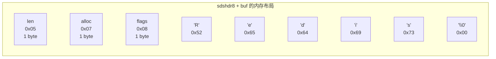

### 1.4 SDS 类型选择策略

Redis 根据字符串长度自动选择最合适的头部类型：

```c
// Redis 源码 sds.c - sdsReqType
static inline char sdsReqType(size_t string_size) {
    if (string_size < 1 << 5)       // < 32 字节
        return SDS_TYPE_5;
    if (string_size < 1 << 8)       // < 256 字节
        return SDS_TYPE_8;
    if (string_size < 1 << 16)      // < 65536 字节
        return SDS_TYPE_16;
    if (string_size < 1ull << 32)   // < 4GB
        return SDS_TYPE_32;
    return SDS_TYPE_64;
}
```

::: important 各类型的选择时机
| 类型 | 字符串长度范围 | 头部大小 |
|------|---------------|---------|
| SDS_TYPE_5 | 0 ~ 31 字节 | 1 字节 |
| SDS_TYPE_8 | 0 ~ 255 字节 | 3 字节 |
| SDS_TYPE_16 | 0 ~ 65535 字节 | 5 字节 |
| SDS_TYPE_32 | 0 ~ 2^32-1 字节 | 9 字节 |
| SDS_TYPE_64 | 0 ~ 2^64-1 字节 | 17 字节 |

SDS_TYPE_5 的 `len` 字段只有 5 bit，最大表示 31。它用在长度几乎不会变化的场景（如小整数 key），但 Redis 3.2 之后创建新 SDS 时不再使用 TYPE_5（扩容时直接升级为 TYPE_8）。
:::

### 1.5 SDS 动态扩容机制

SDS 的扩容策略是其性能优势的核心之一：

```c
// Redis 源码 sds.c - sdsMakeRoomFor（简化）
sds sdsMakeRoomFor(sds s, size_t addlen) {
    void *sh, *newsh;
    size_t avail = sdsavail(s);       // 剩余可用空间
    size_t len, newlen;
    char type, oldtype = s[-1] & SDS_TYPE_MASK;

    if (avail >= addlen) return s;    // 空间足够，直接返回

    len = sdslen(s);
    newlen = len + addlen;

    // ★ 核心扩容策略 ★
    if (newlen < SDS_MAX_PREALLOC)    // < 1MB
        newlen *= 2;                  // 翻倍分配
    else
        newlen += SDS_MAX_PREALLOC;   // 每次加 1MB

    type = sdsReqType(newlen);

    // 不要使用 type5，它无法表达 alloc，不方便扩容
    if (type == SDS_TYPE_5) type = SDS_TYPE_8;

    // 重新分配内存...
}
```

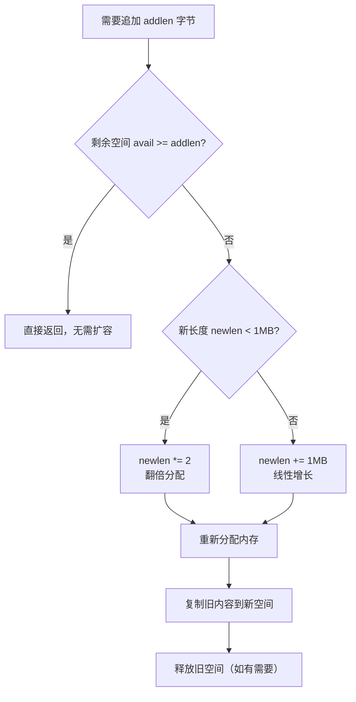

::: tip 空间预分配的妙处
- **翻倍策略**（< 1MB）：追加操作从 O(N) 均摊降为 O(1)。连续 N 次追加，最多触发 log(N) 次内存重分配
- **线性策略**（>= 1MB）：避免对大字符串翻倍造成内存浪费。1MB 的增量对大字符串来说微不足道
- **惰性释放**：缩短字符串时不立即释放内存，而是记录在 `alloc` 中，以备后续追加使用

```bash
# 演示空间预分配
SET msg "hello"          # len=5, alloc=5
APPEND msg " world"      # len=11, alloc=11（第一次扩容）
APPEND msg "!"            # len=12, alloc=? 可能无需扩容（预分配了空间）
```
:::

### 1.6 SDS 的二进制安全

C 字符串以 `\0` 判断结尾，无法存储图片、音频等二进制数据。SDS 使用 `len` 字段判断字符串结束，**buf 中可以包含任意 `\0` 字节**：

```c
// SDS 字符串可以包含 \0
sds bin = sdsempty();
bin = sdscatlen(bin, "hello\0world", 11);  // 11 字节，中间有 \0

printf("%d\n", sdslen(bin));  // 输出 11，而非 5
```

这使得 Redis 的 String 类型可以存储任何数据——JPEG 图片、Protobuf 编码、MessagePack 等，不受 `\0` 限制。

### 1.7 SDS 与 C 字符串的兼容

SDS 的 `buf` 数组末尾始终保留一个 `\0`，这意味着 SDS 可以直接复用 `<string.h>` 中的函数：

```c
// SDS 末尾有 \0，可以安全使用 printf 等函数
printf("%s", sds_buf);  // 正常工作

// 也可以使用 strcmp 比较（前提是不含 \0）
strcmp(sds1, sds2);  // 兼容 C 字符串函数
```

::: warning 注意
只有当 SDS 中不包含 `\0` 字节时，才能安全使用 `strcmp`、`strlen` 等 C 字符串函数。对于二进制数据，应使用 `sdscmp`、`sdslen` 等 SDS 专用 API。
:::

## 二、三种内部编码

Redis 的每个键值对都由 `redisObject` 管理：

```c
// Redis 源码 server.h
typedef struct redisObject {
    unsigned type:4;        // 数据类型（STRING, LIST, HASH...）
    unsigned encoding:4;    // 编码方式（INT, EMBSTR, RAW...）
    unsigned lru:LRU_BITS;  // LRU 时间或 LFU 数据
    int refcount;           // 引用计数
    void *ptr;              // 指向底层数据结构的指针
} robj;
```

String 类型有三种编码：`OBJ_ENCODING_INT`、`OBJ_ENCODING_EMBSTR`、`OBJ_ENCODING_RAW`。

### 2.1 编码转换状态机

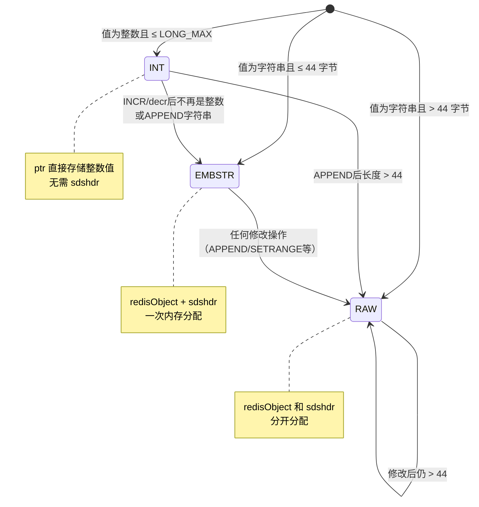

### 2.2 INT 编码

当值为**长整型**（Long 类型能表示的整数），且在 `LONG_MIN` 到 `LONG_MAX` 范围内时，Redis 直接将整数存储在 `redisObject.ptr` 中（利用指针的 8 字节空间），无需额外的 SDS 结构。

```c
// Redis 源码 object.c - createStringObjectFromLongLong
robj *createStringObjectFromLongLong(long long value) {
    if (value >= 0 && value < OBJ_SHARED_INTEGERS) {
        // 0~9999 使用共享对象，节省内存
        incrRefCount(shared.integers[value]);
        return shared.integers[value];
    } else {
        robj *o = createObject(OBJ_STRING, NULL);
        o->encoding = OBJ_ENCODING_INT;
        o->ptr = (void*)value;  // 直接把整数存在指针里
        return o;
    }
}
```

::: important 共享整数对象
Redis 启动时预创建 0~9999 的整数对象（`OBJ_SHARED_INTEGERS = 10000`），所有引用这些整数的键共享同一对象，通过 `refcount` 引用计数管理。这在计数器场景下极大地节省了内存。

```bash
# 验证共享整数
SET counter1 100
SET counter2 100
OBJECT REFCOUNT counter1   # 可能返回 >1，因为共享了对象
SET counter1 99999
OBJECT REFCOUNT counter1   # 返回 1，超出共享范围
```
:::

内存布局：

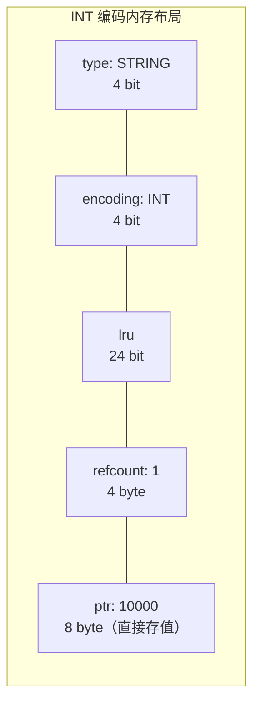

### 2.3 EMBSTR 编码

EMBSTR（Embedded String，嵌入式字符串）用于**短字符串**（≤ 44 字节）。它将 `redisObject` 和 `sdshdr` 分配在**一块连续内存**中：

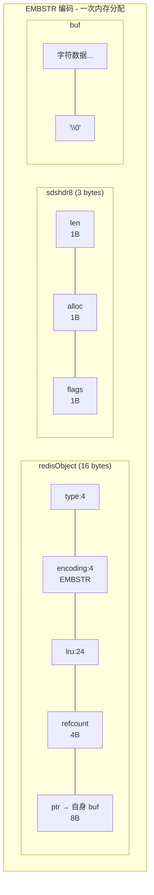

::: tip 为什么是 44 字节？
`EMBSTR` 的设计目标是让 `redisObject` + `sdshdr` + 字符串数据 + `\0` 一次性分配在**一个内存块**中。计算如下：

| 部分 | 大小 |
|------|------|
| redisObject | 16 字节 |
| sdshdr8 头部 | 3 字节 |
| 字符串内容 | N 字节 |
| `\0` 结尾 | 1 字节 |
| **合计** | 16 + 3 + N + 1 = 20 + N |

Redis 使用 `jemalloc` 分配器，常见的内存块大小有 16, 32, 48, 64 字节。要放进 64 字节的块：

`64 - 20 = 44` 字节，所以 EMBSTR 最大能存 44 字节的字符串。

Redis 7.0 后该阈值可能因 `redisObject` 结构变化而调整，具体以源码 `OBJ_ENCODING_EMBSTR_SIZE_LIMIT` 为准。
:::

EMBSTR 的优势：

1. **一次内存分配**：`redisObject` 和 `sdshdr` 在同一块内存，只需一次 `malloc`
2. **一次内存释放**：只需一次 `free`
3. **缓存友好**：数据连续存储，CPU 缓存行命中率更高

### 2.4 RAW 编码

当字符串长度超过 44 字节时，使用 RAW 编码。`redisObject` 和 `sdshdr` 分开分配在两块内存中：

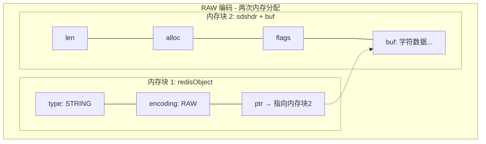

RAW 编码的缺点：

1. **两次内存分配/释放**：创建需要两次 `malloc`，删除需要两次 `free`
2. **缓存不友好**：`redisObject` 和 `sdshdr` 可能不在同一缓存行

### 2.5 编码转换规则详解

```bash
# === 创建时的编码选择 ===

# 1. 整数值 → INT 编码
SET num 100
OBJECT ENCODING num    # "int"

# 2. 短字符串 → EMBSTR 编码
SET short "hello"
OBJECT ENCODING short  # "embstr"

# 3. 长字符串 → RAW 编码
SET long [46个字符的字符串]
OBJECT ENCODING long   # "raw"
```

```bash
# === 编码转换演示 ===

# INT → EMBSTR/RAW：整数追加字符串后不再是整数
SET key1 100
OBJECT ENCODING key1     # "int"
APPEND key1 "abc"
OBJECT ENCODING key1     # "embstr"（总长度 ≤ 44）

# INT → RAW：追加后长度超过 44
SET key2 100
APPEND key2 "xxxxxxxxxxxxxxxxxxxxxxxxxxxxxxxxxxxxxxxxxxxxxx"  # 超过 44 字节
OBJECT ENCODING key2     # "raw"

# EMBSTR → RAW：任何修改操作都会转为 RAW
SET key3 "hello"
OBJECT ENCODING key3     # "embstr"
APPEND key3 " world"
OBJECT ENCODING key3     # "raw"（即使总长度 ≤ 44 也转为 raw）
```

::: warning EMBSTR 是只读的
EMBSTR 编码的字符串一旦被修改（APPEND、SETRANGE 等），**无论修改后长度是否超过 44 字节，都会立即转为 RAW 编码**。这是因为 EMBSTR 的 `redisObject` 和 `sdshdr` 在同一块连续内存中，原地修改可能破坏内存布局，所以 Redis 选择直接转为 RAW 再修改。

这是一个**不可逆**的过程——EMBSTR 不会恢复为 EMBSTR。
:::

### 2.6 编码选择流程图

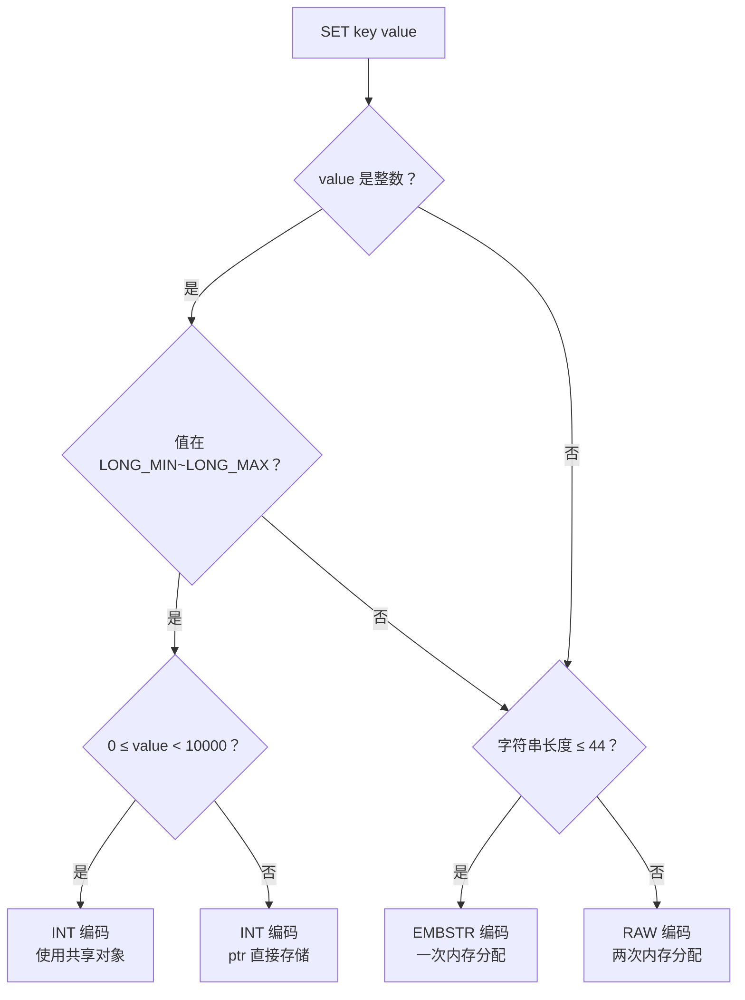

## 三、常用命令详解

### 3.1 SET 命令族

#### 基本用法

```bash
# 基本 SET
SET key value

# 带过期时间（秒）
SET key value EX 60

# 带过期时间（毫秒）
SET key value PX 60000

# 仅当 key 不存在时设置（Not Exists）
SET key value NX

# 仅当 key 已存在时设置（XX = eXists）
SET key value XX

# GET 旧值并设置新值
SET key value GET

# 组合使用
SET lock "uuid-123" EX 30 NX    # 分布式锁的经典用法
```

#### SET 命令参数组合

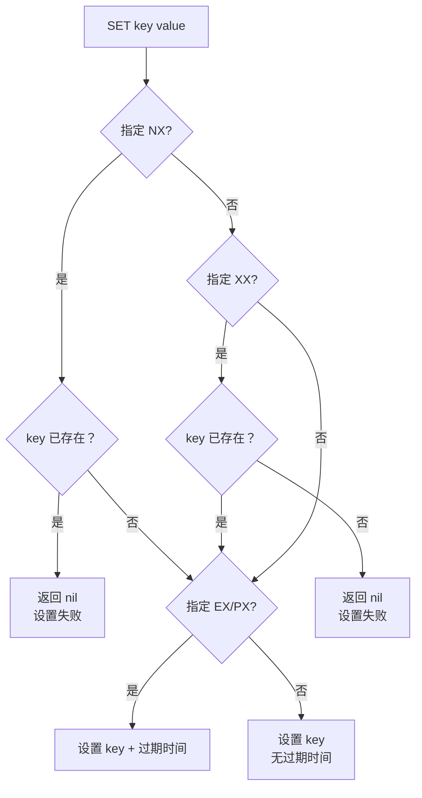

::: important SET 命令的原子性
`SET key value EX 60 NX` 是一个**原子操作**，不会出现"设置了值但过期时间没设上"的中间状态。在 Redis 2.6.12 之前，需要用 `SETNX` + `EXPIRE` 两条命令，存在非原子的风险。
:::

#### EXAT 和 PXAT（Redis 6.2+）

```bash
# EXAT: 设置精确的 Unix 时间戳（秒）作为过期时间
SET key value EXAT 1700000000

# PXAT: 设置精确的 Unix 时间戳（毫秒）作为过期时间
SET key value PXAT 1700000000000
```

### 3.2 GET 命令族

```bash
# 基本 GET
GET key             # 返回值或 nil

# GETSET：获取旧值并设置新值（已废弃，用 SET ... GET 替代）
GETSET key newvalue

# GETDEL：获取值并删除 key（Redis 6.2+）
GETDEL key

# GETEX：获取值并设置/移除过期时间（Redis 6.2+）
GETEX key EX 60     # 获取并设置 60 秒过期
GETEX key PX 60000  # 获取并设置 60000 毫秒过期
GETEX key PERSIST   # 获取并移除过期时间
```

### 3.3 自增自减命令

```bash
# INCR：自增 1
INCR counter           # 1 → 2 → 3

# DECR：自减 1
DECR counter           # 3 → 2 → 1

# INCRBY：增加指定整数
INCRBY counter 10      # 增加 10

# DECRBY：减少指定整数
DECRBY counter 5       # 减少 5

# INCRBYFLOAT：增加指定浮点数
INCRBYFLOAT price 0.5  # 增加 0.5
```

::: warning 自增自减的前提
- key 必须不存在，或值为整数/浮点数字符串
- 如果 key 存在但值不是数字，会报错：`ERR value is not an integer or out of range`
- `INCR`/`DECR`/`INCRBY`/`DECRBY` 只支持整数
- `INCRBYFLOAT` 支持浮点数，但返回值会转为 EMBSTR/RAW 编码
:::

```bash
# 自增编码转换演示
SET counter 0
OBJECT ENCODING counter    # "int"
INCR counter
OBJECT ENCODING counter    # "int"（仍是整数）
INCRBYFLOAT counter 0.1
OBJECT ENCODING counter    # "embstr"（浮点数转为字符串编码）
INCR counter               # ERR value is not an integer or out of range
```

### 3.4 批量操作命令

```bash
# MSET：批量设置
MSET key1 "value1" key2 "value2" key3 "value3"

# MGET：批量获取
MGET key1 key2 key3    # 返回 ["value1", "value2", "value3"]

# MSETNX：批量设置（所有 key 都不存在时才设置，原子操作）
MSETNX key1 "value1" key2 "value2"
```

::: tip MSET vs 多次 SET
`MSET` 是原子操作，一次性发送所有键值对，只涉及一次网络往返。相比多次 `SET`，性能提升显著：

| 方式 | 命令数 | 网络往返 | 原子性 |
|------|--------|---------|--------|
| 多次 SET | N | N | 每个 SET 原子，整体不原子 |
| MSET | 1 | 1 | 全部原子 |

在 10 个键值对的场景下，MSET 比多次 SET 快 5~10 倍（取决于网络延迟）。
:::

### 3.5 字符串操作命令

```bash
# APPEND：追加字符串
SET msg "hello"
APPEND msg " world"      # "hello world"

# STRLEN：获取字符串长度（字节）
STRLEN msg               # 11

# GETRANGE：获取子串
GETRANGE msg 0 4         # "hello"

# SETRANGE：覆盖指定位置开始的字符串
SETRANGE msg 6 "Redis"   # "hello Redis"
```

::: warning GETRANGE 的字节偏移
`GETRANGE` 的 start 和 stop 参数是**字节偏移**，不是字符偏移。对于 UTF-8 编码的中文，一个汉字占 3 字节：

```bash
SET cn "你好"
STRLEN cn               # 6（不是 2）
GETRANGE cn 0 2         # "你"（3 字节 = 1 个汉字）
GETRANGE cn 0 1         # "你" 的前两个字节 → 乱码
```
:::

### 3.6 过期与删除

```bash
# SET 时指定过期时间
SET key value EX 60

# 单独设置过期时间
EXPIRE key 60            # 60 秒后过期
PEXPIRE key 60000        # 60000 毫秒后过期

# 设置精确过期时间戳
EXPIREAT key 1700000000
PEXPIREAT key 1700000000000

# 查看剩余生存时间
TTL key                  # 返回秒数，-1=永不过期，-2=不存在
PTTL key                 # 返回毫秒数

# 移除过期时间（变为永久键）
PERSIST key

# 删除键
DEL key
UNLINK key               # 异步删除（Redis 4.0+）
```

## 四、应用场景

### 4.1 缓存

String 最经典的用途——缓存热点数据，减轻数据库压力：

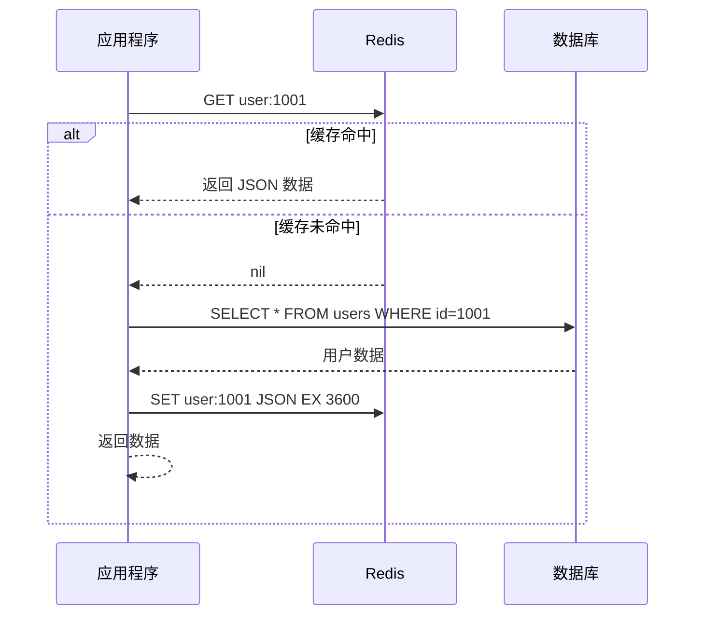

```csharp
// C# 缓存模式实现（StackExchange.Redis）
public async Task<User?> GetUserAsync(int userId)
{
    var db = _redis.GetDatabase();
    var cacheKey = $"user:{userId}";

    // 1. 先查缓存
    var cached = await db.StringGetAsync(cacheKey);
    if (cached.HasValue)
    {
        return JsonSerializer.Deserialize<User>(cached!);
    }

    // 2. 缓存未命中，查数据库
    var user = await _dbContext.Users.FindAsync(userId);
    if (user == null) return null;

    // 3. 写入缓存，设置过期时间
    var json = JsonSerializer.Serialize(user);
    await db.StringSetAsync(cacheKey, json, TimeSpan.FromHours(1));

    return user;
}
```

::: important 缓存三大问题

| 问题 | 描述 | 解决方案 |
|------|------|---------|
| 缓存穿透 | 查询不存在的数据，缓存永远不命中 | 布隆过滤器 / 缓存空值（SET key "" EX 60） |
| 缓存击穿 | 热点 key 过期瞬间大量请求打到 DB | 互斥锁 / 逻辑过期 / 永不过期+异步更新 |
| 缓存雪崩 | 大量 key 同时过期 | 过期时间加随机值 / 多级缓存 / 熔断降级 |
:::

#### 缓存空值示例

```bash
# 防止缓存穿透：对不存在的数据也缓存空值
SET user:9999 "" EX 60     # 缓存空值，60秒后自动过期

# 获取时判断
GET user:9999              # 返回 ""，说明确实不存在（而非未缓存）
```

### 4.2 计数器

`INCR` 是原子操作，天然适合做计数器：

```bash
# 文章阅读量
INCR article:1001:views

# API 调用计数
INCR api:weather:calls

# 用户签到天数
SET user:1001:sign:202401 0
INCR user:1001:sign:202401
GET user:1001:sign:202401   # 1
```

#### 限速器（Rate Limiter）

基于 INCR 实现固定窗口限速：

```bash
# 每分钟最多 100 次请求
key="rate:192.168.1.1:202401011200"  # IP + 分钟级时间窗口

count = INCR rate:192.168.1.1:202401011200
if count == 1 then
    EXPIRE rate:192.168.1.1:202401011200 60
end if
if count > 100 then
    return "请求过于频繁"
end if
```

```csharp
// C# 固定窗口限速器
public async Task<bool> IsRateLimitedAsync(string clientId, int limit, TimeSpan window)
{
    var db = _redis.GetDatabase();
    var now = DateTime.UtcNow;
    var windowKey = $"rate:{clientId}:{now:yyyyMMddHHmm}";

    var count = await db.StringIncrementAsync(windowKey);
    if (count == 1)
    {
        await db.KeyExpireAsync(windowKey, window);
    }

    return count > limit;
}
```

#### 滑动窗口限速器（基于 BIT 操作）

更精确的限速方案，利用 String 的 BIT 操作：

```bash
# 基于秒级精度的滑动窗口
# 每个用户一分钟内最多 100 次请求
# 用当前秒在 key 中的 offset 表示

# 记录请求
SETBIT rate:user:1001:60s 30 1     # 第30秒有一次请求

# 统计窗口内的请求数
BITCOUNT rate:user:1001:60s 0 59   # 统计60秒内的请求次数
```

### 4.3 分布式锁

基于 `SET ... NX EX` 实现简单的分布式锁：

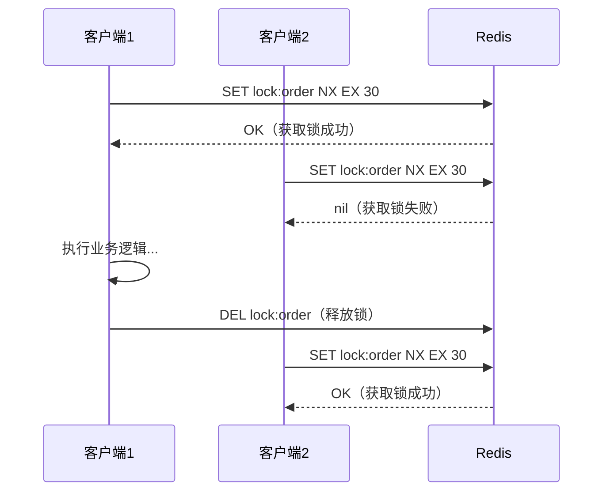

```csharp
// C# 分布式锁实现（StackExchange.Redis）
public class RedisDistributedLock
{
    private readonly IDatabase _db;
    private readonly string _lockKey;
    private readonly string _lockValue;  // 唯一标识，防止误删
    private readonly TimeSpan _expiry;

    public RedisDistributedLock(IDatabase db, string resource, TimeSpan expiry)
    {
        _db = db;
        _lockKey = $"lock:{resource}";
        _lockValue = Guid.NewGuid().ToString();
        _expiry = expiry;
    }

    public async Task<bool> AcquireAsync()
    {
        return await _db.StringSetAsync(
            _lockKey, _lockValue, _expiry,
            When.NotExists, CommandFlags.None);
    }

    public async Task ReleaseAsync()
    {
        // Lua 脚本保证原子性：只删自己加的锁
        var lua = @"
            if redis.call('GET', KEYS[1]) == ARGV[1] then
                return redis.call('DEL', KEYS[1])
            else
                return 0
            end";
        await _db.ScriptEvaluateAsync(lua,
            new RedisKey[] { _lockKey },
            new RedisValue[] { _lockValue });
    }
}
```

::: warning 简单分布式锁的隐患
1. **锁过期但业务未完成**：锁 30 秒过期，但业务执行了 40 秒，此时其他客户端可能获取到锁，导致并发问题
2. **续期问题**：需要看门狗（Watchdog）机制自动续期
3. **主从切换丢失锁**：主节点加锁后尚未同步到从节点就宕机，从节点升为主后锁丢失

生产环境建议使用 **Redlock** 算法或 **Redisson** 等成熟框架。
:::

### 4.4 限流

#### 滑动窗口限流

```csharp
// 基于 Sorted Set 实现的滑动窗口限流
public async Task<bool> IsAllowedAsync(string clientId, int limit, TimeSpan window)
{
    var db = _redis.GetDatabase();
    var now = DateTimeOffset.UtcNow.ToUnixTimeMilliseconds();
    var key = $"ratelimit:{clientId}";
    var windowStart = now - (long)window.TotalMilliseconds;

    // Lua 脚本保证原子性
    var lua = @"
        local key = KEYS[1]
        local now = tonumber(ARGV[1])
        local window_start = tonumber(ARGV[2])
        local limit = tonumber(ARGV[3])

        -- 移除窗口外的记录
        redis.call('ZREMRANGEBYSCORE', key, '-inf', window_start)

        -- 获取当前窗口内的请求数
        local count = redis.call('ZCARD', key)

        if count < limit then
            redis.call('ZADD', key, now, now)
            redis.call('PEXPIRE', key, ARGV[4])
            return 1
        else
            return 0
        end";

    var result = await db.ScriptEvaluateAsync(lua,
        new RedisKey[] { key },
        new RedisValue[] { now, windowStart, limit, window.TotalMilliseconds });

    return (int)result == 1;
}
```

#### 令牌桶限流

```bash
# 基于String的简单令牌桶
# tokens: 当前令牌数
# last_time: 上次补充时间

# 使用 Lua 脚本保证原子性
local key = KEYS[1]
local max_tokens = tonumber(ARGV[1])
local rate = tonumber(ARGV[2])        -- 每秒补充令牌数
local now = tonumber(ARGV[3])
local requested = tonumber(ARGV[4])   -- 请求消耗的令牌数

local info = redis.call('HMGET', key, 'tokens', 'last_time')
local tokens = tonumber(info[1])
local last_time = tonumber(info[2])

if tokens == nil then
    tokens = max_tokens
    last_time = now
end

-- 计算补充的令牌
local elapsed = now - last_time
local new_tokens = math.min(max_tokens, tokens + elapsed * rate)

if new_tokens >= requested then
    new_tokens = new_tokens - requested
    redis.call('HMSET', key, 'tokens', new_tokens, 'last_time', now)
    return 1
else
    redis.call('HMSET', key, 'tokens', new_tokens, 'last_time', now)
    return 0
end
```

### 4.5 共享 Session

在分布式系统中，用 Redis 集中管理用户会话：

```csharp
// ASP.NET Core 使用 Redis 存储 Session
// Program.cs
builder.Services.AddStackExchangeRedisCache(options =>
{
    options.Configuration = "localhost:6379";
    options.InstanceName = "MyApp:Session:";
});

builder.Services.AddSession(options =>
{
    options.IdleTimeout = TimeSpan.FromMinutes(30);
    options.Cookie.HttpOnly = true;
});
```

```bash
# Redis 中 Session 数据的存储
SET "MyApp:Session:sess_abc123" "{userId:1001,role:'admin'}" EX 1800
```

### 4.6 生成全局唯一 ID

利用 `INCR` 的原子性生成自增 ID：

```bash
# 每天一个 key，ID = 日期 + 当日序号
SET order:id:20240101 10000      # 起始值
INCR order:id:20240101           # 10001
INCR order:id:20240101           # 10002

# 拼接成完整 ID：2024010110001、2024010110002
```

## 五、位运算与 BIT 操作

Redis 的 String 是二进制安全的，一个 String 最大 512MB，这意味着它可以包含最多 2^32（约 42.9 亿）个 bit 位。Redis 提供了一组 BIT 操作命令，直接操作这些 bit 位。

### 5.1 BIT 命令概览

| 命令 | 说明 | 时间复杂度 |
|------|------|-----------|
| `SETBIT key offset value` | 设置指定偏移量上的 bit 值 | O(1) |
| `GETBIT key offset` | 获取指定偏移量上的 bit 值 | O(1) |
| `BITCOUNT key [start end]` | 统计值为 1 的 bit 位数 | O(N) |
| `BITPOS key bit [start end]` | 查找第一个值为 bit 的位置 | O(N) |
| `BITOP op destkey key [key ...]` | 位运算（AND/OR/XOR/NOT） | O(N) |
| `BITFIELD key ...` | 多字段位操作 | O(N) |

### 5.2 基本位操作

```bash
# SETBIT：设置某一位的值（0 或 1）
SETBIT user:sign:202401 0 1    # 第0位设为1（1月1日签到）
SETBIT user:sign:202401 6 1    # 第6位设为1（1月7日签到）

# GETBIT：获取某一位的值
GETBIT user:sign:202401 0      # 1（已签到）
GETBIT user:sign:202401 1      # 0（未签到）

# BITCOUNT：统计值为1的位数
BITCOUNT user:sign:202401      # 2（共2天签到）

# BITPOS：查找第一个0或1的位置
BITPOS user:sign:202401 0      # 1（第一个未签到的位置）
BITPOS user:sign:202401 1      # 0（第一个已签到的位置）
```

### 5.3 用户签到场景

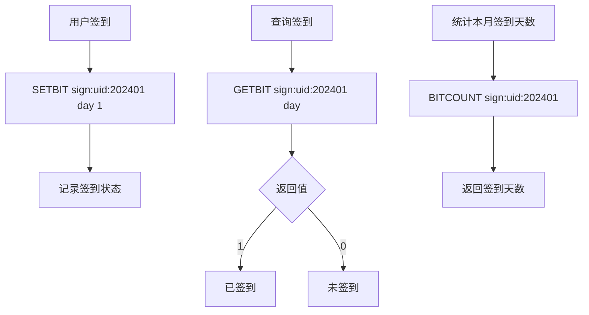

```csharp
// C# 用户签到实现
public class UserSignService
{
    private readonly IDatabase _db;

    // 用户签到
    public async Task SignAsync(int userId, DateTime date)
    {
        var key = $"sign:{userId}:{date:yyyyMM}";
        var offset = date.Day - 1;  // 日期作为偏移量
        await _db.StringSetBitAsync(key, offset, true);
    }

    // 检查是否签到
    public async Task<bool> IsSignedAsync(int userId, DateTime date)
    {
        var key = $"sign:{userId}:{date:yyyyMM}";
        var offset = date.Day - 1;
        return await _db.StringGetBitAsync(key, offset);
    }

    // 统计本月签到天数
    public async Task<long> GetSignCountAsync(int userId, string month)
    {
        var key = $"sign:{userId}:{month}";
        return await _db.StringBitCountAsync(key);
    }

    // 获取连续签到天数
    public async Task<int> GetContinuousSignDaysAsync(int userId, DateTime today)
    {
        var key = $"sign:{userId}:{today:yyyyMM}";
        var offset = today.Day - 1;
        int count = 0;

        // 从当天往前查找连续的1
        for (int i = offset; i >= 0; i--)
        {
            var bit = await _db.StringGetBitAsync(key, i);
            if (bit)
                count++;
            else
                break;
        }

        return count;
    }
}
```

::: tip BIT 签到的内存效率
- 一个月最多 31 天，需要 31 bit = 4 字节
- 一年 12 个月，共 48 字节即可存储一个用户全年的签到记录
- 100 万用户仅需约 46 MB

对比传统数据库方案（每条签到记录一行），BIT 方案内存节省 **99%+**。
:::

### 5.4 BIT 位运算

```bash
# BITOP AND：对多个 key 执行按位与
SETBIT user1:sign:202401 0 1
SETBIT user1:sign:202401 1 1
SETBIT user2:sign:202401 0 1
SETBIT user2:sign:202401 2 1

BITOP AND both:sign:202401 user1:sign:202401 user2:sign:202401
GETBIT both:sign:202401 0    # 1（两人都签到了第0天）
GETBIT both:sign:202401 1    # 0（只有 user1 签到了第1天）

# BITOP OR：按位或（任意一人签到）
BITOP OR any:sign:202401 user1:sign:202401 user2:sign:202401

# BITOP XOR：按位异或（恰好一人签到）
BITOP XOR diff:sign:202401 user1:sign:202401 user2:sign:202401
```

### 5.5 BITFIELD 命令

`BITFIELD` 允许在一个 String 中操作多个不同宽度的整数字段：

```bash
# 设置和获取位字段
BITFIELD mykey SET i8 0 100    # 在偏移0处设置8位有符号整数100
BITFIELD mykey SET i16 8 500   # 在偏移8处设置16位有符号整数500

BITFIELD mykey GET i8 0        # 获取偏移0处的8位有符号整数 → 100
BITFIELD mykey GET i16 8       # 获取偏移8处的16位有符号整数 → 500

# 原子自增
BITFIELD mykey INCRBY i8 0 1   # 偏移0处的值+1 → 101
BITFIELD mykey INCRBY i8 0 10  # 偏移0处的值+10 → 111

# 溢出控制
BITFIELD mykey OVERFLOW WRAP INCRBY i8 0 200   # 溢出回绕（默认行为）
BITFIELD mykey OVERFLOW SAT INCRBY i8 0 200    # 溢出饱和（停在最大/最小值）
BITFIELD mykey OVERFLOW FAIL INCRBY i8 0 200   # 溢出失败（返回nil）
```

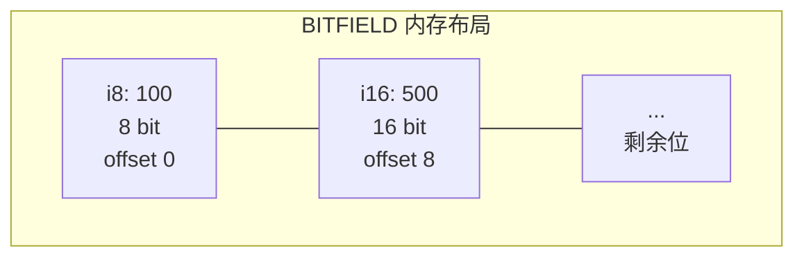

### 5.6 统计活跃用户（HyperLogLog + BIT 结合）

```bash
# 方案1：BITMAP 存储每日活跃用户（用户ID作为偏移量）
SETBIT active:20240101 1001 1   # 用户1001在1月1日活跃
SETBIT active:20240101 1002 1   # 用户1002在1月1日活跃
BITCOUNT active:20240101        # 统计1月1日活跃用户数

# 方案2：BITOP 统计多日活跃用户
BITOP OR active:week active:mon active:tue active:wed active:thu active:fri active:sat active:sun
BITCOUNT active:week            # 本周活跃用户数

# 方案3：BITOP AND 统计连续活跃
BITOP AND active:continuous active:mon active:tue active:wed
BITCOUNT active:continuous      # 连续3天活跃的用户数
```

::: important BITMAP vs HyperLogLog 选择

| 维度 | BITMAP | HyperLogLog |
|------|--------|-------------|
| 精度 | 精确 | 0.81% 标准误差 |
| 内存 | 与用户ID范围成正比 | 固定 12KB |
| 适合场景 | 用户ID密集且需要精确统计 | 海量数据且允许误差 |
| 操作 | 支持交并差运算 | 仅支持基数估计 |

用户ID < 1000 万时，BITMAP 约 1.2MB/天，精确且支持位运算，更优。用户ID 分散或非常大时，HyperLogLog 更省内存。
:::

## 六、性能优化与最佳实践

### 6.1 内存优化

```bash
# 1. 利用共享整数：0~9999 的整数共享对象，无需额外分配
SET counter 0        # 使用共享对象
INCR counter         # 仍在共享范围内

# 2. 短字符串优先：≤ 44 字节使用 EMBSTR，一次分配更高效
SET key "short"      # EMBSTR
SET key "a very long string that exceeds the 44 byte limit for embstr encoding..."  # RAW

# 3. 避免频繁 APPEND：EMBSTR 转 RAW 不可逆
SET msg "hello"      # EMBSTR
APPEND msg " world"  # 转为 RAW，后续无法恢复 EMBSTR
# 优化：预估长度，直接 SET 最终值
SET msg "hello world"  # 直接 EMBSTR
```

### 6.2 大 Key 问题

```bash
# 检查 String 的大小
STRLEN key           # 返回字节数
DEBUG OBJECT key     # 查看编码和引用计数

# 大 Key 的危害
# 1. 内存不均匀：单个 key 占用过多内存
# 2. 阻塞：DEL 大 key 会阻塞 Redis
# 3. 网络拥堵：GET 大 key 占用大量带宽

# 解决方案
# 1. 压缩存储
SET large:data [压缩后的数据] EX 3600

# 2. 分片存储
SET large:data:1 [部分1]
SET large:data:2 [部分2]

# 3. 异步删除大 key
UNLINK large:key     # Redis 4.0+ 异步删除
```

::: warning String 大 Key 阈值
- 建议 String 值不超过 **10KB**
- 超过 10KB 需要评估是否有更合适的存储方式
- 超过 100KB 属于严重大 Key，必须优化

使用 `redis-cli --bigkeys` 扫描大 Key：

```bash
redis-cli --bigkeys -i 0.1
# 输出各类型最大的 key
```
:::

### 6.3 过期时间策略

```bash
# 1. 必须设置过期时间：防止内存泄漏
SET key value EX 3600    # 好习惯
SET key value            # 危险：永不过期

# 2. 过期时间加随机值：防止缓存雪崩
# Python
import random
expire = 3600 + random.randint(0, 600)  # 3600~4200 秒
SET key value EX expire

# 3. 逻辑过期：缓存永不过期，但数据中包含过期时间
SET key '{"data":"...","expire_at":1700000000}'
# 读取时检查 expire_at，过期则异步更新
```

### 6.4 序列化选择

| 格式 | 大小 | 速度 | 可读性 | 使用场景 |
|------|------|------|--------|---------|
| JSON | 大 | 慢 | 好 | 调试、通用 |
| MessagePack | 小 | 快 | 差 | 高性能 |
| Protobuf | 最小 | 最快 | 差 | 对内服务 |
| Hessian | 中 | 中 | 差 | Java 生态 |

```csharp
// 对比 JSON 和 MessagePack 的大小
var user = new User { Id = 1001, Name = "张三", Role = "admin" };

// JSON: ~60 字节
var json = JsonSerializer.Serialize(user);

// MessagePack: ~35 字节
var msgpack = MessagePackSerializer.Serialize(user);
```

## 七、源码解读：从命令到编码

### 7.1 SET 命令的执行流程

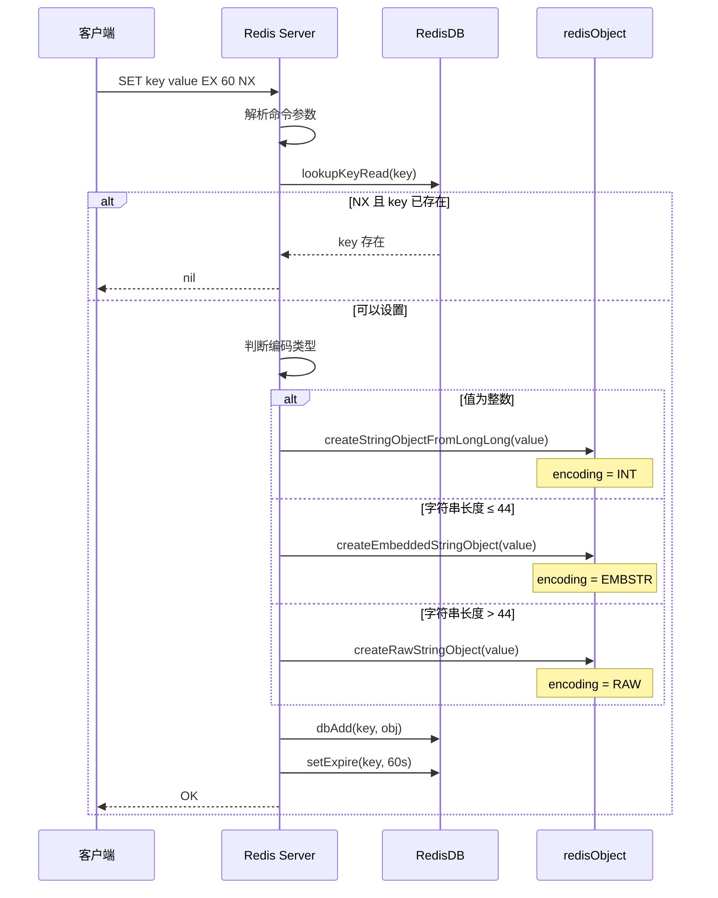

### 7.2 INCR 命令的编码转换

```c
// Redis 源码 t_string.c - incrDecrCommand（简化）
void incrDecrCommand(client *c, long long incr) {
    robj *o = lookupKeyWrite(c->db, c->argv[1]);

    if (o == NULL) {
        // key 不存在，创建为 INT 编码
        o = createStringObjectFromLongLong(incr);
        dbAdd(c->db, c->argv[1], o);
    } else {
        if (o->encoding == OBJ_ENCODING_INT) {
            // INT 编码，直接计算
            long long newval = (long long)o->ptr + incr;
            // 检查是否溢出
            if ((incr < 0 && newval > 0) || (incr > 0 && newval < 0)) {
                // 溢出，转为字符串
                o = createStringObjectFromLongLongForTarget(newval, o);
            } else {
                o->ptr = (void*)newval;
            }
        } else {
            // 非 INT 编码，尝试转为整数再计算
            long long value;
            if (getLongLongFromObject(o, &value) != C_OK) {
                addReplyError(c, "value is not an integer");
                return;
            }
            // 计算新值并创建新对象
            o = createStringObjectFromLongLong(value + incr);
        }
    }
}
```

### 7.3 APPEND 触发编码转换

```c
// Redis 源码 t_string.c - appendCommand（简化）
void appendCommand(client *c) {
    robj *o = lookupKeyWrite(c->db, c->argv[1]);

    if (o == NULL) {
        // key 不存在，直接创建
        o = createStringObject(c->argv[2]);
        dbAdd(c->db, c->argv[1], o);
    } else {
        // ★ 关键：EMBSTR 在任何修改时都转为 RAW
        o = dbUnshareStringValue(c->db, c->argv[1], o);
        // dbUnshareStringValue 内部：
        //   if (o->encoding == OBJ_ENCODING_EMBSTR) {
        //       o = createRawStringObject(...);  // 转为 RAW
        //   }
        o = sdscatlen(o->ptr, c->argv[2]->ptr, sdslen(c->argv[2]->ptr));
    }
}
```

## 八、常见问题与陷阱

### 8.1 INCR 不是浮点数

```bash
SET price 10.5
INCR price
# ERR value is not an integer or out of range

# 正确做法：使用 INCRBYFLOAT
INCRBYFLOAT price 0.5    # 11.0
INCRBYFLOAT price -1.0   # 10.0
```

### 8.2 SETNX + EXPIRE 非原子

```bash
# 错误做法（Redis 2.6.12 之前不得已而为之）
SETNX lock "uuid"
EXPIRE lock 30
# 如果在 SETNX 成功后 EXPIRE 执行前进程崩溃，
# 锁将永远不会过期！

# 正确做法（Redis 2.6.12+）
SET lock "uuid" EX 30 NX
```

### 8.3 DEL 他人锁

```bash
# 错误做法
SET lock "uuid1" EX 30 NX    # 客户端1加锁
# ... 客户端1的锁过期了
SET lock "uuid2" EX 30 NX    # 客户端2加锁
# 客户端1执行完毕，删除了客户端2的锁！
DEL lock                      # 误删！

# 正确做法：验证身份后再删
# 使用 Lua 脚本保证原子性
if redis.call('GET', KEYS[1]) == ARGV[1] then
    return redis.call('DEL', KEYS[1])
else
    return 0
end
```

### 8.4 MGET 跨 Slot 问题

```bash
# Redis Cluster 中，MGET 的 key 可能在不同 Slot
MGET user:1001 user:1002 user:1003
# 如果不在同一 Slot，会报 CROSSSLOT 错误

# 解决方案1：使用 Hash Tag
MGET {user}:1001 {user}:1002 {user}:1003
# {user} 确保 key 映射到同一 Slot

# 解决方案2：Pipeline 逐个获取
pipeline.get("user:1001")
pipeline.get("user:1002")
pipeline.get("user:1003")
```

### 8.5 字符串长度陷阱

```bash
# STRLEN 返回字节数，不是字符数
SET name "张三"
STRLEN name          # 6（UTF-8 每个中文 3 字节）

# SETRANGE 可能产生空洞
SET msg "hello"
SETRANGE msg 10 "x"  # 在偏移10处设置x
STRLEN msg            # 11（中间填充了 \0）
GET msg               # "hello\x00\x00\x00\x00\x00x"
```

## 九、总结

### 9.1 String 内部编码一览

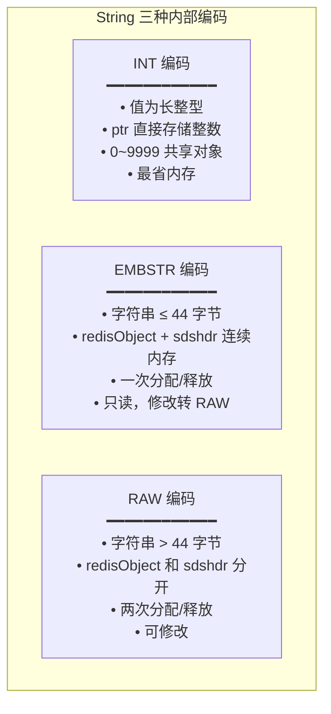

### 9.2 核心要点回顾

| 维度 | 要点 |
|------|------|
| **SDS** | O(1) 长度获取、二进制安全、空间预分配、惰性释放 |
| **INT** | 整数值直接存 ptr，0~9999 共享，最省内存 |
| **EMBSTR** | ≤ 44 字节，连续内存，一次分配，只读 |
| **RAW** | > 44 字节，分开内存，两次分配，可修改 |
| **转换** | INT→EMBSTR/RAW（追加字符串），EMBSTR→RAW（任何修改） |
| **BIT** | 签到、统计、位运算，内存效率极高 |
| **最佳实践** | 预估长度直接 SET、避免大 Key、必须设过期时间 |

### 9.3 参考资料

- [Redis 官方文档 - String Commands](https://redis.io/commands/?group=string)
- 《Redis 设计与实现》第 2 部分 第 8~11 章 —— 黄健宏
- 《Redis 深度历险》第 2 章 —— 钱文品
- 《Redis 开发与运维》第 3 章 —— 付磊、张益军
- [Redis 源码 sds.h / sds.c / t_string.c](https://github.com/redis/redis)
