# Hash 与压缩列表

> Hash 是 Redis 中用来存储键值对集合的数据类型，类似于编程语言中的字典或 Map。它的底层在 ziplist 和 hashtable 之间智能切换，而渐进式 rehash 更是 Redis 作者 antirez 的经典设计——在不阻塞服务的前提下完成哈希表的扩容与缩容。

::: tip 核心要点
- Hash 有两种编码：`ziplist`（压缩列表）和 `hashtable`（哈希表）
- 元素少且短时用 ziplist 节省内存，元素多或值大时自动转 hashtable
- hashtable 的渐进式 rehash 是 Redis 高可用的关键设计
- Hash 天然适合存储对象，比 String + JSON 更省内存且更灵活
:::

## 一、Hash 类型概述

### 1.1 什么是 Hash

Redis Hash 是一个**键值对的集合**，适合存储对象：

```bash
# 存储用户对象
HMSET user:1001 name "张三" age 25 role "admin" email "zhangsan@example.com"

# 获取单个字段
HGET user:1001 name           # "张三"

# 获取所有字段
HGETALL user:1001
# 1) "name"
# 2) "张三"
# 3) "age"
# 4) "25"
# 5) "role"
# 6) "admin"
# 7) "email"
# 8) "zhangsan@example.com"
```

### 1.2 Hash vs String + JSON

存储一个用户对象，两种方案对比：

```bash
# 方案1：String + JSON
SET user:1001 '{"name":"张三","age":25,"role":"admin","email":"zhangsan@example.com"}'

# 方案2：Hash
HMSET user:1001 name "张三" age 25 role "admin" email "zhangsan@example.com"
```

| 维度 | String + JSON | Hash |
|------|--------------|------|
| 读取部分字段 | GET 整个值再反序列化 | HGET 单个字段 |
| 修改部分字段 | GET → 修改 → SET（非原子） | HSET（原子） |
| 内存占用 | JSON 格式开销（引号、冒号等） | ziplist 更紧凑 |
| 过期设置 | 整个 key 过期 | 整个 key 过期（不能对单字段设过期） |
| 复杂嵌套 | 支持 | 不支持（值只能是字符串） |

::: important 何时用 Hash vs String
- **用 Hash**：对象字段较少、需要单独读写某些字段、需要 HINCRBY 原子递增
- **用 String**：对象有嵌套结构、需要设置子字段过期、需要整体操作
- **经验法则**：如果对象字段 ≤ 100 个且无嵌套，优先用 Hash
:::

## 二、ziplist 编码

### 2.1 ziplist 结构

ziplist（压缩列表）是 Redis 为节省内存而设计的紧凑数据结构，将所有数据连续存储在一块内存中：

```c
// Redis 源码 ziplist.c
// ziplist 的整体结构：
// <zlbytes> <zltail> <zllen> <entry> <entry> ... <entry> <zlend>

// 各字段含义：
// zlbytes:  uint32_t, 整个 ziplist 占用的字节数
// zltail:   uint32_t, 最后一个 entry 的偏移量（用于尾插优化）
// zllen:    uint16_t, entry 的数量（65535个以上时需要遍历统计）
// entry:    变长, 每个元素
// zlend:    uint8_t, 0xFF, 结束标记
```

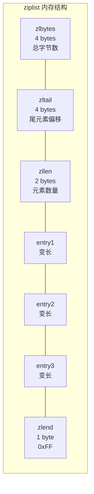

### 2.2 ziplist entry 结构

每个 entry 由三部分组成：

```c
// ziplist entry 结构：
// <prevlen> <encoding> <data>

// prevlen: 前一个 entry 的长度（用于反向遍历）
//   - 前一 entry < 254 字节: 1 字节存储
//   - 前一 entry >= 254 字节: 5 字节存储（首字节 0xFE + 4 字节长度）

// encoding: 当前 entry 的编码方式
//   - 00xxxxxx: 小字符串，长度 ≤ 63（6 bit）
//   - 01xxxxxx: 中字符串，长度 ≤ 16383（14 bit）
//   - 10000000: 大字符串，长度用后续 4 字节存储
//   - 11000000: int16（2 字节整数）
//   - 11010000: int32（4 字节整数）
//   - 11100000: int64（8 字节整数）
//   - 11110000: 24 位有符号整数
//   - 11111110: 8 位有符号整数
//   - 1111xxxx: 0~12 的小整数（xxxx-1 即为值，xxxx 非 0000 和 1111）
```

```mermaid
flowchart TB
    subgraph entry结构["ziplist entry 结构"]
        direction LR
        prevlen["prevlen<br/>1 或 5 bytes<br/>前一entry长度"] --- encoding["encoding<br/>1~5 bytes<br/>编码方式"] --- data["data<br/>变长<br/>实际数据"]
    end
    
    subgraph prevlen编码["prevlen 编码"]
        p1["前一 entry < 254B<br/>→ 1 byte"] --- p2["前一 entry ≥ 254B<br/>→ 5 bytes (0xFE + 4B长度)"]
    end
    
    subgraph encoding编码["encoding 编码（字符串）"]
        e1["00xxxxxx<br/>len ≤ 63"] --- e2["01xxxxxx<br/>len ≤ 16383"] --- e3["10000000 + 4B<br/>大字符串"]
    end
    
    subgraph encoding编码2["encoding 编码（整数）"]
        i1["11000000 → int16"] --- i2["11010000 → int32"] --- i3["11100000 → int64"] --- i4["1111xxxx → 0~12"]
    end
```

::: info ziplist 为何省内存
对比 Hash 的 hashtable 编码，ziplist 省内存的原因：

1. **无指针开销**：每个 entry 连续存储，不需要前后向指针（linkedlist 每个节点需要 2×8=16 字节指针）
2. **紧凑编码**：小整数用 1~3 字节编码，短字符串用 1 字节 encoding，没有内存对齐填充
3. **prevlen 压缩**：短前驱用 1 字节 prevlen，只有长前驱才用 5 字节

以存储 `{name: "Tom", age: 25}` 为例：
- ziplist：约 30 字节
- hashtable：约 120 字节（2 个 dictEntry + 2 个 SDS + 指针等）
:::

### 2.3 ziplist 的连锁更新问题

ziplist 有一个著名的性能陷阱——**连锁更新**（cascade update）：

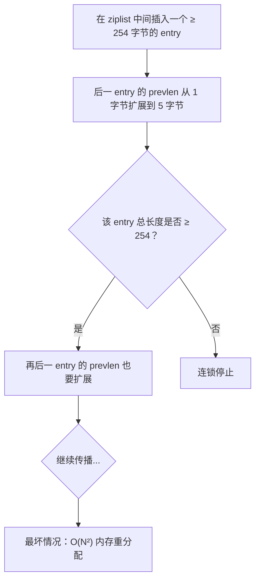

```bash
# 连锁更新示例
# 假设有多个连续的 entry，每个恰好 252~253 字节
# prevlen 用 1 字节存储
# 在它们前面插入一个 254+ 字节的 entry
# → 第一个 entry 的 prevlen 变为 5 字节
# → 该 entry 总长变为 257 字节
# → 第二个 entry 的 prevlen 也要变为 5 字节
# → 连锁传播...

# 注意：Redis 7.0 用 listpack 替代了 ziplist，
# listpack 不再存储 prevlen，彻底消除了连锁更新问题
```

::: warning 连锁更新的实际影响
虽然理论上连锁更新的最坏时间复杂度是 O(N²)，但实际上：
1. **触发条件苛刻**：需要多个连续 entry 恰好在 252~253 字节
2. **概率极低**：真实业务中几乎不会出现
3. **Redis 7.0 已解决**：listpack 替代了 ziplist，不再有 prevlen 字段

在 Redis 7.0 之前的版本中，Hash 的元素数量被 `hash-max-ziplist-entries` 限制（默认 128），即使触发连锁更新，影响也在可控范围内。
:::

### 2.4 ziplist 的查找复杂度

```bash
# ziplist 是连续内存，查找需要从头遍历
# 时间复杂度 O(N)

# 查找流程：
# 1. 从 ziplist 头部开始
# 2. 解析 prevlen + encoding，跳到下一个 entry
# 3. 比较字段名和值
# 4. 直到找到目标或到达 zlend

# 优化：zltail 字段可以直接定位最后一个 entry
# 尾部操作（如 RPUSH）的时间复杂度为 O(1)
```

## 三、hashtable 编码

### 3.1 Redis 字典结构

当 Hash 的元素较多或值较大时，Redis 使用 hashtable 编码。这是 Redis 核心的字典实现：

```c
// Redis 源码 dict.h
typedef struct dictEntry {
    void *key;
    union {
        void *val;
        uint64_t u64;
        int64_t s64;
        double d;
    } v;
    struct dictEntry *next;  // 链地址法解决冲突
} dictEntry;

typedef struct dictht {
    dictEntry **table;       // 哈希表数组（桶数组）
    unsigned long size;      // 哈希表大小（桶数量，总是 2^n）
    unsigned long sizemask;  // 哈希表大小掩码（size - 1，用于计算索引）
    unsigned long used;      // 已有节点数量
} dictht;

typedef struct dict {
    dictType *type;          // 类型特定函数（哈希函数、比较函数等）
    void *privdata;          // 私有数据
    dictht ht[2];            // ★ 两个哈希表（用于 rehash）
    long rehashidx;          // ★ rehash 索引（-1 表示未在 rehash）
    unsigned long iterators; // 正在运行的迭代器数量
} dict;
```

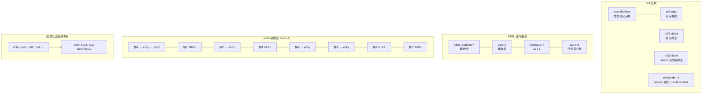

::: important 为什么 ht 是长度为 2 的数组？
`dict` 中 `ht[2]` 是渐进式 rehash 的核心设计：
- **ht[0]**：正常使用的哈希表
- **ht[1]**：rehash 时的临时目标表
- **rehashidx**：记录 rehash 的进度，-1 表示没有在 rehash

当 ht[0] 的负载因子过高或过低时，Redis 分配 ht[1]，然后逐步将 ht[0] 的元素迁移到 ht[1]，完成后交换两者。这个"逐步"就是渐进式 rehash。
:::

### 3.2 哈希函数与索引计算

```c
// Redis 使用的哈希函数（MurmurHash2 的变体）
// dictType 中默认的 hashFunction
unsigned int dictGenHashFunction(const void *key, int len) {
    // MurmurHash2 算法
    // 优点：分布均匀、计算快速、对规律性输入不敏感
    // ...
}

// 索引计算
index = hash & sizemask;
// 等价于 hash % size（当 size 是 2 的幂时）
// 位运算比取模快得多
```

### 3.3 哈希冲突与链地址法

当两个不同的 key 计算出相同的索引时，发生哈希冲突。Redis 使用**链地址法**（Separate Chaining）解决冲突：

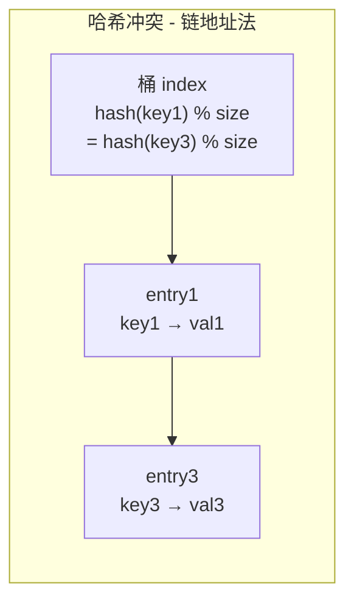

```c
// 新节点总是插入到链表头部（头插法）
// 时间复杂度 O(1)，不需要遍历链表找尾部
dictEntry *dictAddRaw(dict *d, void *key, dictEntry **existing) {
    // ...
    entry->next = ht->table[index];  // 新节点指向原头节点
    ht->table[index] = entry;        // 桶指向新节点
    ht->used++;
    // ...
}
```

::: tip 头插法 vs 尾插法
Redis 使用头插法的原因：
1. **O(1) 插入**：不需要遍历链表找尾部
2. **局部性原理**：新插入的数据更可能被近期访问，放在头部有利于缓存命中
3. **实现简单**：无需维护尾指针

Java 的 HashMap 在 JDK 8 之前也是头插法，但为了解决多线程环形链表问题改为尾插法。Redis 是单线程模型，不存在这个问题。
:::

## 四、编码转换

### 4.1 转换条件

Redis 通过两个配置参数控制 Hash 的编码选择：

```bash
# redis.conf 配置
hash-max-ziplist-entries 512    # 元素数量 ≤ 512 时使用 ziplist
hash-max-ziplist-value 64       # 所有值都 ≤ 64 字节时使用 ziplist
```

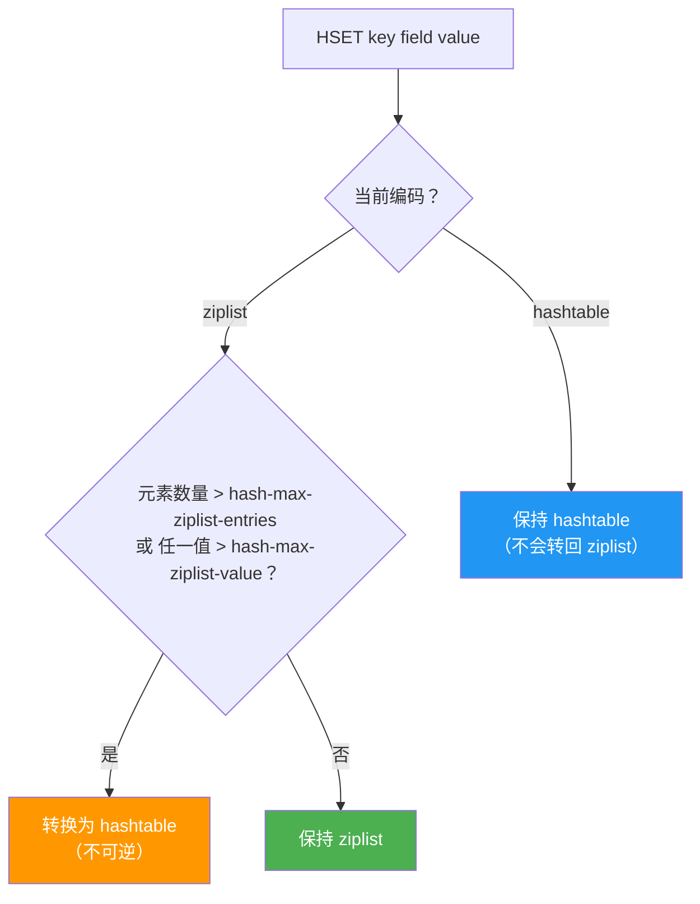

```bash
# 演示编码转换
HSET user:1 name "Tom"
OBJECT ENCODING user:1         # "ziplist"

# 逐个添加字段，直到超过阈值
# 假设 hash-max-ziplist-entries = 512
for i in {1..512}; do
    HSET user:1 field$i "value$i"
done
OBJECT ENCODING user:1         # "ziplist"（刚好在阈值内）

HSET user:1 field513 "value513"
OBJECT ENCODING user:1         # "hashtable"（超过阈值，转为 hashtable）

# 添加大值
HSET user:2 name "Tom"
OBJECT ENCODING user:2         # "ziplist"
HSET user:2 bio "a very very very very very very very very very very very very very very very long string over 64 bytes"
OBJECT ENCODING user:2         # "hashtable"（值超过 64 字节）
```

::: warning 编码转换是不可逆的
ziplist → hashtable 的转换是**单向**的。即使后来删除了大量元素，使得元素数量和值大小都回到阈值以内，编码也不会从 hashtable 转回 ziplist。这是因为：
1. 转换需要重建整个数据结构，代价较大
2. 大多数情况下，Hash 一旦变大就不会再变小
3. 避免频繁转换造成的性能抖动

如果需要回收内存，可以考虑删除 key 后重建。
:::

### 4.2 编码选择的影响

```bash
# ziplist 编码的 Hash
# - 内存紧凑，省内存
# - 查找 O(N)，不适合大量字段
# - 适合小对象存储

# hashtable 编码的 Hash
# - 查找 O(1)，适合大量字段
# - 内存开销大（每个 dictEntry ~72 字节）
# - 适合频繁读写的场景
```

### 4.3 源码解析：编码转换

```c
// Redis 源码 t_hash.c - hashTypeSet（简化）
void hashTypeSet(robj *o, sds field, sds value, int flags) {
    if (o->encoding == OBJ_ENCODING_ZIPLIST) {
        // 尝试添加到 ziplist
        unsigned char *zl, *fptr, *vptr;

        zl = o->ptr;
        fptr = ziplistIndex(zl, ZIPLIST_HEAD);

        // 检查是否需要转换
        if (hashTypeLength(o) >= server.hash_max_ziplist_entries ||
            sdslen(value) > server.hash_max_ziplist_value ||
            sdslen(field) > server.hash_max_ziplist_value)
        {
            // ★ 转换为 hashtable
            o = hashTypeConvert(o, OBJ_ENCODING_HT);
            // 转换后使用 dictAdd
            dictAdd(o->ptr, field, value);
        } else {
            // 继续使用 ziplist
            zl = ziplistPush(zl, field, sdslen(field), ZIPLIST_TAIL);
            zl = ziplistPush(zl, value, sdslen(value), ZIPLIST_TAIL);
            o->ptr = zl;
        }
    } else if (o->encoding == OBJ_ENCODING_HT) {
        // hashtable 编码，直接操作字典
        dictAddOrUpdate(o->ptr, field, value);
    }
}
```

## 五、渐进式 Rehash

### 5.1 为什么需要渐进式 Rehash

当哈希表的负载因子（`used / size`）过高时，需要扩容。传统的 rehash 方案是**一次性**将所有元素重新哈希到新表——对于百万级甚至千万级的哈希表，这会导致严重的性能抖动：

```bash
# 一次性 rehash 的问题
# 假设哈希表有 1000 万个元素
# 一次性 rehash 需要：
# 1. 分配新表内存（可能几百MB）
# 2. 重新计算 1000 万个 key 的哈希值
# 3. 将 1000 万个 key 移到新表
# 4. 释放旧表内存
# 整个过程中 Redis 无法响应其他请求！
```

Redis 的解决方案是**渐进式 rehash**——将一次性的大操作拆分为无数个小步骤，每次只迁移少量元素，与正常请求交替执行。

### 5.2 Rehash 触发条件

```c
// Redis 源码 dict.c - _dictExpandIfNeeded（简化）
// 在每次增删改查时检查是否需要 rehash

static int _dictExpandIfNeeded(dict *d) {
    if (dictIsRehashing(d)) return DICT_OK;  // 正在 rehash，跳过

    // 扩容条件
    if (d->ht[0].used >= d->ht[0].size &&
        (dict_can_resize ||                  // 允许 resize
         d->ht[0].used / d->ht[0].size > dict_force_resize_ratio))  // 或强制扩容
    {
        return dictExpand(d, d->ht[0].used * 2);  // 扩容为 used 的 2 倍
    }

    return DICT_OK;
}
```

| 条件 | 说明 |
|------|------|
| `used >= size` | 负载因子 ≥ 1，且允许 resize 时触发扩容 |
| `used / size > 5` | 负载因子 > 5，强制扩容（即使 `dict_can_resize = false`） |
| `used < size / 10` | 负载因子 < 0.1，触发缩容（BGSAVE/BGREWRITEAOF 完成后） |

::: important dict_can_resize 开关
Redis 在执行 **BGSAVE** 或 **BGREWRITEAOF** 时，会设置 `dict_can_resize = false`，禁止普通的扩容操作。原因是 fork 子进程时使用了操作系统的 COW（Copy-On-Write）机制，如果此时触发大量 rehash 导致内存页修改，会破坏 COW 的省内存优势。

但 `dict_force_resize_ratio = 5` 是一个硬性上限——即使禁止 resize，负载因子超过 5 也必须扩容，否则哈希表的性能会急剧下降。
:::

### 5.3 渐进式 Rehash 流程

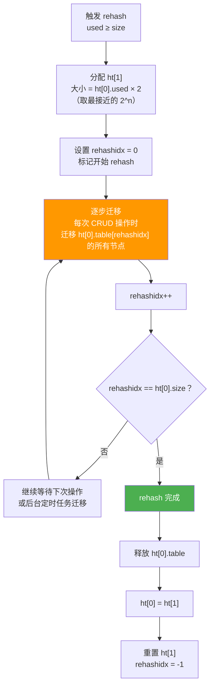

### 5.4 Rehash 期间的操作规则

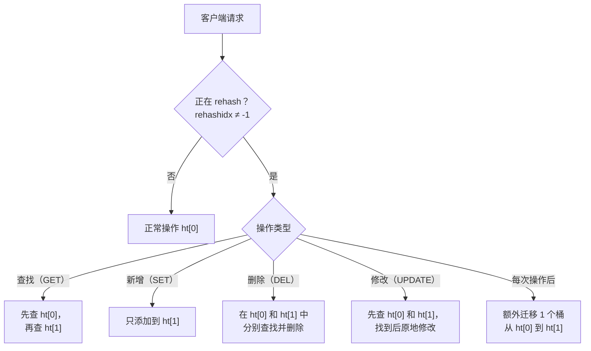

::: important Rehash 期间的关键规则
1. **查找**：先查 ht[0]，没找到再查 ht[1]（因为可能还没迁移过去）
2. **新增**：只添加到 ht[1]（确保新数据在目标表中）
3. **删除/修改**：在 ht[0] 和 ht[1] 中都查找
4. **每次操作**：顺带迁移 ht[0] 的 1 个桶到 ht[1]（`rehashidx` 位置）
5. **定时迁移**：服务器空闲时，定时函数也会批量迁移（每秒 1ms / 100 个桶）

这种设计确保 rehash 不会阻塞服务，每次请求最多多迁移一个桶的开销。
:::

### 5.5 Rehash 时序图

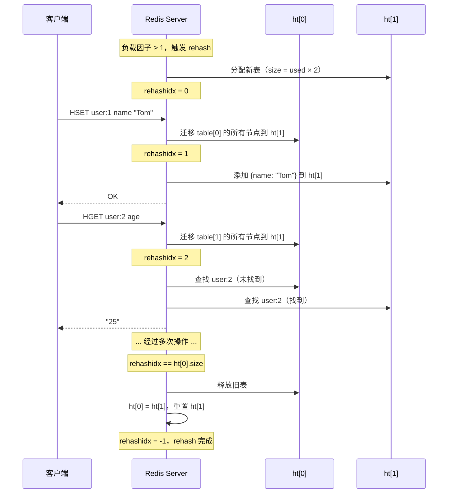

### 5.6 Rehash 的定时辅助

除了在每次 CRUD 操作时顺带迁移，Redis 的定时任务也会辅助迁移：

```c
// Redis 源码 server.c - databasesCron（简化）
void databasesCron(void) {
    // 对每个数据库的字典执行渐进式 rehash
    if (server.activerehashing) {
        for (int j = 0; j < dbs_per_call; j++) {
            // 每次尝试迁移 100 个桶
            // 限时 1ms
            redisDb *db = server.db + j;
            dictRehashMilliseconds(db->dict, 1);
        }
    }
}
```

```bash
# 控制定时 rehash 的配置
activerehashing yes    # 默认开启

# 关闭后 rehash 只在 CRUD 操作时进行
# 如果长时间没有操作，rehash 可能卡在中间状态
# 但可以减少对延迟敏感场景的影响
```

::: warning 关闭 activerehashing 的影响
如果关闭 `activerehashing`，rehash 只能在客户端请求时顺带推进。如果一段时间内没有请求访问正在 rehash 的哈希表，rehash 就会停滞。这会导致：
1. **双倍内存占用**：ht[0] 和 ht[1] 同时存在
2. **查找效率降低**：每次查找需要检查两个表

在内存紧张的环境中，可能需要主动触发一些读操作来推进 rehash。
:::

### 5.7 Rehash 的扩容大小

```c
// Redis 源码 dict.c - dictExpand（简化）
int dictExpand(dict *d, unsigned long size) {
    // ★ 扩容大小取 ≥ size 的最小 2^n
    unsigned long realsize = dictNextPower(size);

    // 不能缩容，也不能与当前大小相同
    if (dictIsRehashing(d) || d->ht[0].used > size)
        return DICT_ERR;

    dictht n;
    n.size = realsize;
    n.sizemask = realsize - 1;
    n.table = zcalloc(realsize * sizeof(dictEntry*));
    n.used = 0;

    // 如果是首次初始化
    if (d->ht[0].table == NULL) {
        d->ht[0] = n;
        return DICT_OK;
    }

    // 否则赋值给 ht[1]，开始 rehash
    d->ht[1] = n;
    d->rehashidx = 0;
    return DICT_OK;
}

static unsigned long dictNextPower(unsigned long size) {
    unsigned long i = DICT_HT_INITIAL_SIZE;  // 4
    if (size >= LONG_MAX) return LONG_MAX;
    while (1) {
        if (i >= size) return i;
        i *= 2;
    }
}
```

| 当前 used | 扩容目标 size | 实际分配 realsize |
|-----------|--------------|-------------------|
| 3 | 6 | 8 |
| 7 | 14 | 16 |
| 100 | 200 | 256 |
| 500 | 1000 | 1024 |
| 1000 | 2000 | 2048 |

## 六、常用命令详解

### 6.1 设置与获取

```bash
# HSET：设置单个字段（Redis 4.0+ 支持 multi-field）
HSET user:1001 name "张三"
HSET user:1001 name "张三" age 25 role "admin"   # 多字段

# HGET：获取单个字段
HGET user:1001 name          # "张三"

# HMSET：批量设置（Redis 4.0+ 已废弃，用 HSET 替代）
HMSET user:1001 name "张三" age 25

# HMGET：批量获取
HMGET user:1001 name age role
# 1) "张三"
# 2) "25"
# 3) "admin"

# HSETNX：仅当字段不存在时设置
HSETNX user:1001 email "new@example.com"   # 1（设置成功）
HSETNX user:1001 name "李四"               # 0（字段已存在，未修改）
```

### 6.2 删除与修改

```bash
# HDEL：删除一个或多个字段
HDEL user:1001 email
HDEL user:1001 age role

# HINCRBY：字段值增加指定整数
HINCRBY user:1001 age 1       # age + 1

# HINCRBYFLOAT：字段值增加指定浮点数
HINCRBYFLOAT product:1001 price 0.5
```

### 6.3 查询命令

```bash
# HEXISTS：检查字段是否存在
HEXISTS user:1001 name       # 1（存在）
HEXISTS user:1001 phone      # 0（不存在）

# HLEN：获取字段数量
HLEN user:1001               # 3

# HKEYS：获取所有字段名
HKEYS user:1001              # ["name", "age", "role"]

# HVALS：获取所有字段值
HVALS user:1001              # ["张三", "25", "admin"]

# HGETALL：获取所有字段和值
HGETALL user:1001
# 1) "name"
# 2) "张三"
# 3) "age"
# 4) "25"
# 5) "role"
# 6) "admin"
```

::: warning HGETALL 的大 Key 风险
`HGETALL` 返回 Hash 的所有字段和值，如果 Hash 有大量字段，会：
1. 阻塞 Redis（O(N) 时间复杂度）
2. 占用大量网络带宽
3. 客户端内存暴涨

对于大 Hash（字段 > 1000），建议使用 `HSCAN` 分批获取：

```bash
# 使用 HSCAN 分批获取
HSCAN user:1001 0 COUNT 100
```
:::

### 6.4 迭代与扫描

```bash
# HSCAN：增量迭代（不阻塞，适合大 Hash）
HSCAN user:1001 0                    # 从游标0开始
HSCAN user:1001 0 MATCH name*        # 只匹配 name 开头的字段
HSCAN user:1001 0 COUNT 10           # 每次返回约 10 个字段

# 返回格式：[next_cursor, [field1, val1, field2, val2, ...]]
# next_cursor = 0 表示迭代结束
```

```csharp
// C# 使用 HSCAN 遍历大 Hash
public async IAsyncEnumerable<KeyValuePair<string, string>> ScanAllFieldsAsync(string key)
{
    var db = _redis.GetDatabase();
    var cursor = 0L;

    do
    {
        var entries = await db.HashScanAsync(key, "*", 100, cursor);
        cursor = entries.Cursor;

        foreach (var entry in entries)
        {
            yield return new KeyValuePair<string, string>(entry.Name, entry.Value);
        }
    } while (cursor != 0);
}
```

### 6.5 Redis 7.4+ 新增命令

```bash
# HGETDEL：获取字段值并删除（Redis 7.4+）
HGETDEL user:1001 FIELDS 2 name age

# HGETEX：获取字段值并设置过期时间（Redis 7.4+）
HGETEX user:1001 EX 60 FIELDS 1 name

# HSETEX：设置字段值并设置过期时间（Redis 7.4+）
HSETEX user:1001 EX 60 FIELDS 1 temp_token "abc123"
```

## 七、应用场景

### 7.1 对象存储

Hash 最自然的应用——存储结构化对象：

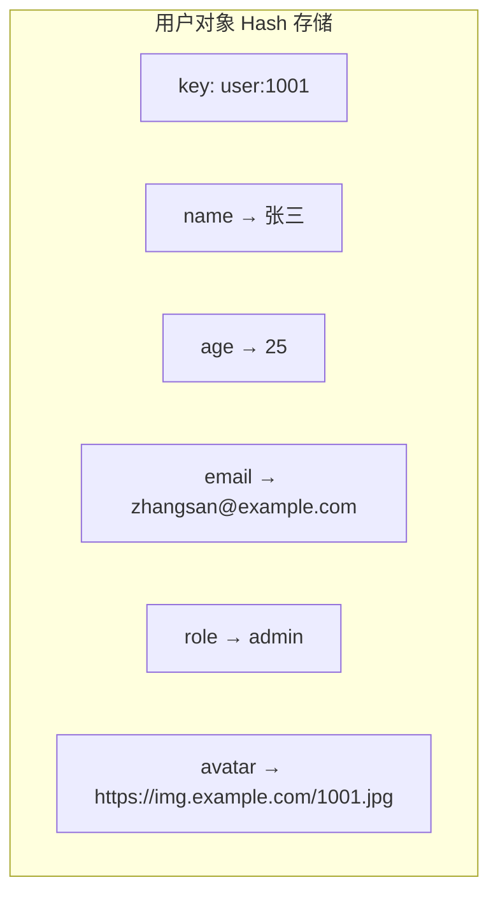

```csharp
// C# 对象存储实现
public class UserRepository
{
    private readonly IDatabase _db;

    public async Task SaveAsync(User user)
    {
        var key = $"user:{user.Id}";
        var entries = new List<HashEntry>
        {
            new("name", user.Name),
            new("age", user.Age),
            new("email", user.Email),
            new("role", user.Role),
            new("updated_at", DateTimeOffset.UtcNow.ToUnixTimeSeconds())
        };
        await _db.HashSetAsync(key, entries.ToArray());
    }

    public async Task<User?> GetAsync(int userId)
    {
        var key = $"user:{userId}";
        var entries = await _db.HashGetAllAsync(key);

        if (entries.Length == 0) return null;

        return new User
        {
            Id = userId,
            Name = entries.FirstOrDefault(e => e.Name == "name").Value,
            Age = (int)entries.FirstOrDefault(e => e.Name == "age").Value,
            Email = entries.FirstOrDefault(e => e.Name == "email").Value,
            Role = entries.FirstOrDefault(e => e.Name == "role").Value
        };
    }

    // 只更新单个字段——比 String+JSON 高效得多
    public async Task UpdateFieldAsync(int userId, string field, string value)
    {
        await _db.HashSetAsync($"user:{userId}", field, value);
    }

    // 原子递增
    public async Task IncrementAgeAsync(int userId)
    {
        await _db.HashIncrementAsync($"user:{userId}", "age");
    }
}
```

### 7.2 购物车

Hash 非常适合实现购物车：key = 用户ID，field = 商品ID，value = 数量

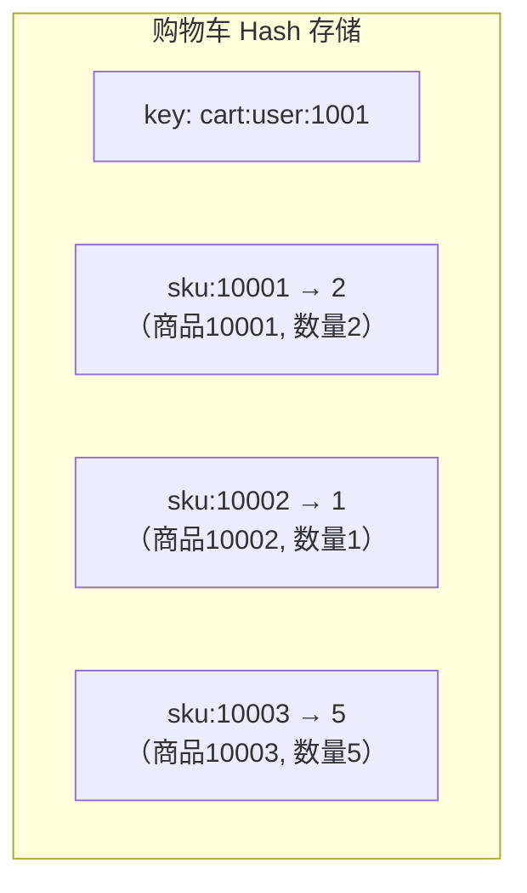

```csharp
// C# 购物车实现
public class CartService
{
    private readonly IDatabase _db;

    // 添加商品到购物车
    public async Task AddItemAsync(int userId, string sku, int quantity)
    {
        var key = $"cart:user:{userId}";
        await _db.HashIncrementAsync(key, sku, quantity);
    }

    // 减少商品数量
    public async Task RemoveItemAsync(int userId, string sku, int quantity)
    {
        var key = $"cart:user:{userId}";
        var current = await _db.HashGetAsync(key, sku);

        if (!current.HasValue) return;

        var newQty = (int)current - quantity;
        if (newQty <= 0)
        {
            await _db.HashDeleteAsync(key, sku);
        }
        else
        {
            await _db.HashSetAsync(key, sku, newQty);
        }
    }

    // 获取购物车所有商品
    public async Task<Dictionary<string, int>> GetAllItemsAsync(int userId)
    {
        var key = $"cart:user:{userId}";
        var entries = await _db.HashGetAllAsync(key);

        return entries.ToDictionary(
            e => e.Name.ToString(),
            e => (int)e.Value);
    }

    // 获取购物车商品数量
    public async Task<long> GetItemCountAsync(int userId)
    {
        return await _db.HashLengthAsync($"cart:user:{userId}");
    }

    // 清空购物车
    public async Task ClearAsync(int userId)
    {
        await _db.KeyDeleteAsync($"cart:user:{userId}");
    }
}
```

### 7.3 计数器组

用 Hash 为每个实体维护一组相关的计数器：

```bash
# 文章统计
HSET article:1001 views 0 likes 0 comments 0 shares 0

# 原子递增
HINCRBY article:1001 views 1      # 阅读量 +1
HINCRBY article:1001 likes 1      # 点赞数 +1
HINCRBY article:1001 comments 1   # 评论数 +1

# 获取所有统计
HGETALL article:1001
# views: 1523, likes: 89, comments: 23, shares: 12
```

### 7.4 限时活动数据

```bash
# 秒杀活动的用户购买记录
# field = 用户ID, value = 购买数量
HSET seckill:product:1001 user:1001 1
HSET seckill:product:1001 user:1002 2

# 检查用户是否已购买
HEXISTS seckill:product:1001 user:1001    # 1（已购买）

# 统计已购买人数
HLEN seckill:product:1001                  # 2

# 限制每人只能购买一次
HSETNX seckill:product:1001 user:1003 1    # 1（首次购买成功）
HSETNX seckill:product:1001 user:1001 1    # 0（已购买，拒绝）
```

### 7.5 配置中心

```bash
# 应用配置
HMSET config:app:production \
    db_host "10.0.0.1" \
    db_port "3306" \
    cache_ttl "3600" \
    max_connections "1000"

# 读取单个配置
HGET config:app:production db_host

# 更新配置（实时生效）
HSET config:app:production cache_ttl "7200"

# 多环境配置
HMSET config:app:staging ...
HMSET config:app:development ...
```

## 八、性能优化

### 8.1 调整 ziplist 阈值

```bash
# 根据业务场景调整阈值
# 如果 Hash 字段较少且值较短，可以适当增大阈值

# 增大阈值 → 更多 Hash 使用 ziplist → 省内存
hash-max-ziplist-entries 1024   # 默认 512，改为 1024
hash-max-ziplist-value 128      # 默认 64，改为 128

# 注意：阈值过大时，ziplist 的 O(N) 查找可能成为瓶颈
# 如果大部分操作是 HGET/HSET，字段数 < 500 可以放心调大
```

### 8.2 避免 HGETALL 大 Hash

```bash
# 危险操作
HGETALL big:hash    # 如果有 10 万个字段，会阻塞 Redis 数秒

# 安全替代
# 方案1：使用 HSCAN
HSCAN big:hash 0 COUNT 100

# 方案2：只获取需要的字段
HMGET big:hash field1 field2 field3

# 方案3：拆分 Hash
# 原始：user:1001 的所有属性（1000+ 个字段）
# 拆分：user:1001:basic（name, age, role）
#       user:1001:profile（bio, avatar, ...）
#       user:1001:stats（views, likes, ...）
```

### 8.3 Rehash 对延迟的影响

```bash
# 监控 rehash 状态
# 使用 INFO 命令
INFO stats | grep expires

# 使用 redis-cli 的 --latency 检测延迟抖动
redis-cli --latency-history -i 1

# 优化建议
# 1. 开启 activerehashing（默认开启）
# 2. 避免在 BGSAVE 期间大量写入（会延迟 rehash）
# 3. 控制单个 Hash 的大小（字段 < 5000）
# 4. 使用 HLEN 监控 Hash 大小
```

### 8.4 Hash 内存估算

```bash
# ziplist 编码的内存估算
# 每个字段-值对约：2 × (1~5 + 1~5 + 数据长度) 字节
# 例如 {name: "Tom", age: "25"}：
# ziplist overhead: 11 字节（zlbytes + zltail + zllen + zlend）
# entry1 (name): 1 + 1 + 4 = 6 字节
# entry2 (Tom):  1 + 1 + 3 = 5 字节
# entry3 (age):  1 + 1 + 3 = 5 字节
# entry4 (25):   1 + 1 + 2 = 4 字节
# 总计：11 + 6 + 5 + 5 + 4 = 31 字节

# hashtable 编码的内存估算
# 每个 dictEntry: 约 72 字节（key SDS + value SDS + dictEntry + 指针）
# 桶数组: size × 8 字节
# 例如 2 个字段的 hashtable：
# 2 × 72 + 8 × 8 = 144 + 64 = 208 字节
```

::: tip 何时从 ziplist 获益最大
- 字段数 < 100
- 值长度 < 50 字节
- 访问模式以整体读写为主（HGETALL/HMSET）

在上述条件下，ziplist 比 hashtable 节省 **60%~80%** 的内存。
:::

## 九、Rehash 对性能的影响分析

### 9.1 Rehash 期间的内存开销

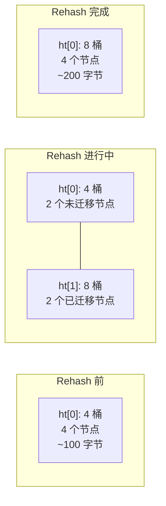

::: warning Rehash 的内存峰值
Rehash 期间，ht[0] 和 ht[1] 同时存在，内存占用约为正常状态的 **1.5~2 倍**。对于大型 Hash（百万级字段），这意味着：
- 峰值内存可能多出几百 MB
- 在内存紧张的环境中可能触发 OOM

缓解措施：
1. 控制单个 Hash 的大小
2. 在内存使用率 < 70% 的环境中运行
3. 监控 `used_memory` 的变化趋势
:::

### 9.2 Rehash 对请求延迟的影响

```bash
# 每次 CRUD 操作时，额外迁移一个桶
# 单个桶迁移时间 = 桶内节点数 × 哈希计算 + 插入时间
# 通常 < 1 微秒（单个桶节点很少）

# 极端情况：一个桶有大量节点（哈希冲突严重）
# 迁移时间可能 > 1 毫秒

# 监控命令延迟
redis-cli --latency
```

### 9.3 缩容 Rehash

```c
// Redis 源码 dict.c - dictResize（简化）
int dictResize(dict *d) {
    if (!dict_can_resize || dictIsRehashing(d))
        return DICT_ERR;

    unsigned long minimal = d->ht[0].used;
    if (minimal < DICT_HT_INITIAL_SIZE)
        minimal = DICT_HT_INITIAL_SIZE;

    return dictExpand(d, minimal);
    // 注意：dictExpand 会取 >= minimal 的最小 2^n
    // 如果 used = 3，则 minimal = 4，realsize = 4
    // 从 size = 8 缩容到 size = 4
}
```

缩容触发条件：
1. BGSAVE/BGREWRITEAOF 执行完毕后
2. 负载因子 < 0.1（`used / size < 0.1`）

```bash
# 演示缩容
HSET test a 1 b 2 c 3 d 4 e 5 f 6 g 7 h 8
HLEN test            # 8
OBJECT ENCODING test  # "ziplist"（8个字段在阈值内）

# 如果之前有很多字段（hashtable 编码），删除大部分后
# used / size < 0.1 时触发缩容
DEL test
HMSET test a 1 b 2
# 缩容后 hashtable 的 size 可能从 512 降到 4
```

## 十、ziplist 与 hashtable 的对比总结

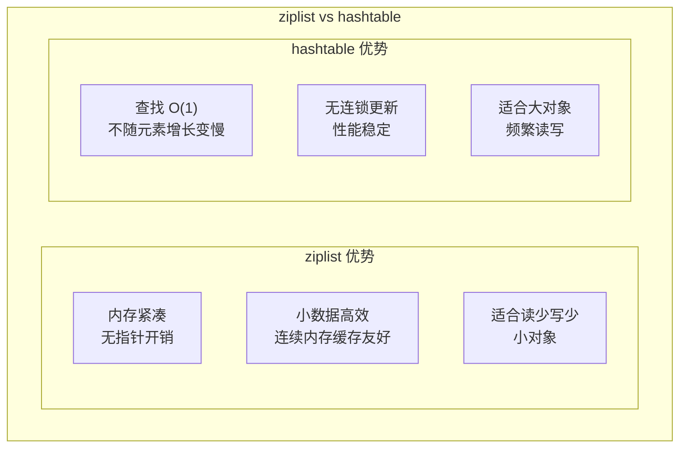

| 维度 | ziplist | hashtable |
|------|---------|-----------|
| **内存** | 紧凑，省 60%~80% | 每个节点 ~72 字节开销 |
| **查找** | O(N) | O(1) |
| **插入** | O(N)（可能触发 realloc） | O(1) |
| **删除** | O(N)（可能触发连锁更新） | O(1) |
| **适用规模** | 字段 < 512，值 < 64B | 无限制 |
| **缓存友好** | 连续内存，缓存行命中率高 | 指针跳转，缓存行命中率低 |
| **稳定性** | 连锁更新风险（理论） | 渐进式 rehash，稳定 |

## 十一、常见问题与陷阱

### 11.1 Hash 字段不能单独设过期

```bash
# 错误：Hash 字段不支持过期
EXPIRE user:1001:name 60    # ERR wrong number of arguments

# 替代方案1：使用 String 代替
SET user:1001:name "张三" EX 60

# 替代方案2：定期清理
# 在应用层维护过期逻辑
HSET user:1001 name "张三" name_expire 1700000000
# 读取时检查 name_expire，过期则 HDEL name
```

### 11.2 HINCRBY 只支持整数

```bash
HSET product:1001 price "19.99"
HINCRBY product:1001 price 1
# ERR hash value is not an integer

# 使用 HINCRBYFLOAT
HINCRBYFLOAT product:1001 price 0.01   # 20.00
```

### 11.3 HGETALL 返回顺序不确定

```bash
# ziplist 编码：按插入顺序返回
# hashtable 编码：无序（哈希值决定位置）

HSET test z 1 a 2 m 3
HGETALL test    # 顺序可能是 a, m, z 或 m, z, a 等

# 如果需要排序，在应用层处理
```

### 11.4 大 Hash 的 SCAN 可能重复

```bash
# HSCAN 不保证不重复
# 特别是 rehash 期间，可能返回重复的 field

# 应用层需要去重
HSCAN big:hash 0 COUNT 100
# 可能返回重复的 field，需要用 HashSet 去重
```

## 十二、源码解读

### 12.1 HSET 命令的完整执行流程

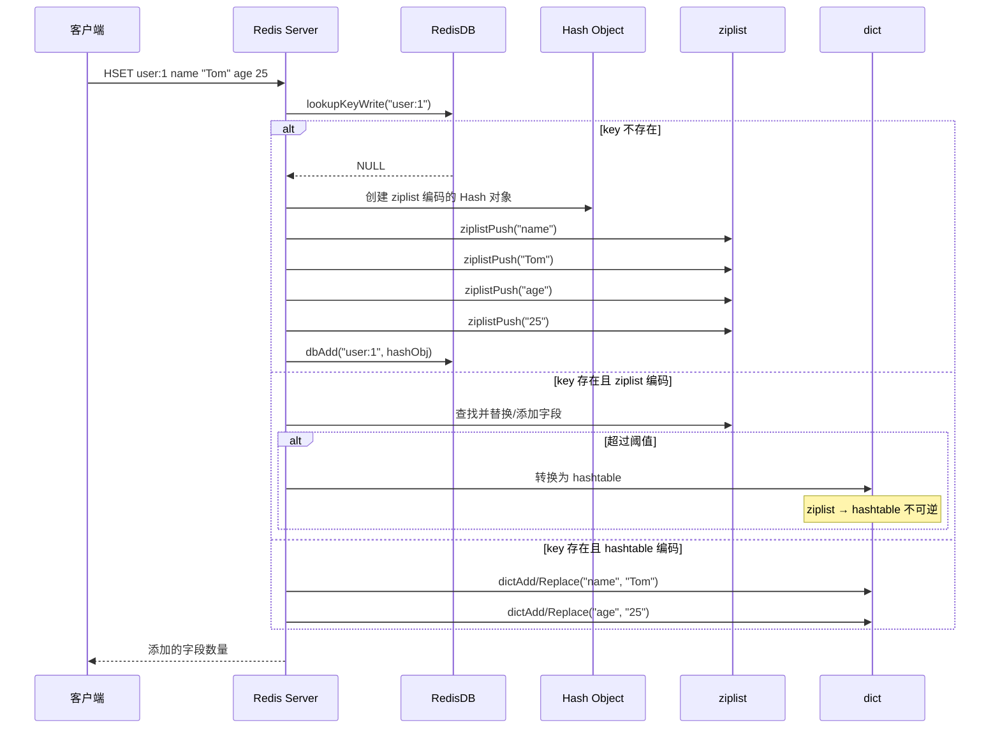

### 12.2 编码转换源码

```c
// Redis 源码 t_hash.c - hashTypeConvert
robj *hashTypeConvert(robj *o, int enc) {
    if (o->encoding == OBJ_ENCODING_ZIPLIST) {
        if (enc == OBJ_ENCODING_HT) {
            // ziplist → hashtable
            dict *dict = dictCreate(&hashDictType, NULL);
            unsigned char *zl = o->ptr;
            unsigned char *fptr, *vptr;

            fptr = ziplistIndex(zl, 0);
            while (fptr != NULL) {
                // 获取字段名
                sds field = ziplistGetObject(fptr);
                // 获取字段值
                vptr = ziplistNext(zl, fptr);
                sds value = ziplistGetObject(vptr);

                // 添加到字典
                dictAdd(dict, field, value);

                // 移动到下一个字段
                fptr = ziplistNext(zl, vptr);
            }

            zfree(zl);
            o->encoding = OBJ_ENCODING_HT;
            o->ptr = dict;
        }
    }
    return o;
}
```

### 12.3 渐进式 Rehash 核心代码

```c
// Redis 源码 dict.c - dictRehash（简化）
int dictRehash(dict *d, int n) {
    // n = 每次迁移的桶数
    int empty_visits = n * 10;  // 最多跳过的空桶数

    if (!dictIsRehashing(d)) return 0;

    while (n-- && d->ht[0].used != 0) {
        dictEntry *de, *nextde;

        // 跳过空桶
        while (d->ht[0].table[d->rehashidx] == NULL) {
            d->rehashidx++;
            if (--empty_visits == 0) return 1;  // 空桶太多，暂停
        }

        de = d->ht[0].table[d->rehashidx];

        // 迁移该桶的所有节点
        while (de) {
            uint64_t h;
            nextde = de->next;

            // 计算新哈希表中的位置
            h = dictHashKey(d, de->key) & d->ht[1].sizemask;
            de->next = d->ht[1].table[h];
            d->ht[1].table[h] = de;  // 头插法

            d->ht[0].used--;
            d->ht[1].used++;
            de = nextde;
        }

        d->ht[0].table[d->rehashidx] = NULL;
        d->rehashidx++;
    }

    // 检查是否迁移完成
    if (d->ht[0].used == 0) {
        zfree(d->ht[0].table);
        d->ht[0] = d->ht[1];
        _dictReset(&d->ht[1]);
        d->rehashidx = -1;
        return 0;  // rehash 完成
    }

    return 1;  // rehash 未完成
}
```

## 十三、总结

### 13.1 核心知识图谱

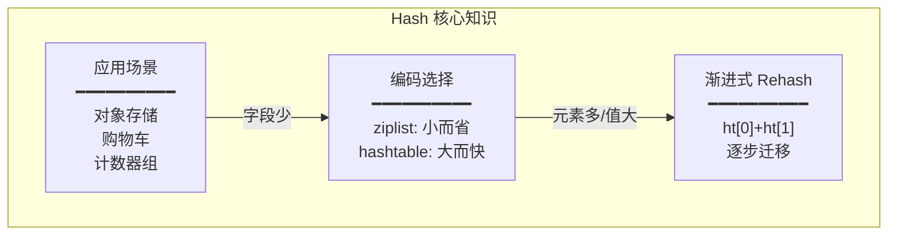

### 13.2 核心要点回顾

| 维度 | 要点 |
|------|------|
| **ziplist** | 紧凑连续内存，省 60%~80%，但查找 O(N)，有连锁更新风险 |
| **hashtable** | 查找 O(1)，每个节点 ~72 字节开销，支持渐进式 rehash |
| **转换条件** | 元素 > 512 或 值 > 64B → hashtable（不可逆） |
| **渐进式 rehash** | ht[0]→ht[1] 逐步迁移，查找查两表，新增只写 ht[1] |
| **rehash 触发** | 负载因子 ≥ 1 扩容，< 0.1 缩容，BGSAVE 期间禁止普通扩容 |
| **最佳实践** | 控制字段数、避免 HGETALL 大 Hash、调整 ziplist 阈值 |

### 13.3 参考资料

- [Redis 官方文档 - Hash Commands](https://redis.io/commands/?group=hash)
- 《Redis 设计与实现》第 2 部分 第 4、7、8 章 —— 黄健宏
- 《Redis 深度历险》第 2 章 —— 钱文品
- 《Redis 开发与运维》第 3 章 —— 付磊、张益军
- [Redis 源码 dict.h / dict.c / t_hash.c / ziplist.c](https://github.com/redis/redis)
