# List 与快速列表

> List 是 Redis 中最古老的列表数据类型，从最初的 linkedlist + ziplist 双编码方案，到 Redis 3.2 引入的 quicklist，再到 Redis 7.0 用 listpack 彻底替换 ziplist——List 的底层实现经历了一次又一次的进化，每一次都是为了在内存和性能之间找到更优的平衡点。

::: tip 核心要点
- List 的编码经历了 ziplist → linkedlist → quicklist → listpack 的演进
- quicklist 是双向链表 + ziplist/listpack 的混合体，兼顾内存和性能
- Redis 7.0 用 listpack 替代 ziplist，彻底消除了连锁更新问题
- 阻塞操作（BLPOP/BRPOP）是 List 作为消息队列的关键能力
:::

## 一、List 类型概述

### 1.1 什么是 List

Redis List 是一个**有序的字符串列表**，按插入顺序排序，支持从两端推入和弹出元素：

```bash
# 从右侧推入元素
RPUSH fruits "apple" "banana" "cherry"

# 从左侧弹出元素
LPOP fruits           # "apple"

# 获取列表长度
LLEN fruits           # 2

# 获取指定范围的元素
LRANGE fruits 0 -1    # ["banana", "cherry"]
```

### 1.2 List 的特性

| 特性 | 说明 |
|------|------|
| 有序 | 元素按插入顺序排列，支持索引访问 |
| 可重复 | 同一元素可以出现多次 |
| 双端操作 | LPUSH/RPUSH/LPOP/RPOP 都是 O(1) |
| 最大长度 | 2^32 - 1（约 42.9 亿个元素） |

### 1.3 List 的数据结构演进

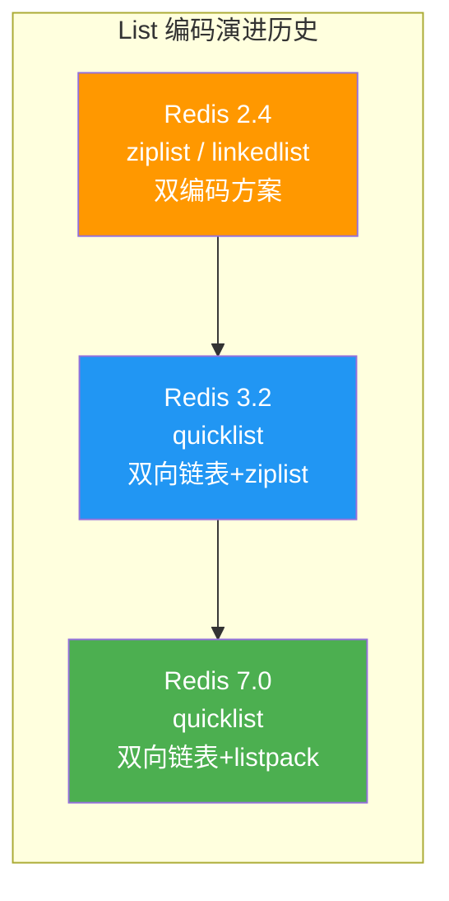

| 版本 | 编码方案 | 问题 |
|------|---------|------|
| Redis 2.4 | ziplist（小列表）/ linkedlist（大列表） | linkedlist 内存开销大，ziplist 有连锁更新 |
| Redis 3.2 | quicklist（默认） | 兼顾内存和性能，但内部仍用 ziplist |
| Redis 7.0 | quicklist + listpack | 消除连锁更新，更安全更高效 |

## 二、ziplist 编码（Redis 2.4 时代）

### 2.1 早期双编码方案

在 Redis 3.2 之前，List 有两种编码：

```bash
# redis.conf 配置
list-max-ziplist-entries 512    # 元素数量 ≤ 512 时使用 ziplist
list-max-ziplist-value 64       # 所有值都 ≤ 64 字节时使用 ziplist
```

- **ziplist**：元素少且值小时使用，节省内存
- **linkedlist**：元素多或值大时使用，性能稳定

### 2.2 ziplist 的局限

ziplist 虽然省内存，但存在两个致命问题：

1. **连锁更新**：中间插入大元素可能触发连续的内存重分配（O(N²) 最坏情况）
2. **O(N) 操作**：在 ziplist 中间插入/删除需要移动后续所有数据

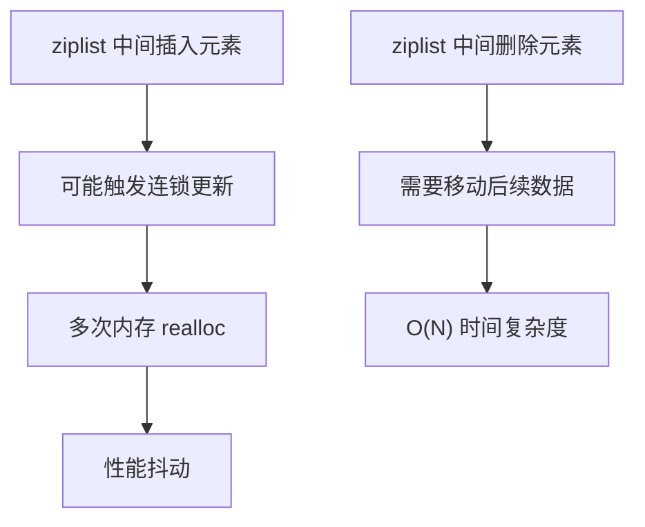

## 三、linkedlist 编码（Redis 2.4 时代）

### 3.1 双向链表结构

```c
// Redis 源码 adlist.h
typedef struct listNode {
    struct listNode *prev;   // 前驱节点
    struct listNode *next;   // 后继节点
    void *value;             // 值
} listNode;

typedef struct list {
    listNode *head;          // 头节点
    listNode *tail;          // 尾节点
    unsigned long len;       // 长度
    void *(*dup)(void *ptr); // 复制函数
    void (*free)(void *ptr); // 释放函数
    int (*match)(void *ptr, void *key); // 比较函数
} list;
```

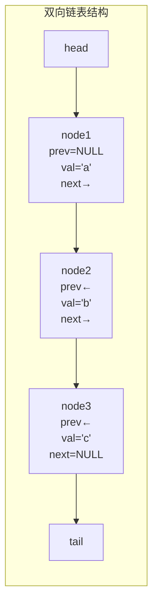

### 3.2 linkedlist 的内存开销

每个节点的内存开销：

| 字段 | 32 位系统 | 64 位系统 |
|------|----------|----------|
| prev 指针 | 4 字节 | 8 字节 |
| next 指针 | 4 字节 | 8 字节 |
| value 指针 | 4 字节 | 8 字节 |
| **节点合计** | **12 字节** | **24 字节** |
| SDS 开销 | 3~17 字节 | 3~17 字节 |
| **总计每节点** | **15~29 字节** | **27~41 字节** |

::: warning linkedlist 的内存浪费
对于一个只存储短字符串（如 3 字节的 "abc"）的链表：
- 64 位系统每节点约 27~41 字节
- 实际数据只有 3 字节
- **内存利用率不到 10%**

而 ziplist 存同样的数据只需要约 5 字节/元素。这就是 Redis 引入 quicklist 的根本动机——**在内存和性能之间找到平衡**。
:::

## 四、quicklist —— 快速列表

### 4.1 设计思想

quicklist 的核心思想是**分片**：将一个长列表拆分为多个短 ziplist，用双向链表串起来。

- 每个 ziplist 节点称为一个 **quicklistNode**
- 每个 quicklistNode 内部是一个 ziplist（或 listpack）
- 多个 quicklistNode 通过 prev/next 指针组成双向链表

**类比**：就像一本书分为多个章节，每个章节是一个 ziplist，书脊是双向链表。

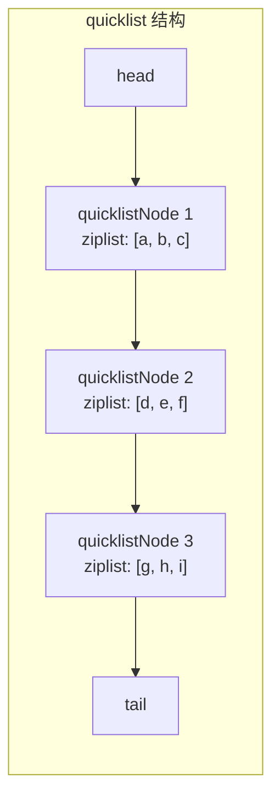

### 4.2 quicklist 数据结构

```c
// Redis 源码 quicklist.h
typedef struct quicklistNode {
    struct quicklistNode *prev;     // 前驱节点
    struct quicklistNode *next;     // 后继节点
    unsigned char *entry;           // 指向 ziplist/listpack
    size_t size;                    // ziplist/listpack 的字节大小
    unsigned int count : 16;        // ziplist/listpack 中的元素数量
    unsigned int encoding : 2;      // 编码方式：1=ziplist, 2=listpack
    unsigned int container : 2;     // 容器类型：1=ziplist, 2=listpack
    unsigned int recompress : 1;    // 是否需要重新压缩
    unsigned int attempted_compress : 1;  // 尝试压缩但失败
    unsigned int extra : 10;        // 预留字段
} quicklistNode;

typedef struct quicklist {
    quicklistNode *head;            // 头节点
    quicklistNode *tail;            // 尾节点
    unsigned long count;            // 所有元素总数
    unsigned long len;              // quicklistNode 数量
    int fill : QL_FILL_BITS;        // 每个节点的最大大小（-1 ~ -5 或正数）
    unsigned int compress : QL_COMP_BITS;  // 压缩深度（0=不压缩）
    unsigned int bookmark_count : QL_BM_BITS;
    quicklistBookmark bookmarks[];  // 书签（用于快速定位）
} quicklist;
```

### 4.3 quicklist 详细结构图

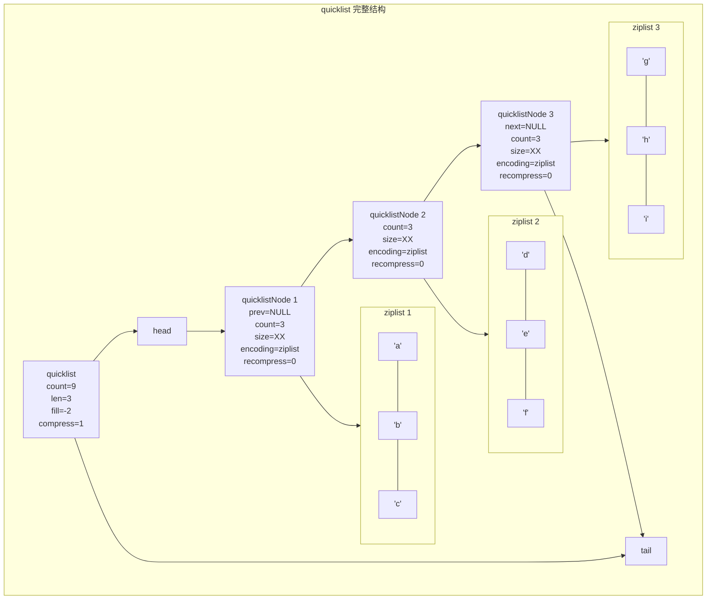

### 4.4 quicklistNode 的大小控制

`fill` 字段控制每个 quicklistNode 中 ziplist/listpack 的大小：

```bash
# redis.conf 配置
list-max-ziplist-size -2    # 默认值
```

| fill 值 | 含义 | 每节点 ziplist 大小 |
|---------|------|-------------------|
| -1 | 4KB | 约 4096 字节 |
| -2 | 8KB | 约 8192 字节（**默认**） |
| -3 | 16KB | 约 16384 字节 |
| -4 | 32KB | 约 32768 字节 |
| -5 | 64KB | 约 65536 字节 |
| 正数 | 每节点最大元素数 | 如 fill=512 表示每节点最多 512 个元素 |

::: important fill 值的选择
- **-2（默认，8KB）**：通用选择，在内存和性能之间取得平衡
- **-1（4KB）**：追求更低的延迟，每节点更小，操作更快
- **-3 ~ -5**：追求更低的内存，每节点更大，但单个操作可能更慢
- **正数**：直接限制元素数量，不常用

实际上，-2 是经过大量测试得出的最优值：
- 8KB 的 ziplist 可以放入 L1 缓存（通常 32~64KB）
- 不会因为 ziplist 过大导致连锁更新问题严重
- 单节点操作（PUSH/POP）的延迟在微秒级
:::

### 4.5 quicklist 的 LZF 压缩

quicklist 支持对中间节点进行 LZF 压缩，节省内存：

```bash
# redis.conf 配置
list-compress-depth 0    # 默认不压缩
```

| compress 值 | 含义 |
|-------------|------|
| 0 | 不压缩任何节点 |
| 1 | 首尾各 1 个节点不压缩，其余压缩 |
| 2 | 首尾各 2 个节点不压缩，其余压缩 |
| ... | 以此类推 |

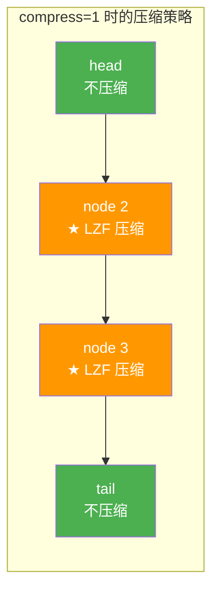

::: tip 为什么只压缩中间节点？
List 的典型访问模式是**两头热、中间冷**：
- 消息队列：总是从一端推入，另一端弹出
- 最新列表：总是读取头部元素
- 栈/队列：只操作首尾

因此，首尾的节点经常被访问，保持不压缩可以避免频繁的解压/重压。中间的节点很少被访问，压缩它们可以节省大量内存，而不会影响常见操作的性能。
:::

### 4.6 LZF 压缩/解压流程

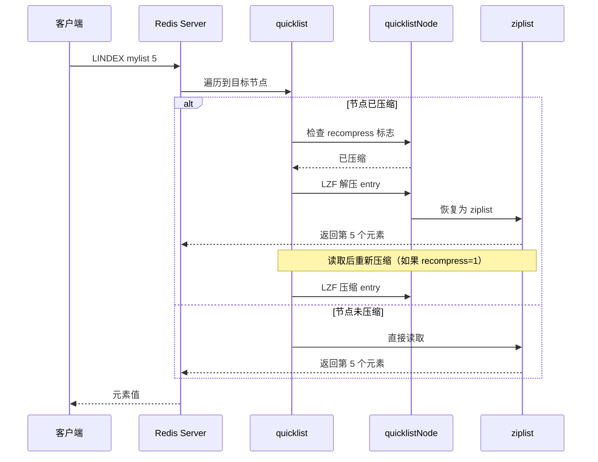

```c
// Redis 源码 quicklist.c - quicklistDecompressNodeIfNeeded（简化）
void quicklistDecompressNodeIfNeeded(quicklistNode *node) {
    if (node->encoding == QUICKLIST_NODE_ENCODING_LZF) {
        // 解压
        size_t uncompressed_size = node->size;
        unsigned char *decompressed = zmalloc(uncompressed_size);
        
        if (lzf_decompress(node->entry, node->size,
                           decompressed, uncompressed_size) == 0) {
            zfree(decompressed);
            return;  // 解压失败
        }
        
        zfree(node->entry);
        node->entry = decompressed;
        node->encoding = QUICKLIST_NODE_ENCODING_RAW;
        node->recompress = 1;  // 标记需要重新压缩
    }
}

// 操作完成后重新压缩
void quicklistRecompressOnly(quicklistNode *node) {
    if (node->recompress) {
        quicklistCompressNode(node);
        node->recompress = 0;
    }
}
```

### 4.7 quicklist 的插入操作

quicklist 的插入比单纯的 ziplist 或 linkedlist 复杂得多，需要考虑多种情况：

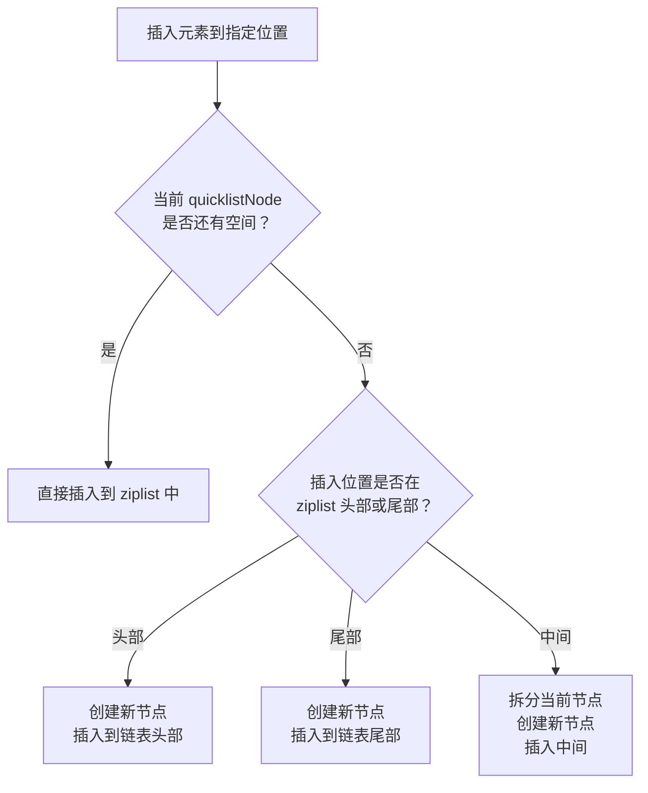

```c
// Redis 源码 quicklist.c - quicklistInsertEntry（简化逻辑）
REDIS_STATIC int quicklistInsertEntry(quicklist *quicklist,
                                       quicklistEntry *entry,
                                       sds value, int after) {
    int full = 0, at_tail = 0, at_head = 0;
    quicklistNode *node = entry->node;

    // 检查当前节点是否已满
    if (quicklistNodeSizeExceedsLimit(node)) full = 1;
    if (entry->offset == node->count - 1) at_tail = 1;
    if (entry->offset == 0) at_head = 1;

    if (!full) {
        // 节点未满，直接在 ziplist 中插入
        quicklistInsertNodeEntry(node, entry, value, after);
    } else if (after && at_tail) {
        // 在节点尾部插入且节点已满，创建新节点
        quicklistCreateNode(new_node, value);
        quicklistInsertNodeAfter(quicklist, node, new_node);
    } else if (!after && at_head) {
        // 在节点头部插入且节点已满，创建新节点
        quicklistCreateNode(new_node, value);
        quicklistInsertNodeBefore(quicklist, node, new_node);
    } else {
        // 在节点中间插入且节点已满，需要拆分
        // 将当前节点拆为两个，中间插入新节点
        quicklistSplitNode(node, entry->offset, &left, &right);
        quicklistCreateNode(new_node, value);
        // 重新连接
        quicklistInsertNodeBetween(quicklist, left, new_node, right);
    }
}
```

::: important 中间插入的代价
在 quicklistNode 的中间插入元素可能触发**节点拆分**：
1. 将当前 ziplist 从插入位置一分为二
2. 创建新的 quicklistNode 存放新元素
3. 重新连接三个节点

这个操作比较重，但比纯 ziplist 的中间插入（需要移动所有后续数据）要好得多，因为拆分只影响单个 ziplist 节点，不影响链表中的其他节点。
:::

## 五、listpack —— ziplist 的替代者

### 5.1 listpack 的诞生背景

ziplist 最大的问题是**连锁更新**，其根源是 `prevlen` 字段——每个 entry 需要记录前一个 entry 的长度，当插入/删除导致前驱长度变化时，可能引发连锁传播。

listpack 的核心改进：**不再存储前一个 entry 的长度**，改为存储**自身长度**，从而彻底消除连锁更新。

### 5.2 listpack 结构

```c
// Redis 源码 listpack.h
// listpack 结构：
// <tot-bytes> <num-elements> <entry> <entry> ... <entry> <end>

// 每个 entry 结构：
// <encoding-type> <element-data> <element-tot-len>

// tot-bytes:    uint32_t, 整个 listpack 的字节数
// num-elements: uint16_t, 元素数量
// entry:        变长, 每个元素
// end:          uint8_t, 0xFF, 结束标记
```

```mermaid
flowchart LR
    subgraph listpack结构["listpack 内存结构"]
        tot["tot-bytes<br/>4 bytes<br/>总字节数"] --- num["num-elements<br/>2 bytes<br/>元素数量"] --- e1["entry1<br/>encoding + data + len"] --- e2["entry2<br/>encoding + data + len"] --- e3["entry3<br/>encoding + data + len"] --- end["end<br/>1 byte<br/>0xFF"]
    end
```

### 5.3 listpack entry 详解

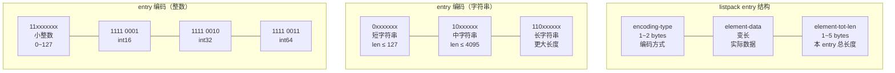

::: important listpack vs ziplist entry 对比
| 字段 | ziplist entry | listpack entry |
|------|--------------|----------------|
| 前驱长度 | prevlen（1/5 bytes） | 无 |
| 编码 | encoding（1/2/5 bytes） | encoding-type（1/2 bytes） |
| 数据 | data | element-data |
| 自身长度 | 无 | element-tot-len（1/5 bytes） |
| **连锁更新** | **有（prevlen 级联）** | **无（自身长度不影响邻居）** |

关键区别：ziplist 的 `prevlen` 记录**别人的**长度，修改会传播；listpack 的 `element-tot-len` 记录**自己的**长度，修改不会影响其他 entry。
:::

### 5.4 listpack 如何反向遍历

ziplist 通过 `prevlen` 实现反向遍历（从当前位置往前跳 `prevlen` 字节）。listpack 没有 `prevlen`，如何反向遍历？

```c
// listpack 反向遍历：从当前位置往前，解析 element-tot-len
// element-tot-len 编码规则：
// - 最后一字节的高 2 bit 表示 element-tot-len 占用的字节数
// - 00: 1 字节（entry 总长 ≤ 127）
// - 01: 2 字节（entry 总长 ≤ 4095）
// - 10: 3 字节
// - 11: 5 字节

// 反向遍历步骤：
// 1. 定位到 entry 的最后一个字节（element-tot-len 的最后一个字节）
// 2. 读取高 2 bit，确定 element-tot-len 的字节数
// 3. 读取完整的 element-tot-len 值
// 4. 指针前移 element-tot-len 字节，到达前一个 entry 的起始位置
```

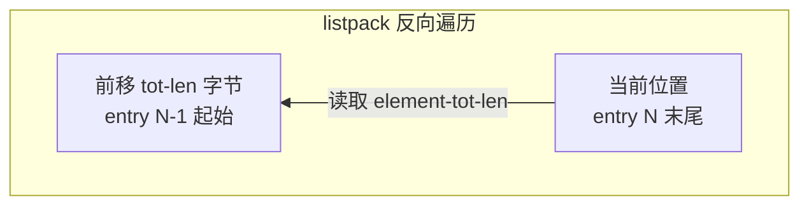

### 5.5 listpack 的优势


| 维度 | ziplist | listpack |
|------|---------|----------|
| 连锁更新 | 存在（prevlen 级联） | 不存在 |
| 反向遍历 | prevlen 直接跳转 | element-tot-len 解码 |
| 内存效率 | 略低（prevlen 开销） | 略高（无 prevlen，编码更紧凑） |
| 安全性 | 可能 O(N²) | O(N) 最坏 |
| 使用范围 | Redis 7.0 前广泛使用 | Redis 7.0+ 替代 ziplist |

### 5.6 Redis 7.0 中的全面替换

Redis 7.0 不仅在 List 中用 listpack 替换了 ziplist，还在以下数据结构中全面替换：

| 数据结构 | Redis 7.0 前 | Redis 7.0 |
|---------|-------------|-----------|
| List | quicklist(ziplist) | quicklist(listpack) |
| Hash | ziplist / hashtable | listpack / hashtable |
| ZSet | ziplist / skiplist | listpack / skiplist |
| Stream | ziplist | listpack |

## 六、编码选择与转换

### 6.1 Redis 3.2+ 的编码选择

```bash
# Redis 3.2+ List 只有一种编码：quicklist
# 不再有 ziplist/linkedlist 的选择
# quicklist 内部的 ziplist/listpack 大小由配置控制

# 配置参数
list-max-ziplist-size -2     # 控制每个节点的大小
list-compress-depth 0        # 控制压缩深度

# 查看编码
LPUSH mylist a b c
OBJECT ENCODING mylist       # "quicklist"
```

### 6.2 Redis 7.0+ 的编码

```bash
# Redis 7.0+ quicklist 内部使用 listpack
LPUSH mylist a b c
OBJECT ENCODING mylist       # "listpack"（Redis 7.2+ 可能显示 quicklist）
```

## 七、常用命令详解

### 7.1 推入与弹出

```bash
# === LPUSH：从左侧推入 ===
LPUSH mylist "c" "b" "a"     # 列表变为 [a, b, c]
# 注意：多个值按顺序推入，结果与输入顺序相反

# === RPUSH：从右侧推入 ===
RPUSH mylist "d" "e" "f"     # 列表变为 [a, b, c, d, e, f]

# === LPOP：从左侧弹出 ===
LPOP mylist                   # "a"

# === RPOP：从右侧弹出 ===
RPOP mylist                   # "f"

# === LPUSHX / RPUSHX：仅当列表存在时推入 ===
LPUSHX mylist "x"            # 列表存在则推入
LPUSHX nonexistent "y"       # 列表不存在，不操作
```

::: tip LPUSH 多值的顺序
```bash
LPUSH mylist "a" "b" "c"
# 等价于依次执行：
# LPUSH mylist "a"  → [a]
# LPUSH mylist "b"  → [b, a]
# LPUSH mylist "c"  → [c, b, a]

# 最终列表：[c, b, a]
# 所以 LPUSH 多值的结果是：列表头部 = 最后一个参数
```
:::

### 7.2 阻塞操作

阻塞操作是 List 作为消息队列的关键能力：

```bash
# BLPOP：阻塞式左侧弹出
BLPOP mylist 30              # 最多等待 30 秒
# 如果 mylist 为空，则阻塞等待
# 如果 mylist 非空，立即弹出并返回
# 超时返回 nil

# BRPOP：阻塞式右侧弹出
BRPOP mylist 30

# BLPOP 支持多个 key
BLPOP list1 list2 list3 30   # 依次检查，哪个有元素就从哪个弹出

# BLMPOP：阻塞式多键弹出（Redis 7.0+）
BLMPOP 30 2 list1 list2 LEFT COUNT 1
```

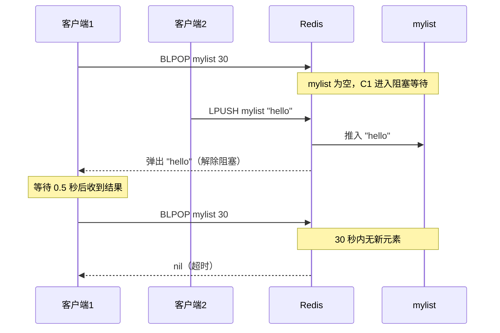

::: important 阻塞操作的注意事项
1. **多个客户端阻塞同一 key**：按先来先服务的顺序，先阻塞的客户端先获取元素
2. **BLPOP 最多阻塞 timeout 秒**：0 表示无限等待（不推荐）
3. **阻塞期间客户端处于等待状态**：不能执行其他命令
4. **多 key 优先级**：按 key 的顺序检查，前面的 key 优先

```bash
# 多 key 的优先级
BLPOP high:queue low:queue 30
# 优先检查 high:queue，有元素就弹出
# high:queue 为空才检查 low:queue
```
:::

### 7.3 查询命令

```bash
# LRANGE：获取指定范围的元素
LRANGE mylist 0 -1          # 获取所有元素
LRANGE mylist 0 4           # 获取前 5 个元素
LRANGE mylist -3 -1         # 获取最后 3 个元素

# LINDEX：获取指定索引的元素
LINDEX mylist 0             # 获取第一个元素
LINDEX mylist -1            # 获取最后一个元素
LINDEX mylist 100           # 索引超出范围返回 nil

# LLEN：获取列表长度
LLEN mylist                 # O(1)，quicklist 维护了 count 字段

# LPOS：查找元素位置（Redis 6.0.6+）
LPOS mylist "hello"                     # 返回第一个匹配的索引
LPOS mylist "hello" RANK 2              # 返回第 2 个匹配的索引
LPOS mylist "hello" MAXLEN 100          # 最多搜索 100 个元素
LPOS mylist "hello" COUNT 0             # 返回所有匹配的索引
```

::: warning LRANGE 的时间复杂度
`LRANGE` 的时间复杂度是 O(S+N)，S = 起始偏移量，N = 返回元素数。对于大列表，`LRANGE 0 -1` 可能非常慢。

```bash
# 危险操作
LRANGE big:list 0 -1        # 100 万个元素，会阻塞 Redis 数秒

# 安全替代：分批获取
LRANGE big:list 0 99
LRANGE big:list 100 199
# 或使用 SCAN 迭代
```
:::

### 7.4 修改命令

```bash
# LSET：设置指定索引的值
LSET mylist 0 "new value"   # 修改第一个元素

# LINSERT：在指定元素前后插入
LINSERT mylist BEFORE "b" "a1"   # 在 "b" 前插入 "a1"
LINSERT mylist AFTER "b" "c1"    # 在 "b" 后插入 "c1"

# LREM：删除指定值的元素
LREM mylist 2 "hello"      # 从头开始删除 2 个 "hello"
LREM mylist -1 "hello"     # 从尾开始删除 1 个 "hello"
LREM mylist 0 "hello"      # 删除所有 "hello"

# LTRIM：保留指定范围的元素
LTRIM mylist 0 99          # 只保留前 100 个元素
LTRIM mylist -100 -1       # 只保留最后 100 个元素
```

### 7.5 移动命令

```bash
# RPOPLPUSH：从源列表右侧弹出，推入目标列表左侧（已废弃）
RPOPLPUSH source dest

# LMPOP：从多个列表中弹出元素（Redis 7.0+）
LMPOP 2 list1 list2 LEFT COUNT 3   # 从 list1 或 list2 左侧弹出最多 3 个元素
```

### 7.6 Redis 6.2+ 新增命令

```bash
# LMOVE：从源列表弹出并推入目标列表
LMOVE source dest LEFT RIGHT    # source 左弹 → dest 右推
LMOVE source dest RIGHT LEFT    # source 右弹 → dest 左推

# BLMOVE：阻塞版 LMOVE
BLMOVE source dest LEFT RIGHT 30
```

## 八、应用场景

### 8.1 消息队列

List 天然适合实现简单的消息队列：

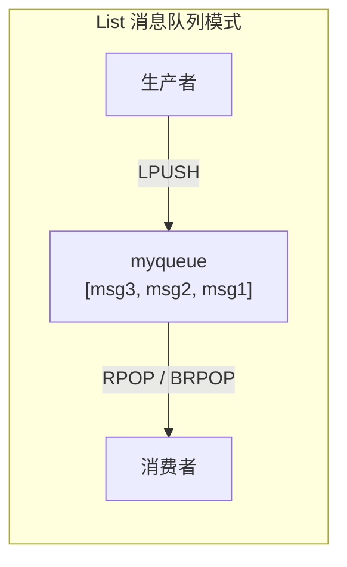

#### 模式1：点对点队列

```bash
# 生产者：从左侧推入消息
LPUSH queue:email "email:1001"
LPUSH queue:email "email:1002"
LPUSH queue:email "email:1003"

# 消费者：从右侧弹出消息（FIFO 顺序）
BRPOP queue:email 30          # 阻塞等待消息
```

```csharp
// C# 消息队列实现
public class RedisMessageQueue
{
    private readonly IDatabase _db;

    // 发送消息
    public async Task PublishAsync(string queue, string message)
    {
        await _db.ListLeftPushAsync(queue, message);
    }

    // 消费消息（阻塞式）
    public async Task<string?> ConsumeAsync(string queue, TimeSpan timeout)
    {
        var result = await _db.ListRightPopAsync(queue);
        return result.HasValue ? result.ToString() : null;
    }

    // 阻塞消费（需要使用 Lua 脚本模拟 BRPOP）
    public async Task<string?> BlockingConsumeAsync(
        string queue, TimeSpan timeout)
    {
        // StackExchange.Redis 不直接支持 BRPOP
        // 可以使用轮询 + Thread.Sleep 模拟
        var deadline = DateTime.UtcNow + timeout;
        while (DateTime.UtcNow < deadline)
        {
            var result = await _db.ListRightPopAsync(queue);
            if (result.HasValue) return result.ToString();
            await Task.Delay(100);
        }
        return null;
    }
}
```

#### 模式2：可靠消息队列（RPOPLPUSH / LMOVE）

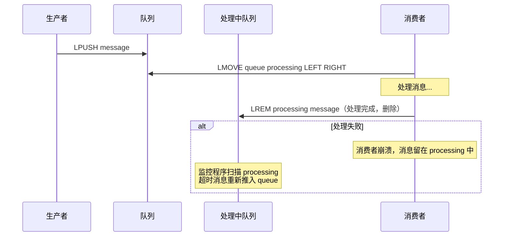

```bash
# 可靠消息队列
# 1. 消费者将消息从 queue 移到 processing
LMOVE queue:email processing:email LEFT RIGHT

# 2. 处理完成后，从 processing 中删除
LREM processing:email 1 "email:1001"

# 3. 监控程序：扫描超时消息
# 检查 processing 中的消息，如果存在时间过长，重新推入 queue
LMOVE processing:email queue:email RIGHT LEFT
```

::: important List 消息队列的局限
| 能力 | List | 专业 MQ（RabbitMQ/Kafka） |
|------|------|------------------------|
| 消息持久化 | 依赖 Redis 持久化 | 专门设计 |
| 消息确认 | 手动实现 | 原生支持 |
| 消息分组 | 不支持 | 支持 |
| 消息回溯 | 不支持 | 支持 |
| 消费者组 | 不支持 | 支持 |
| 吞吐量 | 极高 | 高 |

**建议**：简单场景（< 10000 msg/s）用 List，复杂场景用 Stream 或专业 MQ。
:::

### 8.2 最新列表

用 List 维护最新的 N 条记录：

```bash
# 添加新文章到最新列表
LPUSH latest:articles "article:1001"
LPUSH latest:articles "article:1002"

# 只保留最新 100 篇
LTRIM latest:articles 0 99

# 获取最新 10 篇
LRANGE latest:articles 0 9
```

```csharp
// C# 最新列表实现
public class LatestListService
{
    private readonly IDatabase _db;

    public async Task AddAsync(string key, string value, int maxCount = 100)
    {
        // 原子操作：推入 + 裁剪
        var lua = @"
            redis.call('LPUSH', KEYS[1], ARGV[1])
            redis.call('LTRIM', KEYS[1], 0, tonumber(ARGV[2]) - 1)
        ";
        await _db.ScriptEvaluateAsync(lua,
            new RedisKey[] { key },
            new RedisValue[] { value, maxCount });
    }

    public async Task<List<string>> GetLatestAsync(string key, int count = 10)
    {
        var values = await _db.ListRangeAsync(key, 0, count - 1);
        return values.Select(v => v.ToString()).ToList();
    }
}
```

### 8.3 栈（Stack）

List 可以作为栈使用（LIFO）：

```bash
# 入栈
LPUSH stack "item1"
LPUSH stack "item2"
LPUSH stack "item3"    # stack: [item3, item2, item1]

# 出栈
LPOP stack              # "item3"（后进先出）
LPOP stack              # "item2"
```

### 8.4 队列（Queue）

List 可以作为队列使用（FIFO）：

```bash
# 入队
LPUSH queue "task1"
LPUSH queue "task2"
LPUSH queue "task3"    # queue: [task3, task2, task1]

# 出队
RPOP queue              # "task1"（先进先出）
RPOP queue              # "task2"
```

### 8.5 时间线 / 动态

社交应用中的用户时间线：

```bash
# 用户发布动态
LPUSH timeline:user:1001 "post:5001"
LPUSH timeline:user:1001 "post:5002"

# 获取用户时间线（最新 20 条）
LRANGE timeline:user:1001 0 19

# 推模式：将动态推送到所有粉丝的时间线
LPUSH timeline:follower:2001 "post:5001"
LPUSH timeline:follower:2002 "post:5001"
# 注意：大 V 的粉丝可能很多，推模式性能压力大
```

### 8.6 安全队列（多消费者竞争）

```bash
# 多个消费者竞争消费同一个队列
LPUSH tasks "task1" "task2" "task3"

# 消费者1
BRPOP tasks 30           # 获取 task1

# 消费者2
BRPOP tasks 30           # 获取 task2

# 消费者3
BRPOP tasks 30           # 获取 task3

# 每个消息只会被一个消费者获取（竞争消费）
```

## 九、性能优化

### 9.1 控制列表长度

```bash
# 使用 LTRIM 控制列表长度，防止无限增长
LPUSH logs "new log entry"
LTRIM logs 0 9999         # 只保留最新 10000 条

# 使用 Lua 脚本保证原子性
local len = redis.call('LPUSH', KEYS[1], ARGV[1])
if len > tonumber(ARGV[2]) then
    redis.call('LTRIM', KEYS[1], 0, tonumber(ARGV[2]) - 1)
end
return len
```

### 9.2 优化 quicklist 配置

```bash
# 根据业务场景调整配置

# 场景1：消息队列（频繁 PUSH/POP）
list-max-ziplist-size -2     # 默认 8KB，平衡性能
list-compress-depth 0        # 不压缩，队列两端频繁操作

# 场景2：时间线（读多写少）
list-max-ziplist-size -3     # 16KB，每个节点存更多元素
list-compress-depth 1        # 压缩中间节点，省内存

# 场景3：历史记录（很少访问）
list-max-ziplist-size -5     # 64KB，最大化内存节省
list-compress-depth 2        # 压缩更多节点
```

### 9.3 避免大列表操作

```bash
# 危险操作
LRANGE big:list 0 -1        # 返回所有元素，可能阻塞
LINDEX big:list 999999      # O(N) 遍历

# 安全替代
# 1. 分批获取
LRANGE big:list 0 99
LRANGE big:list 100 199

# 2. 使用 LPOS + LINDEX 代替遍历查找
LPOS big:list "target"      # O(N) 但只需找到一次

# 3. 拆分列表
# 原始：timeline:user:1001（10万条）
# 拆分：timeline:user:1001:page1（1000条）
#       timeline:user:1001:page2（1000条）
```

### 9.4 quicklist 的内存估算

```bash
# quicklist 的内存 = 链表开销 + ziplist/listpack 数据

# 链表开销（每个 quicklistNode）：
# - prev/next 指针：16 字节（64位）
# - entry 指针：8 字节
# - size/count/encoding 等字段：约 8 字节
# 合计约 32 字节/节点

# ziplist/listpack 数据：
# - 头部：约 11 字节
# - 每个元素：1~5（prevlen/len）+ 1~2（encoding）+ 数据长度

# 示例：1000 个短字符串（平均 10 字节）
# 配置 fill=-2（8KB/节点）
# 每节点约 400 个元素，需要 3 个节点
# 链表开销：3 × 32 = 96 字节
# ziplist 数据：3 × 8KB ≈ 24KB
# 总计约 24KB

# 对比 linkedlist：
# 每节点约 40 字节（指针 + SDS 开销 + 数据）
# 1000 × 40 = 40KB

# quicklist 节省约 40% 内存
```

## 十、quicklist 源码解读

### 10.1 LPUSH 的完整流程

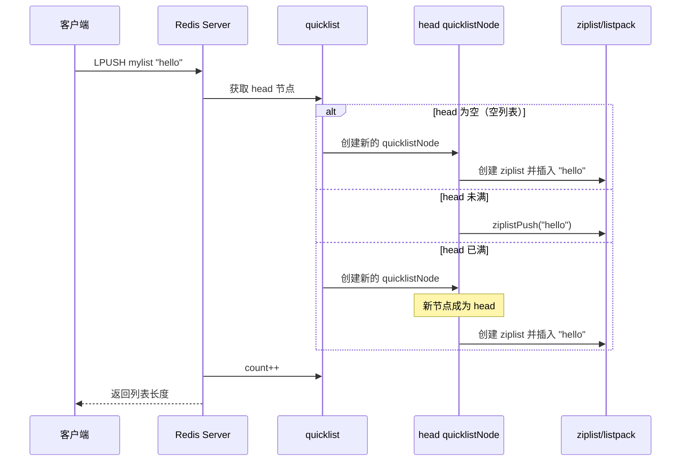

### 10.2 quicklistPush 的核心逻辑

```c
// Redis 源码 quicklist.c - quicklistPush（简化）
int quicklistPush(quicklist *quicklist, void *value, size_t sz,
                  int where) {
    int ret;
    if (where == QUICKLIST_HEAD) {
        ret = quicklistPushHead(quicklist, value, sz);
    } else {
        ret = quicklistPushTail(quicklist, value, sz);
    }
    return ret;
}

// 从头部推入
REDIS_STATIC int quicklistPushHead(quicklist *quicklist, void *value,
                                    size_t sz) {
    quicklistNode *orig_head = quicklist->head;

    // 检查 head 节点是否允许插入
    if (likely(
            quicklistAllowInsert(quicklist, quicklist->head, sz))) {
        // head 节点未满，直接插入
        quicklistNodeUpdateZiplistLength(quicklist->head);
        unsigned char *zl = quicklist->head->entry;
        zl = ziplistPush(zl, value, sz, ZIPLIST_HEAD);
        quicklist->head->entry = zl;
    } else {
        // head 节点已满，创建新节点
        quicklistNode *node = quicklistCreateNode();
        unsigned char *zl = ziplistPush(ziplistNew(), value, sz,
                                        ZIPLIST_HEAD);
        node->entry = zl;
        node->count = 1;
        _quicklistInsertNodeBefore(quicklist, quicklist->head, node);
    }

    quicklist->count++;
    quicklist->head->count++;
    return 1;
}
```

### 10.3 LINDEX 的定位逻辑

```c
// Redis 源码 quicklist.c - quicklistIndex（简化）
int quicklistIndex(const quicklist *quicklist, const long long index,
                   quicklistEntry *entry) {
    quicklistNode *n;
    unsigned long long accum = 0;

    // 确定遍历方向
    if (index < 0) {
        // 从尾部开始
        index = (-index) - 1;
        n = quicklist->tail;
        while (n && (unsigned long long)index >= accum + n->count) {
            accum += n->count;
            n = n->prev;
        }
    } else {
        // 从头部开始
        n = quicklist->head;
        while (n && (unsigned long long)index >= accum + n->count) {
            accum += n->count;
            n = n->next;
        }
    }

    if (!n) return 0;

    // 在节点内的偏移
    unsigned long long within_node = index - accum;

    // 需要解压（如果已压缩）
    quicklistDecompressNodeIfNeeded(n);

    // 在 ziplist 中定位
    unsigned char *zle = ziplistIndex(n->entry, within_node);
    if (!zle) return 0;

    entry->node = n;
    entry->zi = zle;
    return 1;
}
```

::: info LINDEX 的时间复杂度
`LINDEX` 需要遍历 quicklist 链表找到目标节点，再在 ziplist 中定位元素。最坏时间复杂度为 O(N)。

优化建议：
1. 如果频繁按索引访问，考虑使用 Sorted Set 替代 List
2. 避免对大列表使用 LINDEX
3. 使用 LPOS 查找元素位置（Redis 6.0.6+）
:::

## 十一、阻塞操作的实现原理

### 11.1 阻塞命令的数据结构

```c
// Redis 源码 server.h
typedef struct blockingState {
    // BLPOP/BRPOP 相关
    dict *keys;              // 阻塞等待的 key 字典
    robj *target;            // RPOPLPUSH 的目标列表
    size_t xread_count;      // XREAD 的 COUNT
    mstime_t xread_ms;       // XREAD 的超时时间

    // 阻塞超时
    mstime_t timeout;        // 超时时间戳

    // 阻塞原因
    int btype;               // 阻塞类型
    client *unblocked_client; // 解除阻塞的客户端
} blockingState;
```

### 11.2 阻塞与解除阻塞流程

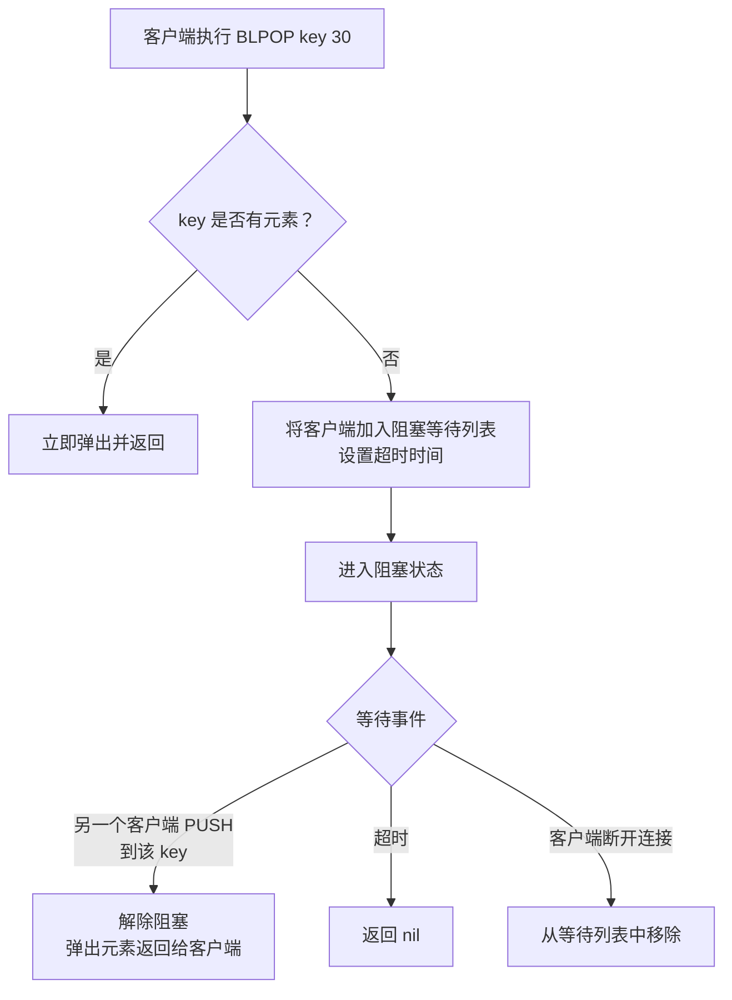

### 11.3 多客户端阻塞的优先级

```bash
# 假设三个客户端依次对同一 key 执行 BLPOP
# 客户端1: BLPOP mylist 30  （先阻塞）
# 客户端2: BLPOP mylist 30  （后阻塞）
# 客户端3: BLPOP mylist 30  （最后阻塞）

# 当有元素推入时：
LPUSH mylist "hello"
# → 客户端1 获取 "hello"（先阻塞先获取）
```

```c
// Redis 源码 t_list.c - signalListAsReady（简化）
// 当有元素推入阻塞列表时，唤醒等待的客户端
void signalListAsReady(redisServer *server, robj *key) {
    readyList *rl;

    // 查找等待该 key 的客户端
    // 按阻塞时间排序，先阻塞的先唤醒
    // ...
}
```

### 11.4 阻塞操作的注意事项

::: warning 阻塞操作的风险
1. **连接池耗尽**：阻塞操作占用连接，大量阻塞可能导致连接池耗尽
2. **超时设置**：生产环境建议设置合理的超时时间，避免无限等待
3. **多键阻塞**：BLPOP key1 key2 30 只会从第一个有元素的 key 弹出
4. **客户端断开**：客户端断开后，Redis 自动从阻塞列表移除
5. **Lua 脚本中不能使用阻塞命令**：会报错

```bash
# 错误：在 Lua 脚本中使用阻塞命令
EVAL "return redis.call('BLPOP', 'mylist', 30)" 0
# ERR BLPOP is not allowed in Lua scripts
```
:::

## 十二、List 与 Stream 的对比

Redis 5.0 引入的 Stream 类型是 List 作为消息队列的升级方案：

| 维度 | List | Stream |
|------|------|--------|
| 消息 ID | 无（隐含索引） | 自动生成（时间戳+序号） |
| 消费者组 | 不支持 | 原生支持 |
| 消息确认 | 手动实现 | XACK |
| 消息持久化 | 依赖 Redis 持久化 | 专门设计 |
| 消息回溯 | 不支持 | XRANGE |
| 阻塞读取 | BLPOP/BRPOP | XREAD |
| 消息删除 | LREM | XDEL |
| 有序性 | 按插入顺序 | 按时间戳顺序 |

::: important 何时用 List vs Stream
- **用 List**：简单的队列、栈、时间线，不需要消费者组和消息确认
- **用 Stream**：需要消费者组、消息确认、消息回溯的可靠消息队列

Stream 是 List 消息队列场景的完整替代方案，但 List 在简单场景下性能更高、使用更简单。
:::

## 十三、常见问题与陷阱

### 13.1 LRANGE 的性能陷阱

```bash
# 危险：获取大列表所有元素
LRANGE big:list 0 -1        # 100 万个元素，阻塞数秒

# 安全：分批获取
# 方案1：固定批次
LRANGE big:list 0 999
LRANGE big:list 1000 1999

# 方案2：迭代器模式
SET cursor 0
WHILE cursor < LLEN(big:list)
    LRANGE big:list cursor cursor+99
    cursor += 100
END
```

### 13.2 LINSERT 的 O(N) 问题

```bash
# LINSERT 需要遍历列表找到目标元素
LINSERT mylist BEFORE "target" "new"   # O(N)

# 对于大列表，LINSERT 可能很慢
# 替代方案：使用 Hash 维护索引位置
# 或使用 Sorted Set 替代 List
```

### 13.3 LPUSH + LTRIM 的原子性

```bash
# 这两条命令不是原子的！
LPUSH mylist "item"     # 执行成功
# 如果此时 Redis 崩溃
LTRIM mylist 0 99       # 未执行，列表可能无限增长

# 解决方案：使用 Lua 脚本
local len = redis.call('LPUSH', KEYS[1], ARGV[1])
redis.call('LTRIM', KEYS[1], 0, tonumber(ARGV[2]) - 1)
return len
```

### 13.4 BRPOP 的连接占用

```csharp
// 错误：在连接池中使用阻塞操作
// StackExchange.Redis 默认不支持 BRPOP
// 因为它会占用连接，影响其他操作

// 正确：使用专用连接或轮询
public async Task<string?> DequeueAsync(string queue, TimeSpan timeout)
{
    var deadline = DateTime.UtcNow + timeout;
    while (DateTime.UtcNow < deadline)
    {
        var value = await _db.ListRightPopAsync(queue);
        if (value.HasValue) return value.ToString();
        await Task.Delay(50);  // 短暂等待后重试
    }
    return null;
}
```

### 13.5 大列表删除

```bash
# 危险：删除大列表
DEL big:list               # 可能阻塞数秒

# 安全：异步删除
UNLINK big:list            # Redis 4.0+ 异步删除

# 或者分批删除
WHILE LLEN(big:list) > 0
    LTRIM big:list 100 -1
END
DEL big:list
```

## 十四、编码演进总结

### 14.1 完整演进历程

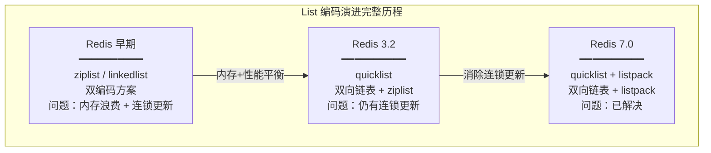

### 14.2 各编码方案对比

| 维度 | ziplist | linkedlist | quicklist(ziplist) | quicklist(listpack) |
|------|---------|-----------|-------------------|-------------------|
| 内存 | 极省 | 浪费 | 较省 | 较省 |
| 两端操作 | O(1) | O(1) | O(1) | O(1) |
| 中间操作 | O(N) | O(1) | O(N)（单节点内） | O(N)（单节点内） |
| 索引访问 | O(N) | O(N) | O(N) | O(N) |
| 连锁更新 | 有 | 无 | 有（但影响小） | 无 |
| 缓存友好 | 好 | 差 | 较好 | 较好 |
| 压缩 | 不支持 | 不支持 | LZF | LZF |

### 14.3 核心要点回顾

| 维度 | 要点 |
|------|------|
| **编码演进** | ziplist/linkedlist → quicklist(ziplist) → quicklist(listpack) |
| **quicklist** | 双向链表 + ziplist/listpack，兼顾内存和性能 |
| **listpack** | 替代 ziplist，自身长度记录，消除连锁更新 |
| **fill** | 控制每节点大小，-2(8KB) 是默认最优值 |
| **compress** | 控制压缩深度，首尾不压缩，中间 LZF 压缩 |
| **阻塞操作** | BLPOP/BRPOP，先阻塞先获取，注意连接占用 |
| **消息队列** | 简单队列用 List，可靠队列用 Stream |
| **性能陷阱** | LRANGE 大列表、LINSERT/LINDEX O(N)、大列表 DEL |

### 14.4 参考资料

- [Redis 官方文档 - List Commands](https://redis.io/commands/?group=list)
- 《Redis 设计与实现》第 2 部分 第 3、6 章 —— 黄健宏
- 《Redis 深度历险》第 2 章 —— 钱文品
- 《Redis 开发与运维》第 3 章 —— 付磊、张益军
- [Redis 源码 quicklist.h / quicklist.c / listpack.h / listpack.c](https://github.com/redis/redis)
- [Redis 7.0 listpack 替换 ziplist 的 PR](https://github.com/redis/redis/pull/10900)
