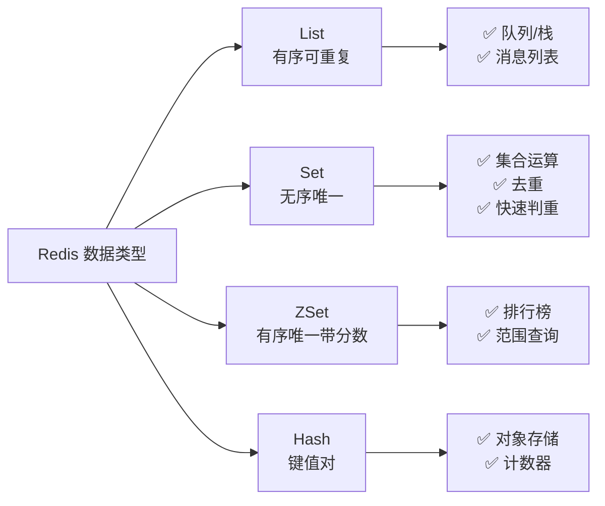
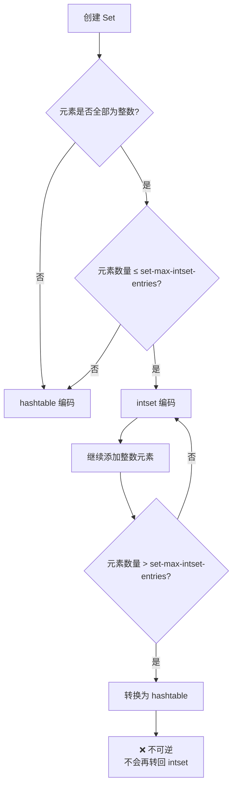
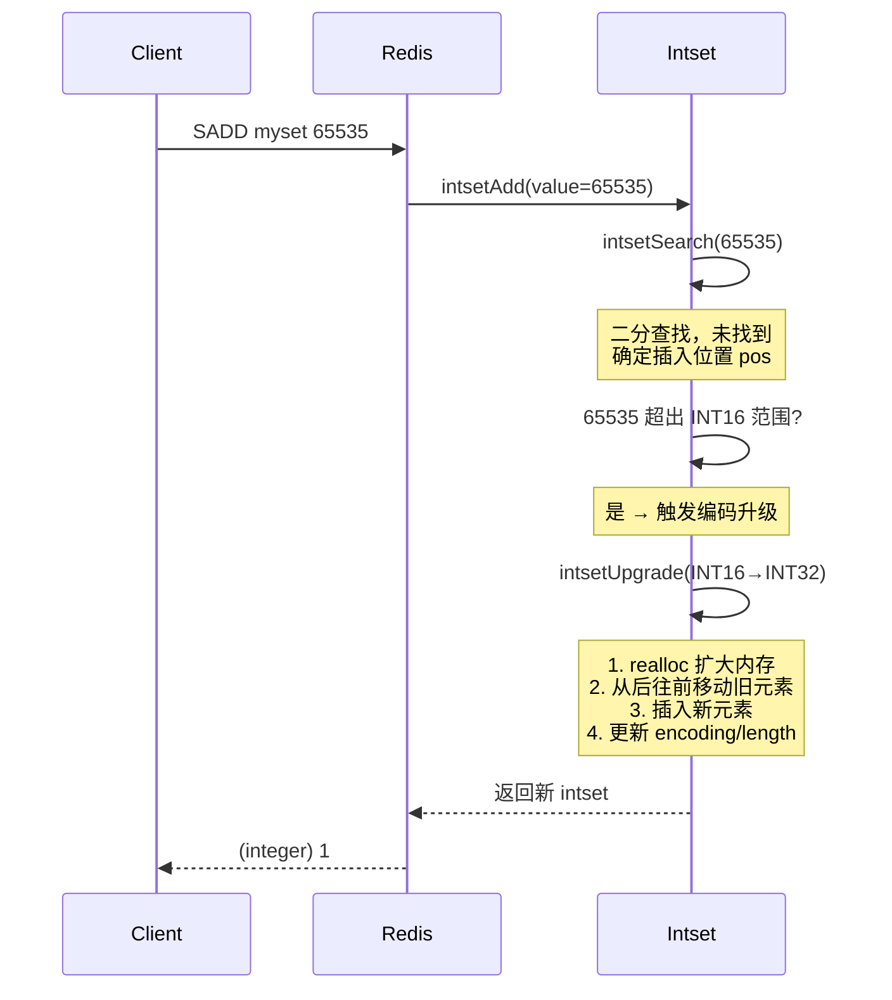
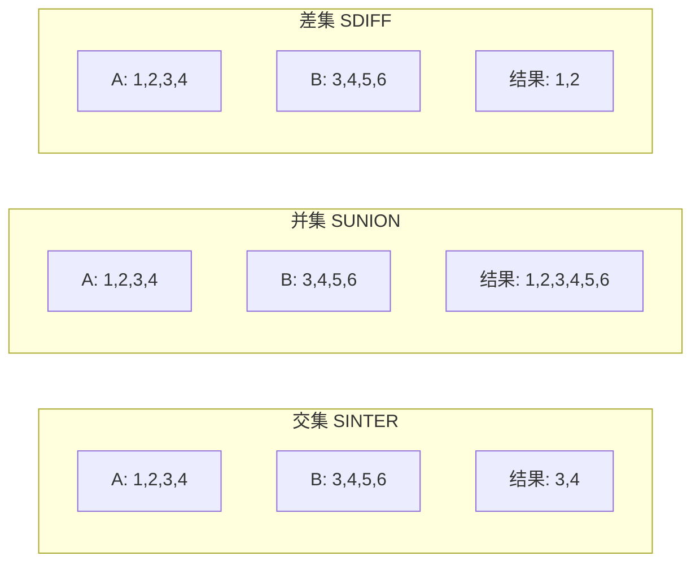
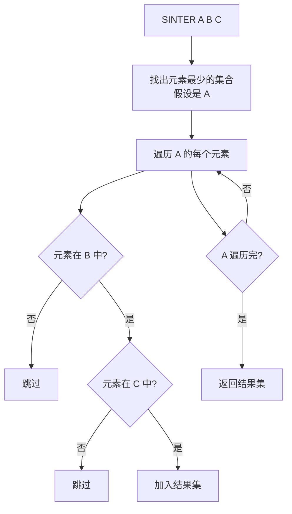
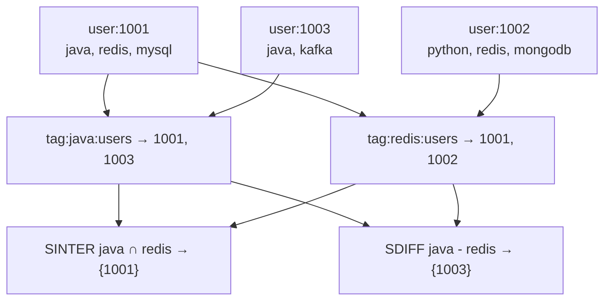
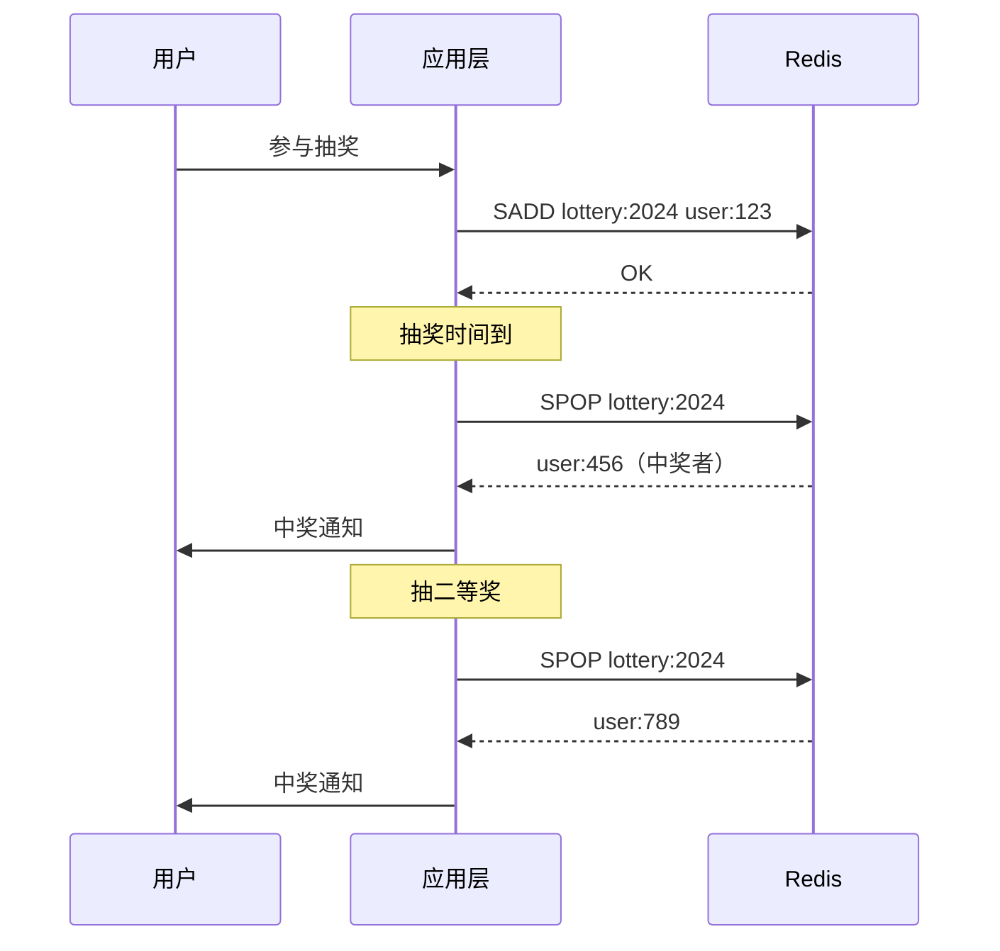
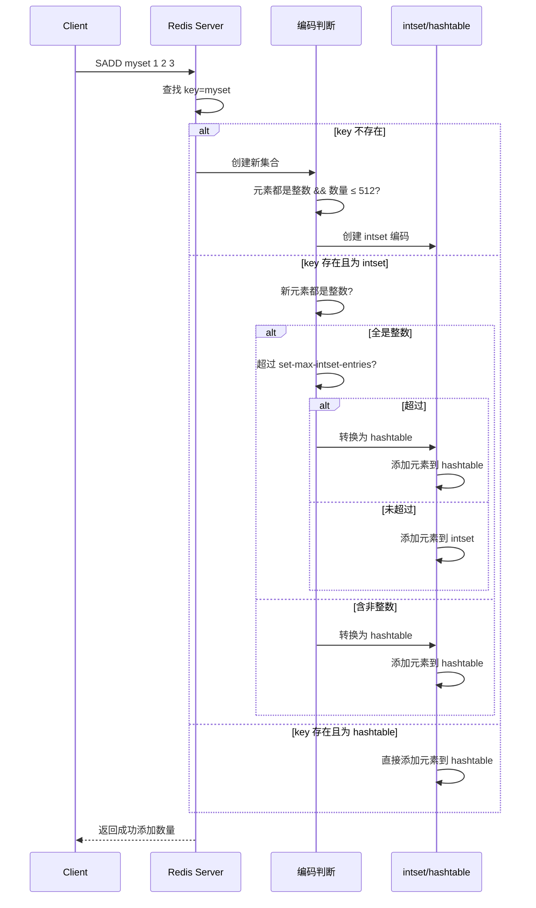

# Set 与整数集合

Set（集合）是 Redis 中最"社交"的数据类型 —— 它天然支持交集、并集、差集运算，让"共同好友""标签筛选"这类需求一行命令搞定。底层它有两种编码：当元素都是整数且数量少时用 **intset**（整数集合），否则退化为 **hashtable**。理解这两种编码的转换逻辑和 intset 的升级机制，是用好 Set 的关键。

::: tip 核心要点
- Set 底层有 `intset` 和 `hashtable` 两种编码，自动转换
- `intset` 是有序、紧凑的整数数组，支持编码升级但不支持降级
- 集合运算命令（SINTER/SUNION/SDIFF）的时间复杂度与最小/最大集合大小相关
- Set 的典型场景：标签系统、共同好友、抽奖、去重
:::

## 1. Set 概述

### 1.1 什么是 Set

Set 是 String 类型的**无序集合**，具有两个核心特征：

| 特征 | 说明 |
|------|------|
| **无序性** | 元素没有先后顺序，不支持按索引访问 |
| **唯一性** | 每个元素不重复，添加已存在元素会被忽略 |

```bash
# Set 的基本操作
SADD myset a b c        # 添加元素，返回成功添加的数量
SADD myset a            # 重复添加，返回 0
SMEMBERS myset          # 获取所有元素（无序）
SCARD myset             # 获取元素数量
SISMEMBER myset a       # 判断元素是否存在
```

### 1.2 Set 与其他类型的对比



| 对比维度 | List | Set | ZSet | Hash |
|----------|------|-----|------|------|
| 元素唯一 | ❌ | ✅ | ✅ | 键唯一 |
| 有序性 | ✅ 按插入 | ❌ | ✅ 按分数 | ❌ |
| 查找复杂度 | O(N) | O(1) | O(log N) | O(1) |
| 集合运算 | ❌ | ✅ | ❌ | ❌ |

## 2. Set 的两种编码

### 2.1 编码选择规则

Redis 为 Set 设计了两种底层编码，根据元素特征**自动选择**：



::: important 编码转换条件
- **intset → hashtable**：当元素数量超过 `set-max-intset-entries`（默认 512）**或**添加了非整数元素时，自动转换为 hashtable
- **hashtable → intset**：**不会发生**！转换是单向的，一旦升级就不会降级
- `set-max-intset-entries` 可在 `redis.conf` 中配置
:::

### 2.2 查看编码方式

```bash
# 小集合，全部为整数 → intset
SADD smallset 1 2 3
OBJECT ENCODING smallset
# "intset"

# 添加非整数元素 → 转为 hashtable
SADD smallset "hello"
OBJECT ENCODING smallset
# "hashtable"

# 大集合 → hashtable
SADD bigset 1 2 3 4 5 6 7 8 9 10 11 12 13 14 15 16 17 18 19 20
# ... 继续添加超过 512 个整数
OBJECT ENCODING bigset
# "hashtable"
```

### 2.3 两种编码对比

| 对比维度 | intset | hashtable |
|----------|--------|-----------|
| 内存占用 | 极小（连续内存） | 较大（指针+结构开销） |
| 查找复杂度 | O(log N)（二分查找） | O(1)（哈希查找） |
| 插入复杂度 | O(N)（需要移动元素） | O(1) |
| 适用场景 | 少量整数的集合 | 大量元素或含非整数 |
| 元素类型 | 仅整数（int16/int32/int64） | 任意 String |

## 3. intset 结构详解

### 3.1 intset 结构定义

intset（整数集合）是 Redis 为纯整数集合设计的紧凑存储结构，源码定义在 `intset.h` 中：

```c
// Redis 7.x 源码 - intset.h
typedef struct intset {
    uint32_t encoding;  // 编码方式：INTSET_ENC_INT16 / INT32 / INT64
    uint32_t length;    // 元素数量
    int8_t contents[];  // 柔性数组，实际存储元素
} intset;
```

::: info 柔性数组（Flexible Array Member）
`contents[]` 是 C 语言的柔性数组技巧 —— 它不占 struct 本身的空间，而是紧跟在 struct 后面分配连续内存。这意味着 `encoding`、`length` 和所有元素在内存中是**连续排列**的，对 CPU 缓存非常友好。
:::

### 3.2 encoding 字段详解

`encoding` 决定了 `contents` 数组中每个元素的字节大小：

| 编码常量 | 值 | 每个元素大小 | 取值范围 |
|----------|-----|-------------|----------|
| `INTSET_ENC_INT16` | 2 | 2 字节（16 bit） | -32768 ~ 32767 |
| `INTSET_ENC_INT32` | 4 | 4 字节（32 bit） | -2147483648 ~ 2147483647 |
| `INTSET_ENC_INT64` | 8 | 8 字节（64 bit） | 很大 |

### 3.3 intset 的内存布局

```
假设 intset 包含元素 [1, 3, 5]，encoding = INTSET_ENC_INT16

内存布局（小端序）：
┌────────────┬────────────┬──────────┬──────────┬──────────┐
│ encoding   │ length     │ contents[0]│ contents[1]│ contents[2]│
│ 0x00000002 │ 0x00000003 │  0x0001  │  0x0003  │  0x0005  │
│ (4 bytes)  │ (4 bytes)  │ (2 bytes) │ (2 bytes) │ (2 bytes) │
└────────────┴────────────┴──────────┴──────────┴──────────┘
总大小 = 4 + 4 + 3 × 2 = 14 字节
```

::: warning intset 的元素是有序的
intset 中的元素始终按**从小到大**排列。这不是 Set 类型本身的特性（Set 是无序的），而是 intset 内部的存储优化 —— 有序才能使用二分查找，将查找复杂度从 O(N) 降到 O(log N)。
:::

### 3.4 编码升级（Encoding Upgrade）

编码升级是 intset 最精妙的设计：当新增元素的值超出现有编码范围时，intset 会**整体升级**到更大的编码。

#### 升级触发条件

```mermaid
flowchart TD
    A[新元素加入 intset] --> B{元素值能否用当前 encoding 表示?}
    B -->|能| C[二分查找插入位置<br/>移动元素腾出空间<br/>O(N) 操作]
    B -->|不能| D[编码升级]
    D --> E[确定新 encoding<br/>INT16 → INT32 → INT64]
    E --> F[重新分配内存<br/>新大小 = header + length × 新元素大小]
    F --> G[从后往前移动旧元素<br/>扩展每个元素到新大小]
    G --> H[插入新元素]
    H --> I[更新 encoding 和 length]
```

#### 升级过程详解

```c
// Redis 源码 - intset.c（简化版，展示核心逻辑）
static intset *intsetUpgrade(intset *is, uint32_t newenc, int64_t value) {
    uint32_t oldenc = intrev32ifbe(is->encoding);
    uint32_t length = intrev32ifbe(is->length);

    // 1. 计算新编码下需要的大小
    intset *newis = zrealloc(is, sizeof(intset) + length * newenc_size);

    // 2. 从后往前移动旧元素（从后往前，避免覆盖）
    //    这是关键：每个元素变大了，如果从前往后移动会覆盖后面的数据
    int8_t *p = ((int8_t*)newis->contents) + length * newenc_size;
    for (uint32_t i = length; i > 0; i--) {
        // 读取旧编码的值
        int64_t v = _intsetGet(newis, i-1, oldenc);
        // 按新编码写入
        _intsetSet(newis, i-1, v, newenc);
    }

    // 3. 插入新元素
    // 4. 更新 encoding 和 length
    return newis;
}
```

#### 具体示例：INT16 升级到 INT32

```
原始 intset: encoding=INT16, length=3, contents=[1, 3, 5]
每个元素占 2 字节

添加元素 65535 → 超出 INT16 范围，需要升级到 INT32

步骤 1：重新分配内存
  旧大小 = 8（header）+ 3 × 2 = 14 字节
  新大小 = 8（header）+ 3 × 4 = 20 字节（先不包含新元素）

步骤 2：从后往前移动旧元素
  contents[2] = 5:  从偏移 8+4=12  移到 8+8=16
  contents[1] = 3:  从偏移 8+2=10  移到 8+4=12
  contents[0] = 1:  从偏移 8+0=8   移到 8+0=8

  移动后的 contents: [1(4B), 3(4B), 5(4B), ?, ?]

步骤 3：再 realloc 增加一个 INT32 的空间
  新大小 = 8 + 4 × 4 = 24 字节

步骤 4：插入 65535 到合适位置
  二分查找确定位置 = 3
  contents = [1(4B), 3(4B), 5(4B), 65535(4B)]

步骤 5：更新 encoding = INT32, length = 4
```

::: important 为什么从后往前移动？
元素从小编码升级到大编码时，每个元素占用的字节数增加了。如果从前往后移动，前面的元素扩展后会覆盖后面还没移动的元素。从后往前移动则不会产生覆盖问题，类似于数组右移操作。
:::

### 3.5 intset 的查找与插入

#### 查找：二分搜索

```c
// Redis 源码 - intset.c（简化）
static uint8_t intsetSearch(intset *is, int64_t value, uint32_t *pos) {
    uint32_t min = 0, max = intrev32ifbe(is->length) - 1, mid;

    // 空集合
    if (intrev32ifbe(is->length) == 0) {
        if (pos) *pos = 0;
        return 0;
    }

    // 如果 value 大于最大值，直接追加
    if (value > _intsetGet(is, max)) {
        if (pos) *pos = intrev32ifbe(is->length);
        return 0;
    }

    // 如果 value 小于最小值，插入到头部
    if (value < _intsetGet(is, 0)) {
        if (pos) *pos = 0;
        return 0;
    }

    // 二分查找
    while (max >= min) {
        mid = (min + max) / 2;
        int64_t cur = _intsetGet(is, mid);
        if (cur > value) {
            max = mid - 1;
        } else if (cur < value) {
            min = mid + 1;
        } else {
            break;  // 找到了
        }
    }

    if (pos) *pos = mid;
    return cur == value;
}
```

#### 插入流程



### 3.6 intset 为什么不支持降级？

::: warning 编码升级是单向的
intset **只升不降**。即使删除了导致升级的大整数元素，intset 也不会回退到更小的编码。原因如下：

1. **简单性**：降级需要遍历所有元素找出最大值，再重新分配内存，增加复杂度
2. **实用性**：实际场景中，Set 元素往往呈"只增不减"的趋势
3. **性能**：避免频繁的升降级带来的内存重分配开销
:::

## 4. hashtable 编码

### 4.1 hashtable 存储 Set 的方式

当 Set 使用 hashtable 编码时，每个元素作为 dict 的 key 存储，value 统一设为 NULL：

```c
// Redis 中 Set 使用 dict 的方式
// key = 集合元素, value = NULL（不使用）
dictAdd(set->dict, element, NULL);

// 例如 Set = {a, b, c} 的 hashtable 存储：
// ┌─────┬───────┬───────┬───────┬─────┐
// │ idx │ key   │ value │ next  │
// ├─────┼───────┼───────┼───────┼─────┤
// │  0  │       │       │       │
// │  1  │ "b"   │ NULL  │       │
// │  2  │       │       │       │
// │  3  │ "a"   │ NULL  │→"c"  │ NULL│
// └─────┴───────┴───────┴───────┴─────┘
```

### 4.2 hashtable 的内存开销

hashtable 编码的内存开销远大于 intset：

```
一个包含 3 个整数元素的 Set：

intset 编码：
  header(8B) + 3 × 2B = 14 字节

hashtable 编码：
  dict 结构头(8B) + 3 个 dictEntry(3 × 24B) + 3 个 SDS(3 × 10B) ≈ 100+ 字节

内存差异约 7 倍！
```

::: tip 为什么要用 intset？
intset 的核心价值是**省内存**。对于小型整数集合，intset 可以节省 5-10 倍的内存。这也是 Redis 设置 `set-max-intset-entries` 阈值的原因 —— 小集合用 intset，大集合用 hashtable，在内存和性能之间取得平衡。
:::

## 5. 集合运算

集合运算是 Set 类型最强大的特性，Redis 原生支持交集、并集、差集三种运算。

### 5.1 三种集合运算



### 5.2 SINTER —— 交集

```bash
SADD setA 1 2 3 4
SADD setB 3 4 5 6

# 计算交集
SINTER setA setB
# 1) "3"
# 2) "4"

# 存储结果到新集合
SINTERSTORE result setA setB
SMEMBERS result
# 1) "3"
# 2) "4"
```

#### SINTER 的实现策略

Redis 对交集运算做了优化，核心策略是**先遍历最小集合**：



::: important 交集优化原理
SINTER 的时间复杂度是 O(N*M)，其中 N 是最小集合的元素数，M 是集合个数。Redis 会先对参与的集合按 cardinality 排序，从最小的集合开始遍历，将每个元素到其他集合中做 SISMEMBER 检查。这样最小化遍历次数。
:::

```c
// Redis 源码 - t_set.c（简化逻辑）
void sinterGenericCommand(client *c, robj **setkeys, unsigned long setnum) {
    robj **sets = zmalloc(sizeof(robj*) * setnum);

    // 1. 读取所有集合
    for (i = 0; i < setnum; i++) {
        sets[i] = lookupKeyRead(c->db, setkeys[i]);
    }

    // 2. 找到最小的集合
    int min_idx = 0;
    for (i = 1; i < setnum; i++) {
        if (setSize(sets[i]) < setSize(sets[min_idx]))
            min_idx = i;
    }

    // 3. 遍历最小集合，检查元素是否在所有集合中存在
    setTypeIterator *si = setTypeInitIterator(sets[min_idx]);
    while (setTypeNext(si, &ele) != -1) {
        int in_all = 1;
        for (j = 0; j < setnum; j++) {
            if (j == min_idx) continue;
            if (!setTypeIsMember(sets[j], ele)) {
                in_all = 0;
                break;
            }
        }
        if (in_all) addReplyBulkCBuffer(c, ele, len);
    }
}
```

### 5.3 SUNION —— 并集

```bash
SADD setA 1 2 3 4
SADD setB 3 4 5 6

# 计算并集
SUNION setA setB
# 1) "1"
# 2) "2"
# 3) "3"
# 4) "4"
# 5) "5"
# 6) "6"

# 存储结果
SUNIONSTORE union_result setA setB
SCARD union_result
# (integer) 6
```

并集的实现相对简单：遍历所有集合的元素，依次添加到结果集即可，Set 的唯一性保证不会有重复。

### 5.4 SDIFF —— 差集

```bash
SADD setA 1 2 3 4
SADD setB 3 4 5 6

# A - B 的差集
SDIFF setA setB
# 1) "1"
# 2) "2"

# 注意：差集与顺序有关
SDIFF setB setA
# 1) "5"
# 2) "6"

# 存储结果
SDIFFSTORE diff_result setA setB
```

::: warning 差集的顺序敏感性
`SDIFF A B` ≠ `SDIFF B A`。差集运算是**从左到右**的：第一个集合中存在，但后续所有集合中都不存在的元素。对于 N 个集合 `SDIFF A B C`，结果是 A 中存在但 B 和 C 中都不存在的元素。
:::

### 5.5 集合运算的时间复杂度

| 运算 | 时间复杂度 | 说明 |
|------|-----------|------|
| SINTER | O(N × M) | N = 最小集合大小, M = 集合个数 |
| SUNION | O(N) | N = 所有集合元素总数 |
| SDIFF | O(N) | N = 所有集合元素总数 |

::: warning 生产环境注意事项
集合运算在**两个大集合**上执行时可能非常耗时。例如两个各有 100 万元素的集合求交集，Redis 需要遍历最小集合的每个元素并对另一个集合做 O(1) 查找，总操作量约 100 万次。建议：

1. 大集合运算考虑使用 `SINTERSTORE` 分批计算
2. 在从节点执行运算，避免阻塞主节点
3. 使用 `SSCAN` 代替 `SMEMBERS` 遍历大集合
:::

## 6. Set 常用命令详解

### 6.1 增删改查

```bash
# === 添加元素 ===
SADD key member [member ...]
# 返回成功添加的元素数量（已存在的不会重复添加）

SADD tags "redis" "database" "nosql"
# (integer) 3

SADD tags "redis"    # 重复添加
# (integer) 0       # 返回 0，因为 redis 已存在

# === 删除元素 ===
SREM key member [member ...]
# 返回成功删除的元素数量

SREM tags "nosql"
# (integer) 1

# === 判断元素是否存在 ===
SISMEMBER key member
SISMEMBER tags "redis"
# (integer) 1    # 存在

SISMEMBER tags "mysql"
# (integer) 0    # 不存在

# Redis 6.2+ 批量判断
SMISMEMBER key member [member ...]
SMISMEMBER tags "redis" "mysql" "database"
# 1) (integer) 1
# 2) (integer) 0
# 3) (integer) 1
```

### 6.2 集合信息查询

```bash
# === 获取所有元素 ===
SMEMBERS key
SMEMBERS tags
# 1) "redis"
# 2) "database"

# ⚠️ 大集合慎用 SMEMBERS，可能阻塞 Redis
# 推荐使用 SSCAN 分批获取
SSCAN tags 0 COUNT 10

# === 获取元素数量 ===
SCARD key
SCARD tags
# (integer) 2

# === 随机获取元素 ===
SRANDMEMBER key [count]
SRANDMEMBER tags       # 随机返回 1 个
SRANDMEMBER tags 2     # 随机返回 2 个（可重复）
SRANDMEMBER tags -2    # 随机返回 2 个（可能重复）
SRANDMEMBER tags 2     # count > 0: 不重复（最多返回集合大小个）
SRANDMEMBER tags -2    # count < 0: 可重复

# === 随机弹出元素 ===
SPOP key [count]
SPOP tags            # 随机弹出 1 个，元素从集合中移除
SPOP tags 2          # Redis 3.2+，随机弹出 2 个
```

::: tip SRANDMEMBER 的 count 参数
- **count > 0**：返回最多 count 个不重复元素。如果 count > 集合大小，返回全部元素
- **count < 0**：返回 |count| 个元素，可能重复。适用于抽奖等场景
- **count = 0**：返回空列表
:::

### 6.3 集合运算命令

```bash
# === 交集 ===
SINTER key [key ...]
SINTERSTORE destination key [key ...]

# === 并集 ===
SUNION key [key ...]
SUNIONSTORE destination key [key ...]

# === 差集 ===
SDIFF key [key ...]
SDIFFSTORE destination key [key ...]
```

### 6.4 移动元素

```bash
# 将元素从一个集合移动到另一个集合（原子操作）
SMOVE source destination member

SADD source a b c
SADD destination x y z
SMOVE source destination b
# (integer) 1
SMEMBERS source      # a, c
SMEMBERS destination # x, y, z, b
```

### 6.5 命令速查表

| 命令 | 功能 | 时间复杂度 |
|------|------|-----------|
| `SADD` | 添加元素 | O(1) 每个 |
| `SREM` | 删除元素 | O(1) 每个 |
| `SISMEMBER` | 判断存在 | O(1) |
| `SMISMEMBER` | 批量判断 | O(N) |
| `SMEMBERS` | 获取所有 | O(N) |
| `SCARD` | 元素数量 | O(1) |
| `SRANDMEMBER` | 随机获取 | O(N) |
| `SPOP` | 随机弹出 | O(N) |
| `SMOVE` | 移动元素 | O(1) |
| `SINTER` | 交集 | O(N×M) |
| `SUNION` | 并集 | O(N) |
| `SDIFF` | 差集 | O(N) |
| `SSCAN` | 迭代器 | O(1) 每次调用 |

## 7. Set 的应用场景

### 7.1 标签系统

::: info 场景描述
用户可以打标签，通过标签查找用户，是社交、内容平台的核心需求。
:::

```bash
# 用户打标签
SADD user:1001:tags "java" "redis" "mysql"
SADD user:1002:tags "python" "redis" "mongodb"
SADD user:1003:tags "java" "kafka"

# 标签下的用户
SADD tag:java:users 1001 1003
SADD tag:redis:users 1001 1002
SADD tag:python:users 1002

# 查找同时有 java 和 redis 标签的用户（交集）
SINTER tag:java:users tag:redis:users
# 1) "1001"

# 查找有 java 或 redis 标签的用户（并集）
SUNION tag:java:users tag:redis:users
# 1) "1001"
# 2) "1002"
# 3) "1003"

# 查找有 java 但没有 redis 标签的用户（差集）
SDIFF tag:java:users tag:redis:users
# 1) "1003"
```



### 7.2 共同好友

```bash
# 用户的好友列表用 Set 存储
SADD friends:张三 user:1001 user:1002 user:1003 user:1004
SADD friends:李四 user:1002 user:1003 user:1005 user:1006

# 共同好友 = 交集
SINTER friends:张三 friends:李四
# 1) "user:1002"
# 2) "user:1003"

# 可能认识的人 = 对方好友 - 我的好友（差集）
SDIFF friends:李四 friends:张三
# 1) "user:1005"
# 2) "user:1006"

# 共同好友数（不取出结果，只看数量）
SINTERSTORE common_friends friends:张三 friends:李四
SCARD common_friends
# (integer) 2
```

::: important "可能认识的人"推荐算法
社交平台"可能认识的人"推荐，核心就是集合运算：
1. 获取对方好友列表
2. 减去自己的好友列表
3. 差集中的人就是"你可能的熟人"

这种推荐方式简单高效，是微博、微信等平台好友推荐的基础算法之一。
:::

### 7.3 抽奖系统

```bash
# === 方案一：SRANDMEMBER（不删除） ===
# 适合：用户可以中奖多次的场景

SADD lottery:2024 user:1 user:2 user:3 user:4 user:5

# 抽 1 个一等奖（不删除，用户可继续参与其他奖项）
SRANDMEMBER lottery:2024 1
# 1) "user:3"

# 抽 3 个三等奖
SRANDMEMBER lottery:2024 3
# 1) "user:1"
# 2) "user:5"
# 3) "user:2"

# === 方案二：SPOP（删除） ===
# 适合：一人只能中一次奖的场景

SADD lottery:2024 user:1 user:2 user:3 user:4 user:5

# 抽一等奖，抽完移出
SPOP lottery:2024
# "user:3"

# 抽二等奖，再移出一个
SPOP lottery:2024
# "user:1"

# 剩余参与者
SMEMBERS lottery:2024
# 1) "user:2"
# 2) "user:4"
# 3) "user:5"
```



### 7.4 去重

```bash
# === 场景一：UV 统计（简单版） ===
# 注意：精确 UV 推荐用 HyperLogLog，Set 在量大时内存开销大
SADD page:home:uv user:1
SADD page:home:uv user:2
SADD page:home:uv user:1    # 重复，自动去重
SCARD page:home:uv
# (integer) 2

# === 场景二：防止重复操作 ===
# 每个订单只能评价一次
SADD order:rated order:1001
SISMEMBER order:rated order:1001
# (integer) 1   # 已评价，拒绝

# === 场景三：黑名单/白名单 ===
SADD blacklist:ip 192.168.1.100 10.0.0.5
SISMEMBER blacklist:ip 192.168.1.100
# (integer) 1   # 在黑名单中

# === 场景四：已读消息去重 ===
SADD user:1001:read:msgs msg:1 msg:2 msg:3
SISMEMBER user:1001:read:msgs msg:2
# (integer) 1   # 已读
```

::: warning Set 做去重的内存问题
使用 Set 做精确去重（如 UV 统计），每个元素需要存储完整值。假设 1 亿 UV，每个用户 ID 平均 20 字节，加上 hashtable 的指针开销，大约需要 **5-6 GB** 内存。

对于大数据量去重场景，推荐使用 **HyperLogLog**（12 KB 即可估算亿级基数，误差 0.81%）或 **Bitmap**（如果 ID 是连续整数）。
:::

### 7.5 随机内容推荐

```bash
# 内容池用 Set 维护
SADD recommend:pool article:1 article:2 article:3 article:4 article:5

# 随机推荐 3 篇（不重复）
SRANDMEMBER recommend:pool 3
# 1) "article:2"
# 2) "article:5"
# 3) "article:1"

# 每次刷新页面，推荐不同内容
```

### 7.6 社交关系

```bash
# 关注/粉丝系统（双向 Set）
SADD following:张三 李四 王五 赵六    # 张三关注的人
SADD followers:李四 张三 王五         # 李四的粉丝

# 互关好友 = 我关注的人 ∩ 关注我的人
SINTER following:张三 followers:张三

# 关注推荐 = TA关注的人 - 我关注的人
SDIFF following:李四 following:张三
```

## 8. Set 的内部命令执行流程

### 8.1 SADD 执行流程



### 8.2 SINTER 执行流程

```mermaid
flowchart TD
    A[SINTER A B C] --> B[获取三个集合的 SCARD]
    B --> C[按 cardinality 排序<br/>假设 |A| < |B| < |C|]
    C --> D[创建空结果集 result]
    D --> E[遍历 A 的每个元素 e]
    E --> F{SISMEMBER B e?}
    F -->|否| G[跳过]
    F -->|是| H{SISMEMBER C e?}
    H -->|否| I[跳过]
    H -->|是| J[SADD result e]
    G --> K{A 遍历完?}
    I --> K
    J --> K
    K -->|否| E
    K -->|是| L[返回 result]
```

## 9. Set 编码转换实战

### 9.1 观察编码转换

```bash
# 实验 1：整数集合 → 超过阈值 → hashtable
CONFIG SET set-max-intset-entries 5

SADD testset 1 2 3 4 5
OBJECT ENCODING testset
# "intset"

SADD testset 6
OBJECT ENCODING testset
# "hashtable"    # 超过 5 个，自动转换

# 实验 2：整数集合 → 添加非整数 → hashtable
SADD testset2 1 2 3
OBJECT ENCODING testset2
# "intset"

SADD testset2 "hello"
OBJECT ENCODING testset2
# "hashtable"    # 非整数，自动转换

# 实验 3：删除导致升级的元素，编码不会回退
SADD testset3 1 2 3 4 5 6
OBJECT ENCODING testset3
# "hashtable"

SREM testset3 6
# 5 个元素，低于阈值，但不会回退
OBJECT ENCODING testset3
# "hashtable"    # 仍然是 hashtable
```

### 9.2 内存对比实验

```bash
# 使用 debug 查看内存占用
SADD intset_demo $(seq 1 100)
DEBUG OBJECT intset_demo
# 注意：Redis 7.x 可以用 MEMORY USAGE 命令
MEMORY USAGE intset_demo

# 删除后重建为 hashtable 编码
DEL intset_demo
CONFIG SET set-max-intset-entries 10
SADD intset_demo $(seq 1 100)
MEMORY USAGE intset_demo

# 对比两种编码的内存占用
```

## 10. 性能优化与最佳实践

### 10.1 编码选择优化

| 场景 | 建议 | 原因 |
|------|------|------|
| 小型整数集合 | 默认配置即可 | intset 内存效率极高 |
| 需要精确控制编码 | 调大 `set-max-intset-entries` | 延迟 hashtable 转换，省内存 |
| 大量非整数元素 | 无需特殊配置 | 自动使用 hashtable |
| 需要频繁 SISMEMBER | 优先用 hashtable | O(1) vs O(log N) |

### 10.2 大集合操作优化

```bash
# ❌ 危险：大集合获取所有元素
SMEMBERS huge_set    # 可能返回百万级数据，阻塞 Redis

# ✅ 安全：使用 SSCAN 分批获取
SSCAN huge_set 0 COUNT 100
# 返回 cursor 和一批数据
SSCAN huge_set <cursor> COUNT 100
# 继续迭代...

# ❌ 危险：大集合间直接运算
SINTER huge_set_a huge_set_b

# ✅ 安全：在从节点执行，或分批处理
# 方案 1：使用从节点（只读副本）
# 方案 2：先 SCARD 评估大小，小到可以接受再运算
```

### 10.3 Key 设计规范

```bash
# 推荐的 Key 命名规范
# 业务:对象:ID:属性
SADD user:1001:tags "java"
SADD tag:java:members "1001"
SADD friends:user:1001 "user:2001"
SADD blacklist:ip 192.168.1.1

# 设置过期时间（针对临时集合）
SADD temp:session:abc token1 token2
EXPIRE temp:session:abc 3600    # 1 小时后自动删除
```

### 10.4 避免的坑

::: warning 常见陷阱

**1. SMEMBERS 在大集合上会阻塞**
SMEMBERS 是 O(N) 操作，会一次性返回所有元素。大集合可能导致 Redis 阻塞数百毫秒甚至数秒。用 SSCAN 替代。

**2. SINTER 两个大集合极慢**
两个各 100 万元素的集合求交集，即使优化后也需要 100 万次 O(1) 查找。考虑分片或使用 HyperLogLog 近似计算。

**3. 集合运算结果可能很大**
SUNION 两个大集合的结果可能更大，SINTERSTORE/SUNIONSTORE/SDIFFSTORE 会将结果写入新 key，占用额外内存。

**4. SRANDMEMBER 的 count 正负差异**
`SRANDMEMBER key 3` 返回最多 3 个不重复元素，`SRANDMEMBER key -3` 返回 3 个可能重复的元素。抽奖场景务必注意这个差异。
:::

## 11. Set 在不同 Redis 版本的变化

| 版本 | 变化 |
|------|------|
| Redis 2.6 | SINTER/SUNION/SDIFF 基础集合运算 |
| Redis 3.2 | SPOP 支持 count 参数 |
| Redis 6.0 | 新增 SMISMEMBER 批量判断命令 |
| Redis 6.2 | SRANDMEMBER 行为细化，SSCAN 改进 |
| Redis 7.0 | 底层 listpack 替代 ziplist（影响 intset 之外的编码） |
| Redis 7.2 | Set 底层可能使用 listpack 编码（某些场景替代 hashtable） |

## 12. 源码分析：intset 核心操作

### 12.1 intset 完整插入流程

```c
// Redis 源码 - intset.c
intset *intsetAdd(intset *is, int64_t value, uint8_t *success) {
    uint8_t valenc = _intsetValueEncoding(value);
    uint32_t pos;

    if (success) *success = 1;

    /* 如果新值需要的编码比当前集合的编码更大，需要升级 */
    if (valenc > intrev32ifbe(is->encoding)) {
        /* 这里必须升级，整个集合的编码需要变大 */
        return intsetUpgradeAndAdd(is, value);
    }

    /* 在有序数组中二分查找 value */
    if (intsetSearch(is, value, &pos)) {
        if (success) *success = 0;  /* 已存在，不添加 */
        return is;
    }

    /* 元素不存在，需要插入。先确保内存足够 */
    is = intsetResize(is, intrev32ifbe(is->length) + 1);

    /* 如果 pos 不是末尾，需要移动后面的元素腾出空间 */
    if (pos < intrev32ifbe(is->length)) {
        memmove(
            intsetGetPtr(is, pos + 1),
            intsetGetPtr(is, pos),
            (intrev32ifbe(is->length) - pos) * sizeof(int64_t)
        );
    }

    /* 插入新元素 */
    _intsetSet(is, pos, value);
    is->length = intrev32ifbe(intrev32ifbe(is->length) + 1);

    return is;
}
```

### 12.2 编码升级插入

```c
// Redis 源码 - intset.c
static intset *intsetUpgradeAndAdd(intset *is, int64_t value) {
    uint8_t curenc = intrev32ifbe(is->encoding);
    uint8_t newenc = _intsetValueEncoding(value);
    uint32_t length = intrev32ifbe(is->length);
    int prepend = value < 0 ? 0 : 1;  /* 新值在最前还是最后 */

    /* 先设置新编码，再重新分配内存 */
    is->encoding = intrev32ifbe(newenc);
    is = intsetResize(is, length + 1);

    /* ★ 核心：从后往前移动旧元素到新编码位置 */
    int8_t *p = ((int8_t*)is->contents) + newenc * (length + prepend);
    for (uint32_t i = length; i > 0; i--) {
        /* 读取旧编码的值 */
        int64_t v = _intsetGetEncoded(is, i - 1, curenc);
        /* 按新编码写入 */
        _intsetSet(is, i - 1 + prepend, v);
    }

    /* 插入新值 */
    if (prepend)
        _intsetSet(is, 0, value);
    else
        _intsetSet(is, length, value);

    is->length = intrev32ifbe(intrev32ifbe(is->length) + 1);

    return is;
}
```

::: tip 源码中的精妙之处
1. **从后往前移动**：避免大数据覆盖小数据（编码升级后每个元素变大）
2. **prepend 判断**：由于 intset 是有序的，如果新值是负数，一定在最前面；如果是很大的正数，一定在最后面。不需要做二分查找
3. **单次 realloc**：不管升级还是插入，都只做一次内存重分配
:::

## 13. 小结

```mermaid
mindmap
  root((Set 与整数集合))
    底层编码
      intset
        有序整数数组
        支持编码升级 INT16→INT32→INT64
        不支持降级
        省内存，适合小集合
      hashtable
        字典结构
        O(1) 查找
        适合大集合或非整数
    编码转换
      intset → hashtable 单向
      触发条件
        元素数量超阈值
        添加非整数元素
    集合运算
      SINTER 交集
      SUNION 并集
      SDIFF 差集
      优化：先遍历最小集合
    常用命令
      SADD/SREM
      SISMEMBER/SMISMEMBER
      SMEMBERS/SSCAN
      SCARD
      SRANDMEMBER/SPOP
    应用场景
      标签系统
      共同好友
      抽奖系统
      去重
      黑白名单
```

::: important 关键回顾
1. **intset 是 Set 的内存优化利器**：小整数集合用 intset 可节省 5-10 倍内存
2. **编码升级不可逆**：intset 一旦转为 hashtable 就不会再转回来
3. **集合运算是 Set 的杀手级特性**：交集（共同好友）、差集（推荐关注）、并集（标签聚合）
4. **大集合操作需谨慎**：SMEMBERS、大集合间运算可能阻塞 Redis
5. **SRANDMEMBER 正负 count 含义不同**：正值不重复，负值可重复
:::

## 参考

- [Redis 官方文档 - Set Commands](https://redis.io/commands/?group=set)
- 《Redis 设计与实现》黄健宏 —— 第 7 章 整数集合
- 《Redis 深度历险》钱文品 —— 集合的使用场景
- 《Redis 开发与运维》付磊 —— Set 的应用与优化
- Redis 源码 `intset.c` / `intset.h` / `t_set.c`
