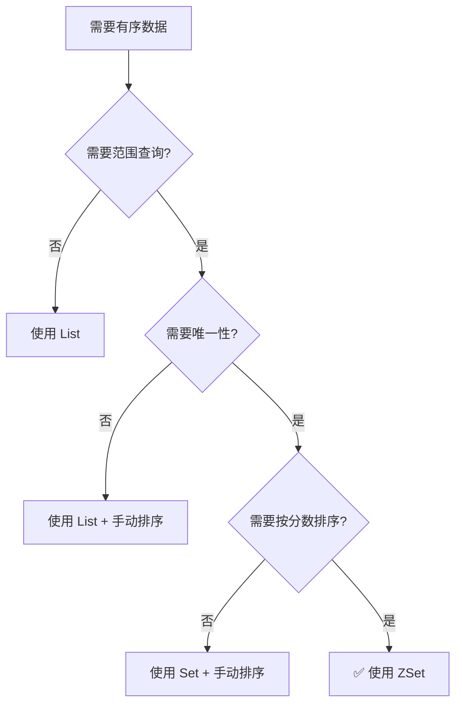
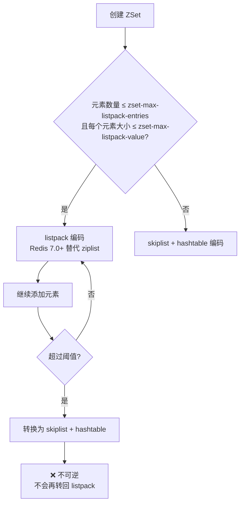
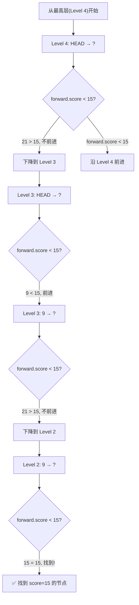
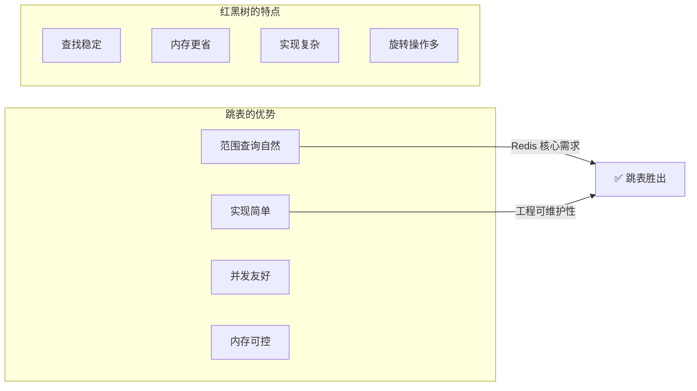
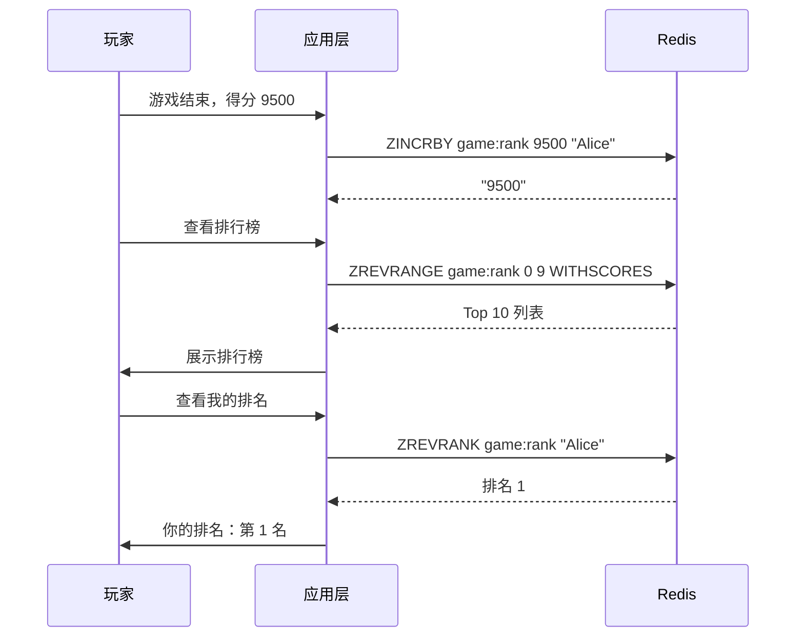
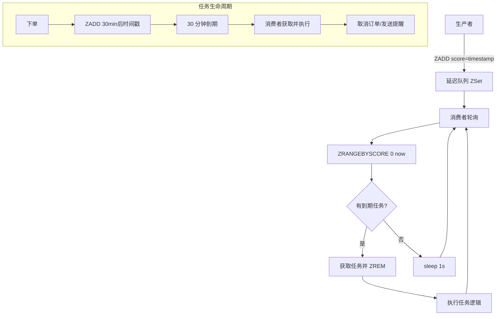
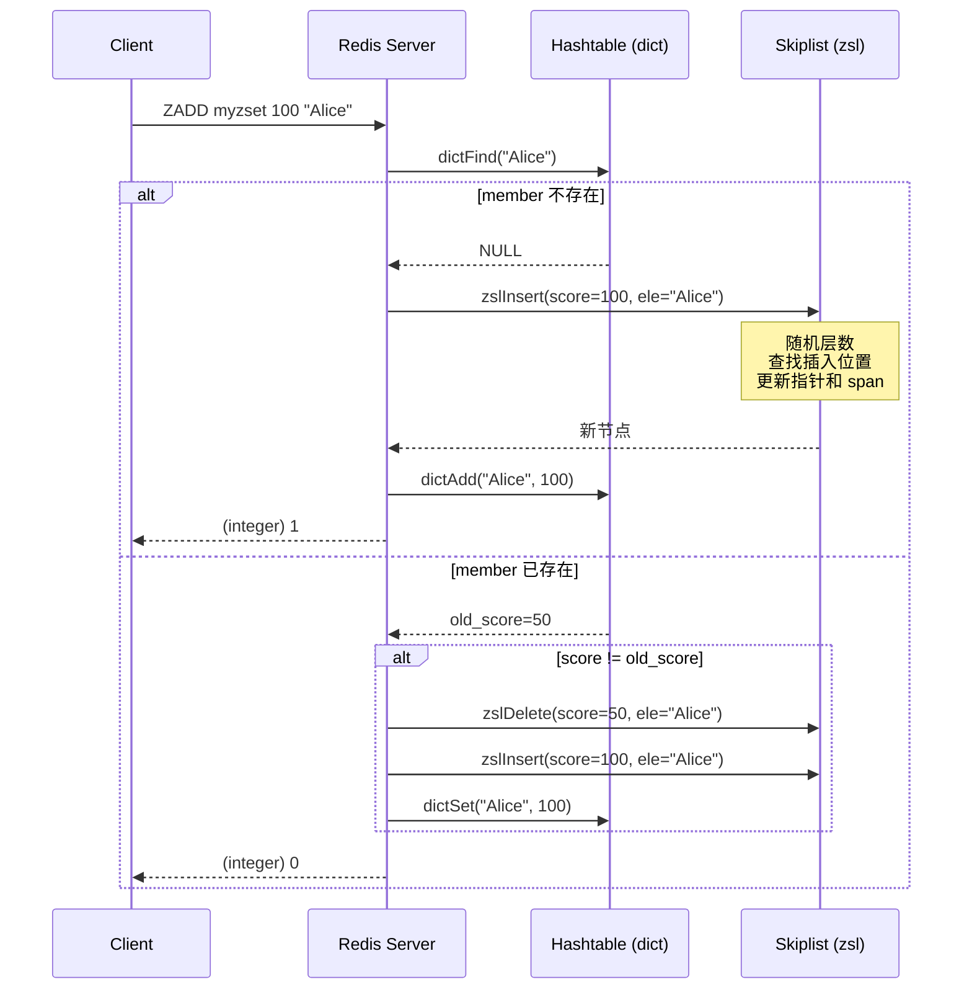
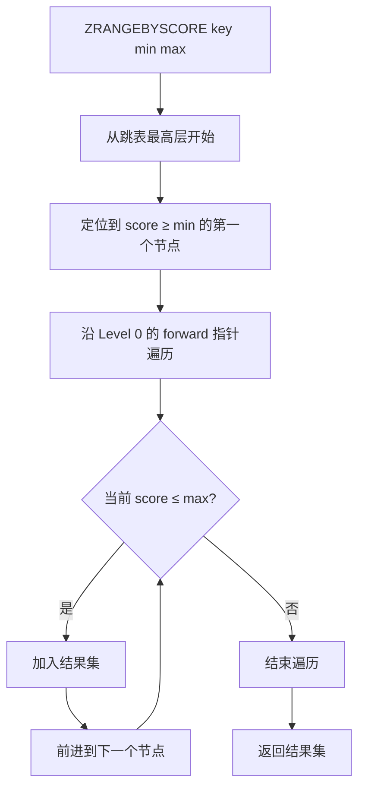
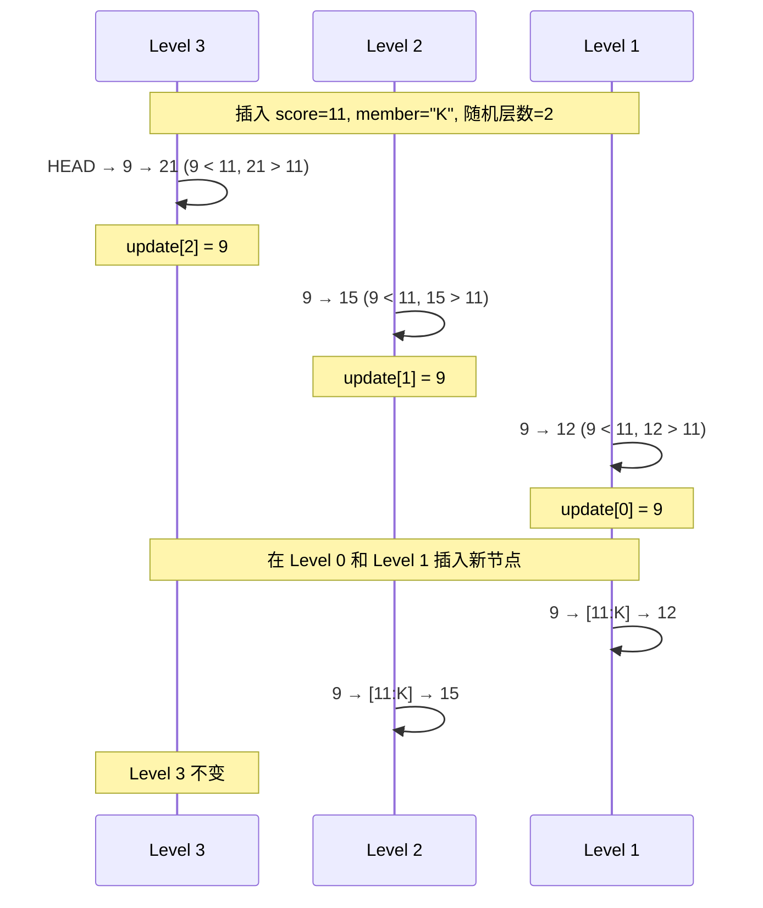

# ZSet 与跳表

ZSet（有序集合）是 Redis 中最"硬核"的数据类型 —— 它既像 Set 一样保证元素唯一，又像排序好的列表一样支持范围查询，而底层用跳表（Skiplist）这一精巧的概率数据结构将查找、插入、删除都控制在 O(log N)。理解跳表的原理，是掌握 ZSet 性能边界的钥匙。

::: tip 核心要点
- ZSet 底层有 `ziplist`（Redis 7.0 前）和 `skiplist + hashtable` 两种编码
- 跳表通过随机层数实现 O(log N) 的查找/插入/删除
- ZSet 的范围查询命令（ZRANGE/ZRANGEBYSCORE 等）是其杀手级特性
- 典型场景：排行榜、延迟队列、时间线、滑动窗口
:::

## 1. ZSet 概述

### 1.1 什么是 ZSet

ZSet（Sorted Set，有序集合）中的每个元素都关联一个 **score（分数）**，Redis 按照 score 从小到大排序：

```bash
# ZSet 的基本操作
ZADD leaderboard 100 "Alice" 200 "Bob" 150 "Charlie"
ZRANGE leaderboard 0 -1 WITHSCORES    # 按分数升序
# 1) "Alice"
# 2) "100"
# 3) "Charlie"
# 4) "150"
# 5) "Bob"
# 6) "200"

ZREVRANGE leaderboard 0 -1 WITHSCORES  # 按分数降序
# 1) "Bob"
# 2) "200"
# 3) "Charlie"
# 4) "150"
# 5) "Alice"
# 6) "100"
```

### 1.2 ZSet 的核心特性

| 特性 | 说明 |
|------|------|
| **有序性** | 按 score 排序，score 相同按 member 字典序 |
| **唯一性** | member 唯一，重复添加会更新 score |
| **快速查找** | 按 member 查找 score 为 O(1)（借助 hashtable） |
| **范围查询** | 按 score 或 rank 范围查询为 O(log N + M) |

### 1.3 ZSet 与其他有序结构对比



## 2. ZSet 的两种编码

### 2.1 编码选择规则



::: important 编码转换条件
- **listpack → skiplist**：当元素数量超过 `zset-max-listpack-entries`（默认 128）**或**任一元素超过 `zset-max-listpack-value`（默认 64 字节）时，自动转换
- **skiplist → listpack**：**不会发生**！转换是单向的
- Redis 7.0 前：使用 `ziplist` 编码，配置项为 `zset-max-ziplist-entries` 和 `zset-max-ziplist-value`
- Redis 7.0+：使用 `listpack` 替代 `ziplist`，配置项名称同步更新
:::

### 2.2 查看编码方式

```bash
# 小 ZSet → listpack 编码
ZADD smallsort 1 "a" 2 "b" 3 "c"
OBJECT ENCODING smallsort
# "listpack"   (Redis 7.0+)
# "ziplist"    (Redis 7.0 之前)

# 大 ZSet 或大 value → skiplist 编码
ZADD bigsort 1 "a_very_long_member_name_that_exceeds_64_bytes_limit_for_sure"
OBJECT ENCODING bigsort
# "skiplist"
```

### 2.3 两种编码对比

| 对比维度 | listpack / ziplist | skiplist + hashtable |
|----------|-------------------|---------------------|
| 内存占用 | 极小（连续内存） | 较大（多层指针） |
| 查找复杂度 | O(N)（遍历） | O(log N)（跳表） |
| 按 member 查 score | O(N) | O(1)（hashtable） |
| 范围查询 | O(N)（遍历） | O(log N + M)（跳表） |
| 插入复杂度 | O(N)（移动元素） | O(log N) |
| 适用场景 | 元素少且小 | 元素多或 value 大 |

## 3. listpack 编码（Redis 7.0+）

### 3.1 listpack 存储格式

listpack 是 Redis 7.0 引入的新紧凑列表结构，替代了旧版 ziplist。在 ZSet 中，listpack 按 **score1, member1, score2, member2, ...** 交替存储：

```
listpack 存储 ZSet: {a:1, b:2, c:3}

┌──────────┬──────┬──────┬──────┬──────┬──────┬──────┬──────┐
│ total-bytes│ num  │ score│member│score│member│score│member│ end  │
│   4 bytes │ 3    │  "1" │  "a" │  "2"│  "b" │  "3"│  "c" │ 0xFF │
└──────────┴──────┴──────┴──────┴──────┴──────┴──────┴──────┘

元素按 score 从小到大排列
score 和 member 紧邻存储，方便一起读取
```

### 3.2 listpack vs ziplist

| 对比维度 | ziplist（旧版） | listpack（7.0+） |
|----------|----------------|-----------------|
| 级联更新 | ❌ 存在（最坏 O(N²)） | ✅ 已解决 |
| 内存碎片 | 可能 | 更少 |
| 遍历方向 | 双向 | 单向（从前往后） |
| previous_entry_length | 有（级联更新根源） | 无 |

::: info 什么是级联更新（Cascade Update）？
ziplist 中每个节点存储了前一个节点的长度（`previous_entry_length`），如果前一个节点长度变化（从小于 254 字节变成大于等于 254 字节），当前节点的 `previous_entry_length` 字段需要从 1 字节扩展到 5 字节，这又可能导致下一个节点也发生同样的扩展，形成级联效应。listpack 移除了这个字段，彻底解决了这个问题。
:::

## 4. skiplist + hashtable 编码

### 4.1 为什么需要两种数据结构？

ZSet 的 skiplist 编码**同时使用**了跳表和哈希表，二者各司其职：

```mermaid
flowchart LR
    subgraph ZSet 内部
        A[skiplist<br/>按 score 有序<br/>支持范围查询]
        B[hashtable<br/>member → score 映射<br/>O(1) 按 member 查找]
    end

    C[ZSCORE key member] --> B
    D[ZRANGE key 0 -1] --> A
    E[ZADD key score member] --> A
    E --> B
```

| 数据结构 | 作用 | 复杂度 |
|----------|------|--------|
| **skiplist** | 按 score 排序，支持范围查询 | O(log N) 查找/插入 |
| **hashtable** | member → score 的映射，O(1) 查找 | O(1) 按 member 查 score |

::: important 为什么要两个数据结构？
只用 skiplist：按 member 查 score 是 O(log N)，但 ZSCORE 命令需要 O(1)
只用 hashtable：范围查询需要全表扫描 O(N)

二者结合：ZSCORE O(1) + ZRANGE O(log N + M)，各取所长。两个结构共享相同的元素对象，不会产生数据重复，只是多了指针开销。
:::

### 4.2 ZSet 的 skiplist 结构定义

```c
// Redis 源码 - server.h
typedef struct zset {
    dict *dict;             // hashtable: member → score
    zskiplist *zsl;         // skiplist: 按 score 排序
} zset;

// 跳表结构
typedef struct zskiplist {
    struct zskiplistNode *header, *tail;  // 头尾节点
    unsigned long length;                  // 节点数量（不含头节点）
    int level;                             // 当前最大层数（不含头节点）
} zskiplist;

// 跳表节点
typedef struct zskiplistNode {
    sds ele;                              // 元素（member）
    double score;                          // 分数
    struct zskiplistNode *backward;        // 后退指针（只能回退一步）
    struct zskiplistLevel {
        struct zskiplistNode *forward;     // 前进指针
        unsigned long span;                // 跨度（到下一个节点的距离）
    } level[];                             // 柔性数组，每层一个
} zskiplistNode;
```

## 5. 跳表（Skiplist）原理详解

### 5.1 什么是跳表

跳表由 William Pugh 在 1990 年提出，是一种基于**有序链表**的概率数据结构，通过**多层索引**实现快速查找，效果近似平衡二叉搜索树。

**核心思想**：在有序链表之上加多层"快车道"，查找时先走快车道大步跳过，再逐层下降精确定位。

### 5.2 跳表的直观理解

想象一个 6 层的停车场，你要找车位 42：

```
第 5 层（快车道）：  [HEAD] ────────────────────────────────→ [42]
                     跳过大量节点，直接到达目标附近

第 4 层：           [HEAD] ────────→ [20] ────────────────→ [42]
                     先到 20，再跳到 42

第 3 层：           [HEAD] → [10] → [20] → [30] ────────→ [42]
                     从 30 跳到 42

第 2 层：           [HEAD] → [10] → [20] → [30] → [35] → [42]
                     逐个查找

第 1 层（原始链表）：[HEAD] → [10] → [20] → [30] → [35] → [42] → [50] → ...
                     所有节点都在这一层
```

### 5.3 跳表结构图

```
Redis 跳表结构示例（包含节点 1, 3, 5, 7, 9, 12, 15, 18, 21）

Level 4:  [HEAD]─────────────────────────────────────────────────→ [21]
Level 3:  [HEAD]────────────────→ [9]──────────────────────────→ [21]
Level 2:  [HEAD]──────→ [5]──────→ [9]──────→ [15]─────────────→ [21]
Level 1:  [HEAD]→ [1]→ [3]→ [5]→ [7]→ [9]→ [12]→ [15]→ [18]→ [21]

每个节点右侧数字为 span（跨度）
Level 1: [HEAD]→1→[1]→1→[3]→1→[5]→1→[7]→1→[9]→1→[12]→1→[15]→1→[18]→1→[21]
Level 2: [HEAD]──2──→[5]──2──→[9]──2──→[15]──2──→[21]
Level 3: [HEAD]────────4────────→[9]────────4────────→[21]
Level 4: [HEAD]────────────────────────────────────────9────────→[21]
```

### 5.4 随机层数

跳表的核心机制之一是**随机层数**。每个新节点的层数由随机算法决定：

```c
// Redis 源码 - t_zset.c
#define ZSKIPLIST_MAXLEVEL 32     /* 最大层数 32 */
#define ZSKIPLIST_P 0.25         /* 晋升概率 1/4 */

int zslRandomLevel(void) {
    int level = 1;
    /* 每次以 1/4 的概率再升一层 */
    while ((random() & 0xFFFF) < (ZSKIPLIST_P * 0xFFFF))
        level += 1;
    return (level < ZSKIPLIST_MAXLEVEL) ? level : ZSKIPLIST_MAXLEVEL;
}
```

::: tip 为什么晋升概率是 1/4？
- **概率分布**：第 1 层 100%，第 2 层 25%，第 3 层 6.25%，第 k 层 (1/4)^(k-1)
- **期望层数**：E(level) = 1/(1-p) = 1/0.75 ≈ 1.33，每个节点平均 1.33 层
- **空间复杂度**：O(N)（平均每个节点只有 1.33 层，而非最大 32 层）
- **与 1/2 概率对比**：1/2 时每个节点平均 2 层，内存更大；1/4 是 Redis 选择的平衡点
:::

各层节点数期望：

| 层数 | 节点数占比 | 100 万元素时各层节点数 |
|------|-----------|----------------------|
| Level 1 | 100% | 1,000,000 |
| Level 2 | 25% | 250,000 |
| Level 3 | 6.25% | 62,500 |
| Level 4 | 1.56% | 15,625 |
| Level 5 | 0.39% | 3,906 |
| Level 6 | 0.10% | 977 |
| ... | ... | ... |
| Level 20+ | 极少 | < 1 |

### 5.5 跳表查找过程

#### 查找示例

查找 score=15 的节点：



#### 查找源码

```c
// Redis 源码 - t_zset.c（简化）
zskiplistNode *zslFind(zskiplist *zsl, double score, sds ele) {
    zskiplistNode *x = zsl->header;
    int i;

    // 从最高层往下找
    for (i = zsl->level - 1; i >= 0; i--) {
        // 在当前层向右走
        while (x->level[i].forward &&
               (x->level[i].forward->score < score ||
                (x->level[i].forward->score == score &&
                 sdscmp(x->level[i].forward->ele, ele) < 0))) {
            x = x->level[i].forward;
        }
    }
    // x 现在是最后一个小于 target 的节点
    // x->level[0].forward 就是目标位置
    x = x->level[0].forward;
    if (x && score == x->score && sdscmp(x->ele, ele) == 0) {
        return x;  // 找到了
    }
    return NULL;  // 未找到
}
```

### 5.6 跳表插入过程

#### 插入流程图

```mermaid
flowchart TD
    A[插入新节点 score=X, member=Y] --> B[随机生成层数 level]
    B --> C[从最高层开始查找插入位置]
    C --> D[记录每层最后一个小于 X 的节点<br/>update[i]]
    D --> E[创建新节点，分配 level 层]
    E --> F[逐层插入新节点]
    F --> G[更新 forward 指针]
    G --> H[更新 span 跨度]
    H --> I[更新跳表的 level/length]
    I --> J[✅ 插入完成]
```

#### 插入源码分析

```c
// Redis 源码 - t_zset.c（简化版，保留核心逻辑）
zskiplistNode *zslInsert(zskiplist *zsl, double score, sds ele) {
    zskiplistNode *update[ZSKIPLIST_MAXLEVEL];  // 每层的前驱节点
    unsigned long rank[ZSKIPLIST_MAXLEVEL];      // 每层的排名
    zskiplistNode *x = zsl->header;
    int i, level;

    // Step 1: 从最高层开始，找到每层的插入位置
    for (i = zsl->level - 1; i >= 0; i--) {
        rank[i] = i == zsl->level - 1 ? 0 : rank[i + 1];
        while (x->level[i].forward &&
               (x->level[i].forward->score < score ||
                (x->level[i].forward->score == score &&
                 sdscmp(x->level[i].forward->ele, ele) < 0))) {
            rank[i] += x->level[i].span;  // 累计跨度
            x = x->level[i].forward;
        }
        update[i] = x;  // 记录每层的前驱节点
    }

    // Step 2: 随机层数
    level = zslRandomLevel();
    if (level > zsl->level) {
        // 新层数超过当前最大层数，需要初始化
        for (i = zsl->level; i < level; i++) {
            rank[i] = 0;
            update[i] = zsl->header;
            update[i]->level[i].span = zsl->length;
        }
        zsl->level = level;
    }

    // Step 3: 创建新节点
    x = zslCreateNode(level, score, ele);

    // Step 4: 逐层插入
    for (i = 0; i < level; i++) {
        x->level[i].forward = update[i]->level[i].forward;
        update[i]->level[i].forward = x;

        // 更新 span
        x->level[i].span = update[i]->level[i].span - (rank[0] - rank[i]);
        update[i]->level[i].span = (rank[0] - rank[i]) + 1;
    }

    // Step 5: 更新未触及层的 span
    for (i = level; i < zsl->level; i++) {
        update[i]->level[i].span++;
    }

    // Step 6: 更新 backward 指针和跳表元数据
    x->backward = (update[0] == zsl->header) ? NULL : update[0];
    if (x->level[0].forward)
        x->level[0].forward->backward = x;
    else
        zsl->tail = x;

    zsl->length++;
    return x;
}
```

### 5.7 跳表删除过程

```c
// Redis 源码 - t_zset.c（简化）
void zslDeleteNode(zskiplist *zsl, zskiplistNode *x, zskiplistNode **update) {
    int i;
    for (i = 0; i < zsl->level; i++) {
        if (update[i]->level[i].forward == x) {
            // 当前层经过 x，更新 span 和 forward
            update[i]->level[i].span += x->level[i].span - 1;
            update[i]->level[i].forward = x->level[i].forward;
        } else {
            // 当前层不经过 x，span 减 1
            update[i]->level[i].span -= 1;
        }
    }
    if (x->level[0].forward) {
        x->level[0].forward->backward = x->backward;
    } else {
        zsl->tail = x->backward;
    }
    // 如果删除了最高层的唯一节点，降低跳表层数
    while (zsl->level > 1 && zsl->header->level[zsl->level - 1].forward == NULL)
        zsl->level--;
    zsl->length--;
}
```

### 5.8 span 的作用：快速获取排名

跳表节点的 `span` 字段记录了当前节点到下一个节点之间跨越了多少个节点。这个设计使得 ZRANK（获取元素排名）可以在 O(log N) 内完成：

```bash
# 获取元素的排名
ZRANK leaderboard "Charlie"
# (integer) 2    # 第 3 名（从 0 开始）

# 反向排名
ZREVRANK leaderboard "Charlie"
# (integer) 1    # 倒数第 2 名
```

```c
// ZRANK 实现原理（简化）
unsigned long zslGetRank(zskiplist *zsl, double score, sds ele) {
    zskiplistNode *x = zsl->header;
    unsigned long rank = 0;
    int i;

    for (i = zsl->level - 1; i >= 0; i--) {
        while (x->level[i].forward &&
               (x->level[i].forward->score < score ||
                (x->level[i].forward->score == score &&
                 sdscmp(x->level[i].forward->ele, ele) <= 0))) {
            rank += x->level[i].span;  // 累加 span
            x = x->level[i].forward;
        }
        if (x->ele && sdscmp(x->ele, ele) == 0) {
            return rank;  // 找到了，返回累计排名
        }
    }
    return 0;  // 未找到
}
```

## 6. 跳表与平衡树对比

### 6.1 跳表 vs 红黑树 vs B+ 树

| 对比维度 | 跳表 | 红黑树 | B+ 树 |
|----------|------|--------|-------|
| 查找复杂度 | O(log N) | O(log N) | O(log N) |
| 插入复杂度 | O(log N) | O(log N) | O(log N) |
| 删除复杂度 | O(log N) | O(log N) | O(log N) |
| 范围查询 | O(log N + M) | O(log N + M) | O(log N + M) |
| 实现难度 | 简单 | 复杂 | 复杂 |
| 并发控制 | 容易（局部锁） | 困难（旋转操作多） | 中等 |
| 内存占用 | 较大（多级指针） | 较小 | 与扇出有关 |
| 顺序遍历 | O(1) 下一节点 | 需要中序遍历 | 叶子链表 |

### 6.2 Redis 为什么选择跳表而非红黑树？

::: important Redis 作者 antirez 的解释
Redis 选择跳表而非红黑树或其他平衡树，原因如下：

1. **范围查询更自然**：跳表在找到起始点后，沿 Level 0 的 forward 指针顺序遍历即可，O(log N + M)；红黑树需要中序遍历，代码更复杂
2. **实现更简单**：跳表的插入/删除只需要修改局部指针，不需要旋转操作；红黑树的旋转和着色规则复杂且容易出错
3. **并发友好**：跳表的局部修改更容易做细粒度加锁（虽然 Redis 是单线程的，这个优势在多线程扩展时有意义）
4. **内存可控**：通过调整 ZSKIPLIST_P 可以在时间和空间之间灵活权衡

参考：Redis 作者 antirez 在 Hacker News 上的原话
:::



## 7. ZSet 常用命令详解

### 7.1 添加与更新

```bash
# === ZADD：添加/更新元素 ===
ZADD key [NX|XX] [GT|LT] [CH] [INCR] score member [score member ...]

# 基本用法
ZADD leaderboard 100 "Alice" 200 "Bob" 150 "Charlie"
# (integer) 3    # 新增 3 个元素

# 更新已有元素的 score
ZADD leaderboard 250 "Alice"
# (integer) 0    # 0 个新增（Alice 已存在，仅更新 score）

# NX：只添加新元素，不更新已有元素
ZADD leaderboard NX 300 "Alice"
# (integer) 0    # Alice 已存在，NX 不更新

# XX：只更新已有元素，不添加新元素
ZADD leaderboard XX 999 "David"
# (integer) 0    # David 不存在，XX 不添加

# GT：只更新比新 score 大的元素（Greater Than）
ZADD leaderboard GT 50 "Alice"    # 50 < 250，不更新
# (integer) 0

# LT：只更新比新 score 小的元素（Less Than）
ZADD leaderboard LT 300 "Alice"   # 300 > 250，不更新
# (integer) 0

# CH：返回变化的元素数（新增 + 更新），默认只返回新增
ZADD leaderboard CH 260 "Alice" 300 "David"
# (integer) 2    # Alice 更新 + David 新增

# INCR：对 score 做增量更新（类似 ZINCRBY）
ZADD leaderboard INCR 10 "Alice"
# "260"    # 返回新的 score
```

::: warning ZADD 的 NX/XX/GT/LT 组合限制
- `NX` 和 `XX` 互斥，不能同时使用
- `GT`/`LT` 可以和 `XX` 组合，但不能和 `NX` 组合
- `GT`/`LT` 是 Redis 6.2 新增的选项
- `INCR` 只能配合一个 score-member 对使用
:::

### 7.2 删除元素

```bash
# === ZREM：删除元素 ===
ZREM leaderboard "Alice"
# (integer) 1    # 删除成功

# === ZREMRANGEBYRANK：按排名范围删除 ===
ZREMRANGEBYRANK leaderboard 0 2    # 删除排名 0-2 的元素
# (integer) 3

# === ZREMRANGEBYSCORE：按分数范围删除 ===
ZREMRANGEBYSCORE leaderboard 0 100    # 删除 score 0-100 的元素
# (integer) 5

# === ZREMRANGEBYLEX：按字典序范围删除 ===
# 仅适用于 score 相同的集合
ZREMRANGEBYLEX myset "[a" "(f"
```

### 7.3 查询元素

```bash
# === ZSCORE：获取指定 member 的 score ===
ZSCORE leaderboard "Bob"
# "200"

# === ZMSCORE：批量获取 score（Redis 6.2+）===
ZMSCORE leaderboard "Alice" "Bob" "Charlie"
# 1) "100"
# 2) "200"
# 3) "150"

# === ZRANK：获取排名（升序，从 0 开始）===
ZRANK leaderboard "Bob"
# (integer) 2    # 第 3 名

# === ZREVRANK：获取排名（降序，从 0 开始）===
ZREVRANK leaderboard "Bob"
# (integer) 0    # 倒数第 1 名（即最高分）
```

### 7.4 范围查询

```bash
# === ZRANGE：按排名范围获取（Redis 6.2+ 增强版）===
ZRANGE leaderboard 0 2 WITHSCORES          # 排名 0-2
ZRANGE leaderboard 0 -1 WITHSCORES        # 全部
ZRANGE leaderboard 0 2 REV WITHSCORES     # 降序

# === ZRANGEBYSCORE：按分数范围获取 ===
ZRANGEBYSCORE leaderboard 100 200 WITHSCORES    # score 100-200
ZRANGEBYSCORE leaderboard (100 200              # score > 100 且 ≤ 200
ZRANGEBYSCORE leaderboard -inf +inf WITHSCORES  # 全部
ZRANGEBYSCORE leaderboard 100 200 LIMIT 0 10    # 分页：前 10 个

# === ZRANGEBYLEX：按字典序范围获取 ===
# 仅适用于所有元素 score 相同的 ZSet
ZRANGEBYLEX myset "[a" "[f"    # a ≤ member ≤ f
ZRANGEBYLEX myset "(a" "(f"    # a < member < f
ZRANGEBYLEX myset "-" "+"      # 全部

# === ZREVRANGE：按排名范围（降序）===
ZREVRANGE leaderboard 0 2 WITHSCORES    # 前三名

# === ZREVRANGEBYSCORE：按分数范围（降序）===
ZREVRANGEBYSCORE leaderboard 200 100 WITHSCORES    # 注意参数顺序反转
```

::: tip ZRANGE 的演进
Redis 6.2 对 ZRANGE 做了重大增强，现在它可以替代以下旧命令：
- `ZRANGEBYSCORE` → `ZRANGE key min max BYSCORE`
- `ZREVRANGE` → `ZRANGE key start stop REV`
- `ZRANGEBYLEX` → `ZRANGE key min max BYLEX`

旧命令仍然可用，但推荐使用新语法。
:::

### 7.5 集合运算

```bash
# === ZUNIONSTORE：并集 ===
ZADD math 90 "Alice" 80 "Bob"
ZADD english 85 "Alice" 95 "Bob" 70 "Charlie"

# 默认求和
ZUNIONSTORE total 2 math english
ZRANGE total 0 -1 WITHSCORES
# 1) "Charlie"
# 2) "70"
# 3) "Alice"
# 4) "175"    # 90 + 85
# 5) "Bob"
# 6) "175"    # 80 + 95

# 自定义权重
ZUNIONSTORE total 2 math english WEIGHTS 0.6 0.4
# math 权重 0.6，english 权重 0.4
# Alice: 90*0.6 + 85*0.4 = 54 + 34 = 88
# Bob:   80*0.6 + 95*0.4 = 48 + 38 = 86

# 自定义聚合方式
ZUNIONSTORE total 2 math english AGGREGATE MIN
# 取每科最低分
# Alice: min(90, 85) = 85
# Bob: min(80, 95) = 80

# === ZINTERSTORE：交集 ===
ZINTERSTORE common 2 math english
# 只保留两个集合都有的元素
# Alice: 175, Bob: 175（Charlie 不在 math 中）

# === ZDIFFSTORE：差集（Redis 6.2+）===
ZDIFFSTORE diff 2 math english
# 只保留在 math 但不在 english 中的元素
```

### 7.6 其他实用命令

```bash
# === ZCARD：元素数量 ===
ZCARD leaderboard
# (integer) 3

# === ZCOUNT：分数范围内的元素数量 ===
ZCOUNT leaderboard 100 200
# (integer) 2

# === ZLEXCOUNT：字典序范围内的元素数量 ===
ZLEXCOUNT myset "[a" "[f"

# === ZINCRBY：增加 score ===
ZINCRBY leaderboard 50 "Alice"
# "150"    # 100 + 50

# === ZPOPMAX/ZPOPMIN：弹出最高/最低分元素 ===
ZPOPMAX leaderboard 2    # 弹出 score 最高的 2 个
ZPOPMIN leaderboard 1    # 弹出 score 最低的 1 个

# === BZPOPMAX/BZPOPMIN：阻塞弹出 ===
BZPOPMAX leaderboard 0   # 阻塞等待，0 表示无限等待
```

### 7.7 命令速查表

| 命令 | 功能 | 时间复杂度 |
|------|------|-----------|
| `ZADD` | 添加/更新元素 | O(log N) 每个 |
| `ZREM` | 删除元素 | O(log N) 每个 |
| `ZSCORE` | 获取 score | O(1) |
| `ZMSCORE` | 批量获取 score | O(N) |
| `ZRANK` | 获取排名 | O(log N) |
| `ZRANGE` | 按排名范围查询 | O(log N + M) |
| `ZRANGEBYSCORE` | 按分数范围查询 | O(log N + M) |
| `ZRANGEBYLEX` | 按字典序范围查询 | O(log N + M) |
| `ZCARD` | 元素数量 | O(1) |
| `ZCOUNT` | 分数范围计数 | O(log N) |
| `ZINCRBY` | 增加 score | O(log N) |
| `ZUNIONSTORE` | 并集 | O(N) |
| `ZINTERSTORE` | 交集 | O(N*K*log N) |
| `ZPOPMAX/MIN` | 弹出极值 | O(log N) |

## 8. ZSet 的应用场景

### 8.1 排行榜

::: info 场景描述
游戏排行、热搜榜、销量榜等"Top N"场景，是 ZSet 最经典的应用。
:::

```bash
# === 简单排行榜 ===
ZADD game:rank 9500 "Alice" 8800 "Bob" 9200 "Charlie" 7600 "David"

# Top 3（降序）
ZREVRANGE game:rank 0 2 WITHSCORES
# 1) "Alice"
# 2) "9500"
# 3) "Charlie"
# 4) "9200"
# 5) "Bob"
# 6) "8800"

# 查看排名
ZREVRANK game:rank "Charlie"
# (integer) 1    # 第 2 名

# 更新分数
ZINCRBY game:rank 500 "Bob"
# "9300"    # Bob 从 8800 → 9300

# 再次查看 Top 3
ZREVRANGE game:rank 0 2 WITHSCORES
# 1) "Alice"   9500
# 2) "Bob"     9300
# 3) "Charlie" 9200

# === 定期清理 ===
# 保留 Top 1000，删除其余
ZREMRANGEBYRANK game:rank 0 -(1001)
```



### 8.2 延迟队列

::: info 场景描述
订单超时取消、定时任务触发等场景，用 ZSet 的 score 存储执行时间戳，通过轮询实现延迟执行。
:::

```bash
# === 生产者：添加延迟任务 ===
# score = 执行时间戳
ZADD delay:queue 1717500000 "order:1001:cancel"    # 30 分钟后取消
ZADD delay:queue 1717501200 "order:1002:cancel"    # 30 分钟后取消
ZADD delay:queue 1717501800 "coupon:5001:expire"   # 1 小时后过期

# === 消费者：轮询获取到期任务 ===
# 获取当前时间戳之前到期的任务
current_time=$(date +%s)
ZRANGEBYSCORE delay:queue 0 $current_time LIMIT 0 10

# 原子化操作（Lua 脚本保证原子性）
# -- delay_queue_poll.lua
# local tasks = redis.call('ZRANGEBYSCORE', KEYS[1], 0, ARGV[1], 'LIMIT', 0, ARGV[2])
# if #tasks > 0 then
#     redis.call('ZREMRANGEBYSCORE', KEYS[1], 0, ARGV[1])
# end
# return tasks
```

```python
# Python 延迟队列消费者示例
import time
import redis

r = redis.Redis()

def consume_delay_queue():
    while True:
        now = int(time.time())
        # Lua 脚本：原子地获取并删除到期任务
        lua_script = """
        local tasks = redis.call('ZRANGEBYSCORE', KEYS[1], 0, ARGV[1])
        if #tasks > 0 then
            redis.call('ZREMRANGEBYSCORE', KEYS[1], 0, ARGV[1])
        end
        return tasks
        """
        tasks = r.eval(lua_script, 1, "delay:queue", now)

        for task in tasks:
            process_task(task)

        if not tasks:
            time.sleep(1)  # 没有到期任务，等待 1 秒

def process_task(task):
    print(f"Processing: {task}")
    # 根据任务类型执行不同逻辑
    # ...
```



::: warning 延迟队列的注意事项
1. **原子性**：获取和删除任务必须原子操作，否则可能导致重复消费。使用 Lua 脚本或 `ZPOPMIN`（Redis 5.0+）
2. **可靠性**：消费者处理完任务后再删除，否则任务丢失。可以先将任务移到"处理中"队列
3. **精度**：轮询间隔决定延迟精度，1 秒轮询 → 最多 1 秒延迟
4. **大数据量**：`ZRANGEBYSCORE` 性能优秀（O(log N + M)），百万级任务也无压力
:::

### 8.3 时间线

```bash
# === 社交动态时间线 ===
# score = 发布时间戳，member = 动态 ID
ZADD user:1001:timeline 1717500000 "post:5001"
ZADD user:1001:timeline 1717500100 "post:5002"
ZADD user:1001:timeline 1717500200 "post:5003"

# 获取最新 10 条动态
ZREVRANGE user:1001:timeline 0 9

# 获取某个时间段内的动态
ZRANGEBYSCORE user:1001:timeline 1717500000 1717500200

# === 全局热门时间线 ===
# score = 热度分，member = 动态 ID
ZADD hot:timeline 999 "post:5001"
ZADD hot:timeline 888 "post:5002"

# 获取最热门的 50 条
ZREVRANGE hot:timeline 0 49 WITHSCORES
```

### 8.4 滑动窗口限流

```bash
# === 基于 ZSet 的滑动窗口限流 ===
# score = 请求时间戳，member = 请求唯一 ID

# 添加请求记录
ZADD rate_limit:user:1001 1717500100 "req:abc123"

# 获取窗口内的请求数量
ZCOUNT rate_limit:user:1001 1717499800 1717500100
# 如果返回值 ≥ 阈值（如 100），则拒绝请求

# 清理过期记录
ZREMRANGEBYSCORE rate_limit:user:1001 0 1717499800

# 设置过期时间（自动清理整个 key）
EXPIRE rate_limit:user:1001 600
```

```python
# Python 滑动窗口限流实现
import time
import uuid
import redis

r = redis.Redis()

def is_rate_limited(user_id, max_requests=100, window_seconds=300):
    key = f"rate_limit:user:{user_id}"
    now = int(time.time())
    window_start = now - window_seconds
    req_id = str(uuid.uuid4())

    pipe = r.pipeline()
    # 1. 移除窗口外的旧记录
    pipe.zremrangebyscore(key, 0, window_start)
    # 2. 添加当前请求
    pipe.zadd(key, {req_id: now})
    # 3. 统计窗口内的请求数
    pipe.zcard(key)
    # 4. 设置 key 过期时间
    pipe.expire(key, window_seconds)

    results = pipe.execute()
    count = results[2]

    return count > max_requests
```

### 8.5 带权重的标签聚合

```bash
# 多维度评分聚合
ZADD product:1001:quality 90 "product:1001"    # 质量分
ZADD product:1001:price 85 "product:1001"      # 价格分
ZADD product:1001:service 95 "product:1001"    # 服务分

# 加权聚合：质量*0.4 + 价格*0.3 + 服务*0.3
ZUNIONSTORE product:1001:total 3 \
    product:1001:quality product:1001:price product:1001:service \
    WEIGHTS 0.4 0.3 0.3
```

## 9. ZSet 操作的内部执行流程

### 9.1 ZADD 执行流程



### 9.2 ZRANGEBYSCORE 执行流程



## 10. 跳表查找过程的 Mermaid 动态图

### 10.1 查找 score=15 的完整路径

```mermaid
flowchart TD
    subgraph Level3["Level 3"]
        H3["HEAD"] -->|span=4| N3_9["9"] -->|span=4| N3_21["21"]
    end

    subgraph Level2["Level 2"]
        H2["HEAD"] -->|span=2| N2_5["5"] -->|span=2| N2_9["9"] -->|span=2| N2_15["15"] -->|span=2| N2_21["21"]
    end

    subgraph Level1["Level 1 (原始链表)"]
        H1["HEAD"] --> N1_1["1"] --> N1_3["3"] --> N1_5["5"] --> N1_7["7"] --> N1_9["9"] --> N1_12["12"] --> N1_15["15"] --> N1_18["18"] --> N1_21["21"]
    end

    style N3_9 fill:#ff9,stroke:#f90
    style N2_15 fill:#9f9,stroke:#090
    style N1_15 fill:#9f9,stroke:#090
```



查找路径：
1. **Level 3**：HEAD → 9（9 < 15，前进）→ 21（21 > 15，停止，下降）
2. **Level 2**：从 9 → 15（15 = 15，找到！）

### 10.2 插入 score=11 的完整路径



## 11. 性能优化与最佳实践

### 11.1 编码优化

```bash
# 调整 listpack 阈值
# 增大阈值可以让更多 ZSet 使用紧凑的 listpack 编码
CONFIG SET zset-max-listpack-entries 256
CONFIG SET zset-max-listpack-value 128

# 查看当前 ZSet 编码
OBJECT ENCODING myzset
```

### 11.2 大 ZSet 的操作优化

::: warning 大 ZSet 操作注意事项

**1. 避免 ZRANGE 0 -1 获取全部元素**
大 ZSet（百万级元素）执行 `ZRANGE key 0 -1` 会返回海量数据，可能阻塞 Redis 数秒。

**2. 使用 LIMIT 分页**
```bash
# ✅ 分页获取
ZRANGEBYSCORE myzset -inf +inf LIMIT 0 100
ZRANGEBYSCORE myzset -inf +inf LIMIT 100 100
```

**3. ZUNIONSTORE/ZINTERSTORE 在大集合上的开销**
N 个集合的并集/交集运算复杂度为 O(N)，大集合间运算需谨慎。

**4. ZREM 删除大量元素**
批量删除建议用 `ZREMRANGEBYSCORE` 或 `ZREMRANGEBYRANK`，而非逐个 `ZREM`。
:::

### 11.3 Key 设计规范

```bash
# 推荐的 Key 命名规范
# 业务:对象:属性
ZADD game:rank:season1 9500 "player:1001"
ZADD delay:queue:order 1717500000 "order:2001:cancel"
ZADD user:1001:timeline 1717500000 "post:5001"

# 分区设计
# 大排行榜可以按时间/区域分片
ZADD game:rank:2024Q1 9500 "player:1001"
ZADD game:rank:2024Q2 8800 "player:1001"
```

### 11.4 常见陷阱

::: warning 常见陷阱

**1. ZADD 默认是更新而非仅添加**
对已有 member 执行 ZADD 会更新 score，如果不希望更新，使用 `NX` 选项。

**2. ZRANGEBYSCORE 的开闭区间**
- `[100` 表示 ≥ 100（闭区间）
- `(100` 表示 > 100（开区间）
- `-inf` 和 `+inf` 表示负无穷和正无穷

**3. ZRANGEBYLEX 仅适用于 score 相同的 ZSet**
如果 ZSet 中元素的 score 不同，ZRANGEBYLEX 的结果不可预期。

**4. ZUNIONSTORE 的 WEIGHTS 顺序**
WEIGHTS 的顺序必须与集合参数的顺序一致，否则会得到错误的加权结果。
:::

## 12. ZSet 在不同 Redis 版本的变化

| 版本 | 变化 |
|------|------|
| Redis 2.0 | 基础 ZADD/ZRANGE/ZRANGEBYSCORE |
| Redis 2.8 | ZRANGEBYLEX 按字典序范围查询 |
| Redis 3.0 | ZPOPMIN/ZPOPMAX 命令 |
| Redis 4.9 | BZPOPMIN/BZPOPMAX 阻塞弹出 |
| Redis 5.0 | ZPOPMAX/ZPOPMIN 支持 count 参数 |
| Redis 6.0 | ZMSCORE 批量获取 score |
| Redis 6.2 | ZRANGE 增强为统一接口，支持 REV/BYSCORE/BYLEX |
| Redis 6.2 | ZDIFF/ZDIFFSTORE 差集运算 |
| Redis 7.0 | listpack 替代 ziplist 作为紧凑编码 |

## 13. 源码分析：跳表核心数据结构

### 13.1 跳表节点创建

```c
// Redis 源码 - t_zset.c
zskiplistNode *zslCreateNode(int level, double score, sds ele) {
    zskiplistNode *zn =
        zmalloc(sizeof(*zn) + level * sizeof(struct zskiplistLevel));
    zn->score = score;
    zn->ele = ele;
    return zn;
}
```

::: tip 节点内存布局
```
zskiplistNode 结构：
┌──────────┬──────────┬──────────┬────────────┬────────────┬────────────┬─────────┐
│ ele 指针 │ score    │ backward │ level[0]   │ level[1]   │ level[2]   │ ...     │
│ (8B)     │ (8B)     │ (8B)     │ forward+span│ forward+span│ forward+span│         │
└──────────┴──────────┴──────────┴────────────┴────────────┴────────────┴─────────┘

每个 level 包含：
- forward: 8 字节（指针）
- span: 8 字节（unsigned long）
每层 16 字节

节点总大小 = 24 + level × 16 字节
- level=1: 40 字节
- level=2: 56 字节
- level=32: 536 字节（极端情况，概率极低）
```
:::

### 13.2 跳表的内存开销估算

```
假设 100 万元素的 ZSet：
- 每个节点平均层数 ≈ 1.33
- 每个节点大小 ≈ 24 + 1.33 × 16 ≈ 45 字节（不含 ele 和 score 的 SDS）
- 跳表总开销 ≈ 100 万 × 45 ≈ 45 MB
- hashtable 开销 ≈ 100 万 × (dictEntry + SDS) ≈ 60 MB
- 总计 ≈ 105 MB

对比 listpack 编码的 128 元素小 ZSet：
- listpack 开销 ≈ 几百字节
- skiplist + hashtable 开销 ≈ 几十 KB

差距约 100 倍！
```

## 14. 小结

```mermaid
mindmap
  root((ZSet 与跳表))
    底层编码
      listpack/ziplist
        紧凑存储
        适合小集合
        Redis 7.0 用 listpack 替代 ziplist
      skiplist + hashtable
        跳表负责有序和范围查询
        哈希表负责 O(1) 按 member 查找
        两者共享元素对象
    跳表原理
      多层索引
      随机层数 1/4 概率晋升
      O(log N) 查找/插入/删除
      span 支持快速排名
      比 红黑树 更适合范围查询
    常用命令
      ZADD/ZREM
      ZRANGE/ZRANGEBYSCORE
      ZRANK/ZREVRANK
      ZSCORE/ZMSCORE
      ZUNIONSTORE/ZINTERSTORE
    应用场景
      排行榜
      延迟队列
      时间线
      滑动窗口限流
      带权重聚合
```

::: important 关键回顾
1. **ZSet 是 Redis 最强大的数据类型之一**：结合了 Set 的唯一性和有序性，支持范围查询
2. **跳表是 ZSet 的核心引擎**：O(log N) 的查找/插入/删除，范围查询天然友好
3. **skiplist + hashtable 双剑合璧**：跳表负责有序范围查询，哈希表负责 O(1) 按 member 查找
4. **随机层数是跳表精妙之处**：1/4 晋升概率，每个节点平均 1.33 层，空间可控
5. **排行榜是 ZSet 的杀手级场景**：ZADD + ZREVRANGE 一行搞定
6. **大 ZSet 操作需谨慎**：避免一次性获取全部元素，使用 LIMIT 分页
:::

## 参考

- [Redis 官方文档 - Sorted Set Commands](https://redis.io/commands/?group=sorted-set)
- 《Redis 设计与实现》黄健宏 —— 第 5 章 跳跃表、第 7 章 有序集合
- 《Redis 深度历险》钱文品 —— 跳表原理与 ZSet 应用
- 《Redis 开发与运维》付磊 —— ZSet 的应用与优化
- William Pugh, "Skip Lists: A Probabilistic Alternative to Balanced Trees", 1990
- Redis 源码 `t_zset.c` / `zmalloc.c`
