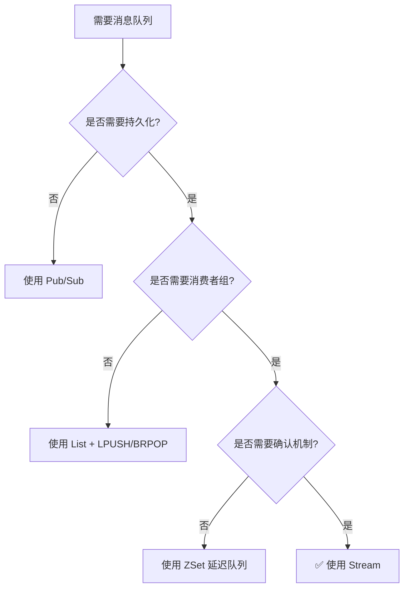
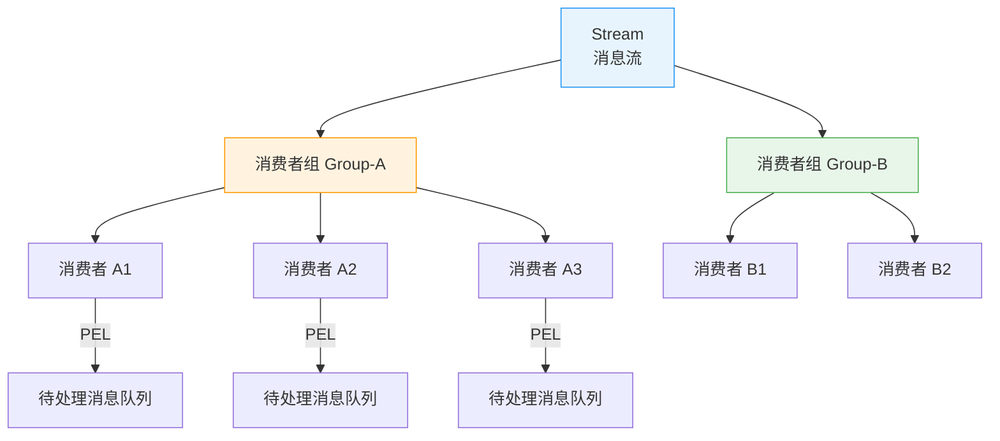
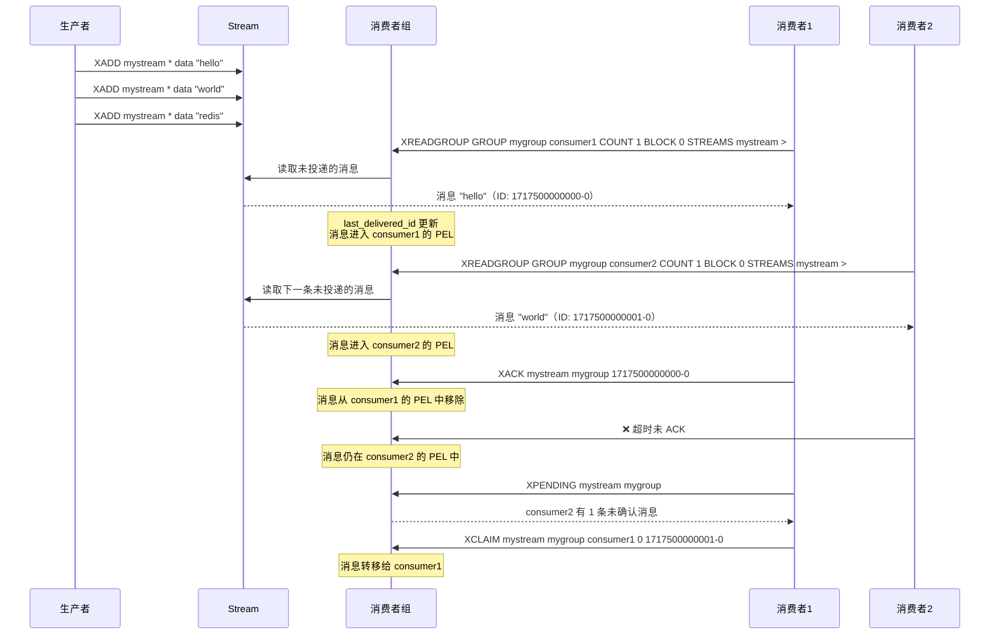
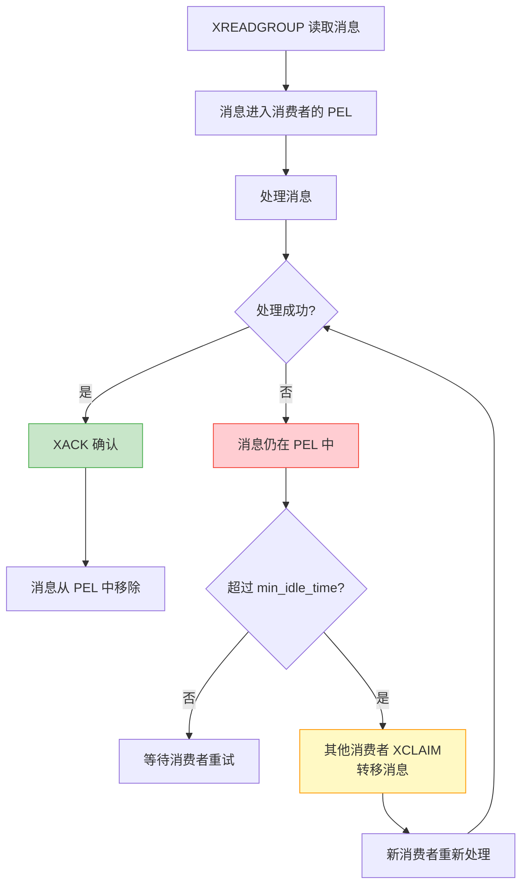
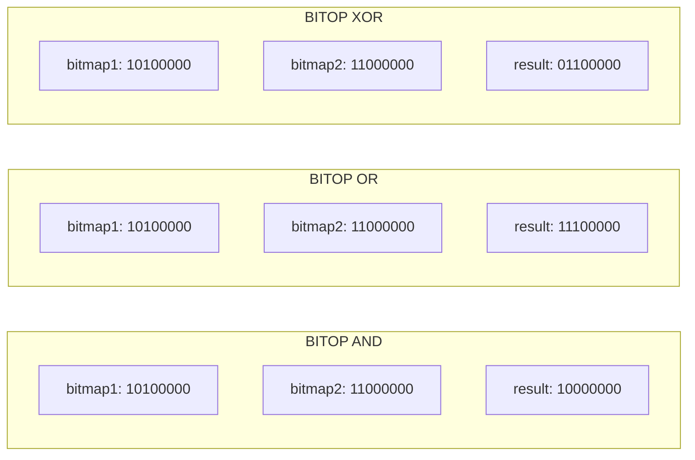
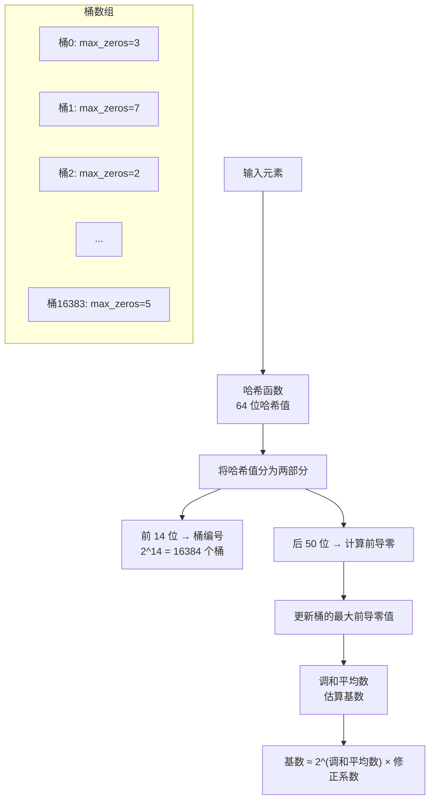
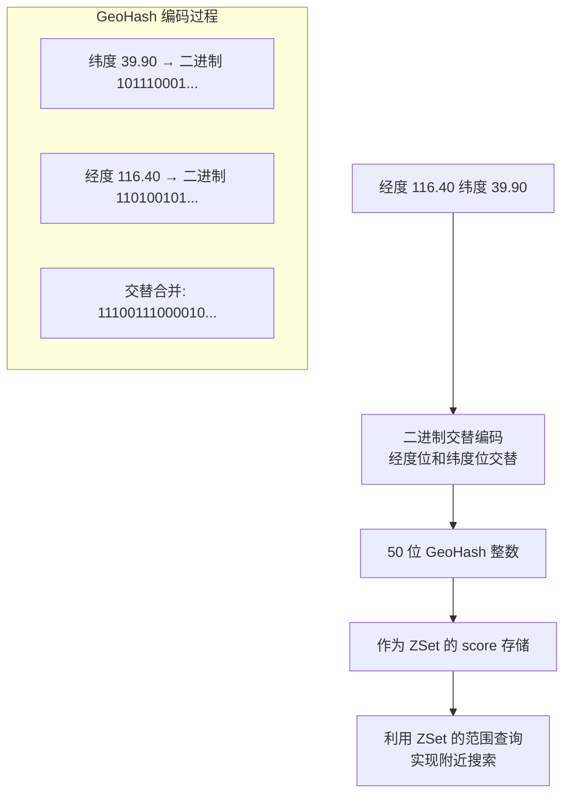
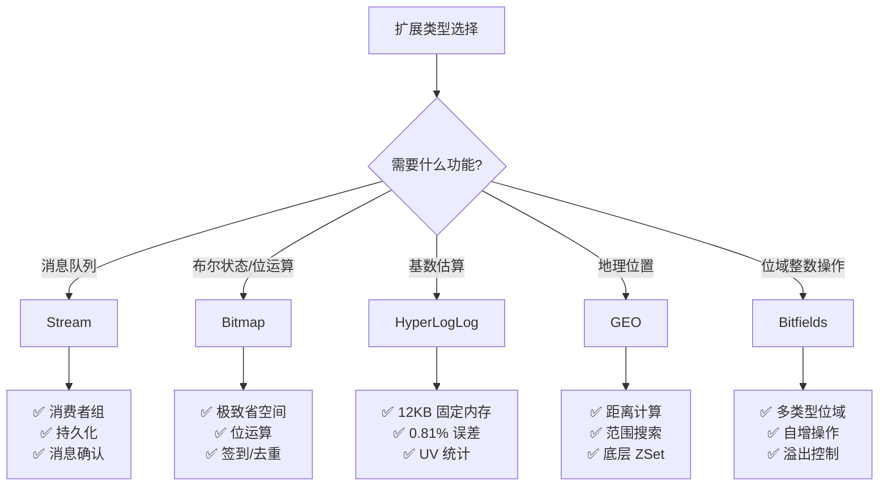
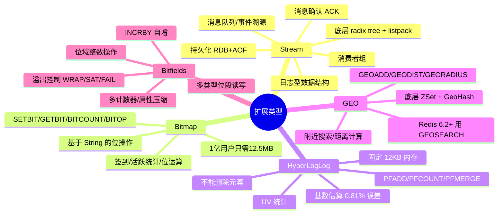

# 扩展类型

Redis 的五种基础类型（String、Hash、List、Set、ZSet）覆盖了大多数场景，但在日志流、位运算、基数统计、地理位置等特定领域，Redis 提供了更高效的扩展类型。它们不是"锦上添花"，而是在各自领域将性能提升一到数个量级 —— Stream 让消息队列成为 Redis 原生能力，Bitmap 把 1 亿用户的签到数据塞进 12 MB，HyperLogLog 用 12 KB 近似统计亿级 UV，GEO 让"附近的人"变成一条命令。

::: tip 核心要点
- **Stream**：Redis 5.0 引入的日志型数据结构，支持消费者组，是 Redis 原生的消息队列方案
- **Bitmap**：基于 String 的位运算，极致省空间，适合布尔型状态存储
- **HyperLogLog**：基数估算算法，12 KB 统计亿级 UV，误差 0.81%
- **GEO**：底层基于 ZSet，支持距离计算和范围查询
- **Bitfields**：对 String 的任意比特位做整数读写，支持自增
:::

## 1. Stream

### 1.1 Stream 是什么

Stream 是 Redis 5.0 引入的数据类型，灵感来自 Kafka 的设计理念，是一个**追加写入、持久化的日志结构**：

```bash
# 添加消息（自动生成 ID）
XADD mystream * name "Alice" age 30
# "1717500000000-0"    # 时间戳-序号 格式的 ID

XADD mystream * name "Bob" age 25
# "1717500000001-0"

# 读取消息
XRANGE mystream - +
# 1) 1) "1717500000000-0"
#    2) 1) "name"
#       2) "Alice"
#       3) "age"
#       4) "30"
# 2) 1) "1717500000001-0"
#    2) 1) "name"
#       2) "Bob"
#       3) "age"
#       4) "25"
```

### 1.2 Stream vs 其他消息方案



| 对比维度 | Pub/Sub | List 队列 | ZSet 延迟队列 | Stream |
|----------|---------|-----------|-------------|--------|
| 持久化 | ❌ | ✅ | ✅ | ✅ |
| 消费者组 | ❌ | ❌ | ❌ | ✅ |
| 消息确认 | ❌ | ❌ | ❌ | ✅（ACK） |
| 消息回溯 | ❌ | ❌ | ✅ | ✅ |
| 阻塞等待 | ✅ | ✅ | ❌ | ✅ |
| 消息堆积 | 内存溢出 | 受内存限制 | 受内存限制 | 可限制长度 |
| 消息ID | 无 | 无 | 自定义 | 自动/自定义 |

### 1.3 Stream 内部结构

Stream 在 Redis 内部使用 **radix tree（基数树）+ listpack** 的组合存储：

```c
// Redis 源码 - stream.h
typedef struct stream {
    rax *rax;               // 基数树，按 ID 索引
    uint64_t length;         // 消息总数
    streamID last_id;        // 最后一条消息的 ID
    rax *cgroups;            // 消费者组（基数树）
} stream;

typedef struct streamID {
    uint64_t ms;            // 毫秒时间戳
    uint64_t seq;           // 序号
} streamID;
```

```
Stream 内部存储结构：

radix tree（基数树）
    ├── key: "1717500000000" → listpack [msg1, msg2, ...]
    ├── key: "1717500001000" → listpack [msg3, msg4, ...]
    └── key: "1717500002000" → listpack [msg5, ...]

每个 listpack 存储同一时间段的多个消息
radix tree 按消息 ID 的前缀做路由，实现快速范围查找
```

### 1.4 Stream ID 的设计

Stream 的消息 ID 格式为 `<milliseconds>-<sequence>`：

```
1717500000000-0
│              │
└─ 毫秒时间戳   └─ 同一毫秒内的序号

同一毫秒内的第二条消息：1717500000000-1
下一毫秒的第一条消息：  1717500000001-0
```

::: important ID 的严格递增
Stream 要求新消息的 ID 必须**严格大于**已有消息的最大 ID。这意味着：
- 不能往已有消息之前插入（时间倒流）
- 同一毫秒内通过序号保证递增
- `XADD` 使用 `*` 时 Redis 自动生成递增 ID
- 手动指定 ID 时必须大于当前最大 ID
:::

```bash
# 自动生成 ID
XADD mystream * field1 value1
# "1717500000000-0"

# 手动指定 ID（必须递增）
XADD mystream 1717500000001-0 field1 value1
# OK

# 尝试插入更小的 ID → 报错
XADD mystream 1717500000000-5 field1 value1
# (error) ERR The ID specified in XADD is equal or smaller than the target stream top item
```

## 2. Stream 消费者组

### 2.1 消费者组模型

消费者组是 Stream 最核心的特性，允许多个消费者协同消费同一个 Stream：



::: info 消费者组的核心概念
- **消费者组（Consumer Group）**：一个 Stream 可以有多个消费者组，每个组独立消费
- **消费者（Consumer）**：组内的消费者，每条消息只被组内一个消费者处理
- **last_delivered_id**：消费者组已投递但未确认的最大 ID
- **PEL（Pending Entry List）**：已投递但未确认的消息列表
- **ACK**：消费者处理完消息后确认，消息从 PEL 中移除
:::

### 2.2 消费者组的详细工作流程



### 2.3 创建消费者组

```bash
# 创建消费者组
# 语法：XGROUP CREATE stream group id [MKSTREAM]
# id: $ 表示从最新消息开始, 0 表示从第一条消息开始

# 从最新消息开始消费（默认）
XGROUP CREATE mystream mygroup $ MKSTREAM
# OK

# 从第一条消息开始消费
XGROUP CREATE mystream mygroup2 0
# OK

# 从指定 ID 开始消费
XGROUP CREATE mystream mygroup3 1717500000000-0
# OK

# MKSTREAM: 如果 Stream 不存在则自动创建
```

### 2.4 消费消息

```bash
# === XREADGROUP：从消费者组读取消息 ===
# 语法：XREADGROUP GROUP group consumer [COUNT n] [BLOCK ms] STREAMS key id

# 读取新消息（> 表示未投递的消息）
XREADGROUP GROUP mygroup consumer1 COUNT 1 STREAMS mystream >
# 1) 1) "mystream"
#    2) 1) 1) "1717500000000-0"
#          2) 1) "name"
#             2) "Alice"

# 阻塞等待新消息
XREADGROUP GROUP mygroup consumer1 BLOCK 5000 STREAMS mystream >
# 阻塞最多 5 秒等待新消息

# 读取自己的未确认消息（ID 换成 0）
XREADGROUP GROUP mygroup consumer1 STREAMS mystream 0
# 返回 consumer1 的 PEL 中的消息

# === XACK：确认消息已处理 ===
XACK mystream mygroup 1717500000000-0
# (integer) 1    # 确认成功
```

::: warning XREADGROUP 的 ID 参数
- `>`：读取新消息（从未投递给任何消费者的消息）
- `0`：读取自己的 PEL（已投递但未确认的消息）
- 具体ID：读取该 ID 之后的消息（一般不用）
:::

### 2.5 消息转移与监控

```bash
# === XPENDING：查看待处理消息 ===
XPENDING mystream mygroup
# 1) (integer) 3          # 待处理消息总数
# 2) "1717500000000-0"    # 最小 ID
# 3) "1717500000002-0"    # 最大 ID
# 4) 1) 1) "consumer1"    # 各消费者的待处理数
#       2) "2"
#    2) 1) "consumer2"
#       2) "1"

# 详细查看
XPENDING mystream mygroup - + 10
# 返回每条待处理消息的详细信息

# === XCLAIM：转移消息 ===
# 将 consumer2 的超时消息转移给 consumer1
XCLAIM mystream mygroup consumer1 60000 1717500000002-0
# 参数：stream group consumer min_idle_time message_id

# === XINFO：查看 Stream 和消费者组信息 ===
XINFO STREAM mystream
# length: 5
# groups: 2
# first-entry: ...
# last-entry: ...

XINFO GROUPS mystream
# name: mygroup, consumers: 3, pending: 2, last-delivered-id: ...

XINFO CONSUMERS mystream mygroup
# name: consumer1, pending: 1, idle: 5000
# name: consumer2, pending: 2, idle: 30000
```

### 2.6 消费者组的消息确认流程



## 3. Stream 常用命令详解

### 3.1 生产者命令

```bash
# === XADD：添加消息 ===
XADD mystream * field1 value1 field2 value2
# "*" 表示自动生成 ID

# 限制 Stream 长度（类似环形缓冲区）
XADD mystream MAXLEN 1000 * field1 value1
# 最多保留 1000 条消息

# 近似限制（性能更好，允许少量超出）
XADD mystream MAXLEN ~ 1000 * field1 value1
# "~" 表示近似限制，Redis 不一定精确到 1000

# 手动指定 ID
XADD mystream 1717500000000-0 field1 value1

# === XTRIM：裁剪 Stream ===
XTRIM mystream MAXLEN 1000       # 精确裁剪到 1000 条
XTRIM mystream MAXLEN ~ 1000     # 近似裁剪
XTRIM mystream MINID 1717500000000  # 按 ID 裁剪（Redis 7.0+）

# === XLEN：获取消息数量 ===
XLEN mystream
# (integer) 5

# === XRANGE / XREVRANGE：范围查询 ===
# 获取所有消息
XRANGE mystream - +

# 指定时间范围
XRANGE mystream 1717500000000 1717500001000

# 指定开始和结束 ID
XRANGE mystream 1717500000000-0 1717500000002-0

# 限制返回数量（分页）
XRANGE mystream - + COUNT 2

# 反向查询
XREVRANGE mystream + - COUNT 5
```

### 3.2 消费者命令

```bash
# === XREAD：独立消费（不使用消费者组）===
# 非阻塞读取
XREAD COUNT 10 STREAMS mystream 0
# 从 ID=0 开始读取 10 条

# 阻塞读取
XREAD COUNT 10 BLOCK 5000 STREAMS mystream $
# "$" 表示从最新消息开始，阻塞 5 秒等待新消息

# 多个 Stream
XREAD STREAMS stream1 stream2 0 0

# === XREADGROUP：消费者组消费 ===
XREADGROUP GROUP mygroup consumer1 COUNT 1 BLOCK 2000 STREAMS mystream >

# === XACK：确认消息 ===
XACK mystream mygroup 1717500000000-0 1717500000001-0

# === XCLAIM：转移消息 ===
XCLAIM mystream mygroup consumer1 60000 1717500000002-0

# === XAUTOCLAIM：自动转移超时消息（Redis 7.0+）===
XAUTOCLAIM mystream mygroup consumer1 60000 0 COUNT 10
# 自动将空闲超过 60 秒的消息转移给 consumer1
```

### 3.3 命令速查表

| 命令 | 功能 | 时间复杂度 |
|------|------|-----------|
| `XADD` | 添加消息 | O(1) |
| `XLEN` | 消息数量 | O(1) |
| `XRANGE` | 范围查询 | O(N) |
| `XREVRANGE` | 反向范围查询 | O(N) |
| `XREAD` | 独立消费 | O(N) |
| `XREADGROUP` | 消费者组消费 | O(N) |
| `XACK` | 确认消息 | O(1) |
| `XGROUP` | 管理消费者组 | O(1) |
| `XINFO` | 查看 Stream 信息 | O(1) |
| `XPENDING` | 查看待处理消息 | O(N) |
| `XCLAIM` | 转移消息 | O(N) |
| `XTRIM` | 裁剪 Stream | O(N) |
| `XDEL` | 删除消息 | O(1) |

## 4. Stream 持久化

### 4.1 RDB 持久化

Stream 的消息会被 RDB 快照持久化：

```
RDB 保存 Stream 的内容：
- 所有消息（ID + 字段值）
- 消费者组信息（名称、last_delivered_id）
- 消费者信息（名称、PEL）
- 待处理消息

注意：
- 如果 Stream 使用了 MAXLEN，RDB 只保存当前存在的消息
- RDB 是全量快照，重启后恢复完整状态
```

### 4.2 AOF 持久化

```
AOF 记录所有写命令：
- XADD 命令会被记录
- XGROUP CREATE 命令会被记录
- XACK 命令会被记录
- XCLAIM 命令会被记录
- XTRIM 命令会被记录

AOF 重写时：
- 只保留有效消息（未被 XTRIM/XDEL 的）
- 消费者组和 PEL 信息会以内部命令形式写入
- 确保重启后能恢复完整的消费进度
```

::: important Stream 持久化的关键点
1. **MAXLEN 与持久化**：使用 `MAXLEN` 限制 Stream 长度时，超出部分的消息会被丢弃，即使 AOF 也无法恢复
2. **消费者组状态**：消费者组的 `last_delivered_id` 和 PEL 信息会被持久化，重启后消费者可以从正确的位置继续消费
3. **XDEL 不释放内存**：`XDEL` 只是标记删除，不会立即释放 listpack 中的内存，直到整个 listpack 为空才会回收
:::

## 5. Stream 应用场景

### 5.1 消息队列

```python
# Python Stream 消息队列示例
import redis
import json
import time

r = redis.Redis()

# === 生产者 ===
def publish_message(stream, data):
    msg_id = r.xadd(stream, data)
    return msg_id

# === 消费者 ===
def consume_messages(stream, group, consumer_name):
    # 确保消费者组存在
    try:
        r.xgroup_create(stream, group, id="0", mkstream=True)
    except redis.ResponseError:
        pass  # 组已存在

    while True:
        # 读取新消息
        messages = r.xreadgroup(
            group, consumer_name,
            {stream: ">"},  # ">" 表示未投递的消息
            count=10,
            block=5000      # 阻塞 5 秒
        )

        if messages:
            for stream_name, msgs in messages:
                for msg_id, data in msgs:
                    try:
                        process(data)
                        r.xack(stream, group, msg_id)  # 确认
                    except Exception as e:
                        print(f"处理失败: {e}")
                        # 消息仍在 PEL 中，可被 XCLAIM 转移

def process(data):
    print(f"处理消息: {data}")
```

### 5.2 事件溯源

```bash
# 事件流：所有状态变更以事件形式追加
XADD order:events * type "created" orderId "1001" amount 99.9
XADD order:events * type "paid" orderId "1001" payMethod "wechat"
XADD order:events * type "shipped" orderId "1001" trackingNo "SF123456"

# 查看订单的所有事件
XRANGE order:events - + COUNT 100

# 重放事件（重建状态）
# 消费者从头读取所有事件，逐步重建订单当前状态
```

### 5.3 实时数据流

```bash
# 传感器数据流
XADD sensor:temperature * sensorId "S001" value 23.5 timestamp 1717500000
XADD sensor:temperature * sensorId "S002" value 25.1 timestamp 1717500001

# 消费者实时监控
XREAD BLOCK 0 STREAMS sensor:temperature $
# 阻塞等待最新数据
```

## 6. Bitmap

### 6.1 Bitmap 是什么

Bitmap 不是一个独立的数据类型，而是基于 String 的**位操作**接口。String 的底层是二进制安全的字节数组，每个字节 8 个 bit，Bitmap 就是对这些 bit 位的操作：

```
String "ABC" 的二进制表示：
01000001 01000010 01000011
 A        B        C

Bitmap 操作的是每个 bit 位：
offset: 0  1  2  3  4  5  6  7  8  9 ...
value:  0  1  0  0  0  0  0  1  0  1 ...

SETBIT key 1 1    → 将 offset=1 的位设为 1
GETBIT key 1      → 返回 1
BITCOUNT key      → 统计值为 1 的位数
```

### 6.2 Bitmap 常用命令

```bash
# === SETBIT：设置指定位的值 ===
SETBIT user:sign:202401 0 1     # 第 0 天（1月1日）签到
SETBIT user:sign:202401 6 1     # 第 6 天（1月7日）签到
SETBIT user:sign:202401 31 1    # 第 31 天签到

# === GETBIT：获取指定位的值 ===
GETBIT user:sign:202401 0
# (integer) 1    # 1月1日已签到

GETBIT user:sign:2024001 1
# (integer) 0    # 1月2日未签到

# === BITCOUNT：统计值为 1 的位数 ===
BITCOUNT user:sign:202401
# (integer) 3    # 1 月份签到了 3 天

# 指定字节范围
BITCOUNT user:sign:202401 0 0    # 第 0 个字节（前 8 天）
BITCOUNT user:sign:202401 0 3    # 前 4 个字节（前 32 天）

# === BITPOS：查找第一个 0 或 1 的位 ===
BITPOS user:sign:202401 1        # 第一个 1 的位置
# (integer) 0

BITPOS user:sign:202401 0        # 第一个 0 的位置
# (integer) 1

# === BITOP：位运算 ===
SETBIT bitmap1 0 1
SETBIT bitmap1 2 1
SETBIT bitmap2 0 1
SETBIT bitmap2 1 1

BITOP AND result bitmap1 bitmap2  # 按位与
BITOP OR result bitmap1 bitmap2   # 按位或
BITOP XOR result bitmap1 bitmap2   # 按位异或
BITOP NOT result bitmap1           # 按位取反
```

### 6.3 位运算详解



### 6.4 内存计算

```
1 亿用户每天的签到数据：

传统关系数据库：
  1 亿行 × (user_id: 8B + date: 4B + status: 1B) ≈ 1.3 GB/天

Redis String（1 个 key/用户）：
  1 亿 × (key 开销 + value 开销) ≈ 几 GB/天

Redis Bitmap（1 个 key/天）：
  1 亿位 = 1 亿 / 8 = 12.5 MB/天
  1 个月 ≈ 375 MB

差距约 100 倍！
```

### 6.5 应用场景

#### 用户签到

```bash
# === 用户签到 ===
# Key 设计：user:sign:userId:yyyyMM
# offset = day - 1（从 0 开始）

# 用户 1001 在 2024 年 1 月 15 日签到
SETBIT user:sign:1001:202401 14 1

# 查看是否签到
GETBIT user:sign:1001:202401 14
# (integer) 1

# 查看本月签到天数
BITCOUNT user:sign:1001:202401
# (integer) 15

# 查看第一次签到的日期
BITPOS user:sign:1001:202401 1
# (integer) 2    # offset=2 → 1月3日

# === 连续签到天数 ===
# 从最后一天往前查
# 需要自己实现逻辑（Redis 没有直接命令）
```

```python
# Python 签到系统实现
import redis

r = redis.Redis()

def sign_in(user_id, year_month, day):
    key = f"user:sign:{user_id}:{year_month}"
    r.setbit(key, day - 1, 1)

def is_signed(user_id, year_month, day):
    key = f"user:sign:{user_id}:{year_month}"
    return bool(r.getbit(key, day - 1))

def sign_count(user_id, year_month):
    key = f"user:sign:{user_id}:{year_month}"
    return r.bitcount(key)

def get_sign_days(user_id, year_month):
    """获取当月所有签到的日期"""
    key = f"user:sign:{user_id}:{year_month}"
    bitmap = r.get(key)
    days = []
    if bitmap:
        for i, byte in enumerate(bitmap):
            for bit in range(8):
                if byte & (1 << (7 - bit)):
                    days.append(i * 8 + bit + 1)
    return days
```

#### 活跃用户统计

```bash
# === 日活跃用户 ===
# Key 设计：active:yyyyMMDD
# offset = user_id

# 用户 10001 今天活跃
SETBIT active:20240115 10001 1

# 用户 10002 今天活跃
SETBIT active:20240115 10002 1

# 今天活跃用户数
BITCOUNT active:20240115
# (integer) 2

# === 三天都活跃的用户（按位与）===
BITOP AND active:3days active:20240115 active:20240114 active:20240113
BITCOUNT active:3days

# === 至少一天活跃的用户（按位或）===
BITOP OR active:any3 active:20240115 active:20240114 active:20240113
BITCOUNT active:any3

# === 新增活跃用户（当天活跃但前一天不活跃，按位异或再与当天做与）===
BITOP AND new_active active:20240115 temp
```

#### 布隆过滤器的 Bitmap 替代方案

::: info 布隆过滤器简介
布隆过滤器是一种概率数据结构，用于判断元素**是否可能存在**。它可能产生假阳性（说存在但实际不存在），但不会产生假阴性（说不存在则一定不存在）。

Redis 4.0+ 通过 `RedisBloom` 模块提供了原生的布隆过滤器。但如果不想引入模块，可以用 Bitmap 手动实现一个简单的版本。
:::

```python
# 简易布隆过滤器（基于 Bitmap）
import redis
import hashlib

r = redis.Redis()

class SimpleBloomFilter:
    def __init__(self, key, size=1000000, hash_count=7):
        self.key = key
        self.size = size
        self.hash_count = hash_count

    def _get_offsets(self, value):
        """计算多个哈希值对应的 offset"""
        offsets = []
        for i in range(self.hash_count):
            h = hashlib.md5(f"{value}:{i}".encode()).hexdigest()
            offset = int(h, 16) % self.size
            offsets.append(offset)
        return offsets

    def add(self, value):
        """添加元素"""
        for offset in self._get_offsets(value):
            r.setbit(self.key, offset, 1)

    def might_contain(self, value):
        """判断元素是否可能存在"""
        for offset in self._get_offsets(value):
            if not r.getbit(self.key, offset):
                return False  # 一定不存在
        return True  # 可能存在（有假阳性概率）

# 使用
bf = SimpleBloomFilter("bloom:emails")
bf.add("test@example.com")
bf.might_contain("test@example.com")  # True
bf.might_contain("other@example.com")  # False（大概率）
```

::: warning Bitmap 布隆过滤器的局限
手动实现的布隆过滤器：
1. 不支持自动扩容（RedisBloom 模块支持）
2. 假阳性率需要手动调参（size 和 hash_count）
3. 不能删除元素（标准布隆过滤器不支持删除）
4. 推荐使用 RedisBloom 模块代替手动实现
:::

## 7. HyperLogLog

### 7.1 HyperLogLog 是什么

HyperLogLog 是一种**基数估算**算法，用极小的内存（12 KB）估算集合中不同元素的数量，标准误差约 0.81%。

```
精确统计（Set）vs 近似统计（HyperLogLog）：

1 亿 UV 精确统计（Set）：
  每个用户 ID 约 20 字节 × 1 亿 ≈ 2 GB（含 hashtable 开销约 5 GB）

1 亿 UV 近似统计（HyperLogLog）：
  固定 12 KB，无论多少用户

误差：0.81%（1 亿 UV 误差约 81 万，大多数场景可接受）
```

### 7.2 HyperLogLog 原理

HyperLogLog 的核心思想：观察哈希值的前导零（leading zeros），前导零越多，说明不同值越多。



::: info HyperLogLog 算法步骤
1. **哈希**：对每个元素做 64 位哈希（MurmurHash64）
2. **分桶**：前 14 位决定桶编号（0 ~ 16383），共 16384 个桶
3. **计算前导零**：后 50 位中连续 0 的个数
4. **更新桶**：如果当前前导零大于桶中已有值，则更新
5. **估算**：对所有桶的值取调和平均数，乘以修正系数得到基数估计

**误差来源**：哈希冲突和统计波动。0.81% 是标准误差，实际误差可能更高或更低。
:::

### 7.3 HyperLogLog 的内存结构

```
HyperLogLog 内部使用稀疏编码和密集编码两种方式：

稀疏编码（数据量小时）：
  只存储非零桶的 (桶编号, 值) 对
  适合基数较小的场景

密集编码（数据量大时）：
  16384 个桶，每个桶 6 bit（0-63）
  总大小 = 16384 × 6 / 8 = 12288 字节 ≈ 12 KB

编码转换：
  稀疏 → 密集：当稀疏编码超过 12 KB 时自动转换
  密集 → 稀疏：不会发生（不可逆）
```

### 7.4 HyperLogLog 常用命令

```bash
# === PFADD：添加元素 ===
PFADD page:home:uv "user:1001"
PFADD page:home:uv "user:1002"
PFADD page:home:uv "user:1001"    # 重复添加，不影响计数
# (integer) 1    # 1 表示基数可能变了，0 表示没变

# 批量添加
PFADD page:home:uv "user:1003" "user:1004" "user:1005"

# === PFCOUNT：获取基数估算值 ===
PFCOUNT page:home:uv
# (integer) 4    # 估算约 4 个不同用户

# === PFMERGE：合并多个 HyperLogLog ===
PFADD uv:20240115 "user:1" "user:2" "user:3"
PFADD uv:20240116 "user:2" "user:3" "user:4"

# 合并两天的 UV
PFMERGE uv:combined uv:20240115 uv:20240116
PFCOUNT uv:combined
# (integer) 4    # user:1, user:2, user:3, user:4
```

### 7.5 HyperLogLog 误差实验

```bash
# 误差实验
# 添加 10 万个不同元素
for i in $(seq 1 100000); do
    redis-cli PFADD test:hll "user:$i"
done

# 估算值
PFCOUNT test:hll
# (integer) 99832    # 误差约 0.17%

# 添加 100 万个不同元素
for i in $(seq 1 1000000); do
    redis-cli PFADD test:hll2 "user:$i"
done

PFCOUNT test:hll2
# (integer) 1002345    # 误差约 0.23%
```

### 7.6 应用场景

#### UV 统计

```python
# Python UV 统计实现
import redis

r = redis.Redis()

def record_page_view(page, user_id):
    """记录页面访问"""
    key = f"uv:{page}"
    r.pfadd(key, user_id)

def get_uv(page):
    """获取页面 UV"""
    key = f"uv:{page}"
    return r.pfcount(key)

def get_multi_day_uv(pages):
    """获取多天的总 UV"""
    keys = [f"uv:{page}" for page in pages]
    # 使用 PFMERGE 合并
    temp_key = "uv:temp:multi"
    r.pfmerge(temp_key, *keys)
    count = r.pfcount(temp_key)
    r.delete(temp_key)
    return count

# 使用
record_page_view("home:20240115", "user:1001")
record_page_view("home:20240115", "user:1002")
record_page_view("home:20240115", "user:1001")  # 重复访问
print(get_uv("home:20240115"))  # 约 2
```

#### 日/周/月 UV 统计

```bash
# 日 UV
PFADD uv:home:20240115 "user:1" "user:2" "user:3"

# 周 UV（合并 7 天）
PFMERGE uv:home:week:202403 uv:home:20240115 uv:home:20240116 ... uv:home:20240121
PFCOUNT uv:home:week:202403

# 月 UV
PFMERGE uv:home:month:202401 uv:home:20240101 ... uv:home:20240131
PFCOUNT uv:home:month:202401
```

::: warning HyperLogLog 的局限
1. **只能估算**：0.81% 标准误差，不适合需要精确计数的场景
2. **不能获取元素**：HyperLogLog 只记录基数，不能取出具体元素
3. **不能删除元素**：添加后无法移除（只增不减）
4. **合并开销**：PFMERGE 需要读取所有源 HyperLogLog 的数据
5. **小基数不准**：元素数量较少时误差较大，256 以内可能绝对误差 ±1
:::

## 8. GEO

### 8.1 GEO 是什么

GEO 是 Redis 3.2 引入的地理位置功能，支持存储地理位置信息、计算距离、范围查询。底层使用 ZSet 实现，score 存储 GeoHash 编码的值。

### 8.2 GeoHash 原理

GeoHash 将二维的经纬度编码为一维的整数值，使得地理位置相近的点，其 GeoHash 值也相近：



```
GeoHash 编码示例（北京天安门：116.397128, 39.916527）：

1. 经度范围 [-180, 180]，纬度范围 [-90, 90]
2. 对经纬度分别做二分编码（50 位）
3. 偶数位放经度，奇数位放纬度
4. 合并为 52 位整数

GeoHash 的关键特性：
- 编码值相近 → 地理位置相近
- 可以通过 ZSet 的 ZRANGEBYSCORE 实现范围查询
```

### 8.3 GEO 常用命令

```bash
# === GEOADD：添加地理位置 ===
# 语法：GEOADD key longitude latitude member [longitude latitude member ...]
GEOADD cities 116.40 39.90 "beijing"
GEOADD cities 121.47 31.23 "shanghai"
GEOADD cities 113.26 23.13 "guangzhou"
GEOADD cities 114.06 22.55 "shenzhen"
# (integer) 4

# === GEOPOS：获取坐标 ===
GEOPOS cities "beijing"
# 1) 1) "116.39999836688041687"
#    2) "39.90000057911349738"

# === GEODIST：计算距离 ===
GEODIST cities "beijing" "shanghai"
# "668537.8495"    # 约 668 公里

GEODIST cities "beijing" "shanghai" km
# "668.5378"       # 668.5 公里

# 支持的单位：m(米) km(千米) mi(英里) ft(英尺)

# === GEORADIUS：范围查询（已弃用，用 GEORADIUSBYMEMBER 或 GEOSEARCH）===
# 查找北京 500km 内的城市
GEORADIUS cities 116.40 39.90 500 km WITHDIST WITHCOORD
# 1) 1) "beijing"
#    2) "0.0000"
#    3) 1) "116.3999..."
#       2) "39.9000..."

# === GEORADIUSBYMEMBER：基于成员的范围查询 ===
# 查找广州 500km 内的城市
GEORADIUSBYMEMBER cities "guangzhou" 500 km WITHDIST
# 1) 1) "guangzhou"
#    2) "0.0"
# 2) 1) "shenzhen"
#    2) "106.8"    # 约 107 公里

# === GEOSEARCH：更灵活的范围查询（Redis 6.2+）===
# 按圆形范围搜索
GEOSEARCH cities FROMMEMBER "guangzhou" BYRADIUS 500 km WITHDIST

# 按矩形范围搜索
GEOSEARCH cities FROMLONLAT 116.40 39.90 BYBOX 1000 1000 km WITHDIST

# 排序和限制
GEOSEARCH cities FROMMEMBER "guangzhou" BYRADIUS 500 km ASC COUNT 3
```

### 8.4 GEO 底层实现

```bash
# GEO 本质上就是 ZSet
GEOADD cities 116.40 39.90 "beijing"

# 查看编码
OBJECT ENCODING cities
# "skiplist"

# 查看 GeoHash 值（score）
ZSCORE cities "beijing"
# "4069885362388496"    # GeoHash 编码的整数值

# 可以用 ZSet 的命令操作 GEO
ZREM cities "beijing"
ZRANGE cities 0 -1
ZCARD cities
```

::: important GEO 与 ZSet 的关系
GEO 的底层就是 ZSet：
- **member** = 地点名称
- **score** = GeoHash 编码的 52 位整数
- 范围查询就是 ZRANGEBYSCORE
- 距离计算是实时计算的（根据经纬度反算后用 Haversine 公式）

这意味着你可以用 ZSet 的所有命令来操作 GEO 数据，但要注意不要直接修改 score（会破坏 GeoHash 编码）。
:::

### 8.5 应用场景

#### "附近的人" / "附近的商家"

```python
# Python 附近商家搜索
import redis

r = redis.Redis()

def add_shop(shop_id, lng, lat, name):
    """添加商家位置"""
    r.geoadd("shops:location", (lng, lat, shop_id))

def search_nearby(lng, lat, radius_km=5):
    """搜索附近 5km 内的商家"""
    results = r.georadius(
        "shops:location", lng, lat, radius_km,
        unit="km", withdist=True, withcoord=True,
        sort="ASC", count=20
    )
    return results

# 使用
add_shop("shop:001", 116.40, 39.90, "星巴克国贸店")
add_shop("shop:002", 116.41, 39.91, "瑞幸望京店")

# 搜索当前位置附近 3km 的咖啡店
nearby = search_nearby(116.40, 39.90, 3)
```

#### 打车距离计算

```bash
# 司机位置上报
GEOADD drivers:location 116.401 39.902 "driver:1001"
GEOADD drivers:location 116.405 39.908 "driver:1002"

# 查找乘客附近 3km 内的司机
GEORADIUS drivers:location 116.403 39.905 3 km WITHDIST ASC COUNT 5
```

## 9. Bitfields

### 9.1 Bitfields 是什么

Bitfields（位域）是 Redis 3.2 引入的功能，允许将 String 的任意位段视为**有符号或无符号整数**进行读写和自增操作。

```
Bitmap 只能操作单个 bit（0 或 1）
Bitfields 可以操作任意长度的位段（1-63 位无符号，1-64 位有符号）

例如：一个 8 字节的 String
┌───────────┬───────────┬───────────┬───────────┐
│  u8 (8位)  │  i16(16位) │  u24(24位) │  i16(16位) │
│  offset 0  │ offset 8   │ offset 24  │ offset 48  │
└───────────┴───────────┴───────────┴───────────┘

可以在一个 String 中存储多个不同类型的整数
```

### 9.2 BITFIELD 命令

```bash
# === BITFIELD：多操作位域命令 ===
# 语法：BITFIELD key [GET type offset] [SET type offset value] [INCRBY type offset increment] [OVERFLOW WRAP|SAT|FAIL]

# GET：读取指定位段的值
BITFIELD mykey GET u8 0     # 读取 offset=0 的 8 位无符号整数
BITFIELD mykey GET i16 8    # 读取 offset=8 的 16 位有符号整数

# SET：设置指定位段的值
BITFIELD mykey SET u8 0 42       # 将 offset=0 的 8 位无符号整数设为 42
BITFIELD mykey SET i16 8 -100   # 将 offset=8 的 16 位有符号整数设为 -100

# INCRBY：对指定位段做增量
BITFIELD mykey INCRBY u8 0 10   # offset=0 的值 +10

# 多操作组合
BITFIELD mykey SET u8 0 42 SET i16 8 -100 GET u8 0 GET i16 8
```

### 9.3 类型编码

| 类型 | 含义 | 位数 | 范围 |
|------|------|------|------|
| `u8` | 无符号 8 位 | 8 | 0 ~ 255 |
| `u16` | 无符号 16 位 | 16 | 0 ~ 65535 |
| `u32` | 无符号 32 位 | 32 | 0 ~ 4294967295 |
| `u63` | 无符号 63 位 | 63 | 0 ~ 2^63-1 |
| `i8` | 有符号 8 位 | 8 | -128 ~ 127 |
| `i16` | 有符号 16 位 | 16 | -32768 ~ 32767 |
| `i32` | 有符号 32 位 | 32 | -2147483648 ~ 2147483647 |
| `i64` | 有符号 64 位 | 64 | -2^63 ~ 2^63-1 |

### 9.4 溢出控制

```bash
# OVERFLOW 控制溢出行为（跟在 INCRBY 后面）

# WRAP：环绕（默认，类似 C 语言整数溢出）
BITFIELD mykey OVERFLOW WRAP INCRBY u8 0 300
# u8 最大 255，300 会环绕为 44

# SAT：饱和（达到极值后不再变化）
BITFIELD mykey SET u8 0 250
BITFIELD mykey OVERFLOW SAT INCRBY u8 0 10
# u8 最大 255，250+10=260 → 饱和到 255

# FAIL：失败（溢出时返回 nil）
BITFIELD mykey SET u8 0 250
BITFIELD mykey OVERFLOW FAIL INCRBY u8 0 10
# (nil)    # 溢出，操作失败
```

### 9.5 应用场景

#### 多计数器

```bash
# 在一个 String 中存储多个计数器
# offset 0: u32 (用户访问计数)
# offset 32: u32 (API 调用计数)
# offset 64: u16 (错误计数)

# 初始化
BITFIELD stats SET u32 0 0 SET u32 32 0 SET u16 64 0

# 递增计数器
BITFIELD stats INCRBY u32 0 1 INCRBY u32 32 1

# 错误计数器饱和到 65535
BITFIELD stats OVERFLOW SAT INCRBY u16 64 1

# 读取所有计数器
BITFIELD stats GET u32 0 GET u32 32 GET u16 64
```

#### 用户属性压缩

```bash
# 用 Bitfield 存储用户属性
# offset 0: u8 (年龄)
# offset 8: u1 (性别 0/1)
# offset 9: u5 (等级 0-31)
# offset 14: u1 (VIP 0/1)

# 设置属性
BITFIELD user:1001 SET u8 0 25 SET u1 8 1 SET u5 9 15 SET u1 14 1

# 读取属性
BITFIELD user:1001 GET u8 0 GET u1 8 GET u5 9 GET u1 14
# 1) (integer) 25    # 年龄 25
# 2) (integer) 1     # 男
# 3) (integer) 15    # 等级 15
# 4) (integer) 1     # VIP

# 整个用户属性只占 2 字节！
```

## 10. 扩展类型对比总结



| 类型 | 底层结构 | 内存占用 | 精度 | 典型场景 |
|------|---------|---------|------|---------|
| Stream | radix tree + listpack | 消息大小 × 数量 | 精确 | 消息队列、事件流 |
| Bitmap | String（字节数组） | N/8 字节 | 精确 | 签到、活跃统计 |
| HyperLogLog | 稀疏/密集编码 | 12 KB（最大） | 0.81% 误差 | UV 统计 |
| GEO | ZSet（skiplist + hashtable） | 每个点约 60 字节 | 精确（存储） | 附近搜索、距离计算 |
| Bitfields | String（字节数组） | 按位段计算 | 精确 | 多计数器、属性压缩 |

## 11. 实战：组合使用扩展类型

### 11.1 实时 UV + 详情页面分析

```bash
# 方案：HyperLogLog（UV 估算）+ Bitmap（活跃状态）+ String（PV 计数）

# 1. HyperLogLog 记录 UV
PFADD uv:home:20240115 "user:1001"

# 2. Bitmap 记录每个用户的活跃状态
SETBIT active:20240115 1001 1

# 3. String 记录 PV
INCR pv:home:20240115

# 查询
PFCOUNT uv:home:20240115     # UV 估算
BITCOUNT active:20240115     # 活跃用户数
GET pv:home:20240115         # PV 总量
```

### 11.2 电商商品 + 地理位置搜索

```bash
# 商品信息 + 门店位置

# 1. 用 Hash 存商品详情
HSET product:1001 name "iPhone 15" price 7999 stock 100

# 2. 用 GEO 存门店位置
GEOADD stores 116.40 39.90 "store:001"

# 3. 搜索附近门店
GEORADIUS stores 116.40 39.90 5 km WITHDIST

# 4. 用 Stream 记录购买事件
XADD orders:events * productId "1001" storeId "001" amount 7999
```

## 12. 各版本扩展类型演进

| 版本 | 新增 |
|------|------|
| Redis 2.6 | SETBIT/GETBIT（Bitmap 基础命令） |
| Redis 2.8.9 | PFADD/PFCOUNT/PFMERGE（HyperLogLog） |
| Redis 3.2 | GEOADD/GEORADIUS（GEO）+ BITFIELD（Bitfields） |
| Redis 5.0 | XADD/XREAD/XGROUP（Stream） |
| Redis 6.2 | GEOSEARCH 替代 GEORADIUS |
| Redis 7.0 | XAUTOCLAIM、Stream MINID 裁剪 |

## 13. 小结



::: important 关键回顾
1. **Stream 是 Redis 原生的消息队列方案**：消费者组 + ACK + 持久化，比 Pub/Sub 和 List 队列更完善
2. **Bitmap 极致省空间**：1 亿用户的签到数据只需 12.5 MB，位运算实现集合操作
3. **HyperLogLog 用 12 KB 解决 UV 问题**：0.81% 误差在大多数统计场景可接受
4. **GEO 底层是 ZSet + GeoHash**：范围查询本质是 ZRANGEBYSCORE，距离计算用 Haversine 公式
5. **Bitfields 是 Bitmap 的增强版**：支持任意位段的整数读写和自增，溢出控制灵活
6. **选型原则**：精确需求用精确结构（Bitmap/GEO），估算需求用概率结构（HyperLogLog），消息流用 Stream
:::

## 参考

- [Redis 官方文档 - Stream](https://redis.io/docs/data-types/streams/)
- [Redis 官方文档 - Bitmap](https://redis.io/docs/data-types/bitmaps/)
- [Redis 官方文档 - HyperLogLog](https://redis.io/docs/data-types/hyperloglogs/)
- [Redis 官方文档 - GEO](https://redis.io/docs/data-types/geospatial/)
- 《Redis 设计与实现》黄健宏 —— HyperLogLog、GEO 相关章节
- 《Redis 深度历险》钱文品 —— Stream、Bitmap、HyperLogLog 原理
- 《Redis 开发与运维》付磊 —— 扩展类型的应用与优化
- Flajolet et al., "HyperLogLog: the analysis of a near-optimal cardinality estimation algorithm", 2007
- Redis 源码 `t_stream.c` / `bitops.c` / `hyperloglog.c` / `geo.c`
