# RDB 快照原理

::: info 核心问题
Redis 是内存数据库，进程退出则数据尽失。RDB（Redis Database）持久化通过生成某一时刻的内存快照，将数据以二进制文件形式落盘，确保 Redis 重启后数据可恢复。本章将深入 RDB 的触发机制、底层原理与文件格式。
:::

## 一、RDB 概述

RDB 持久化是 Redis 默认开启的持久化方式。它将 Redis 在某个时间点的全量数据以二进制形式写入磁盘，生成一个 `.rdb` 文件。这个文件紧凑、体积小、恢复速度快，是 Redis 数据备份和灾难恢复的基石。


### 1.1 RDB 的核心特征

| 特征 | 说明 |
|------|------|
| **全量快照** | 每次持久化都是内存的完整副本 |
| **二进制格式** | 紧凑的二进制编码，文件体积小 |
| **fork 子进程** | 利用操作系统的 COW 机制，主进程无阻塞 |
| **恢复极快** | 直接加载二进制文件，比 AOF 快一个数量级 |
| **不适合实时** | 定时触发，两次快照间的数据可能丢失 |

### 1.2 RDB 在 Redis 持久化体系中的位置

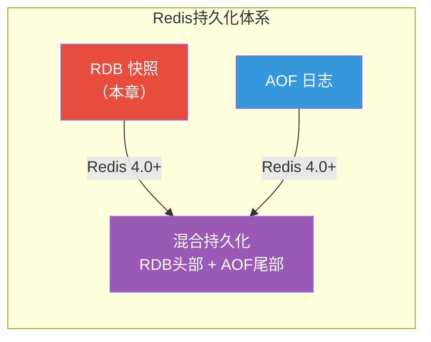

---

## 二、RDB 触发方式

RDB 快照的触发有三大类方式：手动触发、自动触发和其他触发。理解每种触发的时机与影响，是运维 Redis 的基本功。

### 2.1 手动触发

#### 2.1.1 SAVE 命令

`SAVE` 命令是 Redis 最早的持久化命令，它由**主进程**直接执行 RDB 快照生成：

```bash
# 在 redis-cli 中执行
127.0.0.1:6379> SAVE
OK
```

::: warning SAVE 会阻塞主线程
`SAVE` 命令由主进程执行，在生成 RDB 文件期间，Redis 服务器**完全阻塞**，无法响应任何客户端请求。对于生产环境中动辄数 GB 的 Redis 实例，阻塞时间可能长达数秒甚至数十秒，这是不可接受的。

**生产环境绝对不要使用 `SAVE` 命令！**
:::

**SAVE 执行流程：**

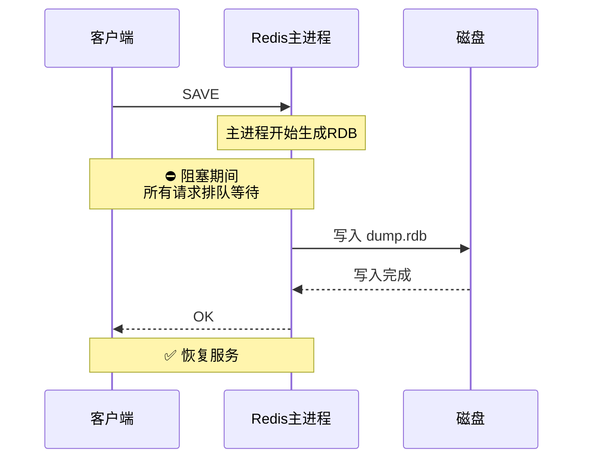

**SAVE 的关键参数：**

```bash
# 查看最后一次 SAVE 的耗时
127.0.0.1:6379> LASTSAVE
(integer) 1717500000

# INFO 命令中的 RDB 相关信息
127.0.0.1:6379> INFO persistence
# rdb_last_save_time:1717500000
# rdb_last_bgsave_status:ok
```

#### 2.1.2 BGSAVE 命令

`BGSAVE`（Background Save）是生产环境唯一推荐的手动触发方式。它通过 `fork()` 创建子进程，由子进程负责生成 RDB 文件，主进程继续服务客户端：

```bash
127.0.0.1:6379> BGSAVE
Background saving started
```

::: tip BGSAVE 是生产环境的标配
`BGSAVE` 利用了 Linux 的 `fork()` + COW 机制，子进程共享父进程的内存页，只有当主进程修改某个内存页时才复制该页。这使得 RDB 生成过程对主进程的影响极小。
:::

**BGSAVE 执行流程：**

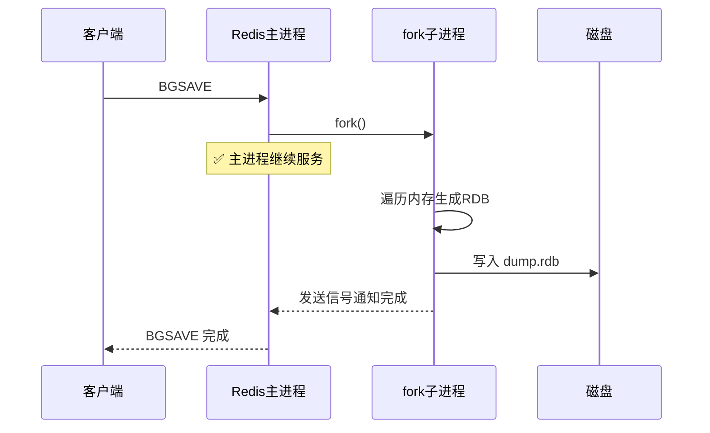

**对比 SAVE 与 BGSAVE：**

| 维度 | SAVE | BGSAVE |
|------|------|--------|
| 执行者 | 主进程 | fork 子进程 |
| 阻塞 | 全程阻塞 | 仅 fork 瞬间阻塞 |
| 适用场景 | 调试/已停服 | 生产环境 |
| 内存占用 | 无额外开销 | fork 时 2x 内存 |
| 命令互斥 | 与 BGSAVE 互斥 | 与 SAVE/BGREWRITEAOF 互斥 |

::: important 命令互斥规则
- SAVE 与 BGSAVE 互斥：避免两个进程同时生成 RDB，产生竞争条件
- BGSAVE 与 BGSAVE 互斥：同一时刻只允许一个子进程做 RDB
- BGSAVE 与 BGREWRITEAOF 互斥：虽然操作不同，但都是重磁盘 I/O 操作，同时执行会严重影响性能
:::

### 2.2 自动触发

自动触发是 Redis 根据配置的**保存条件**（save conditions）自动执行 `BGSAVE`。这是 Redis 默认的持久化策略。

#### 2.2.1 save 配置项

Redis 的 `redis.conf` 中通过 `save` 配置项定义自动触发规则：

```bash
# redis.conf 中的默认配置
save 900 1      # 900秒（15分钟）内有至少1次修改
save 300 10     # 300秒（5分钟）内有至少10次修改
save 60 10000   # 60秒（1分钟）内有至少10000次修改
```

::: info save 规则解读
每条 `save <秒> <修改次数>` 的含义是：在指定的**秒数**内，如果至少发生了**修改次数**次数据变更（写操作），则自动触发 BGSAVE。

三条规则是 **OR** 关系 —— 满足任意一条即触发。Redis 的 `dirty` 计数器记录自上次 BGSAVE 以来的修改次数，`lastsave` 记录上次 BGSAVE 完成的时间。
:::

**自动触发的判定流程：**

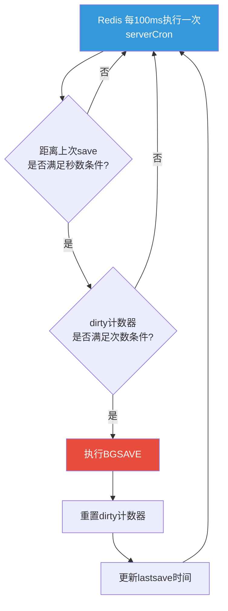

#### 2.2.2 禁用自动 RDB

在某些场景下（如纯缓存场景），可能需要关闭 RDB 持久化：

```bash
# 方法1：在 redis.conf 中配置空save
save ""

# 方法2：命令行动态关闭
127.0.0.1:6379> CONFIG SET save ""
OK
```

::: warning 关闭 RDB 不等于删除 RDB 文件
配置 `save ""` 只是关闭了自动触发，已有的 `dump.rdb` 文件并不会被删除。Redis 重启时仍会加载该文件。如果需要彻底清除，需要手动删除 RDB 文件。
:::

#### 2.2.3 save 配置调优

不同的业务场景对数据安全性的要求不同，save 配置也需要针对性调优：

```bash
# 场景1：缓存型 —— 允许丢失更多数据，降低持久化频率
save 900 1
save 1800 10    # 30分钟内有10次修改

# 场景2：存储型 —— 尽量减少数据丢失
save 900 1
save 300 10
save 60 10000   # 保持默认配置

# 场景3：极高安全要求
save 60 1       # 1分钟内有1次修改就触发
save 10 1000    # 10秒内有1000次修改就触发
```

::: important 调优的权衡
提高 BGSAVE 频率可以减少数据丢失，但代价是：
1. **磁盘 I/O 增加**：频繁写 RDB 文件影响磁盘性能
2. **fork 开销增加**：每次 BGSAVE 都要 fork 子进程，消耗 CPU 和内存
3. **COW 压力增大**：BGSAVE 期间主进程的写操作触发页复制，内存峰值可能翻倍
:::

### 2.3 其他触发方式

除了手动和自动触发，还有以下场景会触发 RDB：

#### 2.3.1 主从复制中的全量同步

当从节点首次连接主节点或无法进行部分重同步时，主节点会执行 `BGSAVE` 生成 RDB 发送给从节点：

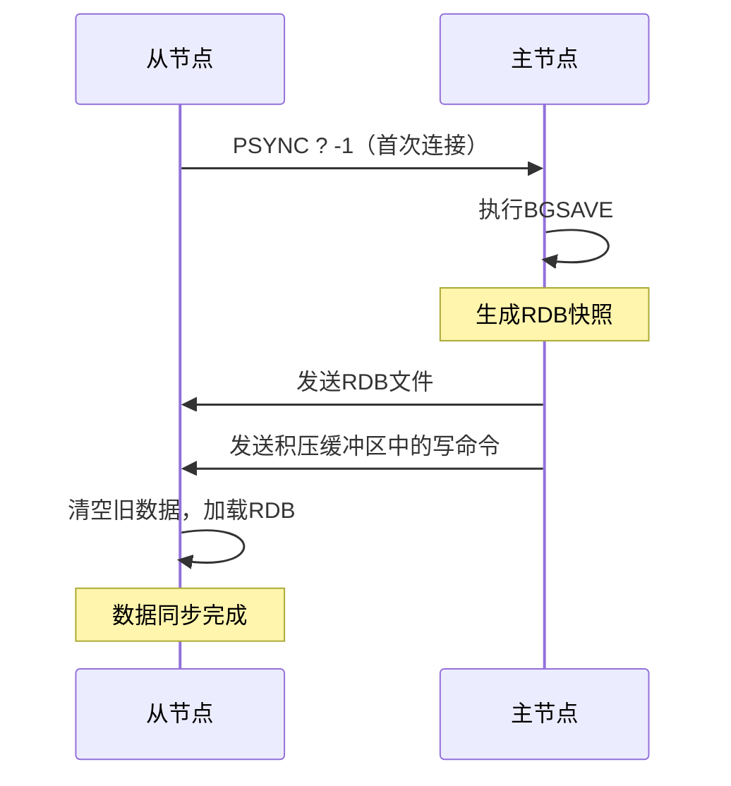

#### 2.3.2 DEBUG RELOAD

调试命令 `DEBUG RELOAD` 会先执行 RDB 保存，再重新加载：

```bash
# 调试用，生产环境禁止使用
127.0.0.1:6379> DEBUG RELOAD
OK
```

#### 2.3.3 SHUTDOWN 命令

默认情况下，Redis 在执行 `SHUTDOWN` 时会先执行一次 `BGSAVE`（如果没有开启 AOF 的话），确保数据不会因关机而丢失：

```bash
# 正常关机会触发RDB保存
127.0.0.1:6379> SHUTDOWN
# Redis 先 BGSAVE，保存完成后关闭
```

::: tip SHUTDOWN 的行为逻辑
1. 如果开启了 AOF，SHUTDOWN 只刷 AOF，不生成 RDB
2. 如果只开启了 RDB，SHUTDOWN 会先 BGSAVE 再关闭
3. `SHUTDOWN NOSAVE` 跳过持久化直接关闭
:::

#### 2.3.4 FLUSHALL / FLUSHDB

执行 `FLUSHALL` 或 `FLUSHDB` 时，如果配置了 RDB 持久化，Redis 会生成一个**空的 RDB 文件**，用以记录"数据已被清空"这一事实：

```bash
127.0.0.1:6379> FLUSHALL
OK
# 会生成一个几乎为空的 dump.rdb
# 重启后加载也是空的 —— 数据确实被清除了
```

::: warning FLUSHALL 的陷阱
如果你不小心执行了 `FLUSHALL`，RDB 文件会被覆盖为空文件，此时**不要重启 Redis**！正确的做法是：
1. 立即停止 Redis 进程（`kill -9`，不要用 `SHUTDOWN`）
2. 找到 RDB 文件的备份或 AOF 文件
3. 用备份文件恢复数据
:::

---

## 三、fork() 与 COW 厬理

`fork()` 和 COW（Copy-On-Write，写时复制）是 RDB 持久化能够在不阻塞主线程的情况下完成的核心机制。理解这对技术组合，是理解 RDB 性能特征的关键。

### 3.1 fork() 系统调用

`fork()` 是 Unix/Linux 系统调用，用于创建新进程。调用一次，返回两次：

```c
#include <unistd.h>
#include <stdio.h>

int main() {
    pid_t pid = fork();

    if (pid == 0) {
        // 子进程
        printf("I am child, pid = %d\n", getpid());
    } else if (pid > 0) {
        // 父进程
        printf("I am parent, child pid = %d\n", pid);
    } else {
        // fork 失败
        perror("fork failed");
    }
    return 0;
}
```

**fork() 在 Redis 中的行为：**

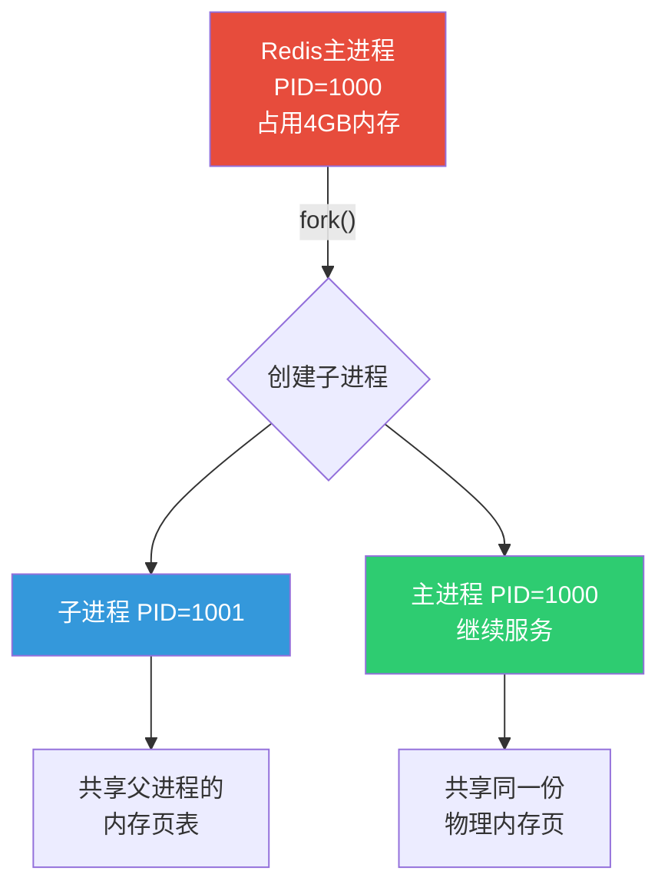

::: important fork() 的关键特性
1. **共享物理内存**：fork 后，子进程与父进程共享同一份物理内存页，而非复制
2. **页表复制**：fork 复制的是**页表**（虚拟内存到物理内存的映射），不是物理内存
3. **写时保护**：所有内存页被标记为只读，任一方尝试写入时触发页错误
:::

### 3.2 fork() 的性能问题

虽然 fork 本身不复制物理内存，但它需要**复制页表**，这个过程在大内存实例上可能很慢：

| 实例内存 | 页表大小 | fork 耗时 | 对主线程影响 |
|---------|---------|----------|------------|
| 1 GB | ~8 MB | < 1ms | 几乎无感 |
| 4 GB | ~32 MB | ~5ms | 轻微抖动 |
| 16 GB | ~128 MB | ~20ms | 可感知延迟 |
| 64 GB | ~512 MB | ~80ms | 明显卡顿 |
| 256 GB | ~2 GB | ~300ms+ | 严重阻塞 |

::: warning 大内存实例的 fork 痛点
Redis 主线程执行 fork() 时是**同步阻塞**的。虽然 fork 后子进程独立运行，但 fork 本身需要复制页表，这个过程中主线程无法处理任何请求。

**优化建议：**
- 单实例内存控制在 10GB 以内
- 使用 `info memory` 监控 `used_memory_rss`
- 开启 Linux 的透明大页（THP）要**关闭**——它会显著增加 fork 延迟
:::

```bash
# 检查 THP 状态
cat /sys/kernel/mm/transparent_hugepage/enabled

# 关闭 THP
echo never > /sys/kernel/mm/transparent_hugepage/enabled

# 永久关闭，在 /etc/rc.local 中添加
echo never > /sys/kernel/mm/transparent_hugepage/enabled
```

### 3.3 COW（Copy-On-Write）原理

COW 是 fork 后的内存管理策略。其核心思想是：**只有当某个内存页被修改时，才复制该页**。

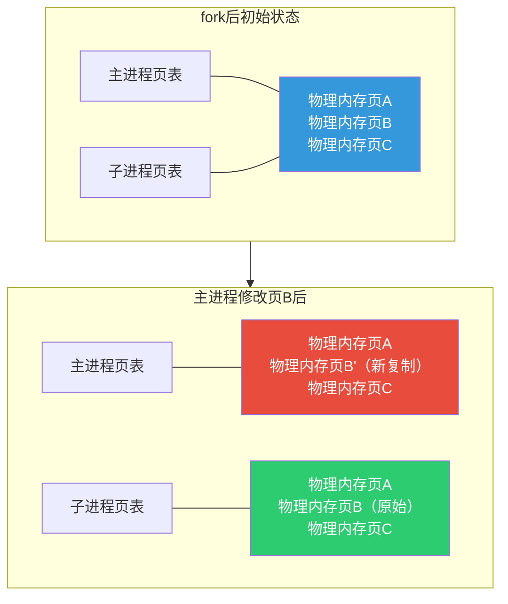

**COW 的详细工作流程：**

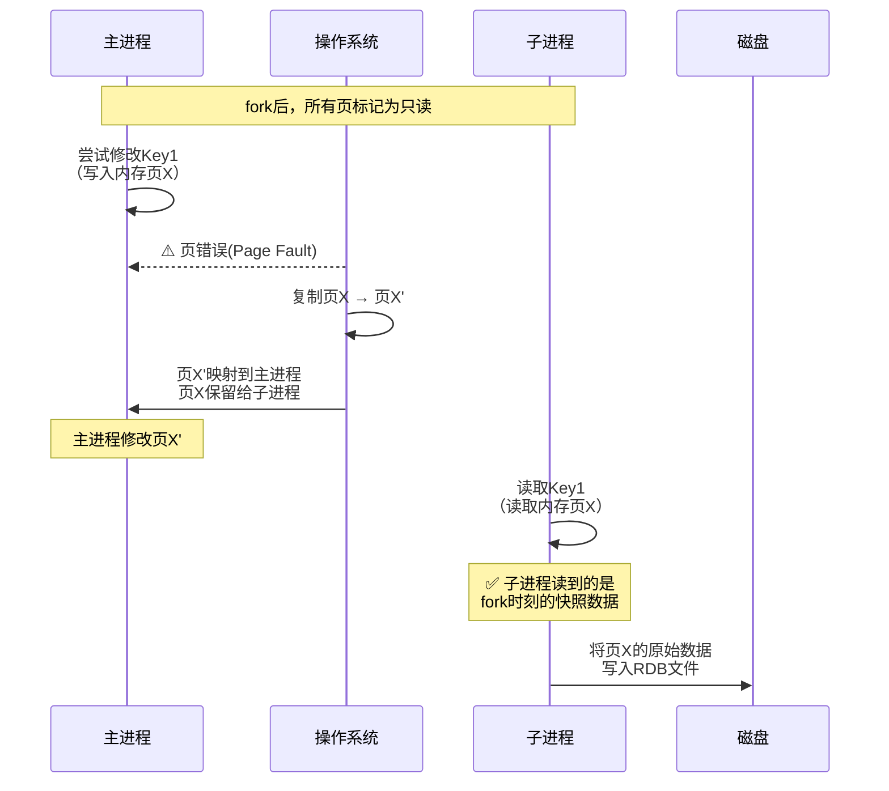

::: tip COW 的精妙之处
1. **子进程视角**：看到的是 fork 瞬间的完整内存快照，不受后续修改影响
2. **主进程视角**：正常读写，只在首次写入某页时有一次额外的页复制开销
3. **内存视角**：只有被修改的页才复制，大部分内存页是共享的
:::

### 3.4 COW 对内存的影响

BGSAVE 期间，内存使用量取决于主进程的写操作频率：

```
实际内存占用 = 基础内存 + 被修改的内存页数量 × 页大小

# Linux 默认页大小为 4KB
# 假设实例 4GB，BGSAVE 期间 10% 的页被修改
额外内存 = 4GB × 10% = 400MB
峰值内存 ≈ 4GB + 400MB = 4.4GB
```

::: warning 内存溢出风险
在极端情况下（BGSAVE 期间大量写操作），COW 可能导致内存几乎翻倍：

```bash
# 监控 fork 期间的内存变化
127.0.0.1:6379> INFO memory
used_memory:4294967296        # 4GB
used_memory_rss:4831838208    # 4.5GB（含COW额外开销）

# 监控 COW 开销
127.0.0.1:6379> INFO stats
# fork 的 COW 开销
rdb_last_bgsave_cow_size:429496729  # 约400MB的COW开销
```

**预防措施：**
- 确保 Redis 机器预留 50% 以上可用内存
- BGSAVE 期间降低写操作频率
- 监控 `rdb_last_bgsave_cow_size` 指标
- 考虑使用 `client-output-buffer-limit` 限制从节点复制缓冲区
:::

### 3.5 完整的 BGSAVE fork COW 流程

将 fork 和 COW 组合起来，完整的 BGSAVE 流程如下：

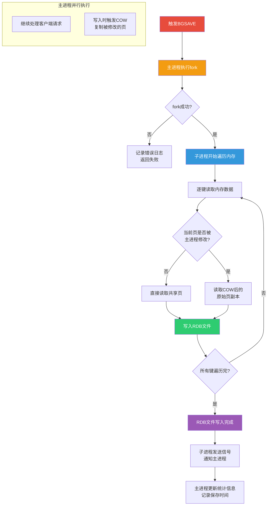

---

## 四、BGSAVE 完整流程详解

### 4.1 流程概览

BGSAVE 的执行涉及主进程和子进程的协作，以下是完整的步骤拆解：

```mermaid
flowchart TD
    A[1. 接收BGSAVE命令] --> B[2. 检查前置条件]
    B --> C{"是否已有<br/>BGSAVE/BGREWRITEAOF<br/>在执行?"}
    C -->|是| D["返回错误<br/>ERR Background save already in progress"]
    C -->|否| E[3. 主进程执行fork]
    E --> F{fork返回值}
    F -->|< 0| G["fork失败<br/>记录日志"]
    F -->|= 0| H[子进程执行路径]
    F -->|> 0| I[主进程执行路径]

    H --> H1[4. 子进程：关闭监听套接字]
    H1 --> H2[5. 子进程：调用rdbSave()]
    H2 --> H3[6. 子进程：遍历所有数据库]
    H3 --> H4[7. 子进程：逐键序列化写入临时文件]
    H4 --> H5[8. 子进程：临时文件rename为dump.rdb]
    H5 --> H6[9. 子进程：发送信号通知主进程]
    H6 --> H7[10. 子进程：退出]

    I --> I1[11. 主进程：记录子进程PID]
    I1 --> I2[12. 主进程：继续处理请求]

    H6 --> I3[13. 主进程：收到完成信号]
    I3 --> I4[14. 主进程：更新lastsave等统计]
    I4 --> I5[15. 主进程：重置dirty计数器]

    style A fill:#e74c3c,color:#fff
    style H fill:#3498db,color:#fff
    style I fill:#2ecc71,color:#fff
    style H5 fill:#9b59b6,color:#fff
```

### 4.2 源码级流程分析

以下是 Redis 源码中 BGSAVE 核心逻辑的简化版本（基于 Redis 7.x）：

```c
// rdb.c - BGSAVE 入口
int rdbSaveBackground(int req, char *filename, redisDb *db, int flags) {
    pid_t childpid;

    // 检查是否已有子进程在运行
    if (hasActiveChildProcess()) {
        return C_ERR;
    }

    // 记录fork前的dirty计数
    server.dirty_before_bgsave = server.dirty;

    // 主进程 fork
    if ((childpid = redisFork()) == 0) {
        /* --- 子进程 --- */
        redisSetProcTitle("redis-rdb-bgsave");
        redisSetCpuAffinity(server.bgsave_cpulist);

        // 关闭监听套接字，不再接受新连接
        closeListeningSockets(0);

        // 执行 RDB 保存
        int retval = rdbSave(req, filename, db, flags);

        // 发送完成信号
        if (retval == C_OK) {
            sendChildGoodbye(CHILD_INFO_TYPE_RDB, 0, 0);
        }
        exitFromChild((retval == C_OK) ? 0 : 1);
    } else {
        /* --- 父进程 --- */
        if (childpid == -1) {
            // fork 失败
            serverLog(LL_WARNING,
                "Can't save in background: fork: %s", strerror(errno));
            return C_ERR;
        }
        serverLog(LL_NOTICE,
            "Background saving started by pid %d", childpid);
        // 记录子进程信息
        server.rdb_child_pid = childpid;
        server.rdb_child_type = RDB_CHILD_TYPE_DISK;
        updateDictResizePolicy(); // 关闭字典rehash
        return C_OK;
    }
}
```

### 4.3 关键步骤详解

#### 4.3.1 fork 前的检查

```c
// 检查是否已有子进程
int hasActiveChildProcess(void) {
    return server.rdb_child_pid != -1 ||
           server.aof_child_pid != -1 ||
           server.module_child_pid != -1;
}
```

::: important BGSAVE 期间禁止字典 rehash
Redis 在 BGSAVE 期间会关闭字典的 rehash 操作。原因很简单：rehash 会大量修改内存页，导致 COW 复制大量页面，内存暴增。

```c
// BGSAVE 期间关闭 rehash
void updateDictResizePolicy(void) {
    if (hasActiveChildProcess()) {
        dictEnableResize = 0; // 禁止 rehash
    } else {
        dictEnableResize = 1; // 允许 rehash
    }
}
```

BGSAVE 结束后，Redis 会尽快执行积压的 rehash 操作。
:::

#### 4.3.2 子进程的 RDB 保存

子进程的核心工作是遍历所有数据库的所有键，将其序列化写入临时文件：

```c
int rdbSaveRio(int req, rio *rdb, int *error, int flags, rdbSaveInfo *rsi) {
    // 1. 写入 RDB 魔数（REDIS）
    if (rdbWriteRaw(rdb, magic, 9) == -1) goto werr;

    // 2. 写入版本号
    snprintf(magic, sizeof(magic), "REDIS%04d", RDB_VERSION);

    // 3. 遍历所有数据库
    for (j = 0; j < server.dbnum; j++) {
        redisDb *db = server.db + j;

        // 3.1 写入 SELECTDB 标识 + 数据库编号
        if (rdbSaveType(rdb, RDB_OPCODE_SELECTDB) == -1) goto werr;
        if (rdbSaveLen(rdb, j) == -1) goto werr;

        // 3.2 遍历该数据库的所有键
        dictIterator *di = dictGetIterator(db->dict);
        while ((de = dictNext(di)) != NULL) {
            sds keystr = dictGetKey(de);
            robj key, *o = dictGetVal(de);
            initStaticStringObject(key, keystr);

            // 3.3 保存键值对的过期时间
            long long expire = getExpire(db, &key);
            if (expire != -1) {
                if (rdbSaveType(rdb, RDB_OPCODE_EXPIRETIME_MS) == -1)
                    goto werr;
                if (rdbSaveMillisecondTime(rdb, expire) == -1)
                    goto werr;
            }

            // 3.4 保存键值对数据
            if (rdbSaveObject(rdb, o, &key, db->id, &saveinfo) == -1)
                goto werr;
        }
        dictReleaseIterator(di);
    }

    // 4. 写入 EOF 标识
    if (rdbSaveType(rdb, RDB_OPCODE_EOF) == -1) goto werr;

    // 5. 写入 CRC64 校验和
    uint64_t cksum = rdb->cksum;
    if (rdbSaveLen(rdb, cksum) == -1) goto werr;

    return C_OK;
}
```

#### 4.3.3 临时文件的原子重命名

子进程先写入临时文件，完成后才 rename 为正式文件，确保原子性：

```c
// 临时文件路径
snprintf(tmpfile, sizeof(tmpfile), "temp-%d.rdb", (int) getpid());

// 写入完成后的原子重命名
if (rename(tmpfile, filename) == -1) {
    serverLog(LL_WARNING,
        "Error moving temp DB file on the final destination: %s",
        strerror(errno));
    unlink(tmpfile);
    return C_ERR;
}
```

::: tip 原子性保证
使用临时文件 + rename 的方式保证了 RDB 文件的原子性：
- 如果写入过程中崩溃，临时文件损坏但不影响已有的 `dump.rdb`
- 如果 rename 过程中崩溃，最多丢失本次快照，但已有的 `dump.rdb` 仍可用
- rename 在同一文件系统上是原子操作
:::

### 4.4 BGSAVE 期间的时间线

```mermaid
gantt
    title BGSAVE 时间线
    dateFormat X
    axisFormat %s秒

    section 主进程
    fork阻塞（复制页表） :done, 0, 2
    正常服务客户端请求 :active, 2, 30
    收到完成信号，更新统计 :crit, 30, 31

    section 子进程
    遍历DB 0           :active, 2, 10
    遍历DB 1           :active, 10, 18
    遍历DB 2~15        :active, 18, 25
    写入临时文件+rename :crit, 25, 29
    发送信号+退出       :done, 29, 30
```

---

## 五、RDB 文件格式

### 5.1 文件整体结构

RDB 文件是一个紧凑的二进制文件，其结构如下：

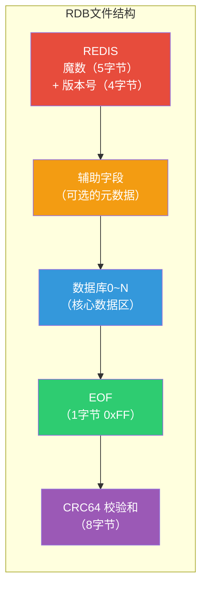

### 5.2 各部分详解

#### 5.2.1 魔数与版本号

```
REDIS0011    # 魔数 "REDIS" + 版本号 "0011"（RDB 版本 11）
```

| 字段 | 长度 | 说明 |
|------|------|------|
| 魔数 | 5 字节 | 固定为 "REDIS"，用于快速识别 RDB 文件 |
| 版本号 | 4 字节 | 十进制 ASCII 码，如 "0011" 表示 RDB 版本 11 |

::: info 版本兼容性
Redis 向下兼容，新版本可以读取旧版本的 RDB 文件，但旧版本无法读取新版本的 RDB 文件。版本号范围：0001 ~ 0012（Redis 7.2）。
:::

#### 5.2.2 辅助字段（Auxiliary Fields）

从 RDB 版本 7 开始，增加了辅助字段区域，用于存储元数据：

```
opcode: 0xFA (RDB_OPCODE_AUX)
key: "redis-ver"    -> value: "7.2.0"
key: "redis-bits"   -> value: "64"
key: "ctime"        -> value: "1717500000"
key: "used-mem"     -> value: "4294967296"
key: "aof-preamble" -> value: "0"  （是否包含AOF前导）
key: "redis-ver"    -> value: "7.2.4"
```

**使用 `redis-rdb-tools` 查看辅助字段：**

```bash
# 安装工具
pip install rdb-tools

# 解析 RDB 文件头部信息
rdb --command json dump.rdb | head -20
```

#### 5.2.3 数据库区域

每个数据库区域的结构：

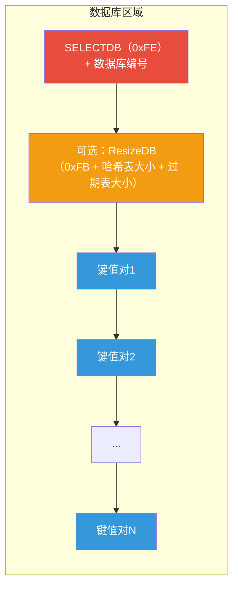

**每个键值对的编码格式：**

```
[EXPIRETIME_MS opcode] [过期时间] [SELECTDB opcode] [数据库编号]
[类型标识] [键名] [值数据]
```

**类型标识对应关系：**

| 类型标识 | 值 | Redis 类型 |
|---------|-----|-----------|
| RDB_TYPE_STRING | 0 | String |
| RDB_TYPE_LIST | 1 | List |
| RDB_TYPE_SET | 2 | Set |
| RDB_TYPE_ZSET | 3 | ZSet |
| RDB_TYPE_HASH | 4 | Hash |
| RDB_TYPE_ZSET_2 | 5 | ZSet (double 编码) |
| RDB_TYPE_MODULE | 6 | Module |
| RDB_TYPE_MODULE_2 | 7 | Module (v2) |
| RDB_TYPE_HASH_ZIPMAP | 9 | Hash (zipmap 编码) |
| RDB_TYPE_LIST_ZIPLIST | 10 | List (ziplist 编码) |
| RDB_TYPE_SET_INTSET | 11 | Set (intset 编码) |
| RDB_TYPE_ZSET_ZIPLIST | 12 | ZSet (ziplist 编码) |
| RDB_TYPE_HASH_ZIPLIST | 13 | Hash (ziplist 编码) |
| RDB_TYPE_LIST_QUICKLIST | 14 | List (quicklist 编码) |
| RDB_TYPE_STREAM_LISTPACKS | 15 | Stream |
| RDB_TYPE_HASH_LISTPACK | 16 | Hash (listpack 编码) |
| RDB_TYPE_ZSET_LISTPACK | 17 | ZSet (listpack 编码) |
| RDB_TYPE_LIST_QUICKLIST_2 | 18 | List (quicklist v2) |
| RDB_TYPE_STREAM_LISTPACKS_2 | 19 | Stream (v2) |
| RDB_TYPE_SET_LISTPACK | 20 | Set (listpack 编码) |
| RDB_TYPE_HASH_LISTPACK_2 | 21 | Hash (listpack v2) |

#### 5.2.4 EOF 与校验和

```
0xFF                    # EOF 标识（1字节）
0x1234567890ABCDEF     # CRC64 校验和（8字节）
```

::: important CRC64 校验
RDB 文件末尾包含 CRC64 校验和，用于检测文件完整性。Redis 加载 RDB 文件时会验证校验和：

```bash
# 开启/关闭 RDB 校验
redis.conf:
rdbchecksum yes   # 默认开启，建议保持开启

# 关闭校验可提升约 10% 的保存/加载速度
# 但牺牲了数据完整性检测能力，不推荐关闭
```
:::

### 5.3 RDB 文件格式示例

以下是一个包含少量数据的 RDB 文件二进制结构：

```
REDIS0011              # 魔数 + 版本号
FA                     # AUX opcode
0A redis-ver           # key: "redis-ver"
06 37 2E 32 2E 30      # value: "7.2.0"
FA                     # AUX opcode
0A redis-bits          # key: "redis-bits"
C0 40                  # value: 64
FA                     # AUX opcode
05 ctime               # key: "ctime"
...
FE 00                  # SELECTDB 0（选择数据库0）
FB 03 01               # ResizeDB: 3个键, 1个过期键
00 03 foo 03 bar       # String: key="foo", value="bar"
FC 0E A6 5C 48 01 00   # EXPIRETIME_MS: 1717500000000
00 05 hello 05 world   # String: key="hello", value="world" (带过期)
00 06 number C0 2A     # String: key="number", value=42
FF                     # EOF
12 34 56 78 90 AB CD EF # CRC64
```

### 5.4 用十六进制查看 RDB 文件

```bash
# 使用 xxd 查看二进制
xxd dump.rdb | head -30

# 输出示例：
# 00000000: 5245 4449 5330 3031 31fa 0a72 6564 6973  REDIS0011..redis
# 00000010: 2d76 6572 0637 2e32 2e30 fa0a 7265 6469  -ver.7.2.0..redi
# 00000020: 732d 6269 7473 c040 fa05 6374 696d 65c0  s-bits.@..ctime.
```

```bash
# 使用 redis-rdb-tools 解析
rdb -c protocol dump.rdb

# 输出示例：
# SELECT 0
# SET foo bar
# EXPIRETIME 1717500000
# SET hello world
# SET number 42
```

---

## 六、RDB 优缺点分析

### 6.1 RDB 的优势

::: tip RDB 的核心优势
1. **紧凑高效**：二进制格式，文件体积远小于 AOF
2. **恢复极快**：直接加载二进制数据，恢复速度是 AOF 的 10 倍以上
3. **对主进程影响小**：fork+COW 机制，主进程几乎无阻塞
4. **适合备份**：定期生成 RDB 文件，方便增量备份和跨机房传输
5. **灾难恢复友好**：单个紧凑文件，易于归档和传输
:::

**恢复速度对比实测：**

| 数据量 | RDB 恢复耗时 | AOF 恢复耗时 | 倍数 |
|-------|------------|------------|------|
| 1 GB | ~2s | ~20s | 10x |
| 4 GB | ~8s | ~90s | 11x |
| 16 GB | ~30s | ~6min | 12x |
| 64 GB | ~2min | ~25min | 12x |

### 6.2 RDB 的劣势

::: warning RDB 的核心劣势
1. **数据丢失风险**：定时快照，两次快照间的数据可能全部丢失
2. **fork 开销**：大内存实例 fork 耗时长，COW 内存峰值可能翻倍
3. **不适合实时持久化**：无法做到秒级持久化
4. **版本兼容问题**：不同 Redis 版本的 RDB 格式可能不兼容
5. **全量快照**：每次都是全量，无法增量持久化
:::

**数据丢失场景分析：**


### 6.3 RDB vs AOF 对比总览

| 维度 | RDB | AOF |
|------|-----|-----|
| 持久化方式 | 全量快照 | 增量日志 |
| 数据安全性 | 可能丢失分钟级数据 | 最多丢失1秒数据 |
| 文件体积 | 小（二进制压缩） | 大（文本日志） |
| 恢复速度 | 极快 | 较慢（重放命令） |
| 系统开销 | fork+COW | 每次写入追加日志 |
| 适用场景 | 备份/灾难恢复 | 数据安全优先 |
| 默认开启 | 是 | 否（Redis 7.x默认仍关闭） |

---

## 七、RDB 恢复速度分析

### 7.1 恢复过程

Redis 启动时检测 RDB 文件的过程：

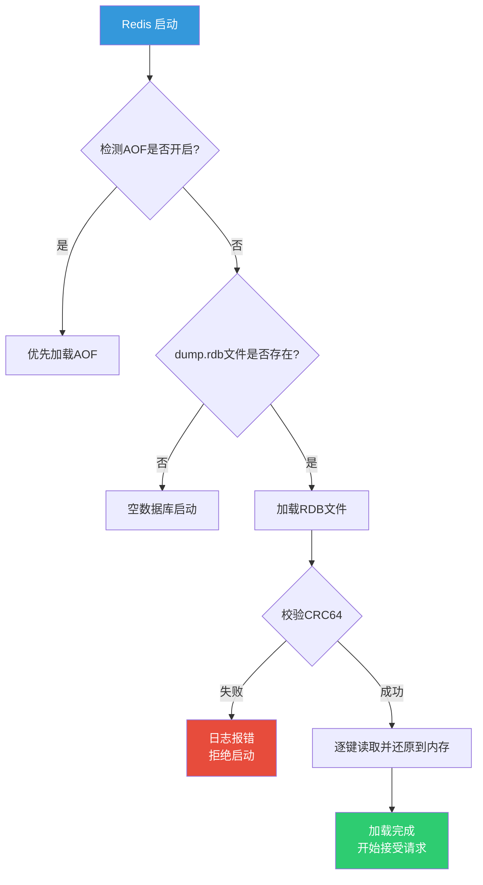

::: important AOF 优先原则
Redis 启动时的加载优先级：**AOF > RDB**。如果同时开启了 AOF 和 RDB，Redis 只会加载 AOF 文件。这是因为 AOF 的数据完整性通常优于 RDB。
:::

### 7.2 恢复速度的影响因素

```bash
# 影响 RDB 恢复速度的因素

# 1. 数据量
INFO keyspace   # 查看键数量

# 2. 值的大小和编码
# 大值（如 1MB 的 String）比小值慢
# 压缩编码（ziplist/listpack）比普通编码慢

# 3. 是否开启了校验
rdbchecksum yes   # 开启校验会增加 ~10% 加载时间

# 4. 磁盘 I/O 速度
# SSD 比 HDD 快 5~10 倍
```

### 7.3 加载期间的内存行为

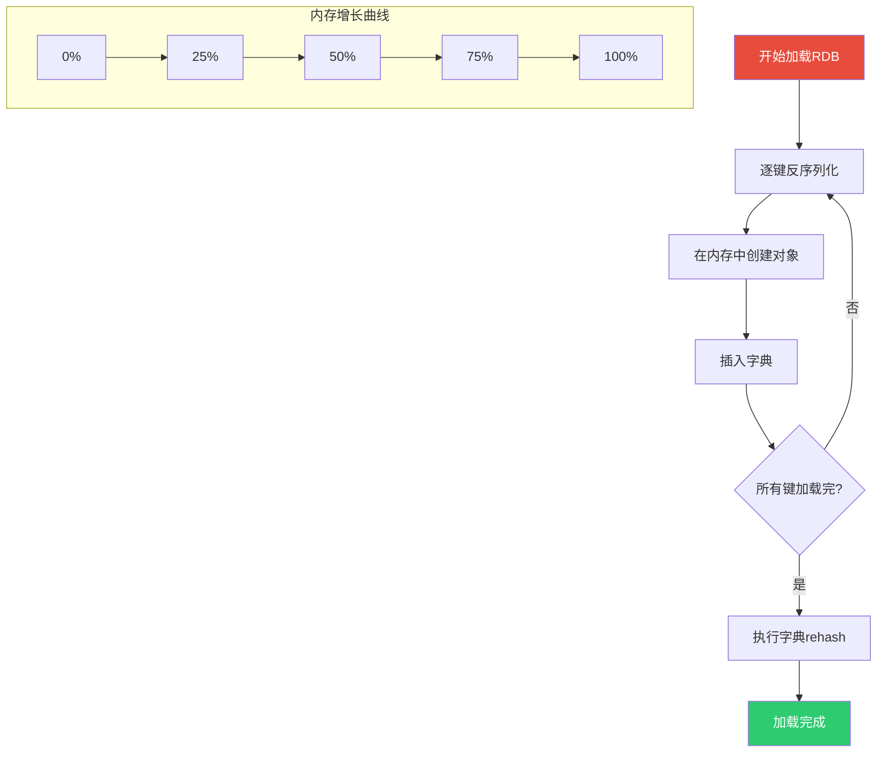

::: tip 加载期间 Redis 不可用
RDB 加载期间，Redis 处于**阻塞状态**，不接受任何客户端请求。对于大实例，这意味着数秒到数分钟的不可用窗口。在主从架构中，这个窗口可能导致从节点长时间无法提供服务。
:::

---

## 八、定时策略配置详解

### 8.1 redis.conf 中的 RDB 相关配置

```bash
################################ SNAPSHOTTING  ################################

# 自动触发条件（OR 关系）
save 900 1
save 300 10
save 60 10000

# 禁用 RDB（设置为空字符串）
# save ""

# BGSAVE 失败后是否停止写入
stop-writes-on-bgsave-error yes

# RDB 文件是否使用 LZF 压缩字符串
rdbcompression yes

# 是否开启 CRC64 校验
rdbchecksum yes

# RDB 文件名
dbfilename dump.rdb

# RDB/AOF 文件存放目录
dir ./

# 是否删除RDB中的FLUSHDB/FLUSHALL标记
# Redis 7.0+ 支持
rdb-del-sync-files no
```

### 8.2 关键配置详解

#### 8.2.1 stop-writes-on-bgsave-error

```bash
stop-writes-on-bgsave-error yes  # 默认值
```

当 BGSAVE 失败时（如磁盘满、fork 失败），Redis 是否停止接受写请求：

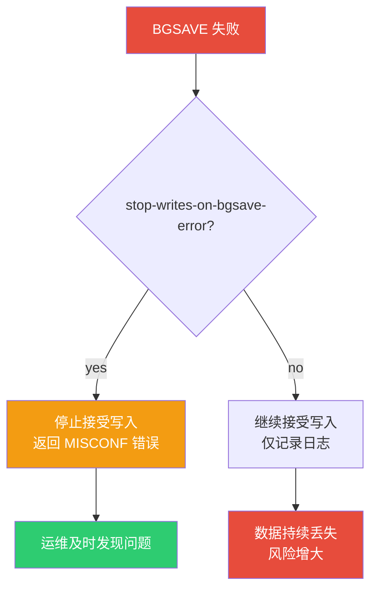

::: warning 生产环境务必保持 yes
```bash
# 如果发现 Redis 无法写入，检查 BGSAVE 状态
127.0.0.1:6379> INFO persistence
# rdb_last_bgsave_status:err
# rdb_last_bgsave_err_text:Cannot allocate memory

# 常见原因：
# 1. 磁盘空间不足
# 2. fork 失败（内存不足）
# 3. 磁盘 I/O 错误

# 临时解决方案（不推荐长期使用）
127.0.0.1:6379> CONFIG SET stop-writes-on-bgsave-error no
OK
```
:::

#### 8.2.2 rdbcompression

```bash
rdbcompression yes  # 默认值
```

对 RDB 文件中的字符串值使用 LZF 压缩：

| 场景 | 开启压缩 | 关闭压缩 |
|------|---------|---------|
| 字符串值较大（> 20 字节） | 文件更小 | 文件更大 |
| 字符串值较小 | 效果不大 | 节省 CPU |
| 保存速度 | 稍慢（压缩开销） | 更快 |
| 加载速度 | 稍慢（解压开销） | 更快 |

```bash
# 压缩效果对比
# 4GB 内存实例，默认数据分布
rdbcompression yes  → RDB 文件约 1.2GB（压缩率 70%）
rdbcompression no   → RDB 文件约 3.5GB（压缩率 12%）
```

#### 8.2.3 dbfilename 与 dir

```bash
dbfilename dump.rdb
dir /var/lib/redis    # 建议使用独立磁盘/挂载点
```

::: important dir 配置建议
1. **使用独立磁盘**：避免 RDB 写入影响其他 I/O
2. **使用 SSD**：提升 RDB 写入和加载速度
3. **确保磁盘空间充足**：至少预留实例内存 2 倍的空间
4. **避免 NFS**：网络文件系统上的 rename 操作不是原子的
:::

### 8.3 运行时动态调整

```bash
# 查看当前 RDB 配置
127.0.0.1:6379> CONFIG GET save
1) "save"
2) "3600 1 300 100 60 10000"

# 动态修改 save 配置
127.0.0.1:6379> CONFIG SET save "900 1 300 10 60 10000"
OK

# 持久化配置到文件
127.0.0.1:6379> CONFIG REWRITE
OK
```

### 8.4 RDB 监控指标

```bash
127.0.0.1:6379> INFO persistence
```

**关键指标解读：**

```
# RDB 状态
rdb_last_bgsave_status:ok                  # 最后一次BGSAVE状态
rdb_last_bgsave_time_sec:3                  # 最后一次BGSAVE耗时（秒）
rdb_last_bgsave_cow_size:429496729          # 最后一次COW额外内存

# RDB 时间
rdb_last_save_time:1717500000               # 最后一次保存的Unix时间戳
rdb_changes_since_last_save:5234            # 自上次保存以来的修改次数

# 子进程信息
rdb_bgsave_in_progress:0                    # 是否正在执行BGSAVE
```

```bash
127.0.0.1:6379> INFO stats
```

**额外统计：**

```
rdb_saves:42                                # 总共执行了多少次RDB保存
rdb_last_cow_size:429496729                 # 最后一次COW的额外内存
forked_child_pids:1001,1002,1003            # fork出的子进程PID历史
```

---

## 九、RDB 实战场景

### 9.1 日常备份脚本

```bash
#!/bin/bash
# Redis RDB 备份脚本

REDIS_HOST="127.0.0.1"
REDIS_PORT="6379"
REDIS_CLI="redis-cli -h $REDIS_HOST -p $REDIS_PORT"
BACKUP_DIR="/backup/redis"
DATE=$(date +%Y%m%d_%H%M%S)

# 创建备份目录
mkdir -p $BACKUP_DIR

# 触发 BGSAVE
echo "[$(date)] Triggering BGSAVE..."
$REDIS_CLI BGSAVE

# 等待 BGSAVE 完成
while [ $($REDIS_CLI LASTSAVE) -eq $LAST_SAVE ]; do
    sleep 1
done

# 复制 RDB 文件
echo "[$(date)] Copying RDB file..."
cp /var/lib/redis/dump.rdb $BACKUP_DIR/dump_$DATE.rdb

# 压缩备份
gzip $BACKUP_DIR/dump_$DATE.rdb

# 保留最近7天的备份
find $BACKUP_DIR -name "dump_*.rdb.gz" -mtime +7 -delete

echo "[$(date)] Backup completed: dump_$DATE.rdb.gz"
```

### 9.2 RDB 文件损坏修复

```bash
# 1. 检查 RDB 文件完整性
redis-check-rdb dump.rdb

# 输出示例（文件正常）：
# [offset 0] Checking RDB file dump.rdb
# [offset 26] AUX FIELD redis-ver = '7.2.0'
# [offset 1717500100] CRC64 checksum is OK

# 输出示例（文件损坏）：
# [offset 1717500050] Unexpected EOF reading RDB file
# [additional info] While reading key "user:1001"
```

::: warning RDB 损坏的处理策略
如果 `redis-check-rdb` 报告文件损坏：

1. **不要直接启动 Redis**：Redis 加载损坏的 RDB 可能导致数据进一步丢失
2. **备份损坏文件**：在任何修复操作前先复制一份
3. **尝试修复**：使用工具或手动截断损坏部分
4. **评估数据丢失**：统计损坏影响了哪些键
5. **考虑 AOF 恢复**：如果同时开启了 AOF，优先使用 AOF

```bash
# Redis 6.0+ 支持部分加载（跳过损坏的键）
# 在 redis.conf 中配置
rdb-load-no-decode no   # 允许跳过无法解码的键
```
:::

### 9.3 跨机房 RDB 传输

```bash
#!/bin/bash
# 跨机房 RDB 传输脚本

SOURCE_HOST="redis-prod.internal"
DEST_HOST="redis-dr.remote.internal"
RDB_PATH="/var/lib/redis/dump.rdb"
TEMP_PATH="/tmp/dump_transfer.rdb"

# 源端：触发 BGSAVE 并等待完成
ssh $SOURCE_HOST "redis-cli BGSAVE"
sleep 5

# 传输 RDB 文件
scp $SOURCE_HOST:$RDB_PATH $TEMP_PATH

# 验证文件完整性
redis-check-rdb $TEMP_PATH
if [ $? -ne 0 ]; then
    echo "RDB file corrupted, aborting!"
    exit 1
fi

# 目标端：替换 RDB 并重启
ssh $DEST_HOST "systemctl stop redis"
scp $TEMP_PATH $DEST_HOST:$RDB_PATH
ssh $DEST_HOST "systemctl start redis"

echo "Cross-datacenter RDB transfer completed!"
```

### 9.4 RDB 数据迁移

```bash
# 场景：将 Redis 实例 A 的数据迁移到实例 B

# 方法1：直接拷贝 RDB 文件
# 1. 在实例 A 上触发 BGSAVE
redis-cli -h A BGSAVE
# 2. 等待完成后拷贝 RDB
scp A:/var/lib/redis/dump.rdb /tmp/dump_a.rdb
# 3. 停止实例 B，替换 RDB 文件
redis-cli -h B SHUTDOWN
cp /tmp/dump_a.rdb /var/lib/redis/dump.rdb
# 4. 启动实例 B
redis-server /etc/redis/redis.conf

# 方法2：使用 MIGRATE 命令（在线迁移）
redis-cli -h A MIGRATE B 6379 "" 0 5000 KEYS key1 key2 key3

# 方法3：使用 --rdb 导出
redis-cli -h A --rdb /tmp/export.rdb
```

---

## 十、RDB 常见问题与排查

### 10.1 BGSAVE 失败：Cannot allocate memory

**现象：**

```
WARNING: fork(): Cannot allocate memory
```

**原因分析：**

虽然 fork 不复制物理内存，但 Linux 需要确保有足够的内存来应对最坏情况（所有页都被修改）。默认的 `vm.overcommit_memory=0` 会拒绝看似"不够"的 fork 请求。

**解决方案：**

```bash
# 临时修改
sudo sysctl vm.overcommit_memory=1

# 永久修改
echo "vm.overcommit_memory=1" >> /etc/sysctl.conf
sudo sysctl -p
```

::: important vm.overcommit_memory 详解
| 值 | 含义 | 适用场景 |
|----|------|---------|
| 0 | 内核自行判断是否允许超卖 | 默认值，可能导致fork失败 |
| 1 | 总是允许超卖 | **Redis 推荐值** |
| 2 | 严格限制，不允许超卖 | 极度安全场景 |

设为 1 后，fork 调用几乎不会因内存不足而失败，但需要注意：
- 确保物理内存 + swap 足够
- 监控 OOM Killer 行为
- 设置合理的 `maxmemory`
:::

### 10.2 BGSAVE 耗时过长

**现象：**

```
BGSAVE is still in progress after 300 seconds
```

**排查步骤：**

```bash
# 1. 检查数据量
127.0.0.1:6379> INFO memory
used_memory:4294967296    # 4GB

# 2. 检查 RDB 文件大小
ls -lh /var/lib/redis/dump.rdb

# 3. 检查磁盘 I/O
iostat -x 1 10

# 4. 检查 BGSAVE 耗时
127.0.0.1:6379> INFO persistence
rdb_last_bgsave_time_sec:45   # 45秒，正常

# 5. 检查是否有慢查询阻塞
127.0.0.1:6379> SLOWLOG GET 10
```

**优化方案：**

```bash
# 1. 降低 save 频率
save 900 1
save 1800 100    # 降低频率

# 2. 检查磁盘类型（SSD vs HDD）
# SSD: RDB 写入速度可达 500MB/s
# HDD: RDB 写入速度约 100MB/s

# 3. 使用独立磁盘
dir /mnt/ssd/redis

# 4. 检查是否有大量大键
redis-cli --bigkeys
```

### 10.3 COW 内存过高

**现象：**

```
Background saving caused OOM (out of memory)
```

**排查与优化：**

```bash
# 1. 检查 COW 开销
127.0.0.1:6379> INFO stats
rdb_last_cow_size:2147483648   # 2GB COW 额外内存

# 2. 分析写操作模式
127.0.0.1:6379> INFO stats
total_commands_processed:1000000
instantaneous_ops_per_sec:50000   # 写入量很大

# 3. 优化方案
# 方案1：在低峰期触发 BGSAVE
# 通过 crontab 在凌晨触发
0 3 * * * redis-cli BGSAVE

# 方案2：降低写入频率
# 减少不必要的写操作，使用 Pipeline 批量写入

# 方案3：分片
# 将大实例拆分为多个小实例，减少单实例 COW 压力
```

### 10.4 RDB 文件加载失败

**现象：**

```
Fatal error loading the RDB file: Bad file format reading the dump
```

**排查步骤：**

```bash
# 1. 检查文件格式
file dump.rdb
# 正常: dump.rdb: data
# 异常: dump.rdb: ASCII text (可能是AOF被误命名为RDB)

# 2. 检查文件头部
xxd dump.rdb | head -5
# 正常: 应以 "REDIS" 开头

# 3. 使用 redis-check-rdb
redis-check-rdb dump.rdb

# 4. 检查版本兼容性
# 如果 RDB 文件版本高于当前 Redis 版本，会加载失败
```

---

## 十一、RDB 与 Redis 内部机制

### 11.1 serverCron 与 RDB 定时检查

Redis 的 `serverCron` 每 100ms 执行一次，其中包含 RDB 自动触发的检查逻辑：

```c
// server.c 中的简化逻辑
int serverCron(struct aeEventLoop *eventLoop, long long id, void *clientData) {
    // ...

    // 检查是否需要执行 BGSAVE
    for (j = 0; j < server.saveparamslen; j++) {
        struct saveparam *sp = server.saveparams + j;

        // 条件1：距上次保存超过指定秒数
        if (server.dirty >= sp->changes &&
            server.unixtime - server.lastsave > sp->seconds) {
            // 条件2：满足修改次数
            rdbSaveBackground(SLAVE_REQ_NONE, server.rdb_filename, NULL, RDB_SAVE_INFO);
            break;
        }
    }

    // 检查子进程是否完成
    if (hasActiveChildProcess()) {
        checkChildrenDone();
    }

    // ...
}
```

### 11.2 dirty 计数器

`dirty` 计数器记录自上次 BGSAVE 以来的数据修改次数：


### 11.3 BGSAVE 与 AOF 的互斥

```c
// BGSAVE 和 BGREWRITEAOF 不能同时执行
int rdbSaveBackground(int req, char *filename, redisDb *db, int flags) {
    // 如果 AOF 重写正在进行，不能启动 BGSAVE
    if (server.aof_child_pid != -1) return C_ERR;
    // ...
}

int rewriteAppendOnlyFileBackground(void) {
    // 如果 BGSAVE 正在进行，不能启动 AOF 重写
    if (hasActiveChildProcess()) return C_ERR;
    // ...
}
```

::: info 互斥的原因
BGSAVE 和 BGREWRITEAOF 都是重 I/O 操作，同时执行会导致：
1. 磁盘 I/O 竞争，两者都变慢
2. 两个子进程同时占用大量内存
3. 主进程 COW 压力翻倍
:::

---

## 十二、RDB 最佳实践

### 12.1 生产环境配置清单

```bash
# redis.conf 生产级 RDB 配置

# 持久化策略
save 900 1
save 300 10
save 60 10000

# 安全配置
stop-writes-on-bgsave-error yes
rdbchecksum yes
rdbcompression yes

# 文件配置
dbfilename dump-${PORT}.rdb    # 多实例时区分文件名
dir /data/redis                 # 独立数据目录

# 系统配置
vm.overcommit_memory = 1
disable-thp = yes               # 禁用透明大页
```

### 12.2 监控告警建议

| 指标 | 告警阈值 | 说明 |
|------|---------|------|
| rdb_last_bgsave_status | != ok | BGSAVE 失败 |
| rdb_last_bgsave_time_sec | > 30 | BGSAVE 耗时过长 |
| rdb_last_cow_size | > used_memory * 0.3 | COW 内存过高 |
| rdb_bgsave_in_progress 持续时间 | > 300s | BGSAVE 卡住 |
| 磁盘剩余空间 | < maxmemory * 2 | 磁盘空间不足 |

### 12.3 容量规划

```bash
# RDB 相关的容量计算

# RDB 文件大小估算
RDB_SIZE ≈ USED_MEMORY × (1 - COMPRESSION_RATIO)
# 典型压缩率: 60%~80%（即文件大小为内存的20%~40%）

# 磁盘空间需求
DISK_REQUIRED = RDB_SIZE × 3
# × 3: 当前RDB + 临时文件 + 备份

# 内存需求
MEMORY_REQUIRED = USED_MEMORY × 2
# × 2: 正常内存 + COW峰值
```

---

## 十三、总结

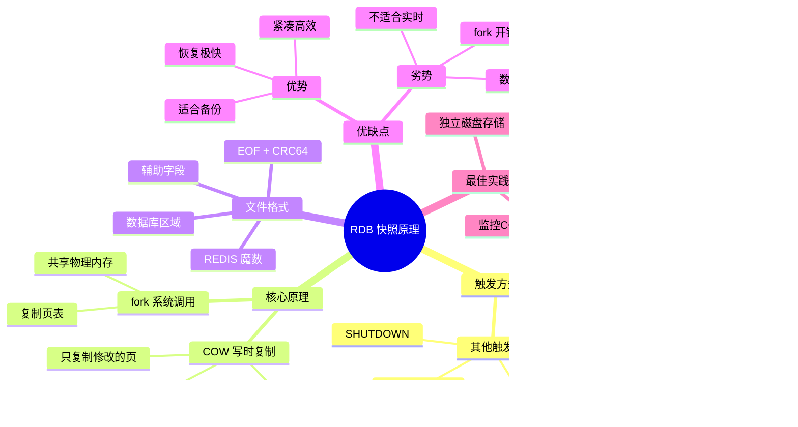

::: tip 核心要点回顾
1. **RDB 是全量快照**，通过 fork+COW 实现后台持久化，对主进程影响最小
2. **BGSAVE 是唯一推荐的生产触发方式**，SAVE 会完全阻塞
3. **fork 是 COW 的前提**，大内存实例需关注 fork 延迟和 COW 内存开销
4. **RDB 文件紧凑高效**，恢复速度远超 AOF，但两次快照间可能丢失数据
5. **生产环境务必**：`vm.overcommit_memory=1`、禁用 THP、监控 BGSAVE 状态
:::

---

**参考资料：**

- [Redis 官方文档 - Persistence](https://redis.io/docs/management/persistence/)
- [Redis 官方文档 - RDB](https://redis.io/docs/management/persistence/rdb-arguments/)
- 《Redis 设计与实现》黄健宏 著 —— 第10章 RDB持久化
- 《Redis 开发与运维》付磊 张益军 著 —— 第5章 持久化
- Redis 源码 `rdb.c`、`server.c`、`bgsave.c`
