# AOF 日志机制

::: info 核心问题
RDB 快照虽然恢复快，但两次快照之间的数据可能全部丢失。AOF（Append Only File）通过记录每一条写命令来实现更精细的持久化，将数据丢失窗口从"分钟级"压缩到"秒级"甚至"零丢失"。本章深入 AOF 的写后日志原理、fsync 策略、重写机制以及 Redis 7 的 Multi Part AOF 架构。
:::

## 一、AOF 概述

### 1.1 什么是 AOF

AOF（Append Only File）是 Redis 的另一种持久化方式。与 RDB 的全量快照不同，AOF 采用**增量日志**的方式，将每一条写命令追加到 AOF 文件末尾：


**AOF 文件内容示例：**

```redis
*3
$3
SET
$4
name
$5
Redis

*3
$3
SET
$3
age
$2
25

*4
$4
HSET
$4
user
$2
id
$4
1001

*3
$5
LPUSH
$6
mylist
$1
a
```

::: tip AOF 记录的是 Redis 协议格式
AOF 文件保存的不是 Redis 命令的原始文本，而是 **RESP（Redis Serialization Protocol）** 格式。这意味着：
1. Redis 重启时无需解析命令文本，直接按协议解析即可
2. RESP 格式是二进制安全的，可以存储任意数据
3. 便于 Redis 直接网络传输，无需额外转换
:::

### 1.2 AOF vs RDB 核心差异

| 维度 | RDB | AOF |
|------|-----|-----|
| 记录内容 | 某一时刻的全量数据 | 每一条写命令 |
| 持久化粒度 | 定时快照 | 每次写操作 |
| 数据安全性 | 可能丢失分钟级数据 | 最多丢失1秒数据 |
| 文件体积 | 小（二进制压缩） | 大（累积的写命令） |
| 恢复方式 | 直接加载二进制 | 重放所有写命令 |
| 恢复速度 | 快 | 慢 |
| 文件可读性 | 不可读（二进制） | 可读（RESP文本） |

### 1.3 AOF 在持久化体系中的位置


---

## 二、AOF 写后日志原理

### 2.1 为什么是"写后"日志

AOF 采用的是**写后日志**（Write-Ahead Log 的反面），即**先执行命令，再记录日志**。这与大多数数据库的 WAL（Write-Ahead Log，写前日志）策略正好相反。

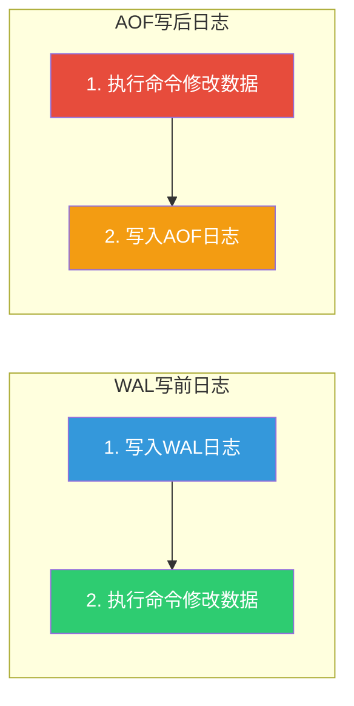

::: important 写后日志的优势
1. **避免记录错误命令**：先执行再记录，只有成功的命令才会被写入 AOF。如果先记录再执行，错误的命令（如对 String 执行 LPUSH）也会被记录
2. **不阻塞当前命令**：命令执行完才写日志，不阻塞当前操作
:::

::: warning 写后日志的风险
1. **命令执行完但日志未写入时宕机**：数据已修改但日志丢失，重启后无法恢复该操作
2. **AOF 写入可能阻塞后续命令**：虽然不阻塞当前命令，但如果 AOF 写入过慢，下一条命令的 AOF 记录可能等待前一条完成
:::

### 2.2 AOF 写入的完整流程

一条写命令从执行到持久化到磁盘，经历三个关键步骤：

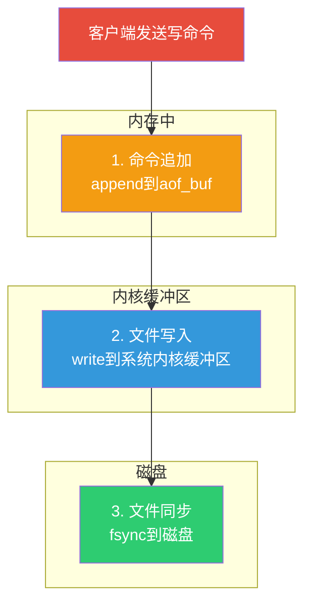

**三步详解：**

| 步骤 | 操作 | 所在位置 | 是否持久化 |
|------|------|---------|-----------|
| 1. 命令追加 | 将 RESP 格式的写命令追加到 `aof_buf` | Redis 进程内存 | 否 |
| 2. 文件写入 | 调用 `write()` 将 `aof_buf` 写入文件 | 操作系统内核缓冲区（page cache） | 否 |
| 3. 文件同步 | 调用 `fsync()` 将内核缓冲区刷入磁盘 | 磁盘 | 是 |

::: important write vs fsync 的区别
- **write()**：数据从用户空间复制到内核空间的 page cache，**不代表数据已落盘**。如果此时系统崩溃，数据可能丢失
- **fsync()**：将 page cache 中的数据**同步刷入磁盘**，确保数据持久化。这是一个阻塞调用，需要等待磁盘 I/O 完成

这就是为什么 AOF 需要配置 fsync 策略 —— 它决定了数据安全性与性能之间的权衡。
:::

### 2.3 AOF 写入流程详解

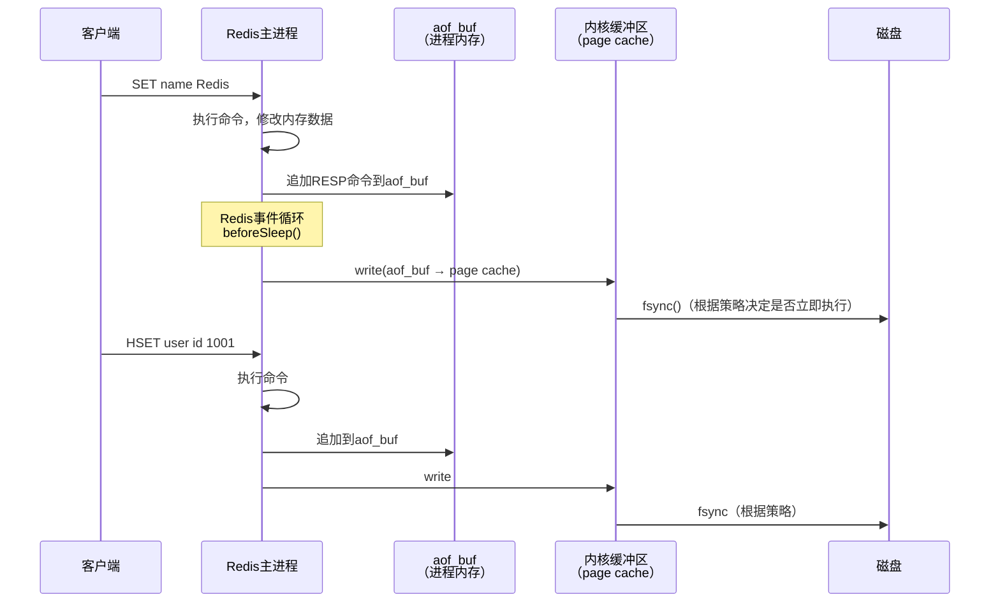

### 2.4 aof_buf 缓冲区

`aof_buf` 是 Redis 进程内存中的一块缓冲区，用于暂存待写入 AOF 文件的命令：

```c
// Redis 源码中的定义
struct redisServer {
    sds aof_buf;    // AOF 缓冲区
    // ...
};
```

**aof_buf 的刷新时机：**

Redis 在每次事件循环的 `beforeSleep()` 函数中，将 `aof_buf` 的内容写入 AOF 文件：

```c
// server.c
void beforeSleep(struct aeEventLoop *eventLoop) {
    // ...

    /* 写入 AOF 缓冲区 */
    if (server.aof_state == AOF_ON) {
        flushAppendOnlyFile(0);
    }

    // ...
}
```

---

## 三、AOF 三种 fsync 策略

`appendfsync` 配置项决定了 AOF 的 fsync 频率，是 AOF 性能与数据安全性的核心权衡点。

### 3.1 三种策略详解

```bash
# redis.conf 中的配置
appendfsync always     # 每次写入都 fsync
appendfsync everysec   # 每秒 fsync 一次（默认）
appendfsync no         # 不主动 fsync，交给操作系统
```

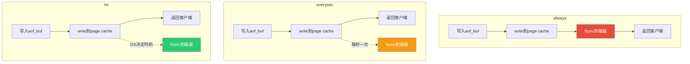

### 3.2 always —— 每次写入都 fsync

```bash
appendfsync always
```

**工作原理：** 每条写命令执行后，立即调用 `fsync()` 将数据刷入磁盘。

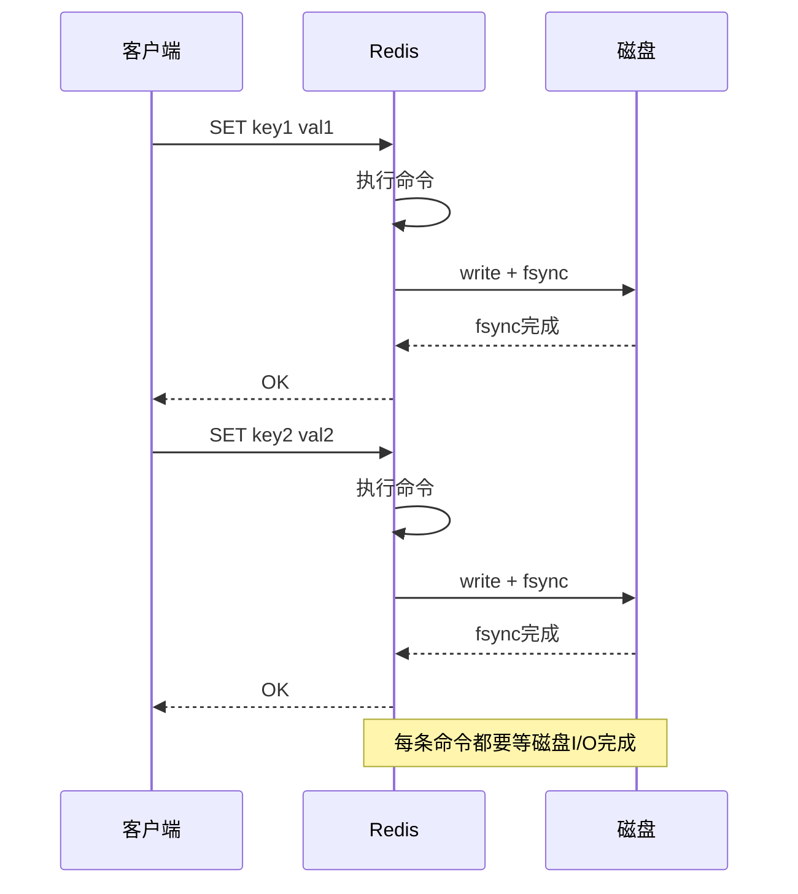

| 维度 | 评价 |
|------|------|
| 数据安全性 | 最高，基本零丢失 |
| 写入性能 | 最差，每条写命令都要等磁盘 I/O |
| 适用场景 | 金融交易、关键配置等不能丢失任何数据的场景 |
| QPS 影响 | SSD 约 2~3 万 QPS，HDD 约 5000~1 万 QPS |

::: warning always 的性能代价
在 SSD 上，单次 fsync 延迟约 0.1~0.5ms，看似很短，但高并发场景下：
- 每秒 5 万次写入 × 0.2ms = 10 秒的 I/O 等待
- 实际 QPS 会被压缩到 2~3 万
- HDD 上更是灾难级，单次 fsync 约 5~10ms
:::

### 3.3 everysec —— 每秒 fsync 一次

```bash
appendfsync everysec   # 默认值
```

**工作原理：** Redis 每秒调用一次 `fsync()`，将过去一秒内的 page cache 数据刷入磁盘。

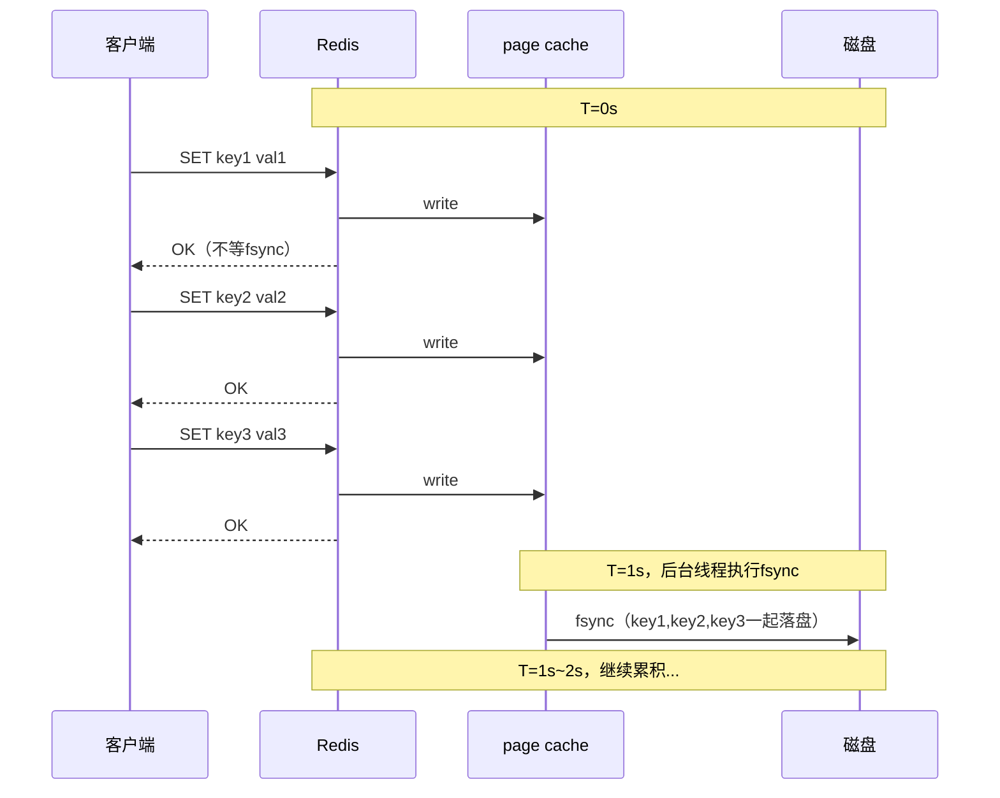

| 维度 | 评价 |
|------|------|
| 数据安全性 | 最多丢失 1 秒数据 |
| 写入性能 | 优秀，主线程不等 fsync |
| 适用场景 | 大多数生产环境的最佳选择 |
| QPS 影响 | 几乎无影响 |

::: tip everysec 是最推荐的策略
`everysec` 在性能和数据安全之间取得了最佳平衡：
- 1 秒的数据丢失在绝大多数场景下可以接受
- 主线程无需等待磁盘 I/O，QPS 几乎无损
- Redis 使用后台线程执行 fsync，不阻塞主线程
:::

### 3.4 no —— 不主动 fsync

```bash
appendfsync no
```

**工作原理：** Redis 只调用 `write()` 将数据写入 page cache，从不主动调用 `fsync()`。数据何时落盘完全由操作系统决定（通常 30 秒左右）。

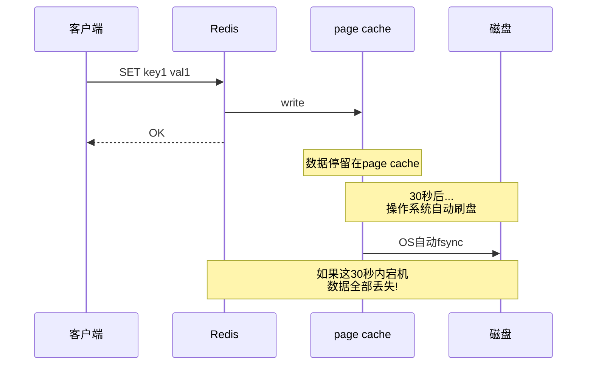

| 维度 | 评价 |
|------|------|
| 数据安全性 | 最差，可能丢失 30 秒数据 |
| 写入性能 | 最好，完全没有 fsync 开销 |
| 适用场景 | 纯缓存场景，数据可全部丢失 |
| QPS 影响 | 无影响 |

### 3.5 三种策略对比

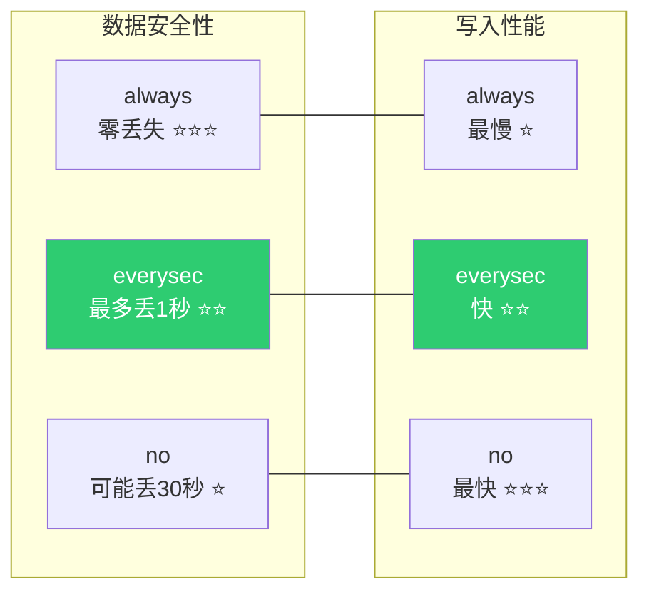

| 策略 | 数据丢失 | 写入性能 | fsync 频率 | 推荐场景 |
|------|---------|---------|-----------|---------|
| always | 零丢失 | 最慢 | 每次写入 | 金融/交易 |
| everysec | 最多1秒 | 快 | 每秒 | **通用生产环境** |
| no | 最多30秒 | 最快 | OS决定 | 纯缓存 |

### 3.6 fsync 与后台线程

当 `appendfsync everysec` 时，Redis 使用后台线程执行 fsync：

```c
// bio.c - 后台 I/O 线程
void *bioProcessBackgroundJobs(void *arg) {
    while (1) {
        listNode *ln = listFirst(bio_jobs[type]);
        bio_job *job = ln->value;

        if (type == BIO_AOF_FSYNC) {
            // 后台执行 fsync
            aof_fsync(job->fd);
        }
        // ...
    }
}
```

::: important everysec 的特殊情况
当后台 fsync 线程正在执行时，如果主线程又有新的 write 请求，Redis 的行为是：

1. 如果 fsync 正在执行，主线程**不会等待** fsync 完成
2. 但如果 fsync 已经超过 2 秒还没完成（磁盘很慢），主线程会**延迟写入**，等待 fsync 完成
3. 这种情况下，Redis 日志会记录：`Asynchronous AOF fsync is taking too long`

```bash
# 监控 AOF fsync 延迟
127.0.0.1:6379> INFO persistence
aof_delayed_fsync:3    # fsync延迟发生的次数
```
:::

---

## 四、AOF 重写原理

### 4.1 为什么需要 AOF 重写

AOF 文件记录的是所有写命令，随着时间推移，文件会越来越大：

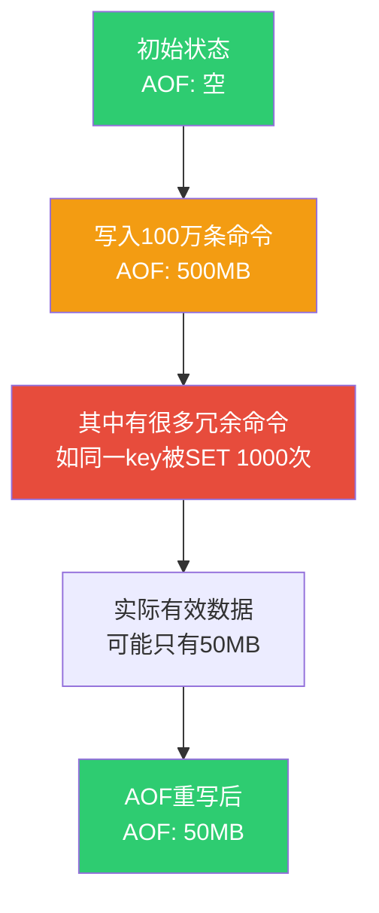

**AOF 文件膨胀的典型场景：**

```redis
# 同一个 key 被反复设置
SET counter 1
INCR counter       # counter = 2
INCR counter       # counter = 3
INCR counter       # counter = 4
...
INCR counter       # counter = 10000

# 重写后只需一条命令
SET counter 10000
```

```redis
# List 被反复操作
RPUSH mylist a b c
LPOP mylist        # 移除 a
RPUSH mylist d e
LPOP mylist        # 移除 b

# 重写后
RPUSH mylist c d e
```

### 4.2 AOF 重写的触发方式

#### 4.2.1 手动触发

```bash
# 手动触发 AOF 重写
127.0.0.1:6379> BGREWRITEAOF
Background append only file rewriting started
```

#### 4.2.2 自动触发

Redis 根据以下配置自动触发 AOF 重写：

```bash
# redis.conf
auto-aof-rewrite-percentage 100    # AOF文件大小较上次重写增长100%时触发
auto-aof-rewrite-min-size 64mb     # AOF文件至少64MB才触发重写
```

**自动触发的判定逻辑：**

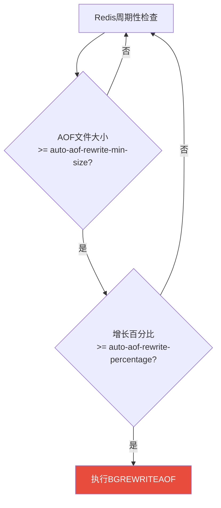

**增长百分比的计算：**

```
增长百分比 = (当前AOF文件大小 - 上次重写后AOF文件大小) / 上次重写后AOF文件大小 × 100%

# 示例：
# 上次重写后 AOF 文件 = 64MB
# 当前 AOF 文件 = 200MB
# 增长百分比 = (200 - 64) / 64 × 100% = 212.5%
# 212.5% >= 100%，触发重写
```

### 4.3 AOF 重写流程详解

AOF 重写与 RDB 的 BGSAVE 类似，也是通过 `fork()` 创建子进程来完成：

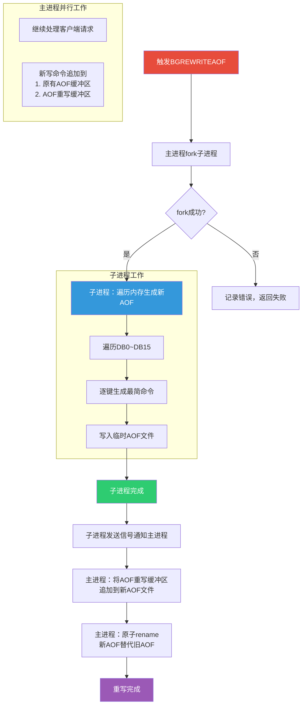

### 4.4 AOF 重写的核心机制：重写缓冲区

AOF 重写期间，主进程仍在接受写命令。这些新命令需要同时写入两个地方：

1. **原有 AOF 缓冲区**（aof_buf）：保证当前 AOF 文件的完整性
2. **AOF 重写缓冲区**（aof_rewrite_buf）：记录重写期间的新命令，待重写完成后追加到新 AOF

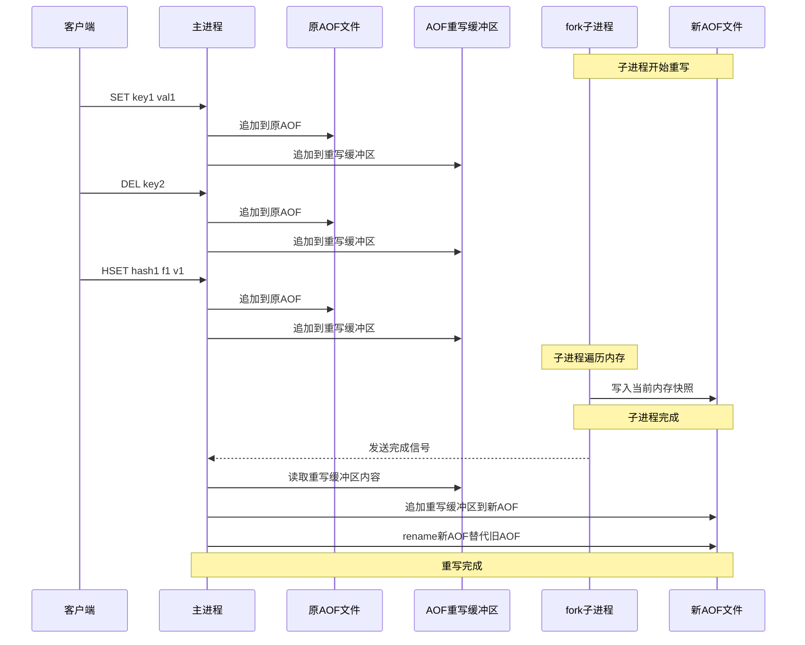

::: important 重写缓冲区的作用
重写缓冲区解决了 AOF 重写的核心问题：**如何将重写期间的新增量数据合并到新 AOF 文件中**。

1. 子进程只能看到 fork 瞬间的内存快照（COW 保证）
2. fork 之后的新写命令，子进程看不到
3. 这些新命令通过重写缓冲区暂存，在子进程完成后追加到新文件

**如果没有重写缓冲区**，重写期间的新数据就会丢失！
:::

### 4.5 AOF 重写的源码分析

以下是 Redis 中 AOF 重写的核心逻辑（简化版）：

```c
// aof.c - AOF 重写入口
int rewriteAppendOnlyFileBackground(void) {
    pid_t childpid;

    // 检查是否已有子进程在运行
    if (hasActiveChildProcess()) {
        return C_ERR;
    }

    // 创建重写缓冲区
    if (aofCreateRewriteBuffer() != C_OK) {
        return C_ERR;
    }

    // fork 子进程
    if ((childpid = redisFork()) == 0) {
        /* --- 子进程 --- */
        redisSetProcTitle("redis-aof-rewrite");

        // 关闭监听套接字
        closeListeningSockets(0);

        // 执行 AOF 重写
        int retval = rewriteAppendOnlyFile(tmpfile);

        // 发送完成信号
        if (retval == C_OK) {
            sendChildGoodbye(CHILD_INFO_TYPE_AOF, 0, 0);
        }
        exitFromChild((retval == C_OK) ? 0 : 1);
    } else {
        /* --- 父进程 --- */
        if (childpid == -1) {
            serverLog(LL_WARNING,
                "Can't rewrite append only file in background: fork: %s",
                strerror(errno));
            return C_ERR;
        }
        serverLog(LL_NOTICE,
            "Background append only file rewriting started by pid %d",
            childpid);
        server.aof_child_pid = childpid;
        updateDictResizePolicy(); // 关闭字典rehash
        return C_OK;
    }
}
```

**子进程生成新 AOF 的逻辑：**

```c
int rewriteAppendOnlyFileRio(rio *aof) {
    // 遍历所有数据库
    for (j = 0; j < server.dbnum; j++) {
        redisDb *db = server.db + j;

        // 写入 SELECT 命令
        if (selectdb(aof, j) == -1) goto werr;

        // 遍历所有键
        dictIterator *di = dictGetIterator(db->dict);
        while ((de = dictNext(di)) != NULL) {
            sds keystr = dictGetKey(de);
            robj *o = dictGetVal(de);
            long long expire = getExpire(db, &key);

            // 保存过期时间
            if (expire != -1) {
                char cmd[] = "*3\r\n$9\r\nPEXPIREAT\r\n";
                if (rioWrite(aof, cmd, sizeof(cmd) - 1) == 0) goto werr;
            }

            // 根据类型生成最简命令
            if (o->type == OBJ_STRING) {
                emitStringCommand(aof, keystr, o);
            } else if (o->type == OBJ_LIST) {
                emitListCommand(aof, keystr, o);
            } else if (o->type == OBJ_SET) {
                emitSetCommand(aof, keystr, o);
            } else if (o->type == OBJ_ZSET) {
                emitZsetCommand(aof, keystr, o);
            } else if (o->type == OBJ_HASH) {
                emitHashCommand(aof, keystr, o);
            }
            // ... 其他类型
        }
        dictReleaseIterator(di);
    }
    return C_OK;
}
```

### 4.6 各类型的最简命令生成

AOF 重写时，Redis 根据键的类型生成**最少命令数**的表达：

| 类型 | 原始操作 | 重写后的最简命令 |
|------|---------|---------------|
| String | SET + 100次 INCR | SET key 当前值 |
| List | 多次 RPUSH/LPOP | RPUSH key 当前所有元素 |
| Set | 多次 SADD/SREM | SADD key 当前所有元素 |
| Hash | 多次 HSET/HDEL | HSET key 当前所有field-value |
| ZSet | 多次 ZADD/ZREM | ZADD key 当前所有member-score |

**以 Hash 为例：**

```redis
# 原始AOF中的命令序列
HSET user:1 name Alice
HSET user:1 age 25
HDEL user:1 age
HSET user:1 age 26
HSET user:1 city Beijing
HDEL user:1 city

# 重写后（当前内存中user:1的状态）
HSET user:1 name Alice age 26
```

::: tip 大键的拆分写入
对于包含大量元素的集合类型键（如一个 Set 有 100 万个元素），Redis 不会生成一条超长的 SADD 命令，而是拆分为多条命令，每条命令包含一定数量的元素：

```c
// 每条命令最多包含 REDIS_AOF_REWRITE_ITEMS_PER_CMD 个元素
#define REDIS_AOF_REWRITE_ITEMS_PER_CMD 64

// 100万个元素的Set会被拆分为
// 约 15625 条 SADD 命令，每条包含 64 个元素
```

这样做的好处是：
1. 避免单条命令过长导致客户端输入缓冲区溢出
2. 加载 AOF 时可以逐步处理，不会因为单条命令过大而阻塞
:::

### 4.7 AOF 重写期间的写入流程

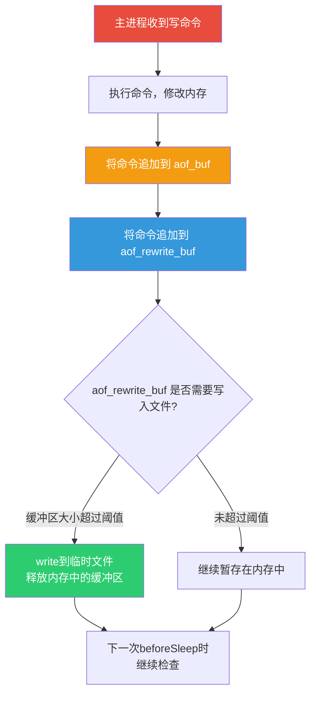

::: warning 重写缓冲区的内存压力
AOF 重写期间，重写缓冲区会不断增长。如果重写耗时长且写入量大，重写缓冲区可能占用大量内存：

```bash
# 监控重写缓冲区大小
127.0.0.1:6379> INFO persistence
aof_rewrite_buffer_length:1048576   # 1MB（正常）
aof_rewrite_buffer_length:1073741824 # 1GB（异常！）

# 如果重写缓冲区持续增长，可能的原因：
# 1. 子进程重写速度太慢（磁盘I/O瓶颈）
# 2. 写入量过大
# 3. 磁盘空间不足
```
:::

### 4.8 AOF 重写完成后的收尾

子进程完成 AOF 重写后，主进程需要完成几个关键步骤：

```c
// aof.c - AOF 重写完成后的处理
void backgroundRewriteDoneHandler(int exitcode, int bysignal) {
    if (exitcode != 0 || bysignal) {
        // 重写失败，清理临时文件
        unlink(tmpfile);
        return;
    }

    // 1. 将重写缓冲区追加到新AOF
    if (aofRewriteBufferWrite(newfd) == -1) {
        unlink(tmpfile);
        return;
    }

    // 2. fsync 新AOF文件
    aof_fsync(newfd);

    // 3. 关闭旧AOF文件
    close(oldfd);

    // 4. 原子rename新AOF替代旧AOF
    if (rename(tmpfile, server.aof_filename) == -1) {
        // rename失败，严重错误
        exit(1);
    }

    // 5. 打开新AOF文件，设置fd
    server.aof_fd = open(server.aof_filename, O_APPEND|O_WRONLY);

    // 6. 清理重写缓冲区
    aofRewriteBufferReset();
}
```

---

## 五、AOF 文件格式

### 5.1 RESP 协议格式

AOF 文件使用 RESP（Redis Serialization Protocol）格式存储命令：

```
# SET name Redis
*3\r\n$3\r\nSET\r\n$4\r\nname\r\n$5\r\nRedis\r\n

# 解读：
# *3       - 命令有3个部分
# $3       - 第1部分长度3
# SET      - 命令名
# $4       - 第2部分长度4
# name     - 键名
# $5       - 第3部分长度5
# Redis    - 值
```

**RESP 格式标记：**

| 标记 | 含义 | 示例 |
|------|------|------|
| `*` | 数组长度 | `*3` 表示3个元素 |
| `$` | 字符串长度 | `$5` 表示5字节字符串 |
| `:` | 整数 | `:100` |
| `+` | 简单字符串 | `+OK` |
| `-` | 错误 | `-ERR unknown command` |

### 5.2 AOF 文件中的特殊命令

除了普通的写命令，AOF 文件还包含一些元数据命令：

```redis
# Redis 选择数据库
*2\r\n$6\r\nSELECT\r\n$1\r\n0\r\n

# 过期时间设置（毫秒精度）
*3\r\n$9\r\nPEXPIREAT\r\n$4\r\nkey1\r\n$13\r\n1717500000000\r\n

# Redis 7+ Multi Part AOF 的前导信息
# 详见本章第七节
```

### 5.3 查看 AOF 文件内容

```bash
# 直接查看（AOF是文本文件）
cat appendonly.aof | head -50

# 使用 redis-check-aof 检查
redis-check-aof appendonly.aof

# 使用 hexdump 查看二进制细节
hexdump -C appendonly.aof | head -30
```

---

## 六、AOF 损坏修复

### 6.1 AOF 损坏的常见原因

1. **写入过程中宕机**：AOF 文件末尾可能不完整
2. **磁盘空间不足**：写入失败导致文件截断
3. **文件系统损坏**：导致 AOF 文件部分损坏
4. **误操作**：如 `echo "" > appendonly.aof`

### 6.2 检测 AOF 损坏

```bash
# 使用 redis-check-aof 工具
redis-check-aof appendonly.aof

# 输出示例（正常）：
# AOF analyzed: size=1048576, ok_up_to=1048576, ok_up_to_line=12345
# AOF is valid

# 输出示例（损坏）：
# AOF analyzed: size=1048576, ok_up_to=524288, ok_up_to_line=6789
# AOF is not valid
```

### 6.3 修复 AOF 文件

```bash
# 使用 --fix 参数修复
redis-check-aof --fix appendonly.aof

# 交互式确认：
# This will truncate the AOF file from 1048576 to 524288 bytes
# Continue? [y/N]: y
# Successfully truncated AOF file
```

::: warning 修复的代价
AOF 修复的原理是**截断损坏部分**，即丢弃损坏位置之后的所有命令。这意味着：
1. 损坏位置之后的数据**不可恢复**
2. 修复前务必备份原始 AOF 文件
3. 截断后可能导致部分键的数据不完整
:::

### 6.4 AOF 损坏修复流程

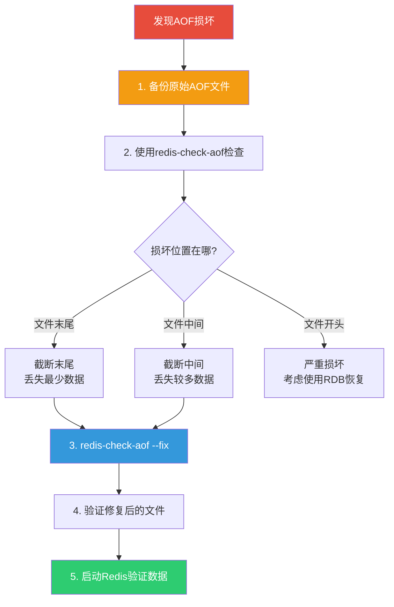

### 6.5 使用 AOF 截断的极端场景

```bash
# 场景：不小心执行了 FLUSHALL，AOF 文件末尾记录了该命令

# 1. 立即停止 Redis（不要用 SHUTDOWN）
kill -9 $(pidof redis-server)

# 2. 编辑 AOF 文件，删除 FLUSHALL 命令
# 找到并删除以下行：
# *1\r\n$8\r\nFLUSHALL\r\n

# 3. 使用 redis-check-aof 修复
redis-check-aof --fix appendonly.aof

# 4. 启动 Redis 验证
redis-server /etc/redis/redis.conf
```

---

## 七、Redis 7 Multi Part AOF

### 7.1 传统 AOF 的问题

在 Redis 7 之前，AOF 重写使用单一文件方案，存在以下问题：

1. **重写期间内存压力**：重写缓冲区全量保存在内存中
2. **主进程阻塞风险**：重写完成后需要将缓冲区追加到新文件，如果缓冲区很大，这个操作可能阻塞主进程
3. **崩溃恢复复杂**：重写中途崩溃，新旧文件状态不一致


### 7.2 Multi Part AOF 架构

Redis 7 引入了 **Multi Part AOF**，将 AOF 拆分为三种文件：

| 文件类型 | 文件名 | 说明 |
|---------|--------|------|
| BASE | `appendonly.aof.base` | 基础 AOF，由上次重写生成 |
| INCR | `appendonly.aof.incr.N` | 增量 AOF，记录重写后的新命令 |
| MANIFEST | `appendonly.aof.manifest` | 清单文件，记录当前有效的 AOF 文件列表 |

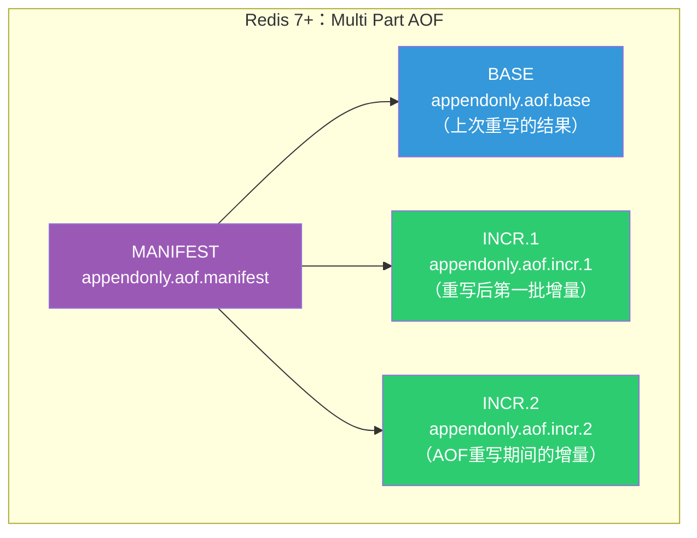

### 7.3 MANIFEST 文件格式

MANIFEST 文件是一个文本文件，记录当前有效的 AOF 文件列表：

```
file appendonly.aof.1.base.rdb seq 1 type b
file appendonly.aof.1.incr.aof seq 1 type i
file appendonly.aof.2.incr.aof seq 2 type i
```

**字段说明：**

| 字段 | 说明 |
|------|------|
| file | 文件名 |
| seq | 序列号，用于排序 |
| type | `b` = BASE, `i` = INCR |

### 7.4 Multi Part AOF 重写流程

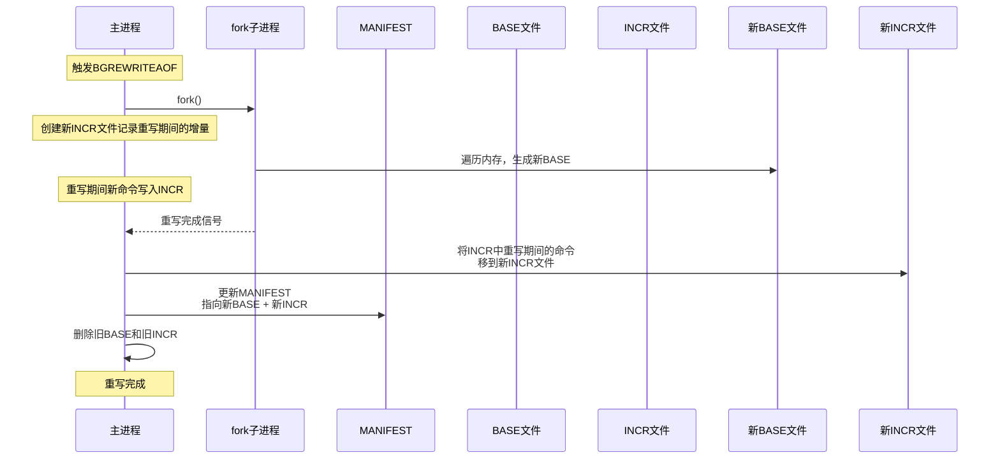

### 7.5 Multi Part AOF 的优势

::: tip Multi Part AOF 解决的问题
1. **消除主进程阻塞**：重写缓冲区直接写入 INCR 文件（磁盘），不再全量保存在内存中
2. **降低内存压力**：不再需要大的内存缓冲区来存储重写期间的增量
3. **崩溃恢复更安全**：MANIFEST 文件记录了所有有效文件，即使重写中途崩溃也能正确恢复
4. **支持混合持久化更自然**：BASE 文件可以是 RDB 格式的头部
:::

**对比：传统 AOF vs Multi Part AOF**

| 维度 | 传统 AOF | Multi Part AOF |
|------|---------|---------------|
| 文件结构 | 单一文件 | BASE + INCR + MANIFEST |
| 重写缓冲区 | 内存中 | INCR 文件（磁盘） |
| 重写完成时 | 主进程写缓冲区可能阻塞 | 更新MANIFEST，无阻塞 |
| 崩溃恢复 | 可能不一致 | MANIFEST保证一致性 |
| Redis 版本 | < 7.0 | >= 7.0 |

### 7.6 加载 Multi Part AOF

Redis 7 启动时的 AOF 加载流程：

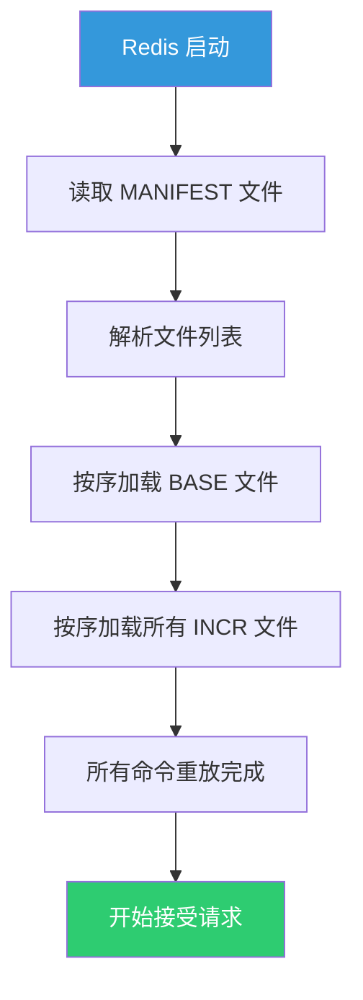

```c
// Redis 7 的 AOF 加载逻辑
int loadAppendOnlyFiles(aofManifest *am) {
    // 1. 加载 BASE 文件
    if (am->base_aof_info) {
        int ret = loadSingleAppendOnlyFile(am->base_aof_info->file_name);
        if (ret != C_OK) return ret;
    }

    // 2. 按序列号加载 INCR 文件
    listNode *ln;
    listIter li;
    listRewind(am->incr_aof_list, &li);
    while ((ln = listNext(&li)) != NULL) {
        aofInfo *ai = listNodeValue(ln);
        int ret = loadSingleAppendOnlyFile(ai->file_name);
        if (ret != C_OK) return ret;
    }

    return C_OK;
}
```

---

## 八、AOF 相关配置全解

### 8.1 核心配置项

```bash
############################## APPEND ONLY MODE ##############################

# 开启 AOF
appendonly yes

# AOF 文件名（Redis 7之前）
appendfilename "appendonly.aof"

# AOF 目录（Redis 7+）
appenddirname "appendonlydir"

# fsync 策略
appendfsync everysec

# AOF 重写期间是否禁用 fsync
no-appendfsync-on-rewrite no

# 自动重写触发条件
auto-aof-rewrite-percentage 100
auto-aof-rewrite-min-size 64mb

# 加载AOF时是否忽略末尾不完整命令
aof-load-truncated yes

# Redis 4.0+ 混合持久化
aof-use-rdb-preamble yes

# AOF 重写时的元素批量大小
aof-rewrite-incremental-fsync 32mb
```

### 8.2 no-appendfsync-on-rewrite

```bash
no-appendfsync-on-rewrite no   # 默认值
```

这个配置控制 AOF 重写期间是否禁用 fsync：

```mermaid
flowchart TD
    A[AOF重写期间] --> B{no-appendfsync-on-rewrite?}
    B -->|no| C["继续fsync<br/>可能造成磁盘I/O竞争<br/>主线程延迟增大"]
    B -->|yes| D["暂停fsync<br/>数据仅存在page cache<br/>重写期间宕机可能丢失数据"]

    style C fill:#f39c12,color:#fff
    style D fill:#e74c3c,color:#fff
```

::: warning 权衡建议
- **no（默认）**：保证数据安全，但 AOF 重写期间可能因磁盘 I/O 竞争导致延迟增大
- **yes**：减少磁盘 I/O 竞争，但重写期间宕机可能丢失更多数据

生产环境建议保持 `no`，除非磁盘性能确实成为瓶颈。
:::

### 8.3 aof-load-truncated

```bash
aof-load-truncated yes   # 默认值
```

当 AOF 文件末尾被截断（不完整）时，是否忽略并继续加载：

| 值 | 行为 |
|----|------|
| yes | 忽略截断部分，正常启动（记录警告日志） |
| no | 拒绝启动，需要手动修复 AOF 文件 |

::: tip 生产环境建议
设为 `yes` 更务实 —— AOF 末尾截断通常是因为宕机导致最后一条命令写入不完整，忽略这部分比拒绝启动要好得多。
:::

### 8.4 aof-rewrite-incremental-fsync

```bash
aof-rewrite-incremental-fsync 32mb   # 默认值
```

AOF 重写时，每写入 32MB 数据就执行一次 fsync，避免一次性写入大量数据导致磁盘 I/O 尖峰：

```
# 不使用增量fsync
新AOF文件 1GB → 一次性fsync → 磁盘I/O峰值 → 可能阻塞主进程

# 使用增量fsync
新AOF文件 1GB → 每32MB fsync一次 → 32次平缓写入 → 主进程不受影响
```

---

## 九、AOF 监控与运维

### 9.1 关键监控指标

```bash
127.0.0.1:6379> INFO persistence
```

```
# AOF 状态
aof_enabled:1                              # AOF 是否开启
aof_rewrite_in_progress:0                  # 是否正在重写
aof_rewrite_scheduled:0                    # 是否有等待执行的重写
aof_last_rewrite_time_sec:3                # 上次重写耗时（秒）
aof_current_rewrite_time_sec:-1            # 当前重写已耗时
aof_last_bgrewrite_status:ok               # 上次重写状态

# AOF 文件信息
aof_current_size:104857600                 # 当前AOF大小
aof_base_size:52428800                     # 上次重写后的AOF大小
aof_pending_rewrite:0                      # 是否有等待的重写
aof_buffer_length:0                        # AOF缓冲区长度
aof_rewrite_buffer_length:0                # 重写缓冲区长度
aof_pending_bio_fsync:0                    # 等待fsync的操作数
aof_delayed_fsync:0                        # fsync延迟次数

# Redis 7 Multi Part AOF
aof_manifest_size:3                        # MANIFEST中的文件数
```

### 9.2 告警规则

| 指标 | 告警阈值 | 说明 |
|------|---------|------|
| aof_last_bgrewrite_status | != ok | AOF 重写失败 |
| aof_last_rewrite_time_sec | > 60 | 重写耗时过长 |
| aof_delayed_fsync | 快速增长 | fsync 频繁延迟 |
| aof_current_size / aof_base_size | > 2 | AOF 文件增长过快 |
| aof_rewrite_buffer_length | > 100MB | 重写缓冲区过大 |
| 磁盘剩余空间 | < aof_current_size * 2 | 磁盘空间不足 |

### 9.3 AOF 性能优化

```bash
# 1. 使用 SSD 存储 AOF 文件
dir /mnt/ssd/redis

# 2. 调整 fsync 策略
appendfsync everysec    # 默认，大多数场景最佳

# 3. 调整重写阈值
auto-aof-rewrite-percentage 200    # 提高到200%，减少重写频率
auto-aof-rewrite-min-size 128mb   # 提高最小触发大小

# 4. 使用增量 fsync
aof-rewrite-incremental-fsync 32mb

# 5. 关闭混合持久化（仅用纯AOF时）
aof-use-rdb-preamble no
```

---

## 十、AOF 实战场景

### 10.1 开启 AOF

```bash
# 方法1：修改 redis.conf
appendonly yes

# 方法2：运行时动态开启（Redis 7+支持在线开启）
127.0.0.1:6379> CONFIG SET appendonly yes
OK
127.0.0.1:6379> CONFIG REWRITE
OK
```

::: important 在线开启 AOF 的注意事项
1. Redis 会自动执行一次 BGSAVE 生成 RDB，然后将其转换为 AOF 初始内容
2. 在线开启期间可能会有短暂的延迟
3. 确保磁盘空间充足（AOF 初始文件可能较大）
4. 开启后务必 `CONFIG REWRITE` 将配置持久化
:::

### 10.2 从 RDB 迁移到 AOF

```bash
# 步骤1：确保当前数据有最新 RDB
127.0.0.1:6379> BGSAVE
Background saving started

# 步骤2：开启 AOF
127.0.0.1:6379> CONFIG SET appendonly yes
OK

# 步骤3：等待 AOF 重写完成
127.0.0.1:6379> INFO persistence
# aof_rewrite_in_progress:0

# 步骤4：持久化配置
127.0.0.1:6379> CONFIG REWRITE
OK

# 步骤5：重启验证
redis-cli SHUTDOWN
redis-server /etc/redis/redis.conf
```

### 10.3 AOF 文件压缩效果监控

```bash
#!/bin/bash
# 监控 AOF 重写前后的文件大小变化

REDIS_CLI="redis-cli"
LOG_FILE="/var/log/redis/aof_rewrite_monitor.log"

# 获取当前 AOF 信息
AOF_SIZE=$($REDIS_CLI INFO persistence | grep aof_current_size | awk -F: '{print $2}' | tr -d '\r')
BASE_SIZE=$($REDIS_CLI INFO persistence | grep aof_base_size | awk -F: '{print $2}' | tr -d '\r')

# 计算膨胀率
if [ "$BASE_SIZE" -gt 0 ]; then
    RATIO=$(echo "scale=2; ($AOF_SIZE - $BASE_SIZE) / $BASE_SIZE * 100" | bc)
    echo "$(date): AOF=$AOF_SIZE, BASE=$BASE_SIZE, 膨胀率=${RATIO}%" >> $LOG_FILE
fi

# 如果膨胀率超过200%，建议手动触发重写
if [ $(echo "$RATIO > 200" | bc) -eq 1 ]; then
    echo "$(date): AOF膨胀率过高(${RATIO}%)，建议执行BGREWRITEAOF" >> $LOG_FILE
fi
```

### 10.4 AOF 与 RDB 共存时的恢复优先级

```mermaid
flowchart TD
    A[Redis启动] --> B{appendonly = yes?}
    B -->|是| C[加载AOF文件]
    B -->|否| D[加载RDB文件]
    C --> E{AOF加载成功?}
    E -->|是| F[正常启动]
    E -->|否| G{aof-load-truncated?}
    G -->|yes| H[忽略截断部分，启动]
    G -->|no| I[报错退出，需手动修复]
    D --> J{RDB加载成功?}
    J -->|是| F
    J -->|否| K[空数据库启动]

    style A fill:#3498db,color:#fff
    style F fill:#2ecc71,color:#fff
    style I fill:#e74c3c,color:#fff
```

---

## 十一、AOF 常见问题排查

### 11.1 AOF 文件过大

**现象：** AOF 文件持续增长，重写后仍然很大

**排查：**

```bash
# 1. 检查数据分布
redis-cli --bigkeys

# 2. 检查是否有大量带 TTL 的键
127.0.0.1:6379> INFO keyspace
db0:keys=1000000,expires=800000,avg_ttl=3600000

# 3. 检查 AOF 重写是否正常
127.0.0.1:6379> INFO persistence
aof_last_bgrewrite_status:ok
aof_last_rewrite_time_sec:30
```

**优化方案：**

1. 检查是否有未设置过期时间的缓存键
2. 使用 `SCAN` 命令扫描分析键分布
3. 考虑开启混合持久化减少 AOF 体积
4. 拆分大键

### 11.2 AOF 重写失败

**现象：**

```
Background append only file rewriting failed
```

**常见原因与解决：**

```bash
# 原因1：磁盘空间不足
df -h /var/lib/redis
# 解决：清理磁盘空间

# 原因2：fork 失败
dmesg | grep -i oom
# 解决：设置 vm.overcommit_memory=1

# 原因3：已有子进程在运行
127.0.0.1:6379> INFO persistence
rdb_bgsave_in_progress:1    # BGSAVE 正在执行
# 解决：等待 BGSAVE 完成后再触发重写
```

### 11.3 fsync 延迟过高

**现象：**

```
Asynchronous AOF fsync is taking too long (disk is busy?)
```

**排查：**

```bash
# 1. 检查磁盘 I/O
iostat -x 1 10

# 2. 检查是否有其他进程占用磁盘
iotop

# 3. 检查 AOF 文件是否在 NFS 上
df -T /var/lib/redis

# 4. 检查 fsync 延迟统计
127.0.0.1:6379> INFO persistence
aof_delayed_fsync:156    # 延迟次数过多
```

**解决方案：**

1. 将 AOF 文件移到 SSD
2. 确保磁盘独占使用（无其他 I/O 密集型进程）
3. 调整 `appendfsync` 为 `everysec`（如果当前是 `always`）
4. 考虑增大 `aof-rewrite-incremental-fsync` 值

### 11.4 Redis 7 升级后的 AOF 兼容性

**问题：** 从 Redis 6 升级到 Redis 7 后，AOF 文件结构变化

**处理流程：**

```bash
# Redis 7 启动时会自动将旧格式 AOF 转换为 Multi Part AOF
# 转换过程：
# 1. 读取旧 appendonly.aof
# 2. 创建 appendonlydir/ 目录
# 3. 生成 BASE 文件和 MANIFEST
# 4. 重命名为 appendonly.aof.bak

# 验证转换
ls -la /var/lib/redis/appendonlydir/
# appendonly.aof.1.base.aof
# appendonly.aof.1.incr.aof
# appendonly.aof.manifest

# 如果需要回滚到 Redis 6
# 1. 停止 Redis 7
# 2. 将 appendonly.aof.bak 复制为 appendonly.aof
# 3. 删除 appendonlydir/ 目录
# 4. 启动 Redis 6
```

---

## 十二、AOF 内部机制深入

### 12.1 AOF 与事件循环

AOF 的写入与 Redis 的事件循环紧密耦合：

```c
// server.c - 事件循环主函数
void aeMain(aeEventLoop *eventLoop) {
    while (!eventLoop->stop) {
        // beforeSleep: 刷新 AOF 缓冲区
        beforeSleep(eventLoop);

        // 处理事件
        aeProcessEvents(eventLoop, AE_ALL_EVENTS);
    }
}
```

```c
// 每次事件循环前调用
void beforeSleep(struct aeEventLoop *eventLoop) {
    // 刷新 AOF 缓冲区
    if (server.aof_state == AOF_ON) {
        flushAppendOnlyFile(0);
    }
    // ...
}
```

### 12.2 flushAppendOnlyFile 详解

```c
void flushAppendOnlyFile(int force) {
    ssize_t nwritten;
    int sync_in_progress = 0;

    // 如果缓冲区为空，直接返回
    if (sdslen(server.aof_buf) == 0) return;

    // 如果策略是 everysec，检查是否有 fsync 在进行
    if (server.aof_fsync == AOF_FSYNC_EVERYSEC) {
        sync_in_progress = bioPendingJobsOfType(BIO_AOF_FSYNC);
    }

    // 如果有 fsync 在进行且不强制写入
    if (sync_in_progress && !force) {
        if (server.aof_fsync == AOF_FSYNC_EVERYSEC) {
            // fsync 已经过2秒还没完成，延迟写入
            if (server.unixtime - server.aof_last_fsync > 2) {
                server.aof_delayed_fsync++;
            }
        }
    }

    // 执行写入
    nwritten = write(server.aof_fd, server.aof_buf, sdslen(server.aof_buf));

    // 根据策略执行 fsync
    if (server.aof_fsync == AOF_FSYNC_ALWAYS) {
        aof_fsync(server.aof_fd);  // 阻塞等待
    } else if (server.aof_fsync == AOF_FSYNC_EVERYSEC) {
        // 提交到后台线程
        aof_background_fsync(server.aof_fd);
    }
    // AOF_FSYNC_NO: 什么都不做
}
```

### 12.3 AOF 时间戳注释

Redis 7.0+ 支持在 AOF 文件中记录时间戳，用于更精确的数据恢复：

```bash
# 开启 AOF 时间戳
redis.conf:
aof-timestamp-enabled yes

# AOF 文件中会出现时间戳注释
# TS:1717500000
*3
$3
SET
$4
name
$5
Redis
```

---

## 十三、总结

```mermaid
mindmap
  root((AOF 日志机制))
    写后日志
      先执行命令再记录
      避免记录错误命令
      不阻塞当前命令
      宕机可能丢失当前命令
    fsync策略
      always
        零丢失
        性能最差
      everysec
        最多丢1秒
        推荐策略
      no
        可能丢30秒
        性能最好
    AOF重写
      fork子进程
      重写缓冲区
      最简命令生成
      大键拆分写入
    Redis 7 Multi Part AOF
      BASE文件
      INCR文件
      MANIFEST文件
      消除主进程阻塞
    损坏修复
      redis-check-aof
      截断修复
      备份优先
```

::: tip 核心要点回顾
1. **AOF 是写后日志**，先执行命令再记录，避免记录错误命令但不阻塞当前操作
2. **三种 fsync 策略**中 `everysec` 是最佳平衡点，最多丢 1 秒数据
3. **AOF 重写**通过 fork 子进程 + 重写缓冲区实现，保证重写期间数据不丢失
4. **Redis 7 的 Multi Part AOF** 消除了传统 AOF 重写的内存压力和阻塞风险
5. **AOF 优先级高于 RDB**，同时开启时 Redis 只加载 AOF 文件
6. **生产环境**务必监控 `aof_delayed_fsync` 和 `aof_last_bgrewrite_status`
:::

---

**参考资料：**

- [Redis 官方文档 - Persistence](https://redis.io/docs/management/persistence/)
- [Redis 官方文档 - Append Only File](https://redis.io/docs/management/persistence/append-only-file/)
- 《Redis 设计与实现》黄健宏 著 —— 第11章 AOF持久化
- 《Redis 开发与运维》付磊 张益军 著 —— 第5章 持久化
- Redis 源码 `aof.c`、`bio.c`、`server.c`
- [Redis 7 Multi Part AOF 设计文档](https://redis.io/docs/management/persistence/append-only-file/#multi-part-aof)
