# 混合持久化与选型

::: info 核心问题
RDB 恢复快但可能丢数据，AOF 数据安全但恢复慢 —— 能不能两者兼得？Redis 4.0 引入的混合持久化正是这个问题的答案。本章将深入混合持久化的原理、三种方案的全面对比，以及不同业务场景下的持久化选型策略。
:::

## 一、混合持久化原理

### 1.1 为什么需要混合持久化

RDB 和 AOF 各有优劣，单独使用都存在明显短板：

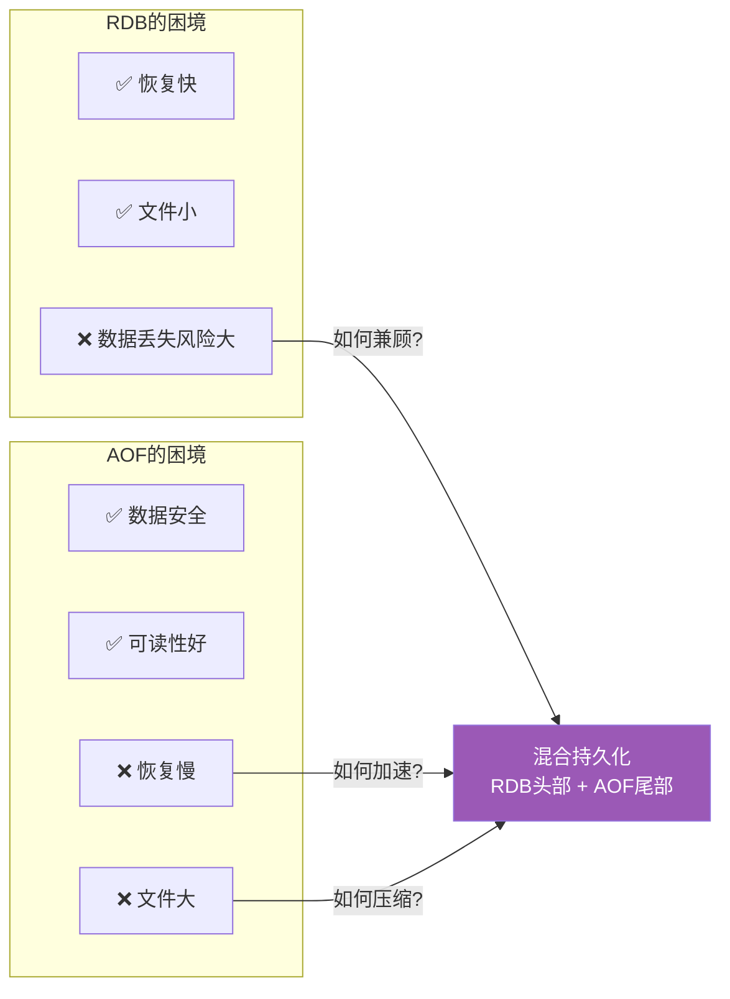

**纯 RDB 的数据丢失场景：**

```mermaid
gantt
    title RDB 数据丢失时间线
    dateFormat X
    axisFormat %s秒

    section 正常运行
    BGSAVE完成，RDB保存     :done, 0, 1
    持续写入5000条数据       :active, 1, 900

    section 故障
    服务器宕机               :crit, 900, 900

    section 恢复后
    加载RDB → 丢失900秒数据  :crit, 900, 910
```

**纯 AOF 的恢复时间问题：**

```mermaid
gantt
    title AOF 恢复时间
    dateFormat X
    axisFormat %s秒

    section 重放AOF
    重放SET命令10万条        :active, 0, 30
    重放HSET命令5万条        :active, 30, 60
    重放其他命令3万条         :active, 60, 90

    section 恢复完成
    开始接受请求             :done, 90, 90
```

### 1.2 混合持久化的核心思想

混合持久化的核心思想极其简洁：**AOF 重写时，先用 RDB 格式写入当前内存的全量快照（头部），再用 AOF 格式写入重写期间的增量命令（尾部）**。

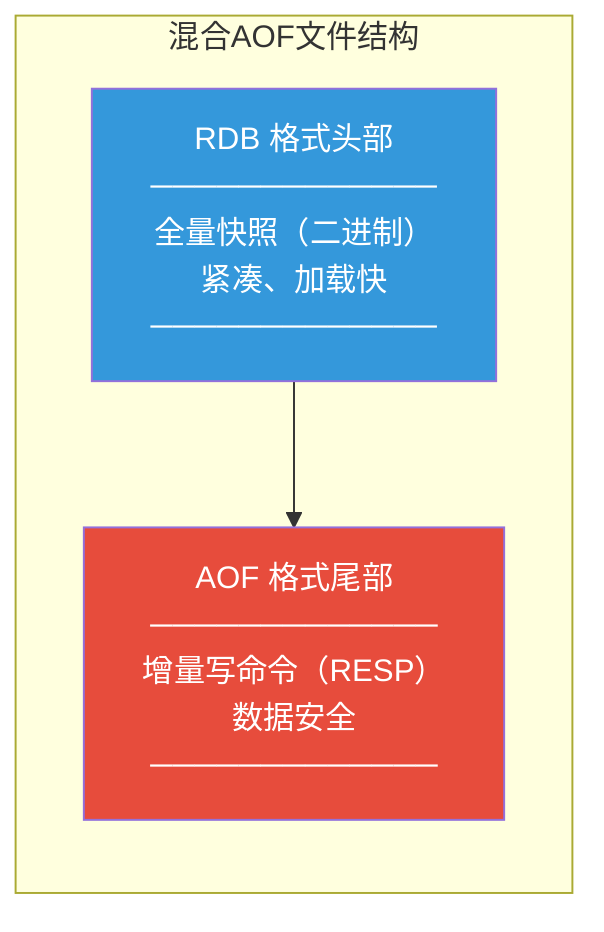

::: tip 混合持久化的精妙之处
1. **RDB 头部**：承载全量数据，加载速度极快，解决了纯 AOF 重放慢的问题
2. **AOF 尾部**：承载增量命令，数据安全性高，解决了纯 RDB 丢数据的问题
3. **兼容 AOF 格式**：混合文件本质上还是一个 AOF 文件，Redis 识别到 RDB 头部标记后会切换到 RDB 加载模式
:::

### 1.3 混合持久化的工作流程

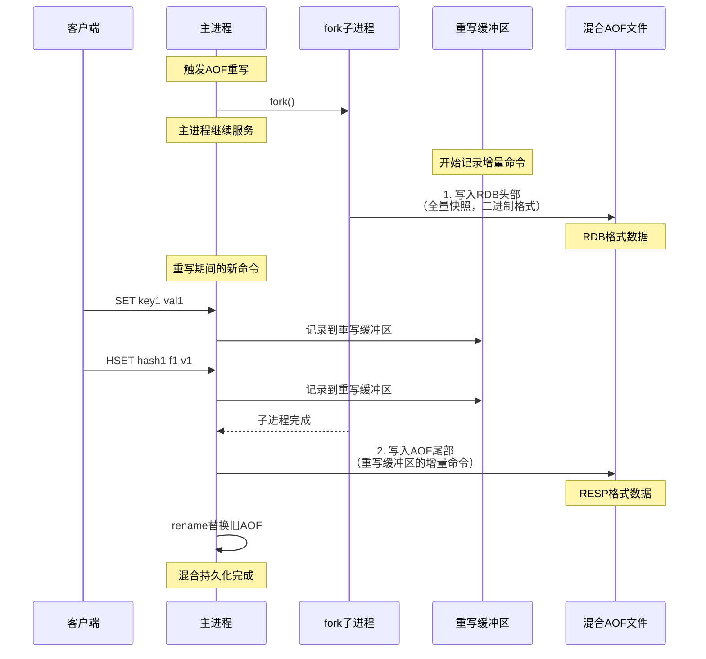

---

## 二、aof-use-rdb-preamble 配置

### 2.1 配置说明

```bash
# redis.conf
aof-use-rdb-preamble yes   # 默认值（Redis 4.0+）
```

| 值 | 行为 |
|----|------|
| yes | AOF 重写时使用混合格式（RDB头部 + AOF尾部） |
| no | AOF 重写时使用纯 AOF 格式（仅 RESP 命令） |

### 2.2 开启与关闭

```bash
# 运行时动态修改
127.0.0.1:6379> CONFIG SET aof-use-rdb-preamble yes
OK

127.0.0.1:6379> CONFIG REWRITE
OK

# 查看当前配置
127.0.0.1:6379> CONFIG GET aof-use-rdb-preamble
1) "aof-use-rdb-preamble"
2) "yes"
```

### 2.3 混合 AOF 文件的识别

Redis 在加载 AOF 文件时，通过检查文件头部来判断格式：

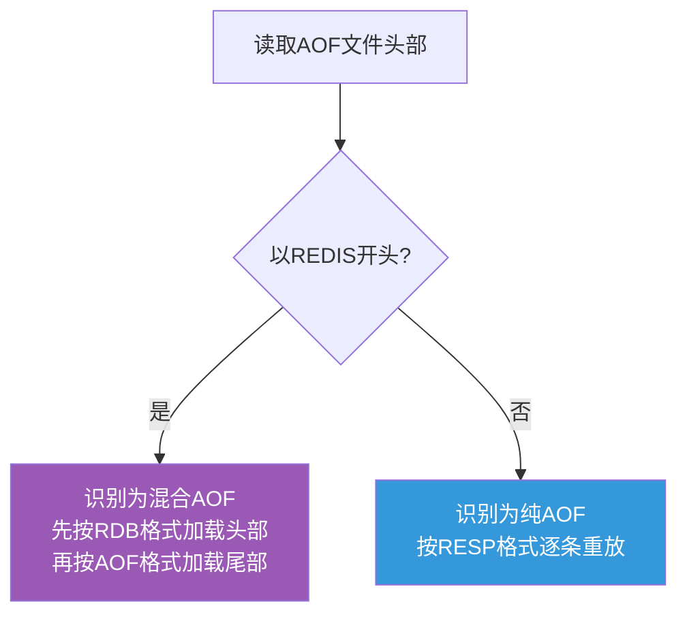

```c
// Redis 源码中的判断逻辑（简化）
int loadAppendOnlyFile(char *filename) {
    // 读取文件头部
    char magic[5];
    fread(magic, 1, 5, fp);

    if (memcmp(magic, "REDIS", 5) == 0) {
        // 混合AOF：RDB头部
        rioInitWithFile(&rdb, fp);
        rdbLoadRio(&rdb, ...);      // RDB加载

        // AOF尾部
        while (1) {
            // 逐条读取RESP命令并执行
        }
    } else {
        // 纯AOF：从头开始重放
        fseek(fp, 0, SEEK_SET);
        while (1) {
            // 逐条读取RESP命令并执行
        }
    }
}
```

::: important 兼容性注意事项
1. **Redis 4.0 之前无法识别混合 AOF**：如果将混合 AOF 文件复制到 Redis 3.x 实例，会加载失败
2. **降级场景**：从 Redis 4.0+ 降级到 3.x 时，需先关闭混合持久化并重写 AOF
3. **redis-check-aof 兼容**：Redis 4.0+ 的 `redis-check-aof` 工具已支持混合格式检查
:::

### 2.4 混合 AOF 文件的内部结构

混合 AOF 文件的详细结构：

```
┌──────────────────────────────────────────────────┐
│                   混合 AOF 文件                    │
├──────────────────────────────────────────────────┤
│                                                  │
│  ┌────────────────────────────────────────────┐  │
│  │           RDB 头部（二进制）                 │  │
│  │                                            │  │
│  │  REDIS0011           ← 魔数+版本号         │  │
│  │  AUX fields          ← 辅助字段            │  │
│  │  SELECTDB 0          ← 数据库0             │  │
│  │  key-value pairs     ← 所有键值对          │  │
│  │  SELECTDB 1          ← 数据库1             │  │
│  │  key-value pairs     ← 所有键值对          │  │
│  │  ...                                      │  │
│  │  EOF + CRC64         ← RDB结束标记         │  │
│  │                                            │  │
│  └────────────────────────────────────────────┘  │
│                                                  │
│  ┌────────────────────────────────────────────┐  │
│  │           AOF 尾部（RESP文本）              │  │
│  │                                            │  │
│  │  *3\r\n             ← SET命令              │  │
│  │  $3\r\n                                   │  │
│  │  SET\r\n                                  │  │
│  │  $4\r\n                                   │  │
│  │  key1\r\n                                 │  │
│  │  $5\r\n                                   │  │
│  │  val1\r\n                                 │  │
│  │  ...                                      │  │
│  │                                            │  │
│  └────────────────────────────────────────────┘  │
│                                                  │
└──────────────────────────────────────────────────┘
```

---

## 三、RDB vs AOF vs 混合持久化对比

### 3.1 全维度对比

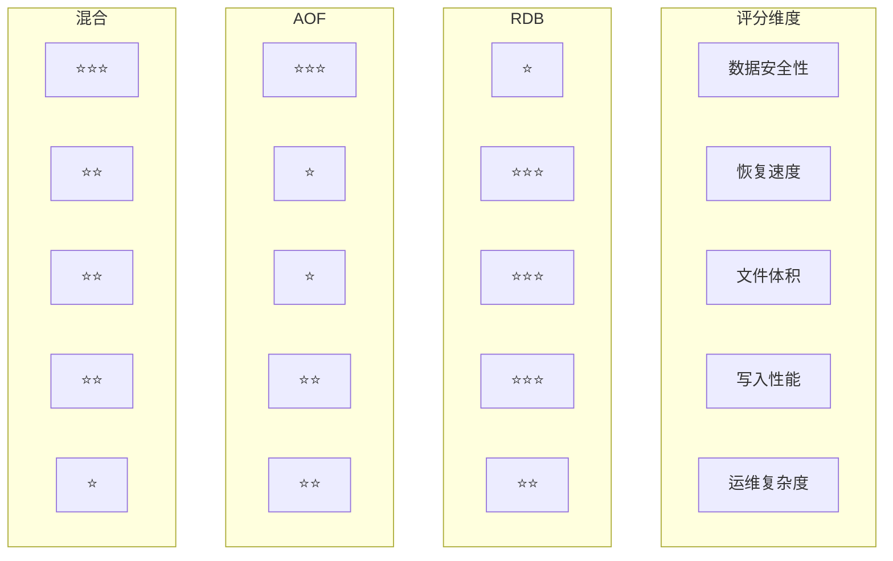

| 维度 | RDB | AOF | 混合持久化 |
|------|-----|-----|----------|
| **数据安全性** | 低（分钟级丢失） | 高（最多1秒） | 高（最多1秒） |
| **恢复速度** | 极快（~2s/GB） | 慢（~20s/GB） | 快（~5s/GB） |
| **文件体积** | 小（二进制压缩） | 大（文本日志） | 中（RDB头部小+AOF尾部） |
| **对写入性能影响** | 小（fork瞬间） | 中（每次写追加） | 中（同AOF） |
| **fork/COW 开销** | 有 | 重写时有 | 重写时有 |
| **文件可读性** | 不可读 | 可读 | 部分可读 |
| **首次加载时间** | 极短 | 长 | 较短 |
| **Redis 版本要求** | 所有版本 | 所有版本 | >= 4.0 |
| **默认状态** | 开启 | 关闭 | 开启(AOF开启时) |

### 3.2 数据安全性对比

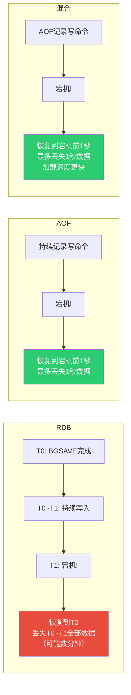

**数据丢失量量化对比：**

| 场景 | RDB | AOF(everysec) | 混合(everysec) |
|------|-----|---------------|---------------|
| 正常宕机 | 最后一次BGSAVE后的所有数据 | 最多1秒 | 最多1秒 |
| 磁盘故障 | 最后一次备份后的所有数据 | 取决于fsync时机 | 取决于fsync时机 |
| 误操作FLUSHALL | 旧RDB被覆盖 | AOF末尾有FLUSHALL | AOF末尾有FLUSHALL |
| OS崩溃 | page cache中的数据丢失 | page cache中的数据丢失 | page cache中的数据丢失 |

### 3.3 恢复速度对比

**实测数据（4GB 实例，SSD）：**

| 持久化方式 | 文件大小 | 加载耗时 | 说明 |
|----------|---------|---------|------|
| RDB | 1.2 GB | ~3s | 直接加载二进制 |
| 纯 AOF | 4.5 GB | ~80s | 逐条重放18万条命令 |
| 混合 AOF | 1.5 GB | ~8s | RDB头部3s + AOF尾部5s |

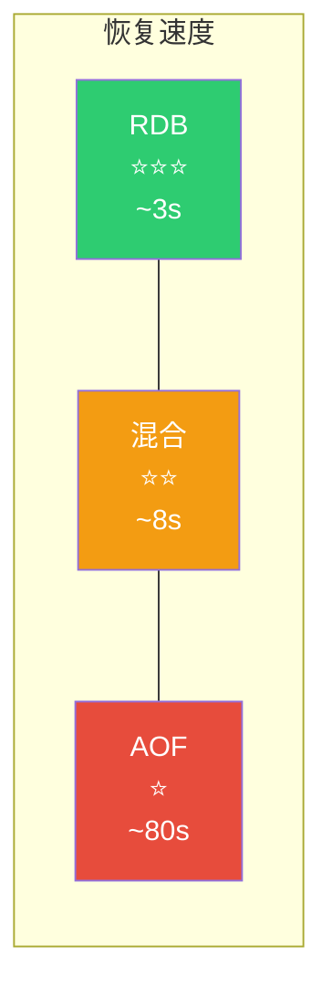

### 3.4 文件体积对比

**实测数据（4GB 实例）：**

| 持久化方式 | 重写后文件大小 | 压缩率 |
|----------|------------|-------|
| RDB | 1.2 GB | 70% |
| 纯 AOF | 2.8 GB | 30% |
| 混合 AOF | 1.5 GB | 62% |

::: important 为什么混合 AOF 比纯 AOF 小
混合 AOF 的头部使用 RDB 格式存储全量数据（紧凑二进制），尾部只存储重写后的增量命令（通常很短）。而纯 AOF 的整个文件都是 RESP 文本格式，体积更大。

混合 AOF 的体积 ≈ RDB 头部（紧凑）+ 少量 AOF 增量（RESP格式）
纯 AOF 的体积 = 全量 RESP 格式（冗余）
:::

### 3.5 写入性能对比

```bash
# redis-benchmark 写入性能测试

# 仅 RDB（save 900 1）
redis-benchmark -t set -n 100000 -q
SET: 110000 requests per second

# AOF always
redis-benchmark -t set -n 100000 -q
SET: 25000 requests per second

# AOF everysec
redis-benchmark -t set -n 100000 -q
SET: 105000 requests per second

# AOF no
redis-benchmark -t set -n 100000 -q
SET: 112000 requests per second

# 混合持久化（everysec）
redis-benchmark -t set -n 100000 -q
SET: 105000 requests per second
```

**结论：混合持久化的写入性能与 AOF everysec 基本一致**，因为日常写入走的是同样的 AOF 追加逻辑。混合持久化只在重写时使用 RDB 格式。

---

## 四、不同业务场景选型

### 4.1 选型决策树

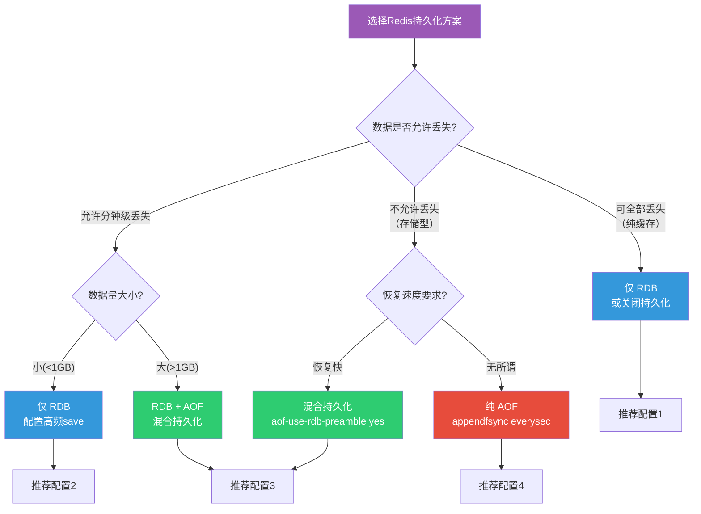

### 4.2 场景一：缓存型业务

**特征：** 数据全量在数据库中，Redis 只是加速层，丢失可从数据库重建。


**推荐方案：仅 RDB 或关闭持久化**

```bash
# 方案A：仅RDB（推荐）
appendonly no
save 900 1
save 300 10
save 60 10000

# 方案B：关闭持久化（极致性能）
appendonly no
save ""

# 方案C：低频RDB（节省资源）
appendonly no
save 3600 1     # 1小时内有1次修改
save 1800 100   # 30分钟内有100次修改
```

::: tip 缓存型业务的考量
1. **关闭 AOF**：AOF 的每次写追加会降低缓存写入性能
2. **降低 RDB 频率**：缓存数据可重建，不需要高频持久化
3. **考虑关闭持久化**：如果缓存全部可重建且重建时间可接受
4. **预留重建时间**：即使关闭持久化，也要评估缓存预热时间
:::

### 4.3 场景二：存储型业务

**特征：** Redis 是唯一的数据存储，丢失不可接受。


**推荐方案：混合持久化**

```bash
# 存储型推荐配置
appendonly yes
appendfsync everysec
aof-use-rdb-preamble yes
auto-aof-rewrite-percentage 100
auto-aof-rewrite-min-size 64mb

# RDB作为备份
save 900 1
save 300 10
save 60 10000
```

::: important 存储型业务的关键要求
1. **必须开启 AOF**：保证数据安全
2. **使用混合持久化**：兼顾恢复速度和数据安全
3. **appendfsync everysec**：最佳性能与安全平衡
4. **保留 RDB**：作为额外备份和异地容灾
5. **定期备份 RDB 到异地**：防范机房级故障
:::

### 4.4 场景三：消息队列/实时计算

**特征：** 数据有短暂生命周期，写入量极大，对延迟敏感。

**推荐方案：AOF everysec + 低频 RDB**

```bash
# 消息队列型推荐配置
appendonly yes
appendfsync everysec
aof-use-rdb-preamble yes
no-appendfsync-on-rewrite no

# 降低RDB频率
save 3600 1
save 1800 100

# 增大AOF重写阈值
auto-aof-rewrite-percentage 200
auto-aof-rewrite-min-size 256mb
```

### 4.5 场景四：金融/交易

**特征：** 零数据丢失，严格合规要求。

**推荐方案：AOF always + 混合持久化 + RDB备份**

```bash
# 金融级推荐配置
appendonly yes
appendfsync always              # 零丢失
aof-use-rdb-preamble yes
stop-writes-on-bgsave-error yes
rdbchecksum yes

# RDB备份
save 900 1
save 300 10
```

::: warning 金融场景的额外要求
1. **appendfsync always**：确保每条命令都落盘
2. **多副本**：至少一主两从，分布在不同机架
3. **异地备份**：RDB 文件定期传输到异地
4. **监控告警**：任何持久化失败必须立即告警
5. **性能预留**：AOF always 的 QPS 约为 everysec 的 1/5~1/4
:::

### 4.6 场景五：Session 存储

**特征：** 临时性数据，有 TTL，丢失影响有限但需要快速恢复。

**推荐方案：混合持久化 + 适当降低频率**

```bash
# Session存储推荐配置
appendonly yes
appendfsync everysec
aof-use-rdb-preamble yes

# Session有TTL，降低RDB频率
save 900 1
save 300 100
```

### 4.7 场景选型速查表

| 业务场景 | 数据丢失容忍度 | 推荐方案 | appendfsync | RDB策略 |
|---------|-------------|---------|-------------|---------|
| 纯缓存 | 全部可丢 | 仅RDB/关闭 | - | 低频/关闭 |
| 普通缓存 | 分钟级 | RDB | - | 默认 |
| 会话存储 | 秒级 | 混合持久化 | everysec | 低频 |
| 消息队列 | 秒级 | 混合持久化 | everysec | 低频 |
| 业务存储 | 秒级 | 混合持久化 | everysec | 默认 |
| 金融交易 | 零丢失 | 混合持久化 | always | 默认+备份 |

---

## 五、主从持久化策略

### 5.1 主从架构中的持久化分工

在 Redis 主从架构中，主节点和从节点的持久化策略需要区别对待：

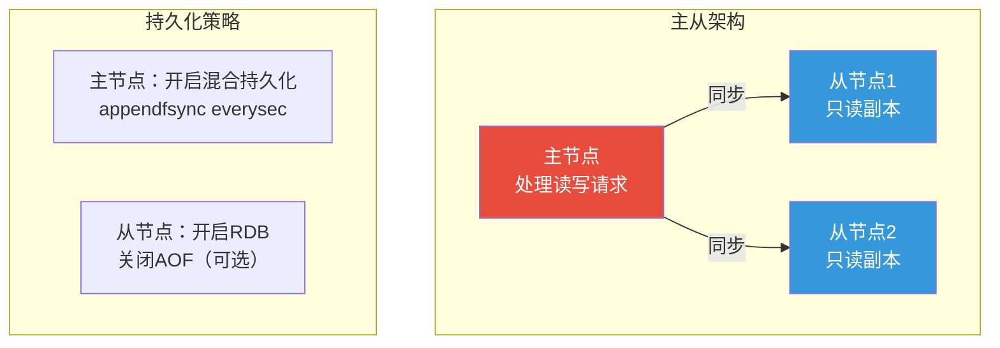

### 5.2 主节点持久化策略

主节点作为数据写入的唯一入口，**必须开启持久化**：

```bash
# 主节点配置
appendonly yes
appendfsync everysec
aof-use-rdb-preamble yes
save 900 1
save 300 10
save 60 10000
```

::: important 主节点千万不要关闭持久化
一个常见的误区是：既然从节点有数据副本，主节点就不需要持久化。这是极其危险的！

**场景：主节点关闭持久化 + 从节点开启持久化**

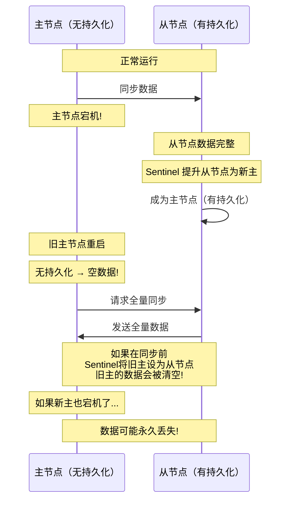

**核心风险**：如果主节点关闭持久化，重启后数据为空，如果被 Sentinel 提升为新主或与新主同步，可能导致整个集群数据丢失！
:::

### 5.3 从节点持久化策略

从节点的持久化策略更加灵活，取决于是否需要从节点参与故障恢复：

**策略1：从节点开启 RDB（推荐）**

```bash
# 从节点配置
appendonly no          # 关闭AOF，减少I/O
save 900 1
save 300 10
save 60 10000
```

优势：
- 从节点生成 RDB 文件可用于全量同步
- RDB 文件可作为备份
- 减少磁盘 I/O，降低对复制延迟的影响

**策略2：从节点开启混合持久化**

```bash
# 从节点配置
appendonly yes
appendfsync everysec
aof-use-rdb-preamble yes
save 900 1
save 300 10
```

优势：
- 从节点故障恢复后数据更完整
- 可作为主节点的热备

劣势：
- 增加磁盘 I/O
- 可能影响复制延迟

**策略3：从节点关闭持久化**

```bash
# 从节点配置（不推荐）
appendonly no
save ""
```

::: warning 从节点关闭持久化的风险
1. 从节点重启后需要全量同步，给主节点带来压力
2. 如果所有节点都关闭持久化，集群级故障可能导致数据永久丢失
3. 无法从从节点生成备份
:::

### 5.4 主从持久化组合矩阵

| 组合 | 主节点 | 从节点 | 安全性 | 性能 | 推荐度 |
|------|--------|--------|-------|------|-------|
| 方案1 | 混合AOF | RDB | 高 | 高 | ★★★★★ |
| 方案2 | 混合AOF | 混合AOF | 最高 | 中 | ★★★★ |
| 方案3 | RDB | RDB | 中 | 高 | ★★★ |
| 方案4 | 混合AOF | 关闭 | 中 | 最高 | ★★ |
| 方案5 | 关闭 | 混合AOF | 低 | 最高 | ★ |

### 5.5 哨兵/集群模式下的持久化

在 Redis Sentinel 或 Cluster 模式下，持久化策略需要更加谨慎：

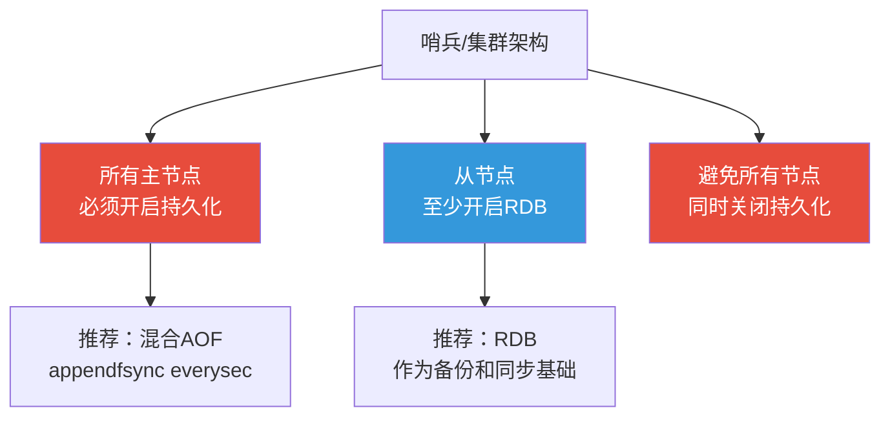

**Cluster 模式的特殊考量：**

1. 每个 Master 节点都是一部分 slot 的唯一写入入口
2. Master 故障后 Slave 被提升为新 Master，新 Master 必须有数据
3. 如果新 Master 之前没有开启持久化，提升后的数据可能不完整

```bash
# Cluster 中每个节点的推荐配置
appendonly yes
appendfsync everysec
aof-use-rdb-preamble yes
save 900 1
save 300 10
save 60 10000
```

---

## 六、生产环境最佳实践

### 6.1 通用最佳配置

```bash
############################## 生产级持久化配置 ##############################

# === AOF 配置 ===
appendonly yes                        # 开启AOF
appendfsync everysec                  # 每秒fsync
aof-use-rdb-preamble yes              # 混合持久化
aof-load-truncated yes                # 忽略AOF末尾截断
auto-aof-rewrite-percentage 100       # AOF增长100%触发重写
auto-aof-rewrite-min-size 64mb        # AOF最小64MB触发重写
aof-rewrite-incremental-fsync 32mb    # 增量fsync

# === RDB 配置 ===
save 900 1                            # 15分钟1次修改
save 300 10                           # 5分钟10次修改
save 60 10000                         # 1分钟10000次修改
stop-writes-on-bgsave-error yes       # BGSAVE失败停止写入
rdbcompression yes                    # 开启LZF压缩
rdbchecksum yes                       # 开启CRC64校验

# === 文件配置 ===
dir /data/redis                       # 独立数据目录
dbfilename dump-${PORT}.rdb           # 多实例区分文件名
```

### 6.2 系统级优化

```bash
# 1. vm.overcommit_memory
echo "vm.overcommit_memory=1" >> /etc/sysctl.conf
sysctl -p

# 2. 禁用透明大页
echo never > /sys/kernel/mm/transparent_hugepage/enabled
echo 'echo never > /sys/kernel/mm/transparent_hugepage/enabled' >> /etc/rc.local

# 3. 磁盘调度器（SSD）
echo noop > /sys/block/sda/queue/scheduler

# 4. 文件系统优化
# 推荐使用 XFS 或 ext4
# mount 选项: noatime,nodiratime
```

### 6.3 监控指标清单

```bash
#!/bin/bash
# Redis 持久化监控脚本

REDIS_CLI="redis-cli"
ALERT_EMAIL="ops@example.com"

# 检查 RDB 状态
RDB_STATUS=$($REDIS_CLI INFO persistence | grep rdb_last_bgsave_status | awk -F: '{print $2}' | tr -d '\r')
if [ "$RDB_STATUS" != "ok" ]; then
    echo "ALERT: RDB BGSAVE failed! Status: $RDB_STATUS" | mail -s "Redis RDB Alert" $ALERT_EMAIL
fi

# 检查 AOF 状态
AOF_STATUS=$($REDIS_CLI INFO persistence | grep aof_last_bgrewrite_status | awk -F: '{print $2}' | tr -d '\r')
if [ "$AOF_STATUS" != "ok" ]; then
    echo "ALERT: AOF rewrite failed! Status: $AOF_STATUS" | mail -s "Redis AOF Alert" $ALERT_EMAIL
fi

# 检查 BGSAVE 耗时
BGSAVE_TIME=$($REDIS_CLI INFO persistence | grep rdb_last_bgsave_time_sec | awk -F: '{print $2}' | tr -d '\r')
if [ "$BGSAVE_TIME" -gt 30 ]; then
    echo "WARNING: BGSAVE took ${BGSAVE_TIME}s" | mail -s "Redis BGSAVE Slow" $ALERT_EMAIL
fi

# 检查 AOF 膨胀率
AOF_CURRENT=$($REDIS_CLI INFO persistence | grep aof_current_size | awk -F: '{print $2}' | tr -d '\r')
AOF_BASE=$($REDIS_CLI INFO persistence | grep aof_base_size | awk -F: '{print $2}' | tr -d '\r')
if [ "$AOF_BASE" -gt 0 ]; then
    RATIO=$(echo "scale=0; ($AOF_CURRENT - $AOF_BASE) * 100 / $AOF_BASE" | bc)
    if [ "$RATIO" -gt 200 ]; then
        echo "WARNING: AOF bloat ratio ${RATIO}%" | mail -s "Redis AOF Bloat" $ALERT_EMAIL
    fi
fi

# 检查 fsync 延迟
FSYNC_DELAY=$($REDIS_CLI INFO persistence | grep aof_delayed_fsync | awk -F: '{print $2}' | tr -d '\r')
if [ "$FSYNC_DELAY" -gt 10 ]; then
    echo "WARNING: AOF fsync delayed ${FSYNC_DELAY} times" | mail -s "Redis AOF Fsync Delay" $ALERT_EMAIL
fi

# 检查磁盘空间
DISK_USAGE=$(df -h /data/redis | tail -1 | awk '{print $5}' | tr -d '%')
if [ "$DISK_USAGE" -gt 80 ]; then
    echo "ALERT: Redis disk usage ${DISK_USAGE}%" | mail -s "Redis Disk Space Alert" $ALERT_EMAIL
fi
```

### 6.4 备份策略

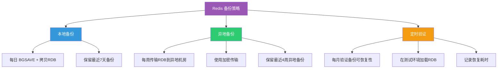

**自动化备份脚本：**

```bash
#!/bin/bash
# Redis 持久化备份脚本（生产级）

REDIS_HOST="127.0.0.1"
REDIS_PORT="6379"
REDIS_CLI="redis-cli -h $REDIS_HOST -p $REDIS_PORT"
BACKUP_DIR="/backup/redis"
REMOTE_DIR="backup-server:/backup/redis"
DATE=$(date +%Y%m%d_%H%M%S)
LOG="/var/log/redis/backup.log"

log() {
    echo "[$(date '+%Y-%m-%d %H:%M:%S')] $1" >> $LOG
}

# 1. 触发 BGSAVE
log "Triggering BGSAVE..."
$REDIS_CLI BGSAVE

# 2. 等待 BGSAVE 完成
LAST_SAVE=$($REDIS_CLI LASTSAVE)
while true; do
    CURRENT_SAVE=$($REDIS_CLI LASTSAVE)
    if [ "$CURRENT_SAVE" != "$LAST_SAVE" ]; then
        break
    fi
    sleep 1
done
log "BGSAVE completed"

# 3. 备份 RDB 文件
RDB_FILE="/data/redis/dump.rdb"
if [ -f "$RDB_FILE" ]; then
    cp "$RDB_FILE" "$BACKUP_DIR/dump_$DATE.rdb"
    gzip "$BACKUP_DIR/dump_$DATE.rdb"
    log "RDB backed up: dump_$DATE.rdb.gz"
else
    log "ERROR: RDB file not found!"
fi

# 4. 备份 AOF 文件（Redis 7 Multi Part AOF）
AOF_DIR="/data/redis/appendonlydir"
if [ -d "$AOF_DIR" ]; then
    tar czf "$BACKUP_DIR/aof_$DATE.tar.gz" -C "$AOF_DIR" .
    log "AOF backed up: aof_$DATE.tar.gz"
fi

# 5. 清理旧备份（本地保留7天）
find "$BACKUP_DIR" -name "dump_*.rdb.gz" -mtime +7 -delete
find "$BACKUP_DIR" -name "aof_*.tar.gz" -mtime +7 -delete
log "Old backups cleaned"

# 6. 每周异地备份（周日执行）
if [ $(date +%u) -eq 7 ]; then
    rsync -avz --progress "$BACKUP_DIR/" "$REMOTE_DIR/$(date +%Y%m%d)/"
    log "Remote backup completed"
fi

# 7. 每月验证（1号执行）
if [ $(date +%d) -eq "01" ]; then
    LATEST_RDB=$(ls -t "$BACKUP_DIR"/dump_*.rdb.gz | head -1)
    redis-check-rdb <(gunzip -c "$LATEST_RDB")
    if [ $? -eq 0 ]; then
        log "RDB verification passed: $LATEST_RDB"
    else
        log "ERROR: RDB verification failed: $LATEST_RDB"
    fi
fi

log "Backup completed"
```

### 6.5 灾难恢复预案

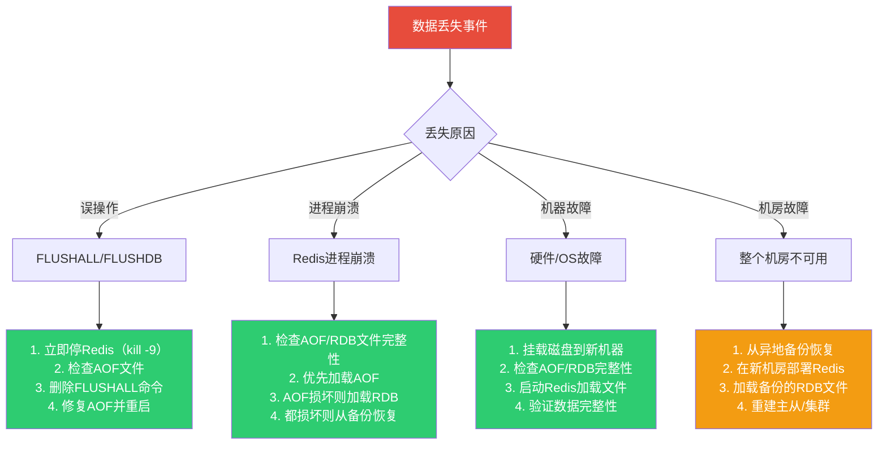

### 6.6 持久化相关的 Redis 运维命令

```bash
# 查看持久化状态
127.0.0.1:6379> INFO persistence

# 手动触发 RDB
127.0.0.1:6379> BGSAVE

# 手动触发 AOF 重写
127.0.0.1:6379> BGREWRITEAOF

# 查看最后保存时间
127.0.0.1:6379> LASTSAVE

# 查看当前配置
127.0.0.1:6379> CONFIG GET save
127.0.0.1:6379> CONFIG GET appendonly
127.0.0.1:6379> CONFIG GET appendfsync
127.0.0.1:6379> CONFIG GET aof-use-rdb-preamble

# 动态修改配置
127.0.0.1:6379> CONFIG SET save "900 1 300 10 60 10000"
127.0.0.1:6379> CONFIG SET appendfsync everysec
127.0.0.1:6379> CONFIG REWRITE

# 检查 RDB 文件
redis-check-rdb dump.rdb

# 检查/修复 AOF 文件
redis-check-aof appendonly.aof
redis-check-aof --fix appendonly.aof
```

### 6.7 性能调优清单

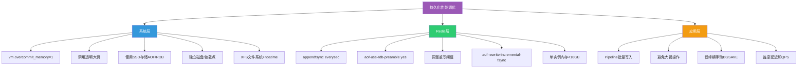

---

## 七、混合持久化的常见问题

### 7.1 混合 AOF 加载失败

**现象：** Redis 4.0 以下版本无法加载混合 AOF 文件

```
Bad file format reading the append only file
```

**解决方案：**

```bash
# 方案1：升级 Redis 到 4.0+
# 方案2：在源实例上关闭混合持久化并重写AOF
127.0.0.1:6379> CONFIG SET aof-use-rdb-preamble no
OK
127.0.0.1:6379> BGREWRITEAOF
# 等待重写完成后，AOF文件变为纯文本格式

# 方案3：使用 redis-check-aof 转换
redis-check-aof --fix appendonly.aof
```

### 7.2 混合 AOF 文件损坏

**现象：** RDB 头部损坏导致无法加载

```bash
# 检查文件
redis-check-aof appendonly.aof
# 输出：RDB preamble of AOF file is corrupt
```

**解决方案：**

```bash
# 1. 备份原文件
cp appendonly.aof appendonly.aof.bak

# 2. 尝试修复
redis-check-aof --fix appendonly.aof
# 注意：修复会截断损坏部分，可能丢失数据

# 3. 如果修复后仍有问题，考虑从RDB恢复
redis-check-rdb dump.rdb
# 如果RDB完好，可以优先用RDB恢复
```

### 7.3 混合持久化与 AOF 重写缓冲区

混合持久化不改变 AOF 重写缓冲区的机制，重写期间仍有内存压力：

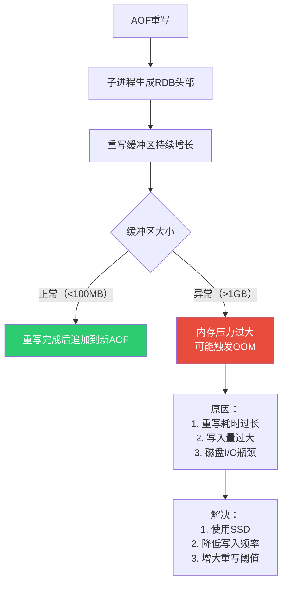

### 7.4 混合持久化与 Redis 7 Multi Part AOF

在 Redis 7 中，混合持久化与 Multi Part AOF 结合更加自然：

```
appendonlydir/
├── appendonly.aof.1.base.rdb       # BASE文件，RDB格式（混合持久化头部）
├── appendonly.aof.1.incr.aof       # INCR文件，AOF格式
├── appendonly.aof.2.incr.aof       # INCR文件，重写期间增量
└── appendonly.aof.manifest          # 清单文件
```

::: tip Redis 7 的改进
Redis 7 中，混合持久化的 RDB 部分直接作为 BASE 文件（RDB格式），增量部分作为 INCR 文件（AOF格式）。这使得混合持久化的概念与 Multi Part AOF 完美融合：
- BASE = 混合持久化的 RDB 头部
- INCR = 混合持久化的 AOF 尾部
- 加载时先读 BASE（快），再读 INCR（安全）
:::

---

## 八、持久化方案演进与趋势

### 8.1 Redis 持久化演进时间线

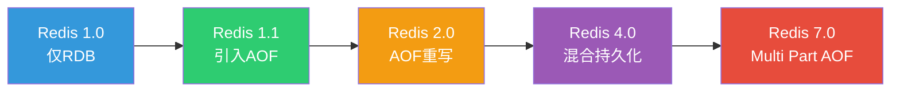

| 版本 | 时间 | 关键特性 |
|------|------|---------|
| Redis 1.0 | 2009 | 仅 RDB 持久化 |
| Redis 1.1 | 2010 | 引入 AOF，appendfsync 三种策略 |
| Redis 2.0 | 2010 | AOF 后台重写（BGREWRITEAOF） |
| Redis 2.4 | 2011 | AOF 重写增量 fsync |
| Redis 4.0 | 2017 | 混合持久化（aof-use-rdb-preamble） |
| Redis 7.0 | 2022 | Multi Part AOF，AOF 时间戳 |

### 8.2 未来趋势

1. **更细粒度的持久化**：可能支持 key 级别的持久化策略
2. **更高效的增量快照**：类似 RDB 但仅保存增量变化
3. **云端原生的持久化**：直接对接对象存储（S3/OSS）
4. **无 fork 持久化**：探索不依赖 fork 的持久化方案，解决大内存实例的痛点

---

## 九、总结

```mermaid
mindmap
  root((混合持久化与选型))
    混合持久化原理
      RDB头部 + AOF尾部
      aof-use-rdb-preamble
      Redis 4.0引入
      Multi Part AOF融合
    三种方案对比
      RDB
        恢复快
        可能丢数据
      AOF
        数据安全
        恢复慢
      混合
        兼顾两者
        推荐方案
    业务选型
      缓存型 → 仅RDB
      存储型 → 混合持久化
      金融型 → AOF always
      消息型 → 混合+低频RDB
    主从策略
      主节点必须开持久化
      从节点至少开RDB
      避免全部关闭
    最佳实践
      everysec fsync
      混合持久化
      系统级优化
      监控告警
      备份与恢复预案
```

::: tip 核心要点回顾
1. **混合持久化 = RDB 头部 + AOF 尾部**，兼具 RDB 的恢复速度和 AOF 的数据安全
2. **aof-use-rdb-preamble yes** 是 Redis 4.0+ 的默认值，生产环境建议保持开启
3. **选型的核心依据是数据丢失容忍度**：可丢 → RDB，不可丢 → 混合持久化
4. **主节点必须开启持久化**，从节点至少开启 RDB，避免集群级数据丢失
5. **appendfsync everysec** 是绝大多数场景的最佳策略
6. **系统级优化不可忽视**：vm.overcommit_memory=1、禁用 THP、使用 SSD
7. **监控和备份是最后防线**：任何持久化方案都需要配套监控告警和定期备份验证
:::

---

**参考资料：**

- [Redis 官方文档 - Persistence](https://redis.io/docs/management/persistence/)
- [Redis 官方文档 - Append Only File](https://redis.io/docs/management/persistence/append-only-file/)
- [Redis 4.0 Release Notes - Hybrid Persistence](https://redis.io/docs/latest/operate/oss_and_stack/management/upgrading/redis-4-0/)
- 《Redis 设计与实现》黄健宏 著 —— 第11章 AOF持久化
- 《Redis 开发与运维》付磊 张益军 著 —— 第5章 持久化
- Redis 源码 `aof.c`、`rdb.c`、`server.c`
- [Redis 7 Multi Part AOF](https://redis.io/docs/management/persistence/append-only-file/#multi-part-aof)
