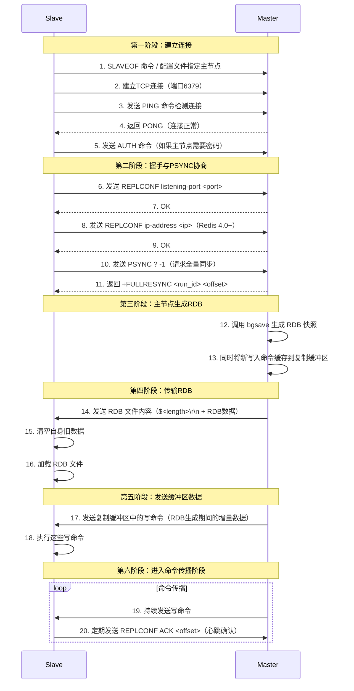
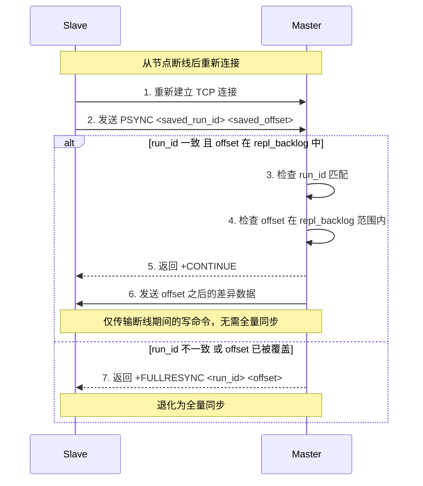
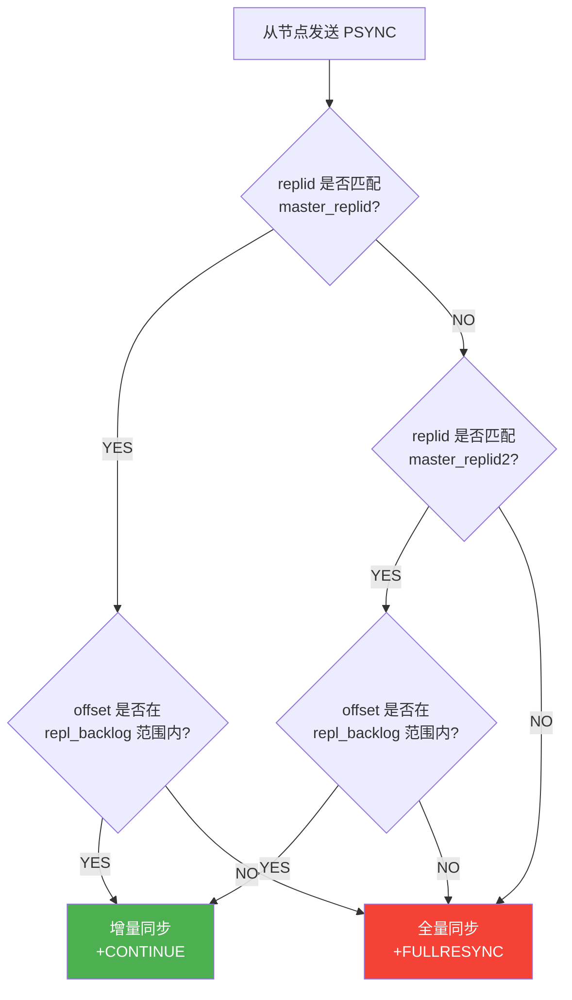
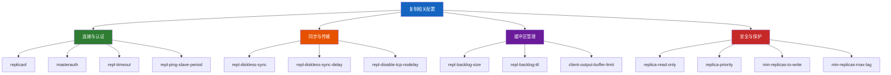
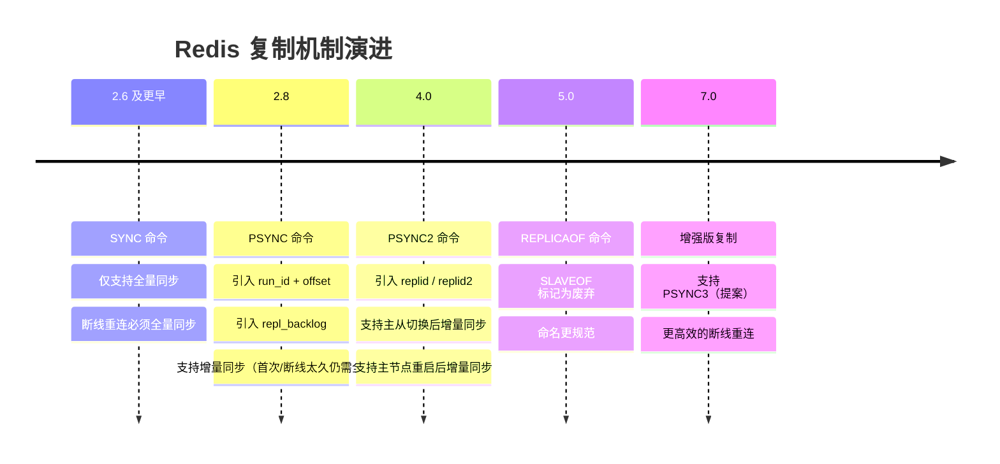
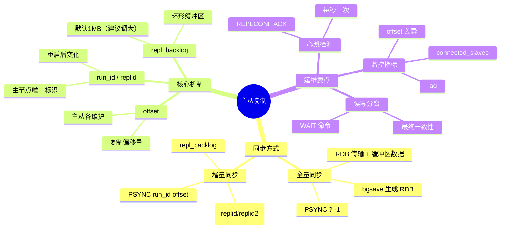

# 主从复制原理

> 单机 Redis 无论多快，都面临两个致命问题：**数据单点故障**和**读吞吐瓶颈**。主从复制（Replication）是 Redis 高可用的基石 —— 它让数据从一台机器延伸到多台机器，为哨兵和集群的故障转移铺平道路。

## 1. 为什么需要主从复制？

### 1.1 单机的局限性

```text
┌──────────────────────────────────────────────────┐
│                   单机 Redis                       │
│                                                    │
│  ┌─────────┐   ┌─────────┐   ┌─────────┐         │
│  │ 客户端 A │   │ 客户端 B │   │ 客户端 C │         │
│  └────┬────┘   └────┬────┘   └────┬────┘         │
│       │             │             │               │
│       ▼             ▼             ▼               │
│  ┌──────────────────────────────────────┐         │
│  │          Redis 单实例                 │         │
│  │   读 + 写 全部压在一台机器上         │         │
│  └──────────────────────────────────────┘         │
│                                                    │
│  风险：机器宕机 → 数据全部丢失                     │
│  瓶颈：读 QPS 到 10 万就到极限了                   │
└──────────────────────────────────────────────────┘
```

**核心痛点：**

| 问题 | 描述 | 后果 |
|------|------|------|
| 数据单点 | 所有数据存在一台机器 | 机器故障 = 数据不可用 |
| 读吞吐瓶颈 | 单机读 QPS 约 10 万 | 高并发读场景扛不住 |
| 写吞吐瓶颈 | 单线程写入 | 大量写操作排队 |
| 无法故障转移 | 没有备份节点 | 宕机需要人工介入 |

### 1.2 主从复制带来的能力

```text
                    ┌─────────────┐
                    │   客户端写   │
                    └──────┬──────┘
                           │ WRITE
                           ▼
                    ┌─────────────┐
                    │  Master 节点  │
            ┌───────┤   (读 + 写)  ├───────┐
            │       └─────────────┘       │
            │ SYNC/SYNC                  │ SYNC/SYNC
            ▼                            ▼
     ┌─────────────┐              ┌─────────────┐
     │  Slave 节点  │              │  Slave 节点  │
     │  (只读)      │              │  (只读)      │
     └──────┬──────┘              └──────┬──────┘
            │                            │
     ┌──────┴──────┐              ┌──────┴──────┐
     │  客户端读 A  │              │  客户端读 B  │
     └─────────────┘              └─────────────┘
```

**核心价值：**

- **数据冗余**：主节点数据自动同步到从节点，主节点宕机数据不丢失
- **读写分离**：写操作走主节点，读操作分散到从节点，线性提升读吞吐
- **高可用基础**：为哨兵自动故障转移提供数据备份节点
- **在线备份**：从节点可作为实时数据备份，不影响主节点性能

## 2. 复制的基本概念

### 2.1 核心术语

| 术语 | 英文 | 含义 |
|------|------|------|
| 主节点 | Master | 接受写操作，将变更同步给从节点 |
| 从节点 | Slave / Replica | 接受主节点的数据同步，默认只读 |
| 复制ID | run_id | 主节点的唯一标识，每次重启变化 |
| 复制偏移量 | offset | 数据同步的位置标记，主从各维护一份 |
| 复制积压缓冲区 | repl_backlog | 主节点维护的环形缓冲区，用于增量同步 |
| 全量同步 | Full Sync | 从节点首次连接或数据差异过大时，传输完整 RDB |
| 增量同步 | Partial Sync | 断线重连后，仅传输差异部分的写命令 |

### 2.2 复制ID（run_id）与偏移量（offset）

每个 Redis 主节点在启动时会生成一个 40 位的十六进制随机字符串作为 `run_id`：

```bash
# 查看主节点的 run_id
127.0.0.1:6379> INFO server
# Server
run_id:5c3e0e4b4c3f2a1d0e9f8b7a6c5d4e3f2a1b0c9d

# 查看复制信息
127.0.0.1:6379> INFO replication
# Replication
role:master
connected_slaves:2
master_replid:5c3e0e4b4c3f2a1d0e9f8b7a6c5d4e3f2a1b0c9d
master_repl_offset:1024567
```

::: important run_id 的关键作用
`run_id` 是判断主节点是否重启的核心依据。如果从节点保存的 `run_id` 与当前主节点的 `run_id` 不一致，说明主节点中途重启过，从节点的数据可能已经过期，必须执行全量同步。
:::

**复制偏移量**的工作方式：

```text
主节点（Master）                         从节点（Slave）
┌──────────────────┐                    ┌──────────────────┐
│ master_repl_offset│                    │ slave_repl_offset │
│    = 1024567     │                    │    = 1024500      │
│                  │                    │                    │
│ 差异 = 1024567 - 1024500 = 67 字节    │                    │
│ 这 67 字节就是从节点落后的数据        │                    │
└──────────────────┘                    └──────────────────┘
```

- 主节点每次向从节点传播 N 字节数据，`master_repl_offset` 就加 N
- 从节点每次收到 N 字节数据，`slave_repl_offset` 就加 N
- 两者之差反映了从节点的**数据滞后量**

### 2.3 复制积压缓冲区（repl_backlog）

复制积压缓冲区是主节点维护的一个**固定大小的环形缓冲区**（FIFO），默认 1MB：

```text
repl_backlog（环形缓冲区，大小 = repl-backlog-size）

写入方向 ──────────────────────────────────────────────►

┌──────┬──────┬──────┬──────┬──────┬──────┬──────┬──────┐
│ cmd1 │ cmd2 │ cmd3 │ cmd4 │ cmd5 │ cmd6 │ cmd7 │ cmd8 │
└──────┴──────┴──────┴──────┴──────┴──────┴──────┴──────┘
  ▲                                              ▲
  │                                              │
  最旧的数据                                     最新的数据
  （缓冲区满时，新数据覆盖最旧的数据）
```

::: warning 环形缓冲区的覆盖风险
由于是固定大小的环形缓冲区，当主节点写入速度远超从节点消费速度时，旧数据会被新数据覆盖。如果从节点断线时间过长，请求增量同步时所需的数据已经被覆盖，就只能退化为全量同步。
:::

```bash
# 查看复制积压缓冲区状态
127.0.0.1:6379> INFO replication
repl_backlog_active:1
repl_backlog_size:1048576          # 1MB
repl_backlog_first_byte_offset:1
repl_backlog_histlen:1024567       # 当前缓冲区中的数据长度
```

## 3. 全量同步流程（PSYNC）

### 3.1 触发全量同步的条件

全量同步是"代价最高"的同步方式，以下场景会触发：

| 场景 | 原因 | 说明 |
|------|------|------|
| 从节点首次连接 | 从节点没有任何数据 | 必须全量同步 |
| 从节点保存的 run_id 与主节点不一致 | 主节点中途重启 | 数据可能不一致 |
| 复制积压缓冲区中找不到所需偏移量 | 断线时间太长 | 增量数据已被覆盖 |
| 从节点执行了 `SLAVEOF NO ONE` 后重新复制 | 从节点变为主节点后再次变为从节点 | 需要重新全量同步 |

### 3.2 全量同步完整流程



### 3.3 全量同步详细解析

#### 第一阶段：建立连接

从节点通过 `SLAVEOF` 命令或配置文件指定主节点后，会主动向主节点发起 TCP 连接：

```bash
# 方式一：运行时命令（不持久化）
127.0.0.1:6380> SLAVEOF 127.0.0.1 6379
OK

# 方式二：配置文件（持久化，重启后自动连接）
# redis.conf
replicaof 127.0.0.1 6379
masterauth <password>    # 如果主节点设置了密码
```

::: info SLAVEOF vs REPLICAOF
Redis 5.0 开始，`SLAVEOF` 命令被标记为废弃，推荐使用 `REPLICAOF`。两者功能完全一致，只是命名上的改变：
```bash
# 新语法
127.0.0.1:6380> REPLICAOF 127.0.0.1 6379
# 取消复制
127.0.0.1:6380> REPLICAOF NO ONE
```
:::

#### 第二阶段：PSYNC 协商

从节点发送 `PSYNC` 命令进行同步协商：

```bash
# 首次连接：run_id 传 ?，offset 传 -1
PSYNC ? -1

# 断线重连：携带之前保存的 run_id 和 offset
PSYNC <saved_run_id> <saved_offset>
```

主节点的响应有三种：

| 响应 | 含义 | 从节点动作 |
|------|------|-----------|
| `+FULLRESYNC <run_id> <offset>` | 要求全量同步 | 保存 run_id 和 offset，准备接收 RDB |
| `+CONTINUE <run_id>` | 允许增量同步（PSYNC2 可能有新 run_id） | 只接收差异部分的写命令 |
| `-ERR` | 主节点不支持 PSYNC（极老版本） | 退化为 SYNC 命令 |

#### 第三阶段：主节点生成 RDB

主节点收到全量同步请求后，执行 `bgsave` 生成 RDB 快照：

```bash
# 主节点日志
*M* Full resync requested by replica 127.0.0.1:6380
*M* Starting BGSAVE for SYNC with target: disk
*M* Background saving started by pid 12345
*M* Background saving terminated with success
*M* Synchronization with replica 127.0.0.1:6380 succeeded
```

**关键细节**：bgsave 期间新写入的命令如何处理？

```text
                    BGSAVE 开始                           BGSAVE 结束
                       │                                      │
                       ▼                                      ▼
  时间 ─────────────────────────────────────────────────────────
  主节点写入:  cmd1   cmd2   cmd3   cmd4   cmd5   cmd6   cmd7

  复制缓冲区: ┌──────────────────────────────────────────────┐
              │  cmd1  cmd2  cmd3  cmd4  cmd5  cmd6  cmd7      │
              └──────────────────────────────────────────────┘
                           ▲
                           │
              BGSAVE期间的新写入命令都缓存在这里

  RDB 文件:   包含 BGSAVE 开始时刻的完整数据快照
```

#### 第四阶段：传输 RDB

主节点将生成的 RDB 文件通过网络发送给从节点：

```bash
# 从节点日志
*S* MASTER <-> REPLICA sync started
*S* Full resync from master: 5c3e0e4b4c3f2a1d0e9f8b7a6c5d4e3f2a1b0c9d:1024567
*S* MASTER <-> REPLICA sync: receiving 185 bytes from master to disk
*S* MASTER <-> REPLICA sync: Flushing old data
*S* MASTER <-> REPLICA sync: Loading DB in memory
```

::: warning 从节点清空旧数据
在加载 RDB 之前，从节点会**清空所有旧数据**。这意味着如果从节点之前有独立的数据，全量同步后这些数据会丢失。生产环境中务必确认从节点的数据可以丢弃。
:::

#### 第五阶段：发送缓冲区数据

RDB 传输完毕后，主节点还需要发送 RDB 生成期间的增量写命令：

```text
RDB 快照时刻: T1
RDB 传输完毕: T2

T1 ~ T2 期间的写命令 ──► 从节点执行这些命令 ──► 数据完全一致
```

#### 第六阶段：命令传播

全量同步完成后，进入持续的命令传播阶段：

```text
主节点                                          从节点
┌─────────────────────────┐              ┌─────────────────────────┐
│ SET key1 value1          │  ───────►   │ SET key1 value1          │
│ HSET hash1 f1 v1        │  ───────►   │ HSET hash1 f1 v1        │
│ LPUSH list1 a b c       │  ───────►   │ LPUSH list1 a b c       │
│ ...                      │             │ ...                      │
└─────────────────────────┘              └─────────────────────────┘
```

### 3.4 全量同步的性能影响

全量同步对主从节点都有显著影响：

| 影响维度 | 主节点 | 从节点 |
|----------|--------|--------|
| CPU | bgsave 需要 fork 子进程，数据量大时 fork 耗时 | 加载 RDB 需要消耗 CPU |
| 内存 | fork 时需要 copy-on-write，内存翻倍风险 | 加载 RDB 需要额外内存 |
| 网络 | 传输 RDB 占用大量带宽 | 接收 RDB 占用带宽 |
| 磁盘 | RDB 写入磁盘 I/O | RDB 读取磁盘 I/O |
| 阻塞 | fork 本身可能阻塞主线程 | 加载 RDB 期间服务不可用 |

::: tip 减少全量同步的策略
1. **增大 repl-backlog-size**：减少因缓冲区不足导致的全量同步
2. **避免主节点重启**：使用 `debug set-active-expire` 或配置 `replica-serve-stale-data`
3. **使用 `debug reload` 代替重启**：重启会生成新的 run_id
4. **合理规划从节点数量**：过多的从节点同时全量同步会压垮主节点
:::

## 4. 增量同步流程（PSYNC）

### 4.1 增量同步的前提条件

增量同步是 Redis 2.8 引入 `PSYNC` 命令后的重要优化，它需要同时满足以下条件：

```text
增量同步能否成功的判断逻辑：

                        ┌──────────────────┐
                        │ 从节点请求增量同步  │
                        │ PSYNC <run_id>   │
                        │      <offset>    │
                        └────────┬─────────┘
                                 │
                    ┌────────────▼────────────┐
                    │ run_id 是否一致？        │
                    └────┬──────────────┬─────┘
                        │YES           │NO
                        ▼              ▼
              ┌──────────────┐   ┌──────────────┐
              │ offset 是否在 │   │ 全量同步      │
              │ repl_backlog │   │              │
              │ 范围内？      │   └──────────────┘
              └──┬───────┬───┘
                 │YES    │NO
                 ▼       ▼
          ┌──────────┐ ┌──────────────┐
          │ 增量同步  │ │ 全量同步      │
          └──────────┘ └──────────────┘
```

### 4.2 增量同步流程



### 4.3 增量同步的核心：repl_backlog 的工作机制

```text
repl_backlog 环形缓冲区（假设大小 = 8 个命令的位置）

初始状态（所有数据已同步）：
┌──────┬──────┬──────┬──────┬──────┬──────┬──────┬──────┐
│ cmd1 │ cmd2 │ cmd3 │ cmd4 │ cmd5 │ cmd6 │ cmd7 │ cmd8 │
└──────┴──────┴──────┴──────┴──────┴──────┴──────┴──────┘
  ▲                                             ▲
  │                                             │
backlog_first_offset                     master_repl_offset

从节点断线前最后确认的 offset = cmd6 的位置

从节点断线后，主节点继续写入：
┌──────┬──────┬──────┬──────┬──────┬──────┬──────┬──────┐
│ cmd9 │cmd10 │cmd11 │ cmd4 │ cmd5 │ cmd6 │ cmd7 │ cmd8 │
└──────┴──────┴──────┴──────┴──────┴──────┴──────┴──────┘
  ▲                                                     ▲
  │                                                     │
新数据覆盖了 cmd1, cmd2, cmd3                       原有数据

从节点重连，请求 offset = cmd6 的位置：
  cmd6 仍在缓冲区中 → 增量同步成功！
  只需发送 cmd7, cmd8, cmd9, cmd10, cmd11
```

```text
如果从节点断线时间更长，缓冲区已经覆盖了所需数据：

┌──────┬──────┬──────┬──────┬──────┬──────┬──────┬──────┐
│cmd14 │cmd15 │cmd16 │cmd17 │cmd18 │cmd10 │cmd11 │cmd12 │
└──────┴──────┴──────┴──────┴──────┴──────┴──────┴──────┘
  ▲                                                     ▲
  │                                                     │
backlog_first_offset                           master_repl_offset

从节点请求 offset = cmd6 的位置：
  cmd6 已经被覆盖 → 增量同步失败！→ 退化为全量同步
```

### 4.4 repl-backlog-size 计算

合理的 `repl-backlog-size` 是避免频繁全量同步的关键：

```text
估算公式：

repl-backlog-size = 写入速率 (MB/s) × 预估最长断线时间 (s) × 安全系数 (2~3)

示例：
- 主节点每秒写入速率：10 MB/s
- 预估最长断线时间：60 秒（网络抖动、主节点重启等）
- 安全系数：2

repl-backlog-size = 10 × 60 × 2 = 1200 MB ≈ 1.2 GB
```

```bash
# 查看主节点写入速率
127.0.0.1:6379> INFO stats
# Stats
total_net_input_bytes:1048576000      # 总接收字节数
total_net_output_bytes:2097152000     # 总发送字节数

# 调整 repl-backlog-size（需重启或 CONFIG SET）
127.0.0.1:6379> CONFIG SET repl-backlog-size 128mb
OK

# 持久化到配置文件
127.0.0.1:6379> CONFIG REWRITE
OK
```

::: important repl-backlog-size 的最佳实践
1. **不要用默认的 1MB**：生产环境至少 64MB，通常 256MB~1GB
2. **根据业务写入速率计算**：写入越频繁，缓冲区要越大
3. **考虑网络故障恢复时间**：MTTR（平均恢复时间）越长，缓冲区要越大
4. **安全系数取 2~3**：避免边界情况
5. **监控 `master_repl_offset` 增长速率**：动态调整
:::

## 5. PSYNC2（Redis 4.0+ 增强）

### 5.1 PSYNC1 的局限

Redis 2.8 ~ 3.x 使用 PSYNC1，存在一个重要问题：

```text
场景：主节点故障后重启

1. 主节点运行中，run_id = "abc123"
2. 从节点已同步完成，记录 run_id = "abc123"
3. 主节点宕机，重启后生成新的 run_id = "def456"
4. 从节点重连，发送 PSYNC abc123 <offset>
5. 主节点发现 run_id 不匹配 → 全量同步！

问题：即使主节点数据没变（重启前做了 RDB/AOF 持久化），
      仍然要做一次不必要的全量同步，浪费资源。
```

### 5.2 PSYNC2 的改进

Redis 4.0 引入 PSYNC2，核心改进是引入了 **replid（复制ID）** 替代原来的 `run_id`：

```text
PSYNC2 的关键变化：

1. 引入 replid（复制ID）：
   - master_replid：当前复制ID
   - master_replid2：上一个复制ID（切换前保存的）

2. 从节点升级为主节点时：
   - 保存旧的 master_replid 到 master_replid2
   - 生成新的 master_replid

3. 断线重连时：
   - 不仅检查当前 replid，还检查 master_replid2
   - 如果匹配，仍可尝试增量同步
```



### 5.3 PSYNC2 的典型场景

#### 场景一：主从切换后重连

```text
初始状态：
  Master-A (replid=AAA, offset=10000)
  ├── Slave-B (replid=AAA, offset=9500)
  └── Slave-C (replid=AAA, offset=9000)

Master-A 宕机，Slave-B 升级为新主节点：
  Slave-B → Master-B (replid=BBB, replid2=AAA, offset=9500)
  Slave-C 重连 Master-B：
    发送 PSYNC AAA 9000
    Master-B 检查 replid2=AAA 匹配！
    offset 9000 在 repl_backlog 范围内！
    → 增量同步成功！
```

#### 场景二：主节点重启

```text
主节点重启前：
  Master (replid=AAA, offset=10000)

主节点重启后：
  Master (replid=BBB, replid2=AAA, offset=0)
  但如果开启了 AOF/RDB 持久化：
  - 重启后从持久化文件恢复数据
  - replid2 记录了之前的 replid=AAA
  - repl_backlog 从持久化中恢复

从节点重连：
  发送 PSYNC AAA 9500
  Master 检查 replid2=AAA 匹配！
  → 可能增量同步成功！
```

::: tip PSYNC2 的重要意义
PSYNC2 大幅减少了主从切换、主节点重启等场景下的全量同步次数。在哨兵模式中，故障转移后从节点重新同步新主节点时，PSYNC2 能够尽量使用增量同步，大大缩短了故障恢复时间。
:::

## 6. 心跳检测

### 6.1 主从心跳机制

命令传播阶段，主从节点通过心跳保持连接活跃和数据同步确认：

```text
主节点 ────────────────────────────────────── 从节点

        ┌── 每1秒 ──► REPLCONF ACK <offset>
        │
        │             从节点向主节点报告自己的复制偏移量
        │
        ├── 每10秒 ──► PING（默认，可配置 repl-ping-slave-period）
        │
        │             主节点向从节点发送 PING 检测连接
        │
        ├── 实时 ────► 命令传播（写命令实时发送）
        │
        │             主节点将每一个写命令发送给从节点
        │
        ◄── 实时 ──── 从节点执行写命令后更新 offset
```

### 6.2 REPLCONF ACK 的作用

从节点默认**每秒一次**向主节点发送 `REPLCONF ACK <replication_offset>` 命令，它有三个核心作用：

**作用一：检测连接状态**

```bash
# 主节点查看从节点的延迟
127.0.0.1:6379> INFO replication
# Replication
connected_slaves:2
slave0:ip=127.0.0.1,port=6380,state=online,offset=1024560,lag=0
slave1:ip=127.0.0.1,port=6381,state=online,offset=1024550,lag=1
#                                                     lag=X ← 最后一次 ACK 到现在的秒数
```

- `lag=0`：从节点1秒内发送了 ACK，连接正常
- `lag=1`：从节点1~2秒内发送了 ACK，轻微延迟
- `lag>30`（默认 `repl-timeout` 为60秒）：可能断线

**作用二：检测数据一致性**

```text
主节点通过比较 master_repl_offset 和从节点报告的 offset：

master_repl_offset = 1024567
slave0:offset     = 1024560  → 差距 7 字节，基本一致
slave1:offset     = 1024000  → 差距 567 字节，存在延迟
```

**作用三：辅助 min-slaves 配置**

Redis 提供了两个配置来防止主节点在"不安全"的状态下继续接受写入：

```bash
# redis.conf

# 至少需要 N 个从节点在线
min-replicas-to-write 3

# 在线从节点的最大延迟（秒）
min-replicas-max-lag 10

# 含义：如果在线从节点数 < 3 或 任一从节点延迟 > 10 秒
#       主节点将拒绝写入命令！
```

::: warning min-replicas 的典型陷阱
配置 `min-replicas-to-write` 后，如果所有从节点都断线，主节点会拒绝所有写入！这在网络抖动时可能导致服务不可用。建议：
1. `min-replicas-to-write` 的值不要设为从节点总数（留余量）
2. `min-replicas-max-lag` 不要设得太小（建议 10 秒以上）
3. 监控 `connected_slaves` 指标
:::

### 6.3 心跳超时与断线判定

```text
主节点判定从节点断线的逻辑：

repl-timeout = 60（默认）

从节点判定主节点断线的逻辑：

                    repl-timeout
    ◄──────────────────────────────────►

    最后一次收到主节点数据          当前时刻
         │                            │
         ├──── 超过 repl-timeout ──────┤
         │     未收到任何数据          │
         │                            │
    判定主节点断线！
    从节点尝试重新连接
```

```bash
# 超时配置
repl-timeout 60          # 复制超时（秒），需大于 repl-ping-slave-period
repl-ping-slave-period 10 # 心跳间隔（秒）

# 规则：repl-timeout 必须远大于 repl-ping-slave-period
# 否则网络抖动时会频繁判定断线
```

## 7. 主从复制延迟

### 7.1 延迟的来源


**延迟来源分析：**

| 延迟环节 | 原因 | 影响程度 |
|----------|------|---------|
| 主节点输出缓冲区 | 从节点消费速度跟不上主节点写入速度 | 中 |
| 网络传输 | 命令传播经过网络，跨机房延迟显著 | 高 |
| 从节点执行 | 从节点单线程执行命令，复杂命令阻塞 | 中 |
| 操作系统调度 | 主从节点 fork、I/O 等系统调用 | 低 |

### 7.2 延迟监控

```bash
# 实时查看从节点延迟
127.0.0.1:6379> INFO replication
slave0:ip=10.0.0.2,port=6379,state=online,offset=1024560,lag=0

# 通过 DEBUG 查看更精确的延迟
127.0.0.1:6379> DEBUG SLEEP 0    # 不实际 sleep，用于测试
```

```bash
# 使用 redis-cli 监控延迟
redis-cli --latency -h <slave-host> -p <slave-port>

# 输出示例
min: 0, max: 1, avg: 0.13 (94 samples)
```

### 7.3 减少复制延迟的策略

```text
                    减少复制延迟的策略
                         │
          ┌──────────────┼──────────────┐
          │              │              │
     网络优化        命令优化        配置优化
          │              │              │
    ┌─────┴─────┐  ┌─────┴─────┐  ┌────┴────┐
    │同机房部署  │  │避免大Key操作│  │增大输出  │
    │专线连接    │  │避免阻塞命令 │  │缓冲区    │
    │压缩传输    │  │拆分复杂命令 │  │关闭TCP   │
    │           │  │           │  │Nagle算法 │
    └───────────┘  └───────────┘  └─────────┘
```

```bash
# 关闭 TCP Nagle 算法，减少小包延迟
# redis.conf
repl-disable-tcp-nodelay no    # no = 启用 TCP_NODELAY，减少延迟

# 增大从节点输出缓冲区
# redis.conf
client-output-buffer-limit replica 256mb 64mb 60
#                        类型    硬限制  软限制  软超时
```

::: tip TCP_NODELAY 与复制延迟
`repl-disable-tcp-nodelay` 的含义有些反直觉：
- 设为 `no`（默认）：启用 TCP_NODELAY，命令立即发送，延迟低但网络包多
- 设为 `yes`：禁用 TCP_NODELAY，小包会被 Nagle 算法合并，延迟高但带宽省

**生产环境建议设为 `no`**，优先保证低延迟。
:::

## 8. 读写分离

### 8.1 读写分离架构

```text
                    ┌─────────────┐
                    │   写请求     │
                    └──────┬──────┘
                           │
                           ▼
                    ┌─────────────┐
                    │  Master 节点  │
            ┌───────┤   读 + 写    ├───────┐
            │       └─────────────┘       │
            │                               │
            ▼                               ▼
     ┌─────────────┐              ┌─────────────┐
     │  Slave-A     │              │  Slave-B     │
     │  (只读)      │              │  (只读)      │
     └──────┬──────┘              └──────┬──────┘
            │                            │
     ┌──────┴──────┐              ┌──────┴──────┐
     │  读请求 A   │              │  读请求 B   │
     └─────────────┘              └─────────────┘

写 QPS = 主节点单机能力（约 10 万）
读 QPS = N × 从节点单机能力（线性扩展）
```

### 8.2 读写分离的实现方式

#### 方式一：客户端直连

```csharp
// C# StackExchange.Redis 读写分离示例
using StackExchange.Redis;

// 主节点连接（写）
ConnectionMultiplexer masterConn = ConnectionMultiplexer.Connect("master:6379");
IDatabase writer = masterConn.GetDatabase();

// 从节点连接（读）
ConnectionMultiplexer slaveConn = ConnectionMultiplexer.Connect("slave:6379");
IDatabase reader = slaveConn.GetDatabase();

// 写操作 → 主节点
await writer.StringSetAsync("user:1001", "Alice");

// 读操作 → 从节点
string value = await reader.StringGetAsync("user:1001");
```

#### 方式二：通过哨兵自动路由

```csharp
// StackExchange.Redis + Sentinel 自动读写分离
ConfigurationOptions config = new ConfigurationOptions
{
    ServiceName = "mymaster",  // Sentinel 监控的主节点名称
    TieBreaker = "",           // 平局决胜键
};
config.EndPoints.Add("sentinel1:26379");
config.EndPoints.Add("sentinel2:26379");
config.EndPoints.Add("sentinel3:26379");

ConnectionMultiplexer conn = ConnectionMultiplexer.Connect(config);

// StackExchange.Redis 自动识别主从并做读写分离
IDatabase db = conn.GetDatabase();

// 写操作自动路由到主节点
db.StringSet("key", "value");

// 读操作自动路由到从节点
db.StringGet("key", CommandFlags.DemandReplica);
```

#### 方式三：代理层路由

```text
                    ┌─────────────┐
                    │   客户端     │
                    └──────┬──────┘
                           │
                           ▼
                    ┌─────────────┐
                    │  代理层      │
                    │  (Twemproxy │
                    │   / Predixy │
                    │   / Codis)  │
                    └──┬─────┬───┘
                  写操作│     │读操作
                       ▼     ▼
                ┌────────┐ ┌────────┐
                │ Master  │ │ Slave  │
                └────────┘ └────────┘
```

### 8.3 读写分离的一致性问题

```text
时间线：

t1: 客户端写入 SET key "new_value" → 主节点
t2: 主节点执行完成，返回 OK
t3: 主节点将 SET key "new_value" 传播给从节点
t4: 客户端读取 GET key → 从节点
    ┌── 如果 t4 < t3：读到旧值 "old_value" ← 数据不一致！
    └── 如果 t4 > t3：读到新值 "new_value" ← 数据一致

这就是"主从复制延迟"导致的读写不一致问题。
```

::: warning 读写分离的一致性陷阱
读写分离本质上是一个**最终一致性**模型：
1. 写入主节点后立即从从节点读取，可能读到旧值
2. 对于强一致性要求的场景，不能使用读写分离
3. 解决方案：关键数据从主节点读取，或使用 `WAIT` 命令
:::

### 8.4 WAIT 命令

Redis 3.0 引入 `WAIT` 命令，可以等待指定数量的从节点确认数据同步：

```bash
# 等待 2 个从节点确认，超时 10 秒
127.0.0.1:6379> SET key "value"
OK
127.0.0.1:6379> WAIT 2 10000
(integer) 2    # 返回确认的从节点数量

# 如果超时内未达到指定数量，返回实际确认的数量
127.0.0.1:6379> WAIT 5 3000
(integer) 3    # 只有 3 个从节点确认，超时返回
```

```csharp
// C# 使用 WAIT 命令
using StackExchange.Redis;

IDatabase db = conn.GetDatabase();

// 写入并等待 2 个从节点确认
db.StringSet("key", "value");
var confirmed = db.Wait(2, TimeSpan.FromSeconds(10));
Console.WriteLine($"已确认的从节点数: {confirmed}");
```

::: important WAIT 的局限性
`WAIT` 命令只能保证写命令到达了指定数量的从节点内存，但**不能保证数据已持久化到磁盘**。如果主节点和所有确认的从节点同时宕机，数据仍可能丢失。`WAIT` 提升的是一致性保证，但不等于强一致性。
:::

## 9. 从节点只读

### 9.1 只读模式的意义

从节点默认设置为只读，这是生产环境的**硬性要求**：

```bash
# 默认配置
127.0.0.1:6380> CONFIG GET replica-read-only
1) "replica-read-only"
2) "yes"          # 默认只读
```

如果从节点允许写入，会导致严重的数据不一致：

```text
错误场景：从节点可写

1. 客户端向从节点写入 SET key "slave_value"
2. 主节点写入 SET key "master_value"
3. 主节点将 SET key "master_value" 传播到从节点
4. 从节点的 "slave_value" 被覆盖为 "master_value"

看似问题被"自动修复"了？实际上：
- 从节点写入的数据不会被传播到主节点
- 在覆盖之前，读从节点的客户端读到了脏数据
- 更严重的是，这种不一致是静默的，难以发现
```

### 9.2 只读模式的实现

```c
// Redis 源码中只读检查（简化）
int processCommand(client *c) {
    // 如果是从节点且开启了只读模式
    if (server.repl_state == REPLICA_STATE_ONLINE &&
        server.repl_slave_read_only &&
        !(c->flags & CLIENT_MASTER)) {
        // 拒绝写命令
        addReplyError(c, "READONLY You can't write against a read only replica.");
        return C_OK;
    }
    // ... 正常执行命令
}
```

### 9.3 特殊情况：从节点写入的场景

某些场景下从节点需要写入：

```bash
# 临时允许从节点写入（调试用，生产禁用）
127.0.0.1:6380> CONFIG SET replica-read-only no
OK

# 常见需求：从节点执行 FLUSHALL 清空数据
# 注意：清空后主节点数据仍会同步过来
```

::: warning 从节点写入的严重后果
1. 写入的数据不会同步到主节点和其他从节点
2. 主节点的数据同步过来会覆盖从节点的写入
3. 如果从节点升级为主节点（故障转移），写入数据可能被保留，但与其他从节点数据不一致
4. **生产环境严禁将从节点设为可写**
:::

## 10. 无盘复制（Diskless Replication）

### 10.1 传统复制 vs 无盘复制

```text
传统方式（磁盘复制）：
  主节点 ──bgsave──► RDB文件(磁盘) ──读取──► 网络发送 ──► 从节点

无盘方式（无盘复制）：
  主节点 ──bgsave──► 直接通过网络发送 ──► 从节点
                     （不落盘）
```

### 10.2 无盘复制的优势

| 维度 | 磁盘复制 | 无盘复制 |
|------|----------|----------|
| 磁盘 I/O | 需要写磁盘 + 读磁盘 | 无磁盘 I/O |
| 复制速度 | 受磁盘速度限制 | 仅受网络带宽限制 |
| 适用场景 | 磁盘快（SSD） | 磁盘慢（网络磁盘） |
| 多从节点 | 可复用 RDB 文件 | 需要同步等待所有从节点 |

```bash
# 开启无盘复制
repl-diskless-sync yes

# 无盘复制延迟启动（等待更多从节点连上后一起传输）
repl-diskless-sync-delay 5    # 延迟 5 秒

# 无盘复制加载方式（从节点）
repl-diskless-load on-empty-db  # 仅在从节点数据为空时使用无盘加载
```

### 10.3 无盘复制的适用场景

```text
适用场景：
┌─────────────────────────────────────────┐
│ 1. 磁盘性能差（如网络磁盘 EBS）         │
│ 2. 磁盘 I/O 瓶颈                       │
│ 3. 多从节点同时全量同步                 │
│ 4. 内存足够大，不需要落盘              │
└─────────────────────────────────────────┘

不适用场景：
┌─────────────────────────────────────────┐
│ 1. 磁盘性能好（本地 SSD）               │
│ 2. 网络带宽受限                         │
│ 3. 从节点数量多且连接时间分散           │
└─────────────────────────────────────────┘
```

## 11. 复制相关的配置参数详解

### 11.1 核心配置参数

```bash
# ============================================
# 主从复制核心配置
# ============================================

# 指定主节点（从节点配置）
replicaof <masterip> <masterport>

# 主节点密码（如果主节点设置了 requirepass）
masterauth <master-password>

# 从节点只读模式
replica-read-only yes

# 复制超时时间（秒）
# 包括：从节点连接主节点、主节点bgsave、RDB传输等
repl-timeout 60

# 心跳间隔（秒）
repl-ping-slave-period 10

# 复制积压缓冲区大小
repl-backlog-size 1mb

# 复制积压缓冲区保留时间（秒）
# 从节点断线后，缓冲区保留这么长时间
repl-backlog-ttl 3600

# 从节点优先级（哨兵故障转移时使用）
# 数值越小优先级越高，0 表示永不升为主节点
replica-priority 100

# 最少从节点数（主节点配置）
min-replicas-to-write 3

# 从节点最大延迟（秒）（主节点配置）
min-replicas-max-lag 10

# 无盘复制
repl-diskless-sync no

# 无盘复制延迟
repl-diskless-sync-delay 5

# TCP_NODELAY
repl-disable-tcp-nodelay no

# 从节点输出缓冲区限制
client-output-buffer-limit replica 256mb 64mb 60
```

### 11.2 配置参数关系图



## 12. 主从复制常见问题与排查

### 12.1 全量同步风暴

**问题**：多个从节点同时触发全量同步，主节点同时执行多次 `bgsave`，导致 CPU 和内存飙升。

```text
场景：主节点重启后，3 个从节点同时请求全量同步

                 Master
                   │
     ┌─────────────┼──────────────┐
     │             │              │
     ▼             ▼              ▼
  bgsave-1     bgsave-2      bgsave-3
  (for S1)     (for S2)      (for S3)
     │             │              │
  内存翻3倍！CPU飙升！

  更糟糕的是：Redis 主线程是单线程的，
  多次 fork 会严重阻塞主线程！
```

**解决方案**：

```bash
# 1. 开启无盘复制，避免多次 bgsave
repl-diskless-sync yes
repl-diskless-sync-delay 5    # 等 5 秒，让多个从节点一起同步

# 2. 从节点错开启动时间
# 在运维层面，从节点不要同时启动

# 3. 使用级联复制，分散全量同步压力
```

### 12.2 级联复制

```text
无级联（主节点压力大）：
                  Master
                ┌───┼───┐
                │   │   │
               S1   S2  S3    ← 3个从节点全量同步都压在主节点

有级联（主节点压力小）：
                  Master
                  │
                  S1
                ┌─┴─┐
                │   │
               S2   S3    ← S2、S3 从 S1 同步，减轻主节点压力
```

```bash
# S2 从 S1 同步
127.0.0.1:6381> REPLICAOF <S1-ip> 6380

# 注意：级联复制会增加复制链路长度，延迟叠加
# Master → S1 → S2 → S3
# 延迟 = t1 + t2 + t3
```

::: important 级联复制的权衡
**优点**：减轻主节点全量同步压力
**缺点**：
1. 复制延迟叠加（链路越长延迟越大）
2. 中间节点故障影响下游所有从节点
3. 运维复杂度增加
4. 哨兵模式下级联复制可能导致故障转移逻辑复杂化

**建议**：生产环境控制级联深度不超过 2 层。
:::

### 12.3 主从复制断线重连排查

```bash
# 步骤一：检查从节点状态
127.0.0.1:6380> INFO replication
# Replication
role:slave
master_host:127.0.0.1
master_port:6379
master_link_status:down        # ← 连接状态：down/up
master_last_io_seconds_ago:120  # ← 最后一次通信距今秒数
master_sync_in_progress:0       # ← 是否正在同步

# 步骤二：检查主节点日志
# 查看主节点是否因为输出缓冲区溢出断开了从节点
# 日志关键词：Client id=XXX paused output buffer limit

# 步骤三：检查网络连通性
redis-cli -h <master-ip> -p <master-port> PING

# 步骤四：检查认证配置
# 从节点的 masterauth 是否正确
127.0.0.1:6380> CONFIG GET masterauth
```

### 12.4 从节点输出缓冲区溢出

主节点为每个从节点维护一个输出缓冲区，如果从节点消费太慢，缓冲区会不断增长：

```text
主节点输出缓冲区增长过程：

时间 T1:  缓冲区 10MB   ← 正常
时间 T2:  缓冲区 50MB   ← 消费变慢
时间 T3:  缓冲区 100MB  ← 接近硬限制
时间 T4:  缓冲区 256MB  ← 达到硬限制！
                        → 主节点断开从节点连接！
                        → 从节点重新全量同步！
```

```bash
# 输出缓冲区限制配置
client-output-buffer-limit replica 256mb 64mb 60
#                        类型    硬限制 软限制 软超时
#
# 硬限制：缓冲区超过 256MB 立即断开
# 软限制：缓冲区超过 64MB 持续 60 秒后断开

# 查看当前客户端输出缓冲区
127.0.0.1:6379> CLIENT LIST
# 关注 omem 字段（输出缓冲区内存使用量）
id=5 addr=127.0.0.1:6380 ... omem=0 ...
```

### 12.5 常见错误信息与处理

| 错误信息 | 原因 | 解决方案 |
|----------|------|---------|
| `READONLY You can't write against a read only replica` | 从节点只读模式下执行写命令 | 使用主节点执行写操作 |
| `MASTERDOWN Link with MASTER is down and replica-serve-stale-data is set to no` | 主从断线且配置不允许返回过期数据 | 检查主节点状态和网络 |
| `LOADING Redis is loading the dataset in memory` | 从节点正在加载 RDB 文件 | 等待加载完成 |
| `NOSLAVE Not enough good replicas to write` | 在线从节点数不满足 `min-replicas-to-write` | 检查从节点状态或调整配置 |
| `Can't SYNC to master: Connection refused` | 主节点不可达 | 检查主节点和网络 |

## 13. 主从复制监控

### 13.1 关键监控指标

```text
主节点关键指标：
┌────────────────────────────────────────────────────────────┐
│ 1. connected_slaves         当前连接的从节点数              │
│ 2. master_repl_offset       主节点复制偏移量               │
│ 3. repl_backlog_size        复制积压缓冲区大小             │
│ 4. repl_backlog_histlen     缓冲区中有效数据长度           │
│ 5. 各从节点的 lag           从节点延迟秒数                 │
│ 6. 各从节点的 offset        从节点复制偏移量               │
└────────────────────────────────────────────────────────────┘

从节点关键指标：
┌────────────────────────────────────────────────────────────┐
│ 1. master_link_status       连接状态 (up/down)             │
│ 2. master_last_io_seconds   最后通信时间                   │
│ 3. slave_repl_offset        从节点复制偏移量               │
│ 4. master_sync_in_progress  是否正在全量同步               │
│ 5. master_sync_left_bytes   全量同步剩余字节数             │
└────────────────────────────────────────────────────────────┘
```

### 13.2 监控脚本示例

```bash
#!/bin/bash
# redis_replication_monitor.sh
# 主从复制健康检查脚本

MASTER_HOST="127.0.0.1"
MASTER_PORT=6379
MASTER_PASSWORD="your_password"
WARN_LAG=5          # 延迟告警阈值（秒）
WARN_OFFSET_DIFF=1000  # 偏移量差异告警阈值（字节）

# 获取主节点复制信息
MASTER_INFO=$(redis-cli -h $MASTER_HOST -p $MASTER_PORT -a $MASTER_PASSWORD INFO replication 2>/dev/null)

# 检查从节点数量
CONNECTED_SLAVES=$(echo "$MASTER_INFO" | grep "connected_slaves" | cut -d: -f2 | tr -d '\r')
echo "在线从节点数: $CONNECTED_SLAVES"

# 获取主节点偏移量
MASTER_OFFSET=$(echo "$MASTER_INFO" | grep "master_repl_offset" | cut -d: -f2 | tr -d '\r')
echo "主节点偏移量: $MASTER_OFFSET"

# 检查每个从节点
for i in $(seq 0 $((CONNECTED_SLAVES - 1))); do
    SLAVE_INFO=$(echo "$MASTER_INFO" | grep "slave$i" | tr -d '\r')
    SLAVE_IP=$(echo "$SLAVE_INFO" | grep -oP 'ip=\K[^,]+')
    SLAVE_PORT=$(echo "$SLAVE_INFO" | grep -oP 'port=\K[^,]+')
    SLAVE_OFFSET=$(echo "$SLAVE_INFO" | grep -oP 'offset=\K[^,]+')
    SLAVE_LAG=$(echo "$SLAVE_INFO" | grep -oP 'lag=\K[^,]+')
    SLAVE_STATE=$(echo "$SLAVE_INFO" | grep -oP 'state=\K[^,]+')

    echo "---"
    echo "从节点 $i: ${SLAVE_IP}:${SLAVE_PORT}"
    echo "  状态: $SLAVE_STATE"
    echo "  偏移量: $SLAVE_OFFSET"
    echo "  延迟: ${SLAVE_LAG}s"

    # 偏移量差异
    OFFSET_DIFF=$((MASTER_OFFSET - SLAVE_OFFSET))
    echo "  偏移量差异: $OFFSET_DIFF"

    # 告警判断
    if [ "$SLAVE_LAG" -gt "$WARN_LAG" ]; then
        echo "  ⚠️ 警告: 延迟超过 ${WARN_LAG}s!"
    fi
    if [ "$OFFSET_DIFF" -gt "$WARN_OFFSET_DIFF" ]; then
        echo "  ⚠️ 警告: 偏移量差异超过 ${WARN_OFFSET_DIFF}!"
    fi
    if [ "$SLAVE_STATE" != "online" ]; then
        echo "  ⚠️ 警告: 从节点状态异常!"
    fi
done
```

### 13.3 Prometheus + Grafana 监控

```yaml
# prometheus.yml - Redis Exporter 配置
scrape_configs:
  - job_name: 'redis'
    static_configs:
      - targets:
        - redis-exporter-master:9121
        - redis-exporter-slave1:9121
        - redis-exporter-slave2:9121
```

```text
Grafana 面板关键指标：

1. redis_connected_slaves                 在线从节点数
2. redis_replication_offset_diff          主从偏移量差异
3. redis_replication_lag_seconds          复制延迟
4. redis_master_link_up                   主从连接状态
5. redis_repl_backlog_size                复制积压缓冲区大小
6. redis_repl_backlog_histlen             缓冲区有效数据长度
7. redis_commands_processed_total         命令处理速率
```

## 14. 主从复制的演进历史



## 15. 总结

### 15.1 核心知识图谱



### 15.2 面试高频问题

| 问题 | 答案要点 |
|------|---------|
| 主从复制原理是什么？ | 全量同步（bgsave + RDB传输）+ 命令传播；增量同步（repl_backlog） |
| PSYNC 和 SYNC 的区别？ | PSYNC 支持增量同步，SYNC 只支持全量同步 |
| 全量同步和增量同步的触发条件？ | 首次连接/run_id不匹配/offset被覆盖 → 全量；run_id匹配且offset在backlog中 → 增量 |
| repl_backlog 的作用？ | 环形缓冲区，存储最近写命令，支持断线后增量同步 |
| 如何避免频繁全量同步？ | 增大repl_backlog_size、避免主节点重启、使用PSYNC2 |
| 读写分离有什么问题？ | 最终一致性，可能读到旧数据 |
| 从节点为什么必须只读？ | 防止数据不一致，从节点写入不会传播到主节点 |
| PSYNC2 做了什么改进？ | 引入replid/replid2，支持主从切换和主节点重启后的增量同步 |
| WAIT 命令的作用？ | 等待指定数量从节点确认同步，提升一致性保证 |

### 15.3 生产环境检查清单

- [ ] `repl-backlog-size` 设置合理（至少 64MB，根据写入速率计算）
- [ ] `repl-timeout` 大于 `repl-ping-slave-period` 的 5 倍以上
- [ ] 从节点 `replica-read-only` 设为 `yes`
- [ ] `masterauth` 配置正确
- [ ] `client-output-buffer-limit replica` 配置合理
- [ ] 监控 `lag` 和 `offset` 差异
- [ ] 主从节点时钟同步（NTP）
- [ ] 主从节点网络延迟 < 1ms（同机房）
- [ ] 主从节点 Redis 版本一致
- [ ] 定期演练主从切换
