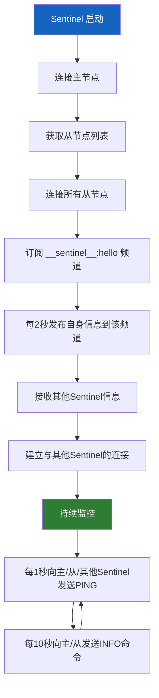
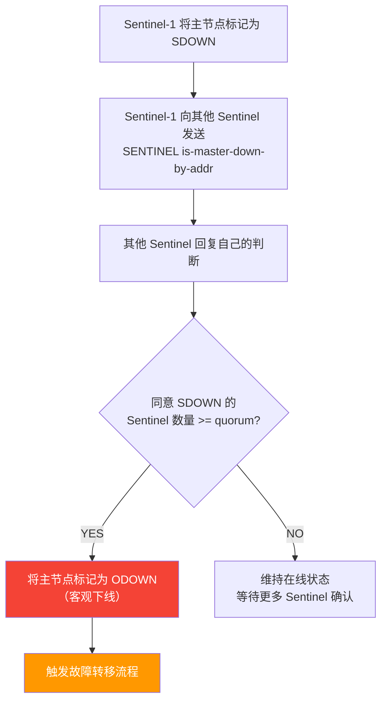
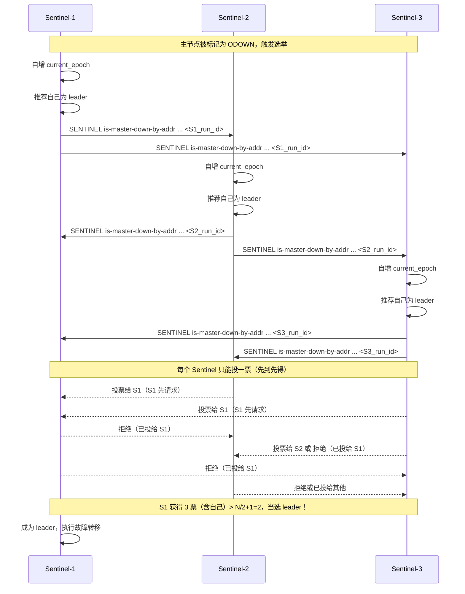
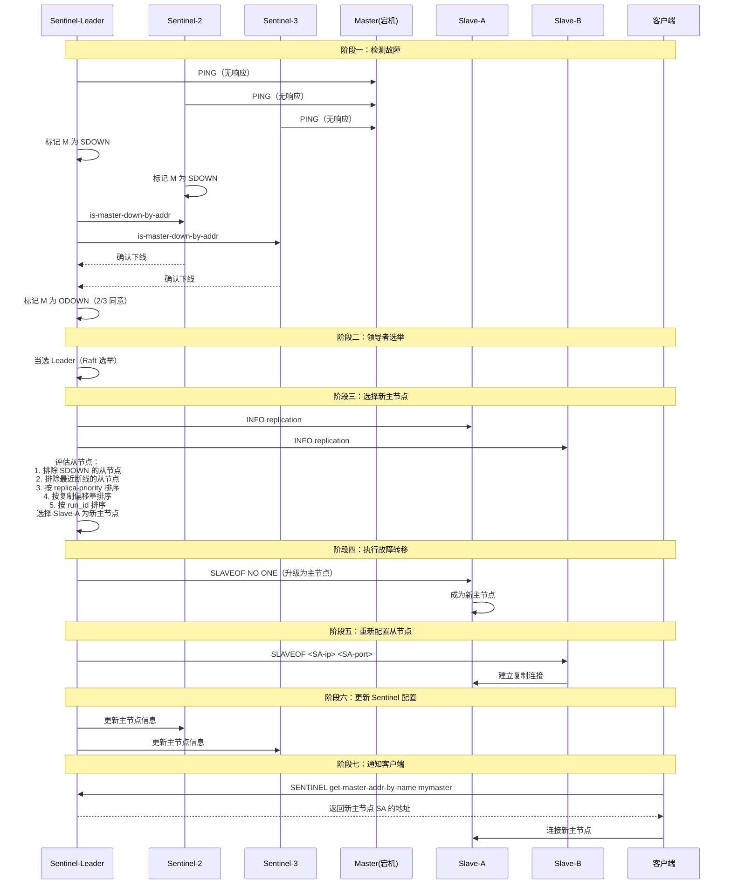
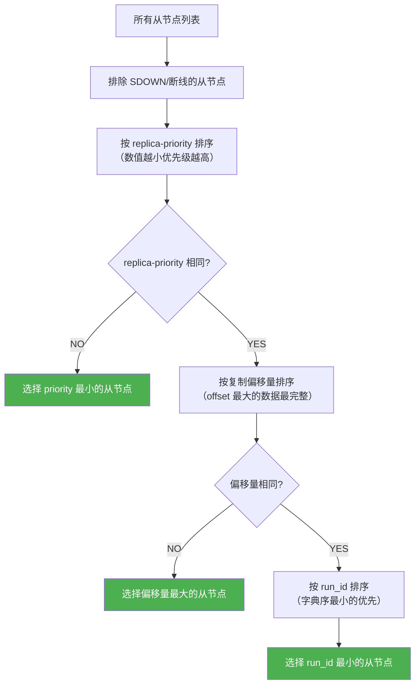
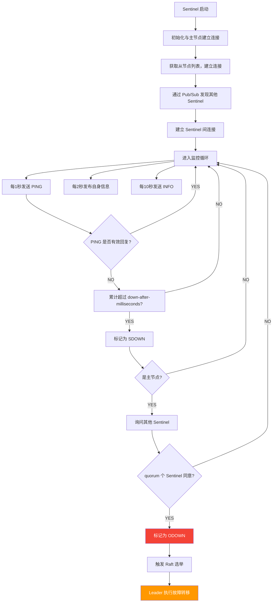
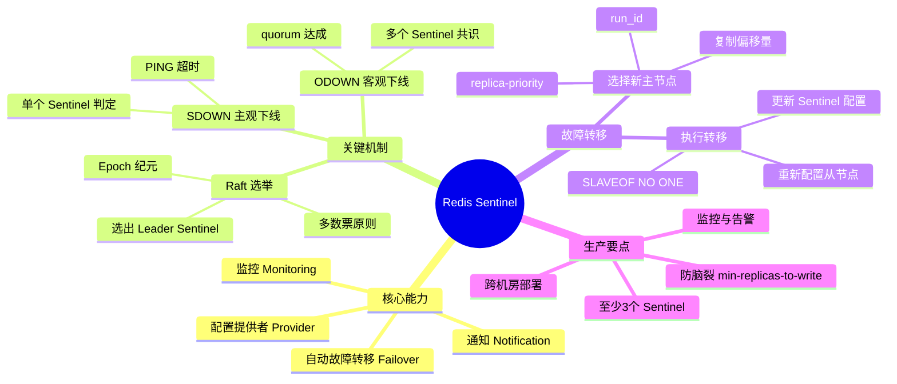

# 哨兵模式详解

> 主从复制解决了数据冗余和读扩展的问题，但主节点仍然是单点 —— 一旦主节点宕机，整个集群失去写入能力，需要人工介入切换。Redis Sentinel（哨兵）就是那个"自动值班员"，它7×24小时监控主从节点，在主节点故障时自动完成故障转移，让高可用真正落地。

## 1. 为什么需要哨兵？

### 1.1 主从复制的单点问题

```text
主从复制架构（无哨兵）：

              ┌─────────────┐
              │  Master ✅  │
              └──┬──────┬───┘
                 │      │
           ┌─────▼┐  ┌──▼─────┐
           │Slave-A│  │Slave-B │
           └───────┘  └────────┘

  问题场景：
              ┌─────────────┐
              │  Master ❌  │ ← 宕机！
              └──┬──────┬───┘
                 │      │
           ┌─────▼┐  ┌──▼─────┐
           │Slave-A│  │Slave-B │ ← 从节点仍在运行
           └───────┘  └────────┘
              但无法写入！需要人工介入！

  人工操作步骤（平均耗时 30分钟+）：
  1. 发现主节点宕机（靠监控告警）
  2. 选择一个从节点升为主节点
  3. 其他从节点指向新主节点
  4. 通知客户端连接新主节点
  5. 修复旧主节点，设为新主节点的从节点
```

### 1.2 哨兵解决的问题

| 问题 | 无哨兵 | 有哨兵 |
|------|--------|--------|
| 主节点故障检测 | 人工发现 | 自动检测（秒级） |
| 故障转移 | 人工操作（30分钟+） | 自动完成（10秒内） |
| 客户端路由 | 人工修改配置 | 自动通知新主节点 |
| 配置提供 | 硬编码主节点地址 | 运行时动态获取 |
| 持续监控 | 无 | 7×24小时监控 |

### 1.3 哨兵的核心能力

```text
┌─────────────────────────────────────────────────────────────┐
│                    Redis Sentinel 核心能力                    │
├─────────────────────────────────────────────────────────────┤
│                                                               │
│  1️⃣ 监控（Monitoring）                                        │
│     持续检测主节点、从节点、其他哨兵是否正常工作                │
│                                                               │
│  2️⃣ 通知（Notification）                                      │
│     故障事件通过 API 向管理员或应用程序发送通知                 │
│                                                               │
│  3️⃣ 自动故障转移（Automatic Failover）                        │
│     主节点故障时，自动将从节点升为主节点，并重新配置其他从节点  │
│                                                               │
│  4️⃣ 配置提供者（Configuration Provider）                       │
│     客户端通过哨兵获取当前主节点地址，无需硬编码               │
│                                                               │
└─────────────────────────────────────────────────────────────┘
```

## 2. Sentinel 架构

### 2.1 典型部署架构

```text
                    ┌──────────────┐
                    │   客户端     │
                    └──┬───────┬───┘
                       │       │
              查询主节点│       │写入数据
                       ▼       ▼
         ┌─────────────────────────────────┐
         │         Sentinel 集群            │
         │  ┌──────┐ ┌──────┐ ┌──────┐    │
         │  │Sent-1│ │Sent-2│ │Sent-3│    │
         │  │:26379│ │:26379│ │:26379│    │
         │  └──┬───┘ └──┬───┘ └──┬───┘    │
         └────┼────────┼────────┼────────┘
              │        │        │
              │  监控   │        │
              ▼        ▼        ▼
     ┌────────────────────────────────────┐
     │         Redis 主从集群              │
     │                                    │
     │        ┌─────────────┐             │
     │        │  Master     │             │
     │        │  :6379      │             │
     │        └──┬──────┬───┘             │
     │           │      │                  │
     │     ┌─────▼┐  ┌──▼─────┐          │
     │     │Slave-A│  │Slave-B │          │
     │     │ :6380 │  │ :6381  │          │
     │     └───────┘  └────────┘          │
     └────────────────────────────────────┘
```

### 2.2 为什么至少需要3个哨兵？

::: important 哨兵数量的奇数原则
哨兵集群必须至少部署 **3 个**实例，原因如下：

1. **故障转移需要多数派同意**：N 个哨兵中至少 `quorum` 个同意才能执行故障转移
2. **防止脑裂**：3 个哨兵的多数派是 2，网络分区时只有一侧能获得 2 票
3. **容错能力**：3 个哨兵可以容忍 1 个故障，5 个可以容忍 2 个

| 哨兵数量 | 多数派 | 容忍故障数 | 典型场景 |
|----------|--------|-----------|---------|
| 1 | 1 | 0 | 仅测试 |
| 2 | 2 | 0 | 不推荐（无法容忍任何故障） |
| 3 | 2 | 1 | 标准生产部署 |
| 5 | 3 | 2 | 核心业务 |
| 7 | 4 | 3 | 极高可用要求 |
:::

### 2.3 Sentinel 的通信机制

```text
Sentinel 之间的通信网络（每条线代表双向通信）：

         ┌──────┐  ──────  ┌──────┐
         │Sent-1│          │Sent-2│
         └──┬───┘  ──────  └──┬───┘
            │  ╲              ╱  │
            │    ╲          ╱    │
            │      ╲      ╱      │
            │        ╲  ╱        │
            │      ──────        │
            │      ╱    ╲        │
            │    ╱        ╲      │
         ┌──▼───┐          ┌──▼───┐
         │Sent-3│  ──────  │Sent-4│
         └──────┘          └──────┘

通信方式：Sentinel Pub/Sub（发布订阅）
频道名：__sentinel__:hello
频率：每 2 秒一次
```



### 2.4 Sentinel 发现机制

Sentinel 需要发现三类对象：从节点、其他哨兵、主节点。

**发现从节点**：

```text
Sentinel 通过主节点发现从节点：

1. Sentinel 连接主节点
2. 执行 INFO replication 命令
3. 从返回信息中获取从节点列表
4. 连接所有从节点

INFO replication 返回：
  slave0:ip=10.0.0.2,port=6380,state=online,offset=100,lag=0
  slave1:ip=10.0.0.3,port=6381,state=online,offset=98,lag=1
```

**发现其他哨兵**：

```text
Sentinel 通过 Pub/Sub 发现其他哨兵：

1. 每个 Sentinel 每 2 秒向 __sentinel__:hello 频道发送消息
2. 消息格式：<sentinel_ip>|<sentinel_port>|<run_id>|<epoch>|<master_name>|<master_ip>|<master_port>
3. 其他 Sentinel 订阅该频道，收到消息后建立连接
```

**发现主节点**：

```text
Sentinel 通过配置发现主节点：

1. sentinel.conf 中配置 sentinel monitor <master-name> <ip> <port> <quorum>
2. Sentinel 连接配置的主节点
3. 如果主节点变更（故障转移），Sentinel 通过 Pub/Sub 更新
```

## 3. 主观下线与客观下线

### 3.1 监控机制概览

```text
Sentinel 的监控层次：

         ┌─────────────────────────────────────────┐
         │           Sentinel 监控层次              │
         ├─────────────────────────────────────────┤
         │                                         │
         │  PING 命令（每1秒一次）                  │
         │  ├── 发送给主节点                        │
         │  ├── 发送给从节点                        │
         │  └── 发送给其他哨兵                      │
         │                                         │
         │  INFO 命令（每10秒一次）                 │
         │  ├── 主节点：获取从节点列表              │
         │  └── 从节点：获取主从关系               │
         │                                         │
         │  Pub/Sub（每2秒一次）                    │
         │  └── 发现其他哨兵                       │
         │                                         │
         └─────────────────────────────────────────┘
```

### 3.2 主观下线（SDOWN）

主观下线是**单个 Sentinel** 对节点的判断：

```text
主观下线判定逻辑：

Sentinel 向节点发送 PING 命令
         │
         ▼
   收到有效回复？ ──── YES ───► 保持在线状态
         │
        NO（超时或回复错误）
         │
         ▼
   持续超过 sentinel-down-after-milliseconds？
         │
        YES
         │
         ▼
   标记节点为 SDOWN（主观下线）

有效回复：+PONG, -LOADING, -MASTERDOWN
无效回复：超时无回复, 其他错误回复
```

```bash
# sentinel.conf 配置
# 判定主观下线的超时时间（毫秒）
sentinel down-after-milliseconds mymaster 30000
# 含义：如果主节点在 30 秒内没有有效回复 PING，
#       当前 Sentinel 将其标记为主观下线
```

::: tip down-after-milliseconds 的影响
这个值决定了故障检测的灵敏度：
- **太小**（如 5 秒）：网络抖动就可能触发误判
- **太大**（如 120 秒）：故障检测太慢，影响可用性
- **推荐**：生产环境 10~30 秒
:::

### 3.3 客观下线（ODOWN）

客观下线是**多个 Sentinel** 对主节点的共识判断：



```bash
# sentinel.conf 配置
# quorum：判定客观下线需要的最少哨兵同意数
sentinel monitor mymaster 127.0.0.1 6379 2
#                                              ↑ quorum=2
# 含义：至少 2 个哨兵认为主节点下线，才标记为客观下线
```

### 3.4 SDOWN 与 ODOWN 的区别

| 维度 | SDOWN（主观下线） | ODOWN（客观下线） |
|------|-------------------|-------------------|
| 判定者 | 单个 Sentinel | 多个 Sentinel 共识 |
| 适用对象 | 主节点、从节点、其他哨兵 | **仅主节点** |
| 判定条件 | 单个 Sentinel 的 PING 超时 | quorum 个 Sentinel 同意 SDOWN |
| 后果 | 无（仅记录状态） | 触发故障转移 |
| 可恢复性 | 节点恢复后自动取消 | 需要故障转移或人工干预 |

::: warning 只有主节点才有 ODOWN
从节点和哨兵只有 SDOWN，没有 ODOWN。这是因为：
1. 从节点下线不影响集群写入，不需要故障转移
2. 哨兵下线有其他哨兵继续工作
3. 只有主节点下线才需要触发故障转移
:::

### 3.5 SENTINEL is-master-down-by-addr 命令

Sentinel 之间通过此命令交换对主节点的判断：

```bash
# Sentinel-1 询问 Sentinel-2：主节点是否下线？
SENTINEL is-master-down-by-addr 127.0.0.1 6379 1 <sentinel1_run_id>

# Sentinel-2 回复：
1) 1    # 1=下线, 0=未下线
2) "*"  # 当前 Sentinel 的 leader 投票（用于 Raft 选举）
3) <sentinel2_run_id>

# 参数说明：
# arg1: 主节点 IP
# arg2: 主节点端口
# arg3: 当前纪元（epoch）
# arg4: 请求投票的 Sentinel 的 run_id（选举时使用）
```

## 4. 领导者选举（Raft）

### 4.1 为什么需要领导者选举？

当主节点被标记为 ODOWN 后，需要执行故障转移。但多个 Sentinel 同时执行故障转移会导致混乱：

```text
没有领导者的后果：

Sentinel-1: 选择 Slave-A 升为主节点
Sentinel-2: 选择 Slave-B 升为主节点
Sentinel-3: 选择 Slave-C 升为主节点

结果：出现了 3 个主节点！→ 脑裂！数据不一致！
```

因此，必须先选出一个**领导者 Sentinel**，由它来执行故障转移。

### 4.2 Raft 选举流程

Redis Sentinel 使用简化版的 Raft 协议进行领导者选举：



### 4.3 选举规则详解

```text
Raft 选举的核心规则：

1. 发起选举的条件：
   - 主节点被标记为 ODOWN
   - 当前 Sentinel 尚未投票给其他 Sentinel

2. 投票规则：
   - 每个 epoch 每个 Sentinel 只能投一票
   - 先到先得（FIFO）
   - 投票后不能改投

3. 当选条件：
   - 获得 > N/2 的票数（N = Sentinel 总数）
   - 3 个 Sentinel 需要至少 2 票
   - 5 个 Sentinel 需要至少 3 票

4. 超时重试：
   - 如果没有 Sentinel 获得多数票
   - 等待随机时间后重新选举
```

### 4.4 纪元（Epoch）机制

```text
Epoch（纪元）是 Sentinel 选举和故障转移的核心版本号：

current_epoch：当前 Sentinel 所知的最新的纪元
                     │
     ┌───────────────┼───────────────┐
     │               │               │
  选举时自增      故障转移时使用    配置传播时使用
     │               │               │
  用于区分        标识故障转移      确保配置
  不同轮次        的唯一性          的新鲜度

规则：
1. 每次选举前，current_epoch + 1
2. Sentinel 只对 >= 自己 current_epoch 的请求投票
3. 收到更大 epoch 的配置时，更新自己的 epoch
4. epoch 越大，配置越新
```

```bash
# 查看当前 Sentinel 的 epoch
127.0.0.1:26379> SENTINEL master mymaster
# ...
22) "current-epoch"
23) "12"             # 当前纪元
24) "config-epoch"
25) "12"             # 配置纪元
```

## 5. 故障转移流程

### 5.1 故障转移完整时序图



### 5.2 选择新主节点的规则

Sentinel 选择新主节点时，按照以下优先级依次筛选：



**详细规则说明：**

| 优先级 | 筛选条件 | 说明 |
|--------|---------|------|
| 1 | `replica-priority` | 配置的优先级，0 = 永不升主。默认 100 |
| 2 | 复制偏移量 | offset 越大，数据越完整 |
| 3 | `run_id` | 兜底条件，确保确定性 |

```bash
# 设置从节点优先级
# redis.conf（从节点配置）
replica-priority 100     # 默认值
replica-priority 50      # 更高优先级（数值更小）
replica-priority 0       # 永远不会被选为主节点
```

### 5.3 故障转移的详细步骤

#### 步骤一：发送 SLAVEOF NO ONE

```bash
# Sentinel Leader 向选中的从节点发送命令
SLAVEOF NO ONE

# 从节点日志
*M* Connection with master lost.
*M* Caching the disconnected master state.
*S* Before turning into a master, my master was: 10.0.0.1:6379
*M* Setting myself as master
*M* Discarding previously cached master state.
```

#### 步骤二：等待提升确认

```bash
# Sentinel 定期向新主节点发送 INFO 命令
# 确认其角色已变为 master
127.0.0.1:6380> INFO replication
# Replication
role:master            # ← 已变为 master
connected_slaves:0     # ← 还没有从节点连接
```

#### 步骤三：重新配置其他从节点

```bash
# Sentinel 向其他从节点发送 SLAVEOF 命令
SLAVEOF <new-master-ip> <new-master-port>

# 从节点日志
*S* SLAVE OF <new-master-ip>:<new-master-port> enabled (user request from 'ID=...')
*S* Connecting to MASTER <new-master-ip>:<new-master-port>
*S* MASTER <-> REPLICA sync started
*S* Full resync from master: <new-replid>:0
```

#### 步骤四：更新 Sentinel 配置

```bash
# Sentinel 更新内部配置
# 将 mymaster 的地址从旧主节点更新为新主节点
SENTINEL set mymaster <new-master-ip> <new-master-port>

# 配置自动持久化到 sentinel.conf
# sentinel.conf 中自动更新：
# sentinel leader-epoch mymaster 12
# sentinel known-replica mymaster <old-master-ip> <old-master-port>
# sentinel known-sentinel mymaster <sentinel-ip> <sentinel-port>
```

#### 步骤五：通知旧主节点

如果旧主节点恢复，Sentinel 会将其配置为新主节点的从节点：

```bash
# 旧主节点恢复后
# Sentinel 向旧主节点发送 SLAVEOF 命令
SLAVEOF <new-master-ip> <new-master-port>

# 旧主节点日志
*S* SLAVE OF <new-master-ip>:<new-master-port> enabled (user request)
*S* Connecting to MASTER <new-master-ip>:<new-master-port>
*S* MASTER <-> REPLICA sync started
```

### 5.4 故障转移超时配置

```bash
# sentinel.conf
# 故障转移超时时间（毫秒）
sentinel failover-timeout mymaster 180000

# 这个超时时间的含义：
# 1. 同一个 Sentinel 对同一个主节点在 failover-timeout 内不会再次触发故障转移
# 2. 从节点升级为主节点后，如果 failover-timeout 内未完成，视为失败
# 3. 默认 3 分钟
```

## 6. Sentinel 配置详解

### 6.1 最小配置模板

```bash
# sentinel.conf 最小配置

# 端口
port 26379

# 监控主节点
# sentinel monitor <master-name> <ip> <port> <quorum>
sentinel monitor mymaster 127.0.0.1 6379 2

# 主观下线判定时间
# sentinel down-after-milliseconds <master-name> <milliseconds>
sentinel down-after-milliseconds mymaster 30000

# 故障转移超时
# sentinel failover-timeout <master-name> <milliseconds>
sentinel failover-timeout mymaster 180000

# 并行同步数量
# sentinel parallel-syncs <master-name> <count>
sentinel parallel-syncs mymaster 1
```

### 6.2 配置参数详解

#### sentinel monitor

```bash
sentinel monitor mymaster 127.0.0.1 6379 2
#                   │          │     │   │
#                   │          │     │   └── quorum（法定人数）
#                   │          │     └────── 主节点端口
#                   │          └──────────── 主节点IP
#                   └─────────────────────── 主节点名称（自定义）
```

::: important quorum 参数的含义
`quorum` 有两层含义：

1. **判定 ODOWN**：至少 quorum 个 Sentinel 认为 master 下线，才标记为 ODOWN
2. **授权故障转移**：至少 quorum 个 Sentinel 同意，才能执行故障转移

**注意**：quorum 不是执行故障转移的门槛，而是"保护机制"。即使 quorum=2，3 个 Sentinel 中有 2 个同意，但只有获得 > N/2 = 2 票的 Sentinel 才能成为 Leader 执行故障转移。

| 配置 | ODOWN 判定 | 需要存活的 Sentinel |
|------|-----------|---------------------|
| quorum=1 | 1个同意即可 | 2（N/2+1=2） |
| quorum=2 | 2个同意 | 2（N/2+1=2） |
| quorum=3 | 3个同意 | 2（N/2+1=2） |
:::

#### sentinel parallel-syncs

```bash
sentinel parallel-syncs mymaster 1
#                                │
#      故障转移后，同时向新主节点发起复制的从节点数量
```

```text
parallel-syncs = 1（推荐）：
  新主节点 ←── Slave-B（先同步）
  新主节点 ←── Slave-C（等 B 同步完成后）

parallel-syncs = 2：
  新主节点 ←── Slave-B（同时同步）
  新主节点 ←── Slave-C（同时同步）

为什么推荐 1？
  同时全量同步会给新主节点带来巨大压力：
  - 多次 bgsave
  - 网络带宽占满
  - 新主节点可能无法处理客户端请求
```

#### sentinel down-after-milliseconds

```bash
sentinel down-after-milliseconds mymaster 30000
# 30 秒内 PING 无有效回复 → 标记为主观下线

# 注意：
# 1. 这个值对所有主从节点和 Sentinel 之间的检测都生效
# 2. 值越大，误判概率越低，但故障检测越慢
# 3. 值越小，故障检测越快，但误判概率越高
# 4. 生产推荐：10~30 秒
```

### 6.3 完整配置模板

```bash
# ============================================
# Redis Sentinel 完整配置
# ============================================

# 端口
port 26379

# 守护进程
daemonize yes

# PID 文件
pidfile /var/run/redis-sentinel.pid

# 日志文件
logfile "/var/log/redis/sentinel.log"

# 工作目录
dir "/tmp"

# ============================================
# 监控配置
# ============================================

# 监控主节点
sentinel monitor mymaster 10.0.0.1 6379 2

# 主观下线超时
sentinel down-after-milliseconds mymaster 30000

# 故障转移超时
sentinel failover-timeout mymaster 180000

# 并行同步数
sentinel parallel-syncs mymaster 1

# 主节点密码
sentinel auth-pass mymaster your_strong_password

# ============================================
# 通知脚本
# ============================================

# 故障转移时执行的脚本
sentinel notification-script mymaster /etc/redis/notify.sh

# 客户端重新配置脚本
sentinel client-reconfig-script mymaster /etc/redis/reconfig.sh

# ============================================
# 其他配置
# ============================================

# 禁止修改 SENTINEL 命令
# sentinel deny-scripts-reconfig yes

# Sentinel 日志级别
loglevel notice
```

### 6.4 运行时修改配置

```bash
# 查看主节点信息
127.0.0.1:26379> SENTINEL master mymaster

# 查看从节点列表
127.0.0.1:26379> SENTINEL slaves mymaster

# 查看其他 Sentinel
127.0.0.1:26379> SENTINEL sentinels mymaster

# 获取当前主节点地址
127.0.0.1:26379> SENTINEL get-master-addr-by-name mymaster
1) "10.0.0.2"
2) "6379"

# 修改运行时配置
127.0.0.1:26379> SENTINEL set mymaster down-after-milliseconds 20000
OK

# 重置主节点（清除所有状态）
127.0.0.1:26379> SENTINEL reset mymaster
OK

# 手动触发故障转移
127.0.0.1:26379> SENTINEL failover mymaster
OK

# 检查 Sentinel 是否可达
127.0.0.1:26379> SENTINEL ckquorum mymaster
OK 3 usable Sentinels. Quorum and failover authorization can be reached
```

## 7. 脑裂问题

### 7.1 什么是脑裂？

脑裂（Split Brain）是指在网络分区的情况下，集群中出现了两个主节点，各自接受写入，导致数据不一致。

```text
脑裂场景：

初始状态：
              ┌─────────────┐
              │  Master     │
              │  10.0.0.1   │
              └──┬──────┬───┘
                 │      │
           ┌─────▼┐  ┌──▼─────┐
           │Slave-A│  │Slave-B │
           │10.0.0.2│  │10.0.0.3│
           └───────┘  └────────┘
  ┌────────┐ ┌────────┐ ┌────────┐
  │Sentinel│ │Sentinel│ │Sentinel│
  │  S1    │ │  S2    │ │  S3    │
  └────────┘ └────────┘ └────────┘

网络分区后：
    ┌──── 左侧分区 ────┐    ┌──── 右侧分区 ────┐
    │                  │    │                    │
    │  Master ✅      │    │  Slave-A ✅        │
    │  10.0.0.1      │    │  10.0.0.2          │
    │                  │    │  Slave-B ✅        │
    │  Sentinel-S1    │    │  10.0.0.3          │
    │                  │    │                    │
    │                  │    │  Sentinel-S2       │
    │                  │    │  Sentinel-S3       │
    │                  │    │                    │
    │  S1 认为:       │    │  S2+S3 认为:       │
    │  主节点正常     │    │  主节点下线！       │
    │  继续写入       │    │  选举 Slave-A 为主 │
    │                  │    │                    │
    └──────────────────┘    └────────────────────┘

    结果：两个主节点！数据不一致！
```

### 7.2 脑裂的危害

```text
脑裂造成的数据丢失：

左侧 Master 接受的写入：  SET key1 "left_value"
右侧 New Master 接受的写入：SET key1 "right_value"

网络恢复后：
- 旧 Master 被 Sentinel 降级为从节点
- 旧 Master 的数据被 New Master 的数据覆盖
- key1 的值变为 "right_value"，"left_value" 丢失！
```

### 7.3 防止脑裂的策略

#### 策略一：min-replicas-to-write

```bash
# redis.conf（主节点配置）
min-replicas-to-write 1     # 至少 1 个从节点在线才接受写入
min-replicas-max-lag 10     # 从节点最大延迟 10 秒

# 原理：
# 如果网络分区导致主节点与所有从节点断开
# 主节点的 min-replicas-to-write 条件不满足
# 主节点自动拒绝写入 → 防止脑裂期间的数据写入
```

#### 策略二：合理的 quorum 配置

```bash
# 3 个 Sentinel，quorum=2
sentinel monitor mymaster 10.0.0.1 6379 2

# 网络分区时：
# - 包含 2 个 Sentinel 的分区可以执行故障转移
# - 包含 1 个 Sentinel 的分区无法执行故障转移
# → 避免两侧同时故障转移
```

#### 策略三：物理部署优化

```text
推荐的部署拓扑（3 机房）：

机房 A            机房 B            机房 C
┌──────────┐     ┌──────────┐     ┌──────────┐
│ Master    │     │ Slave-A  │     │ Slave-B  │
│ Sentinel-1│     │ Sentinel-2│     │ Sentinel-3│
└──────────┘     └──────────┘     └──────────┘

如果机房 A 与 B、C 网络分区：
- 机房 A：1 个 Sentinel，无法获得多数票 → 不触发故障转移
- 机房 B+C：2 个 Sentinel，获得多数票 → 可以触发故障转移
- 机房 A 的 Master 因 min-replicas-to-write 拒绝写入

如果只部署 2 个机房：
- 机房 A：2 个 Sentinel + Master
- 机房 B：1 个 Sentinel + Slave
- 分区时，机房 A 的 2 个 Sentinel 仍可获得多数票 → 可能脑裂！
```

::: warning 脑裂防范的核心原则
1. **Sentinel 与主节点不要全部署在一个机房**
2. **奇数个 Sentinel**，确保网络分区时只有一侧能获得多数票
3. **配置 `min-replicas-to-write`**，让孤立的主节点自动拒绝写入
4. **监控 `connected_slaves`**，异常时立即告警
:::

## 8. Sentinel 的 TILT 模式

### 8.1 什么是 TILT 模式？

TILT 是 Sentinel 的自我保护机制，当检测到系统时间异常时，自动进入 TILT 模式：

```text
TILT 触发条件：
1. 进程被系统暂停（如 SIGSTOP、虚拟机暂停）
2. 系统时钟被大幅调整
3. 进程阻塞（如大量 swap、CPU 争抢）

TILT 模式行为：
1. 停止所有故障检测
2. 不执行故障转移
3. 不接受 SENTINEL is-master-down-by-addr 请求
4. 仍响应 PING 和 INFO 命令

退出 TILT：
1. 系统时间恢复正常
2. 持续 30 秒无异常
```

### 8.2 TILT 模式的工作原理

```text
Sentinel 的定时器每 100ms 执行一次：

正常情况：
  预期间隔 = 100ms
  实际间隔 ≈ 100ms ± 10ms → 正常

异常情况：
  预期间隔 = 100ms
  实际间隔 = 5000ms → 异常！→ 进入 TILT

原因：如果进程被暂停 5 秒，
  Sentinel 可能误判节点下线（因为 5 秒没收到 PING）
  但实际上只是自己暂停了，节点可能完全正常
```

```bash
# 查看 Sentinel 是否处于 TILT 模式
127.0.0.1:26379> INFO sentinel
# Sentinel
sentinel_tilt:0              # 0=正常, 1=TILT 模式
sentinel_running_scripts:0
sentinel_scripts_queue_length:0
sentinel_simulate_failure_flags:0
```

## 9. Sentinel 常用命令

### 9.1 查询命令

```bash
# 查看所有被监控的主节点
127.0.0.1:26379> SENTINEL masters

# 查看指定主节点信息
127.0.0.1:26379> SENTINEL master mymaster
 1) "name"
 2) "mymaster"
 3) "ip"
 4) "10.0.0.1"
 5) "port"
 6) "6379"
 7) "runid"
 8) "abc123..."
 9) "flags"
10) "master"
11) "num-slaves"
12) "2"
13) "num-other-sentinels"
14) "2"
15) "quorum"
16) "2"
17) "current-epoch"
18) "12"
...

# 查看从节点列表
127.0.0.1:26379> SENTINEL slaves mymaster

# 查看其他 Sentinel
127.0.0.1:26379> SENTINEL sentinels mymaster

# 获取当前主节点地址
127.0.0.1:26379> SENTINEL get-master-addr-by-name mymaster
1) "10.0.0.1"
2) "6379"

# 检查 quorum 是否可达
127.0.0.1:26379> SENTINEL ckquorum mymaster
OK 3 usable Sentinels. Quorum and failover authorization can be reached

# 查看指定主节点的 IP 和端口
127.0.0.1:26379> SENTINEL resolve-ip mymaster 10.0.0.1 6379
```

### 9.2 操作命令

```bash
# 手动触发故障转移
127.0.0.1:26379> SENTINEL failover mymaster
OK

# 重置主节点（清除所有状态，重新发现）
127.0.0.1:26379> SENTINEL reset mymaster
OK

# 修改运行时配置
127.0.0.1:26379> SENTINEL set mymaster down-after-milliseconds 20000
OK
127.0.0.1:26379> SENTINEL set mymaster failover-timeout 120000
OK
127.0.0.1:26379> SENTINEL set mymaster parallel-syncs 1
OK

# 添加监控的主节点
127.0.0.1:26379> SENTINEL monitor newmaster 10.0.0.5 6379 2
OK

# 移除主节点
127.0.0.1:26379> SENTINEL remove newmaster
OK

# 强制写入当前配置到磁盘
127.0.0.1:26379> SENTINEL flushconfig
OK

# 禁止/允许故障转移（调试用）
127.0.0.1:26379> SENTINEL set mymaster failover-timeout 9223372036854775807
# 设为最大值相当于禁止
```

### 9.3 故障转移状态查询

```bash
# 查看故障转移状态
127.0.0.1:26379> SENTINEL master mymaster
# 关注以下字段：
# "flags" - 可能的值：master, master_down, s_down, o_down, failover_in_progress
# "num-slaves" - 从节点数量
# "num-other-sentinels" - 其他哨兵数量

# 查看最近一次故障转移信息
127.0.0.1:26379> INFO sentinel
# Sentinel
sentinel_masters:1
sentinel_tilt:0
sentinel_running_scripts:0
sentinel_scripts_queue_length:0
master0:name=mymaster,status=ok,address=10.0.0.2:6379,slaves=2,sentinels=3
```

## 10. Sentinel 与客户端

### 10.1 客户端连接 Sentinel 的方式

```text
客户端获取主节点地址的方式：

方式一：请求-响应模式
┌──────────┐     SENTINEL get-master-addr-by-name      ┌──────────┐
│  客户端  │ ─────────────────────────────────────►    │ Sentinel  │
│          │ ◄─────────────────────────────────────    │          │
└──────────┘     返回主节点 IP:Port                    └──────────┘
     │
     │ 连接主节点
     ▼
┌──────────┐
│  Master  │
└──────────┘

方式二：订阅模式
┌──────────┐     SUBSCRIBE +switch-master              ┌──────────┐
│  客户端  │ ◄─────────────────────────────────────    │ Sentinel  │
│          │     故障转移时主动推送新主节点地址         │          │
└──────────┘                                          └──────────┘
```

### 10.2 客户端实现要点

```text
客户端连接 Sentinel 的实现要点：

1. 启动时：
   - 连接所有 Sentinel 实例
   - 通过 SENTINEL get-master-addr-by-name 获取主节点地址
   - 连接主节点

2. 运行时：
   - 订阅 +switch-master 频道
   - 收到切换通知后，重新获取主节点地址
   - 重新连接新主节点

3. 连接断开时：
   - 尝试重新连接 Sentinel
   - 重新获取主节点地址
   - 重试连接
```

### 10.3 C# 客户端示例（StackExchange.Redis）

```csharp
using StackExchange.Redis;

// Sentinel 连接配置
ConfigurationOptions sentinelConfig = new ConfigurationOptions
{
    ServiceName = "mymaster",  // Sentinel 监控的主节点名称
    TieBreaker = "",           // 平局决胜键
    CommandMap = CommandMap.Sentinel,  // 使用 Sentinel 命令映射
    AbortOnConnectFail = false
};

// 添加所有 Sentinel 地址
sentinelConfig.EndPoints.Add("10.0.0.1:26379");
sentinelConfig.EndPoints.Add("10.0.0.2:26379");
sentinelConfig.EndPoints.Add("10.0.0.3:26379");

// 连接 Sentinel
ConnectionMultiplexer sentinelConn = ConnectionMultiplexer.Connect(sentinelConfig);

// 获取主节点连接
// StackExchange.Redis 自动通过 Sentinel 获取主节点地址
IDatabase db = sentinelConn.GetDatabase();

// 写操作（自动路由到主节点）
db.StringSet("key", "value");

// 读操作（指定从从节点读取）
db.StringGet("key", CommandFlags.DemandReplica);
```

### 10.4 Java 客户端示例（Jedis）

```java
import redis.clients.jedis.Jedis;
import redis.clients.jedis.JedisSentinelPool;
import java.util.HashSet;
import java.util.Set;

public class SentinelDemo {
    public static void main(String[] args) {
        // 配置 Sentinel 地址
        Set<String> sentinels = new HashSet<>();
        sentinels.add("10.0.0.1:26379");
        sentinels.add("10.0.0.2:26379");
        sentinels.add("10.0.0.3:26379");

        // 创建 Sentinel 连接池
        JedisSentinelPool pool = new JedisSentinelPool(
            "mymaster",    // 主节点名称
            sentinels,     // Sentinel 地址集合
            poolConfig,    // 连接池配置
            30000,         // 超时时间（毫秒）
            "password"    // 密码
        );

        // 获取连接
        try (Jedis jedis = pool.getResource()) {
            // 写操作
            jedis.set("key", "value");

            // 读操作
            String value = jedis.get("key");
        }

        // 关闭连接池
        pool.close();
    }
}
```

## 11. Sentinel 日志分析

### 11.1 关键日志事件

```bash
# Sentinel 启动
26379:X 01 Jan 2026 10:00:00.000 # Sentinel started using Redis as Sentinel master
26379:X 01 Jan 2026 10:00:00.001 # +monitor master mymaster 10.0.0.1 6379 quorum 2

# 发现从节点
26379:X 01 Jan 2026 10:00:10.000 * +slave slave 10.0.0.2:6379 10.0.0.2 6379 @ mymaster 10.0.0.1 6379

# 发现其他 Sentinel
26379:X 01 Jan 2026 10:00:15.000 * +sentinel sentinel 10.0.0.3:26379 10.0.0.3 26379 @ mymaster 10.0.0.1 6379

# 主观下线
26379:X 01 Jan 2026 10:01:00.000 # +sdown master mymaster 10.0.0.1 6379

# 客观下线
26379:X 01 Jan 2026 10:01:05.000 # +odown master mymaster 10.0.0.1 6379 #quorum 2/3

# 故障转移开始
26379:X 01 Jan 2026 10:01:05.001 # +failover-triggered master mymaster 10.0.0.1 6379

# 选择新主节点
26379:X 01 Jan 2026 10:01:05.002 # +selected-slave slave 10.0.0.2:6379 10.0.0.2 6379 @ mymaster 10.0.0.1 6379

# 从节点升级为主节点
26379:X 01 Jan 2026 10:01:05.003 # +failover-state-send-slaveof-noone slave 10.0.0.2:6379 10.0.0.2 6379 @ mymaster 10.0.0.1 6379

# 故障转移完成
26379:X 01 Jan 2026 10:01:10.000 # +failover-end master mymaster 10.0.0.1 6379

# 切换主节点
26379:X 01 Jan 2026 10:01:10.001 # +switch-master mymaster 10.0.0.1 6379 10.0.0.2 6379
```

### 11.2 日志事件类型

| 事件 | 含义 |
|------|------|
| `+reset-master` | 主节点被重置 |
| `+slave` | 发现新从节点 |
| `+sentinel` | 发现新哨兵 |
| `+sdown` | 主观下线 |
| `-sdown` | 取消主观下线 |
| `+odown` | 客观下线 |
| `-odown` | 取消客观下线 |
| `+failover-triggered` | 故障转移被触发 |
| `+selected-slave` | 选中从节点升级为主节点 |
| `+failover-state-send-slaveof-noone` | 向选中从节点发送 SLAVEOF NO ONE |
| `+failover-end` | 故障转移结束 |
| `+switch-master` | 主节点切换完成 |

## 12. Sentinel 监控

### 12.1 关键监控指标

```text
Sentinel 自身指标：
┌──────────────────────────────────────────────┐
│ 1. sentinel_tilt              TILT 模式状态  │
│ 2. sentinel_running_scripts   运行中脚本数   │
│ 3. masters_count              监控主节点数   │
└──────────────────────────────────────────────┘

主节点指标（通过 SENTINEL master 命令获取）：
┌──────────────────────────────────────────────┐
│ 1. flags          节点标志（master/sdown等） │
│ 2. num-slaves     从节点数量                 │
│ 3. num-other-sentinels  其他哨兵数量         │
│ 4. quorum         法定人数                   │
│ 5. current-epoch  当前纪元                   │
│ 6. info-refresh   最后一次 INFO 的时间       │
└──────────────────────────────────────────────┘
```

### 12.2 健康检查脚本

```bash
#!/bin/bash
# sentinel_health_check.sh

SENTINEL_HOST="127.0.0.1"
SENTINEL_PORT=26379
MASTER_NAME="mymaster"

echo "=== Sentinel 健康检查 ==="
echo "时间: $(date)"
echo ""

# 1. 检查 Sentinel 是否可达
REDIS_CLI="redis-cli -h $SENTINEL_HOST -p $SENTINEL_PORT"
PING_RESULT=$($REDIS_CLI PING 2>/dev/null)
if [ "$PING_RESULT" = "PONG" ]; then
    echo "[OK] Sentinel 可达"
else
    echo "[CRITICAL] Sentinel 不可达!"
    exit 1
fi

# 2. 检查 TILT 模式
TILT=$($REDIS_CLI INFO sentinel | grep "sentinel_tilt" | cut -d: -f2 | tr -d '\r')
if [ "$TILT" = "0" ]; then
    echo "[OK] TILT 模式: 未激活"
else
    echo "[WARNING] TILT 模式: 已激活!"
fi

# 3. 检查主节点状态
MASTER_INFO=$($REDIS_CLI SENTINEL master $MASTER_NAME)
MASTER_FLAGS=$(echo "$MASTER_INFO" | grep -A1 "flags" | tail -1)
MASTER_NUM_SLAVES=$(echo "$MASTER_INFO" | grep -A1 "num-slaves" | tail -1)
MASTER_NUM_SENTINELS=$(echo "$MASTER_INFO" | grep -A1 "num-other-sentinels" | tail -1)

echo ""
echo "--- 主节点: $MASTER_NAME ---"
echo "状态标志: $MASTER_FLAGS"
echo "从节点数: $MASTER_NUM_SLAVES"
echo "其他哨兵数: $MASTER_NUM_SENTINELS"

# 4. 检查 quorum
QUORUM_CHECK=$($REDIS_CLI SENTINEL ckquorum $MASTER_NAME 2>&1)
echo "Quorum 检查: $QUORUM_CHECK"

# 5. 检查从节点
echo ""
echo "--- 从节点列表 ---"
$REDIS_CLI SENTINEL slaves $MASTER_NAME | grep -E "(ip|port|flags|master-link-status)" | paste - - - - | while read line; do
    echo "  $line"
done
```

## 13. 常见问题与排查

### 13.1 故障转移未触发

**现象**：主节点已宕机，但 Sentinel 没有触发故障转移。

**排查步骤**：

```text
排查清单：

1. 检查 ODOWN 是否达成
   - 多少个 Sentinel 标记了 SDOWN？
   - 是否达到 quorum？

2. 检查 Sentinel 数量
   - 是否有足够的 Sentinel 在线？
   - SENTINEL ckquorum 检查

3. 检查 failover-timeout
   - 是否在上一次故障转移的 failover-timeout 内？
   - 同一个 Sentinel 在 failover-timeout 内不会再次触发

4. 检查 TILT 模式
   - Sentinel 是否处于 TILT 模式？
   - INFO sentinel 查看 sentinel_tilt

5. 检查网络
   - Sentinel 与主节点之间的网络是否正常？
   - Sentinel 之间的网络是否正常？
```

### 13.2 故障转移选择了错误的从节点

```text
原因分析：
1. replica-priority 配置不当
   → 检查各从节点的 replica-priority 配置

2. 复制偏移量不准确
   → 检查从节点的 slave_repl_offset
   → 可能是网络延迟导致偏移量更新不及时

3. 从节点信息过期
   → 检查 Sentinel 最近一次 INFO 的时间
   → 可能 Sentinel 与从节点的连接有问题

解决方案：
1. 为不同从节点设置不同的 replica-priority
2. 确保所有从节点网络稳定
3. 定期检查 SENTINEL slaves 输出
```

### 13.3 故障转移后客户端连接失败

```text
原因分析：
1. 客户端缓存了旧的主节点地址
   → 使用 Sentinel 的服务发现机制
   → 订阅 +switch-master 频道

2. 新主节点尚未准备好
   → 故障转移有短暂的不可用窗口
   → 客户端需要重试逻辑

3. 客户端没有连接 Sentinel
   → 客户端需要通过 Sentinel 获取主节点地址

解决方案：
1. 使用支持 Sentinel 的客户端库
2. 实现重试逻辑
3. 订阅切换事件
```

### 13.4 Sentinel 配置不一致

```text
原因：
1. 部分 Sentinel 的配置文件被手动修改
2. 故障转移后配置未同步
3. Sentinel 重启后读取了旧的配置文件

排查：
1. 检查所有 Sentinel 的配置
   127.0.0.1:26379> SENTINEL master mymaster
2. 比较各 Sentinel 的 current_epoch
3. 检查 sentinel.conf 文件内容

解决：
1. 执行 SENTINEL flushconfig 强制写入配置
2. 确保所有 Sentinel 配置文件一致
3. 必要时执行 SENTINEL reset
```

## 14. Sentinel 的工作流程总结

### 14.1 正常运行流程



### 14.2 故障转移后的状态变化

```text
故障转移前：
  Master(10.0.0.1:6379) ← 宕机
  ├── Slave-A(10.0.0.2:6379)
  └── Slave-B(10.0.0.3:6379)

故障转移后：
  New Master = Slave-A(10.0.0.2:6379) ← 升级为主
  └── Slave-B(10.0.0.3:6379) ← 重新指向新主节点

  旧 Master(10.0.0.1:6379) ← 恢复后自动变为新主节点的从节点

Sentinel 配置变化：
  sentinel monitor mymaster 10.0.0.1 6379 2   ← 旧配置
  ↓
  sentinel monitor mymaster 10.0.0.2 6379 2   ← 新配置
  sentinel known-replica mymaster 10.0.0.1 6379  ← 旧主变为从节点
```

## 15. 总结

### 15.1 核心知识图谱



### 15.2 面试高频问题

| 问题 | 答案要点 |
|------|---------|
| Sentinel 的作用是什么？ | 监控、通知、自动故障转移、配置提供者 |
| SDOWN 和 ODOWN 的区别？ | SDOWN 是单个 Sentinel 的判断，ODOWN 是多个 Sentinel 的共识；只有主节点才有 ODOWN |
| Sentinel 如何选举 Leader？ | 简化版 Raft：自增 epoch → 推荐自己 → 请求投票 → 多数票当选 |
| 故障转移如何选择新主节点？ | 排除断线节点 → replica-priority → 复制偏移量 → run_id |
| quorum 参数的含义？ | 判定 ODOWN 需要的最少同意数；也是授权故障转移的最低要求 |
| 如何防止脑裂？ | min-replicas-to-write、奇数 Sentinel 跨机房部署、合理的 quorum |
| Sentinel 之间如何通信？ | 主节点的 `__sentinel__:hello` Pub/Sub 频道 |
| parallel-syncs 为什么建议设为 1？ | 避免多个从节点同时全量同步压垮新主节点 |
| TILT 模式是什么？ | Sentinel 检测到时间异常时的自我保护，停止故障检测和转移 |

### 15.3 生产环境检查清单

- [ ] 至少部署 3 个 Sentinel 实例
- [ ] Sentinel 与 Redis 主从节点不在同一台机器
- [ ] 跨机房/跨可用区部署 Sentinel
- [ ] `down-after-milliseconds` 设置合理（10~30 秒）
- [ ] `parallel-syncs` 设为 1
- [ ] `failover-timeout` 设置合理（默认 3 分钟）
- [ ] 配置 `min-replicas-to-write` 防止脑裂
- [ ] 配置 `sentinel auth-pass` 认证
- [ ] 监控 Sentinel TILT 状态
- [ ] 监控主节点 `num-slaves` 和 `num-other-sentinels`
- [ ] 客户端使用 Sentinel 服务发现
- [ ] 定期演练故障转移
