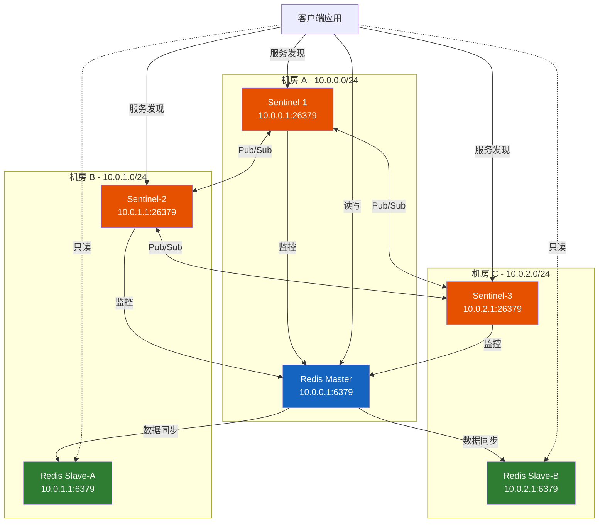
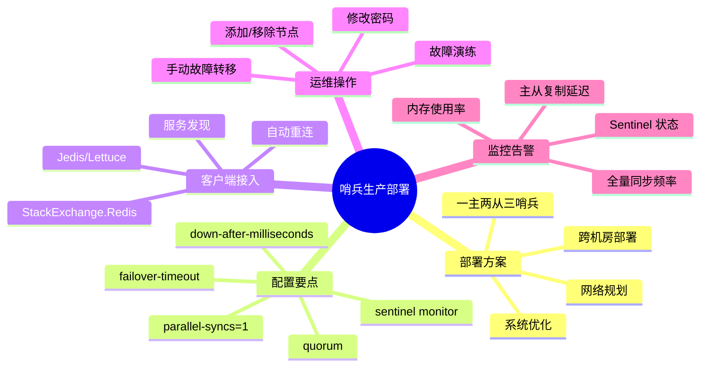

# 哨兵生产部署

> 理解了哨兵的原理和机制，接下来要回答一个更实际的问题：如何在生产环境中正确地部署和运维一套 Sentinel 高可用集群？从网络规划到配置调优，从部署脚本到故障演练，本文给出完整的生产级方案。

## 1. 部署方案概述

### 1.1 一主两从三哨兵方案

生产环境最经典的部署方案是**一主两从三哨兵**，这是在成本与可用性之间取得平衡的最佳实践：

```text
┌──────────────────────────────────────────────────────────────────┐
│                      生产部署拓扑                                  │
│                                                                    │
│  服务器 A (10.0.0.1)          服务器 B (10.0.0.2)               │
│  ┌────────────────────┐      ┌────────────────────┐             │
│  │  Redis Master:6379 │      │  Redis Slave:6379  │             │
│  │  Sentinel:26379    │      │  Sentinel:26379    │             │
│  └────────────────────┘      └────────────────────┘             │
│                                                                    │
│                  服务器 C (10.0.0.3)                               │
│                  ┌────────────────────┐                           │
│                  │  Redis Slave:6379  │                           │
│                  │  Sentinel:26379    │                           │
│                  └────────────────────┘                           │
│                                                                    │
│  容灾能力：                                                        │
│  - 任一服务器宕机 → 集群仍可用（剩余 2 哨兵可获多数票）          │
│  - 主节点宕机 → 自动故障转移（30 秒内完成）                      │
│  - 从节点宕机 → 不影响主节点写入                                  │
└──────────────────────────────────────────────────────────────────┘
```

### 1.2 部署方案对比

| 方案 | 节点数 | 容忍故障 | 成本 | 适用场景 |
|------|--------|---------|------|---------|
| 一主一从两哨兵 | 4 | 0 | 低 | 仅测试 |
| 一主两从三哨兵 | 6 | 1 | 中 | 标准生产 |
| 一主两从五哨兵 | 8 | 2 | 高 | 核心业务 |
| 两主四从六哨兵 | 12 | 2 | 高 | 双活/异地 |

::: important 为什么不在同一台机器上部署多个 Sentinel？
Sentinel 的核心价值是在主节点不可达时自动故障转移。如果多个 Sentinel 与主节点在同一台机器上，机器宕机会同时丢失主节点和多个 Sentinel，导致：
1. 剩余 Sentinel 不足多数票，无法触发故障转移
2. 即使触发，也无法连接到主节点确认状态

**铁律：每个 Sentinel 必须部署在独立的物理机/虚拟机上。**
:::

### 1.3 生产部署拓扑图



## 2. 网络规划

### 2.1 网络分区设计

```text
推荐网络架构（三机房部署）：

                ┌────────────────────┐
                │     内网交换机      │
                └─────┬──────┬───────┘
                      │      │
            ┌─────────┘      └─────────┐
            │                          │
    ┌───────▼───────┐         ┌────────▼──────┐
    │   机房 A      │         │   机房 B       │
    │  10.0.0.0/24  │◄───────►│  10.0.1.0/24  │
    │               │  专线   │                │
    │ Master:6379   │         │ Slave-A:6379   │
    │ Sentinel:26379│         │ Sentinel:26379 │
    └───────────────┘         └────────────────┘
            │
            │ 专线
            │
    ┌───────▼───────┐
    │   机房 C      │
    │  10.0.2.0/24  │
    │               │
    │ Slave-B:6379  │
    │ Sentinel:26379│
    └───────────────┘
```

### 2.2 网络要求

| 网络指标 | 要求 | 说明 |
|----------|------|------|
| 主从之间延迟 | < 1ms（同机房）/ < 5ms（跨机房） | 影响复制延迟 |
| Sentinel 与主节点 | < 5ms | 影响故障检测速度 |
| Sentinel 之间 | < 10ms | 影响 Raft 选举速度 |
| 带宽 | 主从之间 > 100Mbps | RDB 传输和命令传播 |
| 丢包率 | < 0.01% | 避免误判下线 |

### 2.3 防火墙规则

```bash
# 三台服务器之间开放以下端口

# Redis 主从通信
-A INPUT -s 10.0.0.0/8 -p tcp --dport 6379 -j ACCEPT
-A INPUT -s 10.0.0.0/8 -p tcp --dport 6380 -j ACCEPT

# Sentinel 通信
-A INPUT -s 10.0.0.0/8 -p tcp --dport 26379 -j ACCEPT

# Redis Cluster 总线端口（如果未来升级集群）
-A INPUT -s 10.0.0.0/8 -p tcp --dport 16379 -j ACCEPT

# 拒绝其他来源
-A INPUT -p tcp --dport 6379 -j DROP
-A INPUT -p tcp --dport 26379 -j DROP
```

## 3. 目录与文件规划

### 3.1 目录结构

```text
/opt/redis/
├── bin/                    # Redis 可执行文件
│   ├── redis-server
│   ├── redis-cli
│   ├── redis-sentinel
│   └── redis-benchmark
├── conf/                   # 配置文件
│   ├── redis.conf          # Redis 主配置
│   └── sentinel.conf       # Sentinel 配置
├── data/                   # 数据目录
│   ├── dump.rdb            # RDB 持久化文件
│   └── appendonly.aof      # AOF 持久化文件
├── logs/                   # 日志目录
│   ├── redis.log           # Redis 日志
│   └── sentinel.log        # Sentinel 日志
├── scripts/                # 运维脚本
│   ├── start.sh            # 启动脚本
│   ├── stop.sh             # 停止脚本
│   ├── health_check.sh     # 健康检查
│   └── failover_test.sh    # 故障演练
└── run/                    # PID 文件
    ├── redis.pid
    └── sentinel.pid
```

### 3.2 用户与权限

```bash
# 创建 Redis 专用用户
sudo useradd -r -s /sbin/nologin redis

# 设置目录权限
sudo chown -R redis:redis /opt/redis
sudo chmod 700 /opt/redis/conf
sudo chmod 750 /opt/redis/data
sudo chmod 755 /opt/redis/logs
sudo chmod 755 /opt/redis/scripts

# 配置文件权限（包含密码，需严格限制）
sudo chmod 600 /opt/redis/conf/redis.conf
sudo chmod 600 /opt/redis/conf/sentinel.conf
```

## 4. Redis 主从配置

### 4.1 主节点配置（10.0.0.1）

```bash
# ============================================
# Redis Master 配置 - 10.0.0.1:6379
# ============================================

# ---------- 基础配置 ----------
bind 0.0.0.0
port 6379
daemonize yes
pidfile /opt/redis/run/redis.pid
logfile /opt/redis/logs/redis.log
dir /opt/redis/data
databases 16

# ---------- 内存配置 ----------
maxmemory 4gb
maxmemory-policy allkeys-lru

# ---------- 持久化配置 ----------
save 900 1
save 300 10
save 60 10000
rdbcompression yes
rdbchecksum yes
dbfilename dump.rdb

appendonly yes
appendfilename "appendonly.aof"
appendfsync everysec
auto-aof-rewrite-percentage 100
auto-aof-rewrite-min-size 64mb

# ---------- 安全配置 ----------
requirepass YourStrongPassword123!
masterauth YourStrongPassword123!
rename-command FLUSHDB ""
rename-command FLUSHALL ""
rename-command DEBUG ""

# ---------- 复制配置 ----------
replica-serve-stale-data yes
replica-read-only yes
repl-diskless-sync no
repl-diskless-sync-delay 5
repl-disable-tcp-nodelay no
repl-backlog-size 256mb
repl-backlog-ttl 7200
replica-priority 100

# ---------- 防脑裂配置 ----------
min-replicas-to-write 1
min-replicas-max-lag 10

# ---------- 性能配置 ----------
tcp-backlog 511
timeout 300
tcp-keepalive 60
hz 10
dynamic-hz yes

# ---------- 慢查询 ----------
slowlog-log-slower-than 10000
slowlog-max-len 128

# ---------- 客户端输出缓冲区 ----------
client-output-buffer-limit normal 0 0 0
client-output-buffer-limit replica 256mb 64mb 60
client-output-buffer-limit pubsub 32mb 8mb 60
```

### 4.2 从节点配置（10.0.1.1 / 10.0.2.1）

```bash
# ============================================
# Redis Slave 配置 - 10.0.1.1:6379 / 10.0.2.1:6379
# ============================================

# ---------- 基础配置 ----------
bind 0.0.0.0
port 6379
daemonize yes
pidfile /opt/redis/run/redis.pid
logfile /opt/redis/logs/redis.log
dir /opt/redis/data
databases 16

# ---------- 复制配置 ----------
replicaof 10.0.0.1 6379            # 指向主节点
masterauth YourStrongPassword123!  # 主节点密码

# ---------- 内存配置 ----------
maxmemory 4gb
maxmemory-policy allkeys-lru

# ---------- 持久化配置 ----------
save 900 1
save 300 10
save 60 10000
rdbcompression yes
rdbchecksum yes
dbfilename dump.rdb

appendonly yes
appendfilename "appendonly.aof"
appendfsync everysec
auto-aof-rewrite-percentage 100
auto-aof-rewrite-min-size 64mb

# ---------- 安全配置 ----------
requirepass YourStrongPassword123!
masterauth YourStrongPassword123!
rename-command FLUSHDB ""
rename-command FLUSHALL ""
rename-command DEBUG ""

# ---------- 从节点特殊配置 ----------
replica-read-only yes
replica-priority 100             # Slave-A 设为 100，Slave-B 可设为 50 或 100

# ---------- 复制性能配置 ----------
repl-disable-tcp-nodelay no
repl-backlog-size 256mb

# ---------- 客户端输出缓冲区 ----------
client-output-buffer-limit normal 0 0 0
client-output-buffer-limit replica 256mb 64mb 60
client-output-buffer-limit pubsub 32mb 8mb 60
```

::: tip 从节点优先级设置建议
如果希望某个从节点在故障转移时优先被选为主节点，将其 `replica-priority` 设得更小：

```bash
# Slave-A (10.0.1.1) - 优先升级为主节点
replica-priority 50

# Slave-B (10.0.2.1) - 默认优先级
replica-priority 100
```

注意：两台从节点如果 `replica-priority` 相同，Sentinel 会选择复制偏移量最大的（数据最完整）。
:::

## 5. Sentinel 配置详解

### 5.1 Sentinel 配置文件（三台通用）

```bash
# ============================================
# Redis Sentinel 配置
# ============================================

# ---------- 基础配置 ----------
port 26379
daemonize yes
pidfile /opt/redis/run/sentinel.pid
logfile /opt/redis/logs/sentinel.log
dir /tmp

# ---------- 监控配置 ----------
# sentinel monitor <master-name> <ip> <port> <quorum>
sentinel monitor mymaster 10.0.0.1 6379 2

# ---------- 认证配置 ----------
sentinel auth-pass mymaster YourStrongPassword123!

# ---------- 下线判定 ----------
# sentinel down-after-milliseconds <master-name> <milliseconds>
sentinel down-after-milliseconds mymaster 30000

# ---------- 故障转移 ----------
# sentinel failover-timeout <master-name> <milliseconds>
sentinel failover-timeout mymaster 180000

# ---------- 并行同步 ----------
# sentinel parallel-syncs <master-name> <count>
sentinel parallel-syncs mymaster 1

# ---------- 通知脚本 ----------
# sentinel notification-script mymaster /opt/redis/scripts/notify.sh
# sentinel client-reconfig-script mymaster /opt/redis/scripts/reconfig.sh

# ---------- 日志级别 ----------
loglevel notice
```

### 5.2 配置参数详解

#### sentinel monitor

```bash
sentinel monitor mymaster 10.0.0.1 6379 2
```

| 参数 | 值 | 说明 |
|------|---|------|
| master-name | mymaster | 主节点名称，客户端通过此名称获取主节点地址 |
| ip | 10.0.0.1 | 主节点初始 IP（故障转移后自动更新） |
| port | 6379 | 主节点端口 |
| quorum | 2 | 判定客观下线需要的哨兵同意数 |

::: important quorum 的生产配置建议
- **3 哨兵**：quorum=2（推荐）
- **5 哨兵**：quorum=3
- **7 哨兵**：quorum=4

规则：quorum = N/2 + 1（向上取整），其中 N 为哨兵总数。但 quorum 不应超过 N-1，否则 1 个哨兵故障就无法达成客观下线。
:::

#### sentinel down-after-milliseconds

```bash
sentinel down-after-milliseconds mymaster 30000
```

**不同场景的推荐值**：

| 场景 | 推荐值 | 理由 |
|------|--------|------|
| 同机房低延迟 | 10000（10秒） | 网络稳定，误判概率低 |
| 跨机房部署 | 30000（30秒） | 网络波动可能较大 |
| 跨地域部署 | 60000（60秒） | 网络延迟大，需更多容错 |

#### sentinel failover-timeout

```bash
sentinel failover-timeout mymaster 180000
```

**含义**：
1. 同一个 Sentinel 对同一主节点的两次故障转移间隔至少 failover-timeout
2. 从节点升级为主节点后，如果超过 failover-timeout 仍未完成同步，视为失败
3. 默认 180 秒（3 分钟）

#### sentinel parallel-syncs

```bash
sentinel parallel-syncs mymaster 1
```

**必须设为 1**：

```text
parallel-syncs = 1 时：
  t0: Slave-A 升级为主节点
  t1: Slave-B 开始从 Slave-A 全量同步
  t2: Slave-B 同步完成

parallel-syncs = 2 时（如果有2个从节点）：
  t0: Slave-A 升级为主节点
  t1: Slave-B 和 Slave-C 同时开始全量同步
      → Slave-A 同时执行 2 次 bgsave！
      → 内存可能翻倍！
      → 新主节点可能 OOM！
```

### 5.3 Sentinel 运行时自动生成的配置

Sentinel 启动后会在配置文件末尾自动追加运行时状态：

```bash
# sentinel.conf 运行时自动追加的配置

# 主节点信息
sentinel leader-epoch mymaster 1

# 已发现的从节点
sentinel known-replica mymaster 10.0.1.1 6379
sentinel known-replica mymaster 10.0.2.1 6379

# 已发现的其他哨兵
sentinel known-sentinel mymaster 10.0.1.1 26379 abc123def456
sentinel known-sentinel mymaster 10.0.2.1 26379 789ghi012jkl

# 当前纪元
sentinel current-epoch 1
```

::: warning 不要手动修改 Sentinel 自动生成的配置
Sentinel 会在运行时自动维护这些配置。如果手动修改，可能导致 Sentinel 状态不一致。如果需要重置，使用 `SENTINEL reset` 命令。
:::

## 6. 系统优化

### 6.1 内核参数优化

```bash
# /etc/sysctl.conf 或 /etc/sysctl.d/99-redis.conf

# ---------- 网络优化 ----------

# TCP 连接队列大小
net.core.somaxconn = 65535

# TCP 读/写缓冲区
net.core.rmem_max = 16777216
net.core.wmem_max = 16777216
net.ipv4.tcp_rmem = 4096 87380 16777216
net.ipv4.tcp_wmem = 4096 65536 16777216

# TCP 保持连接
net.ipv4.tcp_keepalive_time = 60
net.ipv4.tcp_keepalive_intvl = 10
net.ipv4.tcp_keepalive_probes = 6

# ---------- 内存优化 ----------

# 允许过度分配内存（fork 需要）
vm.overcommit_memory = 1

# ---------- 文件描述符 ----------
# 增大最大文件描述符数
fs.file-max = 1000000

# 应用配置
sudo sysctl -p
```

### 6.2 资源限制

```bash
# /etc/security/limits.d/redis.conf

# Redis 用户资源限制
redis soft nofile 65535
redis hard nofile 65535
redis soft nproc 4096
redis hard nproc 4096
redis soft core unlimited
redis hard core unlimited
```

### 6.3 Transparent Huge Pages

```bash
# 关闭 Transparent Huge Pages（THP）
# THP 会导致 Redis fork 延迟和内存使用增加

# 临时关闭
echo never > /sys/kernel/mm/transparent_hugepage/enabled

# 永久关闭（添加到 /etc/rc.local）
if test -f /sys/kernel/mm/transparent_hugepage/enabled; then
    echo never > /sys/kernel/mm/transparent_hugepage/enabled
fi

# 检查状态
cat /sys/kernel/mm/transparent_hugepage/enabled
# 期望输出：always madvise [never]
```

## 7. 部署脚本

### 7.1 一键部署脚本

```bash
#!/bin/bash
# deploy_redis_sentinel.sh
# 一主两从三哨兵一键部署脚本
# 用法: ./deploy_redis_sentinel.sh [master|slave-a|slave-b]

set -euo pipefail

# ============================================
# 配置变量
# ============================================
REDIS_VERSION="7.2.4"
REDIS_USER="redis"
REDIS_BASE_DIR="/opt/redis"
REDIS_CONF_DIR="${REDIS_BASE_DIR}/conf"
REDIS_DATA_DIR="${REDIS_BASE_DIR}/data"
REDIS_LOG_DIR="${REDIS_BASE_DIR}/logs"
REDIS_RUN_DIR="${REDIS_BASE_DIR}/run"
REDIS_SCRIPTS_DIR="${REDIS_BASE_DIR}/scripts"

# 节点 IP
MASTER_IP="10.0.0.1"
SLAVE_A_IP="10.0.1.1"
SLAVE_B_IP="10.0.2.1"
REDIS_PORT=6379
SENTINEL_PORT=26379

# 密码
REDIS_PASSWORD="YourStrongPassword123!"

# Sentinel 参数
MASTER_NAME="mymaster"
QUORUM=2
DOWN_AFTER=30000
FAILOVER_TIMEOUT=180000
PARALLEL_SYNCS=1

# ============================================
# 函数定义
# ============================================

create_directories() {
    echo "创建目录结构..."
    mkdir -p "${REDIS_CONF_DIR}" "${REDIS_DATA_DIR}" "${REDIS_LOG_DIR}" \
             "${REDIS_RUN_DIR}" "${REDIS_SCRIPTS_DIR}"
}

create_redis_user() {
    echo "创建 Redis 用户..."
    if ! id -u ${REDIS_USER} > /dev/null 2>&1; then
        useradd -r -s /sbin/nologin ${REDIS_USER}
    fi
}

generate_master_config() {
    echo "生成主节点配置..."
    cat > "${REDIS_CONF_DIR}/redis.conf" << REDIS_CONF
bind 0.0.0.0
port ${REDIS_PORT}
daemonize yes
pidfile ${REDIS_RUN_DIR}/redis.pid
logfile ${REDIS_LOG_DIR}/redis.log
dir ${REDIS_DATA_DIR}

requirepass ${REDIS_PASSWORD}
masterauth ${REDIS_PASSWORD}

maxmemory 4gb
maxmemory-policy allkeys-lru

save 900 1
save 300 10
save 60 10000
rdbcompression yes
dbfilename dump.rdb

appendonly yes
appendfilename "appendonly.aof"
appendfsync everysec

replica-serve-stale-data yes
replica-read-only yes
repl-backlog-size 256mb
repl-disable-tcp-nodelay no

min-replicas-to-write 1
min-replicas-max-lag 10

slowlog-log-slower-than 10000
slowlog-max-len 128

client-output-buffer-limit replica 256mb 64mb 60
REDIS_CONF
}

generate_slave_config() {
    local slave_ip=$1
    local priority=$2
    echo "生成从节点配置 (${slave_ip})..."
    cat > "${REDIS_CONF_DIR}/redis.conf" << REDIS_CONF
bind 0.0.0.0
port ${REDIS_PORT}
daemonize yes
pidfile ${REDIS_RUN_DIR}/redis.pid
logfile ${REDIS_LOG_DIR}/redis.log
dir ${REDIS_DATA_DIR}

replicaof ${MASTER_IP} ${REDIS_PORT}
masterauth ${REDIS_PASSWORD}
requirepass ${REDIS_PASSWORD}

maxmemory 4gb
maxmemory-policy allkeys-lru

save 900 1
save 300 10
save 60 10000
rdbcompression yes
dbfilename dump.rdb

appendonly yes
appendfilename "appendonly.aof"
appendfsync everysec

replica-read-only yes
replica-priority ${priority}
repl-backlog-size 256mb
repl-disable-tcp-nodelay no

client-output-buffer-limit replica 256mb 64mb 60
REDIS_CONF
}

generate_sentinel_config() {
    echo "生成 Sentinel 配置..."
    cat > "${REDIS_CONF_DIR}/sentinel.conf" << SENTINEL_CONF
port ${SENTINEL_PORT}
daemonize yes
pidfile ${REDIS_RUN_DIR}/sentinel.pid
logfile ${REDIS_LOG_DIR}/sentinel.log
dir /tmp

sentinel monitor ${MASTER_NAME} ${MASTER_IP} ${REDIS_PORT} ${QUORUM}
sentinel auth-pass ${MASTER_NAME} ${REDIS_PASSWORD}
sentinel down-after-milliseconds ${MASTER_NAME} ${DOWN_AFTER}
sentinel failover-timeout ${MASTER_NAME} ${FAILOVER_TIMEOUT}
sentinel parallel-syncs ${MASTER_NAME} ${PARALLEL_SYNCS}

loglevel notice
SENTINEL_CONF
}

set_permissions() {
    echo "设置权限..."
    chown -R ${REDIS_USER}:${REDIS_USER} ${REDIS_BASE_DIR}
    chmod 600 "${REDIS_CONF_DIR}/redis.conf"
    chmod 600 "${REDIS_CONF_DIR}/sentinel.conf"
}

# ============================================
# 主逻辑
# ============================================

ROLE=${1:-""}

if [ -z "$ROLE" ]; then
    echo "用法: $0 [master|slave-a|slave-b]"
    exit 1
fi

create_directories
create_redis_user

case $ROLE in
    master)
        generate_master_config
        ;;
    slave-a)
        generate_slave_config ${SLAVE_A_IP} 50
        ;;
    slave-b)
        generate_slave_config ${SLAVE_B_IP} 100
        ;;
    *)
        echo "未知角色: $ROLE"
        echo "可选: master, slave-a, slave-b"
        exit 1
        ;;
esac

generate_sentinel_config
set_permissions

echo "========================================="
echo "配置文件已生成:"
echo "  Redis:    ${REDIS_CONF_DIR}/redis.conf"
echo "  Sentinel: ${REDIS_CONF_DIR}/sentinel.conf"
echo ""
echo "启动命令:"
echo "  Redis:    sudo -u redis redis-server ${REDIS_CONF_DIR}/redis.conf"
echo "  Sentinel: sudo -u redis redis-sentinel ${REDIS_CONF_DIR}/sentinel.conf"
echo "========================================="
```

### 7.2 启停脚本

```bash
#!/bin/bash
# start.sh - 启动 Redis 和 Sentinel

REDIS_CONF="/opt/redis/conf/redis.conf"
SENTINEL_CONF="/opt/redis/conf/sentinel.conf"
REDIS_USER="redis"

echo "启动 Redis..."
sudo -u ${REDIS_USER} redis-server ${REDIS_CONF}
sleep 2

echo "检查 Redis 状态..."
redis-cli -a YourStrongPassword123! PING 2>/dev/null
if [ $? -eq 0 ]; then
    echo "[OK] Redis 启动成功"
else
    echo "[FAIL] Redis 启动失败"
    exit 1
fi

echo "启动 Sentinel..."
sudo -u ${REDIS_USER} redis-sentinel ${SENTINEL_CONF}
sleep 2

echo "检查 Sentinel 状态..."
redis-cli -p 26379 PING
if [ $? -eq 0 ]; then
    echo "[OK] Sentinel 启动成功"
else
    echo "[FAIL] Sentinel 启动失败"
    exit 1
fi

echo "========================================="
echo "所有服务已启动"
echo "========================================="
```

```bash
#!/bin/bash
# stop.sh - 停止 Redis 和 Sentinel

REDIS_USER="redis"

echo "停止 Sentinel..."
redis-cli -p 26379 SHUTDOWN NOSAVE 2>/dev/null || true
sleep 2

echo "停止 Redis..."
redis-cli -a YourStrongPassword123! SHUTDOWN NOSAVE 2>/dev/null || true
sleep 2

echo "检查进程..."
REDIS_PID=$(pgrep -u ${REDIS_USER} redis-server 2>/dev/null || echo "")
SENTINEL_PID=$(pgrep -u ${REDIS_USER} redis-sentinel 2>/dev/null || echo "")

if [ -z "$REDIS_PID" ] && [ -z "$SENTINEL_PID" ]; then
    echo "[OK] 所有服务已停止"
else
    echo "[WARNING] 仍有进程运行:"
    [ -n "$REDIS_PID" ] && echo "  Redis PID: $REDIS_PID"
    [ -n "$SENTINEL_PID" ] && echo "  Sentinel PID: $SENTINEL_PID"
    echo "  使用 kill -9 强制终止"
fi
```

### 7.3 systemd 服务配置

```ini
# /etc/systemd/system/redis.service
[Unit]
Description=Redis In-Memory Data Store
After=network.target

[Service]
Type=forking
User=redis
Group=redis
ExecStart=/opt/redis/bin/redis-server /opt/redis/conf/redis.conf
ExecStop=/opt/redis/bin/redis-cli -a YourStrongPassword123! SHUTDOWN NOSAVE
Restart=always
RestartSec=5
LimitNOFILE=65535

# 安全加固
NoNewPrivileges=yes
PrivateTmp=yes
ProtectSystem=strict
ReadWritePaths=/opt/redis/data /opt/redis/logs /opt/redis/run

[Install]
WantedBy=multi-user.target
```

```ini
# /etc/systemd/system/redis-sentinel.service
[Unit]
Description=Redis Sentinel
After=network.target redis.service
Requires=redis.service

[Service]
Type=forking
User=redis
Group=redis
ExecStart=/opt/redis/bin/redis-sentinel /opt/redis/conf/sentinel.conf
ExecStop=/opt/redis/bin/redis-cli -p 26379 SHUTDOWN NOSAVE
Restart=always
RestartSec=5
LimitNOFILE=65535

# 安全加固
NoNewPrivileges=yes
PrivateTmp=yes
ProtectSystem=strict
ReadWritePaths=/opt/redis/logs /opt/redis/run /tmp

[Install]
WantedBy=multi-user.target
```

```bash
# 启用服务
sudo systemctl daemon-reload
sudo systemctl enable redis
sudo systemctl enable redis-sentinel

# 启动服务
sudo systemctl start redis
sudo systemctl start redis-sentinel

# 查看状态
sudo systemctl status redis
sudo systemctl status redis-sentinel
```

## 8. 客户端连接

### 8.1 StackExchange.Redis 哨兵模式

StackExchange.Redis 是 .NET 平台最主流的 Redis 客户端，原生支持 Sentinel：

```csharp
using StackExchange.Redis;
using System;

public class RedisSentinelFactory
{
    private static readonly Lazy<ConnectionMultiplexer> LazyConnection;

    static RedisSentinelFactory()
    {
        var config = new ConfigurationOptions
        {
            ServiceName = "mymaster",          // Sentinel 监控的主节点名称
            AbortOnConnectFail = false,         // 初始连接失败不抛异常
            ConnectRetry = 3,                   // 连接重试次数
            ConnectTimeout = 5000,              // 连接超时（毫秒）
            SyncTimeout = 3000,                 // 同步操作超时
            AsyncTimeout = 5000,                // 异步操作超时
            KeepAlive = 60,                     // TCP KeepAlive 间隔
            DefaultDatabase = 0,                // 默认数据库
            Password = "YourStrongPassword123!",// 密码
            TieBreaker = "",                    // 平局决胜键（设为空使用默认）
            ConfigCheckSeconds = 60,            // 配置检查间隔
        };

        // 添加所有 Sentinel 地址
        config.EndPoints.Add("10.0.0.1", 26379);
        config.EndPoints.Add("10.0.1.1", 26379);
        config.EndPoints.Add("10.0.2.1", 26379);

        LazyConnection = new Lazy<ConnectionMultiplexer>(
            () => ConnectionMultiplexer.Connect(config)
        );
    }

    public static ConnectionMultiplexer Connection => LazyConnection.Value;

    public static IDatabase GetDatabase(int db = -1)
    {
        return Connection.GetDatabase(db);
    }
}
```

### 8.2 读写分离配置

```csharp
using StackExchange.Redis;

public class RedisSentinelService
{
    private readonly ConnectionMultiplexer _connection;

    public RedisSentinelService()
    {
        _connection = RedisSentinelFactory.Connection;
    }

    /// <summary>
    /// 写操作 - 自动路由到主节点
    /// </summary>
    public async Task<bool> SetAsync(string key, string value, TimeSpan? expiry = null)
    {
        var db = _connection.GetDatabase();
        return await db.StringSetAsync(key, value, expiry);
    }

    /// <summary>
    /// 读操作 - 优先从从节点读取
    /// </summary>
    public async Task<string> GetAsync(string key)
    {
        var db = _connection.GetDatabase();
        return await db.StringGetAsync(key, CommandFlags.DemandReplica);
    }

    /// <summary>
    /// 读操作 - 强制从主节点读取（强一致性场景）
    /// </summary>
    public async Task<string> GetFromMasterAsync(string key)
    {
        var db = _connection.GetDatabase();
        return await db.StringGetAsync(key, CommandFlags.DemandMaster);
    }

    /// <summary>
    /// 获取当前主节点信息
    /// </summary>
    public void PrintTopology()
    {
        Console.WriteLine("=== Redis Sentinel 拓扑 ===");
        var endpoints = _connection.GetEndPoints();
        foreach (var endpoint in endpoints)
        {
            var server = _connection.GetServer(endpoint);
            Console.WriteLine($"  {endpoint}: " +
                $"IsMaster={server.IsReplica == false}, " +
                $"IsConnected={server.IsConnected}");
        }
    }
}
```

### 8.3 故障转移后的自动重连

StackExchange.Redis 内置了 Sentinel 事件订阅，故障转移后自动重连：

```csharp
using StackExchange.Redis;

public class SentinelEventHandler
{
    private readonly ConnectionMultiplexer _connection;

    public SentinelEventHandler(ConnectionMultiplexer connection)
    {
        _connection = connection;

        // 订阅 Sentinel 事件
        _connection.ConfigurationChanged += OnConfigurationChanged;
        _connection.ConfigurationChangedBroadcast += OnConfigurationChangedBroadcast;
        _connection.ConnectionFailed += OnConnectionFailed;
        _connection.ConnectionRestored += OnConnectionRestored;
        _connection.ErrorMessage += OnErrorMessage;
    }

    /// <summary>
    /// 配置变更事件（主节点切换时触发）
    /// </summary>
    private void OnConfigurationChanged(object sender, EndPointEventArgs e)
    {
        Console.WriteLine($"[配置变更] 端点变更: {e.EndPoint}");
        // StackExchange.Redis 会自动重新连接新主节点
        // 无需手动处理
    }

    /// <summary>
    /// 配置变更广播
    /// </summary>
    private void OnConfigurationChangedBroadcast(object sender, EndPointEventArgs e)
    {
        Console.WriteLine($"[配置广播] 端点变更: {e.EndPoint}");
    }

    /// <summary>
    /// 连接失败事件
    /// </summary>
    private void OnConnectionFailed(object sender, ConnectionFailedEventArgs e)
    {
        Console.WriteLine($"[连接失败] 端点: {e.EndPoint}, " +
            $"类型: {e.ConnectionType}, 原因: {e.FailureType}");
        // 可以在此记录日志、发送告警
    }

    /// <summary>
    /// 连接恢复事件
    /// </summary>
    private void OnConnectionRestored(object sender, ConnectionFailedEventArgs e)
    {
        Console.WriteLine($"[连接恢复] 端点: {e.EndPoint}, 类型: {e.ConnectionType}");
    }

    /// <summary>
    /// 错误事件
    /// </summary>
    private void OnErrorMessage(object sender, RedisErrorEventArgs e)
    {
        Console.WriteLine($"[错误] 端点: {e.EndPoint}, 消息: {e.Message}");
    }
}
```

### 8.4 ASP.NET Core 集成

```csharp
// Program.cs / Startup.cs
using StackExchange.Redis;

var builder = WebApplication.CreateBuilder(args);

// 注册 Redis Sentinel 连接为单例
builder.Services.AddSingleton<IConnectionMultiplexer>(sp =>
{
    var config = new ConfigurationOptions
    {
        ServiceName = "mymaster",
        AbortOnConnectFail = false,
        ConnectRetry = 3,
        ConnectTimeout = 5000,
        Password = builder.Configuration["Redis:Password"],
    };

    var sentinelEndpoints = builder.Configuration
        .GetSection("Redis:SentinelEndpoints")
        .Get<string[]>();

    foreach (var endpoint in sentinelEndpoints)
    {
        var parts = endpoint.Split(':');
        config.EndPoints.Add(parts[0], int.Parse(parts[1]));
    }

    return ConnectionMultiplexer.Connect(config);
});

// 注册 Redis 服务
builder.Services.AddSingleton<IRedisService, RedisSentinelService>();

var app = builder.Build();
```

```json
// appsettings.json
{
    "Redis": {
        "Password": "YourStrongPassword123!",
        "SentinelEndpoints": [
            "10.0.0.1:26379",
            "10.0.1.1:26379",
            "10.0.2.1:26379"
        ]
    }
}
```

### 8.5 Java 客户端（Jedis + Lettuce）

#### Jedis Sentinel 模式

```java
import redis.clients.jedis.Jedis;
import redis.clients.jedis.JedisSentinelPool;
import redis.clients.jedis.JedisPoolConfig;
import java.util.HashSet;
import java.util.Set;

public class JedisSentinelExample {
    public static void main(String[] args) {
        Set<String> sentinels = new HashSet<>();
        sentinels.add("10.0.0.1:26379");
        sentinels.add("10.0.1.1:26379");
        sentinels.add("10.0.2.1:26379");

        JedisPoolConfig poolConfig = new JedisPoolConfig();
        poolConfig.setMaxTotal(100);
        poolConfig.setMaxIdle(20);
        poolConfig.setMinIdle(5);
        poolConfig.setTestOnBorrow(true);
        poolConfig.setTestWhileIdle(true);

        JedisSentinelPool pool = new JedisSentinelPool(
            "mymaster",       // 主节点名称
            sentinels,        // Sentinel 地址
            poolConfig,       // 连接池配置
            30000,            // 超时（毫秒）
            "YourStrongPassword123!",  // 密码
            0                 // 数据库编号
        );

        try (Jedis jedis = pool.getResource()) {
            jedis.set("key", "value");
            String value = jedis.get("key");
            System.out.println("value = " + value);
        }

        pool.close();
    }
}
```

#### Lettuce Sentinel 模式

```java
import io.lettuce.core.RedisClient;
import io.lettuce.core.RedisURI;
import io.lettuce.core.api.StatefulRedisConnection;
import io.lettuce.core.sentinel.api.StatefulRedisSentinelConnection;
import io.lettuce.core.sentinel.api.RedisSentinelCommands;
import java.util.Arrays;

public class LettuceSentinelExample {
    public static void main(String[] args) {
        // 创建 Sentinel URI
        RedisURI sentinelUri1 = RedisURI.create("10.0.0.1", 26379);
        RedisURI sentinelUri2 = RedisURI.create("10.0.1.1", 26379);
        RedisURI sentinelUri3 = RedisURI.create("10.0.2.1", 26379);
        sentinelUri1.setPassword("YourStrongPassword123!");
        sentinelUri2.setPassword("YourStrongPassword123!");
        sentinelUri3.setPassword("YourStrongPassword123!");

        // 使用 Sentinel 连接
        RedisClient client = RedisClient.create();
        try (StatefulRedisSentinelConnection<String, String> sentinelConnection =
             client.connectSentinel(sentinelUri1)) {

            RedisSentinelCommands<String, String> sentinel = sentinelConnection.sync();

            // 获取主节点地址
            String masterAddr = sentinel.getMasterAddrByName("mymaster");
            System.out.println("Current master: " + masterAddr);
        }

        client.shutdown();
    }
}
```

## 9. 运维操作

### 9.1 手动故障转移

在某些场景下，需要手动触发故障转移（如主节点需要停机维护）：

```bash
# 方式一：通过 Sentinel 命令
redis-cli -p 26379 SENTINEL failover mymaster

# 方式二：通过指定从节点升级
redis-cli -p 26379 SENTINEL failover mymaster

# 查看故障转移状态
redis-cli -p 26379 SENTINEL master mymaster
```

**手动故障转移的流程**：

```text
1. Sentinel 收到 failover 命令
2. 选择优先级最高的从节点
3. 向选中从节点发送 SLAVEOF NO ONE
4. 等待新主节点就绪
5. 重新配置其他从节点
6. 更新 Sentinel 配置
7. 通知客户端

整个过程约 10~30 秒
```

::: tip 计划维护的手动故障转移
在做主节点计划维护时，应先手动故障转移，再停机维护：

```bash
# 1. 手动触发故障转移
redis-cli -p 26379 SENTINEL failover mymaster

# 2. 等待故障转移完成（检查新主节点）
redis-cli -p 26379 SENTINEL get-master-addr-by-name mymaster

# 3. 确认新主节点正常
redis-cli -h <new-master-ip> -p 6379 -a YourStrongPassword123! INFO replication

# 4. 安全停机旧主节点
redis-cli -h <old-master-ip> -p 6379 -a YourStrongPassword123! SHUTDOWN NOSAVE

# 5. 旧主节点恢复后自动成为新主节点的从节点
```
:::

### 9.2 添加从节点

```text
添加新从节点到现有 Sentinel 集群：

初始状态：
  Master(10.0.0.1) ← Slave-A(10.0.1.1) ← Slave-B(10.0.2.1)

添加 Slave-C(10.0.3.1) 后：
  Master(10.0.0.1) ← Slave-A(10.0.1.1)
                   ← Slave-B(10.0.2.1)
                   ← Slave-C(10.0.3.1)  ← 新增
```

**操作步骤**：

```bash
# 步骤一：在新机器上配置 Redis 从节点
# redis.conf
replicaof 10.0.0.1 6379
masterauth YourStrongPassword123!
requirepass YourStrongPassword123!
replica-read-only yes
replica-priority 100

# 步骤二：启动从节点
redis-server /opt/redis/conf/redis.conf

# 步骤三：Sentinel 自动发现新从节点
# Sentinel 通过主节点的 INFO replication 自动发现
# 无需手动配置 Sentinel

# 步骤四：验证
redis-cli -p 26379 SENTINEL slaves mymaster | grep -E "(ip|port|flags)"
```

::: important Sentinel 自动发现机制
Sentinel 通过每 10 秒向主节点发送 `INFO replication` 命令来自动发现新从节点。因此添加从节点后，**无需修改 Sentinel 配置**，Sentinel 会在最多 10 秒内发现新从节点。
:::

### 9.3 添加 Sentinel 节点

```bash
# 步骤一：在新机器上配置 Sentinel
# sentinel.conf
port 26379
sentinel monitor mymaster 10.0.0.1 6379 2
sentinel auth-pass mymaster YourStrongPassword123!
sentinel down-after-milliseconds mymaster 30000
sentinel failover-timeout mymaster 180000
sentinel parallel-syncs mymaster 1

# 步骤二：启动新 Sentinel
redis-sentinel /opt/redis/conf/sentinel.conf

# 步骤三：验证
# 新 Sentinel 通过 Pub/Sub 自动发现其他 Sentinel
redis-cli -p 26379 SENTINEL sentinels mymaster
```

### 9.4 移除从节点

```bash
# 步骤一：在要移除的从节点上取消复制
redis-cli -h 10.0.3.1 -p 6379 -a YourStrongPassword123! REPLICAOF NO ONE

# 步骤二：停止从节点
redis-cli -h 10.0.3.1 -p 6379 -a YourStrongPassword123! SHUTDOWN NOSAVE

# 步骤三：重置 Sentinel 对该从节点的记录
# Sentinel 会自动在一段时间后清理离线从节点的记录
# 也可以手动重置
redis-cli -p 26379 SENTINEL reset mymaster
```

### 9.5 移除 Sentinel 节点

```bash
# 步骤一：停止要移除的 Sentinel
redis-cli -h 10.0.3.1 -p 26379 SHUTDOWN NOSAVE

# 步骤二：在其他 Sentinel 上移除记录
# 方法1：自动清理（需要等待一段时间）
# 方法2：手动重置
redis-cli -p 26379 SENTINEL reset mymaster

# 步骤三：验证
redis-cli -p 26379 SENTINEL sentinels mymaster
```

### 9.6 修改主节点密码

```bash
# 修改主节点密码需要同步修改所有节点

# 步骤一：修改主节点密码
redis-cli -h 10.0.0.1 -p 6379 -a OldPassword CONFIG SET requirepass NewPassword
redis-cli -h 10.0.0.1 -p 6379 -a NewPassword CONFIG REWRITE

# 步骤二：修改从节点的 masterauth
redis-cli -h 10.0.1.1 -p 6379 -a OldPassword CONFIG SET masterauth NewPassword
redis-cli -h 10.0.1.1 -p 6379 -a OldPassword CONFIG SET requirepass NewPassword
redis-cli -h 10.0.1.1 -p 6379 -a NewPassword CONFIG REWRITE

redis-cli -h 10.0.2.1 -p 6379 -a OldPassword CONFIG SET masterauth NewPassword
redis-cli -h 10.0.2.1 -p 6379 -a OldPassword CONFIG SET requirepass NewPassword
redis-cli -h 10.0.2.1 -p 6379 -a NewPassword CONFIG REWRITE

# 步骤三：修改 Sentinel 的 auth-pass
redis-cli -p 26379 SENTINEL set mymaster auth-pass NewPassword

# 步骤四：验证
redis-cli -p 26379 SENTINEL master mymaster
```

## 10. 监控指标

### 10.1 Redis 主从监控指标

```text
┌──────────────────────────────────────────────────────────────┐
│                    Redis 监控指标体系                          │
├──────────────────────────────────────────────────────────────┤
│                                                                │
│  主节点核心指标：                                              │
│  ├── connected_slaves          在线从节点数                   │
│  ├── master_repl_offset        主节点复制偏移量              │
│  ├── repl_backlog_size         复制积压缓冲区大小            │
│  ├── repl_backlog_histlen      缓冲区有效数据长度            │
│  ├── used_memory               已使用内存                    │
│  ├── used_memory_peak          内存使用峰值                  │
│  ├── instantaneous_ops_per_sec 每秒操作数                    │
│  ├── keyspace_hits             命中次数                      │
│  ├── keyspace_misses           未命中次数                    │
│  └── expired_keys              过期 key 数量                 │
│                                                                │
│  从节点核心指标：                                              │
│  ├── master_link_status        连接状态 (up/down)            │
│  ├── master_last_io_seconds    最后通信时间                  │
│  ├── slave_repl_offset        从节点复制偏移量              │
│  ├── master_sync_in_progress  是否正在全量同步              │
│  └── master_sync_left_bytes   全量同步剩余字节数            │
│                                                                │
│  告警规则：                                                    │
│  ├── master_link_status = down                → 严重告警     │
│  ├── connected_slaves < 预期值                 → 警告         │
│  ├── master_last_io_seconds > 30              → 警告         │
│  ├── 主从 offset 差异 > 10000                 → 警告         │
│  └── 全量同步频繁（> 1次/小时）               → 警告         │
│                                                                │
└──────────────────────────────────────────────────────────────┘
```

### 10.2 Sentinel 监控指标

```text
Sentinel 核心指标：

1. sentinel_tilt                    TILT 模式状态
2. sentinel_running_scripts         运行中脚本数
3. master flags                     主节点标志
4. num-slaves                       从节点数量
5. num-other-sentinels              其他哨兵数量
6. current-epoch                    当前纪元
7. info-refresh-last                最后 INFO 时间

告警规则：
├── sentinel_tilt = 1               → 严重告警
├── num-other-sentinels < 2         → 警告
├── master flags 包含 s_down        → 警告
├── master flags 包含 o_down        → 严重告警
└── num-slaves < 预期值             → 警告
```

### 10.3 Prometheus + Grafana 监控

```yaml
# prometheus.yml
scrape_configs:
  - job_name: 'redis-master'
    static_configs:
      - targets: ['10.0.0.1:9121']
        labels:
          role: 'master'
          instance: 'redis-master-01'

  - job_name: 'redis-slave-a'
    static_configs:
      - targets: ['10.0.1.1:9121']
        labels:
          role: 'slave'
          instance: 'redis-slave-a'

  - job_name: 'redis-slave-b'
    static_configs:
      - targets: ['10.0.2.1:9121']
        labels:
          role: 'slave'
          instance: 'redis-slave-b'
```

```yaml
# Prometheus 告警规则
groups:
  - name: redis_sentinel
    rules:
      - alert: RedisMasterDown
        expr: redis_master_up == 0
        for: 30s
        labels:
          severity: critical
        annotations:
          summary: "Redis master is down"
          description: "Redis master {{ $labels.instance }} is down"

      - alert: RedisReplicationLag
        expr: redis_replication_offset_diff > 10000
        for: 1m
        labels:
          severity: warning
        annotations:
          summary: "Redis replication lag is high"
          description: "Replication offset diff is {{ $value }}"

      - alert: RedisSlaveDisconnected
        expr: redis_connected_slaves < 2
        for: 1m
        labels:
          severity: warning
        annotations:
          summary: "Redis has fewer connected slaves than expected"

      - alert: RedisSentinelTilt
        expr: redis_sentinel_tilt == 1
        for: 0m
        labels:
          severity: critical
        annotations:
          summary: "Redis Sentinel is in TILT mode"

      - alert: RedisFullSyncInProgress
        expr: redis_master_sync_in_progress == 1
        for: 5m
        labels:
          severity: warning
        annotations:
          summary: "Redis full sync has been in progress for over 5 minutes"
```

### 10.4 健康检查脚本

```bash
#!/bin/bash
# health_check.sh - 全面健康检查脚本
# 每 1 分钟执行一次（crontab）

MASTER_NAME="mymaster"
ALERT_WEBHOOK="https://hooks.example.com/alert"

# 检查项 1：主节点状态
check_master() {
    local sentinel_hosts=("10.0.0.1:26379" "10.0.1.1:26379" "10.0.2.1:26379")

    for sh in "${sentinel_hosts[@]}"; do
        local host=$(echo $sh | cut -d: -f1)
        local port=$(echo $sh | cut -d: -f2)

        local master_info=$(redis-cli -h $host -p $port \
            SENTINEL master $MASTER_NAME 2>/dev/null)

        local flags=$(echo "$master_info" | grep -A1 "flags" | tail -1 | tr -d '\r')
        local num_slaves=$(echo "$master_info" | grep -A1 "num-slaves" | tail -1 | tr -d '\r')
        local num_sentinels=$(echo "$master_info" | grep -A1 "num-other-sentinels" | tail -1 | tr -d '\r')

        echo "[Sentinel $sh]"
        echo "  主节点标志: $flags"
        echo "  从节点数量: $num_slaves"
        echo "  其他哨兵数: $num_sentinels"

        # 告警逻辑
        if [[ "$flags" == *"o_down"* ]]; then
            echo "  [严重] 主节点客观下线!"
            # 发送告警
        fi

        if [[ "$flags" == *"s_down"* ]]; then
            echo "  [警告] 主节点主观下线!"
        fi

        if [ "$num_slaves" -lt 2 ]; then
            echo "  [警告] 从节点数量不足! 当前: $num_slaves, 预期: 2"
        fi

        if [ "$num_sentinels" -lt 2 ]; then
            echo "  [警告] 哨兵数量不足! 当前: $num_sentinels, 预期: 2"
        fi
    done
}

# 检查项 2：主从复制延迟
check_replication_lag() {
    local master_host=$(redis-cli -p 26379 SENTINEL get-master-addr-by-name $MASTER_NAME 2>/dev/null | head -1)
    local master_port=$(redis-cli -p 26379 SENTINEL get-master-addr-by-name $MASTER_NAME 2>/dev/null | tail -1)

    if [ -z "$master_host" ]; then
        echo "[严重] 无法获取主节点地址!"
        return 1
    fi

    local repl_info=$(redis-cli -h $master_host -p $master_port -a YourStrongPassword123! \
        INFO replication 2>/dev/null)

    local master_offset=$(echo "$repl_info" | grep "master_repl_offset" | cut -d: -f2 | tr -d '\r')

    echo ""
    echo "[复制延迟检查]"
    echo "  主节点偏移量: $master_offset"

    # 检查每个从节点
    local slave_count=$(echo "$repl_info" | grep "slave[0-9]" | wc -l)
    for i in $(seq 0 $((slave_count - 1))); do
        local slave_info=$(echo "$repl_info" | grep "slave$i" | tr -d '\r')
        local slave_ip=$(echo "$slave_info" | grep -oP 'ip=\K[^,]+')
        local slave_offset=$(echo "$slave_info" | grep -oP 'offset=\K[^,]+')
        local slave_lag=$(echo "$slave_info" | grep -oP 'lag=\K[^,]+')

        local offset_diff=$((master_offset - slave_offset))
        echo "  从节点 $slave_ip: offset=$slave_offset, lag=${slave_lag}s, 差异=$offset_diff"

        if [ "$offset_diff" -gt 100000 ]; then
            echo "  [警告] 从节点 $slave_ip 复制延迟过大! 差异: $offset_diff"
        fi
    done
}

# 检查项 3：内存使用
check_memory() {
    local master_host=$(redis-cli -p 26379 SENTINEL get-master-addr-by-name $MASTER_NAME 2>/dev/null | head -1)
    local master_port=$(redis-cli -p 26379 SENTINEL get-master-addr-by-name $MASTER_NAME 2>/dev/null | tail -1)

    local mem_info=$(redis-cli -h $master_host -p $master_port -a YourStrongPassword123! \
        INFO memory 2>/dev/null)

    local used_memory_human=$(echo "$mem_info" | grep "used_memory_human:" | cut -d: -f2 | tr -d '\r')
    local maxmemory_human=$(echo "$mem_info" | grep "maxmemory_human:" | cut -d: -f2 | tr -d '\r')
    local used_memory_pct=$(echo "$mem_info" | grep "used_memory_percentage:" | cut -d: -f2 | tr -d '\r')

    echo ""
    echo "[内存使用]"
    echo "  已使用: $used_memory_human"
    echo "  最大限制: $maxmemory_human"
    echo "  使用率: ${used_memory_pct}%"

    # 内存使用率告警
    if (( $(echo "$used_memory_pct > 80" | bc -l) )); then
        echo "  [警告] 内存使用率超过 80%!"
    fi
}

# 执行检查
echo "========================================="
echo "Redis Sentinel 健康检查 - $(date)"
echo "========================================="
check_master
check_replication_lag
check_memory
echo ""
echo "========================================="
echo "检查完成"
echo "========================================="
```

## 11. 故障演练

### 11.1 主节点宕机演练

```bash
#!/bin/bash
# failover_test.sh - 故障转移演练脚本

MASTER_NAME="mymaster"
REDIS_PASSWORD="YourStrongPassword123!"

echo "=== 故障转移演练 ==="

# 1. 记录当前主节点
CURRENT_MASTER=$(redis-cli -p 26379 SENTINEL get-master-addr-by-name $MASTER_NAME)
echo "当前主节点: $CURRENT_MASTER"

# 2. 模拟主节点宕机
MASTER_IP=$(echo $CURRENT_MASTER | awk '{print $1}')
MASTER_PORT=$(echo $CURRENT_MASTER | awk '{print $2}')
echo "模拟主节点 $MASTER_IP:$MASTER_PORT 宕机..."
redis-cli -h $MASTER_IP -p $MASTER_PORT -a $REDIS_PASSWORD DEBUG SLEEP 60 &
DEBUG_PID=$!

# 3. 观察 Sentinel 反应
echo "等待 Sentinel 检测到故障..."
echo "观察日志："
tail -f /opt/redis/logs/sentinel.log &
TAIL_PID=$!

# 4. 等待故障转移
sleep 45

# 5. 检查新主节点
NEW_MASTER=$(redis-cli -p 26379 SENTINEL get-master-addr-by-name $MASTER_NAME)
echo "新主节点: $NEW_MASTER"

if [ "$CURRENT_MASTER" != "$NEW_MASTER" ]; then
    echo "[OK] 故障转移成功!"
    echo "  旧主节点: $CURRENT_MASTER"
    echo "  新主节点: $NEW_MASTER"
else
    echo "[FAIL] 故障转移未完成!"
fi

# 6. 清理
kill $DEBUG_PID 2>/dev/null
kill $TAIL_PID 2>/dev/null

echo ""
echo "=== 演练完成 ==="
echo "注意：旧主节点恢复后会自动成为新主节点的从节点"
```

### 11.2 网络分区演练

```bash
#!/bin/bash
# network_partition_test.sh - 网络分区演练

echo "=== 网络分区演练 ==="

# 使用 iptables 模拟网络分区
# 在主节点上执行，阻断与从节点的通信

MASTER_IP="10.0.0.1"
SLAVE_A_IP="10.0.1.1"
SLAVE_B_IP="10.0.2.1"

echo "1. 记录当前主节点..."
CURRENT_MASTER=$(redis-cli -p 26379 SENTINEL get-master-addr-by-name mymaster)
echo "   当前主节点: $CURRENT_MASTER"

echo "2. 模拟网络分区（主节点与从节点断开）..."
sudo iptables -A OUTPUT -d $SLAVE_A_IP -j DROP
sudo iptables -A OUTPUT -d $SLAVE_B_IP -j DROP
sudo iptables -A INPUT -s $SLAVE_A_IP -j DROP
sudo iptables -A INPUT -s $SLAVE_B_IP -j DROP

echo "3. 等待 Sentinel 检测和故障转移..."
echo "   观察日志..."
sleep 60

echo "4. 检查新主节点..."
NEW_MASTER=$(redis-cli -h $SLAVE_A_IP -p 26379 SENTINEL get-master-addr-by-name mymaster 2>/dev/null)
echo "   新主节点: $NEW_MASTER"

echo "5. 恢复网络..."
sudo iptables -D OUTPUT -d $SLAVE_A_IP -j DROP
sudo iptables -D OUTPUT -d $SLAVE_B_IP -j DROP
sudo iptables -D INPUT -s $SLAVE_A_IP -j DROP
sudo iptables -D INPUT -s $SLAVE_B_IP -j DROP

echo "6. 等待旧主节点重新加入..."
sleep 30

echo "7. 验证集群状态..."
for ip in $MASTER_IP $SLAVE_A_IP $SLAVE_B_IP; do
    echo "--- $ip ---"
    redis-cli -h $ip -p 6379 -a YourStrongPassword123! INFO replication 2>/dev/null | \
        grep -E "role|connected_slaves|master_host|master_port|master_link_status"
done

echo ""
echo "=== 演练完成 ==="
```

### 11.3 演练检查清单

```text
故障转移演练检查清单：

□ 演练前备份
  □ 确认所有配置文件已备份
  □ 确认数据可接受丢失（测试环境）
  □ 通知相关团队

□ 主节点宕机演练
  □ 故障检测时间（从宕机到SDOWN）：____秒
  □ 客观下线达成时间（SDOWN到ODOWN）：____秒
  □ 故障转移完成时间（ODOWN到新主就绪）：____秒
  □ 新主节点数据完整性：□ 通过  □ 不通过
  □ 其他从节点同步完成：□ 通过  □ 不通过
  □ 客户端自动切换：□ 通过  □ 不通过

□ 网络分区演练
  □ 脑裂是否发生：□ 是  □ 否
  □ min-replicas-to-write 是否生效：□ 是  □ 否
  □ 网络恢复后数据一致性：□ 通过  □ 不通过

□ Sentinel 可用性演练
  □ 单个 Sentinel 宕机后集群正常：□ 通过  □ 不通过
  □ 两个 Sentinel 宕机后集群行为：□ 预期内  □ 意外

□ 演练后恢复
  □ 所有节点恢复正常状态
  □ 清理临时规则（iptables等）
  □ 记录演练结果
  □ 更新运维文档
```

## 12. 常见生产问题与解决方案

### 12.1 故障转移后从节点不同步

```text
问题：故障转移完成后，部分从节点没有同步新主节点

排查步骤：
1. 检查从节点是否可达
   redis-cli -h <slave-ip> -p 6379 PING

2. 检查从节点的 master_host 和 master_port
   redis-cli -h <slave-ip> -p 6379 INFO replication
   确认指向新主节点

3. 检查从节点的 master_link_status
   如果是 down，可能是 masterauth 未配置

4. 手动重新配置
   redis-cli -h <slave-ip> -p 6379 REPLICAOF <new-master-ip> <new-master-port>
```

### 12.2 Sentinel 配置漂移

```text
问题：多个 Sentinel 的配置不一致

原因：
1. 故障转移后部分 Sentinel 配置未更新
2. Sentinel 之间网络中断导致信息不同步
3. 手动修改了部分 Sentinel 配置

解决方案：
1. 在所有 Sentinel 上执行 SENTINEL flushconfig
2. 对比所有 sentinel.conf 文件
3. 必要时执行 SENTINEL reset mymaster
4. 确保 Sentinel 之间网络通畅
```

### 12.3 全量同步风暴

```text
问题：故障转移后，多个从节点同时向新主节点发起全量同步

原因：
1. 新主节点的 repl_backlog 为空
2. 从节点的 offset 与新主节点不匹配
3. PSYNC2 未能匹配成功

解决方案：
1. 确保开启了 PSYNC2（Redis 4.0+）
2. 故障转移时 parallel-syncs 设为 1
3. 监控全量同步事件
4. 考虑增大 repl-backlog-size
```

### 12.4 客户端连接超时

```text
问题：故障转移后客户端无法连接新主节点

原因：
1. 客户端缓存了旧主节点地址
2. 客户端未使用 Sentinel 服务发现
3. 故障转移期间客户端超时

解决方案：
1. 使用支持 Sentinel 的客户端库
2. 实现重试和指数退避
3. 设置合理的连接超时
4. 监控客户端连接状态
```

```csharp
// C# 客户端重试策略
public class RedisRetryPolicy
{
    private readonly int _maxRetries;
    private readonly TimeSpan _baseDelay;

    public RedisRetryPolicy(int maxRetries = 3, int baseDelayMs = 100)
    {
        _maxRetries = maxRetries;
        _baseDelay = TimeSpan.FromMilliseconds(baseDelayMs);
    }

    public async Task<T> ExecuteAsync<T>(Func<Task<T>> action)
    {
        int retryCount = 0;
        while (true)
        {
            try
            {
                return await action();
            }
            catch (RedisConnectionException ex)
            {
                retryCount++;
                if (retryCount > _maxRetries)
                    throw;

                // 指数退避：100ms, 200ms, 400ms...
                var delay = TimeSpan.FromTicks(
                    _baseDelay.Ticks * (long)Math.Pow(2, retryCount - 1));
                await Task.Delay(delay);
            }
        }
    }
}
```

## 13. 生产环境最佳实践

### 13.1 部署最佳实践

```text
1. 硬件规划
   ├── 主节点：4核8G+（根据数据量）
   ├── 从节点：与主节点配置一致
   ├── Sentinel：2核4G（Sentinel 资源消耗低）
   └── 磁盘：SSD（RDB/AOF 性能关键）

2. 网络规划
   ├── 主从之间：同机房/低延迟
   ├── Sentinel：跨可用区部署
   └── 客户端：与应用同机房

3. 配置规划
   ├── maxmemory：物理内存的 70%
   ├── repl-backlog-size：根据写入速率计算
   ├── down-after-milliseconds：10~30秒
   └── failover-timeout：3分钟

4. 安全规划
   ├── requirepass：强密码
   ├── masterauth：与 requirepass 一致
   ├── rename-command：禁用危险命令
   └── 防火墙：只允许信任 IP 访问
```

### 13.2 运维最佳实践

```text
1. 监控
   ├── 内存使用率
   ├── 主从复制延迟
   ├── Sentinel 状态
   ├── 慢查询
   └── 连接数

2. 告警
   ├── master_link_status = down
   ├── connected_slaves 异常
   ├── 内存使用率 > 80%
   ├── Sentinel TILT
   └── 频繁全量同步

3. 备份
   ├── 定期备份 RDB 文件
   ├── 验证备份可恢复
   └── 异地备份

4. 演练
   ├── 每季度一次故障转移演练
   ├── 每半年一次网络分区演练
   └── 记录演练结果和改进措施
```

### 13.3 配置检查清单

```text
生产环境配置检查清单：

□ Redis 配置
  □ bind 0.0.0.0 或指定 IP
  □ requirepass 设置强密码
  □ masterauth 与主节点密码一致
  □ maxmemory 设置合理
  □ maxmemory-policy 设置合理
  □ 持久化配置（RDB + AOF）
  □ repl-backlog-size 足够大
  □ min-replicas-to-write 配置
  □ 危险命令已 rename 或禁用

□ Sentinel 配置
  □ sentinel monitor IP 和端口正确
  □ quorum 设置合理
  □ sentinel auth-pass 正确
  □ down-after-milliseconds 合理
  □ failover-timeout 合理
  □ parallel-syncs = 1

□ 系统配置
  □ vm.overcommit_memory = 1
  □ 关闭 THP
  □ ulimit -n >= 65535
  □ NTP 时钟同步

□ 网络配置
  □ 防火墙规则正确
  □ 主从网络延迟 < 1ms
  □ Sentinel 之间可达

□ 监控配置
  □ Prometheus 采集配置
  □ Grafana 面板配置
  □ 告警规则配置
  □ 通知渠道配置
```

## 14. 从哨兵到集群的演进

### 14.1 哨兵模式的局限

```text
哨兵模式解决的核心问题是"高可用"，但仍有局限：

1. 写入单点
   所有写入都经过主节点，写吞吐无法水平扩展

2. 数据量受限于单机内存
   主节点的数据集受单机内存限制

3. 故障转移有不可用窗口
   主节点故障到新主节点就绪期间，集群不可写入

4. 全量同步开销大
   故障转移后从节点可能需要全量同步
```

### 14.2 何时升级到 Redis Cluster

| 维度 | 哨兵模式 | Redis Cluster |
|------|----------|---------------|
| 数据量 | < 单机内存（如 64GB） | 可水平扩展 |
| 写入吞吐 | 单主节点瓶颈 | 多分片并行写入 |
| 故障恢复 | 有不可用窗口 | 分片级故障转移 |
| 运维复杂度 | 中等 | 较高 |
| 客户端兼容性 | 好 | 需要支持集群协议 |

### 14.3 哨兵与集群的选型建议

```text
选型决策树：

               数据量 > 单机内存？
              /                    \
            YES                    NO
            /                        \
    Redis Cluster            写入QPS > 10万？
                            /              \
                          YES               NO
                          /                   \
                  Redis Cluster         哨兵模式即可
                  （需要分片写入）      （主从读写分离）
```

## 15. 总结

### 15.1 核心知识图谱



### 15.2 面试高频问题

| 问题 | 答案要点 |
|------|---------|
| 如何部署生产级哨兵集群？ | 一主两从三哨兵、跨机房、quorum=2、parallel-syncs=1 |
| sentinel.conf 的核心配置有哪些？ | monitor、auth-pass、down-after-milliseconds、failover-timeout、parallel-syncs |
| 如何防止脑裂？ | min-replicas-to-write、奇数 Sentinel 跨机房、合理 quorum |
| 故障转移后客户端如何感知？ | 订阅 +switch-master、SENTINEL get-master-addr-by-name |
| 如何添加/移除从节点？ | 添加：配置 replicaof 启动即可；移除：REPLICAOF NO ONE + 停机 |
| parallel-syncs 为什么必须是 1？ | 避免多个从节点同时全量同步压垮新主节点 |
| 如何做计划维护？ | 先手动 failover → 确认新主节点 → 停机维护旧主节点 |
| 如何监控哨兵集群？ | 复制延迟、Sentinel 状态、内存使用、TILT 模式、全量同步频率 |

### 15.3 生产环境部署检查清单

- [ ] 至少 3 台独立物理机/虚拟机
- [ ] 跨机房/跨可用区部署
- [ ] Redis 主从配置正确（replicaof、masterauth、requirepass）
- [ ] Sentinel 配置正确（monitor、auth-pass、quorum）
- [ ] 系统参数优化（overcommit_memory、THP、ulimit）
- [ ] 防火墙规则配置
- [ ] systemd 服务配置
- [ ] 监控和告警配置
- [ ] 健康检查脚本部署
- [ ] 故障转移演练通过
- [ ] 运维文档和操作手册
