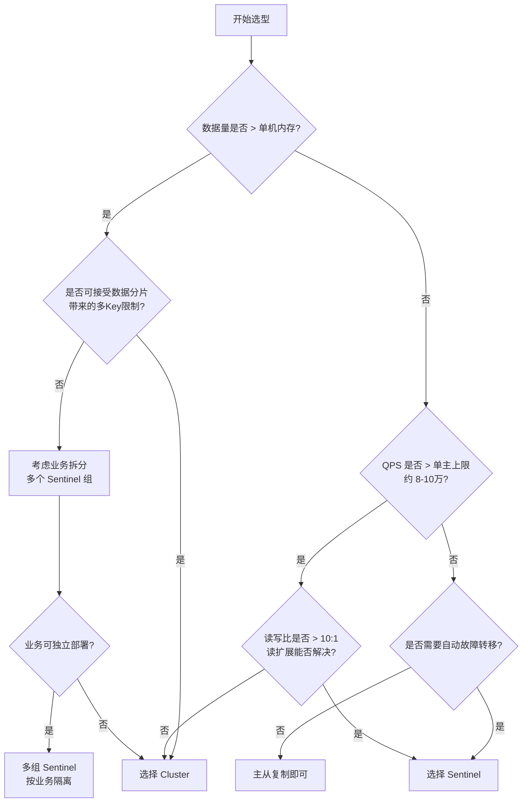
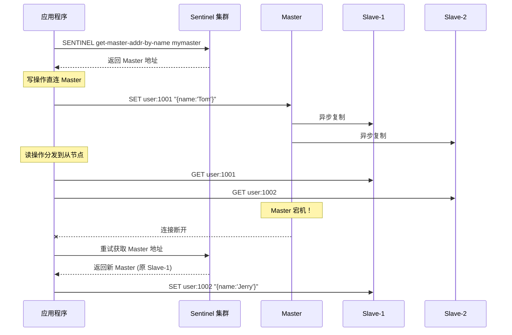
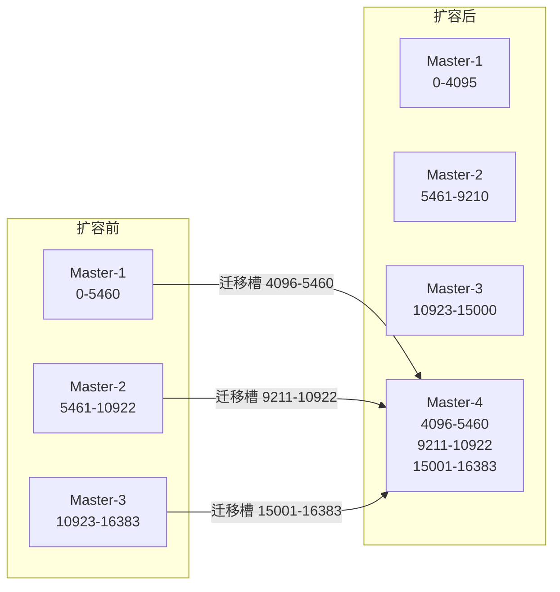
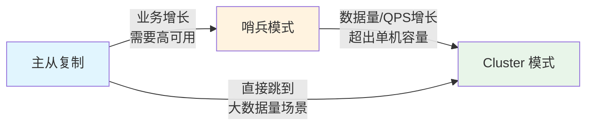

# 哨兵与集群选型

> 哨兵（Sentinel）和 Cluster 是 Redis 高可用的两大支柱方案，但它们解决问题的侧重点截然不同：哨兵专注故障转移，Cluster 在此基础上增加了数据分片和水平扩展能力。选错方案的代价不仅是性能损失，更可能是架构无法支撑业务增长而不得不大规模重构。本文将从底层原理出发，建立一套清晰的选型决策框架。

## 1. 哨兵与 Cluster 本质对比

### 1.1 架构定位差异

```text
Redis Sentinel 架构定位：
┌─────────────────────────────────────────────────┐
│            Sentinel = 高可用方案                    │
│                                                     │
│  解决问题：主节点单点故障                              │
│  核心能力：自动故障转移                                │
│  数据分布：全量数据在单主节点                           │
│  扩展方式：只读扩展（增加从节点）                       │
│  写入瓶颈：单主节点写入上限                             │
│                                                     │
│  ┌─────────┐    ┌─────┐    ┌─────┐               │
│  │ Master   │───▶│ S1  │    │ S2  │               │
│  │ (全量数据)│    └─────┘    └─────┘               │
│  └──┬───┬──┘    ┌─────┐                          │
│     │   │       │ S3  │  ← 哨兵集群               │
│  ┌──▼┐ ┌▼──┐   └─────┘                          │
│  │R1 │ │R2 │                                     │
│  └───┘ └───┘                                      │
└─────────────────────────────────────────────────┘

Redis Cluster 架构定位：
┌─────────────────────────────────────────────────┐
│            Cluster = 高可用 + 数据分片方案          │
│                                                     │
│  解决问题：单点故障 + 数据容量 + 写入瓶颈             │
│  核心能力：自动分片 + 自动故障转移                     │
│  数据分布：数据分片到多个主节点                        │
│  扩展方式：读写均可水平扩展                            │
│  写入瓶颈：多主节点并行写入                            │
│                                                     │
│  ┌───────┐ ┌───────┐ ┌───────┐                   │
│  │Master1│ │Master2│ │Master3│                   │
│  │0-5460 │ │5461-  │ │10923- │  ← 槽分片          │
│  └──┬──┘  │10922  │ │16383  │                    │
│  ┌──▼──┐  └──┬──┘  └──┬──┘                     │
│  │Rep1 │  ┌──▼──┐  ┌──▼──┐                     │
│  └─────┘  │Rep2 │  │Rep3 │                      │
│           └─────┘  └─────┘                       │
└─────────────────────────────────────────────────┘
```

### 1.2 核心特性全面对比

| 维度 | Sentinel | Cluster |
|------|----------|---------|
| **设计目标** | 高可用（自动故障转移） | 高可用 + 水平扩展 |
| **数据分布** | 单主全量存储 | 16384 槽分片存储 |
| **写入能力** | 受限于单主节点 | 多主并行写入，线性扩展 |
| **存储容量** | 受限于单机内存 | 多机内存之和 |
| **故障转移** | 哨兵投票选举新主 | 槽迁移 + 从节点升主 |
| **客户端复杂度** | 低（直连主从） | 高（需路由/重定向） |
| **多 Key 操作** | 完全支持 | 受限（需同槽/Hash Tag） |
| **事务** | 完全支持 | 受限（需同槽） |
| **Lua 脚本** | 完全支持 | 受限（所有 Key 同槽） |
| **发布订阅** | 完全支持 | 集群广播（Sharded PUBSUB 7.0+） |
| **最小部署** | 1主2从 + 3哨兵 | 6节点（3主3从） |
| **运维复杂度** | 中等 | 高 |
| **在线扩容** | 增加从节点（只读扩展） | 添加主节点 + 迁移槽 |
| **配置管理** | sentinel.conf | nodes.conf + 槽分配 |
| **选主协议** | Raft 变体 | Gossip + 配置纪元 |

### 1.3 底层机制对比


::: tip 核心区别
哨兵是独立于数据节点的监控组件，Cluster 中每个节点既是数据节点又是监控节点。这意味着 Sentinel 需要额外部署和维护，而 Cluster 的故障检测逻辑内置在数据节点中。
:::

## 2. 选型决策树

### 2.1 决策流程图



### 2.2 关键决策因子量化

```text
┌──────────────────────────────────────────────────────────────┐
│                    选型量化评估表                                │
├─────────────┬────────────────┬───────────────────────────────┤
│  决策因子     │ Sentinel 适合   │ Cluster 适合                   │
├─────────────┼────────────────┼───────────────────────────────┤
│ 数据量       │ < 50GB          │ > 50GB 或预期快速增长            │
│ 写入 QPS     │ < 8万           │ > 8万 或需线性扩展               │
│ 读取 QPS     │ < 30万（加从节点）│ 可水平扩展                      │
│ Key 数量     │ < 5000万        │ 无上限                          │
│ 大 Key 操作  │ 频繁            │ 避免（跨节点问题）               │
│ 多 Key 操作  │ 频繁            │ 较少                           │
│ 事务需求     │ 强依赖          │ 弱依赖或可改造                   │
│ Lua 脚本     │ 复杂脚本多      │ 简单脚本为主                    │
│ 运维团队能力 │ 初中级          │ 高级                           │
│ 扩容频率     │ 低（年维度）     │ 高（月/季度维度）                │
│ 业务增长     │ 稳定            │ 快速增长                       │
└─────────────┴────────────────┴───────────────────────────────┘
```

::: important 量化阈值说明
- **单主写入上限 ~8-10万 QPS**：基于 Redis 官方基准测试，实际值受命令复杂度、网络延迟、持久化策略影响
- **50GB 数据量阈值**：考虑 RDB 持久化时的内存翻倍、fork 耗时、AOF 重写等因素，建议单实例不超过 50GB
- 以上阈值为经验值，需根据实际业务压测调整
:::

### 2.3 场景速查表

| 业务场景 | 推荐方案 | 理由 |
|----------|----------|------|
| 小型电商用户会话 | Sentinel | 数据量小、单主足够、简单可靠 |
| 大型社交平台 Feed 流 | Cluster | 海量数据、高 QPS、需水平扩展 |
| 游戏排行榜 + 计数器 | Cluster | 写入密集、数据量大 |
| CMS 内容缓存 | Sentinel | 读多写少、数据量可控 |
| IoT 设备状态存储 | Cluster | 海量设备、高写入、需分片 |
| 金融交易流水 | Sentinel | 强事务需求、多 Key 操作多 |
| 实时推荐系统 | Cluster | 高 QPS、大数据量 |
| 配置中心 / 字典服务 | Sentinel | 数据量极小、事务需求高 |

## 3. 哨兵适用场景深度分析

### 3.1 主从切换场景

```text
哨兵核心场景：主从自动切换

    正常状态                           故障切换后
┌──────────┐                    ┌──────────┐
│ Master   │ ◄── 哨兵监控        │ Slave-B  │ ◄── 新 Master
│ (10.0.0.1)│                    │ (10.0.0.3)│
└──┬───┬───┘                    └────┬─────┘
   │   │                             │
┌──▼┐ ┌▼──┐                     ┌───▼──┐
│S-A│ │S-B│                     │ S-A  │ ← 旧 Master
└───┘ └───┘                     └──────┘   恢复后变从节点

切换过程（< 30秒）：
1. 哨兵检测 Master 主观下线（is-master-down-by-addr）
2. 多数哨兵确认客观下线
3. 哨兵 Leader 选举
4. 选择最优从节点（优先级→复制偏移量→Run ID）
5. 执行 slaveof no one 升主
6. 其他从节点 slaveof 新主
7. 发布 +switch-master 事件通知客户端
```

### 3.2 小规模部署最佳实践

```text
小规模 Sentinel 部署拓扑（推荐 3 节点起步）：

┌─────────────────────────────────────────────┐
│                 客户端应用                      │
│           （通过 Sentinel 获取主节点地址）       │
└──────────────────┬──────────────────────────┘
                   │
    ┌──────────────┼──────────────┐
    ▼              ▼              ▼
┌────────┐  ┌────────┐  ┌────────┐
│Sentinel│  │Sentinel│  │Sentinel│
│  :26379│  │  :26380│  │  :26381│
└───┬────┘  └───┬────┘  └───┬────┘
    │            │            │
    └────────────┼────────────┘
                 │
          ┌──────▼──────┐
          │   Master     │
          │  :6379       │
          └──┬──────┬───┘
             │      │
       ┌─────▼┐  ┌─▼─────┐
       │Slave1│  │Slave2 │
       │:6380  │  │:6381   │
       └──────┘  └────────┘
```

::: warning 哨兵数量必须为奇数
哨兵的客观下线判定需要 `<sentinel count> / 2 + 1` 票。偶数个哨兵在半数节点故障时无法形成多数派，会导致故障转移失败。推荐 3 或 5 个哨兵。
:::

### 3.3 哨兵配置示例

```bash
# sentinel.conf 核心配置

# 哨兵端口
port 26379

# 监控主节点（名称 IP 端口 法定人数）
sentinel monitor mymaster 10.0.0.1 6379 2

# 主观下线超时（毫秒）
sentinel down-after-milliseconds mymaster 30000

# 故障转移超时（毫秒）
sentinel failover-timeout mymaster 180000

# 同时可复制的从节点数
sentinel parallel-syncs mymaster 1

# 通知脚本（可选）
sentinel notification-script mymaster /var/redis/notify.sh

# 客户端重配置脚本（可选）
sentinel client-reconfig-script mymaster /var/redis/reconfig.sh
```

### 3.4 哨兵 + 读写分离方案



::: tip 读写分离注意事项
1. **复制延迟**：异步复制导致从节点数据滞后，强一致性场景不能读从节点
2. **过期 Key**：从节点不会主动过期 Key，需等主节点 DEL 命令同步过来
3. **连接管理**：客户端需维护到多个节点的连接池
4. **读权重**：可通过多个从节点实现读负载均衡
:::

## 4. Cluster 适用场景深度分析

### 4.1 大数据量场景

```text
Cluster 数据分片原理：

                16384 个 Hash Slots
┌──────────────────────────────────────────────────┐
│0    1000   2000   3000   ...   15000   16000 16383│
└──────────┬──────────┬──────────────┬──────────────┘
           │          │              │
     ┌─────▼────┐ ┌──▼─────┐  ┌─────▼────┐
     │ Master-1 │ │Master-2│  │ Master-3 │
     │ 0-5460   │ │5461-   │  │10923-    │
     │          │ │10922   │  │16383     │
     └────┬─────┘ └───┬────┘  └────┬─────┘
          │           │            │
     ┌────▼────┐ ┌───▼─────┐ ┌───▼─────┐
     │ Replica │ │Replica  │ │Replica  │
     │  of M1  │ │  of M2  │ │  of M3  │
     └─────────┘ └─────────┘ └─────────┘

每个 Key 的路由：
  slot = CRC16(key) % 16384
```

### 4.2 高并发场景

```text
Cluster 高并发读写模型：

写入扩展（3 主并行写入）：
┌──────────┐ ┌──────────┐ ┌──────────┐
│ Master-1 │ │ Master-2 │ │ Master-3 │
│ 3.3万QPS │ │ 3.3万QPS │ │ 3.3万QPS │
└──────────┘ └──────────┘ └──────────┘
      ↓            ↓            ↓
  总写入 QPS ≈ 10万（线性扩展）

读取扩展（3 主 + 3 从）：
┌──────────┐ ┌──────────┐ ┌──────────┐
│ Master-1 │ │ Master-2 │ │ Master-3 │
└──┬───┬───┘ └──┬───┬───┘ └──┬───┬───┘
   │   │         │   │         │   │
┌──▼┐ ┌▼──┐  ┌──▼┐ ┌▼──┐  ┌──▼┐ ┌▼──┐
│R1 │ │R2 │  │R3 │ │R4 │  │R5 │ │R6 │
└───┘ └───┘  └───┘ └───┘  └───┘ └───┘
  总读取 QPS ≈ 60万（6 节点并行读取）
```

### 4.3 水平扩展能力



### 4.4 Cluster 配置示例

```bash
# redis.conf Cluster 配置

port 6379

# 启用集群模式
cluster-enabled yes

# 集群配置文件（自动生成和更新）
cluster-config-file nodes-6379.conf

# 节点超时时间（毫秒）
cluster-node-timeout 15000

# 故障转移超时
cluster-failover-timeout 180000

# 从节点有效性判定
cluster-replica-validity-factor 10

# 迁移缓冲区大小
cluster-migration-barrier 1

# 集群要求全覆盖
cluster-require-full-coverage yes
```

## 5. 混合方案：哨兵 + 读写分离

### 5.1 架构设计

```text
混合方案：Sentinel + 读写分离 + 业务分域

┌─────────────────────────────────────────────────────┐
│                     客户端应用层                       │
│  ┌──────────┐  ┌──────────┐  ┌──────────┐          │
│  │ 用户服务  │  │ 订单服务  │  │ 商品服务  │          │
│  └────┬─────┘  └────┬─────┘  └────┬─────┘          │
└───────┼──────────────┼──────────────┼───────────────┘
        │              │              │
   ┌────▼────┐   ┌────▼────┐   ┌────▼────┐
   │Sentinel │   │Sentinel │   │Sentinel │
   │ Group-1 │   │ Group-2 │   │ Group-3 │
   └────┬────┘   └────┬────┘   └────┬────┘
        │              │              │
   ┌────▼────┐   ┌────▼────┐   ┌────▼────┐
   │ Master  │   │ Master  │   │ Master  │
   │ 用户库  │   │ 订单库  │   │ 商品库  │
   └──┬──┬──┘   └──┬──┬──┘   └──┬──┬──┘
      │  │          │  │          │  │
   ┌──▼┐┌▼──┐   ┌──▼┐┌▼──┐   ┌──▼┐┌▼──┐
   │R1 ││R2 │   │R1 ││R2 │   │R1 ││R2 │
   └───┘└───┘   └───┘└───┘   └───┘└───┘
```

### 5.2 读写分离路由策略

```csharp
// .NET 读写分离路由实现
public class RedisReadWriteRouter
{
    private readonly ConnectionMultiplexer _connection;

    public RedisReadWriteRouter(
        ConnectionMultiplexer connection)
    {
        _connection = connection;
    }

    /// <summary>
    /// 获取写入端点（Master）
    /// </summary>
    public IServer GetWriteEndpoint()
    {
        var endpoint = _connection.GetEndPoints()
            .Select(ep => _connection.GetServer(ep))
            .FirstOrDefault(s => !s.IsReplica);

        if (endpoint == null)
            throw new InvalidOperationException("没有可用的主节点");

        return endpoint;
    }

    /// <summary>
    /// 获取读取端点（从节点轮询）
    /// </summary>
    private int _readIndex = 0;
    public IServer GetReadEndpoint()
    {
        var replicas = _connection.GetEndPoints()
            .Select(ep => _connection.GetServer(ep))
            .Where(s => s.IsReplica)
            .ToList();

        if (replicas.Count == 0)
            return GetWriteEndpoint();

        _readIndex = (_readIndex + 1) % replicas.Count;
        return replicas[_readIndex];
    }

    /// <summary>
    /// 写操作
    /// </summary>
    public async Task<bool> SetAsync(
        string key, string value, TimeSpan? expiry = null)
    {
        var db = _connection.GetDatabase();
        return await db.StringSetAsync(key, value, expiry);
    }

    /// <summary>
    /// 读操作（优先从节点）
    /// </summary>
    public async Task<RedisValue> GetAsync(string key)
    {
        var server = GetReadEndpoint();
        return await server.StringGetAsync(key);
    }
}
```

### 5.3 混合方案适用条件

```text
混合方案适用条件检查清单：

✅ 适合：
  □ 数据量 < 单机内存（50GB 以内）
  □ 写入 QPS < 8 万
  □ 读取 QPS 较高（10 万+）
  □ 需要多 Key 操作和事务
  □ 业务可按域拆分
  □ 运维团队规模有限

❌ 不适合：
  □ 单一大数据集（无法拆分）
  □ 写入 QPS > 10 万
  □ 数据增长快（月增 > 10GB）
  □ 需要全局聚合查询
```

## 6. 迁移路径

### 6.1 迁移路线图



### 6.2 主从 → 哨兵迁移

```text
主从 → 哨兵迁移步骤：

Step 1: 部署哨兵集群
  1. 在 3 台独立服务器部署 Sentinel
  2. 配置 sentinel monitor 指向现有 Master
  3. 启动哨兵，确认监控正常
  4. 验证：SENTINEL masters 命令

Step 2: 客户端改造
  1. 修改连接方式：直连 → 通过 Sentinel
  2. 实现主节点地址动态获取
  3. 添加故障转移重试逻辑
  4. 灰度发布验证

Step 3: 验证故障转移
  1. 模拟主节点宕机
  2. 观察哨兵是否自动切换
  3. 验证客户端是否自动重连
  4. 恢复原主节点，确认变为从节点
```

### 6.3 哨兵 → Cluster 迁移

```text
哨兵 → Cluster 迁移步骤（最复杂）：

Phase 1: 准备阶段
  1. 评估多 Key 操作，使用 Hash Tag 聚合同槽 Key
  2. 评估 Lua 脚本，确保所有 Key 在同一槽
  3. 评估事务使用，改为单槽事务或 Lua 替代
  4. 准备 Cluster 节点（至少 3 主 3 从）
  5. 客户端支持 Cluster 协议改造

Phase 2: 数据迁移
  方案 A：使用 redis-shake 迁移
    1. 部署 redis-shake
    2. 配置源（Sentinel）和目标（Cluster）
    3. 全量同步 + 增量同步
    4. 数据校验

  方案 B：使用 redis-cli --cluster import
    1. 启动目标 Cluster
    2. 执行 import 命令
    3. 监控迁移进度

  方案 C：双写方案
    1. 应用层同时写入 Sentinel 和 Cluster
    2. 全量迁移历史数据
    3. 数据一致性校验
    4. 切换读取到 Cluster
    5. 停止写入 Sentinel

Phase 3: 切换验证
  1. 灰度切 1% 流量到 Cluster
  2. 监控延迟、错误率
  3. 逐步扩大流量（1% → 10% → 50% → 100%）
  4. 全量切换完成后保留 Sentinel 7 天
  5. 确认无回滚需求后下线 Sentinel
```

### 6.4 迁移风险评估

```text
┌─────────────────────────────────────────────────────────┐
│                   迁移风险矩阵                              │
├─────────────┬──────────┬──────────┬──────────────────────┤
│  风险项       │ 影响程度  │ 发生概率  │ 缓解措施              │
├─────────────┼──────────┼──────────┼──────────────────────┤
│ 多 Key 操作失败│ 高       │ 高       │ Hash Tag 预评估       │
│ Lua 脚本不兼容│ 高       │ 中       │ 脚本审计和改造         │
│ 数据丢失      │ 极高     │ 低       │ 双写 + 校验 + 回滚     │
│ 迁移期间延迟  │ 中       │ 高       │ 低峰期迁移             │
│ 客户端兼容性  │ 中       │ 中       │ 灰度发布               │
│ 回滚困难      │ 高       │ 低       │ 保留原集群 7 天        │
│ 迁移工具 Bug  │ 中       │ 低       │ 提前演练               │
└─────────────┴──────────┴──────────┴──────────────────────┘
```

## 7. .NET 配置示例

### 7.1 Sentinel 连接配置

```csharp
public class SentinelConfiguration
{
    public static async Task<ConnectionMultiplexer> CreateSentinelConnection()
    {
        var configuration = new ConfigurationOptions
        {
            EndPoints =
            {
                { "10.0.0.1", 26379 },
                { "10.0.0.2", 26379 },
                { "10.0.0.3", 26379 }
            },
            ServiceName = "mymaster",
            SentinelSelectionStrategy = SentinelSelectionStrategy.FailoverPriority,
            ConnectTimeout = 5000,
            SyncTimeout = 3000,
            AsyncTimeout = 5000,
            ConnectRetry = 3,
            KeepAlive = 60,
            AbortOnConnectFail = false,
            Password = "your_password"
        };

        var connection = await ConnectionMultiplexer.ConnectAsync(configuration);

        connection.ConfigurationChanged += (sender, e) =>
        {
            Console.WriteLine($"Redis 配置变更: EndPoint={e.EndPoint}");
        };

        connection.ConnectionFailed += (sender, e) =>
        {
            Console.WriteLine($"Redis 连接失败: EndPoint={e.EndPoint}");
        };

        return connection;
    }
}
```

### 7.2 Cluster 连接配置

```csharp
public class ClusterConfiguration
{
    public static async Task<ConnectionMultiplexer> CreateClusterConnection()
    {
        var configuration = new ConfigurationOptions
        {
            EndPoints =
            {
                { "10.0.1.1", 6379 },
                { "10.0.1.2", 6379 },
                { "10.0.1.3", 6379 }
            },
            ConnectTimeout = 5000,
            SyncTimeout = 3000,
            AsyncTimeout = 5000,
            ConnectRetry = 3,
            KeepAlive = 60,
            AbortOnConnectFail = false,
            Password = "your_password"
        };

        var connection = await ConnectionMultiplexer.ConnectAsync(configuration);

        connection.HashSlotMoved += (sender, e) =>
        {
            Console.WriteLine($"槽迁移: Slot={e.HashSlot}, " +
                $"Old={e.OldEndPoint}, New={e.NewEndPoint}");
        };

        return connection;
    }
}
```

### 7.3 动态路由封装

```csharp
// 动态路由封装 - 自动适配 Sentinel 和 Cluster
public interface IRedisProvider
{
    Task<string> GetAsync(string key);
    Task<bool> SetAsync(string key, string value, TimeSpan? expiry = null);
    Task<bool> DeleteAsync(string key);
    Task<long> IncrementAsync(string key, long value = 1);
}

public class SentinelRedisProvider : IRedisProvider
{
    private readonly IDatabase _db;

    public SentinelRedisProvider(ConnectionMultiplexer connection)
    {
        _db = connection.GetDatabase();
    }

    public async Task<string> GetAsync(string key)
        => await _db.StringGetAsync(key);

    public async Task<bool> SetAsync(string key, string value, TimeSpan? expiry)
        => await _db.StringSetAsync(key, value, expiry);

    public async Task<bool> DeleteAsync(string key)
        => await _db.KeyDeleteAsync(key);

    public async Task<long> IncrementAsync(string key, long value = 1)
        => await _db.StringIncrementAsync(key, value);
}

public class ClusterRedisProvider : IRedisProvider
{
    private readonly ConnectionMultiplexer _connection;

    public ClusterRedisProvider(ConnectionMultiplexer connection)
    {
        _connection = connection;
    }

    public async Task<string> GetAsync(string key)
    {
        var db = _connection.GetDatabase();
        return await db.StringGetAsync(key);
    }

    public async Task<bool> SetAsync(string key, string value, TimeSpan? expiry)
    {
        var db = _connection.GetDatabase();
        return await db.StringSetAsync(key, value, expiry);
    }

    public async Task<bool> DeleteAsync(string key)
    {
        var db = _connection.GetDatabase();
        return await db.KeyDeleteAsync(key);
    }

    public async Task<long> IncrementAsync(string key, long value = 1)
    {
        var db = _connection.GetDatabase();
        return await db.StringIncrementAsync(key, value);
    }
}
```

### 7.4 依赖注入注册

```csharp
public static class RedisExtensions
{
    public static IServiceCollection AddSentinelRedis(
        this IServiceCollection services,
        IConfiguration configuration)
    {
        var sentinelConfig = configuration.GetSection("Redis:Sentinel");

        services.AddSingleton<ConnectionMultiplexer>(sp =>
        {
            var options = new ConfigurationOptions
            {
                ServiceName = sentinelConfig["ServiceName"],
                SentinelSelectionStrategy =
                    SentinelSelectionStrategy.FailoverPriority,
                AbortOnConnectFail = false,
                ConnectTimeout = 5000,
                SyncTimeout = 3000,
                Password = sentinelConfig["Password"]
            };

            foreach (var ep in sentinelConfig.GetSection("Endpoints").GetChildren())
            {
                options.EndPoints.Add(ep["Host"], int.Parse(ep["Port"]));
            }

            return ConnectionMultiplexer.Connect(options);
        });

        services.AddSingleton<IRedisProvider, SentinelRedisProvider>();
        return services;
    }

    public static IServiceCollection AddClusterRedis(
        this IServiceCollection services,
        IConfiguration configuration)
    {
        var clusterConfig = configuration.GetSection("Redis:Cluster");

        services.AddSingleton<ConnectionMultiplexer>(sp =>
        {
            var options = new ConfigurationOptions
            {
                AbortOnConnectFail = false,
                ConnectTimeout = 5000,
                SyncTimeout = 3000,
                Password = clusterConfig["Password"]
            };

            foreach (var ep in clusterConfig.GetSection("Endpoints").GetChildren())
            {
                options.EndPoints.Add(ep["Host"], int.Parse(ep["Port"]));
            }

            return ConnectionMultiplexer.Connect(options);
        });

        services.AddSingleton<IRedisProvider, ClusterRedisProvider>();
        return services;
    }
}
```

```json
// appsettings.json 配置示例
{
  "Redis": {
    "Sentinel": {
      "ServiceName": "mymaster",
      "Password": "your_password",
      "Endpoints": [
        { "Host": "10.0.0.1", "Port": 26379 },
        { "Host": "10.0.0.2", "Port": 26379 },
        { "Host": "10.0.0.3", "Port": 26379 }
      ]
    },
    "Cluster": {
      "Password": "your_password",
      "Endpoints": [
        { "Host": "10.0.1.1", "Port": 6379 },
        { "Host": "10.0.1.2", "Port": 6379 },
        { "Host": "10.0.1.3", "Port": 6379 },
        { "Host": "10.0.1.4", "Port": 6379 },
        { "Host": "10.0.1.5", "Port": 6379 },
        { "Host": "10.0.1.6", "Port": 6379 }
      ]
    }
  }
}
```

## 8. 生产级最佳实践

### 8.1 哨兵最佳实践

```text
哨兵生产部署清单：

部署架构：
☑ 至少 3 个 Sentinel，部署在不同物理机/可用区
☑ 至少 2 个从节点，分布在不同可用区
☑ Sentinel 与数据节点部署在不同机器
☑ 哨兵配置中法定人数 ≥ 2

配置优化：
☑ down-after-milliseconds 不低于 30s（避免网络抖动误判）
☑ parallel-syncs 设为 1（避免切换后全量同步风暴）
☑ failover-timeout 设为 180s
☑ 开启 Sentinel 持久化配置

监控告警：
☑ 监控 +sdown 和 +odown 事件
☑ 监控 +switch-master 切换事件
☑ 监控主从复制延迟
☑ 监控 Sentinel 间通信状态

客户端配置：
☑ 使用 Sentinel 模式连接，不硬编码主节点地址
☑ 实现故障转移后的自动重连
☑ 连接超时 ≥ down-after-milliseconds
☑ 禁用 AbortOnConnectFail
```

### 8.2 Cluster 最佳实践

```text
Cluster 生产部署清单：

部署架构：
☑ 至少 6 节点（3 主 3 从）
☑ 主节点分布在不同可用区
☑ 从节点与对应主节点在不同可用区
☑ 预留 2-3 个备用节点

配置优化：
☑ cluster-node-timeout 不低于 15s
☑ cluster-require-full-coverage 设为 no
☑ cluster-migration-barrier 设为 1
☑ 单节点内存 ≤ 50GB

数据规划：
☑ 预估数据量，合理分配初始槽位
☑ 避免热点 Key 集中在同一槽
☑ 使用 Hash Tag 保证关联 Key 同槽
☑ 大 Key 必须拆分

运维策略：
☑ 定期检查槽分布均衡性
☑ 监控集群状态：CLUSTER INFO / CLUSTER NODES
☑ 预留扩容空间
☑ 制定缩容预案
```

### 8.3 通用建议

::: warning 关键警告
1. **不要混合使用 Sentinel 和 Cluster**：不要在 Cluster 上叠加 Sentinel，Cluster 自身已包含故障转移能力
2. **不要在 Cluster 中使用 SELECT**：Cluster 不支持多数据库，只能使用 DB0
3. **不要忽略 cluster-require-full-coverage**：生产环境建议设为 `no`，否则任一主节点故障会导致整个集群不可用
4. **不要轻视客户端兼容性**：StackExchange.Redis 对 Cluster 的 MOVED/ASK 重定向支持需要正确配置
:::

## 9. 性能基准对比

### 9.1 吞吐量对比

```text
基准测试条件：8C 32GB SSD, Redis 7.2, redis-benchmark -c 100

┌────────────────┬──────────────┬──────────────┬──────────────┐
│  方案           │ SET (QPS)    │ GET (QPS)    │ 延迟 P99(ms) │
├────────────────┼──────────────┼──────────────┼──────────────┤
│ 单实例          │ ~110,000     │ ~120,000     │ 0.8          │
│ Sentinel(1M2S) │ ~105,000     │ ~280,000(读) │ 1.2          │
│ Cluster(3M3S)  │ ~300,000     │ ~600,000(读) │ 1.5          │
│ Cluster(6M6S)  │ ~600,000     │ ~1,200,000   │ 1.8          │
└────────────────┴──────────────┴──────────────┴──────────────┘
```

### 9.2 故障转移时间对比

```text
┌───────────────────┬───────────────┬────────────────────────┐
│  故障转移指标       │ Sentinel      │ Cluster                │
├───────────────────┼───────────────┼────────────────────────┤
│ 检测故障           │ 30s(default)  │ 15s(default)           │
│ 选主耗时           │ ~5s           │ ~2s                    │
│ 切换完成           │ ~10s          │ ~5s                    │
│ 总不可用时间       │ ~30-45s       │ ~15-25s                │
│ 影响范围           │ 全部写入      │ 仅故障主节点的槽        │
└───────────────────┴───────────────┴────────────────────────┘
```

## 10. 总结

```text
┌─────────────────────────────────────────────────────────────┐
│                     选型决策总结                                │
├─────────────────────────────────────────────────────────────┤
│                                                               │
│  Sentinel 适合：                                               │
│  ✅ 数据量可控（< 50GB）                                       │
│  ✅ 写入压力不大（< 8万 QPS）                                  │
│  ✅ 需要多 Key 操作/事务/Lua                                   │
│  ✅ 运维简单、成本低                                           │
│  ✅ 业务相对稳定                                               │
│                                                               │
│  Cluster 适合：                                                │
│  ✅ 数据量大（> 50GB）或增长快                                  │
│  ✅ 写入 QPS 高（> 8万）                                       │
│  ✅ 需要水平扩展                                               │
│  ✅ 可接受多 Key 限制                                          │
│  ✅ 运维能力强                                                 │
│                                                               │
│  核心原则：                                                     │
│  🔹 能用 Sentinel 解决的不上 Cluster                            │
│  🔹 预期数据量/QPS 超阈值则直接 Cluster                         │
│  🔹 不要在 Cluster 上叠加 Sentinel                             │
│  🔹 迁移路径：主从 → 哨兵 → Cluster（可跳步）                  │
│  🔹 提前规划，避免架构反复                                      │
│                                                               │
└─────────────────────────────────────────────────────────────┘
```

::: info 参考文献
- [Redis 官方文档 - Sentinel](https://redis.io/docs/management/sentinel/)
- [Redis 官方文档 - Cluster](https://redis.io/docs/management/scaling/)
- 《Redis 设计与实现》- 黄健宏
- 《Redis 开发与运维》- 付磊、张益军
- Redis 源码 `sentinel.c` / `cluster.c`
:::
