# 01 · Redis Cluster 原理

> **本篇回答：** Redis Cluster 是如何用 16384 个哈希槽实现数据分片的？节点之间如何通过 Gossip 协议保持信息同步？当集群发生故障时，自动转移的完整流程是什么？

---

## 一、为什么需要 Redis Cluster

### 1.1 单机的三重瓶颈

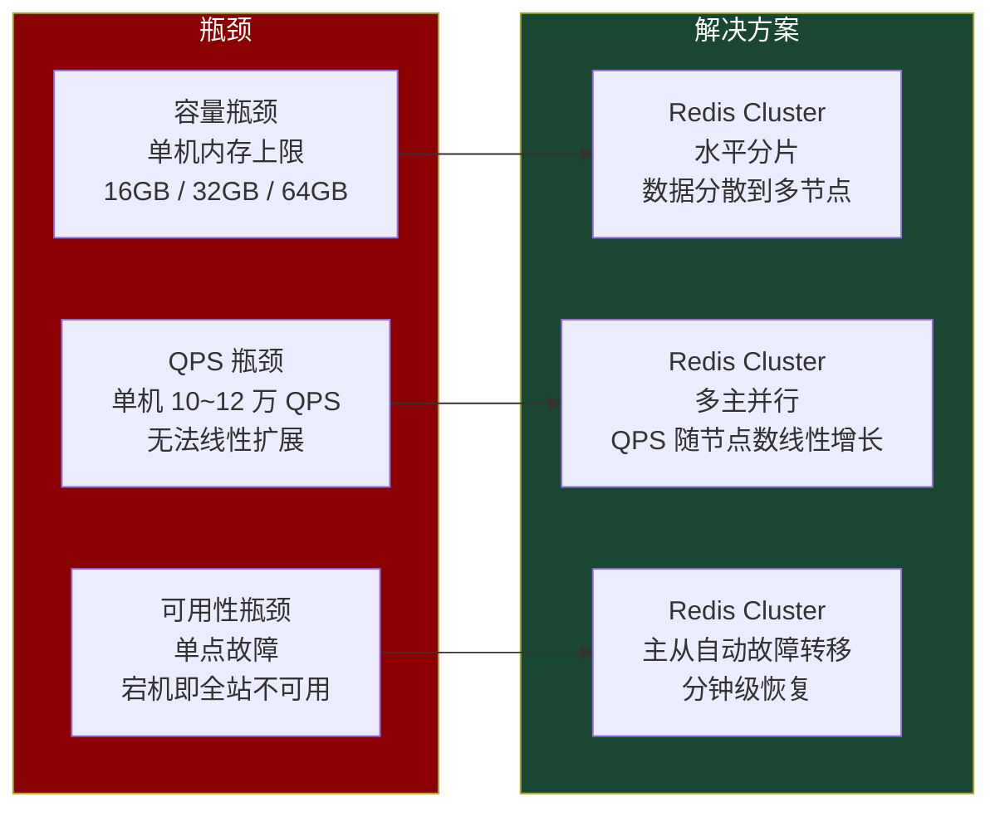

| 维度 | 单机 / 主从 | Sentinel | Cluster |
|------|------------|----------|---------|
| 数据容量 | 受单机内存限制 | 受单机内存限制 | 可水平扩展 |
| 读写 QPS | 单主写入瓶颈 | 单主写入瓶颈 | 多主并行写入 |
| 故障恢复 | 手动切换 | 自动切换 | 自动切换 + 槽迁移 |
| 在线扩容 | 不支持 | 不支持 | 支持（热迁移） |

::: important
Redis Cluster 不是"万能药"，它用**限制**换取了**扩展性**——跨槽的多键操作受限、事务受限、Select 数据库只能用 DB0。理解这些限制，才能在架构决策中做出正确取舍。
:::

### 1.2 Cluster 的设计目标

- **高性能**：客户端直连节点，无代理层开销
- **高可用**：主从自动故障转移，无需外部 Sentinel
- **可扩展**：支持在线扩容 / 缩容，数据自动迁移
- **去中心化**：无中心节点，Gossip 协议自组织

---

## 二、16384 哈希槽——数据分片的核心

### 2.1 哈希槽映射算法

Redis Cluster 将整个键空间划分为 **16384 个哈希槽（Hash Slot）**，每个键通过以下算法确定所属槽：

```
slot = CRC16(key) % 16384
```


::: tip CRC16-CCITT
Redis 使用的 CRC16 是 **CRC-CCITT** 标准（多项式 `x^16 + x^12 + x^5 + 1`，0x1021），它能产生 0 ~ 65535 的值。取模 16384 后，槽号范围是 `0 ~ 16383`。
:::

### 2.2 为什么是 16384 而不是 65536

这是 Redis 作者 antirez 在 GitHub Issue 中亲自回答的经典问题：

| 候选槽数 | 心跳包大小 | 节点密度 | 灵敏度 |
|-----------|-----------|---------|--------|
| 65536 | 每节点 8KB 心跳 | 最多支持 65536 节点 | 高 |
| **16384** | 每节点 2KB 心跳 | 实际够用（<1000 节点） | 合理 |
| 4096 | 每节点 512B 心跳 | 每主节点平均 2~4 槽 | 太粗，迁移不灵活 |

选择 16384 的三个理由：

1. **心跳压缩**：每个节点发送 Gossip 消息时携带自己的槽位图（bitmap），16384 个槽 = 16384 bit = 2KB。如果用 65536 则需要 8KB，在节点数多时浪费带宽
2. **实用性**：Redis Cluster 建议最大节点数不超过 1000，16384 个槽足够每主节点分配约 16 个槽
3. **槽迁移粒度**：16384 提供了足够细粒度的迁移单位，4096 则太粗

::: info
Redis Cluster 官方建议主节点数不超过 1000，实际生产中大多在 3~30 个主节点之间。
:::

### 2.3 哈希槽的分布示例

3 主节点的典型分配：

```
Node A: slot 0 ~ 5460      (5461 个槽)
Node B: slot 5461 ~ 10922   (5462 个槽)
Node C: slot 10923 ~ 16383  (5461 个槽)
```

6 主节点的典型分配：

```
Node A: slot 0 ~ 2730
Node B: slot 2731 ~ 5461
Node C: slot 5462 ~ 8192
Node D: slot 8193 ~ 10923
Node E: slot 10924 ~ 13654
Node F: slot 13655 ~ 16383
```

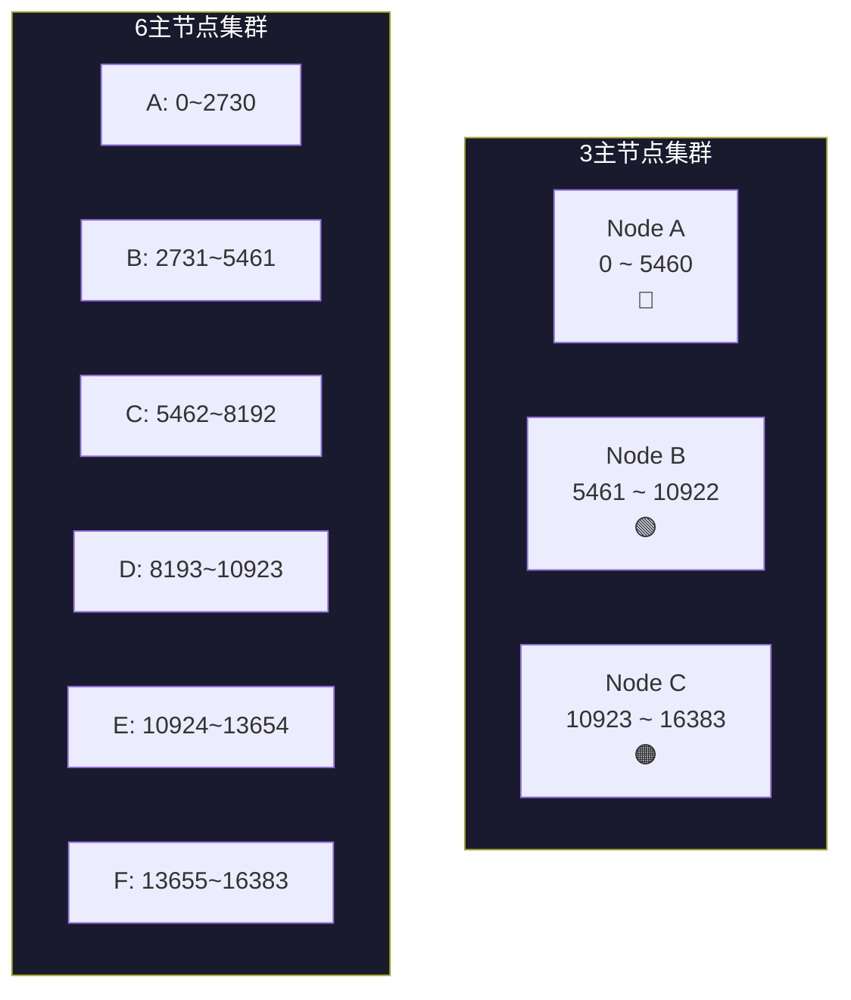

### 2.4 Hash Tag——让相关键落在同一个槽

当需要多个键在同一个槽时（如事务、MGET），使用 **Hash Tag**：

```
语法：{...}  只有花括号内的内容参与哈希计算

key                  → CRC16("key") % 16384           = slot 5542
{user}:1001:name     → CRC16("user") % 16384         = slot 5474
{user}:1001:age      → CRC16("user") % 16384         = slot 5474
{user}:1001:profile  → CRC16("user") % 16384         = slot 5474
```

```bash
# 使用 Hash Tag 确保多键在同一节点
MGET {user}:1001:name {user}:1001:age {user}:1001:profile
# ✅ 都在 slot 5474，可以正常执行

# 不使用 Hash Tag，跨槽操作会报错
MGET user:1001:name order:1001:detail
# ❌ CROSSSLOT Keys in request don't hash to the same slot
```

::: warning
Hash Tag 是一把双刃剑：它解决了跨槽问题，但可能导致数据倾斜——如果 Hash Tag 选择不当（如用 `{user}` 作为所有用户数据的 tag），大量数据会集中在同一个节点，失去分片意义。
:::

---

## 三、Gossip 协议——节点间信息传播

### 3.1 Gossip 协议概述

Redis Cluster 采用 **去中心化** 的 Gossip 协议进行节点间的元数据交换。每个节点定期向少量随机节点发送消息，信息像"传染病"一样逐步传播到整个集群。

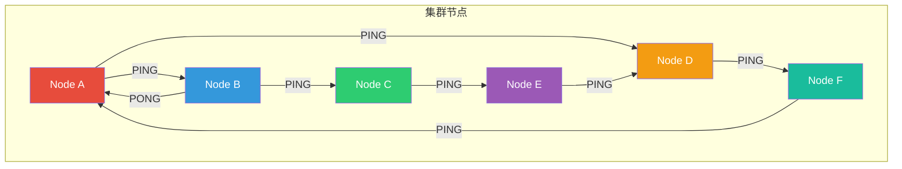

### 3.2 Gossip 消息类型

| 消息类型 | 方向 | 作用 |
|---------|------|------|
| **MEET** | 发送方 → 新节点 | 将新节点加入集群（类似"邀请入群"） |
| **PING** | 节点 → 随机节点 | 心跳检测 + 携带自身状态 |
| **PONG** | 响应方 → 发送方 | 回复 PING/MEET，携带自身状态 |
| **FAIL** | 广播 | 标记某节点为 FAIL（已确认宕机） |
| **PUBLISH** | 广播 | 传播 Pub/Sub 消息 |

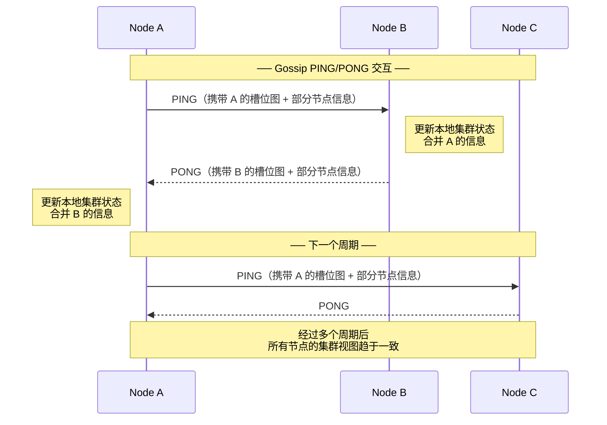

### 3.3 Gossip 消息结构

每条 Gossip 消息包含以下部分：

```
┌──────────────────────────────────────────────────┐
│                  Gossip 消息头                      │
├──────────────────────────────────────────────────┤
│ type: PING / PONG / MEET                          │
│ sender: 发送方节点 ID（40 字符十六进制）              │
│ myslots: 发送方负责的槽位图（2KB bitmap）             │
│ flags: 发送方标志（MASTER / SLAVE / PFAIL）         │
│ port / cport: 数据端口 / 集群总线端口               │
│ cluster_state: OK / FAIL                          │
├──────────────────────────────────────────────────┤
│                  Gossip 消息体                      │
├──────────────────────────────────────────────────┤
│ gossip entries: 随机选取的其他节点信息               │
│   - node_id                                       │
│   - ping_sent / pong_received                     │
│   - flags                                         │
│   - ip:port                                       │
│   （每次携带约 3~10 个节点的信息）                    │
└──────────────────────────────────────────────────┘
```

### 3.4 Gossip 工作参数

| 参数 | 默认值 | 含义 |
|------|-------|------|
| `cluster-node-timeout` | 15000ms | 节点超时时间，超时后标记为 PFAIL |
| PING 发送间隔 | `cluster-node-timeout / 10` | 每隔 1.5 秒向随机节点发送 PING |
| 每次携带的 Gossip 条目数 | 总节点数的 1/10 | 控制消息大小 |

::: tip 调优建议
- `cluster-node-timeout` 不宜设置过小，否则网络抖动容易误判节点故障
- 生产环境建议 15~30 秒，网络不稳定时可适当调大
- Gossip 消息的传播延迟约为 `O(log N)` 个周期，N 为节点数
:::

---

## 四、节点握手与加入集群

### 4.1 节点握手流程

新节点加入集群需要通过 **MEET** 消息完成握手：

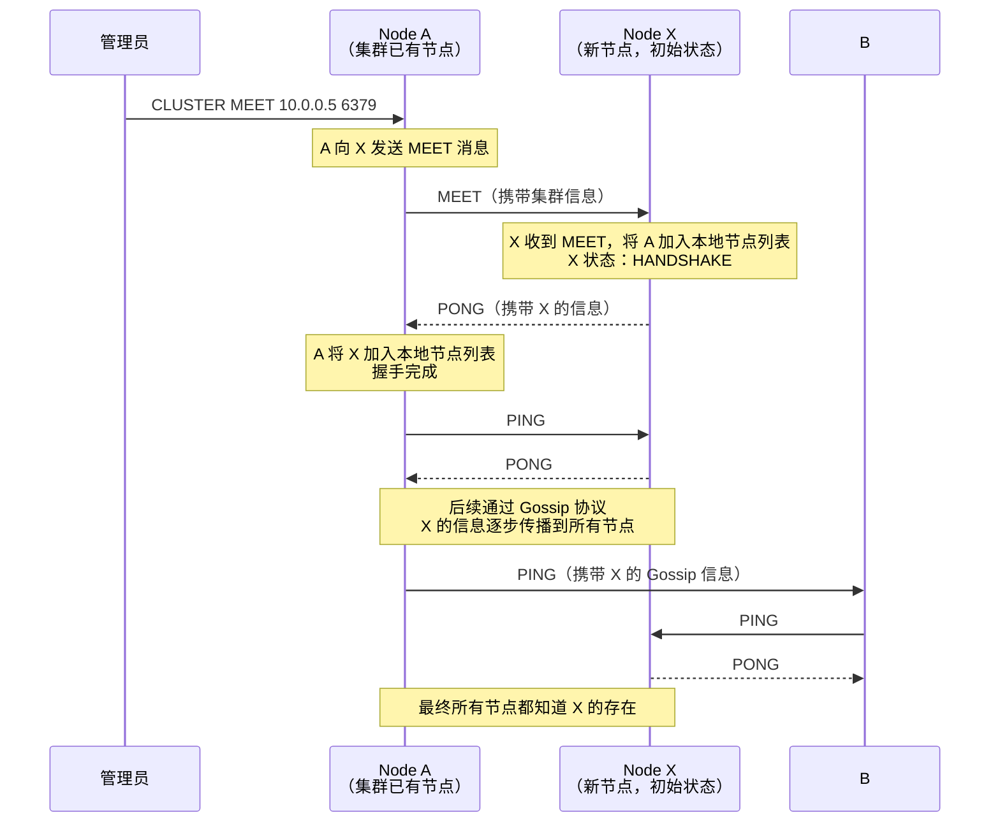

### 4.2 节点状态机

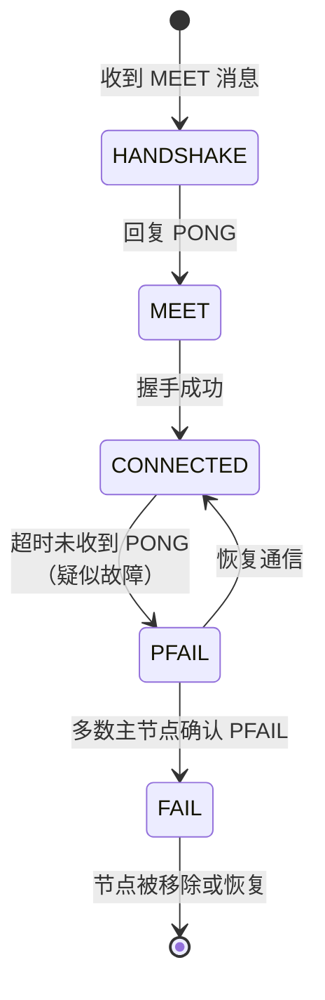

| 状态 | 含义 | 谁标记 |
|------|------|--------|
| **HANDSHAKE** | 正在握手 | 发起方 |
| **MEET** | 已收到 MEET，等待确认 | 接收方 |
| **CONNECTED** | 正常连接 | — |
| **PFAIL** | 疑似故障（Possibly Fail） | 单个节点标记 |
| **FAIL** | 确认故障 | 多数主节点确认后标记 |

::: important
PFAIL 和 FAIL 的区别是 Redis Cluster 故障检测的核心：PFAIL 只是单个节点的"怀疑"，FAIL 需要多数主节点达成共识。这避免了网络分区导致的误判。
:::

---

## 五、槽迁移——在线数据重分布

### 5.1 迁移场景

当需要扩容（增加主节点）或缩容（减少主节点）时，必须将哈希槽从源节点迁移到目标节点。Redis Cluster 支持**在线迁移**，不需要停机。

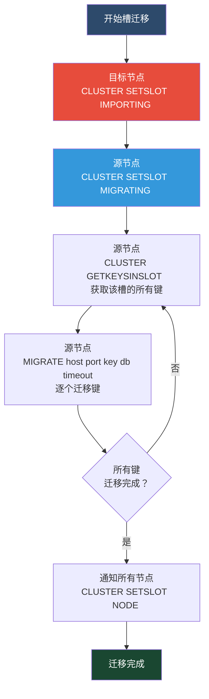

### 5.2 ASK 与 MOVED 重定向

槽迁移期间和迁移完成后，客户端可能访问错误的节点，需要通过重定向找到正确的节点：

#### MOVED 重定向——永久迁移

当客户端访问的键所在槽**已经完全迁移**到新节点时：

```
客户端 → Node A: GET user:1001
Node A → 客户端: -MOVED 13270 10.0.0.5:6379
客户端 → Node B(10.0.0.5:6379): GET user:1001
Node B → 客户端: "张三"
```

#### ASK 重定向——迁移中临时

当键**正在迁移中**，源节点不再持有该键，但目标节点尚未正式接管该槽时：

```
客户端 → Node A: GET user:1001
Node A → 客户端: -ASK 13270 10.0.0.5:6379
客户端 → Node B(10.0.0.5:6379): ASKING
Node B → 客户端: OK（临时允许访问）
客户端 → Node B: GET user:1001
Node B → 客户端: "张三"
```

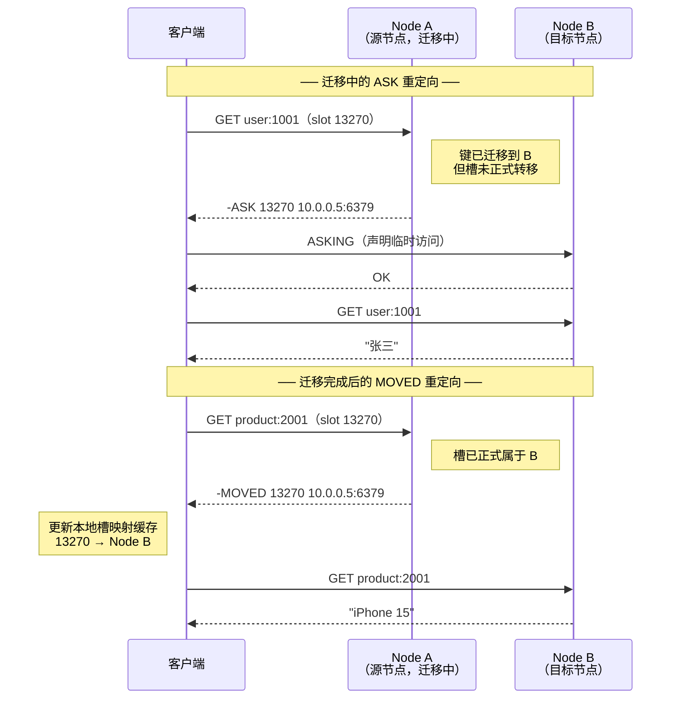

### 5.3 ASK vs MOVED 对比

| 维度 | MOVED | ASK |
|------|-------|-----|
| 触发时机 | 槽已完全迁移 | 槽迁移中，键不在源节点 |
| 语义 | 永久重定向 | 临时重定向 |
| 客户端行为 | 更新槽映射缓存 | 不更新缓存，仅本次跟随 |
| 后续请求 | 直连新节点 | 下次仍可能先问源节点 |
| 源节点状态 | 槽已不属于自己 | 槽仍标记为 MIGRATING |

::: warning
客户端必须正确处理 ASK 和 MOVED，否则在迁移期间会出现大量请求失败。Smart Client（如 Jedis、StackExchange.Redis）已经内置了重定向逻辑。
:::

### 5.4 槽迁移的内部实现

源节点在迁移槽时，内部维护了两个特殊状态：

```bash
# 源节点：标记槽正在迁出
CLUSTER SETSLOT 13270 MIGRATING <target_node_id>

# 目标节点：标记槽正在迁入
CLUSTER SETSLOT 13270 IMPORTING <source_node_id>
```

迁移期间的请求处理逻辑：

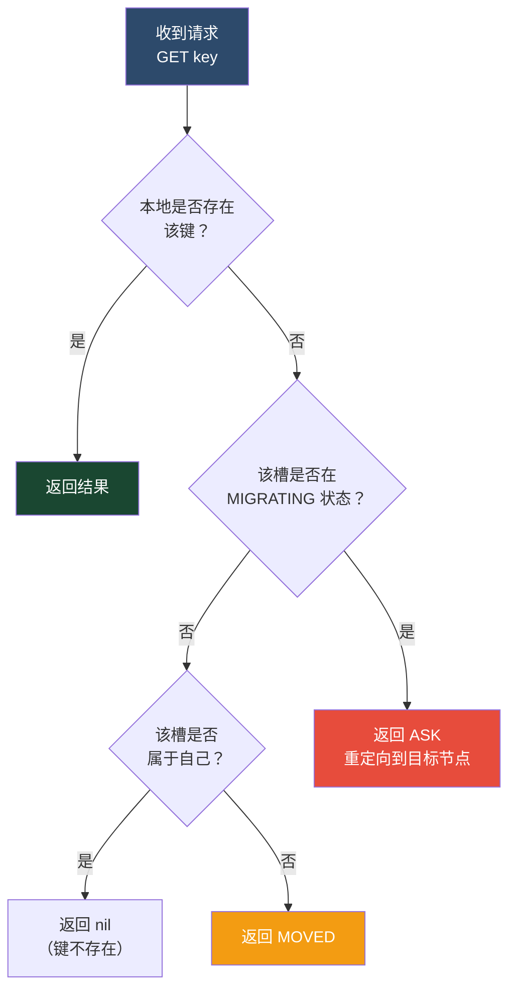

---

## 六、故障检测与自动转移

### 6.1 故障检测机制

Redis Cluster 的故障检测分为三层：

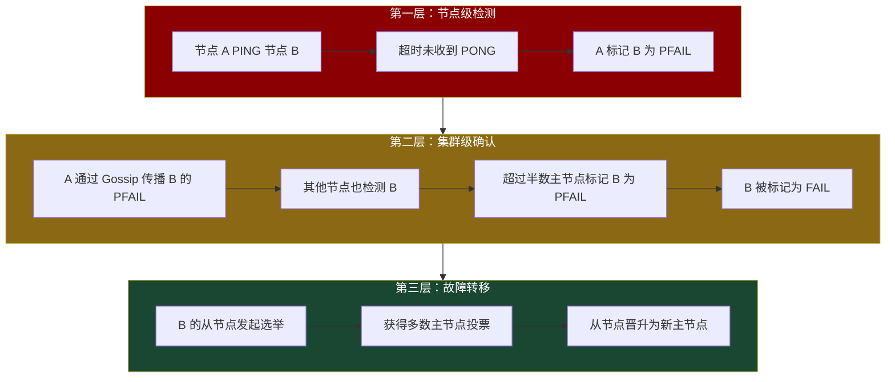

### 6.2 PFAIL → FAIL 的升级条件

一个节点被标记为 FAIL 需要满足以下条件：

1. 至少一个节点标记该节点为 PFAIL
2. 在 `cluster-node-timeout` 时间内，**超过半数的主节点**也标记该节点为 PFAIL
3. 由第一个标记 PFAIL 的节点发起 FAIL 广播

::: important
**只有主节点**的 PFAIL 投票才计数。从节点的 PFAIL 标记不会参与 FAIL 的判定。这是为了保证"多数派"的基数是确定的（主节点数量）。
:::

### 6.3 从节点选举与晋升

当主节点被标记为 FAIL 后，其从节点将发起选举：

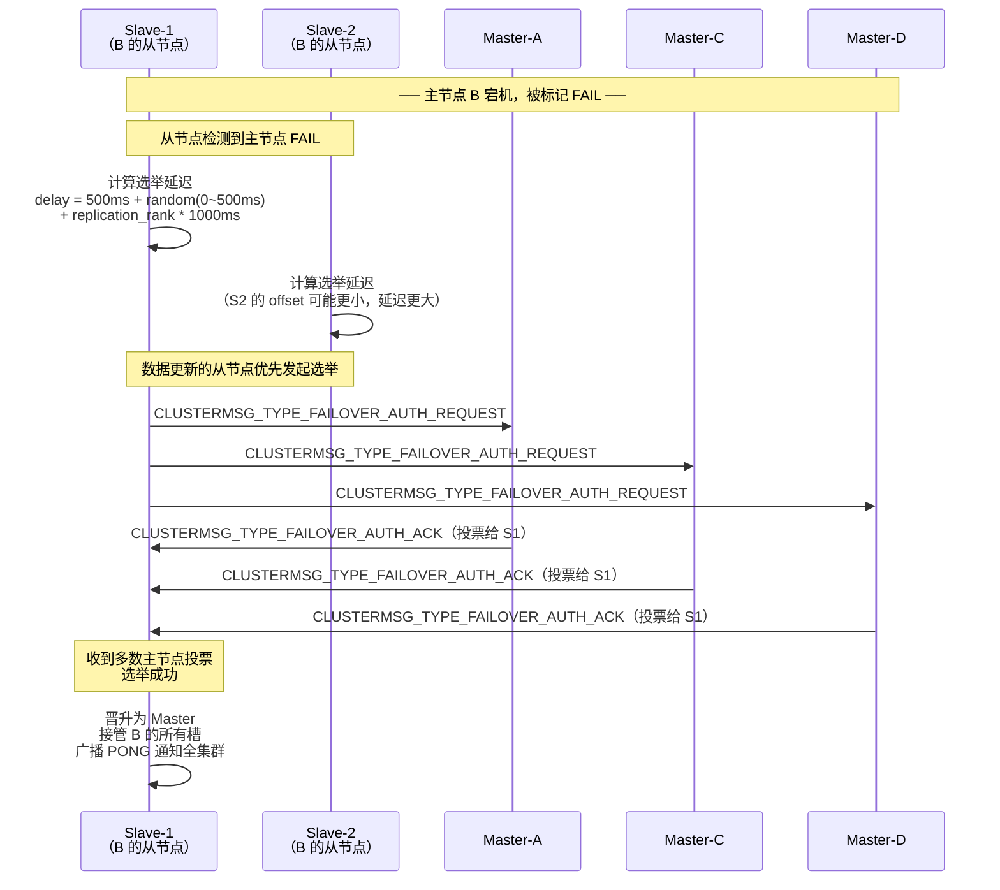

### 6.4 选举规则详解

从节点发起选举需要满足以下条件：

| 条件 | 说明 |
|------|------|
| 主节点被标记 FAIL | 前提条件 |
| 从节点复制偏移量最大 | 数据最新的从节点优先 |
| 获得**多数主节点**投票 | 超过 N/2 + 1 票 |

**选举延迟策略**——确保数据最完整的从节点优先选举：

```
delay = 500ms + random(0~500ms) + replication_rank * 1000ms
```

- `replication_rank`：从节点的排名，基于复制偏移量
- 偏移量最大的从节点 rank=0，延迟最小（500~1000ms）
- 偏移量次大的从节点 rank=1，延迟 1500~2000ms
- 以此类推

::: tip
这个延迟策略类似于 Raft 的随机超时机制，既保证了数据最新的从节点优先当选，又避免了多个从节点同时发起选举导致分票。
:::

### 6.5 故障转移完整流程

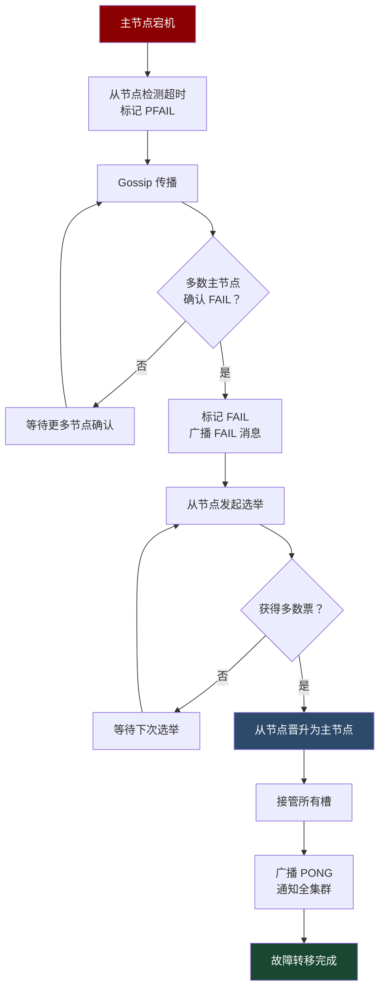

### 6.6 故障转移时间估算

| 阶段 | 耗时 | 说明 |
|------|------|------|
| PFAIL 检测 | `cluster-node-timeout` | 默认 15 秒 |
| FAIL 确认 | 1~2 个 Gossip 周期 | 约 2~5 秒 |
| 从节点选举 | 0.5~2 秒 | 延迟策略 |
| 晋升与广播 | < 1 秒 | 本地操作 |
| **总计** | **约 15~25 秒** | — |

::: info
如果 `cluster-node-timeout` 设置为 5 秒，故障转移可在约 6~10 秒内完成，但会增加网络抖动时的误判概率。需要根据网络质量权衡。
:::

---

## 七、集群拓扑与总线

### 7.1 集群总线（Cluster Bus）

每个 Redis Cluster 节点开放两个端口：

| 端口 | 用途 | 协议 |
|------|------|------|
| **6379** | 客户端连接（数据端口） | Redis Protocol |
| **16379** | 集群总线（节点间通信） | 二进制 Gossip 协议 |

```
┌─────────────────────────────────────────────────────┐
│                    Node A                             │
│                                                      │
│  :6379 ◄──── 客户端连接（读写数据）                     │
│                                                      │
│  :16379 ◄─── 集群总线（PING/PONG/MEET/FAIL）          │
│                                                      │
└─────────────────────────────────────────────────────┘
```

::: warning
防火墙必须同时放行数据端口和集群总线端口。集群总线端口 = 数据端口 + 10000。如果数据端口是 6379，总线端口就是 16379。
:::

### 7.2 集群配置文件

每个节点维护一个 `cluster-config-file`（通常命名为 `nodes-6379.conf`），它记录了集群的完整状态：

```bash
# nodes-6379.conf 示例
# 格式：<node_id> <ip:port@cport> <flags> <master_id> <ping_sent> <pong_recv> <config_epoch> <link_state> <slot>

# 主节点 A
a1b2c3d4e5f6... 10.0.0.1:6379@16379 myself,master - 0 1699000000 1 connected 0-5460

# 主节点 B
b2c3d4e5f6a1... 10.0.0.2:6379@16379 master - 0 1699000001 2 connected 5461-10922

# 主节点 C
c3d4e5f6a1b2... 10.0.0.3:6379@16379 master - 0 1699000002 3 connected 10923-16383

# 从节点 A1（A 的从节点）
d4e5f6a1b2c3... 10.0.0.4:6379@16379 slave a1b2c3d4e5f6... 0 1699000003 4 connected

# 从节点 B1（B 的从节点）
e5f6a1b2c3d4... 10.0.0.5:6379@16379 slave b2c3d4e5f6a1... 0 1699000004 5 connected

# 从节点 C1（C 的从节点）
f6a1b2c3d4e5... 10.0.0.6:6379@16379 slave c3d4e5f6a1b2... 0 1699000005 6 connected

# 变量声明
vars currentEpoch 6 vars lastVoteEpoch 0
```

### 7.3 Config Epoch——配置版本号

Config Epoch 是集群中非常重要的版本控制机制：


| 场景 | Epoch 变化 |
|------|-----------|
| 创建集群 | 每个主节点分配递增的 epoch |
| 故障转移 | 新主节点自增 epoch |
| 槽迁移 | 迁移完成后目标节点自增 epoch |
| 手动故障转移 | 新主节点自增 epoch |

::: important
Epoch 解决的核心问题是**冲突解决**：当两个节点对同一个槽的归属有不同看法时，epoch 更大的那个赢。这保证了在网络分区等极端情况下，集群最终能达成一致。
:::

---

## 八、集群限制与注意事项

### 8.1 跨槽操作限制

```bash
# ❌ 跨槽 MGET 会报错
MGET user:1 name order:1 detail
# CROSSSLOT Keys in request don't hash to the same slot

# ✅ 使用 Hash Tag 解决
MGET {user}:1:name {user}:1:detail

# ❌ 跨槽事务
MULTI
SET user:1:name "张三"
SET order:1:status "paid"
EXEC
# CROSSSLOT

# ✅ 使用 Hash Tag
MULTI
SET {user}:1:name "张三"
SET {user}:1:status "active"
EXEC
```

### 8.2 其他限制

| 限制 | 说明 | 解决方案 |
|------|------|---------|
| 只能使用 DB0 | `SELECT` 命令不可用 | 使用 key 前缀区分命名空间 |
| 跨槽 MGET/MSET | 不支持跨槽批量操作 | 使用 Hash Tag 或 Pipeline |
| 跨槽事务 | `MULTI/EXEC` 中的键必须同槽 | Hash Tag |
| 跨槽 Lua 脚本 | 脚本中访问的所有键必须同槽 | Hash Tag + KEYS 参数 |
| `KEYS *` | 只返回本节点的键 | 使用 `SCAN` 遍历所有节点 |
| `FLUSHALL` | 只清空本节点 | 逐节点执行 |
| 集群模式下 Pub/Sub | `PUBLISH` 会广播到所有节点 | Redis 7.0+ Sharded Pub/Sub |

### 8.3 集群规模建议


::: warning
Redis Cluster 不建议超过 1000 个主节点。当节点数过多时，Gossip 协议的心跳开销会显著增加，节点间状态同步变慢，故障检测延迟增大。实际上，大多数生产集群在 3~30 个主节点之间。
:::

---

## 九、集群数据一致性

### 9.1 最终一致性

Redis Cluster 采用**异步复制**，主节点写入成功后立即返回客户端，数据异步同步到从节点：

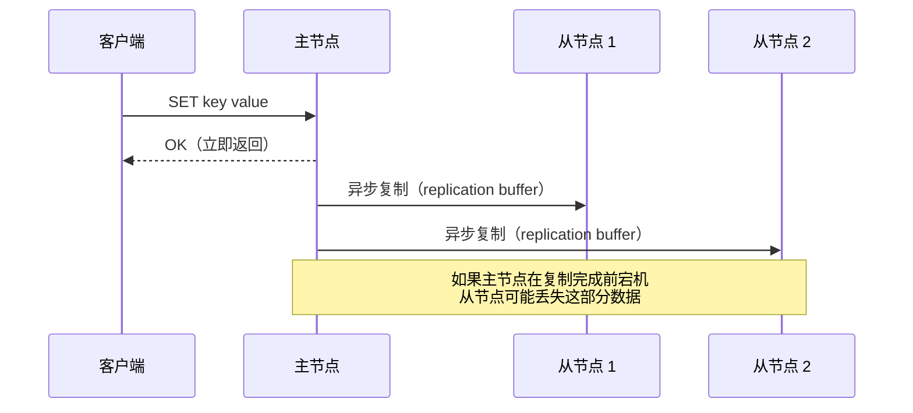

### 9.2 WAIT 命令——弱同步

```bash
# 等待至少 2 个从节点确认复制
SET key value
WAIT 2 5000  # 等待 2 个从节点，最多等 5 秒

# 返回值：实际确认的从节点数
# 如果返回 2，说明数据已同步到 2 个从节点
```

::: info
`WAIT` 不保证强一致性——它只保证在主节点故障时，已确认的从节点拥有数据。但如果是网络分区导致的脑裂，仍可能出现数据不一致。
:::

### 9.3 数据丢失场景

| 场景 | 丢失量 | 原因 |
|------|-------|------|
| 主节点宕机，从节点已同步 | 0 | 正常故障转移 |
| 主节点宕机，从节点落后 | 少量（异步复制延迟） | 复制偏移量差异 |
| 网络分区，旧主仍在接受写入 | 可能较多 | 脑裂场景 |

---

## 十、集群与 Sentinel 的对比

| 维度 | Redis Cluster | Sentinel |
|------|--------------|----------|
| 数据分片 | 支持（16384 槽） | 不支持 |
| 故障转移 | 内置 | 独立进程 |
| 扩容 | 在线扩容 | 不支持 |
| 跨节点操作 | 受限（需 Hash Tag） | 不受限 |
| 部署复杂度 | 较高（至少 6 节点） | 较低（3~5 Sentinel） |
| 适用场景 | 大数据量 / 高 QPS | 只需高可用，不分片 |

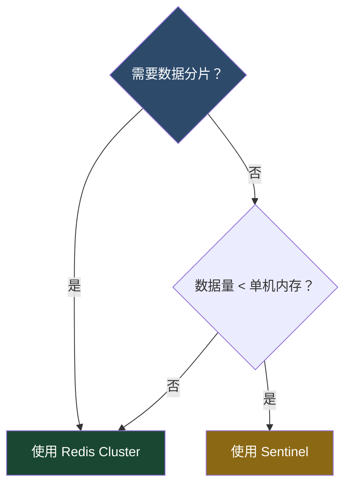

::: tip 选型建议
- 数据量 < 单机内存，只需高可用 → **Sentinel**
- 数据量 > 单机内存，或 QPS 超过单机 → **Cluster**
- 已有 Sentinel 架构，数据量增长 → 迁移到 Cluster
:::

---

## 十一、关键配置参数一览

| 参数 | 默认值 | 说明 |
|------|-------|------|
| `cluster-enabled` | no | 是否开启集群模式 |
| `cluster-config-file` | nodes.conf | 集群配置文件（自动生成和维护） |
| `cluster-node-timeout` | 15000ms | 节点超时时间 |
| `cluster-announce-ip` | "" | 对外宣告的 IP（NAT 环境下使用） |
| `cluster-announce-port` | 0 | 对外宣告的数据端口 |
| `cluster-announce-bus-port` | 0 | 对外宣告的总线端口 |
| `cluster-require-full-coverage` | yes | 是否要求所有槽都有主节点才能服务 |
| `cluster-allow-reads-when-down` | no | 集群下线时是否允许从节点读 |
| `cluster-migration-barrier` | 1 | 从节点迁移屏障 |

### 完整配置示例

```bash
# redis.conf — 集群模式配置
port 6379
cluster-enabled yes
cluster-config-file nodes-6379.conf
cluster-node-timeout 15000
cluster-announce-ip 10.0.0.1
cluster-announce-port 6379
cluster-announce-bus-port 16379
cluster-require-full-coverage yes
cluster-allow-reads-when-down no
cluster-migration-barrier 1

# 持久化配置
appendonly yes
appendfsync everysec

# 内存配置
maxmemory 4gb
maxmemory-policy noeviction
```

---

## 十二、常见问题排查

### 12.1 集群状态不是 OK

```bash
# 检查集群状态
CLUSTER INFO
# cluster_state:fail  ← 不正常
# cluster_state:ok    ← 正常

# 检查槽覆盖情况
CLUSTER INFO | grep slots_ok
# slots_ok:16384     ← 全部槽已分配
# slots_ok:10922     ← 有槽未分配，集群不可用
```

常见原因：
- 有主节点宕机且无可用从节点
- 正在扩容/缩容，槽未完全迁移
- `cluster-require-full-coverage yes`（默认），任何槽无主节点都会导致集群不可用

### 12.2 大量 MOVED 错误

```bash
# 查看客户端统计
CLUSTER INFO | grep move
```

可能原因：
- 刚完成槽迁移，客户端缓存未更新
- 网络分区导致部分节点视图不一致

解决方案：
- 使用 Smart Client，自动处理重定向
- 确保客户端定期刷新槽映射

### 12.3 节点无法加入集群

```bash
# 确认节点配置
CONFIG GET cluster-enabled
# 1) "cluster-enabled"
# 2) "yes"    ← 必须为 yes

# 检查端口连通性
redis-cli -h 10.0.0.5 -p 6379 PING
redis-cli -h 10.0.0.5 -p 16379 PING  # 总线端口
```

---

## 十三、总结

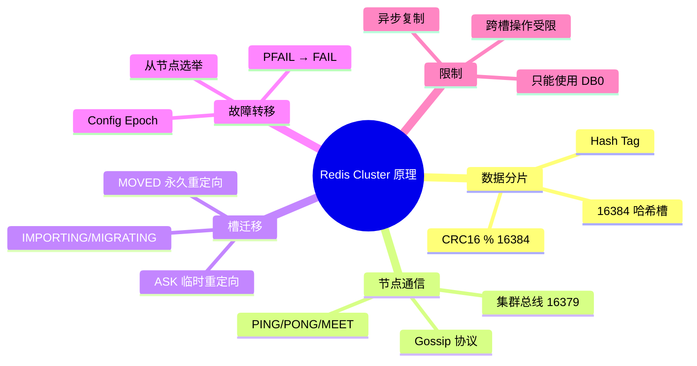

::: important 核心要点
1. **16384 槽**是 Cluster 分片的数学基础，CRC16(key) % 16384 确定键的归属
2. **Gossip 协议**实现去中心化的状态同步，无需中心节点
3. **ASK/MOVED** 是迁移期间的两种重定向机制，客户端必须正确处理
4. **PFAIL → FAIL** 是两阶段故障检测，避免网络抖动误判
5. **异步复制**意味着 Cluster 不保证强一致性，`WAIT` 可提供弱同步保障
:::
