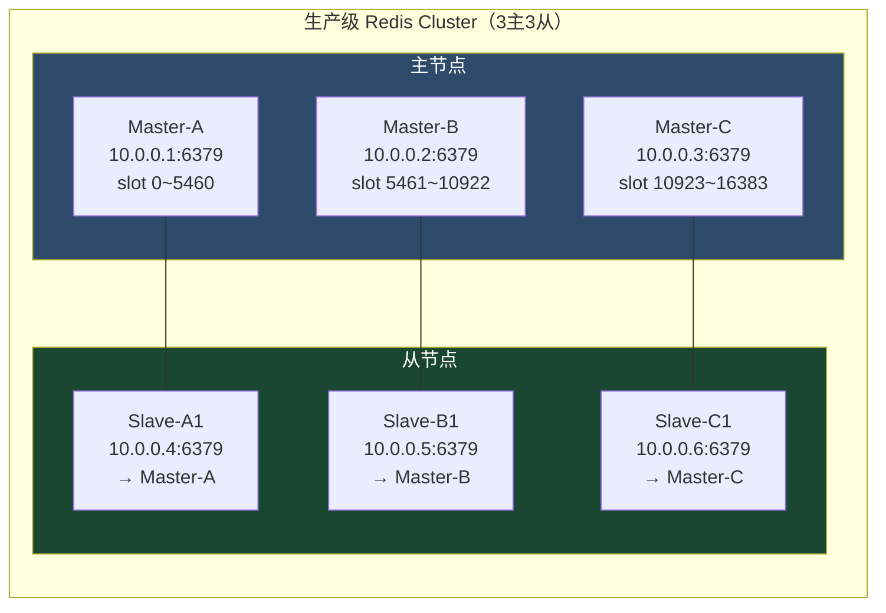
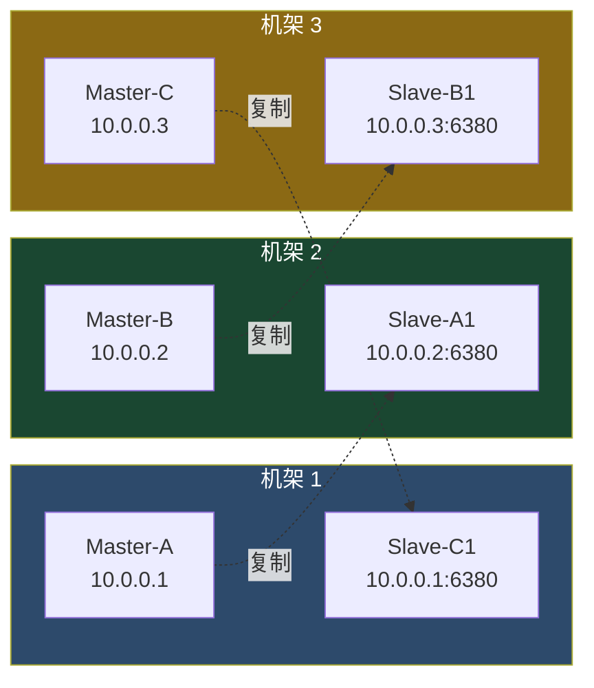
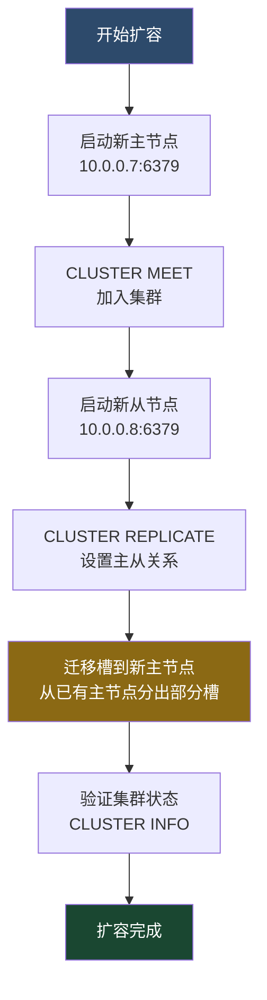
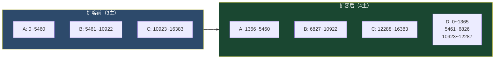
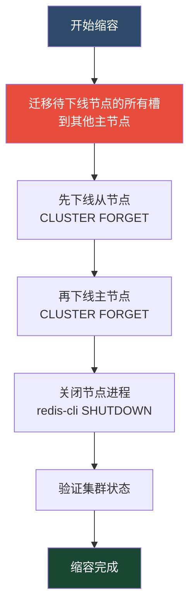
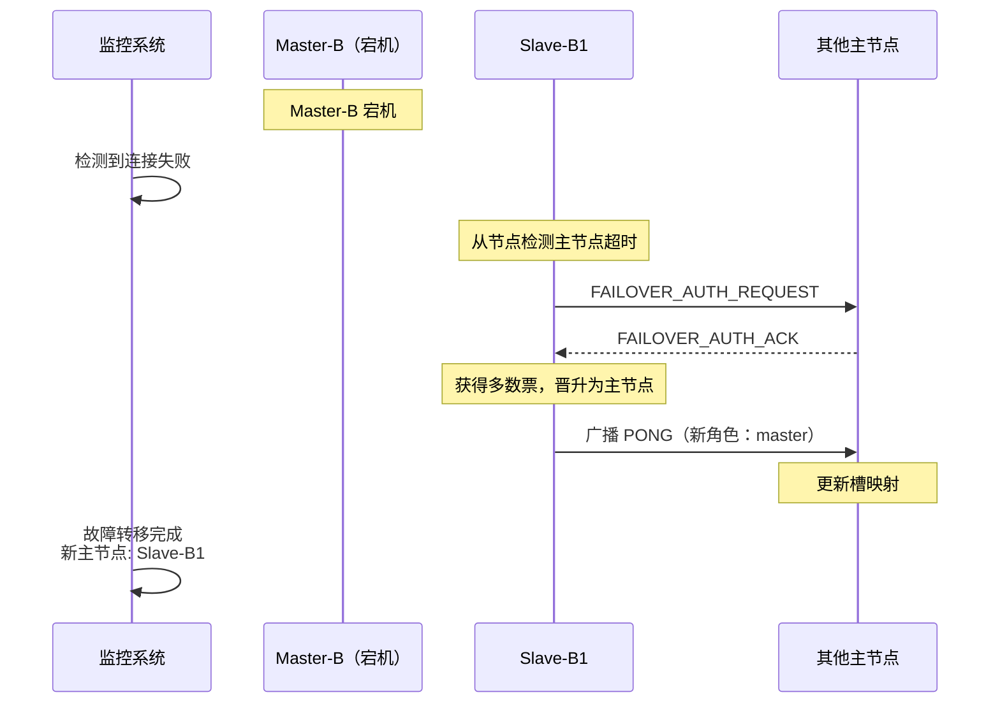
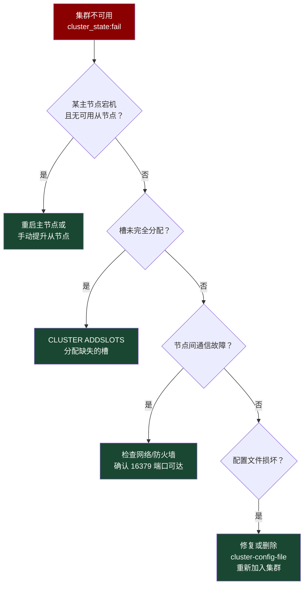
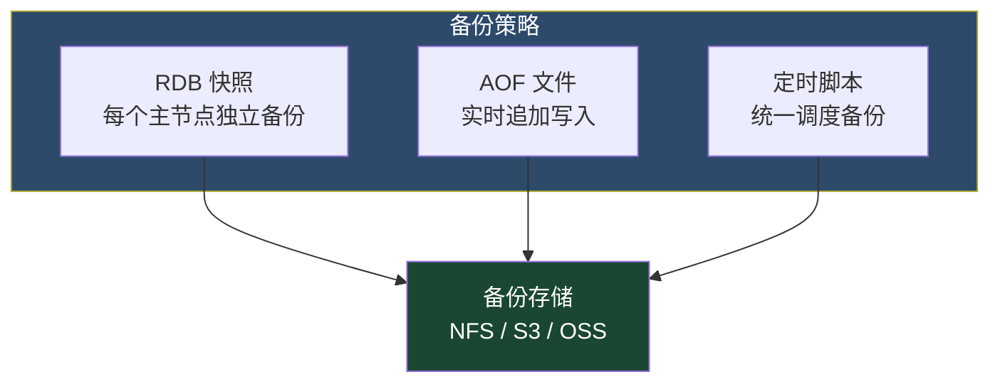
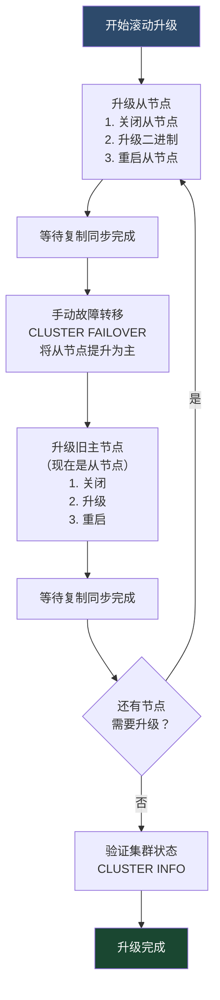
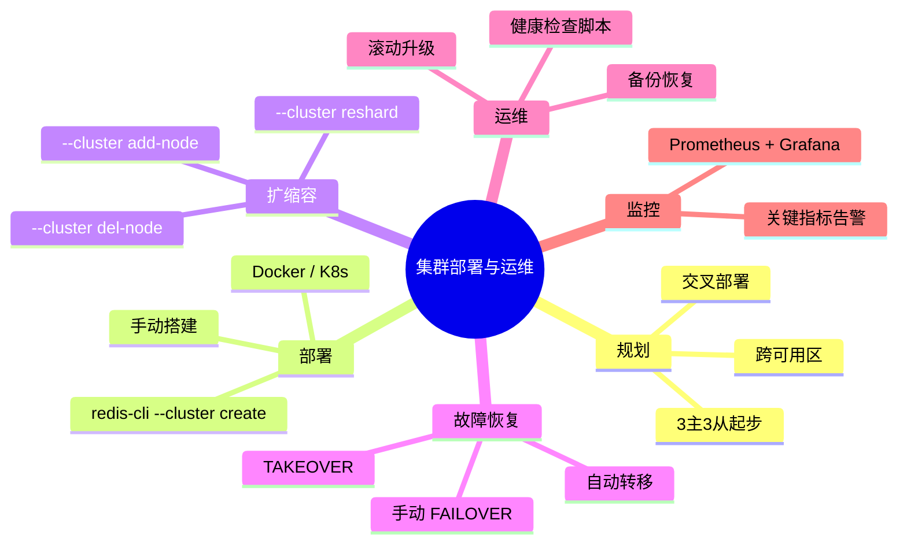

# 02 · 集群部署与运维

> **本篇回答：** 如何从零搭建一个生产级 Redis Cluster？在线扩容和缩容的具体操作步骤是什么？集群常见故障如何排查和恢复？

---

## 一、集群规划

### 1.1 节点角色与数量

一个标准的 Redis Cluster 至少需要 **6 个节点**：3 主 + 3 从。



### 1.2 部署拓扑选择

| 拓扑 | 优点 | 缺点 | 适用场景 |
|------|------|------|---------|
| **跨机架部署** | 机架级容灾 | 延迟略高 | 生产环境（推荐） |
| **跨可用区部署** | AZ 级容灾 | 跨区网络延迟 | 云上高可用 |
| **同机架部署** | 低延迟 | 机架故障全丢 | 开发/测试环境 |

::: important 生产部署原则
1. **主从不在同一物理机**：避免单机故障导致主从同时丢失
2. **主从不在同一机架**：避免机架级故障
3. **至少跨 2 个可用区**：云上环境建议 3 主分布在 3 个 AZ
4. **从节点与主节点交叉部署**：如 A 的从节点放在 B 所在的机器上
:::

### 1.3 交叉部署方案

```
┌─────────────────────────────────────────────────────┐
│ 机架 1            │ 机架 2            │ 机架 3       │
│ 10.0.0.1          │ 10.0.0.2          │ 10.0.0.3    │
│ Master-A          │ Master-B          │ Master-C    │
│ Slave-C1          │ Slave-A1          │ Slave-B1    │
└─────────────────────────────────────────────────────┘
```



---

## 二、手动搭建 6 节点集群

### 2.1 环境准备

```bash
# 6 台机器的 IP 规划
10.0.0.1  # Master-A + 6379/16379
10.0.0.2  # Master-B + 6379/16379
10.0.0.3  # Master-C + 6379/16379
10.0.0.4  # Slave-A1 + 6379/16379
10.0.0.5  # Slave-B1 + 6379/16379
10.0.0.6  # Slave-C1 + 6379/16379
```

### 2.2 编译安装 Redis

```bash
# 在每台机器上执行
wget https://github.com/redis/redis/archive/refs/tags/7.2.4.tar.gz
tar xzf 7.2.4.tar.gz
cd redis-7.2.4
make -j$(nproc) BUILD_TLS=yes
sudo make install

# 验证
redis-server --version
# Redis server v=7.2.4 sha=00000000:0 malloc=jemalloc bits=64 build=...
```

### 2.3 配置文件

每台节点的 `redis.conf`：

```bash
# ============================================
# 基础配置
# ============================================
bind 0.0.0.0
port 6379
daemonize yes
pidfile /var/run/redis_6379.pid
logfile /var/log/redis/redis_6379.log
dir /data/redis/6379

# ============================================
# 集群配置
# ============================================
cluster-enabled yes
cluster-config-file nodes-6379.conf
cluster-node-timeout 15000
cluster-announce-ip 10.0.0.1    # ← 每台机器改成自己的 IP
cluster-announce-port 6379
cluster-announce-bus-port 16379
cluster-require-full-coverage yes
cluster-allow-reads-when-down no
cluster-migration-barrier 1

# ============================================
# 持久化配置
# ============================================
save 900 1
save 300 10
save 60 10000
appendonly yes
appendfilename "appendonly.aof"
appendfsync everysec

# ============================================
# 内存配置
# ============================================
maxmemory 8gb
maxmemory-policy noeviction

# ============================================
# 慢查询配置
# ============================================
slowlog-log-slower-than 10000
slowlog-max-len 128

# ============================================
# 安全配置
# ============================================
requirepass your_strong_password_here
masterauth your_strong_password_here
```

::: warning
`cluster-announce-ip` 必须设置为其他节点可达的 IP。在 NAT / Docker 环境下尤其重要，否则其他节点无法正确连接。`requirepass` 和 `masterauth` 必须一致，否则从节点无法复制。
:::

### 2.4 逐节点启动

```bash
# 在每台机器上执行
redis-server /etc/redis/redis.conf

# 验证启动
redis-cli -h 10.0.0.1 -a your_strong_password_here ping
# PONG
```

### 2.5 创建集群

#### 方法一：redis-cli --cluster create（推荐）

```bash
redis-cli -a your_strong_password_here \
  --cluster create \
  10.0.0.1:6379 10.0.0.2:6379 10.0.0.3:6379 \
  10.0.0.4:6379 10.0.0.5:6379 10.0.0.6:6379 \
  --cluster-replicas 1

# 输出：
# >>> Performing hash slots allocation on 6 nodes...
# Master[0] -> Slots 0 - 5460
# Master[1] -> Slots 5461 - 10922
# Master[2] -> Slots 10923 - 16383
# Adding replica 10.0.0.5:6379 to 10.0.0.1:6379
# Adding replica 10.0.0.6:6379 to 10.0.0.2:6379
# Adding replica 10.0.0.4:6379 to 10.0.0.3:6379
#
# Can I set the above configuration? (type 'yes' to accept): yes
# >>> Nodes configuration updated
# >>> Assign a different config epoch to each node
# >>> Sending CLUSTER MEET messages to join the cluster
# ...
# [OK] All 16384 slots covered.
```

#### 方法二：手动创建（理解原理）

```bash
# 第一步：节点握手
redis-cli -h 10.0.0.1 -a your_strong_password_here \
  CLUSTER MEET 10.0.0.2 6379
redis-cli -h 10.0.0.1 -a your_strong_password_here \
  CLUSTER MEET 10.0.0.3 6379
redis-cli -h 10.0.0.1 -a your_strong_password_here \
  CLUSTER MEET 10.0.0.4 6379
redis-cli -h 10.0.0.1 -a your_strong_password_here \
  CLUSTER MEET 10.0.0.5 6379
redis-cli -h 10.0.0.1 -a your_strong_password_here \
  CLUSTER MEET 10.0.0.6 6379

# 第二步：分配槽（主节点）
redis-cli -h 10.0.0.1 -a your_strong_password_here \
  CLUSTER ADDSLOTS {0..5460}
redis-cli -h 10.0.0.2 -a your_strong_password_here \
  CLUSTER ADDSLOTS {5461..10922}
redis-cli -h 10.0.0.3 -a your_strong_password_here \
  CLUSTER ADDSLOTS {10923..16383}

# 第三步：设置主从关系
redis-cli -h 10.0.0.4 -a your_strong_password_here \
  CLUSTER REPLICATE <node_id_of_master_c>
redis-cli -h 10.0.0.5 -a your_strong_password_here \
  CLUSTER REPLICATE <node_id_of_master_a>
redis-cli -h 10.0.0.6 -a your_strong_password_here \
  CLUSTER REPLICATE <node_id_of_master_b>
```

::: tip
手动创建虽然繁琐，但能帮助你深入理解 Cluster 的工作原理：握手 → 分槽 → 设置主从。`--cluster create` 本质上就是自动执行这些步骤。
:::

### 2.6 验证集群状态

```bash
# 检查集群信息
redis-cli -h 10.0.0.1 -a your_strong_password_here CLUSTER INFO

# 关键指标：
# cluster_state:ok
# cluster_slots_ok:16384
# cluster_slots_assigned:16384
# cluster_known_nodes:6
# cluster_size:3
```

```bash
# 查看节点详情
redis-cli -h 10.0.0.1 -a your_strong_password_here CLUSTER NODES

# 示例输出：
# a1b2... 10.0.0.1:6379@16379 myself,master - 0 1699000000 1 connected 0-5460
# b2c3... 10.0.0.2:6379@16379 master - 0 1699000001 2 connected 5461-10922
# c3d4... 10.0.0.3:6379@16379 master - 0 1699000002 3 connected 10923-16383
# d4e5... 10.0.0.4:6379@16379 slave c3d4... 0 1699000003 4 connected
# e5f6... 10.0.0.5:6379@16379 slave a1b2... 0 1699000004 5 connected
# f6a1... 10.0.0.6:6379@16379 slave b2c3... 0 1699000005 6 connected
```

---

## 三、集群扩容

### 3.1 扩容流程概览

从 3 主 3 从扩展到 4 主 4 从：



### 3.2 详细操作步骤

#### 第一步：启动新节点

```bash
# 新主节点 10.0.0.7
redis-server /etc/redis/redis.conf  # 修改 cluster-announce-ip

# 新从节点 10.0.0.8
redis-server /etc/redis/redis.conf
```

#### 第二步：加入集群

```bash
# 在任意已有节点上执行
redis-cli -h 10.0.0.1 -a your_strong_password_here \
  CLUSTER MEET 10.0.0.7 6379
redis-cli -h 10.0.0.1 -a your_strong_password_here \
  CLUSTER MEET 10.0.0.8 6379

# 设置主从关系
redis-cli -h 10.0.0.8 -a your_strong_password_here \
  CLUSTER REPLICATE <node_id_of_10.0.0.7>
```

#### 第三步：迁移槽到新主节点

```bash
# 使用 redis-cli --cluster reshard
redis-cli -a your_strong_password_here \
  --cluster reshard 10.0.0.1:6379

# 交互式输入：
# How many slots do you want to move? 4096
#   （16384 / 4 主节点 ≈ 4096 个槽）
# What is the receiving node ID? <node_id_of_10.0.0.7>
# Source node #1: all
# Do you want to proceed with the proposed reshard plan? yes
```

#### 一键式扩容命令

```bash
# 非交互式执行（推荐脚本化）
redis-cli -a your_strong_password_here \
  --cluster reshard 10.0.0.1:6379 \
  --cluster-slots 4096 \
  --cluster-target-node <node_id_of_new_master> \
  --cluster-from all \
  --cluster-yes
```

### 3.3 扩容期间的槽迁移细节



::: important
扩容期间集群正常服务，但迁移槽中的大 Key 会短暂阻塞源节点（MIGRATE 命令是同步的）。建议在低峰期执行扩容，或使用 `--cluster-pipeline` 参数控制每次迁移的键数。
:::

---

## 四、集群缩容

### 4.1 缩容流程



### 4.2 详细操作步骤

#### 第一步：迁移槽

```bash
# 查看待下线主节点拥有的槽
redis-cli -h 10.0.0.7 -a your_strong_password_here CLUSTER NODES | grep master

# 将槽迁移到其他主节点
redis-cli -a your_strong_password_here \
  --cluster reshard 10.0.0.1:6379 \
  --cluster-slots 4096 \
  --cluster-target-node <node_id_of_target_master> \
  --cluster-from <node_id_of_node_to_remove> \
  --cluster-yes

# 重复执行，直到待下线节点的所有槽都已迁出
```

#### 第二步：使用 --cluster del-node

```bash
# 先删除从节点
redis-cli -a your_strong_password_here \
  --cluster del-node 10.0.0.1:6379 <node_id_of_slave_to_remove>

# 再删除主节点（槽必须已全部迁出）
redis-cli -a your_strong_password_here \
  --cluster del-node 10.0.0.1:6379 <node_id_of_master_to_remove>
```

#### 第三步：关闭节点

```bash
redis-cli -h 10.0.0.7 -a your_strong_password_here SHUTDOWN NOSAVE
redis-cli -h 10.0.0.8 -a your_strong_password_here SHUTDOWN NOSAVE
```

::: warning
缩容时必须**先迁出所有槽**再删除主节点。如果主节点仍有槽，`del-node` 会拒绝执行。缩容后集群的槽数仍为 16384，只是每个主节点承担更多的槽。
:::

---

## 五、集群故障恢复

### 5.1 主节点宕机——自动故障转移



#### 手动检查与确认

```bash
# 查看集群节点状态
redis-cli -h 10.0.0.1 -a your_strong_password_here CLUSTER NODES | grep fail

# 如果自动转移成功，可以看到：
# b2c3... 10.0.0.2:6379@16379 master,fail - 1699000001 2 disconnected
# e5f6... 10.0.0.5:6379@16379 master - 0 1699000100 7 connected 5461-10922
```

### 5.2 从节点也宕机——手动恢复

当主从都宕机时，集群会进入 `fail` 状态：

```bash
# 检查集群状态
redis-cli -h 10.0.0.1 -a your_strong_password_here CLUSTER INFO
# cluster_state:fail
# cluster_slots_ok:10922
# cluster_slots_assigned:16383
```

恢复步骤：

```bash
# 第一步：重启宕机的主节点或从节点
redis-server /etc/redis/redis.conf

# 如果主节点恢复，从节点会自动重新连接
# 如果只有从节点恢复，它会尝试与主节点连接

# 第二步：如果主节点无法恢复，手动提升从节点
redis-cli -h 10.0.0.5 -a your_strong_password_here \
  CLUSTER FAILOVER TAKEOVER

# 第三步：验证集群状态
redis-cli -h 10.0.0.1 -a your_strong_password_here CLUSTER INFO
# cluster_state:ok
```

### 5.3 手动故障转移

有时需要主动将主节点切换到从节点（如主节点硬件维护）：

```bash
# 在从节点上执行（推荐：正常转移）
redis-cli -h 10.0.0.5 -a your_strong_password_here \
  CLUSTER FAILOVER

# 强制转移（主节点不可达时使用，有数据丢失风险）
redis-cli -h 10.0.0.5 -a your_strong_password_here \
  CLUSTER FAILOVER TAKEOVER

# 安全转移（等待主节点确认，无数据丢失）
redis-cli -h 10.0.0.5 -a your_strong_password_here \
  CLUSTER FAILOVER
```

| 选项 | 说明 | 数据丢失风险 |
|------|------|------------|
| `CLUSTER FAILOVER` | 正常转移，等主节点确认 | 无 |
| `CLUSTER FAILOVER FORCE` | 不等主节点确认 | 可能（异步复制延迟） |
| `CLUSTER FAILOVER TAKEOVER` | 跳过选举，直接接管 | 可能（跳过多数派确认） |

::: warning
`TAKEOVER` 是最后的手段，它会跳过选举流程直接提升从节点，可能导致数据不一致。只在主从都不可达的极端情况下使用。
:::

### 5.4 集群不可用的常见原因



---

## 六、cluster-config-file 详解

### 6.1 文件格式

```bash
# nodes-6379.conf 示例

# 节点记录格式：
# <node_id> <ip:port@cport> <flags> <master_node_id> <ping_sent> <pong_recv> <config_epoch> <link_state> <slot_range>

a1b2c3d4e5f6a7b8c9d0e1f2a3b4c5d6e7f8a9b0 10.0.0.1:6379@16379 myself,master - 0 1699000000 1 connected 0-5460
b2c3d4e5f6a7b8c9d0e1f2a3b4c5d6e7f8a9b0c1 10.0.0.2:6379@16379 master - 0 1699000001 2 connected 5461-10922
c3d4e5f6a7b8c9d0e1f2a3b4c5d6e7f8a9b0c1d2 10.0.0.3:6379@16379 master - 0 1699000002 3 connected 10923-16383
d4e5f6a7b8c9d0e1f2a3b4c5d6e7f8a9b0c1d2e3 10.0.0.4:6379@16379 slave c3d4... 0 1699000003 4 connected
e5f6a7b8c9d0e1f2a3b4c5d6e7f8a9b0c1d2e3f4 10.0.0.5:6379@16379 slave a1b2... 0 1699000004 5 connected
f6a7b8c9d0e1f2a3b4c5d6e7f8a9b0c1d2e3f4a5 10.0.0.6:6379@16379 slave b2c3... 0 1699000005 6 connected

vars currentEpoch 6
vars lastVoteEpoch 0
```

### 6.2 字段含义

| 字段 | 含义 | 示例 |
|------|------|------|
| node_id | 40 字符的节点唯一 ID | `a1b2c3d4...` |
| ip:port@cport | IP:数据端口@总线端口 | `10.0.0.1:6379@16379` |
| flags | 节点标志 | `myself,master` / `slave` / `fail` / `pfail` |
| master_node_id | 主节点 ID（从节点填写） | `-` 表示自己是主节点 |
| ping_sent | 最后发送 PING 的时间戳 | `0` |
| pong_recv | 最后收到 PONG 的时间戳 | `1699000000` |
| config_epoch | 配置纪元 | `1` |
| link_state | 连接状态 | `connected` / `disconnected` |
| slot_range | 槽范围 | `0-5460` / 空（从节点） |

### 6.3 维护注意事项

::: warning
1. **不要手动编辑** cluster-config-file，Redis 会自动维护
2. **不要删除**该文件，否则节点丢失集群信息
3. 如果节点无法启动，检查该文件中的 IP 是否可达
4. 替换磁盘时确保该文件已同步到新磁盘
:::

---

## 七、集群运维脚本

### 7.1 健康检查脚本

```bash
#!/bin/bash
# redis-cluster-health-check.sh
# 用法：./redis-cluster-health-check.sh <任一节点IP> [密码]

HOST=${1:-"127.0.0.1"}
PORT=6379
PASS=${2:-""}

AUTH_CMD=""
if [ -n "$PASS" ]; then
  AUTH_CMD="-a $PASS"
fi

echo "========================================"
echo "Redis Cluster 健康检查"
echo "时间: $(date '+%Y-%m-%d %H:%M:%S')"
echo "========================================"

# 1. 集群状态
CLUSTER_STATE=$(redis-cli -h $HOST -p $PORT $AUTH_CMD CLUSTER INFO | grep cluster_state | cut -d: -f2 | tr -d '\r')
echo ""
echo "1. 集群状态: $CLUSTER_STATE"
if [ "$CLUSTER_STATE" != "ok" ]; then
  echo "   ⚠️  集群状态异常！"
fi

# 2. 槽覆盖
SLOTS_OK=$(redis-cli -h $HOST -p $PORT $AUTH_CMD CLUSTER INFO | grep cluster_slots_ok | cut -d: -f2 | tr -d '\r')
SLOTS_PFAIL=$(redis-cli -h $HOST -p $PORT $AUTH_CMD CLUSTER INFO | grep cluster_slots_pfailing | cut -d: -f2 | tr -d '\r')
SLOTS_FAIL=$(redis-cli -h $HOST -p $PORT $AUTH_CMD CLUSTER INFO | grep cluster_slots_failing | cut -d: -f2 | tr -d '\r')
echo ""
echo "2. 槽状态:"
echo "   OK: $SLOTS_OK / 16384"
echo "   PFAIL: $SLOTS_PFAIL"
echo "   FAIL: $SLOTS_FAIL"

# 3. 节点数量
KNOWN_NODES=$(redis-cli -h $HOST -p $PORT $AUTH_CMD CLUSTER INFO | grep cluster_known_nodes | cut -d: -f2 | tr -d '\r')
MASTERS=$(redis-cli -h $HOST -p $PORT $AUTH_CMD CLUSTER NODES | grep master | grep -v fail | wc -l)
SLAVES=$(redis-cli -h $HOST -p $PORT $AUTH_CMD CLUSTER NODES | grep slave | grep -v fail | wc -l)
FAIL_NODES=$(redis-cli -h $HOST -p $PORT $AUTH_CMD CLUSTER NODES | grep fail | wc -l)
echo ""
echo "3. 节点数量:"
echo "   总计: $KNOWN_NODES"
echo "   主节点: $MASTERS"
echo "   从节点: $SLAVES"
echo "   故障节点: $FAIL_NODES"

# 4. 各主节点内存使用
echo ""
echo "4. 各主节点内存使用:"
MASTERS_INFO=$(redis-cli -h $HOST -p $PORT $AUTH_CMD CLUSTER NODES | grep master | grep -v fail)
while IFS= read -r line; do
  NODE_IP=$(echo $line | awk '{print $2}' | cut -d: -f1)
  NODE_PORT=$(echo $line | awk '{print $2}' | cut -d: -f2 | cut -d@ -f1)
  MEM=$(redis-cli -h $NODE_IP -p $NODE_PORT $AUTH_CMD INFO memory | grep used_memory_human | cut -d: -f2 | tr -d '\r')
  SLOTS=$(echo $line | awk '{print $NF}')
  echo "   $NODE_IP:$NODE_PORT  内存: $MEM  槽: $SLOTS"
done <<< "$MASTERS_INFO"

# 5. 复制延迟
echo ""
echo "5. 各从节点复制延迟:"
SLAVES_INFO=$(redis-cli -h $HOST -p $PORT $AUTH_CMD CLUSTER NODES | grep slave | grep -v fail)
while IFS= read -r line; do
  NODE_IP=$(echo $line | awk '{print $2}' | cut -d: -f1)
  NODE_PORT=$(echo $line | awk '{print $2}' | cut -d: -f2 | cut -d@ -f1)
  LAG=$(redis-cli -h $NODE_IP -p $NODE_PORT $AUTH_CMD INFO replication | grep master_repl_offset | head -1)
  echo "   $NODE_IP:$NODE_PORT  $LAG"
done <<< "$SLAVES_INFO"

echo ""
echo "========================================"
echo "检查完成"
echo "========================================"
```

### 7.2 批量数据导入脚本

```bash
#!/bin/bash
# redis-cluster-bulk-import.sh
# 用法：./redis-cluster-bulk-import.sh <节点IP> <数据文件> [密码]

HOST=${1:-"127.0.0.1"}
PORT=6379
DATA_FILE=$2
PASS=${3:-""}

AUTH_CMD=""
if [ -n "$PASS" ]; then
  AUTH_CMD="-a $PASS"
fi

if [ ! -f "$DATA_FILE" ]; then
  echo "数据文件不存在: $DATA_FILE"
  exit 1
fi

echo "开始导入数据: $DATA_FILE"
COUNT=0
ERROR=0

while IFS= read -r line; do
  # 解析数据文件格式：SET key value
  RESULT=$(redis-cli -h $HOST -p $PORT $AUTH_CMD -c $line 2>&1)
  if echo "$RESULT" | grep -q "OK\|QUEUED"; then
    COUNT=$((COUNT + 1))
  else
    ERROR=$((ERROR + 1))
    echo "ERROR: $line -> $RESULT"
  fi

  # 进度显示
  if [ $((COUNT % 1000)) -eq 0 ]; then
    echo "已导入: $COUNT 条, 错误: $ERROR 条"
  fi
done < "$DATA_FILE"

echo ""
echo "导入完成: 成功 $COUNT 条, 失败 $ERROR 条"
```

### 7.3 槽迁移监控脚本

```bash
#!/bin/bash
# redis-cluster-migration-monitor.sh
# 监控集群槽迁移进度

HOST=${1:-"127.0.0.1"}
PORT=6379
PASS=${2:-""}

AUTH_CMD=""
if [ -n "$PASS" ]; then
  AUTH_CMD="-a $PASS"
fi

echo "监控集群槽迁移进度（每 5 秒刷新，Ctrl+C 退出）"
echo ""

while true; do
  CLEAR
  echo "========================================"
  echo "集群槽分布 - $(date '+%H:%M:%S')"
  echo "========================================"

  redis-cli -h $HOST -p $PORT $AUTH_CMD CLUSTER NODES | \
    grep -v "handshake" | \
    while IFS= read -r line; do
      NODE_ID=$(echo $line | awk '{print $1}' | cut -c1-8)
      NODE_ADDR=$(echo $line | awk '{print $2}')
      NODE_FLAGS=$(echo $line | awk '{print $3}')
      NODE_SLOTS=$(echo $line | awk '{print $NF}')

      if echo "$NODE_FLAGS" | grep -q "master"; then
        SLOT_COUNT=0
        if [ "$NODE_SLOTS" != "connected" ] && [ -n "$NODE_SLOTS" ]; then
          # 简单统计槽数
          SLOT_COUNT=$(echo "$NODE_SLOTS" | tr ',' '\n' | while read range; do
            if echo "$range" | grep -q "-"; then
              START=$(echo "$range" | cut -d- -f1)
              END=$(echo "$range" | cut -d- -f2)
              echo $((END - START + 1))
            else
              echo 1
            fi
          done | awk '{s+=$1} END {print s}')
        fi
        echo "  主节点 $NODE_ADDR ($NODE_ID)  槽数: $SLOT_COUNT"
      fi
    done

  CLUSTER_STATE=$(redis-cli -h $HOST -p $PORT $AUTH_CMD CLUSTER INFO | grep cluster_state | cut -d: -f2 | tr -d '\r')
  echo ""
  echo "集群状态: $CLUSTER_STATE"
  echo "========================================"

  sleep 5
done
```

### 7.4 自动故障恢复脚本

```bash
#!/bin/bash
# redis-cluster-auto-recovery.sh
# 检测集群中的孤立主节点（无从节点）并发出告警

HOST=${1:-"127.0.0.1"}
PORT=6379
PASS=${2:-""}
WEBHOOK_URL=${3:-""}  # 企业微信/钉钉 Webhook

AUTH_CMD=""
if [ -n "$PASS" ]; then
  AUTH_CMD="-a $PASS"
fi

echo "检查集群健康状态..."

# 获取所有主节点
MASTERS=$(redis-cli -h $HOST -p $PORT $AUTH_CMD CLUSTER NODES | grep master | grep -v fail)

while IFS= read -r master_line; do
  MASTER_ID=$(echo $master_line | awk '{print $1}')
  MASTER_ADDR=$(echo $master_line | awk '{print $2}')

  # 查找该主节点的从节点
  SLAVE_COUNT=$(redis-cli -h $HOST -p $PORT $AUTH_CMD CLUSTER NODES | grep slave | grep "$MASTER_ID" | grep -v fail | wc -l)

  if [ "$SLAVE_COUNT" -eq 0 ]; then
    MSG="⚠️ 孤立主节点告警: $MASTER_ADDR (ID: ${MASTER_ID:0:8}...) 没有可用从节点！"
    echo "$MSG"

    # 发送告警
    if [ -n "$WEBHOOK_URL" ]; then
      curl -s -X POST "$WEBHOOK_URL" \
        -H 'Content-Type: application/json' \
        -d "{\"content\": \"$MSG\"}" > /dev/null
    fi
  fi
done <<< "$MASTERS"

# 检查集群状态
CLUSTER_STATE=$(redis-cli -h $HOST -p $PORT $AUTH_CMD CLUSTER INFO | grep cluster_state | cut -d: -f2 | tr -d '\r')
if [ "$CLUSTER_STATE" != "ok" ]; then
  MSG="🔴 集群状态异常: cluster_state=$CLUSTER_STATE"
  echo "$MSG"

  if [ -n "$WEBHOOK_URL" ]; then
    curl -s -X POST "$WEBHOOK_URL" \
      -H 'Content-Type: application/json' \
      -d "{\"content\": \"$MSG\"}" > /dev/null
  fi
fi

echo "检查完成"
```

---

## 八、Docker 部署集群

### 8.1 Docker Compose 配置

```yaml
# docker-compose.yml
version: '3.8'

services:
  redis-node-1:
    image: redis:7.2.4
    container_name: redis-node-1
    ports:
      - "6379:6379"
      - "16379:16379"
    command: >
      redis-server
      --cluster-enabled yes
      --cluster-config-file nodes.conf
      --cluster-node-timeout 15000
      --cluster-announce-ip 10.0.0.1
      --cluster-announce-port 6379
      --cluster-announce-bus-port 16379
      --appendonly yes
      --requirepass your_password
      --masterauth your_password
    volumes:
      - redis-data-1:/data
    networks:
      - redis-cluster

  redis-node-2:
    image: redis:7.2.4
    container_name: redis-node-2
    ports:
      - "6380:6379"
      - "16380:16379"
    command: >
      redis-server
      --cluster-enabled yes
      --cluster-config-file nodes.conf
      --cluster-node-timeout 15000
      --cluster-announce-ip 10.0.0.2
      --cluster-announce-port 6379
      --cluster-announce-bus-port 16379
      --appendonly yes
      --requirepass your_password
      --masterauth your_password
    volumes:
      - redis-data-2:/data
    networks:
      - redis-cluster

  # ... 其他 4 个节点配置类似

volumes:
  redis-data-1:
  redis-data-2:

networks:
  redis-cluster:
    driver: bridge
```

### 8.2 Docker 网络注意事项

::: warning Docker 部署关键点
1. **cluster-announce-ip** 必须设置为容器间可达的 IP，不能用 127.0.0.1
2. **端口映射**：数据端口和总线端口都需要映射
3. **host 网络模式**更简单：`network_mode: host`，不需要端口映射
4. 生产环境**不建议**用 Docker 部署 Redis Cluster，网络开销和调试复杂度较高
:::

---

## 九、Kubernetes 部署集群

### 9.1 使用 Redis Operator（推荐）

```yaml
# redis-cluster.yaml
apiVersion: redis.redis.opstreelabs.in/v1beta1
kind: RedisCluster
metadata:
  name: redis-cluster
  namespace: redis
spec:
  clusterSize: 3
  clusterVersion: v7
  persistenceEnabled: true
  redisSecret:
    name: redis-secret
    key: password
  resources:
    requests:
      cpu: 500m
      memory: 1Gi
    limits:
      cpu: "2"
      memory: 4Gi
  redisConfig:
    maxmemory: 3gb
    maxmemory-policy: noeviction
  storage:
    volumeClaimTemplate:
      accessModes: ["ReadWriteOnce"]
      resources:
        requests:
          storage: 50Gi
      storageClassName: ssd
```

### 9.2 手动 StatefulSet 部署

```yaml
# redis-sts.yaml
apiVersion: apps/v1
kind: StatefulSet
metadata:
  name: redis-cluster
  namespace: redis
spec:
  serviceName: redis-cluster
  replicas: 6
  selector:
    matchLabels:
      app: redis-cluster
  template:
    metadata:
      labels:
        app: redis-cluster
    spec:
      containers:
      - name: redis
        image: redis:7.2.4
        ports:
        - containerPort: 6379
          name: client
        - containerPort: 16379
          name: gossip
        command:
        - redis-server
        - /etc/redis/redis.conf
        volumeMounts:
        - name: redis-config
          mountPath: /etc/redis
        - name: redis-data
          mountPath: /data
      volumes:
      - name: redis-config
        configMap:
          name: redis-cluster-config
  volumeClaimTemplates:
  - metadata:
      name: redis-data
    spec:
      accessModes: ["ReadWriteOnce"]
      resources:
        requests:
          storage: 50Gi
```

::: tip
K8s 部署 Redis Cluster 需要特别注意 `cluster-announce-ip` 的设置。建议使用 `Redis Operator`（如 Spotahome/redis-operator 或 OT-CONTAINER-KIT/redis-operator），它们自动处理节点发现和配置。
:::

---

## 十、运维监控指标

### 10.1 关键监控指标

| 指标 | 来源 | 告警阈值 |
|------|------|---------|
| `cluster_state` | `CLUSTER INFO` | ≠ ok |
| `cluster_slots_ok` | `CLUSTER INFO` | ≠ 16384 |
| `cluster_known_nodes` | `CLUSTER INFO` | 变化 |
| 各节点 `used_memory` | `INFO memory` | > 80% maxmemory |
| 主从 `repl_offset` 差异 | `INFO replication` | > 10000 |
| `connected_clients` | `INFO clients` | 接近 maxclients |
| `rejected_connections` | `INFO stats` | > 0 |
| `evicted_keys` | `INFO stats` | > 0 |

### 10.2 Prometheus + Grafana 监控

```yaml
# prometheus-redis.yml
scrape_configs:
  - job_name: 'redis-cluster'
    static_configs:
      - targets:
        - '10.0.0.1:9121'
        - '10.0.0.2:9121'
        - '10.0.0.3:9121'
        - '10.0.0.4:9121'
        - '10.0.0.5:9121'
        - '10.0.0.6:9121'
    metrics_path: /metrics
```

```bash
# 部署 redis_exporter
docker run -d --name redis_exporter \
  -p 9121:9121 \
  -e REDIS_ADDR=redis://10.0.0.1:6379 \
  -e REDIS_PASSWORD=your_password \
  oliver006/redis_exporter:latest
```

### 10.3 Grafana 面板推荐

| 面板 | Dashboard ID | 说明 |
|------|-------------|------|
| Redis Dashboard | 763 | 通用 Redis 监控 |
| Redis Cluster | 14205 | 集群专用监控 |
| Redis Overview | 11835 | 总览面板 |

---

## 十一、常见运维问题与解决方案

### 11.1 集群脑裂


**现象**：部分节点无法通信，但各自仍在接受写入

**解决方案**：

```bash
# 1. 确认分区情况
redis-cli -h 10.0.0.1 CLUSTER NODES

# 2. 停止少数派分区的写入
# 在少数派节点上执行
redis-cli -h 10.0.0.3 CONFIG SET cluster-require-full-coverage yes

# 3. 修复网络分区后，合并数据
# 需要人工介入，对比两个分区的数据
```

### 11.2 槽迁移卡住

```bash
# 查看迁移状态
redis-cli -h 10.0.0.1 CLUSTER NODES | grep migrating
redis-cli -h 10.0.0.1 CLUSTER NODES | grep importing

# 如果迁移卡住，手动完成迁移
# 1. 获取迁移中的槽号
MIGRATING_SLOT=13270

# 2. 获取该槽剩余的键
redis-cli -h 10.0.0.1 CLUSTER GETKEYSINSLOT $MIGRATING_SLOT 100

# 3. 手动迁移剩余键
redis-cli -h 10.0.0.1 \
  MIGRATE 10.0.0.7 6379 "" 0 5000 KEYS key1 key2 key3

# 4. 完成槽转移
redis-cli -h 10.0.0.1 \
  CLUSTER SETSLOT $MIGRATING_SLOT NODE <target_node_id>
```

### 11.3 节点无法加入集群

```bash
# 常见原因排查

# 1. 检查节点是否已开启集群模式
redis-cli -h 10.0.0.7 CONFIG GET cluster-enabled
# 必须返回 "yes"

# 2. 检查 cluster-config-file 中是否残留旧配置
cat /data/redis/nodes.conf
# 如果有旧配置，删除后重启

# 3. 检查防火墙
telnet 10.0.0.1 6379
telnet 10.0.0.1 16379

# 4. 检查 cluster-announce-ip
redis-cli -h 10.0.0.7 CONFIG GET cluster-announce-ip
# 必须是其他节点可达的 IP
```

---

## 十二、备份与恢复

### 12.1 集群备份策略



### 12.2 备份脚本

```bash
#!/bin/bash
# redis-cluster-backup.sh
# 用法：./redis-cluster-backup.sh <节点IP> [密码] [备份目录]

HOST=${1:-"127.0.0.1"}
PORT=6379
PASS=${2:-""}
BACKUP_DIR=${3:-"/data/backups/redis"}

AUTH_CMD=""
if [ -n "$PASS" ]; then
  AUTH_CMD="-a $PASS"
fi

DATE=$(date '+%Y%m%d_%H%M%S')
BACKUP_PATH="${BACKUP_DIR}/${DATE}"
mkdir -p "$BACKUP_PATH"

echo "开始备份 Redis Cluster - $(date)"

# 获取所有主节点
MASTERS=$(redis-cli -h $HOST -p $PORT $AUTH_CMD CLUSTER NODES | grep master | grep -v fail)

while IFS= read -r line; do
  NODE_IP=$(echo $line | awk '{print $2}' | cut -d: -f1)
  NODE_PORT=$(echo $line | awk '{print $2}' | cut -d: -f2 | cut -d@ -f1)
  NODE_ID=$(echo $line | awk '{print $1}' | cut -c1-8)

  echo "备份节点 $NODE_IP:$NODE_PORT ..."

  # 触发 BGSAVE
  redis-cli -h $NODE_IP -p $NODE_PORT $AUTH_CMD BGSAVE

  # 等待 BGSAVE 完成
  while true; do
    BGSAVE_STATUS=$(redis-cli -h $NODE_IP -p $NODE_PORT $AUTH_CMD LASTSAVE)
    sleep 1
    NEW_STATUS=$(redis-cli -h $NODE_IP -p $NODE_PORT $AUTH_CMD LASTSAVE)
    if [ "$BGSAVE_STATUS" != "$NEW_STATUS" ]; then
      break
    fi
    sleep 2
  done

  # 复制 RDB 文件
  scp ${NODE_IP}:/data/redis/dump.rdb "${BACKUP_PATH}/dump_${NODE_ID}_${NODE_IP}.rdb"

  echo "  节点 $NODE_IP:$NODE_PORT 备份完成"
done <<< "$MASTERS"

echo "备份完成: $BACKUP_PATH"
```

### 12.3 恢复流程

```bash
# 1. 停止集群所有节点
for i in 1 2 3 4 5 6; do
  redis-cli -h 10.0.0.$i SHUTDOWN NOSAVE
done

# 2. 替换各节点的 RDB 文件
cp /data/backups/redis/20240101_000000/dump_a1b2_10.0.0.1.rdb /data/redis/6379/dump.rdb
# ... 其他节点

# 3. 删除 cluster-config-file（强制重新加入集群）
rm /data/redis/nodes-6379.conf

# 4. 重新创建集群
redis-cli --cluster create 10.0.0.1:6379 10.0.0.2:6379 ... --cluster-replicas 1
```

::: warning
恢复时如果保留 `cluster-config-file`，节点会自动恢复之前的集群关系。只有当集群元数据损坏时才需要删除该文件重新创建。
:::

---

## 十三、升级与滚动更新

### 13.1 滚动升级流程



### 13.2 滚动升级脚本

```bash
#!/bin/bash
# redis-cluster-rolling-upgrade.sh
# 滚动升级 Redis Cluster

NEW_VERSION="7.2.4"
NODES=("10.0.0.1:6379" "10.0.0.2:6379" "10.0.0.3:6379"
       "10.0.0.4:6379" "10.0.0.5:6379" "10.0.0.6:6379")
PASS="your_password"

for NODE in "${NODES[@]}"; do
  IP=$(echo $NODE | cut -d: -f1)
  PORT=$(echo $NODE | cut -d: -f2)

  echo "====== 升级节点 $NODE ======"

  # 1. 检查节点角色
  ROLE=$(redis-cli -h $IP -p $PORT -a $PASS INFO replication | grep role | cut -d: -f2 | tr -d '\r\n')
  echo "当前角色: $ROLE"

  if [ "$ROLE" = "master" ]; then
    # 主节点：先故障转移到从节点
    SLAVE_INFO=$(redis-cli -h $IP -p $PORT -a $PASS CLUSTER REPLICAS <master_id> | head -1)
    echo "触发故障转移..."
    redis-cli -h $SLAVE_IP -p $SLAVE_PORT -a $PASS CLUSTER FAILOVER
    sleep 10
  fi

  # 2. 关闭节点
  echo "关闭节点 $NODE..."
  redis-cli -h $IP -p $PORT -a $PASS SHUTDOWN NOSAVE
  sleep 5

  # 3. 升级（在实际环境中替换为你的升级命令）
  echo "升级 Redis 到 $NEW_VERSION..."
  # ssh $IP "sudo systemctl restart redis"
  sleep 5

  # 4. 验证节点恢复
  while true; do
    if redis-cli -h $IP -p $PORT -a $PASS PING | grep -q PONG; then
      echo "节点 $NODE 已恢复"
      break
    fi
    echo "等待节点 $NODE 恢复..."
    sleep 2
  done

  # 5. 等待集群稳定
  sleep 15

  # 6. 验证集群状态
  CLUSTER_STATE=$(redis-cli -h $IP -p $PORT -a $PASS CLUSTER INFO | grep cluster_state | cut -d: -f2 | tr -d '\r')
  if [ "$CLUSTER_STATE" != "ok" ]; then
    echo "⚠️ 集群状态异常: $CLUSTER_STATE"
    exit 1
  fi

  echo "节点 $NODE 升级完成，集群状态: ok"
done

echo "所有节点升级完成！"
```

---

## 十四、总结



::: important 核心要点
1. **生产部署**至少 3 主 3 从，主从交叉部署在不同机架 / AZ
2. **扩容**使用 `--cluster reshard` 在线迁移槽，无需停机
3. **缩容**先迁出槽再删除节点，顺序不能颠倒
4. **故障转移**自动进行，`CLUSTER FAILOVER` 用于手动切换
5. **滚动升级**遵循"从节点优先 → 故障转移 → 升级旧主"的模式
:::
