# 03 · 客户端路由与代理

> **本篇回答：** 客户端如何知道该把请求发给哪个节点？MOVED 和 ASK 重定向的区别与处理方式是什么？Smart Client 和代理方案各自适合什么场景？

---

## 一、为什么需要路由

Redis Cluster 是一个去中心化的分布式系统，数据分散在多个节点上。客户端发出的请求可能到达任意节点，而该请求所需的键可能不在该节点上，因此需要一种**路由机制**将请求引导到正确的节点。

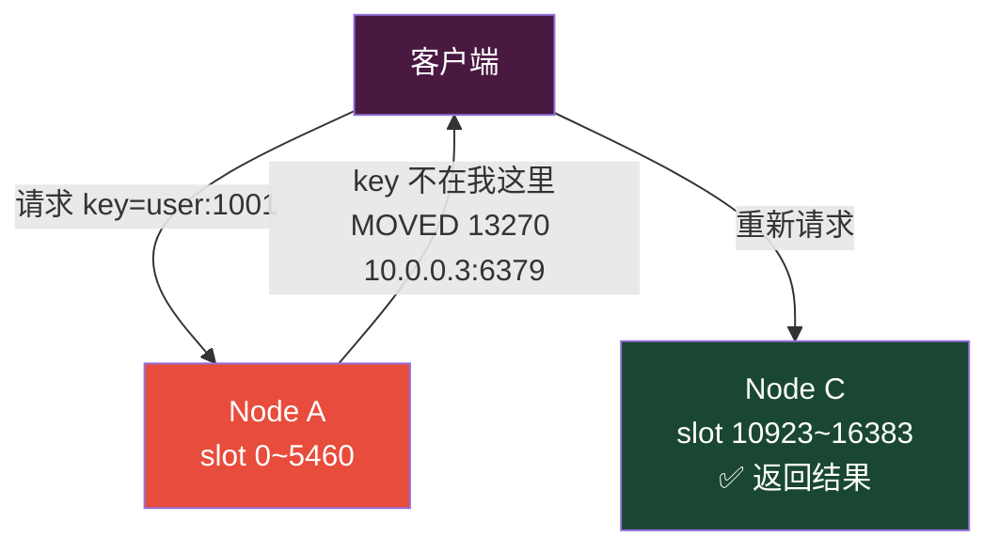

::: tip
路由的本质就是回答一个问题：**"键 X 在哪个节点上？"** 不同方案的区别在于谁来回答这个问题、何时回答、以及回答的代价。
:::

---

## 二、MOVED / ASK 重定向——集群的原生路由

### 2.1 MOVED 重定向

当客户端向错误节点发送请求时，该节点会返回 `MOVED` 错误，告知客户端目标槽已永久迁移到新节点：

```
格式：-MOVED <slot> <ip>:<port>

示例：
GET user:1001
-MOVED 13270 10.0.0.3:6379
```

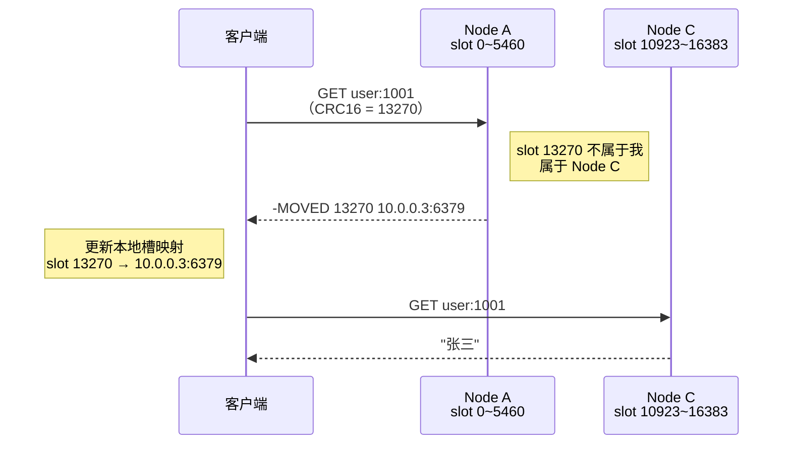

**MOVED 的语义**：
- 永久性重定向——该槽已经**稳定地**属于新节点
- 客户端应该**更新本地缓存**的槽映射表
- 后续对同一槽的请求直接发到新节点，无需再次重定向

### 2.2 ASK 重定向

在槽迁移过程中，源节点可能已经将部分键迁移到目标节点，但槽尚未正式转移。此时源节点返回 `ASK`：

```
格式：-ASK <slot> <ip>:<port>

示例：
GET user:1001
-ASK 13270 10.0.0.7:6379
```

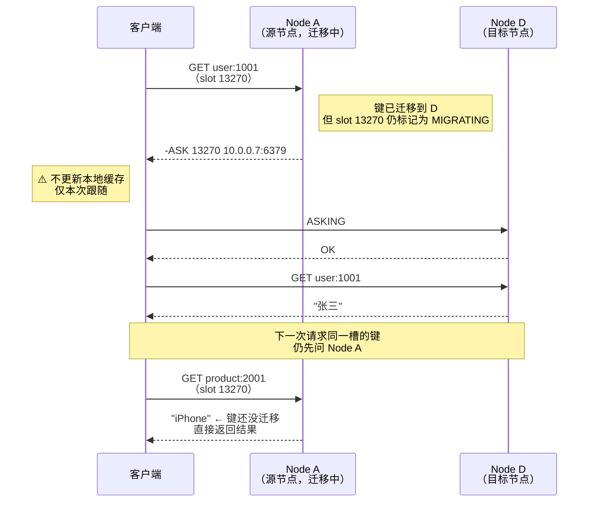

### 2.3 ASK 的特殊处理——ASKING 命令

收到 ASK 重定向后，客户端必须先发送 `ASKING` 命令，再发送实际请求：

```
ASKING → OK → GET user:1001 → "张三"
```

为什么需要 `ASKING`？

目标节点在 `IMPORTING` 状态下，默认**拒绝**对该槽的正常请求。`ASKING` 是一个"通行证"，告诉目标节点："我是被源节点 ASK 重定向过来的，请临时允许我访问这个键"。

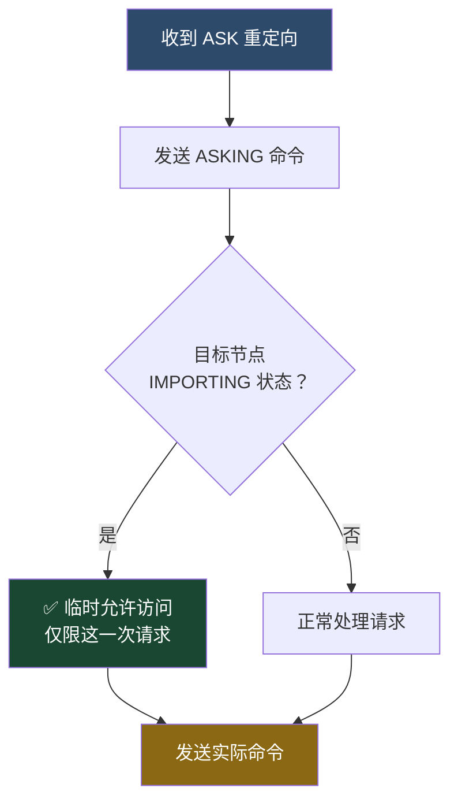

::: important
如果不发送 `ASKING` 就直接访问目标节点，目标节点会返回 `MOVED` 重定向回源节点，形成**重定向循环**。
:::

### 2.4 MOVED vs ASK 对比总结

| 维度 | MOVED | ASK |
|------|-------|-----|
| 触发场景 | 槽已稳定属于新节点 | 槽迁移中，键已迁移但槽未转移 |
| 语义 | 永久重定向 | 临时重定向 |
| 客户端应更新缓存 | ✅ 是 | ❌ 否 |
| 后续请求 | 直接连新节点 | 下次仍先问源节点 |
| 需要发送 ASKING | ❌ 否 | ✅ 是 |
| 触发频率 | 迁移完成后，仅一次 | 迁移期间，可能多次 |
| 对性能影响 | 几乎无（缓存命中后直连） | 每次多一跳 |

---

## 三、Smart Client——客户端侧缓存路由

### 3.1 什么是 Smart Client

Smart Client（智能客户端）在客户端本地维护一份**槽到节点的映射表**，请求前先在本地查找目标节点，避免每次都发生重定向。

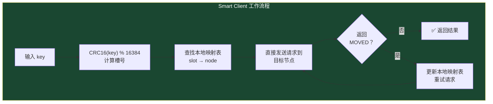

### 3.2 槽映射缓存结构

```
┌──────────────────────────────────────────────┐
│          Smart Client 槽映射表                │
├──────────┬───────────────────────────────────┤
│ 槽号范围  │ 节点地址                          │
├──────────┼───────────────────────────────────┤
│ 0~5460   │ 10.0.0.1:6379                     │
│ 5461~10922│ 10.0.0.2:6379                    │
│ 10923~16383│ 10.0.0.3:6379                   │
└──────────┴───────────────────────────────────┘

映射表来源：
1. 初始化时从任一节点获取 CLUSTER NODES / CLUSTER SLOTS
2. 收到 MOVED 时更新对应槽的映射
3. 定期刷新（可选）
```

### 3.3 槽映射获取方式

#### 方式一：CLUSTER SLOTS（推荐）

```bash
redis-cli CLUSTER SLOTS

# 返回示例：
# 1) 1) (integer) 0       # 起始槽
#    2) (integer) 5460    # 结束槽
#    3) 1) "10.0.0.1"     # 主节点 IP
#       2) (integer) 6379 # 主节点端口
#       3) "a1b2c3..."    # 节点 ID
#    4) 1) "10.0.0.4"     # 从节点 IP
#       2) (integer) 6379
#       3) "d4e5f6..."
# 2) 1) (integer) 5461
#    2) (integer) 10922
#    3) 1) "10.0.0.2"
#       2) (integer) 6379
#       3) "b2c3d4..."
# 3) 1) (integer) 10923
#    2) (integer) 16383
#    3) 1) "10.0.0.3"
#       2) (integer) 6379
#       3) "c3d4e5..."
```

#### 方式二：CLUSTER NODES

```bash
redis-cli CLUSTER NODES

# 返回示例：
# a1b2c3... 10.0.0.1:6379@16379 myself,master - 0 ... connected 0-5460
# b2c3d4... 10.0.0.2:6379@16379 master - 0 ... connected 5461-10922
# c3d4e5... 10.0.0.3:6379@16379 master - 0 ... connected 10923-16383
```

::: tip
`CLUSTER SLOTS` 是更推荐的获取方式，它直接返回结构化的槽范围和节点信息，而 `CLUSTER NODES` 返回原始文本需要客户端自行解析。Redis 7.0+ 的 `CLUSTER SLOTS` 还额外返回了节点角色和 TLS 信息。
:::

### 3.4 Smart Client 的请求路由流程

```mermaid
flowchart TD
    Start["客户端发起请求"] --> CalcSlot["CRC16(key) % 16384<br/>计算槽号"]
    CalcSlot --> LocalLookup["查找本地槽映射表"]
    LocalLookup --> Found{"找到<br/>目标节点？"}
    Found -->|"是"| SendDirect["直接发送请求<br/>到目标节点"]
    Found -->|"否"| SendAny["发送到任意已知节点"]
    SendDirect --> Response{"响应类型？"}
    SendAny --> Response
    Response -->|"正常响应"| Done["✅ 返回结果"]
    Response -->|"MOVED"| UpdateCache["更新本地映射表<br/>重定向到新节点"]
    Response -->|"ASK"| AskRedirect["发送 ASKING<br/>临时重定向到目标节点"]
    Response ->|"连接失败"| Retry["尝试下一个节点<br/>或刷新映射表"]
    UpdateCache --> RetryRequest["重新发送请求"]
    AskRedirect --> RetryRequest
    RetryRequest --> Response2{"响应类型？"}
    Response2 -->|"正常"| Done
    Response2 -->|"MOVED"| UpdateCache

    style Start fill:#2d4a6b,color:#fff
    style Done fill:#1a4731,color:#fff
    style UpdateCache fill:#e74c3c,color:#fff
    style AskRedirect fill:#f39c12,color:#fff
```

### 3.5 Smart Client 的连接管理

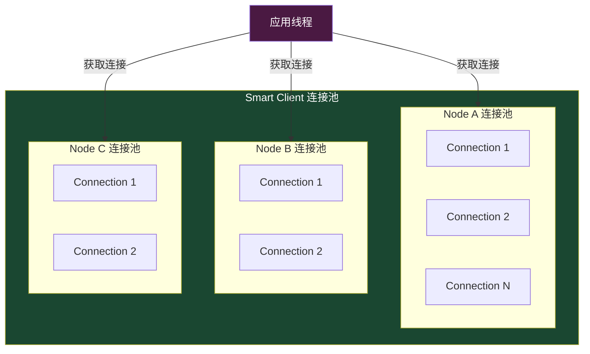

Smart Client 需要维护**每个节点的独立连接池**：
- 每个主节点维护一个连接池
- 请求根据槽映射选择对应节点的连接池
- 节点增减时动态调整连接池

---

## 四、常见 Smart Client 实现

### 4.1 Java：Jedis Cluster

```java
// Jedis Cluster 配置
Set<HostAndPort> nodes = new HashSet<>();
nodes.add(new HostAndPort("10.0.0.1", 6379));
nodes.add(new HostAndPort("10.0.0.2", 6379));
nodes.add(new HostAndPort("10.0.0.3", 6379));

JedisPoolConfig poolConfig = new JedisPoolConfig();
poolConfig.setMaxTotal(100);
poolConfig.setMaxIdle(50);
poolConfig.setMinIdle(10);
poolConfig.setMaxWaitMillis(3000);

JedisCluster jedisCluster = new JedisCluster(
    nodes,
    2000,       // 连接超时
    2000,       // 读取超时
    5,          // 最大重试次数
    "password", // 密码
    poolConfig
);

// 自动路由到正确节点
String value = jedisCluster.get("user:1001");

// 使用 Hash Tag 确保同槽
jedisCluster.mget("{user}:1001:name", "{user}:1001:age");
```

Jedis Cluster 内部工作：
1. 初始化时从任一节点获取 `CLUSTER SLOTS`
2. 为每个主节点创建 `JedisPool`
3. 收到 `MOVED` 时更新本地映射并重试
4. 收到 `ASK` 时发送 `ASKING` 后重定向

### 4.2 Java：Lettuce

```java
// Lettuce Cluster 配置
RedisClusterClient clusterClient = RedisClusterClient.create(
    RedisURI.Builder.redis("10.0.0.1", 6379)
        .withPassword("password".toCharArray())
        .build()
);

StatefulRedisClusterConnection<String, String> connection =
    clusterClient.connect();

RedisAdvancedClusterCommands<String, String> commands =
    connection.sync();

// 自动路由
String value = commands.get("user:1001");

// Pipeline 批量操作
RedisClusterNode node1 = RedisClusterNode.create("10.0.0.1", 6379);
NodeSelection<String, String> node1Commands = commands.nodes(node1);
```

Lettuce 特点：
- 基于 Netty 的异步非阻塞客户端
- 自动刷新拓扑（`ClusterTopologyRefreshOptions`）
- 支持跨节点的批量操作（`NodeSelection`）

### 4.3 Python：redis-py

```python
from redis.cluster import RedisCluster, ClusterNode

# 创建集群连接
startup_nodes = [
    ClusterNode(host='10.0.0.1', port=6379),
    ClusterNode(host='10.0.0.2', port=6379),
    ClusterNode(host='10.0.0.3', port=6379),
]

rc = RedisCluster(
    startup_nodes=startup_nodes,
    password='password',
    decode_responses=True,
    retry_on_timeout=True,
    socket_timeout=5,
    socket_connect_timeout=5,
)

# 自动路由
value = rc.get('user:1001')

# 使用 Hash Tag
values = rc.mget('{user}:1001:name', '{user}:1001:age')
```

### 4.4 Go：go-redis

```go
package main

import (
    "context"
    "fmt"
    "github.com/redis/go-redis/v9"
)

func main() {
    rdb := redis.NewClusterClient(&redis.ClusterOptions{
        Addrs:     []string{"10.0.0.1:6379", "10.0.0.2:6379", "10.0.0.3:6379"},
        Password:  "password",
        PoolSize:  100,
        MinIdleConns: 10,
    })

    // 自动路由
    val, err := rdb.Get(context.Background(), "user:1001").Result()
    if err != nil {
        panic(err)
    }
    fmt.Println(val)

    // 使用 Hash Tag 的 MGET
    vals, err := rdb.MGet(context.Background(),
        "{user}:1001:name",
        "{user}:1001:age",
    ).Result()
}
```

---

## 五、.NET 客户端集群模式配置

### 5.1 StackExchange.Redis

StackExchange.Redis 是 .NET 生态中最主流的 Redis 客户端，内置 Smart Client 功能。

```csharp
// 基础集群连接
var config = new ConfigurationOptions
{
    // 只需配置部分节点，客户端会自动发现所有节点
    EndPoints =
    {
        { "10.0.0.1", 6379 },
        { "10.0.0.2", 6379 },
        { "10.0.0.3", 6379 }
    },
    Password = "your_password",

    // 连接配置
    ConnectTimeout = 5000,
    SyncTimeout = 3000,
    AsyncTimeout = 5000,
    AbortOnConnectFail = false,

    // 集群专用配置
    CommandMap = CommandMap.Create(new HashSet<string>
    {
        "CLUSTER", "ASKING", "READONLY"
    }, available: true),

    // 重试配置
    ConnectRetry = 3,
    ReconnectRetryPolicy = new ExponentialRetry(5000),
};

var connection = ConnectionMultiplexer.Connect(config);
var db = connection.GetDatabase();

// 自动路由——根据 key 的 CRC16 哈希到正确节点
string value = db.StringGet("user:1001");

// 使用 Hash Tag 确保同槽
var values = db.StringGet(new RedisKey[]
{
    "{user}:1001:name",
    "{user}:1001:age"
});
```

### 5.2 高级配置选项

```csharp
var config = new ConfigurationOptions
{
    EndPoints =
    {
        { "10.0.0.1", 6379 },
        { "10.0.0.2", 6379 },
        { "10.0.0.3", 6379 }
    },
    Password = "your_password",

    // ===== 集群拓扑刷新 =====
    // StackExchange.Redis 会自动处理 MOVED 重定向
    // 但默认不自动刷新拓扑（性能考虑）
    // 如果集群经常扩缩容，可以启用：
    // config.CommandMap 是自动配置的，无需手动设置

    // ===== 读写分离 =====
    // 默认只读主节点，可以配置读从节点
    // 注意：从节点的数据可能有延迟

    // ===== 连接池 =====
    // StackExchange.Redis 使用多路复用
    // 一个 ConnectionMultiplexer 实例即可服务整个应用
    // 不要为每个请求创建新连接

    AbortOnConnectFail = false,
    ConnectRetry = 3,
    ConnectTimeout = 5000,
    SyncTimeout = 3000,
    AsyncTimeout = 5000,

    // ===== 健康检查 =====
    KeepAlive = 60,  // 每 60 秒发送 PING

    // ===== TLS 配置 =====
    Ssl = true,
    SslProtocols = System.Security.Authentication.SslProtocols.Tls13,
    CertificateValidation = (sender, cert, chain, errors) => true,
};

// 注册事件监听
var connection = ConnectionMultiplexer.Connect(config);

// 连接恢复事件
connection.ConnectionRestored += (sender, e) =>
{
    Console.WriteLine($"连接恢复: {e.EndPoint}");
};

// 连接失败事件
connection.ConnectionFailed += (sender, e) =>
{
    Console.WriteLine($"连接失败: {e.EndPoint}, 类型: {e.FailureType}");
};

// 重定向事件
connection.ConfigurationChanged += (sender, e) =>
{
    Console.WriteLine($"集群配置变更: {e.EndPoint}");
};
```

### 5.3 读写分离配置

```csharp
// 方式一：指定读取从节点
var config = new ConfigurationOptions
{
    EndPoints = { { "10.0.0.1", 6379 }, { "10.0.0.2", 6379 }, { "10.0.0.3", 6379 } },
    Password = "your_password",
};

var connection = ConnectionMultiplexer.Connect(config);

// 获取指定主节点的从节点
var server = connection.GetServer("10.0.0.4:6379"); // 从节点
var value = server.StringGet("user:1001"); // 从从节点读取

// 方式二：使用 FireAndForget 读取
var db = connection.GetDatabase();
var value = db.StringGet("user:1001", CommandFlags.FireAndForget);
```

### 5.4 批量操作最佳实践

```csharp
var db = connection.GetDatabase();

// ❌ 错误：跨槽 MGET 会报错
var wrong = db.StringGet(new RedisKey[] { "user:1", "order:1" });

// ✅ 正确：使用 Hash Tag
var correct = db.StringGet(new RedisKey[]
{
    "{user}:1:name",
    "{user}:1:age"
});

// ✅ 更好的方式：使用 Pipeline 按节点分组
var batch = db.CreateBatch();

var tasks = new List<Task<RedisValue>>();
foreach (var key in keys)
{
    tasks.Add(batch.StringGetAsync(key));
}

batch.Execute(); // 一次性发送所有命令
await Task.WhenAll(tasks);

// ✅ 对于大量 key：按槽分组，分批发送
var grouped = keys.GroupBy(k =>
{
    var slot = HashSlot(k); // 自定义 CRC16 计算方法
    return connection.GetConnectionBySlot(slot);
});

foreach (var group in grouped)
{
    var batch = db.CreateBatch();
    var groupTasks = group.Select(k => batch.StringGetAsync(k)).ToList();
    batch.Execute();
    await Task.WhenAll(groupTasks);
}
```

::: warning
StackExchange.Redis 的 `StringGet` 数组重载在集群模式下会自动按节点分组并合并结果，但仍建议使用 Hash Tag 或手动分组以获得最佳性能。
:::

---

## 六、代理方案

### 6.1 为什么需要代理

Smart Client 虽然高效，但存在一些局限：

| Smart Client 局限 | 说明 |
|------------------|------|
| 语言绑定 | 每种语言都需要实现 Smart Client 逻辑 |
| 映射表同步 | 多个客户端实例的映射表可能不一致 |
| 连接数爆炸 | 每个客户端连接所有节点，N 客户端 × M 节点 |
| 运维复杂 | 客户端升级需要同步更新路由逻辑 |

代理方案在客户端和 Redis 集群之间增加一个中间层，客户端只需要连接代理，由代理负责路由。

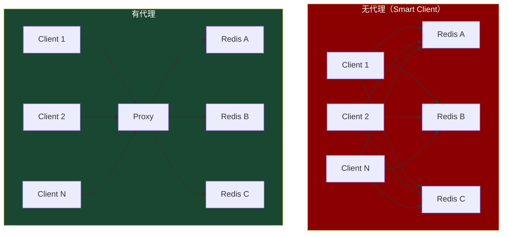

---

## 七、Twemproxy

### 7.1 概述

Twemproxy（又名 nutcracker）是 Twitter 开源的 Redis/Memcached 代理，是历史上最早的 Redis 代理方案。

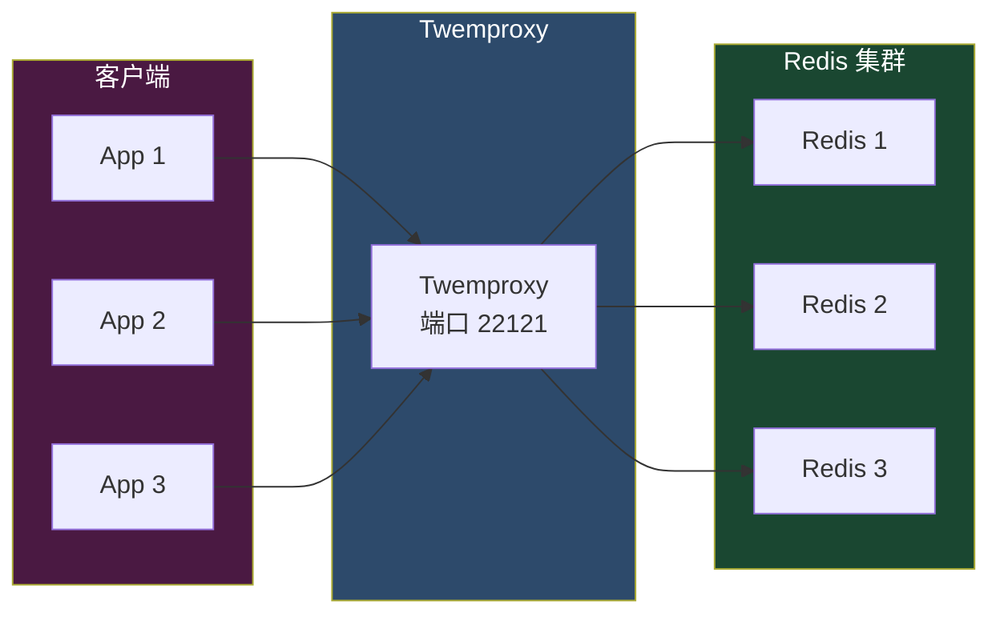

### 7.2 配置示例

```yaml
# twemproxy.yml
alpha:
  listen: 127.0.0.1:22121
  hash: fnv1a_64           # 哈希算法
  distribution: ketama     # 一致性哈希
  auto_eject_hosts: true   # 自动摘除故障节点
  redis: true              # 后端是 Redis
  server_retry_timeout: 30000   # 故障节点重试间隔
  server_failure_limit: 3       # 故障次数阈值
  servers:
    - 10.0.0.1:6379:1 server1
    - 10.0.0.2:6379:1 server2
    - 10.0.0.3:6379:1 server3
```

### 7.3 Twemproxy 的优缺点

| 优点 | 缺点 |
|------|------|
| 轻量级，C 语言实现 | **不支持 Redis Cluster 协议**，使用一致性哈希 |
| 降低客户端连接数 | **不支持在线扩容**（改配置需重启） |
| 多种哈希算法 | **不支持 MGET/MSET 等批量操作** |
| 自动摘除故障节点 | **不支持 MOVE/ASK 重定向** |
| 长期生产验证 | 已停止维护（最后更新 2019 年） |
| Pipeline 支持 | 不支持 SELECT 命令 |

::: warning
Twemproxy **不是 Redis Cluster 代理**——它使用自己的一致性哈希算法（ketama），与 Redis Cluster 的 16384 槽方案不兼容。它更适合非 Cluster 模式的 Redis 分片。
:::

### 7.4 一致性哈希 vs Redis Cluster 哈希槽

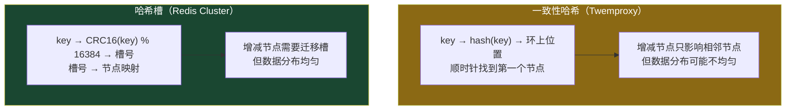

| 对比维度 | 一致性哈希 | 哈希槽 |
|---------|-----------|-------|
| 数据分布 | 可能不均匀 | 均匀（槽数固定） |
| 扩容影响 | 仅影响相邻节点 | 需要迁移槽 |
| 扩容方式 | 添加节点即可 | 需要显式迁移 |
| 数据迁移量 | 少（只迁移部分） | 精确可控（按槽迁移） |
| 元数据 | 无中心 | Gossip 协议 |

---

## 八、Predixy

### 8.1 概述

Predixy 是一个高性能的 Redis 代理，**原生支持 Redis Cluster 协议**，是目前生产环境中广泛使用的代理方案。

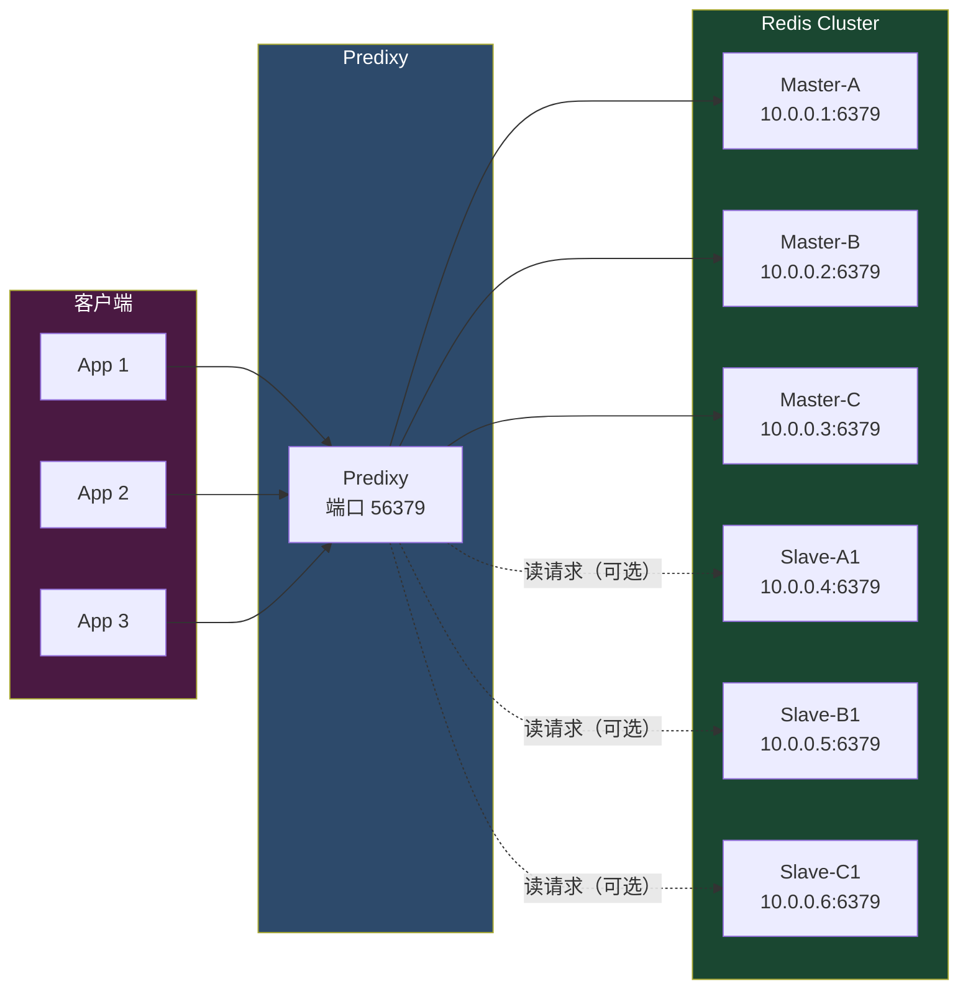

### 8.2 配置示例

```bash
# predixy.conf

Bind 0.0.0.0:56379

WorkerThreads 4

Log /var/log/predixy/predixy.log
LogVerbosity 3

# 权限配置
Authority {
    Auth {
        Mode admin
    }
    Auth user1 {
        Password user1_password
        Mode write
    }
    Auth user2 {
        Password user2_password
        Mode read
    }
}

# Sentinel 配置（如果使用 Sentinel）
Sentinel {
    Group redis_cluster {
        10.0.0.1:26379
        10.0.0.2:26379
        10.0.0.3:26379
    }
}

# Cluster 配置
Cluster {
    PoolSize 32
    Group redis_cluster {
        # 只需配置部分节点，自动发现
        10.0.0.1:6379
        10.0.0.2:6379
        10.0.0.3:6379
    }
}
```

### 8.3 Predixy 特性

| 特性 | 说明 |
|------|------|
| **Redis Cluster 原生支持** | 自动处理 MOVED/ASK 重定向 |
| **读写分离** | 可配置读请求路由到从节点 |
| **连接池** | 复用到 Redis 的连接，减少连接数 |
| **多线程** | WorkerThreads 可配置，充分利用多核 |
| **权限控制** | 支持 admin/write/read 三种模式 |
| **集群自动发现** | 只需配置部分节点，自动发现全部 |
| **Pipeline 支持** | 支持客户端 Pipeline |
| **MGET/MSET 支持** | 自动拆分跨槽操作 |

### 8.4 读写分离配置

```bash
# predixy.conf — 读写分离配置

Cluster {
    Group redis_cluster {
        10.0.0.1:6379
        10.0.0.2:6379
        10.0.0.3:6379
    }

    # 读请求路由策略
    ReadRoute {
        # 优先读从节点
        Mode slave_prefer
        # 可选：master_only / slave_only / master_prefer / slave_prefer
    }
}
```

::: tip
Predixy 的读写分离模式：
- `master_only`：只读主节点（默认，一致性最高）
- `slave_only`：只读从节点（减轻主节点压力）
- `master_prefer`：优先读主节点，主不可用读从
- `slave_prefer`：优先读从节点，从不可用读主（推荐，兼顾性能和可用性）
:::

---

## 九、其他代理方案

### 9.1 Redis Cluster Proxy

Redis 官方推出的代理（实验性）：

```bash
# 启动 Redis Cluster Proxy
redis-cluster-proxy \
  --port 7777 \
  10.0.0.1:6379

# 客户端连接代理
redis-cli -p 7777
```

特点：
- 官方出品，与 Redis Cluster 协议完全兼容
- 支持跨槽的 MGET/MSET（自动拆分）
- 支持 MULTI/EXEC（同槽事务）
- 目前仍在实验阶段，不建议生产使用

### 9.2 Cerberus

Go 语言实现的 Redis Cluster 代理：

```bash
# 配置 cerberus.yml
listen: 0.0.0.0:8888
clusters:
  redis_cluster:
    startup_nodes:
      - 10.0.0.1:6379
      - 10.0.0.2:6379
      - 10.0.0.3:6379
```

特点：
- 轻量级，Go 实现
- 支持 Redis Cluster 协议
- 支持连接池和 Pipeline
- 社区活跃度一般

### 9.3 Odyssey

高性能 Redis 代理，支持多线程：

特点：
- C 语言实现，性能极高
- 支持连接池和多路复用
- 支持基本的路由功能
- 更偏向连接池代理，非完整 Cluster 代理

---

## 十、代理 vs Smart Client 对比

### 10.1 全面对比

| 维度 | Smart Client | 代理（Predixy） |
|------|-------------|----------------|
| **性能** | 高（直连节点） | 略低（多一跳） |
| **延迟** | 低（1 次 RTT） | 较低（1~2 次 RTT） |
| **连接数** | N 客户端 × M 节点 | N 客户端 + M 节点 × 代理数 |
| **语言支持** | 每种语言独立实现 | 语言无关 |
| **MOVED/ASK** | 客户端处理 | 代理透明处理 |
| **映射表同步** | 每个客户端独立维护 | 代理统一维护 |
| **部署复杂度** | 无额外组件 | 需要部署代理 |
| **单点故障** | 无 | 代理可能成为单点 |
| **扩容感知** | 需要刷新映射 | 自动感知 |
| **跨槽操作** | 受限 | 部分代理支持拆分 |
| **运维成本** | 低 | 中（代理监控/升级） |

### 10.2 性能对比

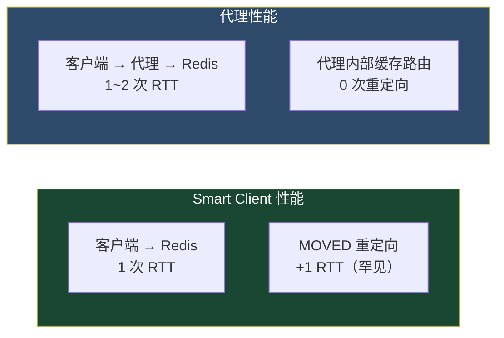

### 10.3 选型决策树

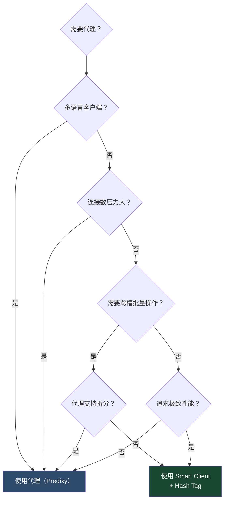

::: tip 选型建议
- **大多数场景**：Smart Client，直连性能最佳
- **多语言 / 多团队**：代理，统一入口简化客户端
- **连接数爆炸**：代理，连接池复用
- **混合场景**：写用 Smart Client，读走代理（读写分离）
:::

---

## 十一、客户端请求路由完整流程

### 11.1 Smart Client 请求流程

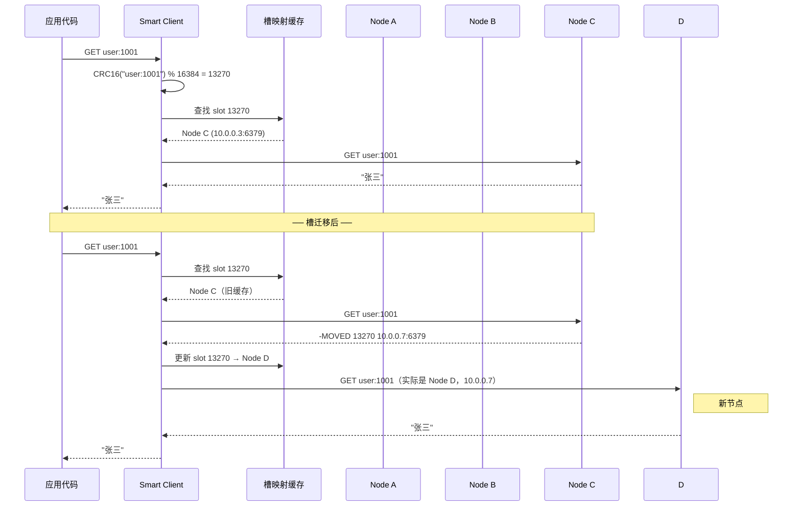

### 11.2 代理请求流程

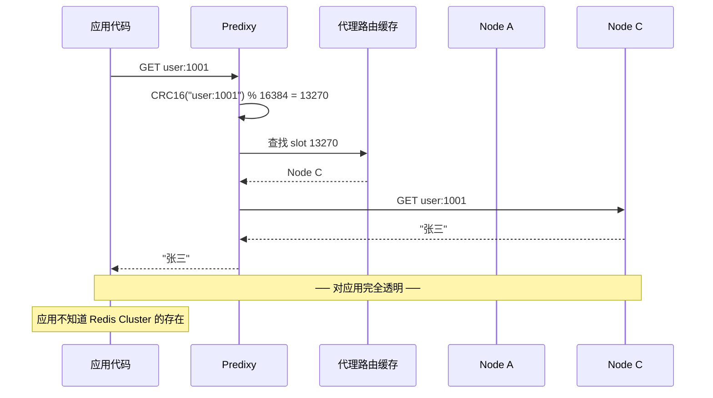

---

## 十二、连接数优化

### 12.1 连接数模型

```
Smart Client 模式：
  总连接数 = 客户端实例数 × 主节点数 × 每节点连接池大小
  示例：50 个客户端 × 3 主节点 × 10 连接 = 1500 连接

代理模式：
  总连接数 = 客户端实例数 × 1（连代理）
            + 代理实例数 × 主节点数 × 每节点连接池大小
  示例：50 × 1 + 2 × 3 × 32 = 242 连接
```

### 12.2 连接数优化建议

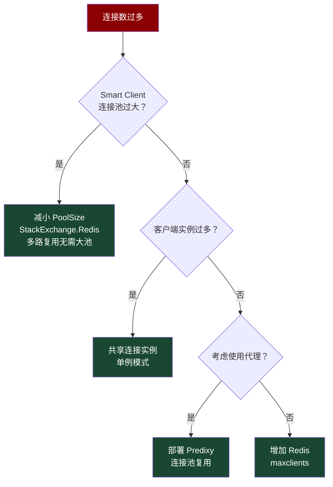

::: important
StackExchange.Redis 使用**多路复用**（Multiplexing），一个 ConnectionMultiplexer 实例通过一个 TCP 连接服务多个并发请求。因此 .NET 应用通常只需要一个 ConnectionMultiplexer 实例（单例），连接数远小于 Jedis 等基于连接池的客户端。
:::

---

## 十三、常见问题与排查

### 13.1 大量 MOVED 错误

**现象**：客户端频繁收到 MOVED 重定向

**原因**：
- 集群刚完成扩容/缩容
- Smart Client 的槽映射缓存未更新
- 网络分区导致节点视图不一致

**解决方案**：
```bash
# 1. 检查集群状态
redis-cli CLUSTER INFO

# 2. 手动刷新客户端映射
# StackExchange.Redis
connection.ConfigurationChanged += (s, e) => {
    // 重新获取 CLUSTER SLOTS
};

# 3. 检查是否有节点状态异常
redis-cli CLUSTER NODES | grep fail
```

### 13.2 ASK 循环

**现象**：客户端在 ASK 重定向中循环

**原因**：
- 客户端没有发送 ASKING 命令
- 目标节点返回 MOVED 回源节点

**解决方案**：
- 确保客户端正确处理 ASK：先 ASKING 再发送实际命令
- 检查是否使用了正确的 Smart Client 版本

### 13.3 连接超时

**现象**：客户端无法连接到某些节点

**排查步骤**：
```bash
# 1. 检查节点可达性
telnet 10.0.0.3 6379
telnet 10.0.0.3 16379

# 2. 检查防火墙
iptables -L | grep 6379

# 3. 检查 cluster-announce-ip
redis-cli -h 10.0.0.3 CONFIG GET cluster-announce-ip

# 4. 检查节点负载
redis-cli -h 10.0.0.3 INFO clients
redis-cli -h 10.0.0.3 INFO commandstats
```

---

## 十四、总结

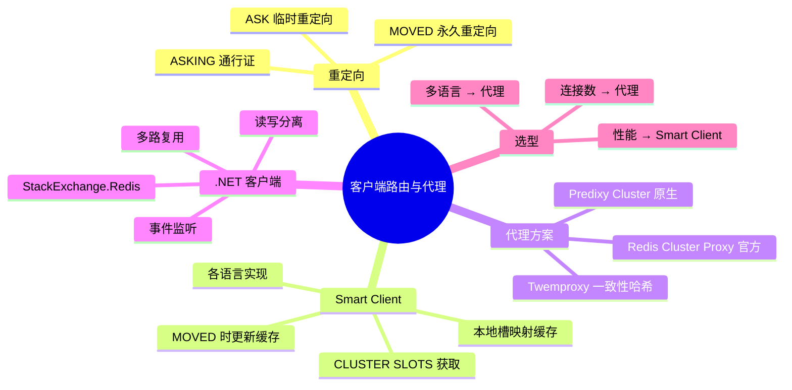

::: important 核心要点
1. **MOVED** 是永久重定向（更新缓存），**ASK** 是临时重定向（不更新缓存，需 ASKING）
2. **Smart Client** 在客户端缓存槽映射，直连节点性能最佳
3. **代理** 统一路由逻辑，简化客户端，但多一跳延迟
4. **StackExchange.Redis** 使用多路复用，单连接高并发，适合 .NET 生产环境
5. 选型关键：**性能优先用 Smart Client，运维优先用代理**
:::
