# 01 · 内存策略与优化

> **本篇回答：** Redis 的 8 种内存淘汰策略各适合什么场景？LRU 和 LFU 近似算法的内部实现原理是什么？如何诊断和优化 Redis 的内存使用？

---

## 一、Redis 内存管理概述

### 1.1 为什么内存管理如此重要

Redis 是**纯内存**数据库，内存是最昂贵也最关键的资源。一旦内存耗尽：

- 无法写入新数据（默认策略 `noeviction`）
- 响应变慢（操作系统开始换页）
- 触发淘汰策略（可能丢失热数据）

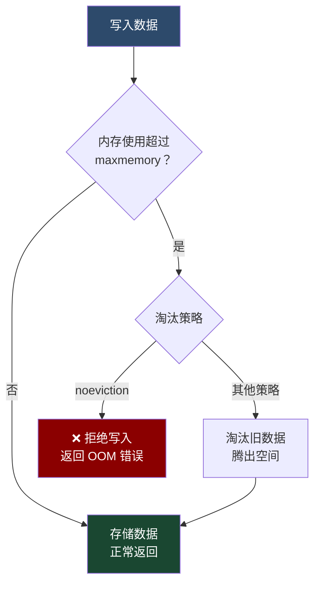

### 1.2 Redis 内存使用分布

```
┌──────────────────────────────────────────────────────┐
│                  Redis 进程内存                        │
├──────────────────────────────────────────────────────┤
│                                                       │
│  ┌─────────────────────────────────────────────────┐ │
│  │         数据内存（最大头）                         │ │
│  │  ├── 键值对（string, list, hash, set, zset）     │ │
│  │  ├── 键的过期时间                                │ │
│  │  └── LRU/LFU 附加字段（24 bit）                  │ │
│  └─────────────────────────────────────────────────┘ │
│                                                       │
│  ┌─────────────────────────────────────────────────┐ │
│  │         缓冲内存                                  │ │
│  │  ├── 客户端缓冲区（client-output-buffer）         │ │
│  │  ├── 复制积压缓冲区（repl-backlog）               │ │
│  │  └── AOF 缓冲区（aof-buffer）                    │ │
│  └─────────────────────────────────────────────────┘ │
│                                                       │
│  ┌─────────────────────────────────────────────────┐ │
│  │         Redis 自身内存                            │ │
│  │  ├── Redis 进程基础内存                           │ │
│  │  ├── 字典结构（dict）开销                         │ │
│  │  └── Lua 脚本缓存                                │ │
│  └─────────────────────────────────────────────────┘ │
│                                                       │
└──────────────────────────────────────────────────────┘
```

### 1.3 查看内存使用

```bash
# 查看内存详情
INFO memory

# 关键指标：
# used_memory:1250000           # Redis 分配器分配的内存总量
# used_memory_human:1.19M       # 人类可读格式
# used_memory_rss:1800000       # 操作系统视角的内存（含碎片）
# used_memory_peak:2000000      # 内存使用峰值
# used_memory_peak_human:1.91M
# maxmemory:4294967296          # 配置的最大内存限制
# maxmemory_human:4.00G
# maxmemory_policy:noeviction   # 当前淘汰策略
# mem_fragmentation_ratio:1.44  # 内存碎片率
# mem_fragmentation_bytes:550000 # 碎片大小（字节）
```

---

## 二、maxmemory 配置

### 2.1 配置方式

```bash
# 方式一：配置文件
maxmemory 4gb

# 方式二：运行时设置
CONFIG SET maxmemory 4gb

# 方式三：使用字节数
maxmemory 4294967296
```

### 2.2 maxmemory 的含义

`maxmemory` 限制的是 `used_memory`（Redis 分配器分配的内存），**不是** `used_memory_rss`（操作系统视角的内存）。

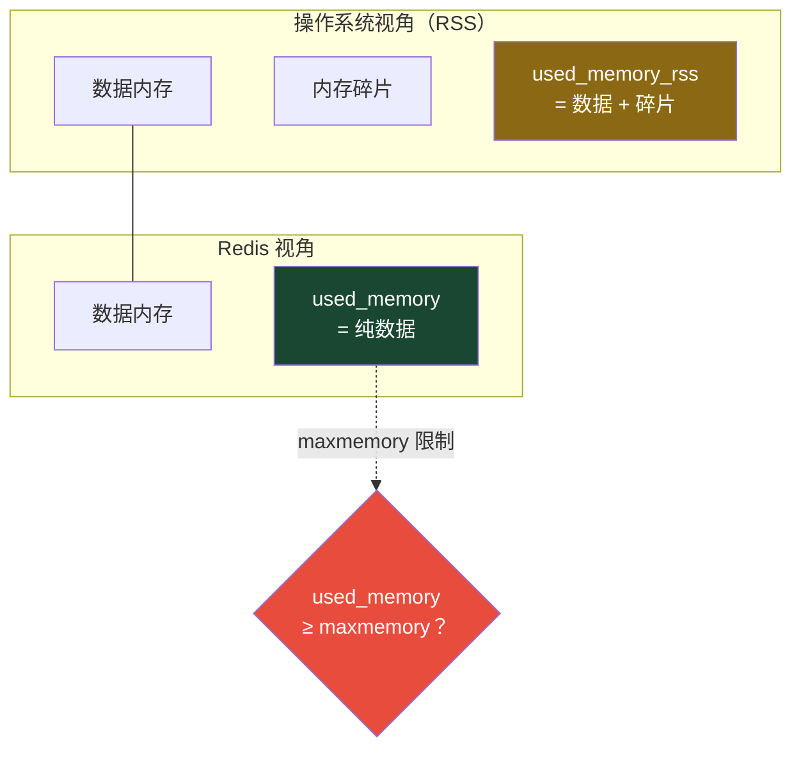

::: important
`maxmemory` 限制的是 Redis 自己分配的内存，不包括进程本身的内存开销和碎片。如果 `used_memory_rss` 远大于 `maxmemory`，说明碎片率很高，需要关注。
:::

### 2.3 建议配置值

| 场景 | 建议 maxmemory | 说明 |
|------|---------------|------|
| 专用 Redis 服务器 | 物理内存 × 70% | 留 30% 给 OS、碎片、缓冲 |
| 共享服务器 | 物理内存 × 50% | 留更多给其他进程 |
| Docker 容器 | 容器限制 × 80% | 注意容器内存限制 |
| 32 位 Redis | ≤ 3GB | 32 位地址空间限制 |

```bash
# 推荐配置
maxmemory 4gb                        # 8GB 物理内存的机器
maxmemory-policy allkeys-lru         # 淘汰策略
maxmemory-samples 5                  # LRU/LFU 采样数
```

---

## 三、8 种内存淘汰策略

### 3.1 策略全览

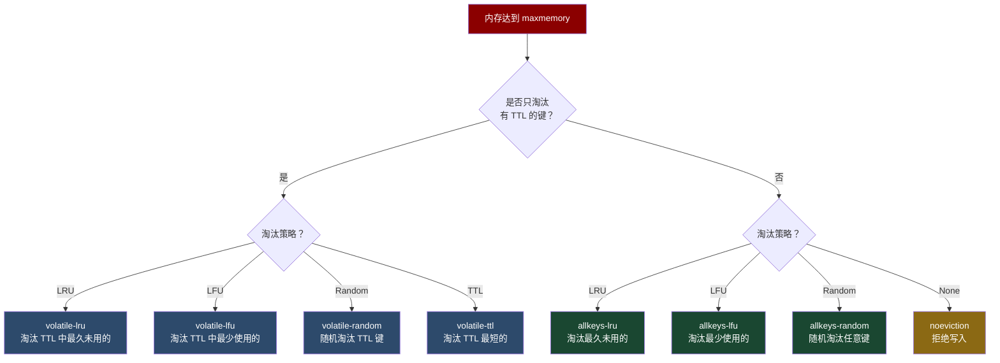

### 3.2 详细说明

| 策略 | 淘汰范围 | 淘汰依据 | 适用场景 |
|------|---------|---------|---------|
| **noeviction** | 不淘汰 | 拒绝写入 | 数据不能丢失，纯缓存不可用 |
| **allkeys-lru** | 所有键 | 最久未使用 | 通用缓存，热点数据访问 |
| **allkeys-lfu** | 所有键 | 最少使用频率 | 稳定热点，访问频率差异大 |
| **allkeys-random** | 所有键 | 随机 | 所有键访问概率相近 |
| **volatile-lru** | 有 TTL 的键 | 最久未使用 | 混合场景：热数据 + 持久数据 |
| **volatile-lfu** | 有 TTL 的键 | 最少使用频率 | 同上，频率比时间更重要 |
| **volatile-random** | 有 TTL 的键 | 随机 | 淘汰范围有限 |
| **volatile-ttl** | 有 TTL 的键 | TTL 最短 | 优先淘汰即将过期的 |

### 3.3 策略选择决策树

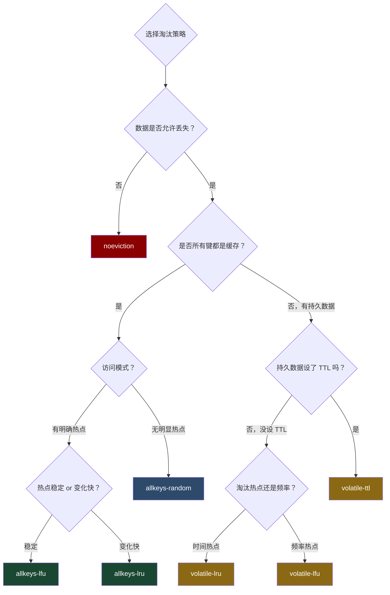

### 3.4 各策略深入对比

#### noeviction（默认）

```bash
# 默认策略，内存满时拒绝所有写入
CONFIG SET maxmemory-policy noeviction

# 写入时会返回错误
SET key value
# (error) OOM command not allowed when used memory > 'maxmemory'
```

::: warning
`noeviction` 是 Redis 的默认策略。如果你配置了 `maxmemory` 但没有显式设置淘汰策略，Redis 会拒绝写入。这是很多初学者的踩坑点。
:::

#### allkeys-lru（最常用）

```bash
# 最通用的缓存策略
CONFIG SET maxmemory-policy allkeys-lru
```

特点：
- 淘汰**所有键**中最久未被访问的
- 不要求键设置 TTL
- 适合纯缓存场景（所有数据都是可丢失的）

#### allkeys-lfu（Redis 4.0+）

```bash
# 按访问频率淘汰
CONFIG SET maxmemory-policy allkeys-lfu
```

特点：
- 淘汰**所有键**中访问频率最低的
- 更好地保留"长期热点"数据
- 适合访问频率有明显差异的场景

#### volatile-lru / volatile-lfu

```bash
# 只淘汰设置了 TTL 的键
CONFIG SET maxmemory-policy volatile-lru
```

::: important
`volatile-*` 策略**只淘汰设置了 TTL 的键**。如果所有键都没有设置 TTL，效果等同于 `noeviction`——内存满时拒绝写入。这是一个常见的误解。
:::

#### volatile-ttl

```bash
# 优先淘汰 TTL 最短的键
CONFIG SET maxmemory-policy volatile-ttl
```

特点：
- TTL 最短的键优先被淘汰
- 适合"短期缓存"场景
- 注意：TTL 短不代表不重要，慎用

#### allkeys-random

```bash
# 随机淘汰任意键
CONFIG SET maxmemory-policy allkeys-random
```

特点：
- 随机选择键淘汰
- 适合所有键访问概率相近的场景（如 session 存储）
- 通常不如 LRU/LFU

---

## 四、LRU 近似算法

### 4.1 为什么是"近似"LRU

Redis 的 LRU 不是精确的 LRU，而是**近似 LRU**（Approximated LRU）。精确 LRU 需要维护一个全局的链表，每次访问都要移动节点，代价太高。

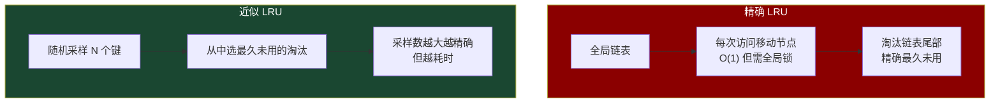

### 4.2 近似 LRU 的工作原理

每个 Redis 对象内部有一个 24 bit 的字段（`lru`），记录最后一次访问的时间戳（精度为秒，约 194 天一个周期）：

```
┌──────────────────────────────────────────────┐
│            Redis Object 结构                  │
├──────────────────────────────────────────────┤
│ type: 4 bit        # 数据类型                │
│ encoding: 4 bit    # 内部编码                 │
│ lru: 24 bit        # LRU 时间戳 / LFU 计数器  │
│ refcount: 32/64 bit # 引用计数               │
│ ptr: 32/64 bit     # 数据指针                 │
└──────────────────────────────────────────────┘
```

淘汰流程：

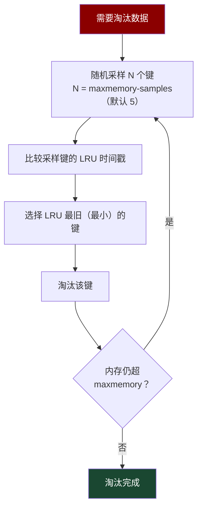

### 4.3 maxmemory-samples 参数

| 采样数 | 精度 | 耗时 | 说明 |
|--------|------|------|------|
| 3 | 低 | 很低 | 默认值（Redis 3.0 之前） |
| **5** | 中 | 低 | 默认值（Redis 3.0+） |
| 10 | 高 | 中 | 接近精确 LRU |
| 20 | 很高 | 较高 | 几乎等于精确 LRU |

```bash
# 设置采样数
CONFIG SET maxmemory-samples 10

# 采样数越大，淘汰越精确，但每次淘汰的 CPU 开销也越大
# 生产环境建议 5~10
```

### 4.4 近似 LRU vs 精确 LRU 的精度

Redis 官方基准测试结果：

```
采样数 = 5 时，近似 LRU 的行为与精确 LRU 非常接近
采样数 = 10 时，几乎无法区分

唯一差异：
近似 LRU 可能淘汰一些"刚被访问过"的键（因为没被采样到）
而精确 LRU 不会
```

::: tip
对于大多数生产场景，`maxmemory-samples 5` 已经足够。如果淘汰不够精确（观察到热数据被误淘汰），可以调大到 10，但通常不需要超过 10。
:::

---

## 五、LFU 近似算法

### 5.1 LFU 的设计思想

LFU（Least Frequently Used）淘汰访问频率最低的键。Redis 4.0 引入，使用与 LRU 相同的 24 bit 字段，但含义不同：

```
LRU 模式下 lru 字段：
┌────────────────────────────────┐
│     24 bit：时间戳（秒）        │
└────────────────────────────────┘

LFU 模式下 lru 字段：
┌──────────────┬─────────────────┐
│  8 bit       │    16 bit       │
│  计数器      │   衰减时间戳     │
│  (0~255)     │   （分钟精度）   │
└──────────────┴─────────────────┘
```

### 5.2 计数器递增——对数增长

8 bit 的计数器范围只有 0~255，如何表示更高的访问频率？Redis 使用**对数计数器**：

```c
// Redis 源码中的 LFU 递增逻辑
uint8_t LFULogIncr(uint8_t counter) {
    if (counter == 255) return 255;  // 达到上限
    double r = (double)rand() / RAND_MAX;
    double baseval = counter - LFU_INIT_VAL;  // LFU_INIT_VAL = 5
    if (baseval < 0) baseval = 0;
    if (r < 1.0 / (baseval * 10 + 1)) {
        counter++;
    }
    return counter;
}
```

这意味着：
- 计数器值越小，越容易递增（每次访问大概率 +1）
- 计数器值越大，越难递增（需要多次访问才可能 +1）
- 访问 100 万次和 1000 万次的计数器差距不大

```
访问次数     → 计数器值（约）
1           → 1
10          → 5
100         → 20
1000        → 50
10000       → 100
100000      → 180
1000000     → 230
10000000    → 250
```

### 5.3 计数器衰减——时间衰减

LFU 必须支持"衰减"，否则历史高频键永远不会被淘汰。Redis 使用**基于时间的衰减**：

```c
// 衰减逻辑
unsigned long LFUDecrAndReturn(robj *o) {
    unsigned long lfu = o->lru >> 16;      // 衰减时间戳
    unsigned long counter = o->lru & 65535; // 计数器
    // lfu-dec-time 默认 1，表示每过 1 分钟计数器减 1
    unsigned long num_periods = server.unixtime / 60 - lfu;
    if (num_periods > 0) {
        if (num_periods > counter) {
            counter = 0;
        } else {
            counter -= num_periods;
        }
    }
    return counter;
}
```

### 5.4 LFU 配置参数

| 参数 | 默认值 | 说明 |
|------|-------|------|
| `lfu-dec-time` | 1 | 计数器衰减时间（分钟），每过 N 分钟计数器减 1 |
| `lfu-log-factor` | 10 | 计数器增长因子，值越大增长越慢 |
| `lfu-init-val` | 5 | 新键的初始计数器值 |

```bash
# LFU 调优
CONFIG SET lfu-dec-time 1       # 每 1 分钟衰减 1
CONFIG SET lfu-log-factor 10    # 增长因子（推荐 10）
```

### 5.5 LRU vs LFU 对比

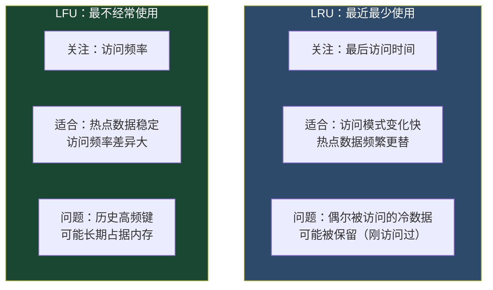

| 维度 | LRU | LFU |
|------|-----|-----|
| 淘汰依据 | 最后访问时间 | 访问频率 |
| 空间开销 | 24 bit 时间戳 | 8 bit 计数器 + 16 bit 衰减时间 |
| 适合场景 | 热点变化快 | 热点稳定 |
| 历史影响 | 无（只看最近） | 有（需要衰减机制） |
| Redis 版本 | 2.8+ | 4.0+ |

::: tip 如何选择
- **新闻 / 推荐系统**：热点变化快 → `allkeys-lru`
- **商品 / 目录缓存**：热点稳定 → `allkeys-lfu`
- **不确定**：先用 `allkeys-lru`，这是最稳妥的选择
:::

---

## 六、内存淘汰决策流程

### 6.1 完整决策流程图

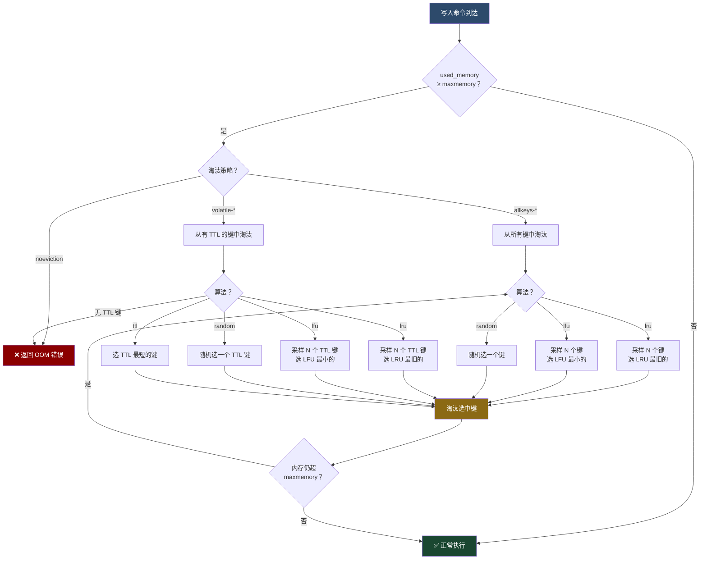

### 6.2 淘汰触发的时机

并非所有命令都会触发淘汰检查，只有**可能增加内存使用**的命令才会：

| 会触发淘汰 | 不会触发淘汰 |
|-----------|------------|
| `SET`, `HSET`, `LPUSH` | `GET`, `HGET`, `LRANGE` |
| `SADD`, `ZADD`, `INCR` | `EXISTS`, `TYPE`, `TTL` |
| `SETEX`, `PSETEX` | `DEL`, `UNLINK` |
| `RESTORE`, `MIGRATE` | `INFO`, `CONFIG` |

::: important
`DEL` 命令不触发淘汰检查，但会释放内存。`SET` 命令即使覆盖已有键也会触发检查（新值可能比旧值大）。
:::

---

## 七、内存碎片

### 7.1 什么是内存碎片

内存碎片是操作系统分配给 Redis 的内存中，**未被有效利用**的部分：

```
┌──────────────────────────────────────────────┐
│            used_memory_rss（操作系统视角）      │
├──────┬──────┬──────┬──────┬──────┬──────────┤
│ Data │ 碎片 │ Data │ 碎片 │ Data │   碎片   │
│ A    │      │ B    │      │ C    │          │
└──────┴──────┴──────┴──────┴──────┴──────────┘

┌──────────────────────────────────────────────┐
│            used_memory（Redis 视角）           │
├──────┬──────┬──────┐
│ Data │ Data │ Data │
│ A    │ B    │ C    │
└──────┴──────┴──────┘

碎片 = used_memory_rss - used_memory
碎片率 = used_memory_rss / used_memory
```

### 7.2 碎片产生原因

| 原因 | 说明 |
|------|------|
| **分配器碎片** | jemalloc 按大小类别分配，实际分配 ≥ 请求大小 |
| **频繁增删** | 删除数据后留下不连续的空闲块 |
| **对齐开销** | 内存对齐导致的额外开销 |
| **大键删除** | 删除大对象后留下大块空闲区域 |

### 7.3 碎片率指标解读

```bash
INFO memory | grep mem_fragmentation_ratio
```

| 碎片率 | 状态 | 说明 |
|--------|------|------|
| **< 1.0** | ⚠️ 内存交换 | Redis 使用的内存超过了物理内存，OS 开始使用 Swap |
| **1.0 ~ 1.5** | ✅ 正常 | 轻微碎片，可接受 |
| **1.5 ~ 2.0** | ⚠️ 碎片较多 | 需要关注，考虑优化 |
| **> 2.0** | 🔴 碎片严重 | 超过 50% 的内存被浪费，需要立即处理 |

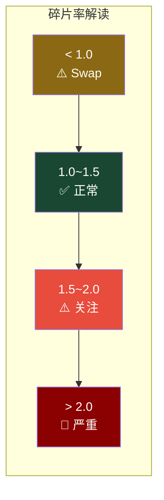

### 7.4 碎片治理

#### 方式一：自动碎片整理（Redis 4.0+）

```bash
# 开启自动碎片整理
CONFIG SET activedefrag yes

# 碎片整理触发条件
CONFIG SET active-defrag-threshold-lower 10    # 碎片率 ≥ 10% 开始考虑
CONFIG SET active-defrag-threshold-upper 100   # 碎片率 ≥ 100% 强制整理
CONFIG SET active-defrag-ignore-bytes 100mb    # 碎片 ≥ 100MB 开始考虑
CONFIG SET active-defrag-cycle-min 5           # 整理最低 CPU 占比 5%
CONFIG SET active-defrag-cycle-max 75          # 整理最高 CPU 占比 75%
```

#### 方式二：重启 Redis

```bash
# 1. 触发 BGSAVE
redis-cli BGSAVE

# 2. 等待 BGSAVE 完成
redis-cli LASTSAVE

# 3. 关闭 Redis
redis-cli SHUTDOWN

# 4. 重启 Redis（加载 RDB，内存重新分配，碎片消除）
redis-server /etc/redis/redis.conf
```

#### 方式三：调整分配器

```bash
# 编译时选择分配器
make MALLOC=libc     # 使用 libc（碎片更少但性能更差）
make MALLOC=jemalloc # 默认，性能更好（推荐）
```

::: tip
大多数情况下，`activedefrag yes` 是最佳选择。它在线整理碎片，无需停机。但整理过程会消耗 CPU，在高负载场景下需要调低 `active-defrag-cycle-max`。
:::

---

## 八、对象共享

### 8.1 共享机制

Redis 启动时，会预创建 **0 ~ 9999**（默认）共 10000 个整数对象，当需要存储这些值时，直接复用共享对象，无需重复分配内存。

```c
// Redis 源码
#define OBJ_SHARED_INTEGERS 10000

void createSharedObjects(void) {
    for (int i = 0; i < OBJ_SHARED_INTEGERS; i++) {
        shared.integers[i] = makeObjectShared(createObject(OBJ_STRING, sdsfromlonglong(i)));
    }
}
```

```
┌───────────────────────────────────────────┐
│           共享对象池（0~9999）              │
├───────┬───────┬───────┬─────┬─────────────┤
│ 0     │ 1     │ 2     │ ... │ 9999        │
│ref:5  │ref:3  │ref:10 │     │ ref:1       │
└───┬───┴───┬───┴───┬───┴─────┴─────────────┘
    │       │       │
    ▼       ▼       ▼
  key:a   key:b   key:c
  = 0     = 1     = 2
  key:d
  = 0
  key:e
  = 0

5 个键引用共享对象 "0"，但只占用一份内存
```

### 8.2 共享的条件

对象共享必须满足以下条件：
- 值是整数（0~9999）
- 编码为 `OBJ_ENCODING_INT`
- **没有设置淘汰时间**（有 TTL 的对象不共享，因为 LRU/LFU 字段需要独立）

::: important
**LRU/LFU 是共享对象的"天敌"**。如果开启了 LRU/LFU 淘汰策略，共享对象的 lru 字段无法独立更新，因此 Redis 会**禁用对象共享**。

这就是为什么：当 `maxmemory-policy` 不是 `noeviction` 时，即使值是 0~9999 的整数，也不会复用共享对象，每个键都独立分配内存。
:::

### 8.3 对象共享的内存节省

```bash
# 假设有 100 万个键，值都是小整数
# 无共享（LRU/LFU 模式）：每个值独立分配
#   内存开销 ≈ 100 万 × (SDS 头部 + 值) ≈ 40MB

# 有共享（noeviction 模式）：复用共享对象
#   内存开销 ≈ 10000 × (SDS 头部 + 值) ≈ 0.4MB（节省 99%）
```

---

## 九、内存优化技巧

### 9.1 选择合适的数据编码

Redis 会根据数据量自动选择内部编码，理解编码机制可以帮助优化内存：

```
┌──────────────────────────────────────────────────────┐
│              数据类型 → 内部编码选择                     │
├──────────┬─────────────────────┬─────────────────────┤
│ 类型     │ 紧凑编码（省内存）   │ 标准编码（高性能）    │
├──────────┼─────────────────────┼─────────────────────┤
│ String   │ embstr (< 44 字节)  │ raw (≥ 44 字节)     │
│ Hash     │ ziplist/listpack    │ hashtable           │
│ List     │ listpack            │ quicklist           │
│ Set      │ intset / listpack   │ hashtable           │
│ ZSet     │ listpack            │ skiplist + hashtable│
└──────────┴─────────────────────┴─────────────────────┘
```

### 9.2 Hash 的 ziplist/listpack 编码

当 Hash 满足以下条件时，使用 ziplist/listpack 编码（省内存）：

```bash
# Redis 7.0 之前：ziplist
hash-max-ziplist-entries 512    # 元素数 ≤ 512
hash-max-ziplist-value 64       # 值长度 ≤ 64 字节

# Redis 7.0+：listpack（更优）
hash-max-listpack-entries 512
hash-max-listpack-value 64
```

**内存对比**：

```
存储 1000 个用户属性（user:1:name, user:1:age, ...）

方案一：独立 String 键
  1000 个 key × (key 开销 + value 开销)
  约 100KB

方案二：Hash 键（ziplist/listpack）
  1 个 Hash key × 1000 个 field
  约 30KB（节省 70%）

方案三：Hash 键（hashtable）
  1 个 Hash key × 1000 个 field
  约 60KB
```

::: tip
**用 Hash 代替多个 String**：当多个键属于同一实体时（如用户属性），使用一个 Hash 存储比多个 String 节省大量内存，尤其是 ziplist/listpack 编码时。
:::

### 9.3 小 Hash 分桶

当 Hash 字段数超过 `hash-max-listpack-entries` 时，会从 ziplist/listpack 转为 hashtable，内存会突增。解决方案是**分桶**：

```bash
# 假设要存储 100 万个用户属性
# 如果放在一个 Hash 中：100 万个 field → hashtable → 内存大

# 分桶方案：按用户 ID 分成多个小 Hash
# 每个用户一个 Hash：{user:1} → {name: "张三", age: 25}
# 每个 Hash 只有 2~5 个 field → ziplist/listpack → 内存小

SET {user:1} name "张三"   # ❌ String 方式
HSET user:1 name "张三"    # ✅ Hash 方式
```

```python
# 分桶策略：对大量数据进行分组
# key = 前缀 + (id % 桶数)
BUCKET_COUNT = 1000

def get_hash_key(user_id):
    bucket = user_id % BUCKET_COUNT
    return f"users:bucket:{bucket}"

# 每个桶约 1000 个用户
# 桶内仍用 ziplist/listpack 编码
```

### 9.4 使用 intset 编码 Set

当 Set 的所有元素都是整数，且元素数 ≤ `set-max-intset-entries` 时，使用 intset 编码：

```bash
# intset 编码条件
set-max-intset-entries 512  # 默认

# intset：连续内存存储，极省空间
SADD tags 1 2 3 4 5
# 编码：intset（5 个整数，约 30 字节）

# 超过阈值或包含非整数，转为 hashtable
SADD tags "hello"
# 编码：hashtable（5 个整数 + 1 个字符串，约 200+ 字节）
```

### 9.5 Key 命名优化

```bash
# ❌ 过长的 key 名
set user:10001:profile:avatar "http://example.com/avatar/10001.jpg"
# key 占 33 字节

# ✅ 短 key 名
set u:10001:av "http://example.com/avatar/10001.jpg"
# key 占 10 字节，节省 23 字节

# 100 万个键，每个 key 节省 23 字节 = 节省 23MB
```

::: warning
Key 命名需要在**可读性**和**内存效率**之间权衡。生产环境建议：
- 热数据 / 大量重复的 key：用短名称
- 冷数据 / 少量 key：可以用有意义的名称
- 团队约定好命名规范
:::

### 9.6 使用位图替代 Set

```bash
# 场景：记录 1 亿用户的在线状态

# 方案一：Set（约 500MB）
SADD online_users user1 user2 ... user_1亿

# 方案二：Bitmap（约 12MB，节省 97%）
SETBIT online_map 100000001 1  # 用户 1 亿在线
GETBIT online_map 100000001    # 检查用户是否在线
BITCOUNT online_map            # 统计在线人数
```

### 9.7 使用 HyperLogLog 替代 Set

```bash
# 场景：统计 UV（独立访客数）

# 方案一：Set（1 亿 UV 约 1GB）
SADD uv:20240101 user1 user2 ... user_1亿
SCARD uv:20240101

# 方案二：HyperLogLog（固定 12KB，0.81% 误差）
PFADD uv:20240101 user1 user2 ... user_1亿
PFCOUNT uv:20240101
```

### 9.8 编码转换阈值调整

```bash
# redis.conf — 根据实际情况调整编码阈值

# Hash 编码阈值
hash-max-listpack-entries 512    # 默认 512，可适当调大
hash-max-listpack-value 64       # 默认 64 字节

# List 编码阈值
list-max-listpack-size -2        # 默认 -2（每个节点 4096 字节）

# Set 编码阈值
set-max-intset-entries 512       # 默认 512，全整数 Set 可调大
set-max-listpack-entries 128     # 默认 128
set-max-listpack-value 64        # 默认 64 字节

# ZSet 编码阈值
zset-max-listpack-entries 128    # 默认 128
zset-max-listpack-value 64       # 默认 64 字节
```

::: important
调大编码阈值可以让更多数据使用紧凑编码，但要注意：
1. 紧凑编码的操作时间复杂度是 O(N)，元素越多越慢
2. 如果阈值过大，HGET/HSET 等操作可能变慢
3. 建议根据实际数据量测试后调整
:::

---

## 十、内存诊断工具

### 10.1 MEMORY DOCTOR

```bash
redis-cli MEMORY DOCTOR

# 示例输出：
# Dave, I have observed some interesting things about your Redis instance:
#
# 1. Peak memory: In the past this instance used more than 150% the memory
#    that is currently used. This may mean that there is fragmentation.
#
# 2. Big hash objects: A few hash keys have a very large number of fields.
#    Consider using smaller hashes.
```

### 10.2 MEMORY STATS

```bash
redis-cli MEMORY STATS

# 输出：
# 1) peak.allocated
# 2) (integer) 2000000
# 3) total.allocated
# 4) (integer) 1250000
# 5) fragmentation ratio
# 6) "1.44"
# ...
```

### 10.3 MEMORY USAGE

```bash
# 查看单个键的内存使用
MEMORY USAGE user:1001
# (integer) 72

# 查看 Hash 键的内存使用（含所有 field）
MEMORY USAGE user:1001
# (integer) 256

# 使用 SAMPLES 控制采样精度
MEMORY USAGE big_hash 1000
```

### 10.4 RDB 内存分析工具

```bash
# 使用 redis-rdb-tools 分析 RDB 文件
pip install rdbtools python-lzf

# 生成内存报告
rdb -c memory /data/redis/dump.rdb > memory_report.csv

# 按前缀统计内存
rdb -c memory /data/redis/dump.rdb | \
  awk -F, '{print $2}' | \
  cut -d: -f1 | \
  sort | uniq -c | sort -rn | head -20
```

```bash
# 使用 redis-memory-analyzer（.NET）
dotnet tool install -g RedisMemoryAnalyzer

rma --file /data/redis/dump.rdb --output report.html
```

---

## 十一、内存优化实战案例

### 11.1 案例：用户 Session 存储

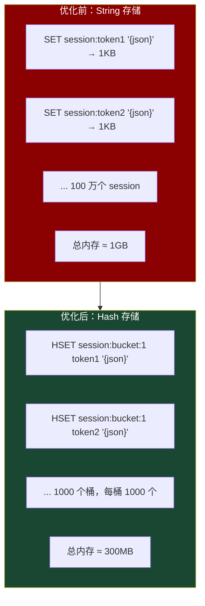

优化前：
```bash
# 每个用户一个 String key
SET session:abc123 '{"user_id":1,"name":"张三","role":"admin","login_time":1700000000}'
```

优化后：
```bash
# 按桶分 Hash
# bucket = hash(token) % 1000
HSET session:bucket:234 abc123 '{"user_id":1,"name":"张三","role":"admin","login_time":1700000000}'

# 查询
HGET session:bucket:234 abc123

# 删除
HDEL session:bucket:234 abc123
```

### 11.2 案例：社交关系存储

```bash
# 好友列表：1 亿用户，平均 200 好友

# 方案一：Set（约 40GB）
SADD friends:user1 user2 user3 ... user200
# 每个 member 约 40 字节 × 200 = 8KB/用户
# 1 亿用户 × 8KB = 800GB（含开销实际约 40GB）

# 方案二：用整数 ID + intset（约 4GB）
SADD friends:1 2 3 4 ... 200
# intset 编码，每个 member 4 字节 × 200 = 800B/用户
# 1 亿用户 × 800B ≈ 80GB → intset 更紧凑 → 约 4GB

# 方案三：Bitmap（适用于关注/粉丝等单向关系）
SETBIT following:1 2 1   # 用户 1 关注了用户 2
SETBIT following:1 3 1   # 用户 1 关注了用户 3
```

### 11.3 案例：排行榜优化

```bash
# 场景：100 万玩家的积分排行榜

# 方案一：ZSet（约 60MB）
ZADD leaderboard 1500 "player:1"
ZADD leaderboard 2000 "player:2"
# listpack 编码（元素 ≤ 128）时约 10MB
# skiplist 编码（元素 > 128）时约 60MB

# 方案二：分片 ZSet（适用于 1 亿+ 玩家）
# 按积分范围分片
ZADD leaderboard:0_1000 500 "player:1"
ZADD leaderboard:1001_2000 1500 "player:2"
```

---

## 十二、内存监控与告警

### 12.1 关键监控指标

| 指标 | 获取方式 | 告警阈值 |
|------|---------|---------|
| `used_memory` | `INFO memory` | > 80% maxmemory |
| `used_memory_rss` | `INFO memory` | > 物理内存 90% |
| `mem_fragmentation_ratio` | `INFO memory` | > 1.5 或 < 1.0 |
| `evicted_keys` | `INFO stats` | > 0（持续增长） |
| `used_memory_peak` | `INFO memory` | 接近 maxmemory |
| `blocked_clients` | `INFO clients` | > 0（内存不足阻塞） |

### 12.2 Prometheus 监控配置

```yaml
# prometheus.yml
scrape_configs:
  - job_name: 'redis'
    static_configs:
      - targets: ['10.0.0.1:9121']
```

### 12.3 告警规则

```yaml
# redis-alerts.yml
groups:
  - name: redis_memory
    rules:
      - alert: RedisMemoryUsageHigh
        expr: redis_memory_used_bytes / redis_memory_max_bytes > 0.8
        for: 5m
        labels:
          severity: warning
        annotations:
          summary: "Redis 内存使用超过 80%"
          description: "实例 {{ $labels.instance }} 内存使用率 {{ $value | humanizePercentage }}"

      - alert: RedisMemoryFragmentationHigh
        expr: redis_mem_fragmentation_ratio > 1.5
        for: 10m
        labels:
          severity: warning
        annotations:
          summary: "Redis 内存碎片率过高"
          description: "实例 {{ $labels.instance }} 碎片率 {{ $value }}"

      - alert: RedisKeysEvicted
        expr: increase(redis_evicted_keys_total[5m]) > 0
        for: 1m
        labels:
          severity: critical
        annotations:
          summary: "Redis 正在淘汰键"
          description: "实例 {{ $labels.instance }} 最近 5 分钟淘汰了 {{ $value }} 个键"
```

---

## 十三、内存优化的黄金法则

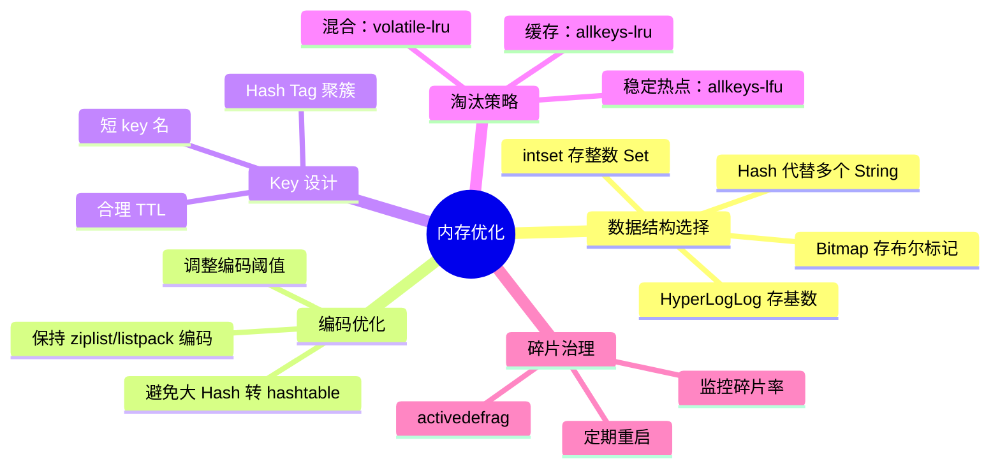

::: important 核心要点
1. **8 种淘汰策略**：缓存场景首选 `allkeys-lru`，稳定热点选 `allkeys-lfu`，不允许丢数据选 `noeviction`
2. **LRU 是近似算法**：24 bit 时间戳 + 随机采样，采样数越大越精确但越慢
3. **LFU 按频率淘汰**：8 bit 对数计数器 + 16 bit 衰减时间，适合热点稳定场景
4. **碎片率 > 1.5 需关注**：开启 `activedefrag` 或定期重启
5. **对象共享在 LRU/LFU 下失效**：因为每个键需要独立的 lru 字段
6. **Hash 代替多个 String**：最有效的内存优化手段，配合 ziplist/listpack 可节省 70%+
7. **设置合理的 maxmemory**：物理内存的 70%，避免 OOM 和 Swap
:::
