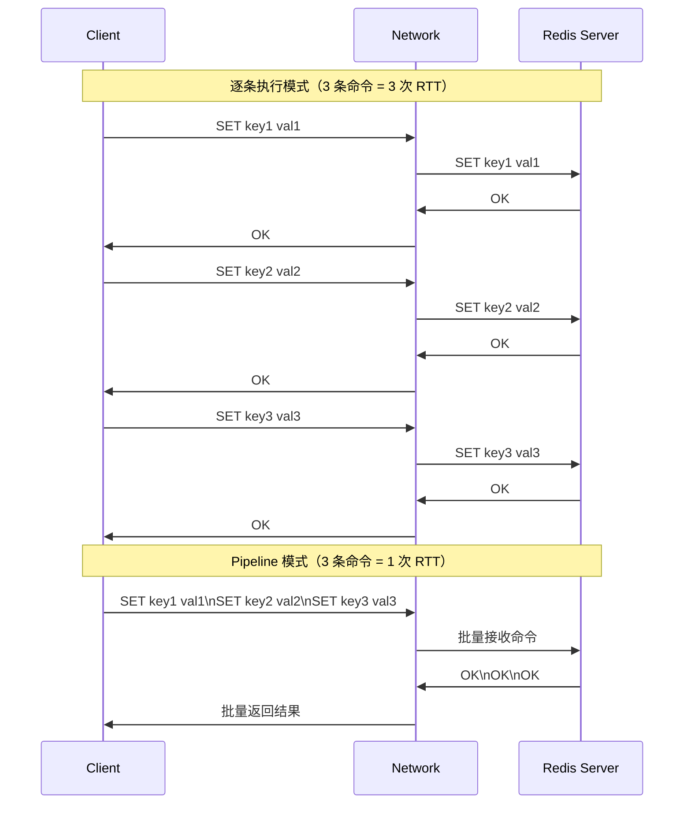
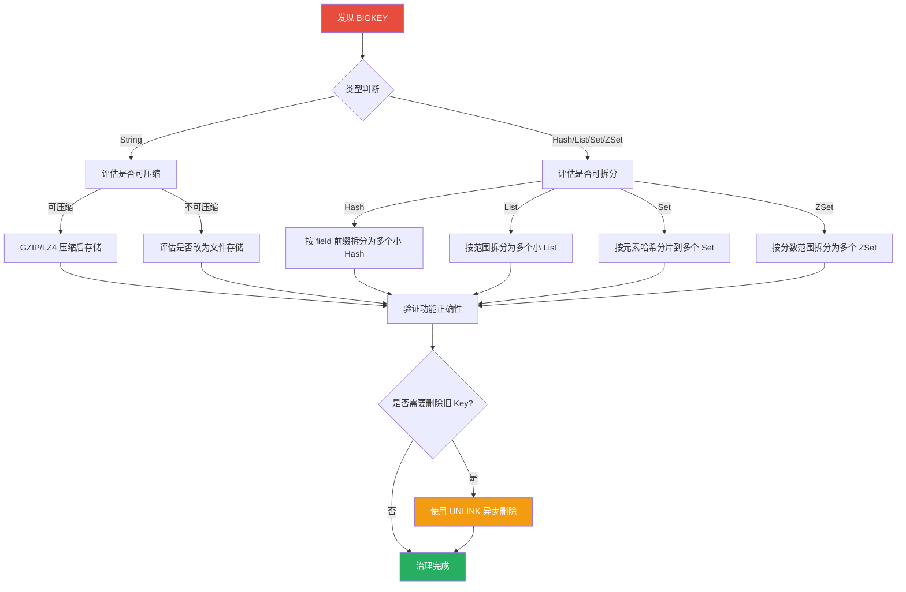
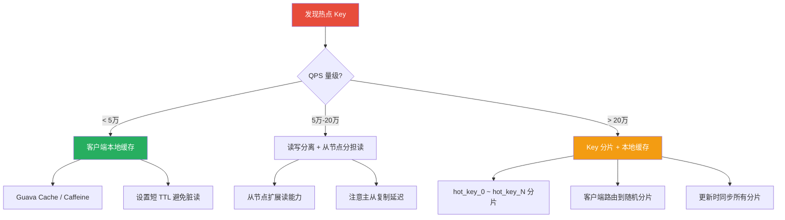
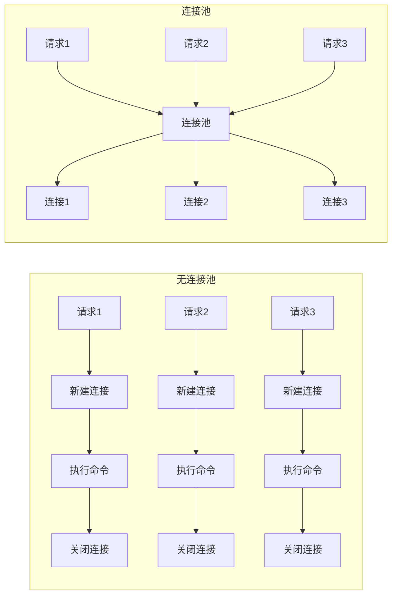
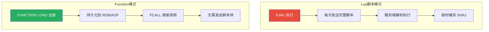

# 性能调优实战

Redis 以快著称，但"快"不是免费的——一次网络往返 0.1ms，100 次就是 10ms；一个 10MB 的 BIGKEY 能阻塞整个实例 50ms；一个热点 Key 能让单线程 CPU 满载。性能调优的本质是**减少不必要的等待**，让 Redis 把时间花在真正有价值的工作上。

本文从 Pipeline 批量执行、BIGKEY 治理、热点 Key 处理、命名规范、连接池优化到 Redis 7 Function，给出可落地的实战方案。

## 1. Pipeline 批量执行原理

### 1.1 逐条执行 vs Pipeline

Redis 是 C/S 架构，每条命令都需要经历一次完整的网络往返（RTT，Round-Trip Time）：



::: important 核心原理
Pipeline 不是 Redis 服务端的新特性，而是**客户端行为**——客户端将多条命令打包后一次性发送，服务端依次执行后将结果打包返回。关键收益是**将 N 次 RTT 压缩为 1 次 RTT**。
:::

### 1.2 RTT 的真实影响

以同机房 0.1ms RTT、跨机房 2ms RTT 为例：

| 场景 | 命令数 | 逐条执行耗时 | Pipeline 耗时 | 提升倍数 |
|------|--------|-------------|--------------|---------|
| 同机房 100 条 | 100 | 10ms | 0.2ms | 50x |
| 同机房 1000 条 | 1000 | 100ms | 1ms | 100x |
| 跨机房 100 条 | 100 | 200ms | 2.2ms | 91x |
| 跨机房 1000 条 | 1000 | 2000ms | 20ms | 100x |

::: tip 计算公式
- 逐条执行：`N × (RTT + 命令执行时间)`
- Pipeline：`1 × RTT + N × 命令执行时间`
- 当 RTT >> 命令执行时间时，Pipeline 的收益最大
:::

### 1.3 Pipeline 代码示例

**StackExchange.Redis（C#）：**

```csharp
// Pipeline 批量写入
var batch = db.CreateBatch();

var tasks = new List<Task>();
for (int i = 0; i < 1000; i++)
{
    var task = batch.StringSetAsync($"user:{i}:name", $"name_{i}");
    tasks.Add(task);
}

batch.Execute(); // 一次性发送所有命令
await Task.WhenAll(tasks); // 等待所有结果返回
```

**Python（redis-py）：**

```python
import redis

r = redis.Redis(host='localhost', port=6379)

# Pipeline 批量操作
pipe = r.pipeline()
for i in range(1000):
    pipe.set(f'user:{i}:name', f'name_{i}')
results = pipe.execute()  # 一次性发送并获取结果

# Pipeline 也可以链式调用
pipe = r.pipeline()
pipe.set('a', 1).set('b', 2).get('a').get('b')
results = pipe.execute()  # [True, True, b'1', b'2']
```

**Java（Jedis）：**

```java
Jedis jedis = new Jedis("localhost", 6379);
Pipeline pipe = jedis.pipelined();

for (int i = 0; i < 1000; i++) {
    pipe.set("user:" + i + ":name", "name_" + i);
}

List<Object> results = pipe.syncAndReturnAll();
```

### 1.4 Pipeline 的注意事项

::: warning Pipeline 不是原子的
Pipeline 中的命令会被依次执行，但**不会像事务那样保证原子性**——如果中途某条命令失败，后续命令仍会继续执行。如果需要原子性，应该使用事务（MULTI/EXEC）或 Lua 脚本。
:::

```python
# Pipeline 中的命令不是原子的
pipe = r.pipeline()
pipe.set('a', '1')
pipe.incr('nonexistent_key')  # 这会失败，但不影响其他命令
pipe.set('b', '2')
results = pipe.execute()
# results: [True, redis.exceptions.ResponseError, True]
# 注意：默认情况下 pipeline.execute() 会在遇到错误时抛异常
# 可以设置 transaction=False 来收集所有结果（包括错误）
```

**批量大小建议：**

| 单条命令 Value 大小 | 建议每批数量 | 理由 |
|--------------------|-------------|------|
| < 1KB | 500-1000 | 网络带宽不是瓶颈 |
| 1KB - 10KB | 100-500 | 避免单次 TCP 包过大 |
| > 10KB | 10-50 | 防止阻塞事件循环 |

::: tip 分批 Pipeline
如果需要写入大量数据，务必分批执行 Pipeline，避免一次性占用过多内存和网络带宽：

```python
BATCH_SIZE = 500
for i in range(0, total_count, BATCH_SIZE):
    pipe = r.pipeline()
    for j in range(i, min(i + BATCH_SIZE, total_count)):
        pipe.set(f'key:{j}', f'value:{j}')
    pipe.execute()
```
:::

## 2. 批量操作对比：MGET/MSET vs Pipeline

### 2.1 三种批量方式

| 特性 | MGET/MSET | Pipeline | 事务 MULTI/EXEC |
|------|-----------|----------|----------------|
| 原子性 | 单条命令，原子 | 非原子 | 原子 |
| RTT 次数 | 1 | 1 | 1 |
| 命令类型 | 仅限同一类型 | 任意命令 | 任意命令 |
| 服务端执行 | 一次遍历 | 逐条执行 | 逐条执行 + 事务开销 |
| 适用场景 | 批量读写同类型 Key | 混合命令批量执行 | 需要原子性的批量操作 |

### 2.2 MGET/MSET 的优势

MGET/MSET 是 Redis 原生命令，在服务端实现中直接遍历 Key 数组，**没有命令解析的重复开销**：

```bash
# MGET 一次获取多个 Key
MGET user:1:name user:2:name user:3:name
# 返回: 1) "Alice" 2) "Bob" 3) "Charlie"

# MSET 一次设置多个 Key
MSET user:1:name "Alice" user:2:name "Bob" user:3:name "Charlie"
```

**Pipeline 实现 MGET 等价功能：**

```python
# Pipeline 方式（等价于 MGET，但效率更低）
pipe = r.pipeline()
pipe.get('user:1:name')
pipe.get('user:2:name')
pipe.get('user:3:name')
results = pipe.execute()

# MGET 方式（更高效）
results = r.mget('user:1:name', 'user:2:name', 'user:3:name')
```

::: important 选择原则
- 能用 MGET/MSET 的场景，优先用原生命令
- 需要混合不同命令类型时，用 Pipeline
- 需要原子性保证时，用事务或 Lua 脚本
:::

### 2.3 性能实测对比

测试环境：Redis 7.0，同机房 RTT ≈ 0.1ms，1000 个 String 类型 Key

| 方式 | 总耗时 | RTT 次数 | QPS |
|------|--------|---------|-----|
| 逐条 GET | ~110ms | 1000 | ~9,000 |
| Pipeline GET | ~1.5ms | 1 | ~666,000 |
| MGET（分 10 批，每批 100） | ~1.2ms | 10 | ~833,000 |
| MGET（1 批 1000） | ~0.8ms | 1 | ~1,250,000 |

```python
# 完整性能测试代码
import redis
import time

r = redis.Redis(host='localhost', port=6379)

# 准备数据
pipe = r.pipeline()
for i in range(1000):
    pipe.set(f'bench:{i}', f'value_{i}')
pipe.execute()

keys = [f'bench:{i}' for i in range(1000)]

# 逐条 GET
start = time.perf_counter()
for k in keys:
    r.get(k)
print(f"逐条 GET: {time.perf_counter() - start:.3f}s")

# Pipeline GET
start = time.perf_counter()
pipe = r.pipeline()
for k in keys:
    pipe.get(k)
pipe.execute()
print(f"Pipeline GET: {time.perf_counter() - start:.3f}s")

# MGET
start = time.perf_counter()
r.mget(keys)
print(f"MGET: {time.perf_counter() - start:.3f}s")
```

## 3. BIGKEY 发现与治理

### 3.1 什么是 BIGKEY

BIGKEY 没有绝对的大小标准，业界一般参考以下阈值：

| 数据类型 | BIGKEY 阈值 | 说明 |
|---------|-----------|------|
| String | > 10KB | 单个 Value 过大 |
| Hash | > 5000 个 field 或总大小 > 10MB | field 数量或总大小超标 |
| List | > 5000 个元素或总大小 > 10MB | 列表过长 |
| Set | > 5000 个元素 | 集合过大 |
| ZSet | > 5000 个成员 | 有序集合过大 |

::: warning BIGKEY 的危害
1. **阻塞事件循环**：DEL 一个大 Key 可能阻塞数十毫秒到数秒
2. **网络拥塞**：读取大 Key 占用大量带宽，影响其他请求
3. **内存不均**：集群模式下大 Key 导致某节点内存使用远高于其他节点
4. **过期删除风险**：大 Key 设置过期后，到期时同步删除会阻塞主线程
:::

### 3.2 BIGKEY 发现方法

**方法一：redis-cli --bigkeys**

```bash
# 扫描整个实例，报告每种数据类型的最大 Key
redis-cli --bigkeys -i 0.1

# 输出示例：
# -------- summary -------
# Biggest string found so far: 'user:session:big' with 10485760 bytes
# Biggest list   found so far: 'queue:tasks' with 52384 entries
# Biggest set    found so far: 'tag:popular' with 12345 members
# Biggest hash   found so far: 'user:profile:1001' with 8765 fields
# Biggest zset   found so far: 'rank:daily' with 23456 members
```

::: info --bigkeys 原理
`--bigkeys` 使用 SCAN 命令遍历所有 Key，对每个 Key 执行 `STRLEN`/`LLEN`/`SCARD`/`HLEN`/`ZCARD` 获取大小。`-i 0.1` 参数表示每 100 条 Key 休眠 0.1 秒，降低对线上服务的影响。
:::

**方法二：SCAN + DEBUG OBJECT**

```bash
# 手动 SCAN 扫描
redis-cli SCAN 0 COUNT 100

# 查看特定 Key 的详细信息
redis-cli DEBUG OBJECT user:session:big
# Value at:0x7f8b3c000000 refcount:1 encoding:raw serializedlength:10485760
# lru:1234567 lru_seconds_idle:300
```

**方法三：SCAN + 编程扫描**

```python
import redis

r = redis.Redis(host='localhost', port=6379)

BIGKEY_THRESHOLD = {
    'string': 10240,   # 10KB
    'list': 5000,
    'set': 5000,
    'hash': 5000,
    'zset': 5000,
}

def scan_bigkeys(scan_count=1000):
    """扫描发现 BIGKEY"""
    cursor = 0
    bigkeys = []

    while True:
        cursor, keys = r.scan(cursor=cursor, count=scan_count)
        for key in keys:
            key_type = r.type(key).decode()
            key_size = 0

            if key_type == 'string':
                key_size = r.strlen(key)
            elif key_type == 'list':
                key_size = r.llen(key)
            elif key_type == 'set':
                key_size = r.scard(key)
            elif key_type == 'hash':
                key_size = r.hlen(key)
            elif key_type == 'zset':
                key_size = r.zcard(key)

            threshold = BIGKEY_THRESHOLD.get(key_type, 0)
            if key_size > threshold:
                bigkeys.append({
                    'key': key.decode(),
                    'type': key_type,
                    'size': key_size,
                })

        if cursor == 0:
            break

    return sorted(bigkeys, key=lambda x: x['size'], reverse=True)

# 执行扫描
results = scan_bigkeys()
for bk in results[:20]:
    print(f"[BIGKEY] {bk['type']:6s} {bk['key']:40s} size={bk['size']}")
```

**方法四：RDB 分析工具**

```bash
# 使用 rdb-tools 离线分析 RDB 文件
pip install rdb-tools

# 生成内存报告
rdb --command memory dump.rdb --bytes 10240 -f memory_report.csv

# 按最大 Key 排序
rdb --command json dump.rdb -k "user:*" | python -m json.tool
```

### 3.3 BIGKEY 治理流程



### 3.4 BIGKEY 拆分实战

**案例：大 Hash 拆分**

```python
# 原始结构：一个 Hash 存储 10000 个 field
# HGETALL user:1001:detail → {name, age, email, address, phone, ...10000 fields}

# 拆分方案：按业务域拆分为多个小 Hash
# user:1001:basic → {name, age, gender}
# user:1001:contact → {email, phone, address}
# user:1001:profile → {avatar, bio, birthday}

def split_big_hash(source_key, field_mapping, batch_size=500):
    """
    拆分大 Hash 到多个小 Hash

    Args:
        source_key: 原始大 Hash 的 Key
        field_mapping: {目标key: [field1, field2, ...]}
        batch_size: 每批处理的 field 数量
    """
    pipe = r.pipeline()

    for target_key, fields in field_mapping.items():
        # 分批 HGET + HSET
        for i in range(0, len(fields), batch_size):
            batch = fields[i:i + batch_size]

            # 从源 Hash 读取
            values = r.hmget(source_key, batch)

            # 写入目标 Hash
            data = {}
            for field, value in zip(batch, values):
                if value is not None:
                    data[field] = value

            if data:
                pipe.hset(target_key, mapping=data)

        pipe.execute()

# 执行拆分
field_mapping = {
    'user:1001:basic': ['name', 'age', 'gender'],
    'user:1001:contact': ['email', 'phone', 'address'],
    'user:1001:profile': ['avatar', 'bio', 'birthday'],
}
split_big_hash('user:1001:detail', field_mapping)
```

**案例：大 List 拆分**

```python
# 原始结构：一个 List 存储 100000 条消息
# queue:tasks → [task1, task2, ..., task100000]

# 拆分方案：按范围分片
# queue:tasks:0 → [task1, ..., task1000]
# queue:tasks:1 → [task1001, ..., task2000]

def split_big_list(source_key, shard_size=1000):
    """拆分大 List 到多个分片"""
    total = r.llen(source_key)
    shard_count = (total + shard_size - 1) // shard_size

    for shard_idx in range(shard_count):
        start = shard_idx * shard_size
        end = min(start + shard_size - 1, total - 1)

        # 读取分片范围的数据
        items = r.lrange(source_key, start, end)

        if items:
            shard_key = f"{source_key}:{shard_idx}"
            pipe = r.pipeline()
            for item in items:
                pipe.rpush(shard_key, item)
            pipe.execute()

    # 使用 UNLINK 异步删除原 Key
    r.unlink(source_key)
```

### 3.5 BIGKEY 安全删除

::: warning 绝对不要用 DEL 删除大 Key
`DEL` 是同步操作，会阻塞 Redis 主线程。一个 100MB 的 Key，DEL 可能阻塞数百毫秒甚至数秒。
:::

```bash
# 危险！同步删除大 Key
DEL user:session:big    # 可能阻塞 500ms+

# 安全方式 1：UNLINK（Redis 4.0+）
UNLINK user:session:big  # 异步删除，立即返回

# 安全方式 2：渐进式删除（适用于 Hash/Set/ZSet）
# Hash 渐进删除
HSCAN user:profile:big 0 COUNT 200
# 分批 HDEL

# 安全方式 3：先设过期再让后台线程删除
EXPIRE user:session:big 1
# 等 1 秒后由后台线程异步删除
```

```python
# 渐进式删除大 Hash
def safe_delete_hash(key, batch_size=200):
    """安全删除大 Hash，分批 HDEL"""
    cursor = 0
    while True:
        cursor, fields = r.hscan(key, cursor=cursor, count=batch_size)
        if fields:
            r.hdel(key, *fields.keys())
        if cursor == 0:
            break

# 渐进式删除大 Set
def safe_delete_set(key, batch_size=200):
    """安全删除大 Set，分批 SREM"""
    cursor = 0
    while True:
        cursor, members = r.sscan(key, cursor=cursor, count=batch_size)
        if members:
            r.srem(key, *members)
        if cursor == 0:
            break
```

## 4. 热点 Key 发现与处理

### 4.1 什么是热点 Key

热点 Key 是指**被高频访问的 Key**，通常 QPS 远超其他 Key。在集群模式下，热点 Key 会导致单个节点成为瓶颈。

| 场景 | 典型热点 Key | QPS 量级 |
|------|-------------|---------|
| 热门文章 | `article:12345` | 10万+ |
| 秒杀商品 | `seckill:goods:999` | 50万+ |
| 热门话题 | `topic:hot:888` | 20万+ |
| 配置信息 | `config:global` | 5万+ |

### 4.2 热点 Key 发现方法

**方法一：MONITOR 命令（谨慎使用）**

```bash
# 开启 MONITOR，实时输出所有命令
redis-cli MONITOR | head -10000

# 配合 awk 统计 Key 访问频率
redis-cli MONITOR | \
  awk -F'"' '{for(i=1;i<=NF;i++) if($i ~ /^key:/) print $i}' | \
  sort | uniq -c | sort -rn | head -20
```

::: warning MONITOR 的代价
MONITOR 会输出服务端收到的**每一条命令**，在高 QPS 场景下会显著增加 CPU 和网络开销。生产环境建议：
1. 只在排查窗口短时间开启（不超过 30 秒）
2. 使用 `| head -N` 限制输出条数
3. 优先使用其他方法
:::

**方法二：客户端统计**

```python
# 在客户端层面统计 Key 访问频率
from collections import Counter
import time

class HotKeyDetector:
    def __init__(self, window_size=10, top_n=20):
        self.window_size = window_size
        self.top_n = top_n
        self.counter = Counter()
        self.start_time = time.time()

    def record(self, key):
        """记录 Key 访问"""
        now = time.time()
        if now - self.start_time > self.window_size:
            # 输出上一个窗口的热点 Key
            self._report()
            self.counter.clear()
            self.start_time = now
        self.counter[key] += 1

    def _report(self):
        """输出热点 Key 报告"""
        print(f"\n=== Hot Key Report (last {self.window_size}s) ===")
        for key, count in self.counter.most_common(self.top_n):
            qps = count / self.window_size
            print(f"  {key:40s} QPS={qps:.0f}")

# 使用方式
detector = HotKeyDetector(window_size=10, top_n=20)

# 包装 Redis 客户端
original_get = r.get
def tracked_get(key):
    detector.record(key)
    return original_get(key)
r.get = tracked_get
```

**方法三：Redis 4.0+ LFU 热点发现**

```bash
# 开启 LFU 淘汰策略
CONFIG SET maxmemory-policy allkeys-lfu

# 查看特定 Key 的访问频率（LFU counter）
OBJECT FREQ article:12345
# 返回：255（频率计数器值，越大越热）

# 随机采样发现热点 Key
redis-cli --hotkeys
# 会输出按访问频率排序的 Key 列表
```

**方法四：代理层统计**

```bash
# 如果使用 Twemproxy 或 Codis，可在代理层统计 Key 访问
# Twemproxy 的 stats 接口
curl http://twemproxy:22222/stats

# Codis Dashboard
curl http://codis-dashboard:18080/api/topom/stats
```

### 4.3 热点 Key 处理方案



**方案一：本地缓存（推荐首选）**

```csharp
// C# 使用 Caffeine 做本地缓存
using Caffeine;
using StackExchange.Redis;

public class RedisWithLocalCache
{
    private readonly IDatabase _redis;
    private readonly Cache<string, string> _localCache;

    public RedisWithLocalCache(IDatabase redis)
    {
        _redis = redis;

        _localCache = CaffeineBuilder
            .Builder()
            .MaximumSize(10_000)
            .ExpireAfterWrite(TimeSpan.FromSeconds(5))  // 短 TTL
            .Build<string, string>();
    }

    public async Task<string> GetAsync(string key)
    {
        // 先查本地缓存
        var value = _localCache.GetIfPresent(key);
        if (value != null) return value;

        // 本地缓存未命中，查 Redis
        value = await _redis.StringGetAsync(key);

        if (value != null)
        {
            _localCache.Put(key, value);
        }

        return value;
    }

    public async Task SetAsync(string key, string value, TimeSpan? expiry = null)
    {
        await _redis.StringSetAsync(key, value, expiry);
        _localCache.Invalidate(key);  // 更新时失效本地缓存
    }
}
```

**方案二：Key 分片**

```python
import hashlib
import random

class ShardedHotKey:
    """热点 Key 分片方案"""

    def __init__(self, redis_client, shard_count=16):
        self.r = redis_client
        self.shard_count = shard_count

    def _get_shard_key(self, key, shard_idx=None):
        """获取分片 Key"""
        if shard_idx is None:
            shard_idx = random.randint(0, self.shard_count - 1)
        return f"{key}:shard:{shard_idx}"

    def get(self, key):
        """随机读一个分片"""
        shard_key = self._get_shard_key(key)
        return self.r.get(shard_key)

    def set(self, key, value, **kwargs):
        """写所有分片"""
        pipe = self.r.pipeline()
        for i in range(self.shard_count):
            shard_key = self._get_shard_key(key, i)
            pipe.set(shard_key, value, **kwargs)
        pipe.execute()

    def incr(self, key, amount=1):
        """计数：对所有分片求和"""
        pipe = self.r.pipeline()
        for i in range(self.shard_count):
            shard_key = self._get_shard_key(key, i)
            pipe.get(shard_key)
        values = pipe.execute()

        total = sum(int(v or 0) for v in values)
        return total

# 使用
sharded = ShardedHotKey(r, shard_count=16)
sharded.set('article:12345:views', '10000')  # 写所有分片
views = sharded.incr('article:12345:views')   # 读分片求和
```

**方案三：读写分离**

```python
# 使用从节点分担热点读
from redis import Redis

master = Redis(host='redis-master', port=6379)
slave1 = Redis(host='redis-slave-1', port=6379)
slave2 = Redis(host='redis-slave-2', port=6379)

read_replicas = [slave1, slave2]

def hot_read_get(key):
    """热点读请求路由到从节点"""
    replica = random.choice(read_replicas)
    return replica.get(key)

def hot_write_set(key, value, **kwargs):
    """写请求路由到主节点"""
    return master.set(key, value, **kwargs)
```

## 5. Key 命名规范

### 5.1 命名格式

```
业务:实体:ID[:字段]
```

::: tip 命名原则
1. **冒号分隔**：Redis 社区惯例，层级清晰
2. **可读性**：人能看懂，排查问题时一目了然
3. **简洁**：Key 会占用内存，过长的 Key 浪费空间
4. **一致性**：团队统一规范，避免同一实体多种命名
:::

### 5.2 命名规范表

| 规范 | 示例 | 说明 |
|------|------|------|
| 业务前缀 | `order:`, `user:`, `pay:` | 避免不同业务 Key 冲突 |
| 实体标识 | `user:1001` | 唯一标识一个实体 |
| 字段后缀 | `user:1001:profile` | 区分同一实体的不同数据 |
| 使用冒号分隔 | `order:2024:01:summary` | 层级关系 |
| 禁止特殊字符 | 不用空格、换行、中文 | 避免解析和调试问题 |
| Key 长度 < 100 字节 | `u:1001:p` vs `user_profile_information:user_id_1001` | 节省内存 |

### 5.3 命名示例

```bash
# 用户相关
user:1001:profile         # 用户基本资料
user:1001:settings        # 用户设置
user:1001:followers       # 粉丝列表（Set）
user:1001:timeline        # 个人时间线（List）

# 订单相关
order:20240101123456      # 订单详情
order:user:1001:pending   # 用户待处理订单（ZSet，score=下单时间）

# 限流相关
ratelimit:api:1001:minute  # 每分钟限流计数
ratelimit:api:1001:hour    # 每小时限流计数

# 缓存相关
cache:article:12345       # 文章缓存
cache:search:keyword:abc  # 搜索结果缓存

# 分布式锁
lock:order:pay:1001       # 订单支付锁
lock:inventory:seckill:999 # 秒杀库存锁

# 会话相关
session:token:abc123      # 用户会话
```

### 5.4 内存优化：缩短 Key 名

```python
# 长 Key 名
user_profile_information:user_id_1001
# 短 Key 名
u:1001:p

# Key 前缀映射表
KEY_PREFIX = {
    'u': 'user',
    'o': 'order',
    'p': 'profile',
    's': 'settings',
    'rl': 'ratelimit',
    'lk': 'lock',
}

def short_key(business, entity_id, field=None):
    """生成短 Key 名"""
    prefix = {v: k for k, v in KEY_PREFIX.items()}.get(business, business)
    key = f"{prefix}:{entity_id}"
    if field:
        key += f":{field[0]}"  # 只取首字母
    return key
```

::: important 短 Key 的权衡
缩短 Key 名可以节省内存，但会降低可读性。建议：
1. 开发/测试环境使用完整 Key 名
2. 生产环境如果内存紧张再考虑缩短
3. 无论如何，团队内必须统一映射表
:::

## 6. 慢命令排查

### 6.1 哪些命令天然较慢

| 命令 | 时间复杂度 | 风险等级 | 说明 |
|------|-----------|---------|------|
| KEYS * | O(N) | 高危 | 遍历所有 Key |
| HGETALL | O(N) | 中危 | N = field 数量 |
| SMEMBERS | O(N) | 中危 | N = 元素数量 |
| ZRANGE 0 -1 | O(N) | 中危 | N = 成员数量 |
| LRANGE 0 -1 | O(N) | 中危 | N = 元素数量 |
| SUNION/SINTER | O(N*M) | 高危 | 多集合运算 |
| SORT | O(N+M*log(M)) | 高危 | 排序操作 |
| DEL 大 Key | O(N) | 高危 | 同步删除 |

### 6.2 替代方案

```bash
# 危险：KEYS 匹配
KEYS user:*           # 遍历所有 Key，生产禁用

# 安全：SCAN 遍历
SCAN 0 MATCH user:* COUNT 100

# 危险：HGETALL 获取全部字段
HGETALL user:1001:detail   # 如果有 10000 个 field，会很慢

# 安全：HSCAN + COUNT
HSCAN user:1001:detail 0 COUNT 100

# 危险：获取全部 Set 成员
SMEMBERS tag:popular    # 如果有 100000 个成员

# 安全：SSCAN
SSCAN tag:popular 0 COUNT 100

# 危险：LRANGE 获取全部元素
LRANGE queue:tasks 0 -1  # 如果 List 有 100 万元素

# 安全：分页获取
LRANGE queue:tasks 0 99   # 只取前 100 条
```

### 6.3 命令复杂度速查表

```python
# Redis 命令复杂度分类（按风险等级）
O1_COMMANDS = {
    'GET', 'SET', 'HGET', 'HSET', 'LPUSH', 'RPUSH',
    'SADD', 'SISMEMBER', 'ZADD', 'ZSCORE', 'INCR', 'DECR',
    'EXPIRE', 'TTL', 'EXISTS', 'DEL',  # DEL 仅对小 Key
}

ON_COMMANDS = {
    'KEYS', 'HGETALL', 'SMEMBERS', 'LRANGE', 'ZCOUNT',
    'SUNION', 'SINTER', 'SDIFF', 'SORT', 'DEL',  # DEL 对大 Key
}

def check_command_safety(command, key_size_estimate=0):
    """检查命令安全性"""
    cmd = command.upper().split()[0]

    if cmd in O1_COMMANDS:
        return 'SAFE', f"{cmd} 是 O(1) 复杂度"
    elif cmd in ON_COMMANDS:
        if key_size_estimate > 1000:
            return 'DANGEROUS', f"{cmd} 是 O(N) 复杂度，预估 N={key_size_estimate}"
        return 'CAUTION', f"{cmd} 是 O(N) 复杂度，注意数据量"
    else:
        return 'UNKNOWN', f"{cmd} 复杂度未知，请查阅文档"
```

## 7. 连接池优化

### 7.1 为什么需要连接池

每次新建 TCP 连接需要经历三次握手（约 0.1ms-2ms），如果每次 Redis 操作都新建连接，性能会严重下降。连接池的核心价值是**复用已建立的 TCP 连接**。



### 7.2 各语言连接池配置

**StackExchange.Redis（C#）：**

```csharp
// StackExchange.Redis 使用多路复用，一个 ConnectionMultiplexer 共享一条连接
// 不需要传统连接池，但需要合理配置
var config = new ConfigurationOptions
{
    EndPoints = { "localhost:6379" },
    AbortOnConnectFail = false,          // 连接失败不抛异常，后台重连
    ConnectRetry = 3,                    // 连接重试次数
    ConnectTimeout = 5000,               // 连接超时 5s
    SyncTimeout = 5000,                  // 同步操作超时 5s
    AsyncTimeout = 10000,                // 异步操作超时 10s
    KeepAlive = 60,                      // 每 60s 发送心跳
    DefaultDatabase = 0,
    // 高并发场景
    SocketManager = new SocketManager("Redis", workerCount: 5)  // 5 个 IO 线程
};

// 单例模式，全局共享
var connection = ConnectionMultiplexer.Connect(config);
IDatabase db = connection.GetDatabase();
```

**Java（Lettuce 连接池）：**

```java
// Lettuce 也是多路复用，但支持连接池用于事务和阻塞命令
RedisClient client = RedisClient.create("redis://localhost:6379");

// 连接池配置
GenericObjectPoolConfig<StatefulRedisConnection<String, String>> poolConfig =
    new GenericObjectPoolConfig<>();
poolConfig.setMaxTotal(50);        // 最大连接数
poolConfig.setMaxIdle(20);         // 最大空闲连接
poolConfig.setMinIdle(5);          // 最小空闲连接
poolConfig.setMaxWaitMillis(3000); // 获取连接最大等待时间
poolConfig.setTestWhileIdle(true); // 空闲检测
poolConfig.setTimeBetweenEvictionRunsMillis(30000); // 回收器运行间隔

StatefulRedisConnection<String, String> connection = client.connect();
RedisPool pool = ConnectionPoolSupport
    .createGenericObjectPool(() -> connection, poolConfig);
```

**Python（redis-py 连接池）：**

```python
from redis import Redis, ConnectionPool

# 连接池配置
pool = ConnectionPool(
    host='localhost',
    port=6379,
    max_connections=50,        # 最大连接数
    socket_timeout=5,          # 读写超时 5s
    socket_connect_timeout=3,  # 连接超时 3s
    socket_keepalive=True,     # 开启 TCP Keepalive
    retry_on_timeout=True,     # 超时重试
    health_check_interval=30,  # 每 30s 健康检查
)

r = Redis(connection_pool=pool)
```

### 7.3 连接池参数调优

| 参数 | 建议值 | 调优依据 |
|------|--------|---------|
| max_connections | 50-200 | 根据并发量和 QPS 调整 |
| min_idle | 5-20 | 预热连接，避免冷启动 |
| socket_timeout | 3-5s | 根据命令执行时间调整 |
| connect_timeout | 1-3s | 网络延迟 + 安全余量 |
| keepalive | 30-60s | 防止防火墙关闭空闲连接 |
| health_check | 10-30s | 及时发现死连接 |

::: tip 连接数估算公式
```
max_connections ≈ (应用实例数 × 单实例并发线程数) + 安全余量(20%)

例如：
- 10 个应用实例
- 每实例 10 个并发线程
- 安全余量 20%
max_connections ≈ 10 × 10 × 1.2 = 120
```
:::

### 7.4 连接泄漏排查

```bash
# 查看 Redis 当前连接数
redis-cli INFO clients
# connected_clients:156
# blocked_clients:0

# 查看连接来源
redis-cli CLIENT LIST
# id=123 addr=10.0.1.5:52314 fd=8 name= app-name cmd=get

# 按来源 IP 统计连接数
redis-cli CLIENT LIST | awk '{print $2}' | sort | uniq -c | sort -rn

# 设置最大连接数
CONFIG SET maxclients 1000
```

```python
# Python 连接泄漏检测
import redis
import psutil

def check_connection_leak(pool, threshold=0.8):
    """检测连接池是否接近耗尽"""
    pool_info = pool._created_connections, pool._max_connections
    usage = pool_info[0] / pool_info[1]

    if usage > threshold:
        print(f"WARNING: 连接池使用率 {usage:.1%}，"
              f"已创建 {pool_info[0]}/{pool_info[1]} 连接")
        return True
    return False
```

## 8. Redis 7 Function 特性

### 8.1 Function 是什么

Redis 7 引入了 **Function**，是 Lua 脚本的进化版。Function 提供了更好的代码组织、持久化和版本管理能力。



### 8.2 Function vs Lua 对比

| 特性 | Lua 脚本 | Redis 7 Function |
|------|---------|-----------------|
| 注册方式 | EVAL 临时缓存 | FUNCTION LOAD 持久注册 |
| 持久化 | 不持久化，重启丢失 | 持久化到 RDB/AOF |
| 代码组织 | 单个脚本 | 库（Library）包含多个函数 |
| 版本管理 | 无 | FUNCTION LIST 查看版本 |
| 跨实例同步 | 需手动分发 | 主从复制自动同步 |
| 调试 | redis-cli --ldb | redis-cli --ldb + FUNCTION DEBUG |
| 调用方式 | EVAL/EVALSHA | FCALL/FCALL_RO |

### 8.3 Function 注册与调用

```bash
# 注册一个 Function 库
FUNCTION LOAD "#!lua name=mylib\n
redis.register_function('square', function(keys, args)\n
  local x = tonumber(args[1])\n
  return x * x\n
end)\n
redis.register_function('double', function(keys, args)\n
  local x = tonumber(args[1])\n
  return x * 2\n
end)"

# 调用 Function
FCALL mylib square 0 5    # 返回 25
FCALL mylib double 0 5    # 返回 10

# 只读调用（FCALL_RO，允许在从节点执行）
FCALL_RO mylib square 0 5
```

### 8.4 Function 实战：分布式限流

```lua
#!lua name=ratelimit

-- 滑动窗口限流
redis.register_function('sliding_window', function(keys, args)
    local key = keys[1]
    local window = tonumber(args[1])   -- 窗口大小（秒）
    local limit = tonumber(args[2])    -- 限制次数
    local now = tonumber(args[3])      -- 当前时间戳（毫秒）

    local window_start = now - window * 1000

    -- 移除窗口外的记录
    redis.call('ZREMRANGEBYSCORE', key, '-inf', window_start)

    -- 获取当前窗口内的请求数
    local count = redis.call('ZCARD', key)

    if count < limit then
        -- 添加当前请求
        redis.call('ZADD', key, now, now .. ':' .. math.random(1000000))
        redis.call('PEXPIRE', key, window * 1000)
        return 1  -- 允许
    else
        return 0  -- 拒绝
    end
end)
```

```bash
# 注册限流 Function
FUNCTION LOAD "#!lua name=ratelimit\n
redis.register_function('sliding_window', function(keys, args)\n
  local key = keys[1]\n
  local window = tonumber(args[1])\n
  local limit = tonumber(args[2])\n
  local now = tonumber(args[3])\n
  local window_start = now - window * 1000\n
  redis.call('ZREMRANGEBYSCORE', key, '-inf', window_start)\n
  local count = redis.call('ZCARD', key)\n
  if count < limit then\n
    redis.call('ZADD', key, now, now .. ':' .. math.random(1000000))\n
    redis.call('PEXPIRE', key, window * 1000)\n
    return 1\n
  else\n
    return 0\n
  end\n
end)"

# 调用：100秒窗口内最多 10 次请求
FCALL ratelimit sliding_window 1 ratelimit:api:1001 100 10 1704067200000
```

### 8.5 Function 管理

```bash
# 列出所有 Function 库
FUNCTION LIST
# 1) 1) "name"
#    2) "mylib"
#    3) "engine"
#    4) "LUA"
#    5) "functions"
#    6) 1) 1) "name"
#          2) "square"

# 删除 Function 库
FUNCTION DELETE mylib

# 刷新（覆盖）Function 库
FUNCTION FLUSH

# 导出 Function 定义
FUNCTION DUMP

# 导入 Function 定义
FUNCTION RESTORE <dump_data>

# 查看函数详情
FUNCTION LIST LIBRARYNAME mylib WITHCODE
```

::: important Function 最佳实践
1. **命名规范**：Library 名用 `业务_模块` 格式，如 `order_seckill`
2. **只读函数**：不修改数据的函数使用 `redis.register_function{ callback=fn, flags={ 'no-writes' } }`，这样可以用 FCALL_RO 在从节点执行
3. **错误处理**：使用 `redis.pcall` 代替 `redis.call` 捕获错误
4. **灰度发布**：先用 FUNCTION LOAD 注册到从节点测试，再推广到主节点
:::

## 9. 综合性能调优清单

### 9.1 调优检查清单

| 类别 | 检查项 | 目标值 | 检查方法 |
|------|--------|--------|---------|
| 网络 | RTT | < 0.5ms（同机房） | `redis-cli --latency` |
| 命令 | 慢命令 | 0 个 KEYS，HGETALL 限制 < 100 field | SLOWLOG |
| Key | BIGKEY | 无 > 10MB 的 Key | `redis-cli --bigkeys` |
| Key | 热点 Key | 单 Key QPS < 5万 | `--hotkeys` 或客户端统计 |
| 内存 | 使用率 | < 80% | `INFO memory` |
| 内存 | 碎片率 | 1.0 - 1.5 | `INFO memory mem_fragmentation_ratio` |
| 连接 | 连接数 | < maxclients 的 50% | `INFO clients` |
| 连接 | 阻塞客户端 | 0 | `INFO clients blocked_clients` |
| 持久化 | RDB 子进程 | 无频繁全量同步 | `INFO persistence` |
| 复制 | 主从延迟 | < 1s | `INFO replication` |

### 9.2 性能基准测试

```bash
# 使用 redis-benchmark 进行基准测试
redis-benchmark -h localhost -p 6379 -t set,get -n 100000 -c 50

# Pipeline 基准测试
redis-benchmark -h localhost -p 6379 -t set,get -n 100000 -c 50 -P 16

# 指定 Key 大小的测试
redis-benchmark -h localhost -p 6379 -t set -d 1024 -n 50000

# 仅测试特定命令
redis-benchmark -h localhost -p 6379 -t hset,hget -n 100000
```

### 9.3 延迟诊断

```bash
# 实时延迟监测
redis-cli --latency
# min: 0, max: 1, avg: 0.10 (1001 samples)

# 延迟历史分布
redis-cli --latency-history
# 每 15 秒输出一个延迟统计段

# 延迟排查步骤
# 1. 检查网络延迟
redis-cli --latency

# 2. 检查慢命令
redis-cli SLOWLOG GET 20

# 3. 检查 BIGKEY
redis-cli --bigkeys

# 4. 检查 Fork 耗时
redis-cli INFO stats | grep latest_fork_usec

# 5. 检查 AOF fsync 耗时
redis-cli INFO persistence | grep aof_delayed_fsync
```

## 10. 实战案例：电商首页性能调优

### 10.1 问题场景

某电商首页接口 RT 从 50ms 飙升到 500ms，Redis 相关操作占比 80%。

### 10.2 排查过程

```bash
# Step 1：检查延迟
redis-cli --latency
# avg: 2.3ms（正常应 < 0.5ms）

# Step 2：检查慢命令
redis-cli SLOWLOG GET 10
# 1) 1) (integer) 156
#    2) (integer) 1704067200
#    3) (integer) 52341    ← 52ms！
#    4) 1) "HGETALL"
#       2) "product:detail:12345"

# Step 3：检查 Key 大小
redis-cli HLEN product:detail:12345
# (integer) 5238  ← 5000+ 个 field！

# Step 4：检查热点 Key
redis-cli OBJECT FREQ product:detail:12345
# (integer) 255  ← 高频访问
```

### 10.3 优化方案

```python
# 优化前：HGETALL 获取全部字段
product = r.hgetall('product:detail:12345')  # 52ms

# 优化后 1：只获取需要的字段
product = r.hmget('product:detail:12345',
    'name', 'price', 'image', 'stock')  # 0.2ms

# 优化后 2：拆分大 Hash
# product:12345:basic  → {name, price, image}
# product:12345:stock  → {stock, reserved}
# product:12345:specs  → {color, size, weight, ...}

basic = r.hgetall('product:12345:basic')     # 0.1ms
stock = r.hgetall('product:12345:stock')     # 0.1ms

# 优化后 3：Pipeline 合并
pipe = r.pipeline()
pipe.hgetall('product:12345:basic')
pipe.hgetall('product:12345:stock')
pipe.get('product:12345:recommendations')
basic, stock, recs = pipe.execute()          # 0.3ms

# 优化后 4：本地缓存热点数据
import cachetools

# TTL 缓存，5 秒过期
local_cache = cachetools.TTLCache(maxsize=1000, ttl=5)

def get_product_detail(product_id):
    cache_key = f'product:{product_id}:detail'
    if cache_key in local_cache:
        return local_cache[cache_key]

    # Pipeline 获取
    pipe = r.pipeline()
    pipe.hgetall(f'product:{product_id}:basic')
    pipe.hgetall(f'product:{product_id}:stock')
    result = pipe.execute()

    local_cache[cache_key] = result
    return result
```

### 10.4 优化效果

| 指标 | 优化前 | 优化后 | 提升 |
|------|--------|--------|------|
| 单次 Redis 调用耗时 | 52ms | 0.3ms | 173x |
| 首页接口 RT | 500ms | 30ms | 16.7x |
| Redis CPU 使用率 | 85% | 35% | -50% |
| 连接数 | 200 | 80 | -60% |

## 11. 总结

::: tip 性能调优核心原则
1. **减少网络往返**：Pipeline、MGET/MSET、本地缓存
2. **减少单次操作耗时**：避免 BIGKEY、避免慢命令、缩短 Key 名
3. **分散热点**：Key 分片、读写分离、本地缓存
4. **合理使用连接**：连接池、多路复用、避免泄漏
5. **善用新特性**：Redis 7 Function 替代复杂 Lua 脚本
:::

性能调优不是一次性的工作，而是一个持续的过程。建立完善的监控体系（详见下一章），才能在问题恶化之前及时发现和解决。
