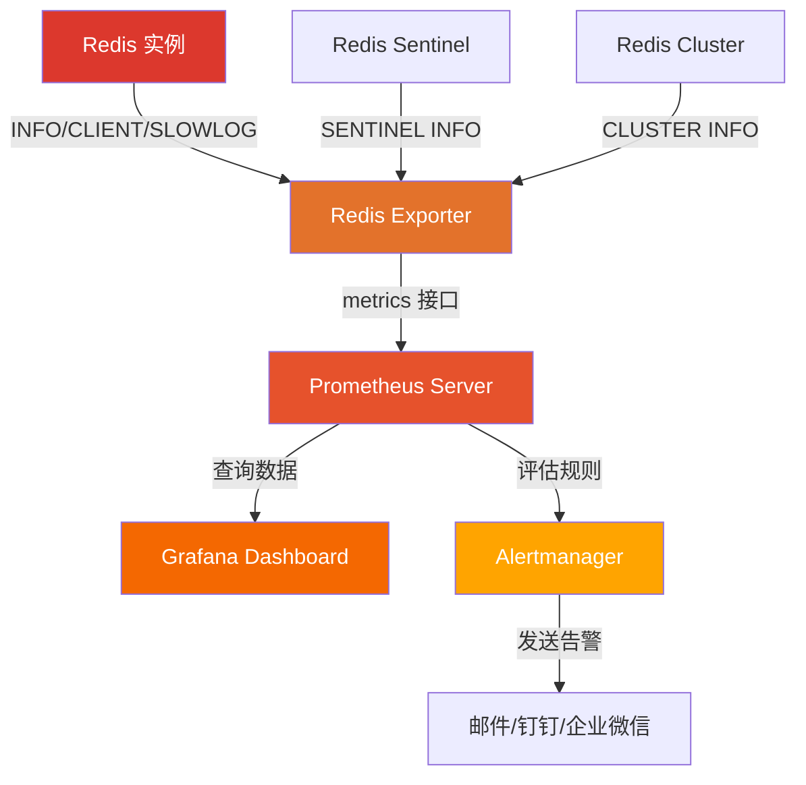
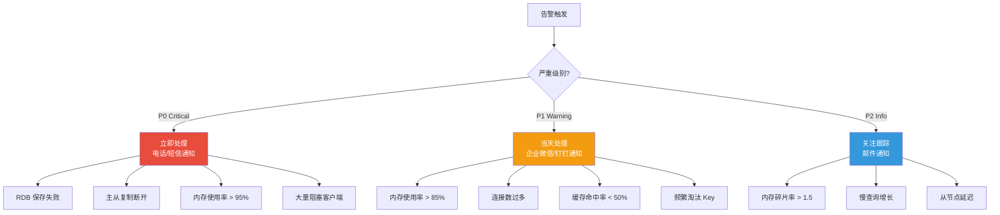
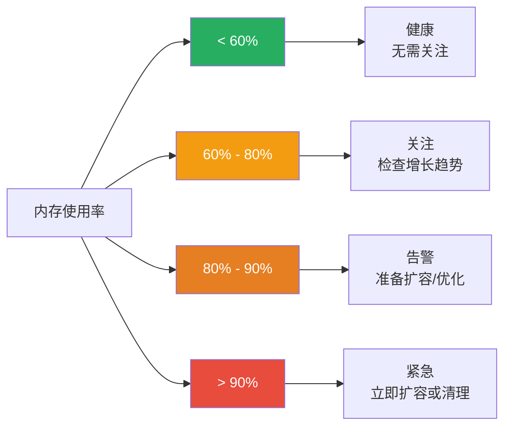
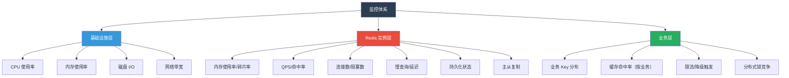

# 慢查询与监控

Redis 再快也需要"体检"——慢查询是症状，监控是心电图。一个 10ms 的慢命令在线上可能无感，但当它出现在每秒万次调用的热路径上，延迟就会雪崩式放大。本文从 SLOWLOG 入手，到 INFO 全解析，再到 Prometheus + Grafana 监控体系，帮你构建 Redis 可观测性的完整闭环。

## 1. SLOWLOG 配置与查询

### 1.1 什么是慢查询日志

Redis 的慢查询日志（Slow Log）记录了**执行时间超过指定阈值**的命令。这里的"执行时间"是指从命令被服务端接收到命令执行完毕的时间，**不包括网络传输和排队等待时间**。


::: important SLOWLOG 记录的是什么
SLOWLOG 记录的是**步骤 3→4 的时间**（命令执行时间），不是端到端延迟。如果你发现客户端感知的延迟远大于 SLOWLOG 记录的值，问题可能在网络或排队等待。
:::

### 1.2 SLOWLOG 配置

```bash
# 查看当前配置
CONFIG GET slowlog-log-slower-than
# 1) "slowlog-log-slower-than"
# 2) "10000"    ← 默认 10ms（10000 微秒）

CONFIG GET slowlog-max-len
# 1) "slowlog-max-len"
# 2) "128"      ← 默认保存 128 条

# 动态修改阈值（推荐 1ms-5ms）
CONFIG SET slowlog-log-slower-than 1000   # 1ms = 1000 微秒

# 动态修改最大条数
CONFIG SET slowlog-max-len 1024           # 保存最近 1024 条

# 持久化到配置文件
CONFIG REWRITE
```

::: tip 阈值设置建议
| 场景 | 建议阈值 | 理由 |
|------|---------|------|
| 高性能缓存 | 1000μs（1ms） | 缓存场景对延迟敏感 |
| 通用业务 | 5000μs（5ms） | 平衡记录量和信息量 |
| 容忍较高延迟 | 10000μs（10ms） | 减少日志噪音 |

**注意**：阈值越小，记录的慢查询越多，但内存开销可控（受 `slowlog-max-len` 限制）。建议生产环境设为 1ms-5ms。
:::

### 1.3 SLOWLOG 查询

```bash
# 查询最近的慢查询（默认 10 条）
SLOWLOG GET
# 1) 1) (integer) 42             ← 日志 ID
#    2) (integer) 1704067200     ← Unix 时间戳
#    3) (integer) 52341          ← 执行耗时（微秒）
#    4) 1) "HGETALL"             ← 命令和参数
#       2) "user:profile:1001"
#    5) "10.0.1.5:52314"         ← 客户端地址（Redis 4.0+）
#    6) ""                       ← 客户端名称（Redis 4.0+）

# 查询最近 20 条慢查询
SLOWLOG GET 20

# 查看慢查询日志条数
SLOWLOG LEN
# (integer) 156

# 清空慢查询日志
SLOWLOG RESET
```

### 1.4 SLOWLOG 输出字段详解

| 字段 | 说明 | 示例 |
|------|------|------|
| ID | 日志唯一标识，递增 | 42 |
| Timestamp | 命令执行的时间戳 | 1704067200 |
| Duration | 执行耗时（微秒） | 52341（约 52ms） |
| Command | 命令及参数列表 | ["HGETALL", "user:profile:1001"] |
| Client IP:Port | 客户端地址 | 10.0.1.5:52314 |
| Client Name | 客户端名称（CLIENT SETNAME 设置） | "order-service" |

### 1.5 慢查询分析脚本

```python
import redis
from collections import Counter, defaultdict
from datetime import datetime

r = redis.Redis(host='localhost', port=6379)

def analyze_slowlog(count=100):
    """分析慢查询日志"""
    entries = r.slowlog_get(count)

    cmd_counter = Counter()
    key_counter = Counter()
    duration_by_cmd = defaultdict(list)
    timeline = []

    for entry in entries:
        cmd = entry['command'].decode() if isinstance(entry['command'], bytes) else entry['command']
        # 提取命令类型
        cmd_name = cmd.split()[0] if cmd else 'UNKNOWN'
        duration_us = entry['duration']
        duration_ms = duration_us / 1000

        cmd_counter[cmd_name] += 1
        duration_by_cmd[cmd_name].append(duration_ms)

        # 提取 Key（第二个参数通常是 Key）
        parts = cmd.split()
        if len(parts) >= 2:
            key_counter[parts[1]] += 1

        timeline.append({
            'time': datetime.fromtimestamp(entry['start_time']),
            'cmd': cmd_name,
            'duration_ms': duration_ms,
        })

    # 输出报告
    print("=" * 60)
    print("Redis 慢查询分析报告")
    print("=" * 60)

    print("\n📊 命令频率 TOP 10:")
    for cmd, count in cmd_counter.most_common(10):
        avg_ms = sum(duration_by_cmd[cmd]) / len(duration_by_cmd[cmd])
        max_ms = max(duration_by_cmd[cmd])
        print(f"  {cmd:15s} 次数={count:4d}  平均={avg_ms:7.2f}ms  最大={max_ms:7.2f}ms")

    print("\n🔑 热点 Key TOP 10:")
    for key, count in key_counter.most_common(10):
        print(f"  {key:40s} 出现={count}次")

    print("\n⏱ 时间线（最近 10 条）:")
    for entry in sorted(timeline, key=lambda x: x['time'], reverse=True)[:10]:
        print(f"  {entry['time'].strftime('%H:%M:%S')}  {entry['cmd']:15s}  {entry['duration_ms']:.2f}ms")

# 执行分析
analyze_slowlog(200)
```

## 2. INFO 命令全解析

### 2.1 INFO 概览

`INFO` 命令是 Redis 的"全身体检"，返回服务端的运行状态信息。它支持按 section 查询，避免一次性返回过多数据。

```bash
# 查看全部信息
INFO

# 查看指定 section
INFO memory
INFO clients
INFO stats
INFO persistence
INFO replication
INFO server
INFO cpu
INFO commandstats
INFO keyspace
```

### 2.2 INFO Memory 详解

```bash
INFO memory
```

| 指标 | 含义 | 重点关注 |
|------|------|---------|
| `used_memory` | Redis 分配器分配的内存总量（字节） | 实际使用量 |
| `used_memory_human` | 人类可读格式 | 8.5GB |
| `used_memory_rss` | 操作系统分配给 Redis 的内存（字节） | 含碎片 |
| `used_memory_peak` | 内存使用峰值 | 峰值 vs 当前 |
| `used_memory_peak_perc` | 当前使用 / 峰值比例 | 80% |
| `mem_fragmentation_ratio` | 碎片率 = rss / used_memory | **1.0-1.5 正常** |
| `mem_fragmentation_bytes` | 碎片大小（字节） | > 100MB 需关注 |
| `mem_allocator` | 内存分配器 | jemalloc |
| `maxmemory` | 最大内存限制（0 = 无限制） | **生产必须设置** |
| `maxmemory_policy` | 淘汰策略 | noeviction / allkeys-lru |
| `used_memory_dataset` | 数据集占用内存 | 实际存储数据量 |
| `used_memory_overhead` | 开销内存（缓冲区等） | 主从复制缓冲区 |

::: important 碎片率解读
| 碎片率 | 状态 | 说明 |
|--------|------|------|
| < 1.0 | 内存超卖 | Redis 使用了 Swap，性能急剧下降 |
| 1.0 - 1.5 | 正常 | 碎片在可接受范围 |
| 1.5 - 2.0 | 轻度碎片 | 可考虑重启或自动碎片整理 |
| > 2.0 | 严重碎片 | 需要立即处理 |

碎片率 > 1.5 且碎片大小 > 100MB 时，可以开启自动碎片整理：
```bash
CONFIG SET activedefrag yes
CONFIG SET active-defrag-threshold-lower 10
```
:::

```python
def check_memory_health(r):
    """内存健康检查"""
    info = r.info('memory')

    used_mb = info['used_memory'] / 1024 / 1024
    peak_mb = info['used_memory_peak'] / 1024 / 1024
    rss_mb = info['used_memory_rss'] / 1024 / 1024
    frag_ratio = info['mem_fragmentation_ratio']
    maxmem = info.get('maxmemory', 0)

    print(f"内存使用: {used_mb:.1f}MB / 峰值 {peak_mb:.1f}MB")
    print(f"RSS 内存: {rss_mb:.1f}MB")
    print(f"碎片率: {frag_ratio:.2f}")

    # 告警判断
    if frag_ratio > 2.0:
        print("⚠️  严重内存碎片！碎片率 > 2.0")
    elif frag_ratio > 1.5:
        print("⚠️  内存碎片偏高，建议开启 activedefrag")
    elif frag_ratio < 1.0:
        print("🚨 内存超卖！Redis 在使用 Swap")

    if maxmem > 0:
        usage_pct = used_mb / (maxmem / 1024 / 1024) * 100
        print(f"内存使用率: {usage_pct:.1f}%")
        if usage_pct > 80:
            print("⚠️  内存使用率超过 80%")
```

### 2.3 INFO Clients 详解

```bash
INFO clients
```

| 指标 | 含义 | 告警阈值 |
|------|------|---------|
| `connected_clients` | 当前连接数 | > maxclients 的 50% |
| `blocked_clients` | 阻塞的客户端数 | > 0 需排查 |
| `maxclients` | 最大允许连接数 | 通常 10000 |
| `client_recent_max_input_buffer` | 最大输入缓冲区 | > 1MB 需关注 |
| `client_recent_max_output_buffer` | 最大输出缓冲区 | > 1MB 需关注 |

```bash
# 查看连接详情
CLIENT LIST
# id=123 addr=10.0.1.5:52314 fd=8 name=order-service age=3600 idle=5 cmd=get

# 按客户端名称统计连接数
CLIENT LIST | awk -F'[ =]' '{for(i=1;i<=NF;i++) if($i=="name") print $(i+1)}' | sort | uniq -c | sort -rn

# 杀死异常连接
CLIENT KILL ADDR 10.0.1.5:52314
CLIENT KILL NAME stale-connection
```

::: warning blocked_clients 的常见原因
1. **BLPOP/BRPOP**：阻塞式 POP 操作，正常行为
2. **BLMOVE**：阻塞式列表移动
3. **WAIT**：等待主从复制确认
4. **XAUTOCLAIM**：Stream 消费者组阻塞等待

如果 blocked_clients 异常增长，通常是应用层的 Bug（如忘记设置超时、消费者挂掉不释放）。
:::

### 2.4 INFO Stats 详解

```bash
INFO stats
```

| 指标 | 含义 | 关注点 |
|------|------|--------|
| `total_commands_processed` | 累计处理命令数 | QPS = 增量 / 时间间隔 |
| `instantaneous_ops_per_sec` | 实时 QPS | 核心指标 |
| `keyspace_hits` | 缓存命中次数 | 命中率 |
| `keyspace_misses` | 缓存未命中次数 | 命中率 |
| `hit_rate` | 命中率 = hits/(hits+misses) | **> 80% 正常** |
| `expired_keys` | 累计过期 Key 数 | 大量过期可能导致延迟 |
| `evicted_keys` | 累计淘汰 Key 数 | > 0 说明内存不足 |
| `latest_fork_usec` | 最近一次 Fork 耗时 | **> 1s 需关注** |
| `pubsub_channels` | Pub/Sub 频道数 | 影响内存 |
| `pubsub_patterns` | Pub/Sub 模式数 | 影响内存 |

```python
def calculate_hit_rate(r):
    """计算缓存命中率"""
    info = r.info('stats')
    hits = info['keyspace_hits']
    misses = info['keyspace_misses']
    total = hits + misses

    if total == 0:
        return 0

    hit_rate = hits / total * 100
    print(f"缓存命中率: {hit_rate:.2f}% ({hits} hits / {total} total)")

    if hit_rate < 50:
        print("🚨 命中率极低！可能的原因：")
        print("  1. 缓存 Key 设置了过短的 TTL")
        print("  2. 缓存空间不足，频繁淘汰")
        print("  3. 缓存策略不适合当前数据访问模式")
    elif hit_rate < 80:
        print("⚠️  命中率偏低，建议优化缓存策略")
    else:
        print("✅ 命中率正常")

    return hit_rate
```

### 2.5 INFO Persistence 详解

```bash
INFO persistence
```

| 指标 | 含义 | 告警条件 |
|------|------|---------|
| `rdb_last_save_time` | 最近一次 RDB 保存时间 | 长时间未保存需关注 |
| `rdb_changes_since_last_save` | 上次保存后的变更数 | 过多意味着丢失风险 |
| `rdb_last_bgsave_status` | 最近 BGSAVE 状态 | 非 ok 需告警 |
| `rdb_last_bgsave_time_sec` | 最近 BGSAVE 耗时 | > 10s 需关注 |
| `aof_enabled` | AOF 是否开启 | 确认符合预期 |
| `aof_current_size` | AOF 文件当前大小 | 过大需 rewrite |
| `aof_base_size` | AOF rewrite 基准大小 | 判断是否需要 rewrite |
| `aof_pending_bio_fsync` | 后台 fsync 队列长度 | > 0 需关注 |
| `aof_delayed_fsync` | 延迟 fsync 次数 | 持续增长需告警 |

```python
def check_persistence_health(r):
    """持久化健康检查"""
    info = r.info('persistence')

    # RDB 检查
    rdb_status = info.get('rdb_last_bgsave_status', 'unknown')
    rdb_time = info.get('rdb_last_bgsave_time_sec', 0)
    rdb_changes = info.get('rdb_changes_since_last_save', 0)

    print(f"RDB 最近保存状态: {rdb_status}")
    print(f"RDB 保存耗时: {rdb_time}s")
    print(f"上次保存后变更: {rdb_changes}")

    if rdb_status != 'ok':
        print("🚨 RDB 保存失败！")
    if rdb_time > 10:
        print(f"⚠️  RDB 保存耗时过长: {rdb_time}s")
    if rdb_changes > 1000000:
        print(f"⚠️  距上次保存已变更 {rdb_changes} 条，丢失风险高")

    # AOF 检查
    aof_enabled = info.get('aof_enabled', 0)
    if aof_enabled:
        aof_size = info.get('aof_current_size', 0)
        aof_base = info.get('aof_base_size', 0)
        aof_delayed = info.get('aof_delayed_fsync', 0)

        print(f"\nAOF 文件大小: {aof_size / 1024 / 1024:.1f}MB")
        print(f"AOF rewrite 基准: {aof_base / 1024 / 1024:.1f}MB")
        print(f"AOF 延迟 fsync: {aof_delayed}次")

        if aof_delayed > 0:
            print("⚠️  AOF 存在延迟 fsync，可能影响写入延迟")
```

### 2.6 INFO Replication 详解

```bash
INFO replication
```

| 指标 | 含义 | 告警条件 |
|------|------|---------|
| `role` | 角色（master/slave） | 确认符合预期 |
| `connected_slaves` | 已连接的从节点数 | 0 需关注 |
| `slave_offset` | 从节点复制偏移量 | — |
| `master_repl_offset` | 主节点复制偏移量 | — |
| `repl_backlog_size` | 复制积压缓冲区大小 | 默认 1MB |
| `repl_backlog_active` | 积压缓冲区是否活跃 | 0 说明无从节点连接 |
| `slave_read_only` | 从节点是否只读 | 应为 yes |

```python
def check_replication_lag(r):
    """检查主从复制延迟"""
    info = r.info('replication')

    if info['role'] == 'master':
        master_offset = info['master_repl_offset']
        print(f"主节点偏移量: {master_offset}")

        for i in range(info.get('connected_slaves', 0)):
            slave_key = f'slave{i}'
            if slave_key in info:
                slave_info = info[slave_key]
                lag = master_offset - slave_info['offset']
                state = slave_info['state']
                print(f"  从节点{i}: 状态={state}, 延迟={lag} bytes")
                if lag > 1024 * 1024:  # > 1MB
                    print(f"  ⚠️  从节点{i} 延迟过大！")
    else:
        master_link = info.get('master_link_status', 'unknown')
        print(f"从节点连接状态: {master_link}")
        if master_link != 'up':
            print("🚨 从节点与主节点断开！")
```

## 3. MONITOR 谨慎使用

### 3.1 MONITOR 的作用

`MONITOR` 命令实时输出 Redis 服务端收到的**每一条命令**，类似于数据库的 SQL 审计日志。

```bash
# 开启 MONITOR
redis-cli MONITOR
# 1704067200.123456 [0 10.0.1.5:52314] "SET" "user:1001:name" "Alice"
# 1704067200.123789 [0 10.0.1.5:52315] "GET" "article:12345"
# 1704067200.124012 [0 10.0.1.6:52316] "HGETALL" "product:detail:999"
```

### 3.2 MONITOR 的性能代价

::: danger MONITOR 性能影响
MONITOR 会显著增加 Redis 的 CPU 开销，原因如下：
1. **每条命令都输出**：QPS 10 万时，MONITOR 每秒输出 10 万行
2. **输出缓冲区膨胀**：大量输出会占用客户端输出缓冲区内存
3. **GC 压力**：频繁的字符串分配和格式化

官方测试：在 QPS 5 万的实例上开启 MONITOR，QPS 下降约 **30%-50%**。
:::

### 3.3 MONITOR 安全使用指南

```bash
# 安全使用方式 1：限制输出条数
redis-cli MONITOR | head -10000

# 安全使用方式 2：限制时间（30 秒）
timeout 30 redis-cli MONITOR

# 安全使用方式 3：过滤特定命令
redis-cli MONITOR | grep -i "HGETALL" | head -100

# 安全使用方式 4：统计 Key 访问频率（实时）
timeout 10 redis-cli MONITOR | \
  awk -F'"' '{for(i=1;i<=NF;i++) print $i}' | \
  grep -E '^[a-zA-Z0-9_:-]+$' | \
  sort | uniq -c | sort -rn | head -20
```

```python
# Python 安全 MONITOR
import redis
import time

def safe_monitor(redis_client, duration=10, max_commands=50000):
    """安全 MONITOR：限时 + 限量"""
    start_time = time.time()
    command_count = 0
    key_counter = Counter()

    with redis_client.monitor() as monitor:
        for command in monitor:
            if time.time() - start_time > duration:
                break
            if command_count >= max_commands:
                break

            command_count += 1
            # 提取 Key
            parts = command.command.split()
            if len(parts) >= 2:
                key_counter[parts[1]] += 1

    print(f"MONITOR 统计（{duration}s，{command_count} 条命令）:")
    for key, count in key_counter.most_common(20):
        print(f"  {key:40s} {count}")
```

## 4. Redis Exporter + Prometheus + Grafana 监控方案

### 4.1 监控体系架构



### 4.2 Redis Exporter 部署

**Docker 部署：**

```yaml
# docker-compose.yml
version: '3.8'

services:
  redis:
    image: redis:7-alpine
    ports:
      - "6379:6379"
    command: >
      redis-server
      --maxmemory 512mb
      --maxmemory-policy allkeys-lru
      --slowlog-log-slower-than 1000

  redis-exporter:
    image: oliver006/redis_exporter:latest
    ports:
      - "9121:9121"
    environment:
      - REDIS_ADDR=redis:6379
      - REDIS_PASSWORD=${REDIS_PASSWORD:-}
      # 检查的 Key 列表（可选）
      - CHECK_KEYS=cache:*,session:*
      # 检查的单 Key 列表（可选）
      - CHECK_SINGLE_KEYS=health:check
      # 采集间隔
      - SCRAPE_INTERVAL=15s
    depends_on:
      - redis

  prometheus:
    image: prom/prometheus:latest
    ports:
      - "9090:9090"
    volumes:
      - ./prometheus.yml:/etc/prometheus/prometheus.yml
      - prometheus_data:/prometheus

  grafana:
    image: grafana/grafana:latest
    ports:
      - "3000:3000"
    environment:
      - GF_SECURITY_ADMIN_PASSWORD=admin
    volumes:
      - grafana_data:/var/lib/grafana

volumes:
  prometheus_data:
  grafana_data:
```

**Prometheus 配置：**

```yaml
# prometheus.yml
global:
  scrape_interval: 15s
  evaluation_interval: 15s

scrape_configs:
  - job_name: 'redis'
    static_configs:
      - targets: ['redis-exporter:9121']
        labels:
          env: 'production'
          cluster: 'main'

  - job_name: 'redis-cluster'
    static_configs:
      - targets:
          - 'redis-exporter-node1:9121'
          - 'redis-exporter-node2:9121'
          - 'redis-exporter-node3:9121'
        labels:
          env: 'production'
          cluster: 'shard-cluster'
```

### 4.3 关键监控指标

Redis Exporter 暴露的核心指标：

| 指标名 | 含义 | PromQL |
|--------|------|--------|
| `redis_memory_used_bytes` | 已使用内存 | — |
| `redis_memory_max_bytes` | 最大内存限制 | — |
| `redis_connected_clients` | 当前连接数 | — |
| `redis_blocked_clients` | 阻塞客户端数 | — |
| `redis_commands_processed_total` | 累计处理命令数 | `rate(redis_commands_processed_total[1m])` |
| `redis_instantaneous_ops_per_sec` | 实时 QPS | — |
| `redis_keyspace_hits_total` | 缓存命中次数 | — |
| `redis_keyspace_misses_total` | 缓存未命中次数 | — |
| `redis_evicted_keys_total` | 淘汰 Key 总数 | `rate(redis_evicted_keys_total[5m])` |
| `redis_expired_keys_total` | 过期 Key 总数 | `rate(redis_expired_keys_total[5m])` |
| `redis_connected_slaves` | 从节点连接数 | — |
| `redis_repl_offset` | 复制偏移量 | — |
| `redis_rdb_last_bgsave_duration_sec` | RDB 保存耗时 | — |
| `redis_aof_enabled` | AOF 是否开启 | — |
| `redis_slowlog_length` | 慢查询日志条数 | — |

### 4.4 核心 PromQL 查询

```promql
# 内存使用率
redis_memory_used_bytes / redis_memory_max_bytes * 100

# 缓存命中率
rate(redis_keyspace_hits_total[5m])
  / (rate(redis_keyspace_hits_total[5m]) + rate(redis_keyspace_misses_total[5m])) * 100

# QPS
rate(redis_commands_processed_total[1m])

# 每秒淘汰 Key 数
rate(redis_evicted_keys_total[5m])

# 每秒过期 Key 数
rate(redis_expired_keys_total[5m])

# 主从复制延迟（字节）
redis_repl_offset - on(redis_instance) redis_repl_offset

# 连接数占比
redis_connected_clients / redis_config_maxclients * 100

# 内存碎片率
redis_memory_used_rss_bytes / redis_memory_used_bytes

# RDB 保存是否失败
redis_rdb_last_bgsave_status != 1
```

### 4.5 Grafana Dashboard 配置

**推荐 Dashboard：**
- [Redis Dashboard for Prometheus](https://grafana.com/grafana/dashboards/763)（ID: 763）
- [Redis Overview](https://grafana.com/grafana/dashboards/11835)（ID: 11835）

**自定义面板配置示例：**

```json
{
  "dashboard": {
    "title": "Redis 生产监控",
    "panels": [
      {
        "title": "内存使用率",
        "type": "gauge",
        "targets": [
          {
            "expr": "redis_memory_used_bytes / redis_memory_max_bytes * 100"
          }
        ],
        "fieldConfig": {
          "defaults": {
            "thresholds": {
              "steps": [
                { "value": 0, "color": "green" },
                { "value": 70, "color": "yellow" },
                { "value": 85, "color": "red" }
              ]
            },
            "max": 100,
            "unit": "percent"
          }
        }
      },
      {
        "title": "QPS",
        "type": "timeseries",
        "targets": [
          {
            "expr": "redis_instantaneous_ops_per_sec"
          }
        ]
      },
      {
        "title": "缓存命中率",
        "type": "timeseries",
        "targets": [
          {
            "expr": "rate(redis_keyspace_hits_total[5m]) / (rate(redis_keyspace_hits_total[5m]) + rate(redis_keyspace_misses_total[5m])) * 100"
          }
        ]
      },
      {
        "title": "慢查询增长",
        "type": "timeseries",
        "targets": [
          {
            "expr": "increase(redis_slowlog_length[5m])"
          }
        ]
      }
    ]
  }
}
```

## 5. 告警规则设计

### 5.1 Prometheus 告警规则

```yaml
# alert_rules.yml
groups:
  - name: redis_alerts
    rules:
      # 内存使用率告警
      - alert: RedisMemoryUsageHigh
        expr: redis_memory_used_bytes / redis_memory_max_bytes > 0.85
        for: 5m
        labels:
          severity: warning
        annotations:
          summary: "Redis 内存使用率超过 85%"
          description: "实例 {{ $labels.instance }} 内存使用率 {{ $value | humanizePercentage }}"

      - alert: RedisMemoryUsageCritical
        expr: redis_memory_used_bytes / redis_memory_max_bytes > 0.95
        for: 2m
        labels:
          severity: critical
        annotations:
          summary: "Redis 内存使用率超过 95%"
          description: "实例 {{ $labels.instance }} 内存使用率 {{ $value | humanizePercentage }}，即将触发淘汰"

      # 连接数告警
      - alert: RedisTooManyConnections
        expr: redis_connected_clients > 500
        for: 3m
        labels:
          severity: warning
        annotations:
          summary: "Redis 连接数过多"
          description: "实例 {{ $labels.instance }} 当前连接数 {{ $value }}"

      - alert: RedisBlockedClients
        expr: redis_blocked_clients > 10
        for: 1m
        labels:
          severity: critical
        annotations:
          summary: "Redis 存在大量阻塞客户端"
          description: "实例 {{ $labels.instance }} 阻塞客户端数 {{ $value }}"

      # 缓存命中率告警
      - alert: RedisLowHitRate
        expr: >
          rate(redis_keyspace_hits_total[5m])
            / (rate(redis_keyspace_hits_total[5m]) + rate(redis_keyspace_misses_total[5m]))
            < 0.5
        for: 10m
        labels:
          severity: warning
        annotations:
          summary: "Redis 缓存命中率低于 50%"
          description: "实例 {{ $labels.instance }} 命中率 {{ $value | humanizePercentage }}"

      # Key 淘汰告警
      - alert: RedisKeysEvicted
        expr: increase(redis_evicted_keys_total[5m]) > 100
        for: 5m
        labels:
          severity: warning
        annotations:
          summary: "Redis 频繁淘汰 Key"
          description: "实例 {{ $labels.instance }} 5 分钟内淘汰 {{ $value }} 个 Key"

      # 主从复制断开
      - alert: RedisReplicationBroken
        expr: redis_connected_slaves < 1 AND redis_instance_info{role="master"} == 1
        for: 3m
        labels:
          severity: critical
        annotations:
          summary: "Redis 主节点无可用从节点"
          description: "实例 {{ $labels.instance }} 无从节点连接"

      # RDB 保存失败
      - alert: RedisRDBSaveFailed
        expr: redis_rdb_last_bgsave_status != 1
        for: 1m
        labels:
          severity: critical
        annotations:
          summary: "Redis RDB 保存失败"
          description: "实例 {{ $labels.instance }} 最近一次 BGSAVE 失败"

      # 内存碎片率
      - alert: RedisHighFragmentation
        expr: redis_memory_used_rss_bytes / redis_memory_used_bytes > 1.5
        for: 10m
        labels:
          severity: warning
        annotations:
          summary: "Redis 内存碎片率过高"
          description: "实例 {{ $labels.instance }} 碎片率 {{ $value | humanize }}"

      # 延迟告警
      - alert: RedisHighLatency
        expr: increase(redis_slowlog_length[5m]) > 50
        for: 5m
        labels:
          severity: warning
        annotations:
          summary: "Redis 慢查询增长过快"
          description: "实例 {{ $labels.instance }} 5 分钟内新增 {{ $value }} 条慢查询"
```

### 5.2 告警分级



### 5.3 Alertmanager 配置

```yaml
# alertmanager.yml
global:
  resolve_timeout: 5m

route:
  group_by: ['alertname', 'instance']
  group_wait: 30s
  group_interval: 5m
  repeat_interval: 1h
  receiver: 'default'
  routes:
    - match:
        severity: critical
      receiver: 'critical'
      repeat_interval: 10m
    - match:
        severity: warning
      receiver: 'warning'
      repeat_interval: 30m

receivers:
  - name: 'default'
    webhook_configs:
      - url: 'http://alertmanager-webhook:8080/alert'

  - name: 'critical'
    # 企业微信
    wechat_configs:
      - corp_id: 'your-corp-id'
        agent_id: 'your-agent-id'
        api_secret: 'your-api-secret'
        to_user: '@all'
        message: |
          🚨 [P0] {{ .GroupLabels.alertname }}
          实例: {{ .GroupLabels.instance }}
          {{ range .Alerts }}{{ .Annotations.description }}{{ end }}

  - name: 'warning'
    webhook_configs:
      - url: 'http://dingtalk-webhook:8080/send'
```

## 6. 关键监控指标详解

### 6.1 内存使用率



**内存相关监控要点：**

```python
def memory_monitoring_check(r):
    """内存监控综合检查"""
    info = r.info('memory')

    used = info['used_memory']
    maxmem = info.get('maxmemory', 0)
    rss = info['used_memory_rss']
    frag_ratio = info['mem_fragmentation_ratio']
    peak = info['used_memory_peak']

    results = {}

    # 1. 内存使用率
    if maxmem > 0:
        usage_pct = used / maxmem * 100
        results['usage_pct'] = usage_pct
        if usage_pct > 90:
            results['memory_alert'] = 'CRITICAL'
        elif usage_pct > 80:
            results['memory_alert'] = 'WARNING'

    # 2. 碎片率
    results['frag_ratio'] = frag_ratio
    if frag_ratio > 2.0:
        results['frag_alert'] = 'CRITICAL'
    elif frag_ratio > 1.5:
        results['frag_alert'] = 'WARNING'

    # 3. 峰值使用
    results['peak_usage'] = used / peak * 100 if peak > 0 else 0

    # 4. 数据集 vs 开销比例
    dataset = info.get('used_memory_dataset', 0)
    overhead = info.get('used_memory_overhead', 0)
    if dataset + overhead > 0:
        results['dataset_ratio'] = dataset / (dataset + overhead) * 100

    return results
```

### 6.2 连接数监控

```promql
# 当前连接数
redis_connected_clients

# 连接数变化率
deriv(redis_connected_clients[10m])

# 连接数占 maxclients 比例
redis_connected_clients / redis_config_maxclients * 100

# 按实例分组
sum by (instance) (redis_connected_clients)
```

**连接数异常排查步骤：**

```
1. INFO clients → 查看连接总数
2. CLIENT LIST → 查看连接详情
3. 按 name/addr 分组统计 → 找到泄漏来源
4. 检查应用代码 → 连接是否正确释放
5. 检查 timeout 配置 → 是否设置了空闲超时
```

### 6.3 命中率监控

```python
# 命中率趋势分析
def hit_rate_trend(r, intervals=[60, 300, 900]):
    """命中率趋势分析"""
    info = r.info('stats')

    # 当前累计值
    hits = info['keyspace_hits']
    misses = info['keyspace_misses']
    current_rate = hits / (hits + misses) * 100 if (hits + misses) > 0 else 0

    print(f"当前累计命中率: {current_rate:.2f}%")

    # 增量命中率（需要外部采集）
    # 使用 Prometheus:
    # rate(redis_keyspace_hits_total[5m])
    #   / (rate(redis_keyspace_hits_total[5m]) + rate(redis_keyspace_misses_total[5m]))
```

### 6.4 延迟监控

```bash
# redis-cli 延迟检测
redis-cli --latency
# min: 0, max: 3, avg: 0.15 (1001 samples)

# 延迟分布
redis-cli --latency-history
# --- 15秒采样段 ---
# min: 0, max: 1, avg: 0.10 (955 samples)
# --- 15秒采样段 ---
# min: 0, max: 5, avg: 0.23 (920 samples)  ← 偶尔有 5ms 尖刺

# 内部延迟诊断
redis-cli DEBUG SLEEP 0  # 测试基线延迟
```

**延迟来源分类：**

| 延迟来源 | 典型值 | 排查方法 |
|---------|--------|---------|
| 网络延迟 | 0.1-2ms | `redis-cli --latency` |
| 命令执行 | 0.01-10ms | SLOWLOG |
| Fork 阻塞 | 10-1000ms | `INFO stats latest_fork_usec` |
| AOF fsync | 1-30ms | `INFO persistence aof_delayed_fsync` |
| BIGKEY 操作 | 10-500ms | `redis-cli --bigkeys` |
| Swap | 100ms+ | `INFO memory mem_fragmentation_ratio < 1` |
| CPU 竞争 | 不稳定 | 检查宿主机 CPU 使用率 |

### 6.5 Key 过期监控

```bash
# 查看过期 Key 统计
INFO stats | grep expired_keys
# expired_keys:123456

# 查看 Keyspace 信息（含 TTL 统计）
INFO keyspace
# db0:keys=100000,expires=80000,avg_ttl=3600000
#          ↑ 总 Key  ↑ 设了过期的  ↑ 平均 TTL（毫秒）
```

::: warning 大量 Key 同时过期的危害
如果大量 Key 在同一时间过期，Redis 需要逐个删除它们（主动过期 + 懒过期），可能导致：
1. **CPU 尖刺**：过期回收线程占用 CPU
2. **延迟抖动**：主线程被阻塞

解决方案：
1. 给 TTL 加随机偏移：`EXPIRE key base_ttl + random(0, 300)`
2. 避免 `EXPIREAT` 使用相同的绝对时间
3. 监控 `expired_keys` 的增长速率
:::

## 7. RedisInsight 监控

### 7.1 RedisInsight 简介

RedisInsight 是 Redis 官方的可视化管理工具，提供图形化的监控、分析和调试功能。

```bash
# Docker 部署 RedisInsight
docker run -d --name redisinsight \
  -p 8001:8001 \
  -v redisinsight_data:/data \
  redislabs/redisinsight:latest
```

### 7.2 RedisInsight 核心功能

| 功能 | 说明 | 适用场景 |
|------|------|---------|
| Memory Analysis | 内存分析，可视化 Key 大小分布 | 发现 BIGKEY |
| Profiler | 命令采样分析 | 发现慢命令 |
| CLI | 内置命令行 | 快速调试 |
| Pub/Sub Viewer | 发布订阅消息查看 | 调试消息流 |
| Slowlog | 慢查询可视化 | 分析性能瓶颈 |
| Memory Usage | Key 级别内存使用 | 精细化内存分析 |
| Stream Visualization | Stream 数据可视化 | 消息队列调试 |

### 7.3 RedisInsight 内存分析

```
# 使用步骤
1. 连接 Redis 实例
2. 点击 "Memory Analysis" → "Start Analysis"
3. 等待扫描完成
4. 查看分析结果：
   - 按 Key 前缀分组的内存占用
   - 最大的 Top N Key
   - 按数据类型分组的统计
   - Key TTL 分布
```

### 7.4 RedisInsight vs 命令行工具

| 功能 | RedisInsight | 命令行工具 |
|------|-------------|-----------|
| 实时监控 | 图形化 Dashboard | INFO + 脚本 |
| 内存分析 | 一键分析 + 可视化 | redis-cli --bigkeys + 脚本 |
| 慢查询 | 图形化列表 | SLOWLOG GET |
| 命令执行 | 内置 CLI | redis-cli |
| 部署方式 | 需要额外部署 | 随 Redis 安装 |
| 自动化 | 不支持 | 支持脚本化 |
| 生产安全 | 需控制访问权限 | 可限制来源 IP |

::: tip 工具选择建议
- **开发/测试**：RedisInsight，直观方便
- **生产监控**：Prometheus + Grafana，专业监控体系
- **快速排查**：redis-cli + INFO + SLOWLOG，无需额外部署
:::

## 8. 自定义监控脚本

### 8.1 综合健康检查脚本

```python
#!/usr/bin/env python3
"""Redis 综合健康检查脚本"""

import redis
import time
import json
from datetime import datetime
from collections import defaultdict

class RedisHealthChecker:
    def __init__(self, host='localhost', port=6379, password=None):
        self.r = redis.Redis(host=host, port=port, password=password,
                           socket_timeout=5, socket_connect_timeout=3)
        self.results = {}

    def check_all(self):
        """执行全部检查"""
        self.check_connectivity()
        self.check_memory()
        self.check_clients()
        self.check_stats()
        self.check_persistence()
        self.check_replication()
        self.check_slowlog()
        return self.results

    def check_connectivity(self):
        """连通性检查"""
        try:
            start = time.perf_counter()
            self.r.ping()
            latency = (time.perf_counter() - start) * 1000
            self.results['connectivity'] = {
                'status': 'ok',
                'latency_ms': round(latency, 2),
            }
        except redis.ConnectionError as e:
            self.results['connectivity'] = {
                'status': 'error',
                'message': str(e),
            }

    def check_memory(self):
        """内存检查"""
        info = self.r.info('memory')
        used = info['used_memory']
        maxmem = info.get('maxmemory', 0)
        frag_ratio = info['mem_fragmentation_ratio']

        self.results['memory'] = {
            'used_mb': round(used / 1024 / 1024, 1),
            'max_mb': round(maxmem / 1024 / 1024, 1) if maxmem > 0 else -1,
            'usage_pct': round(used / maxmem * 100, 1) if maxmem > 0 else -1,
            'frag_ratio': round(frag_ratio, 2),
            'peak_mb': round(info['used_memory_peak'] / 1024 / 1024, 1),
        }

        if maxmem > 0 and used / maxmem > 0.9:
            self.results['memory']['alert'] = 'CRITICAL: 内存使用率 > 90%'
        elif maxmem > 0 and used / maxmem > 0.8:
            self.results['memory']['alert'] = 'WARNING: 内存使用率 > 80%'
        elif frag_ratio > 2.0:
            self.results['memory']['alert'] = 'WARNING: 碎片率 > 2.0'

    def check_clients(self):
        """连接检查"""
        info = self.r.info('clients')
        self.results['clients'] = {
            'connected': info['connected_clients'],
            'blocked': info.get('blocked_clients', 0),
        }

        if info.get('blocked_clients', 0) > 10:
            self.results['clients']['alert'] = f"CRITICAL: {info['blocked_clients']} 个阻塞客户端"

    def check_stats(self):
        """统计检查"""
        info = self.r.info('stats')
        hits = info['keyspace_hits']
        misses = info['keyspace_misses']
        total = hits + misses
        hit_rate = hits / total * 100 if total > 0 else 0

        self.results['stats'] = {
            'qps': info['instantaneous_ops_per_sec'],
            'hit_rate': round(hit_rate, 2),
            'total_commands': info['total_commands_processed'],
            'evicted_keys': info.get('evicted_keys', 0),
            'expired_keys': info.get('expired_keys', 0),
        }

        if hit_rate < 50 and total > 10000:
            self.results['stats']['alert'] = f'WARNING: 命中率 {hit_rate:.1f}%'

    def check_persistence(self):
        """持久化检查"""
        info = self.r.info('persistence')
        self.results['persistence'] = {
            'rdb_status': info.get('rdb_last_bgsave_status', 'unknown'),
            'rdb_duration_s': info.get('rdb_last_bgsave_time_sec', 0),
            'aof_enabled': info.get('aof_enabled', 0),
        }

        if info.get('rdb_last_bgsave_status') != 'ok':
            self.results['persistence']['alert'] = 'CRITICAL: RDB 保存失败'

    def check_replication(self):
        """复制检查"""
        info = self.r.info('replication')
        self.results['replication'] = {
            'role': info['role'],
            'connected_slaves': info.get('connected_slaves', 0),
        }

        if info['role'] == 'master' and info.get('connected_slaves', 0) == 0:
            self.results['replication']['note'] = '主节点无从节点连接'

    def check_slowlog(self):
        """慢查询检查"""
        slowlogs = self.r.slowlog_get(10)
        self.results['slowlog'] = {
            'count': len(slowlogs),
            'latest': [],
        }

        for entry in slowlogs[:5]:
            cmd = entry.get('command', b'')
            if isinstance(cmd, bytes):
                cmd = cmd.decode()
            self.results['slowlog']['latest'].append({
                'command': cmd[:50],
                'duration_ms': round(entry['duration'] / 1000, 2),
            })

    def report(self):
        """输出检查报告"""
        print(json.dumps(self.results, indent=2, ensure_ascii=False))


if __name__ == '__main__':
    checker = RedisHealthChecker()
    results = checker.check_all()
    checker.report()
```

### 8.2 定时采集脚本

```python
#!/usr/bin/env python3
"""Redis 指标定时采集 + 推送到 Prometheus Pushgateway"""

import redis
import time
import requests
from datetime import datetime

PUSHGATEWAY_URL = 'http://pushgateway:9091'
INSTANCE = 'redis-main:6379'
INTERVAL = 15  # 秒

def collect_metrics(r):
    """采集 Redis 指标"""
    info_memory = r.info('memory')
    info_clients = r.info('clients')
    info_stats = r.info('stats')

    metrics = {
        # 内存
        'redis_custom_memory_used_bytes': info_memory['used_memory'],
        'redis_custom_memory_usage_pct': (
            info_memory['used_memory'] / info_memory['maxmemory'] * 100
            if info_memory.get('maxmemory', 0) > 0 else 0
        ),
        'redis_custom_frag_ratio': info_memory['mem_fragmentation_ratio'],

        # 连接
        'redis_custom_connected_clients': info_clients['connected_clients'],
        'redis_custom_blocked_clients': info_clients.get('blocked_clients', 0),

        # 统计
        'redis_custom_qps': info_stats['instantaneous_ops_per_sec'],
        'redis_custom_evicted_keys': info_stats.get('evicted_keys', 0),
    }

    # 命中率
    hits = info_stats['keyspace_hits']
    misses = info_stats['keyspace_misses']
    total = hits + misses
    metrics['redis_custom_hit_rate'] = hits / total * 100 if total > 0 else 100

    return metrics

def push_to_gateway(metrics):
    """推送到 Prometheus Pushgateway"""
    lines = []
    for name, value in metrics.items():
        lines.append(f'{name}{{instance="{INSTANCE}"}} {value}')

    data = '\n'.join(lines)
    url = f'{PUSHGATEWAY_URL}/metrics/job/redis_custom/instance/{INSTANCE.replace(":", "_")}'

    try:
        requests.post(url, data=data, timeout=5)
    except requests.RequestException as e:
        print(f"Push failed: {e}")

def main():
    r = redis.Redis(host='localhost', port=6379, socket_timeout=5)

    while True:
        try:
            metrics = collect_metrics(r)
            push_to_gateway(metrics)
            print(f"[{datetime.now().strftime('%H:%M:%S')}] Pushed {len(metrics)} metrics")
        except Exception as e:
            print(f"[{datetime.now().strftime('%H:%M:%S')}] Error: {e}")

        time.sleep(INTERVAL)

if __name__ == '__main__':
    main()
```

## 9. 监控体系最佳实践

### 9.1 监控层次



### 9.2 监控清单

| 层次 | 指标 | 采集方式 | 告警阈值 |
|------|------|---------|---------|
| 基础设施 | CPU 使用率 | Node Exporter | > 80% |
| 基础设施 | 内存使用率 | Node Exporter | > 85% |
| 基础设施 | 磁盘 I/O | Node Exporter | iowait > 10% |
| 实例 | 内存使用率 | Redis Exporter | > 85% |
| 实例 | 内存碎片率 | Redis Exporter | > 1.5 |
| 实例 | QPS | Redis Exporter | 趋势突变 |
| 实例 | 命中率 | Redis Exporter | < 80% |
| 实例 | 连接数 | Redis Exporter | > 500 |
| 实例 | 慢查询 | SLOWLOG | 持续增长 |
| 实例 | RDB 状态 | Redis Exporter | 非 ok |
| 实例 | 复制延迟 | Redis Exporter | > 1MB |
| 业务 | Key 过期速率 | 自定义采集 | 突增 |
| 业务 | 淘汰速率 | 自定义采集 | > 0 |
| 业务 | 限流拒绝率 | 自定义采集 | > 10% |

### 9.3 监控开箱清单

```bash
# 1. 部署 Redis Exporter
docker run -d --name redis-exporter \
  -p 9121:9121 \
  -e REDIS_ADDR=redis:6379 \
  oliver006/redis_exporter

# 2. 配置 Prometheus 采集
# 添加到 prometheus.yml

# 3. 导入 Grafana Dashboard
# 推荐使用 ID: 763 或 11835

# 4. 配置告警规则
# 添加到 alert_rules.yml

# 5. 配置告警通知
# 配置 Alertmanager 接收器

# 6. 设置慢查询
redis-cli CONFIG SET slowlog-log-slower-than 1000
redis-cli CONFIG SET slowlog-max-len 1024

# 7. 定期检查
# - 每天：查看 Grafana Dashboard
# - 每周：分析慢查询趋势
# - 每月：内存分析 + 容量规划
```

## 10. 总结

::: tip 监控核心原则
1. **全面覆盖**：基础设施 + Redis 实例 + 业务三层监控
2. **分级告警**：P0/P1/P2 不同级别不同响应方式
3. **可视化**：Grafana Dashboard 让数据一目了然
4. **自动化**：Prometheus 自动采集 + 自动告警
5. **持续优化**：定期 review 告警规则，减少误报和漏报
:::

::: important 监控不是目的，快速定位问题才是
一套好的监控体系，应该让你在 5 分钟内定位到问题的根因：
- 延迟升高 → SLOWLOG + 延迟分布
- 内存增长 → 内存分析 + Key 分布
- 连接飙升 → CLIENT LIST + 应用日志
- 命中率下降 → Key TTL + 淘汰策略
:::

记住：**没有监控的 Redis 就像没有仪表盘的汽车**——你永远不知道什么时候会出问题。建立完善的监控体系，是 Redis 生产运维的第一要务。
