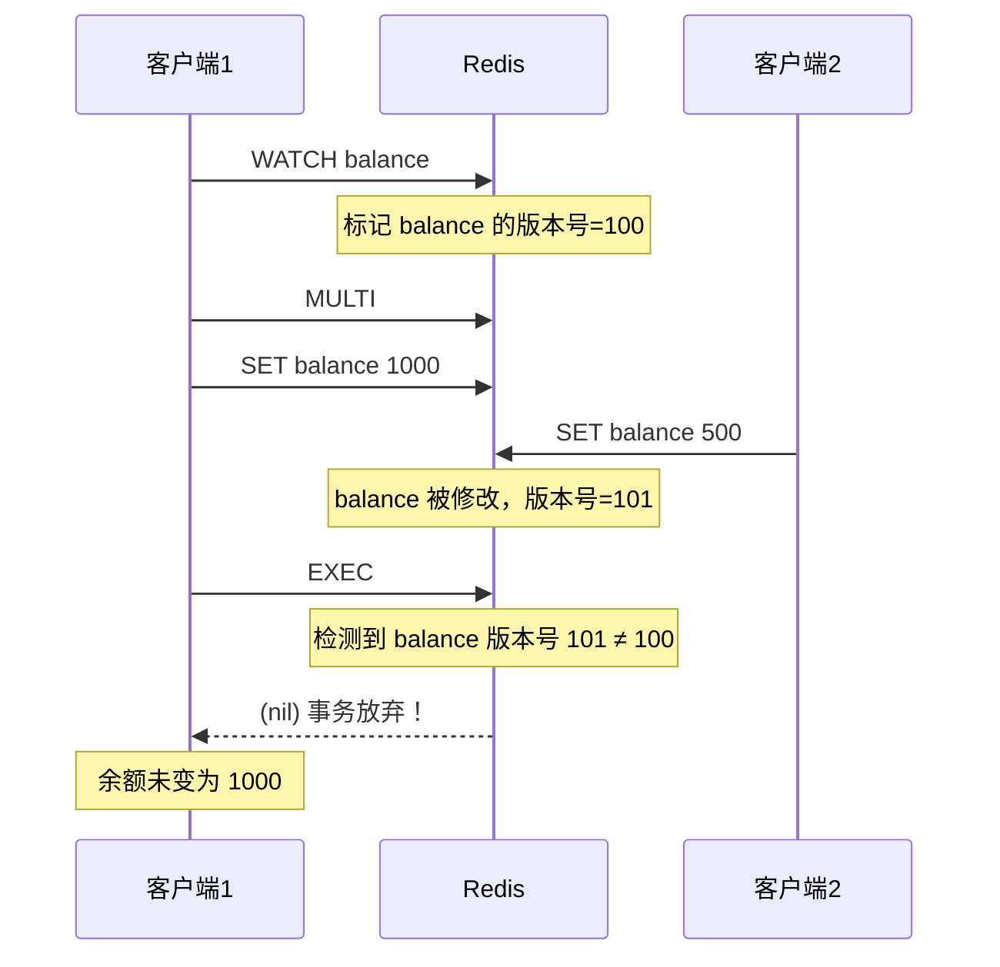
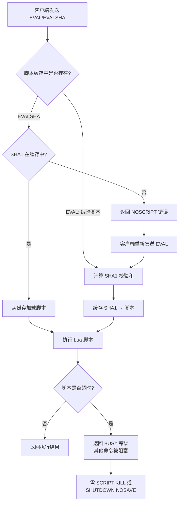

# 事务与 Lua 脚本

> Redis 事务和 Lua 脚本是保证多条命令原子执行的两大机制。事务提供了命令打包执行的能力，但不支持回滚；Lua 脚本则在服务端执行自定义逻辑，天然具备原子性。理解它们的原理、差异和适用场景，是写出正确 Redis 程序的关键。

## 1. Redis 事务基础

### 1.1 事务命令总览

```text
Redis 事务相关命令：

┌──────────┬─────────────────────────────────────────────┐
│  命令     │  作用                                        │
├──────────┼─────────────────────────────────────────────┤
│  MULTI   │  开启事务，后续命令入队                       │
│  EXEC    │  执行事务中所有命令                           │
│  DISCARD │  放弃事务，清空命令队列                       │
│  WATCH   │  监视 Key，若被修改则事务放弃                  │
│  UNWATCH │  取消所有 WATCH 监视                          │
└──────────┴─────────────────────────────────────────────┘

事务生命周期：
  WATCH key [key ...]     ← 可选，乐观锁
  MULTI                   ← 开启事务
  command1                ← 命令入队（不执行）
  command2                ← 命令入队
  ...
  EXEC / DISCARD          ← 提交 / 放弃
```

### 1.2 基本事务流程

```text
正常执行流程：

客户端                        Redis Server
  │                               │
  │──── MULTI ───────────────────▶│  开启事务
  │                               │
  │──── SET key1 "hello" ────────▶│  命令入队，返回 QUEUED
  │◀─── QUEUED ──────────────────│
  │                               │
  │──── SET key2 "world" ────────▶│  命令入队，返回 QUEUED
  │◀─── QUEUED ──────────────────│
  │                               │
  │──── INCR counter ───────────▶│  命令入队，返回 QUEUED
  │◀─── QUEUED ──────────────────│
  │                               │
  │──── EXEC ────────────────────▶│  依次执行所有命令
  │◀─── [OK, OK, 1] ────────────│  返回所有结果
  │                               │

放弃事务流程：
  MULTI → SET key1 "x" → DISCARD → 事务清空，key1 不变
```

### 1.3 事务中的错误处理

```text
Redis 事务错误分为两类：

一、命令语法错误（入队时检测）：
  MULTI
  SET key1 "hello"
  INCR key1          ← 语法正确，入队成功
  INCRBY key2 "abc"  ← 语法正确，入队成功（类型错误运行时才发现）
  ZADD key3          ← 语法错误！入队失败
  EXEC
  → 返回：(error) EXECABORT Transaction discarded because of previous errors.
  → 所有命令都不执行

二、运行时错误（EXEC 后检测）：
  MULTI
  SET key1 "hello"
  INCR key1          ← key1 是字符串，INCR 会失败
  SET key2 "world"
  EXEC
  → 返回：
    1) OK                    ← SET key1 成功
    2) (error) ERR value is not an integer or out of range  ← INCR 失败
    3) OK                    ← SET key2 成功！
  → 只有错误命令失败，其他命令照常执行

┌─────────────────────────────────────────────────────┐
│  重要特性：Redis 事务不支持回滚！                       │
│                                                       │
│  1. 语法错误 → 整个事务放弃（EXECABORT）                │
│  2. 运行时错误 → 仅错误命令失败，其他继续执行            │
│  3. 没有ROLLBACK命令                                  │
└─────────────────────────────────────────────────────┘
```

### 1.4 事务不回滚的原因

::: important 为什么 Redis 不支持事务回滚？
Redis 官方给出的理由：

1. **Redis 命令只会因语法错误或类型错误而失败**：这本质上是编程错误，应该在开发阶段被发现，而不是依赖运行时回滚来兜底
2. **回滚需要额外的日志和状态管理**：Redis 追求极简和性能，不支持回滚使事务实现更简单、更快速
3. **Redis 的设计哲学**：错误应该在开发时修复，而不是运行时补救。这与传统数据库的设计哲学不同

这种设计是有意为之的权衡 —— 牺牲回滚能力换取更简单、更快速的事务实现。
:::

```text
传统数据库 vs Redis 事务对比：

┌──────────────┬──────────────────────┬──────────────────────┐
│  特性         │  传统数据库事务        │  Redis 事务            │
├──────────────┼──────────────────────┼──────────────────────┤
│  原子性       │  全部成功或全部回滚    │  仅"不可打断"，不回滚  │
│  一致性       │  ACID 保证           │  不保证（无回滚）      │
│  隔离性       │  多级隔离级别         │  无隔离级别            │
│  持久性       │  WAL 保证            │  依赖持久化配置        │
│  回滚         │  支持 ROLLBACK       │  不支持               │
│  冲突检测     │  锁 / MVCC           │  WATCH 乐观锁         │
│  适用范围     │  复杂业务逻辑        │  简单原子操作          │
└──────────────┴──────────────────────┴──────────────────────┘
```

## 2. WATCH 乐观锁详解

### 2.1 WATCH 机制原理



### 2.2 WATCH 实现原理（CAS）

```text
WATCH 的底层实现 —— 乐观锁（Compare-And-Swap）：

1. WATCH 阶段：
   ┌─────────────────────────────────────────────┐
   │  客户端调用 WATCH key                        │
   │  Redis 记录：                                │
   │    watched_keys[key] = [client1, client2]    │
   │    客户端记录：key 的当前版本（修改时间戳）     │
   └─────────────────────────────────────────────┘

2. 监视期间：
   ┌─────────────────────────────────────────────┐
   │  任何客户端修改 key                          │
   │  Redis 遍历 watched_keys[key]                │
   │  标记所有监视该 key 的客户端为 REDIS_DIRTY    │
   │  即：flags |= CLIENT_DIRTY_CAS               │
   └─────────────────────────────────────────────┘

3. EXEC 检查：
   ┌─────────────────────────────────────────────┐
   │  EXEC 时检查客户端的 CLIENT_DIRTY_CAS 标志    │
   │  如果被设置 → 放弃事务，返回 nil              │
   │  如果未设置 → 执行事务，返回结果数组           │
   └─────────────────────────────────────────────┘

源码关键（t_string.c / multi.c）：
  void watchForKey(client *c, robj *key) {
      list *clients = dictFetchValue(c->db->watched_keys, key);
      // 将客户端添加到 key 的监视列表
  }

  void touchWatchedKey(redisDb *db, robj *key) {
      list *clients = dictFetchValue(db->watched_keys, key);
      listIter li; listNode *ln;
      listRewind(clients, &li);
      while ((ln = listNext(&li))) {
          client *c = listNodeValue(ln);
          c->flags |= CLIENT_DIRTY_CAS;  // 标记为脏
      }
  }
```

### 2.3 WATCH 实战：安全转账

```csharp
// C# WATCH 实现安全转账
public class RedisTransferService
{
    private readonly ConnectionMultiplexer _connection;
    private readonly IDatabase _db;

    public RedisTransferService(ConnectionMultiplexer connection)
    {
        _connection = connection;
        _db = connection.GetDatabase();
    }

    /// <summary>
    /// 安全转账（使用 WATCH 乐观锁）
    /// </summary>
    public async Task<bool> TransferAsync(
        string fromAccount,
        string toAccount,
        decimal amount,
        int maxRetries = 10)
    {
        for (int attempt = 0; attempt < maxRetries; attempt++)
        {
            // Step 1: WATCH 监视转出账户
            var tran = _db.CreateTransaction();
            tran.AddCondition(Condition.KeyNotExists(fromAccount)
                .Or(Condition.StringEqual(
                    fromAccount,
                    await _db.StringGetAsync(fromAccount))));

            // 这里用 Condition 模拟 WATCH
            // StackExchange.Redis 的 Condition 机制等价于 WATCH

            var fromValue = await _db.StringGetAsync(fromAccount);
            var toValue = await _db.StringGetAsync(toAccount);

            decimal fromBalance = (decimal)(double)fromValue;
            decimal toBalance = string.IsNullOrEmpty(toValue)
                ? 0 : (decimal)(double)toValue;

            // Step 2: 检查余额
            if (fromBalance < amount)
                return false;

            // Step 3: 设置事务操作
            decimal newFromBalance = fromBalance - amount;
            decimal newToBalance = toBalance + amount;

            tran.StringSetAsync(fromAccount, newFromBalance.ToString());
            tran.StringSetAsync(toAccount, newToBalance.ToString());

            // Step 4: 提交事务（如果 WATCH 的 Key 未被修改则成功）
            bool committed = await tran.ExecuteAsync();

            if (committed)
            {
                // 所有异步操作会在 Execute 成功后自动执行
                await tran.StringSetAsync(fromAccount,
                    newFromBalance.ToString());
                await tran.StringSetAsync(toAccount,
                    newToBalance.ToString());
                return true;
            }

            // WATCH 失败，重试
            await Task.Delay(10 * (attempt + 1));
        }

        return false;
    }
}
```

### 2.4 WATCH 注意事项

::: warning WATCH 使用要点
1. **WATCH 必须在 MULTI 之前调用**：WATCH 在事务内部调用无效
2. **WATCH 是一次性的**：EXEC 执行后（无论成功或失败），所有 WATCH 自动取消
3. **UNWATCH 主动取消**：在 EXEC 之前可调用 UNWATCH 取消监视
4. **整个 Key 变更都会触发**：对 WATCH 的 Key 执行任何修改命令（SET/DEL/INCR 等）都会使事务放弃
5. **不支持细粒度监视**：无法监视 Key 的某个字段，只能监视整个 Key
6. **网络断开自动取消**：客户端断开连接时，所有 WATCH 自动取消
:::

```text
WATCH 失效场景汇总：

场景1：其他客户端修改了被 WATCH 的 Key
  客户端A: WATCH key → MULTI → SET key "new" → EXEC → (nil) 事务放弃
  客户端B: SET key "changed" ← 在 A 的 MULTI 和 EXEC 之间执行

场景2：DISCARD 后 WATCH 仍然存在
  WATCH key → MULTI → DISCARD → WATCH 仍然有效

场景3：EXEC 后 WATCH 自动清除
  WATCH key → MULTI → SET key "new" → EXEC → WATCH 已清除
  此时其他客户端可以修改 key，不影响当前客户端

场景4：WATCH 后 Key 被删除
  WATCH key → DEL key → MULTI → SET key "new" → EXEC → (nil) 事务放弃
```

## 3. Redis 事务 vs 数据库事务

### 3.1 ACID 特性对比

```text
┌──────────┬─────────────────────────────┬──────────────────────────────┐
│  ACID    │  Redis 事务                   │  关系型数据库事务               │
├──────────┼─────────────────────────────┼──────────────────────────────┤
│  A 原子性 │  部分：命令不可打断执行        │  完全：全部成功或全部回滚       │
│          │  但不支持回滚                  │                              │
├──────────┼─────────────────────────────┼──────────────────────────────┤
│  C 一致性 │  部分：取决于命令正确性        │  完全：约束、触发器保证        │
│          │  运行时错误不回滚              │                              │
├──────────┼─────────────────────────────┼──────────────────────────────┤
│  I 隔离性 │  无隔离级别                   │  多级隔离（RU/RC/RR/Serializable）│
│          │  EXEC 前命令不可见             │                              │
├──────────┼─────────────────────────────┼──────────────────────────────┤
│  D 持久性 │  依赖持久化配置               │  WAL + Commit Log 保证       │
│          │  AOF everysec 可丢 1s 数据    │                              │
└──────────┴─────────────────────────────┴──────────────────────────────┘

结论：Redis 事务严格来说不满足 ACID 中的任何一条完整特性。
它的价值在于"将多条命令打包，不被其他客户端命令打断"。
```

### 3.2 隔离性问题

```text
Redis 事务没有隔离级别：

事务开启后、EXEC 执行前：
  ┌──────────┐                    ┌──────────────┐
  │ 客户端 A  │                    │  Redis Server │
  └────┬─────┘                    └──────┬───────┘
       │  MULTI                          │
       │  SET key1 "a" ───── 入队 ──────▶│
       │  SET key2 "b" ───── 入队 ──────▶│
       │                                  │
  ┌────┴─────┐                            │
  │ 客户端 B  │                            │
  └────┬─────┘                            │
       │  GET key1 ──── 立即返回 "old" ──▶│  ← key1 还没被修改！
       │                                  │
  客户端 A 的命令还未执行，客户端 B 读到的是旧值

  ┌────────────────────────────────────────────────┐
  │  Redis 事务的"隔离"仅保证：                      │
  │  EXEC 执行时，所有命令顺序执行，中间不插入其他命令  │
  │  但 EXEC 之前，其他客户端可以随意读写              │
  └────────────────────────────────────────────────┘
```

## 4. Lua 脚本详解

### 4.1 为什么需要 Lua 脚本

```text
事务 vs Lua 脚本：

┌───────────────────┬──────────────────┬──────────────────┐
│  特性              │  事务 (MULTI)     │  Lua 脚本         │
├───────────────────┼──────────────────┼──────────────────┤
│  原子性           │  命令不可打断     │  整个脚本不可打断  │
│  条件逻辑         │  不支持           │  完全支持          │
│  读取中间结果     │  不支持           │  支持              │
│  循环             │  不支持           │  支持              │
│  错误处理         │  不支持回滚       │  pcall 异常捕获    │
│  复用性           │  无              │  evalsha 复用      │
│  网络开销         │  多次 RTT        │  一次 RTT          │
│  复杂业务         │  难以实现        │  完整编程能力       │
└───────────────────┴──────────────────┴──────────────────┘

Lua 脚本核心优势：
  1. 原子性 —— 脚本执行期间，Redis 不会执行其他命令
  2. 减少网络开销 —— 复杂逻辑一次提交
  3. 可复用 —— evalsha 避免重复传输脚本
  4. 完整编程能力 —— 条件、循环、函数
```

### 4.2 eval 与 evalsha

```text
EVAL 命令语法：
  EVAL script numkeys key [key ...] arg [arg ...]

参数说明：
  script   - Lua 脚本代码
  numkeys  - Key 的数量
  key      - Key 参数（通过 KEYS 数组访问）
  arg      - 附加参数（通过 ARGV 数组访问）

示例：
  EVAL "return redis.call('SET', KEYS[1], ARGV[1])" 1 mykey myvalue
       │                                         │ │     │
       │  Lua 脚本代码                             │ │     └─ ARGV[1] = "myvalue"
       │                                          │ └─────── KEYS[1] = "mykey"
       │                                          └───────── numkeys = 1

EVALSHA 命令语法：
  EVALSHA sha1 numkeys key [key ...] arg [arg ...]

  用脚本的 SHA1 校验和代替完整脚本，减少网络传输

  步骤：
  1. 先 SCRIPT LOAD "脚本" → 返回 sha1
  2. 再 EVALSHA sha1 numkeys key arg
  3. 如果 sha1 不存在，返回 NOSCRIPT 错误，需重新 EVAL
```

### 4.3 Lua 执行流程



### 4.4 Lua 脚本中调用 Redis

```lua
-- Lua 脚本中调用 Redis 命令的两种方式

-- 方式1: redis.call —— 出错时直接抛出异常
local value = redis.call('GET', KEYS[1])
-- 如果 GET 命令出错，脚本终止，返回错误

-- 方式2: redis.pcall —— 出错时返回错误对象
local result = redis.pcall('GET', KEYS[1])
-- 如果 GET 命令出错，result 是一个 error 对象
-- 脚本继续执行，可以检查 result.err

-- 判断 pcall 返回是否为错误
if type(result) == 'table' and result.err then
    -- 处理错误
    return result.err
end

-- 常用 Redis 调用示例
redis.call('SET', KEYS[1], ARGV[1])           -- 设置值
redis.call('EXPIRE', KEYS[1], ARGV[2])         -- 设置过期时间
local exists = redis.call('EXISTS', KEYS[1])   -- 判断存在
redis.call('DEL', KEYS[1])                     -- 删除
local len = redis.call('LLEN', KEYS[1])        -- 列表长度
```

### 4.5 实战脚本示例

#### 4.5.1 限流器

```lua
-- 滑动窗口限流器
-- KEYS[1] = 限流 Key
-- ARGV[1] = 窗口大小（秒）
-- ARGV[2] = 最大请求数
-- ARGV[3] = 当前时间戳（毫秒）
-- 返回: 1=允许, 0=拒绝

local key = KEYS[1]
local window = tonumber(ARGV[1])
local limit = tonumber(ARGV[2])
local now = tonumber(ARGV[3])
local window_start = now - window * 1000

-- 移除窗口外的旧记录
redis.call('ZREMRANGEBYSCORE', key, '-inf', window_start)

-- 统计当前窗口内的请求数
local count = redis.call('ZCARD', key)

if count < limit then
    -- 未超限，添加当前请求
    redis.call('ZADD', key, now, now .. '-' .. math.random(1000000))
    redis.call('EXPIRE', key, window)
    return 1
else
    -- 超限，拒绝
    return 0
end
```

#### 4.5.2 分布式锁释放

```lua
-- 安全释放分布式锁
-- KEYS[1] = 锁 Key
-- ARGV[1] = 持有者的唯一标识
-- 返回: 1=释放成功, 0=不是锁的持有者

if redis.call('GET', KEYS[1]) == ARGV[1] then
    return redis.call('DEL', KEYS[1])
else
    return 0
end
```

#### 4.5.3 库存扣减

```lua
-- 安全库存扣减
-- KEYS[1] = 库存 Key
-- ARGV[1] = 扣减数量
-- 返回: 剩余库存 / -1=库存不足 / -2=库存Key不存在

local stock_key = KEYS[1]
local decrement = tonumber(ARGV[1])

-- 检查 Key 是否存在
if redis.call('EXISTS', stock_key) == 0 then
    return -2
end

-- 获取当前库存
local current = tonumber(redis.call('GET', stock_key))

if current == nil then
    return -2
end

-- 库存不足
if current < decrement then
    return -1
end

-- 扣减库存
redis.call('DECRBY', stock_key, decrement)
return current - decrement
```

#### 4.5.4 列表去重添加

```lua
-- 有序列表去重添加
-- KEYS[1] = 列表 Key
-- KEYS[2] = 去重集合 Key
-- ARGV[1] = 要添加的元素
-- 返回: 1=添加成功, 0=已存在

local list_key = KEYS[1]
local set_key = KEYS[2]
local element = ARGV[1]

-- 检查是否已存在
if redis.call('SISMEMBER', set_key, element) == 1 then
    return 0
end

-- 添加到列表和集合
redis.call('RPUSH', list_key, element)
redis.call('SADD', set_key, element)
return 1
```

### 4.6 SCRIPT 命令

```text
SCRIPT 命令集：

┌──────────────────────┬───────────────────────────────────┐
│  命令                 │  作用                              │
├──────────────────────┼───────────────────────────────────┤
│  SCRIPT LOAD script  │  加载脚本到缓存，返回 SHA1          │
│  SCRIPT EXISTS sha1  │  检查脚本是否在缓存中               │
│  SCRIPT FLUSH        │  清除所有脚本缓存                   │
│  SCRIPT KILL         │  终止当前正在执行的脚本              │
│  SCRIPT DEBUG YES    │  开启调试模式                      │
│  SCRIPT DEBUG NO     │  关闭调试模式                      │
│  SCRIPT DEBUG SYNC   │  同步调试模式                      │
└──────────────────────┴───────────────────────────────────┘

使用示例：

# 加载脚本
> SCRIPT LOAD "return redis.call('GET', KEYS[1])"
"4e6d8fc8bb01276eb62f5a6bb0520368a54c2b90"

# 检查脚本是否存在
> SCRIPT EXISTS 4e6d8fc8bb01276eb62f5a6bb0520368a54c2b90
1) (integer) 1

# 使用 EVALSHA 执行
> EVALSHA 4e6d8fc8bb01276eb62f5a6bb0520368a54c2b90 1 mykey
"hello"

# 清除缓存
> SCRIPT FLUSH
OK

# 终止脚本（脚本执行超时时使用）
> SCRIPT KILL
OK  -- 或 (error) NOTBUSY 没有脚本在执行
```

::: warning SCRIPT KILL 的限制
如果脚本已经执行过写操作，SCRIPT KILL 无法终止它，只能通过 `SHUTDOWN NOSAVE` 强制关闭 Redis。因此 Lua 脚本中必须避免死循环，建议所有循环都设置上限。
:::

## 5. Lua 脚本原子性

### 5.1 原子性保证

```text
Lua 脚本的原子性：

执行 Lua 脚本时，Redis 的行为：
┌──────────────────────────────────────────────────────┐
│                                                        │
│  ┌──────────────────────────────────────────────┐     │
│  │          Lua 脚本执行期间                       │     │
│  │                                                │     │
│  │  • Redis 阻塞所有其他客户端命令                 │     │
│  │  • 其他客户端的命令排队等待                     │     │
│  │  • 不会被其他命令插入                           │     │
│  │  • 整个脚本要么全部执行，要么都不执行（出错时）  │     │
│  │                                                │     │
│  └──────────────────────────────────────────────┘     │
│                                                        │
│  时间线：                                               │
│  ─────────────────────────────────────────────────▶   │
│  │ Lua脚本执行 │ 其他客户端等待 │ 命令依次执行 │       │
│  └────────────┘                                        │
│                                                        │
│  注意：                                                 │
│  • 原子性 ≠ 隔离性：脚本执行期间其他客户端被阻塞        │
│  • 原子性 ≠ 持久性：脚本执行完是否持久化取决于配置       │
│  • 原子性 ≠ 一致性：如果脚本中途出错，已执行的写操作不会回滚 │
│                                                        │
└──────────────────────────────────────────────────────┘
```

### 5.2 原子性的边界

```text
Lua 脚本原子性不保证的场景：

场景1：脚本执行中 Redis 崩溃
  ┌────────────────────────────┐
  │  SET key1 "a"  ← 已执行    │
  │  SET key2 "b"  ← 已执行    │
  │  SET key3 "c"  ← Redis崩溃！│
  │  SET key4 "d"  ← 未执行    │
  └────────────────────────────┘
  结果：key1 和 key2 已写入，key3 和 key4 未写入
  AOF 可能只记录了部分命令（取决于 fsync 策略）

场景2：AOF 重写期间
  AOF 重写是后台进程，可能与 Lua 脚本产生时间窗口

场景3：主从复制延迟
  主节点执行脚本后，从节点异步复制
  在复制完成前，主从数据不一致

结论：Lua 脚本保证了"执行期间的原子性"
     但不保证"故障后的原子性"和"跨节点的原子性"
```

## 6. Redis 7.0 Function

### 6.1 Function vs Script

```text
Redis 7.0 引入的 Function 机制：

┌──────────────┬──────────────────┬──────────────────────┐
│  特性         │  EVAL/EVALSHA    │  Function              │
├──────────────┼──────────────────┼──────────────────────┤
│  持久化       │  不持久化（重启丢失）│  持久化到 RDB/AOF     │
│  函数库       │  无               │  按库组织              │
│  复用性       │  手动管理 SHA1    │  函数名直接调用         │
│  主从复制     │  不复制脚本       │  自动复制到从节点       │
│  管理         │  SCRIPT FLUSH    │  FCALL / FFUNCTION     │
│  编程模型     │  内联脚本         │  注册函数               │
└──────────────┴──────────────────┴──────────────────────┘
```

### 6.2 Function 使用示例

```text
# 注册 Function

> FUNCTION CREATE mylib LUA
  "local function deduct_stock(key, amount)
       local stock = tonumber(redis.call('GET', key))
       if stock and stock >= amount then
           redis.call('DECRBY', key, amount)
           return stock - amount
       end
       return -1
   end
   redis.register_function('deduct_stock', deduct_stock)"

# 调用 Function

> FCALL mylib deduct_stock 1 product:1001 5
(integer) 95

# 列出所有 Function

> FUNCTION LIST
1) 1) "mylib"
   2) 1) 1) "deduct_stock"

# 删除 Function

> FUNCTION DELETE mylib
OK
```

### 6.3 Function 持久化

```text
Function 持久化机制：

┌────────────────────────────────────────────────────┐
│  Function 持久化流程                                  │
│                                                      │
│  1. FUNCTION CREATE 时：                              │
│     • 脚本代码保存到 Redis 内存中的函数注册表           │
│     • 同时写入 AOF 文件（如果开启 AOF）                │
│     • 标记为需要持久化到 RDB                          │
│                                                      │
│  2. RDB 快照时：                                     │
│     • 函数注册表序列化到 RDB 文件                      │
│     • 重启后自动恢复所有函数                           │
│                                                      │
│  3. AOF 重写时：                                     │
│     • 重写后的 AOF 包含 FUNCTION CREATE 命令           │
│     • 确保加载 AOF 后函数可用                          │
│                                                      │
│  对比 EVAL/EVALSHA：                                  │
│     • 脚本缓存不持久化，Redis 重启后需要重新 LOAD       │
│     • Function 自动持久化，重启后自动可用               │
└────────────────────────────────────────────────────┘
```

::: info Function 的优势
Redis 7.0 的 Function 机制解决了 EVAL/EVALSHA 的最大痛点 —— 脚本不持久化。在 Cluster 环境中，Function 也会自动同步到所有节点，避免了 EVALSHA 的 NOSCRIPT 问题。如果你的 Redis 版本 >= 7.0，推荐使用 Function 替代 EVAL/EVALSHA。
:::

## 7. 脚本安全（Sandbox）

### 7.1 Lua 沙箱限制

```text
Redis Lua 沙箱安全限制：

┌────────────────────────────────────────────────────────┐
│  被禁止的操作：                                           │
│                                                          │
│  ❌ 文件操作：io.open, io.read, io.write 等             │
│  ❌ 系统命令：os.execute, os.getenv                      │
│  ❌ 加载模块：require, dofile, loadfile                   │
│  ❌ 调试库：debug 库的大部分功能                           │
│  ❌ 网络操作：socket 等                                   │
│  ❌ 协程：coroutine 在某些版本中受限                      │
│                                                          │
│  允许的操作：                                             │
│  ✅ 字符串操作：string.find, string.sub 等               │
│  ✅ 数学运算：math.floor, math.random 等                 │
│  ✅ 表操作：table.insert, table.sort 等                  │
│  ✅ Redis 调用：redis.call, redis.pcall                  │
│  ✅ 日志输出：redis.log(redis.LOG_WARNING, "msg")        │
│  ✅ JSON 操作：cjson.encode, cjson.decode               │
│  ✅ Base64：redis.base64_encode, redis.base64_decode     │
│  ✅ SHA1：redis.sha1hex                                   │
└────────────────────────────────────────────────────────┘
```

### 7.2 脚本超时与保护

```text
Lua 脚本超时机制：

默认超时：5 秒（lua-time-limit 配置）
  redis.conf: lua-time-limit 5000

超时后的行为：
  ┌─────────────────────────────────────────────────┐
  │  1. Redis 不会主动终止脚本（为了数据安全）          │
  │  2. 开始接受 SCRIPT KILL 命令                     │
  │  3. 其他客户端的命令返回 BUSY 错误                  │
  │     (error) BUSY Redis is busy running a script   │
  │  4. 只能 SCRIPT KILL（只读脚本）或 SHUTDOWN NOSAVE │
  └─────────────────────────────────────────────────┘

防范措施：
  1. 避免在 Lua 脚本中使用无限循环
  2. 所有循环设置上限
  3. 复杂计算尽量放在应用层
  4. 脚本先在测试环境验证性能
  5. 监控 Lua 脚本执行时间
```

### 7.3 脚本安全最佳实践

```lua
-- 安全的 Lua 脚本写法

-- ❌ 错误：无限循环
while true do
    -- 死循环！Redis 会被阻塞
end

-- ✅ 正确：设置循环上限
local max_iterations = 1000
for i = 1, max_iterations do
    -- 有上限的循环
end

-- ❌ 错误：操作文件
local f = io.open("/etc/passwd", "r")  -- 沙箱禁止！

-- ✅ 正确：只使用 redis.call
local value = redis.call('GET', KEYS[1])

-- ❌ 错误：执行系统命令
os.execute("rm -rf /")  -- 沙箱禁止！

-- ✅ 正确：使用 redis.log 记录日志
redis.log(redis.LOG_WARNING, "Processing key: " .. KEYS[1])

-- ❌ 错误：引用未传入的 Key（非确定性）
local keys = redis.call('KEYS', '*')  -- 不安全！

-- ✅ 正确：只使用 KEYS 参数传入的 Key
local key = KEYS[1]
```

::: important 确定性要求
Redis 要求 Lua 脚本在相同数据集上产生相同结果（确定性）。这影响主从复制 —— 如果脚本包含非确定性操作（如 `TIME`、`SRANDMEMBER`、随机数），Redis 会拒绝将脚本写入 AOF，并阻止从节点执行。使用 `redis.replicate_commands()` （Redis 3.2+）可解除此限制，让脚本效果通过命令传播而非脚本传播。
:::

## 8. C# 实战示例

### 8.1 StackExchange.Redis 事务

```csharp
// StackExchange.Redis 事务操作
public class RedisTransactionService
{
    private readonly IDatabase _db;

    public RedisTransactionService(IConnectionMultiplexer connection)
    {
        _db = connection.GetDatabase();
    }

    /// <summary>
    /// 基本事务：批量设置
    /// </summary>
    public async Task<bool[]> BatchSetAsync(
        Dictionary<string, string> keyValuePairs,
        TimeSpan? expiry = null)
    {
        var tran = _db.CreateTransaction();

        var tasks = new List<Task<bool>>();
        foreach (var kvp in keyValuePairs)
        {
            tasks.Add(tran.StringSetAsync(kvp.Key, kvp.Value, expiry));
        }

        bool committed = await tran.ExecuteAsync();
        if (!committed)
            return Array.Empty<bool>();

        await Task.WhenAll(tasks);
        return tasks.Select(t => t.Result).ToArray();
    }

    /// <summary>
    /// 条件事务：WATCH 语义
    /// </summary>
    public async Task<bool> ConditionalUpdateAsync(
        string key,
        string newValue,
        string expectedValue,
        int maxRetries = 5)
    {
        for (int i = 0; i < maxRetries; i++)
        {
            var tran = _db.CreateTransaction();

            // 添加条件（等价于 WATCH + 检查）
            tran.AddCondition(Condition.StringEqual(key, expectedValue));
            var setTask = tran.StringSetAsync(key, newValue);

            bool committed = await tran.ExecuteAsync();
            if (committed)
            {
                await setTask;
                return true;
            }

            // 条件不满足，重试
            await Task.Delay(50 * (i + 1));
        }

        return false;
    }

    /// <summary>
    /// 组合事务：多个 Key 同时操作
    /// </summary>
    public async Task<bool> CompositeOperationAsync(
        string userKey,
        string counterKey,
        string userValue,
        long increment)
    {
        var tran = _db.CreateTransaction();

        var setTask = tran.StringSetAsync(userKey, userValue);
        var incrTask = tran.StringIncrementAsync(counterKey, increment);

        bool committed = await tran.ExecuteAsync();
        if (committed)
        {
            await Task.WhenAll(setTask, incrTask);
            return true;
        }

        return false;
    }
}
```

### 8.2 StackExchange.Redis Lua 脚本

```csharp
// StackExchange.Redis Lua 脚本操作
public class RedisScriptService
{
    private readonly IDatabase _db;

    public RedisScriptService(IConnectionMultiplexer connection)
    {
        _db = connection.GetDatabase();
    }

    // 预定义脚本（推荐方式，避免每次传输脚本代码）
    private static readonly LuaScript _deductStockScript = LuaScript.Prepare(@"
        local stock = tonumber(redis.call('GET', KEYS[1]))
        if stock == nil then
            return -2
        end
        local amount = tonumber(ARGV[1])
        if stock < amount then
            return -1
        end
        redis.call('DECRBY', KEYS[1], amount)
        return stock - amount
    ");

    private static readonly LuaScript _releaseLockScript = LuaScript.Prepare(@"
        if redis.call('GET', KEYS[1]) == ARGV[1] then
            return redis.call('DEL', KEYS[1])
        else
            return 0
        end
    ");

    private static readonly LuaScript _rateLimitScript = LuaScript.Prepare(@"
        local key = KEYS[1]
        local limit = tonumber(ARGV[1])
        local window = tonumber(ARGV[2])
        local current = tonumber(redis.call('GET', key) or '0')
        if current >= limit then
            return 0
        end
        current = redis.call('INCR', key)
        if current == 1 then
            redis.call('EXPIRE', key, window)
        end
        return 1
    ");

    /// <summary>
    /// 库存扣减
    /// </summary>
    public async Task<long> DeductStockAsync(
        string stockKey, int amount)
    {
        var result = await _db.ScriptEvaluateAsync(
            _deductStockScript,
            new { KEYS = new RedisKey[] { stockKey }, ARGV = new RedisValue[] { amount } });

        return (long)result;
    }

    /// <summary>
    /// 释放分布式锁
    /// </summary>
    public async Task<bool> ReleaseLockAsync(
        string lockKey, string lockValue)
    {
        var result = await _db.ScriptEvaluateAsync(
            _releaseLockScript,
            new { KEYS = new RedisKey[] { lockKey }, ARGV = new RedisValue[] { lockValue } });

        return (long)result == 1;
    }

    /// <summary>
    /// 固定窗口限流
    /// </summary>
    public async Task<bool> RateLimitAsync(
        string rateLimitKey, int limit, int windowSeconds)
    {
        var result = await _db.ScriptEvaluateAsync(
            _rateLimitScript,
            new
            {
                KEYS = new RedisKey[] { rateLimitKey },
                ARGV = new RedisValue[] { limit, windowSeconds }
            });

        return (long)result == 1;
    }
}
```

### 8.3 完整业务示例：秒杀系统

```csharp
// 秒杀系统 —— 事务 + Lua 脚本综合实战
public class SeckillService
{
    private readonly IDatabase _db;
    private readonly ConnectionMultiplexer _connection;

    public SeckillService(ConnectionMultiplexer connection)
    {
        _connection = connection;
        _db = connection.GetDatabase();
    }

    // 秒杀 Lua 脚本（原子操作）
    private static readonly LuaScript _seckillScript = LuaScript.Prepare(@"
        -- 参数说明：
        -- KEYS[1] = 库存Key    (seckill:stock:{activityId})
        -- KEYS[2] = 已购集合   (seckill:bought:{activityId})
        -- ARGV[1] = 用户ID
        -- ARGV[2] = 购买数量

        -- 检查是否已购买
        if redis.call('SISMEMBER', KEYS[2], ARGV[1]) == 1 then
            return -1  -- 已购买
        end

        -- 检查库存
        local stock = tonumber(redis.call('GET', KEYS[1]))
        if stock == nil or stock < tonumber(ARGV[2]) then
            return -2  -- 库存不足
        end

        -- 扣减库存
        redis.call('DECRBY', KEYS[1], tonumber(ARGV[2]))

        -- 记录已购买
        redis.call('SADD', KEYS[2], ARGV[1])

        return 1  -- 秒杀成功
    ");

    /// <summary>
    /// 执行秒杀
    /// </summary>
    public async Task<SeckillResult> ExecuteSeckillAsync(
        long activityId, long userId, int quantity)
    {
        var stockKey = $"seckill:stock:{activityId}";
        var boughtKey = $"seckill:bought:{activityId}";

        var result = await _db.ScriptEvaluateAsync(
            _seckillScript,
            new
            {
                KEYS = new RedisKey[] { stockKey, boughtKey },
                ARGV = new RedisValue[] { userId, quantity }
            });

        long code = (long)result;

        return code switch
        {
            1 => SeckillResult.Success(),
            -1 => SeckillResult.Fail("已购买过该商品"),
            -2 => SeckillResult.Fail("库存不足"),
            _ => SeckillResult.Fail("未知错误")
        };
    }

    /// <summary>
    /// 初始化秒杀活动
    /// </summary>
    public async Task InitActivityAsync(
        long activityId, int totalStock, TimeSpan duration)
    {
        var stockKey = $"seckill:stock:{activityId}";
        var boughtKey = $"seckill:bought:{activityId}";

        var tran = _db.CreateTransaction();

        var setStock = tran.StringSetAsync(stockKey, totalStock);
        var setBought = tran.KeyDeleteAsync(boughtKey);
        var setExpiry = tran.KeyExpireAsync(stockKey, duration);

        if (await tran.ExecuteAsync())
        {
            await Task.WhenAll(setStock, setBought, setExpiry);
        }
    }
}

public record SeckillResult(bool Success, string Message)
{
    public static SeckillResult Success() => new(true, "秒杀成功");
    public static SeckillResult Fail(string msg) => new(false, msg);
}
```

## 9. 事务与 Lua 脚本选型指南

### 9.1 选型决策

```text
┌─────────────────────────────────────────────────────────┐
│               事务 vs Lua 脚本选型指南                      │
├─────────────────┬─────────────────┬─────────────────────┤
│  场景             │  推荐             │  原因               │
├─────────────────┼─────────────────┼─────────────────────┤
│  批量设置/删除    │  事务 MULTI       │  简单，无逻辑判断    │
│  条件更新         │  WATCH 事务       │  乐观锁足够          │
│  读取+判断+写入   │  Lua 脚本        │  事务无法读中间结果   │
│  限流器           │  Lua 脚本        │  需要条件判断         │
│  分布式锁         │  Lua 脚本        │  原子性要求高        │
│  库存扣减         │  Lua 脚本        │  读-判断-写需原子    │
│  简单转账         │  WATCH 事务       │  逻辑简单            │
│  复杂业务         │  Lua 脚本        │  需要完整编程能力     │
│  跨多个 Key 操作  │  Lua 脚本        │  事务无法读取中间值   │
│  批量 Key 过期    │  事务 MULTI       │  无需判断            │
└─────────────────┴─────────────────┴─────────────────────┘
```

### 9.2 性能对比

```text
性能对比测试条件：
  - 硬件：8C 32GB SSD
  - 命令：10 次 SET 操作
  - 客户端：50 并发

┌──────────────────┬───────────────┬───────────────┐
│  方式              │  QPS          │  P99 延迟(ms)  │
├──────────────────┼───────────────┼───────────────┤
│  逐条执行          │  ~50,000      │  1.5          │
│  Pipeline         │  ~200,000     │  3.0          │
│  MULTI 事务       │  ~180,000     │  3.5          │
│  Lua 脚本         │  ~250,000     │  2.5          │
└──────────────────┴───────────────┴───────────────┘

结论：
  1. Lua 脚本 > Pipeline > MULTI > 逐条执行
  2. Lua 脚本最优：单次 RTT + 服务端执行
  3. Pipeline 次之：批量发送但多次 RTT
  4. MULTI 最差：事务开销 + 逐条返回
```

## 10. 总结

```text
┌─────────────────────────────────────────────────────────────┐
│                     核心要点总结                                │
├─────────────────────────────────────────────────────────────┤
│                                                               │
│  事务 (MULTI/EXEC/WATCH)：                                     │
│  🔹 MULTI 开启事务，命令入队不执行                              │
│  🔹 EXEC 原子执行所有命令，中间不插入其他命令                    │
│  🔹 不支持回滚！运行时错误仅影响出错命令                        │
│  🔹 WATCH 提供乐观锁，基于 CAS 机制                            │
│  🔹 适合无逻辑判断的批量操作                                    │
│                                                               │
│  Lua 脚本：                                                    │
│  🔹 EVAL/EVALSHA 执行，evalsha 避免重复传输                    │
│  🔹 脚本执行期间 Redis 阻塞，保证原子性                         │
│  🔹 支持条件逻辑、循环、函数等完整编程能力                       │
│  🔹 必须避免死循环，所有循环设上限                               │
│  🔹 沙箱限制：禁止文件/系统/网络操作                            │
│  🔹 Redis 7.0 Function 提供持久化和更好的管理                   │
│                                                               │
│  选型原则：                                                     │
│  🔹 简单批量操作 → 事务 MULTI                                  │
│  🔹 条件更新 → WATCH 事务                                      │
│  🔹 读取+判断+写入 → Lua 脚本                                  │
│  🔹 Redis 7.0+ → 优先使用 Function                            │
│  🔹 脚本先测试，注意超时风险                                    │
│                                                               │
└─────────────────────────────────────────────────────────────┘
```

::: info 参考文献
- [Redis 官方文档 - Transactions](https://redis.io/docs/interact/transactions/)
- [Redis 官方文档 - Lua Scripts](https://redis.io/docs/interact/programmability/eval-intro/)
- [Redis 官方文档 - Functions](https://redis.io/docs/interact/programmability/functions/)
- 《Redis 设计与实现》- 黄健宏 - 第19章 事务
- Redis 源码 `multi.c` / `scripting.c`
- Martin Kleppmann 关于 Lua 脚本不确定性的讨论
:::
