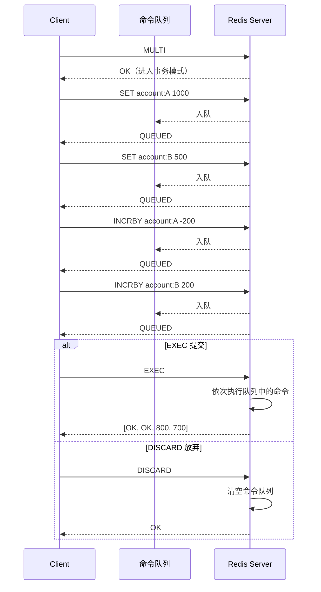
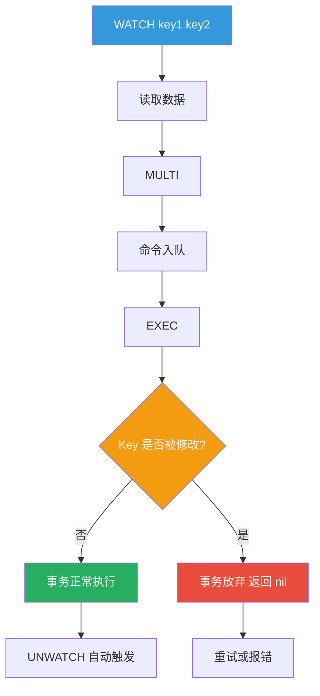
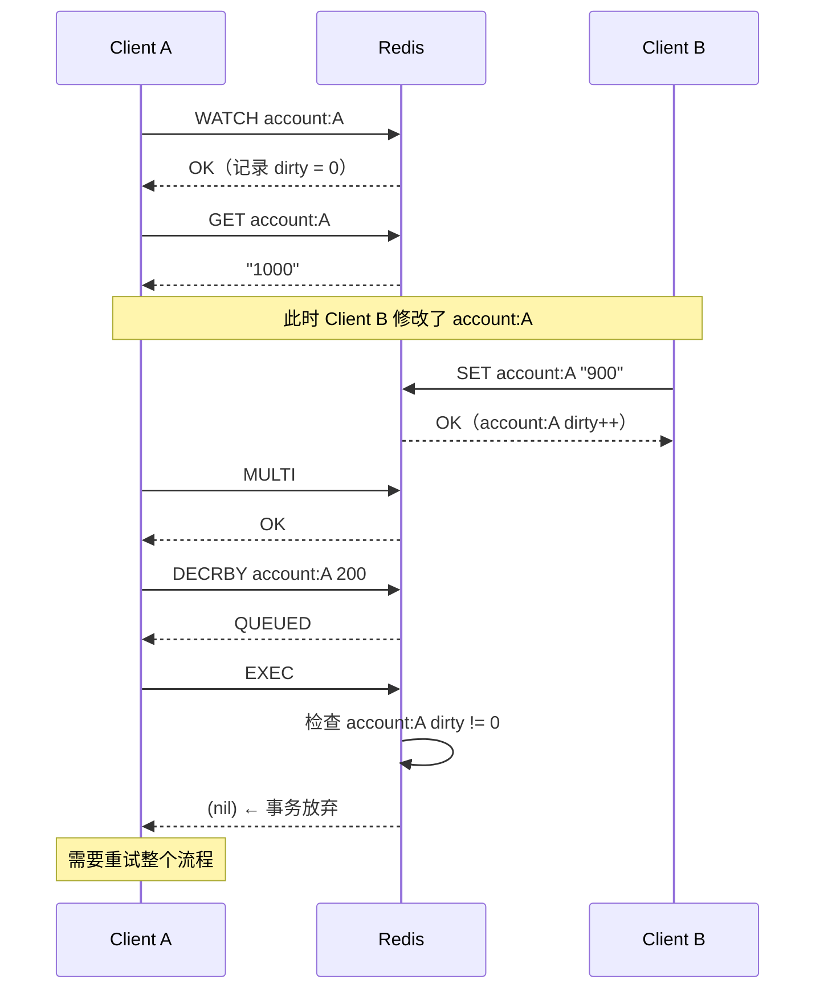
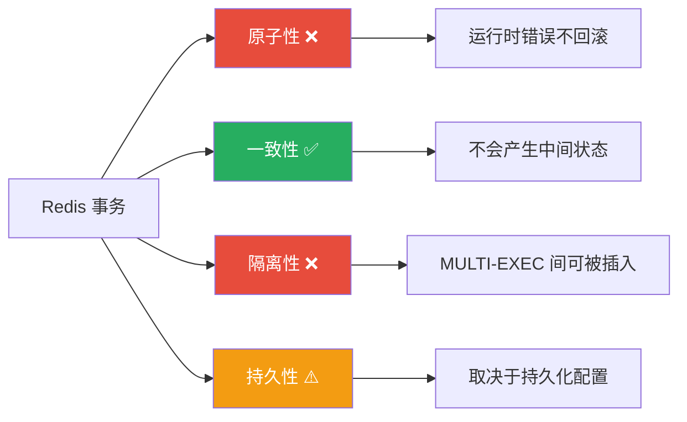
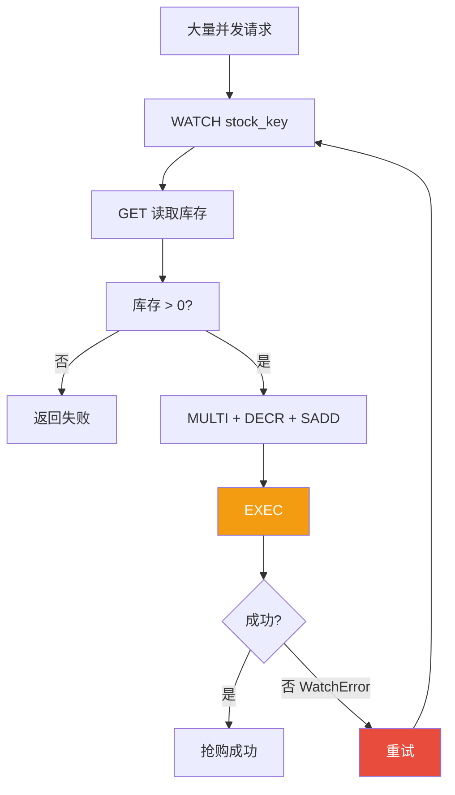

# 事务与 WATCH

Redis 事务不是数据库意义上的"事务"——它不回滚，不隔离，但在特定场景下依然是有力的工具。理解 Redis 事务的关键在于理解它**做了什么**和**没做什么**，以及 WATCH 乐观锁如何弥补其短板。

## 1. MULTI / EXEC / DISCARD

### 1.1 基本语法

Redis 事务由三个命令组成：

| 命令 | 作用 |
|------|------|
| `MULTI` | 开启事务，后续命令入队 |
| `EXEC` | 提交事务，依次执行队列中的命令 |
| `DISCARD` | 放弃事务，清空命令队列 |

```bash
# 基本事务流程
MULTI
OK

SET account:A 1000
QUEUED

SET account:B 500
QUEUED

INCRBY account:A -200
QUEUED

INCRBY account:B 200
QUEUED

EXEC
1) OK
2) OK
3) (integer) 800
4) (integer) 700
```

### 1.2 事务执行时序



### 1.3 DISCARD 放弃事务

```bash
MULTI
OK

SET key1 "value1"
QUEUED

SET key2 "value2"
QUEUED

# 改变主意，放弃事务
DISCARD
OK

# key1 和 key2 都没有被设置
GET key1
(nil)
```

## 2. 事务的错误处理

### 2.1 两种错误类型

Redis 事务中的错误分为两类，处理方式截然不同：

**类型一：命令语法错误（入队时检测）**

```bash
MULTI
OK

SET key1 "value1"
QUEUED

INCRBY key2    # 缺少参数，语法错误
(error) ERR wrong number of arguments for 'incrby' command

SET key3 "value3"
QUEUED

EXEC
(error) EXECABORT Transaction discarded because of previous errors.
# 整个事务被放弃，key1 和 key3 都没有被设置
```

**类型二：运行时错误（执行时检测）**

```bash
MULTI
OK

SET key1 "value1"
QUEUED

INCR key1      # key1 是字符串，INCR 会失败
QUEUED

SET key2 "value2"
QUEUED

EXEC
1) OK
2) (error) ERR value is not an integer or out of range
3) OK

# key1 和 key2 都被设置了，INCR 失败但不影响其他命令
GET key1
"value1"
GET key2
"value2"
```

::: danger Redis 事务不回滚
运行时错误不会导致事务回滚！EXEC 中的命令是依次执行的，某条命令失败不影响后续命令。这是 Redis 事务与关系数据库事务最大的区别。
:::

### 2.2 为什么 Redis 事务不回滚

Redis 官方设计哲学：

> "Redis 命令只会因为语法错误或数据类型错误而失败，这应该是在开发阶段就能发现的问题，不应该出现在生产环境。"

::: important 设计理由
1. **性能优先**：回滚需要额外的 undo 日志，增加内存和 CPU 开销
2. **简单性**：Redis 的设计哲学是保持简单，避免复杂的错误恢复机制
3. **错误应该是异常**：事务中的命令错误通常是编程错误，应该在开发阶段发现和修复
:::

### 2.3 错误处理策略

```python
import redis

r = redis.Redis(host='localhost', port=6379)

def safe_transaction(commands):
    """安全执行事务，处理运行时错误"""
    pipe = r.pipeline(transaction=True)

    for cmd, args in commands:
        getattr(pipe, cmd)(*args)

    results = pipe.execute()

    errors = []
    for i, result in enumerate(results):
        if isinstance(result, Exception):
            errors.append({
                'index': i,
                'command': commands[i],
                'error': str(result),
            })

    if errors:
        print(f"事务执行完成，但有 {len(errors)} 个错误：")
        for err in errors:
            print(f"  第 {err['index']} 条命令 {err['command']} 失败: {err['error']}")

    return results, errors

# 使用
commands = [
    ('set', ('key1', 'value1')),
    ('incr', ('key1',)),      # 运行时错误：key1 不是整数
    ('set', ('key2', 'value2')),
]
results, errors = safe_transaction(commands)
```

## 3. WATCH 乐观锁原理

### 3.1 为什么需要 WATCH

普通事务（MULTI/EXEC）只能保证命令的**顺序执行**，但不能保证**读取-修改-写入**的原子性——在你读取数据到提交事务之间，其他客户端可能已经修改了数据。

```bash
# 不安全的事务：转账问题
# 客户端 A 和 B 同时操作同一账户

# 时间线：
T1  客户端A: GET account:A → 1000
T2  客户端B: GET account:A → 1000    # 读到了旧值
T3  客户端B: MULTI → SET account:A 900 → EXEC  # 先提交
T4  客户端A: MULTI → SET account:A 800 → EXEC  # 覆盖了 B 的修改！
# 结果：account:A = 800，B 的修改丢失了
```

### 3.2 WATCH 工作机制

WATCH 是 Redis 实现的**乐观锁**机制——它监控一个或多个 Key，如果在事务执行前这些 Key 被其他客户端修改了，事务将自动放弃。



### 3.3 WATCH 的 dirty_flags 检测

Redis 内部为每个被 WATCH 的 Key 维护一个版本号（dirty flags）。当 Key 被修改时，版本号递增。EXEC 执行时，Redis 会检查被 WATCH 的 Key 的版本号是否与 WATCH 时一致。

```c
// Redis 源码简化（src/server.c）
void watchCommand(client *c) {
    for (int j = 1; j < c->argc; j++) {
        // 将 Key 加入客户端的 watched_keys 列表
        watchedKey *wk = zmalloc(sizeof(*wk));
        wk->key = c->argv[j];
        wk->db = c->db;
        wk->dirty = 0;  // 记录当前 dirty 版本
        listAddNodeTail(c->watched_keys, wk);
    }
}

void signalModifiedKey(redisDb *db, robj *key) {
    // Key 被修改时，标记 dirty
    touchWatchedKey(db, key);
}

int execCommandPropagateRedisModule(client *c) {
    // EXEC 时检查：如果任何 watched Key 的 dirty != 0，放弃事务
    if (isWatchedKeyExpired(c)) {
        return 0;  // 事务放弃
    }
    // 否则执行事务
}
```

::: important WATCH 的工作范围
- WATCH 只监控 **Key 的修改**，不监控 Key 的过期
- WATCH 在 EXEC 之后自动失效（无论事务成功或失败）
- WATCH 只在**同一个连接**中有效
- DISCARD 也会清除所有 WATCH
:::

### 3.4 WATCH 实战：安全转账

```bash
# 安全转账：从 A 转账 200 到 B

# Step 1: WATCH 监控账户
WATCH account:A account:B
OK

# Step 2: 读取余额
GET account:A
"1000"

# Step 3: 开启事务
MULTI
OK

# Step 4: 执行转账操作
DECRBY account:A 200
QUEUED

INCRBY account:B 200
QUEUED

# Step 5: 提交事务
# 如果 account:A 或 account:B 在 WATCH 后被修改，EXEC 返回 nil
EXEC
1) (integer) 800
2) (integer) 700
```

```python
# Python 实现：带重试的安全转账
import redis

r = redis.Redis(host='localhost', port=6379)

def transfer(from_key, to_key, amount, max_retries=5):
    """使用 WATCH 实现安全转账"""
    for attempt in range(max_retries):
        try:
            # WATCH 监控相关 Key
            pipe = r.pipeline()
            pipe.watch(from_key, to_key)

            # 读取当前余额
            from_balance = int(pipe.get(from_key) or 0)
            to_balance = int(pipe.get(to_key) or 0)

            # 检查余额是否足够
            if from_balance < amount:
                pipe.unwatch()
                raise ValueError(f"余额不足: {from_balance} < {amount}")

            # 开启事务
            pipe.multi()
            pipe.decrby(from_key, amount)
            pipe.incrby(to_key, amount)

            # 提交事务
            results = pipe.execute()
            print(f"转账成功: {from_key} -{amount}, {to_key} +{amount}")
            return results

        except redis.WatchError:
            # WATCH 的 Key 被修改，重试
            print(f"并发冲突，第 {attempt + 1} 次重试...")
            continue

    raise RuntimeError(f"转账失败：超过最大重试次数 {max_retries}")

# 使用
transfer('account:A', 'account:B', 200)
```

### 3.5 WATCH 的时序细节



::: warning WATCH 的限制
1. **WATCH 必须在 MULTI 之前执行**：在 MULTI 模式下执行 WATCH 会报错
2. **WATCH 是一次性的**：无论 EXEC 成功或失败，WATCH 自动失效
3. **WATCH 不支持条件表达式**：只能检测 Key 是否被修改，不能检测具体值
4. **网络中断后 WATCH 失效**：重连后需要重新 WATCH
:::

## 4. ACID 分析

### 4.1 原子性（Atomicity）

> **定义**：事务中的操作要么全部执行，要么全部不执行。

**Redis 事务的原子性分析：**

| 场景 | 是否原子 | 说明 |
|------|---------|------|
| 语法错误 | 是 | 任何命令入队失败，EXEC 返回错误，所有命令都不执行 |
| 运行时错误 | **否** | 部分命令成功，部分失败，不会回滚 |
| WATCH 冲突 | 是 | EXEC 返回 nil，所有命令都不执行 |
| EXEC 执行中 Redis 崩溃 | 是 | AOF 持久化场景下，恢复时事务要么完整要么不完整 |

::: danger Redis 事务不满足严格的原子性
由于运行时错误不会回滚，Redis 事务**不满足传统意义上的原子性**。这是 Redis 事务最常被批评的一点。
:::

### 4.2 一致性（Consistency）

> **定义**：事务执行前后，数据库从一个一致状态转换到另一个一致状态。

**Redis 事务的一致性分析：**

| 场景 | 是否一致 | 说明 |
|------|---------|------|
| 正常执行 | 是 | 命令按顺序执行，数据一致 |
| 运行时错误 | 是 | 失败的命令不会执行，成功的命令按预期执行 |
| EXEC 前 Redis 崩溃 | 是 | 没有命令被执行，数据不变 |
| EXEC 执行中 Redis 崩溃 | 是 | AOF 重写时会去掉不完整的事务 |

::: tip Redis 事务满足一致性
Redis 事务不会引入数据不一致——不会出现"半执行"的状态。即使运行时错误导致部分命令失败，每个成功的命令都是完整执行的，不会产生中间状态。
:::

### 4.3 隔离性（Isolation）

> **定义**：并发执行的事务不会互相影响。

**Redis 事务的隔离性分析：**

| 场景 | 是否隔离 | 说明 |
|------|---------|------|
| EXEC 执行中 | 是 | Redis 单线程，EXEC 中的命令不会被其他命令插入 |
| MULTI 到 EXEC 之间 | **否** | 其他客户端的命令可以在事务命令之间执行 |
| WATCH 辅助 | 部分 | WATCH 可以检测到冲突，但不能阻止冲突 |

```bash
# 隔离性问题演示
# 客户端 A
MULTI
SET key1 "A1"
SET key2 "A2"

# 客户端 B（在 A 的 MULTI 和 EXEC 之间执行）
SET key1 "B1"      # 成功执行！A 事务无法阻止

# 客户端 A
EXEC
# key1 先被 B 设置为 "B1"，然后被 A 事务覆盖为 "A1"
```

::: warning Redis 事务不满足隔离性
在 MULTI 和 EXEC 之间的时间段，其他客户端可以自由修改数据。WATCH 只能检测冲突并放弃事务，不能像锁一样阻止其他客户端修改。
:::

### 4.4 持久性（Durability）

> **定义**：事务一旦提交，结果就是永久性的。

**Redis 事务的持久性分析：**

| 持久化配置 | 是否持久 | 说明 |
|-----------|---------|------|
| 无持久化 | 否 | Redis 重启后数据丢失 |
| RDB | 否 | 可能丢失最后一次保存后的数据 |
| AOF everysec | 部分 | 最多丢失 1 秒数据 |
| AOF always | 是 | 每条命令都 fsync，但性能差 |

### 4.5 ACID 总结

| 特性 | Redis 事务 | 关系数据库 | 说明 |
|------|-----------|-----------|------|
| 原子性 | 不满足 | 满足 | Redis 不回滚运行时错误 |
| 一致性 | 满足 | 满足 | 不会引入不一致状态 |
| 隔离性 | 不满足 | 满足 | MULTI-EXEC 之间可被插入 |
| 持久性 | 取决于配置 | 满足 | 需要配合 AOF always |



## 5. WATCH 实现秒杀/库存扣减

### 5.1 秒杀场景分析

秒杀是典型的高并发场景：大量用户同时抢购有限库存。核心要求：
1. **不能超卖**：库存不能为负
2. **不能少卖**：每个成功请求都必须扣减库存
3. **高性能**：每秒处理万级请求

### 5.2 WATCH 实现秒杀

```python
import redis
import time
import threading

r = redis.Redis(host='localhost', port=6379)

def seckill_watch(user_id, goods_id, max_retries=10):
    """使用 WATCH 实现秒杀"""
    stock_key = f'seckill:{goods_id}:stock'
    user_key = f'seckill:{goods_id}:users'

    for attempt in range(max_retries):
        try:
            pipe = r.pipeline()
            pipe.watch(stock_key)

            # 读取当前库存
            stock = int(pipe.get(stock_key) or 0)

            if stock <= 0:
                pipe.unwatch()
                return False, "库存不足"

            # 检查是否已经抢购过
            if pipe.sismember(user_key, user_id):
                pipe.unwatch()
                return False, "请勿重复抢购"

            # 开启事务
            pipe.multi()
            pipe.decr(stock_key)
            pipe.sadd(user_key, user_id)

            # 提交
            pipe.execute()
            return True, "抢购成功"

        except redis.WatchError:
            # 并发冲突，重试
            continue

    return False, "系统繁忙，请稍后重试"


def init_seckill(goods_id, stock_count):
    """初始化秒杀商品"""
    stock_key = f'seckill:{goods_id}:stock'
    user_key = f'seckill:{goods_id}:users'

    pipe = r.pipeline()
    pipe.set(stock_key, stock_count)
    pipe.delete(user_key)
    pipe.execute()


# 测试
init_seckill('IPHONE15', 100)

# 模拟并发抢购
results = {'success': 0, 'fail': 0}
lock = threading.Lock()

def worker(user_id):
    ok, msg = seckill_watch(user_id, 'IPHONE15')
    with lock:
        if ok:
            results['success'] += 1
        else:
            results['fail'] += 1

threads = []
for i in range(200):
    t = threading.Thread(target=worker, args=(f'user:{i}',))
    threads.append(t)

start = time.time()
for t in threads:
    t.start()
for t in threads:
    t.join()
elapsed = time.time() - start

print(f"总耗时: {elapsed:.2f}s")
print(f"成功: {results['success']}, 失败: {results['fail']}")
print(f"剩余库存: {r.get('seckill:IPHONE15:stock')}")
```

### 5.3 WATCH 秒杀的性能瓶颈



::: warning WATCH 的高并发问题
当并发量极高时（例如 1000 个请求同时 WATCH 同一个 Key），只有一个请求能成功，其余 999 个都会触发 WatchError 并重试。这导致：
1. **大量无效重试**：CPU 浪费在重试上
2. **延迟增加**：每次重试都需要重新 WATCH + 读取
3. **活锁风险**：极端情况下请求可能永远无法成功

**结论**：WATCH 适合**中低并发**场景（QPS < 1000），高并发场景应使用 Lua 脚本。
:::

### 5.4 高并发秒杀优化：库存预热

```python
def seckill_optimized(user_id, goods_id):
    """优化版秒杀：先 DECR 再检查"""
    stock_key = f'seckill:{goods_id}:stock'
    user_key = f'seckill:{goods_id}:users'

    # 先直接 DECR，原子操作
    remaining = r.decr(stock_key)

    if remaining < 0:
        # 库存不足，回滚
        r.incr(stock_key)
        return False, "库存不足"

    # 记录用户（允许少量超卖风险）
    r.sadd(user_key, user_id)
    return True, "抢购成功"

# 更严格的方式：使用 Lua 脚本（见下一章）
```

## 6. 事务 + Lua 对比

### 6.1 功能对比

| 特性 | MULTI/EXEC 事务 | Lua 脚本 |
|------|---------------|---------|
| 原子性 | 部分（不回滚） | 完全原子 |
| 条件逻辑 | 不支持 | 支持（if/else/while） |
| 读取中间结果 | 不支持 | 支持 |
| 错误处理 | 不回滚 | 可用 pcall 捕获 |
| WATCH 支持 | 原生支持 | 自动触发 WATCH 语义 |
| 复杂度 | 简单 | 需要学习 Lua |
| 调试 | 无特殊工具 | redis-cli --ldb |
| 网络 RTT | 2+（WATCH + MULTI-EXEC） | 1（EVAL 一次发送） |
| 超时 | 无 | 5 秒默认限制 |

### 6.2 同一场景的不同实现

**场景：安全转账（A 转 200 给 B，A 余额必须 >= 200）**

```python
# 方式 1：WATCH 事务
def transfer_watch(from_key, to_key, amount, max_retries=5):
    for attempt in range(max_retries):
        try:
            pipe = r.pipeline()
            pipe.watch(from_key)

            balance = int(pipe.get(from_key) or 0)
            if balance < amount:
                pipe.unwatch()
                return False

            pipe.multi()
            pipe.decrby(from_key, amount)
            pipe.incrby(to_key, amount)
            pipe.execute()
            return True
        except redis.WatchError:
            continue
    return False

# 方式 2：Lua 脚本
TRANSFER_SCRIPT = """
local from_key = KEYS[1]
local to_key = KEYS[2]
local amount = tonumber(ARGV[1])

local balance = tonumber(redis.call('GET', from_key) or 0)
if balance < amount then
    return 0  -- 余额不足
end

redis.call('DECRBY', from_key, amount)
redis.call('INCRBY', to_key, amount)
return 1  -- 转账成功
"""

def transfer_lua(from_key, to_key, amount):
    result = r.eval(TRANSFER_SCRIPT, 2, from_key, to_key, amount)
    return result == 1
```

### 6.3 性能对比

| 指标 | WATCH 事务 | Lua 脚本 |
|------|-----------|---------|
| RTT 次数 | 3-5 次（WATCH + GET + MULTI + 命令 + EXEC） | 1 次（EVAL） |
| 并发冲突时 | 需要重试（N 次 RTT） | 无需重试 |
| CPU 开销 | 低（命令逐条执行） | 略高（Lua 解释器） |
| 代码复杂度 | Python 代码较复杂 | Lua 脚本更紧凑 |

::: tip 选择建议
- **简单场景**（1-2 个 Key，低并发）：WATCH 事务足够
- **复杂逻辑**（条件判断、多步操作）：Lua 脚本
- **超高并发**（秒杀、抢购）：Lua 脚本 + 单命令原子操作
- **需要回滚**：Lua 脚本 + 手动回滚
:::

## 7. Redis 7 Function vs 事务

### 7.1 Function 替代事务的场景

Redis 7 的 Function 可以看作"可持久化的 Lua 脚本"，它能替代大部分事务 + Lua 的使用场景。

```lua
#!lua name=transfer

-- 安全转账 Function
redis.register_function('transfer', function(keys, args)
    local from_key = keys[1]
    local to_key = keys[2]
    local amount = tonumber(args[1])

    local balance = tonumber(redis.call('GET', from_key) or 0)
    if balance < amount then
        return {err = "INSUFFICIENT_BALANCE"}
    end

    redis.call('DECRBY', from_key, amount)
    redis.call('INCRBY', to_key, amount)
    return 1
end)
```

```bash
# 注册 Function
FUNCTION LOAD "#!lua name=transfer\n..."

# 调用 Function
FCALL transfer 2 account:A account:B 200
```

### 7.2 Function vs 事务对比

| 特性 | MULTI/EXEC | Lua EVAL | Redis 7 Function |
|------|-----------|----------|-----------------|
| 原子性 | 部分 | 完全 | 完全 |
| 持久化 | — | 否（重启丢失） | 是（RDB/AOF） |
| 复用性 | 每次重写 | EVALSHA 缓存 | 持久注册 |
| 跨实例同步 | 需手动 | 需手动 | 主从自动复制 |
| 条件逻辑 | 不支持 | 支持 | 支持 |
| 版本管理 | 无 | 无 | FUNCTION LIST |

### 7.3 Function 实现秒杀

```lua
#!lua name=seckill

redis.register_function('deduct_stock', function(keys, args)
    local stock_key = keys[1]
    local user_key = keys[2]
    local user_id = args[1]

    -- 检查库存
    local stock = tonumber(redis.call('GET', stock_key) or 0)
    if stock <= 0 then
        return {err = "OUT_OF_STOCK"}
    end

    -- 检查是否重复抢购
    if redis.call('SISMEMBER', user_key, user_id) == 1 then
        return {err = "DUPLICATE_PURCHASE"}
    end

    -- 扣减库存 + 记录用户
    redis.call('DECR', stock_key)
    redis.call('SADD', user_key, user_id)
    return 1
end)
```

```bash
# 注册
FUNCTION LOAD "#!lua name=seckill\n..."

# 调用
FCALL seckill deduct_stock 2 seckill:IPHONE15:stock seckill:IPHONE15:users user:123
```

## 8. 事务最佳实践

### 8.1 何时使用事务

| 场景 | 推荐方案 | 理由 |
|------|---------|------|
| 简单批量操作 | Pipeline | 不需要原子性，Pipeline 更高效 |
| 简单原子操作 | 单命令（INCR/DECR） | Redis 单命令本身就是原子的 |
| 读取-修改-写入 | WATCH + 事务 | 低并发时足够 |
| 复杂条件逻辑 | Lua 脚本 | 支持条件判断和循环 |
| 可持久化的复杂逻辑 | Redis 7 Function | 重启不丢失，自动同步 |

### 8.2 事务使用禁忌

::: danger 事务使用禁忌
1. **不要在事务中使用耗时命令**：事务中的命令会阻塞其他客户端
2. **不要在事务中执行大量命令**：命令越多，阻塞时间越长
3. **不要依赖事务的原子性**：运行时错误不回滚
4. **不要在高并发场景使用 WATCH**：重试风暴会压垮 Redis
5. **不要在事务中做网络请求**：Lua 脚本中不能发起网络调用
:::

### 8.3 事务优化技巧

```python
# 技巧 1：减少 WATCH 的 Key 数量
# 差：WATCH 了太多 Key
pipe.watch('account:A', 'account:B', 'account:C', 'account:D')

# 好：只 WATCH 必要的 Key
pipe.watch('account:A', 'account:B')

# 技巧 2：减少事务中的命令数量
# 差：在事务中做太多操作
pipe.multi()
for i in range(1000):
    pipe.set(f'key:{i}', f'value:{i}')
pipe.execute()

# 好：分批执行
for batch in chunks(commands, 100):
    pipe = r.pipeline(transaction=False)
    for cmd in batch:
        pipe.set(cmd.key, cmd.value)
    pipe.execute()

# 技巧 3：限制重试次数
def transaction_with_retry(watch_keys, commands, max_retries=5):
    for attempt in range(max_retries):
        try:
            pipe = r.pipeline()
            pipe.watch(*watch_keys)
            # ... read + multi + commands + execute
            return pipe.execute()
        except redis.WatchError:
            if attempt == max_retries - 1:
                raise
            continue

# 技巧 4：WATCH 前先做校验，减少无效 WATCH
def smart_transfer(from_key, to_key, amount):
    # 先检查余额，不够直接返回（避免无效 WATCH）
    balance = int(r.get(from_key) or 0)
    if balance < amount:
        return False, "余额不足"

    # 余额足够才 WATCH
    return transfer_watch(from_key, to_key, amount)
```

### 8.4 分布式锁 vs WATCH

| 特性 | WATCH 乐观锁 | 分布式锁（悲观锁） |
|------|------------|-----------------|
| 并发策略 | 乐观，检测冲突后重试 | 悲观，先获取锁再操作 |
| 性能（低冲突） | 优秀，无锁开销 | 有锁获取/释放开销 |
| 性能（高冲突） | 差，大量重试 | 稳定，排队等待 |
| 死锁风险 | 无 | 有（需要超时机制） |
| 实现复杂度 | 低 | 中（需要续期、超时） |
| 适用场景 | 低并发，偶尔冲突 | 高并发，频繁冲突 |

```python
# 分布式锁实现秒杀（高并发场景）
import time
import uuid

def seckill_with_lock(user_id, goods_id, lock_timeout=5):
    """使用分布式锁实现秒杀"""
    stock_key = f'seckill:{goods_id}:stock'
    user_key = f'seckill:{goods_id}:users'
    lock_key = f'lock:seckill:{goods_id}'

    lock_id = str(uuid.uuid4())

    # 获取锁
    acquired = r.set(lock_key, lock_id, nx=True, ex=lock_timeout)
    if not acquired:
        return False, "系统繁忙"

    try:
        # 在锁保护下操作
        stock = int(r.get(stock_key) or 0)
        if stock <= 0:
            return False, "库存不足"

        if r.sismember(user_key, user_id):
            return False, "请勿重复抢购"

        pipe = r.pipeline()
        pipe.decr(stock_key)
        pipe.sadd(user_key, user_id)
        pipe.execute()

        return True, "抢购成功"
    finally:
        # 释放锁（Lua 确保原子性）
        release_script = """
        if redis.call('GET', KEYS[1]) == ARGV[1] then
            return redis.call('DEL', KEYS[1])
        else
            return 0
        end
        """
        r.eval(release_script, 1, lock_key, lock_id)
```

## 9. 综合实战：多场景事务方案

### 9.1 场景一：用户积分兑换

```python
# 场景：用户用积分兑换商品
# 需要：1. 检查积分是否足够 2. 扣减积分 3. 生成兑换记录 4. 扣减库存

EXCHANGE_SCRIPT = """
local user_points_key = KEYS[1]     -- 用户积分
local stock_key = KEYS[2]            -- 商品库存
local record_key = KEYS[3]           -- 兑换记录
local user_id = ARGV[1]
local points_cost = tonumber(ARGV[2])

-- 检查积分
local points = tonumber(redis.call('GET', user_points_key) or 0)
if points < points_cost then
    return {err = "POINTS_INSUFFICIENT"}
end

-- 检查库存
local stock = tonumber(redis.call('GET', stock_key) or 0)
if stock <= 0 then
    return {err = "OUT_OF_STOCK"}
end

-- 检查是否已兑换
if redis.call('SISMEMBER', record_key, user_id) == 1 then
    return {err = "ALREADY_EXCHANGED"}
end

-- 执行兑换
redis.call('DECRBY', user_points_key, points_cost)
redis.call('DECR', stock_key)
redis.call('SADD', record_key, user_id)
return 1
"""

def exchange(user_id, goods_id, points_cost):
    user_points_key = f'user:{user_id}:points'
    stock_key = f'goods:{goods_id}:stock'
    record_key = f'goods:{goods_id}:exchanged'

    try:
        result = r.eval(EXCHANGE_SCRIPT, 3,
                       user_points_key, stock_key, record_key,
                       user_id, points_cost)
        return True, "兑换成功"
    except redis.ResponseError as e:
        return False, str(e)
```

### 9.2 场景二：排行榜更新

```python
# 场景：更新用户排行榜分数
# 需要：1. 更新用户总分 2. 更新排行榜 3. 更新等级

UPDATE_RANK_SCRIPT = """
local score_key = KEYS[1]        -- 用户分数 Hash
local rank_key = KEYS[2]         -- 排行榜 ZSet
local level_key = KEYS[3]        -- 等级 Hash
local user_id = ARGV[1]
local add_score = tonumber(ARGV[2])

-- 获取当前分数
local current_score = tonumber(redis.call('HGET', score_key, user_id) or 0)
local new_score = current_score + add_score

-- 更新分数
redis.call('HSET', score_key, user_id, new_score)

-- 更新排行榜
redis.call('ZADD', rank_key, new_score, user_id)

-- 计算等级
local level = 1
if new_score >= 10000 then
    level = 5
elseif new_score >= 5000 then
    level = 4
elseif new_score >= 2000 then
    level = 3
elseif new_score >= 500 then
    level = 2
end

-- 更新等级
redis.call('HSET', level_key, user_id, level)

return {new_score, level}
"""

def update_rank(user_id, add_score):
    score_key = 'game:scores'
    rank_key = 'game:rank'
    level_key = 'game:levels'

    result = r.eval(UPDATE_RANK_SCRIPT, 3,
                   score_key, rank_key, level_key,
                   user_id, add_score)
    return {'new_score': result[0], 'new_level': result[1]}
```

### 9.3 场景三：库存预占与确认

```python
# 场景：下单时预占库存，支付后确认扣减，超时自动释放
# 三个阶段：预占 → 确认/释放

# 预占库存
RESERVE_STOCK_SCRIPT = """
local stock_key = KEYS[1]           -- 可用库存
local reserved_key = KEYS[2]        -- 预占记录（Hash: order_id -> quantity）
local order_id = ARGV[1]
local quantity = tonumber(ARGV[2])
local ttl = tonumber(ARGV[3])       -- 预占超时（秒）

-- 检查是否已预占
if redis.call('HEXISTS', reserved_key, order_id) == 1 then
    return {err = "ALREADY_RESERVED"}
end

-- 检查可用库存
local available = tonumber(redis.call('GET', stock_key) or 0)
if available < quantity then
    return {err = "INSUFFICIENT_STOCK"}
end

-- 预占
redis.call('DECRBY', stock_key, quantity)
redis.call('HSET', reserved_key, order_id, quantity)
redis.call('EXPIRE', reserved_key, ttl)
return 1
"""

# 确认扣减
CONFIRM_STOCK_SCRIPT = """
local stock_key = KEYS[1]
local reserved_key = KEYS[2]
local order_id = ARGV[1]

-- 检查预占记录
local quantity = redis.call('HGET', reserved_key, order_id)
if not quantity then
    return {err = "NOT_RESERVED"}
end

-- 删除预占记录（库存已经在预占时扣减）
redis.call('HDEL', reserved_key, order_id)
return 1
"""

# 释放预占
RELEASE_STOCK_SCRIPT = """
local stock_key = KEYS[1]
local reserved_key = KEYS[2]
local order_id = ARGV[1]

-- 检查预占记录
local quantity = redis.call('HGET', reserved_key, order_id)
if not quantity then
    return 0  -- 可能已超时释放
end

-- 恢复库存 + 删除预占记录
redis.call('INCRBY', stock_key, tonumber(quantity))
redis.call('HDEL', reserved_key, order_id)
return 1
"""

def reserve_stock(goods_id, order_id, quantity, ttl=600):
    """预占库存（10分钟超时）"""
    stock_key = f'goods:{goods_id}:stock'
    reserved_key = f'goods:{goods_id}:reserved'

    try:
        r.eval(RESERVE_STOCK_SCRIPT, 2, stock_key, reserved_key,
               order_id, quantity, ttl)
        return True
    except redis.ResponseError as e:
        return False

def confirm_stock(goods_id, order_id):
    """确认扣减"""
    stock_key = f'goods:{goods_id}:stock'
    reserved_key = f'goods:{goods_id}:reserved'

    try:
        r.eval(CONFIRM_STOCK_SCRIPT, 2, stock_key, reserved_key, order_id)
        return True
    except redis.ResponseError:
        return False

def release_stock(goods_id, order_id):
    """释放预占"""
    stock_key = f'goods:{goods_id}:stock'
    reserved_key = f'goods:{goods_id}:reserved'

    r.eval(RELEASE_STOCK_SCRIPT, 2, stock_key, reserved_key, order_id)
    return True
```

## 10. 总结

::: tip Redis 事务要点回顾
1. **MULTI/EXEC**：命令打包执行，但运行时错误不回滚
2. **WATCH**：乐观锁机制，检测冲突后放弃事务，需要重试
3. **ACID**：Redis 事务只满足一致性，不满足原子性和隔离性
4. **选择方案**：
   - 简单批量 → Pipeline
   - 读取-修改-写入（低并发）→ WATCH 事务
   - 复杂逻辑（高并发）→ Lua 脚本
   - 可持久化逻辑 → Redis 7 Function
   - 高并发互斥 → 分布式锁
:::

::: important 一句话总结
Redis 事务不是关系数据库的事务——它提供的是"命令打包执行"和"乐观冲突检测"，而不是完整的 ACID 保证。理解这个边界，才能正确选择和使用。
:::

下一章我们将深入 Lua 脚本，它弥补了 Redis 事务的诸多不足，是实现复杂原子操作的首选方案。
