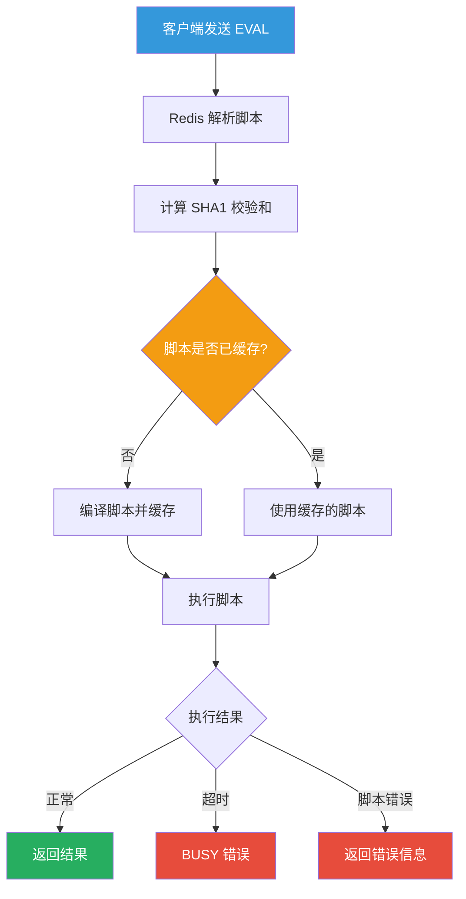
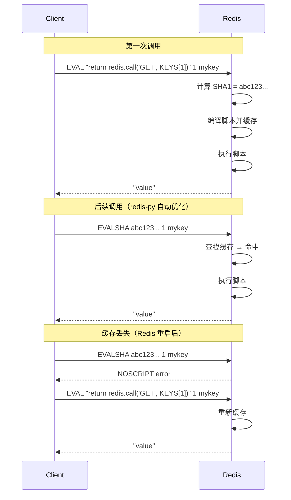
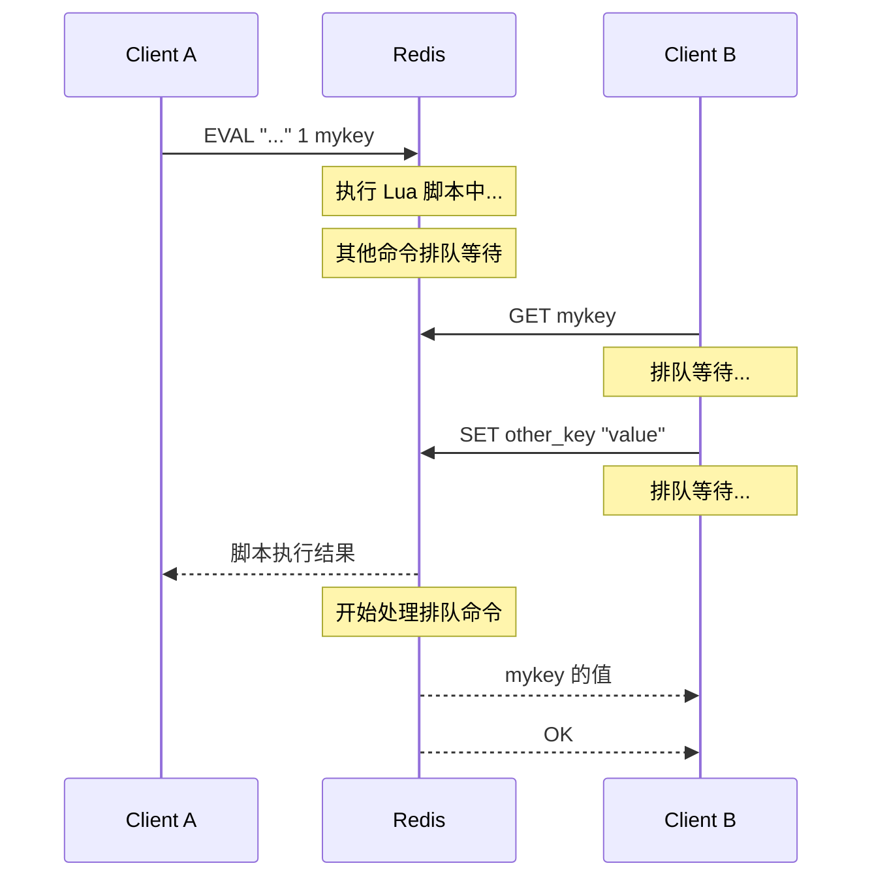
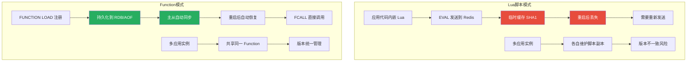
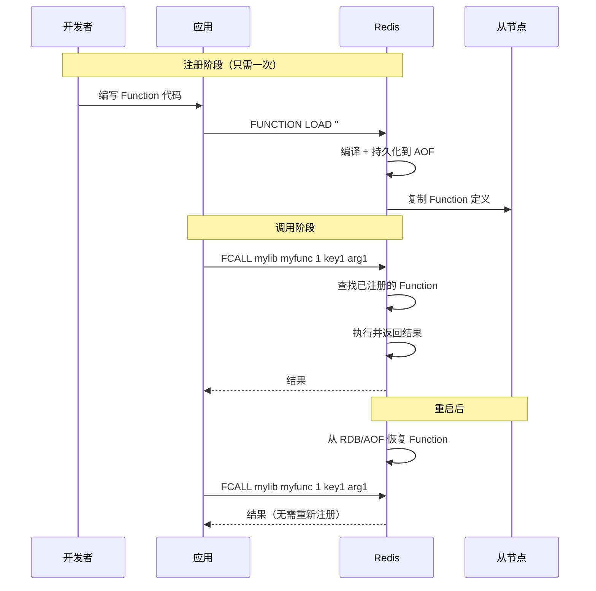

# Lua 脚本详解

Redis 的 Lua 脚本是它的"超能力"——把多条命令打包成一个原子操作，支持条件判断和循环，一次网络往返搞定复杂逻辑。从限流到分布式锁，从条件更新到秒杀扣减，Lua 脚本几乎能解决 Redis 事务无法应对的所有场景。本文从 EVAL 语法到脚本调试，从实战案例到 Redis 7 Function，全面解析 Redis Lua 编程。

## 1. EVAL / EVALSHA

### 1.1 EVAL 基本语法

```bash
EVAL script numkeys key [key ...] arg [arg ...]
```

| 参数 | 说明 | 示例 |
|------|------|------|
| `script` | Lua 脚本代码 | `"return redis.call('SET', KEYS[1], ARGV[1])"` |
| `numkeys` | Key 的数量 | `1` |
| `key [key ...]` | Key 列表（通过 KEYS 数组访问） | `mykey` |
| `arg [arg ...]` | 参数列表（通过 ARGV 数组访问） | `myvalue` |

```bash
# 最简单的 EVAL
EVAL "return 1" 0
# (integer) 1

# 带 Key 和参数
EVAL "return {KEYS[1], ARGV[1]}" 1 mykey myvalue
# 1) "mykey"
# 2) "myvalue"

# 多个 Key 和参数
EVAL "return {KEYS[1], KEYS[2], ARGV[1], ARGV[2]}" 2 key1 key2 arg1 arg2
# 1) "key1"
# 2) "key2"
# 3) "arg1"
# 4) "arg2"
```

### 1.2 EVAL 执行流程



### 1.3 EVALSHA 优化

每次 EVAL 都需要发送完整的脚本代码，当脚本很长时，网络传输开销不可忽略。EVALSHA 只发送脚本的 SHA1 校验和，如果脚本已经缓存，直接执行。

```bash
# Step 1：首次执行脚本（会自动缓存）
EVAL "return redis.call('GET', KEYS[1])" 1 mykey
# 编译 + 缓存 + 执行

# Step 2：获取脚本的 SHA1
SCRIPT LOAD "return redis.call('GET', KEYS[1])"
# "4e6d8fc8bb01276962cce5371fa60f6a4a4d9562"

# Step 3：使用 SHA1 执行
EVALSHA 4e6d8fc8bb01276962cce5371fa60f6a4a4d9562 1 mykey
# 直接从缓存执行，无需发送脚本代码

# 如果 SHA1 不存在
EVALSHA nonexistent_sha1 1 mykey
# (error) NOSCRIPT No matching script. Please use EVAL.
```

```python
# Python：自动 EVALSHA 回退
import redis

r = redis.Redis(host='localhost', port=6379)

# redis-py 自动使用 EVALSHA 优化
# 第一次调用：发送完整脚本，缓存 SHA1
# 后续调用：只发送 SHA1

SCRIPT = """
local key = KEYS[1]
local value = redis.call('GET', key)
if value then
    return value
else
    return 'NOT_FOUND'
end
"""

# redis-py 内部会自动处理 EVAL/EVALSHA 回退
result = r.eval(SCRIPT, 1, 'mykey')

# 也可以手动注册脚本（推荐）
get_or_default = r.register_script(SCRIPT)
result = get_or_default(keys=['mykey'])
```

### 1.4 SCRIPT 命令

```bash
# 检查脚本是否已缓存
SCRIPT EXISTS 4e6d8fc8bb01276962cce5371fa60f6a4a4d9562
# 1) (integer) 1

# 检查多个脚本
SCRIPT EXISTS sha1 sha2 sha3
# 1) (integer) 1
# 2) (integer) 0
# 3) (integer) 1

# 加载脚本（不执行，仅缓存）
SCRIPT LOAD "return 1"
# "e0e1f9fabfc9d4800c877a703b823ac0578ff8db"

# 清空所有脚本缓存
SCRIPT FLUSH
# OK

# 清空并指定模式（Redis 7.0+）
SCRIPT FLUSH ASYNC  # 异步清理
SCRIPT FLUSH SYNC   # 同步清理
```

::: important 脚本缓存的生命周期
1. 脚本一旦被 EVAL 或 SCRIPT LOAD 缓存，会一直存在
2. SCRIPT FLUSH 清空所有缓存
3. Redis 重启后缓存丢失（但 Redis 7 Function 解决了这个问题）
4. 缓存没有 LRU 淘汰机制，不会被自动清理
:::

## 2. KEYS 与 ARGV

### 2.1 为什么要区分 KEYS 和 ARGV

Redis Cluster 要求脚本中的所有 Key 必须在同一个 slot 上。通过 KEYS 数组显式声明 Key，Redis 可以在执行前检查 Key 的分布，确保路由正确。

```bash
# 正确：使用 KEYS 传递 Key
EVAL "return redis.call('GET', KEYS[1])" 1 user:1001:name
# Redis Cluster 可以正确路由到 user:1001:name 所在的 slot

# 错误：在脚本中硬编码 Key
EVAL "return redis.call('GET', 'user:1001:name')" 0
# Redis Cluster 无法确定 Key 的路由，可能报错
```

::: danger Redis Cluster 下的规则
1. **所有 Key 必须通过 KEYS 数组传入**
2. **所有 Key 必须在同一个 hash slot 上**
3. **使用 `{hash_tag}` 确保同 slot**：`{user}:1001:name` 和 `{user}:1001:profile` 在同一 slot
:::

### 2.2 KEYS 和 ARGV 的访问方式

```lua
-- KEYS 数组：从 1 开始索引（Lua 惯例）
-- ARGV 数组：从 1 开始索引

-- 访问单个元素
local key1 = KEYS[1]     -- 第一个 Key
local key2 = KEYS[2]     -- 第二个 Key
local arg1 = ARGV[1]     -- 第一个参数
local arg2 = ARGV[2]     -- 第二个参数

-- 获取数组长度
local key_count = #KEYS   -- Key 的数量
local arg_count = #ARGV   -- 参数的数量

-- 遍历所有 Key
for i = 1, #KEYS do
    redis.call('DEL', KEYS[i])
end
```

```bash
# 示例：批量删除 Key
EVAL "for i = 1, #KEYS do redis.call('DEL', KEYS[i]) end return #KEYS" 3 key1 key2 key3
# (integer) 3

# 示例：批量设置带 TTL 的 Key
EVAL "
for i = 1, #KEYS do
    redis.call('SET', KEYS[i], ARGV[i])
    redis.call('EXPIRE', KEYS[i], ARGV[#KEYS + 1])
end
return #KEYS
" 2 key1 key2 val1 val2 3600
# (integer) 2
```

### 2.3 类型转换规则

| Lua 类型 | Redis 返回类型 | 示例 |
|---------|--------------|------|
| number | integer | `return 42` → `(integer) 42` |
| string | bulk string | `return "hello"` → `"hello"` |
| table (array) | multi bulk | `return {1,2,3}` → `1) 1 2) 2 3) 3` |
| table (hash) | multi bulk | `return {k1="v1"}` → `1) "k1" 2) "v1"` |
| boolean true | integer 1 | `return true` → `(integer) 1` |
| boolean false | nil | `return false` → `(nil)` |
| nil | nil | `return nil` → `(nil)` |

::: warning 常见陷阱
1. **Lua 的浮点数会被转为整数**：`return 3.14` → `(integer) 3`（截断，不是四舍五入）
2. **Lua 的 false 会变成 nil**：无法区分 `false` 和 `nil`
3. **数组索引从 1 开始**：`KEYS[0]` 是 nil
4. **redis.call 返回的数字都是字符串**：需要用 `tonumber()` 转换
:::

```lua
-- 类型转换示例
local str_num = redis.call('GET', 'counter')  -- 返回字符串 "42" 或 false
if str_num then
    local num = tonumber(str_num)              -- 转为数字 42
    return num + 1                             -- 返回整数 43
else
    return 0
end
```

## 3. 脚本缓存（SHA1）

### 3.1 缓存机制详解



### 3.2 生产环境的脚本管理

```python
import redis
import hashlib

r = redis.Redis(host='localhost', port=6379)

class ScriptManager:
    """Lua 脚本管理器"""

    def __init__(self, redis_client):
        self.r = redis_client
        self.scripts = {}

    def register(self, name, script):
        """注册脚本"""
        sha1 = hashlib.sha1(script.encode()).hexdigest()
        self.scripts[name] = {
            'script': script,
            'sha1': sha1,
        }
        # 预加载到 Redis
        try:
            self.r.script_load(script)
        except redis.RedisError:
            pass
        return sha1

    def execute(self, name, numkeys, keys=None, args=None):
        """执行脚本（自动回退）"""
        if name not in self.scripts:
            raise ValueError(f"Script '{name}' not registered")

        script_info = self.scripts[name]

        try:
            # 优先使用 EVALSHA
            return self.r.evalsha(
                script_info['sha1'], numkeys,
                *(keys or []), *(args or [])
            )
        except redis.NoScriptError:
            # 缓存丢失，回退到 EVAL
            return self.r.eval(
                script_info['script'], numkeys,
                *(keys or []), *(args or [])
            )

    def preload_all(self):
        """预加载所有脚本"""
        pipe = self.r.pipeline()
        for name, info in self.scripts.items():
            pipe.script_load(info['script'])
        pipe.execute()
        print(f"预加载 {len(self.scripts)} 个脚本")

# 使用
manager = ScriptManager(r)

# 注册脚本
manager.register('get_or_set', """
local key = KEYS[1]
local value = redis.call('GET', key)
if value then
    return value
end
redis.call('SET', key, ARGV[1])
redis.call('EXPIRE', key, tonumber(ARGV[2]))
return ARGV[1]
""")

# 执行脚本
result = manager.execute('get_or_set', 1,
                        keys=['cache:article:123'],
                        args=['{"title":"Hello"}', '3600'])
```

## 4. Lua 脚本中的 Redis 调用

### 4.1 redis.call vs redis.pcall

| 函数 | 错误处理 | 说明 |
|------|---------|------|
| `redis.call(cmd, ...)` | 直接抛出错误，脚本终止 | 适合必须成功的操作 |
| `redis.pcall(cmd, ...)` | 返回错误对象，脚本继续 | 适合可容忍错误的操作 |

```lua
-- redis.call：遇到错误直接终止
local val = redis.call('INCR', 'not_a_number')  -- 如果值不是数字，脚本直接报错终止
-- 后面的代码不会执行

-- redis.pcall：遇到错误返回错误对象，脚本继续
local result = redis.pcall('INCR', 'not_a_number')
if type(result) == 'table' and result.err then
    -- 处理错误
    return {err = result.err}
else
    -- 正常处理
    return result
end
```

```bash
# redis.call 错误示例
EVAL "redis.call('INCR', 'string_key')" 0
# 先 SET string_key "hello"
# (error) ERR Error running script: ... value is not an integer or out of range

# redis.pcall 错误示例
EVAL "
local result = redis.pcall('INCR', 'string_key')
if type(result) == 'table' then
    return 'ERROR: ' .. result.err
else
    return result
end
" 0
# "ERROR: ERR value is not an integer or out of range"
```

### 4.2 Redis 命令返回值处理

```lua
-- GET 返回字符串或 false
local value = redis.call('GET', KEYS[1])
if value == false then
    return 'KEY_NOT_FOUND'
else
    return value
end

-- HGETALL 返回 table
local hash = redis.call('HGETALL', KEYS[1])
-- hash = {"field1", "value1", "field2", "value2"}
-- 注意：Lua table 是扁平数组，不是字典！

-- 转换为字典
local dict = {}
for i = 1, #hash, 2 do
    dict[hash[i]] = hash[i + 1]
end

-- LRANGE 返回 table
local list = redis.call('LRANGE', KEYS[1], 0, -1)
-- list = {"item1", "item2", "item3"}

-- SCARD 返回数字
local count = redis.call('SCARD', KEYS[1])
-- count = 42 (number type)

-- ZSCORE 返回字符串或 false
local score = redis.call('ZSCORE', KEYS[1], ARGV[1])
if score == false then
    return -1
else
    return tonumber(score)  -- 注意：score 是字符串！
end
```

### 4.3 Lua 常用语法速查

```lua
-- 变量
local x = 10           -- 局部变量（推荐）
y = 20                 -- 全局变量（禁止使用，Redis 沙箱限制）

-- 条件判断
if x > 10 then
    return "big"
elseif x > 5 then
    return "medium"
else
    return "small"
end

-- 循环
for i = 1, 10 do
    redis.call('RPUSH', KEYS[1], tostring(i))
end

-- while 循环
local i = 0
while i < 10 do
    i = i + 1
end

-- 字符串拼接
local msg = "Hello" .. " " .. "World"

-- 数学运算
local max_val = math.max(1, 2, 3)
local floor_val = math.floor(3.7)

-- table 操作
local t = {1, 2, 3}
table.insert(t, 4)
local len = #t  -- 4

-- 字符串操作
local s = "hello world"
local sub = string.sub(s, 1, 5)  -- "hello"
local upper = string.upper(s)     -- "HELLO WORLD"
```

## 5. 原子性保证

### 5.1 Lua 脚本的原子性

::: important 核心规则
Redis 执行 Lua 脚本时会**阻塞其他客户端的命令**——整个脚本作为一个原子操作执行，不会被其他命令插入。这等同于对整个脚本加了一把全局锁。
:::



### 5.2 原子性的边界

```lua
-- 这个脚本是原子的
local balance = tonumber(redis.call('GET', KEYS[1]))
if balance >= tonumber(ARGV[1]) then
    redis.call('DECRBY', KEYS[1], tonumber(ARGV[1]))
    return 1
else
    return 0
end
-- 整个脚本执行期间，没有其他命令能修改 KEYS[1]

-- 但这并不意味着"事务性"——如果脚本中途出错，已执行的命令不会回滚
redis.call('SET', KEYS[1], ARGV[1])  -- 成功
local x = 1 / 0                       -- 错误！但 KEYS[1] 已经被修改了
-- SET 的效果不会回滚
```

::: warning 原子性 ≠ 事务性
Lua 脚本的原子性意味着"执行过程中不会被插入其他命令"，但**不意味着"要么全成功要么全失败"**——如果脚本中途出错，已执行的命令不会回滚。
:::

### 5.3 手动回滚

```lua
-- 手动回滚模式
local key1 = KEYS[1]
local key2 = KEYS[2]
local old_val1 = redis.call('GET', key1)
local old_val2 = redis.call('GET', key2)

-- 尝试操作
local ok1 = redis.pcall('SET', key1, ARGV[1])
local ok2 = redis.pcall('SET', key2, ARGV[2])

-- 如果有失败，回滚
if type(ok1) == 'table' and ok1.err then
    -- key1 设置失败，回滚 key2（如果已设置）
    if type(ok2) ~= 'table' then
        if old_val2 then
            redis.call('SET', key2, old_val2)
        else
            redis.call('DEL', key2)
        end
    end
    return {err = ok1.err}
end

if type(ok2) == 'table' and ok2.err then
    -- key2 设置失败，回滚 key1
    if old_val1 then
        redis.call('SET', key1, old_val1)
    else
        redis.call('DEL', key1)
    end
    return {err = ok2.err}
end

return {ok1, ok2}
```

## 6. 脚本超时（busy-scripts）

### 6.1 超时机制

Redis 默认的 Lua 脚本超时时间为 **5 秒**。如果脚本执行超过这个时间，Redis 会：
1. 向所有客户端发送 `BUSY` 错误
2. 开始接受 `SCRIPT KILL` 命令
3. 如果脚本已经执行了写操作，只能用 `SHUTDOWN NOSAVE` 关闭 Redis

```bash
# 配置超时时间（毫秒）
CONFIG SET lua-time-limit 10000  # 10 秒

# 默认值
CONFIG GET lua-time-limit
# 1) "lua-time-limit"
# 2) "5000"
```

::: danger 超时后的处理
```bash
# 其他客户端会收到 BUSY 错误
GET mykey
# (error) BUSY Redis is busy running a script. You can only call SCRIPT KILL or SHUTDOWN NOSAVE.

# 尝试终止脚本（仅在脚本没有执行写操作时有效）
SCRIPT KILL
# OK

# 如果脚本已经执行了写操作，SCRIPT KILL 会失败
SCRIPT KILL
# (error) UNKILLABLE Sorry the script already executed write commands against the dataset.
# You can either wait the script termination or kill the server in a hard way using the SHUTDOWN NOSAVE command.

# 最后手段：强制关闭（数据丢失！）
SHUTDOWN NOSAVE
```
:::

### 6.2 避免超时的最佳实践

```lua
-- 差：遍历大量 Key
for i = 1, 100000 do
    redis.call('SET', 'key:' .. i, 'value')
end

-- 好：分批处理，每批检查是否超时
local batch_size = 1000
for i = 1, 100000, batch_size do
    for j = i, math.min(i + batch_size - 1, 100000) do
        redis.call('SET', 'key:' .. j, 'value')
    end
    -- 注意：Lua 脚本内部无法真正"暂停"
    -- 如果需要分批，应该从客户端分批调用
end
```

::: tip 避免超时的核心原则
1. **脚本尽量短**：执行时间控制在 1ms 以内
2. **不使用循环遍历大量 Key**：改用 SCAN 命令分批处理
3. **不使用 BLOCKING 命令**：BLPOP/BRPOP 等不能在 Lua 中使用
4. **避免复杂计算**：Lua 脚本不是通用编程语言
5. **监控脚本执行时间**：通过 `INFO commandstats` 统计
:::

## 7. 脚本调试（redis-cli --ldb）

### 7.1 启用调试模式

Redis 3.2+ 内置了 Lua 调试器，可以通过 `redis-cli --ldb` 启用。

```bash
# 启动交互式调试
redis-cli --ldb --eval myscript.lua key1 key2 , arg1 arg2

# 非阻塞调试（推荐用于生产环境）
redis-cli --ldb-sync-mode --eval myscript.lua key1 , arg1
```

### 7.2 调试器命令

| 命令 | 缩写 | 说明 |
|------|------|------|
| `step` | `s` | 单步执行（进入函数） |
| `next` | `n` | 单步执行（跳过函数） |
| `continue` | `c` | 继续执行到下一个断点 |
| `list` | `l` | 显示当前代码 |
| `print` | `p` | 打印变量值 |
| `break` | `b` | 设置断点 |
| `trace` | `t` | 显示调用栈 |
| `restart` | `r` | 重新执行脚本 |
| `abort` | `q` | 终止脚本 |

### 7.3 调试示例

```bash
# 准备测试脚本
cat > /tmp/test.lua << 'EOF'
local key = KEYS[1]
local value = redis.call('GET', key)

if value == false then
    return 'NOT_FOUND'
end

local num = tonumber(value)
if num > 100 then
    return 'TOO_LARGE'
end

redis.call('SET', key, tostring(num + 1))
return num + 1
EOF

# 启动调试
redis-cli --ldb --eval /tmp/test.lua counter
```

```
Lua debugging session started, please use:
quit    -- End the session.
restart -- Restart the script in debug mode again.
help    -- Show Lua script debugging commands.

* Stopped at 1, stop reason = step over
-> 1  local key = KEYS[1]
lua debugger> s
* Stopped at 2, stop reason = step over
-> 2  local value = redis.call('GET', key)
lua debugger> p key
<value> "counter"
lua debugger> s
* Stopped at 4, stop reason = step over
-> 4  if value == false then
lua debugger> p value
<value> "42"
lua debugger> s
* Stopped at 8, stop reason = step over
-> 8  local num = tonumber(value)
lua debugger> s
* Stopped at 9, stop reason = step over
-> 9  if num > 100 then
lua debugger> p num
<value> 42
lua debugger> c
(integer) 43
(Lua debugging session ended)
```

### 7.4 远程调试

```bash
# 在生产环境中，使用同步模式调试（会阻塞 Redis）
# 注意：只在维护窗口使用！

redis-cli --ldb-sync-mode --eval /tmp/debug.lua problematic_key

# 设置断点调试
lua debugger> b 10    # 在第 10 行设置断点
lua debugger> c       # 继续执行到断点
lua debugger> p result  # 查看变量
lua debugger> c       # 继续执行
```

::: warning 生产环境调试注意事项
1. **使用 ldb-sync-mode**：异步模式可能导致调试会话意外断开
2. **选择低峰时段**：调试会阻塞所有其他客户端
3. **提前通知团队**：调试期间 Redis 不可用
4. **尽快完成**：设置好断点，快速定位问题后退出
5. **优先在测试环境复现**：避免在生产环境调试
:::

## 8. Lua 脚本实战

### 8.1 滑动窗口限流

```lua
-- 滑动窗口限流器
-- KEYS[1]: 限流 Key
-- ARGV[1]: 窗口大小（毫秒）
-- ARGV[2]: 最大请求数
-- ARGV[3]: 当前时间戳（毫秒）
-- ARGV[4]: 唯一请求 ID

local key = KEYS[1]
local window = tonumber(ARGV[1])
local limit = tonumber(ARGV[2])
local now = tonumber(ARGV[3])
local request_id = ARGV[4]

-- 移除窗口外的记录
local window_start = now - window
redis.call('ZREMRANGEBYSCORE', key, '-inf', window_start)

-- 获取当前窗口内的请求数
local count = redis.call('ZCARD', key)

if count < limit then
    -- 允许请求：添加当前请求到窗口
    redis.call('ZADD', key, now, request_id)
    redis.call('PEXPIRE', key, window)
    return 1  -- 允许
else
    return 0  -- 拒绝
end
```

```python
# Python 调用
import uuid
import time

SLIDING_WINDOW_SCRIPT = """
local key = KEYS[1]
local window = tonumber(ARGV[1])
local limit = tonumber(ARGV[2])
local now = tonumber(ARGV[3])
local request_id = ARGV[4]

local window_start = now - window
redis.call('ZREMRANGEBYSCORE', key, '-inf', window_start)

local count = redis.call('ZCARD', key)

if count < limit then
    redis.call('ZADD', key, now, request_id)
    redis.call('PEXPIRE', key, window)
    return 1
else
    return 0
end
"""

def rate_limit(key, window_ms=60000, limit=100):
    """滑动窗口限流"""
    now = int(time.time() * 1000)
    request_id = f"{now}:{uuid.uuid4().hex[:8]}"

    result = r.eval(SLIDING_WINDOW_SCRIPT, 1, key,
                   str(window_ms), str(limit), str(now), request_id)
    return result == 1

# 使用：60秒内最多 100 次请求
if rate_limit('ratelimit:api:user:1001', window_ms=60000, limit=100):
    print("请求通过")
else:
    print("请求被限流")
```

### 8.2 分布式锁（Redlock 简化版）

```lua
-- 可重入分布式锁
-- KEYS[1]: 锁 Key
-- ARGV[1]: 锁持有者标识（UUID + 线程ID）
-- ARGV[2]: 锁超时时间（毫秒）
-- ARGV[3]: 重入计数增量（通常为 1）

local lock_key = KEYS[1]
local lock_holder = ARGV[1]
local ttl = tonumber(ARGV[2])
local reentrant_count = tonumber(ARGV[3])

-- 获取当前锁信息
local current = redis.call('GET', lock_key)

if current == false then
    -- 锁不存在，直接获取
    redis.call('SET', lock_key, lock_holder .. ':' .. reentrant_count, 'PX', ttl)
    return 1
end

-- 检查是否是同一线程持有
local holder, count = current:match('^(.+):(%d+)$')
if holder == lock_holder then
    -- 同一线程重入
    count = tonumber(count) + reentrant_count
    redis.call('SET', lock_key, holder .. ':' .. count, 'PX', ttl)
    return 1
end

-- 锁被其他线程持有
return 0
```

```lua
-- 解锁脚本
-- KEYS[1]: 锁 Key
-- ARGV[1]: 锁持有者标识
-- ARGV[2]: 释放计数（通常为 1）

local lock_key = KEYS[1]
local lock_holder = ARGV[1]
local release_count = tonumber(ARGV[2])

local current = redis.call('GET', lock_key)

if current == false then
    return 0  -- 锁不存在
end

local holder, count = current:match('^(.+):(%d+)$')
if holder ~= lock_holder then
    return 0  -- 不是锁的持有者
end

count = tonumber(count) - release_count

if count <= 0 then
    -- 完全释放锁
    redis.call('DEL', lock_key)
    return 1
else
    -- 减少重入计数
    redis.call('SET', lock_key, holder .. ':' .. count, 'KEEPTTL')
    return 1
end
```

```python
# Python 封装
import uuid
import threading

class RedisLock:
    def __init__(self, redis_client, lock_name, ttl=30000):
        self.r = redis_client
        self.lock_key = f'lock:{lock_name}'
        self.holder = f'{uuid.uuid4().hex}:{threading.get_ident()}'
        self.ttl = ttl

        self._lock_script = self.r.register_script(LOCK_SCRIPT)
        self._unlock_script = self.r.register_script(UNLOCK_SCRIPT)

    def acquire(self, max_retries=3, retry_interval=0.1):
        """获取锁"""
        for i in range(max_retries):
            result = self._lock_script(
                keys=[self.lock_key],
                args=[self.holder, str(self.ttl), '1']
            )
            if result:
                return True
            time.sleep(retry_interval * (i + 1))
        return False

    def release(self):
        """释放锁"""
        return self._unlock_script(
            keys=[self.lock_key],
            args=[self.holder, '1']
        )

    def __enter__(self):
        if not self.acquire():
            raise RuntimeError(f"Failed to acquire lock: {self.lock_key}")
        return self

    def __exit__(self, exc_type, exc_val, exc_tb):
        self.release()

# 使用
with RedisLock(r, 'order:pay:1001', ttl=30000):
    # 在锁保护下执行操作
    process_order(1001)
```

### 8.3 条件更新

```lua
-- CAS（Compare-And-Set）操作
-- KEYS[1]: 目标 Key
-- ARGV[1]: 期望的旧值
-- ARGV[2]: 新值

local key = KEYS[1]
local expected = ARGV[1]
local new_value = ARGV[2]

local current = redis.call('GET', key)

if current == expected then
    redis.call('SET', key, new_value)
    return 1  -- 更新成功
elseif current == false and expected == '' then
    -- Key 不存在且期望空值
    redis.call('SET', key, new_value)
    return 1
else
    return 0  -- 值不匹配，更新失败
end
```

```python
CAS_SCRIPT = """
local key = KEYS[1]
local expected = ARGV[1]
local new_value = ARGV[2]

local current = redis.call('GET', key)

if current == expected then
    redis.call('SET', key, new_value)
    return 1
elseif current == false and expected == '' then
    redis.call('SET', key, new_value)
    return 1
else
    return 0
end
"""

def compare_and_set(key, expected, new_value):
    """CAS 操作"""
    result = r.eval(CAS_SCRIPT, 1, key,
                   expected if expected else '',
                   new_value)
    return result == 1

# 使用
current = r.get('config:version')
if compare_and_set('config:version', current, 'v2'):
    print("更新成功")
else:
    print("并发冲突，请重试")
```

### 8.4 限流 + 降级一体化

```lua
-- 限流 + 降级脚本
-- KEYS[1]: 限流计数器 Key
-- KEYS[2]: 降级标记 Key
-- ARGV[1]: 窗口大小（秒）
-- ARGV[2]: 正常限流阈值
-- ARGV[3]: 降级限流阈值（更低）
-- ARGV[4]: 当前时间戳

local counter_key = KEYS[1]
local degrade_key = KEYS[2]
local window = tonumber(ARGV[1])
local normal_limit = tonumber(ARGV[2])
local degrade_limit = tonumber(ARGV[3])
local now = tonumber(ARGV[4])

-- 检查是否处于降级状态
local is_degraded = redis.call('GET', degrade_key)

-- 确定限流阈值
local limit = normal_limit
if is_degraded then
    limit = degrade_limit
end

-- 滑动窗口计数
local window_start = now - window * 1000
redis.call('ZREMRANGEBYSCORE', counter_key, '-inf', window_start)
local count = redis.call('ZCARD', counter_key)

if count < limit then
    redis.call('ZADD', counter_key, now, now .. ':' .. math.random(1000000))
    redis.call('PEXPIRE', counter_key, window * 1000)
    return {1, is_degraded and 1 or 0}  -- {允许, 是否降级}
else
    -- 触发降级
    if not is_degraded then
        redis.call('SET', degrade_key, '1', 'EX', 300)  -- 降级 5 分钟
    end
    return {0, 1}  -- {拒绝, 降级中}
end
```

### 8.5 消息去重

```lua
-- 消息去重 + 处理
-- KEYS[1]: 消息 ID 集合（Set）
-- KEYS[2]: 处理队列（List）
-- ARGV[1]: 消息 ID
-- ARGV[2]: 消息内容
-- ARGV[3]: 去重窗口 TTL（秒）

local dedup_key = KEYS[1]
local queue_key = KEYS[2]
local msg_id = ARGV[1]
local msg_content = ARGV[2]
local ttl = tonumber(ARGV[3])

-- 检查消息是否已处理
if redis.call('SISMEMBER', dedup_key, msg_id) == 1 then
    return 0  -- 重复消息
end

-- 记录消息 ID + 入队
redis.call('SADD', dedup_key, msg_id)
redis.call('EXPIRE', dedup_key, ttl)
redis.call('RPUSH', queue_key, msg_content)

return 1  -- 消息已入队
```

## 9. 脚本安全（Sandbox 限制）

### 9.1 Redis Lua 沙箱限制

Redis 的 Lua 环境是一个受限的沙箱，以下功能被禁止：

| 限制 | 说明 |
|------|------|
| **禁止文件 I/O** | `io.open`, `io.read` 等不可用 |
| **禁止网络操作** | `socket`, `http` 等不可用 |
| **禁止系统命令** | `os.execute`, `os.exit` 等不可用 |
| **禁止加载模块** | `require` 被限制 |
| **禁止全局变量** | 不能创建新的全局变量 |
| **禁止协程** | `coroutine` 不可用 |
| **字符串长度限制** | 单个字符串最大 512MB |
| **执行时间限制** | 默认 5 秒超时 |

### 9.2 可用的 Lua 标准库

| 库 | 可用函数 |
|----|---------|
| `string` | 全部可用 |
| `math` | 全部可用 |
| `table` | 全部可用 |
| `cjson` | `cjson.encode`, `cjson.decode` |
| `cmsgpack` | `cmsgpack.pack`, `cmsgpack.unpack` |
| `bit` / `bit32` | 位运算（Redis 5.0+ 用 bit32） |

### 9.3 JSON 处理

```lua
-- 使用 cjson 处理 JSON
local data = cjson.decode(ARGV[1])
-- data = {name = "Alice", age = 30}

-- 修改数据
data.age = data.age + 1
data.updated = true

-- 编码回 JSON
return cjson.encode(data)
-- {"name":"Alice","age":31,"updated":true}
```

```python
# Python 中使用 JSON 参数
import json

script = """
local data = cjson.decode(ARGV[1])
data.processed = true
data.timestamp = tonumber(ARGV[2])
redis.call('SET', KEYS[1], cjson.encode(data))
return 1
"""

data = {'user_id': 1001, 'action': 'login'}
r.eval(script, 1, 'event:latest', json.dumps(data), str(int(time.time() * 1000)))
```

### 9.4 安全最佳实践

```lua
-- 1. 始终使用 local 变量
local x = 10        -- 好
-- y = 10           -- 差：全局变量

-- 2. 验证输入参数
local amount = tonumber(ARGV[1])
if not amount or amount <= 0 then
    return {err = "INVALID_AMOUNT"}
end

-- 3. 使用 pcall 处理可能的错误
local result = redis.pcall('GET', KEYS[1])
if type(result) == 'table' and result.err then
    return {err = result.err}
end

-- 4. 限制循环次数
local max_iterations = 1000
for i = 1, math.min(#data, max_iterations) do
    -- 处理数据
end

-- 5. 不拼接用户输入到命令中（防止命令注入）
-- 差：直接拼接
-- redis.call('SET', KEYS[1], 'prefix:' .. ARGV[1])

-- 好：使用参数化方式
redis.call('SET', KEYS[1], ARGV[1])
```

::: important 安全原则
1. **所有 Key 通过 KEYS 传入**：不要在脚本中拼接 Key 名
2. **验证参数类型和范围**：`tonumber()` 可能返回 nil
3. **使用 pcall 捕获错误**：避免脚本意外终止
4. **限制循环次数**：防止超时
5. **不信任客户端输入**：脚本中的参数可能被篡改
:::

## 10. Redis 7 Function 替代 Lua

### 10.1 Function 的优势



### 10.2 Function 注册调用流程



### 10.3 Function 注册与调用

```bash
# 注册一个包含多个函数的库
FUNCTION LOAD "#!lua name=business_lib\n
\n
redis.register_function('transfer', function(keys, args)\n
  local from_key = keys[1]\n
  local to_key = keys[2]\n
  local amount = tonumber(args[1])\n
  local balance = tonumber(redis.call('GET', from_key) or 0)\n
  if balance < amount then\n
    return {err='INSUFFICIENT_BALANCE'}\n
  end\n
  redis.call('DECRBY', from_key, amount)\n
  redis.call('INCRBY', to_key, amount)\n
  return 1\n
end)\n
\n
redis.register_function('deduct_stock', function(keys, args)\n
  local stock_key = keys[1]\n
  local user_key = keys[2]\n
  local user_id = args[1]\n
  local stock = tonumber(redis.call('GET', stock_key) or 0)\n
  if stock <= 0 then\n
    return {err='OUT_OF_STOCK'}\n
  end\n
  if redis.call('SISMEMBER', user_key, user_id) == 1 then\n
    return {err='DUPLICATE'}\n
  end\n
  redis.call('DECR', stock_key)\n
  redis.call('SADD', user_key, user_id)\n
  return 1\n
end)"

# 调用转账
FCALL business_lib transfer 2 account:A account:B 200

# 调用扣减库存
FCALL business_lib deduct_stock 2 seckill:stock seckill:users user:1001

# 只读调用（从节点可执行）
FCALL_RO business_lib check_balance 1 account:A
```

### 10.4 注册只读函数

```lua
#!lua name=query_lib

-- 只读函数：标记 no-writes 标志
redis.register_function(
    'check_balance',
    function(keys, args)
        local balance = tonumber(redis.call('GET', keys[1]) or 0)
        return balance
    end,
    { flags = { 'no-writes' } }
)

-- 另一种注册方式（Redis 7.0+）
redis.register_function{
    function_name='get_user_info',
    callback=function(keys, args)
        local data = redis.call('HGETALL', keys[1])
        return data
    end,
    flags={ 'no-writes' }
}
```

### 10.5 Function 管理

```bash
# 列出所有 Function 库
FUNCTION LIST
# 1) 1) "name"
#    2) "business_lib"
#    3) "engine"
#    4) "LUA"
#    5) "functions"
#    6) 1) 1) "name"
#          2) "transfer"
#       2) 1) "name"
#          2) "deduct_stock"

# 查看特定库的代码
FUNCTION LIST LIBRARYNAME business_lib WITHCODE

# 删除库
FUNCTION DELETE business_lib

# 清空所有库
FUNCTION FLUSH

# 导出/导入（迁移）
FUNCTION DUMP
# "\x00\x01\x00\x01\x02..."

FUNCTION RESTORE "\x00\x01\x00\x01\x02..."
```

### 10.6 Function 实战：完整业务库

```lua
#!lua name=ecommerce

-- 限流检查
local function check_rate_limit(key, window, limit, now)
    local window_start = now - window * 1000
    redis.call('ZREMRANGEBYSCORE', key, '-inf', window_start)
    local count = redis.call('ZCARD', key)
    return count < limit
end

-- 秒杀扣减
redis.register_function('seckill', function(keys, args)
    local stock_key = keys[1]
    local user_key = keys[2]
    local rate_key = keys[3]
    local user_id = args[1]
    local now = tonumber(args[2])

    -- 1. 限流检查
    if not check_rate_limit(rate_key, 1, 100, now) then
        return {err = 'RATE_LIMITED'}
    end

    -- 2. 检查库存
    local stock = tonumber(redis.call('GET', stock_key) or 0)
    if stock <= 0 then
        return {err = 'OUT_OF_STOCK'}
    end

    -- 3. 检查是否重复
    if redis.call('SISMEMBER', user_key, user_id) == 1 then
        return {err = 'DUPLICATE_PURCHASE'}
    end

    -- 4. 扣减库存
    redis.call('DECR', stock_key)

    -- 5. 记录用户
    redis.call('SADD', user_key, user_id)

    -- 6. 更新限流计数
    redis.call('ZADD', rate_key, now, now .. ':' .. user_id)
    redis.call('PEXPIRE', rate_key, 2000)

    return 1
end)

-- 订单创建（带库存预占）
redis.register_function('create_order', function(keys, args)
    local stock_key = keys[1]
    local order_key = keys[2]
    local reserved_key = keys[3]
    local order_id = args[1]
    local quantity = tonumber(args[2])
    local ttl = tonumber(args[3])

    -- 检查是否已预占
    if redis.call('HEXISTS', reserved_key, order_id) == 1 then
        return {err = 'ALREADY_RESERVED'}
    end

    -- 检查库存
    local available = tonumber(redis.call('GET', stock_key) or 0)
    if available < quantity then
        return {err = 'INSUFFICIENT_STOCK'}
    end

    -- 预占库存
    redis.call('DECRBY', stock_key, quantity)
    redis.call('HSET', reserved_key, order_id, quantity)
    redis.call('EXPIRE', reserved_key, ttl)

    -- 记录订单
    redis.call('HSET', order_key, 'status', 'reserved', 'quantity', quantity)

    return 1
end)

-- 确认订单
redis.register_function('confirm_order', function(keys, args)
    local stock_key = keys[1]
    local order_key = keys[2]
    local reserved_key = keys[3]
    local order_id = args[1]

    local quantity = redis.call('HGET', reserved_key, order_id)
    if not quantity then
        return {err = 'NOT_RESERVED'}
    end

    -- 删除预占记录
    redis.call('HDEL', reserved_key, order_id)

    -- 更新订单状态
    redis.call('HSET', order_key, 'status', 'confirmed')

    return 1
end)
```

```bash
# 注册
FUNCTION LOAD "#!lua name=ecommerce\n..."

# 秒杀
FCALL ecommerce seckill 3 seckill:IPHONE15:stock seckill:IPHONE15:users seckill:IPHONE15:ratelimit user:1001 1704067200000

# 创建订单
FCALL ecommerce create_order 3 goods:999:stock order:12345 goods:999:reserved ORDER_12345 1 600

# 确认订单
FCALL ecommerce confirm_order 3 goods:999:stock order:12345 goods:999:reserved ORDER_12345
```

### 10.7 Lua vs Function 选择指南

| 场景 | 推荐方案 | 理由 |
|------|---------|------|
| 一次性脚本/临时操作 | Lua EVAL | 简单直接，无需注册 |
| 通用业务逻辑 | Function | 持久化 + 自动同步 |
| 多应用共享的逻辑 | Function | 版本统一管理 |
| 只读查询 | Function + no-writes | 可在从节点执行 |
| 脚本调试开发 | Lua EVAL | 快速迭代 |
| 生产部署 | Function | 重启不丢失 |

## 11. 性能优化与最佳实践

### 11.1 脚本性能优化

```lua
-- 优化 1：减少 redis.call 调用次数
-- 差：多次调用
local v1 = redis.call('HGET', KEYS[1], 'field1')
local v2 = redis.call('HGET', KEYS[1], 'field2')
local v3 = redis.call('HGET', KEYS[1], 'field3')

-- 好：一次 HMGET
local values = redis.call('HMGET', KEYS[1], 'field1', 'field2', 'field3')

-- 优化 2：使用 EVALSHA 减少网络传输
-- (由客户端库自动处理)

-- 优化 3：避免在循环中调用 redis.call
-- 差：循环中逐条操作
for i = 1, #items do
    redis.call('SADD', KEYS[1], items[i])
end

-- 好：批量操作
local args = {}
for i = 1, #items do
    args[#args + 1] = items[i]
end
-- Lua 中无法直接变参调用，但可以用 unpack
redis.call('SADD', KEYS[1], unpack(args, 1, math.min(#args, 100)))

-- 优化 4：预计算，减少运行时开销
-- 差：每次调用都计算
for i = 1, 1000 do
    local prefix = "prefix:" .. tostring(i)  -- 字符串拼接开销
end

-- 好：预计算格式
for i = 1, 1000 do
    local key = string.format("prefix:%d", i)
end
```

### 11.2 脚本设计原则

::: tip 脚本设计六大原则
1. **短小精悍**：单个脚本执行时间 < 1ms
2. **参数化**：所有 Key 通过 KEYS 传入，不硬编码
3. **防御性编程**：验证参数、使用 pcall、限制循环
4. **幂等性**：相同输入应产生相同输出（便于重试）
5. **无副作用**：脚本只操作通过 KEYS 传入的 Key
6. **可测试**：先在 redis-cli 中测试，再部署到生产
:::

### 11.3 脚本版本管理

```python
# 脚本版本管理方案
import hashlib
import json

class ScriptRegistry:
    """Lua 脚本版本管理"""

    def __init__(self, redis_client):
        self.r = redis_client
        self.scripts = {}
        self.versions = {}

    def register(self, name, script, version='1.0'):
        """注册脚本（带版本号）"""
        sha1 = hashlib.sha1(script.encode()).hexdigest()
        self.scripts[name] = {
            'script': script,
            'sha1': sha1,
            'version': version,
        }

        # 预加载
        try:
            self.r.script_load(script)
        except redis.RedisError:
            pass

    def execute(self, name, numkeys, keys=None, args=None):
        """执行脚本"""
        info = self.scripts.get(name)
        if not info:
            raise ValueError(f"Script '{name}' not registered")

        try:
            return self.r.evalsha(info['sha1'], numkeys,
                                 *(keys or []), *(args or []))
        except redis.NoScriptError:
            return self.r.eval(info['script'], numkeys,
                              *(keys or []), *(args or []))

    def health_check(self):
        """检查所有脚本是否已缓存"""
        pipe = self.r.pipeline()
        for name, info in self.scripts.items():
            pipe.script_exists(info['sha1'])
        results = pipe.execute()

        missing = []
        for (name, info), exists in zip(self.scripts.items(), results):
            if not exists:
                missing.append(name)

        if missing:
            print(f"缺失脚本: {missing}")
            self.preload_all()
        else:
            print(f"所有 {len(self.scripts)} 个脚本已缓存")

    def preload_all(self):
        """预加载所有脚本"""
        pipe = self.r.pipeline()
        for name, info in self.scripts.items():
            pipe.script_load(info['script'])
        pipe.execute()

    def export_registry(self):
        """导出注册表"""
        return {
            name: {
                'sha1': info['sha1'],
                'version': info['version'],
                'script': info['script'][:100] + '...',
            }
            for name, info in self.scripts.items()
        }

# 使用
registry = ScriptRegistry(r)
registry.register('rate_limit', SLIDING_WINDOW_SCRIPT, '1.0')
registry.register('distributed_lock', LOCK_SCRIPT, '1.1')
registry.register('cas', CAS_SCRIPT, '1.0')

# 健康检查
registry.health_check()

# 执行
result = registry.execute('rate_limit', 1,
                         keys=['ratelimit:api:user:1001'],
                         args=['60000', '100', str(int(time.time() * 1000)), 'req_123'])
```

## 12. 总结

::: tip Lua 脚本核心要点
1. **EVAL/EVALSHA**：EVAL 发送完整脚本，EVALSHA 只发送校验和
2. **KEYS/ARGV**：KEYS 传 Key（Cluster 必需），ARGV 传参数
3. **redis.call/pcall**：call 遇错终止，pcall 遇错继续
4. **原子性**：整个脚本原子执行，但运行时错误不回滚
5. **超时**：默认 5 秒，超时后只能 SCRIPT KILL 或 SHUTDOWN NOSAVE
6. **调试**：redis-cli --ldb 交互式调试
7. **安全**：沙箱限制，禁止 I/O/网络/系统命令
8. **Function**：Redis 7 新特性，持久化 + 自动同步 + 版本管理
:::

::: important 选择决策树
```
需要原子操作？
├── 简单单命令（INCR/DECR）→ 直接用命令
├── 多命令无条件逻辑 → Pipeline
├── 读取-修改-写入（低并发）→ WATCH + 事务
├── 复杂条件逻辑（Redis < 7）→ Lua 脚本
└── 复杂条件逻辑（Redis 7+）→ Function
```
:::

Lua 脚本是 Redis 从"快速键值存储"进化为"轻量级数据处理引擎"的关键特性。掌握它，你就掌握了 Redis 最强大的编程能力。
