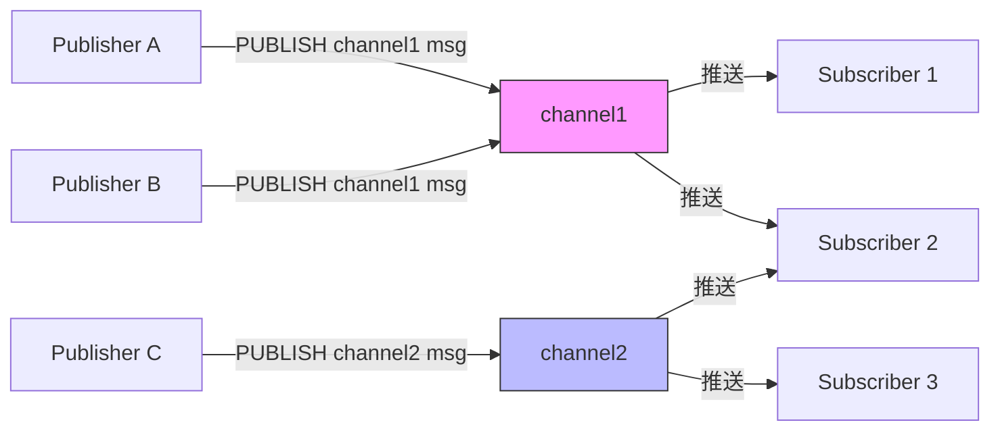
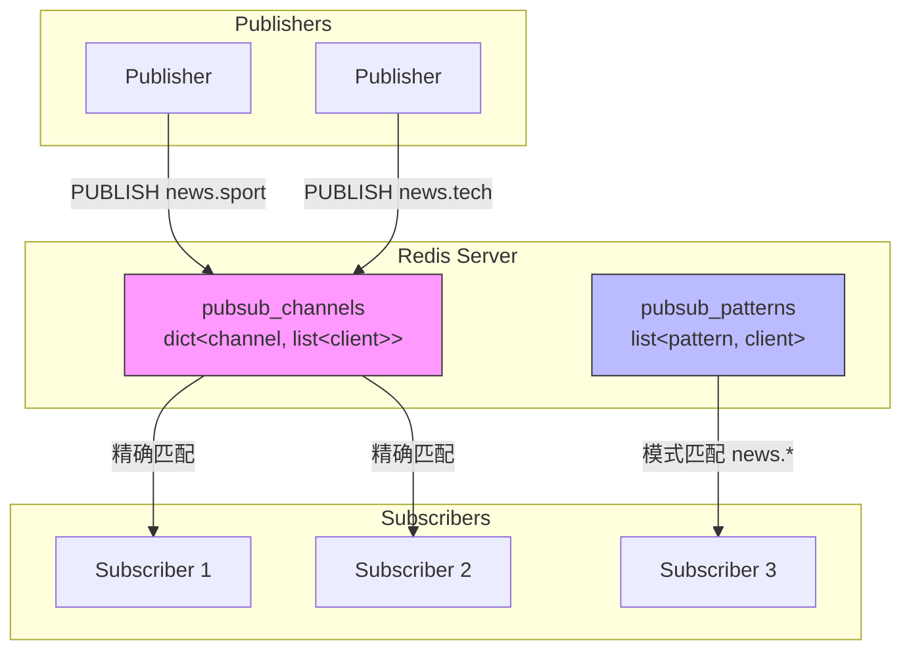
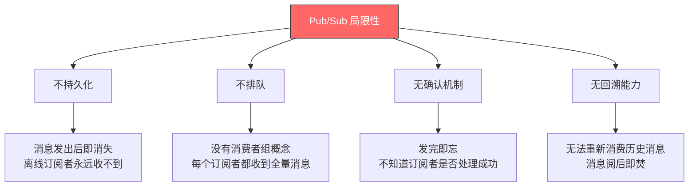
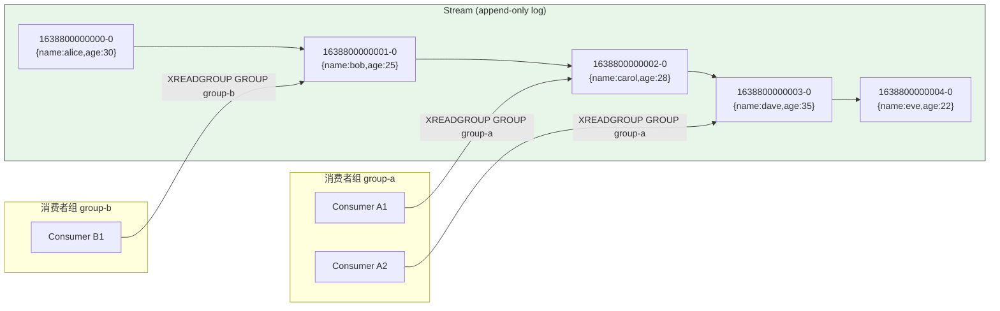
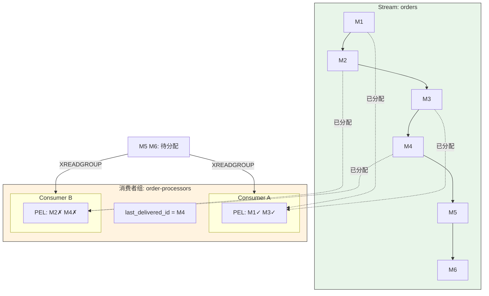
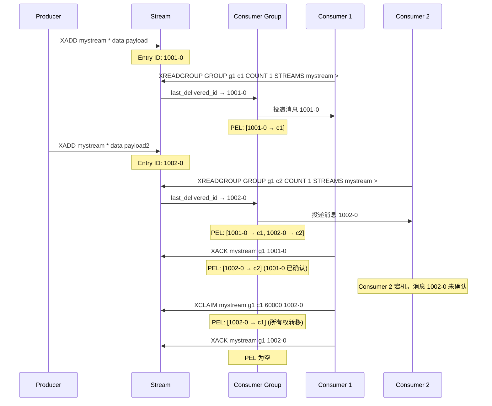
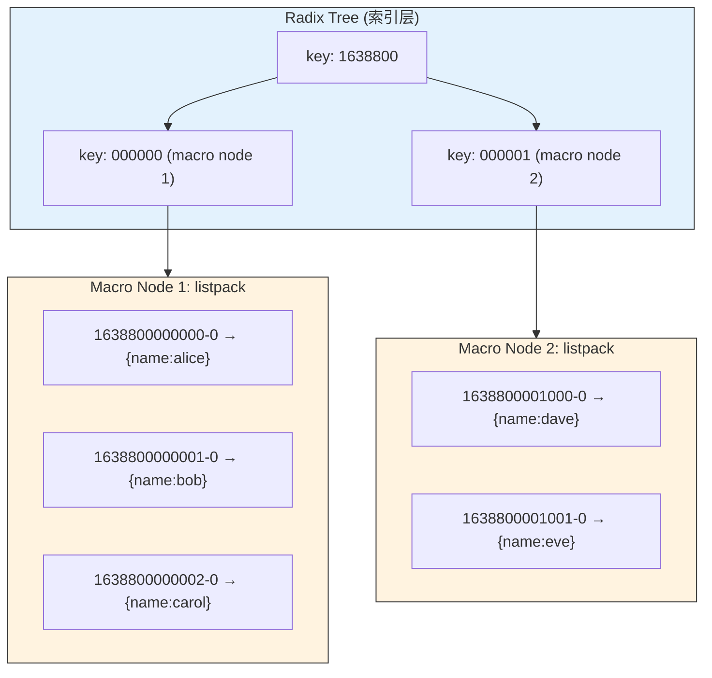
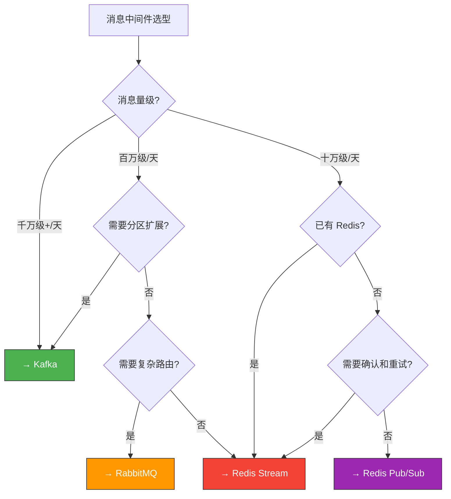
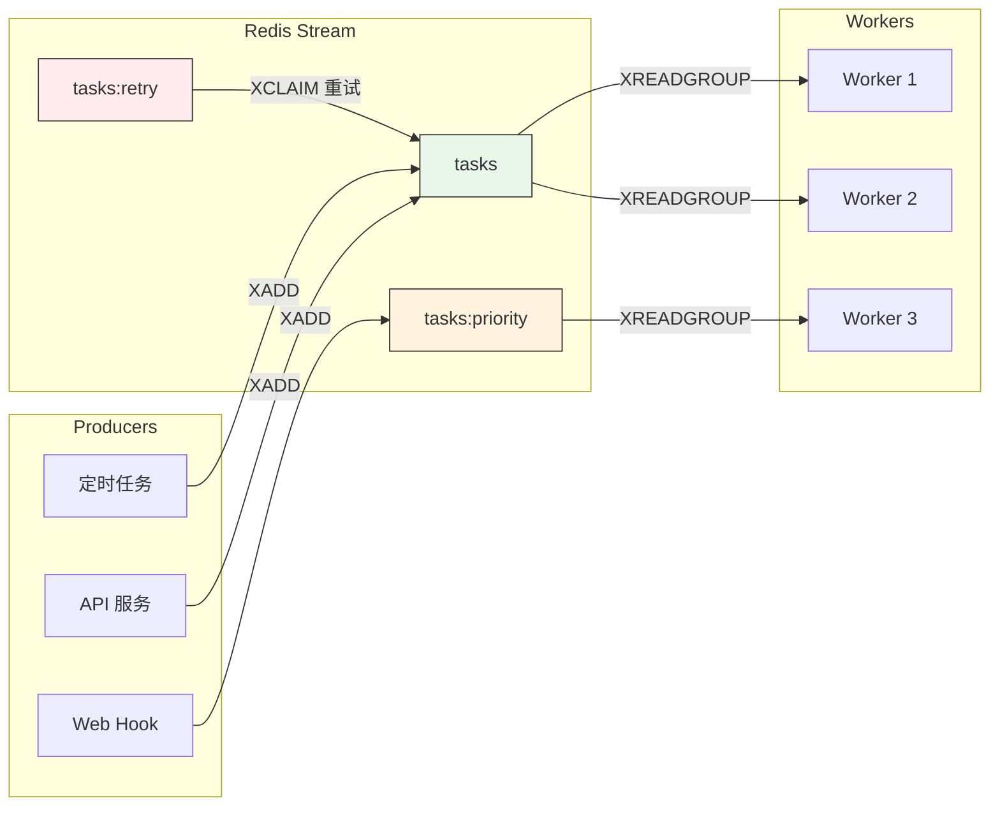
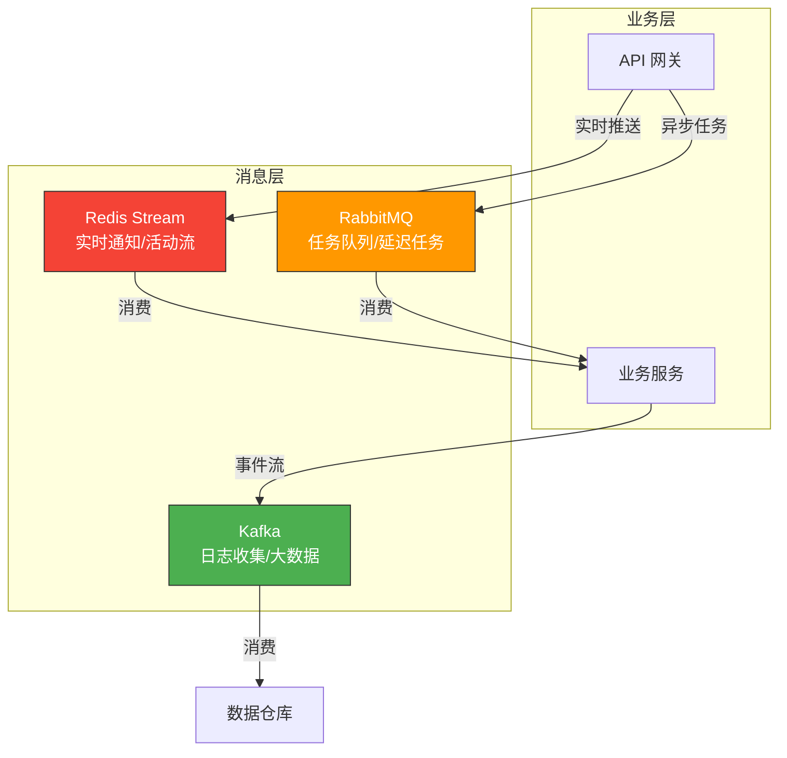

# 发布订阅与 Stream

Redis 提供了两种消息传递模型：经典的 **Pub/Sub（发布订阅）** 和 Redis 5.0 引入的 **Stream**。前者轻量高效但不持久化，后者则是 Redis 对消息队列的正式回答 —— 支持持久化、消费者组、消息确认，足以在许多场景替代专业消息中间件。

::: tip 本章导航
1. Pub/Sub 模式 —— 命令、模式匹配、局限性
2. Redis Stream 详解 —— 命令全集、消费者组、消息确认
3. Stream vs Kafka vs RabbitMQ —— 选型决策树
4. 实战场景 —— 消息队列、活动流、通知系统
:::

---

## 一、Pub/Sub 模式

### 1.1 核心思想

Pub/Sub 是最经典的**发布-订阅**解耦模型：

- **发布者（Publisher）** 将消息推送到频道（Channel）
- **订阅者（Subscriber）** 监听频道，收到消息时触发回调
- 发布者和订阅者**完全解耦** —— 彼此不知道对方的存在



### 1.2 核心命令

#### SUBSCRIBE —— 订阅频道

```bash
# 订阅一个或多个频道
SUBSCRIBE channel1 channel2 channel3

# 订阅后进入订阅状态，只能执行 SUBSCRIBE/UNSUBSCRIBE/PSUBSCRIBE/PUNSUBSCRIBE/PING
```

订阅后客户端进入**订阅模式**，只能接收消息和执行有限的命令。

#### PUBLISH —— 发布消息

```bash
# 向频道发布消息，返回值是接收到该消息的订阅者数量
PUBLISH channel1 "hello world"
# 返回: (integer) 2  → 有 2 个订阅者收到了消息
```

#### UNSUBSCRIBE —— 取消订阅

```bash
# 取消指定频道的订阅
UNSUBSCRIBE channel1 channel2

# 不带参数则取消所有频道订阅
UNSUBSCRIBE
```

#### PSUBSCRIBE —— 模式匹配订阅

```bash
# 使用 glob 风格的模式匹配
PSUBSCRIBE news.*        # 匹配 news.sport, news.tech, news.finance
PSUBSCRIBE user.*.login  # 匹配 user.1001.login, user.admin.login
PSUBSCRIBE log:*         # 匹配 log:error, log:warn, log:info

# 支持的通配符:
# ?  → 匹配一个字符
# *  → 匹配零个或多个字符
# [...] → 匹配指定范围内的字符
```

#### PUNSUBSCRIBE —— 取消模式订阅

```bash
PUNSUBSCRIBE news.*
PUNSUBSCRIBE              # 取消所有模式订阅
```

#### PUBSUB —— 查看订阅状态

```bash
# 查看活跃频道（至少有一个订阅者）
PUBSUB CHANNELS
PUBSUB CHANNELS news.*    # 带模式过滤

# 查看频道的订阅者数量
PUBSUB NUMSUB channel1 channel2
# 返回:
# 1) "channel1"
# 2) (integer) 3
# 3) "channel2"
# 4) (integer) 1

# 查看模式订阅的数量
PUBSUB NUMPAT
# 返回: (integer) 5  → 有 5 个活跃的模式订阅
```

### 1.3 频道与模式匹配的交互

一个客户端可以**同时**订阅精确频道和模式：

```bash
# 终端 1: 同时订阅精确频道和模式
SUBSCRIBE news.sport
PSUBSCRIBE news.*

# 终端 2: 发布消息
PUBLISH news.sport " Ronaldo scores!"

# 终端 1 会收到两条消息:
# 1. 来自 SUBSCRIBE 的精确匹配
# 2. 来自 PSUBSCRIBE 的模式匹配
```

::: warning 重复接收
当消息同时匹配精确订阅和模式订阅时，客户端会收到**两份消息**。这是 Redis Pub/Sub 的设计行为，业务代码需要做好幂等处理。
:::

### 1.4 消息格式

订阅者收到的消息是一个数组：

```
// 精确订阅收到的消息格式:
1) "message"           // 消息类型
2) "channel1"          // 频道名
3) "hello world"       // 消息内容

// 模式订阅收到的消息格式:
1) "pmessage"          // 模式消息类型
2) "news.*"            // 匹配的模式
3) "news.sport"        // 实际频道名
4) "Ronaldo scores!"   // 消息内容
```

### 1.5 Pub/Sub 工作原理



Redis 内部维护两个数据结构：

| 数据结构 | 类型 | 说明 |
|---|---|---|
| `pubsub_channels` | `dict<channel, list<client*>>` | 频道 → 订阅客户端列表 |
| `pubsub_patterns` | `list<pattern, client*>` | 模式 → 订阅客户端链表 |

当执行 `PUBLISH` 时：
1. 在 `pubsub_channels` 中查找频道对应的客户端列表，逐一推送
2. 遍历 `pubsub_patterns`，对每个模式执行 `stringmatchlen()` 匹配，匹配则推送

::: info 性能提示
模式匹配使用**线性遍历**，模式数量过多时 PUBLISH 性能会下降。生产环境中应控制模式订阅数量，或改用 Stream。
:::

### 1.6 Pub/Sub 局限性

这是 Pub/Sub 最被诟病的地方，也是 Stream 诞生的直接原因：



::: important 核心结论
Pub/Sub 是**即时消息广播**机制，不是消息队列。如果你的场景需要以下任何一个特性，请使用 Stream：
- 消息持久化
- 消费者组 / 竞争消费
- 消息确认与重试
- 历史消息回溯
:::

### 1.7 Pub/Sub 典型应用

尽管有局限，Pub/Sub 在以下场景仍然非常实用：

```bash
# 场景 1: 实时通知（聊天室、在线状态）
PUBLISH chat:room:1001 "Alice: Hello everyone!"
PUBLISH presence:user:1001 "online"

# 场景 2: 缓存失效通知
PUBLISH cache:invalidate "user:1001"
# 所有应用节点收到通知后删除本地缓存

# 场景 3: 配置变更推送
PUBLISH config:updated "feature_flag_x=true"

# 场景 4: Redis Sentinel 之间的通信
# Sentinel 使用 Pub/Sub 实现:
# - 主观下线/客观下线通知
# - 领导者选举
# - 配置变更传播
```

---

## 二、Redis Stream 详解

### 2.1 Stream 是什么

Redis 5.0（2018 年 10 月）引入 Stream，这是一个**追加写入（append-only）**的日志数据结构，设计灵感来自 Kafka 的分区日志模型：

- **持久化**：消息写入 AOF/RDB，重启不丢失
- **消费者组**：支持竞争消费，每条消息只被组内一个消费者处理
- **消息确认**：消费者处理完必须 XACK，未确认的消息可以重新投递
- **历史回溯**：可以按 ID 范围查询历史消息
- **自动清理**：XTRIM/XADD MAXLEN 控制日志长度



### 2.2 Entry ID —— 消息的唯一标识

每条 Stream 消息有一个全局唯一的 ID，格式为 `<millisecondsTime>-<sequenceNumber>`：

```
1638800000000-0    # 毫秒时间戳 - 序列号
1638800000000-1    # 同一毫秒内的第二条消息
1638800000001-0    # 下一毫秒
```

::: tip ID 规则
- ID **必须递增** —— 后写入的消息 ID 必须大于已有消息
- 使用 `*` 让 Redis 自动生成 ID（推荐）
- 手动指定 ID 的场景：从外部系统迁移数据时保持原始顺序
:::

### 2.3 核心命令

#### XADD —— 写入消息

```bash
# 基本写入，自动生成 ID
XADD mystream * name alice age 30
# 返回: "1638800000000-0"

# 限制 Stream 最大长度（近似裁剪，性能更好）
XADD mystream MAXLEN ~ 1000 * name bob age 25
# ~ 表示近似裁剪，Redis 可能保留稍多于 1000 条消息
# 精确裁剪用 MAXLEN 1000（但会阻塞，不推荐高频使用）

# 限制 Stream 精确长度（Redis 7.0+ 推荐 MINID）
XADD mystream MINID ~ 1638800000000-0 * name carol age 28
# 删除 ID 小于指定值的最旧消息

# 手动指定 ID
XADD mystream 1638800000005-0 name dave age 35
```

::: warning MAXLEN vs MINID
- `MAXLEN ~ 1000`：保留最新的约 1000 条消息，按**数量**裁剪
- `MINID ~ <id>`：删除比指定 ID 更旧的消息，按**时间**裁剪（Redis 7.0+）
- 生产环境推荐 **MINID**，因为按时间裁剪更直观、更可控
:::

#### XLEN —— 查看消息数量

```bash
XLEN mystream
# 返回: (integer) 5
```

#### XRANGE / XREVRANGE —— 范围查询

```bash
# 查询所有消息
XRANGE mystream - +
# - 表示最小 ID，+ 表示最大 ID

# 按时间范围查询
XRANGE mystream 1638800000000 1638800000005
# 注意: 时间戳部分会被自动补 -0

# 限制返回数量（分页）
XRANGE mystream - + COUNT 2

# 精确查询某条消息
XRANGE mystream 1638800000003-0

# 反向范围查询（从新到旧）
XREVRANGE mystream + - COUNT 10
```

分页查询模式：

```bash
# 第一页
XRANGE mystream - + COUNT 100
# 假设最后一条 ID 是 1638800000099-0

# 第二页（从上一页最后一条 ID 的下一个开始）
XRANGE mystream (1638800000099-0 + COUNT 100
# 注意: 括号表示开区间，不包含该 ID
```

#### XREAD —— 非阻塞读取

```bash
# 从指定 ID 开始读取（比 ID 更新的消息）
XREAD COUNT 10 STREAMS mystream 1638800000000-0
# 注意: 只返回比指定 ID 更新的消息

# 从最新消息开始读取（$ 表示当前最大 ID）
XREAD COUNT 10 STREAMS mystream $

# 阻塞等待新消息（类似 BLPOP）
XREAD BLOCK 5000 COUNT 10 STREAMS mystream $
# BLOCK 5000: 最多阻塞 5000 毫秒
# 收到新消息或超时后返回

# 同时读取多个 Stream
XREAD COUNT 10 STREAMS stream1 stream2 stream3 0-0 0-0 0-0
```

::: important XREAD vs XRANGE
- `XRANGE`：按 ID 范围查询，适合浏览历史消息
- `XREAD`：从指定 ID 之后读取，适合消费新消息，支持阻塞等待
- `XREAD` 不涉及消费者组，每条消息会被所有调用者读到
:::

#### XTRIM —— 裁剪 Stream

```bash
# 按最大长度裁剪（近似）
XTRIM mystream MAXLEN ~ 1000

# 按最小 ID 裁剪（Redis 7.0+）
XTRIM mystream MINID = 1638800000000-0

# 精确裁剪（不推荐，会阻塞）
XTRIM mystream MAXLEN = 1000
```

#### XDEL —— 删除消息

```bash
XDEL mystream 1638800000003-0 1638800000004-0
# 返回: (integer) 2  → 成功删除 2 条
```

::: warning XDEL 不会释放内存
XDEL 只是在 radix tree 节点中标记删除，并不会立即回收内存。只有通过 XTRIM 或 XADD MAXLEN 才会真正释放底层的宏节点（macro node）。
:::

### 2.4 消费者组（Consumer Group）

消费者组是 Stream 的核心特性，它让多个消费者**协作处理**同一个 Stream 中的消息：



消费者组维护三个关键信息：

| 字段 | 说明 |
|---|---|
| `last_delivered_id` | 已投递给该组的最大消息 ID，新消费者从这里继续 |
| `PEL (Pending Entries List)` | 已投递但未确认的消息列表 |
| `consumers` | 组内消费者列表，每个消费者有自己的 PEL |

#### XGROUP CREATE —— 创建消费者组

```bash
# 创建消费者组，从 Stream 最早的消息开始消费
XGROUP CREATE mystream mygroup 0

# 从最新消息开始消费（只消费创建后的新消息）
XGROUP CREATE mystream mygroup $

# 从指定 ID 开始消费
XGROUP CREATE mystream mygroup 1638800000003-0

# MKSTREAM: 如果 Stream 不存在则自动创建
XGROUP CREATE newstream mygroup 0 MKSTREAM
```

#### XGROUP 其他管理命令

```bash
# 创建新消费者（通常不需要，XREADGROUP 会自动创建）
XGROUP CREATECONSUMER mystream mygroup consumer1

# 删除消费者（其未确认消息会转移到组内其他消费者的 PEL）
XGROUP DELCONSUMER mystream mygroup consumer1

# 销毁消费者组
XGROUP DESTROY mystream mygroup

# 设置组的 last_delivered_id（跳过或回退消费位置）
XGROUP SETID mystream mygroup 1638800000005-0
XGROUP SETID mystream mygroup $   # 跳到最新
```

#### XREADGROUP —— 组内消费

```bash
# 消费未读消息
XREADGROUP GROUP mygroup consumer1 COUNT 1 STREAMS mystream >
# > 表示只读取尚未投递给该组的新消息

# 消费未确认的消息（重新投递）
XREADGROUP GROUP mygroup consumer1 COUNT 10 STREAMS mystream 0
# 0（或任何有效 ID）表示读取投递给当前消费者但未确认的消息

# 阻塞等待新消息
XREADGROUP GROUP mygroup consumer1 BLOCK 5000 STREAMS mystream >
```

::: important ">" vs "0"
- `>`：读取**新消息**（尚未投递给该组的消息）
- `0`：读取**未确认消息**（已投递给当前消费者但未 XACK 的消息）
- 这是 Stream 消费者组最核心的两个概念，务必理解！
:::

#### XACK —— 确认消息

```bash
# 确认一条消息
XACK mystream mygroup 1638800000003-0

# 确认多条消息
XACK mystream mygroup 1638800000003-0 1638800000004-0 1638800000005-0

# 返回值是成功确认的消息数量
# (integer) 3
```

消息确认后从消费者的 PEL 中移除，但消息本身仍在 Stream 中（除非 XTRIM/XDEL）。

#### XPENDING —— 查看待处理消息

```bash
# 查看消费者组的待处理消息概览
XPENDING mystream mygroup
# 返回:
# 1) (integer) 3        # 待处理消息总数
# 2) "1638800000001-0"  # 最小 ID
# 3) "1638800000005-0"  # 最大 ID
# 4) 1) 1) "consumer1"   # 消费者名
#       2) "2"           # 该消费者的待处理数
#    2) 1) "consumer2"
#       2) "1"

# 查看详细的待处理消息列表
XPENDING mystream mygroup - + 10
# 每条消息返回: [ID, consumer, idle_time, delivery_count]

# 只看某个消费者的待处理消息
XPENDING mystream mygroup - + 10 consumer1
```

#### XCLAIM —— 转移消息所有权

当一个消费者长时间未确认消息时，可以将消息转移给其他消费者：

```bash
# 将 idle 时间超过 60000ms 的未确认消息转移给 consumer2
XCLAIM mystream mygroup consumer2 60000 1638800000001-0
# 60000 = 最小空闲时间（毫秒）
# 最后是消息 ID（可以多个）

# 转移所有超时消息
XPENDING mystream mygroup - + 10 consumer1
# 找到超时消息的 ID，然后 XCLAIM

# XCLAIM 高级选项
XCLAIM mystream mygroup consumer2 60000 1638800000001-0 \
    RETRYCOUNT 3     # 设置重试次数
    FORCE            # 强制转移，不检查 idle 时间
    JUSTID           # 只返回 ID，不返回完整消息
```

#### XAUTOCLAIM —— 自动转移（Redis 7.0+）

```bash
# 自动扫描并转移超时消息，比 XCLAIM + XPENDING 更高效
XAUTOCLAIM mystream mygroup consumer2 60000 - COUNT 10
# - 表示从最小 ID 开始扫描
# 返回: [next_start_id, [messages...], [deleted_ids...]]
```

#### XINFO —— 查看 Stream 详细信息

```bash
# Stream 整体信息
XINFO STREAM mystream
# 返回: length, radix-tree-keys, radix-tree-nodes, groups, ...
# Redis 7.0+ 还会返回: first-entry, last-entry, max-deleted-entry-id

# 消费者组列表
XINFO GROUPS mystream

# 指定组的消费者列表
XINFO CONSUMERS mystream mygroup
# 返回每个消费者的: name, pending, idle, inactive (Redis 7.0+)
```

### 2.5 Stream 消息流转完整生命周期



### 2.6 Stream 内部存储结构

Redis Stream 底层使用 **Radix Tree（基数树）** + **listpack（紧凑列表）** 的两层结构：



| 层次 | 数据结构 | 作用 |
|---|---|---|
| Radix Tree | 压缩前缀树 | 按 Entry ID 快速定位宏节点，O(log n) 查找 |
| listpack | 紧凑内存列表 | 每个宏节点包含多条消息，顺序存储，内存紧凑 |

::: tip 宏节点大小
默认每个宏节点约 4096 字节或 2048 条消息（取先到者）。可以通过 `XADD` 的 `NOMKSTREAM` 选项和合理设置 MAXLEN 来控制内存使用。
:::

---

## 三、Stream 完整实战示例

### 3.1 订单处理系统

```bash
# 1. 创建 Stream 和消费者组
XGROUP CREATE orders order-processors 0 MKSTREAM
XGROUP CREATE orders order-analytics 0 MKSTREAM

# 2. 生产者写入订单
XADD orders * order_id ORD-001 user_id U-1001 amount 199.90 status created
XADD orders * order_id ORD-002 user_id U-1002 amount 59.00 status created
XADD orders * order_id ORD-003 user_id U-1001 amount 399.00 status created

# 3. 处理组消费
XREADGROUP GROUP order-processors worker-1 COUNT 1 STREAMS orders >
# 返回: ORD-001

XREADGROUP GROUP order-processors worker-2 COUNT 1 STREAMS orders >
# 返回: ORD-002

# 4. worker-1 处理完成，确认消息
XACK orders order-processors <ORD-001的ID>

# 5. 分析组消费（独立消费，不受处理组影响）
XREADGROUP GROUP order-analytics analyst-1 COUNT 10 STREAMS orders >
# 返回: ORD-001, ORD-002, ORD-003（全部消息）

# 6. 查看待处理消息
XPENDING orders order-processors

# 7. 处理超时消息（转移给 worker-1）
XCLAIM orders order-processors worker-1 30000 <ORD-002的ID>
```

### 3.2 Python 消费者实现

```python
import redis
import time
import json

r = redis.Redis(host='localhost', port=6379, decode_responses=True)

STREAM = 'orders'
GROUP = 'order-processors'
CONSUMER = f'worker-{id}'

def process_order(msg_id, fields):
    """处理订单的业务逻辑"""
    order_id = fields.get('order_id')
    amount = float(fields.get('amount', 0))
    print(f"Processing order {order_id}, amount={amount}")
    # ... 业务逻辑 ...

def consume():
    while True:
        # 1. 尝试消费新消息
        messages = r.xreadgroup(
            GROUP, CONSUMER,
            {STREAM: '>'},
            count=10,
            block=5000
        )

        if messages:
            for stream, msgs in messages:
                for msg_id, fields in msgs:
                    try:
                        process_order(msg_id, fields)
                        # 2. 处理成功，确认消息
                        r.xack(STREAM, GROUP, msg_id)
                    except Exception as e:
                        print(f"Error processing {msg_id}: {e}")
                        # 消息留在 PEL 中，等待重试

        # 3. 定期检查并接管超时消息
        claim_pending_messages()

def claim_pending_messages():
    """接管超时未确认的消息"""
    pending = r.xpending_range(
        STREAM, GROUP,
        min='-', max='+',
        count=10
    )

    for p in pending:
        # idle 时间超过 60 秒的消息
        if p['time_since_delivered'] > 60000:
            claimed = r.xclaim(
                STREAM, GROUP, CONSUMER,
                min_idle_time=60000,
                message_ids=[p['message_id']]
            )
            for msg_id, fields in claimed:
                try:
                    process_order(msg_id, fields)
                    r.xack(STREAM, GROUP, msg_id)
                except Exception as e:
                    print(f"Retry failed for {msg_id}: {e}")

if __name__ == '__main__':
    consume()
```

### 3.3 .NET 消费者实现

```csharp
using StackExchange.Redis;
using System;
using System.Threading;
using System.Threading.Tasks;

public class StreamConsumer
{
    private readonly ConnectionMultiplexer _connection;
    private readonly IDatabase _db;
    private const string StreamKey = "orders";
    private const string GroupName = "order-processors";
    private const string ConsumerName = "worker-1";

    public StreamConsumer(ConnectionMultiplexer connection)
    {
        _connection = connection;
        _db = connection.GetDatabase();
    }

    public async Task StartAsync(CancellationToken ct = default)
    {
        // 确保消费者组存在
        try
        {
            await _db.StreamCreateConsumerGroupAsync(StreamKey, GroupName, "0-0");
        }
        catch (RedisServerException ex) when (ex.Message.Contains("BUSYGROUP"))
        {
            // 消费者组已存在，忽略
        }

        while (!ct.IsCancellationRequested)
        {
            // 消费新消息
            var messages = await _db.StreamReadGroupAsync(
                StreamKey, GroupName, ConsumerName, ">", count: 10
            );

            foreach (var entry in messages)
            {
                try
                {
                    ProcessOrder(entry);
                    await _db.StreamAcknowledgeAsync(StreamKey, GroupName, entry.Id);
                }
                catch (Exception ex)
                {
                    Console.WriteLine($"Error processing {entry.Id}: {ex.Message}");
                    // 消息留在 PEL 中
                }
            }

            // 没有消息时短暂等待
            if (messages.Length == 0)
            {
                await Task.Delay(1000, ct);
            }
        }
    }

    private void ProcessOrder(StreamEntry entry)
    {
        var orderId = entry["order_id"];
        var amount = entry["amount"];
        Console.WriteLine($"Processing order {orderId}, amount={amount}");
    }
}
```

---

## 四、Stream vs Kafka vs RabbitMQ

### 4.1 功能对比

| 特性 | Redis Stream | Kafka | RabbitMQ |
|---|---|---|---|
| 持久化 | AOF/RDB | 磁盘日志 | 可选持久化 |
| 消费者组 | 原生支持 | 原生支持 | 插件支持 |
| 消息确认 | XACK | Offset Commit | ACK |
| 消息回溯 | XRANGE | 按 Offset | 不支持 |
| 分区 | 单分片（需手动分片） | 多分区 | 队列分片 |
| 吞吐量 | 10-50 万/s | 100 万+/s | 10-50 万/s |
| 延迟 | 亚毫秒 | 毫秒级 | 毫秒级 |
| 运维复杂度 | 低 | 高 | 中 |
| 内存占用 | 受限于 Redis 内存 | 磁盘为主 | 可控 |
| 消息保留 | MAXLEN/MINID | 按时间/大小 | 消费后删除 |
| 消息顺序 | Stream 内有序 | 分区内有序 | 队列内有序 |

### 4.2 选型决策树



### 4.3 Stream vs Kafka 详细对比

#### 相似点

- 都采用**追加写入日志**模型
- 都支持**消费者组**和**竞争消费**
- 都支持**消息回溯**和**范围查询**
- 消息都有**唯一递增 ID**

#### 关键差异

| 维度 | Redis Stream | Kafka |
|---|---|---|
| 存储引擎 | 内存为主（可 AOF 持久化） | 磁盘日志（PageCache + 零拷贝） |
| 分区模型 | 单分区 | 多分区（Partition） |
| 水平扩展 | 需要手动分 Stream 到不同节点 | 自动分区 Rebalance |
| 消息保留 | MAXLEN 限制条数 | log.retention.hours/bytes |
| 生态 | Redis 生态，轻量 | Kafka Connect/Streams/ksqlDB |
| 适用规模 | 中小规模 | 大规模 |
| 运维成本 | 极低 | 高（ZooKeeper/KRaft + Broker） |

::: tip 什么时候选 Stream 而不是 Kafka
1. **已有 Redis 基础设施**，不想引入新组件
2. **消息量在可控范围**（单 Stream 日均百万级以内）
3. **需要低延迟**（亚毫秒级）
4. **轻量级场景**：通知、活动流、短任务队列
5. **快速原型验证**，后续再迁移 Kafka
:::

### 4.4 Stream vs RabbitMQ 对比

| 维度 | Redis Stream | RabbitMQ |
|---|---|---|
| 模型 | 日志追加 | 队列路由（Exchange → Queue） |
| 路由 | 简单（Stream 名） | 灵活（Direct/Fanout/Topic/Headers） |
| 消息确认 | XACK | ACK/NACK/Reject |
| 死信队列 | 需手动实现 | DLX 原生支持 |
| 延迟消息 | 不原生支持 | 延迟插件 |
| 协议 | Redis 协议 | AMQP 0-9-1 / AMQP 1.0 |
| 消息大小 | 建议 < 1MB | 支持大消息 |

::: tip 什么时候选 Stream 而不是 RabbitMQ
1. 需要**消息回溯**（RabbitMQ 消费后即删除）
2. 需要**轻量级消费者组**
3. 已有 Redis，不想增加运维负担
4. 不需要复杂路由和死信队列
:::

---

## 五、Stream 应用场景

### 5.1 消息队列



```bash
# 任务队列
XADD tasks * type email to user@example.com subject "Welcome"
XADD tasks * type sms to +8613800138000 body "验证码: 123456"
XADD tasks * type push to device-abc title "新消息"

# 优先队列（单独 Stream）
XADD tasks:priority * type payment orderId ORD-001 amount 9999

# 消费者组
XGROUP CREATE tasks task-workers 0 MKSTREAM
XGROUP CREATE tasks:priority priority-workers 0 MKSTREAM
```

### 5.2 活动流（Activity Feed）

```bash
# 用户发布动态
XADD feed:user:1001 * type post content "今天天气真好" timestamp 1638800000

# 关注者的 feed 聚合
# 方案 1: 写扩散（Push）—— 发布时写入所有粉丝的 feed
XADD feed:timeline:user:2001 * type post from 1001 content "今天天气真好"
XADD feed:timeline:user:2002 * type post from 1001 content "今天天气真好"

# 方案 2: 读扩散（Pull）—— 读取时聚合关注者的 Stream
# 粉丝读取时 XREAD 多个关注者的 feed，合并排序
```

::: important 写扩散 vs 读扩散
- **写扩散**：发布时写入所有粉丝 timeline，读时直接读取，适合粉丝数少的场景
- **读扩散**：发布时只写自己的 feed，读时合并多个 feed，适合大 V 场景
- **混合方案**：小用户写扩散，大 V 读扩散，这是 Instagram 的方案
:::

### 5.3 通知系统

```bash
# 系统通知
XADD notify:system * type maintenance title "系统维护通知" content "今晚 2:00-4:00 维护"

# 用户通知
XADD notify:user:1001 * type order orderId ORD-001 status shipped
XADD notify:user:1001 * type like postId P-5001 from U-2001

# 消费者组 —— 通知推送服务
XGROUP CREATE notify:user:1001 push-service 0 MKSTREAM

# 实时推送（WebSocket + Stream）
# 前端通过 WebSocket 订阅，后端 XREADGROUP BLOCK 等待
```

### 5.4 数据变更捕获（CDC）

```bash
# 数据库 Binlog → Redis Stream
XADD cdc:mysql:users * op UPDATE table users id 1001 field name value "Alice"
XADD cdc:mysql:orders * op INSERT table orders id ORD-001 amount 199.90

# 下游服务消费 CDC 流
XGROUP CREATE cdc:mysql:users search-indexer 0 MKSTREAM
XGROUP CREATE cdc:mysql:users cache-invalidator 0 MKSTREAM
XGROUP CREATE cdc:mysql:orders analytics-service 0 MKSTREAM
```

---

## 六、Stream 生产级最佳实践

### 6.1 Stream 长度控制

```bash
# 方案 1: XADD 时自动裁剪（推荐）
XADD mystream MAXLEN ~ 10000 * field value
# ~ 近似裁剪，不阻塞，性能最优

# 方案 2: 定时 XTRIM
# 配合 crontab 每分钟执行
XTRIM mystream MAXLEN ~ 10000

# 方案 3: Redis 7.0+ 按时间裁剪
XADD mystream MINID ~ 1638800000000-0 * field value
# 删除比指定 ID 更旧的消息
```

::: warning 不要使用精确裁剪
`MAXLEN = 10000`（不带 `~`）会遍历整个 Stream 来精确计算数量，消息量大时严重阻塞。始终使用近似裁剪 `~`。
:::

### 6.2 消费者健康检查

```python
import redis
import time

r = redis.Redis(decode_responses=True)

def check_consumer_health(stream, group):
    """检查消费者组健康状况"""
    info = r.xinfo_consumers(stream, group)

    for consumer in info:
        name = consumer['name']
        pending = consumer['pending']
        idle = consumer['idle']  # 毫秒

        print(f"Consumer: {name}")
        print(f"  Pending: {pending}")
        print(f"  Idle: {idle}ms")

        if pending > 100:
            print(f"  ⚠️  积压消息过多: {pending}")
        if idle > 300000:  # 5 分钟
            print(f"  ⚠️  消费者可能已宕机，idle={idle}ms")

        # 自动接管超时消息
        if idle > 60000 and pending > 0:
            pending_msgs = r.xpending_range(
                stream, group, min='-', max='+',
                count=pending, consumername=name
            )
            msg_ids = [p['message_id'] for p in pending_msgs]
            if msg_ids:
                claimed = r.xclaim(stream, group, 'health-checker',
                                   min_idle_time=60000,
                                   message_ids=msg_ids)
                print(f"  转移了 {len(claimed)} 条超时消息")
```

### 6.3 消费幂等性

```python
def process_message_idempotent(msg_id, fields):
    """幂等消费：使用 msg_id 作为去重键"""
    # 方案 1: Redis SET 去重
    key = f"processed:{msg_id}"
    if r.set(key, "1", nx=True, ex=86400):
        # 首次处理
        do_business_logic(fields)
        r.xack(STREAM, GROUP, msg_id)
    else:
        # 重复消息，直接确认
        r.xack(STREAM, GROUP, msg_id)

    # 方案 2: 数据库唯一索引去重
    # INSERT ... ON DUPLICATE KEY IGNORE
```

### 6.4 消费者组初始化模式

```python
def ensure_consumer_group(stream, group, start_id='0'):
    """确保消费者组存在，幂等初始化"""
    try:
        r.xgroup_create(stream, group, start_id, mkstream=True)
        print(f"Created group '{group}' on stream '{stream}'")
    except redis.ResponseError as e:
        if 'BUSYGROUP' in str(e):
            print(f"Group '{group}' already exists")
        else:
            raise
```

### 6.5 优雅关闭

```python
import signal
import sys

running = True

def signal_handler(sig, frame):
    global running
    print("Shutting down gracefully...")
    running = False

signal.signal(signal.SIGINT, signal_handler)
signal.signal(signal.SIGTERM, signal_handler)

def consume_with_graceful_shutdown():
    while running:
        messages = r.xreadgroup(
            GROUP, CONSUMER,
            {STREAM: '>'},
            count=10,
            block=2000  # 短超时，频繁检查 running 标志
        )

        for stream, msgs in messages:
            for msg_id, fields in msgs:
                process_and_ack(msg_id, fields)

    # 退出前处理完 PEL 中的消息
    process_remaining_pel()
```

### 6.6 多 Stream 扇出模式

```bash
# 一个生产者 → 多个 Stream（不同用途）
XADD orders * order_id ORD-001 amount 199.90
XADD orders:audit * order_id ORD-001 action create user system
XADD orders:notification * order_id ORD-001 event created

# 或者使用 Lua 脚本保证原子性
EVAL "
redis.call('XADD', KEYS[1], '*', 'order_id', ARGV[1], 'amount', ARGV[2])
redis.call('XADD', KEYS[2], '*', 'order_id', ARGV[1], 'action', 'create')
return 1
" 2 orders orders:audit ORD-001 199.90
```

---

## 七、Stream 与 RabbitMQ 选型指南

### 7.1 场景分析

| 场景 | 推荐 | 原因 |
|---|---|---|
| 简单任务队列 | Redis Stream | 轻量、低延迟 |
| 多消费者组 | Redis Stream | 原生消费者组 |
| 复杂路由 | RabbitMQ | Exchange 路由模型 |
| 死信处理 | RabbitMQ | DLX 原生支持 |
| 延迟消息 | RabbitMQ | 延迟插件 |
| 消息回溯 | Redis Stream | XRANGE 范围查询 |
| 大规模流处理 | Kafka | 分区 + 高吞吐 |
| 事件溯源 | Redis Stream | 持久化日志 + 回溯 |
| 微服务解耦 | RabbitMQ | 协议标准、生态成熟 |

### 7.2 混合架构示例



---

## 八、常见问题与排错

### 8.1 消费者组消息积压

```bash
# 查看积压情况
XINFO GROUPS mystream
# 关注: pending 字段 → 未确认消息数

XPENDING mystream mygroup - + 10
# 查看 PEL 中的消息详情

# 解决方案 1: 增加消费者
XGROUP CREATECONSUMER mystream mygroup new-worker

# 解决方案 2: 转移超时消息
XCLAIM mystream mygroup active-worker 30000 <pending-id>

# 解决方案 3: Redis 7.0+ 自动转移
XAUTOCLAIM mystream mygroup active-worker 30000 - COUNT 100
```

### 8.2 NOGROUP 错误

```
NOGROUP No such key 'mystream' or consumer group 'mygroup'
```

原因：Stream 或消费者组不存在。

```bash
# 解决: 创建消费者组（MKSTREAM 自动创建 Stream）
XGROUP CREATE mystream mygroup 0 MKSTREAM
```

### 8.3 消息 ID 冲突

```
ERR The ID specified in XADD is equal or smaller than the target stream top item
```

原因：手动指定的 ID 不大于 Stream 中最大的 ID。

```bash
# 查看当前最大 ID
XINFO STREAM mystream

# 解决: 使用更大的 ID，或使用 * 自动生成
XADD mystream * field value
```

### 8.4 Stream 占用内存过大

```bash
# 查看 Stream 内存信息
XINFO STREAM mystream
# 关注: length, radix-tree-keys, radix-tree-nodes

# 查看 Redis 整体内存
MEMORY USAGE mystream

# 解决: 设置 MAXLEN
XADD mystream MAXLEN ~ 10000 * field value

# 紧急清理
XTRIM mystream MAXLEN ~ 10000
```

### 8.5 消费者假死

```python
# 检测消费者假死: idle 时间过长 + 有未确认消息
def detect_zombie_consumers(stream, group, threshold_ms=120000):
    consumers = r.xinfo_consumers(stream, group)
    zombies = []

    for c in consumers:
        if c['idle'] > threshold_ms and c['pending'] > 0:
            zombies.append(c)

    return zombies

# 处理: 转移消息后删除消费者
for zombie in zombies:
    pending = r.xpending_range(
        stream, group, min='-', max='+',
        count=zombie['pending'], consumername=zombie['name']
    )
    msg_ids = [p['message_id'] for p in pending]
    r.xclaim(stream, group, 'recover-worker',
             min_idle_time=threshold_ms, message_ids=msg_ids)
    r.xgroup_delconsumer(stream, group, zombie['name'])
```

---

## 九、Redis 7.0+ Stream 新特性

### 9.1 XAUTOCLAIM

```bash
# 自动扫描并转移超时消息，一步到位
XAUTOCLAIM mystream mygroup consumer2 60000 - COUNT 25
# 返回:
# 1) next-start-id (下次扫描的起始 ID)
# 2) 消息列表
# 3) 已删除的 ID 列表（消息已被 XDEL）

# 相比 XPENDING + XCLAIM 两步操作，XAUTOCLAIM 更高效
```

### 9.2 XINFO 改进

```bash
# Redis 7.0 新增字段
XINFO STREAM mystream
# max-deleted-entry-id: 最大已删除 ID
# entries-added: 总共写入的消息数
# recorded-first-entry-id: 记录的第一条消息 ID

XINFO CONSUMERS mystream mygroup
# inactive: 消费者最后一次成功读取的时间（比 idle 更有意义）
```

### 9.3 MINID 裁剪

```bash
# 按时间裁剪，比 MAXLEN 更直观
XADD mystream MINID ~ 1638800000000-0 * field value
# 删除 ID 小于指定值的消息

# 结合时间戳计算
import time
cutoff = int(time.time() * 1000) - 86400000  # 24 小时前
XADD mystream MINID ~ {cutoff}-0 * field value
```

### 9.4 NOMKSTREAM 选项

```bash
# 如果 Stream 不存在则不创建，返回 nil
XADD mystream NOMKSTREAM * field value
# 防止拼写错误的 Stream 名创建多余的 key
```

---

## 十、总结

### 10.1 Pub/Sub vs Stream 速查

| 维度 | Pub/Sub | Stream |
|---|---|---|
| 持久化 | 无 | AOF/RDB |
| 消费者组 | 无 | 有 |
| 消息确认 | 无 | XACK |
| 历史回溯 | 无 | XRANGE |
| 消息保留 | 发完即焚 | MAXLEN/MINID |
| 适用场景 | 实时广播、缓存失效 | 消息队列、活动流、事件溯源 |
| Redis 版本 | 2.0+ | 5.0+ |

### 10.2 关键命令速查

```bash
# Stream 写入
XADD key MAXLEN ~ 10000 * field value

# Stream 读取
XRANGE key - + COUNT 10
XREAD COUNT 10 BLOCK 5000 STREAMS key $

# 消费者组
XGROUP CREATE key group 0 MKSTREAM
XREADGROUP GROUP group consumer COUNT 10 STREAMS key >
XACK key group msg_id

# 运维
XPENDING key group - + 10
XCLAIM key group new_consumer min_idle_time msg_id
XTRIM key MAXLEN ~ 10000
XINFO STREAM key
```

### 10.3 最佳实践清单

::: tip Stream 生产环境 Checklist
- [ ] 使用 `MAXLEN ~` 或 `MINID ~` 控制 Stream 长度
- [ ] 消费者组初始化使用 `MKSTREAM` 保证幂等
- [ ] 消费逻辑必须**幂等**（msg_id 去重）
- [ ] 实现超时消息转移（XCLAIM/XAUTOCLAIM）
- [ ] 监控 PEL 长度和消费者 idle 时间
- [ ] 消费者优雅关闭，处理完 PEL 再退出
- [ ] 使用 `NOMKSTREAM` 防止误创建 Stream
- [ ] 单条消息不超过 1MB
- [ ] 不在主库上做大量 XRANGE 全量扫描
:::

---

> **参考来源**
> - Redis 官方文档: [Streams](https://redis.io/docs/data-types/streams/)
> - Redis 官方文档: [Pub/Sub](https://redis.io/docs/interact/pubsub/)
> - Redis 5.0 Release Notes: Stream 引入
> - Redis 7.0 Release Notes: XAUTOCLAIM、MINID
> - 《Redis 设计与实现》—— 黄健宏
> - Kafka 官方文档: [Design](https://kafka.apache.org/documentation/#design)
> - RabbitMQ 官方文档: [Concepts](https://www.rabbitmq.com/tutorials)
