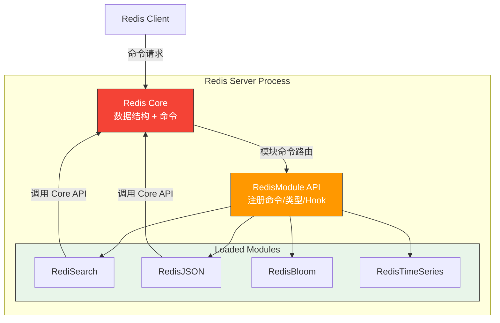
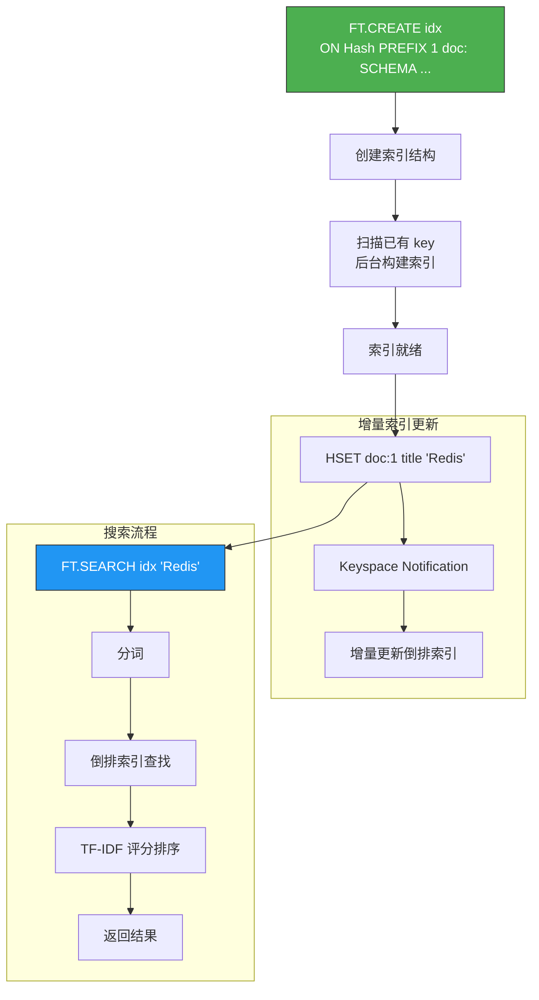
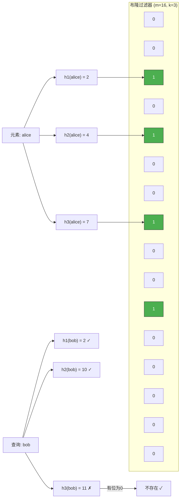
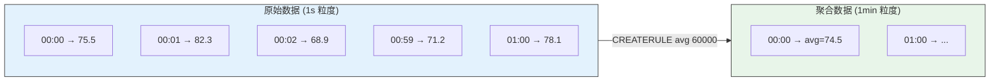
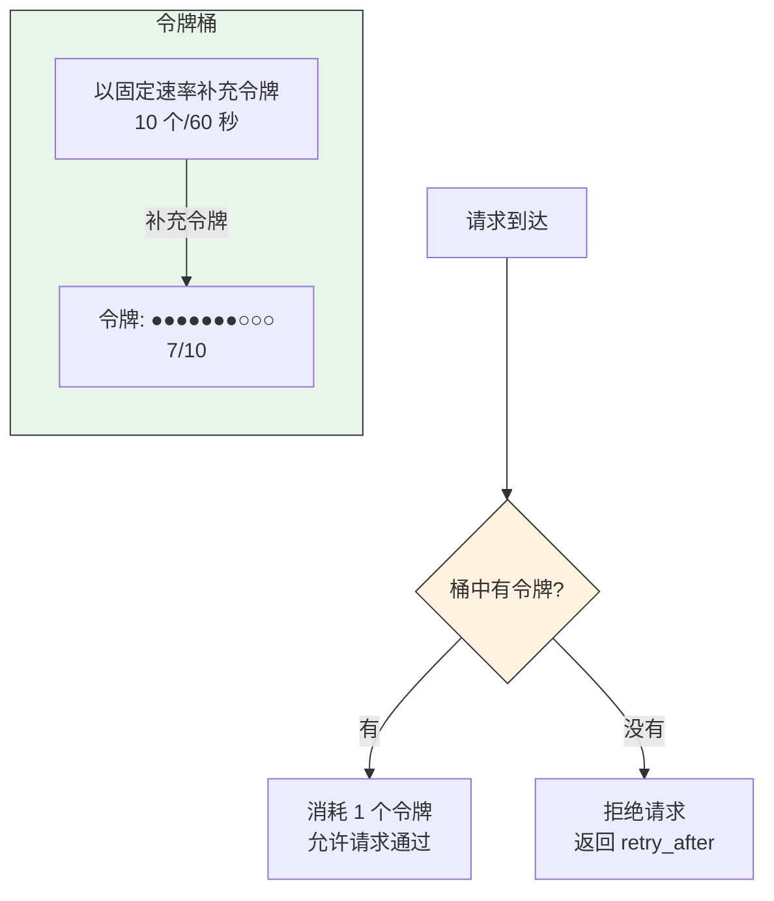
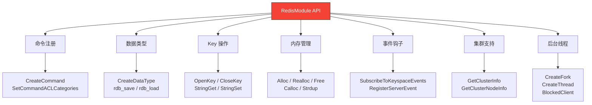
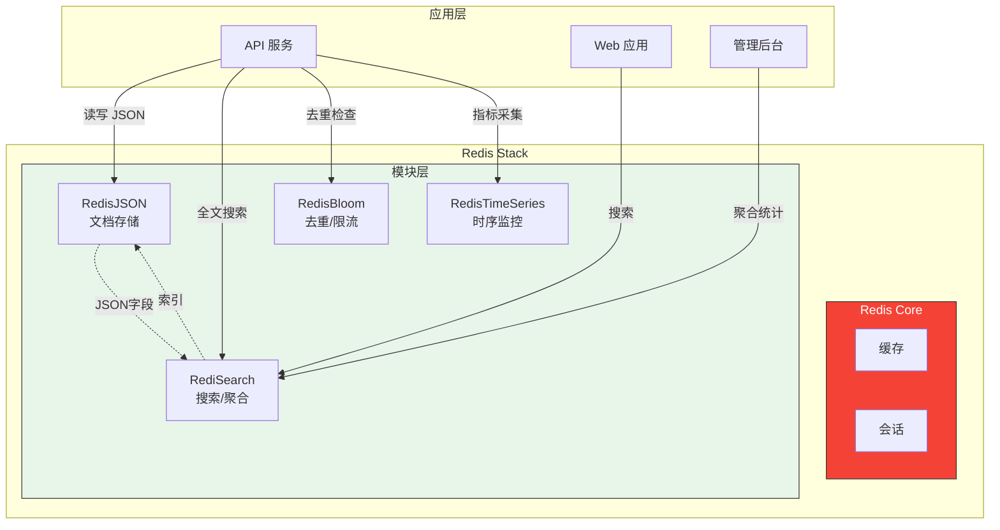

# 模块与扩展

Redis 4.0（2017 年）引入了**模块系统（Modules）**，允许开发者用 C 语言编写扩展，在 Redis 进程内加载运行，像使用原生命令一样调用模块功能。这彻底改变了 Redis 的边界 —— 从纯缓存/数据库演化为**数据平台**。

本章介绍 Redis 生态中最有价值的六大模块，以及模块开发的基础知识。

::: tip 本章导航
1. Redis 模块系统 —— 原理、加载、API
2. RediSearch —— 全文搜索
3. RedisJSON —— 文档存储
4. RedisBloom —— 概率数据结构
5. RedisTimeSeries —— 时序数据库
6. RedisCell —— 限流
7. 模块开发入门
:::

---

## 一、Redis 模块系统

### 1.1 为什么需要模块

Redis 核心保持着**极简哲学** —— 只做通用的数据结构。但现实需求往往超出核心能力：

| 需求 | 核心能否解决 | 模块方案 |
|---|---|---|
| 全文搜索 | SORT + SSCAN，极慢 | RediSearch |
| JSON 文档存储 | Hash 模拟，无法嵌套 | RedisJSON |
| 布隆过滤器 | SET + SISMEMBER，内存大 | RedisBloom |
| 时序数据 | Sorted Set，功能弱 | RedisTimeSeries |
| 限流 | Lua 脚本实现 | RedisCell |

模块让 Redis 在**不膨胀核心**的前提下，按需扩展能力。

### 1.2 模块工作原理



模块在 Redis 进程内运行，共享同一块内存空间：

- **注册命令**：模块通过 `RedisModule_CreateCommand()` 注册新命令
- **注册数据类型**：模块可以定义全新的数据类型（type）
- **Hook 事件**：模块可以监听 key 过期、删除等事件
- **调用 Core API**：模块可以操作 Redis 核心数据结构

::: important 模块的隔离性
模块运行在 Redis 进程内，与核心共享内存。一个模块的 Bug（如内存泄漏、段错误）可能导致整个 Redis 实例崩溃。因此生产环境务必选择**成熟稳定**的模块，并充分测试。
:::

### 1.3 加载模块

```bash
# 方式 1: redis.conf 配置（推荐，重启自动加载）
loadmodule /usr/lib/redis/modules/redisearch.so
loadmodule /usr/lib/redis/modules/rejson.so
loadmodule /usr/lib/redis/modules/redisbloom.so

# 方式 2: 命令行启动参数
redis-server --loadmodule /usr/lib/redis/modules/redisearch.so

# 方式 3: 运行时加载
MODULE LOAD /usr/lib/redis/modules/redisearch.so

# 查看已加载模块
MODULE LIST
# 返回:
# 1) name=redisearch, ver=20803, api=1, filters=0, usedby=[], using=[], options=[]
# 2) name=rejson, ver=20304, api=1, filters=0, usedby=[], using=[], options=[]

# 卸载模块（可能不安全）
MODULE UNLOAD redisearch
```

### 1.4 Docker 加载模块

```bash
# Redis Stack（包含所有官方模块的发行版）
docker run -d --name redis-stack \
    -p 6379:6379 -p 8001:8001 \
    redis/redis-stack:latest

# Redis Stack Server（无 RedisInsight）
docker run -d --name redis-stack-server \
    -p 6379:6379 \
    redis/redis-stack-server:latest

# 自定义模块加载
docker run -d --name redis-with-modules \
    -v /path/to/modules:/modules \
    redis:7.0 \
    redis-server --loadmodule /modules/redisearch.so \
                 --loadmodule /modules/rejson.so
```

### 1.5 RedisModule API 核心功能

| API 类别 | 函数示例 | 说明 |
|---|---|---|
| 命令注册 | `RedisModule_CreateCommand()` | 注册新命令及回调函数 |
| 数据类型 | `RedisModule_CreateDataType()` | 定义自定义数据类型 |
| Key 操作 | `RedisModule_OpenKey()` | 打开/创建 key |
| 内存管理 | `RedisModule_Alloc()` | 模块内存分配（Redis 跟踪） |
| Reply | `RedisModule_ReplyWithString()` | 向客户端返回结果 |
| 事件钩子 | `RedisModule_SubscribeToKeyspaceEvents()` | 监听键空间通知 |
| 定时器 | `RedisModule_CreateTimer()` | 创建定时回调 |
| 集群 | `RedisModule_GetClusterInfo()` | 获取集群信息 |

---

## 二、RediSearch —— 全文搜索引擎

### 2.1 简介

RediSearch 是 Redis Labs 开发的全文搜索引擎模块，提供：

- **全文搜索**：分词、倒排索引、TF-IDF/BM25 评分
- **二级索引**：对 Hash/JSON 字段建立索引
- **聚合查询**：GROUP BY、SORT、COUNT、SUM 等
- **中文分词**：支持中文全文搜索（需 Friso 分词器）
- **地理搜索**：支持半径/矩形范围查询

### 2.2 索引构建流程



### 2.3 创建索引

```bash
# 基本索引创建
FT.CREATE idx:products ON Hash PREFIX 1 product: SCHEMA
    title TEXT WEIGHT 2.0
    description TEXT
    price NUMERIC
    category TAG
    created_at NUMERIC SORTABLE

# JSON 文档索引
FT.CREATE idx:articles ON JSON PREFIX 1 article: SCHEMA
    $.title AS title TEXT WEIGHT 3.0
    $.content AS content TEXT
    $.author AS author TAG
    $.tags[*] AS tags TAG
    $.views AS views NUMERIC SORTABLE
    $.created_at AS created_at NUMERIC SORTABLE

# 中文索引（需加载 Friso 分词器）
FT.CREATE idx:chinese ON Hash PREFIX 1 cn: SCHEMA
    title TEXT PHONETIC dm:zh
    content TEXT PHONETIC dm:zh

# 查看索引信息
FT.INFO idx:products

# 删除索引
FT.DROPINDEX idx:products
FT.DROPINDEX idx:products DD  # 同时删除关联的文档
```

::: important 索引设计要点
1. **PREFIX**：只索引指定前缀的 key，避免全库扫描
2. **WEIGHT**：权重越高，搜索结果中排名越靠前
3. **SORTABLE**：标记字段可排序，会额外维护有序集合
4. **TAG**：用于精确匹配，不支持全文搜索
5. **NUMERIC**：数值字段，支持范围过滤
:::

### 2.4 写入文档

```bash
# Hash 文档
HSET product:1 title "Redis实战" description "深入理解Redis" price 79.90 category "数据库" created_at 1638800000
HSET product:2 title "Redis入门指南" description "Redis基础知识" price 49.90 category "数据库" created_at 1638800100
HSET product:3 title "Python编程" description "Python3从入门到精通" price 89.90 category "编程语言" created_at 1638800200

# JSON 文档
JSON.SET article:1 $ '{"title":"Redis Stream详解","content":"Redis 5.0引入了Stream","author":"alice","tags":["redis","stream"],"views":1200,"created_at":1638800000}'
JSON.SET article:2 $ '{"title":"Redis集群实战","content":"Redis Cluster部署与运维","author":"bob","tags":["redis","cluster"],"views":800,"created_at":1638800100}'
```

### 2.5 搜索查询

```bash
# 基本全文搜索
FT.SEARCH idx:products "Redis"
# 返回: 总数 + 匹配文档列表

# 多词搜索（AND）
FT.SEARCH idx:products "Redis 实战"

# OR 搜索
FT.SEARCH idx:products "Redis|Python"

# 精确短语搜索
FT.SEARCH idx:products '"Redis实战"'

# 模糊搜索
FT.SEARCH idx:products "%%Redis%%"

# 前缀搜索
FT.SEARCH idx:products "Red*"

# 数值过滤
FT.SEARCH idx:products "Redis" FILTER price 50 100

# TAG 过滤
FT.SEARCH idx:products "*" FILTER category "数据库"

# 组合过滤
FT.SEARCH idx:products "Redis" FILTER price 0 100 FILTER category "数据库"

# 排序
FT.SEARCH idx:products "Redis" SORTBY price ASC

# 分页
FT.SEARCH idx:products "Redis" LIMIT 0 10

# 返回指定字段
FT.SEARCH idx:products "Redis" RETURN 2 title price

# 高亮
FT.SEARCH idx:products "Redis" HIGHLIGHT FIELDS title TAGS <b> </b>

# 摘要
FT.SEARCH idx:products "Redis" SUMMARIZE FIELDS description LEN 50
```

### 2.6 聚合查询

```bash
# 基本聚合 —— 按分类统计
FT.AGGREGATE idx:products "*" GROUPBY 1 @category REDUCE COUNT 0 AS count

# 按分类计算平均价格
FT.AGGREGATE idx:products "*" GROUPBY 1 @category \
    REDUCE COUNT 0 AS count \
    REDUCE AVG 1 @price AS avg_price \
    REDUCE MIN 1 @price AS min_price \
    REDUCE MAX 1 @price AS max_price

# 过滤 + 排序
FT.AGGREGATE idx:products "Redis" \
    GROUPBY 1 @category \
    REDUCE COUNT 0 AS count \
    SORTBY 2 @count DESC

# 数值范围分桶
FT.AGGREGATE idx:products "*" \
    APPLY "(@price<50)?'0-50':(@price<100)?'50-100':'100+'" AS price_range \
    GROUPBY 1 @price_range \
    REDUCE COUNT 0 AS count
```

### 2.7 RediSearch 实战：电商搜索

```python
import redis
from datetime import datetime

r = redis.Redis(decode_responses=True)

class ProductSearch:
    INDEX = "idx:products"
    PREFIX = "product:"

    @classmethod
    def create_index(cls):
        """创建索引"""
        try:
            r.ft(cls.INDEX).create_index((
                redis.commands.search.field.TextField("title", weight=3.0),
                redis.commands.search.field.TextField("description", weight=1.0),
                redis.commands.search.field.NumericField("price", sortable=True),
                redis.commands.search.field.TagField("category"),
                redis.commands.search.field.TagField("brand"),
                redis.commands.search.field.NumericField("created_at", sortable=True),
            ), prefix=cls.PREFIX)
        except redis.ResponseError as e:
            if "Index already exists" not in str(e):
                raise

    @classmethod
    def add_product(cls, product_id, title, description, price, category, brand):
        """添加商品"""
        key = f"{cls.PREFIX}{product_id}"
        r.hset(key, mapping={
            "title": title,
            "description": description,
            "price": price,
            "category": category,
            "brand": brand,
            "created_at": int(datetime.now().timestamp()),
        })

    @classmethod
    def search(cls, query, category=None, min_price=None, max_price=None,
               sort_by="price", sort_asc=True, page=0, page_size=10):
        """搜索商品"""
        q = redis.commands.search.query.Query(query)

        # 过滤条件
        filters = []
        if category:
            filters.append(redis.commands.search.query.TagFilter("category", category))
        if min_price is not None or max_price is not None:
            filters.append(redis.commands.search.query.NumericFilter(
                "price", min_price or 0, max_price or float('inf')
            ))

        for f in filters:
            q.add_filter(f)

        # 排序
        q.sort_by(sort_by, asc=sort_asc)

        # 分页
        q.paging(page * page_size, page_size)

        # 高亮
        q.highlight(tags=["<em>", "</em>"])

        return r.ft(cls.INDEX).search(q)
```

---

## 三、RedisJSON —— 文档存储

### 3.1 简介

RedisJSON 是 Redis 的 JSON 文档存储模块，支持：

- **完整 JSON 操作**：嵌套对象、数组、数值运算
- **JSONPath 查询**：按路径读写 JSON 子结构
- **与 RediSearch 集成**：对 JSON 字段建立索引和搜索
- **原子操作**：单线程保证 JSON 操作的原子性

### 3.2 核心命令

#### JSON.SET —— 设置 JSON

```bash
# 设置整个 JSON 文档
JSON.SET user:1 $ '{"name":"Alice","age":30,"address":{"city":"Beijing"},"hobbies":["reading","coding"]}'

# 设置嵌套字段
JSON.SET user:1 $.address.city '"Shanghai"'

# 设置数组元素
JSON.SET user:1 $.hobbies[0] '"swimming"'

# 条件设置（仅当 key 不存在时）
JSON.SET user:2 $ '{"name":"Bob"}' NX

# 条件设置（仅当 key 存在时）
JSON.SET user:1 $.age 31 XX
```

#### JSON.GET —— 获取 JSON

```bash
# 获取整个文档
JSON.GET user:1

# 获取指定路径
JSON.GET user:1 $.name
JSON.GET user:1 $.address.city

# 获取多个路径
JSON.GET user:1 $.name $.age $.address

# 获取所有匹配路径（递归）
JSON.GET user:1 $..city
```

#### JSON.TYPE —— 查看类型

```bash
JSON.TYPE user:1
# 返回: object

JSON.TYPE user:1 $.name
# 返回: string

JSON.TYPE user:1 $.hobbies
# 返回: array
```

#### JSON.NUMINCRBY —— 数值运算

```bash
# 原子递增
JSON.NUMINCRBY user:1 $.age 1
# 返回: [31]

# 批量递增（匹配多个路径）
JSON.NUMINCRBY user:1 $..score 10
```

#### 数组操作

```bash
# 追加元素
JSON.ARRAPPEND user:1 $.hobbies '"hiking"'
# 返回: [4]  → 数组长度变为 4

# 在指定位置插入
JSON.ARRINSERT user:1 $.hobbies 0 '"music"'

# 弹出元素
JSON.ARRPOP user:1 $.hobbies
# 返回: ["hiking"]

# 获取数组长度
JSON.ARRLEN user:1 $.hobbies

# 查找元素索引
JSON.ARRINDEX user:1 $.hobbies '"coding"'

# 裁剪数组（保留索引 1-2）
JSON.ARRTRIM user:1 $.hobbies 1 2
```

#### 对象操作

```bash
# 获取对象的所有 key
JSON.OBJKEYS user:1 $.address
# 返回: [["city"]]

# 获取对象长度
JSON.OBJLEN user:1

# 删除字段
JSON.DEL user:1 $.address
```

#### JSON.DEL —— 删除

```bash
# 删除指定路径
JSON.DEL user:1 $.hobbies

# 删除整个文档
JSON.DEL user:1
```

### 3.3 RedisJSON + RediSearch 联合实战

```bash
# 1. 创建 JSON 索引
FT.CREATE idx:users ON JSON PREFIX 1 user: SCHEMA
    $.name AS name TEXT WEIGHT 2.0
    $.age AS age NUMERIC SORTABLE
    $.address.city AS city TAG
    $.hobbies[*] AS hobbies TAG
    $.score AS score NUMERIC SORTABLE

# 2. 写入 JSON 文档
JSON.SET user:1 $ '{"name":"Alice","age":30,"address":{"city":"Beijing"},"hobbies":["reading","coding"],"score":85}'
JSON.SET user:2 $ '{"name":"Bob","age":25,"address":{"city":"Shanghai"},"hobbies":["coding","gaming"],"score":92}'
JSON.SET user:3 $ '{"name":"Carol","age":28,"address":{"city":"Beijing"},"hobbies":["reading","music"],"score":78}'

# 3. 搜索北京喜欢编程的用户
FT.SEARCH idx:users "coding" FILTER city "Beijing"

# 4. 按分数排序
FT.SEARCH idx:users "*" SORTBY score DESC

# 5. 聚合统计
FT.AGGREGATE idx:users "*" GROUPBY 1 @city REDUCE COUNT 0 AS count

# 6. 更新分数（索引自动同步）
JSON.NUMINCRBY user:1 $.score 5
FT.SEARCH idx:users "*" SORTBY score DESC
# Alice 的分数已更新为 90
```

### 3.4 .NET 中使用 RedisJSON

```csharp
using StackExchange.Redis;
using System.Text.Json;

public class RedisJsonService
{
    private readonly IDatabase _db;

    public RedisJsonService(ConnectionMultiplexer connection)
    {
        _db = connection.GetDatabase();
    }

    // 设置 JSON 文档
    public async Task SetAsync<T>(string key, T obj)
    {
        var json = JsonSerializer.Serialize(obj);
        await _db.ExecuteAsync("JSON.SET", key, "$", json);
    }

    // 获取 JSON 文档
    public async Task<T?> GetAsync<T>(string key)
    {
        var result = await _db.ExecuteAsync("JSON.GET", key, "$");
        if (result.IsNull) return default;

        var jsonArray = result.ToString();
        // JSON.GET $ 返回数组格式 [obj]
        var items = JsonSerializer.Deserialize<List<T>>(jsonArray);
        return items?.FirstOrDefault();
    }

    // 获取嵌套字段
    public async Task<T?> GetPathAsync<T>(string key, string path)
    {
        var result = await _db.ExecuteAsync("JSON.GET", key, path);
        if (result.IsNull) return default;

        var jsonArray = result.ToString();
        var items = JsonSerializer.Deserialize<List<T>>(jsonArray);
        return items?.FirstOrDefault();
    }

    // 数值递增
    public async Task<double> NumIncrByAsync(string key, string path, double value)
    {
        var result = await _db.ExecuteAsync("JSON.NUMINCRBY", key, path, value);
        var items = JsonSerializer.Deserialize<List<double>>(result.ToString());
        return items?.FirstOrDefault() ?? 0;
    }

    // 数组追加
    public async Task<long> ArrAppendAsync<T>(string key, string path, T item)
    {
        var json = JsonSerializer.Serialize(item);
        var result = await _db.ExecuteAsync("JSON.ARRAPPEND", key, path, json);
        return (long)result;
    }
}
```

---

## 四、RedisBloom —— 概率数据结构

### 4.1 布隆过滤器（Bloom Filter）

布隆过滤器是一种**空间高效**的概率数据结构，用于判断元素**是否可能在集合中**：

- 元素**不存在**：100% 确定（无假阴性）
- 元素**存在**：有一定误判率（假阳性，false positive）
- 不支持删除（Counting Bloom Filter 除外）



#### 核心命令

```bash
# 创建布隆过滤器（指定容量和误判率）
BF.RESERVE myfilter 0.001 1000000
# 0.001 = 期望误判率 0.1%
# 1000000 = 期望元素数量

# 添加元素
BF.ADD myfilter "alice"
BF.ADD myfilter "bob"

# 批量添加
BF.MADD myfilter "charlie" "dave" "eve"

# 查询元素是否存在
BF.EXISTS myfilter "alice"
# 返回: (integer) 1  → 可能存在

BF.EXISTS myfilter "unknown"
# 返回: (integer) 0  → 一定不存在

# 批量查询
BF.MEXISTS myfilter "alice" "bob" "unknown"
# 返回: 1) (integer) 1
#       2) (integer) 1
#       3) (integer) 0

# 查看布隆过滤器信息
BF.INFO myfilter
# 返回: Capacity, Size, Number of filters, Number of items inserted, Expansion rate
```

#### 布隆过滤器参数选择

| 元素数量 | 误判率 | 内存占用 | 哈希函数数 |
|---|---|---|---|
| 100 万 | 1% | ~1.2 MB | 7 |
| 100 万 | 0.1% | ~1.8 MB | 10 |
| 100 万 | 0.01% | ~2.4 MB | 14 |
| 1000 万 | 0.1% | ~18 MB | 10 |
| 1 亿 | 0.01% | ~240 MB | 14 |

::: tip 误判率与内存的关系
误判率每降低 10 倍，内存约增加 50%。选择误判率时要在**准确性和成本**之间取舍：
- 推荐去重：0.1% 即可
- 安全/金融场景：0.01% 或更低
:::

### 4.2 布隆过滤器实战场景

#### 场景 1：缓存穿透防护

```python
import redis

r = redis.Redis(decode_responses=True)

# 初始化布隆过滤器
try:
    r.bf().reserve('user:exists', 0.001, 10000000)
except redis.ResponseError:
    pass  # 已存在

# 加载所有合法用户 ID
for user_id in get_all_user_ids():
    r.bf().add('user:exists', user_id)

def get_user(user_id):
    # 先查布隆过滤器
    if not r.bf().exists('user:exists', user_id):
        return None  # 一定不存在，直接返回

    # 查缓存
    cache = r.get(f"user:{user_id}")
    if cache:
        return json.loads(cache)

    # 查数据库
    user = db.get_user(user_id)
    if user:
        r.setex(f"user:{user_id}", 3600, json.dumps(user))
    return user
```

#### 场景 2：URL 去重（爬虫）

```python
class UrlDeduplicator:
    def __init__(self, redis_client, capacity=10_000_000, error_rate=0.001):
        self.r = redis_client
        self.key = 'crawler:visited'
        try:
            self.r.bf().reserve(self.key, error_rate, capacity)
        except redis.ResponseError:
            pass

    def is_visited(self, url):
        return self.r.bf().exists(self.key, url)

    def mark_visited(self, url):
        self.r.bf().add(self.key, url)

    def crawl(self, url):
        if self.is_visited(url):
            return None  # 已访问过
        content = fetch(url)
        self.mark_visited(url)
        return content
```

### 4.3 Cuckoo Filter（布谷鸟过滤器）

布谷鸟过滤器是布隆过滤器的升级版，**支持删除**：

```bash
# 创建布谷鸟过滤器
CF.RESERVE mycuckoo 1000000

# 添加元素
CF.ADD mycuckoo "alice"

# 查询
CF.EXISTS mycuckoo "alice"
# 返回: (integer) 1

# 删除元素（布隆过滤器做不到！）
CF.DEL mycuckoo "alice"

CF.EXISTS mycuckoo "alice"
# 返回: (integer) 0
```

| 特性 | Bloom Filter | Cuckoo Filter |
|---|---|---|
| 删除 | 不支持 | 支持 |
| 误判率 | 可配置 | 可配置 |
| 内存效率 | 较高 | 略低（但支持删除后更实用） |
| 查询性能 | O(k) 哈希 | O(1) ~ O(2) |
| 适用场景 | 只增不删 | 需要动态删除 |

### 4.4 Count-Min Sketch

Count-Min Sketch 用于**频率统计**，近似计数：

```bash
# 创建
CMS.INITBYPROB mycms 0.001 0.01

# 增加计数
CMS.INCRBY mycms alice 1 bob 3 alice 2

# 查询频率（可能偏高，不会偏低）
CMS.QUERY mycms alice
# 返回: (integer) 3  → 实际是 3，近似值

CMS.QUERY mycms bob
# 返回: (integer) 3
```

### 4.5 Top-K

Top-K 用于维护**出现频率最高的 K 个元素**：

```bash
# 创建 Top-K 结构
TOPK.RESERVE mytopk 10 50 4 0.9
# 10 = 保留前 10 个
# 50, 4, 0.9 = 内部参数（宽度、深度、衰减率）

# 添加元素
TOPK.ADD mytopk alice bob alice carol alice bob dave

# 查询 Top-K
TOPK.LIST mytopk
# 返回: alice bob carol

# 查询元素是否在 Top-K 中
TOPK.QUERY mytopk alice bob unknown
# 返回: 1) (integer) 1
#       2) (integer) 1
#       3) (integer) 0
```

---

## 五、RedisTimeSeries —— 时序数据库

### 5.1 简介

RedisTimeSeries 是 Redis 的时序数据模块，专为**时间序列**数据设计：

- 高效的时间序列存储和查询
- **降采样（Downsampling）**：自动聚合历史数据
- **标签（Labels）**：支持按标签过滤和聚合
- **规则（Rules）**：自动将数据聚合到另一个时间序列

### 5.2 核心命令

```bash
# 创建时间序列（带标签和保留策略）
TS.CREATE cpu:usage:server1 LABELS host server1 metric cpu type usage
TS.CREATE cpu:usage:server2 LABELS host server2 metric cpu type usage

# 设置保留时间（毫秒）
TS.CREATE cpu:usage:server1 RETENTION 86400000 LABELS host server1 metric cpu
# 86400000 = 24 小时

# 添加数据点
TS.ADD cpu:usage:server1 1638800000000 75.5
TS.ADD cpu:usage:server1 1638800001000 82.3
TS.ADD cpu:usage:server1 * 68.9  # 使用当前时间戳

# 批量添加
TS.MADD cpu:usage:server1 1638800002000 71.2 cpu:usage:server2 1638800002000 55.8

# 查询范围
TS.RANGE cpu:usage:server1 1638800000000 1638800010000
# 带聚合
TS.RANGE cpu:usage:server1 1638800000000 1638800010000 AGGREGATION avg 60000
# 每 60 秒的平均值

# 按标签查询
TS.MRANGE 1638800000000 1638800010000 FILTER metric=cpu
TS.MRANGE 1638800000000 1638800010000 AGGREGATION avg 60000 FILTER metric=cpu GROUPBY host REDUCE avg

# 获取最新值
TS.GET cpu:usage:server1

# 查询信息
TS.INFO cpu:usage:server1
```

### 5.3 降采样规则

```bash
# 创建原始数据序列
TS.CREATE cpu:raw LABELS host server1 metric cpu

# 创建 1 分钟聚合序列
TS.CREATE cpu:1min LABELS host server1 metric cpu aggregation 1min

# 创建降采样规则：每 60 秒取平均值
TS.CREATERULE cpu:raw cpu:1min AGGREGATION avg 60000

# 添加原始数据，自动触发聚合
TS.ADD cpu:raw 1638800000000 75.5
TS.ADD cpu:raw 1638800010000 82.3
TS.ADD cpu:raw 1638800020000 68.9
# ... 到达 60 秒边界时，自动写入 cpu:1min

# 删除规则
TS.DELETERULE cpu:raw cpu:1min
```



### 5.4 监控系统实战

```python
import redis
import time
import random

r = redis.Redis(decode_responses=True)

class MetricsCollector:
    """时序指标采集器"""

    def __init__(self):
        self._init_series()

    def _init_series(self):
        """初始化时间序列和降采样规则"""
        for host in ['server1', 'server2', 'server3']:
            raw_key = f"cpu:raw:{host}"
            min_key = f"cpu:1min:{host}"
            hour_key = f"cpu:1hour:{host}"

            try:
                r.ts().create(raw_key, retention_msecs=86400000,
                    labels={'host': host, 'metric': 'cpu', 'granularity': 'raw'})
                r.ts().create(min_key, retention_msecs=604800000,
                    labels={'host': host, 'metric': 'cpu', 'granularity': '1min'})
                r.ts().create(hour_key, retention_msecs=2592000000,
                    labels={'host': host, 'metric': 'cpu', 'granularity': '1hour'})

                # 降采样规则
                r.ts().createrule(raw_key, min_key, aggregation_type='avg',
                                  bucket_size_msec=60000)
                r.ts().createrule(min_key, hour_key, aggregation_type='avg',
                                  bucket_size_msec=3600000)
            except redis.ResponseError as e:
                if 'already exists' not in str(e).lower():
                    raise

    def collect(self):
        """采集指标"""
        for host in ['server1', 'server2', 'server3']:
            cpu_usage = random.uniform(30, 95)
            r.ts().add(f"cpu:raw:{host}", '*', cpu_usage)

    def get_dashboard_data(self, host, duration_ms=3600000):
        """获取仪表盘数据"""
        now = int(time.time() * 1000)
        start = now - duration_ms

        # 查询 1 分钟聚合数据
        data = r.ts().range(f"cpu:1min:{host}", start, now)
        return [(ts, float(val)) for ts, val in data]

    def alert_high_cpu(self, threshold=90):
        """CPU 超阈值告警"""
        for host in ['server1', 'server2', 'server3']:
            latest = r.ts().get(f"cpu:raw:{host}")
            if latest and float(latest[1]) > threshold:
                print(f"⚠️ {host} CPU {latest[1]}% > {threshold}%")
```

---

## 六、RedisCell —— 限流模块

### 6.1 简介

RedisCell 基于**令牌桶（Token Bucket）** 算法实现分布式限流，比 Lua 脚本方案更高效。

### 6.2 核心命令

```bash
# CL.THROTTLE key max_burst count_per_period period
# 返回:
#   1) (integer) 0/1    → 0=允许, 1=被限流
#   2) (integer) total   → 令牌桶总容量
#   3) (integer) remaining → 剩余令牌数
#   4) (integer) retry_after → 需要等待的毫秒数（被限流时）
#   5) (integer) reset_after → 令牌桶完全恢复的毫秒数

# 限制每 60 秒最多 10 次请求
CL.THROTTLE api:user:1001 10 10 60
# 1) (integer) 0    → 允许
# 2) (integer) 11   → 总容量 = max_burst + 1
# 3) (integer) 10   → 剩余 10 个令牌
# 4) (integer) -1   → 无需等待
# 5) (integer) 60000

# 快速消耗令牌
CL.THROTTLE api:user:1001 10 10 60  # 消耗第 2 个
CL.THROTTLE api:user:1001 10 10 60  # 消耗第 3 个
# ...
# 第 12 次调用时:
# 1) (integer) 1    → 被限流！
# 2) (integer) 11
# 3) (integer) 0    → 无令牌
# 4) (integer) 5234 → 等待 5.2 秒后重试
# 5) (integer) 60000
```

### 6.3 令牌桶算法原理



### 6.4 .NET 中使用 RedisCell

```csharp
public class RateLimiter
{
    private readonly IDatabase _db;

    public RateLimiter(ConnectionMultiplexer connection)
    {
        _db = connection.GetDatabase();
    }

    /// <summary>
    /// 限流检查
    /// </summary>
    /// <param name="key">限流键（如 api:user:1001）</param>
    /// <param name="maxBurst">最大突发量</param>
    /// <param name="count">周期内允许的请求数</param>
    /// <param name="periodSeconds">周期（秒）</param>
    /// <returns>是否允许</returns>
    public async Task<(bool allowed, long remaining, long retryAfterMs)> ThrottleAsync(
        string key, long maxBurst, long count, long periodSeconds)
    {
        var result = await _db.ExecuteAsync("CL.THROTTLE", key, maxBurst, count, periodSeconds);

        var results = (RedisResult[])result;
        var allowed = (long)results[0] == 0;
        var remaining = (long)results[2];
        var retryAfter = (long)results[3];

        return (allowed, remaining, retryAfter);
    }
}

// 使用示例
public class ApiController : ControllerBase
{
    private readonly RateLimiter _limiter;

    [HttpGet("api/data")]
    public async Task<IActionResult> GetData()
    {
        var userId = User.Identity.Name;
        var (allowed, remaining, retryAfter) = await _limiter.ThrottleAsync(
            $"api:user:{userId}", 10, 30, 60);

        if (!allowed)
        {
            Response.Headers.Add("Retry-After", retryAfter.ToString());
            return StatusCode(429, "请求过于频繁");
        }

        Response.Headers.Add("X-RateLimit-Remaining", remaining.ToString());
        return Ok(data);
    }
}
```

### 6.5 限流方案对比

| 方案 | 优点 | 缺点 | 适用场景 |
|---|---|---|---|
| RedisCell | 高性能、令牌桶 | 需安装模块 | 生产级 API 限流 |
| Lua + INCR | 无需模块 | 窗口限流，不平滑 | 简单计数限流 |
| Lua + Sorted Set | 滑动窗口 | 实现复杂 | 滑动窗口限流 |
| Redis + 令牌桶 Lua | 无需模块 | 实现复杂 | 自定义限流 |

---

## 七、模块开发入门

### 7.1 最简模块

```c
// hellomodule.c
#include "redismodule.h"
#include <stdlib.h>

// HELLO.GREET 命令实现
int HelloGreet_Command(RedisModuleCtx *ctx, RedisModuleString **argv, int argc) {
    if (argc != 2) {
        return RedisModule_WrongArity(ctx);
    }

    // 获取参数
    size_t len;
    const char *name = RedisModule_StringPtrLen(argv[1], &len);

    // 返回结果
    RedisModule_ReplyWithSimpleString(ctx, "Hello, welcome to Redis modules!");
    return REDISMODULE_OK;
}

// 模块初始化
int RedisModule_OnLoad(RedisModuleCtx *ctx, RedisModuleString **argv, int argc) {
    // 注册模块名和版本
    if (RedisModule_Init(ctx, "hellomodule", 1, REDISMODULE_APIVER_1)
        == REDISMODULE_ERR) {
        return REDISMODULE_ERR;
    }

    // 注册命令
    if (RedisModule_CreateCommand(ctx, "hello.greet",
        HelloGreet_Command, "readonly", 0, 0, 0) == REDISMODULE_ERR) {
        return REDISMODULE_ERR;
    }

    return REDISMODULE_OK;
}
```

### 7.2 编译与加载

```bash
# 编译
gcc -shared -fPIC -o hellomodule.so hellomodule.c \
    -I/path/to/redis/src

# 加载
redis-server --loadmodule ./hellomodule.so

# 测试
HELLO.GREET Alice
# 返回: Hello, welcome to Redis modules!
```

### 7.3 模块开发注意事项

::: warning 模块开发安全提醒
1. **内存安全**：使用 `RedisModule_Alloc/Realloc/Calloc/Free` 替代标准库函数，Redis 可追踪内存使用
2. **线程安全**：模块回调运行在 Redis 主线程，长时间阻塞操作会阻塞整个实例
3. **错误处理**：检查所有 API 返回值，避免空指针解引用
4. **RDB/AOF**：自定义数据类型必须实现 `rdb_save/rdb_load/aof_rewrite` 回调
5. **复制**：模块命令默认会被复制到从节点，确保命令是确定性的
:::

### 7.4 模块 API 分类



---

## 八、模块选型与生态总览

### 8.1 官方模块一览

| 模块 | 功能 | 适用场景 | 开源协议 |
|---|---|---|---|
| RediSearch | 全文搜索 + 二级索引 | 搜索、过滤、聚合 | Redis Source Available |
| RedisJSON | JSON 文档存储 | 文档型数据 | Redis Source Available |
| RedisBloom | 布隆/布谷鸟/Top-K | 去重、频率统计 | Redis Source Available |
| RedisTimeSeries | 时序数据库 | 监控、IoT | Redis Source Available |
| RedisCell | 令牌桶限流 | API 限流 | BSD |
| RedisGraph | 图数据库（已归档） | 图查询 | Redis Source Available |

::: important Redis Source Available License (RSAL)
Redis 官方模块从 2024 年起采用 RSALv2 + SSPLv1 双许可。这意味着：
- **开发/测试/内部使用**：免费
- **作为商业服务提供给第三方**：需要商业许可
- 自行部署给内部团队使用不受影响
:::

### 8.2 Redis Stack vs 单独模块

| 方式 | 优点 | 缺点 |
|---|---|---|
| Redis Stack | 一键安装、版本兼容 | 内存占用大、可能装了不需要的 |
| 单独编译加载 | 按需选择、轻量 | 需要自行解决版本兼容 |

```bash
# Redis Stack 包含的模块
redis-server --loadmodule redisearch.so \
             --loadmodule rejson.so \
             --loadmodule redisbloom.so \
             --loadmodule redistimeseries.so
```

### 8.3 模块组合架构



---

## 九、常见问题与排错

### 9.1 模块加载失败

```
(Module) Can't load module: /path/to/module.so: undefined symbol: ...
```

原因：模块编译时与 Redis 版本不兼容。

```bash
# 解决: 使用对应 Redis 版本的源码编译
# 或使用 Redis Stack 发行版
```

### 9.2 RediSearch 内存占用大

```bash
# 查看索引信息
FT.INFO idx:products

# 优化方案:
# 1. 减少索引字段（只索引需要搜索的字段）
# 2. 使用 NOINDEX 选项（只存储不索引）
# 3. 使用 PREFIX 减少索引范围
# 4. 适当设置 SKIPINITIALSCAN（不扫描已有数据）
FT.CREATE idx:products ON Hash PREFIX 1 product: SKIPINITIALSCAN SCHEMA ...
```

### 9.3 RedisJSON 与 RediSearch 版本兼容

```
Error: Could not load module RedisJSON: version mismatch
```

```bash
# 确保 RedisJSON 和 RediSearch 版本兼容
# 推荐使用 Redis Stack，版本已验证
# 手动组合时，查看兼容矩阵:
# https://redis.io/docs/stack/
```

### 9.4 布隆过滤器误判率过高

```bash
# 查看布隆过滤器信息
BF.INFO myfilter
# 关注: Capacity vs Number of items inserted

# 如果插入数量远超预期容量，误判率会升高
# 解决: 重建更大的布隆过滤器
BF.RESERVE myfilter_new 0.001 10000000
# 重新导入数据...
```

---

## 十、总结

### 10.1 模块选择速查表

| 需求 | 推荐模块 | 核心命令 |
|---|---|---|
| 全文搜索 | RediSearch | FT.CREATE / FT.SEARCH / FT.AGGREGATE |
| JSON 文档 | RedisJSON | JSON.SET / JSON.GET / JSON.ARRAPPEND |
| 元素去重 | RedisBloom (Bloom) | BF.ADD / BF.EXISTS / BF.RESERVE |
| 可删除去重 | RedisBloom (Cuckoo) | CF.ADD / CF.EXISTS / CF.DEL |
| 频率统计 | RedisBloom (CMS) | CMS.INCRBY / CMS.QUERY |
| Top-K | RedisBloom (TopK) | TOPK.ADD / TOPK.LIST |
| 时序监控 | RedisTimeSeries | TS.CREATE / TS.ADD / TS.RANGE |
| API 限流 | RedisCell | CL.THROTTLE |

### 10.2 最佳实践清单

::: tip 模块使用 Checklist
- [ ] 生产环境使用 **Redis Stack** 或官方编译版本
- [ ] 关注模块的 **RSAL 许可证**限制
- [ ] RediSearch 索引使用 **PREFIX** 限制范围
- [ ] RedisJSON 配合 RediSearch 使用时注意**版本兼容**
- [ ] 布隆过滤器预估好**容量和误判率**
- [ ] RedisTimeSeries 配置**降采样规则**和**保留时间**
- [ ] 模块命令在**集群模式**下注意跨 slot 问题
- [ ] 监控模块的**内存占用**和**性能指标**
- [ ] 新模块先在**测试环境**充分验证再上线
:::

---

> **参考来源**
> - Redis 官方文档: [Modules](https://redis.io/docs/modules/)
> - RediSearch 官方文档: [RediSearch](https://redis.io/docs/stack/search/)
> - RedisJSON 官方文档: [RedisJSON](https://redis.io/docs/stack/json/)
> - RedisBloom 官方文档: [RedisBloom](https://redis.io/docs/stack/bloom/)
> - RedisTimeSeries 官方文档: [RedisTimeSeries](https://redis.io/docs/stack/timeseries/)
> - RedisCell GitHub: [https://github.com/brandur/redis-cell](https://github.com/brandur/redis-cell)
> - Redis Module API 文档: [MODULE](https://redis.io/topics/modules-api-ref/)
