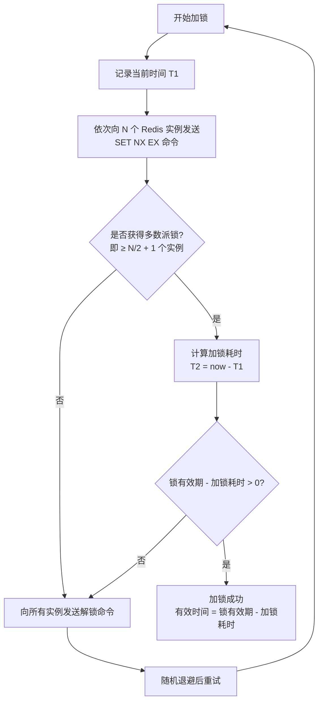
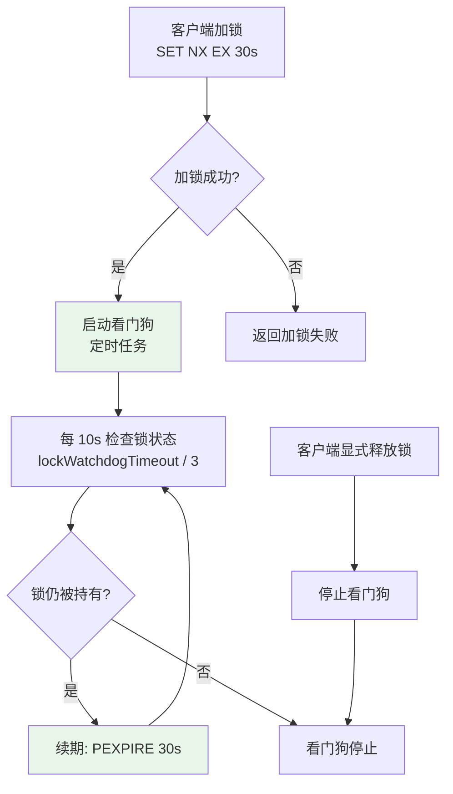

# 分布式锁详解

> 分布式锁是分布式系统中最常用的协调原语之一。从最简单的 SET NX EX 到 Redlock 多节点算法，从 Redisson 的看门狗续期到可重入锁的实现，分布式锁看似简单实则暗藏玄机。一个不正确的分布式锁实现可能导致数据丢失、重复执行、甚至死锁。本文将深入每一个细节，帮你写出生产级可用的分布式锁。

## 1. 单节点分布式锁

### 1.1 基本实现：SET NX EX

```text
分布式锁的基本要求：
┌─────────────────────────────────────────────────────────┐
│  1. 互斥性：同一时刻只有一个客户端持有锁                     │
│  2. 防死锁：锁必须能自动释放（超时机制）                     │
│  3. 防误删：只能删除自己持有的锁                             │
│  4. 高可用：锁服务尽可能可用                                 │
│  5. 可重入：同一线程可重复获取同一把锁                       │
└─────────────────────────────────────────────────────────┘

最简实现 —— SET NX EX：
  SET lock_key unique_value NX EX 30

  参数说明：
  - NX：Key 不存在时才设置（Not eXists），保证互斥
  - EX 30：设置 30 秒过期时间，防止死锁
  - unique_value：唯一标识，防止误删别人的锁

加锁流程：
  ┌──────────────────────────────────────────┐
  │  SET lock_key "uuid-123" NX EX 30        │
  │  ├── 返回 OK → 加锁成功                   │
  │  └── 返回 nil → Key已存在，加锁失败        │
  └──────────────────────────────────────────┘

解锁流程（必须用 Lua 脚本保证原子性）：
  ┌──────────────────────────────────────────┐
  │  if GET(lock_key) == unique_value then   │
  │      DEL lock_key                        │
  │      return 1                            │
  │  else                                    │
  │      return 0                            │
  │  end                                     │
  └──────────────────────────────────────────┘
```

### 1.2 为什么解锁必须用 Lua 脚本

```text
非原子解锁的危险场景：

时间线：
  ┌────────┐                     ┌──────────┐
  │ 客户端A │                     │  Redis    │
  └───┬────┘                     └────┬─────┘
      │  GET lock_key → "uuid-A"  │
      │◀──────────────────────────│
      │  判断：是我的锁 ✓          │
      │                            │
      │  ← 此时锁过期了！           │
      │  ← 客户端B 加锁成功         │
      │                            │
      │  DEL lock_key              │
      │──────────────────────────▶│  ← 删除了客户端B的锁！！！
      │                            │
      │  客户端B以为还持有锁        │
      │  客户端C也加锁成功          │
      │  → 两个客户端同时持有锁     │
      │  → 互斥性被破坏！           │

用 Lua 脚本解决：
  ┌──────────────────────────────────────────────────┐
  │  整个"判断+删除"在 Lua 脚本中原子执行               │
  │  脚本执行期间不会被其他命令打断                      │
  │  不存在"判断和删除之间锁过期"的窗口                  │
  └──────────────────────────────────────────────────┘
```

### 1.3 C# 基本实现

```csharp
// 基于 StackExchange.Redis 的基本分布式锁
public class SimpleRedisLock
{
    private readonly IDatabase _db;
    private readonly string _lockKey;
    private readonly string _lockValue;
    private readonly TimeSpan _expiry;

    // 释放锁的 Lua 脚本
    private static readonly LuaScript _releaseScript = LuaScript.Prepare(@"
        if redis.call('GET', KEYS[1]) == ARGV[1] then
            return redis.call('DEL', KEYS[1])
        else
            return 0
        end
    ");

    public SimpleRedisLock(
        IDatabase db, string lockKey, TimeSpan expiry)
    {
        _db = db;
        _lockKey = lockKey;
        _lockValue = Guid.NewGuid().ToString("N");
        _expiry = expiry;
    }

    /// <summary>
    /// 尝试获取锁
    /// </summary>
    public async Task<bool> TryAcquireAsync()
    {
        return await _db.StringSetAsync(
            _lockKey, _lockValue, _expiry, When.NotExists);
    }

    /// <summary>
    /// 尝试获取锁（带重试）
    /// </summary>
    public async Task<bool> TryAcquireAsync(
        TimeSpan timeout, TimeSpan retryInterval)
    {
        var deadline = DateTime.UtcNow + timeout;

        while (DateTime.UtcNow < deadline)
        {
            if (await TryAcquireAsync())
                return true;

            await Task.Delay(retryInterval);
        }

        return false;
    }

    /// <summary>
    /// 释放锁（原子操作）
    /// </summary>
    public async Task<bool> ReleaseAsync()
    {
        var result = await _db.ScriptEvaluateAsync(
            _releaseScript,
            new
            {
                KEYS = new RedisKey[] { _lockKey },
                ARGV = new RedisValue[] { _lockValue }
            });

        return (long)result == 1;
    }
}

// 使用示例
public class OrderService
{
    private readonly IDatabase _db;

    public async Task ProcessOrderAsync(string orderId)
    {
        var lockKey = $"order:lock:{orderId}";
        var redisLock = new SimpleRedisLock(_db, lockKey, TimeSpan.FromSeconds(30));

        try
        {
            if (await redisLock.TryAcquireAsync(
                TimeSpan.FromSeconds(10), TimeSpan.FromMilliseconds(200)))
            {
                // 执行业务逻辑
                await DoProcessOrder(orderId);
            }
            else
            {
                throw new InvalidOperationException(
                    $"获取订单 {orderId} 的锁超时");
            }
        }
        finally
        {
            await redisLock.ReleaseAsync();
        }
    }

    private Task DoProcessOrder(string orderId)
    {
        // 实际业务逻辑
        return Task.CompletedTask;
    }
}
```

## 2. Redlock 算法

### 2.1 为什么需要 Redlock

```text
单节点锁的故障场景：

场景1：主节点宕机，锁数据丢失
  ┌─────────────────────────────────────────────┐
  │  客户端A 在 Master 加锁成功                    │
  │  Master 还未将锁数据同步到 Slave               │
  │  Master 宕机！                                 │
  │  Slave 升级为新 Master                         │
  │  客户端B 在新 Master 加锁成功                  │
  │  → 两个客户端同时持有锁！                      │
  └─────────────────────────────────────────────┘

  时间线：
  ┌──────┐      ┌───────┐      ┌───────┐
  │Client│      │Master │      │Slave  │
  │  A   │      │       │      │       │
  └──┬───┘      └───┬───┘      └───┬───┘
     │  SET NX OK   │              │
     │─────────────▶│              │
     │              │  ← 还没同步   │
     │              │  宕机！       │
     │              │──────────────▶│ 升级为Master
     │              │              │
  ┌──┴───┐         │              │
  │Client│         │              │
  │  B   │         │              │
  └──┬───┘         │              │
     │  SET NX OK  │              │
     │────────────────────────────▶│
     │              │              │  ← 加锁成功！
     │              │              │     两个客户端持锁

Redlock 的解决方案：
  在多个独立的 Redis 实例上同时加锁
  只有获得多数派（N/2 + 1）锁才算成功
  即使一个节点故障，也不影响锁的安全性
```

### 2.2 Redlock 加锁流程



### 2.3 Redlock 释放流程

```text
Redlock 释放锁：

1. 向所有 N 个 Redis 实例发送释放锁命令
2. 不管是否成功，都要发送
3. 使用 Lua 脚本确保只删自己的锁
4. 不需要多数派确认释放

为什么释放要发到所有实例？
  因为加锁时可能部分实例加锁成功
  释放时必须清理所有实例上的锁
  否则会留下残留锁影响后续加锁

释放命令（Lua 脚本）：
  向实例1: if GET key == value then DEL key
  向实例2: if GET key == value then DEL key
  ...
  向实例N: if GET key == value then DEL key
```

### 2.4 Redlock 完整算法

```text
Redlock 算法步骤（5个Redis实例为例）：

Step 1: 获取当前时间
  T1 = 当前毫秒时间戳

Step 2: 依次尝试在5个实例上加锁
  对每个实例执行：
    SET lock_name unique_value NX EX lock_timeout

  使用非阻塞方式，设置合理的超时时间
  如果某个实例无响应，立即尝试下一个

Step 3: 计算加锁结果
  T2 = 当前毫秒时间戳
  加锁耗时 = T2 - T1
  成功加锁的实例数 = count(成功响应)

  判定条件：
  a) 成功实例数 ≥ 3 (5/2 + 1 = 3，多数派)
  b) 加锁耗时 < 锁有效期

  同时满足 a 和 b → 加锁成功
  否则 → 加锁失败，向所有实例发送释放命令

Step 4: 计算锁的实际有效时间
  有效时间 = 锁有效期 - 加锁耗时
  例如：锁有效期30秒，加锁耗时5秒 → 实际有效25秒

Step 5: 释放锁
  向所有5个实例发送释放命令（Lua脚本）
```

### 2.5 C# RedLock.net 实现

```csharp
// 使用 RedLock.net 库实现 Redlock
// NuGet: Install-Package RedLock.net

public class RedLockService
{
    private readonly RedLockFactory _redLockFactory;

    public RedLockService(IEnumerable<RedLockEndPoint> endpoints)
    {
        _redLockFactory = RedLockFactory.Create(endpoints);
    }

    /// <summary>
    /// 执行带锁的操作
    /// </summary>
    public async Task<T> ExecuteWithLockAsync<T>(
        string resource,
        TimeSpan expiry,
        TimeSpan wait,
        TimeSpan retry,
        Func<Task<T>> action)
    {
        // 等待获取分布式锁
        await using (var redLock = await _redLockFactory.CreateLockAsync(
            resource, expiry, wait, retry))
        {
            if (!redLock.IsAcquired)
            {
                throw new InvalidOperationException(
                    $"无法获取资源 {resource} 的分布式锁");
            }

            // 锁获取成功，执行业务逻辑
            return await action();
        }
        // using 结束时自动释放锁
    }

    /// <summary>
    /// 可续期的分布式锁
    /// </summary>
    public async Task<T> ExecuteWithExtendableLockAsync<T>(
        string resource,
        TimeSpan expiry,
        TimeSpan wait,
        TimeSpan retry,
        Func<Task<T>> action)
    {
        await using (var redLock = await _redLockFactory.CreateLockAsync(
            resource, expiry, wait, retry))
        {
            if (!redLock.IsAcquired)
            {
                throw new InvalidOperationException(
                    $"无法获取资源 {resource} 的分布式锁");
            }

            // 自动续期（类似 Redisson 看门狗）
            var extendTask = Task.Run(async () =>
            {
                while (true)
                {
                    await Task.Delay(expiry / 3);
                    await redLock.ExtendLockAsync(expiry);
                }
            });

            try
            {
                return await action();
            }
            finally
            {
                // 停止续期
            }
        }
    }
}

// 依赖注入配置
public static class RedLockExtensions
{
    public static IServiceCollection AddRedLock(
        this IServiceCollection services,
        IConfiguration configuration)
    {
        var endpoints = configuration
            .GetSection("RedLock:Endpoints")
            .GetChildren()
            .Select(c => new RedLockEndPoint
            {
                EndPoint = new DnsEndPoint(
                    c["Host"],
                    int.Parse(c["Port"])),
                Password = c["Password"],
                Config = new RedLockConfiguration
                {
                    LockTimeout = TimeSpan.FromSeconds(30),
                    WaitTimeout = TimeSpan.FromSeconds(10),
                    RetryDelay = TimeSpan.FromMilliseconds(200)
                }
            })
            .ToList();

        services.AddSingleton<RedLockFactory>(_ =>
            RedLockFactory.Create(endpoints));

        services.AddSingleton<RedLockService>();

        return services;
    }
}
```

## 3. Redlock 争议

### 3.1 Martin Kleppmann 的质疑

```text
Martin Kleppmann 在《How to do distributed locking》中的质疑：

质疑1：时钟漂移问题
  ┌─────────────────────────────────────────────────────┐
  │  Redlock 依赖系统时钟来判断锁的有效性                   │
  │  如果某个 Redis 实例的系统时钟跳变：                     │
  │    - 锁提前过期 → 安全性被破坏                         │
  │    - NTP 同步可能导致时钟回拨                          │
  │    - 闰秒可能导致时钟跳跃                              │
  │                                                       │
  │  场景：                                                │
  │  客户端A 在5个实例上加锁，获得3个锁                     │
  │  实例1的时钟突然跳快5秒 → 锁提前过期                    │
  │  客户端B 在实例1加锁成功 → 安全性被破坏                 │
  └─────────────────────────────────────────────────────┘

质疑2：GC 暂停问题
  ┌─────────────────────────────────────────────────────┐
  │  客户端A 加锁成功，正在执行业务逻辑                      │
  │  此时客户端A 发生长时间 GC 暂停（STW）                  │
  │  锁过期后客户端B 加锁成功                               │
  │  GC 结束后客户端A 不知道锁已过期                         │
  │  → 两个客户端同时持有锁                                 │
  └─────────────────────────────────────────────────────┘

质疑3：进程暂停问题
  ┌─────────────────────────────────────────────────────┐
  │  类似 GC 暂停，还可能是：                              │
  │    - 操作系统调度延迟                                   │
  │    - 虚拟化环境中的 CPU 偷取                            │
  │    - NUMA 架构的内存访问延迟                            │
  └─────────────────────────────────────────────────────┘

Martin 的结论：
  如果需要正确性保证，应使用 Zookeeper/etcd（基于租约 + fencing token）
  如果只需要效率（偶尔重复执行可接受），单节点 Redis 锁就够用
  Redlock 介于两者之间，既不够正确，也不够简单
```

### 3.2 Antirez 的回应

```text
Antirez（Redis 作者）的回应：

回应1：时钟漂移
  ┌─────────────────────────────────────────────────────┐
  │  实际环境中时钟跳变非常罕见                             │
  │  合理配置 NTP 可以将时钟偏差控制在毫秒级                │
  │  Redlock 的锁有效期通常为秒级                           │
  │  毫秒级时钟偏差不影响安全性                             │
  │  禁止大幅时钟回拨（运维规范）                           │
  └─────────────────────────────────────────────────────┘

回应2：GC 暂停
  ┌─────────────────────────────────────────────────────┐
  │  任何分布式系统都面临 GC/网络延迟问题                    │
  │  Zookeeper 也有类似问题                                │
  │  Martin 提出的 fencing token 方案可以与 Redlock 结合   │
  │  在业务层使用递增 token 保证操作顺序                    │
  └─────────────────────────────────────────────────────┘

回应3：Fencing Token
  ┌─────────────────────────────────────────────────────┐
  │  Antirez 认为 fencing token 是好主意                   │
  │  但不需要在锁服务层实现                                 │
  │  可以在应用层结合 Redlock 使用                          │
  │  锁本身 + fencing token = 更强的一致性保证              │
  └─────────────────────────────────────────────────────┘

Antirez 的结论：
  Redlock 在合理运维条件下是安全的
  没有完美的分布式锁，只有适合场景的方案
  过度追求理论正确性可能导致过度工程化
```

### 3.3 实践建议

::: important 如何看待 Redlock 争议
1. **理解权衡**：没有完美的分布式锁，所有方案都有边界条件
2. **场景决定选择**：大多数业务场景允许偶尔的锁失效（如缓存更新），少数场景需要严格互斥（如资金操作）
3. **防御性编程**：即使使用分布式锁，也要在业务层做幂等性和一致性检查
4. **Fencing Token**：如果需要更强的保证，在锁的基础上加递增 token
5. **运维保障**：禁止时钟大幅回拨，监控 GC 暂停时间
:::

```text
Fencing Token 方案：

┌──────────┐    ┌──────────┐    ┌──────────┐
│ 客户端 A  │    │   Redis   │    │ 存储服务  │
└────┬─────┘    └────┬─────┘    └────┬─────┘
     │  加锁(token=5) │              │
     │───────────────▶│              │
     │◀── OK ────────│              │
     │                │              │
     │  GC暂停/网络延迟│              │
     │  ...锁过期...   │              │
     │                │              │
  ┌──┴─────┐         │              │
  │ 客户端 B│         │              │
  └──┬─────┘         │              │
     │  加锁(token=6) │              │
     │───────────────▶│              │
     │◀── OK ────────│              │
     │                │              │
     │  写入(token=6)  │              │
     │───────────────────────────────▶│
     │                │    存储: max_token=6
     │◀── OK ────────────────────────│
     │                │              │
     │  A恢复,写入(token=5)           │
     │───────────────────────────────▶│
     │                │    5 < 6, 拒绝!
     │◀── REJECTED ──────────────────│
```

## 4. Redisson 实现

### 4.1 看门狗续期机制



```text
Redisson 看门狗原理：

默认配置：
  - 锁持有时间（lockWatchdogTimeout）：30 秒
  - 续期间隔：30 / 3 = 10 秒
  - 每次续期重置为 30 秒

看门狗续期 Lua 脚本（Redisson 源码）：
  if redis.call('hexists', KEYS[1], ARGV[2]) == 1 then
      redis.call('pexpire', KEYS[1], ARGV[1])
      return 1
  end
  return 0

  KEYS[1] = 锁名称
  ARGV[1] = 过期时间（毫秒）
  ARGV[2] = 客户端标识（groupId:threadId）

关键特性：
  ✅ 自动续期 —— 只要客户端存活且未释放锁，锁不会过期
  ✅ 崩溃安全 —— 客户端崩溃后看门狗停止，锁自动过期
  ✅ 可配置 —— lockWatchdogTimeout 可自定义
```

### 4.2 Redisson 可重入锁原理

```text
Redisson 可重入锁的数据结构：

Redis Hash 结构：
  Key:   lock_name
  Field: client_id:thread_id
  Value: 重入次数

示例：
  HSET mylock "client1:thread1" 2   ← 重入2次

加锁 Lua 脚本（简化版 Redisson 源码）：
  -- 锁不存在，直接加锁
  if redis.call('exists', KEYS[1]) == 0 then
      redis.call('hset', KEYS[1], ARGV[2], 1)
      redis.call('pexpire', KEYS[1], ARGV[1])
      return nil
  end

  -- 锁被自己持有，重入计数+1
  if redis.call('hexists', KEYS[1], ARGV[2]) == 1 then
      redis.call('hincrby', KEYS[1], ARGV[2], 1)
      redis.call('pexpire', KEYS[1], ARGV[1])
      return nil
  end

  -- 锁被其他人持有，返回剩余时间
  return redis.call('pttl', KEYS[1])

解锁 Lua 脚本：
  -- 不是自己的锁
  if redis.call('hexists', KEYS[1], ARGV[2]) == 0 then
      return nil
  end

  -- 重入计数-1
  local counter = redis.call('hincrby', KEYS[1], ARGV[2], -1)

  -- 还有重入，续期
  if counter > 0 then
      redis.call('pexpire', KEYS[1], ARGV[1])
      return 0
  end

  -- 重入为0，释放锁
  redis.call('del', KEYS[1])
  redis.call('publish', KEYS[2], ARGV[1])  -- 通知等待者
  return 1
```

### 4.3 Redisson 公平锁

```text
公平锁原理 —— 按请求顺序获取锁：

数据结构：
  1. Hash: lock_name → {clientId:threadId: count}  （锁持有信息）
  2. List: lock_name:queue → [thread1, thread2]    （等待队列）
  3. Hash: lock_name:timeout → {thread: timeout}    （超时时间）

加锁流程：
  ┌─────────────────────────────────────────────────────┐
  │  1. 尝试直接加锁（同可重入锁）                        │
  │  2. 加锁失败 → 加入等待队列尾部                       │
  │  3. 订阅锁释放消息                                   │
  │  4. 收到释放消息 → 尝试获取锁                         │
  │  5. 队列中第一个等待者优先获取                        │
  │  6. 获取超时 → 从队列移除                            │
  └─────────────────────────────────────────────────────┘

公平性保证：
  - 等待队列先进先出（FIFO）
  - 新请求排在队尾
  - 锁释放时队列头部优先获取
  - 避免锁饥饿问题
```

### 4.4 Redisson 读写锁

```text
读写锁原理 —— 读读共享，读写互斥：

数据结构：
  Hash: lock_name → {
      mode: "read" / "write",
      owner: clientId:threadId,
      readers: {thread1: 1, thread2: 1, ...}
  }

锁兼容矩阵：
  ┌──────────┬──────────┬──────────┐
  │          │  读锁     │  写锁     │
  ├──────────┼──────────┼──────────┤
  │  读锁     │  ✅ 共享  │  ❌ 互斥  │
  │  写锁     │  ❌ 互斥  │  ❌ 互斥  │
  └──────────┴──────────┴──────────┘

适用场景：
  - 读多写少的缓存场景
  - 配置中心（读频繁，写偶尔）
  - 用户信息缓存（读多写少）
```

## 5. 分布式锁正确姿势

### 5.1 防死锁

```text
死锁场景及防范：

场景1：锁未设置过期时间
  SET lock_key value NX   ← 没有 EX！
  → 如果客户端崩溃，锁永远不会释放

  防范：始终设置过期时间
  SET lock_key value NX EX 30

场景2：过期时间太短
  SET lock_key value NX EX 1   ← 1秒过期
  → 业务执行3秒，锁提前过期

  防范：过期时间 = 预估最长执行时间 × 3
  或使用看门狗自动续期

场景3：客户端崩溃无法释放锁
  → 依赖过期时间兜底

场景4：解锁失败
  → 过期时间兜底，但可能导致等待时间过长

  防范：解锁时捕获异常，不影响主流程
```

### 5.2 防误删

```text
误删场景及防范：

场景1：解锁时删除了别人的锁
  → 使用 Lua 脚本：先判断 value 再删除

场景2：锁过期后被其他客户端获取，原客户端仍在执行
  → Fencing Token 方案

场景3：SET 和 EX 非原子操作（旧版本 Redis）
  → Redis 2.6.12+ 支持 SET NX EX 原子命令
  → 旧版本使用 Lua 脚本保证原子性
```

### 5.3 防续期失败

```text
续期失败场景及防范：

场景1：看门狗续期时网络分区
  ┌──────────────────────────────────────────────┐
  │  客户端A 持有锁，看门狗尝试续期                  │
  │  网络分区 → 续期请求未到达 Redis                  │
  │  锁过期 → 客户端B 加锁成功                       │
  │  网络恢复 → 客户端A 仍在执行                      │
  │  → 两个客户端同时持有锁                           │
  └──────────────────────────────────────────────┘

  防范：
  1. 续期失败时主动释放锁
  2. 业务执行前检查锁状态
  3. 使用 Fencing Token
  4. 业务层做幂等处理

场景2：看门狗线程被 GC 暂停
  → 类似 Redlock GC 问题
  → 合理设置 JVM 参数，减少 STW 时间

场景3：Redis 主从切换导致续期丢失
  → 使用 Redlock 多节点方案
```

### 5.4 完整的分布式锁检查清单

```text
┌──────────────────────────────────────────────────────────┐
│               分布式锁生产级检查清单                         │
├──────────────────────────────────────────────────────────┤
│                                                            │
│  加锁：                                                     │
│  ☑ 使用 SET NX EX 原子命令（或 Lua 脚本）                   │
│  ☑ 设置合理的过期时间（最长执行时间 × 3）                    │
│  ☑ 使用唯一值标识锁的持有者                                  │
│  ☑ 加锁失败时重试，设置最大重试次数                          │
│  ☑ 重试间隔加随机退避，避免惊群效应                          │
│                                                            │
│  解锁：                                                     │
│  ☑ 使用 Lua 脚本原子解锁                                    │
│  ☑ 解锁时验证持有者身份                                     │
│  ☑ 解锁异常不影响主流程                                     │
│                                                            │
│  续期：                                                     │
│  ☑ 长时间任务使用看门狗自动续期                              │
│  ☑ 续期失败时主动释放锁                                     │
│  ☑ 续期间隔 ≤ 过期时间 / 3                                  │
│                                                            │
│  容错：                                                     │
│  ☑ 业务层做幂等处理                                         │
│  ☑ 考虑使用 Fencing Token                                   │
│  ☑ 监控锁的获取/释放/超时事件                                │
│  ☑ 设置告警：锁等待超时 / 锁持有超时                         │
│                                                            │
└──────────────────────────────────────────────────────────┘
```

## 6. C# 完整实现

### 6.1 基于 StackExchange.Redis 的可重入锁

```csharp
// 可重入分布式锁完整实现
public class RedisReentrantLock
{
    private readonly IDatabase _db;
    private readonly string _lockKey;
    private readonly string _lockValue;
    private readonly TimeSpan _expiry;
    private int _reentryCount;
    private Timer? _watchdog;

    // 加锁 Lua 脚本（可重入）
    private static readonly LuaScript _acquireScript = LuaScript.Prepare(@"
        -- 锁不存在，直接加锁
        if redis.call('exists', KEYS[1]) == 0 then
            redis.call('hset', KEYS[1], ARGV[2], 1)
            redis.call('pexpire', KEYS[1], ARGV[1])
            return 1
        end

        -- 锁被自己持有，重入计数+1
        if redis.call('hexists', KEYS[1], ARGV[2]) == 1 then
            redis.call('hincrby', KEYS[1], ARGV[2], 1)
            redis.call('pexpire', KEYS[1], ARGV[1])
            return 1
        end

        -- 锁被其他人持有
        return 0
    ");

    // 解锁 Lua 脚本（可重入）
    private static readonly LuaScript _releaseScript = LuaScript.Prepare(@"
        -- 不是自己的锁
        if redis.call('hexists', KEYS[1], ARGV[2]) == 0 then
            return 0
        end

        -- 重入计数-1
        local counter = redis.call('hincrby', KEYS[1], ARGV[2], -1)

        -- 还有重入
        if counter > 0 then
            redis.call('pexpire', KEYS[1], ARGV[1])
            return counter
        end

        -- 释放锁
        redis.call('del', KEYS[1])
        return 1
    ");

    // 续期 Lua 脚本
    private static readonly LuaScript _renewScript = LuaScript.Prepare(@"
        if redis.call('hexists', KEYS[1], ARGV[2]) == 1 then
            redis.call('pexpire', KEYS[1], ARGV[1])
            return 1
        end
        return 0
    ");

    public RedisReentrantLock(
        IDatabase db, string lockKey, TimeSpan expiry)
    {
        _db = db;
        _lockKey = lockKey;
        _lockValue = $"{Environment.MachineName}:{Thread.CurrentThread.ManagedThreadId}:{Guid.NewGuid():N}";
        _expiry = expiry;
        _reentryCount = 0;
    }

    /// <summary>
    /// 获取锁
    /// </summary>
    public async Task<bool> AcquireAsync(
        TimeSpan timeout, TimeSpan retryInterval)
    {
        var deadline = DateTime.UtcNow + timeout;

        while (DateTime.UtcNow < deadline)
        {
            var result = await _db.ScriptEvaluateAsync(
                _acquireScript,
                new
                {
                    KEYS = new RedisKey[] { _lockKey },
                    ARGV = new RedisValue[]
                    {
                        (long)_expiry.TotalMilliseconds,
                        _lockValue
                    }
                });

            if ((long)result == 1)
            {
                _reentryCount++;
                StartWatchdog();
                return true;
            }

            await Task.Delay(retryInterval);
        }

        return false;
    }

    /// <summary>
    /// 释放锁
    /// </summary>
    public async Task ReleaseAsync()
    {
        _reentryCount--;

        var result = await _db.ScriptEvaluateAsync(
            _releaseScript,
            new
            {
                KEYS = new RedisKey[] { _lockKey },
                ARGV = new RedisValue[]
                {
                    (long)_expiry.TotalMilliseconds,
                    _lockValue
                }
            });

        if (_reentryCount <= 0)
        {
            StopWatchdog();
        }
    }

    /// <summary>
    /// 启动看门狗
    /// </summary>
    private void StartWatchdog()
    {
        if (_watchdog != null) return;

        var interval = (int)(_expiry.TotalMilliseconds / 3);
        _watchdog = new Timer(async _ =>
        {
            try
            {
                await _db.ScriptEvaluateAsync(
                    _renewScript,
                    new
                    {
                        KEYS = new RedisKey[] { _lockKey },
                        ARGV = new RedisValue[]
                        {
                            (long)_expiry.TotalMilliseconds,
                            _lockValue
                        }
                    });
            }
            catch
            {
                // 续期失败，停止看门狗
                StopWatchdog();
            }
        }, null, interval, interval);
    }

    /// <summary>
    /// 停止看门狗
    /// </summary>
    private void StopWatchdog()
    {
        _watchdog?.Dispose();
        _watchdog = null;
    }
}
```

### 6.2 基于 RedLock.net 的分布式锁

```csharp
// RedLock.net 封装
public class DistributedLockService
{
    private readonly RedLockFactory _redLockFactory;
    private readonly ILogger<DistributedLockService> _logger;

    public DistributedLockService(
        RedLockFactory redLockFactory,
        ILogger<DistributedLockService> logger)
    {
        _redLockFactory = redLockFactory;
        _logger = logger;
    }

    /// <summary>
    /// 执行带锁的操作
    /// </summary>
    public async Task<T> WithLockAsync<T>(
        string resource,
        Func<Task<T>> action,
        TimeSpan? expiry = null,
        TimeSpan? wait = null,
        TimeSpan? retry = null)
    {
        expiry ??= TimeSpan.FromSeconds(30);
        wait ??= TimeSpan.FromSeconds(10);
        retry ??= TimeSpan.FromMilliseconds(200);

        IRedLock? redLock = null;

        try
        {
            redLock = await _redLockFactory.CreateLockAsync(
                resource, expiry.Value, wait.Value, retry.Value);

            if (!redLock.IsAcquired)
            {
                _logger.LogWarning(
                    "获取分布式锁失败: Resource={Resource}, " +
                    "Expiry={Expiry}, Wait={Wait}",
                    resource, expiry, wait);

                throw new DistributedLockException(
                    $"获取分布式锁超时: {resource}");
            }

            _logger.LogDebug(
                "获取分布式锁成功: Resource={Resource}, " +
                "Expiry={Expiry}", resource, expiry);

            return await action();
        }
        finally
        {
            redLock?.Dispose();
        }
    }

    /// <summary>
    /// 执行带锁的操作（无返回值）
    /// </summary>
    public async Task WithLockAsync(
        string resource,
        Func<Task> action,
        TimeSpan? expiry = null,
        TimeSpan? wait = null,
        TimeSpan? retry = null)
    {
        await WithLockAsync(resource, async () =>
        {
            await action();
            return true;
        }, expiry, wait, retry);
    }
}

public class DistributedLockException : Exception
{
    public DistributedLockException(string message) : base(message) { }
}
```

## 7. Zookeeper 锁对比

### 7.1 实现原理对比

```text
┌──────────────────┬───────────────────┬───────────────────────┐
│  维度             │  Redis 锁          │  Zookeeper 锁           │
├──────────────────┼───────────────────┼───────────────────────┤
│  实现方式         │  SET NX EX        │  临时顺序节点            │
│  一致性协议       │  无 / Gossip      │  ZAB（强一致性）         │
│  锁过期           │  超时自动释放      │  会话断开自动删除         │
│  公平性           │  非公平（默认）    │  公平（顺序节点）         │
│  可重入           │  需自行实现        │  InterProcessMutex      │
│  性能             │  高（内存操作）    │  中（磁盘 + 网络）       │
│  延迟             │  微秒级           │  毫秒级                 │
│  吞吐量           │  10万+ QPS        │  1万+ QPS              │
│  运维复杂度       │  低               │  高                     │
│  依赖             │  Redis 集群       │  Zookeeper 集群          │
│  时钟依赖         │  是（过期时间）    │  否（基于租约）          │
│  GC 影响          │  可能导致锁失效    │  可能导致会话过期         │
│  社区生态         │  广泛             │  Hadoop 体系             │
└──────────────────┴───────────────────┴───────────────────────┘
```

### 7.2 Zookeeper 锁原理

```text
Zookeeper 分布式锁原理（临时顺序节点）：

1. 创建锁节点
   /locks/resource-lock/

2. 客户端创建临时顺序子节点
   /locks/resource-lock/lock-0000000001
   /locks/resource-lock/lock-0000000002
   /locks/resource-lock/lock-0000000003

3. 判断是否获得锁
   - 获取所有子节点，排序
   - 如果自己是最小编号 → 获得锁
   - 否则 → Watch 前一个节点的删除事件

4. 释放锁
   - 删除自己的临时节点
   - 下一个节点收到 Watch 通知
   - 下一个节点成为新的锁持有者

┌──────────────────────────────────────────────────────┐
│  /locks/resource-lock/                                │
│  ├── lock-0000000001  ← 持有锁的客户端                 │
│  ├── lock-0000000002  ← 等待 lock-1 删除              │
│  └── lock-0000000003  ← 等待 lock-2 删除              │
│                                                        │
│  公平性保证：                                           │
│  • 顺序节点保证 FIFO                                    │
│  • 每个客户端只 Watch 前一个节点（避免惊群效应）          │
│  • 客户端断开会话，临时节点自动删除                       │
└──────────────────────────────────────────────────────┘
```

### 7.3 选型建议

```text
┌──────────────────────────────────────────────────────────┐
│                 锁方案选型建议                               │
├──────────────────────┬───────────────────────────────────┤
│  场景                 │  推荐方案                           │
├──────────────────────┼───────────────────────────────────┤
│  缓存更新/防重复      │  单节点 Redis 锁                    │
│  定时任务防重复执行    │  单节点 Redis 锁                    │
│  订单防重复支付       │  Redlock + Fencing Token            │
│  库存扣减            │  Redlock 或 数据库乐观锁             │
│  配置中心分布式锁     │  Zookeeper                          │
│  大数据任务调度       │  Zookeeper                          │
│  微服务选主           │  Zookeeper / etcd                   │
│  高性能短锁           │  Redis（单节点或 Redlock）           │
│  强一致性要求         │  Zookeeper / etcd                   │
└──────────────────────┴───────────────────────────────────┘

选型核心原则：
  1. 大多数场景单节点 Redis 锁够用
  2. 需要更高安全性 → Redlock
  3. 需要强一致性 → Zookeeper/etcd
  4. 已有 Redis 基础设施 → 优先用 Redis 锁
  5. 已有 Zookeeper → 直接用 ZK 锁
  6. 不要过度设计，适合就好
```

## 8. 生产级建议

### 8.1 监控与告警

```text
分布式锁监控指标：

┌──────────────────┬───────────────────────┬─────────────────┐
│  指标             │  告警阈值               │  说明             │
├──────────────────┼───────────────────────┼─────────────────┤
│  锁获取失败率     │  > 5%                  │  锁竞争激烈       │
│  锁等待时间 P99   │  > 5s                  │  业务执行过长     │
│  锁持有时间 P99   │  > 30s                 │  可能未释放       │
│  锁续期失败率     │  > 1%                  │  网络或 Redis 异常│
│  锁意外过期次数   │  > 0                   │  需要排查         │
│  看门狗续期延迟   │  > 过期时间/3           │  续期不及时       │
└──────────────────┴───────────────────────┴─────────────────┘

Redis 监控命令：
  # 查看锁 Key 的 TTL
  TTL lock_key

  # 查看锁的类型和编码
  TYPE lock_key
  OBJECT ENCODING lock_key

  # 监控锁的获取和释放（开发环境）
  MONITOR  | grep "lock_key"
```

### 8.2 常见问题排查

```text
问题1：锁获取超时
  原因：
    - 业务执行时间超过锁过期时间
    - 锁竞争激烈
    - Redis 响应慢
  排查：
    - 检查锁持有时间分布
    - 检查业务是否有慢操作
    - 检查 Redis 慢查询日志

问题2：锁提前过期
  原因：
    - 过期时间设置过短
    - 看门狗续期失败
    - 时钟回拨
  排查：
    - 检查锁过期时间配置
    - 检查网络连通性
    - 检查 NTP 同步状态

问题3：死锁
  原因：
    - 忘记释放锁
    - 释放锁失败
    - 未设置过期时间
  排查：
    - 检查业务代码 finally 块
    - 检查锁 Key 是否存在且 TTL = -1
    - 临时方案：手动 DEL 锁 Key

问题4：锁竞争激烈
  原因：
    - 锁粒度太粗
    - 并发量过大
  排查：
    - 检查锁 Key 设计，是否可以细化
    - 考虑使用更细粒度的锁
    - 考虑使用乐观锁替代
```

### 8.3 最佳实践总结

::: tip 生产级分布式锁最佳实践
1. **锁粒度尽可能细**：按业务实体 ID 加锁，而不是全局锁
2. **过期时间是安全网**：始终设置过期时间，即使有看门狗
3. **解锁用 Lua 脚本**：永远不要用 GET + DEL 两步操作
4. **业务层幂等**：分布式锁不是万能的，业务必须做幂等
5. **监控锁状态**：记录锁获取/释放/超时事件
6. **控制锁持有时间**：锁内不要做耗时操作（如 HTTP 调用）
7. **考虑降级方案**：锁服务不可用时的兜底策略
8. **压测验证**：上线前模拟高并发场景验证锁的正确性
:::

## 9. 总结

```text
┌─────────────────────────────────────────────────────────────┐
│                     分布式锁核心要点                            │
├─────────────────────────────────────────────────────────────┤
│                                                               │
│  基础实现：                                                    │
│  🔹 SET NX EX 加锁 + Lua 脚本解锁                              │
│  🔹 唯一值标识防止误删                                         │
│  🔹 过期时间是死锁的安全网                                     │
│                                                               │
│  高级方案：                                                    │
│  🔹 Redlock —— 多节点多数派加锁，提高安全性                     │
│  🔹 看门狗 —— 自动续期，防止锁提前过期                          │
│  🔹 可重入锁 —— Hash 结构存储重入计数                           │
│  🔹 公平锁 —— 等待队列保证 FIFO                                │
│  🔹 读写锁 —— 读读共享，读写互斥                                │
│                                                               │
│  争议与权衡：                                                  │
│  🔹 Redlock 有时钟漂移风险，但实际概率极低                      │
│  🔹 Fencing Token 可增强安全性                                 │
│  🔹 业务层幂等是最终的防线                                     │
│  🔹 没有完美方案，只有适合场景的选择                            │
│                                                               │
│  选型原则：                                                    │
│  🔹 绝大多数场景：单节点 Redis 锁                               │
│  🔹 安全性要求高：Redlock                                      │
│  🔹 强一致性：Zookeeper / etcd                                 │
│  🔹 不过度设计，够用就好                                       │
│                                                               │
└─────────────────────────────────────────────────────────────┘
```

::: info 参考文献
- [Redis 官方文档 - Distributed Locks](https://redis.io/docs/manual/patterns/distributed-locks/)
- [Redlock 算法](https://redis.io/docs/manual/patterns/distributed-locks/#the-redlock-algorithm)
- [Martin Kleppmann - How to do distributed locking](https://martin.kleppmann.com/2016/02/08/how-to-do-distributed-locking.html)
- [Antirez - Is Redlock safe?](http://antirez.com/news/101)
- [Redisson 源码](https://github.com/redisson/redisson)
- 《Redis 设计与实现》- 黄健宏
- 《Redis 开发与运维》- 付磊、张益军
:::
