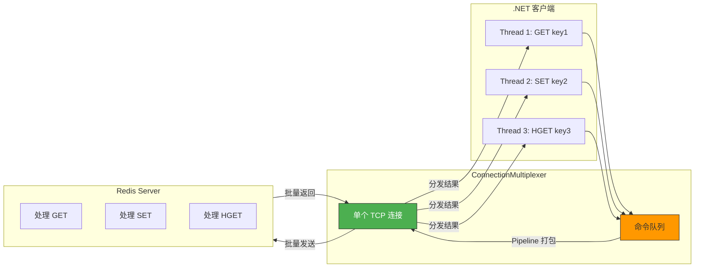
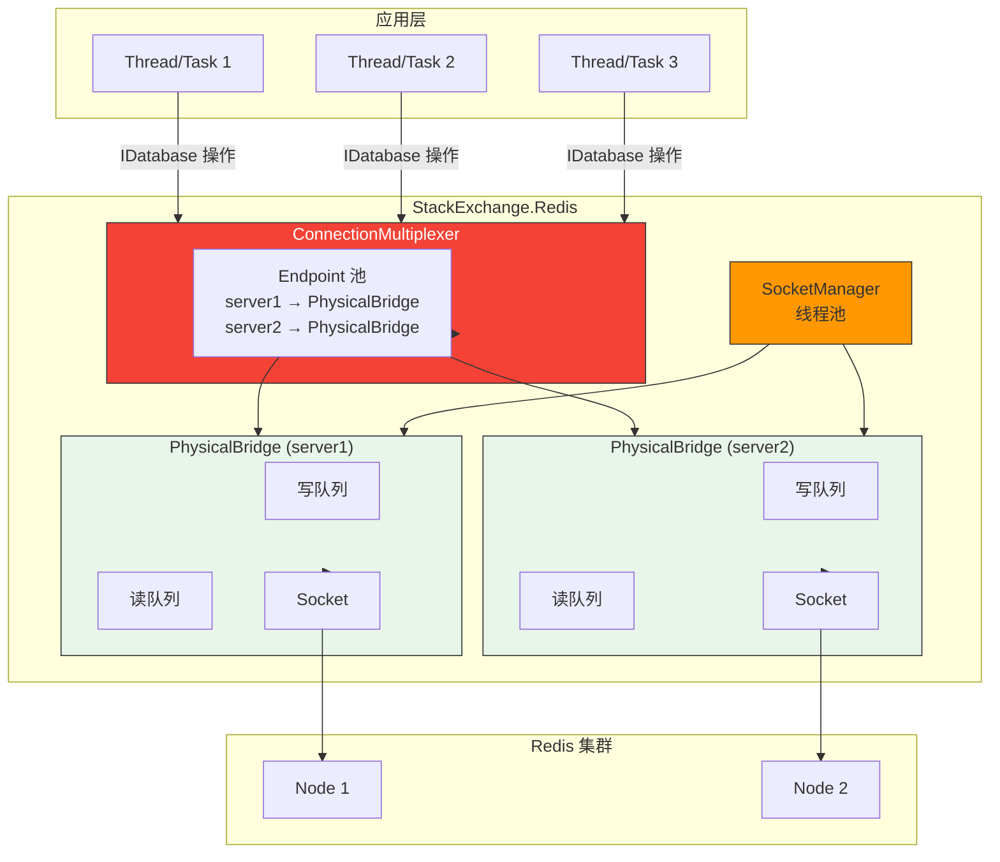
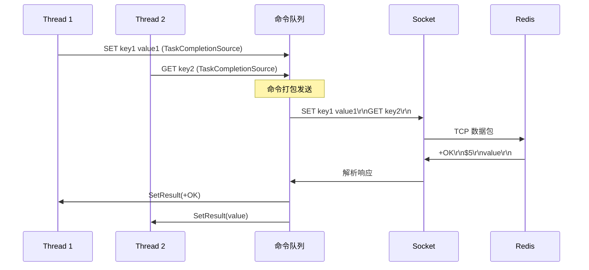

# StackExchange.Redis 深度实战

StackExchange.Redis（简称 SER）是 .NET 生态中使用最广泛的 Redis 客户端，由 Stack Overflow 团队开发维护。它以**高性能、异步优先、多路复用**著称，是 .NET Redis 客户端的事实标准。

::: tip 本章导航
1. ConnectionMultiplexer —— 连接管理、单例模式、配置选项
2. Database 操作 —— 五大基础类型的完整 CRUD
3. Pipeline 与 FireAndForget —— 批量操作与性能优化
4. 事务与 Batch —— MULTI/EXEC 与批量命令
5. Lua 脚本 —— 原子操作与脚本缓存
6. 发布订阅 —— Pub/Sub 编程
7. 集群配置 —— Cluster/Sentinel/读写分离
8. 内部架构 —— 多路复用、Pipeline 原理
9. 常见坑与最佳实践
:::

---

## 一、安装与初始化

### 1.1 NuGet 安装

```bash
# .NET CLI
dotnet add package StackExchange.Redis

# Package Manager Console
Install-Package StackExchange.Redis

# 指定版本
dotnet add package StackExchange.Redis --version 2.7.33
```

### 1.2 基本连接

```csharp
using StackExchange.Redis;

// 简单连接
ConnectionMultiplexer redis = ConnectionMultiplexer.Connect("localhost:6379");

// 带密码
ConnectionMultiplexer redis = ConnectionMultiplexer.Connect("localhost:6379,password=mypassword");

// 带数据库
ConnectionMultiplexer redis = ConnectionMultiplexer.Connect("localhost:6379,defaultDatabase=0");

// 获取 Database
IDatabase db = redis.GetDatabase();
IDatabase db1 = redis.GetDatabase(1);  // 选择 db1
```

### 1.3 单例模式（关键！）

ConnectionMultiplexer 是**重量级对象**，在整个应用生命周期中应**只创建一个实例**：

```csharp
// 推荐方案: 依赖注入（ASP.NET Core）
// Program.cs / Startup.cs
builder.Services.AddSingleton<IConnectionMultiplexer>(
    ConnectionMultiplexer.Connect("localhost:6379")
);

// 或使用 ConnectionStrings 配置
builder.Services.AddSingleton<IConnectionMultiplexer>(sp =>
{
    var config = builder.Configuration.GetConnectionString("Redis");
    return ConnectionMultiplexer.Connect(config);
});

// appsettings.json
{
    "ConnectionStrings": {
        "Redis": "localhost:6379,abortConnect=false,connectTimeout=5000,syncTimeout=5000"
    }
}
```

```csharp
// 在服务中使用
public class UserService
{
    private readonly IDatabase _db;

    public UserService(IConnectionMultiplexer redis)
    {
        _db = redis.GetDatabase();
    }
}
```

::: important 为什么必须单例？
1. ConnectionMultiplexer 内部维护**TCP 连接池**，创建/销毁成本极高
2. 每个实例会创建独立的心跳线程和超时检测线程
3. 多实例会导致**连接泄漏**和**超时问题**
4. 多路复用架构下，一个连接足以处理高并发
:::

### 1.4 ConfigurationOptions 详解

```csharp
// 字符串配置
var config = ConfigurationOptions.Parse("server1:6379,server2:6379");

// 对象配置（更灵活、更安全）
var config = new ConfigurationOptions
{
    EndPoints = { "server1:6379", "server2:6379" },
    Password = "mypassword",
    DefaultDatabase = 0,
    AllowAdmin = false,

    // 连接配置
    ConnectTimeout = 5000,           // 连接超时 5s
    SyncTimeout = 5000,              // 同步操作超时 5s
    AsyncTimeout = 10000,            // 异步操作超时 10s

    // 重连配置
    AbortOnConnectFail = false,      // 初始连接失败不抛异常
    ConnectRetry = 3,                // 重试次数
    ReconnectRetryPolicy = new ExponentialRetry(5000), // 指数退避重连

    // 读写分离
    CommandMap = CommandMap.Default,  // 可自定义命令映射

    // SSL
    Ssl = true,
    SslHost = "redis.example.com",

    // 客户端名称
    ClientName = "myapp-web"
};

ConnectionMultiplexer redis = ConnectionMultiplexer.Connect(config);
```

### 1.5 关键配置参数

| 参数 | 默认值 | 说明 |
|---|---|---|
| `AbortOnConnectFail` | true | 初始连接失败是否抛异常，生产建议 false |
| `ConnectTimeout` | 5000 | 连接超时（毫秒） |
| `SyncTimeout` | 5000 | 同步操作超时 |
| `AsyncTimeout` | SyncTimeout | 异步操作超时 |
| `ConnectRetry` | 3 | 连接重试次数 |
| `KeepAlive` | 60 | 心跳间隔（秒），0 = 禁用 |
| `DefaultDatabase` | null | 默认数据库编号 |
| `ConfigCheckSeconds` | 60 | 配置检查间隔 |
| `SocketManager` | null | Socket 管理器（高级） |

### 1.6 连接事件监听

```csharp
var redis = ConnectionMultiplexer.Connect(config);

// 连接恢复
redis.ConnectionRestored += (sender, e) =>
{
    Console.WriteLine($"连接恢复: {e.EndPoint}");
};

// 连接断开
redis.ConnectionFailed += (sender, e) =>
{
    Console.WriteLine($"连接断开: {e.EndPoint}, 类型: {e.ConnectionType}, 原因: {e.FailureType}");
};

// 配置变更
redis.ConfigurationChanged += (sender, e) =>
{
    Console.WriteLine($"配置变更: {e.EndPoint}");
};

// 内部错误
redis.InternalError += (sender, e) =>
{
    Console.WriteLine($"内部错误: {e.EndPoint}, 异常: {e.Exception}");
};

// 检查连接状态
Console.WriteLine(redis.IsConnected);  // 是否已连接
Console.WriteLine(redis.GetStatus());   // 连接状态详情
```

---

## 二、Database 操作

### 2.1 String 操作

```csharp
IDatabase db = redis.GetDatabase();

// 设置
db.StringSet("name", "Alice");
db.StringSet("counter", 100);

// 设置带过期
db.StringSet("session:token123", "user_data", TimeSpan.FromHours(2));

// 设置条件（NX = 不存在时设置，XX = 存在时设置）
db.StringSet("lock:order:1001", "locked", TimeSpan.FromSeconds(30), When.NotExists);

// 获取
string? name = db.StringGet("name");           // "Alice"
RedisValue missing = db.StringGet("unknown");   // RedisValue.Null

// 批量获取
RedisValue[] values = db.StringGet(new RedisKey[] { "name", "age", "city" });

// 批量设置
db.StringSet(new KeyValuePair<RedisKey, RedisValue>[]
{
    new("user:1:name", "Alice"),
    new("user:1:age", "30"),
    new("user:1:city", "Beijing")
});

// 递增/递减
db.StringIncrement("counter");         // +1
db.StringIncrement("counter", 10);     // +10
db.StringDecrement("counter");         // -1
db.StringDecrement("counter", 5);      // -5

// 浮点递增
db.StringIncrement("price", 19.90);

// 获取并设置（原子操作）
string? oldValue = db.StringGetSet("name", "Bob"); // 返回旧值 "Alice"

// 获取子串
string? sub = db.StringGetRange("name", 0, 2);    // "Bob" 的前 3 字符

// 设置子串
db.StringSetRange("name", 0, "Eve");               // 从位置 0 覆盖

// 获取长度
long len = db.StringLength("name");

// 追加
db.StringAppend("name", " Smith");
```

### 2.2 Hash 操作

```csharp
// 设置字段
db.HashSet("user:1001", "name", "Alice");
db.HashSet("user:1001", "age", 30);

// 批量设置
db.HashSet("user:1001", new HashEntry[]
{
    new("name", "Alice"),
    new("age", 30),
    new("city", "Beijing"),
    new("score", 85.5)
});

// 获取字段
string? name = db.HashGet("user:1001", "name");

// 获取所有字段
HashEntry[] all = db.HashGetAll("user:1001");
foreach (var entry in all)
{
    Console.WriteLine($"{entry.Name} = {entry.Value}");
}

// 获取多个字段
RedisValue[] values = db.HashGet("user:1001", new RedisValue[] { "name", "age" });

// 字段是否存在
bool exists = db.HashExists("user:1001", "name");

// 删除字段
db.HashDelete("user:1001", "age");
db.HashDelete("user:1001", new RedisValue[] { "age", "score" });

// 数值递增
db.HashIncrement("user:1001", "age");          // +1
db.HashIncrement("user:1001", "score", 5.5);   // +5.5
db.HashDecrement("user:1001", "age");           // -1

// 获取字段数量
long count = db.HashLength("user:1001");

// 获取所有字段名
RedisValue[] keys = db.HashKeys("user:1001");

// 获取所有字段值
RedisValue[] vals = db.HashValues("user:1001");
```

### 2.3 List 操作

```csharp
// 左推入（头部）
db.ListLeftPush("tasks", "task1");
db.ListLeftPush("tasks", new RedisValue[] { "task2", "task3" });

// 右推入（尾部）
db.ListRightPush("tasks", "task4");

// 左弹出
RedisValue task = db.ListLeftPop("tasks");

// 右弹出
RedisValue task2 = db.ListRightPop("tasks");

// 阻塞弹出（超时 5 秒）
RedisValue[] result = db.ListLeftPop("tasks", TimeSpan.FromSeconds(5));
// result[0] = key, result[1] = value

// 获取范围
RedisValue[] items = db.ListRange("tasks", 0, -1);  // 所有元素
RedisValue[] first3 = db.ListRange("tasks", 0, 2);  // 前 3 个

// 获取长度
long len = db.ListLength("tasks");

// 按索引获取
RedisValue item = db.ListGetByIndex("tasks", 0);

// 按索引设置
db.ListSetByIndex("tasks", 0, "updated_task");

// 按值删除
db.ListRemove("tasks", "task2", count: 1); // 删除 1 个 "task2"

// 裁剪
db.ListTrim("tasks", 0, 99); // 只保留前 100 个

// 在指定元素前后插入
db.ListInsertBefore("tasks", "task1", "new_task");
db.ListInsertAfter("tasks", "task1", "new_task2");
```

### 2.4 Set 操作

```csharp
// 添加元素
db.SetAdd("tags", "redis");
db.SetAdd("tags", new RedisValue[] { "database", "cache", "nosql" });

// 删除元素
db.SetRemove("tags", "cache");

// 判断元素是否存在
bool isMember = db.SetContains("tags", "redis");

// 获取所有成员
RedisValue[] members = db.SetMembers("tags");

// 获取成员数量
long count = db.SetLength("tags");

// 随机获取一个成员
RedisValue random = db.SetRandomMember("tags");

// 随机弹出
RedisValue popped = db.SetPop("tags");

// 集合运算
// 交集
RedisValue[] intersection = db.SetCombine(SetOperation.Intersect, "set1", "set2");
// 并集
RedisValue[] union = db.SetCombine(SetOperation.Union, "set1", "set2");
// 差集
RedisValue[] diff = db.SetCombine(SetOperation.Difference, "set1", "set2");

// 将运算结果存入新 key
db.SetCombineAndStore(SetOperation.Intersect, "result", "set1", "set2");

// 将元素从一个集合移到另一个
db.SetMove("set1", "set2", "element");
```

### 2.5 Sorted Set 操作

```csharp
// 添加成员
db.SortedSetAdd("leaderboard", "alice", 100);
db.SortedSetAdd("leaderboard", new SortedSetEntry[]
{
    new("bob", 85),
    new("carol", 92),
    new("dave", 78)
});

// 递增分数
double newScore = db.SortedSetIncrement("leaderboard", "alice", 10); // 110

// 删除成员
db.SortedSetRemove("leaderboard", "dave");

// 获取分数
double? score = db.SortedSetScore("leaderboard", "alice");

// 获取排名（升序，0-based）
long? rank = db.SortedSetRank("leaderboard", "alice");

// 获取排名（降序）
long? rankDesc = db.SortedSetRank("leaderboard", "alice", Order.Descending);

// 按排名范围获取（升序）
RedisValue[] top3 = db.SortedSetRangeByRank("leaderboard", 0, 2);

// 按排名范围获取（带分数）
SortedSetEntry[] top3WithScores = db.SortedSetRangeByRankWithScores(
    "leaderboard", 0, 2, Order.Descending);

// 按分数范围获取
RedisValue[] above90 = db.SortedSetRangeByScore("leaderboard", 90, double.PositiveInfinity);

// 按分数范围删除
db.SortedSetRemoveRangeByScore("leaderboard", 0, 60); // 删除 0-60 分的

// 按排名范围删除
db.SortedSetRemoveRangeByRank("leaderboard", 0, 9); // 删除排名最低的 10 个

// 获取成员数量
long count = db.SortedSetLength("leaderboard");

// 按分数范围计数
long above80 = db.SortedSetLength("leaderboard", 80, double.PositiveInfinity);

// 集合运算
db.SortedSetCombine(SetOperation.Intersect, "result", "zset1", "zset2");
db.SortedSetCombineAndStore(SetOperation.Union, "result", "zset1", "zset2");
```

---

## 三、Pipeline 与 FireAndForget

### 3.1 Pipeline 原理

StackExchange.Redis 采用**多路复用**架构，所有命令自动通过 Pipeline 发送：



::: important 自动 Pipeline
SER 自动将多个命令打包成一个 TCP 包发送，**不需要手动启用 Pipeline**。这是它与 ServiceStack.Redis 等客户端的重要区别。
:::

### 3.2 FireAndForget 模式

当你不需要命令的返回值时，使用 FireAndForget 可以跳过等待响应：

```csharp
// 默认模式：等待每个命令返回
db.StringSet("key1", "value1");  // 等待响应
db.StringSet("key2", "value2");  // 等待响应
db.StringSet("key3", "value3");  // 等待响应
// 耗时 ≈ 3 × RTT

// FireAndForget 模式：发送后立即返回
CommandFlags flags = CommandFlags.FireAndForget;
db.StringSet("key1", "value1", flags: flags);
db.StringSet("key2", "value2", flags: flags);
db.StringSet("key3", "value3", flags: flags);
// 耗时 ≈ 1 × RTT（3 个命令打包发送）
```

```csharp
// 实战: 批量预热缓存
public async Task WarmCache(Dictionary<string, string> cacheData)
{
    var db = _redis.GetDatabase();
    var flags = CommandFlags.FireAndForget;

    foreach (var (key, value) in cacheData)
    {
        db.StringSet(key, value, TimeSpan.FromHours(1), flags: flags);
    }

    // 最后发一个 PING 确保所有命令已发送
    await db.PingAsync(); // 等待所有 FireAndForget 命令完成
}
```

::: warning FireAndForget 注意事项
- 返回值永远是默认值（`false`, `0`, `RedisValue.Null` 等）
- 不会抛出服务器端异常
- 适合写入场景，不适合需要返回值的读取场景
- 最后加一个 `Ping()` 确保命令已全部发送
:::

---

## 四、事务与 Batch

### 4.1 事务（CreateTransaction）

```csharp
IDatabase db = redis.GetDatabase();

// 创建事务
var tran = db.CreateTransaction();

// 添加条件（WATCH）
tran.AddCondition(Condition.KeyNotExists("lock:order:1001"));
tran.AddCondition(Condition.HashEqual("user:1001", "version", "3"));

// 添加命令
tran.StringSetAsync("lock:order:1001", "locked", TimeSpan.FromSeconds(30));
tran.HashIncrementAsync("user:1001", "version");
tran.StringSetAsync("order:1001", JsonSerializer.Serialize(orderData));

// 执行事务
bool committed = tran.Execute();
// committed = true  → 所有条件满足，命令执行成功
// committed = false → 条件不满足，命令全部未执行
```

::: important 事务原理
`CreateTransaction` 底层使用 Redis 的 **WATCH + MULTI + EXEC**：
1. `AddCondition` → 发送 WATCH 命令
2. `xxxAsync` → 命令入队（不执行）
3. `Execute()` → 发送 MULTI + 命令 + EXEC

如果 WATCH 的 key 被其他客户端修改，EXEC 返回空数组，`Execute()` 返回 false。
:::

### 4.2 事务实战：库存扣减

```csharp
public async Task<bool> DeductStockAsync(string productId, int quantity)
{
    var db = _redis.GetDatabase();
    string stockKey = $"stock:{productId}";
    string versionKey = $"stock:version:{productId}";

    for (int retry = 0; retry < 3; retry++)
    {
        // 读取当前版本号
        var currentVersion = await db.StringGetAsync(versionKey);

        var tran = db.CreateTransaction();

        // WATCH 版本号
        tran.AddCondition(Condition.StringEqual(versionKey, currentVersion));

        // 扣减库存
        tran.HashDecrementAsync(stockKey, "available", quantity);
        tran.HashIncrementAsync(stockKey, "reserved", quantity);
        tran.StringSetAsync(versionKey, (long)currentVersion + 1);

        bool success = tran.Execute();
        if (success) return true;

        // 版本号已变，重试
        await Task.Delay(50);
    }

    return false; // 重试耗尽
}
```

### 4.3 Batch（CreateBatch）

Batch 是**命令批量发送**的机制，不保证原子性，但比事务更高效：

```csharp
// 创建 Batch
var batch = db.CreateBatch();

// 添加命令（立即发送，但结果通过 Task 返回）
Task<bool> t1 = batch.StringSetAsync("key1", "value1");
Task<bool> t2 = batch.StringSetAsync("key2", "value2");
Task<RedisValue> t3 = batch.StringGetAsync("key1");
Task<bool> t4 = batch.HashSetAsync("user:1", new HashEntry[] { new("name", "Alice") });

// 执行（发送所有命令）
batch.Execute();

// 等待所有结果
await Task.WhenAll(t1, t2, t3, t4);

Console.WriteLine(t3.Result); // "value1"
```

::: important Transaction vs Batch
| 特性 | Transaction | Batch |
|---|---|---|
| 原子性 | 有（MULTI/EXEC） | 无 |
| 条件检查 | 有（WATCH） | 无 |
| 性能 | 较低（需要 WATCH/MULTI/EXEC） | 较高（纯 Pipeline） |
| 返回值 | Execute() 返回 bool | 每个命令返回 Task |
| 适用场景 | 需要原子性 | 批量操作不需要原子性 |
:::

---

## 五、Lua 脚本

### 5.1 执行 Lua 脚本

```csharp
// 基本执行
var result = db.ScriptEvaluate(
    "return redis.call('SET', KEYS[1], ARGV[1])",
    new RedisKey[] { "mykey" },
    new RedisValue[] { "myvalue" }
);

// 带返回值的脚本
var count = db.ScriptEvaluate(
    "return redis.call('GET', KEYS[1])",
    new RedisKey[] { "counter" }
);

// Lua 脚本中的条件逻辑
var script = @"
    local current = redis.call('GET', KEYS[1])
    if current == false then
        redis.call('SET', KEYS[1], ARGV[1])
        return 1
    else
        return 0
    end
";
var setResult = db.ScriptEvaluate(script,
    new RedisKey[] { "lock:order:1001" },
    new RedisValue[] { "locked" }
);
// setResult = 1 表示设置成功，0 表示 key 已存在
```

### 5.2 预编译脚本（Lua 脚本缓存）

```csharp
// 预加载脚本（EVALSHA），避免每次发送完整脚本
var prepared = LuaScript.Prepare(@"
    local current = redis.call('GET', KEYS[1])
    if current == false then
        redis.call('SET', KEYS[1], @value)
        redis.call('EXPIRE', KEYS[1], @ttl)
        return 1
    end
    return 0
");

// 执行预编译脚本
var result = db.ScriptEvaluate(prepared,
    new { value = "locked", ttl = 30 }
);
```

### 5.3 分布式锁 Lua 脚本

```csharp
public class RedisDistributedLock
{
    private readonly IDatabase _db;
    private static readonly LuaScript _acquireScript = LuaScript.Prepare(@"
        if redis.call('EXISTS', KEYS[1]) == 0 then
            redis.call('SET', KEYS[1], @owner, 'PX', @expiryMs)
            return 1
        end
        return 0
    ");

    private static readonly LuaScript _releaseScript = LuaScript.Prepare(@"
        if redis.call('GET', KEYS[1]) == @owner then
            redis.call('DEL', KEYS[1])
            return 1
        end
        return 0
    ");

    public RedisDistributedLock(IConnectionMultiplexer redis)
    {
        _db = redis.GetDatabase();
    }

    public async Task<bool> AcquireAsync(string resource, string owner, TimeSpan expiry)
    {
        var result = _db.ScriptEvaluate(_acquireScript,
            new RedisKey[] { $"lock:{resource}" },
            new { owner = (RedisValue)owner, expiryMs = (RedisValue)(long)expiry.TotalMilliseconds }
        );
        return (long)result == 1;
    }

    public async Task<bool> ReleaseAsync(string resource, string owner)
    {
        var result = _db.ScriptEvaluate(_releaseScript,
            new RedisKey[] { $"lock:{resource}" },
            new { owner = (RedisValue)owner }
        );
        return (long)result == 1;
    }
}
```

### 5.4 限流器 Lua 脚本

```csharp
public class RateLimiter
{
    private readonly IDatabase _db;
    private static readonly LuaScript _script = LuaScript.Prepare(@"
        local key = KEYS[1]
        local limit = tonumber(@limit)
        local window = tonumber(@windowMs)

        local current = tonumber(redis.call('GET', key) or '0')
        if current >= limit then
            return 0
        end

        current = redis.call('INCR', key)
        if current == 1 then
            redis.call('PEXPIRE', key, window)
        end

        return 1
    ");

    public RateLimiter(IConnectionMultiplexer redis)
    {
        _db = redis.GetDatabase();
    }

    public async Task<bool> IsAllowedAsync(string key, int limit, TimeSpan window)
    {
        var result = _db.ScriptEvaluate(_script,
            new RedisKey[] { $"ratelimit:{key}" },
            new { limit = (RedisValue)limit, windowMs = (RedisValue)(long)window.TotalMilliseconds }
        );
        return (long)result == 1;
    }
}
```

---

## 六、发布订阅

### 6.1 基本使用

```csharp
var subscriber = redis.GetSubscriber();

// 订阅频道
subscriber.Subscribe("notifications", (channel, message) =>
{
    Console.WriteLine($"收到消息: {message}");
});

// 发布消息
subscriber.Publish("notifications", "Hello, World!");

// 取消订阅
subscriber.Unsubscribe("notifications");

// 取消所有订阅
subscriber.UnsubscribeAll();
```

### 6.2 异步订阅

```csharp
// 异步订阅
await subscriber.SubscribeAsync("notifications", (channel, message) =>
{
    Console.WriteLine($"收到消息: {message}");
});

// 异步发布
long receivers = await subscriber.PublishAsync("notifications", "Async message");
Console.WriteLine($"{receivers} 个订阅者收到消息");
```

### 6.3 模式匹配订阅

```csharp
// 订阅模式
subscriber.Subscribe(new RedisChannel("user:*", RedisChannel.PatternMode.Pattern), (channel, message) =>
{
    Console.WriteLine($"频道: {channel}, 消息: {message}");
});

// 精确匹配模式
subscriber.Subscribe(new RedisChannel("user:*", RedisChannel.PatternMode.Literal), (channel, message) =>
{
    // 这会订阅字面频道名 "user:*"
});
```

### 6.4 发布订阅实战：缓存失效通知

```csharp
public class CacheInvalidationService
{
    private readonly ISubscriber _subscriber;
    private readonly IDatabase _db;
    private readonly LocalCache _localCache;

    public CacheInvalidationService(IConnectionMultiplexer redis, LocalCache localCache)
    {
        _db = redis.GetDatabase();
        _subscriber = redis.GetSubscriber();
        _localCache = localCache;

        // 订阅失效通知
        _subscriber.Subscribe("cache:invalidate", OnCacheInvalidated);
    }

    private void OnCacheInvalidated(RedisChannel channel, RedisValue key)
    {
        // 收到通知，删除本地缓存
        _localCache.Remove(key.ToString());
    }

    public async Task<T?> GetOrSetAsync<T>(string key, Func<Task<T>> factory, TimeSpan expiry)
    {
        // 先查本地缓存
        if (_localCache.TryGetValue(key, out T? value))
            return value;

        // 再查 Redis
        var redisValue = await _db.StringGetAsync(key);
        if (redisValue.HasValue)
        {
            _localCache.Set(key, JsonSerializer.Deserialize<T>(redisValue!));
            return _localCache.Get<T>(key);
        }

        // 查数据库
        value = await factory();
        await _db.StringSetAsync(key, JsonSerializer.Serialize(value), expiry);
        _localCache.Set(key, value);
        return value;
    }

    public async Task InvalidateAsync(string key)
    {
        // 删除 Redis 缓存
        await _db.KeyDeleteAsync(key);
        // 通知所有节点删除本地缓存
        await _subscriber.PublishAsync("cache:invalidate", key);
    }
}
```

---

## 七、集群配置

### 7.1 Redis Cluster 连接

```csharp
// Redis Cluster: 只需配置任意一个节点，客户端自动发现所有节点
var config = new ConfigurationOptions
{
    EndPoints = { "cluster-node1:6379" },
    Password = "mypassword"
};
var redis = ConnectionMultiplexer.Connect(config);

// 或配置多个节点（更健壮）
var config = new ConfigurationOptions
{
    EndPoints = { "cluster-node1:6379", "cluster-node2:6379", "cluster-node3:6379" },
    Password = "mypassword"
};
```

::: important Cluster 注意事项
1. SER 自动处理 **MOVED/ASK 重定向**
2. 多路复用连接会为每个节点创建独立的 TCP 连接
3. 批量操作中涉及多个 slot 的 key 会抛异常（除非使用 Hash Tag）
4. Hash Tag: `{user}:1001` 和 `{user}:1002` 在同一个 slot
:::

### 7.2 哨兵模式连接

```csharp
// 哨兵模式配置
var config = new ConfigurationOptions
{
    // 哨兵节点
    EndPoints = { "sentinel1:26379", "sentinel2:26379", "sentinel3:26379" },
    ServiceName = "mymaster",   // 主节点服务名
    Password = "mypassword",    // Redis 密码
    TieBreaker = "",            // 哨兵密码（如需要）
    CommandMap = CommandMap.Sentinel
};

var redis = ConnectionMultiplexer.Connect(config);
```

### 7.3 读写分离

```csharp
// 配置读写分离
var config = new ConfigurationOptions
{
    EndPoints = { "master:6379", "replica1:6379", "replica2:6379" },
};

var redis = ConnectionMultiplexer.Connect(config);

// 默认所有操作走主节点
IDatabase db = redis.GetDatabase();

// 指定读操作走从节点
IDatabase readOnlyDb = redis.GetDatabase(flags: CommandFlags.DemandReplica);
var value = readOnlyDb.StringGet("key"); // 从副本读取
```

### 7.4 集群中的 Hash Tag

```csharp
// 使用 Hash Tag 确保相关 key 在同一 slot
db.StringSet("{user:1001}:profile", profileJson);
db.StringSet("{user:1001}:settings", settingsJson);
db.StringSet("{user:1001}:stats", statsJson);

// 这样可以安全地在事务或 Lua 中操作这些 key
var tran = db.CreateTransaction();
tran.StringGetAsync("{user:1001}:profile");
tran.StringGetAsync("{user:1001}:settings");
bool ok = tran.Execute();
```

---

## 八、StackExchange.Redis 内部架构

### 8.1 架构全景



### 8.2 多路复用工作流程



### 8.3 关键组件

| 组件 | 职责 |
|---|---|
| `ConnectionMultiplexer` | 顶层对象，管理所有连接和配置 |
| `PhysicalBridge` | 每个服务器的连接桥，包含读写队列 |
| `PhysicalConnection` | 底层 Socket 连接 |
| `SocketManager` | 管理 Socket 线程池 |
| `Message` | 封装命令和 TaskCompletionSource |
| `ResultProcessor` | 解析 Redis 响应 |
| `ServerEndPoint` | 服务器节点信息 |

### 8.4 同步 vs 异步

```csharp
// 同步方法（在多路复用模型中会阻塞当前线程等待响应）
db.StringGet("key");

// 异步方法（推荐，不阻塞线程）
await db.StringGetAsync("key");

// FireAndForget（最快，不等待响应）
db.StringGet("key", flags: CommandFlags.FireAndForget);
```

::: important 为什么异步更好？
SER 的多路复用模型中，同步方法会导致当前线程**阻塞等待**响应。在高并发场景下，这会造成线程饥饿。异步方法只发送命令，通过 Task 的 ContinueWith 机制处理响应，不会阻塞线程。
:::

---

## 九、常见坑与排错

### 9.1 超时问题（Timeout）

**最常见的 SER 问题**，报错示例：

```
Timeout performing GET key, inst: 1, queue: 0, qu: 0, qs: 0, qc: 0, wr: 0, wq: 0, in: 0, ar: 0,
clientName: myapp, serverEndpoint: localhost:6379, keyHashSlot: 13120
```

**常见原因与解决方案**：

| 原因 | 症状 | 解决方案 |
|---|---|---|
| 大 Value | GET 耗时 > 10ms | 压缩 Value，拆分大 Key |
| 阻塞命令 | KEYS/SMEMBERS 阻塞 | 避免阻塞命令，用 SCAN |
| 同步调用过多 | 线程池耗尽 | 改用异步 API |
| 网络延迟 | 跨机房访问 | 同机房部署 |
| Redis 慢查询 | 服务端 CPU 高 | 优化查询，查看 SLOWLOG |

```csharp
// 诊断: 检查连接状态
var server = redis.GetServer("localhost:6379");
Console.WriteLine(server.Info("memory"));
Console.WriteLine(server.Info("clients"));

// 诊断: 查看 SER 内部状态
Console.WriteLine(redis.GetStatus());
Console.WriteLine(redis.GetCounters());
```

### 9.2 高 CPU

```csharp
// 原因 1: 大量同步调用导致线程阻塞
// 解决: 使用异步 API
await db.StringGetAsync("key");

// 原因 2: 频繁创建 ConnectionMultiplexer
// 解决: 使用单例
builder.Services.AddSingleton<IConnectionMultiplexer>(...);

// 原因 3: 使用 async void
// 解决: 永远不要使用 async void
// 错误:
async void UpdateCache() { await db.StringSetAsync(...); }
// 正确:
async Task UpdateCache() { await db.StringSetAsync(...); }
```

### 9.3 async void 陷阱

```csharp
// 错误: async void —— 异常无法捕获，会导致应用崩溃
public async void UpdateCache()
{
    await _db.StringSetAsync("key", "value"); // 如果抛异常，直接崩溃
}

// 正确: async Task
public async Task UpdateCache()
{
    await _db.StringSetAsync("key", "value"); // 异常可以被调用者捕获
}

// 错误: 事件处理器中使用 async void
subscriber.Subscribe("channel", async (ch, msg) =>
{
    await ProcessMessageAsync(msg); // 异常可能导致应用崩溃
});

// 正确: 事件处理器中包裹 try-catch
subscriber.Subscribe("channel", (ch, msg) =>
{
    _ = Task.Run(async () =>
    {
        try
        {
            await ProcessMessageAsync(msg);
        }
        catch (Exception ex)
        {
            _logger.LogError(ex, "处理消息失败");
        }
    });
});
```

### 9.4 连接泄漏

```csharp
// 错误: 每次操作创建新连接
public RedisValue GetValue(string key)
{
    using var redis = ConnectionMultiplexer.Connect("localhost"); // 千万不要这样！
    return redis.GetDatabase().StringGet(key);
}

// 正确: 使用注入的单例连接
public RedisValue GetValue(string key)
{
    return _db.StringGet(key);
}
```

### 9.5 集群 MOVED 异常

```
RedisServerException: MOVED 3999 127.0.0.1:6380
```

```csharp
// 原因: 访问了错误节点的 key
// SER 会自动处理 MOVED，但如果配置不正确可能失败

// 解决 1: 确保配置了正确的集群节点
var config = new ConfigurationOptions
{
    EndPoints = { "node1:6379", "node2:6379", "node3:6379" }
};

// 解决 2: 使用 Hash Tag 确保多 key 在同一 slot
db.StringSet("{order}:1001", data);
db.StringSet("{order}:1001:items", items);
```

---

## 十、最佳实践

### 10.1 连接管理

```csharp
// 1. 单例 ConnectionMultiplexer
builder.Services.AddSingleton<IConnectionMultiplexer>(sp =>
{
    var connectionString = sp.GetRequiredService<IConfiguration>()
        .GetConnectionString("Redis");

    var config = ConfigurationOptions.Parse(connectionString);
    config.AbortOnConnectFail = false;   // 初始连接失败不抛异常
    config.ConnectRetry = 3;              // 重试 3 次
    config.ReconnectRetryPolicy = new ExponentialRetry(5000); // 指数退避
    config.ClientName = "myapp-web";      // 客户端名

    return ConnectionMultiplexer.Connect(config);
});

// 2. 注入 IDatabase
builder.Services.AddScoped<IDatabase>(sp =>
    sp.GetRequiredService<IConnectionMultiplexer>().GetDatabase());

// 3. 注册事件监听
builder.Services.AddSingleton<RedisConnectionEventListener>();
```

### 10.2 Key 设计规范

```csharp
// 使用冒号分隔，有层次感
// 对象类型:ID:属性
"user:1001:profile"
"user:1001:settings"
"order:2024:001"
"cache:api:/users/1001"

// 封装 Key 常量
public static class RedisKeys
{
    public static RedisKey User(long userId) => $"user:{userId}:profile";
    public static RedisKey Order(string orderId) => $"order:{orderId}";
    public static RedisKey Cache(string path) => $"cache:api:{path}";
    public static RedisKey Lock(string resource) => $"lock:{resource}";
    public static RedisKey RateLimit(string key) => $"ratelimit:{key}";
}
```

### 10.3 序列化封装

```csharp
public class RedisCacheService
{
    private readonly IDatabase _db;
    private readonly JsonSerializerOptions _jsonOptions = new()
    {
        PropertyNamingPolicy = JsonNamingPolicy.CamelCase
    };

    public RedisCacheService(IDatabase db)
    {
        _db = db;
    }

    public async Task SetAsync<T>(string key, T value, TimeSpan? expiry = null)
    {
        var json = JsonSerializer.Serialize(value, _jsonOptions);
        await _db.StringSetAsync(key, json, expiry);
    }

    public async Task<T?> GetAsync<T>(string key)
    {
        var json = await _db.StringGetAsync(key);
        if (json.IsNullOrEmpty) return default;
        return JsonSerializer.Deserialize<T>(json!, _jsonOptions);
    }

    public async Task<T?> GetOrSetAsync<T>(string key, Func<Task<T>> factory, TimeSpan? expiry = null)
    {
        var json = await _db.StringGetAsync(key);
        if (json.HasValue)
            return JsonSerializer.Deserialize<T>(json!, _jsonOptions);

        var value = await factory();
        await SetAsync(key, value, expiry);
        return value;
    }

    public async Task RemoveAsync(string key)
    {
        await _db.KeyDeleteAsync(key);
    }
}
```

### 10.4 完整服务封装示例

```csharp
public class RedisService
{
    private readonly IConnectionMultiplexer _redis;
    private readonly IDatabase _db;
    private readonly ILogger<RedisService> _logger;

    public RedisService(IConnectionMultiplexer redis, ILogger<RedisService> logger)
    {
        _redis = redis;
        _db = redis.GetDatabase();
        _logger = logger;

        // 监听连接事件
        _redis.ConnectionFailed += (s, e) =>
            _logger.LogWarning("Redis 连接断开: {Endpoint}, 原因: {FailureType}",
                e.EndPoint, e.FailureType);
        _redis.ConnectionRestored += (s, e) =>
            _logger.LogInformation("Redis 连接恢复: {Endpoint}", e.EndPoint);
    }

    // --- 缓存 ---
    public async Task<T?> GetCacheAsync<T>(string key)
    {
        try
        {
            var value = await _db.StringGetAsync(key);
            return value.IsNullOrEmpty ? default : JsonSerializer.Deserialize<T>(value!);
        }
        catch (RedisTimeoutException ex)
        {
            _logger.LogError(ex, "Redis 超时: GET {Key}", key);
            return default; // 降级
        }
    }

    // --- 分布式锁 ---
    public async Task<IDisposable?> AcquireLockAsync(string resource, string owner, TimeSpan expiry)
    {
        bool acquired = await _db.StringSetAsync(
            $"lock:{resource}", owner, expiry, When.NotExists);

        return acquired ? new RedisLock(_db, resource, owner) : null;
    }

    private class RedisLock : IDisposable
    {
        private readonly IDatabase _db;
        private readonly string _resource;
        private readonly string _owner;
        private static readonly LuaScript _releaseScript = LuaScript.Prepare(@"
            if redis.call('GET', KEYS[1]) == @owner then
                return redis.call('DEL', KEYS[1])
            end
            return 0
        ");

        public RedisLock(IDatabase db, string resource, string owner)
        {
            _db = db;
            _resource = resource;
            _owner = owner;
        }

        public void Dispose()
        {
            _db.ScriptEvaluate(_releaseScript,
                new RedisKey[] { $"lock:{_resource}" },
                new { owner = (RedisValue)_owner });
        }
    }

    // --- 限流 ---
    public async Task<bool> IsRateLimitedAsync(string key, int limit, TimeSpan window)
    {
        var script = @"
            local current = redis.call('INCR', KEYS[1])
            if current == 1 then
                redis.call('PEXPIRE', KEYS[1], ARGV[1])
            end
            return current
        ";
        var result = await _db.ScriptEvaluateAsync(script,
            new RedisKey[] { $"ratelimit:{key}" },
            new RedisValue[] { (long)window.TotalMilliseconds });

        return (long)result > limit;
    }

    // --- 健康检查 ---
    public async Task<bool> HealthCheckAsync()
    {
        try
        {
            var ping = await _db.PingAsync();
            return ping.TotalMilliseconds < 100;
        }
        catch
        {
            return false;
        }
    }
}
```

---

## 十一、性能调优

### 11.1 配置调优

```csharp
var config = new ConfigurationOptions
{
    // 超时设置（根据网络延迟调整）
    ConnectTimeout = 5000,
    SyncTimeout = 3000,      // 同步操作超时（不建议太大）
    AsyncTimeout = 5000,     // 异步操作超时

    // 连接设置
    AbortOnConnectFail = false,  // 关键！生产环境必须 false
    KeepAlive = 30,              // 心跳间隔
    ConfigCheckSeconds = 60,     // 配置检查间隔

    // Socket 管理
    SocketManager = SocketManager.ThreadPool, // 使用线程池
};
```

### 11.2 Pipeline 性能对比

```csharp
// 场景: 写入 1000 个 key

// 方式 1: 逐个同步写入（最慢，~1000 RTT）
for (int i = 0; i < 1000; i++)
{
    db.StringSet($"key:{i}", $"value:{i}");
}

// 方式 2: 逐个异步写入（较慢，~1000 RTT，但不阻塞线程）
var tasks = new List<Task>();
for (int i = 0; i < 1000; i++)
{
    tasks.Add(db.StringSetAsync($"key:{i}", $"value:{i}"));
}
await Task.WhenAll(tasks);

// 方式 3: FireAndForget（快，~1-2 RTT）
for (int i = 0; i < 1000; i++)
{
    db.StringSet($"key:{i}", $"value:{i}", flags: CommandFlags.FireAndForget);
}
await db.PingAsync(); // 确保命令已发送

// 方式 4: Batch（快，~1-2 RTT，可获取返回值）
var batch = db.CreateBatch();
var batchTasks = new List<Task>();
for (int i = 0; i < 1000; i++)
{
    batchTasks.Add(batch.StringSetAsync($"key:{i}", $"value:{i}"));
}
batch.Execute();
await Task.WhenAll(batchTasks);
```

### 11.3 RedisValue 类型技巧

```csharp
// RedisValue 可以隐式转换
RedisValue rv1 = "hello";      // string → RedisValue
RedisValue rv2 = 42;           // int → RedisValue
RedisValue rv3 = 3.14;         // double → RedisValue
RedisValue rv4 = ReadOnlyMemory<byte>.Empty; // byte[] → RedisValue

// 从 RedisValue 取值
string? str = rv1;              // RedisValue → string? (null if empty)
int num = (int)rv2;             // RedisValue → int
double dbl = (double)rv3;       // RedisValue → double
byte[] bytes = rv4;             // RedisValue → byte[]

// 判断空值
if (rv1.IsNullOrEmpty) { /* 空值处理 */ }
if (rv1.IsNull) { /* Null 处理 */ }

// 避免不必要的序列化
// 小整数可以直接存储为 RedisValue，不需要转为字符串
db.StringSet("counter", 100);  // 直接存整数
db.StringIncrement("counter"); // 原子递增
```

---

## 十二、健康检查与监控

### 12.1 ASP.NET Core 健康检查

```csharp
// 注册健康检查
builder.Services.AddHealthChecks()
    .AddRedis(
        redisConnectionString: connectionString,
        name: "redis",
        failureStatus: HealthStatus.Degraded,
        tags: new[] { "redis", "cache" }
    );

// 映射端点
app.MapHealthChecks("/health", new HealthCheckOptions
{
    ResponseWriter = UIResponseWriter.WriteHealthCheckUIResponse
});
```

### 12.2 自定义监控

```csharp
public class RedisMonitorService : BackgroundService
{
    private readonly IConnectionMultiplexer _redis;
    private readonly ILogger<RedisMonitorService> _logger;

    public RedisMonitorService(IConnectionMultiplexer redis, ILogger<RedisMonitorService> logger)
    {
        _redis = redis;
        _logger = logger;
    }

    protected override async Task ExecuteAsync(CancellationToken stoppingToken)
    {
        while (!stoppingToken.IsCancellationRequested)
        {
            try
            {
                var db = _redis.GetDatabase();
                var ping = await db.PingAsync();

                // 获取 SER 内部计数器
                var counters = _redis.GetCounters();

                _logger.LogInformation(
                    "Redis 监控: Ping={Ping}ms, Outstanding={Outstanding}, " +
                    "Sent={Sent}, Received={Received}, Failed={Failed}",
                    ping.TotalMilliseconds,
                    counters.TotalOutstanding,
                    counters.CommandsSent,
                    counters.ResponsesReceived,
                    countators.Failed);

                // 获取所有节点信息
                foreach (var endpoint in _redis.GetEndPoints())
                {
                    var server = _redis.GetServer(endpoint);
                    var info = server.Info("memory");
                    var clientsInfo = server.Info("clients");

                    _logger.LogDebug("节点 {Endpoint}: {Info}", endpoint,
                        string.Join(", ", info.SelectMany(x => x.Values)
                            .Where(x => x.Key == "used_memory_human")
                            .Select(x => $"{x.Key}={x.Value}")));
                }
            }
            catch (Exception ex)
            {
                _logger.LogError(ex, "Redis 监控异常");
            }

            await Task.Delay(TimeSpan.FromSeconds(30), stoppingToken);
        }
    }
}
```

---

## 十三、总结

### 13.1 StackExchange.Redis 核心特性

| 特性 | 说明 |
|---|---|
| 多路复用 | 单连接处理高并发，自动 Pipeline |
| 异步优先 | 所有操作都有 async 版本 |
| 自动重连 | 内置指数退避重连策略 |
| Cluster 原生支持 | 自动 MOVED/ASK 处理 |
| Lua 脚本 | 预编译 + EVALSHA 缓存 |
| 发布订阅 | ISubscriber 接口 |
| 事务 | WATCH + MULTI + EXEC |

### 13.2 最佳实践清单

::: tip StackExchange.Redis 生产 Checklist
- [ ] **单例** ConnectionMultiplexer，依赖注入
- [ ] `AbortOnConnectFail = false`
- [ ] 优先使用**异步 API**
- [ ] 永远不要使用 **async void**
- [ ] 大批量操作使用 **FireAndForget** 或 **Batch**
- [ ] 分布式锁使用 **Lua 脚本** 保证原子性
- [ ] Key 使用**冒号分隔**的层次命名
- [ ] 注册 **ConnectionFailed/ConnectionRestored** 事件
- [ ] 捕获 **RedisTimeoutException** 并降级
- [ ] 配置合理的超时时间和重连策略
- [ ] 使用 **健康检查** 监控 Redis 连接状态
- [ ] 避免在循环中创建新连接
:::

---

> **参考来源**
> - StackExchange.Redis 官方文档: [GitHub Wiki](https://github.com/StackExchange/StackExchange.Redis/wiki)
> - StackExchange.Redis 源码: [GitHub](https://github.com/StackExchange/StackExchange.Redis)
> - Marc Gravell 博客: [Pipelines and Multiplexers](https://blog.marcgravell.com/)
> - Redis 官方文档: [Clients](https://redis.io/docs/clients/)
> - 《Redis in Action》—— Josiah L. Carlson
