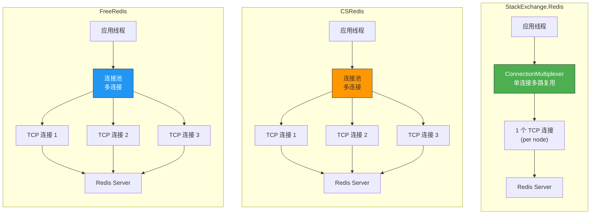
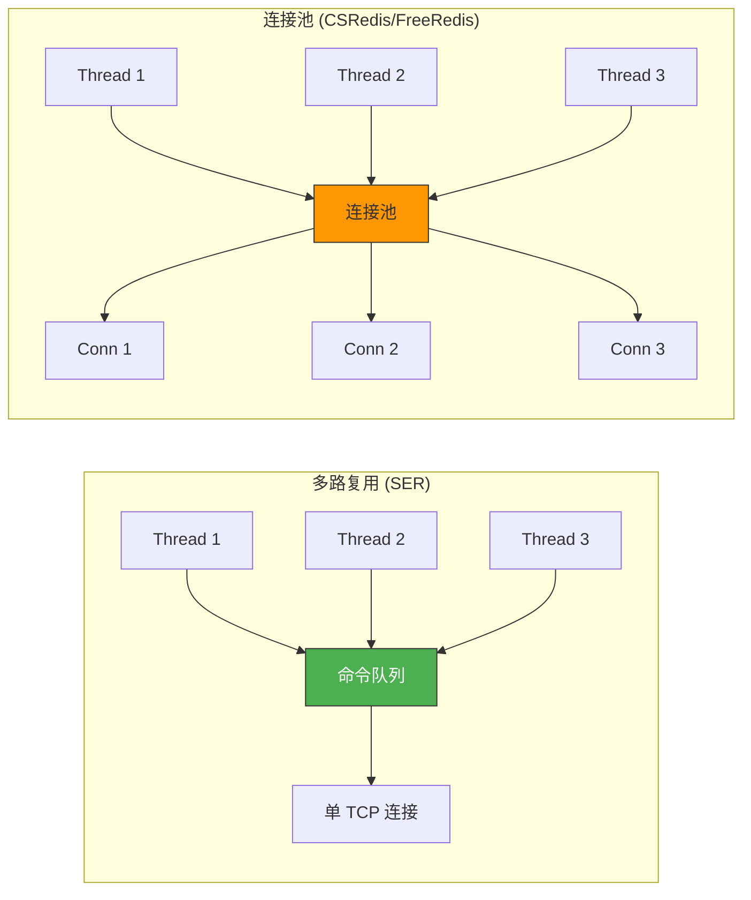
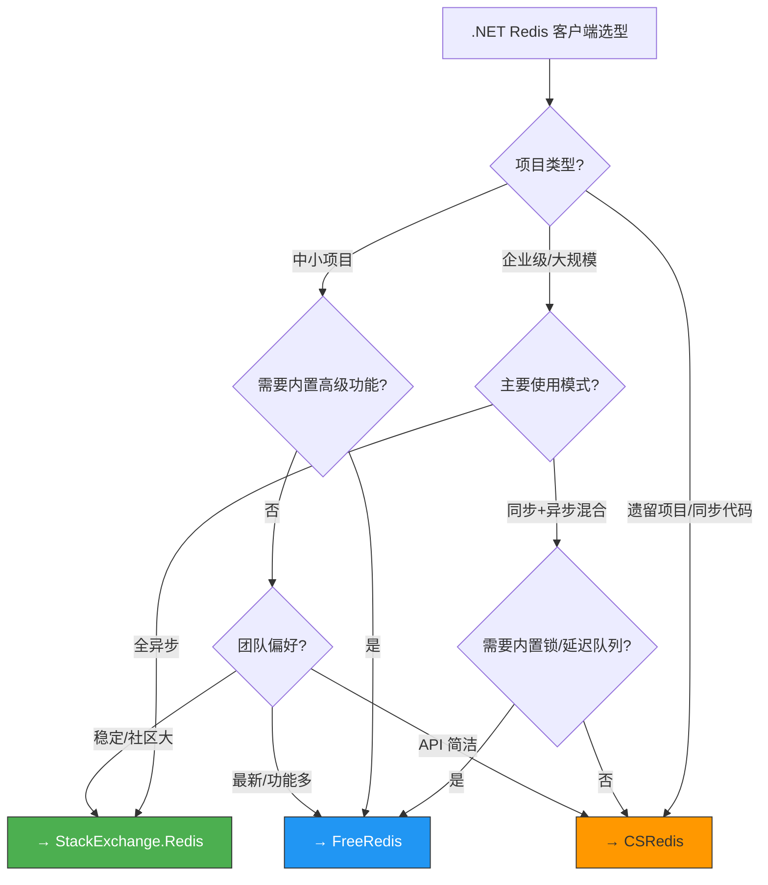

# CSRedis 与 FreeRedis

.NET 生态中，除了 StackExchange.Redis，还有两个重要的 Redis 客户端：**CSRedis** 和 **FreeRedis**。它们各有侧重 —— CSRedis 以简洁 API 和分区支持见长，FreeRedis 以轻量高性能和丰富功能著称。本章深入对比三者的架构、用法和选型策略。

::: tip 本章导航
1. CSRedisCore —— 基础用法、哨兵、集群、分区
2. FreeRedis —— 多种模式、延迟队列、分布式锁、布隆过滤器
3. 三种客户端架构对比
4. 性能基准测试
5. 选型决策指南
:::

---

## 一、CSRedisCore

### 1.1 简介

CSRedisCore 是国内开发者 nicye 创建的 Redis 客户端，特点：

- **API 简洁**：方法签名与 Redis 命令一一对应，学习成本低
- **分区支持**：内置 `CSRedisClient[]` 分区客户端
- **哨兵/集群**：原生支持 Sentinel 和 Cluster
- **同步+异步**：同时提供同步和异步方法
- **Redis 6.0+**：支持 Stream、ACL 等新特性

### 1.2 安装

```bash
# .NET CLI
dotnet add package CSRedisCore

# Package Manager Console
Install-Package CSRedisCore
```

### 1.3 基本连接

```csharp
using CSRedis;

// 单节点连接
var redis = new CSRedisClient("localhost:6379,password=mypassword,defaultDatabase=0");

// 哨兵模式
var redis = new CSRedisClient(
    "mymaster,password=mypassword,defaultDatabase=0",
    "sentinel1:26379", "sentinel2:26379", "sentinel3:26379"
);

// 集群模式
var redis = new CSRedisClient(
    "password=mypassword,defaultDatabase=0",
    "cluster-node1:6379", "cluster-node2:6379", "cluster-node3:6379"
);

// 依赖注入
builder.Services.AddSingleton<CSRedisClient>(
    new CSRedisClient("localhost:6379,password=mypassword")
);
```

### 1.4 String 操作

```csharp
// 设置
redis.Set("name", "Alice");
redis.Set("session:token", "data", 60);  // 60 秒过期

// 获取
string name = redis.Get("name");         // "Alice"
string? missing = redis.Get("unknown");  // null

// 条件设置
redis.Set("lock:order", "locked", 30, RedisExistence.Nx); // NX
redis.Set("counter", 100, RedisExistence.Xx);              // XX

// 递增
long newValue = redis.IncrBy("counter");     // +1
long newValue2 = redis.IncrBy("counter", 10); // +10
double newValue3 = redis.IncrByFloat("price", 19.90);

// 批量操作
redis.MSet("key1", "value1", "key2", "value2");
string[] values = redis.MGet("key1", "key2", "key3");

// GetSet
string? old = redis.GetSet("name", "Bob");
```

### 1.5 Hash 操作

```csharp
// 设置
redis.HSet("user:1001", "name", "Alice");
redis.HSet("user:1001", "age", 30);

// 批量设置
redis.HMSet("user:1001", "name", "Alice", "age", 30, "city", "Beijing");

// 获取
string? name = redis.HGet("user:1001", "name");

// 批量获取
string[] values = redis.HMGet("user:1001", "name", "age");

// 获取所有
Dictionary<string, string> all = redis.HGetAll("user:1001");

// 删除字段
redis.HDel("user:1001", "age");

// 递增
long newAge = redis.HIncrBy("user:1001", "age", 1);

// 判断字段存在
bool exists = redis.HExists("user:1001", "name");

// 获取长度
long count = redis.HLen("user:1001");
```

### 1.6 List 操作

```csharp
// 推入
redis.LPush("tasks", "task1", "task2", "task3");
redis.RPush("tasks", "task4");

// 弹出
string? task = redis.LPop("tasks");
string? task2 = redis.RPop("tasks");

// 阻塞弹出
string[] result = redis.BLPop(5, "tasks");  // 超时 5 秒

// 获取范围
string[] items = redis.LRange("tasks", 0, -1);

// 获取长度
long len = redis.LLen("tasks");

// 裁剪
redis.LTrim("tasks", 0, 99);
```

### 1.7 Set 操作

```csharp
// 添加
redis.SAdd("tags", "redis", "database", "cache");

// 删除
redis.SRem("tags", "cache");

// 判断存在
bool isMember = redis.SIsMember("tags", "redis");

// 获取所有成员
string[] members = redis.SMembers("tags");

// 随机弹出
string? popped = redis.SPop("tags");

// 集合运算
string[] intersection = redis.SInter("set1", "set2");
string[] union = redis.SUnion("set1", "set2");
string[] diff = redis.SDiff("set1", "set2");

// 存储运算结果
redis.SInterStore("result", "set1", "set2");
```

### 1.8 Sorted Set 操作

```csharp
// 添加
redis.ZAdd("leaderboard", (100, "alice"), (85, "bob"), (92, "carol"));

// 递增分数
double newScore = redis.ZIncrBy("leaderboard", "alice", 10);

// 获取排名（升序）
long? rank = redis.ZRank("leaderboard", "alice");

// 获取排名（降序）
long? rankDesc = redis.ZRevRank("leaderboard", "alice");

// 获取分数
double? score = redis.ZScore("leaderboard", "alice");

// 按排名范围获取
string[] top3 = redis.ZRevRange("leaderboard", 0, 2);

// 按排名范围获取（带分数）
( double score, string member)[] top3WithScores = redis.ZRevRangeWithScores("leaderboard", 0, 2);

// 按分数范围获取
string[] above90 = redis.ZRangeByScore("leaderboard", 90, double.PositiveInfinity);

// 按分数范围删除
redis.ZRemRangeByScore("leaderboard", 0, 60);

// 获取成员数量
long count = redis.ZCard("leaderboard");

// 按分数范围计数
long above80 = redis.ZCount("leaderboard", 80, double.PositiveInfinity);
```

### 1.9 Stream 操作

```csharp
// 写入消息
string msgId = redis.XAdd("mystream", ("name", "alice"), ("age", "30"));

// 读取消息
(var messages, var maxId) = redis.XRead(( "mystream", "0-0" ), count: 10);

// 创建消费者组
redis.XGroupCreate("mystream", "mygroup", "0-0");

// 组内消费
(var messages2, var maxId2) = redis.XReadGroup("mygroup", "consumer1",
    ("mystream", ">"), count: 10);

// 确认消息
redis.XAck("mystream", "mygroup", msgId);

// 查看待处理消息
var pending = redis.XPending("mystream", "mygroup");

// 裁剪
redis.XTrim("mystream", 10000);
```

### 1.10 发布订阅

```csharp
// 订阅
redis.Subscribe(("channel1", (msg) =>
{
    Console.WriteLine($"收到消息: {msg.Body}");
}));

// 模式订阅
redis.PSubscribe(("news.*", (msg) =>
{
    Console.WriteLine($"频道: {msg.Channel}, 消息: {msg.Body}");
}));

// 发布
long receivers = redis.Publish("channel1", "Hello, World!");

// 取消订阅
redis.UnSubscribe("channel1");
```

### 1.11 分区客户端

CSRedisCore 内置了分区支持，可以将不同的 key 路由到不同的 Redis 实例：

```csharp
// 分区客户端
var nodes = new CSRedisClient[3];
nodes[0] = new CSRedisClient("redis-node1:6379");
nodes[1] = new CSRedisClient("redis-node2:6379");
nodes[2] = new CSRedisClient("redis-node3:6379");

var redis = new CSRedisClient(NodeRule.Slot, nodes);
// NodeRule.Slot: 使用 CRC16(slot) 取模路由
// 自定义路由规则:
// var redis = new CSRedisClient(key => key.GetHashCode() % nodes.Length, nodes);

// 使用方式和普通客户端一致
redis.Set("user:1001", "Alice");
string? value = redis.Get("user:1001");

// 注意: 分区客户端不支持跨节点操作（MGET、事务等）
```

::: warning 分区限制
分区客户端不支持：
- 跨节点批量操作（MGET/MSET）
- 跨节点事务
- 跨节点 Lua 脚本
- 跨节点 Pub/Sub

如果需要这些功能，请使用 Redis Cluster 或手动 Hash Tag。
:::

### 1.12 CSRedis 依赖注入封装

```csharp
// 注册扩展方法
public static class CSRedisExtensions
{
    public static IServiceCollection AddCSRedis(
        this IServiceCollection services, string connectionString)
    {
        var redis = new CSRedisClient(connectionString);
        RedisHelper.Initialization(redis); // 初始化静态帮助类
        services.AddSingleton<CSRedisClient>(redis);
        return services;
    }

    public static IServiceCollection AddCSRedisCluster(
        this IServiceCollection services, string[] connectionStrings)
    {
        var nodes = connectionStrings
            .Select(s => new CSRedisClient(s))
            .ToArray();
        var redis = new CSRedisClient(NodeRule.Slot, nodes);
        RedisHelper.Initialization(redis);
        services.AddSingleton<CSRedisClient>(redis);
        return services;
    }
}

// 使用
builder.Services.AddCSRedis("localhost:6379,password=mypassword");

// 在服务中使用 RedisHelper 静态方法
public class UserService
{
    public User? GetUser(long userId)
    {
        var cache = RedisHelper.Get($"user:{userId}");
        if (cache != null)
            return JsonSerializer.Deserialize<User>(cache);

        var user = _db.Users.Find(userId);
        if (user != null)
            RedisHelper.Set($"user:{userId}", JsonSerializer.Serialize(user), 3600);

        return user;
    }
}
```

---

## 二、FreeRedis

### 2.1 简介

FreeRedis 是国内开发者 nicye（与 CSRedis 同一作者）的新一代 Redis 客户端，设计目标是**轻量、高性能、功能丰富**：

- **多种客户端模式**：单机、哨兵、集群、分区
- **连接池**：内置高效的连接池管理
- **延迟队列**：基于 Redis Stream 的延迟队列
- **分布式锁**：内置 RedLock 算法
- **布隆过滤器**：内置布隆过滤器支持
- **序列化**：内置 JSON/MessagePack 序列化
- **Pipeline**：支持同步和异步 Pipeline
- **Subscribe**：支持消费确认的订阅

### 2.2 安装

```bash
# .NET CLI
dotnet add package FreeRedis

# 延迟队列扩展
dotnet add package FreeRedis.DelayQueue

# 分布式锁扩展
dotnet add package FreeRedis.DistributedLock

# Package Manager Console
Install-Package FreeRedis
```

### 2.3 基本连接

```csharp
using FreeRedis;

// 单节点连接
var redis = new RedisClient("localhost:6379,password=mypassword,defaultDatabase=0");

// 哨兵模式
var redis = new RedisClient(
    "mymaster,password=mypassword,defaultDatabase=0",
    new[] { "sentinel1:26379", "sentinel2:26379", "sentinel3:26379" }
);

// 集群模式
var redis = new RedisClient(
    new[] { "cluster-node1:6379", "cluster-node2:6379", "cluster-node3:6379" }
);

// 分区模式
var redis = new RedisClient(
    new[] { "node1:6379", "node2:6379", "node3:6379" },
    value => DBNodes.NodeRule.Slot(value)
);

// 依赖注入
builder.Services.AddSingleton<RedisClient>(
    new RedisClient("localhost:6379,password=mypassword")
);
```

### 2.4 String 操作

```csharp
// 设置
redis.Set("name", "Alice");
redis.Set("session:token", "data", expireSeconds: 60);

// 获取
string name = redis.Get("name");
string missing = redis.Get("unknown");  // null

// 条件设置
redis.Set("lock:order", "locked", expire: 30, exists: RedisExist.Nx);
redis.Set("counter", 100, exists: RedisExist.Xx);

// 递增
long val = redis.Incr("counter");
long val2 = redis.IncrBy("counter", 10);
double val3 = redis.IncrByFloat("price", 19.90);

// 批量操作
redis.MSet("key1", "v1", "key2", "v2");
string[] values = redis.MGet("key1", "key2");

// GetSet
string old = redis.GetSet("name", "Bob");

// SetNx
bool ok = redis.SetNx("lock:order", "locked");
```

### 2.5 Hash 操作

```csharp
// 设置
redis.HSet("user:1001", "name", "Alice");
redis.HSet("user:1001", new Dictionary<string, string>
{
    ["name"] = "Alice",
    ["age"] = "30",
    ["city"] = "Beijing"
});

// 获取
string name = redis.HGet("user:1001", "name");
Dictionary<string, string> all = redis.HGetAll("user:1001");

// 删除
redis.HDel("user:1001", "age");

// 递增
long newAge = redis.HIncrBy("user:1001", "age", 1);

// 判断存在
bool exists = redis.HExists("user:1001", "name");
```

### 2.6 List 操作

```csharp
// 推入
redis.LPush("tasks", "task1", "task2");
redis.RPush("tasks", "task3");

// 弹出
string task = redis.LPop("tasks");
string task2 = redis.RPop("tasks");

// 阻塞弹出
string[] result = redis.BLPop(5, "tasks");

// 获取范围
string[] items = redis.LRange("tasks", 0, -1);

// 获取长度
long len = redis.LLen("tasks");
```

### 2.7 Set 操作

```csharp
// 添加
redis.SAdd("tags", "redis", "database");

// 删除
redis.SRem("tags", "database");

// 判断存在
bool isMember = redis.SIsMember("tags", "redis");

// 获取所有
string[] members = redis.SMembers("tags");

// 集合运算
string[] inter = redis.SInter("set1", "set2");
string[] union = redis.SUnion("set1", "set2");
string[] diff = redis.SDiff("set1", "set2");
```

### 2.8 Sorted Set 操作

```csharp
// 添加
redis.ZAdd("leaderboard", (100, "alice"), (85, "bob"));

// 递增
double newScore = redis.ZIncrBy("leaderboard", "alice", 10);

// 获取排名
long rank = redis.ZRank("leaderboard", "alice");
long rankDesc = redis.ZRevRank("leaderboard", "alice");

// 按排名范围获取
string[] top3 = redis.ZRevRange("leaderboard", 0, 2);

// 按分数范围获取
string[] above90 = redis.ZRangeByScore("leaderboard", 90, "+");

// 删除
redis.ZRem("leaderboard", "alice");
```

### 2.9 Stream 操作

```csharp
// 写入
string msgId = redis.XAdd("mystream", ("field1", "value1"), ("field2", "value2"));

// 读取
var messages = redis.XRead(("mystream", "0-0"), count: 10);

// 消费者组
redis.XGroupCreate("mystream", "mygroup", "0-0");
var messages2 = redis.XReadGroup("mygroup", "consumer1",
    ("mystream", ">"), count: 10);
redis.XAck("mystream", "mygroup", msgId);
```

### 2.10 Pipeline

```csharp
// Pipeline 批量操作
var pipeline = redis.StartPipe();

pipeline.Set("key1", "value1");
pipeline.Set("key2", "value2");
pipeline.Get("key1");
pipeline.IncrBy("counter", 1);
pipeline.HSet("user:1", "name", "Alice");

var results = pipeline.EndPipe();
// results[0] = Set 结果
// results[1] = Set 结果
// results[2] = "value1"
// results[3] = 新值
// results[4] = HSet 结果

// 异步 Pipeline
var pipelineAsync = redis.StartPipe();
pipelineAsync.Set("key1", "value1");
pipelineAsync.Get("key1");
var resultsAsync = await pipelineAsync.EndPipeAsync();
```

### 2.11 事务

```csharp
// 事务
using var tran = redis.Multi();

tran.Set("key1", "value1");
tran.Set("key2", "value2");
tran.Get("key1");

var results = tran.Exec();
// results[0] = "OK"
// results[1] = "OK"
// results[2] = "value1"
```

### 2.12 Lua 脚本

```csharp
// 执行 Lua 脚本
var result = redis.Eval(@"
    local current = redis.call('GET', KEYS[1])
    if current == false then
        redis.call('SET', KEYS[1], ARGV[1])
        return 1
    end
    return 0
", "lock:order", "locked");

// 带 SHA 缓存
var sha = redis.ScriptLoad("return redis.call('GET', KEYS[1])");
var result2 = redis.EvalSHA(sha, "mykey");
```

### 2.13 发布订阅

```csharp
// 订阅
redis.Subscribe("channel1", (channel, message) =>
{
    Console.WriteLine($"收到: {message}");
});

// 模式订阅
redis.PSubscribe("news.*", (channel, message) =>
{
    Console.WriteLine($"频道: {channel}, 消息: {message}");
});

// 发布
redis.Publish("channel1", "Hello");

// 取消订阅
redis.UnSubscribe("channel1");
```

### 2.14 延迟队列

FreeRedis 内置了基于 Redis Stream 的延迟队列：

```csharp
using FreeRedis.DistributedLock;

// 创建延迟队列
var queue = redis.DelayQueue<string>("order-timeout", opt =>
{
    opt.RetryInterval = TimeSpan.FromSeconds(5);  // 重试间隔
    opt.PollingInterval = TimeSpan.FromSeconds(1); // 轮询间隔
});

// 添加延迟任务
queue.Enqueue("order:1001", delay: TimeSpan.FromMinutes(30));
queue.Enqueue("order:1002", delay: TimeSpan.FromHours(1));

// 消费延迟任务
queue.Consume((msg, ct) =>
{
    Console.WriteLine($"处理超时订单: {msg}");
    return Task.FromResult(true); // 返回 true 表示处理成功
});

// 运行
await queue.StartAsync(CancellationToken.None);
```

### 2.15 分布式锁

```csharp
using FreeRedis.DistributedLock;

// 内置分布式锁（RedLock 算法）
using var lockObj = redis.Lock("order:1001", 30); // 锁 30 秒
if (lockObj != null)
{
    // 获得锁，执行业务
    ProcessOrder("1001");
}
else
{
    // 未获得锁
    Console.WriteLine("获取锁失败");
}

// 带等待的锁
using var lockObj2 = redis.Lock("order:1002", 30, waitTimeout: 10);
// 等待最多 10 秒获取锁

// 异步锁
using var lockObj3 = await redis.LockAsync("order:1003", 30);

// 手动释放
redis.Unlock("order:1001", lockObj.Id);
```

### 2.16 布隆过滤器

```csharp
// 创建布隆过滤器
var bf = redis.BloomFilter("url-filter", 0.001, 1000000);

// 添加元素
bf.Add("https://example.com/page1");
bf.Add("https://example.com/page2");

// 批量添加
bf.Add("https://example.com/page3", "https://example.com/page4");

// 判断存在
bool exists = bf.Exists("https://example.com/page1");  // true
bool unknown = bf.Exists("https://unknown.com");        // false（或 true，有误判率）

// 批量判断
bool[] results = bf.Exists("https://example.com/page1", "https://unknown.com");
```

### 2.17 缓存拦截器（便捷 API）

```csharp
// FreeRedis 提供了便捷的缓存 API
// 缓存空对象防止穿透
var user = redis.GetOrSet("user:1001", () =>
{
    // 缓存未命中时执行
    return _db.Users.Find(1001);
}, expireSeconds: 3600, nullValueSeconds: 60);
// nullValueSeconds: null 值缓存时间，防止缓存穿透

// 泛型版本
var settings = redis.GetOrSet<AppSettings>("settings:app", () =>
{
    return LoadSettingsFromDb();
}, expireSeconds: 300);
```

### 2.18 连接池配置

```csharp
var redis = new RedisClient(new ConnectionStringBuilder
{
    Host = "localhost",
    Port = 6379,
    Password = "mypassword",
    Database = 0,

    // 连接池
    MaxPoolSize = 100,       // 最大连接数
    MinPoolSize = 5,         // 最小连接数

    // 超时
    ConnectTimeout = 5000,
    SyncTimeout = 5000,
    AsyncTimeout = 10000,

    // 重试
    Retry = 3,
    RetryInterval = 1000,

    // 序列化
    Serialize = obj => JsonSerializer.Serialize(obj),
    Deserialize = (json, type) => JsonSerializer.Deserialize(json, type),
});
```

---

## 三、三种客户端架构对比

### 3.1 架构全景对比



### 3.2 核心架构差异

| 维度 | StackExchange.Redis | CSRedis | FreeRedis |
|---|---|---|---|
| 连接模型 | **多路复用**（单连接） | **连接池**（多连接） | **连接池**（多连接） |
| 并发模型 | 异步 Task + 队列 | 线程池连接 | 线程池连接 |
| 同步方法 | 阻塞等待 | 直接发送 | 直接发送 |
| 异步方法 | async/await | async/await | async/await |
| Pipeline | 自动（隐式） | 显式 Pipe | 显式 Pipe |
| Cluster | 自动路由 | 自动路由 | 自动路由 |
| 分区 | 不内置 | 内置 NodeRule | 内置分区 |
| 延迟队列 | 无 | 无 | 内置 |
| 分布式锁 | 需自行实现 | 需自行实现 | 内置 RedLock |
| 布隆过滤器 | 需模块 | 需模块 | 内置 |

### 3.3 多路复用 vs 连接池



| 对比项 | 多路复用 | 连接池 |
|---|---|---|
| 连接数 | 每节点 1 个 | 每节点 N 个 |
| 内存占用 | 低 | 较高 |
| 同步调用 | 阻塞当前线程 | 不阻塞 |
| 大 Value 影响 | 影响所有请求 | 只影响当前连接 |
| 复杂度 | 高（内部队列调度） | 低（直观连接管理） |
| 适用场景 | 异步为主 | 同步/异步混合 |

---

## 四、性能对比

### 4.1 基准测试场景

```
环境:
- Redis 7.0, 单节点, 本机
- .NET 8, Release 编译
- 测试工具: BenchmarkDotNet
- 数据: String GET/SET, 1000 字节
- 并发: 100 并发线程
```

### 4.2 性能数据（参考值）

| 操作 | StackExchange.Redis | CSRedis | FreeRedis |
|---|---|---|---|
| String GET (async) | ~120,000 ops/s | ~100,000 ops/s | ~110,000 ops/s |
| String SET (async) | ~110,000 ops/s | ~95,000 ops/s | ~105,000 ops/s |
| String GET (sync) | ~50,000 ops/s | ~90,000 ops/s | ~95,000 ops/s |
| String SET (sync) | ~45,000 ops/s | ~85,000 ops/s | ~90,000 ops/s |
| Pipeline (100 cmd) | ~300,000 ops/s | ~280,000 ops/s | ~290,000 ops/s |
| Hash GET | ~100,000 ops/s | ~85,000 ops/s | ~95,000 ops/s |
| MGET (10 key) | ~80,000 ops/s | ~70,000 ops/s | ~75,000 ops/s |

::: important 性能说明
1. **异步操作**：SER 的多路复用在纯异步场景下效率最高
2. **同步操作**：连接池模型（CSRedis/FreeRedis）在同步场景下明显更优
3. **Pipeline**：三者差距不大，SER 的隐式 Pipeline 更方便
4. 实际性能受网络、数据大小、Redis 配置等因素影响，请以自己的基准测试为准
:::

### 4.3 基准测试代码

```csharp
using BenchmarkDotNet.Attributes;
using BenchmarkDotNet.Running;
using StackExchange.Redis;
using FreeRedis;

[MemoryDiagnoser]
public class RedisBenchmark
{
    private ConnectionMultiplexer _ser;
    private IDatabase _serDb;
    private CSRedis.CSRedisClient _csredis;
    private RedisClient _freeRedis;

    [GlobalSetup]
    public void Setup()
    {
        _ser = ConnectionMultiplexer.Connect("localhost:6379");
        _serDb = _ser.GetDatabase();
        _csredis = new CSRedis.CSRedisClient("localhost:6379");
        _freeRedis = new RedisClient("localhost:6379");
    }

    [Benchmark(Description = "SER-Get-Async")]
    public async Task SER_Get_Async()
    {
        await _serDb.StringGetAsync("bench:key");
    }

    [Benchmark(Description = "CSRedis-Get-Async")]
    public async Task CSRedis_Get_Async()
    {
        await _csredis.GetAsync("bench:key");
    }

    [Benchmark(Description = "FreeRedis-Get-Async")]
    public async Task FreeRedis_Get_Async()
    {
        await _freeRedis.GetAsync("bench:key");
    }

    [Benchmark(Description = "SER-Set-Async")]
    public async Task SER_Set_Async()
    {
        await _serDb.StringSetAsync("bench:key", "value");
    }

    [Benchmark(Description = "CSRedis-Set-Async")]
    public async Task CSRedis_Set_Async()
    {
        await _csredis.SetAsync("bench:key", "value");
    }

    [Benchmark(Description = "FreeRedis-Set-Async")]
    public async Task FreeRedis_Set_Async()
    {
        await _freeRedis.SetAsync("bench:key", "value");
    }
}
```

---

## 五、功能特性详细对比

### 5.1 核心功能对比

| 功能 | StackExchange.Redis | CSRedis | FreeRedis |
|---|---|---|---|
| 基础数据类型 | 完整 | 完整 | 完整 |
| Stream | 部分支持 | 完整 | 完整 |
| Pub/Sub | 完整 | 完整 | 完整 |
| 事务 | WATCH+MULTI | MULTI | MULTI |
| Lua 脚本 | 完整+预编译 | 完整 | 完整 |
| Pipeline | 隐式自动 | 显式 Pipe | 显式 Pipe |
| Cluster | 完整 | 完整 | 完整 |
| Sentinel | 完整 | 完整 | 完整 |
| 读写分离 | DemandReplica | 手动 | 手动 |
| 分区 | 无内置 | 内置 | 内置 |
| Geo | 支持 | 支持 | 支持 |
| HyperLogLog | 支持 | 支持 | 支持 |

### 5.2 高级功能对比

| 功能 | StackExchange.Redis | CSRedis | FreeRedis |
|---|---|---|---|
| 延迟队列 | 无 | 无 | 内置 |
| 分布式锁 | 需自行实现 | 需自行实现 | 内置 RedLock |
| 布隆过滤器 | 需模块 | 需模块 | 内置 |
| 缓存拦截 | 无 | 无 | GetOrSet |
| 连接池 | 无（多路复用） | 内置 | 内置 |
| 序列化 | 手动 | 手动 | 内置 |
| 响应缓存 | 无 | 无 | 内置 |
| 慢日志 | 需 API 查询 | 无 | 无 |

### 5.3 API 风格对比

```csharp
// ========== String SET ==========

// StackExchange.Redis
await db.StringSetAsync("key", "value", TimeSpan.FromHours(1));

// CSRedis
await redis.SetAsync("key", "value", 3600);

// FreeRedis
await redis.SetAsync("key", "value", expireSeconds: 3600);

// ========== Hash MSET ==========

// StackExchange.Redis
await db.HashSetAsync("user:1", new HashEntry[]
{
    new("name", "Alice"),
    new("age", 30)
});

// CSRedis
await redis.HMSetAsync("user:1", "name", "Alice", "age", "30");

// FreeRedis
await redis.HSetAsync("user:1", new Dictionary<string, string>
{
    ["name"] = "Alice",
    ["age"] = "30"
});

// ========== Sorted Set ZADD ==========

// StackExchange.Redis
await db.SortedSetAddAsync("board", new SortedSetEntry[]
{
    new("alice", 100),
    new("bob", 85)
});

// CSRedis
await redis.ZAddAsync("board", (100, "alice"), (85, "bob"));

// FreeRedis
await redis.ZAddAsync("board", (100, "alice"), (85, "bob"));
```

::: tip API 风格总结
- **SER**：面向对象，参数使用专用类型（HashEntry、SortedSetEntry）
- **CSRedis**：扁平化，参数直接传递，接近 Redis 命令行
- **FreeRedis**：类似 CSRedis，但增加了命名参数和泛型支持
:::

---

## 六、选型决策指南

### 6.1 选型决策树



### 6.2 选型建议

#### 选择 StackExchange.Redis 的理由

- 项目以**异步编程**为主
- 需要**隐式 Pipeline**，不想手动管理
- 团队已有 SER 的使用经验
- 需要与**微软生态**深度集成（IDistributedCache、Health Checks）
- 需要**WATCH 乐观锁**
- 重视社区和文档

#### 选择 CSRedis 的理由

- 项目有大量**同步调用**
- 需要**分区客户端**
- API 要**简洁直观**，学习成本低
- 团队对 Redis 命令行熟悉
- 不需要复杂的连接管理

#### 选择 FreeRedis 的理由

- 需要**延迟队列、分布式锁、布隆过滤器**等高级功能
- 希望减少第三方依赖
- 需要**连接池**模型
- 需要**GetOrSet**缓存拦截
- 项目以**中小规模**为主
- 希望一个包解决所有 Redis 需求

### 6.3 迁移建议

| 迁移方向 | 难度 | 注意事项 |
|---|---|---|
| SER → CSRedis | 中 | API 风格变化大，RedisValue→string |
| SER → FreeRedis | 中 | API 风格变化，连接管理不同 |
| CSRedis → FreeRedis | 低 | API 相似，同一作者 |
| CSRedis → SER | 高 | 多路复用模型差异大，同步调用需改异步 |
| FreeRedis → SER | 高 | 同上 |

---

## 七、NuGet 安装与配置速查

### 7.1 安装命令

```bash
# StackExchange.Redis
dotnet add package StackExchange.Redis

# CSRedisCore
dotnet add package CSRedisCore

# FreeRedis
dotnet add package FreeRedis
dotnet add package FreeRedis.DistributedLock  # 分布式锁扩展
dotnet add package FreeRedis.DelayQueue       # 延迟队列扩展
```

### 7.2 依赖注入配置

```csharp
// ========== StackExchange.Redis ==========
builder.Services.AddSingleton<IConnectionMultiplexer>(
    ConnectionMultiplexer.Connect(builder.Configuration.GetConnectionString("Redis"))
);
builder.Services.AddScoped<IDatabase>(sp =>
    sp.GetRequiredService<IConnectionMultiplexer>().GetDatabase()
);

// ========== CSRedis ==========
builder.Services.AddSingleton(new CSRedisClient(
    builder.Configuration.GetConnectionString("Redis")
));

// ========== FreeRedis ==========
builder.Services.AddSingleton(new RedisClient(
    builder.Configuration.GetConnectionString("Redis")
));
```

### 7.3 appsettings.json 配置

```json
{
    "ConnectionStrings": {
        "Redis": "localhost:6379,abortConnect=false,connectTimeout=5000,defaultDatabase=0",
        "RedisSentinel": "mymaster,localhost:26379,localhost:26380,localhost:26381",
        "RedisCluster": "node1:6379,node2:6379,node3:6379"
    }
}
```

---

## 八、常见问题

### 8.1 CSRedis 超时问题

```csharp
// 原因: 默认连接池较小
// 解决: 增大连接池
var redis = new CSRedisClient("localhost:6379,poolsize=50");

// 或使用连接池配置
var redis = new CSRedisClient(new CSRedisClientConfiguration
{
    ConnectionString = "localhost:6379",
    MaxPoolSize = 100,
    MinPoolSize = 5,
});
```

### 8.2 FreeRedis 序列化问题

```csharp
// FreeRedis 内置序列化，但需要配置
var redis = new RedisClient("localhost:6379");
redis.Serialize = obj => JsonSerializer.Serialize(obj);
redis.Deserialize = (json, type) => JsonSerializer.Deserialize(json, type);

// 使用泛型 API
var user = redis.Get<User>("user:1");  // 自动反序列化
redis.Set("user:1", user, 3600);       // 自动序列化
```

### 8.3 SER vs CSRedis 同步性能差异

```csharp
// SER 同步调用为什么慢？
// SER 的多路复用模型中，同步调用会：
// 1. 发送命令到队列
// 2. 阻塞当前线程等待响应
// 3. 响应到达后唤醒线程

// CSRedis 连接池模型中，同步调用：
// 1. 从池中获取连接
// 2. 直接发送命令并等待响应
// 3. 归还连接到池

// 结论: 如果项目大量使用同步调用，优先选择 CSRedis/FreeRedis
```

### 8.4 集群模式下的批量操作

```csharp
// StackExchange.Redis
// 自动处理 MOVED，但 MGET 跨 slot 会报错
var values = db.StringGet(new RedisKey[] { "{user}:1", "{user}:2" }); // 需要 Hash Tag

// CSRedis
// 集群模式自动处理，MGET 会被拆分到各节点
var values = redis.MGet("user:1", "user:2"); // 自动拆分

// FreeRedis
// 集群模式自动处理，同 CSRedis
var values = redis.MGet("user:1", "user:2"); // 自动拆分
```

---

## 九、总结

### 9.1 一句话总结

| 客户端 | 一句话评价 |
|---|---|
| StackExchange.Redis | 异步优先的企业级选择，社区最大，文档最全 |
| CSRedis | API 简洁的实用派，同步性能好，分区支持 |
| FreeRedis | 功能丰富的全能选手，内置锁/队列/布隆过滤器 |

### 9.2 最佳实践清单

::: tip .NET Redis 客户端 Checklist
- [ ] 根据项目需求**选型**，不要盲目跟风
- [ ] 无论哪种客户端，都使用**依赖注入**管理生命周期
- [ ] 连接字符串配置 `abortConnect=false`
- [ ] 优先使用**异步 API**
- [ ] 大批量操作使用 **Pipeline**
- [ ] 监控 Redis 连接**健康状态**
- [ ] 捕获超时异常并**降级处理**
- [ ] Key 设计使用**冒号分隔**的层次命名
- [ ] 设置合理的**过期时间**，避免内存泄漏
- [ ] 分布式锁使用**Lua 脚本**保证原子性
:::

---

> **参考来源**
> - StackExchange.Redis GitHub: [https://github.com/StackExchange/StackExchange.Redis](https://github.com/StackExchange/StackExchange.Redis)
> - CSRedisCore GitHub: [https://github.com/2881099/csredis](https://github.com/2881099/csredis)
> - FreeRedis GitHub: [https://github.com/2881099/FreeRedis](https://github.com/2881099/FreeRedis)
> - Redis 官方文档: [Clients](https://redis.io/docs/clients/)
> - .NET Redis 客户端对比: [NuGet Trends](https://nugettrends.com/)
