# .NET 分布式缓存方案

## 从单机缓存到分布式缓存

在单体应用时代，`MemoryCache` 就够用了——数据在进程内，访问纳秒级。但当系统演进到微服务架构，每个服务实例拥有独立的内存空间，本地缓存无法在实例间共享，导致：

- **缓存命中率骤降**：请求落到不同实例，缓存重复构建
- **数据不一致**：实例 A 更新了数据，实例 B 的缓存还是旧值
- **内存浪费**：同一份数据在 N 个实例中各存一份

分布式缓存应运而生——所有服务实例共享同一份缓存，一次写入，全局可见。

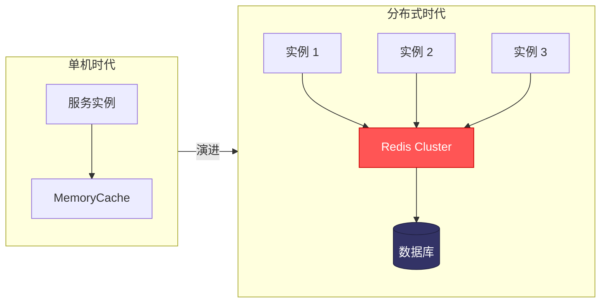

## IDistributedCache 接口体系

### 接口定义

.NET 从 2.0 时代就引入了 `IDistributedCache` 抽象接口，位于 `Microsoft.Extensions.Caching.Abstractions` 包中：

```csharp
namespace Microsoft.Extensions.Caching.Distributed;

public interface IDistributedCache
{
    // 基础操作
    byte[]? Get(string key);
    Task<byte[]?> GetAsync(string key, CancellationToken token = default);

    void Refresh(string key);
    Task RefreshAsync(string key, CancellationToken token = default);

    void Remove(string key);
    Task RemoveAsync(string key, CancellationToken token = default);

    // 设置缓存（含过期时间）
    void Set(string key, byte[] value, DistributedCacheEntryOptions options);
    Task SetAsync(string key, byte[] value, DistributedCacheEntryOptions options,
        CancellationToken token = default);
}
```

::: tip 为什么是 byte[] 而不是泛型？
`IDistributedCache` 设计为底层抽象，序列化策略由上层决定。`byte[]` 是最通用的二进制表示，可以通过 JSON、MessagePack、Protobuf 等任意方式序列化。.NET 7+ 提供了扩展方法 `GetAsync<T>` / `SetAsync<T>` 来简化泛型操作。
:::

### 三大实现对比

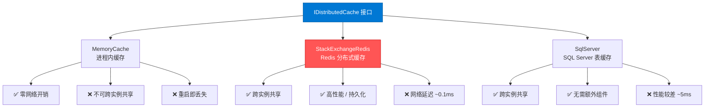

| 特性 | Memory | Redis | SQL Server |
|------|--------|-------|------------|
| 延迟 | ~0.001ms | ~0.1ms | ~5ms |
| 共享 | 单进程 | 全局 | 全局 |
| 持久化 | 无 | RDB/AOF | 数据库 |
| 容量 | 受限于内存 | 可扩展 | 受限于磁盘 |
| 适用场景 | 单体/测试 | 生产环境 | 兼容性方案 |

## Microsoft.Extensions.Caching.StackExchangeRedis

### 安装与配置

```bash
dotnet add package Microsoft.Extensions.Caching.StackExchangeRedis
```

```csharp
// Program.cs
builder.Services.AddStackExchangeRedisCache(options =>
{
    options.Configuration = builder.Configuration.GetConnectionString("Redis");
    options.InstanceName = "myapp:"; // Key 前缀，避免冲突

    // 高级配置
    options.ConfigurationOptions = new ConfigurationOptions
    {
        EndPoints = { { "redis-primary", 6379 }, { "redis-replica", 6379 } },
        Password = "your-password",
        Ssl = true,
        AbortOnConnectFail = false, // 初始连接失败不抛异常
        ConnectRetry = 3,
        ConnectTimeout = 5000,
        SyncTimeout = 3000,
        AsyncTimeout = 5000,
        DefaultDatabase = 0
    };
});
```

::: important InstanceName 的作用
`InstanceName` 会作为 Key 的前缀。例如 `InstanceName = "myapp:"`，`Set("user:1", ...)` 实际存储的 Key 是 `myapp:user:1`。这在多应用共享同一 Redis 实例时至关重要。
:::

### 基础用法

```csharp
public class UserService
{
    private readonly IDistributedCache _cache;
    private readonly IUserRepository _repo;

    public UserService(IDistributedCache cache, IUserRepository repo)
    {
        _cache = cache;
        _repo = repo;
    }

    // 读取用户
    public async Task<User?> GetUserAsync(int userId)
    {
        var cacheKey = $"user:{userId}";
        var cached = await _cache.GetStringAsync(cacheKey);

        if (cached is not null)
        {
            return JsonSerializer.Deserialize<User>(cached);
        }

        var user = await _repo.GetByIdAsync(userId);
        if (user is not null)
        {
            var options = new DistributedCacheEntryOptions
            {
                AbsoluteExpirationRelativeToNow = TimeSpan.FromMinutes(30),
                SlidingExpiration = TimeSpan.FromMinutes(10)
            };
            await _cache.SetStringAsync(cacheKey,
                JsonSerializer.Serialize(user), options);
        }

        return user;
    }

    // 更新用户
    public async Task UpdateUserAsync(User user)
    {
        await _repo.UpdateAsync(user);

        var cacheKey = $"user:{user.Id}";
        var options = new DistributedCacheEntryOptions
        {
            AbsoluteExpirationRelativeToNow = TimeSpan.FromMinutes(30)
        };
        await _cache.SetStringAsync(cacheKey,
            JsonSerializer.Serialize(user), options);
    }

    // 删除用户
    public async Task DeleteUserAsync(int userId)
    {
        await _repo.DeleteAsync(userId);
        await _cache.RemoveAsync($"user:{userId}");
    }
}
```

### DistributedCacheEntryOptions 详解

```csharp
var options = new DistributedCacheEntryOptions
{
    // 绝对过期：从现在起 30 分钟后过期
    AbsoluteExpirationRelativeToNow = TimeSpan.FromMinutes(30),

    // 绝对过期：指定具体时间点过期
    // AbsoluteExpiration = DateTimeOffset.Parse("2026-12-31 23:59:59"),

    // 滑动过期：10 分钟内无人访问则过期，每次访问重置
    SlidingExpiration = TimeSpan.FromMinutes(10)
};
```

::: warning 绝对过期 + 滑动过期的交互
同时设置两种过期时，**先到者生效**。这是防止缓存无限续期的安全网——即使持续被访问，到了绝对过期时间也会被清除，确保数据最终刷新。
:::

### .NET 7+ 泛型扩展

.NET 7 引入了 `GetAsync<T>` 和 `SetAsync<T>` 扩展方法，需要注册序列化器：

```csharp
// .NET 8 使用 System.Text.Json
builder.Services.AddDistributedMemoryCache(); // 开发环境
builder.Services.AddStackExchangeRedisCache(options =>
{
    options.Configuration = "localhost:6379";
    options.InstanceName = "myapp:";
});
```

自定义泛型缓存服务封装：

```csharp
public interface ICacheService
{
    Task<T?> GetAsync<T>(string key, CancellationToken ct = default);
    Task SetAsync<T>(string key, T value, DistributedCacheEntryOptions? options = null,
        CancellationToken ct = default);
    Task RemoveAsync(string key, CancellationToken ct = default);
    Task<T> GetOrSetAsync<T>(string key, Func<Task<T>> factory,
        DistributedCacheEntryOptions? options = null, CancellationToken ct = default);
}

public class RedisCacheService : ICacheService
{
    private readonly IDistributedCache _cache;
    private readonly ILogger<RedisCacheService> _logger;

    private static readonly JsonSerializerOptions JsonOptions = new()
    {
        PropertyNamingPolicy = JsonNamingPolicy.CamelCase,
        WriteIndented = false,
        DefaultIgnoreCondition = JsonIgnoreCondition.WhenWritingNull
    };

    public RedisCacheService(IDistributedCache cache, ILogger<RedisCacheService> logger)
    {
        _cache = cache;
        _logger = logger;
    }

    public async Task<T?> GetAsync<T>(string key, CancellationToken ct = default)
    {
        var bytes = await _cache.GetAsync(key, ct);
        if (bytes is null) return default;

        return JsonSerializer.Deserialize<T>(bytes, JsonOptions);
    }

    public async Task SetAsync<T>(string key, T value,
        DistributedCacheEntryOptions? options = null, CancellationToken ct = default)
    {
        options ??= new DistributedCacheEntryOptions
        {
            AbsoluteExpirationRelativeToNow = TimeSpan.FromMinutes(30)
        };

        var bytes = JsonSerializer.SerializeToUtf8Bytes(value, JsonOptions);
        await _cache.SetAsync(key, bytes, options, ct);
    }

    public async Task RemoveAsync(string key, CancellationToken ct = default)
    {
        await _cache.RemoveAsync(key, ct);
    }

    public async Task<T> GetOrSetAsync<T>(string key, Func<Task<T>> factory,
        DistributedCacheEntryOptions? options = null, CancellationToken ct = default)
    {
        var cached = await GetAsync<T>(key, ct);
        if (cached is not null)
        {
            _logger.LogDebug("Cache HIT: {Key}", key);
            return cached;
        }

        _logger.LogDebug("Cache MISS: {Key}", key);
        var value = await factory();
        await SetAsync(key, value, options, ct);
        return value;
    }
}
```

注册服务：

```csharp
builder.Services.AddScoped<ICacheService, RedisCacheService>();
```

## 缓存穿透防护

### 什么是缓存穿透？

缓存穿透是指**查询一个数据库中也不存在的数据**，由于缓存无法命中（因为数据不存在，无法缓存），每次请求都会穿透到数据库，在高并发场景下可能导致数据库崩溃。

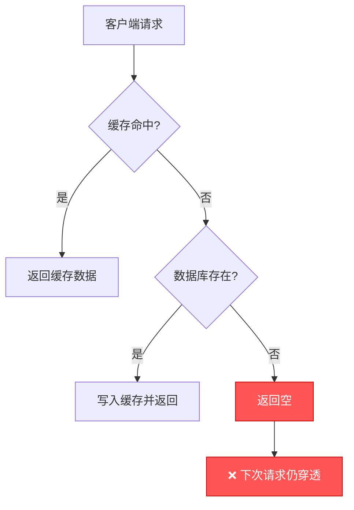

典型场景：
- 恶意攻击：用大量不存在的 ID 发起请求（如 `id = -1`）
- 业务漏洞：查询已删除的资源
- 非法参数：ID 格式不合法但未校验

### 方案一：空值缓存

```csharp
public class PenetrationGuardService
{
    private readonly IDistributedCache _cache;
    private readonly IUserRepository _repo;

    // 空值标识：使用特殊前缀区分真实数据和空值
    private const string NULL_VALUE = "NULL_CACHE_VALUE";

    public async Task<User?> GetUserSafeAsync(int userId)
    {
        var cacheKey = $"user:{userId}";

        var cached = await _cache.GetStringAsync(cacheKey);
        if (cached is not null)
        {
            if (cached == NULL_VALUE)
            {
                // 命中空值缓存，直接返回 null，不再查库
                return null;
            }
            return JsonSerializer.Deserialize<User>(cached);
        }

        var user = await _repo.GetByIdAsync(userId);
        if (user is not null)
        {
            // 正常数据：30 分钟过期
            await _cache.SetStringAsync(cacheKey,
                JsonSerializer.Serialize(user),
                new DistributedCacheEntryOptions
                {
                    AbsoluteExpirationRelativeToNow = TimeSpan.FromMinutes(30)
                });
        }
        else
        {
            // 空值缓存：短时间过期，防止长期占用内存
            await _cache.SetStringAsync(cacheKey, NULL_VALUE,
                new DistributedCacheEntryOptions
                {
                    AbsoluteExpirationRelativeToNow = TimeSpan.FromMinutes(5)
                });
        }

        return user;
    }
}
```

::: warning 空值缓存的风险
- **内存膨胀**：如果攻击者使用大量不同的无效 Key，空值缓存会占用大量内存
- **数据延迟**：数据库后来插入了该数据，但空值缓存还没过期
- **建议**：空值过期时间要短（2~5 分钟），并设置 Key 总数上限
:::

### 方案二：布隆过滤器

布隆过滤器（Bloom Filter）是一种空间效率极高的概率型数据结构，可以判断某个元素**一定不存在**或**可能存在**。

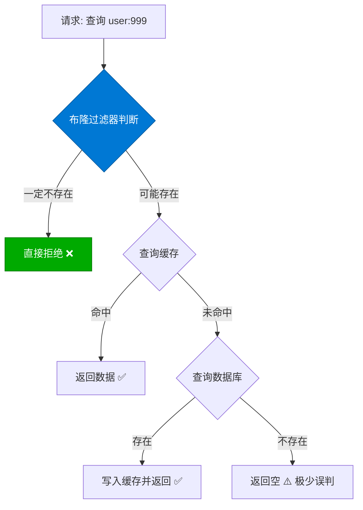

使用 Redis 布隆过滤器（需 Redis Stack 或 RedisBloom 模块）：

```csharp
public class BloomFilterService
{
    private readonly IConnectionMultiplexer _redis;
    private readonly ILogger<BloomFilterService> _logger;

    public BloomFilterService(IConnectionMultiplexer redis,
        ILogger<BloomFilterService> logger)
    {
        _redis = redis;
        _logger = logger;
    }

    /// <summary>
    /// 初始化布隆过滤器：将所有合法 ID 加载到过滤器中
    /// </summary>
    public async Task InitializeAsync(string filterName, IEnumerable<long> ids)
    {
        var db = _redis.GetDatabase();
        foreach (var id in ids)
        {
            // 使用多个哈希函数模拟布隆过滤器
            await AddAsync(filterName, id.ToString());
        }
        _logger.LogInformation("布隆过滤器 {Filter} 初始化完成", filterName);
    }

    /// <summary>
    /// 添加元素到布隆过滤器
    /// </summary>
    public async Task AddAsync(string filterName, string value)
    {
        var db = _redis.GetDatabase();
        var positions = GetHashPositions(filterName, value);
        foreach (var pos in positions)
        {
            await db.StringSetBitAsync(filterName, pos, true);
        }
    }

    /// <summary>
    /// 判断元素是否可能存在
    /// </summary>
    public async Task<bool> MightExistAsync(string filterName, string value)
    {
        var db = _redis.GetDatabase();
        var positions = GetHashPositions(filterName, value);
        foreach (var pos in positions)
        {
            if (!await db.StringGetBitAsync(filterName, pos))
            {
                return false; // 任何一个位为 0，一定不存在
            }
        }
        return true; // 所有位都为 1，可能存在
    }

    /// <summary>
    /// 计算哈希位置（模拟多个哈希函数）
    /// </summary>
    private long[] GetHashPositions(string filterName, string value,
        int hashCount = 7, long bitSize = 100_000_000)
    {
        var positions = new long[hashCount];
        var hash1 = MurmurHash(value, 0);
        var hash2 = MurmurHash(value, hash1);

        for (var i = 0; i < hashCount; i++)
        {
            // 双哈希技巧：hash_i = hash1 + i * hash2
            positions[i] = Math.Abs((hash1 + i * hash2) % bitSize);
        }
        return positions;
    }

    private long MurmurHash(string value, long seed)
    {
        // 简化实现，生产环境建议使用 System.Data.HashFunction.MurmurHash
        var bytes = Encoding.UTF8.GetBytes(value);
        unchecked
        {
            const uint m = 0x5bd1e995;
            var h = (uint)(seed ^ bytes.Length);
            foreach (var b in bytes)
            {
                var k = b;
                k *= m;
                k ^= k >> 24;
                k *= m;
                h *= m;
                h ^= k;
            }
            h ^= h >> 13;
            h *= m;
            h ^= h >> 15;
            return Math.Abs(h);
        }
    }
}
```

结合布隆过滤器的缓存服务：

```csharp
public class BloomGuardedCacheService
{
    private readonly IDistributedCache _cache;
    private readonly BloomFilterService _bloom;
    private readonly IUserRepository _repo;

    public async Task<User?> GetUserAsync(int userId)
    {
        // 第一层：布隆过滤器快速判断
        var mightExist = await _bloom.MightExistAsync("user_filter", userId.ToString());
        if (!mightExist)
        {
            // 一定不存在，直接返回
            return null;
        }

        // 第二层：查询缓存
        var cacheKey = $"user:{userId}";
        var cached = await _cache.GetStringAsync(cacheKey);
        if (cached is not null)
        {
            return JsonSerializer.Deserialize<User>(cached);
        }

        // 第三层：查询数据库
        var user = await _repo.GetByIdAsync(userId);
        if (user is not null)
        {
            await _cache.SetStringAsync(cacheKey,
                JsonSerializer.Serialize(user),
                new DistributedCacheEntryOptions
                {
                    AbsoluteExpirationRelativeToNow = TimeSpan.FromMinutes(30)
                });
        }

        return user;
    }

    /// <summary>
    /// 新增用户时同步更新布隆过滤器
    /// </summary>
    public async Task CreateUserAsync(User user)
    {
        await _repo.CreateAsync(user);
        await _bloom.AddAsync("user_filter", user.Id.ToString());
    }
}
```

::: info 布隆过滤器的误判率
布隆过滤器存在误判（False Positive），但**不会漏判（False Negative）**。误判率取决于：
- 位数组大小 m
- 哈希函数个数 k
- 已插入元素个数 n

当 n = 1 亿，m = 1GB（约 80 亿 bit），k = 7 时，误判率约为 0.8%，完全可接受。
:::

### 方案对比

| 方案 | 拦截率 | 内存消耗 | 实现复杂度 | 适用场景 |
|------|--------|---------|-----------|---------|
| 空值缓存 | 100% | 高（随无效Key增长） | 低 | 无效Key较少 |
| 布隆过滤器 | ~99.2% | 低（1亿ID约100MB） | 中 | 无效Key大量、ID可枚举 |
| 参数校验 | 100% | 无 | 低 | 第一道防线 |
| 组合方案 | ~99.9% | 中 | 高 | 生产环境推荐 |

## 缓存击穿防护

### 什么是缓存击穿？

缓存击穿是指**一个热点 Key 在过期的瞬间，大量并发请求同时穿透到数据库**，导致数据库瞬时压力暴增。

与缓存穿透的区别：
- **穿透**：数据根本不存在，无法缓存
- **击穿**：数据存在，但缓存过期的瞬间并发请求涌入

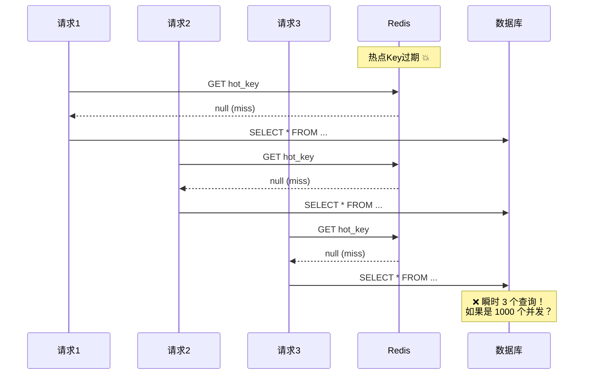

### 方案一：互斥锁

只允许一个请求去加载数据，其他请求等待并读取后续写入的缓存。

```csharp
public class MutexCacheService
{
    private readonly IDistributedCache _cache;
    private readonly IConnectionMultiplexer _redis;
    private readonly IUserRepository _repo;
    private readonly ILogger<MutexCacheService> _logger;

    // 分布式锁 Key 前缀
    private const string LockPrefix = "lock:cache:";
    private static readonly TimeSpan LockExpiry = TimeSpan.FromSeconds(10);
    private static readonly TimeSpan LockWait = TimeSpan.FromSeconds(5);
    private static readonly TimeSpan LockRetryDelay = TimeSpan.FromMilliseconds(50);

    public async Task<User?> GetUserWithLockAsync(int userId)
    {
        var cacheKey = $"user:{userId}";
        var lockKey = $"{LockPrefix}{cacheKey}";

        // 1. 先查缓存
        var cached = await _cache.GetStringAsync(cacheKey);
        if (cached is not null)
        {
            return JsonSerializer.Deserialize<User>(cached);
        }

        // 2. 缓存未命中，尝试获取分布式锁
        var lockAcquired = await AcquireLockAsync(lockKey);
        if (!lockAcquired)
        {
            // 未获得锁，等待其他线程写入缓存后重试
            return await WaitForCacheAsync(cacheKey, lockKey);
        }

        try
        {
            // 3. 获得锁后，再次检查缓存（Double-Check）
            cached = await _cache.GetStringAsync(cacheKey);
            if (cached is not null)
            {
                return JsonSerializer.Deserialize<User>(cached);
            }

            // 4. 查询数据库
            _logger.LogInformation("Cache MISS with lock: {Key}, loading from DB", cacheKey);
            var user = await _repo.GetByIdAsync(userId);

            if (user is not null)
            {
                await _cache.SetStringAsync(cacheKey,
                    JsonSerializer.Serialize(user),
                    new DistributedCacheEntryOptions
                    {
                        AbsoluteExpirationRelativeToNow = TimeSpan.FromMinutes(30)
                    });
            }

            return user;
        }
        finally
        {
            // 5. 释放锁
            await ReleaseLockAsync(lockKey);
        }
    }

    private async Task<bool> AcquireLockAsync(string lockKey)
    {
        var db = _redis.GetDatabase();
        return await db.StringSetAsync(lockKey, Environment.MachineName,
            LockExpiry, When.NotExists);
    }

    private async Task ReleaseLockAsync(string lockKey)
    {
        var db = _redis.GetDatabase();
        // 使用 Lua 脚本保证原子性：只释放自己持有的锁
        var script = @"
            if redis.call('get', KEYS[1]) == ARGV[1] then
                return redis.call('del', KEYS[1])
            else
                return 0
            end";
        await db.ScriptEvaluateAsync(script,
            new RedisKey[] { lockKey },
            new RedisValue[] { Environment.MachineName });
    }

    private async Task<User?> WaitForCacheAsync(string cacheKey, string lockKey)
    {
        var sw = Stopwatch.StartNew();
        while (sw.Elapsed < LockWait)
        {
            await Task.Delay(LockRetryDelay);

            var cached = await _cache.GetStringAsync(cacheKey);
            if (cached is not null)
            {
                return JsonSerializer.Deserialize<User>(cached);
            }
        }

        // 等待超时，降级为直接查库
        _logger.LogWarning("Wait for cache timeout: {Key}", cacheKey);
        return await _repo.GetByIdAsync(
            int.Parse(cacheKey.Split(':')[1]));
    }
}
```

::: important Double-Check 的必要性
获取锁后必须再次检查缓存。假设线程 A 和线程 B 同时发现缓存 miss，线程 A 先获得锁并加载数据写入缓存，线程 B 等待获取锁后如果不 Double-Check，会再次查库，造成不必要的 DB 访问。
:::

### 方案二：逻辑过期（永不过期）

不设置物理过期时间，而是在 Value 中嵌入逻辑过期时间。缓存永远不过期（或设置很长的过期时间），逻辑过期后异步刷新。

```csharp
// 缓存值包装类
public class CacheItem<T>
{
    public T? Data { get; set; }
    public DateTime ExpireTime { get; set; }
    public bool IsExpired => DateTime.UtcNow > ExpireTime;
}

public class LogicalExpiryCacheService
{
    private readonly IDistributedCache _cache;
    private readonly IUserRepository _repo;
    private readonly ILogger<LogicalExpiryCacheService> _logger;

    // 逻辑过期时间
    private static readonly TimeSpan LogicalExpiry = TimeSpan.FromMinutes(30);

    public async Task<User?> GetUserAsync(int userId)
    {
        var cacheKey = $"user:logical:{userId}";
        var cached = await _cache.GetStringAsync(cacheKey);

        if (cached is not null)
        {
            var item = JsonSerializer.Deserialize<CacheItem<User>>(cached);

            if (item is not null && !item.IsExpired)
            {
                // 逻辑未过期，直接返回
                return item.Data;
            }

            if (item is not null && item.IsExpired)
            {
                // 逻辑已过期，先返回旧数据，异步刷新
                _ = RefreshCacheAsync(cacheKey, userId);
                return item.Data; // 返回稍过期的数据
            }
        }

        // 缓存完全不存在，同步加载
        return await LoadAndCacheAsync(cacheKey, userId);
    }

    private async Task RefreshCacheAsync(string cacheKey, int userId)
    {
        try
        {
            _logger.LogInformation("Async refreshing cache: {Key}", cacheKey);
            await LoadAndCacheAsync(cacheKey, userId);
        }
        catch (Exception ex)
        {
            _logger.LogError(ex, "Async refresh failed: {Key}", cacheKey);
        }
    }

    private async Task<User?> LoadAndCacheAsync(string cacheKey, int userId)
    {
        var user = await _repo.GetByIdAsync(userId);
        if (user is not null)
        {
            var item = new CacheItem<User>
            {
                Data = user,
                ExpireTime = DateTime.UtcNow.Add(LogicalExpiry)
            };

            // 物理过期设置为逻辑过期的 3 倍，作为兜底
            await _cache.SetStringAsync(cacheKey,
                JsonSerializer.Serialize(item),
                new DistributedCacheEntryOptions
                {
                    AbsoluteExpirationRelativeToNow = TimeSpan.FromMinutes(90)
                });
        }
        return user;
    }
}
```

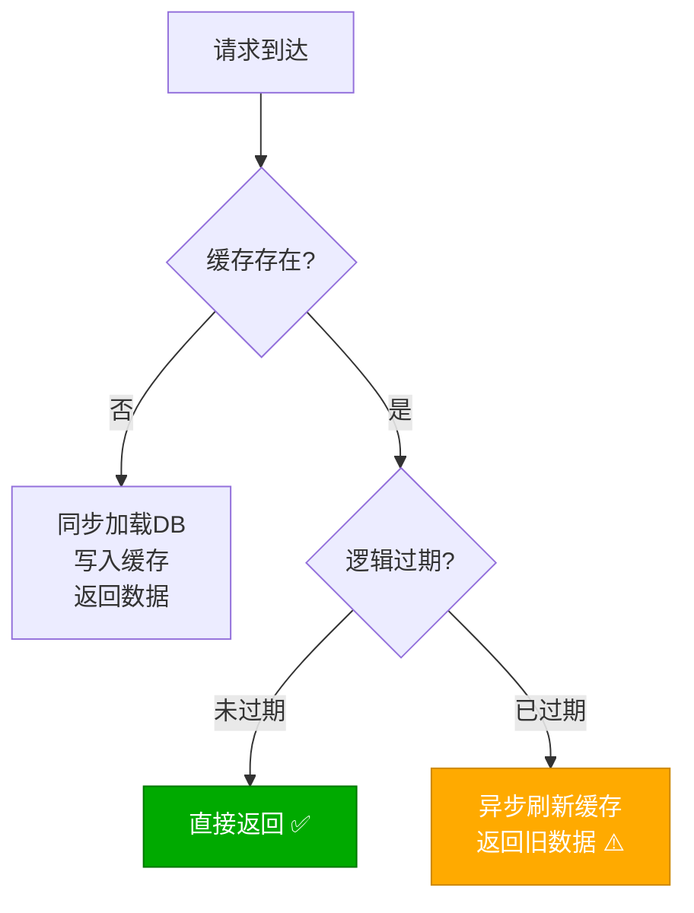

### 方案对比

| 方案 | 一致性 | 可用性 | 实现复杂度 | 适用场景 |
|------|--------|-------|-----------|---------|
| 互斥锁 | 强一致 | 等待可能超时 | 中 | 数据要求实时 |
| 逻辑过期 | 最终一致 | 高可用 | 中 | 允许短暂过期 |
| 永不过期 + 定时刷新 | 最终一致 | 最高 | 低 | 变化不频繁 |

::: tip 如何选择？
- **金融/交易**：互斥锁，宁可等也不能用旧数据
- **商品/内容**：逻辑过期，允许短暂过期换取高可用
- **配置/字典**：永不过期 + 定时刷新，数据变化少
:::

## 缓存雪崩防护

### 什么是缓存雪崩？

缓存雪崩是指**大量 Key 在同一时间集中过期**，或 **Redis 节点宕机**，导致大量请求同时穿透到数据库，造成数据库过载甚至崩溃。

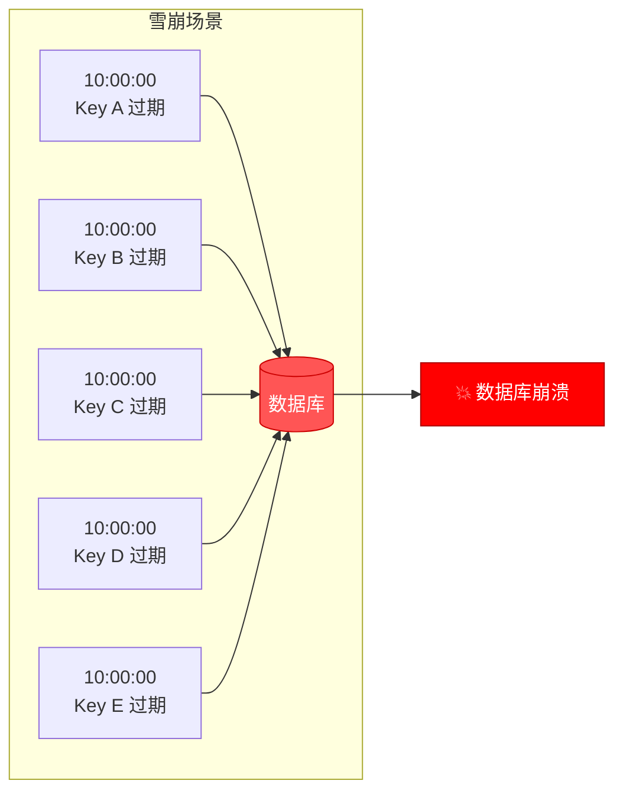

### 方案一：随机过期时间

在基础过期时间上叠加随机偏移，打散过期时间点。

```csharp
public class RandomExpiryCacheService
{
    private readonly IDistributedCache _cache;

    // 基础过期时间
    private static readonly TimeSpan BaseExpiry = TimeSpan.FromMinutes(30);

    // 随机偏移范围：±10 分钟
    private static readonly TimeSpan RandomRange = TimeSpan.FromMinutes(10);

    public async Task SetWithRandomExpiryAsync<T>(string key, T value)
    {
        var randomOffset = TimeSpan.FromSeconds(
            Random.Shared.Next(
                -(int)RandomRange.TotalSeconds,
                (int)RandomRange.TotalSeconds));

        var expiry = BaseExpiry + randomOffset;

        await _cache.SetStringAsync(key,
            JsonSerializer.Serialize(value),
            new DistributedCacheEntryOptions
            {
                AbsoluteExpirationRelativeToNow = expiry
            });
    }

    /// <summary>
    /// 批量设置时使用不同的随机过期
    /// </summary>
    public async Task BatchSetAsync<T>(Dictionary<string, T> items)
    {
        foreach (var (key, value) in items)
        {
            // 每个Key使用不同的随机过期时间
            var expiry = TimeSpan.FromMinutes(
                30 + Random.Shared.Next(-10, 10));

            await _cache.SetStringAsync(key,
                JsonSerializer.Serialize(value),
                new DistributedCacheEntryOptions
                {
                    AbsoluteExpirationRelativeToNow = expiry
                });
        }
    }
}
```

### 方案二：多级缓存架构

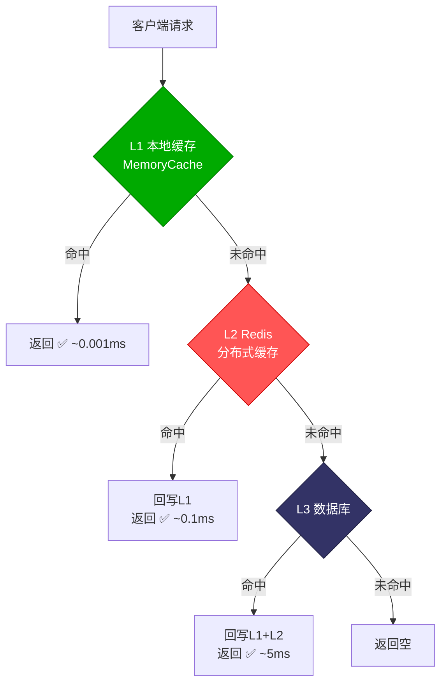

```csharp
public class MultiLevelCacheService
{
    private readonly IMemoryCache _l1Cache;       // L1: 本地缓存
    private readonly IDistributedCache _l2Cache;   // L2: Redis
    private readonly IUserRepository _l3Repo;     // L3: 数据库
    private readonly ILogger<MultiLevelCacheService> _logger;

    public MultiLevelCacheService(
        IMemoryCache l1Cache,
        IDistributedCache l2Cache,
        IUserRepository l3Repo,
        ILogger<MultiLevelCacheService> logger)
    {
        _l1Cache = l1Cache;
        _l2Cache = l2Cache;
        _l3Repo = l3Repo;
        _logger = logger;
    }

    public async Task<User?> GetUserAsync(int userId)
    {
        var cacheKey = $"user:{userId}";

        // L1: 本地缓存（最快）
        if (_l1Cache.TryGetValue(cacheKey, out User? l1Value))
        {
            _logger.LogDebug("L1 HIT: {Key}", cacheKey);
            return l1Value;
        }

        // L2: Redis 分布式缓存
        var l2Value = await _l2Cache.GetStringAsync(cacheKey);
        if (l2Value is not null)
        {
            _logger.LogDebug("L2 HIT: {Key}", cacheKey);
            var user = JsonSerializer.Deserialize<User>(l2Value);

            // 回写 L1（本地缓存时间短于 L2）
            _l1Cache.Set(cacheKey, user, TimeSpan.FromMinutes(5));
            return user;
        }

        // L3: 数据库
        _logger.LogDebug("L3 HIT: {Key}", cacheKey);
        var dbUser = await _l3Repo.GetByIdAsync(userId);
        if (dbUser is not null)
        {
            // 回写 L1 + L2
            _l1Cache.Set(cacheKey, dbUser, TimeSpan.FromMinutes(5));

            var l2Expiry = TimeSpan.FromMinutes(30) +
                TimeSpan.FromSeconds(Random.Shared.Next(-300, 300));
            await _l2Cache.SetStringAsync(cacheKey,
                JsonSerializer.Serialize(dbUser),
                new DistributedCacheEntryOptions
                {
                    AbsoluteExpirationRelativeToNow = l2Expiry
                });
        }

        return dbUser;
    }

    /// <summary>
    /// 更新数据时，同时失效 L1 和 L2
    /// </summary>
    public async Task UpdateUserAsync(User user)
    {
        await _l3Repo.UpdateAsync(user);

        var cacheKey = $"user:{user.Id}";

        // 失效 L1
        _l1Cache.Remove(cacheKey);

        // 失效 L2
        await _l2Cache.RemoveAsync(cacheKey);
    }
}
```

注册多级缓存：

```csharp
// Program.cs
builder.Services.AddMemoryCache(); // L1: IMemoryCache
builder.Services.AddStackExchangeRedisCache(options =>
{
    options.Configuration = "localhost:6379";
    options.InstanceName = "myapp:";
}); // L2: IDistributedCache
builder.Services.AddScoped<MultiLevelCacheService>();
```

::: warning L1 与 L2 的一致性
多级缓存的核心挑战是一致性。L1（本地缓存）是每实例独立的，更新操作无法通知其他实例失效 L1。解决方案：
1. **短 TTL**：L1 设置较短的过期时间（1~5 分钟），容忍短暂不一致
2. **Pub/Sub 通知**：通过 Redis Pub/Sub 广播失效消息
3. **版本号**：在 L2 中存储数据版本号，L1 读取时校验版本
:::

### 方案三：Redis Pub/Sub 缓存失效通知

```csharp
public class CacheInvalidationService : IHostedService, IDisposable
{
    private readonly IConnectionMultiplexer _redis;
    private readonly IMemoryCache _localCache;
    private readonly ILogger<CacheInvalidationService> _logger;
    private ISubscriber? _subscriber;

    private const string ChannelName = "cache:invalidate";

    public CacheInvalidationService(
        IConnectionMultiplexer redis,
        IMemoryCache localCache,
        ILogger<CacheInvalidationService> logger)
    {
        _redis = redis;
        _localCache = localCache;
        _logger = logger;
    }

    public async Task StartAsync(CancellationToken ct)
    {
        _subscriber = _redis.GetSubscriber();
        await _subscriber.SubscribeAsync(ChannelName, (channel, message) =>
        {
            var key = message.ToString();
            _logger.LogInformation("Received invalidation: {Key}", key);
            _localCache.Remove(key);
        });
    }

    public async Task StopAsync(CancellationToken ct)
    {
        if (_subscriber is not null)
        {
            await _subscriber.UnsubscribeAllAsync();
        }
    }

    /// <summary>
    /// 广播缓存失效消息
    /// </summary>
    public async Task InvalidateAsync(string key)
    {
        _localCache.Remove(key); // 先失效本实例
        if (_subscriber is not null)
        {
            await _subscriber.PublishAsync(ChannelName, key);
        }
    }

    public void Dispose() => _subscriber?.UnsubscribeAll();
}
```

### 方案四：熔断降级

当 Redis 不可用时，服务不应直接崩溃，而应降级到直接访问数据库，并启用本地缓存兜底。

```csharp
public class ResilientCacheService
{
    private readonly IDistributedCache _distributedCache;
    private readonly IMemoryCache _fallbackCache;
    private readonly IUserRepository _repo;
    private readonly ILogger<ResilientCacheService> _logger;

    // 熔断状态
    private int _consecutiveFailures;
    private DateTime _circuitOpenTime;
    private const int FailureThreshold = 3;
    private static readonly TimeSpan CircuitResetTime = TimeSpan.FromMinutes(1);

    public async Task<User?> GetUserAsync(int userId)
    {
        var cacheKey = $"user:{userId}";

        // 如果熔断器打开，直接走降级路径
        if (IsCircuitOpen())
        {
            return await FallbackGetAsync(cacheKey, userId);
        }

        try
        {
            var cached = await _distributedCache.GetStringAsync(cacheKey);
            if (cached is not null)
            {
                ResetCircuit();
                return JsonSerializer.Deserialize<User>(cached);
            }

            var user = await _repo.GetByIdAsync(userId);
            if (user is not null)
            {
                await _distributedCache.SetStringAsync(cacheKey,
                    JsonSerializer.Serialize(user),
                    new DistributedCacheEntryOptions
                    {
                        AbsoluteExpirationRelativeToNow = TimeSpan.FromMinutes(30)
                    });
            }
            ResetCircuit();
            return user;
        }
        catch (Exception ex)
        {
            _logger.LogWarning(ex, "Redis access failed, using fallback");
            RecordFailure();
            return await FallbackGetAsync(cacheKey, userId);
        }
    }

    private async Task<User?> FallbackGetAsync(string cacheKey, int userId)
    {
        // 降级：先查本地缓存
        if (_fallbackCache.TryGetValue(cacheKey, out User? cached))
        {
            return cached;
        }

        // 本地缓存也没有，查库
        var user = await _repo.GetByIdAsync(userId);
        if (user is not null)
        {
            // 写入本地缓存兜底
            _fallbackCache.Set(cacheKey, user, TimeSpan.FromMinutes(5));
        }
        return user;
    }

    private bool IsCircuitOpen()
    {
        if (_consecutiveFailures < FailureThreshold) return false;
        if (DateTime.UtcNow - _circuitOpenTime > CircuitResetTime)
        {
            _consecutiveFailures = 0;
            return false;
        }
        return true;
    }

    private void RecordFailure()
    {
        _consecutiveFailures++;
        if (_consecutiveFailures >= FailureThreshold)
        {
            _circuitOpenTime = DateTime.UtcNow;
        }
    }

    private void ResetCircuit() => _consecutiveFailures = 0;
}
```

## 缓存更新策略

### 策略全景

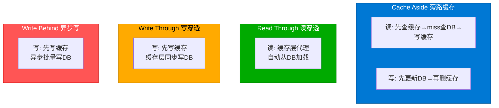

### 1. Cache Aside（旁路缓存）

最经典的策略，应用程序同时与缓存和数据库交互。

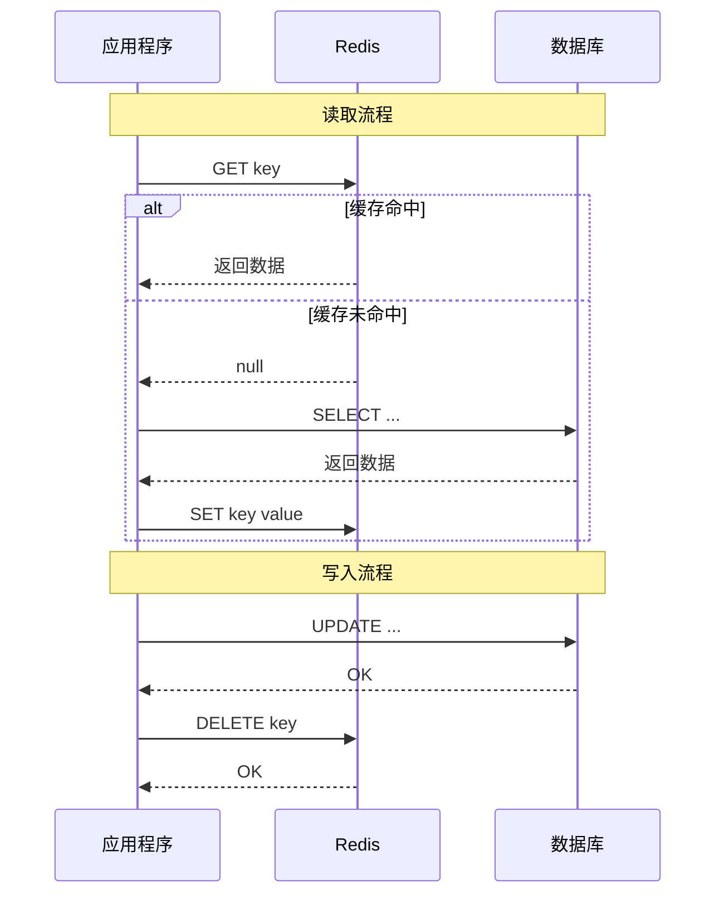

```csharp
public class CacheAsideService
{
    private readonly IDistributedCache _cache;
    private readonly IProductRepository _repo;

    public async Task<Product?> GetProductAsync(int id)
    {
        var cacheKey = $"product:{id}";
        var cached = await _cache.GetStringAsync(cacheKey);

        if (cached is not null)
        {
            return JsonSerializer.Deserialize<Product>(cached);
        }

        // Cache Miss → 查数据库 → 写缓存
        var product = await _repo.GetByIdAsync(id);
        if (product is not null)
        {
            await _cache.SetStringAsync(cacheKey,
                JsonSerializer.Serialize(product),
                new DistributedCacheEntryOptions
                {
                    AbsoluteExpirationRelativeToNow = TimeSpan.FromMinutes(30)
                });
        }

        return product;
    }

    public async Task UpdateProductAsync(Product product)
    {
        // 先更新数据库
        await _repo.UpdateAsync(product);

        // 再删除缓存（不是更新缓存！）
        await _cache.RemoveAsync($"product:{product.Id}");
    }
}
```

::: tip 为什么是删缓存而不是更新缓存？
1. **并发安全**：更新缓存可能在并发场景下产生数据覆盖
2. **懒加载**：删除后由下次读操作触发加载，避免写不被读的缓存
3. **简化**：删除是幂等操作，更新需要合并逻辑
:::

### 2. Read Through（读穿透）

缓存层代理数据库读取，应用层只与缓存交互。

```csharp
public class ReadThroughCacheService
{
    private readonly IDistributedCache _cache;
    private readonly IConnectionMultiplexer _redis;
    private readonly IProductRepository _repo;

    public async Task<T> GetOrLoadAsync<T>(
        string key,
        Func<Task<T>> dbLoader,
        TimeSpan? expiry = null)
    {
        var cached = await _cache.GetStringAsync(key);
        if (cached is not null)
        {
            return JsonSerializer.Deserialize<T>(cached)!;
        }

        // 缓存未命中，自动加载
        var value = await dbLoader();

        expiry ??= TimeSpan.FromMinutes(30);
        await _cache.SetStringAsync(key,
            JsonSerializer.Serialize(value),
            new DistributedCacheEntryOptions
            {
                AbsoluteExpirationRelativeToNow = expiry
            });

        return value;
    }
}

// 使用方式
public class ProductAppService
{
    private readonly ReadThroughCacheService _cacheService;
    private readonly IProductRepository _repo;

    public async Task<Product> GetProductAsync(int id)
    {
        return await _cacheService.GetOrLoadAsync(
            $"product:{id}",
            () => _repo.GetByIdAsync(id),
            TimeSpan.FromMinutes(30));
    }
}
```

### 3. Write Through（写穿透）

写操作先更新缓存，缓存层负责同步写入数据库。

```csharp
public class WriteThroughCacheService
{
    private readonly IDistributedCache _cache;
    private readonly IConnectionMultiplexer _redis;
    private readonly IProductRepository _repo;

    public async Task UpdateProductAsync(Product product)
    {
        // 同步更新：缓存 + 数据库
        var cacheKey = $"product:{product.Id}";

        // 1. 先更新数据库
        await _repo.UpdateAsync(product);

        // 2. 再更新缓存（Write Through 是更新而非删除）
        await _cache.SetStringAsync(cacheKey,
            JsonSerializer.Serialize(product),
            new DistributedCacheEntryOptions
            {
                AbsoluteExpirationRelativeToNow = TimeSpan.FromMinutes(30)
            });
    }
}
```

### 4. Write Behind（异步刷新）

写操作先更新缓存，异步批量刷新到数据库。适合写密集场景。

```csharp
public class WriteBehindCacheService : IHostedService, IDisposable
{
    private readonly IConnectionMultiplexer _redis;
    private readonly IProductRepository _repo;
    private readonly ILogger<WriteBehindCacheService> _logger;

    // 写缓冲队列
    private readonly Channel<WriteOperation> _writeQueue =
        Channel.CreateBounded<WriteOperation>(new BoundedChannelOptions(10000)
        {
            FullMode = BoundedChannelFullMode.DropOldest
        });

    // 批量刷新定时器
    private Timer? _flushTimer;

    public async Task UpdateProductAsync(Product product)
    {
        var cacheKey = $"product:{product.Id}";

        // 1. 立即更新缓存（用户感受到的延迟极低）
        var db = _redis.GetDatabase();
        await db.StringSetAsync(cacheKey,
            JsonSerializer.Serialize(product),
            TimeSpan.FromMinutes(30));

        // 2. 异步入队，等待批量刷新到数据库
        await _writeQueue.Writer.WriteAsync(new WriteOperation
        {
            Key = cacheKey,
            Type = WriteOperationType.Update,
            Data = product,
            Timestamp = DateTime.UtcNow
        });
    }

    public Task StartAsync(CancellationToken ct)
    {
        // 每 5 秒批量刷新一次
        _flushTimer = new Timer(FlushAsync, null,
            TimeSpan.FromSeconds(5), TimeSpan.FromSeconds(5));
        return Task.CompletedTask;
    }

    private async void FlushAsync(object? state)
    {
        var operations = new List<WriteOperation>();
        while (_writeQueue.Reader.TryRead(out var op))
        {
            operations.Add(op);
        }

        if (operations.Count == 0) return;

        try
        {
            // 按类型分组批量处理
            var updates = operations
                .Where(o => o.Type == WriteOperationType.Update)
                .GroupBy(o => o.Data!.GetType())
                .ToList();

            foreach (var group in updates)
            {
                var products = group
                    .Select(o => (Product)o.Data!)
                    .ToList();

                // 取最新版本（去重）
                var latest = products
                    .GroupBy(p => p.Id)
                    .Select(g => g.OrderByDescending(p =>
                        operations.First(o => o.Data!.Equals(p)).Timestamp)
                    .First())
                    .ToList();

                await _repo.BatchUpdateAsync(latest);
            }

            _logger.LogInformation("Flushed {Count} write operations", operations.Count);
        }
        catch (Exception ex)
        {
            _logger.LogError(ex, "Flush failed, re-queuing operations");
            // 重新入队
            foreach (var op in operations)
            {
                await _writeQueue.Writer.WriteAsync(op);
            }
        }
    }

    public Task StopAsync(CancellationToken ct)
    {
        // 停止前做最后一次刷新
        FlushAsync(null);
        _flushTimer?.Dispose();
        return Task.CompletedTask;
    }

    public void Dispose() => _flushTimer?.Dispose();
}

public record WriteOperation
{
    public string Key { get; init; } = "";
    public WriteOperationType Type { get; init; }
    public object? Data { get; init; }
    public DateTime Timestamp { get; init; }
}

public enum WriteOperationType { Update, Delete }
```

::: warning Write Behind 的风险
- **数据丢失**：应用崩溃时，队列中未刷新的数据会丢失
- **一致性延迟**：数据库数据滞后于缓存
- **适用场景**：写密集且对一致性要求不高的场景（浏览量、点赞数）
:::

### 策略对比

| 策略 | 一致性 | 延迟 | 吞吐量 | 复杂度 | 适用场景 |
|------|--------|------|--------|-------|---------|
| Cache Aside | 最终一致 | 低 | 中 | 低 | 通用场景 |
| Read Through | 最终一致 | 低 | 中 | 中 | 读密集 |
| Write Through | 强一致 | 中 | 中 | 中 | 读写均衡 |
| Write Behind | 最终一致 | 极低 | 高 | 高 | 写密集 |

## .NET 8 新特性集成

### 输出缓存（Output Caching）

.NET 8 引入了全新的 Output Caching 中间件，与响应缓存（Response Caching）相比，它是真正的服务端缓存，支持 Redis 作为存储后端。

```csharp
// Program.cs
builder.Services.AddOutputCache(options =>
{
    options.AddBasePolicy(builder => builder.Expire(TimeSpan.FromMinutes(10)));
    options.AddPolicy("Products", builder =>
        builder.Expire(TimeSpan.FromMinutes(30)).Tag("products"));
    options.AddPolicy("NoCache", builder => builder.NoCache());
});

// 使用 Redis 作为 Output Cache 存储
builder.Services.AddStackExchangeRedisOutputCache(options =>
{
    options.Configuration = builder.Configuration.GetConnectionString("Redis");
    options.InstanceName = "output:";
});
```

```csharp
// Controller
[ApiController]
[Route("api/[controller]")]
public class ProductsController : ControllerBase
{
    [HttpGet]
    [OutputCache(PolicyName = "Products")]
    public async Task<IEnumerable<Product>> GetProducts(
        [FromServices] IProductRepository repo)
    {
        return await repo.GetAllAsync();
    }

    [HttpGet("{id}")]
    [OutputCache(PolicyName = "Products")]
    public async Task<Product> GetProduct(int id,
        [FromServices] IProductRepository repo)
    {
        return await repo.GetByIdAsync(id);
    }
}
```

### 缓存标签与失效

```csharp
// 按标签批量失效
public class ProductService
{
    private readonly IOutputCacheStore _cacheStore;

    public async Task UpdateProductAsync(Product product)
    {
        // ... 更新数据库 ...

        // 失效所有 products 标签的缓存
        await _cacheStore.EvictByTagAsync("products", default);
    }
}
```

### HybridCache（.NET 9 Preview）

.NET 9 预览了 `HybridCache`，统一了本地缓存和分布式缓存：

```csharp
// .NET 9 Preview 特性
builder.Services.AddHybridCache(options =>
{
    options.MaximumPayloadBytes = 1024 * 1024; // 1MB
    options.DefaultEntryOptions = new HybridCacheEntryOptions
    {
        Expiration = TimeSpan.FromMinutes(30),
        LocalCacheExpiration = TimeSpan.FromMinutes(5)
    };
});

// 使用 Redis 作为 L2
builder.Services.AddStackExchangeRedisCache(options =>
{
    options.Configuration = "localhost:6379";
});
```

```csharp
public class ProductService
{
    private readonly HybridCache _cache;
    private readonly IProductRepository _repo;

    public async Task<Product?> GetProductAsync(int id)
    {
        return await _cache.GetOrCreateAsync(
            $"product:{id}",
            async ct => await _repo.GetByIdAsync(id),
            new HybridCacheEntryOptions
            {
                Expiration = TimeSpan.FromMinutes(30),
                LocalCacheExpiration = TimeSpan.FromMinutes(5)
            });
    }
}
```

::: info HybridCache 的设计哲学
`HybridCache` 自动处理多级缓存的一致性问题：
- L1 本地缓存短 TTL（5 分钟），L2 Redis 长 TTL（30 分钟）
- 写入时同时更新 L1 + L2
- 支持通过 Pub/Sub 广播 L1 失效
- 内置序列化（支持 JSON / MessagePack / Protobuf）
:::

### Frosting 生命周期钩子

```csharp
// 利用 IHostedService 实现缓存预热
public class CacheWarmupService : IHostedService
{
    private readonly IServiceProvider _serviceProvider;
    private readonly ILogger<CacheWarmupService> _logger;

    public async Task StartAsync(CancellationToken ct)
    {
        _logger.LogInformation("Starting cache warmup...");

        using var scope = _serviceProvider.CreateScope();
        var cache = scope.ServiceProvider
            .GetRequiredService<IDistributedCache>();
        var repo = scope.ServiceProvider
            .GetRequiredService<IProductRepository>();

        // 预热热门商品
        var hotProducts = await repo.GetHotProductsAsync(100);
        foreach (var product in hotProducts)
        {
            var key = $"product:{product.Id}";
            await cache.SetStringAsync(key,
                JsonSerializer.Serialize(product),
                new DistributedCacheEntryOptions
                {
                    AbsoluteExpirationRelativeToNow = TimeSpan.FromHours(1)
                }, ct);
        }

        _logger.LogInformation("Cache warmup completed: {Count} items",
            hotProducts.Count);
    }

    public Task StopAsync(CancellationToken ct) => Task.CompletedTask;
}
```

### 健康检查集成

```csharp
// Program.cs
builder.Services.AddHealthChecks()
    .AddRedis(
        builder.Configuration.GetConnectionString("Redis")!,
        name: "redis",
        failureStatus: HealthStatus.Degraded,
        tags: new[] { "cache", "ready" })
    .AddCheck<CachePerformanceCheck>("cache-perf",
        tags: new[] { "cache", "ready" });

// 自定义缓存性能检查
public class CachePerformanceCheck : IHealthCheck
{
    private readonly IConnectionMultiplexer _redis;

    public CachePerformanceCheck(IConnectionMultiplexer redis)
    {
        _redis = redis;
    }

    public async Task<HealthCheckResult> CheckHealthAsync(
        HealthCheckContext context, CancellationToken ct = default)
    {
        var db = _redis.GetDatabase();
        var sw = Stopwatch.StartNew();

        await db.PingAsync();
        sw.Stop();

        var latency = sw.Elapsed;

        return latency.TotalMilliseconds switch
        {
            < 1 => HealthCheckResult.Healthy($"Redis latency: {latency.TotalMilliseconds:F2}ms"),
            < 5 => HealthCheckResult.Degraded($"Redis latency: {latency.TotalMilliseconds:F2}ms"),
            _ => HealthCheckResult.Unhealthy($"Redis latency: {latency.TotalMilliseconds:F2}ms")
        };
    }
}
```

## 生产环境最佳实践

### 缓存 Key 设计规范

```csharp
public static class CacheKeyConvention
{
    // 格式：业务域:实体:ID[:字段]
    // 示例：order:detail:12345
    //       user:profile:678:nickname

    public static string User(int userId) => $"user:profile:{userId}";
    public static string UserNickname(int userId) => $"user:profile:{userId}:nickname";
    public static string Product(int productId) => $"product:detail:{productId}";
    public static string ProductStock(int productId) => $"product:stock:{productId}";
    public static string Order(long orderId) => $"order:detail:{orderId}";

    // 列表缓存：带分页参数
    public static string ProductList(int categoryId, int page, int size)
        => $"product:list:{categoryId}:p{page}:s{size}";

    // 计数器
    public static string ViewCount(int productId) => $"counter:view:{productId}";
}
```

### 缓存配置最佳实践

```csharp
// appsettings.json
{
    "CacheSettings": {
        "DefaultExpiryMinutes": 30,
        "ShortExpiryMinutes": 5,
        "LongExpiryMinutes": 120,
        "RandomExpiryRangeMinutes": 5,
        "LockExpirySeconds": 10,
        "LockRetryDelayMs": 50,
        "LockMaxRetryMs": 5000,
        "BloomFilterName": "bloom:users",
        "CircuitBreakerThreshold": 3,
        "CircuitBreakerResetMinutes": 1
    }
}

// 强类型配置
public class CacheSettings
{
    public int DefaultExpiryMinutes { get; set; } = 30;
    public int ShortExpiryMinutes { get; set; } = 5;
    public int LongExpiryMinutes { get; set; } = 120;
    public int RandomExpiryRangeMinutes { get; set; } = 5;
    public int LockExpirySeconds { get; set; } = 10;
    public int LockRetryDelayMs { get; set; } = 50;
    public int LockMaxRetryMs { get; set; } = 5000;
    public string BloomFilterName { get; set; } = "bloom:users";
    public int CircuitBreakerThreshold { get; set; } = 3;
    public int CircuitBreakerResetMinutes { get; set; } = 1;
}

// Program.cs
builder.Services.Configure<CacheSettings>(
    builder.Configuration.GetSection("CacheSettings"));
```

### 监控指标

```csharp
public class CacheMetricsService : IHostedService
{
    private readonly IConnectionMultiplexer _redis;
    private readonly ILogger<CacheMetricsService> _logger;
    private Timer? _timer;

    public async Task StartAsync(CancellationToken ct)
    {
        _timer = new Timer(ReportMetrics, null,
            TimeSpan.FromMinutes(1), TimeSpan.FromMinutes(1));
        await Task.CompletedTask;
    }

    private void ReportMetrics(object? state)
    {
        var server = _redis.GetServers().First();
        var info = server.Info();

        foreach (var section in info)
        {
            if (section.Key == "Stats")
            {
                var keyspaceHits = section.Value
                    .FirstOrDefault(x => x.Key == "keyspace_hits").Value;
                var keyspaceMisses = section.Value
                    .FirstOrDefault(x => x.Key == "keyspace_misses").Value;

                var hits = long.Parse(keyspaceHits ?? "0");
                var misses = long.Parse(keyspaceMisses ?? "0");
                var total = hits + misses;
                var hitRate = total > 0 ? (double)hits / total * 100 : 0;

                _logger.LogInformation(
                    "Cache Hit Rate: {HitRate:F2}% (Hits: {Hits}, Misses: {Misses})",
                    hitRate, hits, misses);
            }

            if (section.Key == "Memory")
            {
                var usedMemory = section.Value
                    .FirstOrDefault(x => x.Key == "used_memory_human").Value;
                _logger.LogInformation("Redis Memory Used: {Memory}", usedMemory);
            }
        }
    }

    public Task StopAsync(CancellationToken ct)
    {
        _timer?.Dispose();
        return Task.CompletedTask;
    }
}
```

### 完整防护方案整合

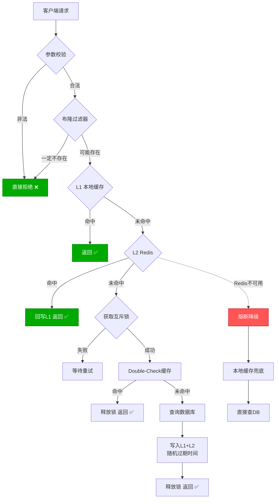

```csharp
// 生产级缓存服务：整合所有防护策略
public class ProductionCacheService
{
    private readonly IMemoryCache _localCache;
    private readonly IDistributedCache _redisCache;
    private readonly BloomFilterService _bloomFilter;
    private readonly IConnectionMultiplexer _redis;
    private readonly IProductRepository _repo;
    private readonly IOptions<CacheSettings> _settings;
    private readonly ILogger<ProductionCacheService> _logger;

    public async Task<Product?> GetProductAsync(int productId)
    {
        // 1. 参数校验
        if (productId <= 0)
        {
            return null;
        }

        var cacheKey = CacheKeyConvention.Product(productId);

        // 2. 布隆过滤器
        if (!await _bloomFilter.MightExistAsync("product_filter",
            productId.ToString()))
        {
            _logger.LogDebug("Bloom filter rejected: {Id}", productId);
            return null;
        }

        // 3. L1 本地缓存
        if (_localCache.TryGetValue(cacheKey, out Product? l1Value))
        {
            return l1Value;
        }

        // 4. L2 Redis（含熔断降级）
        try
        {
            var cached = await _redisCache.GetStringAsync(cacheKey);
            if (cached is not null)
            {
                var product = JsonSerializer.Deserialize<Product>(cached);
                _localCache.Set(cacheKey, product,
                    TimeSpan.FromMinutes(_settings.Value.ShortExpiryMinutes));
                return product;
            }
        }
        catch (Exception ex)
        {
            _logger.LogWarning(ex, "Redis access failed, degrading");
        }

        // 5. 互斥锁防击穿
        var lockKey = $"lock:cache:{cacheKey}";
        var db = _redis.GetDatabase();
        var lockAcquired = await db.StringSetAsync(lockKey,
            Environment.MachineName,
            TimeSpan.FromSeconds(_settings.Value.LockExpirySeconds),
            When.NotExists);

        if (!lockAcquired)
        {
            // 等待其他实例加载
            return await WaitForCacheAsync(cacheKey, productId);
        }

        try
        {
            // Double-Check
            var cached = await _redisCache.GetStringAsync(cacheKey);
            if (cached is not null)
            {
                return JsonSerializer.Deserialize<Product>(cached);
            }

            // 查数据库
            var product = await _repo.GetByIdAsync(productId);
            if (product is not null)
            {
                var randomExpiry = TimeSpan.FromMinutes(
                    _settings.Value.DefaultExpiryMinutes +
                    Random.Shared.Next(-_settings.Value.RandomExpiryRangeMinutes,
                                        _settings.Value.RandomExpiryRangeMinutes));

                await _redisCache.SetStringAsync(cacheKey,
                    JsonSerializer.Serialize(product),
                    new DistributedCacheEntryOptions
                    {
                        AbsoluteExpirationRelativeToNow = randomExpiry
                    });

                _localCache.Set(cacheKey, product,
                    TimeSpan.FromMinutes(_settings.Value.ShortExpiryMinutes));
            }

            return product;
        }
        finally
        {
            // 释放锁
            var script = @"
                if redis.call('get', KEYS[1]) == ARGV[1] then
                    return redis.call('del', KEYS[1])
                else
                    return 0
                end";
            await db.ScriptEvaluateAsync(script,
                new RedisKey[] { lockKey },
                new RedisValue[] { Environment.MachineName });
        }
    }

    private async Task<Product?> WaitForCacheAsync(string cacheKey, int productId)
    {
        var maxWait = TimeSpan.FromMilliseconds(_settings.Value.LockMaxRetryMs);
        var retryDelay = TimeSpan.FromMilliseconds(_settings.Value.LockRetryDelayMs);
        var sw = Stopwatch.StartNew();

        while (sw.Elapsed < maxWait)
        {
            await Task.Delay(retryDelay);

            var cached = await _redisCache.GetStringAsync(cacheKey);
            if (cached is not null)
            {
                var product = JsonSerializer.Deserialize<Product>(cached);
                _localCache.Set(cacheKey, product,
                    TimeSpan.FromMinutes(_settings.Value.ShortExpiryMinutes));
                return product;
            }
        }

        // 超时降级
        return await _repo.GetByIdAsync(productId);
    }
}
```

## 小结

| 问题 | 原因 | 防护方案 |
|------|------|---------|
| 缓存穿透 | 查询不存在的数据 | 布隆过滤器 + 空值缓存 + 参数校验 |
| 缓存击穿 | 热点Key过期瞬间并发涌入 | 互斥锁 + 逻辑过期 |
| 缓存雪崩 | 大量Key同时过期或Redis宕机 | 随机过期 + 多级缓存 + 熔断降级 |

::: important 核心原则
1. **多层防护**：不要只依赖一种方案，参数校验 → 布隆过滤器 → 缓存 → 互斥锁 → 熔断降级，层层过滤
2. **随机过期**：永远在基础过期时间上叠加随机偏移，防止 Key 集中过期
3. **降级兜底**：Redis 不可用时必须有降级方案（本地缓存 + 直接查库）
4. **监控先行**：缓存命中率、延迟、内存使用量是三大核心指标
:::

## 参考资料

- [IDistributedCache 官方文档](https://learn.microsoft.com/zh-cn/aspnet/core/performance/caching/distributed)
- [Microsoft.Extensions.Caching.StackExchangeRedis 源码](https://github.com/dotnet/aspnetcore/tree/main/src/Caching/StackExchangeRedis)
- [ASP.NET Core Output Caching](https://learn.microsoft.com/zh-cn/aspnet/core/performance/caching/output)
- [Redis Bloom Filter](https://redis.io/docs/data-types/probabilistic/bloom-filter/)
- [.NET 8 Caching 新特性](https://learn.microsoft.com/zh-cn/dotnet/core/whats-new/dotnet-8)
- [Cache Aside Pattern - Martin Fowler](https://martinfowler.com/bliki/TwoHardThings.html)
