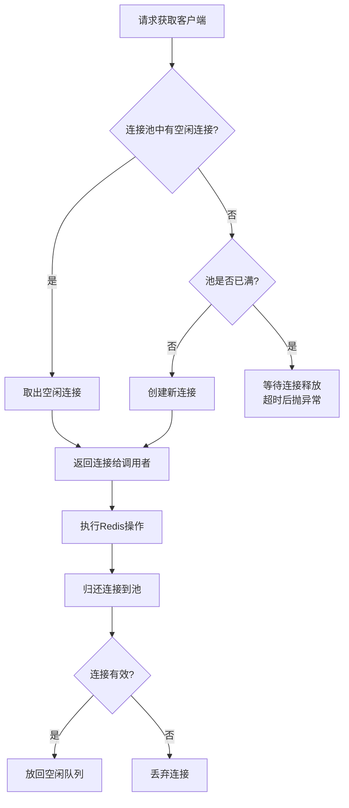

# ServiceStack.Redis 实战

> ServiceStack.Redis 是 .NET 生态中另一个重要的 Redis 客户端，以 API 简洁、类型化操作和丰富的功能著称。虽然自 v4 后转为商业授权，但其在 .NET 社区中仍有大量使用。本文将深入其核心组件、连接管理、类型化操作和与 StackExchange.Redis 的差异，帮你做出正确的技术选型。

## 1. 核心组件概览

### 1.1 组件架构

```text
ServiceStack.Redis 组件体系：

┌─────────────────────────────────────────────────────────┐
│                  ServiceStack.Redis                       │
│                                                           │
│  ┌─────────────────┐  ┌──────────────────────┐          │
│  │  RedisClient     │  │  RedisManagerPool     │          │
│  │  (基础客户端)     │  │  (连接池管理)          │          │
│  └────────┬────────┘  └──────────┬───────────┘          │
│           │                       │                       │
│  ┌────────▼────────┐  ┌─────────▼──────────┐           │
│  │  IRedisClient    │  │  IRedisClientsManager│           │
│  │  (操作接口)      │  │  (管理接口)           │           │
│  └─────────────────┘  └────────────────────┘           │
│                                                           │
│  ┌─────────────────┐  ┌──────────────────────┐          │
│  │  RedisTypedClient│  │  RedisConfig          │          │
│  │  (泛型操作)      │  │  (全局配置)            │          │
│  └─────────────────┘  └──────────────────────┘          │
│                                                           │
│  扩展组件：                                               │
│  ┌─────────────────┐  ┌──────────────────────┐          │
│  │  RedisSentinel   │  │  RedisPubSub          │          │
│  │  (哨兵支持)      │  │  (发布订阅)           │          │
│  └─────────────────┘  └──────────────────────┘          │
└─────────────────────────────────────────────────────────┘
```

### 1.2 RedisClient vs RedisManagerPool

```text
┌──────────────────┬──────────────────┬───────────────────────┐
│  特性             │  RedisClient      │  RedisManagerPool       │
├──────────────────┼──────────────────┼───────────────────────┤
│  连接管理         │  单连接           │  连接池                 │
│  线程安全         │  不安全           │  安全（池化）            │
│  适用场景         │  单线程/短生命期  │  多线程/长期运行          │
│  性能             │  无池化开销       │  池化开销小              │
│  连接数           │  1个              │  可配置（默认10）         │
│  资源释放         │  手动 Dispose     │  自动归还池              │
│  推荐度           │  不推荐直接使用   │  ⭐ 推荐                 │
└──────────────────┴──────────────────┴───────────────────────┘

使用原则：
  ❌ 不要在 Web 应用中直接 new RedisClient()
  ✅ 始终使用 RedisManagerPool 或 PooledRedisClientManager
```

## 2. 连接池架构

### 2.1 连接池工作原理



### 2.2 连接池配置

```csharp
// 连接池配置
public class RedisPoolConfiguration
{
    /// <summary>
    /// 基本连接池配置
    /// </summary>
    public static RedisManagerPool CreateBasicPool()
    {
        return new RedisManagerPool(
            "10.0.0.1:6379",
            new RedisPoolConfig
            {
                MaxPoolSize = 50,           // 最大连接数
                SocketReceiveTimeout = 5000, // 接收超时
                SocketSendTimeout = 5000,    // 发送超时
            });
    }

    /// <summary>
    /// 带密码的连接池
    /// </summary>
    public static RedisManagerPool CreateSecurePool()
    {
        return new RedisManagerPool(
            "password@10.0.0.1:6379",
            new RedisPoolConfig
            {
                MaxPoolSize = 50,
            });
    }

    /// <summary>
    /// 多节点读写分离
    /// </summary>
    public static PooledRedisClientManager CreateReadWritePool()
    {
        var readHosts = new[]
        {
            "10.0.0.2:6379",
            "10.0.0.3:6379"
        };

        var writeHosts = new[]
        {
            "10.0.0.1:6379"
        };

        return new PooledRedisClientManager(
            readHosts,    // 读节点
            writeHosts,   // 写节点
            new RedisClientManagerConfig
            {
                MaxReadPoolSize = 20,
                MaxWritePoolSize = 10,
                AutoStart = true,
                DefaultDb = 0
            });
    }

    /// <summary>
    /// Sentinel 模式连接池
    /// </summary>
    public static RedisManagerPool CreateSentinelPool()
    {
        var sentinelHosts = new[]
        {
            "10.0.0.10:26379",
            "10.0.0.11:26379",
            "10.0.0.12:26379"
        };

        var sentinel = new RedisSentinel(
            sentinelHosts, "mymaster");

        // 配置哨兵
        sentinel.SentinelWorkerFactory = (hosts, master) =>
            new RedisSentinelWorker(hosts, master);

        return sentinel.Start();
    }
}
```

### 2.3 连接池监控

```csharp
// 连接池监控
public class RedisPoolMonitor
{
    private readonly RedisManagerPool _pool;

    public RedisPoolMonitor(RedisManagerPool pool)
    {
        _pool = pool;
    }

    public PoolStatus GetStatus()
    {
        return new PoolStatus
        {
            ActiveConnections = _pool.GetActiveClientsCount(),
            AvailableConnections = _pool.GetAvailableClientsCount(),
            PoolSize = _pool.PoolSize,
            // 注意：具体属性可能因版本而异
        };
    }

    public async Task<TimeSpan> PingAsync()
    {
        using var client = _pool.GetClient();
        return await Task.Run(() => client.Ping());
    }
}

public record PoolStatus(
    int ActiveConnections,
    int AvailableConnections,
    int PoolSize);
```

## 3. 基本 CRUD 操作

### 3.1 String 操作

```csharp
// String 基本操作
public class RedisStringOperations
{
    private readonly RedisManagerPool _pool;

    public RedisStringOperations(RedisManagerPool pool)
    {
        _pool = pool;
    }

    /// <summary>
    /// 设置值
    /// </summary>
    public void Set(string key, string value, TimeSpan? expiry = null)
    {
        using var client = _pool.GetClient();
        if (expiry.HasValue)
        {
            client.Set(key, value, expiry.Value);
        }
        else
        {
            client.Set(key, value);
        }
    }

    /// <summary>
    /// 获取值
    /// </summary>
    public string? Get(string key)
    {
        using var client = _pool.GetClient();
        return client.Get<string>(key);
    }

    /// <summary>
    /// 设置对象（自动序列化）
    /// </summary>
    public void SetObject<T>(string key, T value, TimeSpan? expiry = null)
    {
        using var client = _pool.GetClient();
        if (expiry.HasValue)
        {
            client.Set(key, value, expiry.Value);
        }
        else
        {
            client.Set(key, value);
        }
    }

    /// <summary>
    /// 获取对象（自动反序列化）
    /// </summary>
    public T? GetObject<T>(string key)
    {
        using var client = _pool.GetClient();
        return client.Get<T>(key);
    }

    /// <summary>
    /// 设置带过期时间的值
    /// </summary>
    public bool SetExpire(string key, string value, DateTime expiresAt)
    {
        using var client = _pool.GetClient();
        client.Set(key, value, expiresAt);
        return true;
    }

    /// <summary>
    /// 自增
    /// </summary>
    public long Increment(string key, long amount = 1)
    {
        using var client = _pool.GetClient();
        return client.Increment(key, (uint)amount);
    }

    /// <summary>
    /// 设置不存在时（SET NX）
    /// </summary>
    public bool SetIfNotExists(string key, string value)
    {
        using var client = _pool.GetClient();
        return client.SetEntryIfNotExists(key, value);
    }
}
```

### 3.2 Hash 操作

```csharp
// Hash 操作
public class RedisHashOperations
{
    private readonly RedisManagerPool _pool;

    public RedisHashOperations(RedisManagerPool pool)
    {
        _pool = pool;
    }

    /// <summary>
    /// 设置 Hash 字段
    /// </summary>
    public void SetEntryInHash(
        string hashId, string key, string value)
    {
        using var client = _pool.GetClient();
        client.SetEntryInHash(hashId, key, value);
    }

    /// <summary>
    /// 获取 Hash 字段
    /// </summary>
    public string? GetValueFromHash(
        string hashId, string key)
    {
        using var client = _pool.GetClient();
        return client.GetValueFromHash(hashId, key);
    }

    /// <summary>
    /// 获取 Hash 所有字段
    /// </summary>
    public Dictionary<string, string> GetAllEntriesFromHash(
        string hashId)
    {
        using var client = _pool.GetClient();
        return client.GetAllEntriesFromHash(hashId);
    }

    /// <summary>
    /// Hash 字段是否存在
    /// </summary>
    public bool HashContainsEntry(
        string hashId, string key)
    {
        using var client = _pool.GetClient();
        return client.HashContainsEntry(hashId, key);
    }

    /// <summary>
    /// 删除 Hash 字段
    /// </summary>
    public bool RemoveEntryFromHash(
        string hashId, string key)
    {
        using var client = _pool.GetClient();
        return client.RemoveEntryFromHash(hashId, key);
    }

    /// <summary>
    /// Hash 字段自增
    /// </summary>
    public long IncrementValueInHash(
        string hashId, string key, int incrementBy)
    {
        using var client = _pool.GetClient();
        return client.IncrementValueInHash(
            hashId, key, incrementBy);
    }

    /// <summary>
    /// 获取 Hash 字段数量
    /// </summary>
    public long GetHashCount(string hashId)
    {
        using var client = _pool.GetClient();
        return client.GetHashCount(hashId);
    }
}
```

### 3.3 List 操作

```csharp
// List 操作
public class RedisListOperations
{
    private readonly RedisManagerPool _pool;

    public RedisListOperations(RedisManagerPool pool)
    {
        _pool = pool;
    }

    /// <summary>
    /// 左推入
    /// </summary>
    public void AddItemToList(string listId, string value)
    {
        using var client = _pool.GetClient();
        client.AddItemToList(listId, value);
    }

    /// <summary>
    /// 右推入
    /// </summary>
    public void AddItemToEndOfList(string listId, string value)
    {
        using var client = _pool.GetClient();
        client.AddItemToList(listId, value);
    }

    /// <summary>
    /// 左弹出
    /// </summary>
    public string? RemoveStartFromList(string listId)
    {
        using var client = _pool.GetClient();
        return client.RemoveStartFromList();
    }

    /// <summary>
    /// 获取列表范围
    /// </summary>
    public List<string> GetRangeFromList(
        string listId, int start, int end)
    {
        using var client = _pool.GetClient();
        return client.GetRangeFromList(listId, start, end);
    }

    /// <summary>
    /// 获取列表所有元素
    /// </summary>
    public List<string> GetAllItemsFromList(string listId)
    {
        using var client = _pool.GetClient();
        return client.GetAllItemsFromList(listId);
    }

    /// <summary>
    /// 列表长度
    /// </summary>
    public long GetListCount(string listId)
    {
        using var client = _pool.GetClient();
        return client.GetListCount(listId);
    }

    /// <summary>
    /// 阻塞左弹出
    /// </summary>
    public string? BlockingRemoveStartFromList(
        string listId, TimeSpan timeout)
    {
        using var client = _pool.GetClient();
        return client.BlockingRemoveStartFromList(
            listId, (int)timeout.TotalSeconds);
    }
}
```

### 3.4 Set 操作

```csharp
// Set 操作
public class RedisSetOperations
{
    private readonly RedisManagerPool _pool;

    public RedisSetOperations(RedisManagerPool pool)
    {
        _pool = pool;
    }

    /// <summary>
    /// 添加元素到集合
    /// </summary>
    public void AddItemToSet(string setId, string item)
    {
        using var client = _pool.GetClient();
        client.AddItemToSet(setId, item);
    }

    /// <summary>
    /// 获取集合所有元素
    /// </summary>
    public HashSet<string> GetAllItemsFromSet(string setId)
    {
        using var client = _pool.GetClient();
        return client.GetAllItemsFromSet(setId);
    }

    /// <summary>
    /// 判断元素是否在集合中
    /// </summary>
    public bool SetContainsItem(string setId, string item)
    {
        using var client = _pool.GetClient();
        return client.SetContainsItem(setId, item);
    }

    /// <summary>
    /// 移除元素
    /// </summary>
    public void RemoveItemFromSet(string setId, string item)
    {
        using var client = _pool.GetClient();
        client.RemoveItemFromSet(setId, item);
    }

    /// <summary>
    /// 集合交集
    /// </summary>
    public HashSet<string> GetIntersectFromSets(
        params string[] setIds)
    {
        using var client = _pool.GetClient();
        return client.GetIntersectFromSets(setIds);
    }

    /// <summary>
    /// 集合并集
    /// </summary>
    public HashSet<string> GetUnionFromSets(
        params string[] setIds)
    {
        using var client = _pool.GetClient();
        return client.GetUnionFromSets(setIds);
    }

    /// <summary>
    /// 集合元素数量
    /// </summary>
    public long GetSetCount(string setId)
    {
        using var client = _pool.GetClient();
        return client.GetSetCount(setId);
    }
}
```

### 3.5 Sorted Set 操作

```csharp
// Sorted Set 操作
public class RedisSortedSetOperations
{
    private readonly RedisManagerPool _pool;

    public RedisSortedSetOperations(RedisManagerPool pool)
    {
        _pool = pool;
    }

    /// <summary>
    /// 添加元素到有序集合
    /// </summary>
    public bool AddItemToSortedSet(
        string setId, string value, double score)
    {
        using var client = _pool.GetClient();
        return client.AddItemToSortedSet(setId, value, score);
    }

    /// <summary>
    /// 获取有序集合范围（按排名）
    /// </summary>
    public List<string> GetRangeFromSortedSet(
        string setId, int fromRank, int toRank)
    {
        using var client = _pool.GetClient();
        return client.GetRangeFromSortedSet(
            setId, fromRank, toRank);
    }

    /// <summary>
    /// 获取有序集合范围（按分数，带分数）
    /// </summary>
    public IDictionary<string, double> GetRangeFromSortedSetByHighestScore(
        string setId, double fromScore, double toScore)
    {
        using var client = _pool.GetClient();
        return client.GetRangeWithScoresFromSortedSetByHighestScore(
            setId, fromScore, toScore);
    }

    /// <summary>
    /// 增加分数
    /// </summary>
    public double IncrementItemInSortedSet(
        string setId, string value, double incrementBy)
    {
        using var client = _pool.GetClient();
        return client.IncrementItemInSortedSet(
            setId, value, incrementBy);
    }

    /// <summary>
    /// 获取排名
    /// </summary>
    public long GetItemIndexInSortedSet(string setId, string value)
    {
        using var client = _pool.GetClient();
        return client.GetItemIndexInSortedSet(setId, value);
    }

    /// <summary>
    /// 获取分数
    /// </summary>
    public double GetItemScoreInSortedSet(string setId, string value)
    {
        using var client = _pool.GetClient();
        return client.GetItemScoreInSortedSet(setId, value);
    }

    /// <summary>
    /// 有序集合元素数量
    /// </summary>
    public long GetSortedSetCount(string setId)
    {
        using var client = _pool.GetClient();
        return client.GetSortedSetCount(setId);
    }
}
```

## 4. Typed Redis（泛型操作）

### 4.1 类型化客户端

```csharp
// Typed Redis —— 泛型操作
// ServiceStack.Redis 的特色功能

// 定义实体类
public class User
{
    public long Id { get; set; }
    public string Name { get; set; } = string.Empty;
    public string Email { get; set; } = string.Empty;
    public DateTime CreatedAt { get; set; }
}

public class Product
{
    public long Id { get; set; }
    public string Name { get; set; } = string.Empty;
    public decimal Price { get; set; }
    public int Stock { get; set; }
}

// 使用 Typed Redis
public class TypedRedisOperations
{
    private readonly RedisManagerPool _pool;

    public TypedRedisOperations(RedisManagerPool pool)
    {
        _pool = pool;
    }

    /// <summary>
    /// 存储类型化对象
    /// Typed Redis 使用 "urn:TypeName:Id" 作为 Key 格式
    /// </summary>
    public void StoreUser(User user)
    {
        using var client = _pool.GetClient();
        var typedClient = client.As<User>();

        // 自动生成 Key: urn:User:1
        typedClient.Store(user);
    }

    /// <summary>
    /// 获取类型化对象
    /// </summary>
    public User? GetUser(long id)
    {
        using var client = _pool.GetClient();
        var typedClient = client.As<User>();

        // Key 格式: urn:User:{id}
        return typedClient.GetById(id);
    }

    /// <summary>
    /// 批量获取
    /// </summary>
    public List<User> GetUsers(IEnumerable<long> ids)
    {
        using var client = _pool.GetClient();
        var typedClient = client.As<User>();
        return typedClient.GetByIds(ids).ToList();
    }

    /// <summary>
    /// 删除类型化对象
    /// </summary>
    public void DeleteUser(long id)
    {
        using var client = _pool.GetClient();
        var typedClient = client.As<User>();
        typedClient.DeleteById(id);
    }

    /// <summary>
    /// 存储到列表
    /// </summary>
    public void StoreUserList(IEnumerable<User> users)
    {
        using var client = _pool.GetClient();
        var typedClient = client.As<User>();

        var list = typedClient.Lists["urn:UserList"];
        foreach (var user in users)
        {
            list.Add(user);
        }
    }

    /// <summary>
    /// 存储到集合
    /// </summary>
    public void StoreUserSet(IEnumerable<User> users)
    {
        using var client = _pool.GetClient();
        var typedClient = client.As<User>();

        var set = typedClient.Sets["urn:UserSet"];
        foreach (var user in users)
        {
            set.Add(user);
        }
    }
}
```

### 4.2 Typed Redis Key 命名规则

```text
Typed Redis Key 命名规则：

┌──────────────────────────────────────────────────────────┐
│  默认格式：urn:{TypeName}:{Id}                             │
│                                                            │
│  示例：                                                    │
│  User (Id=1)   → urn:User:1                              │
│  Product (Id=100) → urn:Product:100                       │
│  Order (Id=5001) → urn:Order:5001                         │
│                                                            │
│  列表 Key：                                                │
│  typedClient.Lists["urn:UserList"]                        │
│  → Key = urn:UserList                                     │
│                                                            │
│  集合 Key：                                                │
│  typedClient.Sets["urn:UserSet"]                          │
│  → Key = urn:UserSet                                      │
│                                                            │
│  有序集合 Key：                                             │
│  typedClient.SortedSets["urn:UserRanking"]                │
│  → Key = urn:UserRanking                                  │
│                                                            │
│  自定义 Key 格式：                                          │
│  通过 [RedisId] 特性指定 Id 字段                            │
│  public class User                                        │
│  {                                                         │
│      [RedisId]                                            │
│      public long Id { get; set; }                         │
│  }                                                         │
└──────────────────────────────────────────────────────────┘
```

## 5. Lua 脚本

```csharp
// ServiceStack.Redis Lua 脚本
public class LuaScriptOperations
{
    private readonly RedisManagerPool _pool;

    public LuaScriptOperations(RedisManagerPool pool)
    {
        _pool = pool;
    }

    /// <summary>
    /// 执行 Lua 脚本
    /// </summary>
    public long ExecuteDeductStock(string stockKey, int amount)
    {
        using var client = _pool.GetClient();

        var script = @"
            local stock = tonumber(redis.call('GET', KEYS[1]))
            if stock == nil then return -2 end
            if stock < tonumber(ARGV[1]) then return -1 end
            redis.call('DECRBY', KEYS[1], tonumber(ARGV[1]))
            return stock - tonumber(ARGV[1])
        ";

        var result = client.ExecLuaAsLong(script,
            new[] { stockKey },
            new[] { amount.ToString() });

        return result;
    }

    /// <summary>
    /// 释放分布式锁 Lua 脚本
    /// </summary>
    public bool ReleaseLock(string lockKey, string lockValue)
    {
        using var client = _pool.GetClient();

        var script = @"
            if redis.call('GET', KEYS[1]) == ARGV[1] then
                return redis.call('DEL', KEYS[1])
            else
                return 0
            end
        ";

        var result = client.ExecLuaAsLong(script,
            new[] { lockKey },
            new[] { lockValue });

        return result == 1;
    }

    /// <summary>
    /// 使用 EvalSha
    /// </summary>
    public long EvaluateSha(string sha, string[] keys, string[] args)
    {
        using var client = _pool.GetClient();

        // 先加载脚本获取 SHA1
        var loadedSha = client.LoadLuaScript(@"
            local stock = tonumber(redis.call('GET', KEYS[1]))
            if stock == nil then return -2 end
            if stock < tonumber(ARGV[1]) then return -1 end
            redis.call('DECRBY', KEYS[1], tonumber(ARGV[1]))
            return stock - tonumber(ARGV[1])
        ");

        // 使用 SHA1 执行
        var result = client.ExecLuaShaAsLong(loadedSha, keys, args);
        return result;
    }
}
```

## 6. 事务

```csharp
// ServiceStack.Redis 事务
public class TransactionOperations
{
    private readonly RedisManagerPool _pool;

    public TransactionOperations(RedisManagerPool pool)
    {
        _pool = pool;
    }

    /// <summary>
    /// 基本事务
    /// </summary>
    public void ExecuteTransaction()
    {
        using var client = _pool.GetClient();

        using var tran = client.CreateTransaction();

        // 添加命令到事务
        tran.QueueCommand(c => c.Set("key1", "value1"));
        tran.QueueCommand(c => c.Set("key2", "value2"));
        tran.QueueCommand(c => c.IncrementValue("counter"));

        // 执行事务
        tran.Commit();
    }

    /// <summary>
    /// 带回调的事务
    /// </summary>
    public void TransactionWithCallbacks()
    {
        using var client = _pool.GetClient();

        using var tran = client.CreateTransaction();

        string? keyValue = null;
        long counterValue = 0;

        // QueueCommand 可以设置回调
        tran.QueueCommand(c => c.SetValue("key1", "value1"));
        tran.QueueCommand(c => c.GetValue("key2"),
            val => keyValue = val);
        tran.QueueCommand(c => c.IncrementValue("counter"),
            val => counterValue = val);

        tran.Commit();

        // 事务执行后，回调中的值可用
        Console.WriteLine($"key2 = {keyValue}");
        Console.WriteLine($"counter = {counterValue}");
    }

    /// <summary>
    /// 条件事务（WATCH 语义）
    /// </summary>
    public bool ConditionalTransaction(
        string key, string expectedValue, string newValue)
    {
        using var client = _pool.GetClient();

        // WATCH key
        client.Watch(key);

        var currentValue = client.GetValue(key);
        if (currentValue != expectedValue)
        {
            client.UnWatch();
            return false;
        }

        using var tran = client.CreateTransaction();
        tran.QueueCommand(c => c.Set(key, newValue));

        try
        {
            tran.Commit();
            return true;
        }
        catch (RedisException)
        {
            // WATCH 失败，事务放弃
            return false;
        }
    }
}
```

## 7. 管道

```csharp
// ServiceStack.Redis 管道操作
public class PipelineOperations
{
    private readonly RedisManagerPool _pool;

    public PipelineOperations(RedisManagerPool pool)
    {
        _pool = pool;
    }

    /// <summary>
    /// 管道批量操作
    /// </summary>
    public void ExecutePipeline()
    {
        using var client = _pool.GetClient();

        using var pipeline = client.CreatePipeline();

        // 添加命令到管道
        for (int i = 0; i < 1000; i++)
        {
            var key = $"key:{i}";
            var value = $"value:{i}";
            pipeline.QueueCommand(c => c.Set(key, value));
        }

        // 一次性发送所有命令
        pipeline.Flush();
    }

    /// <summary>
    /// 管道批量读取
    /// </summary>
    public Dictionary<string, string> PipelineBatchGet(
        IEnumerable<string> keys)
    {
        using var client = _pool.GetClient();

        var results = new Dictionary<string, string>();
        using var pipeline = client.CreatePipeline();

        foreach (var key in keys)
        {
            var capturedKey = key;
            pipeline.QueueCommand(c => c.GetValue(capturedKey),
                val => results[capturedKey] = val ?? string.Empty);
        }

        pipeline.Flush();

        return results;
    }

    /// <summary>
    /// 管道批量自增
    /// </summary>
    public void PipelineBatchIncrement(
        Dictionary<string, long> keyIncrements)
    {
        using var client = _pool.GetClient();

        using var pipeline = client.CreatePipeline();

        foreach (var kvp in keyIncrements)
        {
            var key = kvp.Key;
            var increment = kvp.Value;
            pipeline.QueueCommand(c =>
                c.IncrementValueBy(key, (uint)increment));
        }

        pipeline.Flush();
    }
}
```

## 8. 发布订阅

```csharp
// ServiceStack.Redis 发布订阅
public class PubSubOperations
{
    private readonly RedisManagerPool _pool;

    public PubSubOperations(RedisManagerPool pool)
    {
        _pool = pool;
    }

    /// <summary>
    /// 发布消息
    /// </summary>
    public void Publish(string channel, string message)
    {
        using var client = _pool.GetClient();
        client.PublishMessage(channel, message);
    }

    /// <summary>
    /// 订阅频道
    /// </summary>
    public IRedisSubscription Subscribe(
        string channel,
        Action<string, string> handler)
    {
        // 注意：订阅客户端不能归还连接池
        // 需要使用独立的客户端
        var client = new RedisClient("10.0.0.1:6379");

        var subscription = client.CreateSubscription();

        subscription.OnMessage = (channelName, message) =>
        {
            handler(channelName, message);
        };

        subscription.SubscribeToChannels(channel);

        return subscription;
    }

    /// <summary>
    /// 模式订阅
    /// </summary>
    public IRedisSubscription PatternSubscribe(
        string pattern,
        Action<string, string> handler)
    {
        var client = new RedisClient("10.0.0.1:6379");

        var subscription = client.CreateSubscription();

        subscription.OnMessage = (channelName, message) =>
        {
            handler(channelName, message);
        };

        subscription.SubscribeToChannelsMatching(pattern);

        return subscription;
    }
}
```

::: warning 发布订阅注意事项
ServiceStack.Redis 的订阅客户端会阻塞线程等待消息，因此：
1. 订阅客户端不能从连接池获取（会占用连接）
2. 需要使用独立的 RedisClient 实例
3. 取消订阅时调用 `subscription.UnSubscribeFromAllChannels()`
4. 注意及时释放客户端资源
:::

## 9. Redis Sentinel 支持

```csharp
// Sentinel 支持
public class SentinelConfiguration
{
    /// <summary>
    /// 使用 Sentinel 创建连接池
    /// </summary>
    public static RedisManagerPool CreateWithSentinel()
    {
        var sentinelHosts = new[]
        {
            "10.0.0.10:26379",
            "10.0.0.11:26379",
            "10.0.0.12:26379"
        };

        var sentinel = new RedisSentinel(sentinelHosts, "mymaster");

        // 配置哨兵参数
        sentinel.HostFilter = host =>
            $"{host.Password}@{host.Host}:{host.Port}";

        sentinel.OnFailover = (host) =>
        {
            Console.WriteLine($"哨兵故障转移: {host}");
        };

        sentinel.OnWorkerError = (ex) =>
        {
            Console.WriteLine($"哨兵工作异常: {ex.Message}");
        };

        // 启动哨兵，返回连接池
        return sentinel.Start();
    }

    /// <summary>
    /// 使用 Sentinel 创建读写分离
    /// </summary>
    public static PooledRedisClientManager CreateSentinelReadWrite()
    {
        var sentinelHosts = new[]
        {
            "10.0.0.10:26379",
            "10.0.0.11:26379",
            "10.0.0.12:26379"
        };

        var sentinel = new RedisSentinel(sentinelHosts, "mymaster");

        // 配置读写分离
        return new PooledRedisClientManager(
            new[] { sentinel.GetMasterHost() },  // 写主节点
            sentinel.GetSlaveHosts(),              // 读从节点
            new RedisClientManagerConfig
            {
                MaxReadPoolSize = 20,
                MaxWritePoolSize = 10,
                AutoStart = true
            });
    }
}
```

## 10. 与 StackExchange.Redis 对比

### 10.1 全面对比

```text
┌───────────────────┬──────────────────┬──────────────────────┐
│  维度               │  ServiceStack     │  StackExchange.Redis  │
│                     │  .Redis           │                       │
├───────────────────┼──────────────────┼──────────────────────┤
│  许可证             │  商业（v4+）       │  MIT 开源              │
│  核心模型           │  连接池            │  多路复用              │
│  线程安全           │  池化连接          │  单连接线程安全        │
│  API 风格           │  方法命名式        │  方法名式              │
│                    │  (SetEntryInHash) │  (HashSetAsync)       │
│  异步支持           │  较弱（v5+改善）   │  完整 async/await      │
│  类型化操作         │  ✅ 内置           │  ❌ 需自行封装         │
│  Lua 脚本          │  ✅ 支持           │  ✅ 支持（LuaScript）  │
│  事务               │  ✅ 支持           │  ✅ 支持（Condition）  │
│  Pipeline          │  ✅ CreatePipeline │  ✅ 自动 + CreateBatch │
│  Cluster           │  ⚠️ 部分支持       │  ✅ 完整支持           │
│  Sentinel          │  ✅ 内置           │  ✅ 配置支持           │
│  发布订阅           │  ✅ 支持           │  ✅ 支持               │
│  Stream            │  ❌ 不支持         │  ✅ 支持               │
│  连接管理           │  池化             │  多路复用              │
│  内存占用           │  较高（池化）      │  较低（单连接）        │
│  社区活跃度         │  低               │  高                   │
│  文档质量           │  一般             │  优秀                  │
│  NuGet 下载量       │  ~2M              │  ~120M                │
└───────────────────┴──────────────────┴──────────────────────┘
```

### 10.2 API 对照表

```text
┌──────────────────┬──────────────────────┬───────────────────────┐
│  操作              │  ServiceStack.Redis    │  StackExchange.Redis    │
├──────────────────┼──────────────────────┼───────────────────────┤
│  连接             │  new RedisClient()     │  ConnectionMultiplexer  │
│                    │  RedisManagerPool      │  .Connect()             │
│  获取DB           │  GetClient()           │  GetDatabase()          │
│  SET              │  client.Set()          │  db.StringSetAsync()    │
│  GET              │  client.Get<T>()       │  db.StringGetAsync()    │
│  DEL              │  client.Remove()       │  db.KeyDeleteAsync()    │
│  INCR             │  client.Increment()    │  db.StringIncrementAsync│
│  HSET             │  SetEntryInHash()      │  db.HashSetAsync()      │
│  HGET             │  GetValueFromHash()    │  db.HashGetAsync()      │
│  HGETALL          │  GetAllEntriesFromHash│  db.HashGetAllAsync()   │
│  LPUSH            │  AddItemToList()       │  db.ListLeftPushAsync() │
│  RPUSH            │  AddItemToList()       │  db.ListRightPushAsync()│
│  LPOP             │  RemoveStartFromList() │  db.ListLeftPopAsync()  │
│  LRANGE           │  GetRangeFromList()    │  db.ListRangeAsync()    │
│  SADD             │  AddItemToSet()        │  db.SetAddAsync()       │
│  SMEMBERS         │  GetAllItemsFromSet()  │  db.SetMembersAsync()   │
│  ZADD             │  AddItemToSortedSet()  │  db.SortedSetAddAsync() │
│  ZRANGE           │  GetRangeFromSortedSet│  db.SortedSetRangeByRank│
│  EXPIRE           │  client.ExpireEntryIn()│  db.KeyExpireAsync()   │
│  TTL              │  client.GetTimeToLive()│  db.KeyTimeToLiveAsync()│
│  EXISTS           │  client.ContainsKey()  │  db.KeyExistsAsync()    │
│  事务             │  CreateTransaction()   │  CreateTransaction()    │
│  管道             │  CreatePipeline()      │  CreateBatch()          │
│  Lua              │  ExecLuaAsLong()       │  ScriptEvaluateAsync()  │
│  发布             │  PublishMessage()      │  PublishAsync()         │
│  订阅             │  CreateSubscription()  │  GetSubscriber()        │
└───────────────────┴──────────────────────┴───────────────────────┘
```

## 11. 选型建议

### 11.1 选择 StackExchange.Redis 的场景

```text
推荐 StackExchange.Redis 的场景：

✅ 新项目首选（开源免费、社区活跃）
✅ 需要 Cluster 支持
✅ 高并发场景（多路复用模型更高效）
✅ 需要完整的 async/await 支持
✅ 需要 Stream 数据类型
✅ 需要 Lua 脚本缓存（LuaScript.Prepare）
✅ 团队规模小，需要社区支持
✅ .NET Core / .NET 5+ 项目
```

### 11.2 选择 ServiceStack.Redis 的场景

```text
推荐 ServiceStack.Redis 的场景：

✅ 已有 ServiceStack 技术栈的项目
✅ 需要 Typed Redis 泛型操作
✅ 旧项目维护（不宜更换客户端）
✅ 需要 API 更直观（方法命名式）
✅ 不需要 Cluster 支持
✅ 已购买 ServiceStack 商业许可

⚠️ 不推荐新项目使用，原因：
  1. 商业许可限制
  2. 社区活跃度低
  3. Cluster 支持不完整
  4. 异步支持不如 SE.Redis
  5. 功能更新慢
```

### 11.3 迁移指南

```text
从 ServiceStack.Redis 迁移到 StackExchange.Redis：

Step 1：替换 NuGet 包
  Remove-Package ServiceStack.Redis
  Install-Package StackExchange.Redis

Step 2：替换连接管理
  // 旧
  var pool = new RedisManagerPool("10.0.0.1:6379");
  using var client = pool.GetClient();

  // 新
  var conn = ConnectionMultiplexer.Connect("10.0.0.1:6379");
  var db = conn.GetDatabase();

Step 3：替换命令
  // 旧
  client.Set("key", "value");
  var val = client.Get<string>("key");

  // 新
  await db.StringSetAsync("key", "value");
  var val = await db.StringGetAsync("key");

Step 4：替换事务
  // 旧
  using var tran = client.CreateTransaction();
  tran.QueueCommand(c => c.Set("key1", "val1"));
  tran.Commit();

  // 新
  var tran = db.CreateTransaction();
  var task = tran.StringSetAsync("key1", "val1");
  await tran.ExecuteAsync();

Step 5：替换 Lua 脚本
  // 旧
  client.ExecLuaAsLong(script, keys, args);

  // 新
  var prepared = LuaScript.Prepare(script);
  await db.ScriptEvaluateAsync(prepared, new { KEYS, ARGV });
```

## 12. 总结

```text
┌─────────────────────────────────────────────────────────────┐
│               ServiceStack.Redis 核心要点                     │
├─────────────────────────────────────────────────────────────┤
│                                                               │
│  核心组件：                                                    │
│  🔹 RedisClient —— 基础客户端，非线程安全                     │
│  🔹 RedisManagerPool —— 连接池管理，线程安全                  │
│  🔹 RedisTypedClient —— 泛型操作，自动序列化                  │
│  🔹 RedisSentinel —— 哨兵支持                                │
│                                                               │
│  使用原则：                                                    │
│  🔹 始终使用连接池，不要直接 new RedisClient                   │
│  🔹 Typed Redis 简化对象存取                                   │
│  🔹 事务用 CreateTransaction                                  │
│  🔹 管道用 CreatePipeline                                     │
│  🔹 Lua 脚本用 ExecLuaAsLong                                  │
│  🔹 发布订阅使用独立客户端                                     │
│                                                               │
│  选型建议：                                                    │
│  🔹 新项目 → StackExchange.Redis（首选）                      │
│  🔹 已有 ServiceStack 栈 → 可继续使用                          │
│  🔹 需要 Typed Redis → ServiceStack.Redis 或自行封装           │
│  🔹 Cluster 场景 → 必须用 StackExchange.Redis                 │
│                                                               │
└─────────────────────────────────────────────────────────────┘
```

::: info 参考文献
- [ServiceStack.Redis 官方文档](https://docs.servicestack.net/redis)
- [ServiceStack.Redis GitHub](https://github.com/ServiceStack/ServiceStack.Redis)
- [StackExchange.Redis 官方文档](https://stackexchange.github.io/StackExchange.Redis/)
- 《Redis 开发与运维》- 付磊、张益军
:::
