# 缓存架构设计模式

## 从"加个缓存"到"缓存架构"

很多团队的经历是这样的：数据库慢查询报警 → 加个 Redis 缓存 → 问题缓解 → 业务增长 → 缓存穿透/击穿/雪崩接连出现 → 才意识到缓存需要系统性的架构设计。

缓存不是银弹，它引入了**数据一致性、缓存可用性、运维复杂度**三大新问题。缓存架构设计的核心就是在**性能、一致性、可用性**之间找到平衡点。

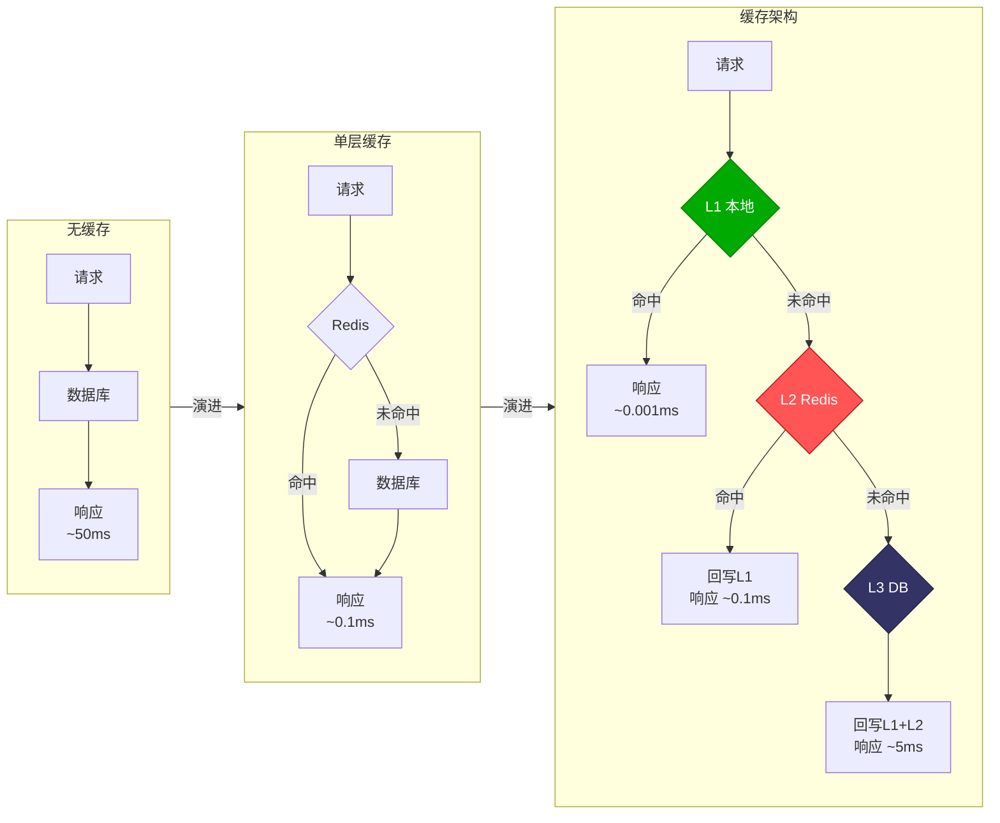

## 缓存策略选型

### 四大缓存策略

| 策略 | 读路径 | 写路径 | 一致性 | 复杂度 |
|------|--------|--------|--------|--------|
| Cache Aside | 应用查缓存→查DB→写缓存 | 应用写DB→删缓存 | 最终一致 | 低 |
| Read Through | 缓存层代理读 | 应用写DB→删缓存 | 最终一致 | 中 |
| Write Through | 缓存层代理读 | 缓存层同步写DB | 强一致 | 中 |
| Write Behind | 缓存层代理读 | 缓存层异步写DB | 最终一致 | 高 |

### 1. Cache Aside（旁路缓存）

最广泛使用的缓存策略。应用程序同时负责缓存和数据库的读写。

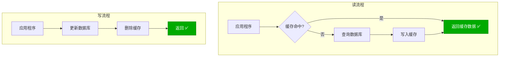

**Java Spring Cache 实现：**

```java
@Service
public class ProductService {

    @Autowired
    private ProductRepository productRepository;

    @Cacheable(value = "products", key = "#id")
    public Product getProduct(Long id) {
        // 缓存未命中时自动执行方法体，结果写入缓存
        return productRepository.findById(id)
            .orElseThrow(() -> new NotFoundException("Product not found"));
    }

    @CacheEvict(value = "products", key = "#product.id")
    public Product updateProduct(Product product) {
        // 更新数据库后删除缓存
        return productRepository.save(product);
    }

    @CacheEvict(value = "products", key = "#id")
    public void deleteProduct(Long id) {
        productRepository.deleteById(id);
    }
}
```

**.NET 实现：**

```csharp
public class ProductService
{
    private readonly IDistributedCache _cache;
    private readonly IProductRepository _repo;

    public async Task<Product?> GetAsync(long id)
    {
        var key = $"product:{id}";
        var cached = await _cache.GetStringAsync(key);

        if (cached is not null)
            return JsonSerializer.Deserialize<Product>(cached);

        var product = await _repo.GetByIdAsync(id);
        if (product is not null)
        {
            await _cache.SetStringAsync(key,
                JsonSerializer.Serialize(product),
                new DistributedCacheEntryOptions
                {
                    AbsoluteExpirationRelativeToNow = TimeSpan.FromMinutes(30)
                });
        }
        return product;
    }

    public async Task UpdateAsync(Product product)
    {
        await _repo.UpdateAsync(product);
        await _cache.RemoveAsync($"product:{product.Id}");
    }
}
```

::: tip Cache Aside 的为什么是"删缓存"而不是"更新缓存"
1. **并发安全**：两个写请求 A→B，更新缓存可能出现 A 覆盖 B 的数据
2. **懒加载**：删除后只在下次被读取时才重建，避免写不被读的缓存
3. **简洁**：删除是幂等操作，无需处理字段级合并
:::

### 2. Read Through（读穿透）

缓存层封装了数据库读取逻辑，应用程序只与缓存交互，不知道数据库的存在。

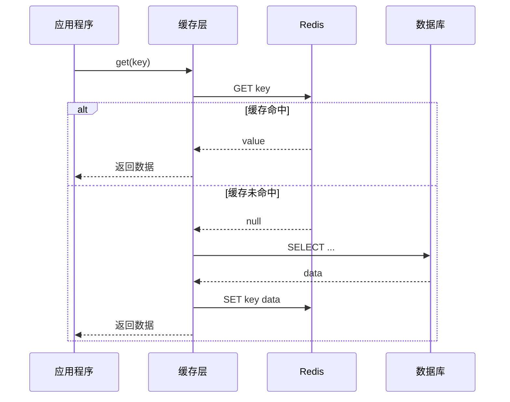

**Spring Cache 实现（@Cacheable 天然支持 Read Through）：**

```java
@Configuration
@EnableCaching
public class CacheConfig {

    @Bean
    public RedisCacheManager cacheManager(RedisConnectionFactory factory) {
        RedisCacheConfiguration config = RedisCacheConfiguration
            .defaultCacheConfig()
            .entryTtl(Duration.ofMinutes(30))
            .serializeValuesWith(RedisSerializationContext
                .SerializationPair
                .fromSerializer(new GenericJackson2JsonRedisSerializer()));

        return RedisCacheManager.builder(factory)
            .cacheDefaults(config)
            .withInitialCacheConfigurations(Map.of(
                "products", config.entryTtl(Duration.ofMinutes(60)),
                "users", config.entryTtl(Duration.ofMinutes(15))
            ))
            .build();
    }
}
```

**.NET Read Through 封装：**

```csharp
public class ReadThroughCache
{
    private readonly IDistributedCache _cache;
    private readonly ILogger<ReadThroughCache> _logger;

    public async Task<T> GetOrCreateAsync<T>(
        string key,
        Func<CancellationToken, Task<T>> factory,
        TimeSpan? ttl = null,
        CancellationToken ct = default)
    {
        var cached = await _cache.GetStringAsync(key, ct);
        if (cached is not null)
        {
            _logger.LogDebug("Cache HIT: {Key}", key);
            return JsonSerializer.Deserialize<T>(cached)!;
        }

        _logger.LogDebug("Cache MISS: {Key}, loading from source", key);
        var value = await factory(ct);

        ttl ??= TimeSpan.FromMinutes(30);
        await _cache.SetStringAsync(key,
            JsonSerializer.Serialize(value),
            new DistributedCacheEntryOptions
            {
                AbsoluteExpirationRelativeToNow = ttl
            }, ct);

        return value;
    }
}
```

### 3. Write Through（写穿透）

写操作先更新缓存，缓存层负责同步写入数据库。缓存和数据库始终保持一致。

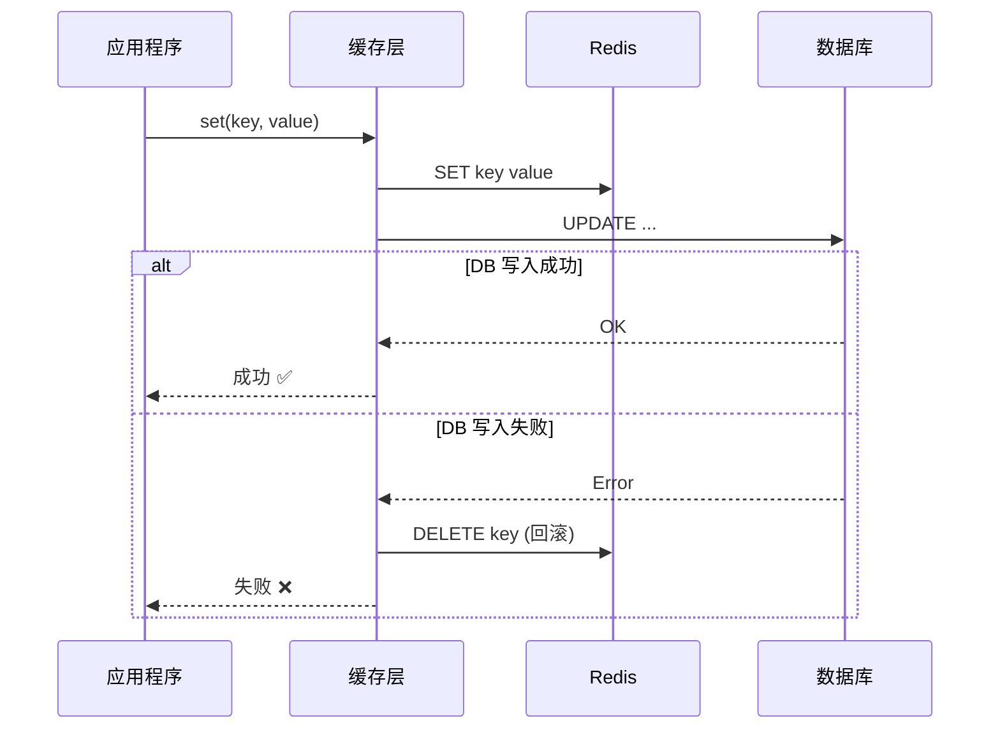

```csharp
public class WriteThroughCache
{
    private readonly IDistributedCache _cache;
    private readonly IProductRepository _repo;
    private readonly ILogger<WriteThroughCache> _logger;

    public async Task UpdateAsync(Product product)
    {
        var key = $"product:{product.Id}";

        try
        {
            // 1. 同步更新数据库
            await _repo.UpdateAsync(product);

            // 2. 更新缓存
            await _cache.SetStringAsync(key,
                JsonSerializer.Serialize(product),
                new DistributedCacheEntryOptions
                {
                    AbsoluteExpirationRelativeToNow = TimeSpan.FromMinutes(30)
                });

            _logger.LogInformation("Write-Through success: {Key}", key);
        }
        catch (Exception ex)
        {
            // 3. 数据库写入失败，删除缓存避免脏数据
            await _cache.RemoveAsync(key);
            _logger.LogError(ex, "Write-Through failed: {Key}", key);
            throw;
        }
    }
}
```

### 4. Write Behind（异步写 / Write Behind Caching）

写操作先更新缓存，后台异步批量刷新到数据库。这是性能最高的策略，但一致性最弱。

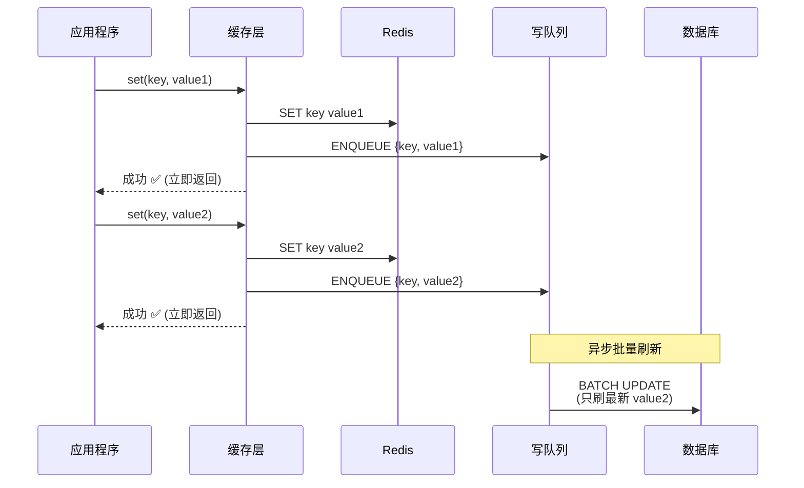

**Java 实现（Spring + Kafka）：**

```java
@Service
public class WriteBehindService {

    @Autowired
    private KafkaTemplate<String, WriteOperation> kafkaTemplate;

    @Autowired
    private RedisTemplate<String, Object> redisTemplate;

    // 立即更新缓存，异步写DB
    public void updateProduct(Product product) {
        // 1. 立即更新 Redis
        redisTemplate.opsForValue().set(
            "product:" + product.getId(),
            product,
            30, TimeUnit.MINUTES
        );

        // 2. 发送到 Kafka，异步消费写 DB
        kafkaTemplate.send("write-behind", new WriteOperation(
            "UPDATE", "product:" + product.getId(), product
        ));
    }
}

@Component
public class WriteBehindConsumer {

    @Autowired
    private ProductRepository productRepository;

    @KafkaListener(topics = "write-behind", groupId = "write-behind-group")
    public void consume(List<WriteOperation> operations) {
        // 批量去重：同一个 key 只保留最新操作
        var latest = operations.stream()
            .collect(Collectors.toMap(
                WriteOperation::getKey,
                Function.identity(),
                (a, b) -> b  // 保留最新的
            ));

        // 批量写入数据库
        var products = latest.values().stream()
            .map(op -> (Product) op.getData())
            .collect(Collectors.toList());

        productRepository.saveAll(products);
    }
}
```

**.NET 实现（Channel + BackgroundService）：**

```csharp
public class WriteBehindService : BackgroundService
{
    private readonly Channel<WriteOperation> _channel =
        Channel.CreateBounded<WriteOperation>(10000);
    private readonly IServiceProvider _serviceProvider;
    private readonly ILogger<WriteBehindService> _logger;

    public async Task EnqueueAsync(WriteOperation operation)
    {
        await _channel.Writer.WriteAsync(operation);
    }

    protected override async Task ExecuteAsync(CancellationToken ct)
    {
        var batch = new List<WriteOperation>();
        var batchTimer = PeriodicTimer.FromSeconds(5);

        while (!ct.IsCancellationRequested)
        {
            // 收集一个批次
            while (_channel.Reader.TryRead(out var op))
            {
                batch.Add(op);
            }

            if (batch.Count > 0)
            {
                await FlushBatchAsync(batch, ct);
                batch.Clear();
            }

            await batchTimer.WaitForNextTickAsync(ct);
        }
    }

    private async Task FlushBatchAsync(
        List<WriteOperation> batch, CancellationToken ct)
    {
        using var scope = _serviceProvider.CreateScope();
        var repo = scope.ServiceProvider
            .GetRequiredService<IProductRepository>();

        // 去重：同一 Key 只保留最新
        var latest = batch
            .GroupBy(o => o.Key)
            .Select(g => g.Last())
            .ToList();

        var products = latest
            .Select(o => JsonSerializer.Deserialize<Product>(o.Value!)!)
            .ToList();

        await repo.BatchUpdateAsync(products, ct);
        _logger.LogInformation("Flushed {Count} write operations", latest.Count);
    }
}
```

### 策略对比与选型

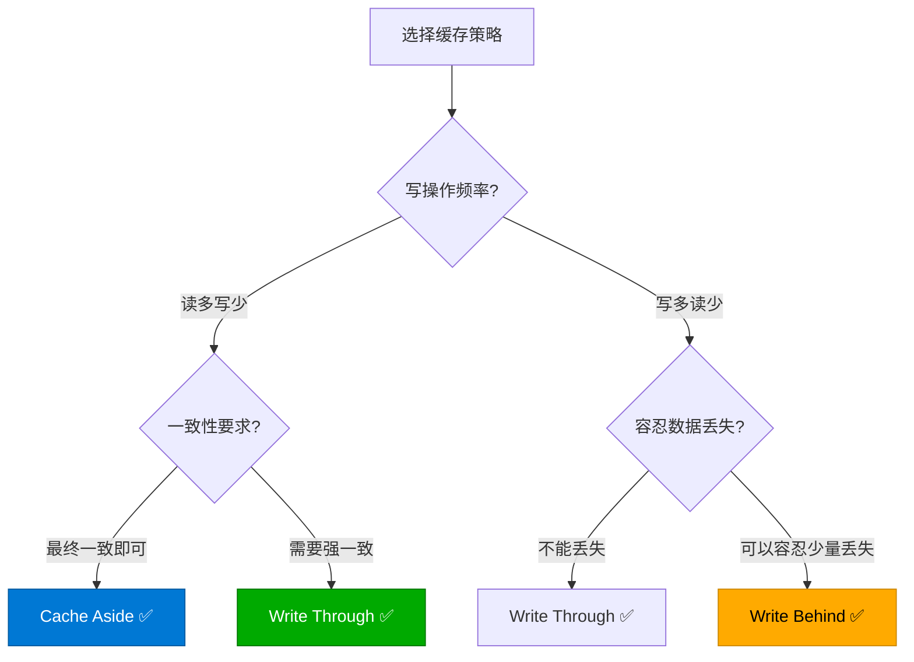

| 场景 | 推荐策略 | 原因 |
|------|---------|------|
| 商品详情页 | Cache Aside | 读多写少，最终一致即可 |
| 用户资料 | Read Through + Cache Aside | 读密集，简单可靠 |
| 库存扣减 | Write Through | 强一致性要求 |
| 浏览量/点赞 | Write Behind | 写密集，容忍少量丢失 |
| 订单状态 | Write Through | 数据不能丢失 |

## 多级缓存架构

### 为什么需要多级缓存？

单层 Redis 缓存在以下场景存在瓶颈：

1. **网络延迟**：即使 Redis 在内网，一次请求也有 ~0.1ms 的网络开销
2. **Redis 宕机**：单层缓存完全依赖 Redis 可用性
3. **热点 Key**：单个 Key 的高频访问会导致 Redis 连接瓶颈
4. **序列化开销**：每次请求都要序列化/反序列化

多级缓存通过在不同层次放置缓存来逐层过滤请求。

### 三级缓存架构

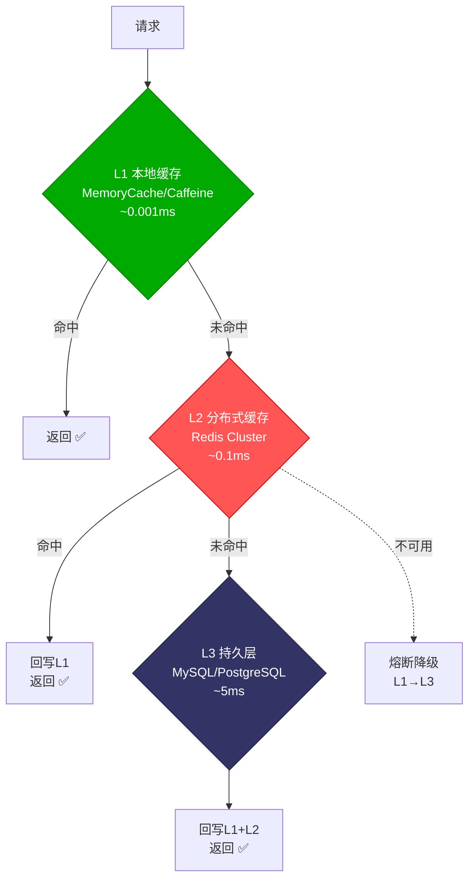

| 层级 | 存储 | 延迟 | 容量 | 一致性 | 作用 |
|------|------|------|------|--------|------|
| L1 | 本地内存 | ~0.001ms | MB级 | 进程内 | 热点加速 |
| L2 | Redis | ~0.1ms | GB级 | 全局一致 | 全局共享 |
| L3 | 数据库 | ~5ms | TB级 | 持久化 | 数据源 |

### Java 多级缓存实现（Caffeine + Redis）

```java
@Configuration
public class MultiLevelCacheConfig {

    @Bean
    public Cache<String, Object> localCache() {
        return Caffeine.newBuilder()
            .maximumSize(10_000)
            .expireAfterWrite(5, TimeUnit.MINUTES)  // L1 过期时间短
            .recordStats()  // 开启统计
            .build();
    }

    @Bean
    public RedisCacheManager redisCacheManager(
            RedisConnectionFactory factory) {
        RedisCacheConfiguration config = RedisCacheConfiguration
            .defaultCacheConfig()
            .entryTtl(Duration.ofMinutes(30));  // L2 过期时间长

        return RedisCacheManager.builder(factory)
            .cacheDefaults(config)
            .build();
    }
}

@Service
public class MultiLevelCacheService {

    @Autowired
    private Cache<String, Object> localCache;

    @Autowired
    private RedisTemplate<String, Object> redisTemplate;

    @Autowired
    private ProductRepository productRepository;

    @Autowired
    private RedisMessageListenerContainer listenerContainer;

    public Product getProduct(Long id) {
        String key = "product:" + id;

        // L1: 本地缓存
        var l1Value = localCache.getIfPresent(key);
        if (l1Value != null) {
            return (Product) l1Value;
        }

        // L2: Redis
        var l2Value = redisTemplate.opsForValue().get(key);
        if (l2Value != null) {
            localCache.put(key, l2Value);  // 回写 L1
            return (Product) l2Value;
        }

        // L3: 数据库
        var product = productRepository.findById(id).orElse(null);
        if (product != null) {
            localCache.put(key, product);
            redisTemplate.opsForValue().set(key, product, 30, TimeUnit.MINUTES);
        }
        return product;
    }

    public void updateProduct(Product product) {
        productRepository.save(product);
        String key = "product:" + product.getId();

        // 失效 L1
        localCache.invalidate(key);
        // 失效 L2
        redisTemplate.delete(key);
        // 广播其他实例失效 L1
        redisTemplate.convertAndSend("cache:invalidate", key);
    }
}
```

### L1 失效广播

当多个服务实例各自持有 L1 缓存时，一个实例更新数据后需要通知其他实例失效 L1。

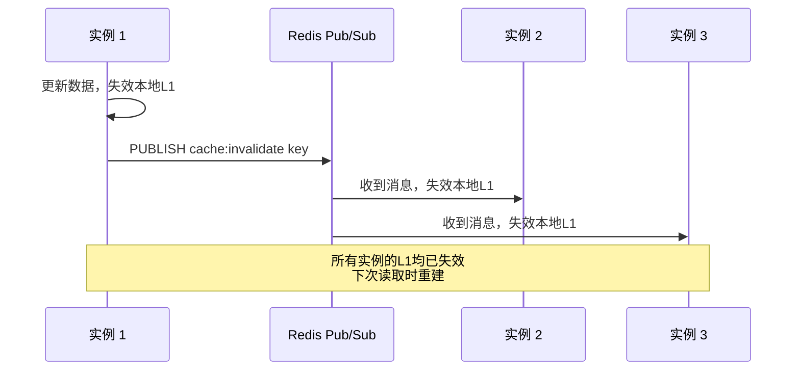

**Java 实现（Redis Pub/Sub）：**

```java
@Component
public class CacheInvalidationListener {

    @Autowired
    private Cache<String, Object> localCache;

    @Autowired
    private RedisMessageListenerContainer container;

    @PostConstruct
    public void init() {
        container.addMessageListener((message, pattern) -> {
            String key = new String(message.getBody());
            localCache.invalidate(key);
        }, new ChannelTopic("cache:invalidate"));
    }
}
```

**.NET 实现：**

```csharp
public class CacheInvalidationHostedService : IHostedService, IDisposable
{
    private readonly IConnectionMultiplexer _redis;
    private readonly IMemoryCache _localCache;
    private ISubscriber? _subscriber;

    public async Task StartAsync(CancellationToken ct)
    {
        _subscriber = _redis.GetSubscriber();
        await _subscriber.SubscribeAsync("cache:invalidate", (channel, message) =>
        {
            var key = message.ToString();
            _localCache.Remove(key);
        });
    }

    public async Task StopAsync(CancellationToken ct)
    {
        if (_subscriber is not null)
            await _subscriber.UnsubscribeAllAsync();
    }

    public void Dispose() => _subscriber?.UnsubscribeAll();
}
```

### TTL 设计原则

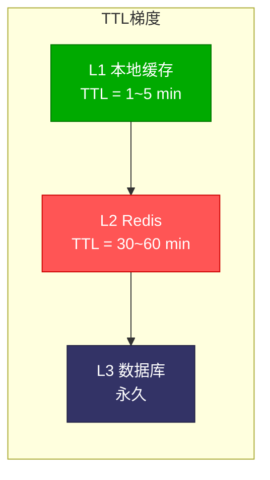

::: important TTL 梯度原则
L1 TTL < L2 TTL < L3 永久。越靠近客户端，TTL 越短。这样即使 L1 失效未及时通知，最长在 L1 TTL 到期后也会从 L2 获取最新数据。
:::

## 热点 Key 发现与处理

### 热点 Key 的危害

当某个 Key 的访问量极高（如秒杀商品、热门新闻），会导致：

1. **Redis 单节点压力过大**：所有请求都打到同一个 Redis 分片
2. **网络带宽瓶颈**：大 Value 的热点 Key 占满网络带宽
3. **连接池耗尽**：单个 Key 的并发请求占满连接

### 热点 Key 发现

**方案一：Redis MONITOR 命令（仅用于诊断，不要在生产环境长期使用）**

```bash
# 采样 10 秒内的所有命令
redis-cli MONITOR | head -n 100000 | awk '{print $3}' | sort | uniq -c | sort -rn | head -20
```

**方案二：redis-cli --hotkeys（Redis 4.0+）**

```bash
# 需要开启 maxmemory-policy 为 LFU 系列
redis-cli --hotkeys
```

**方案三：自定义热点探测（Java 实现）**

```java
@Component
public class HotKeyDetector {

    private final ConcurrentHashMap<String, AtomicLong> keyCounters =
        new ConcurrentHashMap<>();
    private final ScheduledExecutorService scheduler =
        Executors.newScheduledThreadPool(1);

    // 热点阈值：每秒 100 次访问
    private static final long HOT_THRESHOLD = 100;

    @PostConstruct
    public void init() {
        // 每秒统计一次
        scheduler.scheduleAtFixedRate(this::detectAndReport, 1, 1, TimeUnit.SECONDS);
    }

    public void recordAccess(String key) {
        keyCounters.computeIfAbsent(key, k -> new AtomicLong(0))
            .incrementAndGet();
    }

    private void detectAndReport() {
        var hotKeys = keyCounters.entrySet().stream()
            .filter(e -> e.getValue().get() > HOT_THRESHOLD)
            .map(e -> Map.entry(e.getKey(), e.getValue().get()))
            .sorted(Map.Entry.<String, Long>comparingByValue().reversed())
            .limit(10)
            .collect(Collectors.toList());

        if (!hotKeys.isEmpty()) {
            log.warn("Hot keys detected: {}", hotKeys);
            // 通知本地缓存预热
            hotKeys.forEach(e -> promoteToLocalCache(e.getKey()));
        }

        // 重置计数器
        keyCounters.clear();
    }

    private void promoteToLocalCache(String key) {
        // 将热点 Key 提升到本地缓存
        // 实现略
    }
}
```

**方案四：自定义热点探测（.NET 实现）**

```csharp
public class HotKeyDetector : IHostedService
{
    private readonly ConcurrentDictionary<string, long> _counters = new();
    private Timer? _timer;
    private const long HotThreshold = 100;

    public void RecordAccess(string key)
    {
        _counters.AddOrUpdate(key, 1, (_, v) => v + 1);
    }

    public Task StartAsync(CancellationToken ct)
    {
        _timer = new Timer(Detect, null,
            TimeSpan.FromSeconds(1), TimeSpan.FromSeconds(1));
        return Task.CompletedTask;
    }

    private void Detect(object? state)
    {
        var hotKeys = _counters
            .Where(kvp => kvp.Value > HotThreshold)
            .OrderByDescending(kvp => kvp.Value)
            .Take(10)
            .ToList();

        if (hotKeys.Count > 0)
        {
            foreach (var (key, count) in hotKeys)
            {
                Console.WriteLine($"[HOT KEY] {key}: {count} qps");
            }
        }

        _counters.Clear();
    }

    public Task StopAsync(CancellationToken ct)
    {
        _timer?.Dispose();
        return Task.CompletedTask;
    }
}
```

### 热点 Key 处理方案

**方案一：本地缓存（最常用）**

将热点 Key 的数据缓存在应用本地，请求不再打到 Redis。

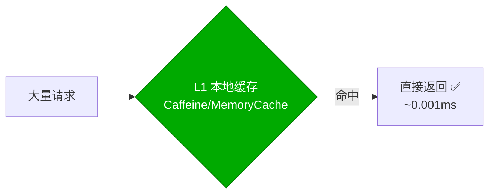

**方案二：Key 分片**

将一个热点 Key 拆分成多个子 Key，分散到不同的 Redis 分片。

```java
// 将 hot_key 拆分为 hot_key:0 ~ hot_key:N
public class ShardedHotKey {

    private static final int SHARD_COUNT = 16;
    private final RedisTemplate<String, Object> redisTemplate;

    public void set(String keyPrefix, Object value, long ttl, TimeUnit unit) {
        for (int i = 0; i < SHARD_COUNT; i++) {
            String shardedKey = keyPrefix + ":" + i;
            redisTemplate.opsForValue().set(shardedKey, value, ttl, unit);
        }
    }

    public Object get(String keyPrefix) {
        // 随机选择一个分片读取
        int shard = ThreadLocalRandom.current().nextInt(SHARD_COUNT);
        String shardedKey = keyPrefix + ":" + shard;
        return redisTemplate.opsForValue().get(shardedKey);
    }
}
```

**方案三：读写分离**

热点 Key 的读请求路由到 Redis 从节点，减轻主节点压力。

```csharp
public class ReadWriteSplitCache
{
    private readonly IConnectionMultiplexer _redis;

    public async Task<string?> GetAsync(string key)
    {
        // 读请求：优先路由到从节点
        var replica = _redis.GetServers()
            .FirstOrDefault(s => s.IsReplica);
        var server = replica ?? _redis.GetServers().First();
        return await server.StringGetAsync(key);
    }

    public async Task SetAsync(string key, string value, TimeSpan ttl)
    {
        // 写请求：路由到主节点
        var primary = _redis.GetServers()
            .First(s => !s.IsReplica);
        await primary.StringSetAsync(key, value, ttl);
    }
}
```

## 缓存预热

### 为什么需要预热？

冷启动时缓存为空，第一批请求全部穿透到数据库。对于可预知的热点数据，可以在系统启动时提前加载到缓存。

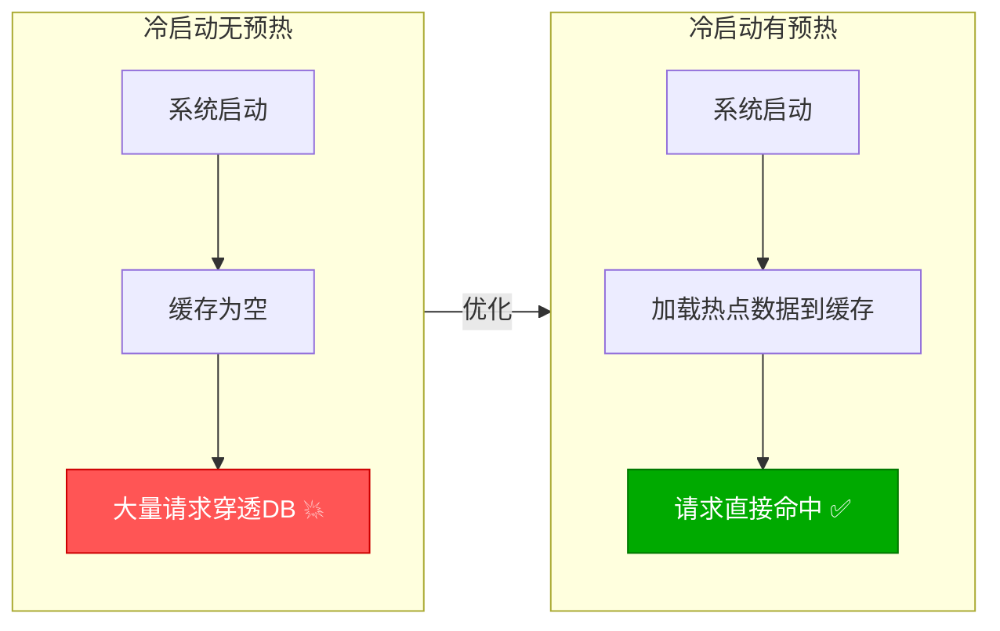

### 预热策略

**策略一：启动时预热**

```java
@Component
public class CacheWarmupRunner implements ApplicationRunner {

    @Autowired
    private RedisTemplate<String, Object> redisTemplate;

    @Autowired
    private ProductRepository productRepository;

    @Override
    public void run(ApplicationArguments args) {
        log.info("Starting cache warmup...");

        // 1. 预热热门商品
        var hotProducts = productRepository.findTop100ByOrderByViewCountDesc();
        hotProducts.forEach(p -> {
            redisTemplate.opsForValue().set(
                "product:" + p.getId(), p,
                60, TimeUnit.MINUTES
            );
        });

        // 2. 预热分类列表
        var categories = productRepository.findAllCategories();
        categories.forEach(c -> {
            redisTemplate.opsForValue().set(
                "category:" + c.getId(), c,
                120, TimeUnit.MINUTES
            );
        });

        log.info("Cache warmup completed: {} products, {} categories",
            hotProducts.size(), categories.size());
    }
}
```

**策略二：定时预热**

```csharp
public class ScheduledWarmupService : IHostedService
{
    private readonly IServiceProvider _sp;
    private Timer? _timer;

    public Task StartAsync(CancellationToken ct)
    {
        // 每小时刷新一次热点数据
        _timer = new Timer(Warmup, null,
            TimeSpan.Zero, TimeSpan.FromHours(1));
        return Task.CompletedTask;
    }

    private async void Warmup(object? state)
    {
        using var scope = _sp.CreateScope();
        var cache = scope.ServiceProvider
            .GetRequiredService<IDistributedCache>();
        var repo = scope.ServiceProvider
            .GetRequiredService<IProductRepository>();

        var hotProducts = await repo.GetHotProductsAsync(200);
        foreach (var product in hotProducts)
        {
            var key = $"product:{product.Id}";
            await cache.SetStringAsync(key,
                JsonSerializer.Serialize(product),
                new DistributedCacheEntryOptions
                {
                    AbsoluteExpirationRelativeToNow = TimeSpan.FromHours(2)
                });
        }
    }

    public Task StopAsync(CancellationToken ct)
    {
        _timer?.Dispose();
        return Task.CompletedTask;
    }
}
```

**策略三：基于访问日志的智能预热**

```java
@Component
public class SmartWarmupService {

    @Autowired
    private RedisTemplate<String, Object> redisTemplate;

    @Autowired
    private AccessLogRepository logRepository;

    /**
     * 分析近 24 小时访问日志，预热 Top N 数据
     */
    @Scheduled(cron = "0 0 * * * *")  // 每小时执行
    public void smartWarmup() {
        var topKeys = logRepository.findTopKeysLast24Hours(500);

        topKeys.forEach(keyInfo -> {
            // 只预热当前不在缓存中的 Key
            var cached = redisTemplate.opsForValue().get(keyInfo.getKey());
            if (cached == null) {
                loadToCache(keyInfo.getKey());
            }
        });

        log.info("Smart warmup completed: {} keys checked", topKeys.size());
    }
}
```

## 缓存降级

### 降级策略

当 Redis 不可用或响应过慢时，系统应能降级到其他方案，而不是直接报错。

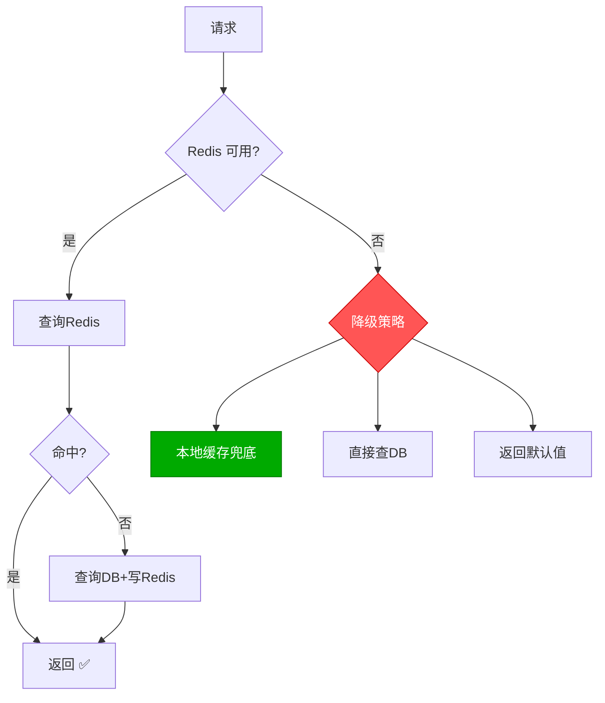

**降级方案对比：**

| 方案 | 数据时效性 | DB压力 | 适用场景 |
|------|-----------|--------|---------|
| 本地缓存兜底 | 低（可能过期） | 无 | 热点只读数据 |
| 直接查DB | 高 | 大 | 数据量小 |
| 返回默认值 | 最低 | 无 | 非核心功能 |
| 返回静态页面 | 低 | 无 | 内容展示 |

**Java 降级实现（Resilience4j）：**

```java
@Service
public class ResilientCacheService {

    @Autowired
    private RedisTemplate<String, Object> redisTemplate;

    @Autowired
    private Cache<String, Object> localCache;

    @Autowired
    private ProductRepository productRepository;

    private final CircuitBreaker circuitBreaker;

    public ResilientCacheService(CircuitBreakerRegistry registry) {
        this.circuitBreaker = registry.circuitBreaker("redis",
            CircuitBreakerConfig.custom()
                .failureRateThreshold(50)
                .waitDurationInOpenState(Duration.ofMinutes(1))
                .slidingWindowSize(10)
                .build()
        );
    }

    public Product getProduct(Long id) {
        return CircuitBreaker.decorateSupplier(circuitBreaker, () -> {
            // 正常路径：Redis
            var cached = redisTemplate.opsForValue().get("product:" + id);
            if (cached != null) return (Product) cached;

            var product = productRepository.findById(id).orElse(null);
            if (product != null) {
                redisTemplate.opsForValue().set("product:" + id, product,
                    30, TimeUnit.MINUTES);
            }
            return product;
        }).get();
    }

    // Fallback 方法
    public Product getProductFallback(Long id, Exception e) {
        // 降级路径：本地缓存
        var cached = localCache.getIfPresent("product:" + id);
        if (cached != null) return (Product) cached;

        // 最终降级：查数据库
        return productRepository.findById(id).orElse(null);
    }
}
```

**.NET 降级实现（Polly）：**

```csharp
public class ResilientCacheService
{
    private readonly IDistributedCache _redis;
    private readonly IMemoryCache _local;
    private readonly IProductRepository _repo;
    private readonly AsyncCircuitBreakerPolicy _circuitBreaker;

    public ResilientCacheService(
        IDistributedCache redis,
        IMemoryCache local,
        IProductRepository repo)
    {
        _redis = redis;
        _local = local;
        _repo = repo;

        _circuitBreaker = Policy
            .Handle<Exception>()
            .CircuitBreakerAsync(
                exceptionsAllowedBeforeBreaking: 3,
                durationOfBreak: TimeSpan.FromMinutes(1));
    }

    public async Task<Product?> GetAsync(long id)
    {
        try
        {
            return await _circuitBreaker.ExecuteAsync(async () =>
            {
                var key = $"product:{id}";
                var cached = await _redis.GetStringAsync(key);
                if (cached is not null)
                    return JsonSerializer.Deserialize<Product>(cached);

                var product = await _repo.GetByIdAsync(id);
                if (product is not null)
                {
                    await _redis.SetStringAsync(key,
                        JsonSerializer.Serialize(product),
                        new DistributedCacheEntryOptions
                        {
                            AbsoluteExpirationRelativeToNow = TimeSpan.FromMinutes(30)
                        });
                }
                return product;
            });
        }
        catch (BrokenCircuitException)
        {
            // 熔断打开，降级
            return await FallbackAsync(id);
        }
    }

    private async Task<Product?> FallbackAsync(long id)
    {
        var key = $"product:{id}";
        if (_local.TryGetValue(key, out Product? cached))
            return cached;

        var product = await _repo.GetByIdAsync(id);
        if (product is not null)
            _local.Set(key, product, TimeSpan.FromMinutes(5));
        return product;
    }
}
```

## 大 Value 拆分

### 什么算大 Value？

| Value 大小 | 风险等级 | 建议 |
|-----------|---------|------|
| < 1KB | 安全 | 正常使用 |
| 1KB ~ 10KB | 注意 | 监控访问频率 |
| 10KB ~ 100KB | 危险 | 必须拆分 |
| > 100KB | 严重 | 禁止直接存储 |

大 Value 的危害：
- **网络阻塞**：传输大 Value 占用大量带宽
- **Redis 阻塞**：大 Value 的读写操作（DEL、SORT）可能阻塞 Redis 事件循环
- **内存碎片**：频繁修改大 Value 导致内存碎片

### 拆分方案

**方案一：按字段拆分**

```java
// ❌ 大 Value：整个用户资料存在一个 Key
redis.set("user:123", bigUserProfile);  // 50KB

// ✅ 拆分：按字段分别存储
redis.set("user:123:basic", basicInfo);        // 2KB
redis.set("user:123:preferences", preferences); // 1KB
redis.set("user:123:stats", stats);            // 1KB
redis.set("user:123:relations", relations);     // 5KB
```

**方案二：按分页拆分**

```java
// ❌ 大 Value：1000 条评论存在一个 Key
redis.set("product:456:comments", all1000Comments);  // 200KB

// ✅ 拆分：按页码存储
redis.set("product:456:comments:p1", page1Comments);  // 2KB
redis.set("product:456:comments:p2", page2Comments);  // 2KB
redis.set("product:456:comments:p3", page3Comments);  // 2KB
```

**方案三：压缩存储**

```java
@Service
public class CompressedCacheService {

    @Autowired
    private RedisTemplate<String, byte[]> redisTemplate;

    private static final int COMPRESSION_THRESHOLD = 1024; // 1KB

    public void set(String key, Object value, long ttl, TimeUnit unit) {
        var bytes = serialize(value);

        if (bytes.length > COMPRESSION_THRESHOLD) {
            bytes = compress(bytes);
            redisTemplate.opsForValue().set(
                key + ":compressed", bytes, ttl, unit);
        } else {
            redisTemplate.opsForValue().set(key, bytes, ttl, unit);
        }
    }

    public <T> T get(String key, Class<T> type) {
        var bytes = redisTemplate.opsForValue().get(key);
        if (bytes == null) {
            bytes = redisTemplate.opsForValue().get(key + ":compressed");
            if (bytes != null) bytes = decompress(bytes);
        }
        return bytes != null ? deserialize(bytes, type) : null;
    }

    private byte[] compress(byte[] data) {
        var bos = new ByteArrayOutputStream();
        try (var cos = new GZIPOutputStream(bos)) {
            cos.write(data);
        }
        return bos.toByteArray();
    }

    private byte[] decompress(byte[] compressed) {
        var bis = new ByteArrayInputStream(compressed);
        try (var gis = new GZIPInputStream(bis)) {
            return gis.readAllBytes();
        } catch (IOException e) {
            throw new RuntimeException(e);
        }
    }
}
```

### 大 Value 实时检测

```csharp
public class BigKeyDetector
{
    private readonly IConnectionMultiplexer _redis;
    private readonly ILogger<BigKeyDetector> _logger;
    private const long WarningThreshold = 10 * 1024;  // 10KB
    private const long DangerThreshold = 100 * 1024;   // 100KB

    public async Task ScanBigKeysAsync(int database = 0, long sampleCount = 1000)
    {
        var server = _redis.GetServers().First();
        var db = _redis.GetDatabase(database);

        await foreach (var key in server.KeysAsync(database: database))
        {
            var type = await db.KeyTypeAsync(key);
            long size = type switch
            {
                RedisType.String => (await db.StringGetAsync(key)).Length,
                RedisType.List => await db.ListLengthAsync(key),
                RedisType.Set => await db.SetLengthAsync(key),
                RedisType.SortedSet => await db.SortedSetLengthAsync(key),
                RedisType.Hash => await db.HashLengthAsync(key),
                _ => 0
            };

            if (type == RedisType.String && size > WarningThreshold)
            {
                var level = size > DangerThreshold ? "DANGER" : "WARNING";
                _logger.LogWarning(
                    "[{Level}] Big key detected: {Key} (type={Type}, size={Size})",
                    level, key, type, FormatSize(size));
            }
            else if (type != RedisType.String && size > 5000)
            {
                _logger.LogWarning(
                    "[WARNING] Big collection: {Key} (type={Type}, count={Count})",
                    key, type, size);
            }
        }
    }

    private static string FormatSize(long bytes) => bytes switch
    {
        < 1024 => $"{bytes} B",
        < 1024 * 1024 => $"{bytes / 1024.0:F1} KB",
        _ => $"{bytes / 1024.0 / 1024.0:F1} MB"
    };
}
```

## Key 设计规范

### 命名规范

```
格式：业务域:实体:ID[:字段]
分隔符：冒号 (:)
前缀：项目名或业务域
```

| 示例 | 含义 |
|------|------|
| `user:profile:12345` | 用户 12345 的完整资料 |
| `user:profile:12345:nickname` | 用户 12345 的昵称 |
| `product:detail:67890` | 商品 67890 的详情 |
| `product:stock:67890` | 商品 67890 的库存 |
| `order:list:12345:p1:s20` | 用户 12345 的订单列表（第1页，每页20条） |
| `counter:view:67890` | 商品 67890 的浏览计数 |
| `lock:order:12345` | 订单 12345 的分布式锁 |

### 长度控制

- Key 总长度不超过 128 字节
- 避免超长 Key：`user:profile:very-long-user-id-that-nobody-should-use`
- 使用缩写：`prod:detail:123` 而非 `product:detailinformation:123`

### 类型选择

| 数据特征 | 推荐类型 | 示例 |
|---------|---------|------|
| 单个对象 | String + JSON | `user:profile:123` |
| 对象的部分字段 | Hash | `user:123` → {name, age, email} |
| 列表数据 | List | `user:123:notifications` |
| 去重集合 | Set | `article:123:liked_user_ids` |
| 排行榜 | Sorted Set | `game:leaderboard` |
| 计数器 | String (INCR) | `counter:view:123` |

::: warning 避免使用 Keys 命令
`KEYS *` 会扫描整个键空间，在数据量大时会导致 Redis 阻塞。使用 `SCAN` 命令替代。
:::

### 过期时间设计

```java
// ❌ 错误：不设过期时间
redis.set("user:123", data);

// ❌ 错误：所有 Key 统一过期时间
redis.set("user:123", data, 30, TimeUnit.MINUTES);
redis.set("product:456", data, 30, TimeUnit.MINUTES);

// ✅ 正确：按业务设置不同过期时间 + 随机偏移
int baseMinutes = 30;
int randomOffset = ThreadLocalRandom.current().nextInt(-5, 5);
redis.set("user:123", data, baseMinutes + randomOffset, TimeUnit.MINUTES);
```

| 数据类型 | 建议过期时间 | 说明 |
|---------|------------|------|
| 用户资料 | 30~60 min | 变更频率低 |
| 商品详情 | 15~30 min | 价格可能变动 |
| 库存数据 | 1~5 min | 实时性要求高 |
| 验证码 | 5 min | 安全要求 |
| 排行榜 | 10~30 min | 可容忍延迟 |
| 会话信息 | 30 min ~ 2h | 跟随会话生命周期 |

## Spring Cache 抽象

### 注解体系

| 注解 | 作用 | 说明 |
|------|------|------|
| `@Cacheable` | 读缓存 | 缓存存在则直接返回，否则执行方法并缓存 |
| `@CachePut` | 写缓存 | 始终执行方法，将结果写入缓存 |
| `@CacheEvict` | 删缓存 | 删除指定缓存 |
| `@Caching` | 组合 | 组合多个缓存注解 |
| `@CacheConfig` | 类级配置 | 统一设置缓存名、Key 生成器等 |

### 配置 RedisCacheManager

```java
@Configuration
@EnableCaching
public class RedisCacheConfig {

    @Bean
    public RedisCacheManager cacheManager(RedisConnectionFactory factory) {
        // 默认配置
        var defaultConfig = RedisCacheConfiguration.defaultCacheConfig()
            .entryTtl(Duration.ofMinutes(30))
            .serializeKeysWith(RedisSerializationContext
                .SerializationPair.fromSerializer(new StringRedisSerializer()))
            .serializeValuesWith(RedisSerializationContext
                .SerializationPair.fromSerializer(
                    new GenericJackson2JsonRedisSerializer()))
            .prefixCacheNameWith("myapp:");  // Key 前缀

        // 针对不同缓存的定制配置
        var cacheConfigurations = Map.of(
            "products", defaultConfig.entryTtl(Duration.ofMinutes(60)),
            "users", defaultConfig.entryTtl(Duration.ofMinutes(15)),
            "hotData", defaultConfig.entryTtl(Duration.ofMinutes(5))
        );

        return RedisCacheManager.builder(factory)
            .cacheDefaults(defaultConfig)
            .withInitialCacheConfigurations(cacheConfigurations)
            .transactionAware()  // 支持事务
            .build();
    }

    @Bean
    public KeyGenerator customKeyGenerator() {
        return (target, method, params) -> {
            // 自定义 Key 生成策略
            var sb = new StringBuilder();
            sb.append(target.getClass().getSimpleName()).append(":");
            sb.append(method.getName()).append(":");
            for (var param : params) {
                sb.append(param.toString()).append(":");
            }
            return sb.toString();
        };
    }
}
```

### 使用示例

```java
@Service
@CacheConfig(cacheNames = "products")  // 类级别默认缓存名
public class ProductService {

    @Cacheable(key = "#id", unless = "#result == null")
    public Product findById(Long id) {
        return productRepository.findById(id).orElse(null);
    }

    @Cacheable(key = "#category + ':' + #page")
    public Page<Product> findByCategory(String category, int page) {
        return productRepository.findByCategory(category, PageRequest.of(page, 20));
    }

    @CachePut(key = "#product.id")
    public Product save(Product product) {
        return productRepository.save(product);
    }

    @CacheEvict(key = "#id")
    public void deleteById(Long id) {
        productRepository.deleteById(id);
    }

    @Caching(evict = {
        @CacheEvict(key = "#id"),
        @CacheEvict(key = "#category + ':' + #page")
    })
    public void deleteAndClearList(Long id, String category, int page) {
        productRepository.deleteById(id);
    }
}
```

::: important @Cacheable 的 unless 和 condition
- `unless`：满足条件时**不缓存**结果（`unless = "#result == null"` 表示不缓存空值）
- `condition`：满足条件时**才缓存**（`condition = "#id > 0"` 表示 ID 大于 0 才缓存）
- 注意：`unless` 是对结果判断，`condition` 是对参数判断
:::

## .NET Cache 抽象

### 缓存接口对比

| 层次 | 接口 | 特点 |
|------|------|------|
| 内存缓存 | `IMemoryCache` | 进程内，最快 |
| 分布式缓存 | `IDistributedCache` | 跨实例，需序列化 |
| 混合缓存 | `HybridCache` (.NET 9) | 自动多级，推荐 |

### IMemoryCache 使用

```csharp
public class MemoryCacheService
{
    private readonly IMemoryCache _cache;
    private readonly IUserRepository _repo;

    public async Task<User?> GetUserAsync(int id)
    {
        return await _cache.GetOrCreateAsync($"user:{id}", async entry =>
        {
            entry.AbsoluteExpirationRelativeToNow = TimeSpan.FromMinutes(5);
            entry.SlidingExpiration = TimeSpan.FromMinutes(2);
            return await _repo.GetByIdAsync(id);
        });
    }
}
```

### IDistributedCache 扩展

```csharp
public static class DistributedCacheExtensions
{
    /// <summary>
    /// 泛型 GetOrCreate 扩展
    /// </summary>
    public static async Task<T> GetOrCreateAsync<T>(
        this IDistributedCache cache,
        string key,
        Func<Task<T>> factory,
        TimeSpan? ttl = null)
    {
        var cached = await cache.GetStringAsync(key);
        if (cached is not null)
            return JsonSerializer.Deserialize<T>(cached)!;

        var value = await factory();
        ttl ??= TimeSpan.FromMinutes(30);

        await cache.SetStringAsync(key,
            JsonSerializer.Serialize(value),
            new DistributedCacheEntryOptions
            {
                AbsoluteExpirationRelativeToNow = ttl
            });

        return value;
    }
}

// 使用
public class ProductAppService
{
    private readonly IDistributedCache _cache;
    private readonly IProductRepository _repo;

    public Task<Product> GetAsync(long id) =>
        _cache.GetOrCreateAsync($"product:{id}",
            () => _repo.GetByIdAsync(id),
            TimeSpan.FromMinutes(30));
}
```

### 缓存标签扩展

```csharp
/// <summary>
/// 支持按标签批量失效的缓存扩展
/// </summary>
public class TaggedCacheService
{
    private readonly IConnectionMultiplexer _redis;

    public async Task SetAsync<T>(string key, T value,
        string[] tags, TimeSpan ttl)
    {
        var db = _redis.GetDatabase();

        // 存储数据
        await db.StringSetAsync(key,
            JsonSerializer.Serialize(value), ttl);

        // 建立标签 → Key 的映射
        foreach (var tag in tags)
        {
            await db.SetAddAsync($"tag:{tag}", key);
            // 标签集合不过期，或设置较长的过期时间
            await db.KeyExpireAsync($"tag:{tag}", ttl + TimeSpan.FromMinutes(10));
        }
    }

    public async Task InvalidateTagAsync(string tag)
    {
        var db = _redis.GetDatabase();
        var keys = await db.SetMembersAsync($"tag:{tag}");

        // 批量删除关联的 Key
        foreach (var key in keys)
        {
            await db.KeyDeleteAsync(key.ToString());
        }
        await db.KeyDeleteAsync($"tag:{tag}");
    }
}
```

## 生产环境检查清单

### 缓存配置

- [ ] 所有缓存 Key 设置了过期时间
- [ ] 过期时间叠加了随机偏移（防雪崩）
- [ ] Redis 连接配置了超时和重试
- [ ] 连接字符串中的密码不在代码中明文存储
- [ ] 实例名（InstanceName）已设置，避免 Key 冲突

### 缓存策略

- [ ] 读操作使用 Cache Aside 或 Read Through
- [ ] 写操作先更新 DB 再删缓存
- [ ] 热点 Key 使用本地缓存或分片
- [ ] 大 Value 已拆分或压缩

### 缓存防护

- [ ] 缓存穿透：布隆过滤器 + 空值缓存
- [ ] 缓存击穿：互斥锁或逻辑过期
- [ ] 缓存雪崩：随机过期 + 多级缓存
- [ ] Redis 不可用：熔断降级 + 本地缓存兜底

### 监控告警

- [ ] 缓存命中率监控（目标 > 90%）
- [ ] Redis 延迟监控（目标 < 1ms）
- [ ] Redis 内存使用量监控
- [ ] 大 Key 扫描告警
- [ ] 连接数监控

## 参考资料

- [Cache Aside Pattern - Martin Fowler](https://martinfowler.com/bliki/TwoHardThings.html)
- [Spring Cache 抽象文档](https://docs.spring.io/spring-framework/docs/current/reference/html/integration.html#cache)
- [Microsoft IDistributedCache](https://learn.microsoft.com/zh-cn/aspnet/core/performance/caching/distributed)
- [Redis BigKey 最佳实践](https://redis.io/docs/manual/patterns/distributed-locks/)
- [Caffeine Cache](https://github.com/ben-manes/caffeine)
- [ASP.NET Core Response Caching](https://learn.microsoft.com/zh-cn/aspnet/core/performance/caching/response)
