# 分布式锁与限流

## 为什么需要分布式锁？

在单机应用中，我们使用 `lock`、`synchronized`、`Monitor` 等本地锁即可保证线程安全。但在分布式系统中，多个服务实例各自拥有独立的内存空间，本地锁无法跨进程生效。

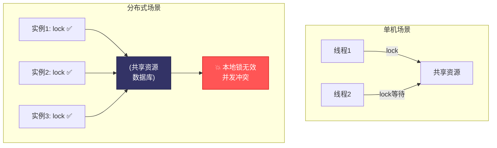

典型场景：
- **库存扣减**：多个实例同时扣减同一商品库存
- **订单防重复**：防止同一订单被重复处理
- **定时任务**：确保集群中只有一个实例执行任务
- **配置更新**：同一时刻只有一个实例能更新配置

## SETNX + EXPIRE 原子操作

### 基础实现

Redis 分布式锁的核心原理：利用 `SETNX`（SET if Not eXists）命令的原子性——只有 Key 不存在时才能设置成功。

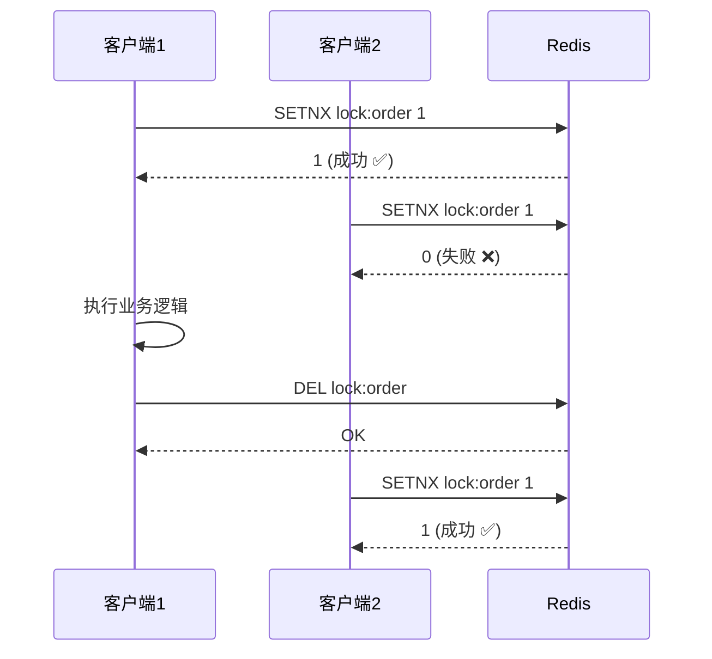

::: warning SETNX + EXPIRE 的非原子问题
如果 SETNX 成功但 EXPIRE 失败（如客户端崩溃），锁将永远不会被释放，造成死锁。必须使用原子命令。
:::

### 原子加锁：SET 命令

Redis 2.6.12+ 支持带参数的 `SET` 命令，一步完成 SETNX + EXPIRE：

```bash
# 原子加锁：不存在时设置，同时设置过期时间
SET lock:order:123 "machine1:thread1" NX EX 30

# 返回 OK 表示加锁成功
# 返回 nil 表示锁已被占用
```

```java
// Java 实现
public class SimpleDistributedLock {

    private final StringRedisTemplate redisTemplate;

    public boolean tryLock(String lockKey, String requestId, int expireSeconds) {
        var result = redisTemplate.opsForValue().setIfAbsent(
            lockKey, requestId, expireSeconds, TimeUnit.SECONDS);
        return Boolean.TRUE.equals(result);
    }

    public boolean unlock(String lockKey, String requestId) {
        // 使用 Lua 脚本保证原子性：只释放自己持有的锁
        String script =
            "if redis.call('get', KEYS[1]) == ARGV[1] then " +
            "  return redis.call('del', KEYS[1]) " +
            "else " +
            "  return 0 " +
            "end";

        var result = redisTemplate.execute(
            new DefaultRedisScript<>(script, Long.class),
            List.of(lockKey), requestId);

        return Long.valueOf(1).equals(result);
    }
}
```

```csharp
// .NET 实现
public class SimpleDistributedLock
{
    private readonly IConnectionMultiplexer _redis;

    public async Task<bool> TryLockAsync(string lockKey, string requestId,
        TimeSpan expiry)
    {
        var db = _redis.GetDatabase();
        return await db.StringSetAsync(lockKey, requestId, expiry, When.NotExists);
    }

    public async Task<bool> UnlockAsync(string lockKey, string requestId)
    {
        var db = _redis.GetDatabase();
        var script = @"
            if redis.call('get', KEYS[1]) == ARGV[1] then
                return redis.call('del', KEYS[1])
            else
                return 0
            end";
        var result = (long)await db.ScriptEvaluateAsync(script,
            new RedisKey[] { lockKey },
            new RedisValue[] { requestId });
        return result == 1;
    }
}
```

### requestId 的必要性

`requestId` 标识锁的持有者，防止误删他人的锁：

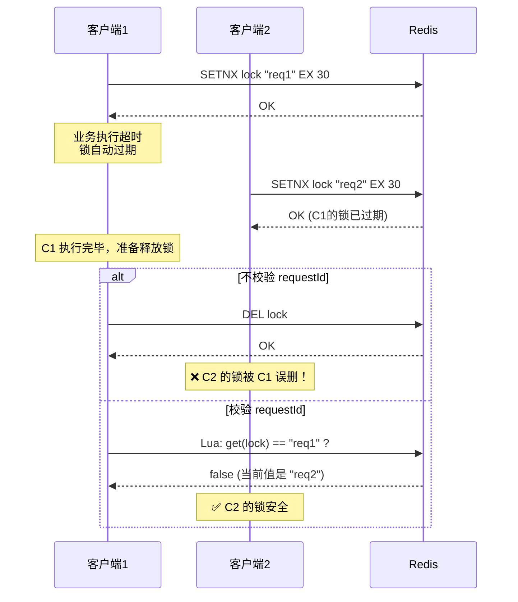

::: important 核心原则
释放锁时必须校验 `requestId`，确保只释放自己持有的锁。这个判断和删除操作必须用 Lua 脚本保证原子性。
:::

## Redisson 分布式锁原理

### Redisson 是什么？

Redisson 是 Redis 的 Java 驻内存数据网格（In-Memory Data Grid），提供了丰富的分布式对象和服务，其中分布式锁是最核心的功能之一。

### 基础用法

```java
// 1. 配置 Redisson
Config config = new Config();
config.useSingleServer()
    .setAddress("redis://127.0.0.1:6379")
    .setPassword("your-password")
    .setDatabase(0);

RedissonClient redisson = Redisson.create(config);

// 2. 使用分布式锁
RLock lock = redisson.getLock("order:123");

try {
    // 尝试加锁：等待 5 秒，锁自动释放时间 30 秒
    boolean acquired = lock.tryLock(5, 30, TimeUnit.SECONDS);
    if (acquired) {
        // 执行业务逻辑
        processOrder(123);
    } else {
        // 获取锁失败
        throw new BusinessException("系统繁忙，请稍后重试");
    }
} finally {
    if (lock.isHeldByCurrentThread()) {
        lock.unlock();
    }
}
```

### Watchdog 续期机制

Redisson 的 Watchdog（看门狗）解决了锁过期但业务未执行完毕的问题：

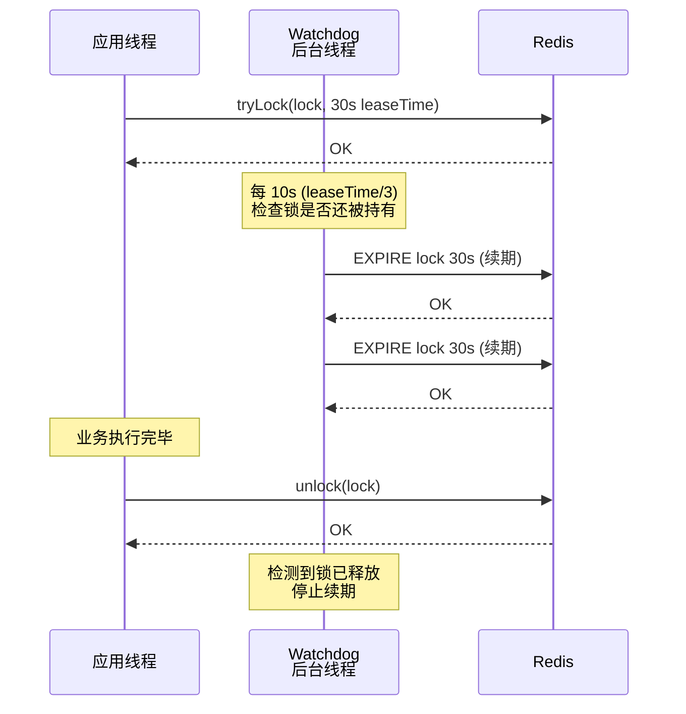

::: tip Watchdog 的工作原理
1. 加锁时不指定 `leaseTime`，Watchdog 自动启动
2. 默认锁超时 30 秒，Watchdog 每 10 秒（30/3）续期一次
3. 每次续期重置超时时间为 30 秒
4. 应用调用 `unlock()` 后，Watchdog 停止续期
5. 如果应用崩溃，Watchdog 也会停止，锁在 30 秒后自动释放
:::

```java
// Watchdog 续期的 Lua 脚本（Redisson 源码简化版）
// 如果锁还被当前线程持有，则续期
String renewalScript =
    "if (redis.call('hexists', KEYS[1], ARGV[2]) == 1) then " +
    "  redis.call('pexpire', KEYS[1], ARGV[1]); " +
    "  return 1; " +
    "end; " +
    "return 0;";

// KEYS[1] = lock key
// ARGV[1] = leaseTime (30000ms)
// ARGV[2] = threadId (唯一标识当前线程)
```

### 可重入锁原理

Redisson 的 `RLock` 支持可重入——同一线程可以多次获取同一把锁，需要对应次数的释放。

```java
RLock lock = redisson.getLock("order:123");

lock.lock();
try {
    // 第一层锁
    processOrder();

    lock.lock();  // 可重入，不会阻塞
    try {
        // 第二层锁
        processPayment();
    } finally {
        lock.unlock();  // 释放第二层
    }
} finally {
    lock.unlock();  // 释放第一层
}
```

Redisson 使用 Hash 结构实现可重入：

```
Key: lock:order:123
Value (Hash):
  field: "thread-id"  →  value: 2 (重入次数)
```

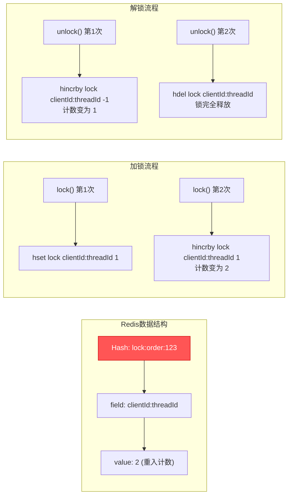

Redisson 加锁 Lua 脚本（简化版）：

```lua
-- 加锁 Lua 脚本
if (redis.call('exists', KEYS[1]) == 0) then
    -- 锁不存在，加锁
    redis.call('hset', KEYS[1], ARGV[2], 1);
    redis.call('pexpire', KEYS[1], ARGV[1]);
    return nil;
end;

if (redis.call('hexists', KEYS[1], ARGV[2]) == 1) then
    -- 锁存在且是当前线程持有，重入计数 +1
    redis.call('hincrby', KEYS[1], ARGV[2], 1);
    redis.call('pexpire', KEYS[1], ARGV[1]);
    return nil;
end;

-- 锁被其他线程持有，返回剩余 TTL
return redis.call('pttl', KEYS[1]);
```

```lua
-- 解锁 Lua 脚本
if (redis.call('hexists', KEYS[1], ARGV[3]) == 0) then
    return nil;  -- 不是锁持有者
end;

local counter = redis.call('hincrby', KEYS[1], ARGV[3], -1);
if (counter > 0) then
    -- 重入计数未归零，续期
    redis.call('pexpire', KEYS[1], ARGV[2]);
    return 0;
else
    -- 重入计数归零，释放锁并发布解锁消息
    redis.call('del', KEYS[1]);
    redis.call('publish', KEYS[2], ARGV[1]);
    return 1;
end;
```

### 公平锁

Redisson 还支持公平锁——按请求顺序获取锁，避免线程饥饿：

```java
RLock fairLock = redisson.getFairLock("order:123");
fairLock.lock();
try {
    processOrder();
} finally {
    fairLock.unlock();
}
```

公平锁的内部实现使用 Redis List 维护等待队列：

```
Key: redisson_lock_queue:{lock}     →  等待队列
Key: redisson_lock_timeout:{lock}   →  超时集合 (Sorted Set)
```

### 读写锁

```java
RReadWriteLock rwLock = redisson.getReadWriteLock("content:456");

// 读锁：允许多个读线程同时持有
RLock readLock = rwLock.readLock();
readLock.lock();
try {
    readContent();
} finally {
    readLock.unlock();
}

// 写锁：独占
RLock writeLock = rwLock.writeLock();
writeLock.lock();
try {
    updateContent();
} finally {
    writeLock.unlock();
}
```

### 联锁（MultiLock）

同时加锁多个 Key，全部成功才算成功：

```java
RLock lock1 = redisson.getLock("lock1");
RLock lock2 = redisson.getLock("lock2");
RLock lock3 = redisson.getLock("lock3");

RLock multiLock = redisson.getMultiLock(lock1, lock2, lock3);
multiLock.lock();
try {
    // 三个锁同时持有
    process();
} finally {
    multiLock.unlock();
}
```

### 红锁（RedLock）

详见下一节。

## Redlock 算法争议与理解

### Redlock 算法原理

Redlock 由 Redis 作者 antirez 提出，用于在多 Redis 实例场景下实现更安全的分布式锁。核心思想：在 N 个独立的 Redis 实例上获取锁，超过半数成功才算获取成功。

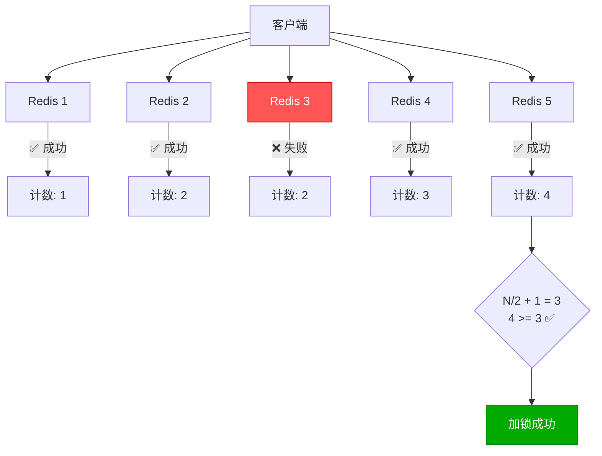

### Redlock 算法步骤

1. 获取当前时间 `T1`
2. 依次向 N 个 Redis 实例请求加锁（使用相同的 Key 和随机值）
3. 计算加锁耗时：`T_cost = T2 - T1`
4. 如果成功加锁的实例数 >= N/2 + 1，且 `T_cost < 锁过期时间`，加锁成功
5. 否则，向所有实例释放锁

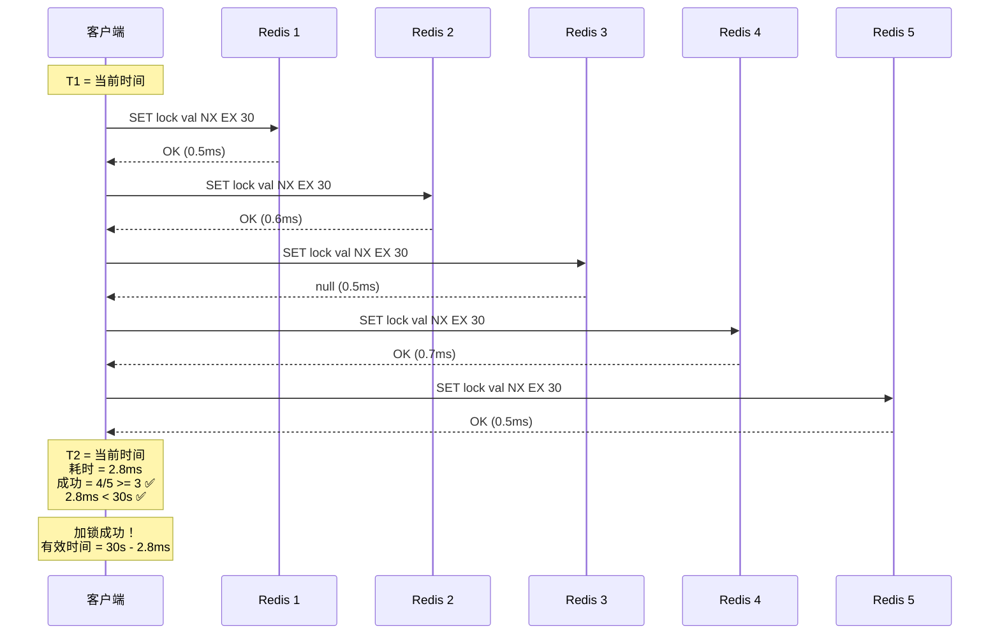

### Redisson RedLock 实现

```java
RedissonClient client1 = Redisson.create(config1);
RedissonClient client2 = Redisson.create(config2);
RedissonClient client3 = Redisson.create(config3);

RLock lock1 = client1.getLock("lock");
RLock lock2 = client2.getLock("lock");
RLock lock3 = client3.getLock("lock");

RedissonRedLock redLock = new RedissonRedLock(lock1, lock2, lock3);

try {
    boolean acquired = redLock.tryLock(5, 30, TimeUnit.SECONDS);
    if (acquired) {
        processBusiness();
    }
} finally {
    redLock.unlock();
}
```

### Martin Kleppmann 的争议

分布式系统专家 Martin Kleppmann 在 2016 年发文质疑 Redlock，主要论点：

1. **时钟跳变**：Redis 依赖系统时钟计算过期，如果发生 GC 暂停或时钟跳变，锁可能提前过期
2. **网络分区**：进程暂停（GC STW）期间锁过期，恢复后可能误以为仍持有锁
3. **Fencing Token**：建议使用单调递增的令牌来保护资源，而非仅依赖锁

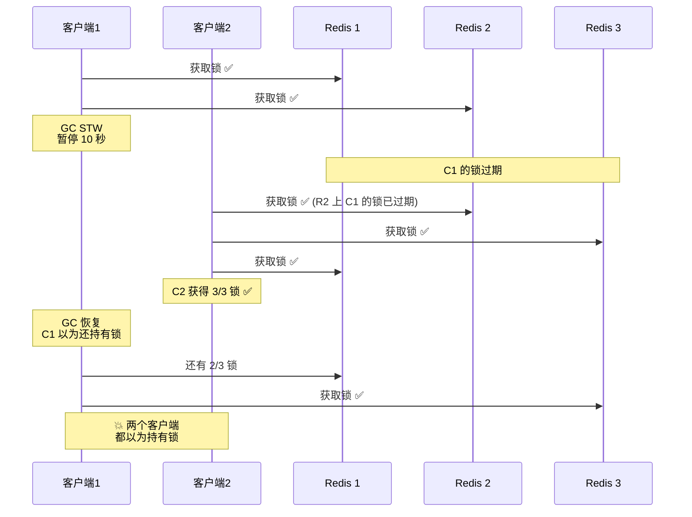

### antirez 的回应

Redis 作者 antirez 随后发文回应：

1. **时钟问题**：Redlock 要求 N 个实例同时发生时钟跳变的概率极低
2. **GC 暂停**：可以配置足够长的锁超时时间来覆盖 GC 暂停
3. **Fencing Token**：可以与 Redlock 结合使用，二者不矛盾

### Fencing Token 方案

Martin 建议使用单调递增的 Fencing Token 来保护共享资源：

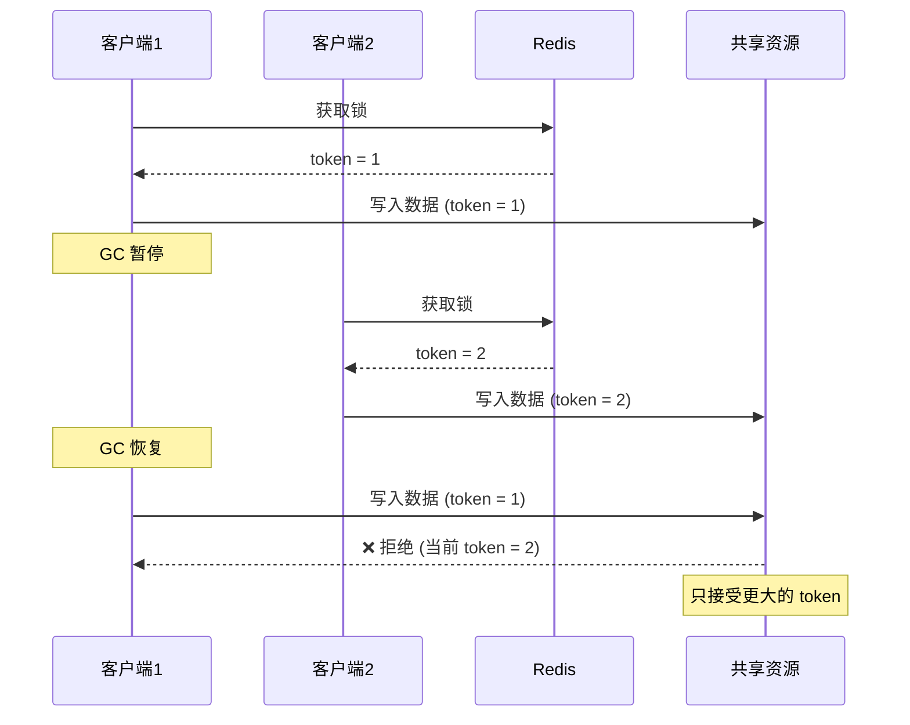

```java
// Fencing Token 实现
public class FencingTokenLock {

    private final StringRedisTemplate redisTemplate;

    public long acquireLock(String lockKey) {
        // 获取锁的同时递增 token
        long token = redisTemplate.opsForValue().increment("token:" + lockKey);
        boolean locked = Boolean.TRUE.equals(
            redisTemplate.opsForValue().setIfAbsent(
                lockKey, String.valueOf(token), 30, TimeUnit.SECONDS));

        if (!locked) {
            throw new LockAcquireException("Failed to acquire lock");
        }
        return token;
    }

    public void writeWithToken(String resourceKey, String data, long token) {
        // 资源端校验 token
        var currentToken = redisTemplate.opsForValue().get("token:" + resourceKey);
        if (currentToken != null && Long.parseLong(currentToken) > token) {
            throw new TokenExpiredException("Token expired, newer lock exists");
        }

        // 执行写操作
        redisTemplate.opsForValue().set(resourceKey, data);
    }
}
```

### 实践建议

::: important 如何选择？
- **单实例 Redis + Redisson 锁**：绝大多数场景足够，实现简单
- **Redlock**：对安全性要求极高的场景（如金融），但需要 5 个独立 Redis 实例
- **Fencing Token**：无论使用哪种锁，都建议加上 Fencing Token 作为额外保障
- **Zookeeper/etcd**：如果需要强一致性锁，考虑使用 Zookeeper 或 etcd
:::

## 分布式锁最佳实践

### 锁超时设置

```java
// ❌ 错误：锁超时太短，业务未执行完锁已过期
lock.tryLock(0, 5, TimeUnit.SECONDS);  // 5秒过期

// ❌ 错误：锁超时太长，进程崩溃后长时间阻塞
lock.tryLock(0, 3600, TimeUnit.SECONDS);  // 1小时过期

// ✅ 正确：根据业务 P99 耗时设置，加上安全余量
// 假设业务 P99 = 3s，设置 30s（10倍余量）
lock.tryLock(5, 30, TimeUnit.SECONDS);
```

### 防误删

```java
// ✅ 释放锁时校验持有者
public boolean safeUnlock(String lockKey, String requestId) {
    String script =
        "if redis.call('get', KEYS[1]) == ARGV[1] then " +
        "  return redis.call('del', KEYS[1]) " +
        "else " +
        "  return 0 " +
        "end";

    Long result = redisTemplate.execute(
        new DefaultRedisScript<>(script, Long.class),
        Collections.singletonList(lockKey), requestId);

    return Long.valueOf(1).equals(result);
}
```

### 可重入

```java
// Redisson 天然支持可重入
RLock lock = redisson.getLock("order:123");

lock.lock();
try {
    doSomething();
    lock.lock();  // 可重入
    try {
        doMore();
    } finally {
        lock.unlock();
    }
} finally {
    lock.unlock();
}
```

### 锁粒度

```java
// ❌ 锁粒度太粗：锁住整个订单处理
lock.lock("order:process");
processOrder(anyOrderId);

// ✅ 锁粒度适中：只锁住具体订单
lock.lock("order:" + orderId);
processOrder(orderId);

// ❌ 锁粒度太细：每行库存一个锁，容易死锁
lock.lock("stock:" + skuId + ":row:" + rowId);

// ✅ 锁粒度适中：按 SKU 加锁
lock.lock("stock:" + skuId);
```

### 超时重试

```java
// 带重试的加锁
public boolean tryLockWithRetry(RLock lock, int maxRetries, long waitTime,
                                  long leaseTime, TimeUnit unit)
        throws InterruptedException {
    for (int i = 0; i < maxRetries; i++) {
        boolean acquired = lock.tryLock(waitTime, leaseTime, unit);
        if (acquired) return true;

        // 指数退避
        long delay = (long) Math.min(100 * Math.pow(2, i), 5000);
        Thread.sleep(delay);
    }
    return false;
}
```

### 完整的分布式锁模板

```java
@Service
public class OrderService {

    @Autowired
    private RedissonClient redisson;

    public OrderResult processOrder(Long orderId) {
        RLock lock = redisson.getLock("order:" + orderId);

        try {
            // 尝试加锁：等待 5 秒，锁 30 秒自动释放
            boolean acquired = lock.tryLock(5, 30, TimeUnit.SECONDS);
            if (!acquired) {
                return OrderResult.fail("系统繁忙，请稍后重试");
            }

            // Double-Check：防止重复处理
            Order existing = orderRepository.findById(orderId);
            if (existing.getStatus() == PROCESSED) {
                return OrderResult.success(existing);
            }

            // 执行业务逻辑
            Order order = doProcess(orderId);
            return OrderResult.success(order);

        } catch (InterruptedException e) {
            Thread.currentThread().interrupt();
            return OrderResult.fail("操作被中断");
        } finally {
            if (lock.isHeldByCurrentThread()) {
                lock.unlock();
            }
        }
    }
}
```

## 限流算法

### 为什么需要限流？

在分布式系统中，限流是保护下游服务不被流量打垮的关键手段：

- **API 网关**：限制每秒请求数
- **秒杀活动**：限制下单频率
- **第三方 API**：限制调用配额
- **数据库**：限制并发查询数

### 1. 固定窗口计数器

最简单的限流算法，将时间划分为固定窗口，在每个窗口内计数。

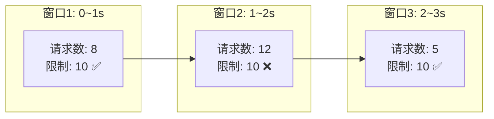

```java
// 固定窗口限流
public class FixedWindowRateLimiter {

    private final StringRedisTemplate redisTemplate;

    public boolean isAllowed(String key, int maxRequests, int windowSeconds) {
        long currentWindow = System.currentTimeMillis() / 1000 / windowSeconds;
        String redisKey = "rate:" + key + ":" + currentWindow;

        Long count = redisTemplate.opsForValue().increment(redisKey);

        if (count != null && count == 1) {
            redisTemplate.expire(redisKey, windowSeconds, TimeUnit.SECONDS);
        }

        return count != null && count <= maxRequests;
    }
}
```

::: warning 边界突发问题
固定窗口在窗口边界处可能出现 2 倍流量。例如 1s 内允许 10 个请求，在 0.9s~1.1s 之间可能通过 20 个请求（两个窗口各 10 个）。
:::

### 2. 滑动窗口计数器

将大窗口划分为多个小窗口，按小窗口统计，解决固定窗口的边界问题。

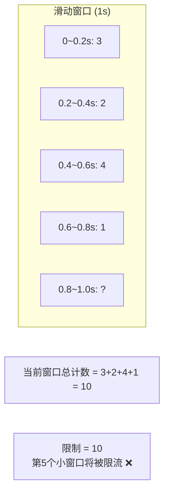

```java
// 滑动窗口限流（基于 Redis Sorted Set）
public class SlidingWindowRateLimiter {

    private final StringRedisTemplate redisTemplate;

    public boolean isAllowed(String key, int maxRequests, int windowSeconds) {
        long now = System.currentTimeMillis();
        long windowStart = now - windowSeconds * 1000L;

        String redisKey = "rate:sliding:" + key;

        // Lua 脚本保证原子性
        String script =
            "redis.call('zremrangebyscore', KEYS[1], 0, ARGV[1]) " +  // 移除过期数据
            "local count = redis.call('zcard', KEYS[1]) " +             // 当前计数
            "if count < tonumber(ARGV[2]) then " +                      // 未超限
            "  redis.call('zadd', KEYS[1], ARGV[3], ARGV[3]) " +       // 加入当前请求
            "  redis.call('expire', KEYS[1], ARGV[4]) " +              // 设置过期
            "  return 1 " +
            "else " +
            "  return 0 " +
            "end";

        Long result = redisTemplate.execute(
            new DefaultRedisScript<>(script, Long.class),
            List.of(redisKey),
            String.valueOf(windowStart),   // ARGV[1]: 窗口起始时间
            String.valueOf(maxRequests),   // ARGV[2]: 最大请求数
            String.valueOf(now),           // ARGV[3]: 当前时间（score 和 member）
            String.valueOf(windowSeconds)  // ARGV[4]: 过期时间
        );

        return Long.valueOf(1).equals(result);
    }
}
```

### 3. 漏桶算法

请求先进入漏桶（队列），漏桶以固定速率流出。超出桶容量的请求被拒绝。

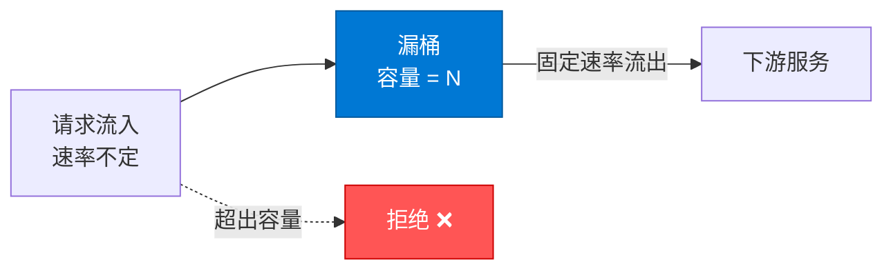

```java
// 漏桶限流（Redis + Lua）
public class LeakyBucketRateLimiter {

    private final StringRedisTemplate redisTemplate;

    /**
     * @param key 限流标识
     * @param capacity 桶容量
     * @param leakRate 每秒漏出速率（个/秒）
     */
    public boolean isAllowed(String key, int capacity, double leakRate) {
        String script =
            "local bucket = redis.call('hmget', KEYS[1], 'water', 'lastTime') " +
            "local water = tonumber(bucket[1]) or 0 " +
            "local lastTime = tonumber(bucket[2]) or 0 " +
            "local now = tonumber(ARGV[1]) " +
            "local capacity = tonumber(ARGV[2]) " +
            "local leakRate = tonumber(ARGV[3]) " +
            // 计算漏出的水量
            "local leaked = (now - lastTime) / 1000 * leakRate " +
            "water = math.max(0, water - leaked) " +
            // 判断是否允许
            "if water + 1 <= capacity then " +
            "  water = water + 1 " +
            "  redis.call('hmset', KEYS[1], 'water', water, 'lastTime', now) " +
            "  redis.call('expire', KEYS[1], capacity / leakRate + 10) " +
            "  return 1 " +
            "else " +
            "  redis.call('hmset', KEYS[1], 'water', water, 'lastTime', now) " +
            "  return 0 " +
            "end";

        Long result = redisTemplate.execute(
            new DefaultRedisScript<>(script, Long.class),
            List.of("leaky:" + key),
            String.valueOf(System.currentTimeMillis()),
            String.valueOf(capacity),
            String.valueOf(leakRate)
        );

        return Long.valueOf(1).equals(result);
    }
}
```

### 4. 令牌桶算法

系统以固定速率向桶中放入令牌，请求需要消耗令牌，桶满时丢弃新令牌。

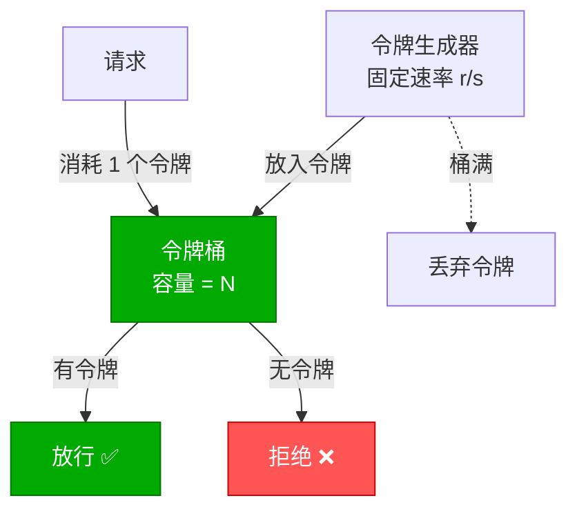

```java
// 令牌桶限流（Redis + Lua）
public class TokenBucketRateLimiter {

    private final StringRedisTemplate redisTemplate;

    /**
     * @param key 限流标识
     * @param capacity 桶容量（最大令牌数）
     * @param rate 每秒生成令牌数
     * @param requested 请求消耗的令牌数
     */
    public boolean isAllowed(String key, int capacity, double rate, int requested) {
        String script =
            "local tokens_key = KEYS[1] .. ':tokens' " +
            "local timestamp_key = KEYS[1] .. ':timestamp' " +
            "local rate = tonumber(ARGV[1]) " +
            "local capacity = tonumber(ARGV[2]) " +
            "local requested = tonumber(ARGV[3]) " +
            "local now = tonumber(ARGV[4]) " +
            // 读取当前令牌数和上次更新时间
            "local fill_time = capacity / rate " +
            "local ttl = math.floor(fill_time * 2) " +
            "local last_tokens = tonumber(redis.call('get', tokens_key)) " +
            "if last_tokens == nil then last_tokens = capacity end " +
            "local last_refreshed = tonumber(redis.call('get', timestamp_key)) " +
            "if last_refreshed == nil then last_refreshed = now end " +
            // 计算新令牌数
            "local delta = math.max(0, now - last_refreshed) " +
            "local filled_tokens = math.min(capacity, last_tokens + (delta * rate)) " +
            // 判断是否允许
            "local allowed = filled_tokens >= requested " +
            "local new_tokens = filled_tokens " +
            "if allowed then new_tokens = filled_tokens - requested end " +
            // 更新状态
            "redis.call('setex', tokens_key, ttl, new_tokens) " +
            "redis.call('setex', timestamp_key, ttl, now) " +
            "return { allowed and 1 or 0, new_tokens } ";

        var result = redisTemplate.execute(
            new DefaultRedisScript<>(script, List.class),
            List.of("token_bucket:" + key),
            String.valueOf(rate),
            String.valueOf(capacity),
            String.valueOf(requested),
            String.valueOf(System.currentTimeMillis() / 1000.0)
        );

        return result != null && Long.valueOf(1).equals(result.get(0));
    }
}
```

### 算法对比

| 算法 | 平滑性 | 突发流量 | 实现复杂度 | 适用场景 |
|------|--------|---------|-----------|---------|
| 固定窗口 | 差 | 不支持 | 低 | 简单限流 |
| 滑动窗口 | 好 | 不支持 | 中 | 精确限流 |
| 漏桶 | 最好 | 不支持 | 中 | 流量整形 |
| 令牌桶 | 好 | 支持（令牌积累） | 高 | API 限流 |

::: tip 漏桶 vs 令牌桶
- **漏桶**：流出速率恒定，适合**流量整形**（如消息队列消费速率控制）
- **令牌桶**：允许突发流量（积累的令牌可一次性消耗），适合**API 限流**
- 大多数场景推荐**令牌桶**，因为它既限制平均速率，又允许合理的突发
:::

## Redis + Lua 限流实现

### 为什么需要 Lua？

限流涉及多个 Redis 操作（读计数、判断、写计数），必须保证原子性。Lua 脚本在 Redis 中原子执行，不会被其他命令打断。

### 滑动窗口限流（生产级）

```lua
-- sliding_window_limiter.lua
-- KEYS[1]: 限流 Key
-- ARGV[1]: 窗口大小（毫秒）
-- ARGV[2]: 最大请求数
-- ARGV[3]: 当前时间戳（毫秒）
-- ARGV[4]: 唯一请求ID

-- 1. 移除窗口外的数据
redis.call('zremrangebyscore', KEYS[1], 0, ARGV[3] - ARGV[1])

-- 2. 统计当前窗口内的请求数
local count = redis.call('zcard', KEYS[1])

-- 3. 判断是否超限
if tonumber(count) >= tonumber(ARGV[2]) then
    return 0  -- 拒绝
end

-- 4. 未超限，记录当前请求
redis.call('zadd', KEYS[1], ARGV[3], ARGV[4])

-- 5. 设置 Key 过期时间（窗口大小 + 1秒缓冲）
redis.call('pexpire', KEYS[1], tonumber(ARGV[1]) + 1000)

return 1  -- 放行
```

```java
// Java 调用
@Service
public class RateLimitService {

    private final StringRedisTemplate redisTemplate;
    private final DefaultRedisScript<Long> slidingWindowScript;

    public RateLimitService(StringRedisTemplate redisTemplate) {
        this.redisTemplate = redisTemplate;
        this.slidingWindowScript = new DefaultRedisScript<>();
        this.slidingWindowScript.setLocation(
            new ClassPathResource("lua/sliding_window_limiter.lua"));
        this.slidingWindowScript.setResultType(Long.class);
    }

    public boolean isAllowed(String key, int maxRequests, Duration window) {
        String requestId = UUID.randomUUID().toString();
        long now = System.currentTimeMillis();

        Long result = redisTemplate.execute(
            slidingWindowScript,
            List.of("rate:" + key),
            String.valueOf(window.toMillis()),
            String.valueOf(maxRequests),
            String.valueOf(now),
            requestId
        );

        return Long.valueOf(1).equals(result);
    }
}
```

```csharp
// .NET 调用
public class RateLimitService
{
    private readonly IConnectionMultiplexer _redis;

    public async Task<bool> IsAllowedAsync(string key, int maxRequests,
        TimeSpan window)
    {
        var db = _redis.GetDatabase();
        var now = DateTimeOffset.UtcNow.ToUnixTimeMilliseconds();
        var requestId = Guid.NewGuid().ToString();

        var script = @"
            redis.call('zremrangebyscore', KEYS[1], 0, ARGV[3] - ARGV[1])
            local count = redis.call('zcard', KEYS[1])
            if tonumber(count) >= tonumber(ARGV[2]) then
                return 0
            end
            redis.call('zadd', KEYS[1], ARGV[3], ARGV[4])
            redis.call('pexpire', KEYS[1], tonumber(ARGV[1]) + 1000)
            return 1";

        var result = (long)await db.ScriptEvaluateAsync(script,
            new RedisKey[] { $"rate:{key}" },
            new RedisValue[]
            {
                window.TotalMilliseconds,
                maxRequests,
                now,
                requestId
            });

        return result == 1;
    }
}
```

### 令牌桶限流（生产级）

```lua
-- token_bucket_limiter.lua
-- KEYS[1]: 令牌桶 Key
-- ARGV[1]: 每秒生成令牌数 (rate)
-- ARGV[2]: 桶容量 (capacity)
-- ARGV[3]: 请求消耗令牌数 (requested)
-- ARGV[4]: 当前时间戳 (秒)

local rate = tonumber(ARGV[1])
local capacity = tonumber(ARGV[2])
local requested = tonumber(ARGV[3])
local now = tonumber(ARGV[4])

-- 读取当前令牌数和上次更新时间
local tokens = tonumber(redis.call('hget', KEYS[1], 'tokens')) or capacity
local last_time = tonumber(redis.call('hget', KEYS[1], 'last_time')) or now

-- 计算新增令牌
local elapsed = math.max(0, now - last_time)
local new_tokens = math.min(capacity, tokens + elapsed * rate)

-- 判断是否允许
if new_tokens >= requested then
    new_tokens = new_tokens - requested
    redis.call('hmset', KEYS[1], 'tokens', new_tokens, 'last_time', now)
    redis.call('expire', KEYS[1], math.ceil(capacity / rate) * 2)
    return 1
else
    redis.call('hmset', KEYS[1], 'tokens', new_tokens, 'last_time', now)
    redis.call('expire', KEYS[1], math.ceil(capacity / rate) * 2)
    return 0
end
```

### 分布式限流方案

单节点 Redis 限流存在单点问题。分布式限流需要多节点协同：

**方案一：Redis Cluster + 一致性哈希**

将限流 Key 路由到固定分片，利用 Redis Cluster 的分片机制。

**方案二：中心化令牌分发**

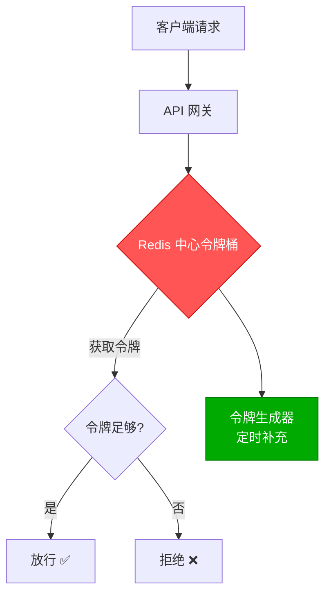

**方案三：滑动日志 + 分片**

```java
// 分片限流：将 Key 分散到多个 Redis 节点
public class ShardedRateLimiter {

    private final List<StringRedisTemplate> redisTemplates;
    private final int shardCount;

    public boolean isAllowed(String key, int maxRequests, Duration window) {
        int shard = Math.abs(key.hashCode()) % shardCount;
        var template = redisTemplates.get(shard);
        // 每个分片承担 1/shardCount 的配额
        int shardMax = (int) Math.ceil((double) maxRequests / shardCount);
        return doRateLimit(template, key, shardMax, window);
    }
}
```

## .NET 分布式锁库（RedLock.net）

### 安装与配置

```bash
dotnet add package RedLock.net
dotnet add package RedLock.net.SERIALIZATION.NewtonsoftJson
```

```csharp
// Program.cs
builder.Services.AddScoped<IDistributedLockFactory, RedLockFactory>();

// 或者直接创建
var redLockFactory = RedLockFactory.Create(new List<RedLockEndPoint>
{
    new DnsEndPoint("redis1", 6379),
    new DnsEndPoint("redis2", 6379),
    new DnsEndPoint("redis3", 6379),
    new DnsEndPoint("redis4", 6379),
    new DnsEndPoint("redis5", 6379)
});
```

### 基础用法

```csharp
public class OrderService
{
    private readonly IDistributedLockFactory _lockFactory;

    public async Task<OrderResult> ProcessOrderAsync(long orderId)
    {
        var resource = $"order:{orderId}";
        var expiry = TimeSpan.FromSeconds(30);
        var wait = TimeSpan.FromSeconds(5);
        var retry = TimeSpan.FromMilliseconds(200);

        // 尝试获取锁
        await using (var redLock = await _lockFactory.CreateLockAsync(
            resource, expiry, wait, retry))
        {
            if (redLock.IsAcquired)
            {
                // 获取锁成功
                try
                {
                    return await DoProcessOrderAsync(orderId);
                }
                finally
                {
                    // 锁会在 Dispose 时自动释放
                }
            }
            else
            {
                return OrderResult.Fail("系统繁忙，请稍后重试");
            }
        }
    }
}
```

### RedLock 多实例配置

```csharp
// 配置多个独立的 Redis 实例（非 Cluster）
var endpoints = new List<RedLockEndPoint>
{
    new DnsEndPoint("redis-lock-1", 6379) { Password = "pwd1" },
    new DnsEndPoint("redis-lock-2", 6379) { Password = "pwd2" },
    new DnsEndPoint("redis-lock-3", 6379) { Password = "pwd3" }
};

var factory = RedLockFactory.Create(endpoints);

// 使用锁
await using var redLock = await factory.CreateLockAsync(
    "my-resource",          // 资源名
    TimeSpan.FromSeconds(30), // 锁过期时间
    TimeSpan.FromSeconds(10), // 等待时间
    TimeSpan.FromMilliseconds(500) // 重试间隔
);

if (redLock.IsAcquired)
{
    // 成功获取锁
    Console.WriteLine("Lock acquired!");
    Console.WriteLine($"Acquired on {redLock.AcquiredInstances} instances");
}
```

### 可重入锁扩展

RedLock.net 本身不直接支持可重入，需要自行封装：

```csharp
public class ReentrantDistributedLock
{
    private readonly IDistributedLockFactory _lockFactory;
    private readonly AsyncLocal<int> _reentryCount = new();
    private readonly AsyncLocal<IDistributedLock?> _currentLock = new();

    public async Task<bool> TryLockAsync(string resource, TimeSpan expiry,
        TimeSpan wait, TimeSpan retry)
    {
        if (_reentryCount.Value > 0 && _currentLock.Value?.IsAcquired == true)
        {
            // 可重入：当前上下文已持有锁
            _reentryCount.Value++;
            return true;
        }

        var redLock = await _lockFactory.CreateLockAsync(resource, expiry, wait, retry);
        if (redLock.IsAcquired)
        {
            _currentLock.Value = redLock;
            _reentryCount.Value = 1;
            return true;
        }

        return false;
    }

    public Task UnlockAsync()
    {
        _reentryCount.Value--;

        if (_reentryCount.Value <= 0)
        {
            _currentLock.Value?.Dispose();
            _currentLock.Value = null;
            _reentryCount.Value = 0;
        }

        return Task.CompletedTask;
    }
}
```

### .NET 限流中间件

```csharp
// ASP.NET Core 限流中间件
public class RateLimitMiddleware
{
    private readonly RequestDelegate _next;
    private readonly IConnectionMultiplexer _redis;

    public RateLimitMiddleware(RequestDelegate next, IConnectionMultiplexer redis)
    {
        _next = next;
        _redis = redis;
    }

    public async Task InvokeAsync(HttpContext context)
    {
        var clientId = context.Connection.RemoteIpAddress?.ToString() ?? "anonymous";
        var key = $"rate:{clientId}";

        var db = _redis.GetDatabase();
        var script = @"
            redis.call('zremrangebyscore', KEYS[1], 0, ARGV[3] - ARGV[1])
            local count = redis.call('zcard', KEYS[1])
            if tonumber(count) >= tonumber(ARGV[2]) then
                return 0
            end
            redis.call('zadd', KEYS[1], ARGV[3], ARGV[4])
            redis.call('pexpire', KEYS[1], tonumber(ARGV[1]) + 1000)
            return 1";

        var now = DateTimeOffset.UtcNow.ToUnixTimeMilliseconds();
        var requestId = Guid.NewGuid().ToString();

        var result = (long)await db.ScriptEvaluateAsync(script,
            new RedisKey[] { key },
            new RedisValue[] { "60000", "100", now, requestId });

        if (result == 0)
        {
            context.Response.StatusCode = 429;
            await context.Response.WriteAsJsonAsync(new
            {
                error = "Too many requests",
                retryAfter = 60
            });
            return;
        }

        await _next(context);
    }
}

// 注册中间件
app.UseMiddleware<RateLimitMiddleware>();
```

### ASP.NET Core 内置限流（.NET 7+）

```csharp
// Program.cs
builder.Services.AddRateLimiter(options =>
{
    // 全局限流：每分钟 100 个请求
    options.GlobalLimiter = PartitionedRateLimiter.Create<HttpContext, string>(context =>
    {
        var clientId = context.Connection.RemoteIpAddress?.ToString() ?? "anonymous";
        return RateLimitPartition.GetSlidingWindowLimiter(
            partitionKey: clientId,
            factory: _ => new SlidingWindowRateLimiterOptions
            {
                PermitLimit = 100,
                Window = TimeSpan.FromMinutes(1),
                SegmentsPerWindow = 6,
                QueueProcessingOrder = QueueProcessingOrder.OldestFirst,
                QueueLimit = 0
            });
    });

    // 特定端点限流
    options.AddPolicy("Strict", context =>
        RateLimitPartition.GetTokenBucketLimiter(
            partitionKey: context.User?.Identity?.Name ?? "anonymous",
            factory: _ => new TokenBucketRateLimiterOptions
            {
                TokenLimit = 10,
                ReplenishmentPeriod = TimeSpan.FromSeconds(1),
                TokensPerPeriod = 2,
                QueueProcessingOrder = QueueProcessingOrder.OldestFirst,
                QueueLimit = 0
            }));

    options.OnRejected = async (context, ct) =>
    {
        context.HttpContext.Response.StatusCode = 429;
        await context.HttpContext.Response.WriteAsJsonAsync(
            new { error = "Too many requests" }, ct);
    };
});

// 在 Controller 上应用
[ApiController]
[RateLimiter(PolicyName = "Strict")]
[Route("api/[controller]")]
public class OrdersController : ControllerBase { }
```

## 小结

| 技术 | 核心原理 | 适用场景 |
|------|---------|---------|
| SETNX + EXPIRE | 原子加锁 + 自动过期 | 简单分布式锁 |
| Redisson | Watchdog续期 + 可重入 + 公平锁 | Java 生产环境首选 |
| Redlock | 多实例过半加锁 | 对安全性要求极高 |
| 固定窗口 | 按时间窗口计数 | 简单限流 |
| 滑动窗口 | Sorted Set + 时间范围 | 精确限流 |
| 漏桶 | 固定速率流出 | 流量整形 |
| 令牌桶 | 固定速率生成令牌 | API 限流（推荐） |

::: important 核心原则
1. **释放锁必须校验持有者**：用 Lua 脚本保证原子性
2. **锁必须设置超时**：防止死锁，超时时间 > 业务 P99 * 安全系数
3. **Watchdog 解决续期**：业务未完成时自动续期，完成时停止
4. **限流首选令牌桶**：支持突发流量，平滑限流
5. **Lua 保证原子性**：限流操作涉及多步 Redis 命令，必须用 Lua
:::

## 参考资料

- [Redis SET 命令文档](https://redis.io/commands/set/)
- [Redisson 分布式锁源码](https://github.com/redisson/redisson/wiki/8.-Distributed-locks-and-synchronizers)
- [Redlock 算法 - antirez](https://redis.io/docs/manual/patterns/distributed-locks/)
- [How to do distributed locking - Martin Kleppmann](https://martin.kleppmann.com/2016/02/08/how-to-do-distributed-locking.html)
- [RedLock.net](https://github.com/samcook/RedLock.net)
- [ASP.NET Core Rate Limiting](https://learn.microsoft.com/zh-cn/aspnet/core/performance/rate-limit)
