# 数据一致性保障

## 缓存与数据库的一致性困境

引入缓存后，数据存在于两个地方：缓存（Redis）和数据库（MySQL）。任何写操作都需要同步更新两份数据，但这两次更新无法在同一个事务中原子完成，因此必然存在不一致窗口。

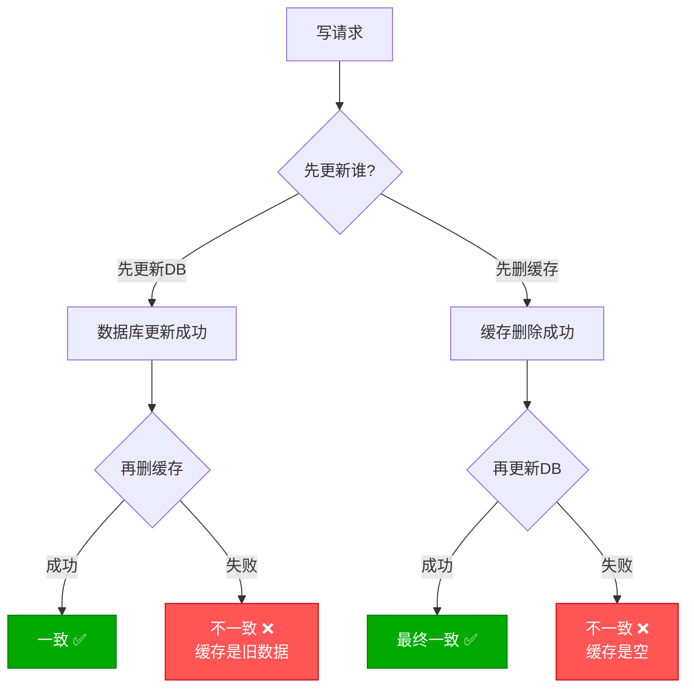

一致性的三个层次：

| 层次 | 含义 | 实现代价 |
|------|------|---------|
| 强一致性 | 任何时刻读取都是最新值 | 极高（几乎退化为无缓存） |
| 最终一致性 | 短暂不一致，但最终会一致 | 中等（大多数场景的选择） |
| 弱一致性 | 不保证最终一致 | 低（不推荐） |

## 先删缓存 vs 先更新DB

### 方案一：先删缓存，再更新DB

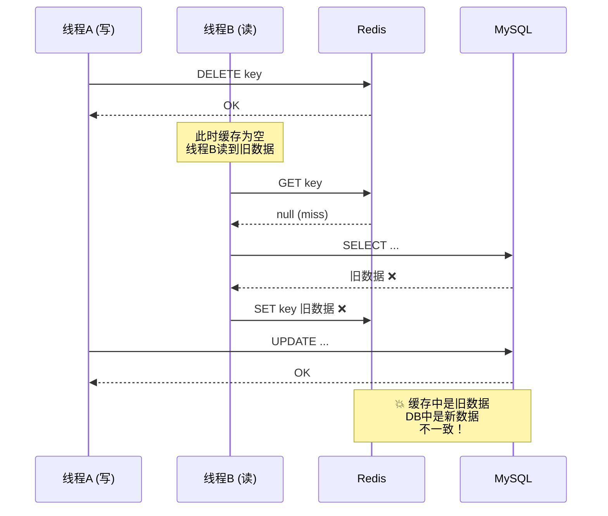

**问题**：在删除缓存和更新数据库之间，如果有读请求将旧数据写入缓存，就会导致不一致。

### 方案二：先更新DB，再删缓存（Cache Aside）

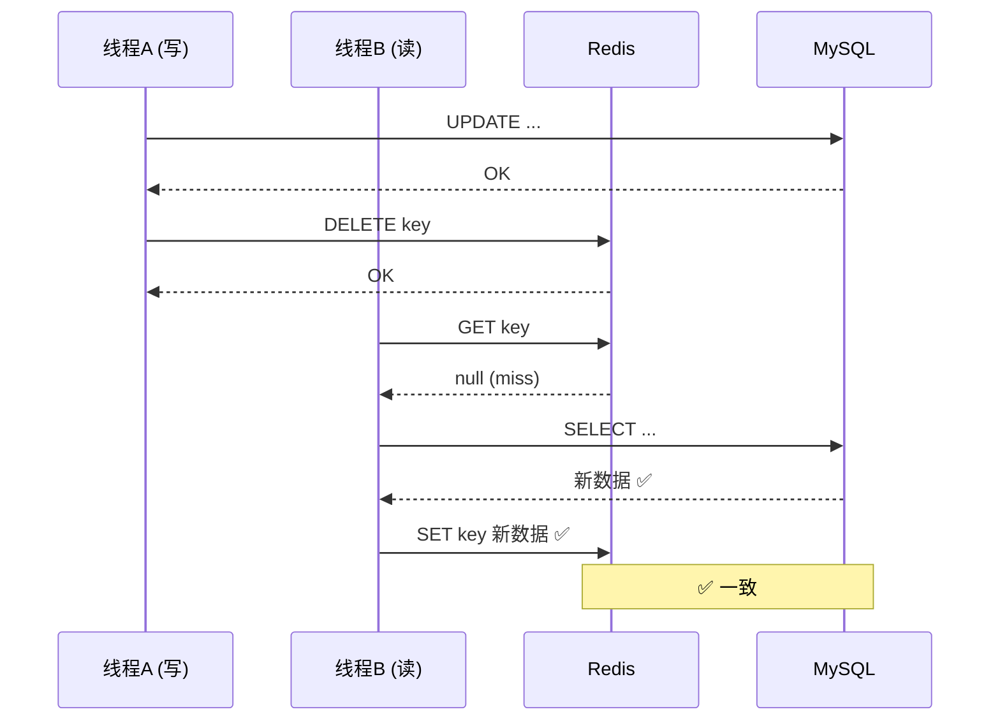

::: tip 为什么先更新DB更优？
"先更新DB，再删缓存"的不一致概率远低于"先删缓存，再更新DB"：

- **先删缓存**：不一致窗口 = 整个DB更新耗时（几毫秒到几十毫秒），读请求很容易插入
- **先更新DB**：不一致窗口 = 删缓存失败的时间，只有删缓存失败才会不一致

绝大多数场景推荐**先更新DB，再删缓存**。
:::

### 方案二的极端场景

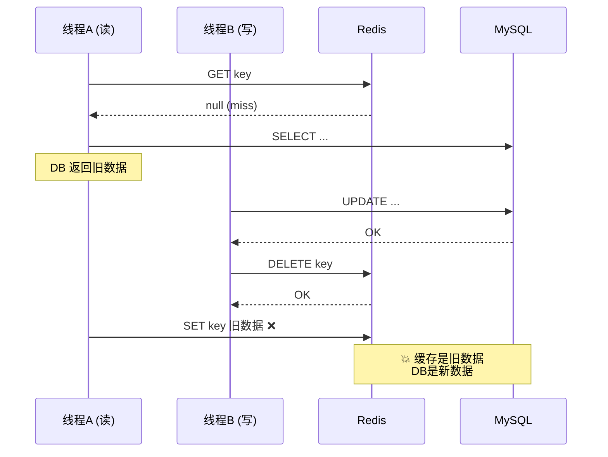

::: info 这个场景的概率极低
这个不一致需要满足以下条件：
1. 缓存刚好失效
2. 线程 A 读 DB 获取旧值（耗时几毫秒）
3. 线程 B 在这几毫秒内完成「更新 DB + 删除缓存」

步骤 3 的耗时远小于步骤 2，所以线程 B 通常会在线程 A 写缓存之前就删掉了缓存。实际发生概率极低。
:::

## 延时双删策略

### 基本思路

为了覆盖"先更新DB，再删缓存"的极端场景，在删缓存后延时一段时间再删一次。

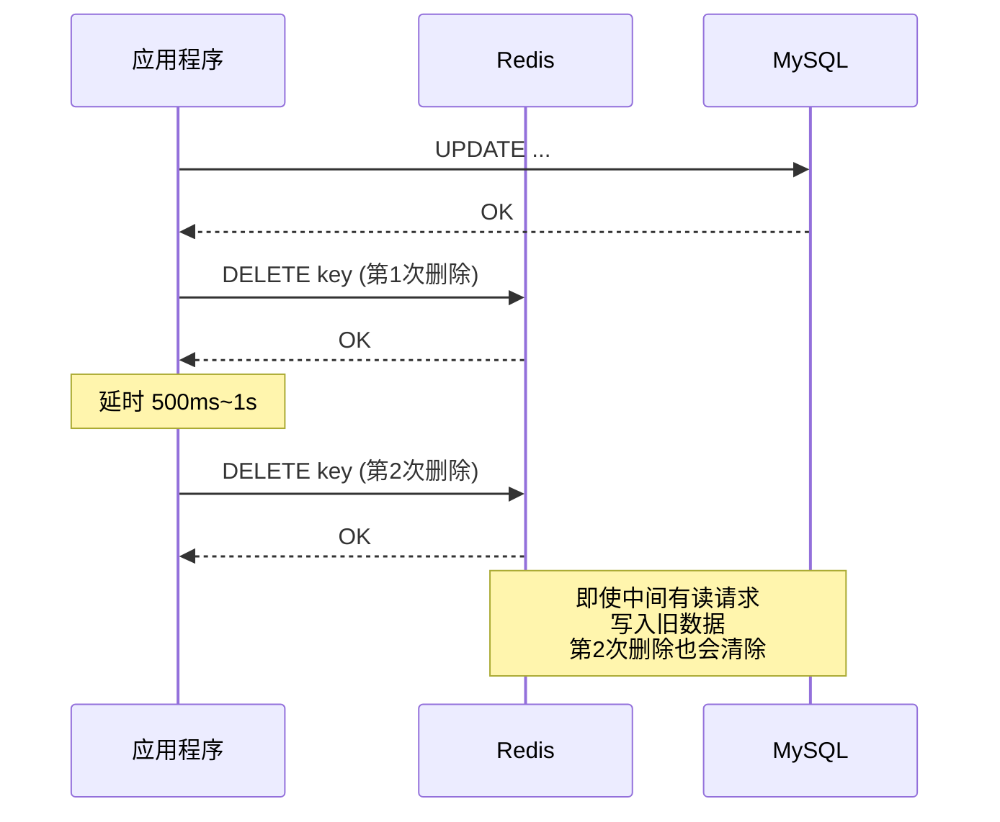

### Java 实现

```java
@Service
public class DoubleDeleteCacheService {

    @Autowired
    private StringRedisTemplate redisTemplate;

    @Autowired
    private ProductRepository productRepository;

    @Autowired
    private ThreadPoolTaskScheduler scheduler;

    /**
     * 更新商品：先更新DB，再延时双删
     */
    public void updateProduct(Product product) {
        String cacheKey = "product:" + product.getId();

        // 1. 更新数据库
        productRepository.save(product);

        // 2. 第一次删除缓存
        redisTemplate.delete(cacheKey);

        // 3. 延时第二次删除
        scheduler.schedule(
            () -> redisTemplate.delete(cacheKey),
            Instant.now().plusMillis(500)  // 延时 500ms
        );
    }
}
```

### .NET 实现

```csharp
public class DoubleDeleteCacheService
{
    private readonly IDistributedCache _cache;
    private readonly IProductRepository _repo;
    private readonly ILogger<DoubleDeleteCacheService> _logger;

    public async Task UpdateProductAsync(Product product)
    {
        var cacheKey = $"product:{product.Id}";

        // 1. 更新数据库
        await _repo.UpdateAsync(product);

        // 2. 第一次删除缓存
        await _cache.RemoveAsync(cacheKey);

        // 3. 延时第二次删除
        _ = Task.Run(async () =>
        {
            await Task.Delay(500);  // 延时 500ms
            await _cache.RemoveAsync(cacheKey);
            _logger.LogDebug("Second cache deletion: {Key}", cacheKey);
        });
    }
}
```

### 延时时间如何确定？

延时时间应大于"一次读请求从数据库加载数据并写入缓存的耗时"：

```
延时时间 = 读业务逻辑耗时 + 几十毫秒缓冲
```

| 业务类型 | 典型读耗时 | 建议延时 |
|---------|-----------|---------|
| 简单查询 | 5~10ms | 200~500ms |
| 关联查询 | 50~100ms | 500ms~1s |
| 复杂聚合 | 200~500ms | 1~2s |

::: warning 延时双删的缺陷
1. **延时时间不好确定**：太短覆盖不到，太长不一致窗口增大
2. **第二次删除可能失败**：应用重启后延时任务丢失
3. **不优雅**：延时删除本质是"补丁方案"

生产环境推荐使用更可靠的方案：**Canal 监听 Binlog** 或 **消息队列异步刷新**。
:::

## Canal 监听 Binlog 同步

### Canal 原理

Canal 是阿里开源的 MySQL Binlog 增量订阅&消费组件。它伪装成 MySQL 从节点，实时解析 Binlog 中的数据变更事件，然后触发缓存失效。

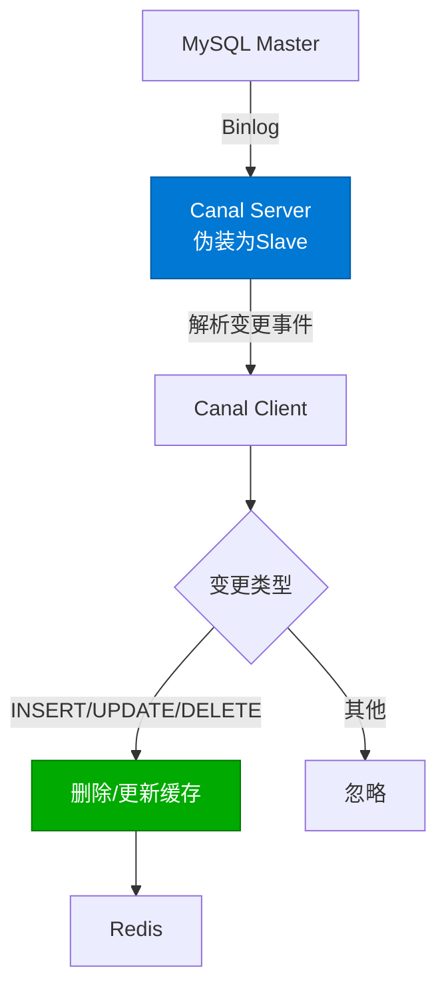

### Canal 架构

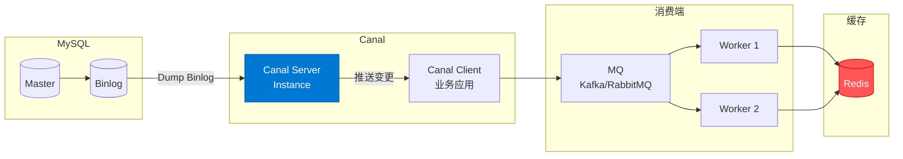

### MySQL 配置

```ini
# my.cnf — 开启 Binlog
[mysqld]
log-bin=mysql-bin
binlog-format=ROW       # 必须为 ROW 模式
server-id=1
binlog-row-image=FULL   # 记录完整行数据
```

```sql
-- 创建 Canal 用户
CREATE USER 'canal'@'%' IDENTIFIED BY 'canal_password';
GRANT SELECT, REPLICATION SLAVE, REPLICATION CLIENT ON *.* TO 'canal'@'%';
FLUSH PRIVILEGES;
```

### Canal Server 配置

```yaml
# canal.properties
canal.serverMode = kafka              # 投递到 Kafka
canal.mq.servers = kafka:9092
canal.mq.topic = canal-topic

# instance.properties
canal.instance.master.address = mysql:3306
canal.instance.dbUsername = canal
canal.instance.dbPassword = canal_password
canal.instance.filter.regex = mydb\\..*  # 监听 mydb 库的所有表
```

### Java 消费端实现

**方案一：直接消费 Canal 协议**

```xml
<dependency>
    <groupId>com.alibaba.otter</groupId>
    <artifactId>canal.client</artifactId>
    <version>1.1.7</version>
</dependency>
```

```java
@Component
public class CanalCacheInvalidator implements InitializingBean, DisposableBean {

    private CanalConnector connector;

    @Autowired
    private StringRedisTemplate redisTemplate;

    @Override
    public void afterPropertiesSet() {
        // 连接 Canal Server
        connector = CanalConnectors.newSingleConnector(
            new InetSocketAddress("canal-server", 11111),
            "example", "canal", "canal_password");

        new Thread(this::process).start();
    }

    private void process() {
        connector.connect();
        connector.subscribe("mydb\\..*");

        while (true) {
            Message message = connector.getWithoutAck(100);
            long batchId = message.getId();

            try {
                for (var entry : message.getEntries()) {
                    if (entry.getEntryType() != EntryType.ROWDATA) continue;

                    var rowChange = CanalRowChange.parseFrom(entry.getStoreValue());
                    var tableName = entry.getHeader().getTableName();

                    for (var rowData : rowChange.getRowDatasList()) {
                        handleRowChange(tableName, rowChange.getEventType(), rowData);
                    }
                }
                connector.ack(batchId);
            } catch (Exception e) {
                connector.rollback(batchId);
            }
        }
    }

    private void handleRowChange(String tableName, EventType eventType,
                                   CanalRowData rowData) {
        switch (eventType) {
            case INSERT, UPDATE -> {
                var id = getColumnValue(rowData.getAfterColumnsList(), "id");
                var cacheKey = buildCacheKey(tableName, id);
                redisTemplate.delete(cacheKey);
                log.info("Canal: invalidated cache key={}", cacheKey);
            }
            case DELETE -> {
                var id = getColumnValue(rowData.getBeforeColumnsList(), "id");
                var cacheKey = buildCacheKey(tableName, id);
                redisTemplate.delete(cacheKey);
                log.info("Canal: invalidated cache key={}", cacheKey);
            }
            default -> {}
        }
    }

    private String buildCacheKey(String tableName, String id) {
        // 表名映射到缓存 Key 前缀
        var prefix = tableName switch {
            "t_product" -> "product",
            "t_user" -> "user",
            "t_order" -> "order",
            default -> tableName
        };
        return prefix + ":" + id;
    }

    private String getColumnValue(List<CanalColumn> columns, String columnName) {
        return columns.stream()
            .filter(c -> c.getName().equals(columnName))
            .findFirst()
            .map(CanalColumn::getValue)
            .orElse("");
    }

    @Override
    public void destroy() {
        if (connector != null) connector.disconnect();
    }
}
```

**方案二：通过 Kafka 消费（推荐）**

```java
@Component
public class CanalKafkaConsumer {

    @Autowired
    private StringRedisTemplate redisTemplate;

    @Autowired
    private ObjectMapper objectMapper;

    @KafkaListener(topics = "canal-topic", groupId = "cache-invalidator")
    public void consume(ConsumerRecord<String, String> record) {
        try {
            var canalMessage = objectMapper.readValue(
                record.value(), CanalMessage.class);

            for (var data : canalMessage.getData()) {
                var tableName = canalMessage.getTable();
                var id = data.get("id");
                var cacheKey = buildCacheKey(tableName, id);

                switch (canalMessage.getType()) {
                    case "INSERT", "UPDATE", "DELETE" -> {
                        redisTemplate.delete(cacheKey);
                        log.info("Canal-Kafka: invalidated {}", cacheKey);
                    }
                }
            }
        } catch (Exception e) {
            log.error("Failed to process canal message", e);
        }
    }

    private String buildCacheKey(String tableName, String id) {
        return tableName + ":" + id;
    }
}
```

### .NET Canal 消费端实现

```csharp
// 通过 Kafka 消费 Canal 消息
public class CanalKafkaConsumer : BackgroundService
{
    private readonly IConsumer<string, string> _consumer;
    private readonly IConnectionMultiplexer _redis;
    private readonly ILogger<CanalKafkaConsumer> _logger;

    public CanalKafkaConsumer(
        IConsumer<string, string> consumer,
        IConnectionMultiplexer redis,
        ILogger<CanalKafkaConsumer> logger)
    {
        _consumer = consumer;
        _redis = redis;
        _logger = logger;
    }

    protected override async Task ExecuteAsync(CancellationToken ct)
    {
        _consumer.Subscribe("canal-topic");

        while (!ct.IsCancellationRequested)
        {
            var result = _consumer.Consume(ct);
            var message = JsonSerializer.Deserialize<CanalMessage>(result.Message.Value);

            if (message is null) continue;

            var db = _redis.GetDatabase();

            foreach (var row in message.Data)
            {
                if (!row.TryGetValue("id", out var id)) continue;

                var cacheKey = BuildCacheKey(message.Table, id);
                await db.KeyDeleteAsync(cacheKey);

                _logger.LogInformation(
                    "Canal-Kafka: invalidated {Key} (type={Type})",
                    cacheKey, message.Type);
            }

            _consumer.Commit(result);
        }
    }

    private static string BuildCacheKey(string tableName, string id) =>
        tableName switch
        {
            "t_product" => $"product:{id}",
            "t_user" => $"user:{id}",
            "t_order" => $"order:{id}",
            _ => $"{tableName}:{id}"
        };
}

// Canal 消息模型
public record CanalMessage
{
    public string Type { get; init; } = "";
    public string Table { get; init; } = "";
    public string Database { get; init; } = "";
    public List<Dictionary<string, string>> Data { get; init; } = new();
}
```

### Canal 的优势与局限

| 优势 | 局限 |
|------|------|
| 对业务代码零侵入 | 需要额外部署 Canal Server |
| 不会遗漏任何数据变更 | MySQL 必须开启 Binlog（ROW 模式） |
| 解耦缓存失效逻辑 | 存在秒级延迟 |
| 支持分库分表 | 需要处理消费幂等 |

::: important Canal 适用场景
- 大型系统，缓存 Key 种类多、关系复杂
- 不想在业务代码中耦合缓存失效逻辑
- 对实时性要求在秒级可接受
- 需要保证缓存最终一致性的关键业务
:::

## 消息队列异步刷新

### 方案思路

写操作更新数据库后，发送一条消息到 MQ，消费端异步删除缓存。即使删除失败，消息可以重试。

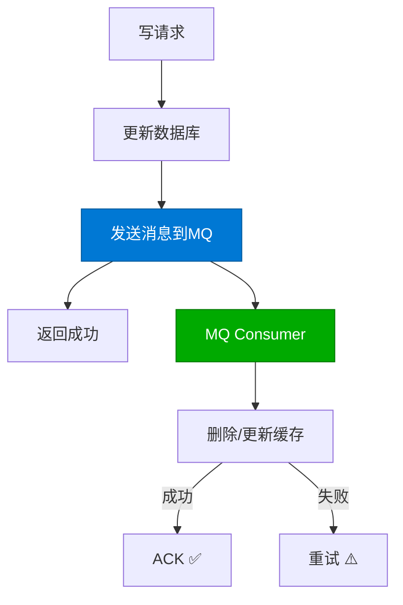

### Java 实现（RabbitMQ）

```java
// 配置
@Configuration
public class CacheInvalidationMQConfig {

    public static final String EXCHANGE = "cache.invalidation";
    public static final String QUEUE = "cache.invalidation.queue";
    public static final String ROUTING_KEY = "cache.invalidate";

    @Bean
    public DirectExchange cacheExchange() {
        return new DirectExchange(EXCHANGE, true, false);
    }

    @Bean
    public Queue cacheQueue() {
        return QueueBuilder.durable(QUEUE)
            .withArgument("x-dead-letter-exchange", "cache.dlx")
            .withArgument("x-dead-letter-routing-key", "cache.failed")
            .build();
    }

    @Bean
    public Binding binding() {
        return BindingBuilder.bind(cacheQueue())
            .to(cacheExchange())
            .with(ROUTING_KEY);
    }
}

// 生产者
@Service
public class ProductService {

    @Autowired
    private ProductRepository productRepository;

    @Autowired
    private RabbitTemplate rabbitTemplate;

    @Autowired
    private StringRedisTemplate redisTemplate;

    public void updateProduct(Product product) {
        // 1. 更新数据库
        productRepository.save(product);

        // 2. 先同步删除一次（降低不一致窗口）
        redisTemplate.delete("product:" + product.getId());

        // 3. 发送异步删除消息（确保删除成功）
        var message = new CacheInvalidationMessage(
            "product", product.getId().toString(), "DELETE"
        );
        rabbitTemplate.convertAndSend(
            CacheInvalidationMQConfig.EXCHANGE,
            CacheInvalidationMQConfig.ROUTING_KEY,
            message
        );
    }
}

// 消费者
@Component
@RabbitListener(queues = "cache.invalidation.queue")
public class CacheInvalidationConsumer {

    @Autowired
    private StringRedisTemplate redisTemplate;

    @Retryable(value = Exception.class,
        maxAttempts = 3,
        backoff = @Backoff(delay = 1000, multiplier = 2))
    @RabbitHandler
    public void handleInvalidation(CacheInvalidationMessage message) {
        var cacheKey = message.getTableName() + ":" + message.getId();
        redisTemplate.delete(cacheKey);
        log.info("MQ: invalidated cache key={}", cacheKey);
    }
}
```

### .NET 实现（Kafka）

```csharp
// 生产者
public class ProductService
{
    private readonly IProductRepository _repo;
    private readonly IDistributedCache _cache;
    private readonly IProducer<string, string> _producer;
    private readonly ILogger<ProductService> _logger;

    public async Task UpdateAsync(Product product)
    {
        // 1. 更新数据库
        await _repo.UpdateAsync(product);

        // 2. 同步删除缓存
        await _cache.RemoveAsync($"product:{product.Id}");

        // 3. 发送异步删除消息
        var message = JsonSerializer.Serialize(new
        {
            TableName = "product",
            Id = product.Id.ToString(),
            Action = "DELETE",
            Timestamp = DateTimeOffset.UtcNow.ToUnixTimeMilliseconds()
        });

        await _producer.ProduceAsync("cache-invalidation",
            new Message<string, string>
            {
                Key = product.Id.ToString(),
                Value = message
            });
    }
}

// 消费者
public class CacheInvalidationConsumer : BackgroundService
{
    private readonly IConsumer<string, string> _consumer;
    private readonly IDistributedCache _cache;
    private readonly ILogger<CacheInvalidationConsumer> _logger;
    private readonly IServiceProvider _serviceProvider;

    protected override async Task ExecuteAsync(CancellationToken ct)
    {
        _consumer.Subscribe("cache-invalidation");

        while (!ct.IsCancellationRequested)
        {
            var result = _consumer.Consume(ct);

            try
            {
                var msg = JsonSerializer.Deserialize<CacheInvalidationMessage>(
                    result.Message.Value);

                if (msg is null) continue;

                var cacheKey = $"{msg.TableName}:{msg.Id}";
                await _cache.RemoveAsync(cacheKey, ct);

                _logger.LogInformation(
                    "MQ: invalidated {Key}", cacheKey);

                _consumer.Commit(result);
            }
            catch (Exception ex)
            {
                _logger.LogError(ex, "Failed to invalidate cache, will retry");
                // 不 Commit，下次重新消费
            }
        }
    }
}
```

### 消费幂等性保证

MQ 消息可能重复投递，消费端必须保证幂等：

```java
// 幂等消费：使用 Redis 记录已处理的消息 ID
@Component
public class IdempotentCacheInvalidator {

    @Autowired
    private StringRedisTemplate redisTemplate;

    public boolean isDuplicate(String messageId) {
        // SETNX + 短过期：防止重复消费
        var key = "mq:consumed:" + messageId;
        return !Boolean.TRUE.equals(
            redisTemplate.opsForValue().setIfAbsent(key, "1", 5, TimeUnit.MINUTES));
    }
}

// 在消费者中使用
@RabbitHandler
public void handleInvalidation(CacheInvalidationMessage message,
                                @Header("messageId") String messageId) {
    if (idempotentCacheInvalidator.isDuplicate(messageId)) {
        log.info("Duplicate message: {}", messageId);
        return;
    }

    var cacheKey = message.getTableName() + ":" + message.getId();
    redisTemplate.delete(cacheKey);
}
```

## 最终一致性保障

### 重试机制

缓存删除失败时，需要有重试机制确保最终一致：

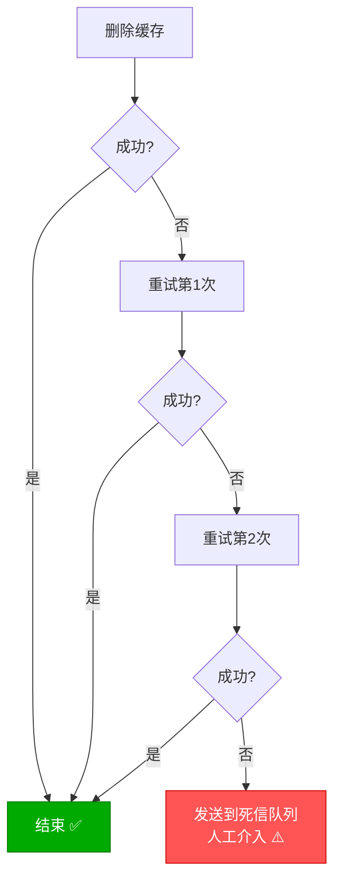

```java
@Service
public class ReliableCacheInvalidator {

    @Autowired
    private StringRedisTemplate redisTemplate;

    @Autowired
    private RabbitTemplate rabbitTemplate;

    private static final int MAX_RETRIES = 3;
    private static final long[] RETRY_DELAYS = {1000, 3000, 5000}; // 毫秒

    /**
     * 可靠删除缓存：重试 + 降级到 MQ
     */
    public void reliableDelete(String cacheKey) {
        for (int i = 0; i < MAX_RETRIES; i++) {
            try {
                Boolean deleted = redisTemplate.delete(cacheKey);
                if (Boolean.TRUE.equals(deleted)) {
                    return; // 删除成功
                }
            } catch (Exception e) {
                log.warn("Cache deletion failed (attempt {}): {}",
                    i + 1, e.getMessage());
            }

            if (i < MAX_RETRIES - 1) {
                try {
                    Thread.sleep(RETRY_DELAYS[i]);
                } catch (InterruptedException e) {
                    Thread.currentThread().interrupt();
                }
            }
        }

        // 重试全部失败，降级到 MQ
        log.warn("All retries failed, sending to MQ: {}", cacheKey);
        sendToDeadLetterQueue(cacheKey);
    }

    private void sendToDeadLetterQueue(String cacheKey) {
        rabbitTemplate.convertAndSend("cache.dlx", "cache.failed",
            new CacheInvalidationMessage(cacheKey, "RETRY"));
    }
}
```

### 补偿任务

定时扫描数据库和缓存，检测不一致并修复：

```csharp
public class ConsistencyCheckService : IHostedService
{
    private readonly IServiceProvider _sp;
    private readonly ILogger<ConsistencyCheckService> _logger;
    private Timer? _timer;

    public Task StartAsync(CancellationToken ct)
    {
        _timer = new Timer(CheckConsistency, null,
            TimeSpan.FromMinutes(5), TimeSpan.FromMinutes(5));
        return Task.CompletedTask;
    }

    private async void CheckConsistency(object? state)
    {
        using var scope = _sp.CreateScope();
        var cache = scope.ServiceProvider
            .GetRequiredService<IDistributedCache>();
        var repo = scope.ServiceProvider
            .GetRequiredService<IProductRepository>();
        var redis = scope.ServiceProvider
            .GetRequiredService<IConnectionMultiplexer>();

        var db = redis.GetDatabase();

        // 抽样检查最近更新的 100 个商品
        var recentProducts = await repo.GetRecentlyUpdatedAsync(100);

        int inconsistencies = 0;
        foreach (var product in recentProducts)
        {
            var cacheKey = $"product:{product.Id}";
            var cached = await cache.GetStringAsync(cacheKey);

            if (cached is null) continue; // 缓存为空不算不一致

            var cachedProduct = JsonSerializer.Deserialize<Product>(cached);
            if (cachedProduct is null) continue;

            // 比较版本号或更新时间
            if (cachedProduct.UpdatedAt < product.UpdatedAt)
            {
                inconsistencies++;
                _logger.LogWarning(
                    "Inconsistency detected: {Key} (cache={CacheTime}, db={DbTime})",
                    cacheKey, cachedProduct.UpdatedAt, product.UpdatedAt);

                // 修复：用 DB 数据覆盖缓存
                await cache.SetStringAsync(cacheKey,
                    JsonSerializer.Serialize(product),
                    new DistributedCacheEntryOptions
                    {
                        AbsoluteExpirationRelativeToNow = TimeSpan.FromMinutes(30)
                    });
            }
        }

        if (inconsistencies > 0)
        {
            _logger.LogWarning(
                "Consistency check: {Count} inconsistencies found and fixed",
                inconsistencies);
        }
    }

    public Task StopAsync(CancellationToken ct)
    {
        _timer?.Dispose();
        return Task.CompletedTask;
    }
}
```

## 强一致性方案（读写锁）

### 场景

某些业务（如金融余额、库存）要求强一致性，不能容忍任何不一致窗口。

### 基于 Redis 读写锁

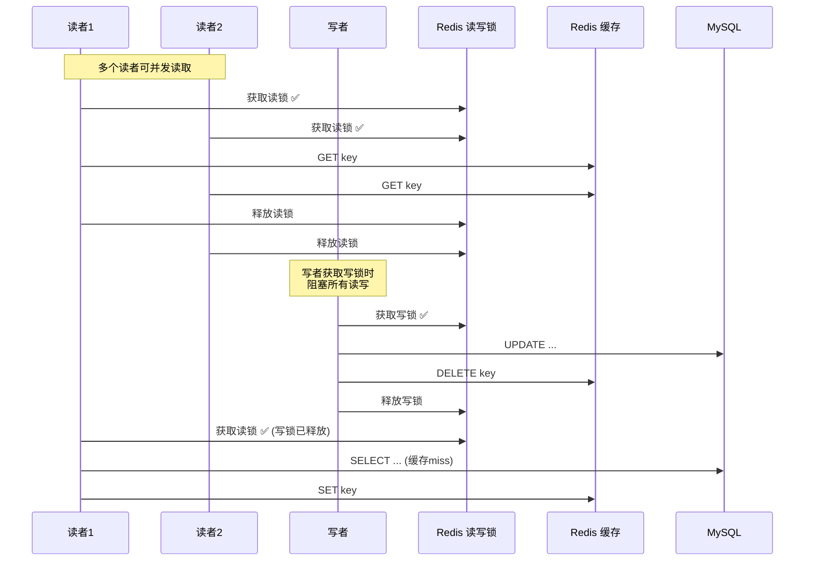

```java
@Service
public class StrongConsistencyService {

    @Autowired
    private RedissonClient redisson;

    @Autowired
    private ProductRepository productRepository;

    @Autowired
    private StringRedisTemplate redisTemplate;

    /**
     * 强一致性读取
     */
    public Product getProduct(Long id) {
        RReadWriteLock rwLock = redisson.getReadWriteLock("rwlock:product:" + id);
        RLock readLock = rwLock.readLock();

        readLock.lock();
        try {
            // 1. 读缓存
            var cached = redisTemplate.opsForValue().get("product:" + id);
            if (cached != null) {
                return deserialize(cached);
            }

            // 2. 缓存miss，查数据库
            var product = productRepository.findById(id).orElse(null);
            if (product != null) {
                redisTemplate.opsForValue().set("product:" + id,
                    serialize(product), 30, TimeUnit.MINUTES);
            }
            return product;
        } finally {
            readLock.unlock();
        }
    }

    /**
     * 强一致性写入
     */
    public void updateProduct(Product product) {
        RReadWriteLock rwLock = redisson.getReadWriteLock("rwlock:product:" + product.getId());
        RLock writeLock = rwLock.writeLock();

        writeLock.lock();
        try {
            // 1. 更新数据库
            productRepository.save(product);

            // 2. 删除缓存
            redisTemplate.delete("product:" + product.getId());
        } finally {
            writeLock.unlock();
        }
    }
}
```

### .NET 读写锁实现

```csharp
public class StrongConsistencyService
{
    private readonly IConnectionMultiplexer _redis;
    private readonly IProductRepository _repo;
    private readonly IDistributedCache _cache;

    public async Task<Product?> GetProductAsync(long id)
    {
        var lockKey = $"rwlock:product:{id}";
        var readLockKey = $"{lockKey}:read";

        // 获取读锁（简化实现：用计数器模拟）
        var db = _redis.GetDatabase();
        var readCount = await db.StringIncrementAsync(readLockKey);
        await db.KeyExpireAsync(readLockKey, TimeSpan.FromSeconds(30));

        try
        {
            var cacheKey = $"product:{id}";
            var cached = await _cache.GetStringAsync(cacheKey);
            if (cached is not null)
                return JsonSerializer.Deserialize<Product>(cached);

            var product = await _repo.GetByIdAsync(id);
            if (product is not null)
            {
                await _cache.SetStringAsync(cacheKey,
                    JsonSerializer.Serialize(product),
                    new DistributedCacheEntryOptions
                    {
                        AbsoluteExpirationRelativeToNow = TimeSpan.FromMinutes(30)
                    });
            }
            return product;
        }
        finally
        {
            await db.StringDecrementAsync(readLockKey);
        }
    }

    public async Task UpdateProductAsync(Product product)
    {
        var lockKey = $"rwlock:product:{product.Id}";
        var db = _redis.GetDatabase();

        // 获取写锁（等待所有读锁释放）
        var writeLock = await db.StringSetAsync(lockKey, "writing",
            TimeSpan.FromSeconds(30), When.NotExists);

        if (!writeLock)
            throw new InvalidOperationException("Cannot acquire write lock");

        try
        {
            await _repo.UpdateAsync(product);
            await _cache.RemoveAsync($"product:{product.Id}");
        }
        finally
        {
            await db.KeyDeleteAsync(lockKey);
        }
    }
}
```

::: warning 读写锁的代价
- **性能降低**：读操作也要获取锁，缓存的意义大打折扣
- **锁超时风险**：持有锁期间应用崩溃可能导致死锁
- **复杂度**：读写锁的正确实现很复杂

**建议**：只在对一致性要求极高的场景使用（金融余额），大多数业务用最终一致性即可。
:::

## 缓存过期与主动刷新

### 过期策略对比

| 策略 | 实现 | 一致性 | 性能 |
|------|------|--------|------|
| TTL 自动过期 | `EXPIRE` | 最终一致 | 高 |
| 主动删除 | `DEL` | 强一致 | 中 |
| 逻辑过期 | Value 中嵌入过期时间 | 最终一致 | 最高 |
| 定时刷新 | 后台任务定期刷新 | 最终一致 | 高 |

### 逻辑过期 + 异步刷新

```java
// 逻辑过期模型
@Data
public class CacheItem<T> {
    private T data;
    private LocalDateTime logicalExpireTime;
    private boolean isExpired() {
        return LocalDateTime.now().isAfter(logicalExpireTime);
    }
}

@Service
public class LogicalExpireCacheService {

    @Autowired
    private StringRedisTemplate redisTemplate;

    @Autowired
    private ProductRepository productRepository;

    @Autowired
    private ThreadPoolTaskExecutor asyncExecutor;

    private static final Duration LOGICAL_TTL = Duration.ofMinutes(30);
    private static final Duration PHYSICAL_TTL = Duration.ofMinutes(90);

    public Product getProduct(Long id) {
        var cacheKey = "product:logical:" + id;
        var cached = redisTemplate.opsForValue().get(cacheKey);

        if (cached != null) {
            var item = deserialize(cached);

            if (!item.isExpired()) {
                // 逻辑未过期：直接返回
                return item.getData();
            }

            // 逻辑已过期：异步刷新，返回旧数据
            asyncExecutor.execute(() -> refreshCache(id));
            return item.getData();
        }

        // 缓存完全不存在：同步加载
        return loadAndCache(id);
    }

    private void refreshCache(Long id) {
        try {
            loadAndCache(id);
        } catch (Exception e) {
            log.error("Async refresh failed for product {}", id, e);
        }
    }

    private Product loadAndCache(Long id) {
        var product = productRepository.findById(id).orElse(null);
        if (product != null) {
            var item = new CacheItem<Product>();
            item.setData(product);
            item.setLogicalExpireTime(LocalDateTime.now().plus(LOGICAL_TTL));

            var cacheKey = "product:logical:" + id;
            redisTemplate.opsForValue().set(cacheKey,
                serialize(item), PHYSICAL_TTL);
        }
        return product;
    }
}
```

### 定时主动刷新

```csharp
public class ProactiveRefreshService : IHostedService
{
    private readonly IServiceProvider _sp;
    private readonly ILogger<ProactiveRefreshService> _logger;
    private Timer? _timer;

    public Task StartAsync(CancellationToken ct)
    {
        // 每分钟检查即将过期的热点数据
        _timer = new Timer(RefreshExpiring, null,
            TimeSpan.Zero, TimeSpan.FromMinutes(1));
        return Task.CompletedTask;
    }

    private async void RefreshExpiring(object? state)
    {
        using var scope = _sp.CreateScope();
        var redis = scope.ServiceProvider
            .GetRequiredService<IConnectionMultiplexer>();
        var repo = scope.ServiceProvider
            .GetRequiredService<IProductRepository>();
        var cache = scope.ServiceProvider
            .GetRequiredService<IDistributedCache>();

        var db = redis.GetDatabase();

        // 获取热点 Key 列表
        var hotKeys = await db.SetMembersAsync("hotkeys:products");

        foreach (var key in hotKeys)
        {
            var ttl = await db.KeyTimeToLiveAsync(key.ToString());
            if (ttl.HasValue && ttl.Value < TimeSpan.FromMinutes(5))
            {
                // TTL 不足 5 分钟，主动刷新
                var idStr = key.ToString().Split(':')[^1];
                if (long.TryParse(idStr, out var id))
                {
                    var product = await repo.GetByIdAsync(id);
                    if (product is not null)
                    {
                        await cache.SetStringAsync(key.ToString(),
                            JsonSerializer.Serialize(product),
                            new DistributedCacheEntryOptions
                            {
                                AbsoluteExpirationRelativeToNow =
                                    TimeSpan.FromMinutes(30)
                            });

                        _logger.LogDebug(
                            "Proactively refreshed: {Key}", key);
                    }
                }
            }
        }
    }

    public Task StopAsync(CancellationToken ct)
    {
        _timer?.Dispose();
        return Task.CompletedTask;
    }
}
```

## 数据一致性自检工具

### 一致性检测脚本

```bash
#!/bin/bash
# check_cache_consistency.sh
# 检查 Redis 缓存与 MySQL 数据的一致性

REDIS_HOST="localhost"
REDIS_PORT=6379
MYSQL_HOST="localhost"
MYSQL_DB="mydb"
TABLE="t_product"
SAMPLE_SIZE=1000

echo "=== Cache Consistency Check ==="
echo "Table: $TABLE"
echo "Sample size: $SAMPLE_SIZE"
echo ""

# 从 MySQL 抽样
IDS=$(mysql -h$MYSQL_HOST $MYSQL_DB -N -e \
    "SELECT id FROM $TABLE ORDER BY RAND() LIMIT $SAMPLE_SIZE")

INCONSISTENT=0
MISSING=0
TOTAL=0

for ID in $IDS; do
    TOTAL=$((TOTAL + 1))

    # 查询 Redis
    CACHED=$(redis-cli -h$REDIS_HOST -p$REDIS_PORT GET "product:$ID")

    if [ -z "$CACHED" ]; then
        MISSING=$((MISSING + 1))
        continue
    fi

    # 查询 MySQL
    DB_VALUE=$(mysql -h$MYSQL_HOST $MYSQL_DB -N -e \
        "SELECT updated_at FROM $TABLE WHERE id = $ID")

    # 比较更新时间
    CACHED_TIME=$(echo "$CACHED" | jq -r '.updatedAt // empty')

    if [ "$CACHED_TIME" != "$DB_VALUE" ]; then
        INCONSISTENT=$((INCONSISTENT + 1))
        echo "❌ Inconsistent: product:$ID (cache=$CACHED_TIME, db=$DB_VALUE)"
    fi
done

echo ""
echo "=== Results ==="
echo "Total: $TOTAL"
echo "Missing: $MISSING"
echo "Inconsistent: $INCONSISTENT"
echo "Consistency Rate: $(echo "scale=2; ($TOTAL - $INCONSISTENT) * 100 / $TOTAL" | bc)%"
```

### Java 一致性检测工具

```java
@Service
public class ConsistencyChecker {

    @Autowired
    private StringRedisTemplate redisTemplate;

    @Autowired
    private ProductRepository productRepository;

    @Autowired
    private ObjectMapper objectMapper;

    public ConsistencyReport checkProducts(int sampleSize) {
        var products = productRepository.findRandom(sampleSize);
        int consistent = 0;
        int inconsistent = 0;
        int missing = 0;
        var details = new ArrayList<InconsistencyDetail>();

        for (var product : products) {
            var cacheKey = "product:" + product.getId();
            var cached = redisTemplate.opsForValue().get(cacheKey);

            if (cached == null) {
                missing++;
                continue;
            }

            try {
                var cachedProduct = objectMapper.readValue(cached, Product.class);

                if (cachedProduct.getUpdatedAt().equals(product.getUpdatedAt())) {
                    consistent++;
                } else {
                    inconsistent++;
                    details.add(new InconsistencyDetail(
                        product.getId(),
                        cachedProduct.getUpdatedAt(),
                        product.getUpdatedAt()
                    ));
                }
            } catch (Exception e) {
                inconsistent++;
            }
        }

        return new ConsistencyReport(
            sampleSize, consistent, inconsistent, missing, details);
    }
}

public record ConsistencyReport(
    int total, int consistent, int inconsistent, int missing,
    List<InconsistencyDetail> details
) {
    public double consistencyRate() {
        return total - missing > 0
            ? (double) consistent / (total - missing) * 100 : 0;
    }
}

public record InconsistencyDetail(
    Long productId, LocalDateTime cachedAt, LocalDateTime dbAt) {}
```

### .NET 一致性检测工具

```csharp
public class ConsistencyCheckTool
{
    private readonly IConnectionMultiplexer _redis;
    private readonly IProductRepository _repo;
    private readonly ILogger<ConsistencyCheckTool> _logger;

    public async Task<ConsistencyReport> CheckAsync(int sampleSize = 1000)
    {
        var products = await _repo.GetRandomSampleAsync(sampleSize);
        var db = _redis.GetDatabase();

        int consistent = 0, inconsistent = 0, missing = 0;
        var details = new List<InconsistencyDetail>();

        foreach (var product in products)
        {
            var cacheKey = $"product:{product.Id}";
            var cached = await db.StringGetAsync(cacheKey);

            if (cached.IsNullOrEmpty)
            {
                missing++;
                continue;
            }

            try
            {
                var cachedProduct = JsonSerializer.Deserialize<Product>(cached!);
                if (cachedProduct?.UpdatedAt == product.UpdatedAt)
                {
                    consistent++;
                }
                else
                {
                    inconsistent++;
                    details.Add(new InconsistencyDetail(
                        product.Id,
                        cachedProduct?.UpdatedAt ?? DateTime.MinValue,
                        product.UpdatedAt));
                }
            }
            catch
            {
                inconsistent++;
            }
        }

        var report = new ConsistencyReport(
            sampleSize, consistent, inconsistent, missing, details);

        _logger.LogInformation(
            "Consistency check: {Rate:F1}% consistent ({Inconsistent} inconsistent, {Missing} missing)",
            report.ConsistencyRate, inconsistent, missing);

        return report;
    }
}

public record ConsistencyReport(
    int Total, int Consistent, int Inconsistent, int Missing,
    List<InconsistencyDetail> Details)
{
    public double ConsistencyRate => Total - Missing > 0
        ? (double)Consistent / (Total - Missing) * 100 : 0;
}

public record InconsistencyDetail(
    long ProductId, DateTime CachedAt, DateTime DbAt);
```

## 生产环境一致性案例

### 案例 1：电商商品详情

**场景**：商品详情页 QPS 10 万+，允许短暂不一致。

**方案**：先更新DB + 异步删缓存 + Canal 补偿

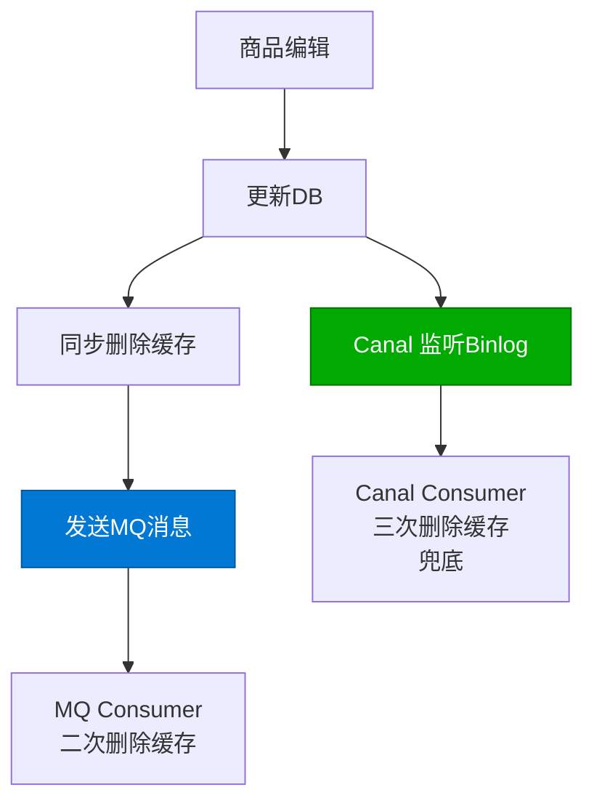

```java
@Service
public class ProductDetailService {

    @Autowired
    private ProductRepository productRepository;

    @Autowired
    private StringRedisTemplate redisTemplate;

    @Autowired
    private RabbitTemplate rabbitTemplate;

    private static final String CACHE_PREFIX = "product:detail:";
    private static final Duration CACHE_TTL = Duration.ofMinutes(30);

    @Transactional
    public void updateProduct(Product product) {
        // 1. 更新数据库
        productRepository.save(product);

        // 2. 同步删除缓存
        var cacheKey = CACHE_PREFIX + product.getId();
        redisTemplate.delete(cacheKey);

        // 3. 发送 MQ 消息（异步二次删除）
        rabbitTemplate.convertAndSend("cache.invalidation", "product",
            new CacheInvalidationMessage("product", product.getId()));
    }

    public Product getProduct(Long id) {
        var cacheKey = CACHE_PREFIX + id;
        var cached = redisTemplate.opsForValue().get(cacheKey);

        if (cached != null) {
            return deserialize(cached);
        }

        // 缓存miss，查DB
        var product = productRepository.findById(id).orElse(null);
        if (product != null) {
            // 随机过期防雪崩
            var randomTTL = CACHE_TTL.plus(
                Duration.ofSeconds(ThreadLocalRandom.current().nextLong(-300, 300)));

            redisTemplate.opsForValue().set(cacheKey,
                serialize(product), randomTTL);
        }
        return product;
    }
}
```

### 案例 2：金融账户余额

**场景**：账户余额，要求强一致性，不能出现超扣。

**方案**：读写锁 + Fencing Token + 补偿对账

```java
@Service
public class AccountBalanceService {

    @Autowired
    private RedissonClient redisson;

    @Autowired
    private AccountRepository accountRepository;

    @Autowired
    private StringRedisTemplate redisTemplate;

    /**
     * 查询余额（读锁保护）
     */
    public BigDecimal getBalance(Long accountId) {
        RReadWriteLock rwLock = redisson.getReadWriteLock("rwlock:account:" + accountId);

        rwLock.readLock().lock();
        try {
            var cached = redisTemplate.opsForValue().get("account:balance:" + accountId);
            if (cached != null) {
                return new BigDecimal(cached);
            }

            var account = accountRepository.findById(accountId).orElseThrow();
            redisTemplate.opsForValue().set(
                "account:balance:" + accountId,
                account.getBalance().toPlainString(),
                30, TimeUnit.MINUTES);

            return account.getBalance();
        } finally {
            rwLock.readLock().unlock();
        }
    }

    /**
     * 扣减余额（写锁 + Fencing Token）
     */
    @Transactional
    public void deductBalance(Long accountId, BigDecimal amount, long fencingToken) {
        RReadWriteLock rwLock = redisson.getReadWriteLock("rwlock:account:" + accountId);

        rwLock.writeLock().lock();
        try {
            // 1. 校验 Fencing Token
            var currentToken = redisTemplate.opsForValue()
                .get("fencing:account:" + accountId);
            if (currentToken != null && Long.parseLong(currentToken) > fencingToken) {
                throw new TokenExpiredException("Token已过期，存在更新的操作");
            }

            // 2. 更新 Fencing Token
            redisTemplate.opsForValue().set(
                "fencing:account:" + accountId,
                String.valueOf(fencingToken),
                1, TimeUnit.HOURS);

            // 3. 乐观锁扣减数据库
            int updated = accountRepository.deductBalance(accountId, amount);
            if (updated == 0) {
                throw new InsufficientBalanceException("余额不足");
            }

            // 4. 删除缓存
            redisTemplate.delete("account:balance:" + accountId);

        } finally {
            rwLock.writeLock().unlock();
        }
    }
}
```

### 案例 3：社交平台用户资料

**场景**：用户修改资料后，其他用户查看时需要看到最新数据，但允许短暂不一致（1~5 秒）。

**方案**：先更新DB + MQ 异步删缓存 + 补偿

```csharp
public class UserProfileService
{
    private readonly IUserRepository _repo;
    private readonly IDistributedCache _cache;
    private readonly IProducer<string, string> _producer;

    public async Task UpdateProfileAsync(UserProfile profile)
    {
        // 1. 更新数据库
        await _repo.UpdateProfileAsync(profile);

        // 2. 同步删除缓存
        await _cache.RemoveAsync($"user:profile:{profile.UserId}");

        // 3. 发送 MQ 消息（异步二次删除）
        var message = JsonSerializer.Serialize(new
        {
            TableName = "user_profile",
            Id = profile.UserId,
            Action = "DELETE",
            Timestamp = DateTimeOffset.UtcNow.ToUnixTimeMilliseconds()
        });

        await _producer.ProduceAsync("cache-invalidation",
            new Message<string, string>
            {
                Key = profile.UserId.ToString(),
                Value = message
            });
    }

    public async Task<UserProfile?> GetProfileAsync(long userId)
    {
        var cacheKey = $"user:profile:{userId}";

        return await _cache.GetOrCreateAsync(cacheKey, async () =>
        {
            var profile = await _repo.GetProfileAsync(userId);
            return profile;
        }, TimeSpan.FromMinutes(15));
    }
}
```

### 案例 4：库存扣减

**场景**：秒杀场景下扣减库存，不能超卖，需要强一致性。

**方案**：Redis 预扣 + Lua 原子操作 + 异步同步DB

```lua
-- stock_deduct.lua
-- KEYS[1]: 库存Key
-- ARGV[1]: 扣减数量
-- ARGV[2]: 请求ID（防重）

-- 1. 检查是否已处理
if redis.call('sismember', KEYS[1] .. ':processed', ARGV[2]) == 1 then
    return -2  -- 重复请求
end

-- 2. 获取当前库存
local stock = tonumber(redis.call('get', KEYS[1]))
if stock == nil then
    return -1  -- 库存Key不存在
end

-- 3. 检查库存是否充足
if stock < tonumber(ARGV[1]) then
    return 0  -- 库存不足
end

-- 4. 扣减库存
redis.call('decrby', KEYS[1], ARGV[1])

-- 5. 记录已处理
redis.call('sadd', KEYS[1] .. ':processed', ARGV[2])
redis.call('expire', KEYS[1] .. ':processed', 3600)

-- 返回剩余库存
return stock - tonumber(ARGV[1])
```

```java
@Service
public class StockService {

    @Autowired
    private StringRedisTemplate redisTemplate;

    @Autowired
    private StockRepository stockRepository;

    @Autowired
    private RabbitTemplate rabbitTemplate;

    private final DefaultRedisScript<Long> deductScript;

    public StockService() {
        deductScript = new DefaultRedisScript<>();
        deductScript.setLocation(new ClassPathResource("lua/stock_deduct.lua"));
        deductScript.setResultType(Long.class);
    }

    /**
     * 预扣库存（Redis 原子操作）
     */
    public StockResult deductStock(Long productId, int quantity, String requestId) {
        var result = redisTemplate.execute(
            deductScript,
            List.of("stock:" + productId),
            String.valueOf(quantity),
            requestId
        );

        return switch (result.intValue()) {
            case -2 -> StockResult.duplicate("重复请求");
            case -1 -> StockResult.notFound("库存不存在");
            case 0  -> StockResult.insufficient("库存不足");
            default -> {
                // 预扣成功，异步同步到数据库
                asyncSyncToDB(productId, quantity, requestId);
                yield StockResult.success(result);
            }
        };
    }

    private void asyncSyncToDB(Long productId, int quantity, String requestId) {
        rabbitTemplate.convertAndSend("stock.sync", "deduct",
            new StockSyncMessage(productId, quantity, requestId));
    }
}
```

## 一致性方案选型矩阵

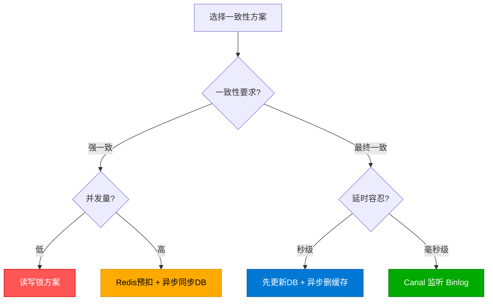

| 业务场景 | 一致性要求 | 推荐方案 | 不一致窗口 |
|---------|-----------|---------|-----------|
| 金融余额 | 强一致 | 读写锁 + Fencing Token | 0 |
| 库存扣减 | 强一致 | Redis 预扣 + Lua + 异步同步 | 0（预扣阶段） |
| 商品详情 | 最终一致 | 先更新DB + MQ 异步删缓存 | < 1s |
| 用户资料 | 最终一致 | 先更新DB + Canal 监听 Binlog | < 3s |
| 浏览量 | 弱一致 | Write Behind 异步写 | < 30s |

## 小结

::: important 核心原则
1. **先更新DB，再删缓存**：大多数场景的最佳实践
2. **延时双删是补丁**：不如 Canal/MQ 可靠
3. **Canal 是最优解之一**：对业务零侵入，保证最终一致（但需注意秒级延迟和部署复杂度）
4. **强一致有代价**：读写锁会大幅降低性能，只在必要时使用
5. **自检工具不能少**：定时检测不一致，主动修复
6. **Fencing Token 保底**：无论哪种方案，都建议加 Fencing Token 防止并发冲突
:::

| 方案 | 一致性 | 延迟 | 侵入性 | 复杂度 | 可靠性 |
|------|--------|------|--------|-------|--------|
| 先更新DB+删缓存 | 最终一致 | ~ms | 低 | 低 | 中 |
| 延时双删 | 最终一致 | ~500ms | 低 | 中 | 中 |
| Canal Binlog | 最终一致 | ~1-3s | 无 | 高 | 高 |
| MQ 异步刷新 | 最终一致 | ~100ms | 中 | 中 | 高 |
| 读写锁 | 强一致 | 0 | 高 | 高 | 高 |

## 参考资料

- [Cache Aside Pattern - Martin Fowler](https://martin.kleppmann.com/2016/02/08/how-to-do-distributed-locking.html)
- [Canal 官方文档](https://github.com/alibaba/canal)
- [Redis 分布式锁与数据一致性](https://redis.io/docs/manual/patterns/distributed-locks/)
- [数据库与缓存一致性方案解读 - 美团技术团队](https://tech.meituan.com/)
- [How to do distributed locking - Martin Kleppmann](https://martin.kleppmann.com/2016/02/08/how-to-do-distributed-locking.html)
- [Fencing Token 模式](https://martin.kleppmann.com/2016/02/08/how-to-do-distributed-locking.html)
